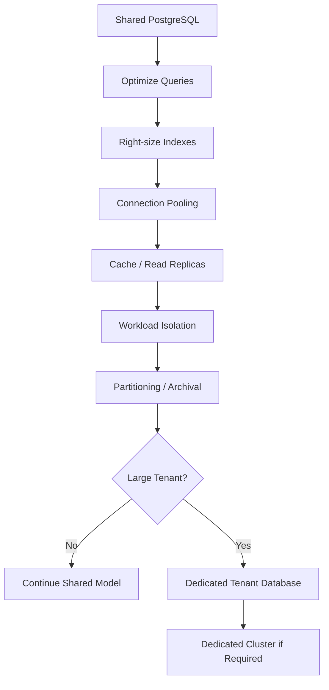
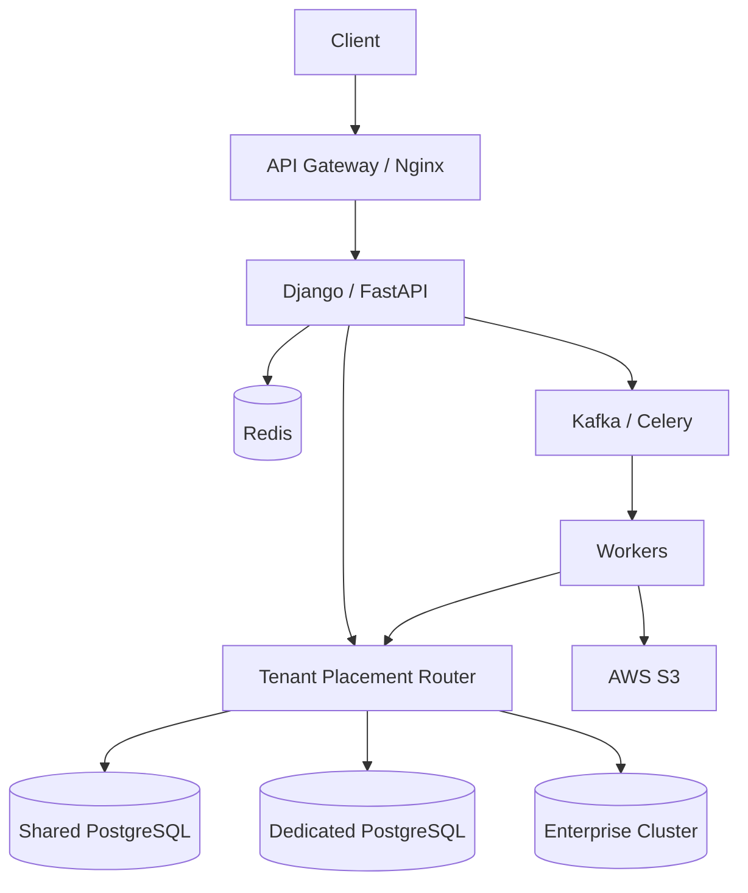

# 09- Scaling Strategy

## Overview

Scaling a multi-tenant SaaS database is primarily a problem of **data growth, workload growth, tenant skew, and resource isolation**.

A shared PostgreSQL database can support a large number of tenants, but the scaling strategy must evolve as the workload changes:

```text
Shared schema
    ↓
Query + index optimization
    ↓
Connection and workload management
    ↓
Read replicas / caching
    ↓
Partitioning / archival
    ↓
Tenant tiering
    ↓
Dedicated databases or clusters
```

The important architectural principle is:

> **Scale the simplest shared architecture until its measured constraints justify introducing the next isolation boundary.**

Prematurely creating a database per tenant increases operational complexity. Waiting too long to isolate a very large tenant can create noisy-neighbor and availability problems.

---

## Scaling Dimensions

A SaaS database can hit several independent limits.

| Dimension | Example pressure | Typical response |
|---|---|---|
| Row count | Billions of records | Indexing, partitioning, archival |
| Query rate | High API traffic | Caching, replicas, query optimization |
| Write rate | Heavy ingestion | Batching, partitioning, workload separation |
| Connections | Many application pods | Pooling, PgBouncer |
| CPU | Expensive queries | Query optimization, scaling instance |
| I/O | Large scans | Indexes, storage scaling, partitioning |
| WAL | High write volume | Reduce write amplification, replica planning |
| Tenant size | One tenant dominates | Tenant isolation |
| Background work | Exports/backfills | Queues and dedicated workers |
| Availability | Large blast radius | HA and workload isolation |

Scaling should therefore be driven by the actual bottleneck.

---

## Multi-Tenant Scaling Model

A shared-schema SaaS database commonly starts with:

```text
                    PostgreSQL
                        |
        +---------------+---------------+
        |               |               |
     Tenant A        Tenant B        Tenant C
      10K rows        50K rows        20K rows
```

As the product grows:

```text
                    PostgreSQL
                        |
        +---------------+---------------+
        |               |               |
     Tenant A        Tenant B        Tenant C
      10K rows       50M rows         20K rows
                         |
                         ↓
                 Noisy Neighbor
```

Eventually the architecture may evolve into:

```text
Small / medium tenants
        ↓
Shared database

Large tenants
        ↓
Dedicated database

Exceptional tenants
        ↓
Dedicated cluster / region
```

This is commonly called **tenant tiering** or a **hybrid tenancy model**.

---

## Scaling Strategy

A practical progression is:



Each step introduces additional operational complexity.

---

## Start With a Shared Schema

For many SaaS applications, the initial architecture should be:

```text
              Application
                   |
                   v
          Connection Pool
                   |
                   v
       +----------------------+
       | PostgreSQL            |
       |----------------------|
       | tenants               |
       | users                 |
       | projects              |
       | invoices              |
       | audit_logs            |
       +----------------------+
```

Every tenant-owned table contains:

```sql
tenant_id UUID NOT NULL
```

Example:

```sql
CREATE TABLE projects (
    id UUID PRIMARY KEY,
    tenant_id UUID NOT NULL,
    name TEXT NOT NULL,
    created_at TIMESTAMPTZ NOT NULL DEFAULT now()
);
```

Shared-schema tenancy provides:

- Simple deployment.
- Simple migrations.
- Efficient infrastructure utilization.
- Easy cross-tenant administration.
- Lower operational cost.

Its main risk is that all tenants share the same database resources.

---

## Why Shared Schema Scales Well Initially

If 10,000 tenants each have relatively small workloads, separate databases create unnecessary overhead:

```text
10,000 tenants
    ↓
10,000 databases
    ↓
10,000 sets of:
    backups
    monitoring
    migrations
    connections
    credentials
```

A shared database can instead use:

```text
1 PostgreSQL cluster
+
tenant_id
+
RLS
+
tenant-aware indexes
```

The operational difference can be substantial.

---

## Tenant-Aware Indexing

The most important indexes should reflect tenant-scoped access patterns.

For:

```sql
SELECT
    id,
    name,
    created_at
FROM projects
WHERE tenant_id = $1
ORDER BY created_at DESC, id DESC
LIMIT 50;
```

use:

```sql
CREATE INDEX projects_tenant_created_idx
ON projects (
    tenant_id,
    created_at DESC,
    id DESC
);
```

This allows PostgreSQL to efficiently locate the requested tenant's ordered rows.

---

## Composite Index Design

Index design should follow real query patterns.

For:

```sql
WHERE tenant_id = $1
  AND status = $2
ORDER BY created_at DESC, id DESC
```

a candidate index is:

```sql
CREATE INDEX projects_tenant_status_created_idx
ON projects (
    tenant_id,
    status,
    created_at DESC,
    id DESC
);
```

Do not blindly create every possible combination.

Each index adds:

- Storage.
- WAL.
- Write amplification.
- Vacuum work.
- Replication overhead.
- Maintenance cost.

---

## Keyset Pagination

Large SaaS collections should generally avoid deep offsets.

Avoid:

```sql
SELECT
    id,
    name
FROM audit_logs
WHERE tenant_id = $1
ORDER BY created_at DESC
OFFSET 1000000
LIMIT 100;
```

Prefer:

```sql
SELECT
    id,
    name,
    created_at
FROM audit_logs
WHERE tenant_id = $1
  AND (created_at, id) < ($2, $3)
ORDER BY created_at DESC, id DESC
LIMIT 100;
```

with:

```sql
CREATE INDEX audit_logs_tenant_created_idx
ON audit_logs (
    tenant_id,
    created_at DESC,
    id DESC
);
```

Keyset pagination provides more predictable behavior for large tenant datasets.

---

## Data Volume Growth

Data volume should be monitored per tenant.

Useful measurements include:

```text
rows per tenant
storage per tenant
daily row growth
write rate
read rate
largest tables
largest tenants
audit data growth
index size
```

Example:

```text
Tenant A
  5M rows
  4 GB

Tenant B
  500M rows
  400 GB
```

The second tenant may require a different scaling strategy even if both use the same schema.

---

## Tenant Growth Rate

Absolute size is not the only concern.

Consider:

```text
Tenant A
10M rows
+10K/day

Tenant B
10M rows
+5M/day
```

Tenant B will reach architectural limits much sooner.

Track both:

```text
current size
+
growth rate
```

Capacity planning should estimate future state rather than reacting only after saturation.

---

## Noisy Neighbor Problem

A noisy neighbor is a tenant whose workload disproportionately consumes shared resources.

Example:

```text
Tenant A → normal API traffic
Tenant B → large export
Tenant C → bulk ingestion
Tenant D → normal API traffic
```

Tenant B can consume:

```text
CPU
I/O
connections
temporary files
WAL
buffer cache
locks
```

RLS does not prevent this.

Therefore:

> **Security isolation and resource isolation are separate concerns.**

---

## Resource Isolation

Introduce application-level controls:

```text
per-tenant rate limits
per-tenant quotas
export concurrency limits
background job limits
API page-size limits
batch-size limits
```

Example:

```text
Interactive API
    ↓
strict latency budget

Large export
    ↓
Celery
    ↓
limited concurrency

Analytics
    ↓
reporting workload
```

This prevents expensive operations from consuming all shared database capacity.

---

## Connection Pool Scaling

Suppose:

```text
30 Kubernetes pods
```

and each has:

```text
10 database connections
```

Potential maximum:

```text
30 × 10 = 300 connections
```

If Celery workers add another 200:

```text
300 + 200 = 500
```

The database may become connection-bound before CPU or storage reaches capacity.

Calculate connection capacity across the entire platform:

```text
API pods
+
workers
+
admin tools
+
migration jobs
+
monitoring
```

---

## PgBouncer

PgBouncer can reduce the number of PostgreSQL server-side connections.

Typical architecture:

```text
Django / FastAPI pods
        |
        v
 Application pool
        |
        v
    PgBouncer
        |
        v
 PostgreSQL
```

Transaction pooling can be effective for high-concurrency APIs.

However, session-specific state requires careful handling.

For tenant context, prefer transaction-local state:

```sql
BEGIN;

SET LOCAL app.tenant_id = '...';

SELECT ...
FROM projects;

COMMIT;
```

Do not depend on persistent connection state when using transaction pooling.

---

## Query Optimization Before Horizontal Scaling

Before adding infrastructure, investigate:

```text
slow queries
N+1 queries
missing indexes
bad join cardinality
large sorts
large aggregations
deep OFFSET
unbounded queries
lock waits
connection saturation
```

Use:

```sql
EXPLAIN (ANALYZE, BUFFERS)
SELECT
    id,
    name
FROM projects
WHERE tenant_id = $1
ORDER BY created_at DESC, id DESC
LIMIT 50;
```

Scaling hardware does not fix fundamentally inefficient query patterns.

---

## Read Replicas

Read replicas can offload read-heavy workloads:

```text
                    PostgreSQL Primary
                         |
              +----------+----------+
              |                     |
              v                     v
         API Writes            Read Replica
                                   |
                                   v
                             Read Workloads
```

Good candidates include:

- Read-heavy APIs.
- Reporting.
- Search-like workloads.
- Historical queries.

Do not assume every read can safely use a replica.

---

## Read-After-Write Consistency

Consider:

```text
POST /projects
    ↓
Primary
    ↓
201 Created

GET /projects
    ↓
Replica
    ↓
Project not visible yet
```

Replication lag can cause this.

A common strategy is:

```text
writes
    → primary

read-after-write
    → primary

eventually consistent reads
    → replica
```

Consistency requirements should determine routing.

---

## Redis Caching

Redis can reduce repeated reads:

```text
API
 ↓
Redis
 ↓ cache miss
PostgreSQL
```

Tenant-specific cache keys must include tenant scope when necessary:

```text
tenant:{tenant_id}:project:{project_id}
```

Avoid keys that can accidentally mix tenant-specific state.

Caching is a performance mechanism, not the primary security boundary.

---

## Cache Invalidation

Caching introduces consistency complexity.

A write may require:

```text
PostgreSQL update
        ↓
invalidate cache
```

Possible mechanisms include:

- Explicit invalidation.
- TTL.
- Event-driven invalidation.
- Write-through patterns.

For transactional data, PostgreSQL remains the source of truth.

---

## Background Workload Isolation

Do not run large exports directly inside HTTP requests.

Prefer:

```text
POST /exports
      |
      v
Create export job
      |
      v
Celery / Kafka
      |
      v
Worker
      |
      v
PostgreSQL
      |
      v
AWS S3
```

The API remains responsive while the expensive operation is handled asynchronously.

---

## Export Strategy

Large exports should be:

- Asynchronous.
- Bounded.
- Restartable.
- Idempotent.
- Rate-limited.

Avoid:

```text
HTTP request
    ↓
SELECT millions of rows
    ↓
serialize JSON
    ↓
return response
```

Prefer:

```text
HTTP request
    ↓
create job
    ↓
worker reads bounded batches
    ↓
write file to S3
    ↓
client downloads result
```

---

## Batch Processing

Large backfills should avoid one enormous transaction.

Use bounded batches:

```sql
SELECT id
FROM events
WHERE tenant_id = $1
  AND id > $2
ORDER BY id
LIMIT 1000;
```

Persist progress where the operation must survive:

- Worker restart.
- Deployment.
- Database connection failure.
- Pod eviction.

For critical long-running jobs, durable progress should not depend on a temporary table or application memory.

---

## `SKIP LOCKED`

For concurrent database workers:

```sql
SELECT id
FROM jobs
WHERE status = 'PENDING'
ORDER BY id
FOR UPDATE SKIP LOCKED
LIMIT 100;
```

This allows multiple workers to claim different rows.

It is useful for queue-like workloads but does not replace proper queue architecture for every workload.

---

## Partitioning

Partitioning can help when tables become very large.

For time-series or audit data:

```text
audit_logs
    |
    +-- audit_logs_2026_01
    +-- audit_logs_2026_02
    +-- audit_logs_2026_03
```

Potential benefits:

- Partition pruning.
- Smaller indexes per partition.
- Easier retention.
- Faster archival.
- More manageable maintenance.

---

## Time-Based Partitioning

Time-based partitioning is often a good fit for:

```text
audit logs
events
usage records
metrics
activity history
```

Example:

```sql
CREATE TABLE audit_logs (
    id BIGINT NOT NULL,
    tenant_id UUID NOT NULL,
    created_at TIMESTAMPTZ NOT NULL,
    action TEXT NOT NULL
) PARTITION BY RANGE (created_at);
```

A partition can then cover a specific time range.

---

## Tenant-Based Partitioning

Partitioning directly by tenant can appear attractive:

```text
tenant A → partition A
tenant B → partition B
tenant C → partition C
```

But thousands or millions of tenants make this operationally unattractive.

Problems include:

- Large partition counts.
- More metadata.
- More indexes.
- More maintenance.
- Complex migrations.
- Difficult tenant lifecycle management.

Do not equate multi-tenancy with "one partition per tenant."

---

## Archival

Historical data can consume most of a database.

A common strategy is:

```text
Hot data
    ↓
PostgreSQL

Cold historical data
    ↓
AWS S3 / archive storage
```

For example:

```text
0–12 months
    → PostgreSQL

12+ months
    → archival storage
```

Retention requirements should come from product, legal, and compliance requirements.

---

## Soft Delete and Data Growth

Soft deletes preserve rows:

```sql
UPDATE projects
SET deleted_at = now()
WHERE id = $1
  AND tenant_id = $2;
```

But deleted rows still consume storage and may remain in indexes.

For active-row queries:

```sql
CREATE INDEX projects_active_tenant_created_idx
ON projects (
    tenant_id,
    created_at DESC,
    id DESC
)
WHERE deleted_at IS NULL;
```

For very large historical datasets, archival or physical deletion may eventually be necessary.

---

## Tenant Tiering

A useful scaling model is:

| Tenant tier | Typical architecture |
|---|---|
| Small | Shared database |
| Medium | Shared database |
| Large | Shared or dedicated database |
| Enterprise | Dedicated database |
| Exceptional | Dedicated cluster |

Tiering criteria may include:

```text
storage
requests/sec
concurrent users
write rate
background workload
compliance
availability requirements
```

Avoid basing tiering on a single metric.

---

## Dedicated Tenant Database

A large tenant can be moved to its own database:

```text
                   Tenant Router
                  /      |       \
                 /       |        \
                v        v         v
          Shared DB   Shared DB   Dedicated DB
             |          |             |
          Tenants     Tenants      Enterprise
```

Advantages:

- Strong resource isolation.
- Independent scaling.
- Independent maintenance windows.
- Reduced noisy-neighbor impact.
- Tenant-specific backup/restore.

Limitations:

- More infrastructure.
- More connection management.
- More migrations.
- More monitoring.
- More failover complexity.

---

## Tenant Routing

A control-plane table can map tenants to database locations:

```text
tenant_id
database_cluster
database_name
region
tier
status
```

Conceptually:

```text
Request
   ↓
Authenticate
   ↓
Resolve tenant
   ↓
Resolve tenant placement
   ↓
Select database
   ↓
Execute query
```

The routing layer becomes a critical control-plane dependency.

Cache placement metadata carefully, but retain an authoritative source of truth.

---

## Hybrid Database Architecture

A mature platform may look like:



The application should not need tenant-specific business logic duplicated across database locations.

---

## Database Placement Control Plane

A placement record might look conceptually like:

```sql
CREATE TABLE tenant_placements (
    tenant_id UUID PRIMARY KEY,
    tier TEXT NOT NULL,
    cluster_id TEXT NOT NULL,
    database_name TEXT NOT NULL,
    region TEXT NOT NULL,
    status TEXT NOT NULL
);
```

The exact implementation depends on the deployment architecture.

Important properties include:

- Unique tenant ownership.
- Controlled state transitions.
- Auditable changes.
- Strong authorization.
- Reliable migration workflows.

---

## Tenant Migration Between Databases

Moving a tenant from shared to dedicated infrastructure is a distributed operational process.

A simplified lifecycle is:

```text
Prepare destination
        ↓
Initial data copy
        ↓
Continuous synchronization
        ↓
Validate counts/checksums
        ↓
Quiesce tenant writes
        ↓
Final synchronization
        ↓
Switch routing
        ↓
Validate application
        ↓
Retire old tenant data
```

The exact migration mechanism may use:

- Logical replication.
- Application-level dual writes in carefully controlled migrations.
- Bulk export/import.
- CDC pipelines.
- Specialized migration tooling.

Avoid ad-hoc scripts for critical tenant migrations.

---

## Tenant Migration Consistency

A migration must answer:

```text
What happens to writes during migration?
What happens to reads?
How is the final state verified?
What happens if the routing switch fails?
Can the migration be resumed?
Can it be rolled back?
How long is the write freeze?
```

A successful copy is not enough.

The routing change is part of the data migration.

---

## Sharding

Sharding distributes data across independent database nodes.

Conceptually:

```text
                 Tenant Router
                      |
        +-------------+-------------+
        |             |             |
        v             v             v
      Shard 1       Shard 2       Shard 3
   Tenants A-D    Tenants E-H    Tenants I-L
```

For multi-tenant SaaS, tenant identity is a natural shard key because most application queries are tenant-scoped.

---

## Choosing a Shard Key

A good shard key should provide:

- High query locality.
- Predictable routing.
- Reasonable distribution.
- Low cross-shard query requirements.
- Stable ownership.

`tenant_id` is often attractive because:

```text
tenant request
    ↓
determine shard
    ↓
query one shard
```

However, a very large tenant can still overload one shard.

---

## Hot Shards

Suppose:

```text
Shard 1 → 500 small tenants
Shard 2 → 500 small tenants
Shard 3 → one massive tenant
```

Shard 3 may become a hotspot.

Therefore shard distribution should consider both:

```text
tenant count
+
tenant workload
```

Weighted placement can be more useful than simple tenant-count balancing.

---

## Cross-Tenant Queries

Shared-schema databases make administrative queries easier:

```sql
SELECT
    tenant_id,
    COUNT(*)
FROM projects
GROUP BY tenant_id;
```

Sharding makes such operations more expensive because data is distributed.

This creates an architectural trade-off:

| Requirement | Shared DB | Sharded DB |
|---|---:|---:|
| Tenant isolation | Good with RLS | Strong |
| Cross-tenant queries | Easy | Harder |
| Operational simplicity | High | Lower |
| Horizontal scaling | Limited | Strong |
| Noisy-neighbor isolation | Limited | Strong |
| Migration complexity | Lower | Higher |

---

## Cross-Tenant Analytics

Do not make operational shards responsible for unlimited analytics.

For large systems:

```text
Operational PostgreSQL
        ↓
CDC / Kafka
        ↓
Analytics platform
        ↓
Reports / dashboards
```

AWS S3 and a warehouse or query engine can provide a more appropriate analytical path.

This keeps OLTP workloads focused on transactional operations.

---

## Read and Write Scaling

A useful architecture separates workload types:

```text
Writes
  ↓
Primary PostgreSQL

Normal reads
  ↓
Primary / replicas

Cacheable reads
  ↓
Redis

Heavy reports
  ↓
Reporting system

Large exports
  ↓
Celery workers + S3
```

The objective is not simply to add replicas, but to prevent incompatible workloads from competing.

---

## Application Scaling

Database scaling and application scaling must be coordinated.

Adding more Kubernetes pods:

```text
10 pods
    ↓
50 pods
```

can increase:

- Database connections.
- Query concurrency.
- Lock contention.
- Cache misses.
- Background work.

Horizontal application scaling can therefore make a database bottleneck worse.

---

## Backpressure

When the database approaches capacity, the system needs backpressure.

Possible mechanisms include:

```text
rate limiting
queueing
concurrency limits
circuit breakers
request shedding
job prioritization
tenant quotas
```

Example:

```text
Database utilization high
        ↓
Reduce export concurrency
        ↓
Preserve interactive API capacity
```

This is preferable to allowing every workload to continue until the database becomes unavailable.

---

## Capacity Planning

Track trends rather than point-in-time values.

Useful measurements:

```text
CPU utilization
storage growth
IOPS
IO latency
connections
transactions/sec
queries/sec
WAL generation
replication lag
table growth
index growth
largest tenant
tenant growth rate
```

Capacity planning should estimate:

```text
current capacity
+
growth rate
+
peak multiplier
+
failure capacity
```

---

## Headroom

Do not operate production databases at permanent saturation.

Capacity should account for:

```text
normal traffic
+
peak traffic
+
background jobs
+
maintenance
+
failover
```

A system that uses nearly all capacity during normal operation may fail when traffic increases or a replica disappears.

---

## Autoscaling Considerations

Application autoscaling is straightforward compared with database autoscaling.

Kubernetes can scale API pods based on metrics, but PostgreSQL cannot safely be treated as an infinitely elastic component.

Scaling a database instance may involve:

- Storage constraints.
- Connection changes.
- Failover.
- Cache loss.
- I/O characteristics.
- Maintenance windows.
- Replication effects.

Database capacity planning should therefore be proactive.

---

## High Availability

A production SaaS database should normally have:

```text
Primary
   |
   +---- Standby / Replica
```

with automated or operationally well-defined failover.

Application components should tolerate:

```text
connection failure
transaction failure
retryable serialization errors
temporary unavailability
```

Do not retry every database error indiscriminately.

---

## Disaster Recovery

Scaling strategy must include recovery strategy.

Important questions:

```text
How much data can be lost?
How quickly must service recover?
Can a single tenant be restored independently?
Can an entire cluster be restored?
Can tenant routing be reconstructed?
```

For dedicated tenants, independent backups can simplify tenant-level recovery.

For shared databases, restoring one tenant is generally more complicated.

---

## Tenant-Level Restore

Enterprise customers may require:

```text
restore tenant to point-in-time state
```

This is significantly harder in a shared database.

Potential strategies include:

- Logical tenant-level exports.
- Dedicated backup streams.
- Restore to temporary infrastructure followed by tenant extraction.
- Dedicated databases for tenants with strict recovery requirements.

The recovery model can therefore influence tenancy architecture.

---

## Security During Scaling

Scaling must not weaken tenant isolation.

Important controls include:

```text
RLS
least-privileged roles
tenant-aware authorization
parameterized queries
tenant-aware cache keys
database routing authorization
encrypted connections
encrypted backups
audit logging
```

When a tenant moves between databases, verify that:

```text
permissions
RLS assumptions
credentials
network policies
backup policies
monitoring
```

remain correct.

---

## Observability

Metrics should identify infrastructure pressure without creating excessive high-cardinality telemetry.

Useful dimensions include:

```text
database
cluster
workload
endpoint
operation
tenant tier
```

Tenant IDs may be useful for targeted diagnostics, but should not automatically become unbounded metric labels.

Use logs or tracing for detailed tenant-specific investigation when appropriate.

---

## Performance SLOs

Define service-level targets such as:

```text
API p95 latency
API p99 latency
database query latency
error rate
replication lag
job completion time
export completion time
```

Then relate them to tenant classes.

For example:

```text
Interactive API p95 < target
Large export completion < target
Replica lag < target
```

Performance requirements should be measurable before architectural changes are made.

---

## Scaling Triggers

Define explicit thresholds for architectural decisions.

Example framework:

| Signal | Possible action |
|---|---|
| High query latency | Optimize queries/indexes |
| High CPU | Optimize or scale database |
| High read load | Replica/cache |
| High write load | Optimize/batch/partition |
| Large audit table | Partition/archive |
| Connection saturation | Pooling/PgBouncer |
| One tenant dominates | Tenant tiering |
| Cross-cluster pressure | Sharding |
| Analytics contention | Reporting platform |

Thresholds should be based on measured workload and SLOs.

---

## Migration to Dedicated Tenant Infrastructure

A mature platform should automate tenant placement.

A possible control-plane workflow:

```text
Tenant qualifies
      ↓
Capacity check
      ↓
Provision destination
      ↓
Run migration
      ↓
Validate data
      ↓
Switch routing
      ↓
Monitor
      ↓
Decommission old placement
```

Infrastructure can be provisioned with CI/CD or infrastructure-as-code.

Docker and Kubernetes can provide standardized deployment environments, while AWS can provide managed PostgreSQL infrastructure and supporting storage/networking.

---

## Cost Considerations

Every scaling layer adds cost.

| Strategy | Cost impact | Operational complexity |
|---|---:|---:|
| Query optimization | Low | Low |
| Better indexes | Low–medium | Low |
| Redis | Medium | Medium |
| Read replicas | Medium | Medium |
| Partitioning | Medium | Medium |
| Reporting platform | Medium–high | High |
| Dedicated DB | High | High |
| Sharding | High | Very high |

The correct strategy is usually the least complex architecture that satisfies the required SLOs.

---

## Common Scaling Mistakes

### Scaling Hardware Before Fixing Queries

A larger instance may temporarily hide inefficient SQL.

**Fix:** inspect query plans and workload characteristics first.

### Treating Tenant Count as the Main Scaling Metric

10,000 tiny tenants can be easier than one 500 GB tenant.

**Fix:** track tenant size, traffic, and growth rate.

### Assuming RLS Provides Resource Isolation

RLS protects data access but does not limit CPU or I/O consumption.

**Fix:** implement resource controls separately.

### One Database Per Tenant Too Early

This creates substantial operational overhead.

**Fix:** start with shared infrastructure and introduce tenant tiers when justified.

### Creating One Partition Per Tenant

Large tenant counts can create excessive partition-management overhead.

**Fix:** partition according to workload characteristics, often by time.

### Unlimited Worker Concurrency

Celery or Kafka consumers can overwhelm PostgreSQL.

**Fix:** bound worker concurrency and database connections.

### Sending All Reads to Replicas

Replication lag can cause stale reads.

**Fix:** route according to consistency requirements.

### Using Redis as a Database

Caching does not replace transactional durability.

**Fix:** PostgreSQL remains authoritative for transactional state.

### Sharding Too Early

Distributed databases introduce:

```text
routing
cross-shard queries
migration
observability
failure handling
```

**Fix:** introduce sharding only when a single database architecture has measured limits that require it.

### Ignoring Recovery Requirements

A system may scale well but still have unacceptable recovery behavior.

**Fix:** design backup, restore, failover, and tenant-level recovery alongside scaling.

---

## Senior Scaling Decision Framework

When the database approaches capacity, ask:

```text
What resource is saturated?
        ↓
CPU?
I/O?
connections?
locks?
storage?
WAL?
        ↓
Is the workload inefficient?
        ↓
Can query/index design solve it?
        ↓
Can caching reduce reads?
        ↓
Can replicas isolate reads?
        ↓
Can background work be moved asynchronously?
        ↓
Can partitioning control data growth?
        ↓
Is one tenant causing disproportionate load?
        ↓
Can that tenant be isolated?
        ↓
Are cross-tenant workloads forcing shared infrastructure?
        ↓
Is sharding justified?
        ↓
Are recovery and operational requirements satisfied?
```

This prevents scaling decisions from becoming a simple "increase database size" exercise.

---

## Production Checklist

### Database

- [ ] Query latency is monitored.
- [ ] Tenant-aware indexes support major access paths.
- [ ] Index growth is monitored.
- [ ] Database CPU and I/O have sufficient headroom.
- [ ] Connection limits are calculated globally.
- [ ] Long transactions are monitored.
- [ ] Lock waits and deadlocks are monitored.

### Tenant Workloads

- [ ] Tenant size is measurable.
- [ ] Tenant growth rate is measurable.
- [ ] Noisy-neighbor workloads can be identified.
- [ ] Large exports are asynchronous.
- [ ] Background concurrency is bounded.
- [ ] Tenant quotas exist where appropriate.

### Read Scaling

- [ ] Read replicas have clear use cases.
- [ ] Replica lag is monitored.
- [ ] Read-after-write behavior is defined.
- [ ] Redis caching has tenant-safe keys.

### Data Growth

- [ ] Large historical tables have a retention strategy.
- [ ] Partitioning is used only where justified.
- [ ] Audit/event data has archival policies.
- [ ] Large deletes are performed safely.

### Tenant Isolation

- [ ] Tenant placement is centrally managed.
- [ ] Dedicated tenant databases have standardized provisioning.
- [ ] Tenant migration is restartable and auditable.
- [ ] Routing changes are validated.
- [ ] Security controls survive tenant migration.

### Reliability

- [ ] PostgreSQL HA is configured.
- [ ] Failover has been tested.
- [ ] Backups are validated.
- [ ] Disaster recovery is tested.
- [ ] Tenant-level recovery requirements are understood.

---

## Interview Traps

### "How would you scale a multi-tenant PostgreSQL database?"

A strong answer should not immediately say "sharding."

Start with:

```text
query optimization
→ indexing
→ connection management
→ caching
→ workload isolation
→ replicas
→ partitioning
→ tenant tiering
→ sharding
```

Explain why each layer is introduced.

### "Should every tenant have its own database?"

Not necessarily.

Shared databases are operationally simpler and cost-efficient for many tenants. Dedicated databases become valuable when tenants have exceptional resource, compliance, availability, or recovery requirements.

### "Does RLS solve noisy neighbors?"

No.

RLS is primarily a row-access security mechanism. It does not enforce CPU, memory, I/O, connection, or query-rate quotas.

### "When should you shard by tenant?"

When measured workload and capacity constraints require horizontal distribution and the organization can support the operational complexity.

### "What is the biggest scaling mistake?"

Treating scaling as an infrastructure-only problem.

A senior solution considers:

```text
query design
data model
indexes
tenant distribution
workload isolation
application concurrency
database capacity
operational complexity
cost
reliability
recovery
```

## Key Takeaways

- **Scale a shared PostgreSQL architecture incrementally: optimize queries and indexes first, then introduce pooling, caching, replicas, workload isolation, partitioning, and tenant-specific infrastructure as measured constraints require them.**
- **Tenant count alone is a poor scaling metric; tenant size, growth rate, request volume, write rate, and background workload determine the real pressure on shared resources.**
- **RLS provides data-access isolation, not resource isolation; noisy neighbors require quotas, rate limits, bounded worker concurrency, workload separation, and eventually dedicated infrastructure when necessary.**
- **Tenant tiering provides a practical path from shared databases to dedicated databases or clusters without forcing every tenant into an expensive isolated architecture.**
- **Senior scaling decisions balance performance, security, reliability, recovery, operational complexity, and cost rather than optimizing for database throughput alone.**