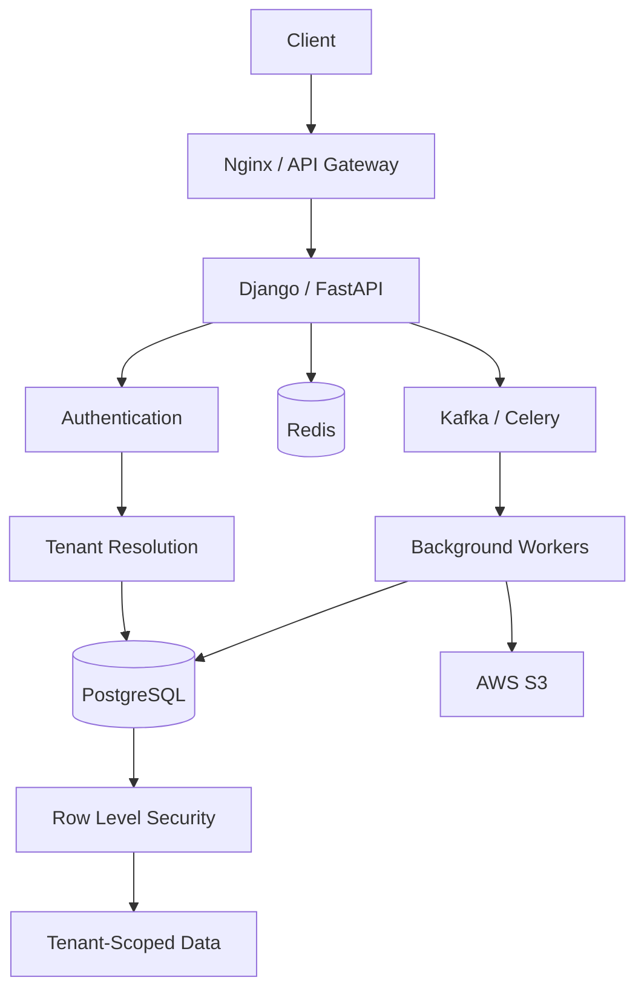

# README

## Overview

This project implements a production-oriented **multi-tenant SaaS database** using PostgreSQL and modern backend patterns.

The central problem is not simply storing data for multiple customers. The database must provide strong **tenant isolation**, predictable query performance, safe concurrency, operational scalability, and a clear path from a shared database to dedicated infrastructure when tenant workloads justify it.

The project focuses on a shared-schema architecture with:

- A central `tenants` entity.
- Tenant-scoped application data.
- PostgreSQL Row Level Security (RLS).
- Tenant-aware indexes and query patterns.
- Secure pagination.
- Performance and workload isolation.
- Horizontal scaling and tenant tiering.
- A practical migration path toward dedicated databases.

The project is designed to connect SQL knowledge with real backend engineering using PostgreSQL, Django/FastAPI, Redis, Kafka, Celery, Docker, Kubernetes, and AWS.

## Navigation

- [01- Requirements](./01-%20Requirements.md) — SaaS platform scope, tenant requirements, and isolation goals
- [02- Tenant Data Model](./02-%20Tenant%20Data%20Model.md) — Tenant entity design and shared-schema data architecture
- [03- Tenant Isolation Strategies](./03-%20Tenant%20Isolation%20Strategies.md) — Shared schema vs schema-per-tenant vs database-per-tenant trade-offs
- [04- Query Patterns](./04-%20Query%20Patterns.md) — Tenant-scoped query patterns for safe and efficient data access
- [05- Indexing Strategy](./05-%20Indexing%20Strategy.md) — Tenant-aware composite index design
- [06- Row Level Security](./06-%20Row%20Level%20Security.md) — PostgreSQL RLS policies for database-enforced tenant isolation
- [07- Pagination](./07-%20Pagination.md) — Tenant-scoped keyset and offset pagination patterns
- [08- Performance Considerations](./08-%20Performance%20Considerations.md) — Noisy neighbor effects, query performance, and workload isolation
- [09- Scaling Strategy](./09-%20Scaling%20Strategy.md) — Tenant tiering, dedicated databases, and the path to horizontal scaling

---

## Project Goals

The database should demonstrate how to design and operate a SaaS platform where:

```text
Tenant A
    |
    +-- Users
    +-- Projects
    +-- Documents
    +-- Audit Logs

Tenant B
    |
    +-- Users
    +-- Projects
    +-- Documents
    +-- Audit Logs
```

while ensuring:

```text
Tenant A cannot access Tenant B data
```

The design should also remain practical when:

```text
10 tenants
      ↓
1,000 tenants
      ↓
10,000+ tenants
      ↓
large enterprise tenants
```

---

## Architecture

The baseline architecture uses a shared PostgreSQL database.



The important security boundary is enforced at multiple layers:

```text
Authentication
      ↓
Tenant Resolution
      ↓
Application Authorization
      ↓
PostgreSQL RLS
      ↓
Tenant-Scoped Data
```

Application checks should not be treated as the only protection against cross-tenant access.

---

## Document Map

| File | Purpose |
|---|---|
| `01- Requirements.md` | Functional, security, performance, reliability, and operational requirements |
| `02- Tenant Data Model.md` | Tenant entity, tenant-owned entities, relationships, constraints, and schema design |
| `03- Tenant Isolation Strategies.md` | Shared schema, database-per-tenant, schema-per-tenant, hybrid isolation, and trade-offs |
| `04- Query Patterns.md` | Common tenant-aware SQL query patterns and backend access patterns |
| `05- Indexing Strategy.md` | Tenant-aware indexes, composite indexes, partial indexes, and scaling implications |
| `06- Row Level Security.md` | PostgreSQL RLS policies, roles, tenant context, security boundaries, and operational considerations |
| `07- Pagination.md` | Offset and keyset pagination for tenant-scoped APIs |
| `08- Performance Considerations.md` | Query performance, connection management, caching, workload isolation, and database bottlenecks |
| `09- Scaling Strategy.md` | Scaling shared PostgreSQL infrastructure, tenant tiering, dedicated databases, and sharding |

---

## Core Domain Model

The central entity is the tenant.

```text
Tenant
  |
  +-- Users
  |
  +-- Projects
  |
  +-- Documents
  |
  +-- API Keys
  |
  +-- Subscriptions
  |
  +-- Usage Records
  |
  +-- Audit Logs
```

Tenant-owned tables should generally contain:

```sql
tenant_id UUID NOT NULL
```

For example:

```sql
CREATE TABLE projects (
    id UUID PRIMARY KEY,
    tenant_id UUID NOT NULL,
    name TEXT NOT NULL,
    created_at TIMESTAMPTZ NOT NULL DEFAULT now()
);
```

The tenant relationship should normally be represented with a foreign key:

```sql
ALTER TABLE projects
ADD CONSTRAINT projects_tenant_fk
FOREIGN KEY (tenant_id)
REFERENCES tenants(id);
```

This provides relational integrity independently of application code.

---

## Tenant Isolation Model

The default model is:

```text
One PostgreSQL database
        |
        +-- tenants
        |
        +-- users
        |
        +-- projects
        |
        +-- documents
        |
        +-- audit_logs
```

Tenant isolation is enforced through:

```text
tenant_id
+
application authorization
+
PostgreSQL RLS
+
appropriate database roles
```

This is different from simply adding:

```sql
WHERE tenant_id = $1
```

to every query.

Application-level filtering is useful, but RLS provides a database-level enforcement mechanism.

---

## Row Level Security

RLS allows PostgreSQL to enforce row visibility and modification rules.

Conceptually:

```text
Application
     |
     | tenant context
     v
PostgreSQL
     |
     v
RLS Policy
     |
     +---- Tenant A rows → allowed
     |
     +---- Tenant B rows → rejected / invisible
```

A typical policy can use transaction-local application context:

```sql
CREATE POLICY projects_tenant_isolation
ON projects
USING (
    tenant_id = current_setting('app.tenant_id', true)::uuid
);
```

The exact role and policy design must be completed as part of the project's security model.

---

## Tenant Context

A request should establish tenant context before accessing tenant-owned data.

Conceptually:

```text
HTTP request
    ↓
Authenticate user
    ↓
Determine tenant
    ↓
Authorize membership
    ↓
BEGIN
    ↓
SET LOCAL app.tenant_id = ...
    ↓
Execute queries
    ↓
COMMIT
```

Using `SET LOCAL` is important when connection pooling is involved because the setting is scoped to the current transaction.

Example:

```sql
BEGIN;

SET LOCAL app.tenant_id = '00000000-0000-0000-0000-000000000001';

SELECT id, name
FROM projects
ORDER BY created_at DESC;

COMMIT;
```

Persistent session state is dangerous when pooled connections can be reused by different requests.

---

## Application and Database Responsibilities

A robust architecture separates responsibilities.

| Responsibility | Application | Database |
|---|---:|---:|
| Authentication | Yes | No |
| Tenant resolution | Yes | No |
| Business authorization | Yes | Partially |
| Tenant row isolation | Yes | Yes |
| Foreign keys | No | Yes |
| Unique constraints | No | Yes |
| Referential integrity | No | Yes |
| Transactional atomicity | Coordinates | Enforces |
| Data validation | Yes | Yes |
| Audit persistence | Coordinates | Stores |

The application determines **who the user is and which tenant they belong to**.

The database provides a final enforcement boundary for tenant-scoped rows.

---

## Tenant-Aware Query Patterns

Every tenant-scoped query should make its tenant boundary obvious.

```sql
SELECT
    id,
    name,
    created_at
FROM projects
WHERE tenant_id = $1
ORDER BY created_at DESC, id DESC
LIMIT 50;
```

For RLS-protected tables, the application can rely on the database policy for row filtering while still writing tenant-aware queries where useful for clarity and query planning.

Avoid application patterns where tenant filtering is optional:

```python
Project.objects.filter(status="ACTIVE")
```

if the underlying model can be queried without a tenant boundary and RLS is not guaranteed.

Prefer an explicit tenant-aware repository/service abstraction or a correctly configured database security context.

---

## Unique Constraints

Multi-tenant uniqueness must be designed deliberately.

Global uniqueness:

```sql
CREATE UNIQUE INDEX users_email_global_idx
ON users (lower(email));
```

Tenant-scoped uniqueness:

```sql
CREATE UNIQUE INDEX projects_tenant_name_idx
ON projects (
    tenant_id,
    lower(name)
);
```

These have different semantics.

| Requirement | Constraint |
|---|---|
| Email globally unique | `UNIQUE(email)` |
| Project name unique within tenant | `UNIQUE(tenant_id, name)` |
| External ID unique per tenant | `UNIQUE(tenant_id, external_id)` |
| API key globally unique | Global unique constraint |

Do not assume every identifier should be globally unique.

---

## Cross-Tenant Data

Some data is naturally global:

```text
plans
currencies
feature definitions
system configuration
```

Other data is tenant-owned:

```text
projects
users
documents
subscriptions
usage
audit logs
```

The schema should make this distinction explicit.

A global table should not unnecessarily carry `tenant_id`.

A tenant-owned table should not omit tenant identity simply because the current application happens to know it indirectly.

---

## Relationship Design

Tenant ownership should remain obvious through relationships.

For example:

```text
tenant
  |
  +-- project
        |
        +-- project_member
        |
        +-- document
```

For complex relationships, consider whether tenant identity should be directly stored on child tables.

Direct tenant identity can improve:

- RLS policy simplicity.
- Query filtering.
- Index design.
- Authorization checks.
- Operational diagnostics.

The trade-off is additional redundant-looking data that must remain consistent.

---

## Foreign Key Integrity

A foreign key should enforce the ownership relationship.

For example:

```sql
CREATE TABLE projects (
    id UUID PRIMARY KEY,
    tenant_id UUID NOT NULL REFERENCES tenants(id),
    name TEXT NOT NULL
);
```

For relationships between two tenant-owned entities, consider composite ownership constraints where the relationship itself must guarantee that both records belong to the same tenant.

This prevents application bugs from creating relationships such as:

```text
Project → Tenant A
Document → Tenant B
```

when the relationship is supposed to be tenant-local.

---

## Query Patterns Covered

The project should provide examples for:

- Tenant lookup.
- Tenant-scoped point lookup.
- Tenant-scoped list queries.
- Tenant-scoped filtering.
- Tenant-scoped aggregation.
- Tenant-scoped joins.
- Existence checks.
- Latest row per tenant.
- Top-N per tenant.
- Keyset pagination.
- Soft deletion.
- Tenant-scoped upserts.
- Idempotency.
- Audit queries.
- Usage reporting.
- Background processing.
- Data exports.

---

## Pagination

Large tenant datasets should use bounded pagination.

Offset pagination:

```sql
SELECT id, name
FROM projects
WHERE tenant_id = $1
ORDER BY created_at DESC, id DESC
LIMIT 50
OFFSET 5000;
```

is simple but becomes increasingly expensive at deep offsets.

Keyset pagination:

```sql
SELECT id, name, created_at
FROM projects
WHERE tenant_id = $1
  AND (created_at, id) < ($2, $3)
ORDER BY created_at DESC, id DESC
LIMIT 50;
```

is generally preferable for large collections.

The supporting index should match the access path.

---

## Indexing Strategy

A common tenant-aware index begins with `tenant_id`.

Example:

```sql
CREATE INDEX projects_tenant_created_idx
ON projects (
    tenant_id,
    created_at DESC,
    id DESC
);
```

For:

```sql
WHERE tenant_id = $1
  AND status = $2
ORDER BY created_at DESC, id DESC
```

a candidate index is:

```sql
CREATE INDEX projects_tenant_status_created_idx
ON projects (
    tenant_id,
    status,
    created_at DESC,
    id DESC
);
```

Indexes should be created from actual query patterns rather than from every column independently.

---

## Performance Model

A tenant-aware query must remain efficient as the shared database grows.

Important factors include:

```text
tenant cardinality
tenant size distribution
query selectivity
index selectivity
data locality
table size
index size
connection concurrency
lock contention
replication lag
cache hit rate
```

A query that performs well with:

```text
100K rows
```

may behave very differently with:

```text
1B rows
```

especially when one tenant owns a large percentage of the data.

---

## Noisy Neighbors

Tenant isolation does not automatically mean resource isolation.

A large tenant can generate:

```text
millions of API requests
large exports
bulk writes
heavy reports
long-running queries
large transactions
```

This can affect other tenants.

Controls include:

- Tenant-level rate limits.
- API quotas.
- Background job limits.
- Export concurrency limits.
- Query timeouts.
- Connection limits.
- Workload queues.
- Tenant tiering.

---

## Redis

Redis can reduce repeated database reads.

Tenant-specific keys should preserve tenant boundaries:

```text
tenant:{tenant_id}:project:{project_id}
```

Avoid generic keys for tenant-specific data:

```text
project:{project_id}
```

when the identifier is not globally unique or when authorization depends on tenant context.

Redis should remain a cache or supporting data store unless the specific data model is deliberately designed around Redis.

---

## Kafka

Kafka can separate high-volume event processing from interactive database traffic.

```text
PostgreSQL
    |
    v
Outbox
    |
    v
Kafka
    |
    +-- Analytics
    +-- Notifications
    +-- Search indexing
    +-- Usage processing
```

Tenant identity should be carried in event payloads or metadata where consumers need it.

Example:

```json
{
  "event_type": "project.created",
  "tenant_id": "tenant-123",
  "project_id": "project-456"
}
```

Consumers must preserve tenant boundaries when processing these events.

---

## Celery and Background Jobs

Large tenant workloads should not block API requests.

Example:

```text
POST /exports
      |
      v
Create export job
      |
      v
Celery
      |
      v
Worker
      |
      v
Tenant-scoped PostgreSQL queries
      |
      v
AWS S3
```

Workers should carry tenant context explicitly.

A job payload should identify the tenant and resource scope required for processing.

---

## Django Integration

A Django application can centralize tenant handling.

Conceptually:

```python
from django.db import connection, transaction


def run_for_tenant(tenant_id, operation):
    with transaction.atomic():
        with connection.cursor() as cursor:
            cursor.execute(
                "SELECT set_config('app.tenant_id', %s, true)",
                [str(tenant_id)],
            )

        return operation()
```

The exact implementation should be integrated with the project's authentication, authorization, middleware, and transaction model.

The critical property is that tenant context is established **inside the transaction** used by tenant-scoped queries.

---

## FastAPI Integration

FastAPI can resolve tenant context through dependencies:

```text
Request
   ↓
Authentication dependency
   ↓
Tenant dependency
   ↓
Database transaction
   ↓
SET LOCAL tenant context
   ↓
Repository
```

Avoid accepting an arbitrary `tenant_id` from the request body and treating it as trusted authorization input.

The tenant should be derived from authenticated identity and authorized membership.

---

## Microservices

In a microservice architecture, tenant context should be propagated across service boundaries.

```text
API Gateway
    ↓
Service A
    ↓
Service B
    ↓
Database
```

Useful metadata can include:

```text
tenant_id
request_id
user_id
trace_id
```

However, propagating `tenant_id` does not make it trusted.

Each service should validate that the caller is authorized to operate on that tenant.

---

## REST APIs

A tenant-aware API should make ownership semantics clear.

Example:

```http
GET /v1/projects/{project_id}
```

The server should resolve:

```text
authenticated user
        ↓
authorized tenant
        ↓
project
        ↓
tenant ownership
```

Do not assume that possession of a resource ID grants access.

A secure query can combine identity and resource ownership:

```sql
SELECT id, name
FROM projects
WHERE id = $1
  AND tenant_id = $2;
```

---

## gRPC

The same principles apply to gRPC.

Tenant context can be propagated through authenticated metadata, but the receiving service must still validate authorization.

A typical flow is:

```text
gRPC metadata
      ↓
Authentication
      ↓
Tenant authorization
      ↓
Database context
      ↓
RLS
```

Do not treat client-supplied tenant metadata as inherently trustworthy.

---

## Security Model

The project should use defense in depth:

```text
TLS
 ↓
Authentication
 ↓
Authorization
 ↓
Tenant Resolution
 ↓
Application Query Scoping
 ↓
PostgreSQL Role
 ↓
RLS
 ↓
Constraints
```

Important controls include:

- Least-privileged database roles.
- Parameterized queries.
- RLS.
- Safe tenant context handling.
- Tenant-aware cache keys.
- Tenant-aware event payloads.
- Audit logging.
- Encrypted backups.
- Encrypted database connections.

---

## PostgreSQL Roles

Avoid using a single unrestricted database role for every application operation.

A production design should distinguish responsibilities where practical:

```text
migration role
application role
read-only reporting role
administrative role
```

RLS behavior depends on PostgreSQL role attributes and table ownership.

Be particularly careful with:

- Superusers.
- Roles with `BYPASSRLS`.
- Table owners.
- `SECURITY DEFINER` functions.

A policy is not an effective security boundary if the application connects using a role that can bypass it.

---

## Connection Pooling

Connection pooling is essential for high-concurrency SaaS systems.

Potential architecture:

```text
Django / FastAPI
      |
Application Pool
      |
PgBouncer
      |
PostgreSQL
```

When transaction pooling is used, session-specific tenant state is especially dangerous.

Prefer:

```sql
SET LOCAL app.tenant_id = ...
```

inside each transaction rather than relying on persistent connection state.

---

## High Availability

A production PostgreSQL deployment should provide an HA strategy:

```text
Application
     |
     v
Primary PostgreSQL
     |
     v
Standby / Replica
```

The application should handle:

- Connection failures.
- Retryable transaction errors.
- Failover.
- Replica lag.
- Temporary unavailability.

Retries must be limited and must distinguish retryable failures from permanent failures.

---

## Disaster Recovery

The project should define:

```text
RPO
RTO
backup retention
point-in-time recovery
restore procedures
tenant-level recovery requirements
```

A backup that has never been restored is not a proven recovery strategy.

For shared databases, restoring one tenant independently is more complicated than restoring an entire database.

This should influence the tenancy architecture for customers with strict recovery requirements.

---

## Scaling Path

The recommended scaling progression is:

```text
Shared Schema
      ↓
Query Optimization
      ↓
Tenant-Aware Indexes
      ↓
Connection Pooling
      ↓
Redis / Read Replicas
      ↓
Workload Isolation
      ↓
Partitioning / Archival
      ↓
Tenant Tiering
      ↓
Dedicated Tenant Database
      ↓
Sharding / Dedicated Clusters
```

Do not jump directly to sharding.

Each step should be justified by measured workload characteristics.

---

## Tenant Tiering

A practical SaaS architecture can classify tenants:

| Tier | Typical strategy |
|---|---|
| Small | Shared database |
| Standard | Shared database |
| Large | Shared or dedicated |
| Enterprise | Dedicated database |
| Exceptional | Dedicated cluster |

Possible triggers include:

```text
storage
request rate
write rate
concurrent users
background jobs
compliance
availability requirements
recovery requirements
```

Tenant count alone is insufficient.

---

## Dedicated Tenant Databases

A large tenant can eventually move from:

```text
Shared PostgreSQL
```

to:

```text
Dedicated PostgreSQL
```

A placement control plane can track:

```text
tenant_id
tier
cluster
database
region
status
```

The application then resolves placement before opening the tenant-scoped database connection.

---

## Tenant Migration

Tenant migration should be treated as a controlled distributed operation.

```text
Provision destination
        ↓
Initial copy
        ↓
Synchronize changes
        ↓
Validate
        ↓
Quiesce writes
        ↓
Final sync
        ↓
Switch routing
        ↓
Validate
        ↓
Retire source
```

The process should be:

- Auditable.
- Restartable.
- Idempotent where possible.
- Observable.
- Reversible until the final cutover point.

---

## Sharding

If a single PostgreSQL cluster eventually becomes insufficient, tenant ID is often a natural shard key:

```text
tenant_id
    ↓
Tenant Router
    |
    +-- Shard 1
    +-- Shard 2
    +-- Shard 3
```

The primary benefit is query locality:

```text
Tenant request
    ↓
Determine shard
    ↓
Query one database
```

The trade-off is significant operational complexity.

Cross-tenant queries become distributed operations, and tenant placement becomes part of the system architecture.

---

## Analytics Architecture

Do not force large analytical workloads onto the transactional database.

A scalable pattern is:

```text
PostgreSQL
    ↓
CDC / Outbox
    ↓
Kafka
    ↓
S3 / Analytics Platform
    ↓
Reports
```

Operational PostgreSQL should prioritize:

```text
transactions
API reads/writes
authorization
tenant operations
```

while analytical infrastructure handles:

```text
large scans
aggregations
historical reporting
cross-tenant analytics
```

---

## Monitoring

Monitor the database at multiple levels.

### Database Metrics

Track:

```text
CPU
memory
storage
IOPS
I/O latency
connections
transactions/sec
query latency
WAL generation
replication lag
deadlocks
lock waits
```

### Tenant Metrics

Track:

```text
tenant storage
tenant growth rate
tenant request rate
tenant write rate
tenant background workload
tenant query latency
```

Avoid turning high-cardinality tenant IDs into unrestricted metric labels.

Use logs and traces for detailed tenant-level diagnosis where appropriate.

---

## Performance Testing

Testing should use realistic tenant distributions.

Do not benchmark only:

```text
1 tenant × 10,000 rows
```

Test scenarios such as:

```text
1,000 tenants × 10,000 rows
1 large tenant × 500M rows
many small tenants + one noisy tenant
high concurrent reads
high concurrent writes
large exports
background workers
replica lag
```

The workload distribution is often more important than the average tenant size.

---

## Production Review Checklist

### Data Model

- [ ] Tenant ownership is explicit.
- [ ] Tenant-owned tables contain appropriate tenant identity.
- [ ] Foreign keys enforce relationships.
- [ ] Tenant-scoped uniqueness is defined.
- [ ] Global and tenant-owned data are clearly separated.

### Security

- [ ] Authentication is enforced.
- [ ] Tenant authorization is enforced.
- [ ] RLS protects tenant-owned tables.
- [ ] Application roles cannot unintentionally bypass RLS.
- [ ] `BYPASSRLS` privileges are tightly controlled.
- [ ] Parameterized queries are used.
- [ ] Tenant context is transaction-scoped.
- [ ] Cache keys preserve tenant boundaries.

### Querying

- [ ] Major queries are tenant-aware.
- [ ] Pagination is bounded.
- [ ] Keyset pagination is used for large collections.
- [ ] Query plans are inspected.
- [ ] N+1 queries are eliminated.
- [ ] Large exports are asynchronous.

### Indexing

- [ ] Major tenant access paths have appropriate indexes.
- [ ] Composite index order matches query patterns.
- [ ] Redundant indexes are avoided.
- [ ] Index growth is monitored.
- [ ] Write amplification is considered.

### Operations

- [ ] Connection pooling is configured.
- [ ] Background concurrency is bounded.
- [ ] Database CPU and I/O have headroom.
- [ ] Lock waits and deadlocks are monitored.
- [ ] Slow queries are observable.
- [ ] Tenant growth is tracked.

### Reliability

- [ ] PostgreSQL HA is configured.
- [ ] Backups are automated.
- [ ] Point-in-time recovery is available where required.
- [ ] Restore procedures are tested.
- [ ] Failover has been tested.
- [ ] RPO/RTO are defined.

### Scaling

- [ ] Tenant size distribution is measurable.
- [ ] Noisy neighbors can be identified.
- [ ] Tenant tiering criteria are defined.
- [ ] Dedicated tenant placement can be supported if required.
- [ ] Tenant migration is auditable and restartable.
- [ ] Sharding is considered only after simpler scaling mechanisms are exhausted.

---

## Common Project Mistakes

### Treating `tenant_id` as the Entire Security Model

A column alone does not guarantee isolation.

**Better approach:**

```text
Application authorization
+
RLS
+
database privileges
+
constraints
```

### Forgetting Tenant Scope in Unique Constraints

A global unique constraint can incorrectly prevent two tenants from using the same legitimate identifier.

**Better approach:** explicitly decide whether uniqueness is global or tenant-scoped.

### Trusting Client-Supplied Tenant IDs

A request such as:

```json
{
  "tenant_id": "another-tenant"
}
```

must never automatically grant access.

**Better approach:** derive or validate tenant membership from authenticated identity.

### Using Session State With Transaction Pooling

Tenant context can leak between logical requests if persistent connection state is used incorrectly.

**Better approach:** use transaction-local settings such as `SET LOCAL`.

### Assuming RLS Solves Performance

RLS controls row visibility; it does not eliminate expensive queries, large sorts, locks, or resource contention.

**Better approach:** combine RLS with query optimization, indexing, workload isolation, and capacity planning.

### Creating One Database Per Tenant Immediately

This can produce excessive operational overhead.

**Better approach:** use shared infrastructure for most tenants and introduce dedicated placement based on measured requirements.

### Ignoring Large Tenants

A single tenant can dominate:

```text
storage
CPU
I/O
WAL
connections
background jobs
```

**Better approach:** monitor tenant distribution and support tenant tiering.

---

## Senior Engineering Perspective

The core architectural decision is not:

> "How do I put `tenant_id` on every table?"

The senior-level question is:

> "How do I guarantee tenant isolation while preserving correctness, query performance, operational simplicity, and a scalable migration path?"

That requires reasoning across several layers:

```text
Data model
    ↓
Constraints
    ↓
Queries
    ↓
Indexes
    ↓
RLS
    ↓
Connection management
    ↓
Application architecture
    ↓
Caching / messaging
    ↓
Operations
    ↓
Scaling
    ↓
Disaster recovery
```

A strong multi-tenant architecture makes tenant boundaries explicit throughout the entire system rather than relying on one mechanism.

---

## Project Completion Standard

The project should be considered complete when it can demonstrate:

- A coherent tenant-aware relational schema.
- Correct tenant ownership relationships.
- Explicit global vs tenant-scoped uniqueness.
- Secure PostgreSQL RLS policies.
- Correct transaction-scoped tenant context.
- Production-oriented tenant query patterns.
- Tenant-aware composite indexes.
- Keyset pagination.
- Query-plan analysis.
- Noisy-neighbor mitigation.
- Background workload isolation.
- Tenant-safe caching.
- Event-driven tenant context propagation.
- HA and backup strategy.
- Tenant growth monitoring.
- A documented scaling path.
- A practical tenant migration strategy.
- Security and failure testing.

The final implementation should demonstrate not only that tenant A cannot read tenant B's data, but also that the system remains performant, observable, recoverable, and operationally manageable as tenant count and tenant workload increase.

## Key Takeaways

- **Multi-tenancy is a system-wide architecture concern spanning schema design, queries, indexes, authorization, RLS, connection management, caching, messaging, and operations.**
- **Shared-schema PostgreSQL is an effective default for many SaaS workloads when combined with explicit tenant ownership, strong constraints, RLS, and tenant-aware query design.**
- **Tenant isolation and resource isolation are different problems; noisy neighbors require workload controls, quotas, background-job isolation, and eventually tenant tiering.**
- **A mature SaaS architecture should provide a controlled path from shared infrastructure to dedicated databases or clusters without redesigning the application around individual tenants.**
- **Security, performance, HA, disaster recovery, observability, and cost must be considered together when evaluating a multi-tenant database architecture.**