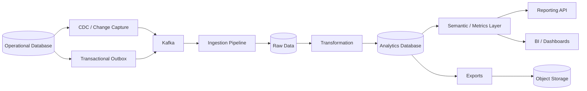
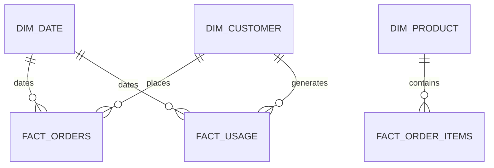
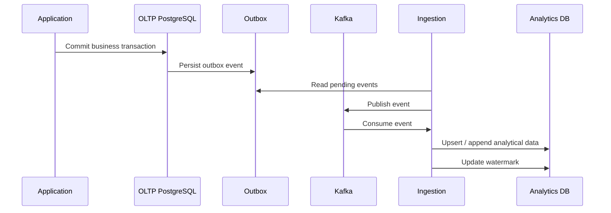
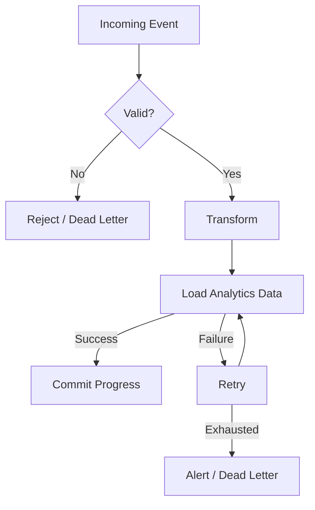

# 01- Requirements

## Overview

An Analytics and Reporting Database is designed to support analytical workloads that are fundamentally different from transactional application workloads.

A production SaaS, e-commerce, banking, or operational system typically generates data through OLTP databases and backend services. Analytics systems transform that operational data into historical, aggregated, and business-oriented datasets used for dashboards, reporting, forecasting, operational analysis, and decision-making.

The primary requirement is not simply to store more data. The system must provide:

- Reliable historical data.
- Consistent business metrics.
- Efficient analytical queries.
- Predictable reporting latency.
- Clear data freshness guarantees.
- Isolation from transactional workloads.
- Reproducible transformations.
- Secure access to sensitive data.
- Scalable storage and compute.
- High availability where required.
- Recoverability and auditable data pipelines.

The project therefore focuses on the requirements of a production analytics architecture rather than treating reporting as a collection of SQL queries against an OLTP database.

---

## Why an Analytics Database Exists

Transactional databases optimize primarily for workloads such as:

```text
INSERT order
UPDATE payment
SELECT customer
UPDATE inventory
INSERT audit event
```

Analytics workloads look different:

```text
Revenue by month
Orders by customer segment
Daily active users
Conversion rate
Average order value
Customer retention
Product performance
Tenant usage
Year-over-year growth
```

A typical analytical query may scan millions or billions of rows and perform:

```text
filtering
    ↓
joins
    ↓
aggregation
    ↓
grouping
    ↓
window calculations
    ↓
sorting
```

Running these workloads directly against an OLTP database can introduce unacceptable contention and resource consumption.

The analytics database therefore provides a dedicated workload boundary.

---

## Project Scope

The project should model a complete analytics and reporting workflow:



The exact implementation may vary, but the requirements should support this separation:

```text
Operational systems
        ↓
Data ingestion
        ↓
Raw / staging data
        ↓
Transformation
        ↓
Analytics model
        ↓
Reports / APIs / BI
```

---

## Functional Requirements

### Operational Data Ingestion

The system must be able to ingest data from one or more operational sources.

Supported source patterns may include:

- PostgreSQL.
- MySQL or other relational databases.
- Kafka events.
- Transactional outbox events.
- REST APIs.
- gRPC services.
- Application-generated event streams.
- Periodic files such as CSV or Parquet.

The ingestion layer should preserve enough source metadata to identify:

- Source system.
- Source table or event type.
- Source record identifier.
- Event timestamp.
- Ingestion timestamp.
- Operation type.
- Source version where applicable.

---

## Historical Data

Analytics systems must preserve historical information where business reporting depends on historical state.

For example, if a customer's segment changes:

```text
January   → SMB
February  → Enterprise
```

a historical report may need to answer:

> Which segment did this customer belong to when the transaction occurred?

The analytics model must therefore distinguish between:

```text
current operational state
```

and:

```text
historical analytical state
```

This may require slowly changing dimensions, snapshot tables, event history, or other temporal modeling techniques.

---

## Data Freshness

Every analytical dataset should have an explicit freshness expectation.

Example:

| Dataset | Freshness Target |
|---|---:|
| Operational dashboard | < 5 minutes |
| Usage dashboard | < 15 minutes |
| Daily finance report | < 1 hour after daily close |
| Executive dashboard | < 1 hour |
| Historical reporting | Daily |
| Large analytical exports | Batch |

Freshness must be measurable.

A system should expose information such as:

```text
source_watermark
ingestion_time
transformation_time
dataset_updated_at
```

A dashboard saying "updated recently" is insufficient for production operations.

---

## Data Correctness

Analytics results must be trustworthy.

The system should detect:

- Missing records.
- Duplicate records.
- Unexpected nulls.
- Referential integrity failures.
- Invalid timestamps.
- Negative values where prohibited.
- Unexpected status values.
- Duplicate business identifiers.
- Missing partitions.
- Transformation failures.

Data quality should be treated as a production requirement rather than an optional enhancement.

---

## Metric Consistency

Business metrics must have explicitly defined semantics.

For example:

```text
Revenue
```

could mean:

```text
gross order value
- discounts
- refunds
```

or:

```text
successful payment amount
```

These are not interchangeable.

Metric definitions should specify:

- Source data.
- Inclusion criteria.
- Exclusion criteria.
- Time semantics.
- Currency handling.
- Null handling.
- Deduplication rules.
- Refund treatment.
- Cancellation treatment.

A shared semantic definition prevents different dashboards from calculating the same metric differently.

---

## Reporting Requirements

The system should support common analytical workloads including:

- Aggregation.
- Grouping.
- Time-series analysis.
- Trend analysis.
- Ranking.
- Top-N queries.
- Cohort analysis.
- Retention analysis.
- Period-over-period comparisons.
- Running totals.
- Moving averages.
- Percent-of-total calculations.
- Customer segmentation.
- Product analysis.
- Revenue analysis.
- Operational reporting.

Example:

```sql
SELECT
    date_trunc('month', order_date) AS month,
    SUM(net_amount) AS revenue,
    COUNT(*) AS orders
FROM fact_orders
WHERE order_status = 'COMPLETED'
GROUP BY 1
ORDER BY 1;
```

The analytics model should make such queries efficient without requiring repeated reconstruction of complex operational joins.

---

## Time-Based Analysis

Time is a first-class analytical dimension.

The system should support:

```text
date
week
month
quarter
year
hour
day-of-week
fiscal period
```

Time semantics must be explicit.

Important requirements include:

- UTC storage where appropriate.
- Explicit timezone conversion for reporting.
- Business timezone support.
- Consistent calendar definitions.
- Fiscal calendar support where required.
- Event time versus ingestion time distinction.

Do not silently treat ingestion time as business event time.

---

## Late-Arriving Data

Events may arrive after their business event time.

For example:

```text
Event occurred:     10:00
Service received:   10:02
Kafka consumed:     10:03
Warehouse loaded:   10:05
```

A late event could instead arrive hours later because of:

- Network failure.
- Service outage.
- Retry.
- Mobile client disconnection.
- Backfill.
- Upstream correction.

The analytics pipeline must define how late-arriving records affect historical aggregates.

---

## Duplicate Data

Distributed pipelines commonly provide at-least-once delivery.

Therefore:

```text
same event
    ↓
delivered twice
```

must not automatically produce:

```text
double revenue
double usage
double transaction count
```

The system should define an idempotency strategy based on identifiers such as:

```text
event_id
source_id
source_record_id
event_version
```

Uniqueness constraints, merge logic, deduplication stages, or idempotent consumers may be used depending on the architecture.

---

## Data Model Requirements

The analytics database should support analytical modeling such as:

```text
Fact tables
    +
Dimension tables
    +
Aggregates / materialized datasets
```

A typical model might be:



The exact schema is implementation-specific, but the model should clearly distinguish:

- Measures.
- Dimensions.
- Business keys.
- Surrogate keys.
- Event timestamps.
- Load timestamps.
- Historical versions.

---

## Fact Table Requirements

Fact tables represent measurable business events or states.

Examples:

```text
fact_orders
fact_order_items
fact_payments
fact_usage
fact_sessions
fact_transactions
```

Each fact table should have a clearly documented grain.

Example:

```text
fact_order_items
=
one row per order line item
```

This is critical because aggregation correctness depends on understanding row grain.

A query that joins two one-to-many relationships without controlling cardinality can multiply measures.

---

## Dimension Requirements

Dimensions provide descriptive context.

Examples:

```text
dim_customer
dim_product
dim_date
dim_region
dim_plan
dim_tenant
```

Dimensions may require historical tracking.

For example:

```text
Customer
    |
    +-- Segment
    +-- Region
    +-- Plan
    +-- Industry
```

If historical reporting depends on changes to these attributes, the system should define whether the dimension is:

- Current-state only.
- Fully historical.
- Versioned.
- Snapshot-based.

---

## Slowly Changing Dimensions

Where historical attribute changes matter, the project should support an appropriate slowly changing dimension strategy.

A common pattern stores:

```text
effective_from
effective_to
is_current
```

Example:

```text
Customer 123
Enterprise
2026-01-01 → 2026-03-31

Customer 123
Strategic
2026-04-01 → NULL
```

The correct strategy depends on reporting requirements and data volume.

Do not introduce historical versioning solely because it is theoretically useful.

---

## Data Grain

Every fact and aggregate dataset must document its grain.

Examples:

| Dataset | Grain |
|---|---|
| `fact_orders` | One row per order |
| `fact_order_items` | One row per order item |
| `fact_daily_usage` | One row per tenant per day |
| `fact_monthly_revenue` | One row per customer per month |
| `dim_customer` | One current or versioned row per customer |

Grain should be treated as part of the dataset contract.

---

## Aggregation Requirements

The system should support pre-aggregation where repeated analytical queries justify it.

Examples:

```text
raw events
    ↓
daily usage
    ↓
monthly usage
```

or:

```text
order items
    ↓
daily revenue
    ↓
monthly revenue
```

Pre-aggregation can reduce expensive repeated scans but introduces:

- Refresh complexity.
- Freshness considerations.
- Additional storage.
- Backfill complexity.
- More data pipelines.

Use it when measured workload justifies the trade-off.

---

## Raw Data Requirements

Raw data should be retained where it provides operational or analytical value.

Raw data is useful for:

- Reprocessing.
- Backfills.
- Debugging.
- Auditing.
- Schema evolution.
- Recovering from transformation bugs.

A common architecture is:

```text
Raw
 ↓
Staging
 ↓
Curated
 ↓
Aggregated
```

Raw storage should not automatically become the primary reporting interface.

---

## Transformation Requirements

Transformations should be:

- Deterministic where possible.
- Version controlled.
- Testable.
- Observable.
- Restartable.
- Incremental where practical.

Examples include:

```text
normalize timestamps
deduplicate events
resolve business keys
join dimensions
calculate metrics
derive classifications
aggregate facts
```

Transformation logic should be treated as production code.

---

## Incremental Processing

The system should avoid repeatedly scanning all historical data when only recent data has changed.

Incremental processing can use:

```text
watermarks
event timestamps
source offsets
CDC positions
partition boundaries
change versions
```

For example:

```text
Last successful watermark
        ↓
Read source changes after watermark
        ↓
Transform
        ↓
Load
        ↓
Commit new watermark
```

The watermark itself must be durable and consistent with the processing outcome.

---

## Backfill Requirements

The system must support controlled historical backfills.

A backfill may be required when:

- A transformation contains a bug.
- A new metric is introduced.
- Historical source data is restored.
- A dimension attribute is corrected.
- A new dataset is created.

Backfills should not require manually modifying production rows one by one.

The design should support:

```text
bounded date ranges
restartability
idempotency
progress tracking
validation
```

---

## Data Retention

Retention policies should be defined per dataset.

Example:

| Data | Retention |
|---|---:|
| Raw events | 1–3 years |
| Curated facts | 3–7 years |
| Aggregated reports | 5–10 years |
| Temporary staging | Short-lived |
| Audit data | Compliance-dependent |

Actual values must be determined by business, legal, and compliance requirements.

Retention should consider:

- Storage cost.
- Query performance.
- Compliance.
- Backup cost.
- Restore duration.
- Historical reporting requirements.

---

## Partitioning Requirements

Large time-series or event tables should support partitioning where it materially improves:

- Data lifecycle management.
- Query pruning.
- Retention operations.
- Bulk loading.
- Archival.

Typical partition keys include:

```text
event_date
created_at
tenant_id
```

Time-based partitioning is often useful for historical analytics because retention and reporting are naturally time-oriented.

Partitioning should not be introduced without understanding query patterns and partition growth.

---

## Query Performance Requirements

The analytics database should support efficient execution of:

- Large scans.
- Aggregations.
- Joins.
- Window functions.
- Time-range filtering.
- Grouping.
- Sorting.
- Top-N queries.

Performance should be measured using realistic data volumes.

Important metrics include:

```text
query latency
rows scanned
rows returned
CPU
memory
I/O
spill-to-disk
concurrency
queue time
```

---

## PostgreSQL Requirements

PostgreSQL may be used as the analytics database for moderate workloads, especially when the team wants to reuse existing SQL and operational expertise.

Important capabilities include:

- PostgreSQL SQL.
- CTEs.
- Window functions.
- Aggregation.
- Materialized views.
- Partitioning.
- Parallel query execution.
- Indexes.
- `EXPLAIN`.
- JSON/JSONB where appropriate.

For workloads that exceed PostgreSQL's practical analytical capacity, the architecture should allow movement toward a dedicated analytical warehouse or lakehouse.

---

## OLTP and OLAP Separation

The architecture should explicitly determine whether reporting queries run against:

```text
OLTP database
```

or:

```text
Analytics database
```

The preferred production architecture for substantial workloads is:

```text
Application
    ↓
OLTP PostgreSQL
    ↓
CDC / Outbox
    ↓
Analytics Platform
```

This prevents large reporting queries from competing directly with user-facing transactions.

---

## Read Replicas

A PostgreSQL read replica can provide some read isolation:

```text
Primary
   |
   +--> Replica
          |
          +--> Reporting
```

However, a read replica is not automatically an analytics warehouse.

Limitations include:

- Replication lag.
- Shared underlying data model.
- Resource contention.
- Large scans consuming replica resources.
- Limited historical transformation capabilities.

Use a replica when the workload is still operationally relational and moderate.

Use a dedicated analytical store when workload characteristics require stronger isolation.

---

## Data Ingestion Architecture

The project should support asynchronous ingestion.

A typical event-driven architecture is:



The exact CDC or messaging implementation can differ, but the critical requirement is that business events are not lost between the transactional system and analytics pipeline.

---

## Kafka Requirements

Where Kafka is used, the pipeline should define:

- Topic ownership.
- Event schema.
- Event version.
- Partitioning strategy.
- Ordering requirements.
- Consumer offsets.
- Retry behavior.
- Dead-letter handling.
- Duplicate handling.
- Replay strategy.

Partitioning should support the required ordering semantics without creating unnecessary hot partitions.

---

## Event Schema Requirements

Events should contain enough metadata for reliable processing.

Example:

```json
{
  "event_id": "evt-123",
  "event_type": "order.completed",
  "event_version": 1,
  "occurred_at": "2026-09-05T10:15:00Z",
  "tenant_id": "tenant-123",
  "aggregate_id": "order-456",
  "payload": {
    "amount": "125.50",
    "currency": "USD"
  }
}
```

Schemas should be versioned.

Consumers should not assume that producers will never evolve event structures.

---

## Security Requirements

Analytics data often contains highly sensitive information.

The system should support:

- Authentication.
- Authorization.
- Least-privileged database roles.
- Encryption in transit.
- Encryption at rest.
- Sensitive-column controls.
- Audit logging.
- Tenant isolation where applicable.
- Secure exports.
- Controlled access to raw data.

Do not assume analytics systems are less sensitive because they are read-heavy.

They often contain a broader historical view of the organization.

---

## Multi-Tenant Analytics

For SaaS systems, analytics may need to operate at:

```text
tenant level
cross-tenant platform level
```

These are different authorization domains.

Tenant reports should enforce:

```text
tenant_id = authorized tenant
```

Platform-level reports require privileged access and should not accidentally expose tenant data through dashboards, exports, or APIs.

The analytics model should make tenant identity available wherever business reporting requires tenant-level filtering.

---

## PII Requirements

Sensitive attributes should be classified.

Examples:

```text
email
phone
address
payment information
identity documents
IP address
```

Possible controls include:

- Tokenization.
- Masking.
- Encryption.
- Restricted columns.
- Separate sensitive datasets.
- Role-based access.
- Retention limits.

Do not copy every OLTP column into analytics simply because it is available.

---

## API Requirements

A reporting API should provide:

- Authentication.
- Authorization.
- Bounded queries.
- Pagination where applicable.
- Explicit filters.
- Time-range limits.
- Request timeouts.
- Rate limiting.
- Stable response schemas.

Example:

```http
GET /v1/reports/revenue?from=2026-01-01&to=2026-09-01
```

The API should not allow arbitrary SQL or unrestricted analytical expressions from clients.

---

## Export Requirements

Large reports should be asynchronous.

Preferred pattern:

```text
POST /exports
      ↓
Create export job
      ↓
Celery / worker
      ↓
Analytics query
      ↓
Write Parquet / CSV
      ↓
AWS S3
      ↓
Short-lived download URL
```

Avoid keeping an HTTP request open while generating a multi-million-row export.

---

## Python Requirements

Python services may be used for:

- ETL orchestration.
- Data validation.
- API endpoints.
- Background processing.
- Export generation.
- Transformation jobs.

Libraries and implementation choices should be based on workload size.

For large datasets, avoid loading entire query results into Python memory when streaming, batching, SQL aggregation, or columnar processing can reduce resource usage.

---

## Pandas Requirements

Pandas can be useful for:

- Moderate-sized transformations.
- Data validation.
- Operational reporting.
- Small-to-medium exports.

It should not automatically be used for massive datasets.

This pattern is risky:

```python
df = pandas.read_sql("SELECT * FROM very_large_table", connection)
```

For large analytical workloads, prefer:

```text
SQL aggregation
+
partitioned processing
+
Parquet
+
distributed or warehouse-native execution
```

where appropriate.

---

## Django and FastAPI

Django/FastAPI applications should normally consume prepared analytical datasets rather than repeatedly reconstructing complex reports from OLTP tables.

Suitable architecture:

```text
Django / FastAPI
       ↓
Analytics Repository
       ↓
Analytics Database
       ↓
Curated Tables / Views
```

The reporting layer should have clear query boundaries and should not accidentally execute analytics queries against the transactional database.

---

## Redis Requirements

Redis can cache frequently requested analytical results.

Example:

```text
analytics:tenant:123:revenue:2026-09
```

Cache keys should encode all dimensions that affect the result.

Caching must define:

- TTL.
- Invalidation strategy.
- Staleness tolerance.
- Serialization format.
- Maximum object size.

Redis should not become the authoritative analytical store.

---

## Celery Requirements

Celery can execute:

- Scheduled reports.
- Data exports.
- Backfills.
- Aggregation refreshes.
- Data-quality checks.

Long-running jobs should be:

- Idempotent.
- Restartable.
- Observable.
- Bounded.
- Tenant-aware where applicable.

A failed worker should not require manually reconstructing processing state.

---

## Kubernetes Requirements

Kubernetes may run:

```text
API services
ETL workers
Celery workers
scheduled jobs
data validation jobs
```

Workload isolation should be explicit.

For example:

```text
API pods
    |
    +-- high priority

Analytics workers
    |
    +-- bounded concurrency

Backfill workers
    |
    +-- low priority
```

Backfills should not consume all database connections and starve user-facing workloads.

---

## AWS Requirements

A production implementation may use:

```text
RDS / Aurora PostgreSQL
        ↓
Kafka / MSK
        ↓
ETL / streaming processing
        ↓
S3
        ↓
Analytics warehouse / query engine
```

Potential AWS components include:

- Amazon RDS or Aurora PostgreSQL.
- Amazon MSK.
- Amazon S3.
- AWS Glue.
- Amazon Redshift.
- Athena.
- CloudWatch.
- IAM.
- KMS.

The final selection should be driven by workload, data volume, latency requirements, operational capability, and cost.

---

## High Availability Requirements

The analytics system should define its availability requirements independently from the OLTP system.

Not every reporting workload requires the same availability as customer transactions.

For example:

| Workload | Availability Requirement |
|---|---|
| Customer checkout | Very high |
| Operational dashboard | High |
| Internal daily report | Moderate |
| Historical analysis | Moderate |
| Batch export | Lower |

The architecture should avoid spending production infrastructure budget to provide unnecessary availability.

---

## Disaster Recovery

The system should define:

```text
RPO
RTO
backup retention
recovery procedure
reprocessing strategy
raw-data retention
```

A particularly important property of analytics systems is **rebuildability**.

If curated tables can be reconstructed from retained raw data, the raw layer becomes an important recovery mechanism.

---

## Observability Requirements

The pipeline should expose:

### Pipeline Metrics

```text
records received
records processed
records rejected
processing latency
consumer lag
watermark age
retry count
dead-letter count
```

### Database Metrics

```text
query latency
CPU
memory
I/O
connections
locks
temporary-file usage
storage
replication lag
```

### Data Quality Metrics

```text
duplicate count
null rate
referential failures
freshness
row-count variance
reconciliation differences
```

---

## Data Lineage

Reports should be traceable back to source datasets.

A useful lineage model is:

```text
Dashboard
   ↓
Metric
   ↓
Curated table
   ↓
Transformation
   ↓
Staging table
   ↓
Source event
   ↓
Operational system
```

Lineage helps answer:

- Where did this number come from?
- Which transformation produced it?
- Which source generated the record?
- When was the dataset refreshed?
- Which code version transformed it?

---

## Testing Requirements

The project should include several levels of testing.

### Unit Tests

Test:

- Transformation functions.
- Metric calculations.
- Parsing.
- Validation.
- Business rules.

### SQL Tests

Test:

- Aggregations.
- Joins.
- Null behavior.
- Duplicate handling.
- Historical logic.
- Date boundaries.

### Data Quality Tests

Test:

```text
uniqueness
not-null constraints
referential integrity
accepted values
freshness
row-count anomalies
```

### Integration Tests

Validate:

```text
source
 ↓
ingestion
 ↓
transformation
 ↓
analytics database
```

### Reconciliation Tests

Compare important analytical totals against trusted operational sources.

For example:

```text
OLTP completed payments
        vs
Analytics completed payments
```

Differences should be measurable and investigated.

---

## CI/CD Requirements

Data transformations and schema changes should be version controlled.

CI should validate:

- SQL syntax.
- Migration scripts.
- Transformation tests.
- Data-quality tests.
- Query correctness.
- Schema compatibility.

Deployment should support controlled promotion:

```text
development
    ↓
staging
    ↓
production
```

Avoid manually editing production analytical tables.

---

## Schema Evolution

The system should tolerate source schema evolution.

Potential changes include:

```text
new column
renamed field
removed field
new event version
changed enum
changed data type
```

Event and transformation contracts should define compatibility expectations.

For Kafka-style events, consumers should tolerate supported schema evolution rather than requiring simultaneous deployment of every producer and consumer.

---

## Cost Requirements

Analytics infrastructure can become expensive because of:

```text
storage
compute
data transfer
Kafka retention
S3 storage
warehouse queries
replicas
backups
```

Cost optimization should include:

- Partition pruning.
- Incremental processing.
- Compression.
- Columnar formats such as Parquet.
- Lifecycle policies.
- Query limits.
- Workload scheduling.
- Appropriate warehouse sizing.
- Avoiding unnecessary copies of data.

The cheapest architecture is not necessarily the most cost-effective if it causes operational failures or poor analyst productivity.

---

## Performance Targets

The project should define measurable targets.

Example:

| Workload | Target |
|---|---:|
| Simple dashboard query | < 1–2 seconds |
| Standard report | < 5 seconds |
| Complex analytical report | < 30 seconds |
| Scheduled export | Asynchronous |
| Data freshness | Defined per dataset |
| Pipeline recovery | Defined by RTO |
| Data loss | Defined by RPO |

These are example targets, not universal requirements.

Actual targets should be established from business expectations and measured workloads.

---

## Reliability Requirements

The system should handle:

- Duplicate events.
- Out-of-order events.
- Late-arriving data.
- Missing events.
- Consumer restarts.
- Worker failures.
- Database failures.
- Kafka outages.
- Transformation failures.
- Partial backfills.
- Schema changes.
- Network interruptions.

Processing should favor:

```text
idempotency
+
checkpointing
+
replayability
+
observability
```

over assumptions that every pipeline stage will execute exactly once.

---

## Failure Handling

A typical pipeline failure should be recoverable.



The checkpoint should only advance after the corresponding work has reached the required durable state.

---

## Common Requirements Mistakes

### Treating Analytics as Read-Only OLTP

Analytics has fundamentally different access patterns.

**Better approach:** design for scans, aggregation, historical analysis, and reporting concurrency.

### No Explicit Dataset Grain

Without grain, joins and aggregations become difficult to reason about.

**Better approach:** document the grain of every fact and aggregate dataset.

### No Freshness Contract

A dashboard without a freshness definition can appear correct while displaying stale information.

**Better approach:** define and monitor freshness per dataset.

### Assuming Exactly-Once Processing

Distributed systems frequently produce duplicate deliveries.

**Better approach:** design idempotent ingestion and transformation.

### Copying Every OLTP Column

This increases storage, security exposure, and transformation complexity.

**Better approach:** move only analytically useful data.

### Running Large Reports on OLTP

This can cause CPU, I/O, connection, and lock contention.

**Better approach:** isolate substantial analytical workloads.

### Using Pandas for Arbitrarily Large Datasets

Loading entire datasets into memory does not scale indefinitely.

**Better approach:** push aggregation to the database or use scalable data-processing infrastructure.

### No Backfill Strategy

Transformation bugs are inevitable in long-lived systems.

**Better approach:** retain enough source data and metadata to reproduce historical datasets.

### Mixing Event Time and Processing Time

A delayed event can be assigned to the wrong reporting period.

**Better approach:** model event time and ingestion time separately.

### Ignoring Metric Definitions

Two teams can produce different "revenue" values from the same source.

**Better approach:** establish governed metric definitions.

---

## Interview-Level Design Questions

A senior engineer should be able to explain:

### Why not query the OLTP database directly?

Because analytical scans and aggregations can consume resources needed by latency-sensitive transactional workloads.

### When is PostgreSQL enough?

When data volume, query complexity, concurrency, and freshness requirements remain within PostgreSQL's practical operating envelope.

### When should a warehouse be introduced?

When analytical workloads require stronger workload isolation, columnar execution, large-scale scans, distributed compute, or broader analytical capabilities.

### Why retain raw data?

For replay, debugging, backfills, auditability, and recovery from transformation defects.

### How do you handle duplicate events?

Use stable event identifiers and idempotent ingestion or merge semantics.

### How do you handle late-arriving events?

Preserve event time separately from ingestion time and define how historical aggregates are corrected.

### How do you prevent double counting?

Define dataset grain, understand join cardinality, deduplicate source events, and aggregate at the correct level before joining where necessary.

### How do you guarantee report correctness?

Use explicit metric definitions, data-quality checks, reconciliation, lineage, and controlled transformations.

### How do you scale exports?

Run them asynchronously, process in bounded batches, and write results to object storage rather than keeping a synchronous HTTP request open.

---

## Acceptance Criteria

The project requirements are satisfied when the implementation can demonstrate:

- A clearly defined analytics architecture.
- Separation between transactional and analytical workloads where required.
- Documented fact and dimension grains.
- Historical data handling.
- Explicit metric definitions.
- Defined freshness targets.
- Idempotent ingestion.
- Duplicate and late-event handling.
- Incremental processing.
- Restartable backfills.
- Data-quality validation.
- Reconciliation against trusted sources.
- Efficient analytical SQL.
- Appropriate partitioning and indexing.
- Secure access to sensitive analytical data.
- Tenant-aware reporting where applicable.
- Asynchronous large exports.
- Pipeline observability.
- Data lineage.
- CI/CD for SQL and transformations.
- HA and disaster recovery strategy.
- Defined RPO and RTO.
- Measurable performance and freshness targets.
- Documented cost controls.

---

## Recommended Project Structure

A practical project structure can be organized as:

```text
04- Analytics and Reporting Database/
│
├── 01- Requirements.md
├── 02- Source Data Model.md
├── 03- Analytics Schema.md
├── 04- Fact Tables.md
├── 05- Dimension Tables.md
├── 06- ETL and ELT Queries.md
├── 07- Reporting Queries.md
├── 08- Aggregation Strategy.md
├── 09- Window Function Reports.md
├── 10- Indexing Strategy.md
├── 11- Query Optimization.md
├── 12- Data Quality.md
├── 13- Incremental Processing.md
├── 14- Backfill Strategy.md
├── 15- Reporting API.md
├── 16- Export Strategy.md
├── 17- Security.md
├── 18- Performance and Scaling.md
└── README.md
```

The exact file structure can evolve as the project grows, but the separation should remain clear between:

```text
requirements
schema
ingestion
transformation
queries
performance
security
operations
```

---

## Senior Engineering Principles

The analytics database should follow these principles:

1. **Define grain before writing analytical SQL.**
2. **Separate business event time from ingestion time.**
3. **Treat metrics as governed contracts rather than ad-hoc expressions.**
4. **Design ingestion for duplicates and retries.**
5. **Make pipelines replayable and backfillable.**
6. **Keep expensive analytics away from latency-sensitive OLTP workloads.**
7. **Measure freshness, correctness, latency, and cost independently.**
8. **Use SQL for set-based transformations where the database is the right execution engine.**
9. **Use Python and distributed processing when workload size or transformation complexity requires it.**
10. **Retain sufficient raw data to make important analytical datasets rebuildable.**
11. **Design security around the sensitivity of the analytical dataset, not merely the source system.**
12. **Scale infrastructure based on measured workload characteristics rather than data volume alone.**

## Key Takeaways

- **An analytics database exists to isolate and optimize historical, aggregation-heavy workloads rather than simply replicate an OLTP schema.**
- **Every analytical dataset needs an explicit grain, freshness contract, metric definition, and data-quality strategy.**
- **Production pipelines must assume duplicates, retries, late-arriving data, failures, and schema evolution; idempotency and replayability are core requirements.**
- **Raw data, incremental processing, backfills, lineage, reconciliation, and observability make analytical systems maintainable over years rather than only during initial implementation.**
- **A scalable architecture separates transactional workloads from analytical workloads and provides a measured path from PostgreSQL-based reporting to dedicated warehouse or lakehouse infrastructure when required.**