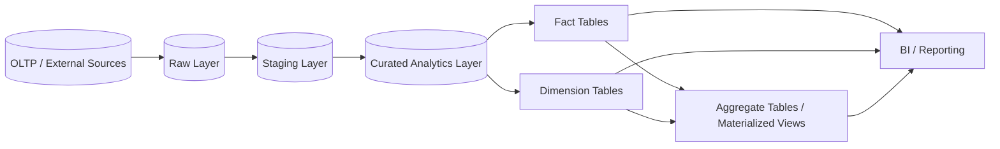
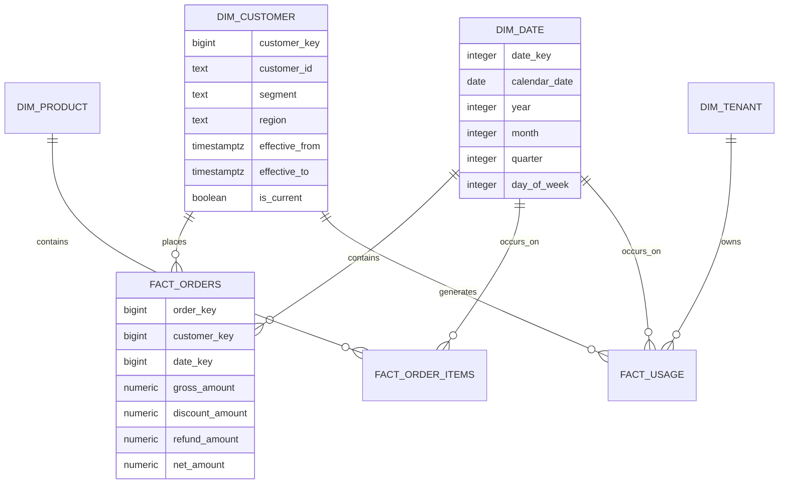
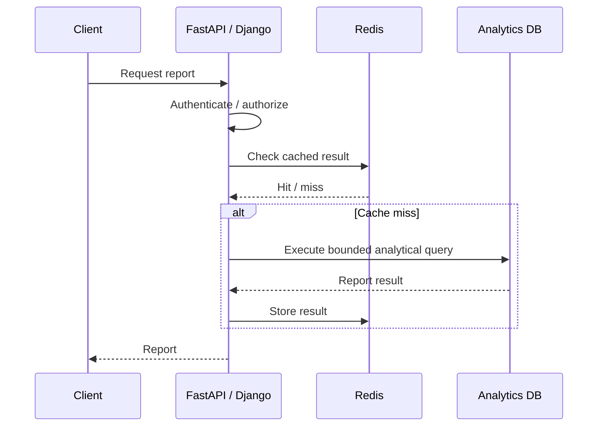

# 02- Schema Design

## Overview

An analytics database should not simply reproduce the OLTP schema in another PostgreSQL database.

The schema should be optimized around analytical access patterns:

- Large scans.
- Aggregations.
- Time-series analysis.
- Historical reporting.
- Dimensional filtering.
- Period-over-period comparisons.
- BI queries.
- Operational dashboards.
- Data exports.

A common analytical model separates data into:

```text
Dimensions
    +
Facts
    +
Aggregates
    +
Staging / Raw data
```

The most important design decision is the **grain** of each dataset. If the grain is unclear, joins, aggregations, historical reporting, and metric definitions become difficult to reason about.

---

## Analytics Schema Architecture

A production analytics platform commonly separates the lifecycle of data into layers.



Each layer has a different responsibility.

| Layer | Purpose | Typical Characteristics |
|---|---|---|
| Raw | Preserve source data | Source-oriented, replayable |
| Staging | Clean and normalize | Temporary transformation representation |
| Curated | Business-ready data | Validated and standardized |
| Fact | Store measurable events | Large, high-volume |
| Dimension | Describe entities | Lower volume, descriptive |
| Aggregate | Accelerate repeated reports | Precomputed metrics |

Not every project requires all layers physically. The logical separation is still useful.

---

## Schema Design Principles

The analytics schema should follow several principles:

1. Define table grain explicitly.
2. Separate measures from descriptive attributes.
3. Preserve business event time.
4. Preserve ingestion and processing timestamps.
5. Use stable business identifiers for reconciliation.
6. Use surrogate keys when historical dimension versions require them.
7. Avoid copying unnecessary OLTP columns.
8. Design around analytical access patterns.
9. Make historical semantics explicit.
10. Keep transformations reproducible.

---

## Fact and Dimension Model

A typical reporting model looks like:



The diagram represents a logical model. Exact tables depend on the reporting domain.

---

## Table Grain

Grain defines what one row represents.

For example:

```text
fact_orders
    = one row per order

fact_order_items
    = one row per order item

fact_daily_usage
    = one row per tenant per day

fact_monthly_revenue
    = one row per customer per month
```

This should be documented directly in the schema.

A table without an explicit grain is a long-term source of reporting errors.

---

## Why Grain Matters

Consider:

```text
orders
    1 → many order_items
```

If an order is joined with order items:

```text
one order
    ↓
multiple rows
```

Aggregating order-level values after that join can multiply measures.

For example:

```sql
SELECT
    SUM(o.total_amount)
FROM orders AS o
JOIN order_items AS oi
    ON oi.order_id = o.id;
```

can overstate revenue because one order can produce multiple joined rows.

The schema should make fact grain explicit enough that reporting queries can reason about these relationships correctly.

---

## Fact Tables

Fact tables contain measurable business events or states.

Common examples:

```text
fact_orders
fact_order_items
fact_payments
fact_transactions
fact_usage
fact_sessions
fact_logins
fact_api_requests
```

A fact table commonly contains:

- Fact identifier.
- Dimension foreign keys.
- Event timestamp.
- Measures.
- Source identifiers.
- Operational metadata.
- Load metadata.

Example:

```sql
CREATE TABLE fact_orders (
    order_key BIGINT GENERATED ALWAYS AS IDENTITY PRIMARY KEY,
    order_id UUID NOT NULL,
    customer_key BIGINT NOT NULL,
    date_key INTEGER NOT NULL,
    tenant_key BIGINT,
    order_status TEXT NOT NULL,
    currency_code CHAR(3) NOT NULL,
    gross_amount NUMERIC(18, 2) NOT NULL,
    discount_amount NUMERIC(18, 2) NOT NULL,
    refund_amount NUMERIC(18, 2) NOT NULL,
    net_amount NUMERIC(18, 2) NOT NULL,
    occurred_at TIMESTAMPTZ NOT NULL,
    loaded_at TIMESTAMPTZ NOT NULL DEFAULT now()
);
```

---

## Fact Table Design Choices

### Event Facts

Represent events that happened.

Examples:

```text
order placed
payment completed
user login
API request
subscription created
```

The row normally remains immutable after ingestion except for controlled corrections.

### Transaction Facts

Represent business transactions with measurable amounts.

Examples:

```text
payment
refund
financial transaction
usage charge
```

### Periodic Snapshot Facts

Represent the state of a business entity at regular intervals.

Examples:

```text
daily account balance
daily inventory
monthly subscription state
daily active users
```

### Accumulating Snapshot Facts

Represent a business process that progresses through stages.

Example:

```text
order placed
    ↓
paid
    ↓
shipped
    ↓
delivered
```

A row can contain timestamps for important milestones.

---

## Dimension Tables

Dimensions provide descriptive context for facts.

Typical dimensions include:

```text
dim_customer
dim_product
dim_date
dim_tenant
dim_region
dim_plan
dim_device
dim_channel
```

Example:

```sql
CREATE TABLE dim_product (
    product_key BIGINT GENERATED ALWAYS AS IDENTITY PRIMARY KEY,
    product_id UUID NOT NULL,
    sku TEXT NOT NULL,
    product_name TEXT NOT NULL,
    category TEXT,
    brand TEXT,
    is_active BOOLEAN NOT NULL,
    effective_from TIMESTAMPTZ NOT NULL,
    effective_to TIMESTAMPTZ,
    is_current BOOLEAN NOT NULL
);
```

Dimensions should contain attributes needed for filtering, grouping, segmentation, and reporting.

---

## Surrogate Keys

A dimension can use a warehouse-specific surrogate key:

```text
product_key
customer_key
tenant_key
```

while retaining the source-system identifier:

```text
product_id
customer_id
tenant_id
```

This is particularly useful when the same business entity has multiple historical versions.

Example:

```text
customer_key = 101
customer_id  = C123
segment      = SMB

customer_key = 205
customer_id  = C123
segment      = Enterprise
```

The source identifier remains stable while the analytical surrogate key identifies a specific dimension version.

---

## Business Keys

A business key identifies an entity in the source or business domain.

Examples:

```text
customer_id
order_id
product_id
tenant_id
```

Business keys are valuable for:

- Reconciliation.
- Deduplication.
- CDC processing.
- Debugging.
- Backfills.
- Source-to-target lineage.

Do not remove the source identifier simply because a warehouse surrogate key exists.

---

## Date Dimension

Time-based analytics commonly benefits from a dedicated date dimension.

Example:

```sql
CREATE TABLE dim_date (
    date_key INTEGER PRIMARY KEY,
    calendar_date DATE NOT NULL UNIQUE,
    year INTEGER NOT NULL,
    quarter INTEGER NOT NULL,
    month INTEGER NOT NULL,
    month_name TEXT NOT NULL,
    week_of_year INTEGER NOT NULL,
    day_of_month INTEGER NOT NULL,
    day_of_week INTEGER NOT NULL,
    day_name TEXT NOT NULL,
    is_weekend BOOLEAN NOT NULL
);
```

A date dimension can also contain business-specific attributes:

```text
fiscal_year
fiscal_quarter
fiscal_month
holiday
working_day
financial_period
```

This avoids repeatedly implementing calendar logic in reporting queries.

---

## Time Semantics

Analytical schemas should distinguish multiple timestamps.

Typical fields include:

```text
occurred_at
created_at
updated_at
ingested_at
processed_at
loaded_at
```

These represent different events.

For example:

```text
Business event
    ↓
occurred_at

Source received event
    ↓
ingested_at

Transformation completed
    ↓
processed_at

Analytics table loaded
    ↓
loaded_at
```

Do not replace business event time with ingestion time.

---

## Time Zones

Store timestamps consistently, typically as timezone-aware timestamps.

PostgreSQL example:

```sql
occurred_at TIMESTAMPTZ NOT NULL
```

Reporting may then convert timestamps to a business timezone.

For example:

```sql
SELECT
    occurred_at AT TIME ZONE 'Asia/Kolkata' AS local_time
FROM fact_orders;
```

The schema should document which timestamp represents the business event and which timezone is used for reporting boundaries.

---

## Historical Dimensions

Current-state dimensions are insufficient when historical reporting depends on changing attributes.

Consider:

```text
Customer:
January → SMB
April   → Enterprise
```

A report for February should normally use:

```text
SMB
```

while a report for May should use:

```text
Enterprise
```

A historical dimension can represent this with:

```text
effective_from
effective_to
is_current
```

---

## Slowly Changing Dimension Type 2

A common Type 2 model is:

```text
customer_key | customer_id | segment    | effective_from | effective_to | is_current
-------------|-------------|------------|----------------|--------------|-----------
101          | C123        | SMB        | 2026-01-01     | 2026-03-31   | false
205          | C123        | Enterprise | 2026-04-01     | NULL         | true
```

Facts can reference the appropriate historical dimension version.

This allows reports to reconstruct historical business context.

---

## Type 1 vs Type 2

| Strategy | Historical Changes | Complexity | Typical Use |
|---|---|---:|---|
| Type 1 | No | Low | Current-state reporting |
| Type 2 | Yes | Medium/High | Historical reporting |
| Snapshot | Period-specific | Medium | Daily/monthly state |
| Event history | Full event trail | High | Detailed temporal analysis |

Do not introduce Type 2 for every dimension automatically.

Use it when historical attribute state affects business reporting.

---

## Tenant Dimension

For SaaS analytics, a tenant dimension can provide reporting context:

```sql
CREATE TABLE dim_tenant (
    tenant_key BIGINT GENERATED ALWAYS AS IDENTITY PRIMARY KEY,
    tenant_id UUID NOT NULL,
    tenant_name TEXT NOT NULL,
    plan TEXT,
    region TEXT,
    industry TEXT,
    effective_from TIMESTAMPTZ NOT NULL,
    effective_to TIMESTAMPTZ,
    is_current BOOLEAN NOT NULL
);
```

Tenant identity should be retained even when analytics operates primarily at the platform level.

This enables:

```text
revenue by tenant
usage by tenant
API calls by tenant
retention by tenant
plan adoption by tenant
```

---

## Raw Layer

The raw layer preserves source-oriented data.

Example:

```sql
CREATE TABLE raw_orders (
    source_event_id TEXT NOT NULL,
    source_order_id TEXT NOT NULL,
    operation TEXT NOT NULL,
    payload JSONB NOT NULL,
    occurred_at TIMESTAMPTZ,
    ingested_at TIMESTAMPTZ NOT NULL DEFAULT now(),
    source_partition INTEGER,
    source_offset BIGINT
);
```

Raw data may intentionally remain closer to the source representation.

Useful metadata includes:

```text
event_id
source_system
source_table
source_record_id
operation
event_time
ingestion_time
schema_version
partition
offset
```

---

## Staging Layer

Staging converts source data into a form suitable for transformation.

Typical operations include:

```text
type normalization
timestamp normalization
deduplication
validation
source-to-business-key mapping
data cleansing
```

Staging tables are generally implementation details and should not become the primary reporting interface.

---

## Curated Layer

The curated layer provides validated business-ready data.

For example:

```text
raw order event
      ↓
validated order
      ↓
standardized currency
      ↓
resolved customer
      ↓
curated order
```

Curated datasets should have stable contracts that downstream reports can depend upon.

---

## Aggregate Tables

Repeated analytical queries may justify aggregate tables.

Example:

```sql
CREATE TABLE fact_daily_revenue (
    date_key INTEGER NOT NULL,
    tenant_key BIGINT NOT NULL,
    currency_code CHAR(3) NOT NULL,
    order_count BIGINT NOT NULL,
    gross_revenue NUMERIC(20, 2) NOT NULL,
    refund_amount NUMERIC(20, 2) NOT NULL,
    net_revenue NUMERIC(20, 2) NOT NULL,
    PRIMARY KEY (date_key, tenant_key, currency_code)
);
```

This can avoid repeatedly scanning a large order fact table.

However, aggregate tables introduce refresh and backfill complexity.

---

## Materialized Views

Materialized views are useful when a query is expensive but the result can tolerate controlled refresh latency.

Example:

```sql
CREATE MATERIALIZED VIEW monthly_revenue AS
SELECT
    date_trunc('month', occurred_at) AS month,
    tenant_key,
    SUM(net_amount) AS revenue
FROM fact_orders
WHERE order_status = 'COMPLETED'
GROUP BY 1, 2;
```

A refresh can then rebuild the stored result.

Materialized views are not automatically incremental and may not be appropriate for high-frequency freshness requirements.

---

## Aggregate Table vs Materialized View

| Characteristic | Aggregate Table | Materialized View |
|---|---|---|
| Explicit schema | Yes | Yes |
| Custom incremental loading | Yes | Usually requires additional design |
| Refresh control | Application/pipeline | Database refresh |
| Complex transformation | Yes | Yes |
| Operational flexibility | High | Moderate |
| Suitable for large pipelines | Yes | Sometimes |
| Easy to query | Yes | Yes |

Use whichever provides the required freshness, operational control, and performance.

---

## Relationships Between Facts

Facts should generally connect through shared dimensions rather than directly joining unrelated fact tables.

Problematic pattern:

```text
fact_orders
     |
     +---- fact_payments
     |
     +---- fact_usage
```

If both relationships are one-to-many, a direct join can create multiplicative row counts.

Preferred approach:

```text
             dim_date
                |
       +--------+--------+
       |                 |
 fact_orders       fact_payments
       |                 |
       +------ dim_customer
```

Aggregate each fact to the required grain before combining metrics from different fact tables.

---

## Conformed Dimensions

A conformed dimension has consistent meaning across multiple fact tables.

For example:

```text
dim_date
dim_customer
dim_product
dim_tenant
```

can be shared by:

```text
fact_orders
fact_payments
fact_usage
fact_subscriptions
```

This allows reports to compare metrics using the same dimensions.

Example:

```text
Revenue
+
Usage
+
Customer count
```

can all be grouped by the same tenant or month definition.

---

## Degenerate Dimensions

Some dimensional identifiers do not require a separate dimension table.

For example:

```text
order_number
invoice_number
transaction_number
```

can remain directly in the fact table when they provide useful identification but have no meaningful descriptive attributes.

This avoids creating unnecessary dimensions.

---

## Measures

Measures should have explicit semantics.

Examples:

```text
quantity
gross_amount
discount_amount
refund_amount
net_amount
duration_seconds
request_count
active_users
```

Measures should define:

- Unit.
- Currency where applicable.
- Precision.
- Null semantics.
- Aggregation behavior.

For example:

```text
request_count
→ SUM

unit_price
→ usually not SUM

average_order_value
→ derived metric, not stored as a simple additive measure
```

---

## Additive, Semi-Additive, and Non-Additive Measures

| Measure Type | Example | Aggregation |
|---|---|---|
| Additive | Revenue | SUM across dimensions |
| Semi-additive | Account balance | SUM across accounts, not time |
| Non-additive | Conversion rate | Recalculate from components |

This distinction is critical.

For example, averaging daily conversion rates is not necessarily the same as calculating:

```text
total conversions / total eligible users
```

Metric definitions should specify the correct aggregation behavior.

---

## Monetary Values

Money should use exact numeric representation.

Example:

```sql
NUMERIC(20, 4)
```

or another precision appropriate to the domain.

Avoid floating-point storage for financial amounts when exact decimal semantics are required.

Currency should be explicit:

```sql
currency_code CHAR(3) NOT NULL
```

Do not aggregate values across currencies without a defined conversion methodology.

---

## Null Semantics

Analytics schemas must distinguish:

```text
unknown
missing
not applicable
zero
```

These are not equivalent.

For example:

```text
refund_amount = 0
```

means no refund.

While:

```text
refund_amount IS NULL
```

may mean the value is unavailable or not calculated.

Metric definitions should explicitly establish the expected semantics.

---

## Constraints

Analytical databases can still benefit from constraints.

Useful constraints include:

```sql
NOT NULL
UNIQUE
PRIMARY KEY
FOREIGN KEY
CHECK
```

For example:

```sql
CHECK (gross_amount >= 0)
```

Constraints provide early detection of invalid data.

However, some analytics platforms intentionally relax foreign-key enforcement for bulk-loading or performance reasons. In such systems, equivalent data-quality tests become essential.

---

## Indexing Requirements

Analytical indexes should be based on actual access patterns.

Potential candidates include:

```text
date
tenant
customer
product
event type
status
business identifier
```

Example:

```sql
CREATE INDEX fact_orders_tenant_date_idx
ON fact_orders (tenant_key, date_key);
```

For very large fact tables, indexes can become expensive in:

- Storage.
- Insert/update cost.
- Build time.
- Maintenance.
- Backup size.

Partitioning, columnar storage, clustering, or warehouse-native optimizations may be preferable depending on the platform.

---

## Partitioning

Large fact tables may be partitioned by time.

Example:

```sql
CREATE TABLE fact_events (
    event_id BIGINT NOT NULL,
    occurred_at TIMESTAMPTZ NOT NULL,
    tenant_key BIGINT NOT NULL,
    event_type TEXT NOT NULL
) PARTITION BY RANGE (occurred_at);
```

Partitions can then represent bounded time intervals.

Benefits include:

- Partition pruning.
- Easier retention.
- Faster partition-level maintenance.
- Easier archival.
- Operational isolation.

Partitioning does not automatically make every query faster.

Queries must provide predicates that allow the planner to eliminate irrelevant partitions.

---

## Storage Strategy

Analytics workloads often benefit from storage formats optimized for scanning.

For data lakes, Parquet is commonly useful because it is:

- Columnar.
- Compressed.
- Efficient for selective column reads.
- Suitable for analytical processing.

A common architecture is:

```text
Raw events
    ↓
S3
    ↓
Parquet
    ↓
Warehouse / Query Engine
```

PostgreSQL remains useful for curated relational reporting workloads, but very large analytical datasets may be better suited to dedicated analytical engines.

---

## OLTP-to-Analytics Mapping

Do not blindly copy:

```text
customers
orders
order_items
payments
```

from OLTP into the analytics database.

Instead, map operational entities to analytical concepts.

Example:

```text
OLTP
orders
order_items
customers
payments

        ↓ transformation

Analytics
fact_orders
fact_order_items
fact_payments
dim_customer
dim_date
```

The analytical model should optimize reporting rather than preserve every implementation detail of the transactional schema.

---

## Schema Evolution

Analytics schemas are long-lived and should tolerate source evolution.

Examples:

```text
new source column
new event type
new product attribute
new customer segment
```

Changes should be handled through:

- Versioned transformations.
- Compatible event schemas.
- Controlled migrations.
- Backfills where required.
- Data-quality validation.

Do not silently reinterpret historical records when business semantics have changed.

---

## Data Lineage Metadata

Important analytical tables should preserve enough metadata to trace their origin.

Useful columns include:

```text
source_system
source_id
source_event_id
source_version
occurred_at
ingested_at
loaded_at
pipeline_version
```

This supports:

- Debugging.
- Reconciliation.
- Auditing.
- Backfills.
- Incident investigation.

---

## Security

Analytics databases often contain more historical information than the operational application.

Security requirements include:

- Least-privileged roles.
- Encryption in transit.
- Encryption at rest.
- Restricted raw-layer access.
- Sensitive-column protection.
- Tenant-level authorization.
- Audit logging.
- Secure exports.
- Controlled BI access.

Do not expose raw tables directly to every reporting user.

A curated reporting layer is safer and easier to govern.

---

## Multi-Tenant Analytics

For SaaS analytics, tenant identity should be modeled explicitly when tenant-level reporting is required.

For example:

```text
fact_usage
    |
    +-- tenant_key
    |
    +-- date_key
    |
    +-- usage_count
```

This supports:

```sql
SELECT
    tenant_key,
    date_key,
    SUM(usage_count) AS total_usage
FROM fact_usage
GROUP BY tenant_key, date_key;
```

Cross-tenant reports should require elevated authorization.

Tenant-specific reporting should not rely solely on a dashboard filter.

---

## RLS for Analytics

PostgreSQL RLS can provide tenant-level row isolation in reporting databases.

Conceptually:

```text
BI / API User
      ↓
Tenant Context
      ↓
RLS Policy
      ↓
Tenant Rows
```

RLS should be evaluated alongside:

- Database roles.
- Table ownership.
- `BYPASSRLS`.
- Application authorization.
- BI tool behavior.

Do not assume RLS is effective if the reporting connection uses a privileged role that bypasses the policy.

---

## Reporting Views

Views can provide stable reporting interfaces.

Example:

```sql
CREATE VIEW report_monthly_revenue AS
SELECT
    date_trunc('month', occurred_at) AS month,
    tenant_key,
    SUM(net_amount) AS revenue
FROM fact_orders
WHERE order_status = 'COMPLETED'
GROUP BY 1, 2;
```

A reporting view can hide implementation details while providing a stable interface for BI tools and APIs.

Views are not automatically cached.

Use materialized views or aggregate tables when stored results are required.

---

## API-Oriented Schema

If reports are consumed by Django or FastAPI, design datasets around API access patterns.

Example:

```text
GET /v1/reports/revenue
```

may need:

```text
date
tenant
currency
revenue
order_count
```

rather than dozens of raw fact columns.

A curated reporting view or aggregate table can reduce application complexity and query cost.

---

## Backend Integration

A typical backend flow is:



For expensive reports, replace synchronous execution with a Celery job and object-storage export.

---

## Operational Requirements

Schema design should consider:

- Data load windows.
- Index maintenance.
- Partition management.
- Vacuum/autovacuum where applicable.
- Statistics.
- Refresh scheduling.
- Storage growth.
- Backup duration.
- Query concurrency.
- Long-running reports.

Analytics systems frequently have a mix of:

```text
scheduled batch workloads
+
interactive BI queries
+
API queries
+
backfills
```

These workloads should not be allowed to interfere without controls.

---

## High Availability and Disaster Recovery

Schema design should support the required recovery model.

Important questions include:

- Can the analytics database be rebuilt from raw data?
- How much historical data must be retained?
- Are aggregate tables reproducible?
- What is the acceptable reporting outage?
- What is the acceptable data-loss window?
- How long would a full rebuild take?

A rebuildable curated layer can reduce dependence on backups alone.

---

## Performance Considerations

Schema design has a direct impact on analytical performance.

Important considerations include:

```text
table grain
partition strategy
data distribution
join cardinality
column count
data types
indexes
statistics
aggregation strategy
materialization
storage format
```

A normalized schema is not automatically optimal for analytics.

Likewise, denormalization is not automatically faster.

The correct design depends on:

```text
query workload
data volume
freshness requirements
update frequency
concurrency
storage engine
```

---

## Cost Considerations

Schema decisions directly affect infrastructure cost.

Examples:

| Design Choice | Potential Cost |
|---|---|
| Excessive raw retention | Storage |
| Too many indexes | Storage + write/maintenance |
| Repeated full refreshes | Compute |
| Excessive denormalization | Storage |
| Unbounded reports | Compute + I/O |
| Large materialized views | Storage + refresh compute |
| Duplicate datasets | Storage + pipeline complexity |

Cost should be measured per workload rather than optimized through arbitrary restrictions.

---

## Common Schema Mistakes

### Copying the OLTP Schema Verbatim

**Problem:** reporting queries repeatedly reconstruct business concepts through complex joins.

**Better approach:** model facts, dimensions, historical state, and reporting grain explicitly.

### Undefined Grain

**Problem:** analysts cannot reliably determine what a row represents.

**Better approach:** document grain as part of every fact table contract.

### Storing Only Current Dimension Values

**Problem:** historical reports use today's attributes for historical events.

**Better approach:** use an appropriate historical dimension strategy.

### Mixing Currencies

**Problem:** revenue is summed across incompatible currencies.

**Better approach:** retain currency and define a controlled conversion methodology.

### Using Floating-Point for Financial Measures

**Problem:** binary floating-point representation can introduce precision issues.

**Better approach:** use appropriate exact numeric types.

### Excessive Denormalization

**Problem:** duplicated attributes become inconsistent and increase storage.

**Better approach:** denormalize deliberately around measured query patterns.

### Excessive Normalization

**Problem:** every report requires many joins and becomes expensive or difficult to maintain.

**Better approach:** create curated analytical structures where repeated access patterns justify them.

### Joining Multiple One-to-Many Facts

**Problem:** row multiplication causes incorrect metrics.

**Better approach:** aggregate facts independently to a common grain before combining them.

### Treating Materialized Views as Automatically Incremental

**Problem:** refreshes can become expensive as data grows.

**Better approach:** use explicit aggregate tables or incremental pipelines when required.

### Ignoring Data Lineage

**Problem:** nobody can explain where a dashboard number originated.

**Better approach:** retain source identifiers and pipeline metadata.

---

## Design Review Checklist

### Modeling

- [ ] Every fact table has a documented grain.
- [ ] Measures are explicitly defined.
- [ ] Dimensions are separated from facts.
- [ ] Business keys are retained where useful.
- [ ] Surrogate keys are used where historical versions require them.
- [ ] Additive behavior of measures is documented.

### Time

- [ ] Business event time is preserved.
- [ ] Ingestion time is preserved.
- [ ] Timezone semantics are documented.
- [ ] Date/calendar requirements are defined.
- [ ] Late-arriving data is supported.

### Historical Data

- [ ] Historical dimension requirements are identified.
- [ ] Slowly changing dimensions are used only where justified.
- [ ] Backfill behavior is defined.
- [ ] Corrections are auditable.

### Performance

- [ ] Large fact tables have an appropriate partition strategy.
- [ ] Major access paths have appropriate indexes.
- [ ] Expensive repeated queries have been evaluated for pre-aggregation.
- [ ] Query grain and join cardinality are understood.
- [ ] Analytical workloads are isolated from OLTP where necessary.

### Data Quality

- [ ] Duplicate handling is defined.
- [ ] Null semantics are documented.
- [ ] Constraints or equivalent data-quality tests exist.
- [ ] Reconciliation is possible.
- [ ] Data lineage is available.

### Security

- [ ] Sensitive columns are classified.
- [ ] Raw data access is restricted.
- [ ] Reporting roles are least privileged.
- [ ] Tenant isolation is enforced where applicable.
- [ ] Exports are controlled and auditable.

### Operations

- [ ] Schema changes are version controlled.
- [ ] Partition lifecycle is automated.
- [ ] Refresh jobs are observable.
- [ ] Storage growth is monitored.
- [ ] Backup and restore requirements are defined.
- [ ] Rebuild procedures are documented.

---

## Senior Design Perspective

A strong analytics schema is not defined by whether it uses "star schema", "snowflake schema", or PostgreSQL-specific features.

The senior-level design process starts with:

```text
Business questions
      ↓
Metrics
      ↓
Metric semantics
      ↓
Required grain
      ↓
Facts + dimensions
      ↓
Historical requirements
      ↓
Access patterns
      ↓
Physical design
      ↓
Operational model
```

The logical model should answer:

> What does each row represent?

The physical model should answer:

> How can the required analytical workload execute efficiently at the expected scale?

The operational model should answer:

> How will this dataset remain correct, fresh, secure, observable, and recoverable over time?

These three questions should drive the schema rather than choosing a modeling pattern first and forcing the workload into it.

## Key Takeaways

- **Define the grain of every analytical dataset before designing queries, facts, or aggregates.**
- **Use facts for measurable business events or states and dimensions for descriptive, filtering, grouping, and historical context.**
- **Preserve event time, source identifiers, and lineage metadata so datasets can be reconciled, debugged, and backfilled.**
- **Design physical structures around real analytical workloads, using partitioning, indexes, aggregate tables, or materialized views only where they provide measurable value.**
- **Treat security, historical correctness, data quality, performance, cost, and recoverability as first-class schema requirements.**