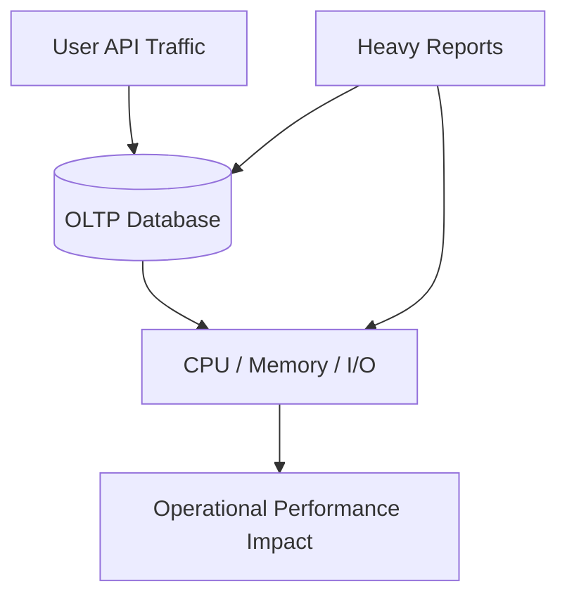
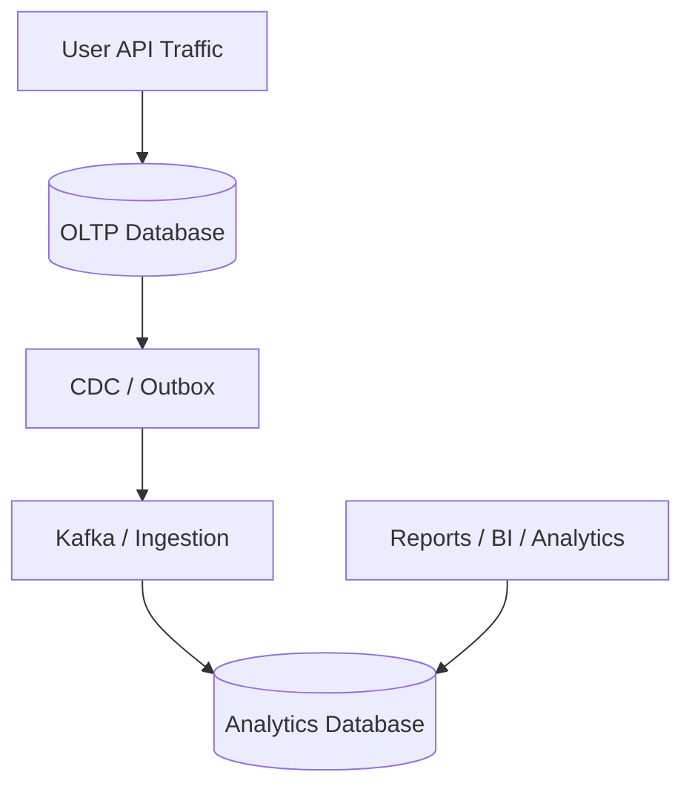
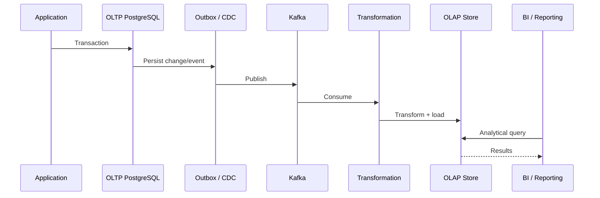
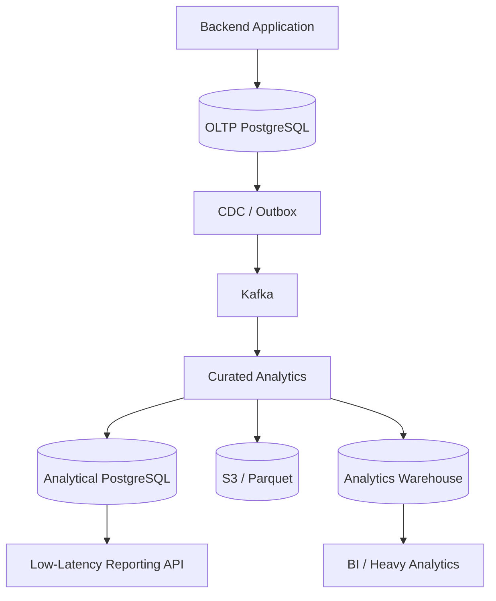
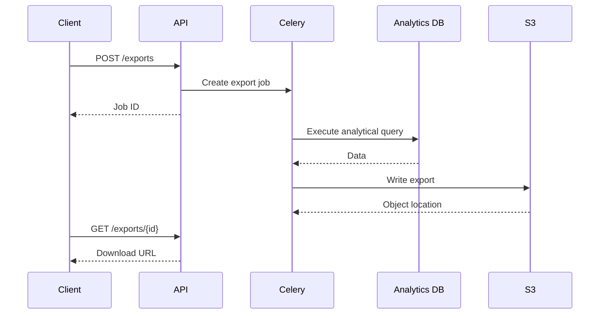

# 03- OLTP vs OLAP Design

## Overview

OLTP and OLAP databases solve different problems even when they store data originating from the same business domain.

**OLTP (Online Transaction Processing)** is optimized for operational workloads:

```text
create order
update payment
change subscription
insert usage event
update inventory
```

**OLAP (Online Analytical Processing)** is optimized for analytical workloads:

```text
revenue by month
customer retention
usage trends
year-over-year growth
top products
cohort analysis
```

The architectural goal is usually not to choose one over the other. It is to determine where each workload should execute and how data should move between them.

A typical production architecture is:

```text
                    Operational Workload
                           |
                           v
Users → API → OLTP PostgreSQL
                 |
                 | CDC / Outbox
                 v
             Kafka / Ingestion
                 |
                 v
             Analytics Store
                 |
                 v
        OLAP / Reporting Workload
```

The key engineering challenge is preserving correctness and acceptable freshness while preventing analytical workloads from degrading transactional performance.

---

## OLTP

OLTP systems support the application's operational state.

Typical characteristics:

- Frequent inserts and updates.
- Small point lookups.
- Short transactions.
- Strong consistency requirements.
- High concurrent request volume.
- Referential integrity.
- Row-level changes.
- Low-latency API requests.

Example:

```sql
UPDATE inventory
SET available_quantity = available_quantity - 1
WHERE product_id = $1
  AND available_quantity >= 1;
```

This query represents an operational transaction. It should complete quickly and safely under concurrency.

---

## OLAP

OLAP systems support analytical queries over large datasets.

Typical characteristics:

- Large scans.
- Aggregations.
- Complex joins.
- Window functions.
- Historical analysis.
- Lower write frequency.
- Larger result sets.
- Longer query execution times.

Example:

```sql
SELECT
    date_trunc('month', occurred_at) AS month,
    SUM(net_amount) AS revenue,
    COUNT(*) AS orders
FROM fact_orders
WHERE occurred_at >= DATE '2026-01-01'
GROUP BY 1
ORDER BY 1;
```

This query may scan millions of rows and perform substantial aggregation work.

That is acceptable in an analytical environment but can be problematic on the primary OLTP database.

---

## OLTP vs OLAP

| Characteristic | OLTP | OLAP |
|---|---|---|
| Primary purpose | Operations | Analysis |
| Workload | Read/write | Mostly read |
| Query size | Small | Large |
| Transactions | Frequent | Less frequent |
| Latency | Milliseconds | Seconds/minutes |
| Data scope | Current state | Historical + current |
| Schema | Normalized | Dimensional / analytical |
| Indexing | Access-path focused | Workload dependent |
| Aggregations | Limited | Heavy |
| Concurrency | Very high | Moderate/high |
| Data volume | Moderate/large | Large/very large |
| Writes | Continuous | Batch/streaming |
| Typical users | Application users | Analysts, BI, services |
| Failure impact | User-facing | Reporting/analytics |
| Examples | PostgreSQL, MySQL | Warehouse, lakehouse, analytical PostgreSQL |

These are workload characteristics rather than strict rules. Modern databases can support hybrid workloads, but the architectural trade-offs remain.

---

## Why OLTP and OLAP Should Often Be Separated

Suppose an application serves:

```text
10,000 API requests/second
```

while an analyst runs:

```sql
SELECT
    customer_id,
    SUM(amount)
FROM orders
GROUP BY customer_id;
```

The analytical query may require:

```text
large table scan
+
sorting/hashing
+
aggregation
+
substantial memory
+
I/O
```

Running both workloads against the same database creates resource competition.



Separating the workloads provides:



The analytical workload can then consume resources independently.

---

## OLTP Schema Design

OLTP schemas typically prioritize:

- Data integrity.
- Normalization.
- Transactional consistency.
- Efficient point access.
- Referential integrity.
- Frequent updates.

Example:

```text
customers
    |
    +-- orders
          |
          +-- order_items
                |
                +-- products
```

A normalized design reduces duplicated mutable state.

For example, an order should generally reference a product rather than duplicate every current product attribute into every operational row.

Historical snapshots that are required for business correctness are a separate concern.

---

## OLAP Schema Design

OLAP schemas often optimize around analytical questions.

A common dimensional structure is:

```text
                 dim_date
                    |
                    |
dim_customer ---- fact_orders ---- dim_product
                    |
                    |
                dim_tenant
```

The fact table stores measurable events:

```text
order_count
quantity
gross_amount
discount_amount
refund_amount
net_amount
```

Dimensions provide analytical context:

```text
customer
product
tenant
region
date
plan
channel
```

---

## Normalization vs Dimensional Modeling

OLTP commonly favors normalized structures:

```text
orders
order_items
customers
products
payments
```

OLAP may create analytical structures such as:

```text
fact_orders
fact_order_items
fact_payments
dim_customer
dim_product
dim_date
dim_tenant
```

This does not mean OLAP must always be denormalized.

The correct model depends on:

- Query patterns.
- Data volume.
- Analytical engine.
- Freshness requirements.
- Transformation cost.
- Storage cost.
- Maintainability.

---

## Fact Table Grain

The most important OLAP design concept is often **grain**.

For example:

```text
fact_orders
= one row per order
```

while:

```text
fact_order_items
= one row per order item
```

These are not interchangeable.

If a report needs order-level revenue but joins directly to order items, order values may be multiplied.

Correct analytical design starts by identifying:

```text
What does one row represent?
```

before writing the query.

---

## Dimension Tables

Dimensions describe the context surrounding facts.

Example:

```text
dim_customer
    customer_key
    customer_id
    segment
    region
    industry

dim_product
    product_key
    product_id
    category
    brand

dim_date
    date_key
    calendar_date
    year
    month
    quarter
```

Dimensions make filtering and grouping consistent across reports.

---

## Current State vs Historical State

OLTP databases commonly emphasize current operational state.

For example:

```text
customer.plan = "enterprise"
```

An analytics system may need to answer:

> What plan was the customer on when the transaction occurred?

That requires historical modeling.

Possible strategies include:

- Event history.
- Snapshot tables.
- Slowly changing dimensions.
- Effective-date records.

OLAP therefore often retains more historical context than OLTP.

---

## Data Flow from OLTP to OLAP

A production architecture commonly looks like:



The OLTP transaction should not wait for an external analytics system to finish processing.

---

## Transactional Outbox

When application data and an analytical event must remain consistent, a transactional outbox can be used.

```text
BEGIN
    update business tables
    insert outbox event
COMMIT
```

Both changes become part of the same OLTP transaction.

A separate publisher then sends the event to Kafka.

This avoids a common failure:

```text
Database commit succeeds
        ↓
Kafka publish fails
        ↓
Analytics never receives event
```

The outbox makes the event durable in the source database.

---

## CDC

Change Data Capture can extract database changes directly.

Conceptually:

```text
OLTP WAL / Change Log
        ↓
CDC Connector
        ↓
Kafka
        ↓
Analytics Pipeline
```

CDC can reduce application coupling but introduces its own operational requirements:

- Offset management.
- Schema evolution.
- Duplicate delivery.
- Ordering semantics.
- Snapshot handling.
- Connector monitoring.

CDC captures data changes; it does not automatically provide business semantics.

---

## Event-Driven Analytics

Business events may be preferable when analytics needs semantic events rather than raw row mutations.

Example:

```json
{
  "event_id": "evt-123",
  "event_type": "order.completed",
  "event_version": 1,
  "occurred_at": "2026-09-05T10:15:00Z",
  "tenant_id": "tenant-123",
  "order_id": "order-456"
}
```

The analytics pipeline can then transform this into:

```text
fact_orders
fact_payments
daily revenue
customer metrics
```

Events should have stable identifiers and versioning.

---

## Freshness Trade-Off

Separating OLTP and OLAP introduces a fundamental trade-off:

```text
OLTP commit
     ↓
capture
     ↓
transport
     ↓
transform
     ↓
load
     ↓
analytics visible
```

Therefore:

```text
transaction committed
```

does not necessarily mean:

```text
analytics immediately updated
```

The architecture should define a freshness target.

Example:

| Dataset | Freshness |
|---|---:|
| Operational API state | Immediate |
| Usage dashboard | < 5 minutes |
| Executive dashboard | < 1 hour |
| Daily financial report | Daily |
| Historical analysis | Batch |

---

## Event Time vs Processing Time

OLAP systems should preserve both.

```text
occurred_at
ingested_at
processed_at
loaded_at
```

Consider:

```text
Event occurred: 09:00
Received:        09:03
Loaded:          09:05
```

A report for 09:00 should normally use the business event timestamp rather than the load timestamp.

This becomes particularly important for:

- Mobile applications.
- Distributed systems.
- Kafka.
- Retried events.
- Offline clients.
- Backfills.

---

## Duplicate Handling

At-least-once processing means duplicate delivery must be expected.

```text
Event A
   ↓
Consumer
   ↓
Failure after database write
   ↓
Retry
   ↓
Event A again
```

The analytical load must be idempotent.

Possible strategies:

```text
unique event_id
MERGE / upsert
deduplication staging
source offsets
version checks
```

The correct strategy depends on the ingestion architecture.

---

## Late-Arriving Data

A late event may belong to an earlier reporting period.

Example:

```text
September 1 event
        ↓
arrives September 5
```

The analytics system should define whether:

- Historical aggregates are immediately corrected.
- A reprocessing window is used.
- Periods can be restated.
- Reports are based on ingestion time instead.

Financial and regulatory reporting may require particularly strict correction semantics.

---

## Query Workload Comparison

### OLTP Query

```sql
SELECT
    id,
    status,
    total_amount
FROM orders
WHERE id = $1;
```

Typical characteristics:

```text
one/few rows
indexed lookup
short execution
high frequency
```

### OLAP Query

```sql
SELECT
    date_trunc('month', occurred_at) AS month,
    customer_segment,
    SUM(net_amount) AS revenue,
    COUNT(*) AS orders
FROM fact_orders
WHERE occurred_at >= DATE '2026-01-01'
GROUP BY 1, 2
ORDER BY 1, 2;
```

Typical characteristics:

```text
many rows
scan
aggregation
sorting
longer execution
lower frequency
```

The two queries can use the same SQL language while having radically different physical execution requirements.

---

## Indexing Differences

OLTP indexes often target:

```text
primary-key lookup
foreign-key lookup
selective filters
common API queries
```

OLAP indexes may target:

```text
time filtering
frequent dimensions
selective report filters
join keys
```

But analytical engines may instead rely heavily on:

- Columnar storage.
- Partition pruning.
- Data clustering.
- Zone maps.
- Compression.
- Parallel execution.

Adding OLTP-style indexes to every analytical table can increase storage and ingestion cost without providing proportional benefit.

---

## Aggregation Strategy

OLTP:

```text
calculate on demand
```

OLAP:

```text
raw facts
    ↓
daily aggregates
    ↓
monthly aggregates
```

Pre-aggregation is useful when:

- The same report runs frequently.
- Raw tables are very large.
- Freshness requirements permit delayed refresh.
- The aggregation is expensive.

It introduces additional state that must be refreshed and validated.

---

## Window Functions in OLAP

Analytical workloads frequently require window functions.

Example:

```sql
SELECT
    customer_id,
    month,
    revenue,
    SUM(revenue) OVER (
        PARTITION BY customer_id
        ORDER BY month
    ) AS cumulative_revenue
FROM monthly_customer_revenue;
```

This is a natural OLAP workload.

It can be significantly more expensive than typical OLTP point queries because it may require sorting and processing large partitions.

---

## PostgreSQL as Both OLTP and OLAP

PostgreSQL supports both transactional and analytical SQL.

It can handle moderate analytical workloads using:

- Parallel queries.
- Aggregation.
- Window functions.
- Partitioning.
- Materialized views.
- Indexes.
- CTEs.
- PostgreSQL statistics.

This makes PostgreSQL useful for smaller systems.

However, one PostgreSQL cluster should not automatically be expected to serve unlimited OLTP and OLAP workloads simultaneously.

---

## Read Replica as an Intermediate Strategy

A read replica can provide partial workload isolation.

```text
                 Primary
                PostgreSQL
                    |
          +---------+---------+
          |                   |
      Application          Replica
                              |
                           Reports
```

Advantages:

- Relatively simple.
- Reuses the same schema.
- Lower operational complexity than a warehouse.

Limitations:

- Replication lag.
- Same underlying relational model.
- Large scans still consume replica resources.
- Analytical transformations remain limited.
- Storage and compute may still scale together.

A replica is workload isolation, not automatically a full OLAP architecture.

---

## Dedicated Analytics Database

A stronger architecture is:

```text
              OLTP PostgreSQL
                    |
              CDC / Outbox
                    |
                  Kafka
                    |
              Transformations
                    |
            Analytics Database
                    |
          +---------+---------+
          |                   |
       BI Tools          Reporting API
```

This provides stronger isolation between:

```text
transactional compute
```

and:

```text
analytical compute
```

---

## Warehouse vs PostgreSQL

| Requirement | PostgreSQL | Dedicated Warehouse |
|---|---:|---:|
| OLTP transactions | Excellent | Usually not primary use |
| Small reports | Excellent | Excellent |
| Complex analytics | Good | Excellent |
| Very large scans | Limited by deployment | Strong |
| Columnar execution | Limited | Common |
| Horizontal analytical compute | Limited | Strong |
| Operational simplicity | High | Moderate |
| Existing SQL skills | Strong | Strong |
| Very large BI workload | May become limiting | Better fit |

The transition should be driven by workload rather than by the label "analytics."

---

## OLTP/OLAP Hybrid Architecture

Some systems use multiple analytical tiers.



This can provide:

- Fast operational reporting.
- Large-scale historical analysis.
- Cheap long-term storage.
- Flexible reprocessing.

It also increases architectural complexity.

---

## Reporting APIs

A reporting API should generally query analytical structures rather than operational tables for expensive reports.

Example:

```text
GET /v1/reports/revenue
```

Request:

```text
tenant
date range
grouping
filters
```

Backend flow:

```text
Nginx
  ↓
FastAPI / Django
  ↓
Authorization
  ↓
Analytics repository
  ↓
Analytics database
  ↓
Curated dataset
```

Large reports should be asynchronous rather than tied to an HTTP request.

---

## Asynchronous Exports

A production export flow can be:



This protects the API from long-running queries and large response bodies.

---

## Security Differences

OLTP security typically focuses on:

```text
transaction authorization
current user state
resource ownership
```

OLAP security must also consider:

```text
historical exposure
cross-tenant aggregation
PII
bulk exports
BI users
analyst access
derived sensitive metrics
```

An analytical database can expose information that was difficult to infer from individual OLTP requests.

---

## Multi-Tenant Analytics

For SaaS systems, analytical data may need tenant isolation.

Example:

```sql
SELECT
    tenant_key,
    date_key,
    SUM(usage_count) AS usage
FROM fact_usage
WHERE tenant_key = $1
GROUP BY tenant_key, date_key;
```

Cross-tenant reports should be restricted to explicitly authorized users.

Do not rely on a BI dashboard filter as the only security boundary.

---

## Monitoring OLTP

Important OLTP metrics include:

```text
request latency
transaction latency
lock waits
deadlocks
connections
CPU
I/O
replication lag
WAL generation
error rate
```

OLTP alerts are generally closely tied to user-facing SLOs.

---

## Monitoring OLAP

Important OLAP metrics include:

```text
query latency
queue time
bytes scanned
rows scanned
CPU
memory
spill-to-disk
concurrency
pipeline lag
dataset freshness
failed transformations
data-quality failures
```

A report that returns in 10 seconds but uses excessive compute may still represent a production problem.

---

## Cost Considerations

OLTP and OLAP have different cost drivers.

### OLTP

```text
high availability
IOPS
connections
low latency
transaction capacity
```

### OLAP

```text
storage
scan volume
compute
parallel execution
query concurrency
data retention
```

Separating workloads can increase infrastructure cost but reduce operational risk.

The correct decision should consider:

```text
infrastructure cost
+
engineering cost
+
performance requirements
+
availability requirements
```

---

## High Availability

OLTP generally requires strong availability because application transactions depend directly on it.

OLAP availability requirements can vary.

For example:

| Workload | Typical Priority |
|---|---|
| Checkout | Critical |
| Authentication | Critical |
| Operational API | Critical |
| Real-time dashboard | High |
| Executive dashboard | Medium |
| Daily report | Lower |
| Historical export | Lower |

Do not automatically give every analytical workload the same HA budget as the transactional database.

---

## Disaster Recovery

OLTP recovery typically prioritizes:

```text
minimal data loss
fast recovery
transaction consistency
```

Analytics recovery may also prioritize:

```text
rebuildability
raw-data retention
reprocessing
dataset reconstruction
```

A useful analytical architecture can rebuild curated datasets from durable raw data.

```text
Raw data
   ↓
Reprocessing
   ↓
Curated datasets
   ↓
Aggregates
```

This can reduce dependence on restoring every derived table individually.

---

## Schema Evolution

OLTP schemas usually evolve through controlled migrations.

OLAP systems must also handle:

```text
source schema changes
event schema changes
historical transformations
dimension changes
metric changes
```

A new source column should not silently change the meaning of historical data.

Versioned transformations and event schemas are important for long-lived analytics systems.

---

## Common Mistakes

### Treating OLAP as "Just Another Read Replica"

A replica may isolate some reads but does not automatically provide analytical storage, transformation, or workload isolation.

**Better approach:** evaluate query volume, data size, freshness, and analytical complexity.

### Running Large Reports on OLTP

A report can consume CPU, memory, I/O, and connections required by application traffic.

**Better approach:** isolate substantial analytical workloads.

### Copying the OLTP Schema Directly

The normalized operational model may be inefficient for repeated analytical queries.

**Better approach:** design facts, dimensions, aggregates, and historical structures around reporting requirements.

### Undefined Fact Grain

Without grain, analysts can accidentally double-count measures.

**Better approach:** document the exact meaning of one fact row.

### Assuming Analytics Must Be Real-Time

Not every report requires second-level freshness.

**Better approach:** define freshness per dataset and avoid paying unnecessary infrastructure cost.

### Assuming CDC Solves Business Semantics

CDC tells you that data changed. It does not automatically tell you what that change means from a business perspective.

**Better approach:** use domain events when semantic business events are required.

### Ignoring Duplicate Delivery

Distributed pipelines can deliver events more than once.

**Better approach:** implement idempotent ingestion.

### Mixing Event Time and Load Time

Late-arriving events can appear in the wrong reporting period.

**Better approach:** preserve business event time separately from processing timestamps.

### Using Pandas for Unlimited Data

Loading an entire analytical dataset into Python memory does not scale indefinitely.

**Better approach:** push set-based work into the database or use scalable distributed/columnar processing.

### Building a Warehouse Too Early

A small system may not justify a complex analytical platform.

**Better approach:** start with PostgreSQL or a replica when appropriate and migrate based on measured requirements.

---

## OLTP vs OLAP Decision Framework

Use OLTP when the workload requires:

```text
short transactions
current state
frequent writes
strong relational constraints
low-latency point queries
```

Use OLAP when the workload requires:

```text
historical analysis
large scans
complex aggregations
heavy joins
window functions
business intelligence
```

Separate them when:

```text
analytical workloads interfere with transactional workloads
```

Use a dedicated warehouse or analytical engine when:

```text
data volume
+
query complexity
+
concurrency
+
scan requirements
```

exceed the practical limits of the existing relational architecture.

---

## Practical Architecture Progression

A sensible evolution is:

```text
Stage 1
OLTP PostgreSQL
      ↓
Small reports

Stage 2
OLTP PostgreSQL
      ↓
Read replica
      ↓
Operational reporting

Stage 3
OLTP PostgreSQL
      ↓
CDC / Outbox
      ↓
Analytical PostgreSQL
      ↓
Reporting API / BI

Stage 4
OLTP
  ↓
Kafka / CDC
  ↓
S3 / Raw Data
  ↓
Warehouse / Lakehouse
  ↓
BI / Analytics
```

Each stage should be justified by workload requirements.

---

## Production Review Checklist

### Workload

- [ ] OLTP and OLAP workloads are explicitly identified.
- [ ] Query latency requirements are documented.
- [ ] Analytical concurrency is understood.
- [ ] Data volume and growth are measured.
- [ ] Freshness requirements are defined.

### Data Model

- [ ] Fact table grain is documented.
- [ ] Dimensions have defined semantics.
- [ ] Historical requirements are understood.
- [ ] Measures have explicit aggregation semantics.
- [ ] Event time is preserved.

### Data Pipeline

- [ ] CDC or event ingestion is reliable.
- [ ] Duplicate delivery is handled.
- [ ] Late-arriving data is handled.
- [ ] Backfills are supported.
- [ ] Pipeline progress is durable.
- [ ] Schema evolution is controlled.

### Performance

- [ ] Heavy analytical queries do not threaten OLTP SLOs.
- [ ] Query plans are inspected.
- [ ] Partitioning is used where justified.
- [ ] Aggregation strategy is appropriate.
- [ ] Large exports are asynchronous.
- [ ] Resource-intensive workloads are bounded.

### Security

- [ ] Analytical access is authenticated.
- [ ] Reporting authorization is enforced.
- [ ] Tenant boundaries are protected.
- [ ] PII access is restricted.
- [ ] Bulk exports are controlled.
- [ ] Raw data access is limited.

### Operations

- [ ] OLTP and OLAP metrics are monitored separately.
- [ ] Data freshness is observable.
- [ ] Pipeline failures generate alerts.
- [ ] Storage growth is monitored.
- [ ] Backups are configured.
- [ ] Restore procedures are tested.

### Architecture

- [ ] The current analytical architecture matches workload size.
- [ ] A scaling path exists.
- [ ] Read replicas are not being mistaken for full warehouses.
- [ ] Dedicated analytical infrastructure is introduced only when justified.
- [ ] Cost and operational complexity are measured.

---

## Interview Traps

### "OLTP Is Normalized and OLAP Is Denormalized"

This is an oversimplification.

Normalization and denormalization are design techniques. The real distinction is workload optimization.

### "OLAP Means Read-Only"

Analytical systems can have continuous ingestion, updates, corrections, and incremental transformations.

### "Read Replicas Solve Analytics"

Replicas provide read isolation but do not automatically solve analytical workload characteristics.

### "OLTP Cannot Perform Analytics"

PostgreSQL and other OLTP databases can execute sophisticated analytical queries. The question is whether they can do so at the required scale and concurrency without compromising transactional workloads.

### "Real-Time Analytics Is Always Better"

Real-time processing has additional complexity and cost.

The correct question is:

> What freshness does the business actually require?

### "CDC Provides Exactly-Once Analytics"

CDC pipelines still require careful handling of offsets, duplicates, retries, ordering, and idempotency.

### "The Analytics Schema Should Match Production"

The analytical model should preserve necessary business semantics, not necessarily the physical structure of the OLTP schema.

---

## Senior Engineering Perspective

The important architectural decision is not simply:

```text
OLTP vs OLAP
```

It is:

```text
What workload exists?
        ↓
What latency is required?
        ↓
What freshness is required?
        ↓
How much data must be scanned?
        ↓
How many concurrent users exist?
        ↓
What historical context is required?
        ↓
Can OLTP safely absorb this workload?
        ↓
If not, where should analytical computation move?
```

A senior engineer should optimize for the complete system:

```text
Correctness
+
Freshness
+
Latency
+
Scalability
+
Reliability
+
Security
+
Cost
+
Operational complexity
```

The strongest design is usually incremental. Start with the simplest architecture that meets the workload, measure it, and introduce replicas, analytical PostgreSQL, Kafka, object storage, or a dedicated warehouse only when the requirements justify the additional complexity.

## Key Takeaways

- **OLTP optimizes for short, concurrent transactional workloads, while OLAP optimizes for large scans, aggregation, historical analysis, and reporting.**
- **The key architectural decision is workload isolation: substantial analytical queries should not be allowed to compromise latency-sensitive transactional workloads.**
- **OLAP schemas should make fact grain, dimensions, measures, historical semantics, and event-time behavior explicit rather than blindly copying the OLTP schema.**
- **CDC, transactional outbox, Kafka, and incremental pipelines can move data from OLTP to analytics, but duplicate, late, out-of-order, and failed processing must be handled explicitly.**
- **Use the simplest architecture that satisfies measured requirements, evolving from PostgreSQL to replicas and dedicated analytical infrastructure as scale, concurrency, freshness, and query complexity demand it.**