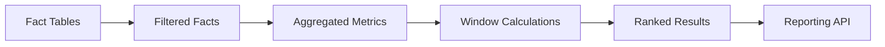
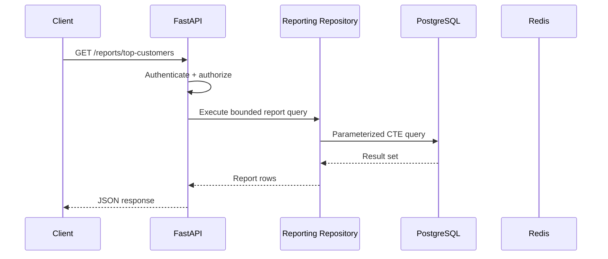

# 06- CTE Based Analytics

## Overview

Common Table Expressions (CTEs) are one of the most useful SQL techniques for structuring complex analytical queries.

A CTE creates a named, query-local result that can be referenced by the main statement or by subsequent CTEs.

For analytics workloads, CTEs are especially useful for creating explicit processing stages:

```text
Raw Facts
   ↓
Filtered Facts
   ↓
Aggregated Metrics
   ↓
Window Calculations
   ↓
Ranked Results
   ↓
Final Report
```

This makes complex reporting queries easier to reason about, test, optimize, and maintain.

A CTE is not automatically a temporary table, cache, or performance optimization. In modern PostgreSQL, eligible non-recursive, side-effect-free CTEs can be inlined into the surrounding query. PostgreSQL also supports explicit `MATERIALIZED` and `NOT MATERIALIZED` control.

For senior backend engineers, the important question is therefore not:

> "Should I use a CTE?"

but:

> "Does a CTE make the analytical pipeline clearer without creating an unnecessary execution boundary or materialization cost?"

---

## What Is a CTE?

A Common Table Expression is a named subquery defined using `WITH`.

```sql
WITH monthly_revenue AS (
    SELECT
        date_trunc('month', occurred_at) AS month,
        SUM(net_amount) AS revenue
    FROM fact_orders
    GROUP BY date_trunc('month', occurred_at)
)
SELECT
    month,
    revenue
FROM monthly_revenue
ORDER BY month;
```

The CTE:

```sql
monthly_revenue
```

is available only to the statement that follows it.

It does not create a persistent database object.

---

## Why CTEs Matter for Analytics

Analytical SQL frequently contains several transformations.

For example:

```text
orders
  ↓
filter valid orders
  ↓
aggregate by customer/month
  ↓
calculate customer totals
  ↓
rank customers
  ↓
return top customers
```

Without CTEs, these transformations can become deeply nested subqueries.

With CTEs:

```sql
WITH valid_orders AS (
    ...
),
monthly_customer_revenue AS (
    ...
),
ranked_customers AS (
    ...
)
SELECT ...
FROM ranked_customers;
```

The query structure reflects the analytical pipeline.

This improves:

- Readability.
- Debuggability.
- Logical separation.
- Reviewability.
- Reuse of intermediate results within the statement.
- Complex analytical query maintenance.

---

## Basic CTE Structure

The general structure is:

```sql
WITH cte_name AS (
    SELECT ...
)
SELECT ...
FROM cte_name;
```

Multiple CTEs can be chained:

```sql
WITH first_stage AS (
    SELECT ...
),
second_stage AS (
    SELECT ...
    FROM first_stage
),
third_stage AS (
    SELECT ...
    FROM second_stage
)
SELECT ...
FROM third_stage;
```

Each CTE can reference earlier CTEs.

---

## CTE Data Flow

A useful mental model is:



The important point is that these are **logical query stages**.

They should not automatically be interpreted as separate physical execution steps.

PostgreSQL's optimizer may inline eligible CTEs.

---

## CTE vs Subquery

A subquery can express the same logical operation.

### Nested Subquery

```sql
SELECT
    customer_id,
    revenue
FROM (
    SELECT
        customer_id,
        SUM(net_amount) AS revenue
    FROM fact_orders
    GROUP BY customer_id
) AS customer_revenue
WHERE revenue >= 10000;
```

### CTE

```sql
WITH customer_revenue AS (
    SELECT
        customer_id,
        SUM(net_amount) AS revenue
    FROM fact_orders
    GROUP BY customer_id
)
SELECT
    customer_id,
    revenue
FROM customer_revenue
WHERE revenue >= 10000;
```

The CTE often becomes easier to maintain as the query grows.

---

## When to Prefer a CTE

A CTE is particularly useful when:

- The query contains several logical stages.
- An intermediate result has a meaningful business name.
- Multiple downstream calculations depend on the same logical stage.
- Window functions follow aggregation.
- Multiple transformations need to be reviewed independently.
- A recursive query is required.
- A data-modifying statement needs a query-local pipeline.
- Explicit materialization is intentionally required.

Do not use CTEs merely because the query contains a subquery.

---

## Analytical Pipeline Pattern

A strong analytics query often follows:

```text
Filter
  ↓
Normalize
  ↓
Aggregate
  ↓
Enrich
  ↓
Window
  ↓
Rank
  ↓
Filter final result
```

Example:

```sql
WITH filtered_orders AS (
    SELECT
        order_id,
        customer_id,
        occurred_at,
        net_amount
    FROM fact_orders
    WHERE occurred_at >= TIMESTAMPTZ '2026-01-01 00:00:00+00'
      AND occurred_at < TIMESTAMPTZ '2026-04-01 00:00:00+00'
),
customer_revenue AS (
    SELECT
        customer_id,
        SUM(net_amount) AS revenue
    FROM filtered_orders
    GROUP BY customer_id
),
ranked_customers AS (
    SELECT
        customer_id,
        revenue,
        RANK() OVER (
            ORDER BY revenue DESC
        ) AS revenue_rank
    FROM customer_revenue
)
SELECT
    customer_id,
    revenue,
    revenue_rank
FROM ranked_customers
WHERE revenue_rank <= 10
ORDER BY revenue_rank, customer_id;
```

Each stage has a clear responsibility.

---

## Establish the Correct Grain

One of the most important analytics principles is:

> Establish the correct grain before performing calculations.

Suppose:

```text
fact_order_items
```

contains one row per order item.

If the report requires:

```text
one row per customer/month
```

first aggregate to that grain:

```sql
WITH customer_month AS (
    SELECT
        customer_id,
        date_trunc('month', occurred_at) AS month,
        SUM(line_amount) AS revenue
    FROM fact_order_items
    GROUP BY
        customer_id,
        date_trunc('month', occurred_at)
)
SELECT *
FROM customer_month;
```

Only after establishing the desired grain should subsequent window calculations be applied.

---

## Aggregate Then Window

This is one of the most useful CTE patterns in analytics.

```sql
WITH monthly_customer_revenue AS (
    SELECT
        customer_id,
        date_trunc('month', occurred_at) AS month,
        SUM(net_amount) AS revenue
    FROM fact_orders
    GROUP BY
        customer_id,
        date_trunc('month', occurred_at)
)
SELECT
    customer_id,
    month,
    revenue,
    SUM(revenue) OVER (
        PARTITION BY customer_id
        ORDER BY month
        ROWS BETWEEN UNBOUNDED PRECEDING AND CURRENT ROW
    ) AS cumulative_revenue
FROM monthly_customer_revenue
ORDER BY customer_id, month;
```

The CTE produces:

```text
customer + month
```

The window function then operates over that exact grain.

---

## Top-N per Group

CTEs are commonly used to isolate ranking logic.

Example:

```sql
WITH ranked_products AS (
    SELECT
        category_id,
        product_id,
        revenue,
        ROW_NUMBER() OVER (
            PARTITION BY category_id
            ORDER BY revenue DESC, product_id
        ) AS position
    FROM product_revenue
)
SELECT
    category_id,
    product_id,
    revenue
FROM ranked_products
WHERE position <= 5
ORDER BY category_id, position;
```

This pattern is useful for:

- Top products per category.
- Top customers per region.
- Highest-value accounts per tenant.
- Best-performing sales representatives.
- Highest-volume APIs per service.

---

## Latest Record per Entity

Another common CTE pattern is selecting the latest record.

```sql
WITH ranked_events AS (
    SELECT
        customer_id,
        event_id,
        occurred_at,
        status,
        ROW_NUMBER() OVER (
            PARTITION BY customer_id
            ORDER BY occurred_at DESC, event_id DESC
        ) AS position
    FROM customer_status_events
)
SELECT
    customer_id,
    event_id,
    occurred_at,
    status
FROM ranked_events
WHERE position = 1;
```

The secondary key:

```sql
event_id
```

makes the ordering deterministic when timestamps are equal.

---

## Multiple CTE Stages

A reporting query can use several named stages.

```sql
WITH filtered_orders AS (
    SELECT
        order_id,
        customer_id,
        occurred_at,
        net_amount
    FROM fact_orders
    WHERE occurred_at >= $1
      AND occurred_at < $2
),
customer_totals AS (
    SELECT
        customer_id,
        SUM(net_amount) AS revenue
    FROM filtered_orders
    GROUP BY customer_id
),
customer_rankings AS (
    SELECT
        customer_id,
        revenue,
        DENSE_RANK() OVER (
            ORDER BY revenue DESC
        ) AS revenue_rank
    FROM customer_totals
),
top_customers AS (
    SELECT
        customer_id,
        revenue,
        revenue_rank
    FROM customer_rankings
    WHERE revenue_rank <= 100
)
SELECT
    customer_id,
    revenue,
    revenue_rank
FROM top_customers
ORDER BY revenue_rank, customer_id;
```

This is easier to inspect than a deeply nested equivalent.

---

## Reusing a CTE

A CTE can be referenced multiple times.

```sql
WITH active_customers AS (
    SELECT
        customer_id
    FROM dim_customer
    WHERE status = 'active'
)
SELECT
    ...
FROM active_customers a
JOIN ...
UNION ALL
SELECT
    ...
FROM active_customers a
JOIN ...;
```

However, reuse does not automatically mean PostgreSQL will execute the CTE once in every case.

Inlining and materialization behavior matters.

---

## PostgreSQL CTE Materialization

Modern PostgreSQL can inline eligible CTEs.

For example:

```sql
WITH customer_totals AS (
    SELECT
        customer_id,
        SUM(net_amount) AS revenue
    FROM fact_orders
    GROUP BY customer_id
)
SELECT
    customer_id,
    revenue
FROM customer_totals
WHERE customer_id = 1001;
```

PostgreSQL may incorporate the CTE into the surrounding plan rather than treating it as an independent materialized result.

This is an important difference from older assumptions that:

> "Every CTE is a temporary table."

That statement is incorrect for modern PostgreSQL.

---

## `MATERIALIZED`

PostgreSQL allows explicit materialization:

```sql
WITH customer_totals AS MATERIALIZED (
    SELECT
        customer_id,
        SUM(net_amount) AS revenue
    FROM fact_orders
    GROUP BY customer_id
)
SELECT
    customer_id,
    revenue
FROM customer_totals
WHERE revenue >= 10000;
```

Materialization can be useful when deliberately controlling repeated computation or creating an optimization boundary.

However, it can also prevent beneficial predicate pushdown.

Use it based on measured execution behavior rather than as a default optimization.

---

## `NOT MATERIALIZED`

PostgreSQL also supports:

```sql
WITH customer_totals AS NOT MATERIALIZED (
    SELECT
        customer_id,
        SUM(net_amount) AS revenue
    FROM fact_orders
    GROUP BY customer_id
)
SELECT ...
FROM customer_totals;
```

This encourages the planner to treat the CTE like an inline query when possible.

It can be useful when pushing restrictions into the underlying query is more beneficial than reusing a materialized intermediate result.

---

## When Materialization Helps

Materialization can make sense when:

- The intermediate result is expensive to calculate.
- The result is referenced multiple times.
- Repeated computation is more expensive than storing the intermediate result.
- An optimization boundary is intentionally useful.
- The result is relatively small compared with the underlying data.

But materialization has costs:

- Additional memory or temporary storage.
- Additional I/O.
- Potential loss of predicate pushdown.
- Potentially larger intermediate datasets.
- More complex execution behavior.

---

## When Materialization Hurts

Consider:

```sql
WITH customer_orders AS MATERIALIZED (
    SELECT *
    FROM fact_orders
)
SELECT *
FROM customer_orders
WHERE customer_id = $1;
```

If the underlying table contains millions of rows and only one customer is required, forcing materialization can prevent the optimizer from efficiently pushing the customer filter into the base scan.

A better query may simply be:

```sql
SELECT *
FROM fact_orders
WHERE customer_id = $1;
```

Do not use `MATERIALIZED` to make a query "more optimized" without evidence.

---

## CTE vs Temporary Table

A CTE and temporary table have different lifecycles.

| Characteristic | CTE | Temporary Table |
|---|---|---|
| Scope | One statement | Database session |
| Persistent object | No | No |
| Can add indexes | No | Yes |
| Can `ANALYZE` | Not independently | Yes |
| Reusable across statements | No | Yes |
| Planner can inline | Sometimes | No |
| Useful for staged ETL | Sometimes | Yes |
| Connection-pool sensitivity | Low | High |

For a single reporting statement, prefer a CTE when it improves query structure.

For large multi-step processing that spans statements, a temporary table may be more appropriate.

---

## CTE vs View

A CTE is query-local.

A view is a persistent database object.

```text
CTE
    ↓
one SQL statement

View
    ↓
persistent database definition
    ↓
many SQL statements
```

Use a view when the query represents a reusable database-level interface.

Use a CTE when the transformation is specific to the current analytical statement.

---

## CTE vs Materialized View

A materialized view stores query results.

```text
CTE
    → calculated as part of statement

Materialized View
    → stored result
    → refreshed separately
```

For frequently requested expensive analytics:

```text
raw facts
    ↓
aggregation
    ↓
window/ranking
    ↓
materialized view
    ↓
API
```

may be more appropriate than executing the entire analytical query on every request.

---

## Recursive CTEs

Recursive CTEs allow a query to reference its own result.

They are useful for hierarchical data such as:

- Organization structures.
- Category trees.
- Folder hierarchies.
- Dependency graphs.
- Parent/child relationships.

Example:

```sql
WITH RECURSIVE category_tree AS (
    SELECT
        category_id,
        parent_category_id,
        name,
        0 AS depth
    FROM dim_category
    WHERE category_id = $1

    UNION ALL

    SELECT
        c.category_id,
        c.parent_category_id,
        c.name,
        ct.depth + 1
    FROM dim_category c
    JOIN category_tree ct
      ON c.parent_category_id = ct.category_id
)
SELECT
    category_id,
    parent_category_id,
    name,
    depth
FROM category_tree
ORDER BY depth, category_id;
```

Recursive queries need safeguards against unexpectedly large or cyclic traversal.

---

## Data-Modifying CTEs

PostgreSQL supports data-modifying statements inside CTEs.

For example:

```sql
WITH inserted_report AS (
    INSERT INTO report_runs (
        report_name,
        started_at
    )
    VALUES (
        $1,
        clock_timestamp()
    )
    RETURNING report_run_id
)
SELECT
    report_run_id
FROM inserted_report;
```

These capabilities can be useful for tightly coupled database operations.

They should not be confused with an application workflow engine.

For workflows involving:

```text
database
+
Kafka
+
Redis
+
external APIs
+
Celery
```

application orchestration and transactional outbox patterns are generally more appropriate.

---

## CTEs for Data Quality Analysis

CTEs are useful for creating validation pipelines.

```sql
WITH duplicate_events AS (
    SELECT
        source_event_id,
        COUNT(*) AS occurrences
    FROM fact_events
    GROUP BY source_event_id
    HAVING COUNT(*) > 1
),
invalid_events AS (
    SELECT
        e.event_id,
        e.source_event_id
    FROM fact_events e
    JOIN duplicate_events d
      ON d.source_event_id = e.source_event_id
)
SELECT
    event_id,
    source_event_id
FROM invalid_events;
```

This pattern works well for analytics pipelines where data quality checks must be explicit and reviewable.

---

## CTEs for Incremental Analytics

A reporting query can isolate the incremental time range:

```sql
WITH new_events AS (
    SELECT
        event_id,
        customer_id,
        occurred_at,
        amount
    FROM fact_events
    WHERE occurred_at >= $1
      AND occurred_at < $2
),
daily_metrics AS (
    SELECT
        customer_id,
        occurred_at::date AS event_date,
        SUM(amount) AS amount
    FROM new_events
    GROUP BY
        customer_id,
        occurred_at::date
)
SELECT *
FROM daily_metrics;
```

In production pipelines, the boundary values should come from a durable processing checkpoint rather than an unreliable application timestamp.

---

## CTEs and Late-Arriving Data

Analytics systems commonly receive late events.

For example:

```text
event date:      January 10
arrival date:    January 15
```

A CTE-based transformation can isolate the affected time range:

```text
raw events
    ↓
affected dates
    ↓
recompute aggregates
    ↓
recompute dependent windows
```

The key architectural issue is not the CTE itself.

The system needs a defined strategy for:

- Late events.
- Duplicate events.
- Corrections.
- Backfills.
- Reprocessing.
- Idempotency.

---

## Time Zones

Analytics CTEs should establish time semantics before aggregation.

Prefer explicit boundaries:

```sql
WHERE occurred_at >= $1
  AND occurred_at < $2
```

where `$1` and `$2` are timezone-aware timestamps.

Avoid ambiguous application-generated local-time boundaries.

For example, a daily report may need:

```text
business timezone
    ↓
calendar boundary
    ↓
UTC query range
    ↓
fact filtering
```

This becomes especially important around daylight-saving transitions.

---

## CTEs and Joins

Join cardinality must be considered at every stage.

Example:

```sql
WITH customer_orders AS (
    SELECT
        o.customer_id,
        o.order_id,
        o.net_amount
    FROM fact_orders o
)
SELECT ...
FROM customer_orders co
JOIN fact_order_items oi
  ON oi.order_id = co.order_id;
```

If one order has multiple items, the result changes from:

```text
one row per order
```

to:

```text
one row per order item
```

If a later CTE performs aggregation or windows, the changed grain can produce incorrect results.

Document the grain of important CTEs.

---

## Aggregate Before Joining

A useful pattern is:

```text
large detail table
    ↓
aggregate
    ↓
small result
    ↓
join dimension
```

Example:

```sql
WITH customer_revenue AS (
    SELECT
        customer_id,
        SUM(net_amount) AS revenue
    FROM fact_orders
    GROUP BY customer_id
)
SELECT
    cr.customer_id,
    cr.revenue,
    c.segment
FROM customer_revenue cr
JOIN dim_customer c
  ON c.customer_id = cr.customer_id;
```

This can reduce join volume and makes the intended grain explicit.

The optimizer may perform equivalent transformations itself, but writing the query in this form can improve correctness and readability.

---

## CTEs and Window Functions

CTEs pair particularly well with window functions.

```text
Fact table
    ↓
CTE: aggregate
    ↓
CTE: window calculation
    ↓
CTE: ranking
    ↓
Final filter
```

Example:

```sql
WITH monthly_sales AS (
    SELECT
        region_id,
        month,
        SUM(revenue) AS revenue
    FROM fact_monthly_sales
    GROUP BY
        region_id,
        month
),
regional_metrics AS (
    SELECT
        region_id,
        month,
        revenue,
        SUM(revenue) OVER (
            PARTITION BY region_id
            ORDER BY month
            ROWS BETWEEN UNBOUNDED PRECEDING AND CURRENT ROW
        ) AS cumulative_revenue,
        LAG(revenue) OVER (
            PARTITION BY region_id
            ORDER BY month
        ) AS previous_month_revenue
    FROM monthly_sales
)
SELECT
    region_id,
    month,
    revenue,
    cumulative_revenue,
    previous_month_revenue
FROM regional_metrics
ORDER BY region_id, month;
```

---

## Query Optimization

A CTE should not be considered an optimization technique by itself.

Optimization should start with:

```text
Correctness
    ↓
Correct grain
    ↓
Bound input
    ↓
Reduce unnecessary rows
    ↓
Reduce unnecessary columns
    ↓
Efficient joins
    ↓
Aggregation
    ↓
Window calculations
    ↓
Execution plan
```

Inspect the actual plan:

```sql
EXPLAIN (ANALYZE, BUFFERS)
WITH monthly_sales AS (
    SELECT
        customer_id,
        date_trunc('month', occurred_at) AS month,
        SUM(net_amount) AS revenue
    FROM fact_orders
    WHERE occurred_at >= $1
      AND occurred_at < $2
    GROUP BY
        customer_id,
        date_trunc('month', occurred_at)
)
SELECT
    customer_id,
    month,
    revenue
FROM monthly_sales;
```

Look for:

- Unexpected sequential scans.
- Large row-count mismatches.
- Expensive sorts.
- Temporary-file usage.
- Hash aggregation pressure.
- Large intermediate results.
- Repeated scans.
- Poor join strategies.

---

## CTEs and Predicate Pushdown

Suppose:

```sql
WITH customer_orders AS (
    SELECT *
    FROM fact_orders
)
SELECT *
FROM customer_orders
WHERE customer_id = $1;
```

An eligible CTE may be inlined, allowing the optimizer to push the predicate into the base query.

However, explicit materialization can prevent such optimization.

Therefore:

```text
CTE
≠
automatic optimization boundary
```

and:

```text
MATERIALIZED
=
deliberate execution behavior
```

Use execution plans to validate the difference.

---

## Avoid `SELECT *` in Analytical CTEs

This:

```sql
WITH filtered_orders AS (
    SELECT *
    FROM fact_orders
    WHERE occurred_at >= $1
)
SELECT
    customer_id,
    SUM(net_amount)
FROM filtered_orders
GROUP BY customer_id;
```

is usually less explicit than:

```sql
WITH filtered_orders AS (
    SELECT
        customer_id,
        net_amount
    FROM fact_orders
    WHERE occurred_at >= $1
)
SELECT
    customer_id,
    SUM(net_amount)
FROM filtered_orders
GROUP BY customer_id;
```

Explicit projections:

- Reduce unnecessary data movement.
- Clarify dependencies.
- Reduce maintenance surprises.
- Make query reviews easier.

---

## CTEs and PostgreSQL Statistics

Complex analytical queries depend heavily on planner estimates.

If estimates are wrong because of:

- stale statistics,
- correlated columns,
- highly skewed data,
- rapidly changing distributions,

the planner may choose poor execution strategies.

Useful tools include:

```sql
ANALYZE fact_orders;
```

and:

```sql
EXPLAIN (ANALYZE, BUFFERS)
...
```

For important workloads, extended statistics may also be appropriate.

---

## CTEs in Django

Django supports many SQL operations through the ORM, including annotations, subqueries, and window functions.

For complex reporting queries, teams often choose one of three approaches:

```text
Django ORM
    ↓
database view
    ↓
raw SQL/reporting repository
```

A CTE-heavy PostgreSQL query is often clearest as parameterized SQL when the ORM abstraction becomes difficult to read or optimize.

For example:

```python
from django.db import connection

def top_customers(start_at, end_at, limit):
    sql = """
        WITH customer_revenue AS (
            SELECT
                customer_id,
                SUM(net_amount) AS revenue
            FROM fact_orders
            WHERE occurred_at >= %s
              AND occurred_at < %s
            GROUP BY customer_id
        )
        SELECT
            customer_id,
            revenue
        FROM customer_revenue
        ORDER BY revenue DESC, customer_id
        LIMIT %s
    """

    with connection.cursor() as cursor:
        cursor.execute(sql, [start_at, end_at, limit])
        return cursor.fetchall()
```

Values should be parameterized rather than interpolated into SQL.

---

## FastAPI Reporting Architecture

A production reporting endpoint can follow:



For expensive reports:

```text
API
 ↓
Celery
 ↓
PostgreSQL analytics query
 ↓
Object storage
 ↓
download URL
```

is often preferable to holding an HTTP request open.

---

## CTEs and Redis

Redis can cache report results when:

- The report is requested frequently.
- Data freshness can tolerate a short delay.
- The query is expensive.
- Cache invalidation is well understood.

Example architecture:

```text
FastAPI
   ↓
Redis cache
   ↓ miss
PostgreSQL
   ↓
cache result
```

Do not use Redis as a substitute for a correct analytical data model.

The source of truth remains the database or analytics warehouse.

---

## CTEs and Kafka

A CTE operates inside a database statement.

Kafka operates as an event streaming system.

They solve different problems.

A typical architecture may be:

```text
OLTP PostgreSQL
      ↓
Outbox / CDC
      ↓
Kafka
      ↓
Analytics ingestion
      ↓
Fact tables
      ↓
CTE-based reporting queries
```

CTEs should not be treated as a streaming-processing framework.

---

## CTEs and Celery

Long-running analytical queries should generally not execute synchronously inside normal API requests.

A common architecture is:

```text
FastAPI
   ↓
create report job
   ↓
Celery
   ↓
PostgreSQL CTE query
   ↓
S3/object storage
   ↓
job completed
```

The job should have:

- Durable status.
- Idempotency.
- Timeout handling.
- Retry strategy.
- Progress tracking where practical.
- Result retention policy.

---

## Security Considerations

CTE usage does not change SQL security fundamentals.

Always parameterize values:

```sql
WHERE occurred_at >= $1
```

rather than constructing:

```text
"... WHERE occurred_at >= '" + user_input + "'"
```

Dynamic identifiers such as:

```text
sort column
grouping dimension
table name
```

cannot be safely handled through ordinary value parameters.

Use explicit allowlists for dynamic analytics dimensions.

Example:

```python
ALLOWED_DIMENSIONS = {
    "region": "region_id",
    "product": "product_id",
    "customer": "customer_id",
}
```

Only map validated application values to known SQL identifiers.

---

## Multi-Tenant Analytics

Tenant filtering should be part of the analytical data flow.

```sql
WITH tenant_orders AS (
    SELECT
        customer_id,
        occurred_at,
        net_amount
    FROM fact_orders
    WHERE tenant_id = $1
      AND occurred_at >= $2
      AND occurred_at < $3
),
customer_revenue AS (
    SELECT
        customer_id,
        SUM(net_amount) AS revenue
    FROM tenant_orders
    GROUP BY customer_id
)
SELECT
    customer_id,
    revenue
FROM customer_revenue;
```

Do not rely on the CTE name to imply security.

Authorization must be enforced through:

- Application authorization.
- Correct tenant predicates.
- PostgreSQL Row-Level Security where appropriate.
- Least-privileged database roles.

---

## CTEs and Row-Level Security

If PostgreSQL RLS is used, understand which database role executes the query and how policies affect the underlying tables.

A CTE does not bypass RLS simply because the rows are accessed through a named intermediate query.

For connection pools, tenant-specific session state should be scoped carefully.

Transaction-local configuration such as:

```sql
SET LOCAL ...
```

is safer than leaking tenant context across pooled requests.

---

## High Availability

CTE-based analytics normally runs against PostgreSQL or a dedicated analytics system.

For read-heavy workloads:

```text
Application
    ↓
Read routing
    ↓
Analytics/read replica
```

can reduce pressure on the primary database.

However, replicas introduce:

- Replication lag.
- Read-after-write inconsistency.
- Additional operational cost.
- Replica capacity requirements.

Reports requiring immediately committed data may need to read from the primary.

---

## Disaster Recovery

CTEs themselves do not create durability.

For production analytics systems, DR should address:

- Source data durability.
- Backup strategy.
- WAL/archive retention where applicable.
- Analytics rebuild procedures.
- Materialized-view refresh procedures.
- ETL checkpoint recovery.
- Kafka replay capability where applicable.
- Object-storage report retention.

A useful principle is:

> Derived analytics should be rebuildable from durable source data whenever practical.

---

## Monitoring

Monitor analytical queries at both database and application levels.

### Database Metrics

Track:

- Query latency.
- Rows processed.
- Rows returned.
- Temporary files.
- Sort spill behavior.
- CPU.
- Memory pressure.
- I/O.
- Lock waits.
- Connection usage.
- Replica lag.

### Application Metrics

Track:

```text
report_name
tenant_class
date_range
duration
rows_returned
status
```

Avoid logging sensitive customer data.

For recurring reports, identify:

```text
p50
p95
p99
```

latency rather than relying only on averages.

---

## Cost Considerations

Analytics queries can become expensive because they process large amounts of data.

Cost drivers include:

- Full-table scans.
- Large joins.
- Large sorts.
- Repeated report execution.
- Temporary-file I/O.
- Replica resources.
- Materialized-view refreshes.
- Warehouse compute.
- Object-storage exports.

A common progression is:

```text
Optimize query
    ↓
Add appropriate indexes
    ↓
Pre-aggregate
    ↓
Cache
    ↓
Materialize
    ↓
Move heavy analytics to dedicated infrastructure
```

The correct stage depends on workload characteristics.

---

## When CTEs Become a Problem

A query with many CTEs can become difficult to understand:

```text
cte_1
  ↓
cte_2
  ↓
cte_3
  ↓
cte_4
  ↓
cte_5
  ↓
cte_6
  ↓
cte_7
  ↓
final
```

The problem is not the number alone.

The concern is whether each stage represents a meaningful transformation.

Warning signs include:

- CTEs that simply rename another query.
- Repeated scans of huge datasets.
- Hidden grain changes.
- Unnecessary materialization.
- Repeated calculations.
- Difficult-to-understand dependencies.
- A query becoming effectively an ETL pipeline embedded in one statement.

At that point, consider:

- A view.
- A materialized view.
- A staging table.
- A durable analytics pipeline.
- A dedicated transformation layer.

---

## Common Mistakes

### Assuming Every CTE Is Materialized

**Problem:** outdated PostgreSQL assumptions lead to incorrect performance reasoning.

**Solution:** understand PostgreSQL's CTE inlining behavior and inspect the execution plan.

### Using `MATERIALIZED` by Default

**Problem:** materialization can prevent useful predicate pushdown and increase I/O.

**Solution:** use it only when the workload benefits from an explicit materialization boundary.

### Treating a CTE as a Temporary Table

**Problem:** a CTE cannot be indexed or independently analyzed like a temporary table.

**Solution:** use a temporary table when multi-statement intermediate processing requires indexes or statistics.

### Ignoring Result Grain

**Problem:** joins or aggregations can change the number of rows entering later CTE stages.

**Solution:** document the grain of important intermediate datasets.

### Performing Windows Before Aggregation

**Problem:** a window may operate over detail rows instead of the intended business grain.

**Solution:** aggregate to the required grain first when appropriate.

### Building an Entire ETL Pipeline in One SQL Statement

**Problem:** the query becomes difficult to test, retry, monitor, and operate.

**Solution:** move durable multi-step processing into an explicit pipeline when the workflow requires independent checkpoints.

### Using `SELECT *`

**Problem:** unnecessary columns increase data movement and make dependencies implicit.

**Solution:** select only required columns.

### Ignoring Late Data

**Problem:** historical window and aggregate results can become incorrect when late events arrive.

**Solution:** define backfill and recomputation semantics.

### Using Unbounded Reporting Queries

**Problem:** a single API request can trigger a massive analytical operation.

**Solution:** enforce bounded time ranges and result sizes and move large exports to asynchronous jobs.

### Interpolating User Input

**Problem:** dynamically constructing SQL from user input can create SQL injection vulnerabilities.

**Solution:** parameterize values and allowlist dynamic SQL identifiers.

---

## Production Design Checklist

### Query Design

- [ ] Each CTE has a clear responsibility.
- [ ] Input and output grain are understood.
- [ ] Required filters are applied early.
- [ ] Only necessary columns are projected.
- [ ] Joins cannot unintentionally multiply rows.
- [ ] Aggregations happen at the correct grain.
- [ ] Window functions use deterministic ordering.
- [ ] Window frames are explicit where semantics require them.

### PostgreSQL

- [ ] CTE inlining behavior is understood.
- [ ] `MATERIALIZED` is used intentionally.
- [ ] `NOT MATERIALIZED` is used only when justified.
- [ ] `EXPLAIN (ANALYZE, BUFFERS)` has been reviewed.
- [ ] Statistics are appropriate for the workload.
- [ ] Sort and temporary-file behavior is understood.
- [ ] Indexes support important filtering patterns.

### API

- [ ] Date ranges are bounded.
- [ ] Maximum result sizes are enforced.
- [ ] Dynamic dimensions are allowlisted.
- [ ] Tenant authorization is enforced.
- [ ] Expensive reports are asynchronous.
- [ ] Query timeouts are configured appropriately.
- [ ] Report failures are observable.

### Analytics Pipeline

- [ ] Event time and processing time are distinguished.
- [ ] Duplicate events are handled.
- [ ] Late-arriving events have a defined policy.
- [ ] Backfills are repeatable.
- [ ] Derived data can be rebuilt when practical.
- [ ] Materialized results have explicit freshness semantics.

### Operations

- [ ] Query latency is monitored.
- [ ] Database CPU and I/O are monitored.
- [ ] Temporary-file usage is monitored.
- [ ] Replica lag is monitored when replicas serve analytics.
- [ ] Backup and DR procedures cover source and derived data.
- [ ] Report costs are tracked for high-volume workloads.

---

## Senior Decision Framework

Use this decision process when designing analytics with CTEs:

```text
Is the query complex?
        │
        ├── No ──> Use a direct query
        │
        └── Yes
             ↓
       Can logical stages clarify it?
             │
             ├── No ──> Consider another abstraction
             │
             └── Yes
                  ↓
          Define grain at each stage
                  ↓
          Filter unnecessary input
                  ↓
          Aggregate where required
                  ↓
          Apply windows/ranking
                  ↓
          Inspect execution plan
                  ↓
       Is the intermediate result expensive?
                  │
          ┌───────┴────────┐
          ↓                ↓
       No                 Yes
          │                │
       Inline         Evaluate materialization,
                      pre-aggregation, or
                      durable staging
```

The senior-level question is not whether the SQL "looks clean."

Evaluate:

```text
correctness
+
grain
+
execution plan
+
data volume
+
concurrency
+
freshness
+
operational complexity
+
rebuildability
```

A beautifully structured CTE query can still be the wrong architecture if it repeatedly scans billions of rows for a dashboard that requires sub-second latency.

---

## Interview Traps

### "A CTE Is a Temporary Table"

Not necessarily.

A CTE is a query-local named expression. PostgreSQL may inline eligible CTEs.

### "CTEs Always Improve Performance"

No.

CTEs primarily improve query organization. Performance depends on the resulting execution plan.

### "Every CTE Is Materialized"

No.

Modern PostgreSQL can inline eligible CTEs.

Explicit `MATERIALIZED` changes that behavior.

### "A CTE Can Be Indexed"

No.

A CTE itself is not an independently indexable table.

If indexed intermediate state is required across statements, consider a temporary or durable table.

### "More CTEs Always Mean Better SQL"

No.

CTEs should represent meaningful logical transformations.

Unnecessary layers can obscure the query and make optimization harder.

### "CTEs Replace ETL Pipelines"

No.

A CTE is appropriate for statement-level transformations.

Durable multi-step pipelines need:

- Checkpoints.
- Retries.
- Monitoring.
- Backfills.
- Idempotency.
- Failure recovery.

Those requirements generally belong in an explicit data-processing architecture.

### "Materialized CTEs Are Always Faster"

No.

Materialization can reduce repeated work but can also increase memory/I/O and prevent predicate pushdown.

### "The CTE Defines Security"

No.

Authorization comes from database permissions, RLS policies, tenant predicates, and application controls.

A CTE name such as `tenant_data` provides no security by itself.

## Key Takeaways

- **CTEs are query-local logical stages that make complex analytics easier to structure, review, and maintain; they are not automatically temporary tables or performance optimizations.**
- **Modern PostgreSQL can inline eligible CTEs, while `MATERIALIZED` and `NOT MATERIALIZED` provide explicit control when execution behavior requires it.**
- **For analytical correctness, establish the intended grain before aggregation, joins, window functions, and ranking; a CTE is useful when it makes those grain transitions explicit.**
- **Large or recurring analytics require execution-plan analysis, bounded inputs, appropriate indexing, monitoring, and consideration of pre-aggregation, materialized views, asynchronous processing, or dedicated analytics infrastructure.**
- **At senior level, choose CTEs based on query clarity, execution behavior, data volume, freshness, operational complexity, and rebuildability rather than treating them as a universal SQL pattern.**