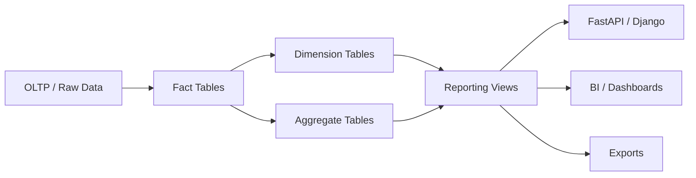
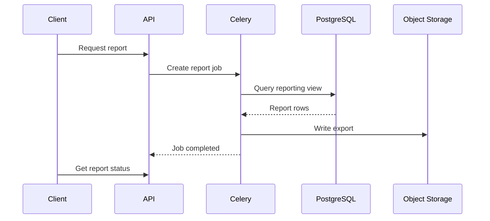

# 07- Reporting Views

## Overview

Reporting views provide a reusable SQL interface over analytical or reporting data.

A PostgreSQL view stores a query definition rather than storing a separate copy of its result:

```text
Base Tables / Fact Tables
        ↓
     View Query
        ↓
   Reporting View
        ↓
 Django / FastAPI / BI / gRPC
```

Views are particularly useful when multiple consumers need the same:

- Joins.
- Business metrics.
- Filters.
- Derived columns.
- Dimension relationships.
- Reporting semantics.

A normal view should be understood as a **database-level query abstraction**, not as a cache.

For analytics systems, views can provide a stable interface between the physical schema and consumers while keeping reporting SQL centralized.

The important design decision is whether a requirement needs:

| Requirement | Typical choice |
|---|---|
| Reusable query definition | View |
| Query-local transformation | CTE |
| Stored precomputed result | Materialized view |
| Multi-step intermediate processing | Temporary/staging table |
| Durable analytical dataset | Fact/aggregate table |

---

## What Is a Reporting View?

A view is created with:

```sql
CREATE VIEW customer_revenue_report AS
SELECT
    customer_id,
    SUM(net_amount) AS revenue
FROM fact_orders
GROUP BY customer_id;
```

Consumers query it like a table:

```sql
SELECT
    customer_id,
    revenue
FROM customer_revenue_report
WHERE revenue >= 10000;
```

The view definition is stored in PostgreSQL.

The underlying query is evaluated when the view is queried, subject to the optimizer's execution plan.

---

## Why Reporting Views Exist

Without a view, different applications may independently implement the same reporting logic:

```text
FastAPI
   └── SQL A

Django
   └── SQL B

BI Tool
   └── SQL C

Batch Job
   └── SQL D
```

Even small differences can create inconsistent metrics.

A reporting view can centralize the definition:

```text
                 ┌── FastAPI
                 │
                 ├── Django
                 │
Fact Tables → Reporting View
                 │
                 ├── BI Tool
                 │
                 └── Batch Job
```

This is especially valuable for metrics such as:

- Revenue.
- Active customers.
- Completed orders.
- Product performance.
- Customer lifetime value.
- Daily sales.
- Subscription status.

---

## Basic Reporting View

Example:

```sql
CREATE VIEW customer_revenue_report AS
SELECT
    c.customer_id,
    c.segment,
    SUM(o.net_amount) AS revenue,
    COUNT(*) AS order_count
FROM dim_customer AS c
JOIN fact_orders AS o
  ON o.customer_id = c.customer_id
GROUP BY
    c.customer_id,
    c.segment;
```

Consumers can then query:

```sql
SELECT
    customer_id,
    segment,
    revenue,
    order_count
FROM customer_revenue_report
ORDER BY revenue DESC;
```

The view hides implementation details such as the underlying joins and aggregation.

---

## View Data Flow

A typical analytics architecture is:



The view becomes a semantic layer over the physical schema.

---

## View vs CTE

A CTE is scoped to one statement.

A view is persistent and reusable.

| Characteristic | CTE | View |
|---|---|---|
| Scope | One statement | Persistent database object |
| Reusable across queries | No | Yes |
| Stored definition | No | Yes |
| Can be queried directly | Only within statement | Yes |
| Recursive support | Yes | View can be defined using recursive query patterns where supported |
| Materialized by default | No | No |
| Good for reusable reporting contract | Limited | Yes |
| Query-specific transformation | Excellent | Usually unnecessary |

Example CTE:

```sql
WITH customer_revenue AS (
    SELECT
        customer_id,
        SUM(net_amount) AS revenue
    FROM fact_orders
    GROUP BY customer_id
)
SELECT *
FROM customer_revenue;
```

Equivalent reusable view:

```sql
CREATE VIEW customer_revenue_report AS
SELECT
    customer_id,
    SUM(net_amount) AS revenue
FROM fact_orders
GROUP BY customer_id;
```

Use a CTE when the transformation belongs to one query.

Use a view when the transformation represents a reusable database-level interface.

---

## View vs Materialized View

This distinction is critical.

### Normal View

```text
definition stored
        ↓
query executed when accessed
```

### Materialized View

```text
definition stored
        ↓
result stored
        ↓
refresh required
```

| Characteristic | View | Materialized View |
|---|---|---|
| Stores result rows | No | Yes |
| Always reflects current base data | Query-time semantics | Only as of refresh |
| Refresh required | No | Yes |
| Can be indexed | No direct indexes on the view | Yes |
| Storage required | No result storage | Yes |
| Good for expensive recurring analytics | Sometimes | Often |
| Freshness | Current at query execution | Refresh-dependent |

Example materialized view:

```sql
CREATE MATERIALIZED VIEW monthly_customer_revenue AS
SELECT
    customer_id,
    date_trunc('month', occurred_at) AS month,
    SUM(net_amount) AS revenue
FROM fact_orders
GROUP BY
    customer_id,
    date_trunc('month', occurred_at);
```

It can then be indexed:

```sql
CREATE INDEX idx_monthly_customer_revenue_customer_month
ON monthly_customer_revenue (customer_id, month);
```

---

## When to Use a Reporting View

A normal view is a good fit when:

- Multiple consumers need the same SQL definition.
- The underlying joins are complex.
- Business semantics should be centralized.
- Data freshness should be query-time.
- The query is not too expensive for the workload.
- Consumers should not need direct knowledge of the physical schema.

Typical examples:

```text
customer_revenue_report
product_performance_report
daily_sales_report
subscription_status_report
tenant_usage_report
```

---

## When Not to Use a View

A view is usually not the right answer when:

- The query is extremely expensive and executed frequently.
- Results can tolerate stale data.
- The dataset should be indexed independently.
- A multi-step ETL process is required.
- Durable processing checkpoints are required.
- The view hides a poorly designed data model.

In those cases, consider:

```text
aggregate table
materialized view
staging table
analytics pipeline
dedicated warehouse
```

---

## Designing a Reporting View

A production reporting view should have a clearly defined grain.

For example:

```text
customer_revenue_report
    = one row per customer
```

or:

```text
monthly_product_report
    = one row per product per month
```

Documenting the grain prevents downstream consumers from making incorrect assumptions.

Example:

```sql
CREATE VIEW monthly_product_revenue AS
SELECT
    product_id,
    date_trunc('month', occurred_at) AS month,
    SUM(net_amount) AS revenue,
    COUNT(*) AS order_count
FROM fact_orders
GROUP BY
    product_id,
    date_trunc('month', occurred_at);
```

The view's grain is:

```text
product_id + month
```

---

## Stable Column Semantics

Reporting views should expose meaningful, stable columns.

Prefer:

```text
customer_id
month
revenue
order_count
```

over implementation-oriented names such as:

```text
x
tmp_total
join_value
```

Column semantics should be documented.

For example:

| Column | Meaning |
|---|---|
| `customer_id` | Customer identifier |
| `month` | Reporting month |
| `revenue` | Net revenue represented by included facts |
| `order_count` | Number of included fact rows |

This becomes especially important when BI tools and external consumers depend on the view.

---

## Avoid Ambiguous Metrics

A column called:

```text
revenue
```

may be interpreted differently by different teams.

Define whether it represents:

- Gross revenue.
- Net revenue.
- Revenue after discounts.
- Revenue excluding tax.
- Revenue excluding refunds.
- Recognized revenue.
- Transaction value.

A reporting view should encode a precise metric definition rather than relying on a misleadingly generic name.

---

## Filtering Inside vs Outside the View

Suppose the view contains:

```sql
CREATE VIEW completed_orders AS
SELECT
    order_id,
    customer_id,
    net_amount,
    occurred_at
FROM fact_orders
WHERE status = 'completed';
```

Consumers can then add:

```sql
SELECT *
FROM completed_orders
WHERE occurred_at >= $1
  AND occurred_at < $2;
```

For normal views, PostgreSQL can often optimize through the view and push predicates into the underlying query.

Therefore, a view does not automatically mean:

```text
execute entire view
↓
filter afterwards
```

The actual execution plan determines what happens.

---

## View Performance

A view itself does not cache query results.

This:

```sql
SELECT *
FROM customer_revenue_report
WHERE customer_id = $1;
```

still requires PostgreSQL to execute an appropriate plan over the underlying objects.

Performance depends on:

- Base-table indexes.
- Join strategy.
- Aggregation.
- Filtering.
- Data volume.
- Statistics.
- Query shape.
- Concurrency.
- Materialization choices.

Always validate important views with:

```sql
EXPLAIN (ANALYZE, BUFFERS)
SELECT *
FROM customer_revenue_report
WHERE customer_id = $1;
```

---

## Indexing a View

A normal PostgreSQL view cannot have its own indexes.

Indexes must exist on the underlying tables.

For example:

```sql
CREATE INDEX idx_fact_orders_customer_occurred
ON fact_orders (customer_id, occurred_at);
```

This can support queries against a view that filters or joins using those columns.

If the result itself needs indexes because it is expensive to compute repeatedly, consider a materialized view or aggregate table.

---

## Reporting Views and Aggregation

Views are particularly useful for hiding repetitive aggregation logic.

```sql
CREATE VIEW daily_sales_report AS
SELECT
    occurred_at::date AS sales_date,
    SUM(net_amount) AS revenue,
    COUNT(*) AS order_count
FROM fact_orders
GROUP BY occurred_at::date;
```

Consumers can then query:

```sql
SELECT
    sales_date,
    revenue,
    order_count
FROM daily_sales_report
WHERE sales_date >= DATE '2026-01-01'
ORDER BY sales_date;
```

However, casting timestamps to dates should be evaluated against the business timezone.

For timezone-sensitive reporting, define the conversion explicitly.

---

## Time Zone Semantics

A report described as:

```text
daily revenue
```

is incomplete unless the business timezone is known.

A timestamp should be converted into the reporting timezone before deriving the calendar date.

For example:

```sql
CREATE VIEW daily_sales_report AS
SELECT
    (occurred_at AT TIME ZONE 'Asia/Kolkata')::date AS sales_date,
    SUM(net_amount) AS revenue
FROM fact_orders
GROUP BY
    (occurred_at AT TIME ZONE 'Asia/Kolkata')::date;
```

The correct timezone should come from the reporting requirements rather than being arbitrarily embedded in SQL.

For multi-tenant systems, tenant-specific reporting calendars may require a different architecture.

---

## Reporting Views with Window Functions

Views can expose reusable analytical calculations.

```sql
CREATE VIEW customer_order_metrics AS
SELECT
    customer_id,
    order_id,
    occurred_at,
    net_amount,
    ROW_NUMBER() OVER (
        PARTITION BY customer_id
        ORDER BY occurred_at, order_id
    ) AS customer_order_number,
    SUM(net_amount) OVER (
        PARTITION BY customer_id
        ORDER BY occurred_at, order_id
        ROWS BETWEEN UNBOUNDED PRECEDING AND CURRENT ROW
    ) AS cumulative_revenue
FROM fact_orders;
```

Consumers can then query:

```sql
SELECT *
FROM customer_order_metrics
WHERE customer_id = $1
ORDER BY occurred_at, order_id;
```

This centralizes complex window semantics.

---

## Reporting Views and CTEs

A view can itself contain CTEs.

```sql
CREATE VIEW customer_monthly_metrics AS
WITH monthly_orders AS (
    SELECT
        customer_id,
        date_trunc('month', occurred_at) AS month,
        SUM(net_amount) AS revenue
    FROM fact_orders
    GROUP BY
        customer_id,
        date_trunc('month', occurred_at)
)
SELECT
    customer_id,
    month,
    revenue,
    SUM(revenue) OVER (
        PARTITION BY customer_id
        ORDER BY month
        ROWS BETWEEN UNBOUNDED PRECEDING AND CURRENT ROW
    ) AS cumulative_revenue
FROM monthly_orders;
```

This creates a reusable analytical interface while keeping the internal query structured.

However, avoid turning a view into an opaque chain of dozens of transformations.

---

## Security Through Views

Views can help expose only the columns required by a consumer.

Instead of granting access to:

```text
fact_orders
```

a reporting role may receive access to:

```text
customer_revenue_report
```

with only approved fields.

Example:

```sql
CREATE VIEW customer_revenue_report AS
SELECT
    customer_id,
    month,
    revenue
FROM monthly_customer_revenue;
```

This can reduce accidental exposure of sensitive columns.

However, a view should not automatically be considered a complete authorization boundary.

Evaluate:

- Base-table privileges.
- View privileges.
- RLS behavior.
- View ownership.
- Security-barrier requirements.
- Application authorization.
- Tenant isolation.

---

## Security-Barrier Views

PostgreSQL supports `security_barrier` views for cases where the view is intended to act as a stronger row-filtering boundary against certain optimizer transformations.

Example:

```sql
CREATE VIEW tenant_orders
WITH (security_barrier = true)
AS
SELECT
    order_id,
    tenant_id,
    net_amount
FROM fact_orders
WHERE tenant_id = current_setting('app.tenant_id')::bigint;
```

This should not be copied blindly.

Tenant isolation should normally be designed using appropriate database authorization and RLS mechanisms when those are the chosen security architecture.

Also ensure tenant context cannot leak between pooled connections.

---

## Multi-Tenant Reporting Views

A shared-schema SaaS analytics view might expose tenant-aware metrics:

```sql
CREATE VIEW tenant_monthly_revenue AS
SELECT
    tenant_id,
    date_trunc('month', occurred_at) AS month,
    SUM(net_amount) AS revenue
FROM fact_orders
GROUP BY
    tenant_id,
    date_trunc('month', occurred_at);
```

The application must still authorize access:

```text
request
  ↓
authenticated principal
  ↓
tenant authorization
  ↓
bounded query
  ↓
reporting view
```

A view containing `tenant_id` is not by itself a security control.

---

## Views and RLS

If PostgreSQL Row-Level Security is used, understand how the view interacts with the underlying table policies and execution role.

Important considerations include:

- Which role owns the view.
- Which role executes the query.
- Whether the underlying tables have RLS.
- Whether the relevant role bypasses RLS.
- Whether the table uses `FORCE ROW LEVEL SECURITY`.
- How tenant context is established in a pooled connection.

Do not assume that creating a view automatically makes a multi-tenant system safe.

---

## API Integration

Reporting views work well as a database interface for backend services.

Example:

```text
FastAPI
   ↓
Reporting Repository
   ↓
Reporting View
   ↓
Fact / Dimension Tables
```

A repository can keep the API independent from physical schema details.

```python
def get_customer_revenue(connection, customer_id: int):
    with connection.cursor() as cursor:
        cursor.execute(
            """
            SELECT
                customer_id,
                revenue,
                order_count
            FROM customer_revenue_report
            WHERE customer_id = %s
            """,
            [customer_id],
        )
        return cursor.fetchone()
```

The query uses parameter binding rather than string interpolation.

---

## Django Integration

A Django application can map a read-only model to a reporting view.

```python
from django.db import models


class CustomerRevenueReport(models.Model):
    customer_id = models.BigIntegerField(primary_key=True)
    revenue = models.DecimalField(max_digits=20, decimal_places=2)
    order_count = models.BigIntegerField()

    class Meta:
        managed = False
        db_table = "customer_revenue_report"
```

`managed = False` tells Django not to create or modify the database object through normal model migrations.

The migration creating the view should still be managed explicitly, typically through `RunSQL`.

---

## Managing Views with CI/CD

Views are schema objects and should be version-controlled.

A migration can create a view:

```python
from django.db import migrations


CREATE_VIEW = """
CREATE VIEW customer_revenue_report AS
SELECT
    customer_id,
    SUM(net_amount) AS revenue
FROM fact_orders
GROUP BY customer_id;
"""

DROP_VIEW = """
DROP VIEW IF EXISTS customer_revenue_report;
"""


class Migration(migrations.Migration):
    dependencies = [
        ("reports", "0001_initial"),
    ]

    operations = [
        migrations.RunSQL(
            sql=CREATE_VIEW,
            reverse_sql=DROP_VIEW,
        ),
    ]
```

For production systems, view changes should be treated like API changes.

---

## View Evolution

Changing a view can break consumers.

For example:

```sql
CREATE OR REPLACE VIEW ...
```

can change:

- Column names.
- Column types.
- Column ordering.
- Semantics.
- Dependencies.

Before modifying a production reporting view, identify:

```text
API consumers
BI dashboards
scheduled reports
ETL jobs
data exports
ad-hoc dependencies
```

Treat stable reporting views as contracts.

---

## Backward-Compatible Changes

A safer evolution pattern is:

```text
existing_view
    ↓
new_view
    ↓
migrate consumers
    ↓
remove old view
```

For example:

```text
customer_revenue_v1
customer_revenue_v2
```

can coexist during migration if compatibility requirements justify versioning.

Avoid changing metric semantics silently.

---

## Dependency Management

Views depend on underlying database objects.

A dependency chain may look like:

```text
fact_orders
   ↓
customer_monthly_revenue
   ↓
customer_revenue_report
   ↓
FastAPI
   ↓
Dashboard
```

Schema migrations must account for these dependencies.

Dropping or renaming a base column can break dependent views.

Before destructive migrations, inspect dependencies and deploy changes in a compatible sequence.

---

## Views and Schema Migrations

A safe migration sequence may be:

```text
1. Add new base column/table
        ↓
2. Backfill if required
        ↓
3. Update view definition
        ↓
4. Deploy application consuming new semantics
        ↓
5. Remove deprecated schema later
```

Avoid destructive database changes in the same deployment that still requires the old view definition.

---

## Reporting View Naming

Names should communicate purpose and grain.

Good:

```text
customer_revenue_report
monthly_product_revenue
daily_sales_report
tenant_usage_summary
```

Less useful:

```text
report1
view_data
customer_data_v2_final
tmp_report
```

For versioned contracts:

```text
customer_revenue_v1
customer_revenue_v2
```

can be clearer than silently changing semantics.

---

## Views and BI Tools

Reporting views are often a useful interface for:

- Metabase.
- Superset.
- Tableau.
- Power BI.
- Internal dashboards.

The view can provide:

```text
stable dimensions
+
stable metrics
+
controlled joins
+
consistent semantics
```

This reduces the amount of SQL that BI users need to write.

However, do not expose a massive universal view containing every possible dimension and measure.

That can cause:

- Excessive joins.
- Large intermediate results.
- Ambiguous metrics.
- Slow dashboards.
- Difficult governance.

Prefer purpose-oriented reporting views.

---

## Wide Reporting Views

A view with dozens or hundreds of columns may appear convenient:

```text
customer
+ orders
+ payments
+ shipments
+ products
+ marketing
+ support
+ every derived metric
```

but it can become an architectural bottleneck.

Potential problems:

- Join multiplication.
- Expensive execution.
- Unclear grain.
- Consumer coupling.
- Difficult optimization.
- Security exposure.

Prefer narrower views with explicit analytical grain.

---

## Reporting Views and Materialized Aggregates

A scalable analytics architecture may use both:

```text
Fact Tables
    ↓
Aggregate Tables / Materialized Views
    ↓
Reporting Views
    ↓
API / BI
```

For example:

```text
fact_orders
    ↓
monthly_customer_revenue
    ↓
customer_revenue_report
```

The aggregate table or materialized view handles expensive computation.

The normal view provides a stable consumer-facing interface.

This separation is often more scalable than putting all computation directly inside one normal view.

---

## Reporting Views and Redis

Redis can cache frequently requested reports:

```text
API
 ↓
Redis
 ↓ miss
Reporting View
 ↓
PostgreSQL
```

The view remains the source of the report definition.

Redis handles request-level caching.

Define:

- TTL.
- Cache key.
- Tenant identity.
- Filter parameters.
- Freshness requirements.
- Invalidation strategy.

Never allow a cache key to omit tenant identity in a multi-tenant system.

---

## Reporting Views and Celery

Large reports should often be asynchronous.



This avoids tying expensive analytical work to an HTTP request timeout.

---

## High Availability

Normal views do not introduce separate storage or replication requirements.

They execute against the database objects they reference.

For read-heavy reporting workloads, consider:

```text
Primary PostgreSQL
       ↓
Read Replica
       ↓
Reporting Queries
```

if the application's consistency requirements permit replica reads.

Monitor:

- Replica lag.
- Query latency.
- Replica CPU.
- Replica I/O.
- Connection saturation.

Do not route a report to a replica if it requires immediate visibility of a just-committed transaction and replica lag can violate that requirement.

---

## Disaster Recovery

Views are schema definitions, so they should be recreated from:

- Migration files.
- Schema deployment tooling.
- Infrastructure-as-code where appropriate.

A DR process should verify:

```text
base tables restored
    ↓
indexes restored
    ↓
views recreated
    ↓
materialized views refreshed
    ↓
report queries validated
```

For materialized views, the underlying data may be restored while the derived result still requires refresh.

---

## Monitoring and Observability

Monitor views through the queries that consume them.

Useful metrics include:

- Query latency.
- Execution count.
- Rows returned.
- Rows scanned.
- Temporary files.
- CPU time.
- I/O.
- Lock waits.
- Connection usage.

Track reporting workloads by:

```text
report name
consumer
tenant
time range
result size
execution duration
```

where practical.

Database query statistics tooling can help identify expensive consumers.

---

## Cost Considerations

Normal views have no independent result-storage cost, but their queries still consume database resources.

Cost can come from:

```text
CPU
I/O
temporary storage
replica capacity
connection capacity
query concurrency
```

If the same expensive view is queried thousands of times, the issue is not that views are inherently expensive.

The issue is that the underlying analytical work is being repeated.

Consider:

```text
normal view
    ↓
optimize query
    ↓
pre-aggregate
    ↓
materialized view
    ↓
cache
    ↓
dedicated analytics infrastructure
```

Choose based on freshness and workload requirements.

---

## Common Mistakes

### Treating a View as a Cache

**Problem:** repeated queries still execute the underlying definition.

**Solution:** use a materialized view or cache when precomputed results are actually required.

### Hiding a Bad Data Model Behind a View

**Problem:** a complex view can hide join multiplication and inefficient schema design.

**Solution:** fix the underlying model or create appropriate aggregate structures.

### Exposing Every Column

**Problem:** consumers become coupled to implementation details and may access sensitive fields.

**Solution:** expose only the fields required by the reporting contract.

### Ignoring Grain

**Problem:** joins can create duplicate metrics.

**Solution:** explicitly define the view's grain and validate cardinality.

### Embedding Ambiguous Business Logic

**Problem:** consumers interpret metrics differently.

**Solution:** define exact metric semantics.

### Assuming Views Improve Performance

**Problem:** views primarily provide abstraction and reuse.

**Solution:** inspect execution plans and consider materialization for expensive workloads.

### Making Destructive Schema Changes Without Checking Dependencies

**Problem:** dependent views or consumers can break during deployment.

**Solution:** treat views as schema dependencies and use compatibility-first migrations.

### Using Views as the Authorization System

**Problem:** a view alone may not provide sufficient tenant or role isolation.

**Solution:** combine least-privilege permissions, RLS where appropriate, and application authorization.

### Building One Universal Reporting View

**Problem:** enormous joins and unclear grain make the view slow and difficult to govern.

**Solution:** create purpose-oriented views around explicit analytical grains.

### Performing Huge Exports Synchronously

**Problem:** long-running queries can consume connections and cause API timeouts.

**Solution:** use Celery/background processing and object storage for large exports.

---

## Production Checklist

### Design

- [ ] View purpose is clearly defined.
- [ ] Grain is documented.
- [ ] Column semantics are documented.
- [ ] Business metrics have precise definitions.
- [ ] Sensitive columns are excluded.
- [ ] Joins cannot unexpectedly multiply measures.

### Performance

- [ ] Important queries have been tested with realistic data volumes.
- [ ] `EXPLAIN (ANALYZE, BUFFERS)` has been reviewed.
- [ ] Base-table indexes support important access patterns.
- [ ] Large recurring computations have been evaluated for pre-aggregation.
- [ ] Materialized views are considered where freshness permits.
- [ ] Query concurrency is understood.

### Security

- [ ] Consumers receive only required privileges.
- [ ] Tenant authorization is enforced.
- [ ] RLS behavior is understood where applicable.
- [ ] Dynamic SQL inputs are validated.
- [ ] Sensitive data is not unnecessarily exposed.
- [ ] Pooled connection context cannot leak between requests.

### Application

- [ ] View definitions are version-controlled.
- [ ] Schema changes account for view dependencies.
- [ ] API consumers have explicit contracts.
- [ ] Large reports are asynchronous.
- [ ] Query parameters are bound safely.
- [ ] Read-replica consistency requirements are documented.

### Operations

- [ ] Query latency is monitored.
- [ ] Expensive consumers are identifiable.
- [ ] Database CPU/I/O are monitored.
- [ ] Replica lag is monitored where relevant.
- [ ] DR can recreate the view definitions.
- [ ] Materialized results have refresh procedures.

---

## Senior Decision Framework

Use the following decision process:

```text
Do multiple consumers need the same SQL definition?
                │
          ┌─────┴─────┐
          │           │
         No          Yes
          │           │
       CTE /       Reporting
       query        View
                      │
                      ↓
             Is execution expensive?
                      │
             ┌────────┴────────┐
             │                 │
            No                Yes
             │                 │
       Normal View       Can freshness be
                         relaxed?
                              │
                       ┌──────┴──────┐
                       │             │
                      No            Yes
                       │             │
                 Optimize query   Materialized
                 / schema         View / Aggregate
                                      │
                                      ↓
                                Need stable API?
                                      │
                                      ↓
                              Reporting View
```

A strong architecture often separates:

```text
physical data model
        ↓
aggregation / computation
        ↓
reporting interface
        ↓
application / BI consumers
```

This prevents every consumer from rebuilding analytical semantics independently.

---

## Interview Traps

### "A View Stores the Query Result"

A normal view stores the query definition.

A materialized view stores a result set.

### "A View Is Faster Than the Underlying Query"

Not inherently.

The optimizer can often optimize through a normal view.

Performance comes from the resulting execution plan.

### "Views Are Always Materialized"

No.

Normal PostgreSQL views are not result caches.

### "You Can Add an Index to a Normal View"

No.

Indexes belong to underlying tables.

Materialized views can have indexes.

### "Views Are Just for Security"

No.

They can reduce exposed columns and provide an abstraction boundary, but authorization may also require privileges, RLS, and application-level controls.

### "A View Defines the Business Metric Automatically"

Only if its semantics are explicitly and correctly defined.

A column named `revenue` without a precise definition can still produce organizational inconsistency.

### "A View Should Contain Everything"

No.

Large universal views often create performance, governance, grain, and security problems.

### "A Materialized View Is Always Better"

No.

It introduces:

- Storage.
- Refresh operations.
- Staleness.
- Refresh failure handling.
- Additional operational complexity.

Use it when the workload justifies those trade-offs.

### "Changing a View Is an Internal Database Change"

Not necessarily.

If APIs, dashboards, or scheduled jobs consume the view, its schema and semantics are an external contract.

## Key Takeaways

- **A normal reporting view is a reusable database-level query abstraction, not a cache; PostgreSQL evaluates its underlying query when consumers access it.**
- **Define the view's grain and metric semantics explicitly, because a reusable view can become a shared analytical contract across APIs, BI tools, exports, and batch jobs.**
- **Use normal views for reusable query logic, CTEs for statement-local transformations, and materialized views or aggregate tables when expensive recurring computation needs precomputed results.**
- **Treat reporting views as production schema contracts: version them through CI/CD, manage dependencies carefully, enforce least-privilege access and tenant isolation, and validate important workloads with real execution plans.**
- **At scale, separate analytical computation from the consumer interface so expensive aggregation can be precomputed while a stable reporting view remains the interface for Django, FastAPI, BI, and other consumers.**