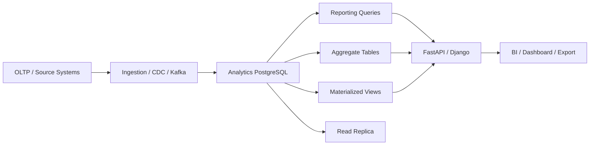
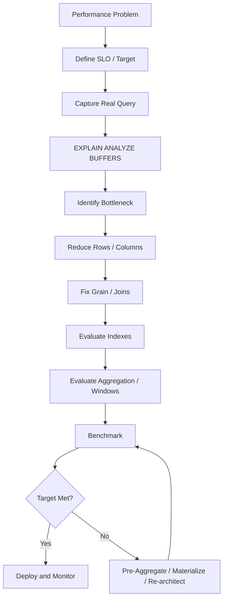

# 08- Performance Optimization

## Overview

Performance optimization in an analytics and reporting database is primarily about controlling:

- Rows processed.
- Data scanned.
- Join cardinality.
- Sort volume.
- Aggregation cost.
- Memory consumption.
- I/O.
- Query concurrency.
- Freshness requirements.

A query that works well on 100,000 rows can become operationally expensive at 100 million rows.

The goal is not to make every query execute as fast as theoretically possible. The goal is to achieve the required latency, throughput, freshness, and cost within the workload's operational constraints.

A useful optimization model is:

```text
Correctness
    ↓
Correct analytical grain
    ↓
Bound the input
    ↓
Reduce unnecessary columns
    ↓
Control join cardinality
    ↓
Aggregate efficiently
    ↓
Optimize windows / sorting
    ↓
Use appropriate indexes
    ↓
Inspect execution plans
    ↓
Measure under realistic load
    ↓
Materialize / pre-aggregate when justified
```

For an analytics database, optimization must also consider the architecture around PostgreSQL:



---

## Performance Goals

Performance requirements should be expressed as measurable targets.

| Dimension | Example target |
|---|---|
| Interactive dashboard | p95 < 2 seconds |
| API report | p95 < 1 second |
| Background export | Completion within 10 minutes |
| Daily aggregation | Complete before business reporting window |
| Freshness | Data less than 15 minutes old |
| Concurrent reports | 100 active requests |
| Availability | 99.9% |

These numbers are examples, not universal targets.

Optimization without a defined target often produces unnecessary complexity.

---

## Measure Before Optimizing

Do not optimize based only on intuition.

Start with:

```sql
EXPLAIN (ANALYZE, BUFFERS)
SELECT
    customer_id,
    SUM(net_amount) AS revenue
FROM fact_orders
WHERE occurred_at >= $1
  AND occurred_at < $2
GROUP BY customer_id;
```

Important information includes:

- Actual execution time.
- Estimated rows.
- Actual rows.
- Scan method.
- Join method.
- Sort method.
- Buffer hits.
- Buffer reads.
- Temporary-file activity.
- Parallel execution.

The objective is to identify where time and resources are actually being spent.

---

## `EXPLAIN` vs `EXPLAIN ANALYZE`

`EXPLAIN` shows the optimizer's planned execution strategy.

```sql
EXPLAIN
SELECT
    customer_id,
    SUM(net_amount)
FROM fact_orders
GROUP BY customer_id;
```

`EXPLAIN ANALYZE` executes the query and reports actual runtime behavior.

```sql
EXPLAIN (ANALYZE, BUFFERS)
SELECT
    customer_id,
    SUM(net_amount)
FROM fact_orders
GROUP BY customer_id;
```

Use `ANALYZE` carefully for statements that modify data because the statement actually executes.

For production investigation, run expensive analytical queries against a controlled environment or use appropriate read-only analysis where possible.

---

## Estimated vs Actual Rows

A critical optimization signal is:

```text
estimated rows
vs
actual rows
```

For example:

```text
rows=1000
actual rows=500000
```

A large mismatch can cause poor plan selection.

Potential causes include:

- Stale statistics.
- Data skew.
- Correlated columns.
- Complex predicates.
- Highly selective combinations not represented by basic statistics.

Start with:

```sql
ANALYZE fact_orders;
```

Then re-check the plan.

---

## Reduce the Input Dataset

One of the most effective optimization techniques is reducing rows before expensive operations.

Prefer:

```sql
WITH filtered_orders AS (
    SELECT
        customer_id,
        net_amount
    FROM fact_orders
    WHERE occurred_at >= $1
      AND occurred_at < $2
      AND status = 'completed'
)
SELECT
    customer_id,
    SUM(net_amount) AS revenue
FROM filtered_orders
GROUP BY customer_id;
```

over unnecessarily processing the entire historical table.

The optimizer may push predicates automatically, but the query should still express the intended filtering clearly.

---

## Bound Reporting Time Ranges

Reporting APIs should not allow unrestricted historical scans by default.

Prefer:

```text
last 30 days
last 90 days
custom bounded range
```

over:

```text
all available history
```

Example:

```sql
WHERE occurred_at >= $1
  AND occurred_at < $2
```

The API can enforce:

```python
MAX_REPORT_DAYS = 365
```

and reject requests exceeding the supported range.

Large historical exports should normally be asynchronous.

---

## Reduce Selected Columns

Avoid:

```sql
SELECT *
FROM fact_orders;
```

Prefer:

```sql
SELECT
    customer_id,
    occurred_at,
    net_amount
FROM fact_orders;
```

Wide rows increase:

- Memory usage.
- I/O.
- Network transfer.
- Sort volume.
- Temporary storage.
- Application serialization cost.

This is particularly important for fact tables containing JSON, large text, or other wide attributes.

---

## Join Cardinality

A large portion of analytics performance problems originate from joins.

Consider:

```text
orders
  1
  │
  N
order_items
```

Joining them changes the result grain.

If:

```text
1 million orders
×
10 items per order
```

the joined dataset may contain approximately:

```text
10 million rows
```

before later aggregation.

Always reason about:

```text
input rows
×
join multiplicity
=
intermediate rows
```

before evaluating query performance.

---

## Aggregate Before Joining When Appropriate

If the report needs order-level metrics from order items, aggregate the items first.

```sql
WITH order_totals AS (
    SELECT
        order_id,
        SUM(line_amount) AS order_total
    FROM fact_order_items
    GROUP BY order_id
)
SELECT
    o.customer_id,
    SUM(ot.order_total) AS revenue
FROM fact_orders AS o
JOIN order_totals AS ot
  ON ot.order_id = o.order_id
GROUP BY o.customer_id;
```

This can reduce the number of rows participating in later joins.

The optimizer may produce an equivalent plan, but explicit analytical staging also makes the intended grain easier to verify.

---

## Avoid Accidental Cartesian Products

This is dangerous:

```sql
SELECT *
FROM fact_orders o
CROSS JOIN dim_customer c;
```

unless the Cartesian product is explicitly required.

If:

```text
fact_orders = 10 million
dim_customer = 1 million
```

the theoretical intermediate result is enormous.

Missing join predicates can create catastrophic performance problems.

---

## `EXISTS` for Existence Checks

If the report only needs to determine whether related data exists, do not create unnecessary multiplicity.

Prefer:

```sql
SELECT
    c.customer_id
FROM dim_customer c
WHERE EXISTS (
    SELECT 1
    FROM fact_orders o
    WHERE o.customer_id = c.customer_id
);
```

rather than joining and then deduplicating:

```sql
SELECT DISTINCT
    c.customer_id
FROM dim_customer c
JOIN fact_orders o
  ON o.customer_id = c.customer_id;
```

PostgreSQL may optimize both forms effectively, so validate with the actual plan.

The key point is semantic: `EXISTS` expresses existence directly.

---

## Aggregation Performance

Aggregation can be expensive when the input dataset is large.

Example:

```sql
SELECT
    customer_id,
    SUM(net_amount) AS revenue
FROM fact_orders
GROUP BY customer_id;
```

PostgreSQL may use strategies such as:

```text
HashAggregate
GroupAggregate
```

depending on the query and planner decisions.

Performance depends on:

- Input rows.
- Number of groups.
- Available memory.
- Sort requirements.
- Parallelism.
- Data distribution.

---

## Hash Aggregation

Hash aggregation can be efficient when the number of groups fits well within available memory.

Conceptually:

```text
input rows
    ↓
hash customer_id
    ↓
aggregate per key
```

Large cardinality can increase memory requirements.

If memory becomes insufficient, the database may use additional I/O.

---

## Group Aggregation and Sorting

A grouped query may require ordering:

```sql
GROUP BY customer_id
ORDER BY customer_id;
```

or other operations that require sorting.

Large sorts can spill to temporary storage.

Inspect:

```sql
EXPLAIN (ANALYZE, BUFFERS)
...
```

for sort behavior.

Do not assume increasing `work_mem` globally is the correct solution.

---

## Window Function Performance

Window functions frequently require ordering.

Example:

```sql
SELECT
    customer_id,
    month,
    revenue,
    SUM(revenue) OVER (
        PARTITION BY customer_id
        ORDER BY month
        ROWS BETWEEN UNBOUNDED PRECEDING AND CURRENT ROW
    ) AS cumulative_revenue
FROM monthly_customer_revenue;
```

Potential costs include:

- Sorting.
- Large partitions.
- Memory consumption.
- Multiple window definitions.

Keep window partitions bounded where business semantics allow it.

---

## Multiple Window Functions

Several windows can be useful:

```sql
SELECT
    customer_id,
    month,
    revenue,
    SUM(revenue) OVER (
        PARTITION BY customer_id
        ORDER BY month
    ) AS cumulative_revenue,
    LAG(revenue) OVER (
        PARTITION BY customer_id
        ORDER BY month
    ) AS previous_revenue
FROM monthly_customer_revenue;
```

When window definitions share:

```text
PARTITION BY
ORDER BY
```

the database may be able to reuse work.

Use a named window when it improves clarity:

```sql
SELECT
    customer_id,
    month,
    revenue,
    SUM(revenue) OVER w AS cumulative_revenue,
    LAG(revenue) OVER w AS previous_revenue
FROM monthly_customer_revenue
WINDOW w AS (
    PARTITION BY customer_id
    ORDER BY month
);
```

---

## CTE Performance

CTEs are useful for structuring analytical queries, but they are not inherently performance optimizations.

Modern PostgreSQL can inline eligible non-recursive, side-effect-free CTEs.

For example:

```sql
WITH filtered_orders AS (
    SELECT
        customer_id,
        net_amount
    FROM fact_orders
    WHERE occurred_at >= $1
)
SELECT
    customer_id,
    SUM(net_amount)
FROM filtered_orders
GROUP BY customer_id;
```

may be optimized similarly to an equivalent inline query.

Do not assume:

```text
CTE
=
materialized intermediate table
```

---

## Explicit CTE Materialization

PostgreSQL supports:

```sql
WITH expensive_stage AS MATERIALIZED (
    SELECT
        ...
)
SELECT ...
FROM expensive_stage;
```

Materialization can be useful when:

- An expensive result is reused.
- Repeated computation is undesirable.
- An explicit optimization boundary is beneficial.

But it can also prevent predicate pushdown and increase memory/I/O.

Use:

```sql
EXPLAIN (ANALYZE, BUFFERS)
```

to validate the decision.

---

## Avoid Unnecessary CTE Materialization

This:

```sql
WITH all_orders AS MATERIALIZED (
    SELECT *
    FROM fact_orders
)
SELECT *
FROM all_orders
WHERE customer_id = $1;
```

can force unnecessary intermediate processing.

Prefer a query where filtering can be optimized directly:

```sql
SELECT *
FROM fact_orders
WHERE customer_id = $1;
```

Materialization should be a deliberate performance decision.

---

## Indexing Strategy

Indexes are most effective when driven by actual access patterns.

For example:

```sql
CREATE INDEX idx_fact_orders_customer_time
ON fact_orders (customer_id, occurred_at);
```

can support queries such as:

```sql
WHERE customer_id = $1
  AND occurred_at >= $2
  AND occurred_at < $3
```

But indexes have costs:

- Storage.
- Write amplification.
- WAL generation.
- Vacuum overhead.
- Maintenance.
- Backup size.
- Replication traffic.

Do not index every reporting column.

---

## Composite Index Ordering

For a query:

```sql
WHERE tenant_id = $1
  AND occurred_at >= $2
  AND occurred_at < $3
ORDER BY occurred_at DESC;
```

a composite index such as:

```sql
(tenant_id, occurred_at DESC)
```

may be appropriate.

The correct order depends on:

- Equality predicates.
- Range predicates.
- Ordering.
- Selectivity.
- Cardinality.
- Workload frequency.

Do not choose column order based only on which column has the highest cardinality.

---

## Partial Indexes

If analytics frequently filters a stable subset, a partial index may be useful.

Example:

```sql
CREATE INDEX idx_fact_orders_completed_time
ON fact_orders (occurred_at, customer_id)
WHERE status = 'completed';
```

This can reduce index size and write overhead compared with indexing all rows.

The query predicate must align with the index predicate for the planner to use it effectively.

---

## Covering Indexes

PostgreSQL supports `INCLUDE` columns.

Example:

```sql
CREATE INDEX idx_orders_customer_time
ON fact_orders (customer_id, occurred_at)
INCLUDE (net_amount);
```

This can support index-only scans when visibility information and other conditions permit.

Do not add large numbers of included columns blindly.

A covering index can become large and expensive to maintain.

---

## Partitioning

Partitioning can help large analytics tables, particularly when queries naturally filter by partition keys.

A common pattern is time-based partitioning:

```text
fact_orders
├── 2026-01
├── 2026-02
├── 2026-03
└── ...
```

A query restricted to March may only need to scan the relevant partition when partition pruning applies.

Partitioning does not automatically make every query faster.

It introduces:

- More objects.
- Maintenance complexity.
- Partition management.
- Index management.
- Operational considerations.

Use it when table size and access patterns justify it.

---

## Partition Pruning

Example:

```sql
SELECT
    SUM(net_amount)
FROM fact_orders
WHERE occurred_at >= TIMESTAMPTZ '2026-03-01 00:00:00+00'
  AND occurred_at < TIMESTAMPTZ '2026-04-01 00:00:00+00';
```

With appropriate time partitioning, PostgreSQL can exclude unrelated partitions.

Avoid expressions that unnecessarily obscure partition boundaries.

Always verify pruning in the execution plan.

---

## Pre-Aggregation

If a dashboard repeatedly calculates:

```text
billions of fact rows
→ daily revenue
```

executing the aggregation for every request is often wasteful.

Instead:

```text
fact_orders
    ↓
daily_customer_metrics
    ↓
reporting view
    ↓
dashboard
```

Example:

```sql
CREATE TABLE daily_customer_metrics (
    metric_date date NOT NULL,
    customer_id bigint NOT NULL,
    revenue numeric(20, 2) NOT NULL,
    order_count bigint NOT NULL,
    PRIMARY KEY (metric_date, customer_id)
);
```

The reporting layer can then query a much smaller dataset.

---

## Materialized Views

Materialized views are useful when:

- Queries are expensive.
- Results are requested frequently.
- Slightly stale data is acceptable.
- Refresh cost is manageable.

Example:

```sql
CREATE MATERIALIZED VIEW monthly_customer_revenue AS
SELECT
    customer_id,
    date_trunc('month', occurred_at) AS month,
    SUM(net_amount) AS revenue
FROM fact_orders
GROUP BY
    customer_id,
    date_trunc('month', occurred_at);
```

Then:

```sql
REFRESH MATERIALIZED VIEW monthly_customer_revenue;
```

Refresh strategy must be designed around:

- Freshness.
- Duration.
- Locking.
- Failure handling.
- Concurrent access.
- Rebuild requirements.

---

## Incremental Aggregation

For high-volume systems, recomputing all historical aggregates may be too expensive.

A better architecture can be:

```text
New events
    ↓
Incremental processing
    ↓
Daily aggregate
    ↓
Monthly aggregate
    ↓
Reporting view
```

This requires careful handling of:

- Late events.
- Duplicate events.
- Corrections.
- Reprocessing.
- Idempotency.

The database query is only one part of the performance architecture.

---

## Late-Arriving Events

Suppose:

```text
event date = January 10
arrival date = January 15
```

An incremental pipeline that only processes January 15 data can miss the historical correction.

A robust design may:

```text
identify affected partitions
        ↓
recompute affected aggregates
        ↓
update dependent reporting structures
```

Window functions and derived metrics may also require recomputation for subsequent rows.

---

## Data Distribution and Skew

Average statistics can hide extreme cases.

Example:

```text
Most customers: 1,000 orders
Largest customer: 100 million orders
```

A window or aggregation partitioned by customer can be dominated by one partition.

Measure:

- Largest partition.
- Largest tenant.
- Largest customer.
- Largest date range.
- Highest-cardinality grouping.

Senior-level performance engineering focuses on the tail of the distribution, not just averages.

---

## Query Concurrency

A query that takes:

```text
5 seconds
```

may be acceptable when run once per minute.

It may become unacceptable when:

```text
5 seconds
×
500 concurrent users
```

are executing it.

Performance must therefore consider:

```text
query cost
×
concurrency
```

Shared database resources include:

- CPU.
- Memory.
- I/O.
- Connections.
- Temporary storage.

---

## Connection Pooling

An analytics API should not create an unlimited number of PostgreSQL connections.

Use controlled pools.

For example:

```text
Kubernetes pods
    ↓
application connection pools
    ↓
PgBouncer where appropriate
    ↓
PostgreSQL
```

The total possible database connections are approximately influenced by:

```text
pods
×
pool size
```

A deployment scaling from 10 to 100 pods can unexpectedly overload PostgreSQL if each pod opens a large pool.

---

## Read Replicas

Read-heavy reporting can be routed to a PostgreSQL read replica:

```text
Primary
   │
   ├── writes
   │
   └── replication
          ↓
       Replica
          ↓
      Analytics
```

This can reduce primary workload.

But replicas introduce:

- Replication lag.
- Read-after-write inconsistency.
- Additional infrastructure cost.
- Additional monitoring.

Reports requiring current transactional data may need primary reads.

---

## API-Level Performance Controls

A reporting API should enforce resource limits.

Example:

```python
from fastapi import FastAPI, Query

app = FastAPI()

@app.get("/v1/reports/revenue")
def revenue_report(
    days: int = Query(default=30, ge=1, le=365),
    limit: int = Query(default=100, ge=1, le=1000),
):
    return {
        "days": days,
        "limit": limit,
    }
```

Typical controls include:

- Maximum date range.
- Maximum rows.
- Query timeout.
- Request timeout.
- Rate limiting.
- Tenant-level quotas.
- Concurrent report limits.

Nginx can provide an additional request-level control layer, but database-level protections remain necessary.

---

## Large Exports

Do not force a million-row analytics export through a synchronous HTTP request.

Prefer:

```text
POST /reports
    ↓
create job
    ↓
Celery
    ↓
PostgreSQL
    ↓
CSV / Parquet
    ↓
Object storage
    ↓
client download
```

For AWS deployments, object storage such as S3 is a common destination.

The database query can be optimized independently from the HTTP request lifecycle.

---

## Streaming Does Not Eliminate Database Work

Application-side streaming can reduce application memory:

```python
for row in cursor:
    write_row(row)
```

but it does not automatically make the database query cheap.

The database may still need to:

- Scan millions of rows.
- Join large tables.
- Sort.
- Aggregate.
- Execute window functions.

Streaming solves a different problem:

```text
application memory
```

rather than:

```text
database computation
```

---

## Pagination for Reports

For interactive APIs, avoid deep offset pagination:

```sql
LIMIT 100
OFFSET 1000000;
```

For ordered datasets, keyset pagination is often more efficient:

```sql
WHERE (occurred_at, event_id) < ($1, $2)
ORDER BY occurred_at DESC, event_id DESC
LIMIT 100;
```

The ordering must be deterministic.

For analytical reports where ranking or complete aggregation is required, pagination may not eliminate the cost of computing the report itself.

---

## Avoid Repeated `COUNT(*)`

A dashboard that repeatedly executes:

```sql
SELECT COUNT(*)
FROM fact_orders
WHERE ...;
```

may perform expensive work.

Ask whether the UI actually needs:

```text
exact total
```

or only:

```text
has more rows?
```

For existence:

```sql
SELECT EXISTS (
    SELECT 1
    FROM fact_orders
    WHERE ...
);
```

For approximate or precomputed metrics, use an appropriate aggregate architecture rather than repeatedly counting billions of rows.

---

## Query Caching

Redis can reduce repeated database computation.

```text
Client
  ↓
FastAPI
  ↓
Redis
  ├── hit → response
  │
  └── miss
       ↓
   PostgreSQL
       ↓
    Redis
       ↓
   response
```

A cache is appropriate when:

- The query is expensive.
- The same parameters are requested frequently.
- Freshness requirements permit caching.

Cache keys should include all relevant dimensions:

```text
tenant
report
date range
filters
version
```

Never allow cached data to cross tenant boundaries.

---

## Cache Invalidation

A cached report can become incorrect when source data changes.

Strategies include:

- Short TTL.
- Explicit invalidation.
- Versioned cache keys.
- Event-driven invalidation.
- Periodic refresh.

For analytics, a freshness contract is often simpler than attempting perfect real-time invalidation.

Example:

```text
Dashboard freshness:
≤ 5 minutes
```

This provides a concrete operational target.

---

## Reporting View Performance

A normal view does not cache results.

For:

```sql
SELECT *
FROM customer_revenue_report
WHERE customer_id = $1;
```

PostgreSQL still evaluates an appropriate plan over the underlying objects.

Optimize the underlying:

- Tables.
- Indexes.
- Aggregates.
- Join structure.
- Statistics.
- Materialization strategy.

Use views primarily for reusable semantics and interfaces.

---

## Statistics and Data Changes

Planner statistics become particularly important in analytics systems because data distributions change.

Examples:

```text
new tenant
large historical backfill
seasonal traffic
major customer acquisition
status distribution change
```

After significant data changes, statistics may need refreshing.

```sql
ANALYZE fact_orders;
```

Autovacuum/analyze settings should be evaluated for rapidly changing analytical tables.

---

## Extended Statistics

Basic statistics may not capture relationships between columns.

For correlated predicates such as:

```sql
WHERE region_id = $1
  AND customer_segment = $2
```

the planner may estimate poorly if the columns are strongly correlated.

PostgreSQL supports extended statistics for appropriate cases.

Example:

```sql
CREATE STATISTICS customer_region_segment_stats
ON region_id, customer_segment
FROM dim_customer;
```

Then:

```sql
ANALYZE dim_customer;
```

Use this when execution-plan evidence shows a statistics problem.

---

## Work Memory

`work_mem` controls memory available to individual query operations such as sorts and hash operations.

It is not equivalent to:

```text
maximum memory per connection
```

A single query may perform multiple operations that consume memory.

Under high concurrency:

```text
many queries
×
multiple operations
×
work_mem
```

can produce significant memory pressure.

Tune carefully and measure temporary-file behavior before changing settings.

---

## Query Timeouts

Production analytics endpoints should have appropriate timeouts.

Important PostgreSQL settings include:

```sql
SET LOCAL statement_timeout = '30s';
SET LOCAL lock_timeout = '2s';
```

These solve different problems.

| Setting | Purpose |
|---|---|
| `statement_timeout` | Limits statement execution time |
| `lock_timeout` | Limits waiting to acquire locks |
| `idle_in_transaction_session_timeout` | Terminates sessions idle inside transactions |

For API workloads, application and database timeout layers should be designed together.

---

## Long-Running Transactions

Large analytical queries inside long-lived transactions can create operational problems.

Potential effects include:

- Delayed vacuum cleanup.
- Table/index bloat.
- Increased transaction ID pressure.
- Longer lock retention where applicable.
- More difficult operational recovery.

Keep transaction scope narrow.

A read-only analytics query does not automatically require an explicit long-lived transaction around multiple unrelated operations.

---

## Background Processing

Long reports should use background workers such as Celery.

Example:

```text
API
 ↓
create report_job
 ↓
Celery
 ↓
bounded SQL query
 ↓
write output
 ↓
update job status
```

The job should support:

- Idempotency.
- Retry.
- Timeout.
- Cancellation where practical.
- Durable status.
- Failure reporting.

Do not rely on an in-memory worker state as the only record of job progress.

---

## PostgreSQL and Dedicated Analytics Systems

PostgreSQL can support substantial analytical workloads, but there is a point where a dedicated analytical platform becomes more appropriate.

Consider moving heavy workloads when:

- Fact volume becomes very large.
- Complex scans dominate database resources.
- Concurrent reporting affects OLTP.
- Historical analytics require long-running scans.
- Columnar storage would provide major benefits.
- Data needs span many source systems.

Architecture may evolve toward:

```text
OLTP PostgreSQL
      ↓
CDC / Outbox / Kafka
      ↓
Object Storage / Warehouse
      ↓
Analytical Transformations
      ↓
BI / Reporting
```

Do not scale a transactional database indefinitely just to support workloads it was not designed to carry.

---

## Security and Performance

Security controls can also affect query performance.

Examples include:

- Row-Level Security.
- Tenant filtering.
- Complex authorization predicates.
- Security-barrier views.
- Encryption-related processing.

Performance optimization must never remove required authorization boundaries.

For multi-tenant analytics:

```text
tenant isolation
    ↓
bounded query
    ↓
efficient access path
```

is preferable to:

```text
scan all tenants
    ↓
calculate everything
    ↓
filter unauthorized rows
```

Security and performance should be designed together.

---

## Multi-Tenant Performance

A shared analytics database can suffer from noisy neighbors.

For example:

```text
Tenant A → small dashboard query
Tenant B → 5-year full-history export
Tenant C → massive aggregation
```

A single large tenant can consume disproportionate resources.

Controls can include:

- Tenant-specific quotas.
- Maximum report ranges.
- Background exports.
- Dedicated queues.
- Rate limiting.
- Workload classification.
- Tenant-specific database/shard placement for extreme cases.

Measure performance by tenant size, not only globally.

---

## Observability

A production analytics platform should expose enough information to answer:

```text
Which report is slow?
Which tenant is causing load?
Which query scans the most data?
Which report spills to disk?
Which endpoint creates the most concurrency?
Which query changed after deployment?
```

Useful application metrics:

```text
report.execution.duration
report.rows_returned
report.rows_scanned
report.failure_count
report.timeout_count
report.cache_hit_ratio
```

Useful database metrics:

```text
CPU
I/O
connections
temporary files
query latency
buffer reads
replica lag
lock waits
```

---

## Regression Testing

Performance can regress even when functional tests pass.

Include representative datasets containing:

- Small tenants.
- Large tenants.
- Skewed distributions.
- Empty periods.
- High-cardinality dimensions.
- Duplicate/late events.
- Large historical ranges.

Benchmark important queries before and after:

- Schema migrations.
- Index changes.
- PostgreSQL upgrades.
- Query rewrites.
- Data-model changes.

---

## Query Benchmarking

A practical benchmark process is:

1. Capture the current query.
2. Record representative parameters.
3. Run `EXPLAIN (ANALYZE, BUFFERS)`.
4. Record execution time.
5. Record rows processed.
6. Record buffer activity.
7. Apply one change.
8. Re-run the same workload.
9. Test under concurrency.
10. Compare p95/p99 behavior.

Do not conclude that a query is faster based on a single execution.

Cache state and data distribution can affect measurements.

---

## Production Optimization Workflow

A reliable workflow is:



Change one major variable at a time where possible.

This makes performance improvements attributable and reversible.

---

## Common Performance Anti-Patterns

### Optimizing Without Measuring

**Problem:** assumptions lead to unnecessary indexes or query rewrites.

**Solution:** establish a baseline with execution plans and realistic workload measurements.

### Adding Indexes to Everything

**Problem:** indexes consume storage and increase write/maintenance costs.

**Solution:** add indexes based on actual access patterns.

### Using `SELECT *`

**Problem:** wide rows increase I/O and memory.

**Solution:** project only required columns.

### Unbounded Reporting Queries

**Problem:** a single request can scan years of data.

**Solution:** enforce date-range and result-size limits.

### Deep `OFFSET`

**Problem:** the database may process many skipped rows.

**Solution:** use keyset pagination for suitable ordered APIs.

### Repeated Full Aggregations

**Problem:** dashboards repeatedly scan large fact tables.

**Solution:** pre-aggregate or materialize recurring metrics.

### Blindly Increasing `work_mem`

**Problem:** memory usage can multiply under concurrency.

**Solution:** identify the actual sort/hash bottleneck first.

### Assuming CTEs Are Always Materialized

**Problem:** incorrect assumptions lead to incorrect optimization decisions.

**Solution:** understand PostgreSQL CTE inlining and inspect plans.

### Ignoring Join Multiplication

**Problem:** intermediate row counts explode and metrics may become incorrect.

**Solution:** reason explicitly about cardinality and aggregate before joining when appropriate.

### Running Large Reports Synchronously

**Problem:** HTTP requests consume connections and workers while waiting for database work.

**Solution:** use Celery/background jobs and object storage.

### Ignoring Data Skew

**Problem:** one large tenant or partition dominates execution.

**Solution:** analyze tail distributions and isolate heavy workloads when required.

---

## Production Checklist

### Query

- [ ] Performance target is defined.
- [ ] Realistic parameters are tested.
- [ ] Input rows are bounded.
- [ ] Only required columns are selected.
- [ ] Result grain is documented.
- [ ] Join cardinality is understood.
- [ ] Aggregation occurs at the correct grain.
- [ ] Window partitions are appropriate.
- [ ] Ordering is deterministic.

### PostgreSQL

- [ ] `EXPLAIN (ANALYZE, BUFFERS)` has been reviewed.
- [ ] Estimated vs actual rows are reasonable.
- [ ] Statistics are current.
- [ ] Indexes match actual access patterns.
- [ ] Sort/hash memory behavior is understood.
- [ ] Temporary-file usage is monitored.
- [ ] Partition pruning is verified where applicable.
- [ ] CTE materialization behavior is understood.

### API

- [ ] Maximum date range is enforced.
- [ ] Maximum result size is enforced.
- [ ] Query timeout is configured.
- [ ] Rate/concurrency controls exist.
- [ ] Large exports are asynchronous.
- [ ] Tenant limits are enforced.
- [ ] Dynamic filters are validated.

### Architecture

- [ ] Expensive recurring metrics are evaluated for pre-aggregation.
- [ ] Materialized views are considered where appropriate.
- [ ] Redis caching has explicit freshness semantics.
- [ ] Read replicas are used only when consistency permits.
- [ ] Dedicated analytics infrastructure is considered at appropriate scale.
- [ ] Late-arriving and corrected data can be reprocessed.

### Operations

- [ ] Query latency is monitored.
- [ ] p95/p99 are tracked.
- [ ] Database CPU and I/O are monitored.
- [ ] Connection usage is monitored.
- [ ] Temporary-file usage is monitored.
- [ ] Replica lag is monitored where applicable.
- [ ] Performance regressions are tested in CI/CD or pre-production.
- [ ] DR can rebuild derived analytical structures.

---

## Senior Performance Decision Framework

When a report is slow, avoid jumping directly to an index.

Reason through the workload:

```text
Is the result correct?
        ↓
Is the grain correct?
        ↓
Are unnecessary rows being processed?
        ↓
Are unnecessary columns being processed?
        ↓
Are joins multiplying rows?
        ↓
Can filtering happen earlier?
        ↓
Can aggregation happen earlier?
        ↓
Does the query require sorting?
        ↓
Are indexes useful for filtering/order?
        ↓
Are planner estimates accurate?
        ↓
Is concurrency the actual bottleneck?
        ↓
Can pre-aggregation solve the workload?
        ↓
Can materialization solve it?
        ↓
Should this workload move to dedicated analytics infrastructure?
```

The optimization hierarchy is generally:

```text
Correct query
    ↓
Correct data model
    ↓
Bound workload
    ↓
Efficient execution plan
    ↓
Appropriate indexes
    ↓
Pre-aggregation
    ↓
Caching / materialization
    ↓
Workload isolation
    ↓
Architecture change
```

Do not use infrastructure scaling to compensate for an obviously inefficient query.

Conversely, do not spend days micro-optimizing SQL when the workload fundamentally requires a dedicated analytical architecture.

---

## Cost Considerations

Performance and cost are closely related.

A query that consumes:

```text
10 CPU-seconds
```

may appear harmless.

At high concurrency:

```text
10 CPU-seconds
×
1000 executions
```

becomes substantial database capacity consumption.

Cost optimization therefore includes:

- Reducing repeated scans.
- Reducing unnecessary indexes.
- Pre-aggregating recurring metrics.
- Caching repeated reports.
- Moving exports to asynchronous workers.
- Using appropriate storage tiers.
- Separating OLTP and OLAP workloads.
- Scaling only after query-level optimization.

The cheapest query is often the query that does not need to execute repeatedly.

---

## High Availability and Performance

Performance optimizations should not compromise availability.

Examples:

- Avoid long blocking migrations.
- Use `CREATE INDEX CONCURRENTLY` when appropriate for production index creation.
- Monitor replication impact from large index builds.
- Avoid overwhelming replicas with analytical workloads.
- Keep database connection pools bounded.
- Maintain sufficient capacity headroom.

For high-availability environments, test performance changes against:

```text
primary workload
+
replication workload
+
reporting workload
```

rather than evaluating the query in isolation.

---

## Disaster Recovery and Performance

A performance optimization can introduce additional operational state.

Examples:

```text
materialized views
aggregate tables
Redis caches
precomputed reporting datasets
```

DR procedures should specify whether these are:

```text
backed up
or
recreated
or
recomputed
```

A robust analytics architecture generally makes derived data rebuildable from durable source data.

---

## Interview Traps

### "Adding an Index Always Makes a Query Faster"

No.

Indexes have maintenance costs, and the planner may correctly choose another access path.

### "A Full Table Scan Is Always Bad"

No.

For a query reading a large fraction of a table, a sequential scan can be cheaper than random index access.

### "More RAM Fixes Database Performance"

Not necessarily.

The bottleneck may be:

- CPU.
- I/O.
- Sorting.
- Join cardinality.
- Poor estimates.
- Locking.
- Concurrency.
- Network transfer.

### "A CTE Makes SQL Faster"

Not inherently.

CTEs primarily provide query structure. PostgreSQL may inline eligible CTEs.

### "A Read Replica Solves Slow Analytics"

It can isolate workload from the primary, but it does not make an inherently expensive query cheap.

The replica itself still needs sufficient CPU, memory, and I/O capacity.

### "Increasing `work_mem` Globally Fixes Sort Problems"

No.

Memory usage can multiply across operations and concurrent queries.

### "Pagination Makes Any Report Cheap"

No.

If the database must aggregate or rank the entire dataset before returning the first page, pagination may not remove the expensive computation.

### "Streaming Large Results Solves Performance"

Streaming can reduce application memory and response buffering, but the database may still perform the full scan, join, sort, or aggregation.

### "Indexes Are Free on Analytics Tables"

No.

They consume storage and can increase write, vacuum, backup, and replication costs.

### "Scale the Database First"

Senior performance engineering starts by identifying the bottleneck.

Sometimes the correct answer is:

```text
query optimization
```

Sometimes:

```text
pre-aggregation
```

Sometimes:

```text
workload isolation
```

and sometimes:

```text
dedicated analytics infrastructure
```

## Key Takeaways

- **Optimize from measured execution behavior: establish the correct grain, bound the workload, inspect `EXPLAIN (ANALYZE, BUFFERS)`, and identify the actual bottleneck before changing indexes or configuration.**
- **The largest performance gains usually come from reducing rows and join cardinality, aggregating at the correct grain, avoiding unnecessary sorting and data movement, and eliminating repeated expensive computation.**
- **Indexes, CTEs, window functions, `work_mem`, partitioning, and read replicas are workload-dependent tools rather than universal performance solutions; validate each decision against realistic data and concurrency.**
- **Recurring expensive analytics should evolve toward pre-aggregation, materialized views, caching, asynchronous processing, workload isolation, or dedicated analytics infrastructure when query-level optimization is no longer sufficient.**
- **Production performance is a system property: query latency, concurrency, connection pools, replicas, tenant skew, freshness, cost, observability, HA, and rebuildability must all be considered together.**