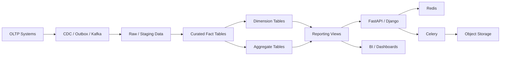
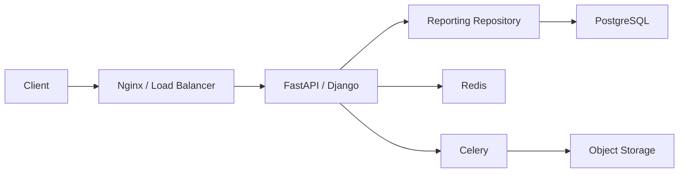
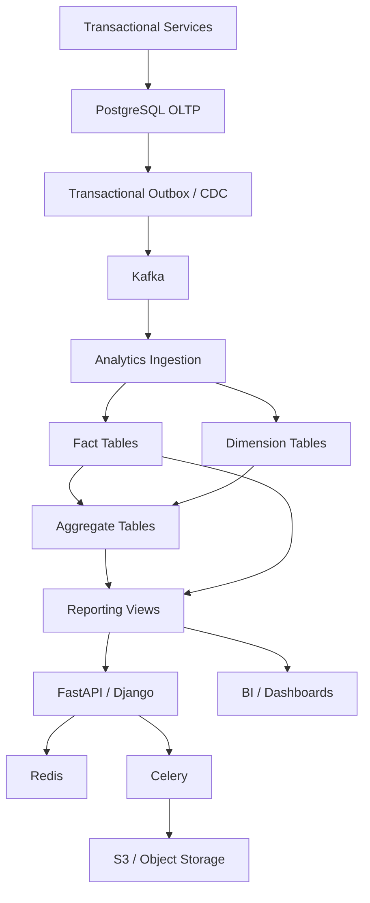

# README

## Overview

This project builds a production-oriented **Analytics and Reporting Database** using SQL and PostgreSQL concepts.

The focus is not simply on writing analytical queries. The project is designed to develop the engineering judgment required to build reporting systems that remain correct, performant, secure, observable, and maintainable as data volume and reporting demand increase.

The project progresses from requirements and schema design through analytical query patterns, reporting abstractions, and performance optimization:

```text
Requirements
    ↓
Schema Design
    ↓
OLTP vs OLAP Design
    ↓
Aggregation Queries
    ↓
Window Function Queries
    ↓
CTE-Based Analytics
    ↓
Reporting Views
    ↓
Performance Optimization
```

## Navigation

- [01- Requirements](./01-%20Requirements.md) — Analytics platform scope, reporting requirements, and data modeling goals
- [02- Schema Design](./02-%20Schema%20Design.md) — Analytical schema design decisions and dimensional modeling
- [03- OLTP vs OLAP Design](./03-%20OLTP%20vs%20OLAP%20Design.md) — Schema trade-offs between transactional and analytical workloads
- [04- Aggregation Queries](./04-%20Aggregation%20Queries.md) — GROUP BY, HAVING, and multi-dimensional aggregation queries
- [05- Window Function Queries](./05-%20Window%20Function%20Queries.md) — Running totals, rankings, period comparisons, and moving averages
- [06- CTE Based Analytics](./06-%20CTE%20Based%20Analytics.md) — Multi-step analytical queries using Common Table Expressions
- [07- Reporting Views](./07-%20Reporting%20Views.md) — Persistent views for standardized reporting and API access
- [08- Performance Optimization](./08-%20Performance%20Optimization.md) — Index design, query rewriting, and execution plan analysis for analytics

---

The database is intended to model workloads such as:

- Customer and tenant analytics.
- Revenue reporting.
- Product and category performance.
- Time-series metrics.
- Operational dashboards.
- Historical reporting.
- Top-N and ranking analysis.
- Incremental analytics.
- Large exports.
- Backend reporting APIs.

---

## Project Goals

The project should demonstrate the ability to:

- Design an analytical relational schema.
- Define fact and dimension tables correctly.
- Understand analytical grain.
- Distinguish OLTP and OLAP workloads.
- Write production-quality aggregation queries.
- Use window functions correctly.
- Structure complex analytics with CTEs.
- Build reusable reporting views.
- Optimize analytical SQL using execution plans.
- Design for realistic data volumes.
- Handle late-arriving and duplicate data.
- Integrate PostgreSQL analytics with backend services.
- Design secure multi-tenant reporting.
- Build reliable reporting and export workflows.

The emphasis is on **reasoning about data and workload characteristics**, not memorizing SQL syntax.

---

## Project Architecture

A simplified architecture is:



The architecture separates:

```text
transactional data
        ↓
ingestion
        ↓
analytical data model
        ↓
derived metrics
        ↓
reporting interface
        ↓
consumers
```

This separation becomes increasingly important as analytical workloads grow.

---

## Document Map

| File | Focus |
|---|---|
| `01- Requirements.md` | Business, data, freshness, reliability, and reporting requirements |
| `02- Schema Design.md` | Fact/dimension schema and analytical data modeling |
| `03- OLTP vs OLAP Design.md` | Workload differences and architectural boundaries |
| `04- Aggregation Queries.md` | Aggregation, grouping, conditional metrics, and analytical summaries |
| `05- Window Function Queries.md` | Ranking, running totals, comparisons, and analytical windows |
| `06- CTE Based Analytics.md` | Multi-stage analytical queries using CTEs |
| `07- Reporting Views.md` | Reusable database-level reporting interfaces |
| `08- Performance Optimization.md` | Query tuning, indexing, materialization, scaling, and workload isolation |

---

## Recommended Learning Sequence

Follow the project in order.

```text
Requirements
    ↓
Schema
    ↓
Workload Architecture
    ↓
Aggregations
    ↓
Windows
    ↓
CTEs
    ↓
Views
    ↓
Performance
```

Each stage builds on the previous one.

For example:

```text
Schema Design
    ↓
understand fact grain
    ↓
Aggregation Queries
    ↓
produce metrics
    ↓
Window Functions
    ↓
add analytical context
    ↓
CTEs
    ↓
compose multiple transformations
    ↓
Reporting Views
    ↓
expose reusable semantics
    ↓
Performance Optimization
    ↓
make the workload production-ready
```

---

## Analytical Data Model

The project should distinguish clearly between facts and dimensions.

### Fact Tables

Fact tables represent measurable business events or observations.

Examples:

```text
fact_orders
fact_order_items
fact_payments
fact_usage_events
fact_transactions
```

Typical characteristics:

- High row volume.
- Event or observation grain.
- Measures such as amount, quantity, duration, or count.
- Time-based access patterns.
- Frequent aggregation.

### Dimension Tables

Dimensions provide descriptive context.

Examples:

```text
dim_customer
dim_product
dim_category
dim_date
dim_region
dim_tenant
```

Dimensions typically contain:

- Business identifiers.
- Descriptive attributes.
- Classification fields.
- Hierarchical information.
- Slowly changing attributes where required.

---

## Analytical Grain

Grain is one of the most important concepts in this project.

Every analytical dataset should answer:

> What does one row represent?

Examples:

```text
fact_orders
    = one row per order

fact_order_items
    = one row per order item

daily_customer_revenue
    = one row per customer per day

monthly_product_revenue
    = one row per product per month
```

Incorrect grain is a common source of:

- Double counting.
- Incorrect joins.
- Incorrect window calculations.
- Incorrect percentages.
- Incorrect reports.

Before writing an analytical query, identify:

```text
input grain
+
join cardinality
+
output grain
```

---

## OLTP vs OLAP

The project intentionally separates transactional and analytical workloads.

| Dimension | OLTP | OLAP |
|---|---|---|
| Primary purpose | Transactions | Analysis |
| Typical query | Point lookup/update | Scan/aggregate |
| Data volume per query | Small | Large |
| Latency | Usually very low | Often higher |
| Schema | Transaction-oriented | Analytical |
| Writes | Frequent | Batch/stream/incremental |
| Aggregations | Limited | Extensive |
| Typical consumer | Application | BI/reporting/data workloads |

A production system may use:

```text
OLTP PostgreSQL
       ↓
CDC / Outbox / Kafka
       ↓
Analytics Store
       ↓
Reporting
```

rather than allowing large reports to compete directly with transactional workloads.

---

## Aggregation Queries

Aggregation is the foundation of many reports.

Common operations include:

```sql
COUNT(*)
SUM(...)
AVG(...)
MIN(...)
MAX(...)
```

Typical pattern:

```sql
SELECT
    customer_id,
    SUM(net_amount) AS revenue,
    COUNT(*) AS order_count
FROM fact_orders
GROUP BY customer_id;
```

Important concepts include:

- `GROUP BY`.
- `HAVING`.
- Conditional aggregation.
- `FILTER`.
- `DISTINCT` aggregates.
- NULL semantics.
- Aggregation after joins.
- Double-counting prevention.

The project treats aggregation as a **data-grain problem**, not merely a SQL syntax problem.

---

## Window Function Queries

Window functions preserve individual rows while calculating values across related rows.

Common examples include:

```sql
ROW_NUMBER()
RANK()
DENSE_RANK()
LAG()
LEAD()
SUM(...) OVER (...)
AVG(...) OVER (...)
```

Typical use cases:

- Top-N per group.
- Latest row per entity.
- Running totals.
- Moving averages.
- Month-over-month comparisons.
- State transitions.
- Percentage of total.

A critical distinction is:

```text
GROUP BY
    → collapses rows

WINDOW FUNCTION
    → preserves rows and adds context
```

---

## CTE-Based Analytics

Common Table Expressions structure complex analytics into logical stages.

Example:

```sql
WITH monthly_revenue AS (
    SELECT
        customer_id,
        date_trunc('month', occurred_at) AS month,
        SUM(net_amount) AS revenue
    FROM fact_orders
    GROUP BY
        customer_id,
        date_trunc('month', occurred_at)
),
ranked_customers AS (
    SELECT
        customer_id,
        month,
        revenue,
        RANK() OVER (
            PARTITION BY month
            ORDER BY revenue DESC
        ) AS revenue_rank
    FROM monthly_revenue
)
SELECT
    customer_id,
    month,
    revenue,
    revenue_rank
FROM ranked_customers
WHERE revenue_rank <= 10;
```

This expresses:

```text
facts
 ↓
monthly aggregation
 ↓
ranking
 ↓
top-N filtering
```

Modern PostgreSQL can inline eligible non-recursive, side-effect-free CTEs.

Therefore:

```text
CTE ≠ automatically materialized temporary table
```

Explicit `MATERIALIZED` and `NOT MATERIALIZED` should be used deliberately and validated with execution plans.

---

## Reporting Views

Reporting views provide reusable database-level interfaces.

Example:

```sql
CREATE VIEW customer_revenue_report AS
SELECT
    customer_id,
    SUM(net_amount) AS revenue,
    COUNT(*) AS order_count
FROM fact_orders
GROUP BY customer_id;
```

Consumers can then query:

```sql
SELECT
    customer_id,
    revenue,
    order_count
FROM customer_revenue_report
WHERE revenue >= 10000;
```

Views are useful for:

- Centralizing business metrics.
- Hiding implementation details.
- Providing stable reporting interfaces.
- Supporting BI tools.
- Simplifying backend repository queries.

A normal view does not cache its results.

For expensive recurring calculations, consider:

```text
aggregate table
materialized view
cache
dedicated analytics system
```

---

## Performance Optimization

Analytics performance is primarily about controlling the amount of work performed.

A useful optimization hierarchy is:

```text
Correctness
    ↓
Correct grain
    ↓
Bound input
    ↓
Reduce rows
    ↓
Reduce columns
    ↓
Control joins
    ↓
Aggregate efficiently
    ↓
Optimize windows/sorts
    ↓
Use appropriate indexes
    ↓
Inspect execution plan
    ↓
Measure concurrency
    ↓
Pre-aggregate/materialize
    ↓
Isolate workload
```

The primary diagnostic tool is:

```sql
EXPLAIN (ANALYZE, BUFFERS)
...
```

Important signals include:

- Estimated vs actual rows.
- Scan methods.
- Join strategies.
- Sort methods.
- Temporary-file usage.
- Buffer hits/reads.
- Execution time.
- Parallel execution.

---

## Indexing Strategy

Indexes should follow actual query access patterns.

Examples:

```sql
CREATE INDEX idx_fact_orders_customer_time
ON fact_orders (customer_id, occurred_at);
```

or:

```sql
CREATE INDEX idx_fact_orders_completed_time
ON fact_orders (occurred_at, customer_id)
WHERE status = 'completed';
```

Index design must consider:

- Equality predicates.
- Range predicates.
- Ordering.
- Selectivity.
- Cardinality.
- Write frequency.
- Storage.
- Maintenance.
- Replication.
- Backup cost.

An index is an access path, not a guarantee that PostgreSQL will use it.

---

## Time-Based Analytics

Time is a fundamental dimension in reporting.

Common requirements include:

```text
daily
weekly
monthly
quarterly
yearly
rolling seven days
month-to-date
year-to-date
```

Always define:

- Event time.
- Processing time.
- Reporting timezone.
- Inclusive/exclusive boundaries.
- Late-arriving event behavior.
- Historical correction behavior.

Prefer half-open ranges:

```sql
WHERE occurred_at >= $1
  AND occurred_at < $2
```

rather than ambiguous inclusive end timestamps.

---

## Late-Arriving Data

Analytics systems frequently receive data after its business event time.

Example:

```text
event occurred: 2026-01-10
arrived:        2026-01-15
```

The pipeline must determine whether to:

```text
recompute affected day
recompute affected month
update aggregates
recalculate dependent windows
```

Late data should not be treated as an exceptional condition without a defined recovery strategy.

---

## Duplicate Data

Distributed ingestion can produce duplicate events.

Potential causes include:

- Kafka retries.
- Consumer retries.
- Network failures.
- Producer retries.
- Worker crashes.
- Unknown commit outcomes.

Analytics pipelines should define idempotency using appropriate identifiers and constraints.

For example:

```text
source_event_id
```

can serve as a logical deduplication key when the source guarantees its uniqueness.

---

## Incremental Processing

Recomputing an entire historical dataset after every ingestion cycle may become prohibitively expensive.

A scalable pattern is:

```text
new events
    ↓
incremental processing
    ↓
affected partitions
    ↓
aggregate updates
    ↓
reporting structures
```

The processing boundary should be durable.

For long-running workflows, use:

- Job state.
- Checkpoints.
- Idempotency.
- Retry handling.
- Backfill procedures.

Do not use temporary database state as the only durable checkpoint.

---

## Multi-Tenant Analytics

A shared analytics database must prevent one tenant from accessing another tenant's data.

Typical request flow:

```text
Client
  ↓
Authentication
  ↓
Tenant authorization
  ↓
Bounded report query
  ↓
Tenant-aware filtering / RLS
  ↓
Analytics data
```

Performance must also account for tenant size.

A small tenant may produce:

```text
10,000 rows
```

while another produces:

```text
1 billion rows
```

This can create noisy-neighbor problems.

Possible controls include:

- Tenant-specific quotas.
- Query limits.
- Dedicated report queues.
- Separate read infrastructure.
- Tenant-aware partitioning.
- Dedicated database placement for extreme tenants.

---

## Backend Integration

Analytics queries should be exposed through controlled application interfaces.

Typical architecture:



The backend should control:

- Authorization.
- Tenant boundaries.
- Date ranges.
- Result limits.
- Allowed dimensions.
- Timeouts.
- Pagination.
- Export behavior.

The database should perform set-based computation.

---

## Reporting APIs

Interactive reporting endpoints should be bounded.

Typical controls include:

```text
maximum date range
maximum page size
maximum result size
query timeout
rate limits
concurrency limits
tenant quotas
```

Example:

```text
GET /v1/reports/revenue
    ?from=2026-01-01
    &to=2026-03-31
    &page_size=100
```

Large exports should normally be asynchronous.

---

## Large Exports

For large datasets:

```text
API
 ↓
Create report job
 ↓
Celery
 ↓
PostgreSQL
 ↓
CSV / Parquet
 ↓
S3 / Object Storage
 ↓
Client download
```

This avoids holding:

- HTTP connections.
- Application workers.
- Database connections

for excessively long periods.

Streaming can reduce application memory usage but does not automatically reduce the database's scan, join, sort, or aggregation cost.

---

## Redis

Redis can cache frequently requested report results.

Example:

```text
Request
   ↓
Redis
   ├── hit → response
   │
   └── miss
        ↓
    PostgreSQL
        ↓
      Redis
```

Cache keys should include all dimensions that affect the result:

```text
tenant
report
date range
filters
version
```

Caching should have explicit freshness requirements.

Do not use Redis as the analytical source of truth.

---

## Kafka

Kafka can provide an event-streaming layer between transactional systems and analytics.

Typical architecture:

```text
Transactional DB
      ↓
Outbox / CDC
      ↓
Kafka
      ↓
Analytics ingestion
      ↓
Fact tables
```

Important concerns include:

- Event ordering.
- Duplicate delivery.
- Schema evolution.
- Late events.
- Consumer retries.
- Replay.
- Idempotent processing.

Kafka partition order should not automatically be treated as business event-time order.

---

## Celery

Celery is useful for long-running reporting jobs.

A report job can maintain:

```text
queued
running
completed
failed
```

and optionally:

```text
cancelled
expired
```

The job should be durable and idempotent.

Retrying a failed report should not produce inconsistent duplicate artifacts.

---

## Data Quality

Analytics systems require explicit data-quality validation.

Useful checks include:

```text
duplicate event detection
null checks
unexpected negative values
missing dates
orphaned dimension references
unexpected status values
metric reconciliation
row-count validation
```

Example:

```sql
SELECT
    source_event_id,
    COUNT(*) AS occurrences
FROM fact_events
GROUP BY source_event_id
HAVING COUNT(*) > 1;
```

Data-quality checks should run as part of the ingestion or transformation pipeline rather than relying only on downstream dashboard users to discover problems.

---

## Security

Analytics databases often contain sensitive business and customer data.

Apply:

- Least-privilege roles.
- Parameterized queries.
- Tenant isolation.
- RLS where appropriate.
- Controlled reporting views.
- Restricted exports.
- Audit logging.
- Secure object-storage access.
- Encryption in transit and at rest.

Do not expose raw fact tables to every reporting consumer when a narrower reporting interface is sufficient.

---

## High Availability

Analytics workloads should not unnecessarily compromise transactional availability.

Possible architecture:

```text
Primary PostgreSQL
       ↓
Replication
       ↓
Read Replica
       ↓
Reporting Workload
```

For larger workloads:

```text
OLTP
 ↓
CDC / Kafka
 ↓
Dedicated Analytics Platform
```

can provide stronger workload isolation.

Monitor:

- Database CPU.
- I/O.
- Connections.
- Query latency.
- Replica lag.
- Temporary files.
- Storage.
- Failed jobs.

---

## Disaster Recovery

Derived analytics should be rebuildable whenever practical.

A recovery flow can be:

```text
Restore durable source data
        ↓
Restore / recreate schema
        ↓
Rebuild analytical tables
        ↓
Recreate reporting views
        ↓
Refresh materialized structures
        ↓
Validate metrics
        ↓
Resume reporting
```

For event-driven pipelines, Kafka retention or durable source events can support replay.

For derived datasets, document:

- Recovery time objective.
- Recovery point objective.
- Rebuild duration.
- Required source data.
- Checkpoint recovery.
- Validation process.

---

## Cost Management

Analytics workloads can become expensive because they process large datasets repeatedly.

Major cost drivers include:

- Full-table scans.
- Large joins.
- Large sorts.
- Repeated aggregations.
- Materialized-view refreshes.
- Read replicas.
- Storage.
- Temporary I/O.
- High concurrency.
- Large exports.

A useful progression is:

```text
Optimize query
    ↓
Optimize schema/indexes
    ↓
Pre-aggregate
    ↓
Cache/materialize
    ↓
Isolate workload
    ↓
Move to dedicated analytics infrastructure
```

Do not scale infrastructure indefinitely to compensate for an inefficient query.

---

## Production Performance Principles

### Reduce Data Early

Filter unnecessary rows before expensive operations where semantics permit.

### Control Grain

Know exactly what one row represents at every stage.

### Avoid Join Multiplication

Understand one-to-one, one-to-many, and many-to-many relationships before aggregation.

### Bound Work

Do not allow unrestricted reports to scan years of data without an explicit reason.

### Measure Plans

Use:

```sql
EXPLAIN (ANALYZE, BUFFERS)
```

instead of relying on assumptions.

### Optimize for Concurrency

A query that is acceptable once may be unacceptable when hundreds of users execute it simultaneously.

### Precompute Repeated Work

Use aggregate tables or materialized views when recurring calculations justify them.

### Isolate Heavy Workloads

Move large reports to replicas, dedicated analytics databases, or warehouses when necessary.

---

## Common Project Mistakes

### Treating Analytics Like OLTP

**Problem:** large scans and aggregations compete with transactional queries.

**Solution:** separate workloads when scale requires it.

### Ignoring Analytical Grain

**Problem:** metrics become incorrect through accidental duplication.

**Solution:** document grain for facts, aggregates, views, and intermediate datasets.

### Using `SELECT *`

**Problem:** unnecessary columns increase I/O and memory.

**Solution:** select only required fields.

### Unbounded Queries

**Problem:** one request can consume significant database resources.

**Solution:** enforce time-range and result-size limits.

### Over-Indexing

**Problem:** indexes consume storage and increase write and maintenance cost.

**Solution:** index based on actual access patterns.

### Assuming CTEs Are Materialized

**Problem:** incorrect PostgreSQL performance assumptions.

**Solution:** understand CTE inlining and validate plans.

### Using Normal Views as Caches

**Problem:** the underlying query still executes.

**Solution:** use materialized views, aggregate tables, or Redis when precomputed results are required.

### Running Large Reports Synchronously

**Problem:** HTTP workers and database connections remain occupied.

**Solution:** use Celery/background jobs and object storage.

### Ignoring Late Events

**Problem:** historical metrics become incorrect.

**Solution:** define correction and backfill procedures.

### Mixing Tenant Data

**Problem:** security and correctness failures.

**Solution:** enforce tenant isolation through authorization, predicates, and RLS where appropriate.

---

## Testing Strategy

Testing should cover both correctness and workload behavior.

### SQL Correctness Tests

Validate:

- Aggregation totals.
- Grouping behavior.
- NULL handling.
- Join cardinality.
- Ranking.
- Window calculations.
- Date boundaries.
- Time zones.
- Duplicate handling.

### Data Quality Tests

Validate:

```text
uniqueness
referential integrity
required fields
accepted ranges
event ordering assumptions
duplicate events
missing periods
metric reconciliation
```

### Performance Tests

Use realistic data distributions.

Include:

```text
small tenant
medium tenant
large tenant
high-cardinality dimension
large date range
sparse date range
late events
duplicate events
```

Measure:

```text
p50
p95
p99
CPU
I/O
temporary files
rows processed
```

---

## CI/CD

Schema and reporting changes should be version-controlled.

A deployment flow can be:

```text
Developer
   ↓
Git
   ↓
SQL / migration tests
   ↓
Integration tests
   ↓
Performance checks
   ↓
CI
   ↓
Staging
   ↓
Production migration
   ↓
Monitoring
```

Views, materialized views, indexes, aggregate tables, and schema changes should all be treated as production database artifacts.

---

## Project Completion Standard

The project should be considered complete only when it demonstrates more than working SQL.

A production-ready implementation should demonstrate:

### Data Modeling

- Clear fact/dimension separation.
- Explicit grain.
- Appropriate keys.
- Correct relationships.
- Historical data handling.

### Querying

- Aggregations.
- Window functions.
- CTEs.
- Reporting views.
- Correct joins.
- Time-based analytics.

### Performance

- Appropriate indexes.
- Query plans.
- Realistic benchmarks.
- Bounded reports.
- Pre-aggregation where justified.

### Backend Integration

- FastAPI or Django integration.
- Parameterized SQL.
- Pagination.
- Report APIs.
- Background exports.

### Distributed Systems

- Kafka or CDC ingestion where appropriate.
- Idempotent processing.
- Late-event handling.
- Replay/backfill strategy.

### Operations

- Monitoring.
- Timeouts.
- Connection management.
- HA.
- DR.
- Cost awareness.

### Security

- Least privilege.
- Tenant isolation.
- RLS where appropriate.
- Secure exports.
- Parameterized queries.

---

## Senior Engineering Perspective

The purpose of this project is to develop the ability to answer questions such as:

```text
Why is this report slow?

Why did this metric double after adding a join?

Should this calculation use GROUP BY or a window function?

Should this logic be a CTE, view, materialized view, or aggregate table?

Should this query execute on the primary database?

Should this report be synchronous?

When should Redis be introduced?

When should PostgreSQL analytics move to a dedicated warehouse?

How should late events change historical metrics?

How do we isolate one very large tenant?

How do we recover the reporting system after failure?
```

These are architecture and engineering questions rather than SQL syntax questions.

A senior engineer should reason about:

```text
correctness
+
data grain
+
execution cost
+
concurrency
+
freshness
+
security
+
reliability
+
operational complexity
+
cost
```

before selecting a SQL technique.

---

## Practical Architecture Target

A mature implementation can evolve toward:



The exact architecture should depend on:

- Data volume.
- Freshness requirements.
- Query complexity.
- Tenant distribution.
- Cost constraints.
- Availability requirements.
- Operational maturity.

Do not introduce Kafka, Redis, Celery, replicas, or a warehouse merely because they are available. Each component should solve a demonstrated workload or reliability problem.

---

## Key Takeaways

- **The project is fundamentally about analytical engineering: correct grain, reliable metrics, efficient SQL, secure reporting, and scalable workload architecture.**
- **Aggregation, window functions, CTEs, and reporting views are complementary tools; choose among them based on result grain, reuse, execution behavior, and freshness requirements.**
- **Performance optimization starts with reducing unnecessary work and validating execution plans before introducing indexes, caching, materialization, replicas, or architectural changes.**
- **Production analytics must explicitly handle multi-tenancy, late and duplicate events, bounded APIs, asynchronous exports, observability, HA/DR, and cost.**
- **Senior-level analytics design separates transactional workloads from analytical workloads when necessary and treats derived data as rebuildable, measurable, and operationally managed infrastructure.**