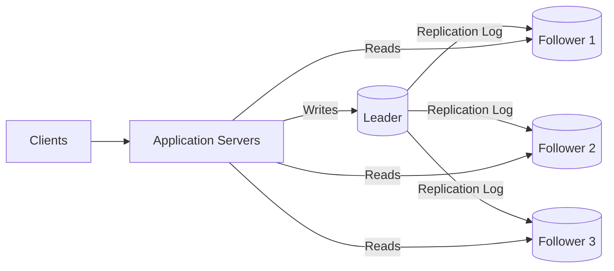
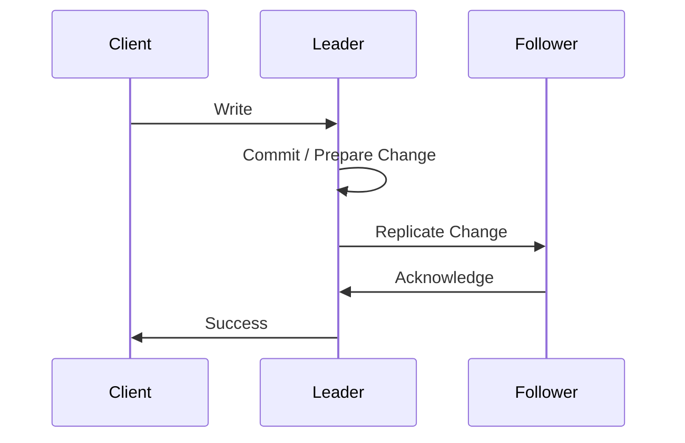
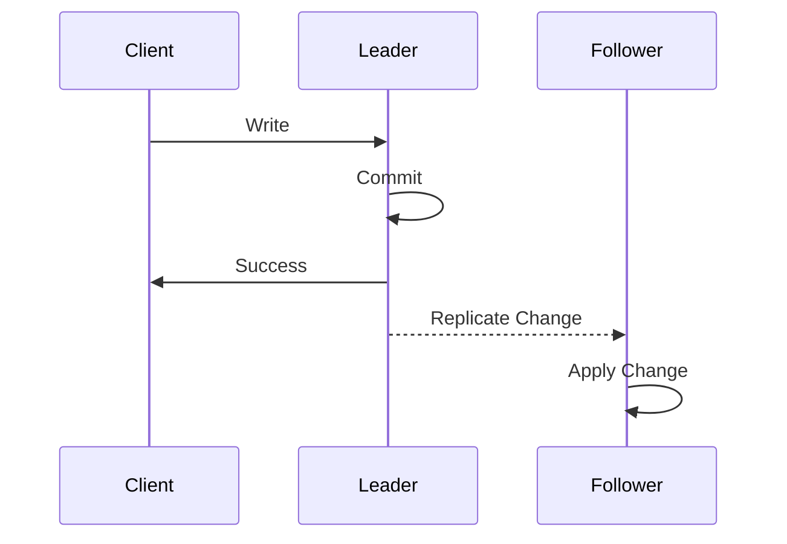
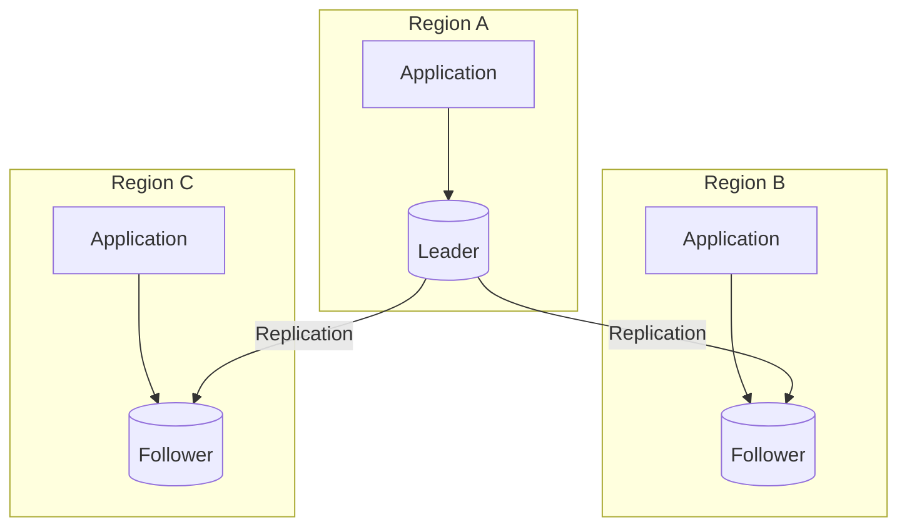
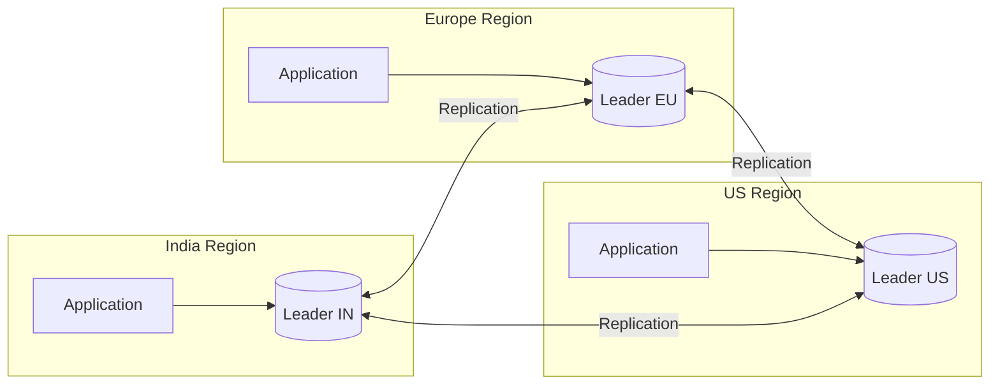
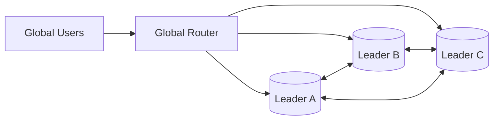
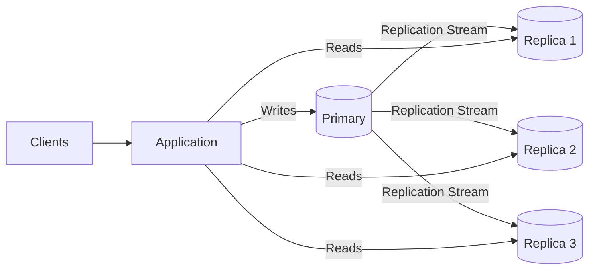
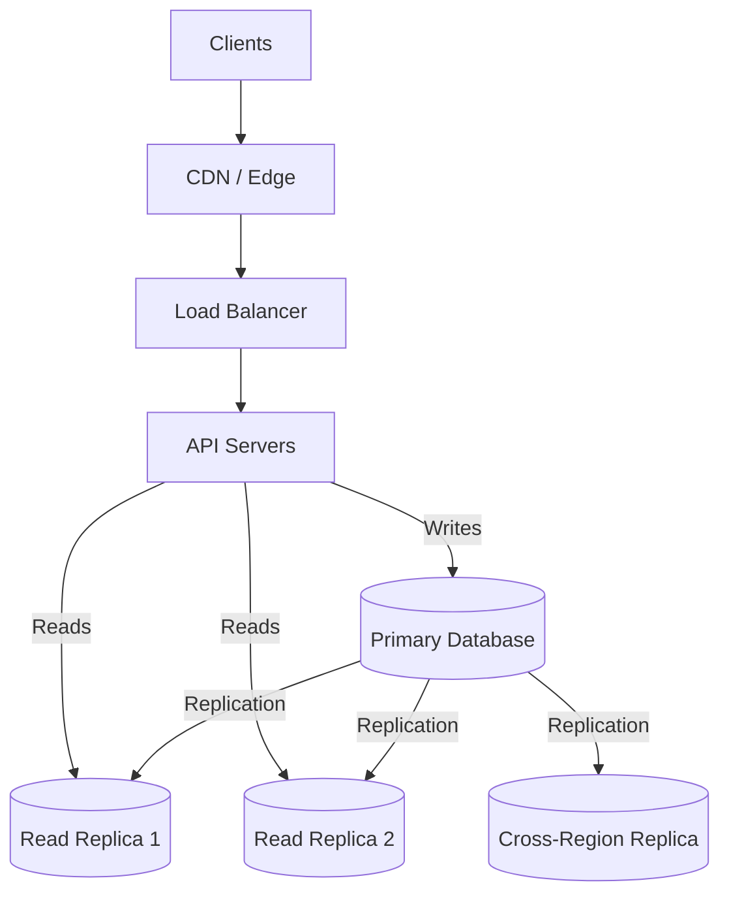

# 05- Leader-Follower Replication

## Overview

Leader-Follower Replication is a database replication architecture in which one node acts as the **leader** for writes while one or more **followers** maintain replicated copies of the data.

The leader is the authoritative writer:

```text
                    Application
                         |
              +----------+----------+
              |                     |
            Writes                 Reads
              |                     |
              v                     v
           Leader             Follower Pool
                              /     |     \
                             v      v      v
                           F1      F2      F3
```

The pattern is widely used because it separates write coordination from read capacity. It is common in relational databases, distributed databases, and other replicated storage systems.

Different technologies use different terminology:

| Concept | PostgreSQL | MySQL | Generic Term |
|---|---|---|---|
| Writer | Primary | Source / Primary | Leader |
| Read copy | Standby / Replica | Replica | Follower |
| Replication log | WAL | Binary Log | Change Log |
| Promotion target | Standby | Replica | Follower |

Leader-follower replication is simple compared with multi-leader or leaderless architectures, but production systems still need to solve replication lag, failover, stale reads, split brain, connection routing, and recovery.

---

## Why Leader-Follower Replication Exists

A single database instance creates a concentration of workload and a single failure domain.

```text
                    Application
                         |
                         v
                     Database
```

As traffic increases, the database may become constrained by:

- CPU
- Memory
- Disk I/O
- Connection count
- Query concurrency
- Storage throughput

In many backend systems, reads significantly outnumber writes.

For example:

```text
1,000 requests/sec

900 reads
100 writes
```

Using one database for both workloads means all 1,000 requests compete for the same resources.

Leader-follower replication allows the architecture to distribute read traffic:

```text
                         Application
                              |
                  +-----------+-----------+
                  |                       |
                Writes                  Reads
                  |                       |
                  v                       v
               Leader              +------+------+
                                   |      |      |
                                   v      v      v
                                  F1     F2     F3
```

This provides:

- Read scalability
- Improved availability
- Better fault isolation
- Disaster recovery options
- Geographic read distribution

---

## Core Architecture

The basic architecture consists of:

- One leader
- One or more followers
- A replication mechanism
- A routing layer
- Health monitoring
- A failover mechanism



The important architectural rule is:

```text
Leader   → Writes
Followers → Reads
```

This is the default model, not an absolute rule. Some systems may allow reads from the leader when strong read-after-write behavior is required.

---

## Write Path

A write request normally goes to the leader.

```text
Client
   |
   | POST /orders
   v
Application
   |
   | Write
   v
Leader
   |
   +--> Replication Log
            |
            +--> Follower 1
            +--> Follower 2
            +--> Follower 3
```

The leader:

1. Receives the write.
2. Validates the operation.
3. Executes the transaction.
4. Records the change in its replication log.
5. Replicates the change to followers.
6. Returns success according to the configured durability semantics.

The exact point at which the client receives success depends on whether replication is synchronous or asynchronous.

---

## Read Path

Read traffic can be distributed across followers.

```text
Client
   |
   v
Application
   |
   v
Read Router
   |
   +--------+--------+--------+
   |        |        |
   v        v        v
  F1       F2       F3
```

A routing layer may select a follower based on:

- Health
- Latency
- Connection count
- Geographic location
- Replication lag
- Application requirements

For example:

```text
GET /products

        |
        v
Read Router
        |
        +--> Follower 1
        |
        +--> Follower 2
        |
        +--> Follower 3
```

---

## How Replication Works

Leader-follower replication generally relies on a stream of changes generated by the leader.

Conceptually:

```text
Application
     |
     v
   Leader
     |
     v
Change Log
     |
     +------------+------------+
     |            |            |
     v            v            v
Follower 1   Follower 2   Follower 3
     |            |            |
     v            v            v
Apply Changes
```

The follower does not normally need to execute the original application request.

Instead, it consumes the leader's replication stream and applies the corresponding changes locally.

This reduces coordination between the application and followers.

---

## PostgreSQL Example

PostgreSQL uses **Write-Ahead Logging (WAL)**.

A simplified flow is:

```text
Application
     |
     v
PostgreSQL Leader
     |
     v
     WAL
     |
     v
Follower
     |
     v
Replay WAL
```

The follower continuously receives and replays WAL records.

PostgreSQL supports both asynchronous and synchronous replication configurations.

The exact production architecture depends on:

- Durability requirements
- Number of replicas
- Availability requirements
- Failover tooling
- Region placement

---

## MySQL Example

MySQL commonly uses binary-log-based replication.

```text
Application
     |
     v
MySQL Primary
     |
     v
Binary Log
     |
     v
Replica
     |
     v
Apply Changes
```

The replica maintains a copy of the primary's data by processing the replication stream.

Modern MySQL deployments can use different replication configurations, including asynchronous and semi-synchronous approaches.

---

## Synchronous Leader-Follower Replication

In synchronous replication, the leader waits for the required follower acknowledgements before completing the write according to the configured commit semantics.



The exact durability guarantee depends on what the database considers sufficient acknowledgement.

### Advantages

- Stronger durability
- Reduced risk of losing acknowledged writes
- Better synchronization between leader and follower

### Limitations

- Increased write latency
- Follower/network failure can affect writes
- Cross-region synchronous replication can be expensive

Synchronous replication is appropriate when the business requirement justifies the additional coordination cost.

---

## Asynchronous Leader-Follower Replication

With asynchronous replication, the leader can acknowledge a write without waiting for followers to apply it.



This minimizes write latency but creates a window in which the leader and follower contain different states.

Example:

```text
Leader:

Order Status = SHIPPED


Follower:

Order Status = PROCESSING
```

If a client reads from the follower immediately after the write, it may observe stale data.

---

## Synchronous vs Asynchronous

| Characteristic | Synchronous | Asynchronous |
|---|---|---|
| Write latency | Higher | Lower |
| Replica freshness | Stronger | Potentially stale |
| Risk of acknowledged-write loss | Lower | Higher |
| Dependency on follower availability | Higher | Lower |
| Cross-region suitability | Limited | Good |
| Availability during replication problems | Lower | Higher |
| Operational complexity | High | High |

The correct choice depends on the required consistency and durability guarantees.

---

## Replication Lag

Replication lag is the delay between a change being committed on the leader and the follower becoming sufficiently caught up with that change.

Example:

```text
Leader
   |
   | Write committed
   |
   +------------------+
                      |
                 500 ms delay
                      |
                      v
                  Follower
```

During the delay:

```text
Leader   = New State
Follower = Old State
```

Replication lag can be:

- Measured in milliseconds
- Measured in seconds
- Temporarily elevated
- Continuously increasing

A continuously increasing lag is usually a capacity or health problem.

---

## Causes of Replication Lag

Common causes include:

### High Write Volume

The leader generates changes faster than followers can apply them.

```text
Write Generation Rate
        >
Follower Apply Rate
```

The replication backlog grows.

### Slow Follower Storage

The follower may have insufficient disk I/O capacity.

### CPU Saturation

Replication replay competes with application queries for CPU.

### Long-Running Queries

A long-running transaction may prevent certain changes from being applied or become a source of contention.

### Network Bottlenecks

The replication stream may be delayed by network throughput or packet loss.

### Resource Contention

Heavy analytical queries on a follower can interfere with replication replay.

---

## Read-After-Write Consistency

One of the most common application-level problems is:

```text
POST /orders
```

followed immediately by:

```text
GET /orders/123
```

Suppose:

```text
POST
 |
 v
Leader
 |
 v
Success
```

but:

```text
GET
 |
 v
Follower
 |
 v
Old Data
```

The user may see:

```text
Order not found
```

even though the creation request succeeded.

This is not necessarily a database failure. It is a consequence of asynchronous replication.

---

## Strategies for Read-After-Write

### Read From Leader

For consistency-sensitive reads:

```text
Write → Leader

Read  → Leader
```

This is simple and reliable.

The trade-off is that the leader receives more read traffic.

---

### Sticky Routing

After a write, route that user's related reads to the leader temporarily.

```text
User Session
     |
     +--> Write → Leader
     |
     +--> Read  → Leader
```

After the consistency window expires, reads can return to followers.

This requires careful application or routing-layer design.

---

### Lag-Aware Routing

Do not send reads to followers whose replication lag exceeds an acceptable threshold.

```text
Follower 1 → 10 ms   ✅
Follower 2 → 30 ms   ✅
Follower 3 → 8 sec   ❌
```

The routing layer excludes unhealthy or stale followers.

---

### Version or Position Tracking

More advanced systems can track the replication position associated with a write.

The application can then request a read from a follower only after that follower has caught up sufficiently.

This provides stronger guarantees but increases application and infrastructure complexity.

---

## Leader Failover

Leader-follower replication is often used to support high availability.

Suppose:

```text
              Leader
             /      \
            v        v
          F1         F2
```

The leader fails:

```text
              Leader ❌
               /    \
              v      v
            F1       F2
```

The system must promote one follower.

```text
              F1
             /  \
            v    v
          F2    Applications
```

The failover process normally involves:

1. Detecting leader failure.
2. Determining which followers are healthy.
3. Selecting a promotion candidate.
4. Promoting the follower.
5. Preventing the old leader from accepting writes.
6. Updating service discovery or routing.
7. Reconnecting clients.
8. Rebuilding or reconfiguring remaining followers.

---

## Follower Selection During Failover

The most advanced follower is not necessarily the best promotion candidate.

Selection may consider:

- Replication lag
- Data completeness
- Availability zone
- Region
- Hardware capacity
- Health status
- Previous failures

For example:

```text
Follower 1
Lag = 5 ms
AZ = A

Follower 2
Lag = 10 sec
AZ = B

Follower 3
Lag = 20 ms
AZ = C
```

Follower 1 is likely a stronger candidate, assuming other health conditions are equal.

---

## Split Brain

A dangerous failure occurs when the old leader remains reachable by some clients while a follower has already been promoted.

```text
             Network Partition

          Old Leader   X   New Leader
              |               |
              v               v
           Writes          Writes
```

Now there are two writers.

This can cause:

- Divergent data
- Conflicting transactions
- Duplicate records
- Lost updates
- Difficult recovery

Production failover systems therefore need **fencing**.

Fencing ensures the old leader can no longer accept authoritative writes before the new leader becomes active.

---

## Fencing

Fencing can be implemented using mechanisms such as:

- Network isolation
- Instance termination
- Storage-level fencing
- Lease expiration
- Distributed coordination
- Database-specific promotion mechanisms

The goal is:

```text
Old Leader

     ↓

Must stop accepting writes

     ↓

New Leader

     ↓

Accept writes
```

Promotion without fencing can produce split brain.

---

## Failover and Client Connections

Database failover is not complete merely because a new leader exists.

Existing application connections may still point to the old leader.

For example:

```text
Application
     |
     v
Connection Pool
     |
     v
Old Leader ❌
```

The system needs a mechanism to:

- Detect broken connections
- Reconnect
- Resolve the new leader
- Refresh connection pools

This is particularly important in applications using long-lived database connections.

---

## Failover and DNS

Some architectures expose a database endpoint through DNS.

```text
db.example.internal

        |
        v
Current Leader
```

After failover:

```text
db.example.internal

        |
        v
New Leader
```

DNS-based failover must account for:

- TTL
- Client DNS caching
- Connection pooling
- Resolver behavior

A short DNS TTL does not guarantee immediate client reconnection because applications and infrastructure may cache connections independently.

---

## Read Scaling

Leader-follower replication can scale read-heavy workloads.

Suppose:

```text
10,000 requests/sec

8,000 reads
2,000 writes
```

A single leader may handle all writes:

```text
2,000 writes
```

while followers handle the read workload:

```text
Follower 1 → 2,000 reads
Follower 2 → 2,000 reads
Follower 3 → 2,000 reads
Follower 4 → 2,000 reads
```

The actual distribution depends on the routing layer and query workload.

Replication therefore provides a way to scale reads horizontally without distributing write ownership.

---

## Read Scaling Limitations

Adding followers does not provide unlimited scalability.

The leader still needs to:

- Process writes
- Generate replication records
- Send replication traffic
- Maintain connections
- Support failover requirements

At sufficiently high write rates, the leader itself becomes the bottleneck.

```text
Write Load
    |
    v
Leader
    |
    +--> F1
    +--> F2
    +--> F3
    +--> F4
```

Adding more followers may increase outbound replication overhead.

At that point, other techniques may be required:

- Partitioning
- Sharding
- Workload separation
- Multiple leaders
- Distributed databases

---

## Multi-Region Leader-Follower Architecture

A leader can be deployed in one region while followers exist in other regions.



Benefits:

- Regional read performance
- Disaster recovery
- Additional availability

Costs:

- Cross-region replication latency
- Network transfer costs
- More complex failover
- Potentially stale regional reads

---

## Geographic Read Routing

For globally distributed users, reads can be routed to a nearby follower.

```text
India Users
    |
    v
India Follower

US Users
    |
    v
US Follower

Europe Users
    |
    v
Europe Follower
```

This can reduce network latency.

However, local followers may be behind the leader.

Therefore, geographic routing and consistency requirements must be considered together.

---

## Leader-Follower with Django

Django supports database routing through its database configuration and router mechanisms.

A simplified configuration can define separate connections:

```python
DATABASES = {
    "default": {
        "ENGINE": "django.db.backends.postgresql",
        "NAME": "app",
        "HOST": "leader.internal",
        "USER": "app",
        "PASSWORD": "secret",
    },
    "replica": {
        "ENGINE": "django.db.backends.postgresql",
        "NAME": "app",
        "HOST": "replica.internal",
        "USER": "app",
        "PASSWORD": "secret",
    },
}
```

A production implementation should not hardcode secrets. Credentials should come from a secure configuration mechanism such as:

- AWS Secrets Manager
- Kubernetes Secrets
- Environment variables backed by a secret manager
- Vault

A database router can direct writes to the leader and selected reads to replicas.

Conceptually:

```python
class DatabaseRouter:
    def db_for_write(self, model, **hints):
        return "default"

    def db_for_read(self, model, **hints):
        return "replica"
```

This example is intentionally simplified.

A production router should account for:

- Read-after-write requirements
- Health status
- Replica lag
- Transactions
- Administrative queries
- Migrations
- Background jobs

Blindly routing every read to a replica can introduce subtle consistency bugs.

---

## Leader-Follower with FastAPI

FastAPI itself does not implement database replication.

The application connects to infrastructure that provides the leader/follower topology.

For example:

```text
FastAPI
   |
   +--> Write Pool → Leader
   |
   +--> Read Pool  → Followers
```

Connection pools should be configured independently when workload separation is required.

The application should also avoid assuming that every successful write is immediately visible on every follower.

---

## Transactions

Transactions complicate read routing.

Consider:

```text
BEGIN

INSERT order

SELECT order

COMMIT
```

If the transaction writes to the leader but the `SELECT` is routed to a follower, the follower may not contain the transaction yet.

Therefore, reads that participate in the same transaction generally need to remain on the same authoritative connection.

A common rule is:

```text
Inside Write Transaction
        |
        v
Leader
```

Do not blindly apply read/write splitting inside transactional workflows.

---

## Connection Pooling

Each database node has finite connection capacity.

If the application has:

```text
100 application instances
```

and each instance opens:

```text
50 connections
```

then the database may receive:

```text
5,000 connections
```

Adding followers does not automatically solve connection exhaustion.

Production systems should consider:

- Pool size
- Maximum connections
- Application concurrency
- Connection lifetime
- Idle connections
- Proxy-based pooling

For PostgreSQL, tools such as PgBouncer can reduce connection-management overhead in appropriate architectures.

---

## Monitoring

A leader-follower system should expose metrics for both leader and followers.

Important metrics include:

| Metric | Purpose |
|---|---|
| Replication lag | Detect stale followers |
| Replication state | Detect broken replication |
| WAL/binlog backlog | Measure replication pressure |
| Leader CPU | Detect write bottlenecks |
| Follower CPU | Detect replay/query contention |
| Disk I/O | Detect storage saturation |
| Network throughput | Detect replication bottlenecks |
| Active connections | Detect connection exhaustion |
| Query latency | Detect workload degradation |
| Failover events | Track availability incidents |

Monitoring should distinguish between:

```text
Replica is slightly behind

vs

Replica is permanently falling behind
```

The second condition usually indicates an architectural or capacity problem.

---

## Alerting

Useful alerts include:

- Replication stopped
- Replication lag exceeds the application's consistency threshold
- Replication lag continuously increases
- Follower becomes unreachable
- Disk space approaches exhaustion
- Leader connection count approaches limit
- Failover occurs unexpectedly
- Multiple nodes report leader status

Alerts should be tied to actionable remediation.

For example:

```text
Replication stopped
        |
        v
Check network
        |
        v
Check follower process
        |
        v
Check disk
        |
        v
Check replication slot / log retention
```

---

## Security Considerations

Replication infrastructure should be treated as part of the trusted database control plane.

Production practices include:

- Encrypt replication traffic with TLS where supported.
- Use dedicated replication credentials.
- Apply least privilege.
- Restrict replication ports using network security controls.
- Keep database nodes private.
- Rotate credentials.
- Encrypt disks and backups.
- Audit administrative operations.
- Prevent public access to database endpoints.

For AWS:

```text
Internet
   |
   X
Database

Private Subnet
   |
   +--> Leader
   |
   +--> Followers
```

Application traffic should enter through controlled application infrastructure rather than exposing database nodes publicly.

---

## Cost Considerations

Every follower introduces additional costs:

- Compute
- Storage
- Network transfer
- Monitoring
- Backups
- Operational overhead

For example:

```text
1 Leader
+
3 Followers
+
Cross-Region Replication
```

may significantly increase infrastructure cost.

Do not add replicas solely because they are considered a best practice.

Add them when they provide measurable value:

- Read capacity
- Availability
- Disaster recovery
- Geographic latency reduction

---

## When to Use Leader-Follower Replication

Use this architecture when:

- Writes have a clear authoritative owner.
- Read traffic is significantly higher than write traffic.
- Read scaling is required.
- Failover is required.
- Replicated copies are acceptable.
- The application can tolerate or explicitly manage replica lag.

Typical workloads include:

- Content platforms
- E-commerce catalogs
- User profile systems
- Analytics read workloads
- REST APIs with read-heavy traffic

---

## When It Is Not Enough

Leader-follower replication becomes insufficient when:

### Write Throughput Is the Bottleneck

Followers do not increase write capacity.

Consider:

- Sharding
- Partitioning
- Multiple leaders
- Distributed databases

### Multiple Regions Need Local Writes

A single leader can create high write latency for distant regions.

Consider:

- Multi-leader replication
- Region-local ownership
- Distributed databases

### Conflict-Free Multi-Writer Behavior Is Required

Leader-follower assumes a single authoritative writer.

Consider:

- Multi-leader architectures
- Leaderless replication
- Conflict-resolution mechanisms

---

## Common Mistakes

### Treating Followers as Identical to the Leader

Followers may be behind.

**Avoidance:** Define explicit consistency expectations.

### Routing Every Read to Followers

This can break read-after-write behavior.

**Avoidance:** Route consistency-sensitive reads to the leader or use a consistency-aware routing strategy.

### Ignoring Lag During Failover

Promoting a significantly stale follower can cause data loss.

**Avoidance:** Consider replication position and RPO during candidate selection.

### Forgetting Fencing

Promoting a follower while the old leader remains writable can create split brain.

**Avoidance:** Ensure the old leader is fenced before or as part of promotion.

### Assuming More Followers Always Improve Performance

Followers consume replication bandwidth and resources.

**Avoidance:** Measure read load and replication overhead before scaling out.

### Performing Schema Changes Without Replication Planning

DDL changes may affect replication compatibility or follower behavior.

**Avoidance:** Use backward-compatible migration strategies and validate them against the database's replication model.

### Ignoring Connection Pools During Failover

Applications may continue using dead connections.

**Avoidance:** Implement connection recycling and reliable leader discovery.

---

## Production Architecture Checklist

Before deploying a leader-follower database architecture, verify:

- [ ] Leader and follower responsibilities are clearly defined.
- [ ] Replication mode is explicitly documented.
- [ ] Replication lag is monitored.
- [ ] Read-after-write behavior is defined.
- [ ] Read routing is consistency-aware.
- [ ] Leader failure detection is implemented.
- [ ] Follower promotion is automated or operationally documented.
- [ ] Old leaders are fenced during failover.
- [ ] Application connection pools recover after failover.
- [ ] Backups are independent of followers.
- [ ] RPO and RTO are documented.
- [ ] Cross-region replication is tested if required.
- [ ] Replication traffic is secured.
- [ ] Database endpoints remain private.
- [ ] Failover is tested regularly.
- [ ] Replica capacity is monitored.
- [ ] Operational runbooks exist.

---

## Interview Perspective

A strong answer to:

> "Explain leader-follower replication."

should cover more than:

> "The leader handles writes and followers handle reads."

A senior-level explanation should include:

```text
Leader
  |
  | Replication Log
  v
Followers
  |
  +--> Read Scaling
  |
  +--> Failover
  |
  +--> Disaster Recovery
```

Then discuss:

- Synchronous vs asynchronous replication
- Replication lag
- Read-after-write consistency
- Failover
- Split brain
- Fencing
- Read routing
- RPO/RTO
- Monitoring

A common interview follow-up is:

> "What happens if the leader fails?"

The correct answer is not simply:

> "Promote a replica."

A robust answer includes:

```text
Detect Failure
      ↓
Select Suitable Follower
      ↓
Fence Old Leader
      ↓
Promote Follower
      ↓
Update Routing
      ↓
Refresh Client Connections
      ↓
Rebuild Remaining Followers
      ↓
Monitor Recovery
```

The details of this process are what distinguish a production architecture from a conceptual diagram.

---

## Key Takeaways

- Leader-follower replication centralizes writes on a leader while distributing replicated read workloads across followers.
- Asynchronous replication provides lower write latency but introduces replication lag, stale reads, and potential data loss during failover.
- Production read routing must explicitly account for consistency requirements such as read-after-write behavior and transactional reads.
- High availability requires more than replication: failure detection, follower promotion, fencing, routing updates, connection recovery, and tested disaster recovery are all necessary.
- Leader-follower replication is excellent for read-heavy workloads but does not increase write capacity; systems with write bottlenecks or multi-region write requirements may need sharding, multi-leader, or distributed-database architectures.
```
```

```
Markdown


```
# 06- Multi-Leader Replication

## Overview

Multi-Leader Replication is a distributed database architecture in which **multiple nodes can accept writes** while asynchronously or synchronously replicating changes between them.

Unlike leader-follower replication, where there is a single authoritative writer:

```text
                Leader
               /      \
              v        v
         Follower   Follower
```

multi-leader replication allows several leaders to independently accept writes:

```text
             Leader A
            /         \
           /           \
          v             v
     Leader B <------> Leader C
```

Each leader typically serves clients in its local region or availability domain while replicating changes to the other leaders.

This architecture is primarily useful when a system requires **multiple writable locations**, particularly for geographically distributed applications where sending every write to one central leader would introduce unacceptable latency or availability constraints.

The additional write capacity and geographic availability come at a significant cost: **conflict detection, conflict resolution, ordering, failure handling, and operational complexity**.

---

## Why Multi-Leader Replication Exists

A single-leader architecture works well when there is one natural location for writes.

```text
                    Global Clients
                         |
                         v
                    Leader - US
                    /    |    \
                   v     v     v
                 R1     R2     R3
```

This becomes problematic when users are distributed globally.

For example:

```text
India User
    |
    |
    v
US Leader
```

Every write must travel from India to the US before the application can complete the operation.

This introduces:

- Higher write latency
- Dependence on inter-region connectivity
- A single write failure domain
- Potential regional availability problems

A multi-leader architecture can place writable leaders closer to users:

```text
       India Users             US Users
            |                     |
            v                     v
        Leader-IN  <----------> Leader-US
            ^                     ^
            |                     |
        Local Writes          Local Writes
```

Users can write to a nearby leader while changes are replicated between regions.

---

## Core Architecture

A typical multi-region architecture looks like:



Every leader can:

- Accept writes
- Serve reads
- Replicate changes
- Participate in conflict resolution

The topology does not have to be fully connected. Some systems use a replication graph:

```text
Leader A ---> Leader B ---> Leader C
     \                         ^
      +------------------------+
```

The appropriate topology depends on the database and replication mechanism.

---

## Leader-Follower vs Multi-Leader

| Characteristic | Leader-Follower | Multi-Leader |
|---|---|---|
| Writable nodes | Usually one | Multiple |
| Write locality | Centralized | Distributed |
| Write latency across regions | Potentially high | Lower |
| Read scaling | Good | Good |
| Conflict handling | Limited | Critical |
| Operational complexity | Lower | Much higher |
| Cross-region availability | Good | Stronger |
| Write scalability | Limited by leader | Potentially higher |
| Failure handling | Simpler | More complex |
| Typical use | Read-heavy systems | Geo-distributed write workloads |

Multi-leader replication should not be introduced simply because multiple leaders sound more scalable.

The application must have a real requirement for distributed writes.

---

## How Multi-Leader Replication Works

Consider two regions:

```text
Region A                 Region B

Leader A                 Leader B
   |                        |
   | Local Write            | Local Write
   |                        |
   +----------+-------------+
              |
        Replication
```

Suppose:

```text
User A → Leader A
User B → Leader B
```

Both leaders can accept writes independently.

Leader A produces:

```text
Event 101
```

Leader B produces:

```text
Event 202
```

Those changes are then exchanged.

```text
Leader A
   |
   | Event 101
   v
Leader B

Leader B
   |
   | Event 202
   v
Leader A
```

If the changes affect independent records, they may merge cleanly.

If both changes modify the same logical entity, the system may encounter a conflict.

---

## The Fundamental Problem: Write Conflicts

The defining challenge of multi-leader replication is that two leaders can modify the same data concurrently.

Suppose:

```text
Initial:

User.plan = "basic"
```

User A updates the record through Leader A:

```text
Leader A:

User.plan = "premium"
```

At approximately the same time, another operation updates the same record through Leader B:

```text
Leader B:

User.plan = "enterprise"
```

Now replication exchanges the changes.

```text
Leader A
premium
   |
   | Replication
   v
Leader B
enterprise
```

The system must determine:

> Which value should win?

This is the **conflict resolution problem**.

---

## Why Conflicts Occur

Conflicts can result from:

- Concurrent writes
- Network partitions
- Regional failures
- Offline clients
- Delayed replication
- Duplicate operations
- Incorrect routing
- Clock differences

A production multi-leader system must explicitly define how conflicts are detected and resolved.

---

## Types of Conflicts

### Write-Write Conflict

Two leaders update the same record.

```text
Leader A → user.status = active

Leader B → user.status = suspended
```

The system needs a resolution policy.

---

### Delete-Update Conflict

One leader deletes a record while another updates it.

```text
Leader A → DELETE user

Leader B → UPDATE user
```

Without explicit conflict semantics, replication can produce surprising results.

---

### Unique Constraint Conflict

Two leaders independently create records using the same unique identifier.

```text
Leader A:

username = "aranya"


Leader B:

username = "aranya"
```

Both local transactions may succeed.

After replication, the system discovers that the uniqueness constraint cannot be satisfied globally.

This is particularly important for:

- Usernames
- Email addresses
- Order identifiers
- Inventory identifiers
- Payment references

---

## Conflict Detection

The replication system needs enough metadata to determine whether two changes conflict.

Possible mechanisms include:

- Version numbers
- Logical timestamps
- Vector clocks
- Lamport timestamps
- Transaction identifiers
- Last-write timestamps
- Database-specific replication metadata

A simplified version-based model might look like:

```text
Record:

value = premium
version = 42
source = Leader A
```

Another leader produces:

```text
value = enterprise
version = 42
source = Leader B
```

Because both originated from the same version, the system can detect concurrent modifications.

---

## Conflict Resolution Strategies

There is no universally correct conflict-resolution strategy.

The correct strategy depends on the semantics of the data.

---

## Last Write Wins

The system selects the change considered latest.

```text
Change A
timestamp = 10:00:01

Change B
timestamp = 10:00:05

Winner = Change B
```

### Advantages

- Simple
- Deterministic if timestamps are reliable
- Easy to implement

### Limitations

- Earlier writes can silently disappear
- Clock skew can affect ordering
- Business meaning may not align with chronological ordering

Last-write-wins should not be used blindly for important business data.

---

## Version-Based Resolution

Each update increments a version.

```text
Version 10
    |
    +--> Leader A → Version 11
    |
    +--> Leader B → Version 11
```

The system detects that both writes originated from the same base version.

The application can then:

- Reject one update
- Merge them
- Ask the user
- Apply a deterministic rule

---

## Application-Level Merge

For some data, both changes can be combined.

Example:

```text
Leader A:

tags = ["python"]


Leader B:

tags = ["aws"]
```

Instead of choosing one:

```text
tags = ["python", "aws"]
```

The merge rule depends on the application's domain.

This is often safer than generic timestamp-based conflict resolution.

---

## Conflict-Free Data Structures

Some workloads can use data structures designed to merge concurrent updates automatically.

These are commonly associated with **CRDTs — Conflict-Free Replicated Data Types**.

Examples include:

- Counters
- Sets
- Registers
- Collaborative data structures

CRDTs are useful when operations can be mathematically defined so that independent updates converge to the same state.

They are powerful but should not be introduced unless the domain actually benefits from their merge semantics.

---

## Write Locality

One of the strongest reasons to use multi-leader replication is local write processing.

Instead of:

```text
India
  |
  | High-latency network
  v
US Leader
```

the architecture becomes:

```text
India
  |
  v
India Leader
```

This reduces network latency for geographically distributed users.

For example:

```text
                    Global Users
                         |
       +-----------------+-----------------+
       |                 |                 |
       v                 v                 v
   Leader-IN         Leader-EU         Leader-US
       |                 |                 |
       +-----------------+-----------------+
                 Replication
```

The improvement is most significant when writes are frequent and latency-sensitive.

---

## Data Ownership

One way to reduce conflicts is to assign ownership of data to specific leaders.

For example:

```text
India Users
    |
    v
Leader-IN

European Users
    |
    v
Leader-EU

US Users
    |
    v
Leader-US
```

A user's data is normally written only in its owning region.

This reduces concurrent writes to the same entity.

For example:

```text
user_id = 123

Owner = India

Writes → Leader-IN
```

Other regions can still replicate and read the data.

This approach is often significantly easier to operate than allowing every leader to modify every record.

---

## Partitioned Ownership

Data can also be partitioned by a deterministic key.

```text
Customer ID

1 - 1M       → Leader A
1M - 2M      → Leader B
2M - 3M      → Leader C
```

Or:

```text
hash(customer_id) % N
```

determines the responsible leader.

This provides:

- Predictable write ownership
- Reduced conflicts
- Better write distribution

However, it introduces routing and rebalancing complexity.

---

## Active-Active Architecture

Multi-leader replication is commonly associated with **active-active** systems.

In an active-active deployment:

```text
Region A → Active
Region B → Active
Region C → Active
```

All regions can serve production traffic.



This differs from active-passive disaster recovery:

```text
Region A → Active
Region B → Standby
```

Active-active improves utilization and regional write availability but requires much stronger conflict-management capabilities.

---

## Network Partitions

Network partitions are particularly challenging in multi-leader systems.

Suppose:

```text
Leader A  X  Leader B
```

Replication stops.

Both leaders continue accepting writes.

```text
Leader A

Write X
Write Y
Write Z
```

while:

```text
Leader B

Write P
Write Q
Write R
```

When connectivity returns, the system must reconcile the divergent histories.

This is fundamentally different from leader-follower replication because there is no single authoritative writer during the partition.

---

## Conflict During Network Recovery

After the partition:

```text
          Network Restored

Leader A <--------------> Leader B

Changes:
A → X, Y, Z
B → P, Q, R
```

If the changes affect different records, they may merge automatically.

If both modified the same records:

```text
A → user.balance = 100
B → user.balance = 50
```

the system requires conflict resolution.

This is one reason active-active database architectures require significantly more engineering discipline.

---

## Ordering Problems

Distributed leaders may observe events in different orders.

For example:

```text
Leader A:

Event 1
Event 2
```

Leader B may receive:

```text
Event 2
Event 1
```

If the events are independent, this may not matter.

If Event 2 depends on Event 1, the order becomes important.

Distributed systems therefore use mechanisms such as:

- Logical clocks
- Sequence numbers
- Causal metadata
- Vector clocks
- Per-entity ordering

Global total ordering is expensive and often unnecessary.

A better design is usually to establish ordering only where the business domain requires it.

---

## Idempotency

Replication and retries can result in the same logical operation being processed more than once.

Consider:

```text
Leader A

Payment Event 123
```

The replication message is delivered twice:

```text
Event 123
Event 123
```

Without idempotent processing, the system might process the payment twice.

A common pattern is to assign a unique operation identifier:

```text
operation_id = 7b9c...
```

and maintain processed-operation state.

Conceptually:

```python
if operation_id in processed_operations:
    return

process_operation()

record_processed_operation(operation_id)
```

The actual implementation should use an atomic database mechanism rather than an in-memory set in production.

---

## Multi-Leader and Kafka

Kafka is not simply a database multi-leader replication system, but some of its architectural concepts are useful for understanding distributed write ownership.

Kafka partitions have a leader:

```text
Partition 0 → Leader Broker A
Partition 1 → Leader Broker B
Partition 2 → Leader Broker C
```

This is still a leader-based model at the partition level.

A Kafka cluster can therefore distribute leadership across partitions, but a single partition does not normally have multiple concurrent leaders accepting arbitrary writes.

This distinction is important in system design interviews.

---

## Multi-Leader and PostgreSQL

Traditional PostgreSQL streaming replication is primarily leader-follower.

Native PostgreSQL replication does not turn a standard primary/standby setup into a general-purpose multi-primary database.

Multi-leader PostgreSQL architectures typically require additional technologies or application-level strategies.

Examples include:

- Logical replication
- Bidirectional replication solutions
- Application-level partitioning
- Region-specific ownership

Logical replication can replicate selected changes, but conflict management and bidirectional write semantics require careful design.

Do not assume that enabling logical replication automatically provides safe multi-primary behavior.

---

## Multi-Leader and Django

A Django application can participate in a multi-region architecture, but Django itself does not provide conflict resolution.

A common architecture might be:

```text
                 Global Router
                /      |      \
               v       v       v
          Django-IN Django-EU Django-US
               |       |       |
               v       v       v
          DB Leader  DB Leader  DB Leader
               \       |       /
                \      |      /
                  Replication
```

The application must understand:

- Which region owns a record
- Where writes should go
- How identifiers are generated
- How conflicts are resolved
- How stale reads are handled

For business-critical workflows, these rules should be explicit rather than hidden inside a generic database router.

---

## Identifier Generation

Multi-leader systems complicate identifier generation.

A simple sequence:

```text
1
2
3
4
```

can become problematic because each leader may generate the same identifier.

For example:

```text
Leader A → ID 101
Leader B → ID 101
```

Potential strategies include:

### UUIDs

```python
from uuid import uuid4

order_id = uuid4()
```

UUIDs avoid central coordination but may have storage and indexing implications depending on the database and UUID representation.

### Region-Encoded IDs

```text
IN-000001
US-000001
EU-000001
```

This can avoid collisions but couples identifiers to infrastructure topology.

### Snowflake-Style IDs

Distributed ID generators can combine:

- Timestamp
- Machine or region identifier
- Sequence

to create globally unique sortable identifiers.

The correct choice depends on ordering, storage, and operational requirements.

---

## Transactions

Distributed transactions become significantly harder in multi-leader architectures.

Consider:

```text
Leader A

Debit Account A
```

and:

```text
Leader B

Credit Account B
```

If both operations must be atomic globally, asynchronous multi-leader replication does not automatically provide that guarantee.

For strongly coupled transactions, consider whether the data should have:

- A single write owner
- A single transaction boundary
- A centralized coordination point

Multi-leader architectures work best when writes can be partitioned into relatively independent ownership domains.

---

## Avoiding Conflicts Through Data Design

The best conflict-resolution strategy is often to **avoid conflicts entirely**.

Instead of:

```text
Any Region
    |
    v
Any Record
    |
    v
Any Leader
```

prefer:

```text
Entity
   |
   v
Determine Owner
   |
   v
Owning Leader
```

For example:

```text
Customer 123
    |
    v
Region = IN
    |
    v
Leader-IN
```

This transforms a conflict-resolution problem into a routing problem.

Routing is generally easier to reason about than arbitrary distributed conflict resolution.

---

## When to Use Multi-Leader Replication

Multi-leader replication is appropriate when:

- Users are geographically distributed.
- Local write latency matters.
- Multiple regions need to remain writable.
- The application can tolerate eventual consistency where appropriate.
- Data ownership can be partitioned.
- Conflict resolution is well understood.
- The organization can operate the additional complexity.

Common use cases include:

- Global collaboration systems
- Multi-region applications
- Offline-first applications
- Distributed content management
- Global user-profile systems
- Certain SaaS architectures

---

## When Not to Use It

Avoid multi-leader replication when:

- There is no requirement for multiple write locations.
- Strong global consistency is mandatory.
- Writes frequently target the same records.
- Conflict resolution is unclear.
- A single leader already satisfies latency requirements.
- The operational team cannot support the additional complexity.

A simpler leader-follower architecture is often preferable.

---

## Production Considerations

A production multi-leader architecture should explicitly define:

### Write Ownership

Who is allowed to modify each entity?

### Conflict Semantics

What happens when two leaders update the same entity?

### Ordering

Which operations must be observed in order?

### Consistency

Which reads may be stale?

### Failover

What happens when an entire region becomes unavailable?

### Recovery

How are divergent replicas reconciled?

### Idempotency

How are duplicate operations handled?

### Observability

How are replication delays and conflicts measured?

Without explicit answers to these questions, the architecture is incomplete.

---

## Monitoring

Important metrics include:

| Metric | Purpose |
|---|---|
| Replication lag | Detect delayed synchronization |
| Conflict count | Detect concurrent writes |
| Conflict resolution rate | Detect growing reconciliation problems |
| Replication throughput | Measure synchronization capacity |
| Failed replication events | Detect broken links |
| Queue/backlog depth | Detect replication pressure |
| Region availability | Detect regional failures |
| Write latency by region | Validate locality benefits |
| Duplicate operations | Detect retry/idempotency issues |
| Divergence duration | Measure consistency windows |

A particularly useful metric is:

```text
Conflicts per 1,000 writes
```

A rising conflict rate may indicate that the data ownership model is poorly aligned with the workload.

---

## Security Considerations

Multi-region replication expands the database trust boundary.

Production systems should:

- Encrypt replication traffic.
- Use mutually authenticated connections where supported.
- Restrict replication endpoints to trusted networks.
- Use separate replication credentials.
- Apply least privilege.
- Rotate secrets.
- Encrypt storage and backups.
- Audit cross-region replication activity.
- Restrict administrative access.
- Avoid public database endpoints.

Cross-region architectures should also account for data residency and regulatory requirements.

A replicated dataset may cause data to exist in regions where the organization did not originally intend to store it.

---

## Cost Considerations

Multi-leader systems are more expensive than a single-leader architecture.

Costs may include:

- Multiple database clusters
- Cross-region network transfer
- Additional storage
- Additional backups
- Monitoring
- Conflict-resolution infrastructure
- Global routing
- Operational engineering

For example:

```text
3 Regions
×
Database Cluster
×
Compute + Storage + Network
```

can produce significantly higher infrastructure costs.

The additional cost should be justified by concrete requirements such as:

- Lower global write latency
- Regional availability
- Regulatory requirements
- Business continuity
- Local data ownership

---

## Disaster Recovery

Multi-leader systems can provide strong regional resilience because multiple regions are already active.

However, replication does not eliminate disaster recovery requirements.

A region may fail while containing changes that have not yet reached other regions.

Therefore, recovery planning should define:

- Acceptable data loss
- Replication lag thresholds
- Region promotion behavior
- Conflict reconciliation
- Backup strategy
- Data restoration
- Traffic rerouting
- Application recovery

A useful mental model is:

```text
Active-Active
     +
Backups
     +
Tested Recovery
     =
Resilient Architecture
```

---

## Common Mistakes

### Assuming Multi-Leader Means No Conflicts

Multiple writable nodes inherently create the possibility of concurrent modifications.

**Avoidance:** Define conflict detection and resolution before deploying the architecture.

### Using Last-Write-Wins for Critical Business Data

A newer timestamp does not necessarily represent the more correct business operation.

**Avoidance:** Use domain-aware conflict resolution where correctness matters.

### Ignoring Clock Skew

Physical clocks are not perfectly synchronized across machines.

**Avoidance:** Do not rely on wall-clock timestamps as the sole authority for distributed ordering unless the system explicitly provides the required guarantees.

### Allowing Every Region to Modify Every Record

This maximizes conflict probability.

**Avoidance:** Prefer region-based or entity-based write ownership.

### Using Auto-Increment IDs Independently

Two leaders can generate identical identifiers.

**Avoidance:** Use globally unique ID strategies appropriate for distributed systems.

### Forgetting Duplicate Operations

Retries can cause the same operation to be applied multiple times.

**Avoidance:** Use idempotency keys and durable deduplication.

### Treating Replication as Synchronous by Default

Cross-region replication is usually subject to network latency and failure.

**Avoidance:** Explicitly document replication guarantees and acceptable consistency windows.

### Ignoring Regulatory Constraints

Replicating data globally can violate data residency requirements.

**Avoidance:** Map data classification and residency requirements to the replication topology.

---

## Production Checklist

Before adopting multi-leader replication, verify:

- [ ] Multiple writable regions are a genuine requirement.
- [ ] Write ownership is explicitly defined.
- [ ] Conflict detection is implemented.
- [ ] Conflict resolution is deterministic and business-appropriate.
- [ ] Identifier generation is globally safe.
- [ ] Replication lag is monitored.
- [ ] Duplicate operations are handled idempotently.
- [ ] Ordering requirements are documented.
- [ ] Read consistency requirements are documented.
- [ ] Network partition behavior is understood.
- [ ] Regional failure behavior is tested.
- [ ] Divergent data reconciliation is documented.
- [ ] Backups are independent of replication.
- [ ] Cross-region network traffic is encrypted.
- [ ] Data residency requirements are satisfied.
- [ ] Operational ownership is clearly assigned.
- [ ] Disaster recovery procedures are tested.

---

## Interview Perspective

A common interview question is:

> "Why would you choose multi-leader replication instead of leader-follower replication?"

A strong answer is:

> Multi-leader replication is useful when multiple geographic regions need to accept writes locally. It reduces cross-region write latency and can improve regional availability, but it introduces concurrent-write conflicts, more complex failover, ordering problems, and reconciliation requirements. I would use it only when those benefits justify the operational complexity, and I would reduce conflicts through explicit data ownership wherever possible.

Another common question is:

> "What is the biggest problem with multi-leader replication?"

The strongest answer is usually:

> Conflict management.

Multiple leaders can independently accept writes to the same logical data. If those writes occur concurrently, the system needs deterministic conflict detection and resolution. The safest architecture often avoids conflicts through partitioned ownership rather than attempting to resolve arbitrary conflicts after they occur.

A senior-level design discussion should also cover:

```text
Multiple Writers
      |
      +--> Conflict Detection
      |
      +--> Conflict Resolution
      |
      +--> Ordering
      |
      +--> Idempotency
      |
      +--> Failover
      |
      +--> Reconciliation
      |
      +--> Disaster Recovery
```

---

## Key Takeaways

- Multi-leader replication allows multiple nodes or regions to accept writes, primarily to reduce geographic write latency and improve regional availability.
- The central challenge is concurrent modification: conflict detection, conflict resolution, ordering, and idempotency must be explicitly designed.
- The safest way to reduce conflicts is often to assign clear data ownership to regions or leaders rather than allowing every leader to modify every record.
- Multi-leader architectures increase operational, networking, consistency, security, and cost complexity and should only be adopted when multiple writable locations provide measurable business value.
- Production deployments require explicit failure, reconciliation, monitoring, backup, disaster recovery, and data-residency strategies.
```
```

```
Markdown


```
# 04- Replication

## Overview

Replication is the process of maintaining multiple copies of the same logical data across independent database nodes, availability zones, or regions.

A production database rarely exists as a single isolated instance when high availability, read scalability, or disaster recovery is required. Instead, data may be replicated from one database node to others:

```text
                    Application
                         |
                         v
                    Primary DB
                   /          \
                  v            v
             Replica A      Replica B
```

Replication is a foundational distributed-systems technique used by relational databases, NoSQL databases, distributed caches, messaging systems, and cloud-managed storage services.

It can provide:

- Higher availability
- Read scalability
- Fault tolerance
- Disaster recovery
- Geographic distribution
- Better workload isolation

However, replication also introduces distributed-systems problems:

- Replication lag
- Stale reads
- Write conflicts
- Failover complexity
- Split brain
- Data divergence
- Additional network traffic
- Operational complexity

Replication should therefore be treated as an architectural mechanism with explicit consistency, durability, availability, and recovery guarantees rather than simply as "keeping another copy of the database."

---

## Why Replication Exists

A single database creates a concentrated failure and performance domain:

```text
                    Application
                         |
                         v
                    Database
```

If the database becomes unavailable, the application may become unavailable.

If database traffic increases significantly, the database may become a bottleneck.

Replication allows the system to distribute responsibility across multiple nodes:

```text
                    Application
                         |
                +--------+--------+
                |                 |
              Writes             Reads
                |                 |
                v                 v
             Primary       +------+------+
                           |      |      |
                           v      v      v
                         R1      R2      R3
```

This allows different nodes to serve different purposes.

For example:

- The primary handles writes.
- Read replicas handle read-heavy workloads.
- A standby provides failover capacity.
- A remote replica supports disaster recovery.
- Regional replicas reduce read latency for geographically distributed users.

---

## What Replication Actually Copies

Replication does not necessarily mean copying the entire database repeatedly.

A naive model would be:

```text
Primary Database
       |
       | Copy entire database
       v
Replica
```

This would be extremely inefficient for a large production database.

Instead, most mature database systems replicate a stream of changes:

```text
Application
     |
     v
Primary
     |
     v
Change Log
     |
     +----------+----------+
     |          |          |
     v          v          v
Replica A   Replica B   Replica C
```

The change stream may contain information such as:

- Inserts
- Updates
- Deletes
- Transaction boundaries
- Log sequence positions
- Commit information

Different databases implement this differently.

| Technology | Common Replication Mechanism |
|---|---|
| PostgreSQL | WAL |
| MySQL | Binary Log |
| MongoDB | Oplog |
| Redis | Replication stream |
| Kafka | Replicated log partitions |

The implementation differs, but the general architectural idea is similar: capture changes once and propagate them to other nodes.

---

## Replication Architecture

A common production architecture uses one writable primary and multiple replicas.



This architecture is often called:

- Primary-Replica
- Leader-Follower
- Primary-Secondary
- Master-Replica

Terminology varies between technologies.

The architecture itself is more important than the naming.

---

## Replication Modes

The most important distinction is whether the primary waits for replicas before acknowledging a write.

The two fundamental approaches are:

- Synchronous replication
- Asynchronous replication

---

## Synchronous Replication

With synchronous replication, the primary waits for the required replica acknowledgement before considering the write complete according to the configured durability semantics.

```text
Client
  |
  | Write
  v
Primary
  |
  +------> Replica A
  |
  +------> Replica B
  |
  | <------ Acknowledgement
  | <------ Acknowledgement
  |
  v
Success
```

The exact guarantee depends on the database configuration.

The system may wait for:

- One replica
- A quorum
- Multiple replicas
- A specific durability condition

### Why It Exists

Synchronous replication reduces the window in which an acknowledged write exists only on the primary.

This is useful when data loss is unacceptable.

### Advantages

- Stronger durability guarantees
- Lower risk of losing acknowledged writes
- Better synchronization between replicas
- Useful for critical workloads

### Limitations

- Higher write latency
- Greater dependency on network health
- Replica failures can affect write availability
- Cross-region synchronous replication can introduce substantial latency

### Production Consideration

Synchronous replication should be designed around explicit durability requirements.

Do not automatically use synchronous replication for every workload. If the business can tolerate a small amount of data loss during a regional failure, asynchronous replication may provide a better availability and latency profile.

---

## Asynchronous Replication

With asynchronous replication, the primary can acknowledge a write before replicas have necessarily received or applied it.

```text
Client
  |
  v
Primary
  |
  | Commit
  v
Success
  |
  | Replicate asynchronously
  v
Replica
```

The resulting state may temporarily be:

```text
Primary  = New Data
Replica  = Old Data
```

### Why It Exists

Asynchronous replication minimizes write latency and reduces the dependency between the primary and replicas.

### Advantages

- Lower write latency
- Better write availability
- Good fit for cross-region replication
- Temporary replica failure does not necessarily block writes

### Limitations

- Replication lag
- Stale reads
- Potential loss of recently acknowledged writes during failover
- More complex application consistency requirements

### Production Consideration

Asynchronous replication is often the practical default for read replicas and cross-region disaster recovery because it avoids putting remote network latency directly into every write.

---

## Synchronous vs Asynchronous Replication

| Characteristic | Synchronous | Asynchronous |
|---|---|---|
| Write latency | Higher | Lower |
| Replica freshness | Stronger | Potentially stale |
| Acknowledged-write durability | Stronger | Weaker |
| Dependency on replica availability | Higher | Lower |
| Cross-region suitability | Limited | Strong |
| Read-after-write risk | Lower | Higher |
| Write availability | Potentially lower | Higher |
| Operational complexity | High | High |

Neither mode is universally better.

The correct choice depends on:

- RPO
- RTO
- Latency requirements
- Availability requirements
- Data criticality
- Geographic topology

---

## Replication Lag

Replication lag is the delay between a change being committed on the source and the corresponding change becoming available on a replica.

For example:

```text
Primary
    |
    | UPDATE orders
    |
    v
New State

       500 ms

          |
          v

Replica
    |
    v
Old State
```

During this interval:

```text
Primary  → status = "shipped"
Replica  → status = "processing"
```

The replica is stale.

Replication lag is normal in asynchronous systems.

The important question is whether the lag is:

- Small and stable
- Increasing
- Unbounded
- Caused by a transient event
- Caused by insufficient replica capacity

---

## Causes of Replication Lag

### High Write Volume

The source generates changes faster than replicas can consume them.

```text
Change Generation Rate
          >
Replica Apply Rate
```

The backlog grows.

### Slow Storage

Replica disk throughput may be insufficient to replay changes.

### CPU Saturation

Replication replay competes with application queries for CPU.

### Long-Running Transactions

Long transactions can interfere with cleanup, replay, or visibility depending on the database.

### Network Bottlenecks

The replication stream may be delayed by:

- High latency
- Packet loss
- Limited bandwidth
- Regional network problems

### Replica Read Workload

Heavy analytical or reporting queries can consume resources required for replication replay.

---

## Measuring Replication Lag

Replication lag should be measured using database-specific metrics.

Typical signals include:

- Log sequence position difference
- WAL replay delay
- Binlog position difference
- Replica apply delay
- Commit timestamp difference
- Replication queue depth

A useful conceptual metric is:

```text
Replication Lag
=
Source Progress
-
Replica Progress
```

The exact implementation varies by database.

For example, in PostgreSQL, administrators commonly inspect WAL sender/receiver state and replay positions rather than relying on a single generic "lag" value.

---

## Replication Lag and Read Consistency

Consider an API:

```text
POST /orders
```

followed immediately by:

```text
GET /orders/123
```

The write may go to the primary:

```text
POST
 |
 v
Primary
 |
 v
Success
```

while the read goes to a replica:

```text
GET
 |
 v
Replica
 |
 v
Stale Data
```

The user may see:

```text
Order not found
```

even though the write succeeded.

This is one of the most common production issues introduced by read replicas.

---

## Read-After-Write Consistency

Read-after-write consistency means that after a successful write, subsequent reads should reflect that write.

Several strategies can provide this behavior.

### Read From Primary

```text
Write → Primary
Read  → Primary
```

This is the simplest approach.

### Sticky Reads

After a write, route the user's subsequent reads to the primary for a defined consistency window.

```text
User
 |
 +--> Write → Primary
 |
 +--> Read  → Primary
 |
 +--> Later Read → Replica
```

### Lag-Aware Routing

Only route reads to replicas whose lag is below an acceptable threshold.

```text
Replica A → 20 ms   ✅
Replica B → 30 ms   ✅
Replica C → 8 sec   ❌
```

### Replication Position Tracking

Advanced systems can associate a write with a replication position and only read from a replica after it has caught up to that position.

This provides stronger guarantees but increases architectural complexity.

---

## Replication Topologies

Replication does not have to use a single primary with direct replicas.

Common topologies include:

- Primary-replica
- Cascading replication
- Multi-leader replication
- Multi-region replication

---

## Primary-Replica

The most common topology is:

```text
              Primary
             /       \
            v         v
        Replica A  Replica B
```

The primary accepts writes.

Replicas receive changes and may serve reads.

This is commonly used for:

- Read scaling
- High availability
- Disaster recovery

---

## Cascading Replication

A replica can itself forward changes to another replica.

```text
Primary
   |
   v
Replica A
   |
   v
Replica B
```

### Why It Exists

Cascading replication can reduce the replication workload generated directly by the primary.

It can be useful in geographically distributed architectures.

### Limitation

It introduces additional dependency chains:

```text
Primary
   ↓
Replica A
   ↓
Replica B
```

If Replica A fails, Replica B may stop receiving new changes depending on the topology.

Therefore, cascading replication should be used deliberately.

---

## Multi-Region Replication

A production application may replicate data across regions:

```text
Region A
    |
    v
Primary
    |
    +------------------+
    |                  |
    v                  v
Region B            Region C
Replica             Replica
```

This provides:

- Regional disaster recovery
- Lower read latency
- Additional failure-domain isolation

However, it also introduces:

- Cross-region network latency
- Network transfer costs
- Replication lag
- More complex failover

---

## Multi-Leader Replication

In multi-leader replication, multiple nodes can accept writes.

```text
Leader A <--------> Leader B
    ^                   ^
    |                   |
 Clients              Clients
```

This can reduce geographic write latency.

However, concurrent writes can conflict.

For example:

```text
Leader A → balance = 100
Leader B → balance = 50
```

The system must determine how to reconcile those changes.

Multi-leader replication is therefore substantially more complex than a single-leader topology.

---

## Leaderless Replication

In leaderless architectures, there may be no single authoritative writer.

```text
          Client
          / | \
         v  v  v
        N1 N2 N3
```

Writes may be sent to multiple replicas, often using quorum mechanisms.

This model can provide strong availability characteristics but requires more sophisticated consistency and conflict-resolution mechanisms.

It is common in systems inspired by Dynamo-style architectures.

---

## Replication and Failover

Replication is often used to support high availability.

Suppose:

```text
Primary
  |
  +--> Replica A
  +--> Replica B
```

The primary fails:

```text
Primary ❌
  |
  +--> Replica A
  +--> Replica B
```

The system must determine:

1. Whether the primary is actually unavailable.
2. Which replica is eligible for promotion.
3. Whether the replica is sufficiently caught up.
4. How the old primary will be prevented from writing.
5. How clients discover the new primary.
6. How remaining replicas are reconfigured.

Replication provides the data copies, but **failover orchestration provides the availability behavior**.

---

## Failover

A typical failover sequence is:

```text
Primary Failure
      |
      v
Failure Detection
      |
      v
Replica Selection
      |
      v
Promotion
      |
      v
Old Primary Fencing
      |
      v
Routing Update
      |
      v
Application Reconnection
```

Every step matters.

A system that promotes a replica but does not redirect application traffic is not fully failed over.

---

## Split Brain

Split brain occurs when multiple nodes believe they are authoritative writers.

Example:

```text
             Network Partition

          Primary A  X  Primary B
              |           |
              v           v
           Writes       Writes
```

If both sides continue accepting writes, the system can diverge.

Potential consequences include:

- Conflicting records
- Lost updates
- Duplicate transactions
- Data corruption
- Difficult reconciliation

Production systems need mechanisms such as:

- Quorum
- Leader election
- Fencing
- Leases
- Distributed consensus

to prevent multiple authoritative writers.

---

## Fencing

Fencing ensures an old primary can no longer accept writes after failover.

Conceptually:

```text
Old Primary
     |
     v
Fenced
     |
     X
Cannot Write

New Primary
     |
     v
Accept Writes
```

Fencing can involve:

- Network isolation
- Instance termination
- Storage fencing
- Lease expiration
- Database-specific mechanisms

Without fencing, a failover system can accidentally create two active writers.

---

## Replication and Backups

Replication is not a backup strategy.

Consider:

```text
Primary
   |
   +--> Replica A
   |
   +--> Replica B
```

If an administrator executes:

```sql
DELETE FROM orders;
```

the deletion can propagate to both replicas.

Backups provide historical recovery points:

```text
Primary
   |
   +--> Replicas
   |
   +--> Backup
           |
           v
      Object Storage
```

A production architecture should generally use both:

- Replication for availability
- Backups for recovery

---

## Replication and Disaster Recovery

Replication can support disaster recovery by maintaining copies outside the primary failure domain.

For example:

```text
Region A
    |
    | Replication
    v
Region B
```

If Region A becomes unavailable, Region B may be promoted.

However, the architecture must define:

- Recovery Point Objective
- Recovery Time Objective
- Replication lag tolerance
- Promotion process
- Traffic routing
- Data reconciliation
- Backup restoration

Cross-region replication reduces recovery time but does not guarantee zero data loss.

---

## RPO and Replication

**Recovery Point Objective (RPO)** describes the amount of data loss the organization can tolerate.

For example:

```text
RPO = 0
```

means the architecture aims for zero data loss.

Asynchronous replication may produce:

```text
Primary
  |
  | Last 5 seconds not replicated
  v
Replica
```

If the primary fails, those five seconds of acknowledged changes may be unavailable after failover.

Therefore:

```text
Replication Mode
        ↓
Durability
        ↓
Potential RPO
```

Replication strategy must be aligned with business requirements.

---

## Replication and Read Scaling

Suppose an API receives:

```text
100,000 requests/sec

90,000 reads
10,000 writes
```

A single primary must process all 100,000 requests if all reads are directed to it.

With replicas:

```text
                  Application
                       |
             +---------+---------+
             |                   |
           Writes              Reads
             |                   |
             v                   v
          Primary        +------+------+
                         |      |      |
                         v      v      v
                        R1     R2     R3
```

The read workload can be distributed across replicas.

This is one of the most practical uses of replication.

---

## Why Replicas Do Not Provide Unlimited Scalability

Adding replicas increases read capacity, but it does not remove the primary's write bottleneck.

The primary still needs to:

- Process writes
- Generate replication records
- Maintain replication connections
- Send changes
- Handle transactional coordination

At sufficiently high write volumes:

```text
Write Load
    |
    v
Primary Bottleneck
```

Adding more read replicas does not solve this problem.

At that point, consider:

- Partitioning
- Sharding
- Multiple leaders
- Workload-specific databases
- Distributed databases

---

## Application-Level Read Routing

Applications commonly separate read and write database connections.

Conceptually:

```text
Application
    |
    +--> Write Pool → Primary
    |
    +--> Read Pool  → Replica Pool
```

The application must not assume that replicas are perfectly synchronized.

For Django, database routing can be used to distinguish reads and writes.

A simplified example:

```python
class DatabaseRouter:
    def db_for_write(self, model, **hints):
        return "default"

    def db_for_read(self, model, **hints):
        return "replica"
```

This is only a conceptual example.

A production implementation should consider:

- Transactions
- Read-after-write behavior
- Replica health
- Replication lag
- Background jobs
- Administrative queries
- Migration operations

Blindly sending all reads to replicas can create subtle correctness bugs.

---

## Transactions and Replicas

Consider:

```sql
BEGIN;

INSERT INTO orders (...);

SELECT *
FROM orders
WHERE id = 123;

COMMIT;
```

If the write and read are executed against different nodes:

```text
INSERT → Primary

SELECT → Replica
```

the replica may not have received the transaction yet.

The read may therefore fail to observe the newly inserted row.

Within a transaction, operations that require transactional consistency should normally remain within the same database connection and transaction boundary.

---

## Connection Pooling

Replication creates additional database endpoints, which can increase connection-management complexity.

Suppose:

```text
100 application instances
```

each maintain:

```text
20 database connections
```

The system may create:

```text
2,000 connections
```

across the database infrastructure.

Connection pools should therefore be sized based on:

- Application concurrency
- Database connection limits
- Query latency
- Pool utilization
- Number of replicas

For PostgreSQL, connection pooling technologies such as PgBouncer can help reduce database connection overhead when appropriate.

---

## Monitoring Replication

Replication must be monitored as a first-class production subsystem.

Important metrics include:

| Metric | Why It Matters |
|---|---|
| Replication lag | Detects stale replicas |
| Replication state | Detects broken replication |
| WAL/binlog backlog | Measures replication pressure |
| Replay/apply rate | Measures replica capacity |
| Database CPU | Detects resource saturation |
| Disk I/O | Detects storage bottlenecks |
| Network throughput | Detects replication transport issues |
| Connection count | Detects connection exhaustion |
| Replica availability | Detects failed nodes |
| Failover events | Tracks availability incidents |

A useful operational distinction is:

```text
Stable 50 ms lag
```

versus:

```text
50 ms
100 ms
500 ms
2 sec
10 sec
```

The second pattern indicates that the replica is falling progressively behind.

---

## Monitoring Replica Health

A replica should not automatically receive traffic merely because its process is running.

A healthy read replica should generally satisfy:

```text
Database Process      → Healthy
Replication Channel   → Healthy
Replication Lag       → Acceptable
Disk Space            → Healthy
CPU                   → Healthy
Query Latency         → Acceptable
```

A routing layer can remove replicas that fail these conditions.

---

## Security Considerations

Replication traffic contains database changes and must be treated as sensitive.

Production systems should:

- Encrypt replication traffic.
- Use dedicated replication credentials.
- Apply least privilege.
- Restrict replication ports.
- Keep database nodes private.
- Rotate credentials.
- Encrypt database storage.
- Encrypt backups.
- Audit administrative operations.

For AWS deployments, database infrastructure should normally remain inside private subnets with tightly controlled security groups.

Do not expose replication endpoints directly to the public internet.

---

## Cost Considerations

Every replica introduces additional infrastructure cost.

Costs include:

- Compute
- Storage
- Backups
- Monitoring
- Network transfer
- Cross-region transfer
- Operational overhead

For example:

```text
1 Primary
+
3 Read Replicas
+
1 Cross-Region Replica
```

may provide excellent resilience and read capacity but also increases the infrastructure bill.

Replicas should therefore have a measurable purpose.

---

## AWS Considerations

AWS managed database services can provide replication features without requiring the engineering team to implement every database-level mechanism manually.

Examples include:

- Amazon RDS
- Amazon Aurora
- Amazon DynamoDB
- Amazon ElastiCache
- Amazon DocumentDB

For relational workloads, distinguish between:

### Multi-AZ

Primarily intended for:

- High availability
- Automatic failover
- Infrastructure redundancy

### Read Replicas

Primarily intended for:

- Read scaling
- Additional read capacity
- Some disaster recovery scenarios

They solve different problems.

A common mistake is to assume:

```text
Multi-AZ = Read Scaling
```

or:

```text
Read Replica = Automatic HA
```

These are not equivalent guarantees.

---

## Replication in Kubernetes

Kubernetes provides infrastructure primitives such as:

- StatefulSets
- Persistent Volumes
- StorageClasses
- Services

but Kubernetes itself does not solve database replication semantics.

It does not automatically provide:

- Database consensus
- Correct failover
- Conflict resolution
- Data durability
- Split-brain prevention
- Backup strategy

Production database deployments on Kubernetes often use database-specific operators or managed database services.

For many teams, a managed database is operationally simpler than implementing database replication and failover manually inside Kubernetes.

---

## Common Mistakes

### Treating Replicas as Backups

Replicas can replicate accidental updates and deletes.

**Avoidance:** Maintain independent, versioned backups.

### Ignoring Replication Lag

Applications may read stale data without realizing it.

**Avoidance:** Monitor lag and design read routing around explicit consistency requirements.

### Sending Every Read to Replicas

This can break read-after-write behavior.

**Avoidance:** Route consistency-sensitive reads to the primary or use lag-aware consistency mechanisms.

### Assuming Replication Automatically Provides Failover

A replica does not necessarily become the primary automatically.

**Avoidance:** Design and test failure detection, promotion, fencing, and traffic redirection.

### Adding Replicas Without Measuring the Bottleneck

If the bottleneck is write throughput, more read replicas will not solve it.

**Avoidance:** Profile the workload before scaling the database topology.

### Ignoring Replica Resource Capacity

A replica can become overloaded by both query traffic and replication replay.

**Avoidance:** Monitor CPU, memory, disk I/O, and replay throughput.

### Using Cross-Region Synchronous Replication Without Latency Analysis

Every write can become dependent on inter-region network latency.

**Avoidance:** Evaluate RPO, latency, and availability requirements before selecting the replication mode.

### Forgetting Connection Recovery During Failover

Applications may continue holding connections to a failed primary.

**Avoidance:** Design connection pools and service discovery to recover from primary changes.

### Performing Unsafe Schema Changes

Schema changes can interact poorly with replication depending on the database and replication mechanism.

**Avoidance:** Use backward-compatible migration strategies and validate changes against the actual replication topology.

---

## Production Best Practices

A production replication architecture should follow these principles:

### Define the Requirement First

Determine whether replication is primarily required for:

- Read scaling
- High availability
- Disaster recovery
- Geographic performance

The architecture should follow the requirement.

### Make Consistency Explicit

Document:

- Which reads may be stale
- Maximum acceptable replica lag
- Read-after-write behavior
- Transaction boundaries

### Monitor Replication Continuously

Replication failure should be detected before users discover stale or unavailable data.

### Keep Backups Independent

A replica should never be considered the only recovery mechanism.

### Test Failover

Test:

- Primary failure
- Replica promotion
- Connection recovery
- Traffic rerouting
- Replica rebuild
- Backup restoration

### Protect the Replication Channel

Use:

- TLS
- Private networking
- Least-privilege credentials
- Network access controls

### Align Topology With Failure Domains

Avoid placing every replica in the same failure domain.

Prefer distribution across:

- Availability zones
- Regions
- Independent infrastructure boundaries

where the recovery requirements justify it.

---

## Production Architecture Example

A production read-heavy API might use:



This architecture provides:

- Horizontally distributed read capacity
- Primary write ownership
- Replica-based failover options
- Cross-region disaster recovery

But it still requires explicit policies for:

- Read consistency
- Failover
- Backups
- Monitoring
- Recovery

---

## Production Checklist

Before deploying database replication, verify:

- [ ] Replication mode is explicitly defined.
- [ ] Replication topology is documented.
- [ ] Replication lag is monitored.
- [ ] Read-after-write requirements are documented.
- [ ] Read routing is consistency-aware.
- [ ] Primary failure detection is implemented.
- [ ] Replica promotion is documented and tested.
- [ ] Split-brain prevention is implemented where required.
- [ ] Old primary fencing is supported.
- [ ] Application connection pools recover after failover.
- [ ] Independent backups exist.
- [ ] Backup restoration is regularly tested.
- [ ] RPO and RTO are documented.
- [ ] Replication traffic is encrypted.
- [ ] Database endpoints are private.
- [ ] Replica capacity is monitored.
- [ ] Cross-region recovery is tested where required.
- [ ] Operational runbooks exist.

---

## Interview Perspective

A weak interview answer is:

> Replication means keeping multiple copies of a database.

A stronger answer explains the architectural purpose:

> Replication maintains multiple copies of data across database nodes so the system can improve availability, read scalability, fault tolerance, and disaster recovery. The replication mode determines how quickly replicas converge and what consistency and durability guarantees the system provides.

A senior-level discussion should then cover:

```text
Replication
    |
    +--> Topology
    |
    +--> Synchronous vs Asynchronous
    |
    +--> Replication Lag
    |
    +--> Read Consistency
    |
    +--> Failover
    |
    +--> Split Brain
    |
    +--> Fencing
    |
    +--> Backups
    |
    +--> Disaster Recovery
    |
    +--> Monitoring
```

A common follow-up is:

> Why doesn't replication automatically solve high availability?

Because high availability requires more than having another copy of the data. The system must also detect failures, promote a healthy replica, prevent the old primary from accepting writes, redirect traffic, recover connections, and rebuild the topology.

---

## Key Takeaways

- Replication maintains multiple copies of data to improve availability, read scalability, fault tolerance, and disaster recovery.
- Synchronous replication provides stronger durability guarantees but increases write latency, while asynchronous replication improves performance at the cost of potential lag and data loss during failover.
- Replication introduces distributed-systems concerns such as stale reads, failover, split brain, fencing, and consistency management.
- Replicas are not backups; production systems need independent backup and restoration strategies in addition to replication.
- A reliable replication architecture requires explicit consistency requirements, monitoring, secure communication, tested failover, and recovery procedures.