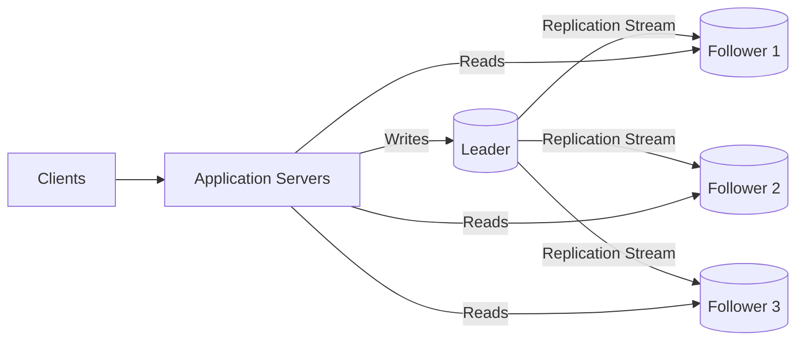
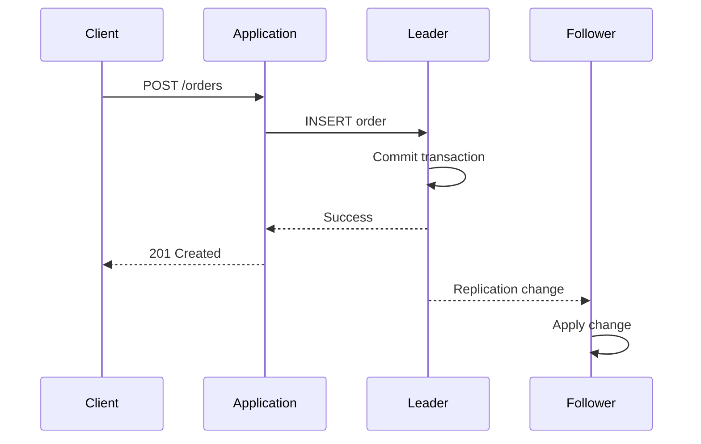
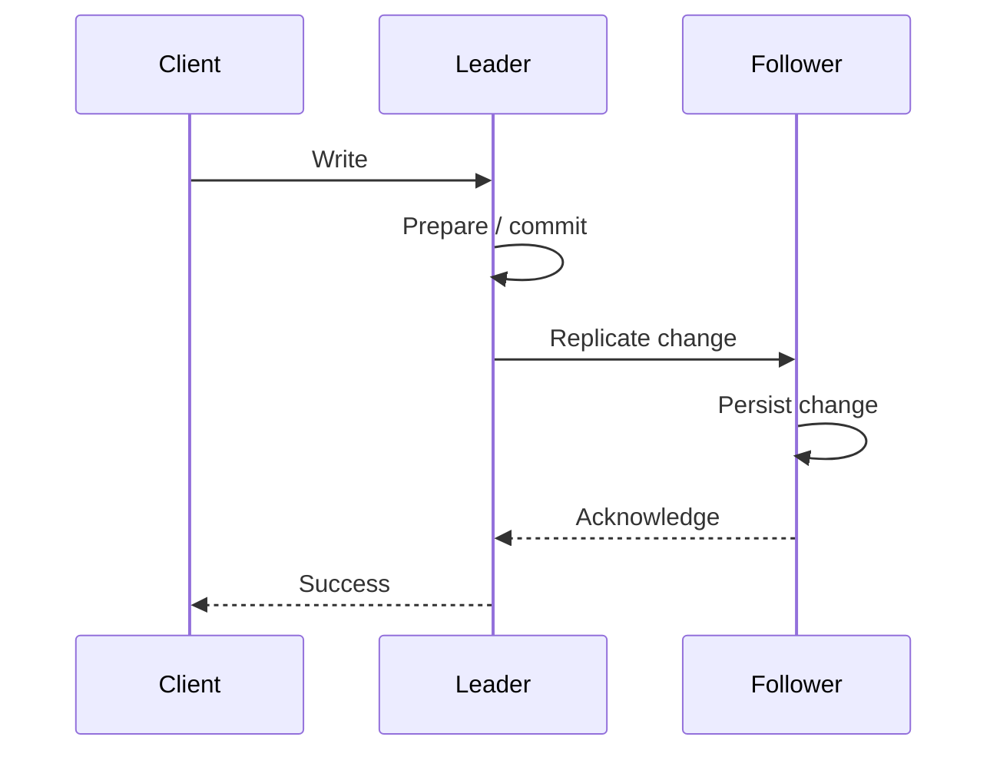
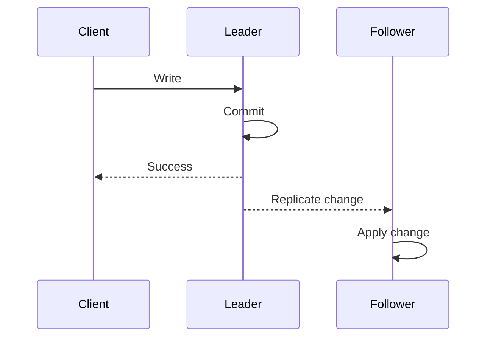
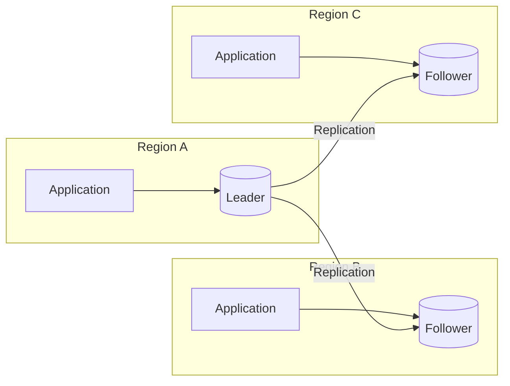
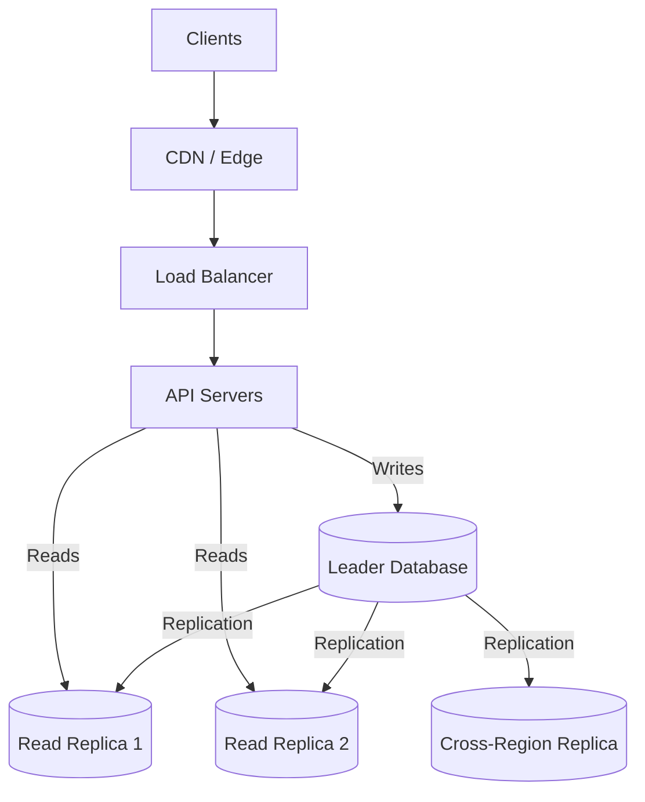

# 05- Leader-Follower Replication

## Overview

Leader-Follower Replication is a database replication architecture in which one database node acts as the **leader** for writes while one or more **followers** maintain replicated copies of the leader's data.

The leader is the authoritative write node:

```text
                         Application
                              |
                    +---------+---------+
                    |                   |
                  Writes               Reads
                    |                   |
                    v                   v
                 Leader          +------+------+
                                 |      |      |
                                 v      v      v
                                F1     F2     F3
```

Followers continuously receive changes from the leader and apply them to their local storage.

The architecture is commonly used to achieve:

- Read scalability
- High availability
- Fault tolerance
- Disaster recovery
- Geographic read distribution
- Workload isolation

The model is relatively simple compared with multi-leader or leaderless replication, but production systems still need to address replication lag, stale reads, failover, split brain, fencing, connection recovery, monitoring, and backup strategy.

The terminology varies between database technologies:

| Generic Term | PostgreSQL | MySQL |
|---|---|---|
| Leader | Primary | Primary / Source |
| Follower | Standby / Replica | Replica |
| Replication log | WAL | Binary Log |
| Promotion | Promote standby | Promote replica |

The important architectural concept is not the terminology but the ownership model:

```text
Leader     → authoritative writes
Followers  → replicated copies
```

---

## Why Leader-Follower Replication Exists

A single database instance creates both a performance bottleneck and a failure domain.

```text
Application
     |
     v
Database
```

If the database fails, the application may become unavailable.

If the application becomes read-heavy, all reads compete with writes for the same database resources.

Consider:

```text
100,000 requests/sec

90,000 reads
10,000 writes
```

A single database must process all 100,000 requests.

Leader-follower replication allows the architecture to separate the workloads:

```text
                     Application
                          |
               +----------+----------+
               |                     |
             Writes                 Reads
               |                     |
               v                     v
            Leader          +--------+--------+
                            |        |        |
                            v        v        v
                           F1       F2       F3
```

The leader continues to own writes while followers absorb read traffic.

This makes leader-follower replication particularly useful for **read-heavy systems**.

---

## Core Architecture

A typical architecture contains:

- One leader
- One or more followers
- A replication mechanism
- Application-level or infrastructure-level routing
- Health monitoring
- Failover mechanisms
- Backup and recovery mechanisms



The normal flow is:

```text
Write request
     |
     v
Leader
     |
     v
Replication stream
     |
     +--> Follower 1
     +--> Follower 2
     +--> Follower 3
```

Read traffic can then be distributed across healthy followers.

---

## Write Path

A write normally goes to the leader.



The important point is that the leader is the authoritative writer.

For example:

```text
POST /orders
        |
        v
      Leader
        |
        v
Order committed
```

The replication system then propagates the change.

With asynchronous replication, the follower may apply the change later.

---

## Read Path

Reads can be distributed across followers:

```text
Client
   |
   v
Application
   |
   v
Read Router
   |
   +--------+--------+
   |        |        |
   v        v        v
  F1       F2       F3
```

A routing mechanism may select a follower based on:

- Health
- Replication lag
- Latency
- Connection utilization
- Geographic location
- Application consistency requirements

A simple architecture might use:

```text
GET /products
        |
        v
Follower Pool
   /    |    \
  F1    F2    F3
```

The routing layer should not assume that every follower is equally healthy or equally up to date.

---

## How Replication Works

Modern databases generally avoid repeatedly copying the entire database.

Instead, the leader generates a stream of changes.

Conceptually:

```text
Leader
  |
  v
Change Log
  |
  +--------+--------+
  |        |        |
  v        v        v
 F1       F2       F3
```

The change log may contain information about:

- Inserts
- Updates
- Deletes
- Transactions
- Commit positions
- Log sequence numbers

The exact implementation differs between database systems.

For example:

```text
PostgreSQL → WAL
MySQL      → Binary Log
```

The follower consumes the replication stream and applies those changes to its local database.

---

## PostgreSQL Example

PostgreSQL uses **Write-Ahead Logging (WAL)**.

A simplified architecture is:

```text
Application
     |
     v
PostgreSQL Leader
     |
     v
     WAL
     |
     v
PostgreSQL Follower
     |
     v
WAL Replay
```

The follower receives WAL records and replays them locally.

PostgreSQL supports both asynchronous replication and configurable synchronous replication.

In production, the replication configuration should be designed around:

- Durability requirements
- Failover requirements
- Availability zones
- Regions
- Network latency
- Recovery objectives

---

## MySQL Example

MySQL commonly uses the binary log for replication.

```text
Application
     |
     v
MySQL Primary
     |
     v
Binary Log
     |
     v
MySQL Replica
     |
     v
Apply Changes
```

The replica consumes changes from the primary's replication stream and applies them locally.

MySQL deployments can use asynchronous and semi-synchronous replication configurations depending on the required durability and availability characteristics.

---

## Synchronous Replication

With synchronous replication, the leader waits for the required replica acknowledgement before completing the write according to the configured commit semantics.



The exact guarantee depends on the database configuration.

The leader may wait for:

- One follower
- Multiple followers
- A quorum
- A specific durability condition

### Advantages

- Stronger durability
- Lower risk of losing acknowledged writes
- Better replica freshness
- Useful for highly critical data

### Limitations

- Increased write latency
- Greater dependency on follower availability
- Network failures can affect writes
- Cross-region synchronous replication can be expensive and slow

### Production Consideration

Synchronous replication should be used when the durability guarantee justifies the additional coordination cost.

A critical financial workload may accept additional latency to reduce the probability of losing an acknowledged transaction.

A less critical read-heavy application may prefer asynchronous replication.

---

## Asynchronous Replication

With asynchronous replication, the leader can acknowledge a write before the follower has necessarily received or applied the change.



This allows the write path to remain independent of follower latency.

Immediately after the write:

```text
Leader   → New state
Follower → Potentially old state
```

### Advantages

- Lower write latency
- Better write availability
- Good cross-region performance
- Follower failures do not necessarily block writes

### Limitations

- Replication lag
- Stale reads
- Potential data loss during failover
- More application-level consistency handling

Asynchronous replication is common for read replicas and cross-region disaster recovery.

---

## Synchronous vs Asynchronous

| Characteristic | Synchronous | Asynchronous |
|---|---|---|
| Write latency | Higher | Lower |
| Replica freshness | Stronger | Potentially stale |
| Acknowledged-write durability | Stronger | Weaker |
| Dependency on follower availability | Higher | Lower |
| Cross-region suitability | Limited | Strong |
| Read-after-write risk | Lower | Higher |
| Write availability | Potentially lower | Higher |
| Operational complexity | High | High |

There is no universally correct choice.

The decision should follow:

```text
Business Requirements
        |
        +--> RPO
        +--> RTO
        +--> Latency
        +--> Availability
        +--> Consistency
        |
        v
Replication Strategy
```

---

## Replication Lag

Replication lag is the delay between a change being committed on the leader and the follower applying or making that change visible.

For example:

```text
Leader
  |
  | UPDATE order
  |
  v
New State

       300 ms

          |
          v

Follower
  |
  v
Old State
```

During that period:

```text
Leader:
status = shipped

Follower:
status = processing
```

Replication lag is expected in asynchronous replication.

The problem occurs when lag becomes:

- Excessive
- Unpredictable
- Continuously increasing
- Long enough to violate application consistency requirements

---

## Causes of Replication Lag

### High Write Volume

The leader produces changes faster than the follower can apply them.

```text
Change Generation Rate
          >
Follower Apply Rate
```

The replication backlog grows.

### Slow Storage

The follower may have insufficient disk throughput.

### CPU Saturation

Replication replay competes with application queries for CPU.

### Network Problems

Replication can be delayed by:

- High latency
- Packet loss
- Insufficient bandwidth
- Regional network issues

### Heavy Read Queries

A follower serving expensive analytical queries may have fewer resources available for replication replay.

### Long-Running Transactions

Long-running transactions can interfere with cleanup and visibility behavior depending on the database.

---

## Measuring Replication Lag

Replication lag should be monitored using database-specific metrics.

Typical measurements include:

- WAL position difference
- Binlog position difference
- Replay delay
- Apply delay
- Replication queue depth
- Commit timestamp difference

Conceptually:

```text
Replication Lag
=
Leader Progress
-
Follower Progress
```

The exact implementation differs by database.

For PostgreSQL, operational monitoring should examine WAL sender/receiver state and replay positions.

For MySQL, replication status and binary-log execution position provide the corresponding signals.

---

## Stable Lag vs Growing Lag

A replica that consistently runs 50 ms behind may be perfectly acceptable.

```text
50 ms
51 ms
48 ms
52 ms
50 ms
```

A replica whose lag continually increases is a capacity problem:

```text
50 ms
100 ms
500 ms
2 sec
10 sec
30 sec
```

The second pattern indicates that the follower is not keeping up with the leader.

Adding more read traffic to that follower would make the problem worse.

---

## Read-After-Write Consistency

Consider:

```text
POST /orders
```

followed immediately by:

```text
GET /orders/123
```

The write goes to the leader:

```text
POST
 |
 v
Leader
 |
 v
Success
```

The read is routed to a follower:

```text
GET
 |
 v
Follower
 |
 v
Old Data
```

The client may see:

```text
Order not found
```

even though the write succeeded.

This is a consistency problem caused by asynchronous replication, not necessarily a database failure.

---

## Strategies for Read-After-Write

### Read From Leader

The simplest strategy is:

```text
Write → Leader
Read  → Leader
```

This provides the strongest straightforward behavior.

The trade-off is increased load on the leader.

### Sticky Reads

After a write, temporarily route the user's reads to the leader.

```text
User
 |
 +--> Write → Leader
 |
 +--> Read  → Leader
 |
 +--> Later Read → Follower
```

This can work well for session-oriented applications.

### Lag-Aware Routing

Do not route reads to followers whose lag exceeds the application's tolerance.

```text
Follower A → 20 ms   ✅
Follower B → 30 ms   ✅
Follower C → 8 sec   ❌
```

### Replication Position Tracking

Advanced systems can associate a successful write with a replication position.

A subsequent read is allowed on a follower only after that follower has reached the required position.

This provides stronger consistency but requires more infrastructure support.

---

## Transactions

Replication interacts strongly with transaction boundaries.

Consider:

```sql
BEGIN;

INSERT INTO orders (...);

SELECT *
FROM orders
WHERE id = 123;

COMMIT;
```

If the write goes to the leader but the read is routed to a follower:

```text
INSERT → Leader
SELECT → Follower
```

the follower may not yet contain the inserted row.

Therefore, transactional operations that require a consistent view should normally remain on the same database connection and transaction.

This is particularly important in Django applications where database routing can otherwise unintentionally separate reads from writes.

---

## Read Scaling

Leader-follower replication is particularly effective for read-heavy systems.

Suppose:

```text
10,000 requests/sec

8,000 reads
2,000 writes
```

Without replicas:

```text
Primary
  |
  +--> 8,000 reads
  +--> 2,000 writes
```

With replicas:

```text
                 Application
                      |
             +--------+--------+
             |                 |
           Writes            Reads
             |                 |
             v                 v
          Leader       +-------+-------+
                       |       |       |
                       v       v       v
                      F1      F2      F3
```

The read workload can be distributed across multiple machines.

---

## Read Scaling Limitations

Replication does not automatically increase write capacity.

The leader still performs:

- Write processing
- Transaction coordination
- Log generation
- Replication transmission
- Connection management

Therefore:

```text
More Read Replicas
        |
        X
        |
More Write Capacity
```

If the leader is the bottleneck because of write throughput, adding read replicas will not solve the problem.

Possible next-level strategies include:

- Partitioning
- Sharding
- Multiple leaders
- Workload separation
- Distributed databases

---

## Replica Routing

A production system should not randomly route reads to every replica.

A routing layer should consider:

```text
                    Read Request
                         |
                         v
                    Read Router
                         |
             +-----------+-----------+
             |           |           |
             v           v           v
          Follower A  Follower B  Follower C
             |           |           |
          Healthy      Healthy     Lagging
             |           |           |
             +-----------+           X
                     |
                     v
                  Response
```

Routing criteria may include:

- Health
- Replication lag
- Latency
- Connection utilization
- Region
- Availability zone

---

## Connection Pooling

Replication increases the number of database endpoints the application may use.

For example:

```text
100 API instances
```

each with:

```text
20 database connections
```

can create:

```text
2,000 database connections
```

across the database infrastructure.

Connection pools should therefore be sized carefully.

Important parameters include:

- Maximum pool size
- Minimum pool size
- Connection lifetime
- Idle timeout
- Database connection limits
- Application concurrency

For PostgreSQL, PgBouncer can reduce connection-management overhead in suitable architectures.

---

## Failover

One of the major benefits of replication is the ability to promote a follower when the leader fails.

Initial state:

```text
              Leader
             /      \
            v        v
           F1        F2
```

After failure:

```text
              Leader ❌
             /       \
            v         v
           F1         F2
```

The system must select a follower:

```text
F1
 |
 v
Promote
 |
 v
New Leader
```

A complete failover process includes:

1. Detect leader failure.
2. Determine whether the failure is real.
3. Select a suitable follower.
4. Fence the old leader.
5. Promote the follower.
6. Update routing.
7. Refresh application connections.
8. Reconfigure remaining followers.
9. Monitor recovery.

---

## Choosing a Follower for Promotion

Not every follower is equally suitable.

Consider:

```text
Follower A
Lag = 10 ms
AZ = A

Follower B
Lag = 5 sec
AZ = B

Follower C
Lag = 30 ms
AZ = C
```

Follower A may be the best candidate because it is the most current, assuming other health criteria are acceptable.

Selection criteria can include:

- Replication lag
- Data completeness
- Availability zone
- Region
- Hardware capacity
- Health status
- Recovery position

The objective is to minimize data loss and recovery time.

---

## Fencing the Old Leader

Suppose the leader appears unavailable to the application but is still running.

```text
Application
     |
     X
   Leader
```

Meanwhile, a follower is promoted:

```text
New Leader
     |
     v
Accepting Writes
```

If the old leader becomes reachable again and continues accepting writes, two writers may exist.

```text
Old Leader       New Leader
     |               |
   Writes           Writes
```

This is split brain.

Fencing prevents the old leader from continuing to operate as the authoritative writer.

Possible mechanisms include:

- Network isolation
- Instance termination
- Storage fencing
- Lease expiration
- Database-specific fencing
- External coordination

Failover without fencing can be unsafe.

---

## Split Brain

Split brain occurs when two or more nodes believe they are the authoritative leader.

```text
             Network Partition

          Leader A  X  Leader B
             |            |
             v            v
          Writes        Writes
```

Possible consequences:

- Divergent data
- Lost updates
- Duplicate records
- Conflicting transactions
- Difficult reconciliation

A robust failover design must ensure:

```text
At most one authoritative writer
```

at any given time.

---

## Failover and Application Connections

Database failover does not automatically update existing application connections.

For example:

```text
Application
     |
     v
Connection Pool
     |
     v
Old Leader ❌
```

After promotion:

```text
New Leader
```

the application may still have connections pointing to the old node.

The application infrastructure must support:

- Connection failure detection
- Connection recycling
- Leader discovery
- Reconnection
- Pool refresh

This is particularly important for long-running Django, FastAPI, Celery, and worker processes.

---

## DNS-Based Leader Discovery

Some architectures expose a stable database endpoint:

```text
db.internal.example.com
```

which resolves to the current leader.

Before failover:

```text
db.internal.example.com
        |
        v
Leader A
```

After failover:

```text
db.internal.example.com
        |
        v
Leader B
```

However, DNS does not instantly update every application.

Factors include:

- DNS TTL
- Resolver caching
- Connection pooling
- Existing TCP connections
- Application-level caching

A short DNS TTL alone does not guarantee immediate failover.

---

## Multi-AZ Architecture

A common high-availability design places the leader and follower in different availability zones.

```text
AWS Region

AZ-A                    AZ-B

Leader                  Follower
   |                        ^
   +---- Replication -------+
```

This protects against certain availability-zone failures.

The follower should not be placed in the same failure domain if the objective is zone-level resilience.

For stronger disaster recovery, additional replication can extend across regions.

---

## Multi-Region Architecture

A leader can replicate to followers in other regions:



Benefits include:

- Disaster recovery
- Geographic read scaling
- Regional fault isolation

Costs include:

- Cross-region latency
- Network transfer charges
- Replication lag
- More complex failover

Cross-region replicas are often asynchronous because synchronous cross-region writes can add significant latency.

---

## Replication and Disaster Recovery

Replication improves availability but is not a substitute for backups.

Consider:

```text
Primary
   |
   +--> Replica A
   |
   +--> Replica B
```

If an operator executes:

```sql
DELETE FROM orders;
```

the deletion can be replicated to both followers.

Backups provide historical recovery points:

```text
Primary
   |
   +--> Replicas
   |
   +--> Backup
           |
           v
      Object Storage
```

A production system should generally use:

```text
Replication → availability
Backups     → historical recovery
```

Both solve different problems.

---

## RPO and Replication

Recovery Point Objective (RPO) describes how much data loss is acceptable after a failure.

For example:

```text
RPO = 0
```

requires an architecture designed to avoid losing acknowledged data.

With asynchronous replication:

```text
Leader
 |
 | Last 5 seconds
 | not replicated
 v
Follower
```

a failure could result in those recent changes being unavailable after promotion.

Therefore:

```text
Replication Mode
      |
      v
Durability Guarantee
      |
      v
Potential RPO
```

Replication design should begin with the business's RPO requirement.

---

## Replication Is Not Backup

This distinction is critical.

| Capability | Replication | Backup |
|---|---|---|
| High availability | Yes | No |
| Read scaling | Yes | No |
| Fast failover | Yes | No |
| Historical recovery | Usually no | Yes |
| Protection from accidental deletes | No | Yes |
| Protection from corruption propagation | Limited | Yes |
| Disaster recovery | Yes | Yes |
| Point-in-time recovery | Not usually | Yes |

A production database should normally have both replication and independent backups.

---

## Replication in Django

Django can use multiple database connections and database routers to separate reads and writes.

A simplified configuration might look like:

```python
DATABASES = {
    "default": {
        "ENGINE": "django.db.backends.postgresql",
        "NAME": "application",
        "HOST": "leader.internal",
        "USER": "application",
        "PASSWORD": "secret",
    },
    "replica": {
        "ENGINE": "django.db.backends.postgresql",
        "NAME": "application",
        "HOST": "replica.internal",
        "USER": "application",
        "PASSWORD": "secret",
    },
}
```

Secrets should not be hardcoded in production.

Use mechanisms such as:

- AWS Secrets Manager
- Kubernetes Secrets
- Environment variables backed by a secret manager
- Vault

A simplified router could be:

```python
class DatabaseRouter:
    def db_for_write(self, model, **hints):
        return "default"

    def db_for_read(self, model, **hints):
        return "replica"
```

This is only a starting point.

A production router must consider:

- Read-after-write consistency
- Transactions
- Replica health
- Replication lag
- Administrative operations
- Migrations
- Background workers

Blindly sending every read to a replica is a common source of subtle bugs.

---

## Replication in FastAPI

FastAPI does not implement database replication itself.

The database infrastructure provides the replicated topology:

```text
FastAPI
   |
   +--> Write Pool → Leader
   |
   +--> Read Pool  → Replica Pool
```

Application code must understand the consistency implications.

For example:

```text
POST /orders
    |
    v
Leader

GET /orders/123
    |
    v
Replica
```

may produce stale results immediately after the write.

FastAPI applications should therefore make read/write routing an explicit architectural decision rather than an accidental connection-pool behavior.

---

## Replication and Celery

Background workers can introduce additional consistency problems.

For example:

```text
API
 |
 +--> Write → Leader
 |
 +--> Queue → Celery
             |
             v
          Worker
             |
             v
          Replica
```

If the Celery worker immediately reads from a lagging replica, it may not see the data created by the API transaction.

For workflows that depend on freshly committed data, workers may need to:

- Read from the leader
- Wait for a consistency condition
- Use an event carrying the required data
- Use an outbox/event-driven design

Replication therefore affects not only HTTP request paths but also asynchronous processing.

---

## Replication and Caching

A cache can hide some database read load, but it does not eliminate replication consistency concerns.

Consider:

```text
Client
  |
  v
Redis
  |
  v
Replica
```

If stale data is cached, the stale result can live longer than the underlying replication lag.

Cache invalidation should therefore be coordinated with the application's consistency requirements.

For strongly consistent operations, do not assume:

```text
Replication + Redis
```

automatically produces consistent results.

---

## Monitoring

Replication should be treated as a first-class production subsystem.

Important metrics include:

| Metric | Purpose |
|---|---|
| Replication lag | Detect stale replicas |
| Replication state | Detect broken replication |
| WAL/binlog backlog | Measure replication pressure |
| Replay/apply rate | Measure follower capacity |
| Database CPU | Detect saturation |
| Disk I/O | Detect storage bottlenecks |
| Network throughput | Detect replication bottlenecks |
| Active connections | Detect connection exhaustion |
| Query latency | Detect overloaded replicas |
| Failover events | Track availability incidents |

Alert thresholds should be based on application requirements.

For example, a reporting application may tolerate several seconds of lag.

A user-facing order-status API may not.

---

## Replica Health

A replica should not receive production traffic merely because its database process is running.

A useful health model is:

```text
Database Process
      |
      v
Replication Channel
      |
      v
Replication Lag
      |
      v
Disk Capacity
      |
      v
CPU / Memory
      |
      v
Query Latency
      |
      v
Eligible for Read Traffic
```

A lagging or unhealthy replica should be removed from the read pool until it recovers.

---

## Security Considerations

Replication traffic can contain sensitive database changes.

Production systems should:

- Encrypt replication traffic.
- Use dedicated replication credentials.
- Apply least privilege.
- Restrict replication network access.
- Keep database nodes private.
- Rotate credentials.
- Encrypt database storage.
- Encrypt backups.
- Audit administrative operations.

For AWS deployments:

```text
Internet
   |
   X
Database

Private Network
   |
   +--> Leader
   |
   +--> Followers
```

Database nodes should generally not be directly exposed to the public internet.

---

## Cost Considerations

Every follower adds infrastructure cost:

- Compute
- Storage
- Network
- Monitoring
- Backup
- Operational overhead

Cross-region replicas can additionally incur:

- Inter-region data transfer
- Additional storage
- Additional monitoring
- Higher operational complexity

For example:

```text
1 Leader
+
3 Read Replicas
+
1 Cross-Region Replica
```

may be justified for a high-traffic production system but could be unnecessary for a low-volume application.

Replicas should have a measurable purpose.

---

## AWS Considerations

AWS managed database services provide different replication and availability mechanisms.

Common services include:

- Amazon RDS
- Amazon Aurora
- Amazon DynamoDB
- Amazon DocumentDB

For relational databases, an important distinction is between **Multi-AZ deployments** and **read replicas**.

| Capability | Multi-AZ | Read Replica |
|---|---|---|
| Primary purpose | High availability | Read scaling |
| Read traffic | Usually not the primary goal | Yes |
| Automatic failover | Typically supported | Depends on architecture/service |
| Independent read workload | Not the primary purpose | Yes |
| Replication | Yes | Yes |
| Disaster recovery | Can help | Can help |

Do not treat these as interchangeable.

A common architecture may use:

```text
Multi-AZ
    +
Read Replicas
    +
Backups
```

to address different operational requirements.

---

## Kubernetes Considerations

Kubernetes provides infrastructure primitives but does not automatically solve database replication semantics.

Kubernetes can manage:

- StatefulSets
- Persistent volumes
- Services
- Networking
- Pod lifecycle

It does not automatically provide:

- Correct database leader election
- Safe promotion
- Replication consistency
- Split-brain prevention
- Database-aware backups
- Transaction semantics

For production databases, teams commonly use:

- Managed database services
- Database-specific operators
- Specialized database controllers

Running a database on Kubernetes should be based on operational requirements rather than assuming Kubernetes itself provides database high availability.

---

## Common Mistakes

### Treating Replicas as Backups

Replicas can replicate accidental changes and deletes.

**Avoidance:** Maintain independent backups with point-in-time recovery where required.

### Ignoring Replication Lag

Applications may return stale data without realizing it.

**Avoidance:** Monitor lag and define acceptable consistency windows.

### Routing Every Read to Replicas

This can break read-after-write behavior.

**Avoidance:** Route consistency-sensitive reads to the leader or implement lag-aware routing.

### Assuming Replication Automatically Provides Failover

Having a replica does not mean it will automatically become the leader.

**Avoidance:** Design and test promotion, fencing, routing, and connection recovery.

### Adding Replicas to Solve Write Bottlenecks

Replicas primarily increase read capacity.

**Avoidance:** Profile the workload before scaling the topology.

### Ignoring Replica Resource Contention

A replica may simultaneously process:

```text
Replication Replay
+
Application Queries
```

Heavy reads can therefore slow replication.

**Avoidance:** Monitor CPU, disk I/O, and replay throughput.

### Using Cross-Region Synchronous Replication Without Latency Analysis

Every write may become dependent on remote network latency.

**Avoidance:** Evaluate RPO, latency, and availability requirements before selecting synchronous replication.

### Forgetting Connection Recovery

After failover, connection pools may still point to the old leader.

**Avoidance:** Implement connection recycling and reliable leader discovery.

### Performing Unsafe Schema Changes

Schema changes can interact with replication depending on the database and topology.

**Avoidance:** Use backward-compatible migration strategies and test them against the actual production replication architecture.

---

## Production Best Practices

### Define the Purpose of Replication

Start with the actual requirement:

```text
Replication
    |
    +--> Read Scaling
    +--> High Availability
    +--> Disaster Recovery
    +--> Geographic Read Performance
```

Do not deploy replicas simply because a production database "should have replicas."

### Define Consistency Requirements

Document:

- Acceptable replica lag
- Read-after-write requirements
- Transaction boundaries
- Which endpoints require leader reads
- Which workloads can tolerate stale data

### Monitor Before Users Notice

Replication alerts should trigger before lag or failures become user-visible.

### Test Failover

Regularly test:

- Leader failure
- Replica promotion
- Connection recovery
- Routing changes
- Replica rebuild
- Backup restoration

### Keep Backups Independent

Replication protects availability.

Backups protect recoverability.

### Distribute Failure Domains

Where appropriate, distribute replicas across:

- Availability zones
- Regions
- Independent infrastructure boundaries

### Automate Operational Recovery

Manual failover increases recovery time and human error.

Where automation is safe, automate:

- Health checks
- Promotion
- Routing
- Connection recovery
- Replica provisioning

---

## Production Architecture Example

A read-heavy production API might use:



This architecture separates:

```text
Writes
  ↓
Leader

Reads
  ↓
Read Replica Pool

Disaster Recovery
  ↓
Cross-Region Replica
```

It still requires explicit decisions about:

- Consistency
- Failover
- RPO
- RTO
- Backups
- Monitoring
- Security

---

## Operational Runbook

A production runbook should answer:

### If Replication Stops

Check:

1. Replica connectivity.
2. Replication process state.
3. Disk capacity.
4. Network connectivity.
5. Database logs.
6. Replication backlog.
7. WAL/binlog retention.

### If Replication Lag Increases

Check:

1. Leader write rate.
2. Replica CPU.
3. Replica disk I/O.
4. Long-running queries.
5. Network throughput.
6. Replication apply rate.

### If the Leader Fails

Execute:

1. Confirm failure.
2. Prevent split brain.
3. Select the healthiest follower.
4. Promote the follower.
5. Update leader discovery.
6. Reconnect applications.
7. Reconfigure remaining replicas.
8. Monitor recovery.

The exact commands depend on the database technology and failover tooling.

---

## Interview Perspective

A weak answer to:

> "What is leader-follower replication?"

is:

> One database handles writes and other databases handle reads.

A stronger answer is:

> Leader-follower replication maintains one authoritative writer and one or more replicated followers. The leader processes writes and generates a replication stream that followers consume. Followers can scale read traffic and provide failover or disaster-recovery capacity. The main trade-offs are replication lag, stale reads, failover complexity, and the risk of losing recently acknowledged writes when asynchronous replication is used.

A senior-level interview discussion should cover:

```text
Leader-Follower Replication
        |
        +--> Write Path
        |
        +--> Read Path
        |
        +--> Sync vs Async
        |
        +--> Replication Lag
        |
        +--> Read-After-Write
        |
        +--> Failover
        |
        +--> Fencing
        |
        +--> Split Brain
        |
        +--> Backups
        |
        +--> RPO / RTO
        |
        +--> Monitoring
```

A common follow-up is:

> "What happens when the leader fails?"

A production-quality answer should not stop at:

> Promote a replica.

It should explain:

```text
Detect Failure
      ↓
Select Replica
      ↓
Fence Old Leader
      ↓
Promote Replica
      ↓
Update Routing
      ↓
Refresh Connections
      ↓
Rebuild Replicas
      ↓
Verify Health
```

That distinction demonstrates an understanding of operational system design rather than only database terminology.

---

## Production Checklist

Before deploying leader-follower replication, verify:

- [ ] Leader and follower responsibilities are clearly defined.
- [ ] Replication mode is explicitly documented.
- [ ] Replication topology is documented.
- [ ] Replication lag is monitored.
- [ ] Read-after-write behavior is defined.
- [ ] Read routing is consistency-aware.
- [ ] Leader failure detection is implemented.
- [ ] Replica promotion is documented and tested.
- [ ] Old leaders can be fenced.
- [ ] Application connection pools recover after failover.
- [ ] Independent backups exist.
- [ ] Point-in-time recovery is configured where required.
- [ ] RPO and RTO are documented.
- [ ] Replication traffic is encrypted.
- [ ] Database endpoints remain private.
- [ ] Replica capacity is monitored.
- [ ] Cross-region recovery is tested where required.
- [ ] Failover procedures are automated or operationally documented.
- [ ] Disaster recovery runbooks exist.

---

## Key Takeaways

- Leader-follower replication centralizes writes on one leader while distributing replicated read workloads across followers.
- Synchronous replication provides stronger durability guarantees, while asynchronous replication provides lower write latency at the cost of potential lag and stale reads.
- Production read routing must explicitly account for replication lag, read-after-write consistency, transactions, and follower health.
- High availability requires more than replicas: failure detection, fencing, promotion, routing updates, connection recovery, and tested disaster recovery are essential.
- Replication improves read scalability and availability but does not solve write bottlenecks; write-heavy systems may eventually require partitioning, sharding, multi-leader, or distributed-database architectures.