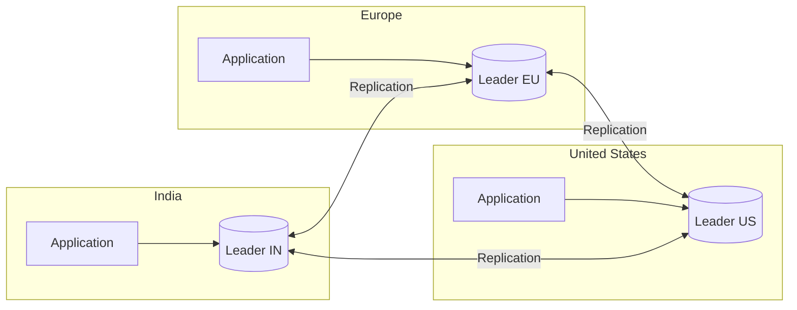
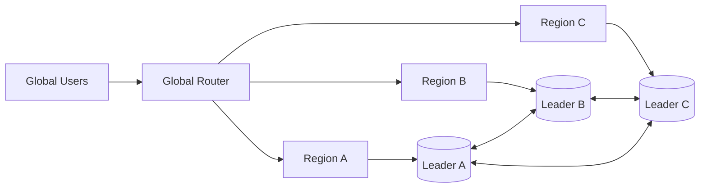

# 06- Multi-Leader Replication

## Overview

Multi-Leader Replication is a database replication architecture in which **multiple database nodes can independently accept writes** while replicating changes between one another.

In a leader-follower architecture, there is one authoritative writer:

```text
                Leader
               /      \
              v        v
          Follower  Follower
```

Multi-leader replication removes the single-writer restriction:

```text
             Leader A
            /         \
           v           v
       Leader B <----> Leader C
```

Each leader can process local writes and replicate those changes to other leaders.

The primary motivation is usually **geographic write locality**. If users in India, Europe, and the United States all need low-latency writes, sending every write to one central database leader can create unnecessary network latency.

A multi-leader architecture can instead provide:

```text
India Users     → Leader-IN
Europe Users    → Leader-EU
US Users        → Leader-US
```

The major trade-off is that multiple writable nodes introduce distributed write conflicts.

The architecture therefore requires explicit decisions around:

- Write ownership
- Conflict detection
- Conflict resolution
- Ordering
- Consistency
- Idempotency
- Failover
- Network partitions
- Reconciliation
- Disaster recovery

Multi-leader replication can improve geographic availability and write latency, but it is significantly more complex to operate than leader-follower replication.

---

## Why Multi-Leader Replication Exists

A single leader works well when there is one logical location for writes.

```text
Global Users
     |
     v
US Leader
     |
     +--> Replicas
```

However, consider a user in India:

```text
India User
     |
     |  Long-distance network
     v
US Leader
```

Every write must cross the network before the application can complete the operation.

This can increase:

- Network latency
- Tail latency
- Dependency on a remote region
- Impact of regional network failures

Multi-leader replication can move the write path closer to the user:

```text
India User
     |
     v
Leader-IN
```

while still replicating the change globally:

```text
Leader-IN
    |
    +------------------> Leader-EU
    |
    +------------------> Leader-US
```

The same principle applies to users in other regions.

---

## Core Architecture

A typical multi-region architecture looks like:



Each leader can:

- Accept writes
- Serve reads
- Generate replication changes
- Consume changes from other leaders
- Participate in conflict resolution

The topology does not necessarily have to be fully connected.

For example:

```text
Leader A
    |
    v
Leader B
    |
    v
Leader C
```

or:

```text
        Leader A
        /      \
       v        v
   Leader B  Leader C
```

The topology depends on the database technology, replication protocol, network architecture, and recovery requirements.

---

## Leader-Follower vs Multi-Leader

| Characteristic | Leader-Follower | Multi-Leader |
|---|---|---|
| Writable nodes | Usually one | Multiple |
| Write locality | Centralized | Distributed |
| Cross-region write latency | Potentially high | Potentially lower |
| Conflict handling | Limited | Critical |
| Operational complexity | Lower | Much higher |
| Regional write availability | Limited by leader | Stronger |
| Write scalability | Leader-bound | Potentially distributed |
| Failover complexity | Moderate | High |
| Consistency model | Easier to reason about | More complex |
| Typical use case | Read-heavy workloads | Geo-distributed write workloads |

Multi-leader replication should not be selected simply because multiple leaders appear more scalable.

The architecture should exist because the system has a concrete requirement for multiple writable locations.

---

## How Multi-Leader Replication Works

Consider two regions:

```text
Region A                  Region B

Leader A                  Leader B
   |                         |
   | Local Write             | Local Write
   |                         |
   +------------+------------+
                |
          Replication
```

Suppose a user in Region A writes:

```text
Order 100
```

Leader A commits the write locally.

It then generates a replication event:

```text
Leader A
    |
    v
Order 100 Created
    |
    v
Leader B
```

At the same time, Leader B may independently process another write:

```text
Leader B
    |
    v
Order 200 Created
```

That change is replicated back:

```text
Leader B
    |
    v
Order 200 Created
    |
    v
Leader A
```

If the changes affect independent records, the system can generally converge without conflict.

The difficult case is concurrent modification of the same logical data.

---

## The Fundamental Problem: Write Conflicts

Suppose:

```text
Initial State:

User.plan = "basic"
```

Leader A receives:

```text
User.plan = "premium"
```

At approximately the same time, Leader B receives:

```text
User.plan = "enterprise"
```

Both local writes may succeed:

```text
Leader A → premium

Leader B → enterprise
```

When replication occurs:

```text
Leader A
    |
    | premium
    v
Leader B

Leader B
    |
    | enterprise
    v
Leader A
```

The system now has two valid concurrent modifications.

It must determine:

> Which state should the system converge to?

This is the central challenge of multi-leader replication.

---

## Why Conflicts Occur

Conflicts can result from:

- Concurrent writes
- Network partitions
- Regional outages
- Offline clients
- Delayed replication
- Retry behavior
- Duplicate operations
- Incorrect routing
- Clock differences
- Simultaneous updates to the same entity

The more frequently multiple leaders modify the same data, the more difficult the architecture becomes.

This is why **data ownership** is often more valuable than sophisticated conflict resolution.

---

## Types of Conflicts

### Write-Write Conflict

Two leaders modify the same record:

```text
Leader A → status = shipped

Leader B → status = cancelled
```

The system needs an explicit resolution rule.

---

### Delete-Update Conflict

One leader deletes a record while another updates it:

```text
Leader A → DELETE user 123

Leader B → UPDATE user 123
```

Possible policies include:

- Delete wins
- Update wins
- Newer operation wins
- Business-specific reconciliation

The correct answer depends on the domain.

---

### Unique Constraint Conflict

Two leaders independently create the same unique value:

```text
Leader A:
email = user@example.com

Leader B:
email = user@example.com
```

Both local transactions may succeed.

After replication, the global dataset cannot contain both records if the email must be globally unique.

This makes globally unique constraints particularly challenging in multi-leader architectures.

---

### Counter Conflict

Consider:

```text
Initial balance = 100
```

Leader A:

```text
-20
```

Leader B:

```text
-30
```

If the application treats the operations as absolute assignments:

```text
Leader A → balance = 80
Leader B → balance = 70
```

one update can overwrite the other.

If the operations are represented as deltas:

```text
-20
-30
```

the system may be able to merge them:

```text
100 - 20 - 30 = 50
```

The data model therefore has a major influence on whether conflicts are easy or difficult to resolve.

---

## Conflict Detection

A distributed replication system needs metadata to determine whether changes are:

- Sequential
- Causally related
- Concurrent
- Duplicates

Common mechanisms include:

- Version numbers
- Logical timestamps
- Lamport clocks
- Vector clocks
- Transaction identifiers
- Replication positions
- Causal metadata

A simplified version-based example:

```text
Record version = 42
```

Two leaders independently read version 42.

Leader A produces:

```text
Version 43
```

Leader B also produces:

```text
Version 43
```

The system can detect that both changes originated from the same previous version.

---

## Logical Clocks

Physical clocks are not sufficient for reliable distributed ordering.

For example:

```text
Leader A clock → 10:00:01

Leader B clock → 10:00:00
```

The timestamps do not necessarily tell us which operation actually happened first.

Logical clocks provide ordering information without depending entirely on synchronized wall clocks.

A Lamport-style logical clock can represent:

```text
Event A → 10
Event B → 11
Event C → 12
```

However, a logical clock establishes ordering relationships; it does not automatically provide a complete representation of causality.

---

## Vector Clocks

Vector clocks can represent causal relationships between multiple nodes.

For two leaders:

```text
Leader A: [3, 1]
Leader B: [2, 4]
```

If neither vector dominates the other, the operations may be concurrent.

Conceptually:

```text
A → [4, 1]

B → [2, 5]
```

These operations may represent concurrent modifications.

Vector clocks can provide useful conflict-detection semantics but increase metadata and implementation complexity.

They should be used when the database or application actually requires this level of causal tracking.

---

## Conflict Resolution Strategies

There is no universally correct conflict-resolution strategy.

The correct mechanism depends on the semantics of the data.

Common approaches include:

- Last-write-wins
- Version-based resolution
- Application-level merge
- Deterministic conflict rules
- CRDTs
- Explicit conflict queues
- Single-owner routing

---

## Last-Write-Wins

Last-Write-Wins (LWW) selects one value according to an ordering mechanism, often a timestamp or logical version.

Example:

```text
Change A
timestamp = 10:00:01

Change B
timestamp = 10:00:05

Winner = Change B
```

### Advantages

- Simple
- Deterministic when ordering is reliable
- Easy to reason about operationally

### Limitations

- A valid update can silently disappear.
- Physical clock skew can produce incorrect ordering.
- "Latest" does not necessarily mean "correct."
- Business semantics are ignored.

For non-critical metadata, LWW may be acceptable.

For financial transactions, inventory, or irreversible business operations, it is often dangerous.

---

## Version-Based Resolution

A record can carry a version:

```text
{
    "value": "premium",
    "version": 42
}
```

A client attempts:

```text
Update where version = 42
```

If another leader has already changed the record:

```text
Current version = 43
```

the update can be rejected or placed into conflict handling.

This is similar to optimistic concurrency control.

It can prevent silent overwrites but does not automatically solve distributed reconciliation.

---

## Application-Level Merge

Some data can be merged according to business semantics.

For example:

```text
Leader A:
tags = ["python"]

Leader B:
tags = ["aws"]
```

A merge operation can produce:

```text
tags = ["python", "aws"]
```

Another example is a set of independent preferences:

```text
Leader A:
notifications.email = true

Leader B:
notifications.sms = true
```

These changes can potentially merge safely.

Application-level merging is often preferable when the business meaning of the data is known.

---

## CRDTs

A **Conflict-Free Replicated Data Type (CRDT)** is a data structure designed so that independently performed operations can be merged deterministically and eventually converge to the same state.

Common CRDT-style structures include:

- Counters
- Sets
- Registers
- Collaborative data structures

For example, a distributed counter may represent:

```text
Leader A → +5
Leader B → +3
```

The merged result becomes:

```text
+8
```

CRDTs are powerful but are not a general replacement for normal database transactions.

They work best when the data model naturally supports mathematically well-defined merge operations.

---

## Avoiding Conflicts Is Better Than Resolving Them

The best conflict-resolution strategy is often:

> Do not create the conflict.

Instead of allowing every leader to modify every entity:

```text
Any Region
    |
    v
Any Record
    |
    v
Any Leader
```

assign ownership:

```text
Customer 123
     |
     v
Owner = India
     |
     v
Leader-IN
```

Other regions can still read the data, but writes for that entity are routed to its owner.

This changes the problem from:

```text
Distributed conflict resolution
```

to:

```text
Deterministic request routing
```

The latter is usually much easier to reason about.

---

## Data Ownership Models

### Region-Based Ownership

```text
India Users
    |
    v
Leader-IN

Europe Users
    |
    v
Leader-EU

US Users
    |
    v
Leader-US
```

### Tenant-Based Ownership

```text
Tenant A → Leader 1
Tenant B → Leader 2
Tenant C → Leader 3
```

This is particularly useful for multi-tenant SaaS systems.

### Hash-Based Ownership

The owning leader can be determined using a partitioning function:

```text
hash(entity_id) % N
```

For example:

```text
hash(user_id) % 3

0 → Leader A
1 → Leader B
2 → Leader C
```

The major challenge is rebalancing ownership when the number of leaders changes.

---

## Active-Active Architecture

Multi-leader replication is commonly used to implement active-active deployments.

```text
Region A → Active
Region B → Active
Region C → Active
```

All regions can process production traffic.



Advantages include:

- Local writes
- Regional availability
- Better resource utilization
- Reduced dependency on one region

However, active-active increases the importance of:

- Conflict resolution
- Global identifiers
- Ordering
- Data ownership
- Regional failure handling

---

## Network Partitions

Network partitions are one of the hardest failure modes.

Suppose:

```text
Leader A  X  Leader B
```

The leaders can no longer exchange replication messages.

If both continue accepting writes:

```text
Leader A

Write X
Write Y
Write Z
```

and:

```text
Leader B

Write P
Write Q
Write R
```

the system develops divergent histories.

When the network is restored:

```text
Leader A <------------> Leader B
```

the system must reconcile both histories.

If they modified different records, reconciliation may be straightforward.

If they modified the same records, conflict resolution becomes necessary.

---

## Partition Tolerance and Availability

Multi-leader systems often favor availability during network partitions.

During a partition:

```text
Leader A
    |
    v
Accept Writes
```

and:

```text
Leader B
    |
    v
Accept Writes
```

This keeps regions operational but increases divergence.

Alternatively, the system can reject writes when replication connectivity is lost.

That improves consistency but reduces availability.

This is a fundamental distributed-systems trade-off:

```text
Continue Writing
       |
       v
Higher Availability
       +
Potential Divergence
```

versus:

```text
Stop Writing
       |
       v
Lower Availability
       +
Stronger Consistency
```

The correct decision depends on the business requirement.

---

## Ordering

Different leaders can observe events in different orders.

For example:

```text
Leader A:

Event 1
Event 2
```

Leader B might receive:

```text
Event 2
Event 1
```

If the events are independent, this may not matter.

If Event 2 depends on Event 1, it matters significantly.

Distributed systems therefore use:

- Sequence numbers
- Logical clocks
- Causal ordering
- Per-entity ordering
- Partition-level ordering

Global total ordering is expensive.

A better architecture is often to require ordering only where the business domain needs it.

---

## Idempotency

Replication systems and networks can produce duplicate deliveries.

For example:

```text
Event ID = 123
```

may arrive:

```text
Event 123
Event 123
```

If processing is not idempotent, the operation can execute twice.

For example:

```text
Charge Credit Card
```

must not result in:

```text
Charge
Charge
```

because a replication message was delivered twice.

A common pattern is to use a unique operation identifier:

```text
operation_id = "7b9c..."
```

and durably record processed operations.

Conceptually:

```python
def process_event(event):
    if already_processed(event.operation_id):
        return

    apply_event(event)
    record_processed(event.operation_id)
```

The actual implementation should use an atomic database mechanism or durable idempotency store rather than an in-memory set.

---

## Identifier Generation

Multi-leader architectures complicate ID generation.

A local auto-increment sequence can collide:

```text
Leader A → ID 101
Leader B → ID 101
```

Strategies include:

### UUIDs

```python
from uuid import uuid4

order_id = uuid4()
```

UUIDs provide decentralized uniqueness but can have storage and index implications depending on database representation.

### Region-Prefixed IDs

```text
IN-000101
US-000101
EU-000101
```

This makes identifiers unique but couples them to region information.

### Distributed Time-Based IDs

Snowflake-style identifiers can combine:

- Timestamp
- Region or worker identifier
- Sequence number

This can provide globally unique and roughly time-ordered IDs without a centralized database sequence.

---

## Globally Unique Constraints

Multi-leader architectures make global uniqueness difficult.

Consider:

```text
Leader A:
username = aranya

Leader B:
username = aranya
```

Both writes may succeed locally.

After replication:

```text
Global State

username = aranya
username = aranya
```

A unique index on each local database cannot prevent the conflict because each leader made its decision independently.

Solutions include:

- Centralized uniqueness service
- Deterministic ownership
- Global reservation mechanism
- Region-specific namespaces
- Globally coordinated identifiers

A common architectural recommendation is:

> Avoid globally coordinated constraints when the system can model ownership instead.

---

## Transactions

Multi-leader replication makes global transactions difficult.

Suppose:

```text
Leader A

Debit Account A
```

and:

```text
Leader B

Credit Account B
```

If both operations must be atomically committed as one transaction, ordinary asynchronous multi-leader replication does not automatically provide that guarantee.

The transaction may need:

- Distributed coordination
- A single write owner
- Distributed transaction protocols
- Application-level compensation

Often the better architectural decision is to keep tightly coupled transactional data under one write authority.

For example:

```text
Account A
Account B
    |
    v
Same Transaction Boundary
    |
    v
Same Leader
```

---

## Multi-Leader and PostgreSQL

Standard PostgreSQL primary/standby replication is primarily a leader-follower architecture.

PostgreSQL can support more advanced replication architectures using mechanisms such as logical replication, but enabling logical replication does not automatically turn PostgreSQL into a safe general-purpose multi-primary database.

A multi-leader PostgreSQL architecture may involve:

- Logical replication
- Bidirectional replication solutions
- Application-level ownership
- Region-specific writes
- Conflict management

The key issue is not simply replicating data in both directions.

The system must define what happens when two leaders modify the same logical row.

---

## Multi-Leader and Django

Django does not provide multi-leader conflict resolution.

A multi-region Django architecture might look like:

```text
                    Global Router
                  /       |       \
                 v        v        v
            Django-IN Django-EU Django-US
                 |        |        |
                 v        v        v
              DB-IN     DB-EU     DB-US
                 \        |        /
                  \       |       /
                    Replication
```

The application must know:

- Which region owns a record
- Which database should receive a write
- How IDs are generated
- How conflicts are handled
- What consistency guarantees exist

A database router can help route traffic, but it does not solve distributed conflict semantics.

---

## Multi-Leader and FastAPI

FastAPI similarly does not implement multi-leader replication.

The application may use regional routing:

```text
User
 |
 v
Global Router
 |
 +--> Region A → FastAPI → Leader A
 |
 +--> Region B → FastAPI → Leader B
 |
 +--> Region C → FastAPI → Leader C
```

The application layer should enforce:

- Ownership rules
- Idempotency
- Consistency expectations
- Correct routing
- Retry semantics

This is particularly important because automatic retries can turn transient network failures into duplicate writes.

---

## Multi-Leader and Kafka

Kafka should not be described as a general-purpose multi-leader database.

Kafka distributes leadership across partitions:

```text
Partition 0 → Leader Broker A
Partition 1 → Leader Broker B
Partition 2 → Leader Broker C
```

This means different partitions can have different leaders.

However, a single Kafka partition generally has one active leader at a time.

Therefore:

```text
Multiple partition leaders
```

is not equivalent to:

```text
Multiple concurrent leaders for one dataset
```

This distinction matters in system design interviews.

---

## Conflict-Free Data Modeling

The data model strongly affects whether multi-leader replication is practical.

Consider an inventory quantity:

```text
stock = 10
```

Leader A:

```text
stock = 7
```

Leader B:

```text
stock = 5
```

Absolute-value updates can conflict.

Instead, represent operations:

```text
Leader A → decrement 3
Leader B → decrement 5
```

The operations can potentially merge:

```text
10 - 3 - 5 = 2
```

This does not automatically make inventory safe, because business constraints such as:

```text
stock >= 0
```

still need global enforcement.

The example demonstrates an important architectural principle:

> Operation-based data models can sometimes be easier to replicate than absolute state assignments.

---

## When to Use Multi-Leader Replication

Use multi-leader replication when:

- Multiple regions genuinely need to accept writes.
- Geographic write latency matters.
- Regional availability is important.
- Data can be partitioned by ownership.
- Eventual consistency is acceptable for appropriate workloads.
- Conflict semantics are well understood.
- The organization can operate the additional complexity.

Potential use cases include:

- Global collaboration systems
- Offline-capable applications
- Multi-region SaaS systems
- Distributed content management
- Global user-profile systems
- Certain active-active architectures

---

## When Not to Use It

Avoid multi-leader replication when:

- A single leader already satisfies latency requirements.
- Strong global consistency is mandatory.
- The same records are frequently modified from multiple regions.
- Conflict resolution is unclear.
- The operational team cannot support the complexity.
- Global uniqueness constraints are pervasive.
- Cross-region writes are relatively rare.

A simpler leader-follower architecture is often preferable.

---

## Production Considerations

A production multi-leader architecture should explicitly define:

### Write Ownership

Which leader is authoritative for each entity?

### Conflict Semantics

What happens when two leaders modify the same entity?

### Ordering

Which operations must be observed in order?

### Consistency

Which reads can be stale?

### Idempotency

How are duplicate operations handled?

### Partition Behavior

Does each region continue accepting writes during a network partition?

### Reconciliation

How are divergent changes merged after connectivity returns?

### Failover

What happens when an entire region becomes unavailable?

### Recovery

How is the replication topology rebuilt after failure?

If these questions do not have explicit answers, the architecture is incomplete.

---

## Monitoring

Multi-leader systems require more observability than leader-follower systems.

Important metrics include:

| Metric | Purpose |
|---|---|
| Replication lag | Detect delayed synchronization |
| Conflict count | Detect concurrent writes |
| Conflict resolution rate | Detect growing reconciliation problems |
| Replication throughput | Measure synchronization capacity |
| Replication backlog | Detect processing pressure |
| Failed replication events | Detect broken links |
| Duplicate operations | Detect idempotency failures |
| Write latency by region | Validate locality benefits |
| Region availability | Detect regional failures |
| Divergence duration | Measure consistency windows |

A particularly useful metric is:

```text
Conflicts per 1,000 writes
```

If conflict frequency increases over time, the data ownership model may be poorly aligned with the workload.

---

## Conflict Monitoring

Conflicts should not simply disappear silently.

A production system should record:

```text
Conflict Detected
       |
       v
Conflict Classification
       |
       v
Resolution Strategy
       |
       v
Resolved / Rejected / Manual Review
```

Depending on the business domain, conflict records may need to be retained for:

- Auditing
- Debugging
- Compliance
- Customer support
- Data recovery

Silent conflict resolution can make production incidents extremely difficult to investigate.

---

## Security Considerations

Multi-region replication expands the database trust boundary.

Production systems should:

- Encrypt replication traffic.
- Use dedicated replication credentials.
- Apply least privilege.
- Restrict replication ports.
- Keep database nodes private.
- Rotate credentials.
- Encrypt storage and backups.
- Audit replication administration.
- Restrict cross-region access.
- Enforce data-residency requirements.

Data residency deserves special attention.

If customer data is replicated from:

```text
Region A
```

to:

```text
Region B
```

the organization must verify that the data is legally permitted to exist in Region B.

---

## Cost Considerations

Multi-leader architectures are significantly more expensive than a single database.

Costs include:

- Multiple database clusters
- Compute
- Storage
- Cross-region replication
- Network transfer
- Monitoring
- Backups
- Conflict-resolution infrastructure
- Operational engineering

For example:

```text
3 Regions
   |
   +--> 3 Database Clusters
   |
   +--> Cross-Region Replication
   |
   +--> 3 Monitoring Stacks
   |
   +--> 3 Backup Pipelines
```

The architecture should therefore be justified by measurable requirements such as:

- Reduced global write latency
- Regional availability
- Regulatory requirements
- Business continuity

---

## Disaster Recovery

Multi-leader replication can improve regional resilience because multiple regions are already active.

However, replication does not eliminate disaster recovery requirements.

A region may fail while containing changes that have not yet replicated elsewhere.

A recovery plan should define:

- RPO
- RTO
- Regional traffic failover
- Replication lag tolerance
- Conflict reconciliation
- Backup restoration
- Data integrity validation

A resilient architecture generally combines:

```text
Multi-Leader Replication
          +
Independent Backups
          +
Tested Recovery Procedures
```

---

## Regional Failure

Suppose:

```text
Leader-IN
Leader-EU
Leader-US
```

and India fails:

```text
Leader-IN ❌

Leader-EU ✓
Leader-US ✓
```

The system must determine:

1. Whether users can be redirected to another region.
2. Which data was fully replicated.
3. Whether India had unreplicated writes.
4. Whether those writes need reconciliation.
5. Whether India can safely rejoin the topology later.

This is more complex than simply promoting a follower because other leaders may have continued accepting writes during the outage.

---

## Production Checklist

Before adopting multi-leader replication, verify:

- [ ] Multiple writable regions are a genuine requirement.
- [ ] Write ownership is explicitly defined.
- [ ] Conflict detection is implemented.
- [ ] Conflict resolution is deterministic.
- [ ] Business-critical conflicts have domain-specific handling.
- [ ] Identifier generation is globally safe.
- [ ] Global uniqueness requirements are addressed.
- [ ] Replication lag is monitored.
- [ ] Duplicate operations are handled idempotently.
- [ ] Ordering requirements are documented.
- [ ] Read consistency requirements are documented.
- [ ] Network partition behavior is explicitly defined.
- [ ] Divergent data reconciliation is documented.
- [ ] Regional failure behavior is tested.
- [ ] Independent backups exist.
- [ ] Cross-region traffic is encrypted.
- [ ] Data-residency requirements are satisfied.
- [ ] Operational ownership is clearly assigned.
- [ ] Disaster recovery procedures are regularly tested.

---

## Common Mistakes

### Assuming Multi-Leader Eliminates Conflicts

Multiple writable nodes make concurrent modifications possible.

**Avoidance:** Define conflict detection and resolution before deployment.

### Using Last-Write-Wins for Critical Data

A newer timestamp does not necessarily represent the correct business operation.

**Avoidance:** Use domain-aware conflict resolution for business-critical data.

### Allowing Every Region to Modify Every Record

This maximizes the probability of conflicts.

**Avoidance:** Prefer deterministic ownership by region, tenant, or entity.

### Ignoring Clock Skew

Wall-clock timestamps from different machines cannot automatically establish reliable causality.

**Avoidance:** Use appropriate logical or causal ordering mechanisms.

### Using Local Auto-Increment IDs

Independent leaders can generate duplicate identifiers.

**Avoidance:** Use globally unique ID strategies.

### Ignoring Duplicate Operations

Retries and replication can produce duplicate deliveries.

**Avoidance:** Use durable idempotency keys and deduplication.

### Assuming Network Partitions Are Rare

Network partitions are fundamental distributed-systems failure modes.

**Avoidance:** Explicitly design partition behavior and test reconciliation.

### Treating Logical Replication as Automatic Multi-Primary Support

Replication in both directions does not automatically produce safe multi-primary semantics.

**Avoidance:** Design conflict detection, ownership, ordering, and reconciliation explicitly.

### Ignoring Regulatory Requirements

Global replication can unintentionally move sensitive data across borders.

**Avoidance:** Map data residency requirements to the replication topology.

---

## Interview Perspective

A weak answer to:

> "Why would you use multi-leader replication?"

is:

> To have multiple databases that can write.

A stronger answer is:

> Multi-leader replication is useful when multiple geographic regions need to accept writes locally. It reduces cross-region write latency and can improve regional availability, but it introduces concurrent-write conflicts, ordering problems, reconciliation requirements, and significantly more operational complexity. I would use it only when those benefits justify the complexity, and I would minimize conflicts through explicit data ownership wherever possible.

A common follow-up is:

> "What is the biggest problem with multi-leader replication?"

A strong answer is:

> Conflict management. Multiple leaders can independently accept concurrent writes to the same logical data. The system needs deterministic conflict detection and resolution, and ideally the data model should avoid conflicts through ownership partitioning.

Another common question is:

> "How would you reduce conflicts?"

A strong production-oriented answer is:

```text
Define Entity Ownership
        |
        v
Route Writes to Owner
        |
        v
Reduce Concurrent Writers
        |
        v
Use Domain-Specific Merge Rules
        |
        v
Handle Remaining Conflicts
```

A senior-level design discussion should cover:

```text
Multi-Leader
     |
     +--> Geographic Write Locality
     |
     +--> Active-Active
     |
     +--> Conflict Detection
     |
     +--> Conflict Resolution
     |
     +--> Data Ownership
     |
     +--> Ordering
     |
     +--> Idempotency
     |
     +--> Network Partitions
     |
     +--> Reconciliation
     |
     +--> Disaster Recovery
```

---

## Key Takeaways

- Multi-leader replication allows multiple regions or database nodes to accept writes, primarily to reduce geographic write latency and improve regional availability.
- The defining challenge is concurrent modification, requiring explicit conflict detection, conflict resolution, ordering, and idempotency strategies.
- The most effective conflict strategy is often conflict avoidance through deterministic ownership of entities, tenants, or regions.
- Multi-leader architectures introduce substantial operational, consistency, networking, security, and cost complexity and should only be adopted when multiple writable locations provide meaningful business value.
- Production systems require explicit partition behavior, reconciliation, monitoring, backup, disaster recovery, and data-residency strategies.