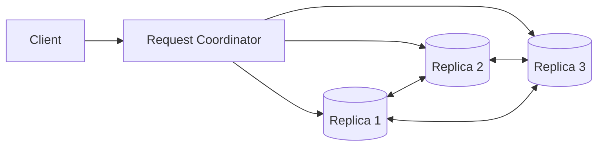
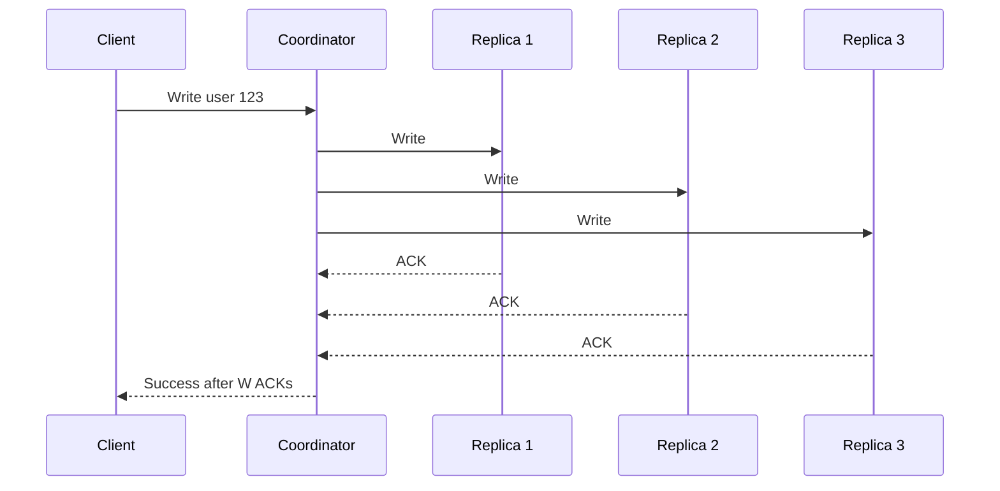

# 07- Leaderless Replication

## Overview

Leaderless Replication is a distributed database architecture in which **no single database node is designated as the permanent authoritative writer**. Clients can typically send reads and writes to multiple replicas, and the system uses replication, quorum rules, versioning, and conflict-resolution mechanisms to maintain convergent state.

Unlike leader-follower replication:

```text
Leader-Follower

             Leader
            /      \
           v        v
       Replica    Replica
```

leaderless replication removes the central write authority:

```text
Leaderless

          +--------+
          | Client |
          +----+---+
               |
       +-------+-------+
       |       |       |
       v       v       v
      N1      N2      N3
       |       |       |
       +-------+-------+
          Replicated
            State
```

Any suitable replica can participate in a write or read operation.

A common design uses **N replicas** for each piece of data and quorum parameters:

- `N` — number of replicas
- `W` — number of replicas that must acknowledge a write
- `R` — number of replicas consulted for a read

A frequently discussed condition is:

```text
R + W > N
```

This creates overlap between the replicas involved in reads and writes, which can improve the probability that a read observes the latest acknowledged version. However, quorum overlap alone does **not** guarantee linearizability or strong consistency.

Leaderless replication is most closely associated with distributed databases such as Amazon Dynamo-style systems and technologies inspired by that architecture.

The architecture is powerful because it can provide:

- High write availability
- High read availability
- Tolerance of individual replica failures
- Decentralized request handling
- Flexible consistency levels
- Geographic distribution

The cost is substantial distributed-systems complexity:

- Read repair
- Hinted handoff
- Anti-entropy repair
- Conflict resolution
- Version tracking
- Quorum selection
- Failure detection
- Tombstones
- Consistency anomalies
- Operational repair

---

## Why Leaderless Replication Exists

Leader-based replication introduces a coordination point.

In a leader-follower system:

```text
Client
  |
  v
Leader
  |
  +----> Replica
  |
  +----> Replica
```

If the leader becomes unavailable, writes may need to wait for failover.

Leaderless replication instead allows a client to interact with multiple replicas directly or through a distributed request coordinator:

```text
             Client
                |
                v
          Coordinator
          /    |    \
         v     v     v
        N1    N2    N3
```

If one replica is unavailable:

```text
          Coordinator
          /    |    \
         v     v     X
        N1    N2    N3
```

the write may still succeed if enough replicas acknowledge it.

This makes the system resilient to individual node failures without requiring a single leader promotion.

---

## Core Architecture

A simplified leaderless architecture looks like:



The coordinator may be:

- A database node
- A client-side component
- A routing layer
- A node selected by hashing
- A database-specific coordinator

The coordinator is not necessarily a permanent leader.

Its job may simply be to:

1. Determine which replicas own the data.
2. Send the request to those replicas.
3. Collect acknowledgements.
4. Apply the configured consistency rule.
5. Return the result.

Another request can be coordinated by a different node.

---

## Replication Factor

The **Replication Factor (RF)** defines how many replicas store each logical piece of data.

For:

```text
RF = 3
```

one logical record is stored on three replicas:

```text
                    Record A
                       |
          +------------+------------+
          |            |            |
          v            v            v
         N1           N2           N3
```

If:

```text
RF = 5
```

the data has five replica copies.

A higher replication factor can improve:

- Fault tolerance
- Read availability
- Write availability
- Geographic durability

But it also increases:

- Storage requirements
- Network traffic
- Repair cost
- Write amplification
- Operational complexity

Replication factor is therefore a reliability-versus-cost decision.

---

## Partitioning and Replication

Leaderless databases generally combine partitioning with replication.

Consider:

```text
Hash(Key)
    |
    v
Partition
    |
    +--> Replica A
    +--> Replica B
    +--> Replica C
```

A partitioning algorithm determines which nodes are responsible for the data.

For example:

```text
hash(user_id)
       |
       v
Partition 17
       |
       +--> Node 4
       +--> Node 8
       +--> Node 11
```

The three nodes form the replica set for that partition.

This means leaderless replication is usually not simply:

```text
Every node stores everything
```

Instead:

```text
Dataset
   |
   v
Partition
   |
   v
Replicated Partition Set
```

---

## Consistent Hashing

A common mechanism for distributing data across nodes is consistent hashing.

Conceptually:

```text
                 Hash Ring

              N1
           /       \
         N4         N2
           \       /
              N3
```

Keys are hashed onto the ring.

The system maps each key to one or more nodes responsible for storing it.

Replication can then assign ownership to multiple successive nodes on the ring.

This allows nodes to be added or removed without requiring the entire dataset to be redistributed.

---

## Write Path

Consider:

```text
N = 3
W = 2
```

A client writes:

```text
PUT /users/123
```

The coordinator identifies three replicas:

```text
N1
N2
N3
```

It sends the write to all three:



With:

```text
W = 2
```

the coordinator can return success after two valid acknowledgements.

The third replica may:

- Already have the data
- Apply it later
- Fail temporarily
- Be repaired later

This is one of the major availability advantages of quorum-based leaderless systems.

---

## Write Quorum

`W` represents the number of replica acknowledgements required for a write to be considered successful.

For:

```text
N = 3
W = 2
```

the system requires:

```text
2 successful acknowledgements
```

Possible outcomes:

```text
N1 → ACK
N2 → ACK
N3 → Timeout

Result → Write succeeds
```

because:

```text
2 >= W
```

If only one replica acknowledges:

```text
N1 → ACK
N2 → Timeout
N3 → Timeout

Result → Write fails
```

The exact semantics vary by database implementation and consistency configuration.

---

## Read Path

For:

```text
N = 3
R = 2
```

the coordinator queries multiple replicas:

```text
Client
  |
  v
Coordinator
  |
  +--> N1
  +--> N2
  +--> N3
```

Suppose:

```text
N1 → version 42
N2 → version 43
N3 → version 43
```

The coordinator can determine that version 43 is newer.

```text
N1 = v42
N2 = v43
N3 = v43

Winner = v43
```

The coordinator can return the newest applicable version and may initiate repair of stale replicas.

---

## Read Quorum

`R` represents how many replicas must respond to a read.

For:

```text
N = 3
R = 2
```

the system can complete the read after receiving enough responses.

For example:

```text
N1 → v43
N2 → v43
N3 → timeout
```

The read can succeed with:

```text
R = 2
```

If:

```text
N1 → v42
N2 → timeout
N3 → timeout
```

the read cannot satisfy the configured quorum.

This provides availability while avoiding dependence on every replica.

---

## Quorum Intersection

A common quorum relationship is:

```text
R + W > N
```

For:

```text
N = 3
W = 2
R = 2
```

we get:

```text
2 + 2 > 3
```

Therefore, the read and write quorum sets must overlap in at least one replica when the selections are from the same replica set.

Conceptually:

```text
Write:
N1 N2

Read:
   N2 N3
   ^^
   overlap
```

This overlap is useful because at least one replica participating in the read should have participated in the write.

However, this does **not** mean:

```text
R + W > N
```

automatically provides linearizable reads and writes.

Consistency depends on additional factors such as:

- Version semantics
- Failure timing
- Read/write ordering
- Conflict resolution
- Concurrent writes
- Clock assumptions
- Repair behavior
- Database-specific consistency guarantees

---

## Quorum Examples

For:

```text
N = 3
```

| R | W | R + W | Typical Trade-off |
|---:|---:|---:|---|
| 1 | 1 | 2 | High availability, weaker visibility |
| 1 | 2 | 3 | Fast reads, stronger write durability |
| 2 | 1 | 3 | Stronger read overlap, lower write quorum |
| 2 | 2 | 4 | Strong quorum overlap |
| 3 | 3 | 6 | Highest coordination cost |

These numbers are conceptual. Real systems expose database-specific consistency levels rather than requiring users to manually choose arbitrary `R` and `W` values for every request.

---

## Failure Handling

Suppose:

```text
N = 3
W = 2
```

and one node fails:

```text
N1 → ACK
N2 → ACK
N3 → DOWN
```

The write can still succeed.

This is one of the primary advantages of leaderless replication.

The system does not necessarily need to:

```text
Promote N1
```

because there was no permanent leader to begin with.

Instead:

```text
Available replicas
       |
       v
Meet quorum
       |
       v
Operation succeeds
```

---

## What Happens to the Failed Replica?

The failed replica may later return:

```text
N3 → Back Online
```

But it may be stale:

```text
N1 → v50
N2 → v50
N3 → v42
```

The system needs a mechanism to bring N3 back into convergence.

Common techniques include:

- Hinted handoff
- Read repair
- Anti-entropy repair
- Merkle trees
- Streaming repair
- Database-specific synchronization

---

## Hinted Handoff

Hinted handoff temporarily stores updates on behalf of an unavailable replica.

Suppose:

```text
N1 → Healthy
N2 → Healthy
N3 → Down
```

A write targets all three replicas.

The system may store a temporary hint:

```text
N1 → Data
N2 → Data
N3 → unavailable

Coordinator / another node
    |
    +--> Hint for N3
```

When N3 returns:

```text
N3 → Online
```

the stored hint can be delivered:

```text
Hint
  |
  v
N3
  |
  v
Updated State
```

Hinted handoff reduces the duration of inconsistency but should not be treated as a permanent replacement for repair.

---

## Read Repair

Read repair occurs when a read detects that replicas disagree.

Suppose:

```text
N1 → version 10
N2 → version 11
N3 → version 11
```

The coordinator determines:

```text
version 11 = current
```

It may return version 11 and repair N1:

```text
N1 → version 10
             |
             v
        Repair to 11
```

This allows normal reads to contribute to convergence.

### Advantages

- Repairs stale replicas during normal traffic
- Simple conceptual model
- No requirement to repair every record immediately

### Limitations

- Cold data may not be read frequently.
- Repairs add network and I/O overhead.
- Large-scale inconsistency may require dedicated repair processes.

---

## Anti-Entropy Repair

Anti-entropy repair compares replica datasets independently of user reads.

A common technique uses Merkle trees.

Conceptually:

```text
Replica A
   |
   v
Merkle Tree
   |
   +--> Hash ranges

Replica B
   |
   v
Merkle Tree
   |
   +--> Hash ranges
```

The system compares hashes.

If:

```text
Hash(A.range1) == Hash(B.range1)
```

the ranges are likely synchronized.

If:

```text
Hash(A.range2) != Hash(B.range2)
```

the system can inspect and repair only that portion.

This avoids transferring the entire dataset unnecessarily.

---

## Merkle Trees

A Merkle tree summarizes data using hashes.

```text
                 Root Hash
                /         \
           Hash AB        Hash CD
           /    \         /    \
         HashA HashB   HashC  HashD
```

If one record changes:

```text
Record C
```

only the hashes along its path change.

This allows replicas to efficiently identify divergent ranges.

Merkle trees are particularly useful for large datasets where full dataset comparison would be too expensive.

---

## Versioning

Leaderless replication needs a way to determine which version of a value is newer or whether two versions are concurrent.

A simplified version might be:

```text
{
    "value": "premium",
    "version": 43
}
```

If replicas contain:

```text
N1 → version 42
N2 → version 43
N3 → version 43
```

the system can determine that version 43 supersedes version 42.

However, a simple integer version is insufficient when two replicas independently create version 43 from version 42.

For example:

```text
Leaderless Replica A:

v42 → premium
v43 → enterprise

Replica B:

v42 → premium
v43 → business
```

Both versions are labeled 43 but represent concurrent modifications.

The system needs richer conflict metadata.

---

## Vector Clocks and Concurrent Versions

Vector clocks can represent causality across replicas.

For three nodes:

```text
N1: [3, 1, 0]
N2: [2, 4, 0]
N3: [2, 1, 5]
```

If two versions cannot be ordered by causal dominance, they may represent concurrent writes.

Conceptually:

```text
Version A
    |
    | concurrent
    |
Version B
```

The system can then:

- Keep both versions temporarily
- Resolve using application rules
- Merge the versions
- Apply deterministic conflict resolution

The exact mechanism depends on the database implementation.

---

## Last-Write-Wins

A common conflict-resolution mechanism is Last-Write-Wins.

Example:

```text
Version A → timestamp 100
Version B → timestamp 105

Winner → Version B
```

The mechanism is simple but dangerous.

Suppose:

```text
Leader A:
delete user

Leader B:
update user
```

If timestamps choose the update, the deletion may disappear.

Or:

```text
Payment A:
$100

Payment B:
$50
```

Choosing the latest value does not necessarily represent the correct business state.

LWW is appropriate only when losing one concurrent state is acceptable.

---

## Tombstones

Deletes require special handling in replicated systems.

Suppose:

```text
N1 → user exists
N2 → user exists
N3 → user exists
```

A delete occurs:

```text
DELETE user
```

If the system simply removes the row:

```text
N1 → deleted
N2 → deleted
N3 → missing
```

a stale replica could later reintroduce the old value.

Instead, systems often use a tombstone:

```text
User 123
state = deleted
version = 50
```

The tombstone tells replicas:

> This record was intentionally deleted.

Tombstones must eventually be garbage-collected according to safe retention rules.

Deleting tombstones too early can allow old data to resurrect.

---

## Write Conflicts

Consider:

```text
Initial:

status = pending
```

Two concurrent writes occur:

```text
Replica A:
status = shipped

Replica B:
status = cancelled
```

The system cannot safely infer the business-correct result.

Possible strategies:

| Strategy | Result |
|---|---|
| LWW | Newer version wins |
| Deterministic priority | One state always wins |
| Application merge | Business logic decides |
| Keep conflicts | Application resolves later |
| Ownership | Avoid concurrent writes |

For critical workflows, application-level semantics are usually safer than blindly applying LWW.

---

## Quorum Does Not Mean Consensus

This distinction is important.

A quorum means:

```text
Enough replicas responded
```

Consensus means:

```text
Nodes agree on an ordered decision
```

Leaderless quorum replication does not automatically provide consensus.

For example:

```text
N = 3
W = 2
```

means two replicas acknowledged a write.

It does not necessarily mean the entire distributed system has reached a globally ordered agreement about every operation.

This distinction frequently appears in system design interviews.

---

## Quorum and CAP

Leaderless replication often appears in discussions of the CAP theorem.

During a network partition:

```text
N1 N2   X   N3
```

the system must choose how to behave.

If it continues accepting writes on both sides:

```text
Partition A → Accept writes
Partition B → Accept writes
```

availability is preserved, but replicas may diverge.

If it refuses operations unless the required quorum is reachable:

```text
No quorum
   |
   v
Reject operation
```

availability decreases, while consistency guarantees can be stronger.

The important point is that the actual consistency and availability behavior depends on the database's implementation and configured consistency level.

---

## Tunable Consistency

One advantage of quorum-based systems is the ability to select different consistency levels.

For example:

```text
Write:
QUORUM
```

may require a majority of replicas.

A less critical read could use:

```text
ONE
```

while a critical read could use:

```text
QUORUM
```

This creates a tunable trade-off:

```text
Lower Coordination
       |
       v
Higher Availability / Lower Latency
       |
       |
Higher Coordination
       |
       v
Stronger Consistency / Higher Latency
```

The exact consistency levels differ by database technology.

---

## Latency Implications

Leaderless replication can reduce dependence on a single leader but does not make network latency disappear.

For:

```text
W = 2
```

the write may need the fastest two successful replica responses.

Conceptually:

```text
N1 → 20 ms
N2 → 30 ms
N3 → 200 ms

W = 2

Write latency ≈ 30 ms
```

The slowest replica does not necessarily determine the write completion time.

This can improve tail behavior when one replica is temporarily slow.

However, cross-region quorum requirements can still produce substantial latency.

---

## Read Latency

For:

```text
R = 2
```

the read may wait for enough responses.

Example:

```text
N1 → 20 ms
N2 → 25 ms
N3 → 150 ms

R = 2

Read latency ≈ 25 ms
```

This can be useful in geographically distributed systems.

But a consistency level that requires responses from distant regions may still increase latency significantly.

---

## Read Repair and Tail Latency

Read repair can create additional work.

Suppose:

```text
N1 → current
N2 → stale
N3 → stale
```

A read detects the mismatch.

The system may need to:

```text
Return current value
+
Repair stale replicas
```

If repairs happen synchronously, they can affect latency.

If repairs happen asynchronously, the read can return quickly but convergence happens later.

The exact behavior is database-specific.

---

## Failure Detection

Leaderless systems still need failure detection.

A node can be:

- Down
- Slow
- Partitioned
- Overloaded
- Unreachable from one region
- Reachable but unable to process requests

A simple health check:

```text
TCP connection = successful
```

does not guarantee:

```text
Database is healthy
```

Production systems should monitor:

- Request latency
- Error rates
- Replication backlog
- Disk utilization
- CPU
- Memory
- Network
- Repair state
- Node membership

---

## Hinted Handoff vs Read Repair vs Anti-Entropy

| Mechanism | Trigger | Primary Purpose |
|---|---|---|
| Hinted handoff | Replica unavailable during write | Deliver missed writes later |
| Read repair | Read detects inconsistency | Repair replicas encountered during reads |
| Anti-entropy | Scheduled/background process | Systematic convergence |
| Merkle tree | Repair comparison | Efficiently identify divergent ranges |

A production system may use several mechanisms simultaneously.

They solve different failure modes.

---

## Data Modeling

Leaderless replication strongly favors data models that can tolerate:

- Eventual consistency
- Concurrent updates
- Duplicate delivery
- Partial failure
- Out-of-order propagation

A useful design principle is:

> Prefer data models where independent operations can be merged safely.

For example:

```text
Set:
{python}

+
{aws}

=

{python, aws}
```

is easier to merge than:

```text
status = shipped
```

versus:

```text
status = cancelled
```

The latter requires business semantics.

---

## Counters

Counters illustrate why operation semantics matter.

Suppose:

```text
Initial count = 100
```

Two replicas independently receive:

```text
+5
+7
```

A state-based approach might produce:

```text
105
107
```

and require conflict resolution.

An operation-based representation can preserve:

```text
+5
+7
```

which can be merged:

```text
100 + 5 + 7 = 112
```

Distributed counters still require careful handling of duplicate operations, retries, and lost updates.

---

## Idempotency

Leaderless systems must assume that operations can be retried or delivered more than once.

For example:

```text
Request ID = abc123

Replica 1 → processed
Replica 2 → processed
Replica 3 → timeout
```

The coordinator may retry the operation.

If the operation is not idempotent, the application could execute it multiple times.

Use durable idempotency keys for operations where duplication has business impact.

For example:

```text
POST /payments

Idempotency-Key: 8f7c...
```

The database or application should enforce the uniqueness of the operation identifier atomically.

---

## Leaderless Replication and PostgreSQL

PostgreSQL's traditional primary/standby architecture is leader-follower rather than leaderless.

PostgreSQL can provide sophisticated replication and distributed extensions, but standard PostgreSQL should not be treated as a general-purpose leaderless database.

If a system requires:

- Quorum writes
- Decentralized writes
- Automatic conflict resolution
- Distributed partition ownership

a database specifically designed for those semantics may be more appropriate than attempting to build them manually around PostgreSQL.

This is an important architectural principle:

> Do not reproduce a distributed database inside an application unless the business requirements justify the operational cost.

---

## Leaderless Replication and Django

Django itself does not provide leaderless replication.

A conventional Django deployment might look like:

```text
Django
   |
   v
Database Cluster
```

A leaderless database architecture would instead expose a distributed database API:

```text
Django
   |
   v
Database Driver
   |
   v
Distributed Database
  / | \
 v  v  v
N1 N2 N3
```

The application should generally avoid implementing replica coordination manually.

The database should provide:

- Partition routing
- Replication
- Quorum semantics
- Conflict resolution
- Failure detection
- Repair

Django should focus on application semantics and consistency requirements.

---

## Leaderless Replication and FastAPI

The same principle applies to FastAPI.

```text
FastAPI
   |
   v
Distributed Database Driver
   |
   +--> Replica A
   +--> Replica B
   +--> Replica C
```

The API layer should explicitly understand the consistency level required by each operation.

For example:

```text
Product Catalog Read
    → Eventual consistency acceptable

Payment Status
    → Stronger consistency required
```

The database consistency model should be selected accordingly.

---

## Leaderless Replication and Redis

Redis replication traditionally uses primary-replica architectures rather than general-purpose leaderless replication.

Redis Cluster distributes keyspaces across shards and uses replicas for availability, but a shard does not become a generic multi-writer leaderless database.

This distinction matters:

```text
Partitioned + Replicated
```

does not automatically mean:

```text
Leaderless Multi-Writer
```

When evaluating a database, always examine its actual consistency and replication model rather than inferring capabilities from terminology.

---

## Leaderless Replication and Kafka

Kafka is not a leaderless database.

Kafka partitions have leaders:

```text
Partition 0 → Leader A
Partition 1 → Leader B
Partition 2 → Leader C
```

Followers replicate partition logs.

The architecture therefore remains leader-based at the partition level.

Kafka can provide high availability and replicated logs, but that is different from quorum-based leaderless database replication.

---

## Operational Complexity

Leaderless replication moves complexity away from leader failover and toward distributed convergence.

Instead of primarily asking:

```text
Who is the leader?
```

operators must ask:

```text
Are replicas converging?

Are conflicts increasing?

Is repair healthy?

Are tombstones accumulating?

Are nodes returning stale data?

Are quorum failures increasing?
```

This changes the operational model.

---

## Monitoring

Important production metrics include:

| Metric | Why It Matters |
|---|---|
| Read latency | Detect slow replicas |
| Write latency | Detect quorum pressure |
| Quorum failures | Detect availability problems |
| Replica inconsistency | Detect divergence |
| Repair backlog | Detect convergence problems |
| Hinted handoff backlog | Detect unavailable replicas |
| Tombstone count | Detect deletion/compaction pressure |
| Conflict rate | Detect concurrent-write problems |
| Disk usage | Prevent capacity failures |
| Network traffic | Detect replication pressure |
| Node health | Detect failed or overloaded nodes |

Alerting should focus on symptoms that affect the application's consistency and availability requirements.

---

## Repair Operations

Repair is not optional operational housekeeping.

If replicas continuously accumulate divergent state:

```text
Replica A → current
Replica B → stale
Replica C → stale
```

the system can gradually accumulate more inconsistency.

A production repair strategy should define:

- Repair frequency
- Repair scope
- Repair bandwidth
- Repair scheduling
- Failure handling
- Monitoring
- Capacity impact

Repair jobs can consume significant disk and network resources.

They should therefore be scheduled carefully.

---

## Security Considerations

Leaderless replication can increase the number of nodes that may contain sensitive data.

Production systems should:

- Encrypt client-to-node traffic.
- Encrypt node-to-node traffic.
- Authenticate database nodes.
- Restrict network access.
- Use least-privilege credentials.
- Encrypt disks.
- Encrypt backups.
- Rotate credentials.
- Audit administrative operations.
- Control inter-region traffic.

Because data is replicated across multiple nodes and potentially multiple regions, data residency and compliance requirements must be evaluated carefully.

---

## Cost Considerations

Leaderless replication can require substantial infrastructure.

For:

```text
Replication Factor = 3
```

a logical dataset may require roughly three times the underlying storage before accounting for:

- Indexes
- Compaction
- Tombstones
- Repair overhead
- Temporary storage
- Backups

Network traffic can also be significant:

```text
One Write
   |
   +--> Replica 1
   +--> Replica 2
   +--> Replica 3
```

Cross-region replication adds network transfer costs.

The architecture should therefore be justified by its availability, latency, and consistency requirements.

---

## Disaster Recovery

Leaderless replication improves fault tolerance but does not eliminate the need for backups.

Replication can protect against:

- Node failure
- Some network failures
- Individual replica loss

It does not necessarily protect against:

- Accidental deletion
- Application bugs
- Malicious changes
- Corrupted writes
- Logical data corruption

If:

```text
DELETE customer_data
```

is successfully replicated to all replicas, replication has made the deletion highly available.

Independent backups provide historical recovery:

```text
Distributed Database
        |
        +--> Replicas
        |
        +--> Backup
                |
                v
          Point-in-Time Recovery
```

---

## When to Use Leaderless Replication

Leaderless replication is appropriate when:

- High write availability matters.
- Individual node failures should not stop writes.
- Eventual consistency is acceptable for appropriate workloads.
- Data can tolerate concurrent versions.
- The workload is geographically distributed.
- Tunable consistency is useful.
- The team can operate distributed repair and reconciliation.

Typical use cases include:

- Large-scale distributed key-value stores
- Highly available global metadata
- Certain user preference systems
- Distributed counters
- Eventual-consistency workloads
- Systems where availability during partitions is important

---

## When Not to Use Leaderless Replication

Avoid it when:

- Strong global transactions dominate the workload.
- Every write must have a globally ordered sequence.
- Conflicts cannot be tolerated.
- Global uniqueness constraints are pervasive.
- The workload is small enough for a conventional relational architecture.
- Operational simplicity is more valuable than distributed availability.

A PostgreSQL primary with replicas may be a much better architecture when:

```text
One Writer
+
Read Scaling
+
Strong Transactions
```

already satisfies the requirements.

---

## Leaderless vs Leader-Follower vs Multi-Leader

| Characteristic | Leader-Follower | Multi-Leader | Leaderless |
|---|---|---|---|
| Central writer | Yes | No | No |
| Multiple writable replicas | No | Yes | Yes |
| Quorum-based operations | Optional | Optional | Common |
| Conflict complexity | Low | High | High |
| Failover | Promote follower | Reconfigure leaders | No traditional leader promotion |
| Read scaling | Strong | Strong | Strong |
| Write availability | Leader-dependent | High | High |
| Geographic writes | Limited | Strong | Strong |
| Operational complexity | Lower | High | High |
| Eventual consistency | Common for replicas | Common | Common |
| Repair mechanisms | Replication catch-up | Reconciliation | Core operational requirement |
| Best fit | Conventional relational workloads | Geo-distributed writes | Highly available distributed data |

---

## Failure Scenario

Consider:

```text
Replication Factor = 3

N1
N2
N3
```

A write occurs:

```text
Write X
```

Responses:

```text
N1 → ACK
N2 → ACK
N3 → timeout
```

With an appropriate quorum configuration, the write can succeed.

Later:

```text
N3 → returns
```

N3 is stale.

The system must converge:

```text
N3
 |
 +--> Hinted handoff
 |
 +--> Read repair
 |
 +--> Anti-entropy repair
 |
 v
Current State
```

This is the central operational model of leaderless replication:

```text
Write
  ↓
Partial Replica Failure
  ↓
Quorum Success
  ↓
Temporary Divergence
  ↓
Repair
  ↓
Convergence
```

---

## Production Checklist

Before deploying a leaderless replication architecture, verify:

- [ ] Replication factor is explicitly defined.
- [ ] Partitioning strategy is documented.
- [ ] Quorum semantics are understood.
- [ ] Read and write consistency levels are defined.
- [ ] `R + W > N` assumptions are not treated as a universal strong-consistency guarantee.
- [ ] Conflict detection is implemented.
- [ ] Conflict resolution is deterministic.
- [ ] Application-specific conflict rules exist for critical data.
- [ ] Idempotency is implemented for retryable operations.
- [ ] Tombstone behavior is understood.
- [ ] Repair mechanisms are configured.
- [ ] Hinted handoff behavior is monitored where applicable.
- [ ] Read repair behavior is understood.
- [ ] Anti-entropy repair is scheduled and monitored.
- [ ] Node failures are tested.
- [ ] Network partitions are tested.
- [ ] Quorum failures are tested.
- [ ] Backup and point-in-time recovery are configured.
- [ ] Encryption is enabled for client and node-to-node traffic.
- [ ] Data residency requirements are satisfied.
- [ ] Storage and network costs are understood.
- [ ] Operational ownership is clearly defined.

---

## Common Mistakes

### Assuming Quorum Means Strong Consistency

Quorum overlap improves consistency but does not automatically provide linearizability.

**Avoidance:** Understand the database's actual consistency guarantees and failure semantics.

### Treating Replicas as Identical

Replicas can temporarily contain different versions.

**Avoidance:** Design for version divergence and convergence.

### Ignoring Repair

A database can continue operating while stale replicas accumulate.

**Avoidance:** Treat repair as a production-critical subsystem.

### Using Last-Write-Wins for Business-Critical State

The newest timestamp may not represent the correct business outcome.

**Avoidance:** Use domain-specific conflict resolution.

### Ignoring Tombstones

Removing delete metadata too early can allow deleted records to reappear.

**Avoidance:** Understand tombstone retention and garbage-collection semantics.

### Assuming One Successful Write Means Every Replica Has the Data

With quorum writes:

```text
W < N
```

some replicas may still be behind when the client receives success.

**Avoidance:** Design explicitly for eventual convergence.

### Confusing Quorum With Consensus

Quorum acknowledgement does not automatically create a globally ordered agreement.

**Avoidance:** Understand the difference between replication quorum and consensus algorithms.

### Ignoring Retry Semantics

Retries can produce duplicate operations.

**Avoidance:** Use durable idempotency mechanisms.

### Treating Leaderless as Automatically Cheaper

The infrastructure and operational costs can be substantial.

**Avoidance:** Evaluate storage, network, repair, monitoring, and engineering costs.

---

## Interview Perspective

A weak answer to:

> "What is leaderless replication?"

is:

> There is no leader and all replicas can write.

A stronger answer is:

> Leaderless replication removes the single authoritative writer and typically uses multiple replicas with quorum-based reads and writes. A request can succeed when enough replicas acknowledge it, allowing the system to tolerate individual replica failures without leader failover. The trade-off is increased complexity around conflicts, versioning, stale replicas, repair, consistency, and reconciliation.

A common follow-up is:

> "What do N, R, and W mean?"

A strong answer is:

```text
N = Number of replicas

W = Number of replicas required to acknowledge a write

R = Number of replicas consulted for a read
```

A commonly discussed relationship is:

```text
R + W > N
```

which creates quorum overlap.

However, a senior-level answer should immediately qualify this:

> Quorum overlap does not by itself guarantee linearizable consistency. The actual guarantee depends on the database's versioning, ordering, conflict resolution, read/write semantics, and failure model.

Another common question is:

> "What happens if one replica is down?"

For:

```text
N = 3
W = 2
```

the system can potentially continue accepting writes if two replicas remain healthy.

The unavailable replica can later converge using mechanisms such as:

```text
Hinted Handoff
      +
Read Repair
      +
Anti-Entropy Repair
```

A senior-level system design discussion should cover:

```text
Leaderless Replication
        |
        +--> Partitioning
        |
        +--> Replication Factor
        |
        +--> Quorum
        |
        +--> R / W / N
        |
        +--> Versioning
        |
        +--> Conflict Resolution
        |
        +--> Hinted Handoff
        |
        +--> Read Repair
        |
        +--> Anti-Entropy
        |
        +--> Tombstones
        |
        +--> Eventual Consistency
        |
        +--> Failure Handling
        |
        +--> Disaster Recovery
```

---

## Key Takeaways

- Leaderless replication removes the permanent single-writer dependency and typically uses replicated data with quorum-based reads and writes to tolerate individual node failures.
- `N`, `R`, and `W` define important availability and consistency trade-offs, but `R + W > N` alone does not guarantee strong or linearizable consistency.
- Conflict detection, versioning, tombstones, hinted handoff, read repair, and anti-entropy repair are fundamental operational mechanisms for maintaining convergence.
- Leaderless systems are strongest when the data model tolerates eventual consistency and concurrent updates; critical business invariants often require stronger coordination or different ownership models.
- The architecture provides high availability and distributed write capability at the cost of significantly greater consistency, repair, monitoring, and operational complexity.