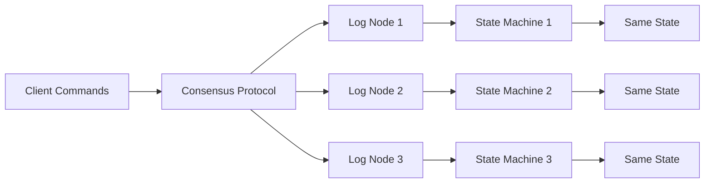
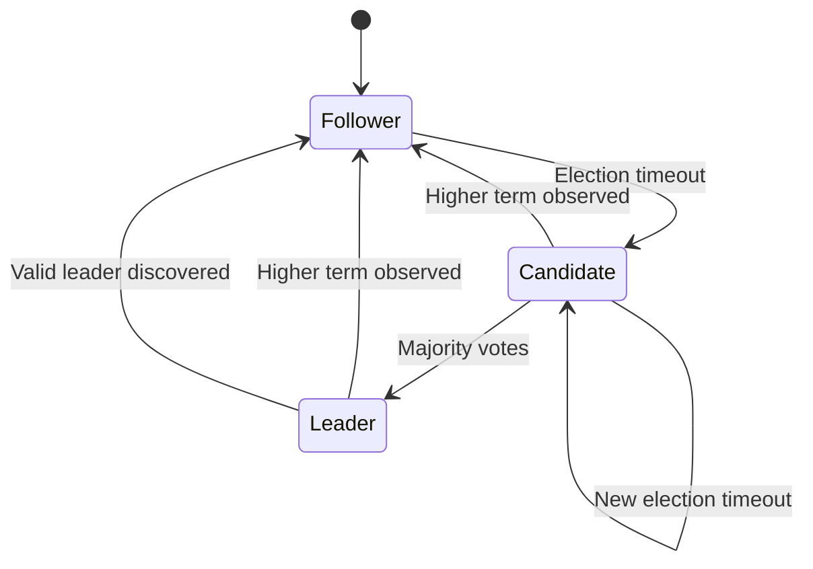
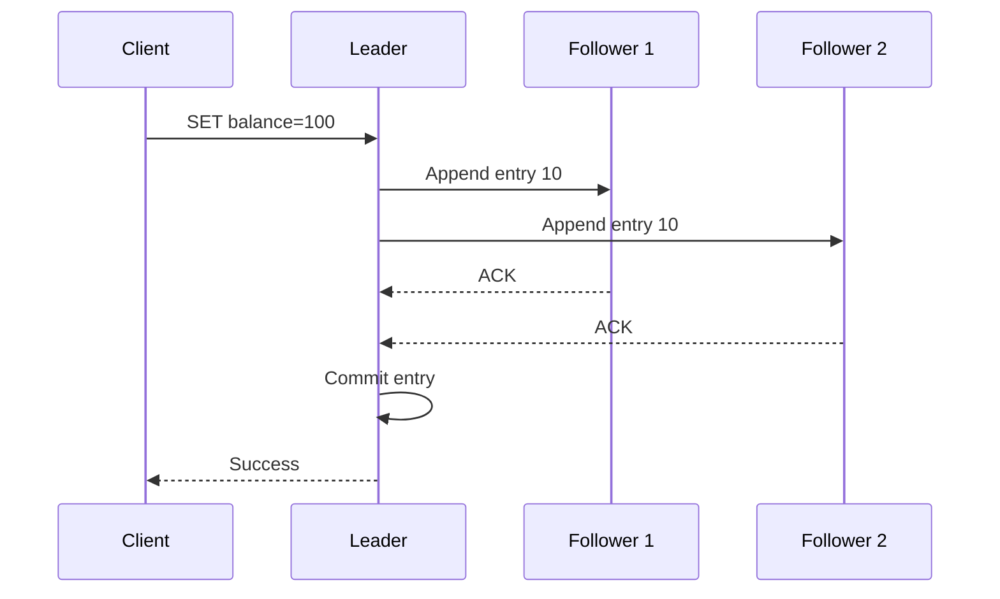
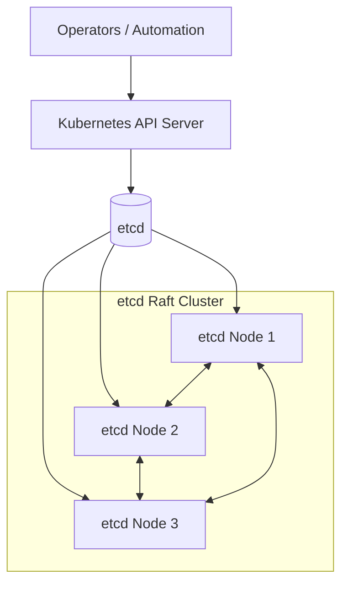

# 09- Consensus Algorithms

## Overview

Consensus is the process by which multiple distributed nodes agree on a single value, decision, or ordered sequence of operations despite failures, delays, and unreliable networks.

Consensus becomes necessary when a distributed system cannot safely rely on one machine as the permanent source of truth.

A typical consensus cluster looks like:

```text
                +---------+
                | Client  |
                +----+----+
                     |
                     v
              +-------------+
              | Consensus   |
              | Cluster     |
              +-------------+
               /     |     \
              v      v      v
             N1     N2     N3
```

The objective is not simply to replicate data.

The objective is to ensure that correct nodes agree on **what decision was made and, when required, in what order decisions were made**.

Consensus is used for problems such as:

- Leader election
- Replicated logs
- Cluster membership
- Distributed metadata
- Configuration management
- Distributed coordination
- Failover decisions
- Service discovery state
- Lock ownership
- Metadata stores

Important systems and technologies use consensus or consensus-like mechanisms, including:

- Raft
- Paxos
- Multi-Paxos
- Viewstamped Replication
- etcd
- Consul
- ZooKeeper's ZAB protocol
- Distributed databases
- Kubernetes control-plane components

Consensus is one of the most important distributed-systems concepts because it provides a foundation for building reliable state machines on top of unreliable infrastructure.

---

## Why Consensus Exists

Consider a distributed cluster:

```text
        +---- N1 ----+
        |            |
Client -+---- N2 ----+ 
        |            |
        +---- N3 ----+
```

Suppose the system needs to decide:

```text
Who is the current leader?
```

Without coordination, two nodes might independently conclude:

```text
N1 → "I am leader"
N2 → "I am leader"
```

Now the cluster has a split-brain condition.

Similarly, suppose three nodes must agree whether a transaction should be committed:

```text
N1 → COMMIT
N2 → ROLLBACK
N3 → COMMIT
```

The system needs a protocol that produces one consistent decision.

Consensus provides the coordination mechanism.

---

## Consensus vs Replication

Replication answers:

> How do we maintain multiple copies of data?

Consensus answers:

> How do distributed nodes safely agree on the value or sequence that should be committed?

These concepts are related but different.

```text
Replication
    |
    v
Multiple copies
```

versus:

```text
Consensus
    |
    v
Agreement on committed state
```

A consensus protocol often drives replication.

For example:

```text
Client
  |
  v
Leader
  |
  +--> Replicated Log
  |
  +--> Follower
  |
  +--> Follower
```

The consensus protocol determines which log entries are committed and in what order.

---

## The State Machine Model

A useful way to understand consensus is through the **replicated state machine** model.

Each node has:

```text
State
  +
Deterministic Commands
```

If every correct node processes the same commands in the same order:

```text
Command 1
Command 2
Command 3
Command 4
```

then each node should reach the same state.

Conceptually:



The consensus protocol provides the agreement and ordering necessary for the replicated state machines to converge.

---

## Properties of Consensus

A useful consensus protocol generally needs to provide properties such as:

### Agreement

Correct nodes should not decide different values for the same consensus decision.

```text
N1 → X
N2 → X
N3 → X
```

not:

```text
N1 → X
N2 → Y
N3 → X
```

### Validity

A decision should be based on a value proposed by an appropriate participant rather than an arbitrary value invented by the protocol.

The exact validity definition varies by consensus algorithm.

### Termination

Correct nodes should eventually make progress and decide, assuming the required system conditions hold.

Termination is inherently dependent on assumptions about failures and network behavior.

### Ordering

For replicated logs, nodes must agree on the order of committed operations.

```text
Command A
Command B
Command C
```

must not become:

```text
Node 1:
A → B → C

Node 2:
B → A → C
```

if the application depends on deterministic ordering.

---

## Safety vs Liveness

Consensus algorithms are usually discussed using two major categories.

### Safety

Safety means:

> Nothing bad happens.

Examples:

- Two leaders do not both safely commit conflicting entries for the same position.
- Committed entries are not arbitrarily replaced.
- Correct nodes do not decide conflicting values.

### Liveness

Liveness means:

> Something good eventually happens.

Examples:

- A new leader is eventually elected.
- Valid commands eventually become committed.
- The system eventually makes progress.

The distinction is critical.

A system can preserve safety by refusing to make progress:

```text
No quorum
    |
    v
Stop committing
```

That may preserve correctness but sacrifice availability.

---

## Why Distributed Consensus Is Hard

Consensus is difficult because distributed nodes communicate over networks that can:

- Delay messages
- Drop messages
- Duplicate messages
- Reorder messages
- Partition nodes
- Disconnect nodes
- Recover unpredictably

Machines can also:

- Crash
- Restart
- Become overloaded
- Lose local state
- Experience disk failures

The protocol must distinguish between:

```text
Node is dead
```

and:

```text
Node is alive but slow
```

This is fundamentally difficult in an asynchronous distributed environment.

---

## The Network Is Not Reliable

Consider:

```text
N1 ---- N2
 |
 X
 |
N3
```

N1 may be unable to communicate with N3.

But N3 might still be running.

From N1's perspective:

```text
N3 → unreachable
```

From N3's perspective:

```text
N3 → healthy
```

A consensus algorithm therefore cannot simply assume:

```text
No response = crashed
```

It needs explicit failure-detection and quorum rules.

---

## Quorum and Consensus

Consensus algorithms commonly use majority quorums.

For:

```text
N = 5
```

a majority is:

```text
3
```

because:

```text
3 > 5 / 2
```

The important property is that two majorities must overlap.

For example:

```text
Majority A:
N1 N2 N3

Majority B:
N3 N4 N5
      ^^
    overlap
```

The overlap prevents two independent majorities from safely making incompatible decisions under the protocol's rules.

Quorum is therefore an important building block of consensus, but:

> Quorum itself is not a consensus algorithm.

---

## Why Odd Cluster Sizes Are Common

Consensus clusters are commonly deployed with odd numbers of voting members:

```text
3
5
7
```

The reason is not that even numbers cannot work.

The reason is that an additional node can increase fault tolerance only when it changes the majority threshold.

Compare:

| Cluster | Majority | Failures Tolerated |
|---:|---:|---:|
| 3 | 2 | 1 |
| 4 | 3 | 1 |
| 5 | 3 | 2 |
| 6 | 4 | 2 |
| 7 | 4 | 3 |

Adding a fourth node to a three-node cluster does not improve majority failure tolerance:

```text
3 nodes → tolerate 1 failure
4 nodes → tolerate 1 failure
```

Adding a fifth does:

```text
5 nodes → tolerate 2 failures
```

Therefore, odd cluster sizes are often operationally efficient.

---

## Fault Tolerance

For a majority-based consensus cluster:

```text
N = 2f + 1
```

the cluster can generally tolerate:

```text
f
```

failures while retaining a majority.

Examples:

```text
3 nodes → tolerate 1 failure

5 nodes → tolerate 2 failures

7 nodes → tolerate 3 failures
```

Once the cluster loses its majority:

```text
Available nodes < Majority
```

the system may preserve safety by refusing to commit new decisions.

This is an intentional trade-off.

---

## Raft

Raft is a consensus algorithm designed to make distributed consensus easier to understand and implement than traditional Paxos-style descriptions.

Raft decomposes consensus into several major responsibilities:

- Leader election
- Log replication
- Safety
- Membership changes

A typical Raft cluster has:

```text
          Leader
         /      \
        v        v
   Follower   Follower
```

The leader handles client commands and replicates log entries to followers.

---

## Raft Node States

A Raft node can be in one of three primary states:

```text
Follower
   |
   v
Candidate
   |
   v
Leader
```

Conceptually:



The states are:

### Follower

A follower:

- Receives replicated log entries.
- Responds to leader messages.
- Votes in elections.
- Does not normally process client writes directly.

### Candidate

A candidate:

- Starts an election.
- Increments its term.
- Requests votes.
- Attempts to obtain a majority.

### Leader

The leader:

- Accepts client commands.
- Appends commands to its log.
- Replicates entries.
- Tracks follower progress.
- Commits entries after the required majority is reached.

---

## Raft Terms

Raft divides time into logical terms.

Conceptually:

```text
Term 1
Term 2
Term 3
Term 4
```

A term may contain:

- Election
- Leader
- Log replication

Each node tracks the latest term it has observed.

A message containing an older term can be rejected or ignored according to Raft's rules.

A message containing a newer term causes the node to update its term and usually transition back to follower.

Terms help nodes reason about stale leadership information.

---

## Leader Election

Suppose the current leader fails:

```text
Leader ✗

Follower A
Follower B
Follower C
```

Followers stop receiving leader heartbeats.

Eventually, one follower's election timeout expires.

It becomes a candidate:

```text
Candidate A
```

It increments its term and requests votes.

```text
Candidate A
   |
   +--> Request vote → B
   |
   +--> Request vote → C
```

If it obtains a majority:

```text
A → vote
B → vote
C → vote
```

it becomes leader.

---

## Why Randomized Election Timeouts Matter

If every follower starts an election simultaneously:

```text
N1 → Candidate
N2 → Candidate
N3 → Candidate
```

the votes can split.

Randomized election timeouts reduce the probability of repeated simultaneous elections.

Conceptually:

```text
N1 → 150 ms
N2 → 230 ms
N3 → 310 ms
```

N1 is likely to start first.

It requests votes before the others start competing.

Randomization improves election convergence but does not guarantee immediate leadership.

---

## Split Votes

Consider:

```text
N1 → Candidate
N2 → Candidate
N3 → Candidate
```

Each candidate may receive one vote.

For:

```text
N = 3
Majority = 2
```

nobody wins.

The candidates wait for another randomized election timeout and retry.

This is one reason election timeouts and heartbeat intervals must be configured carefully.

---

## Raft Log

The replicated log is central to Raft.

A log might look like:

```text
Index   Term   Command

1       1      SET A=10
2       1      SET B=20
3       2      SET A=15
4       2      DELETE B
```

The leader replicates these entries to followers.

The objective is to make the committed prefix identical across the cluster.

```text
Leader:
1 2 3 4

Follower:
1 2 3 4

Follower:
1 2 3
```

Entry 4 is not yet replicated everywhere, but the committed prefix can still be consistent.

---

## Log Replication

A client sends:

```text
SET balance=100
```

to the leader.

The leader appends:

```text
Entry 10
```

to its local log.

It then sends the entry to followers.



With three nodes, once the leader and one follower have the entry, the majority requirement can be satisfied.

The exact commit rules include important term and log-matching constraints.

---

## Commit Index

Raft tracks a commit index.

Conceptually:

```text
Log:

1  2  3  4  5
      ^
      |
  committed
```

Once an entry is committed, the state machine can safely apply it.

Each node eventually applies committed entries in order:

```text
Entry 1
Entry 2
Entry 3
```

This produces deterministic state-machine execution.

---

## Apply vs Commit

These are different stages.

```text
Replicated
    |
    v
Committed
    |
    v
Applied to State Machine
```

An entry can be present on multiple nodes but not yet committed.

A committed entry is safe to apply according to the protocol's rules.

This distinction matters when debugging replication and recovery.

---

## Raft Safety

Raft provides several safety properties around logs and leadership.

A simplified view is:

```text
Committed entry
       |
       v
Should not be replaced
       |
       v
Future leaders preserve
the committed history
```

One important mechanism is that candidates must demonstrate that their logs are sufficiently up to date when requesting votes.

This prevents a node with an outdated log from simply becoming leader and discarding committed history.

---

## Leader Completeness

A key Raft safety property is **Leader Completeness**:

> If an entry is committed in a given term, that entry will be present in the logs of leaders elected in later terms.

This is why voting is not merely:

```text
One node = one vote
```

A candidate must also satisfy log-up-to-date conditions.

This protects committed data during leadership changes.

---

## Log Matching

Raft relies on the principle that if two logs contain entries with the same index and term, those entries are identical and all preceding entries are also identical.

Conceptually:

```text
Leader:
1:A
2:B
3:C
4:D

Follower:
1:A
2:B
3:C
```

The follower can safely extend its log with:

```text
4:D
```

If the follower instead has:

```text
1:A
2:B
3:X
```

the logs conflict.

The leader must bring the follower back into alignment.

---

## Log Conflict Repair

Suppose:

```text
Leader:
1:A
2:B
3:C
4:D

Follower:
1:A
2:B
3:X
4:Y
```

The leader cannot simply append entry 5.

It must find the appropriate matching prefix and replace conflicting entries.

Conceptually:

```text
Leader:
A B C D

Follower:
A B X Y

Repair:
A B C D
```

Raft uses `AppendEntries` consistency checks and backtracking mechanisms to repair follower logs.

---

## Raft RPCs

Raft primarily uses two important RPC concepts:

### RequestVote

Used during leader elections.

```text
Candidate → RequestVote → Other nodes
```

### AppendEntries

Used for:

- Log replication
- Heartbeats
- Log consistency checks

```text
Leader → AppendEntries → Followers
```

These operations allow the cluster to maintain leadership and replicated logs.

---

## Heartbeats

A leader periodically sends empty `AppendEntries` messages as heartbeats.

```text
Leader
  |
  +--> heartbeat → Follower
  |
  +--> heartbeat → Follower
```

Followers use these messages to determine that the leader is still active.

If heartbeats stop for long enough:

```text
Election timeout
       |
       v
Candidate
```

The system begins leader election.

---

## Leader Failure

Consider:

```text
        Leader
       /      \
      v        v
     N2       N3
```

Leader fails:

```text
        X

     N2       N3
```

N2 or N3 eventually starts an election.

Suppose N2 wins:

```text
        N2
       /  \
      v    v
     N1   N3
```

The new leader can continue replicating commands.

The old leader must step down if it later reconnects and observes a newer term.

---

## Stale Leaders

A particularly important failure scenario is a network partition.

```text
        N1
         |
         X
         |
      N2 N3
```

Suppose N1 believes it is leader.

But N2 and N3 form a majority.

They elect N2 as the new leader.

Now:

```text
N1 → old leader
N2 → current leader
```

When N1 reconnects, it observes a newer term.

It must stop acting as leader and become a follower.

This prevents an isolated stale leader from continuing to commit conflicting entries.

---

## Majority Prevents Split Brain

Suppose:

```text
N = 5
Majority = 3
```

Partition:

```text
Group A:
N1 N2 N3

Group B:
N4 N5
```

Only Group A has a majority.

Therefore:

```text
Group A → Can make progress
Group B → Cannot safely commit new consensus decisions
```

If both groups could independently commit decisions, the cluster could produce conflicting histories.

The majority rule protects safety.

---

## What Happens Without a Majority?

Suppose:

```text
5-node cluster
```

and only:

```text
N1
N2
```

remain reachable.

Majority:

```text
3
```

The remaining nodes do not have a majority.

The system should preserve safety by refusing to commit new consensus decisions.

This produces:

```text
Safety ✓
Availability ✗
```

This is an intentional consequence of consensus.

---

## Consensus and CAP

Consensus systems often prioritize safety during network partitions.

Consider:

```text
Partition
    |
    v
No majority
    |
    v
Stop committing
```

The cluster sacrifices availability rather than allowing two independent groups to commit conflicting state.

This does not mean consensus systems are simply "CP databases."

CAP describes guarantees under network partition; the exact behavior depends on the complete system and its application semantics.

The important design principle is:

> Consensus requires enough healthy participants to safely make progress.

---

## Paxos

Paxos is one of the foundational consensus algorithms.

The original Paxos literature is notoriously difficult to understand because it introduces several roles and abstractions.

At a high level, Paxos allows distributed nodes to agree on a value despite failures.

Traditional terminology includes:

- Proposer
- Acceptor
- Learner

Conceptually:

```text
Proposer
   |
   v
Acceptors
 /  |  \
v   v   v
A1  A2  A3
 \  |  /
  \ | /
   Learners
```

A majority of acceptors is needed for progress.

---

## Paxos Roles

### Proposer

Suggests a value.

```text
Proposer → value X
```

### Acceptor

Participates in deciding whether a proposal can be accepted.

### Learner

Learns the chosen value.

The roles are logical roles. A physical server can perform multiple roles simultaneously.

---

## Paxos Proposal Numbers

Paxos uses unique, ordered proposal numbers.

Conceptually:

```text
Proposal 10
Proposal 11
Proposal 12
```

A higher proposal number supersedes lower proposals according to the protocol.

This allows nodes to reject stale proposals and coordinate concurrent proposers.

The exact mechanics involve multiple phases and promises.

---

## Paxos at a High Level

A simplified conceptual flow is:

```text
Prepare
   |
   v
Acceptors respond
   |
   v
Proposer sends proposal
   |
   v
Acceptors accept
   |
   v
Value becomes chosen
```

The actual Paxos protocol contains important details around:

- Proposal numbering
- Promises
- Previously accepted values
- Majority intersection
- Safety during concurrent proposals

A production implementation must follow the formal protocol rather than this simplified diagram.

---

## Multi-Paxos

Basic Paxos decides one value at a time.

Real systems often need:

```text
Command 1
Command 2
Command 3
Command 4
...
```

Multi-Paxos extends the model to efficiently decide a sequence of values.

A stable leader can coordinate multiple decisions without repeating the complete leader-selection process for every log entry.

This makes Multi-Paxos conceptually closer to replicated-log systems such as Raft.

---

## Raft vs Paxos

| Characteristic | Raft | Paxos |
|---|---|---|
| Primary goal | Understandable consensus | General consensus foundation |
| Leader model | Explicit | Often introduced through proposer/acceptor roles |
| Replicated log | Central concept | Multi-Paxos commonly used |
| Educational accessibility | Higher | Lower |
| Production implementations | Many | Many |
| Formal complexity | Moderate | High |
| Common use | etcd and similar systems | Many distributed systems and databases |

The important point is not that one algorithm is universally better.

The choice depends on:

- Existing implementation
- Operational ecosystem
- Performance requirements
- Engineering expertise
- Protocol requirements

---

## ZooKeeper and ZAB

ZooKeeper uses the **ZAB (ZooKeeper Atomic Broadcast)** protocol rather than Raft.

ZAB provides:

- Leader election
- Ordered updates
- Atomic broadcast
- Recovery

The architecture is conceptually similar to consensus-based replicated state machines:

```text
Client
  |
  v
ZooKeeper
  |
  v
Leader
  |
  +--> Followers
```

The protocol details differ from Raft.

This is another example of why:

```text
Consensus
```

is a broader category than:

```text
Raft
```

---

## etcd and Raft

etcd is a distributed key-value store commonly used as a coordination and metadata system.

It uses Raft for consensus.

Kubernetes uses etcd as its primary control-plane state store.

Conceptually:

```text
Kubernetes API Server
        |
        v
       etcd
        |
        v
     Raft Cluster
      /  |  \
     v   v   v
    N1  N2  N3
```

This allows Kubernetes control-plane state to survive individual node failures while maintaining a consistent source of truth.

---

## Consensus and Kubernetes

Kubernetes itself is not simply "a Raft system."

Rather, Kubernetes relies on etcd for durable cluster state.

For example:

```text
Deployment
Service
Pod metadata
ConfigMap
Secret metadata
```

is persisted in etcd.

The control plane interacts with etcd through its API.

The consensus layer therefore protects Kubernetes' critical cluster state.

---

## Consensus and Microservices

Consensus is usually **not** required for ordinary service-to-service requests.

For example:

```text
Service A
   |
   | HTTP/gRPC
   v
Service B
```

does not normally require consensus.

Consensus becomes relevant when services need a strongly coordinated shared decision, such as:

- Leader election
- Distributed metadata
- Service ownership
- Cluster membership
- Coordination state

Do not introduce consensus merely because an architecture contains microservices.

---

## Consensus and Distributed Locks

Consensus can be used to build safe coordination primitives.

For example:

```text
Client A
   |
   v
Consensus Store
   |
   v
Lock Owner = A
```

If Client A fails:

```text
Consensus Store
   |
   v
Lock expires / ownership changes
```

A system such as etcd can provide primitives that applications use to implement coordination.

The application should not implement Raft itself simply to obtain a distributed lock.

---

## Consensus and Leader Election

Leader election is one of the most common practical uses.

Suppose multiple workers process a scheduled task:

```text
Worker A
Worker B
Worker C
```

Only one should perform the task:

```text
              Leader
                |
                v
           Scheduled Job
```

Consensus-backed election can ensure that leadership changes are coordinated.

Without proper coordination:

```text
Worker A → leader
Worker B → leader
```

both may execute the job.

This can create duplicate processing.

---

## Consensus and Fencing

Leader election alone may not be enough.

Suppose:

```text
Old Leader
```

loses connectivity but continues processing.

A new leader is elected:

```text
New Leader
```

The old leader might still believe it owns the resource.

Fencing mechanisms can prevent stale leaders from modifying protected state.

Conceptually:

```text
Old Leader → token 41
New Leader → token 42
```

The storage layer accepts only operations with the latest valid token.

This is an important senior-level distinction:

> Leader election determines ownership; fencing prevents stale owners from continuing to act.

---

## Membership Changes

Changing the number of consensus nodes is itself a consensus problem.

Suppose:

```text
N1 N2 N3
```

and we want:

```text
N1 N2 N3 N4 N5
```

The cluster cannot simply change membership independently on each node.

Otherwise:

```text
Node A → believes membership = 3
Node B → believes membership = 5
```

could produce inconsistent quorum calculations.

Consensus algorithms therefore provide controlled membership-change procedures.

Raft, for example, uses mechanisms designed to safely transition cluster configurations.

---

## Joint Consensus

Raft uses a joint-consensus approach for safe membership transitions.

Conceptually:

```text
Old Configuration
       |
       v
Joint Configuration
       |
       v
New Configuration
```

During the transition, decisions must satisfy the requirements of both configurations.

This prevents a membership change from accidentally creating two independent majorities.

---

## Consensus Performance

Consensus introduces coordination overhead.

A typical write path can look like:

```text
Client
  |
  v
Leader
  |
  +--> Follower
  |
  +--> Follower
  |
  v
Majority
  |
  v
Commit
  |
  v
Client response
```

This involves:

- Network round trips
- Disk writes
- Serialization
- Log replication
- Quorum acknowledgement

Therefore, consensus is generally not something to put directly in the hot path of every high-volume application request unless the business semantics require it.

---

## Batching

Consensus implementations can improve throughput by batching operations.

Instead of:

```text
Command 1 → consensus
Command 2 → consensus
Command 3 → consensus
```

the system can process:

```text
Batch:
Command 1
Command 2
Command 3
```

and replicate them together.

Batching can reduce:

- Network overhead
- System-call overhead
- Disk operations
- Per-operation protocol cost

At the expense of potentially increasing individual operation latency.

---

## Log Compaction

Consensus logs can grow indefinitely.

For example:

```text
1
2
3
...
1,000,000
```

A production system needs log compaction.

One common approach is a snapshot:

```text
Log:
1 ... 900000

Snapshot:
State at 900000

Remaining log:
900001 ... 900100
```

A new or recovering follower can load the snapshot rather than replaying the entire history.

This reduces:

- Recovery time
- Disk usage
- Network transfer

---

## Snapshots

A snapshot represents the state machine state at a particular log position.

Conceptually:

```text
Log entries
    |
    v
Apply entries
    |
    v
Current State
    |
    v
Snapshot
```

The snapshot can contain:

```text
Last included index
Last included term
Application state
```

Consensus implementations must carefully coordinate snapshots with log replication so that committed state is never lost.

---

## Node Recovery

Suppose a follower crashes:

```text
N2 → DOWN
```

It later restarts:

```text
N2 → ONLINE
```

Its local log may be behind:

```text
Leader:
1 2 3 4 5 6 7

Follower:
1 2 3 4
```

The leader needs to bring it up to date.

Depending on the protocol and amount of divergence, recovery may involve:

- Log replication
- Log truncation
- Snapshot transfer

This is why durable storage is critical for consensus systems.

---

## Persistent State

Consensus nodes generally need durable state.

A crash should not cause a node to forget critical protocol information such as:

- Current term
- Voted-for information
- Replicated log entries

If a node loses this state unexpectedly, safety guarantees can be compromised.

Production deployments therefore require:

- Durable disks
- Reliable filesystem behavior
- Correct fsync semantics
- Backup and recovery procedures
- Capacity monitoring

---

## Network Latency

Consensus is sensitive to network latency because progress often requires communication with a majority.

For a three-node cluster:

```text
Leader
   |
   +--> AZ-A
   |
   +--> AZ-B
```

If the majority is across high-latency links, commit latency increases.

This is why consensus clusters should generally be deployed with:

- Low-latency networking
- Stable network connectivity
- Carefully selected failure domains

A global consensus cluster spanning:

```text
US
Europe
Asia
```

may provide geographic resilience but can significantly increase write latency.

---

## Cross-Region Consensus

Cross-region consensus is possible but expensive.

For example:

```text
US
 |
 +---- Europe
 |
 +---- Asia
```

A write may require majority acknowledgement across regions.

This introduces:

- High latency
- Higher network costs
- Greater sensitivity to WAN failures
- More complex recovery

A common architecture is to keep the consensus cluster within a low-latency geographic boundary and replicate application data across regions separately when the business requirements permit it.

---

## Availability vs Safety

Consensus systems deliberately make an important trade-off.

If the cluster loses majority:

```text
3-node cluster

N1 ✓
N2 ✗
N3 ✗
```

the surviving node cannot safely continue committing new decisions.

Instead:

```text
Safety → preserved
Availability → reduced
```

This is preferable to allowing the isolated node to create a conflicting history.

This behavior is one of the most important distinctions between consensus-backed systems and systems optimized purely for availability.

---

## Monitoring Consensus Systems

Important metrics include:

| Metric | Purpose |
|---|---|
| Current leader | Detect leadership changes |
| Election count | Detect instability |
| Election duration | Detect slow recovery |
| Commit latency | Measure consensus performance |
| Replication lag | Detect follower delay |
| Log size | Detect compaction needs |
| Snapshot size | Monitor recovery state |
| Disk latency | Detect persistence problems |
| Disk usage | Prevent capacity failures |
| Quorum availability | Detect loss of progress |
| RPC latency | Detect network issues |
| Leader changes | Detect instability |

A healthy consensus cluster should not continuously elect new leaders.

Frequent elections often indicate:

- Network instability
- CPU starvation
- Disk latency
- Incorrect timeout configuration
- Resource contention

---

## Security Considerations

Consensus nodes contain highly sensitive coordination state.

Production deployments should:

- Encrypt node-to-node communication.
- Authenticate cluster members.
- Restrict membership changes.
- Protect administrative APIs.
- Use least-privilege access.
- Encrypt disks.
- Secure backups.
- Rotate credentials and certificates.
- Audit leadership and membership changes.
- Keep consensus traffic on private networks.

A compromised consensus node can have a much larger impact than a compromised stateless application instance because consensus controls shared system state.

---

## Disaster Recovery

Consensus replication is not a replacement for backups.

A consensus cluster protects against certain infrastructure failures:

```text
N1 → failed
N2 → healthy
N3 → healthy
```

But it does not necessarily protect against:

- Application-level corruption
- Malicious changes
- Accidental deletion
- Incorrect configuration committed through the API
- Operator mistakes

Therefore:

```text
Consensus Replication
        +
Snapshots / Backups
        +
Restore Testing
```

should be part of the production recovery strategy.

---

## Common Mistakes

### Confusing Quorum With Consensus

A quorum is a threshold; consensus is a protocol for distributed agreement.

**Avoidance:** Understand how algorithms such as Raft use quorums to achieve safety and progress.

### Assuming More Nodes Always Means More Availability

Adding nodes can increase the majority threshold without increasing tolerated failures.

**Avoidance:** Calculate:

```text
N = 2f + 1
```

for the desired failure tolerance.

### Deploying Consensus Nodes Across High-Latency Regions Without Testing

Consensus traffic is latency-sensitive.

**Avoidance:** Measure cross-region RTT, tail latency, and failure behavior before deployment.

### Ignoring Disk Performance

Consensus systems depend heavily on durable log writes.

**Avoidance:** Monitor fsync latency, disk saturation, and storage health.

### Running Too Many Consensus Members

Large clusters increase communication and coordination overhead.

**Avoidance:** Use a small number of well-provisioned voting members unless there is a specific requirement for more.

### Assuming Leader Election Prevents Stale Leaders

An isolated old leader may continue executing application work unless the system prevents stale ownership.

**Avoidance:** Use fencing where stale leaders could cause unsafe writes.

### Ignoring Membership Changes

Adding or removing consensus nodes without a controlled protocol can compromise quorum safety.

**Avoidance:** Use the consensus implementation's supported membership-change mechanism.

### Treating Consensus as a General-Purpose Database

Consensus provides agreement and ordering, not arbitrary application-level storage semantics.

**Avoidance:** Use a consensus-backed store for coordination and metadata, while keeping high-volume application data in appropriate storage systems.

### Running Consensus on Ephemeral Storage

Losing the replicated log or persistent protocol state during restart can cause serious recovery problems.

**Avoidance:** Use durable storage and test restart/recovery behavior.

---

## Production Architecture Example

A common Kubernetes-style control-plane architecture looks like:



With three etcd members:

```text
Majority = 2
```

If one member fails:

```text
E1 ✓
E2 ✓
E3 ✗
```

the cluster can continue making progress.

If two fail:

```text
E1 ✓
E2 ✗
E3 ✗
```

the remaining member cannot form a majority.

The system preserves safety by stopping consensus progress rather than allowing conflicting cluster state.

---

## Choosing Raft vs Paxos

For most application teams, the decision is rarely:

```text
Should we implement Raft or Paxos ourselves?
```

The better question is:

> Which existing production system already provides the coordination primitive we need?

Examples include:

| Requirement | Typical Technology |
|---|---|
| Kubernetes cluster state | etcd |
| Service coordination | Consul / etcd |
| Distributed metadata | Consensus-backed metadata store |
| High-throughput application data | Database designed for workload |
| Event streaming | Kafka |
| Relational transactions | PostgreSQL |
| Cache | Redis |

Implementing consensus from scratch is rarely justified.

---

## When to Use Consensus

Consensus is appropriate when multiple nodes need a strongly coordinated decision, such as:

- Leader election
- Cluster metadata
- Configuration state
- Membership
- Distributed coordination
- Replicated state machines
- Critical ownership decisions

The strongest signal is:

> Multiple independent machines must agree on one authoritative decision despite failures.

---

## When Not to Use Consensus

Avoid putting consensus directly into the request path when:

- Eventual consistency is sufficient.
- Operations can be partitioned by ownership.
- A normal database transaction solves the problem.
- A message queue is sufficient.
- A cache is sufficient.
- Coordination is not actually required.

For example:

```text
Django
  |
  v
PostgreSQL
```

does not require the Django application to implement Raft.

Similarly:

```text
FastAPI
  |
  v
Kafka
```

does not mean the application should implement a second consensus protocol.

Use the strongest coordination mechanism only where the domain requires it.

---

## Interview Perspective

A common interview question is:

> "What is consensus?"

A strong answer is:

> Consensus is the process by which distributed nodes agree on a value or ordered sequence despite failures and unreliable communication. It is commonly used to implement leader election, replicated logs, distributed metadata, and coordination. Algorithms such as Raft and Paxos use quorum-based communication to maintain safety while allowing progress when a majority of nodes is available.

If asked:

> "Why do we need consensus?"

A strong answer is:

> Because distributed nodes cannot safely assume that another node is alive, reachable, or authoritative. Consensus provides a protocol for agreeing on shared decisions despite crashes, delays, and network partitions.

If asked:

> "What happens when a three-node Raft cluster loses two nodes?"

Answer:

```text
3 nodes
Majority = 2

Only 1 node remains
       |
       v
No majority
       |
       v
No new committed consensus decisions
```

The cluster sacrifices availability to preserve safety.

If asked:

> "Why is Raft easier to understand than Paxos?"

A good answer is:

> Raft separates consensus into leader election, log replication, and safety mechanisms with an explicit leader model. Paxos provides a more abstract consensus formulation involving proposers and acceptors and is often harder to reason about from an implementation perspective.

If asked:

> "Is Kafka a consensus algorithm?"

The correct answer is:

> No. Kafka is a distributed event-streaming platform. It uses replicated partition leadership and consensus-related mechanisms internally, but Kafka itself is not a consensus algorithm.

If asked:

> "Is quorum the same as consensus?"

Answer:

> No. Quorum is a participation threshold. Consensus is a distributed agreement protocol. Consensus algorithms commonly use majority quorums because intersecting majorities help preserve safety.

---

## Key Takeaways

- Consensus allows distributed nodes to agree on values or ordered operations despite failures, delays, and network partitions.
- Raft and Paxos are consensus algorithms; quorum is a fundamental mechanism used by consensus protocols but is not itself a consensus algorithm.
- Consensus systems prioritize safety when a majority is unavailable, which can intentionally reduce availability during network partitions.
- Raft combines leader election, replicated logs, quorum-based commitment, and safety rules to implement a replicated state machine.
- Production consensus systems require durable storage, low-latency networking, careful membership management, fencing where necessary, monitoring, and independent disaster-recovery mechanisms.