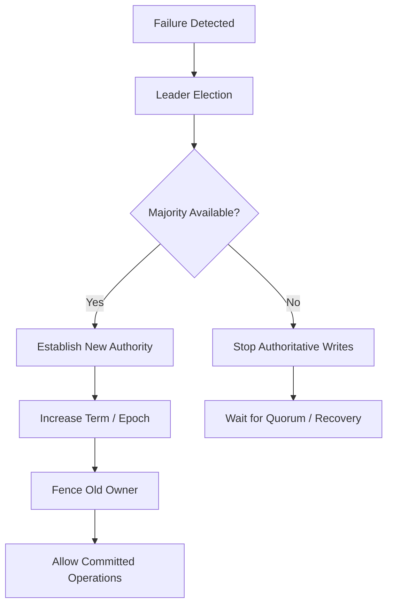
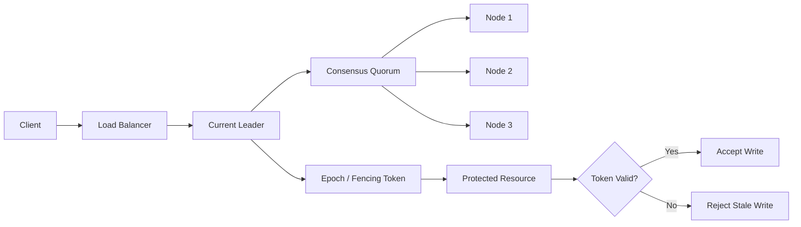

# 10- Split Brain Problem

## Overview

A **split brain** occurs when a distributed system incorrectly behaves as though it has two or more independent authoritative groups operating at the same time.

The classic example is a cluster that has two nodes or partitions both believing they are the leader:

```text
                 Network Partition
                       X
                      / \
                     /   \
                    v     v
                 Node A  Node B
                   |       |
                   v       v
                "Leader" "Leader"
```

This is dangerous because both sides may accept writes, issue commands, allocate resources, or modify shared state independently.

A split brain is not simply:

> "The network is down."

It is:

> "The system has lost a single authoritative view of ownership or state and multiple components are acting as if they are authoritative."

Split-brain scenarios are particularly important in:

- Distributed databases
- Leader-election systems
- Replicated storage
- Kubernetes control planes
- Distributed locks
- Active/standby systems
- Cluster managers
- Service discovery
- Stateful microservices
- Consensus-backed systems

The primary objective of a production distributed system is not merely to detect a partition. It must ensure that a partition does **not allow multiple sides to make conflicting authoritative decisions**.

---

## Why Split Brain Is Dangerous

Consider a database cluster:

```text
             Database Cluster

                 Leader
                   |
              Network
             Partition
              /     \
             /       \
            v         v
         Node A     Node B
         Leader     Leader
```

Suppose both nodes accept:

```text
Node A:
balance = 100

Node B:
balance = 50
```

When connectivity is restored, the system now has conflicting state.

The problem can be much worse when both sides perform external actions:

```text
Leader A → charge customer
Leader B → charge customer
```

The customer may be charged twice.

Or:

```text
Leader A → assign resource X to User A
Leader B → assign resource X to User B
```

The resource has two owners.

The critical issue is therefore not only data inconsistency.

Split brain can cause:

- Duplicate writes
- Lost updates
- Duplicate jobs
- Conflicting ownership
- Double payments
- Corrupted metadata
- Duplicate provisioning
- Conflicting configuration
- Divergent replicated logs
- Unsafe failover
- Resource corruption

---

## Split Brain vs Network Partition

These concepts are related but not identical.

### Network Partition

A network partition means communication between nodes is broken.

```text
A ---- B
 \    /
  \  /
   X
  / \
 C   D
```

The nodes may still be individually healthy.

### Split Brain

A split brain occurs when the partition causes multiple components to believe they can independently act as the authoritative system.

```text
Partition
    |
    v
Multiple independent authorities
    |
    v
Conflicting actions
```

Therefore:

```text
Network partition
        ≠
Split brain
```

A properly designed consensus system can experience a network partition without experiencing unsafe split brain.

---

## The Core Problem: Authority

At the heart of split brain is **authority**.

A distributed system needs a way to answer:

> Which node or group is currently allowed to make authoritative decisions?

For example:

```text
Cluster
   |
   v
Current Leader = Node A
```

If Node A becomes unreachable:

```text
Node A → unreachable
```

the system must not blindly conclude:

```text
Node A is dead
```

and immediately allow Node B to become authoritative.

Node A might still be running.

This creates the dangerous state:

```text
Node A → believes it is leader
Node B → believes it is leader
```

A robust system therefore needs mechanisms for:

- Leader election
- Quorum
- Fencing
- Epochs or terms
- Membership management
- Failure detection
- Durable state

---

## A Simple Split Brain Scenario

Consider a three-node cluster:

```text
        N1
       /  \
      /    \
     N2----N3
```

Suppose N1 is leader.

Then a network partition occurs:

```text
        N1

         X

       N2----N3
```

N1 can communicate with nobody.

N2 and N3 can communicate with each other.

If the system incorrectly allows N1 to continue accepting writes while N2 and N3 elect a new leader, the cluster now has:

```text
Partition A:
N1 → Leader

Partition B:
N2 → Leader
N3 → Follower
```

There are two leaders.

That is a split brain.

---

## Quorum Prevents Many Split-Brain Scenarios

Consensus systems commonly use majority quorums.

For three nodes:

```text
N = 3
Majority = 2
```

After the partition:

```text
Group A:
N1

Group B:
N2 N3
```

Only N2/N3 have a majority.

Therefore:

```text
N1 → cannot safely commit
N2/N3 → can continue
```

The isolated node may still believe it was the old leader for some period, but it cannot safely make new committed decisions.

This is a critical distinction:

> A node may believe it is leader locally, but it must not be able to commit authoritative state without the required quorum.

---

## Quorum Intersection

The safety property comes from quorum intersection.

For:

```text
N = 5
Majority = 3
```

consider:

```text
Quorum A:
N1 N2 N3

Quorum B:
N3 N4 N5
```

The quorums overlap:

```text
N3
```

Two independent majorities cannot exist without sharing at least one voting member.

This overlap is fundamental to many consensus protocols.

It prevents two sides from independently making conflicting decisions under the protocol's assumptions.

---

## What Happens Without Quorum

Consider a five-node cluster:

```text
N1 N2 N3 N4 N5
```

Network partition:

```text
Group A:
N1 N2

Group B:
N3 N4 N5
```

Majority:

```text
3
```

Therefore:

```text
Group A → no quorum
Group B → quorum
```

Group A should not continue committing consensus decisions.

If both groups were allowed to act as independent authorities:

```text
Group A → Decision X
Group B → Decision Y
```

the system could no longer guarantee a single consistent history.

---

## Split Brain in Leader Election

Leader election is particularly vulnerable to split brain if implemented incorrectly.

Suppose:

```text
Node A → current leader
Node B → follower
Node C → follower
```

Node A becomes unreachable.

Node B assumes:

```text
A is dead
```

and becomes leader.

But A is actually still running and merely isolated.

Now:

```text
A → Leader
B → Leader
```

If both can process writes:

```text
A → write X
B → write Y
```

the system has split brain.

A robust leader-election system therefore needs a mechanism to establish that the new leader has authority over the old leader.

---

## Terms, Epochs, and Generations

Many distributed systems use a monotonically increasing logical value such as:

- Term
- Epoch
- Generation
- View number
- Fencing token

Conceptually:

```text
Epoch 10
Epoch 11
Epoch 12
```

A newer epoch represents newer authority.

For example:

```text
Old Leader:
epoch = 10

New Leader:
epoch = 11
```

When the old leader later reconnects and observes:

```text
epoch = 11
```

it knows that its previous authority is stale.

This is one of the most important techniques for preventing stale leadership.

---

## Raft Terms

Raft uses **terms** to distinguish leadership periods.

Conceptually:

```text
Term 1
  Leader A

Term 2
  Leader B

Term 3
  Leader C
```

Suppose A was leader during term 1.

After a partition, B becomes leader during term 2.

When A reconnects and receives a message containing term 2:

```text
A:
currentTerm = 1

Received:
term = 2
```

A updates its state and becomes a follower.

This prevents an old leader from continuing to act as the current leader.

---

## Why "Node Is Unreachable" Is Not Enough

A common implementation mistake is:

```text
No response from leader
        |
        v
Leader must be dead
        |
        v
Elect new leader
```

This is unsafe.

The leader may simply be:

- Network isolated
- CPU-starved
- Temporarily overloaded
- Experiencing packet loss
- Experiencing high disk latency

The old leader may still be running.

Therefore:

```text
Unreachable
```

does not necessarily mean:

```text
Stopped
```

Distributed systems must explicitly account for this ambiguity.

---

## Fencing

**Fencing** is one of the strongest mechanisms for preventing stale leaders from performing dangerous operations.

The basic idea is:

> Even if an old leader continues running, the system prevents it from accessing or modifying the protected resource.

Consider:

```text
Old Leader
    |
    | token 41
    v
Protected Storage
```

After failover:

```text
New Leader
    |
    | token 42
    v
Protected Storage
```

The storage layer accepts only operations associated with the latest valid token.

Therefore:

```text
Old Leader → token 41 → rejected
New Leader → token 42 → accepted
```

This prevents stale ownership from causing corruption.

---

## Fencing Tokens

A fencing token is typically monotonically increasing:

```text
41
42
43
44
```

Every new ownership generation receives a higher token.

The protected resource records the highest token it has accepted.

For example:

```text
Current token = 42
```

An operation arrives:

```text
token = 41
```

The storage layer rejects it:

```text
41 < 42
```

An operation arrives:

```text
token = 43
```

It can be accepted:

```text
43 > 42
```

The exact comparison rules depend on the implementation, but the core principle is monotonic authority.

---

## Why Leader Election Alone Is Insufficient

Consider:

```text
Leader A
   |
   X
   |
Leader B
```

B becomes the new leader.

But A may still be processing an old request:

```text
Client → A
```

If A can write directly to the underlying database:

```text
A → database
```

then election alone does not prevent the stale write.

A stronger architecture is:

```text
Leader Election
       |
       v
Ownership Token
       |
       v
Protected Resource
       |
       v
Reject stale token
```

This is the difference between:

```text
Who is leader?
```

and:

```text
Who is allowed to perform this operation?
```

The latter requires enforcement at the resource boundary.

---

## STONITH

A classic fencing technique is **STONITH**:

> Shoot The Other Node In The Head.

Despite the unusual name, the concept is straightforward:

```text
Old leader
    |
    v
Power off / isolate old leader
```

If the old node is physically or logically stopped, it cannot continue modifying shared resources.

This is commonly associated with cluster-management systems and high-availability infrastructure.

The mechanism may involve:

- Power management
- IPMI
- Cloud APIs
- Hypervisor controls
- Out-of-band management

The objective is to guarantee:

```text
Old node cannot act
```

before the new authority takes ownership.

---

## Cloud-Based Fencing

In cloud environments, fencing can involve infrastructure APIs.

For example:

```text
Cluster Manager
      |
      v
Cloud API
      |
      v
Stop / isolate old instance
```

This can be useful when the old instance must be prevented from accessing a shared resource.

However, cloud API-based fencing must be designed carefully because:

- API calls can fail
- Control-plane latency exists
- Permissions can be misconfigured
- Network access to the cloud API may fail

Fencing should therefore be treated as part of the system's failure model rather than as an infallible mechanism.

---

## Split Brain in Active/Standby Systems

Consider a traditional active/standby service:

```text
Primary
   |
   v
Standby
```

If the standby cannot communicate with the primary:

```text
Primary → unreachable
```

it may promote itself.

But if the primary is still running:

```text
Primary → active
Standby → active
```

both may process requests.

This is a classic split-brain scenario.

A safe failover mechanism therefore requires:

```text
Failure Detection
       +
Election
       +
Quorum / Authority
       +
Fencing
```

where applicable.

---

## Split Brain in Databases

A database cluster can suffer severe consequences from split brain.

For example:

```text
Database A → Primary
Database B → Replica
```

After a bad failover:

```text
Database A → Primary
Database B → Primary
```

Now both may accept writes.

Suppose:

```text
A:
UPDATE accounts
SET balance = balance - 100;

B:
UPDATE accounts
SET balance = balance - 50;
```

The resulting state depends on the replication and conflict-resolution mechanism.

Possible outcomes include:

- Lost writes
- Divergent state
- Duplicate transactions
- Broken replication
- Manual reconciliation

Production database systems therefore use carefully designed failover mechanisms rather than simply promoting any unreachable replica.

---

## Split Brain in Distributed Storage

Distributed storage systems face similar problems.

Suppose two nodes both believe they own a volume:

```text
Node A → owns disk
Node B → owns disk
```

If both write concurrently:

```text
A → block 100
B → block 100
```

data corruption can occur.

This is why shared-storage clusters may use:

- Fencing
- SCSI reservations
- Lease mechanisms
- Cluster membership
- Quorum
- Lock managers

The storage layer must enforce ownership rather than trusting application-level assumptions.

---

## Split Brain in Kubernetes

Kubernetes uses etcd as the authoritative state store.

etcd uses a consensus mechanism to maintain consistent cluster state.

A healthy three-member etcd cluster:

```text
E1
E2
E3
```

requires:

```text
Majority = 2
```

If:

```text
E1 → isolated
E2 ↔ E3
```

then:

```text
E2/E3 → majority
E1 → no quorum
```

E1 should not be able to independently commit a different authoritative cluster history.

This illustrates why consensus-backed metadata stores are important for control-plane correctness.

---

## Split Brain and Kubernetes Workloads

Kubernetes control-plane consensus is different from application-level leader election.

For example, two application pods may both accidentally execute the same scheduled task:

```text
Pod A → scheduler task
Pod B → scheduler task
```

This is not automatically an etcd split brain.

It is an application-level coordination problem.

The application may need:

- Leader election
- Distributed locks
- Idempotency
- Fencing
- Queue-based work distribution

Do not confuse:

```text
Control-plane split brain
```

with:

```text
Duplicate application workers
```

The mitigation depends on the actual failure mode.

---

## Split Brain in Microservices

A microservice architecture can accidentally create split-brain-like behavior when multiple instances believe they own a singleton responsibility.

For example:

```text
Worker A → primary processor
Worker B → primary processor
```

Both execute:

```text
process_pending_payments()
```

If the operation is not idempotent:

```text
Payment → processed twice
```

The system may not technically have a consensus-level split brain, but the underlying problem is similar:

> Multiple components believe they have exclusive authority.

The solution may be:

- Queue partition ownership
- Database constraints
- Idempotency keys
- Distributed locks
- Leader election
- Fencing tokens

depending on the requirement.

---

## Idempotency Is Not Fencing

These concepts solve different problems.

### Idempotency

Ensures repeated execution produces the same effective result.

```text
Request X
Request X again

Result:
same effective state
```

### Fencing

Prevents an unauthorized or stale actor from executing the operation at all.

```text
Old leader → token 41 → rejected
New leader → token 42 → accepted
```

A robust payment system might use both:

```text
Leader ownership
       |
       v
Fencing
       |
       v
Idempotent operation
       |
       v
Payment
```

Idempotency reduces duplicate effects.

Fencing prevents stale ownership.

---

## Distributed Locks and Split Brain

A naive distributed lock implementation can create split brain if lock ownership is based only on an expiring local belief.

Consider:

```text
Client A acquires lock
```

Then A pauses due to:

- Garbage collection
- CPU starvation
- Network delay
- Process scheduling

The lease expires.

Client B acquires the lock:

```text
A → stale owner
B → current owner
```

A resumes and continues writing.

Now:

```text
A → believes it owns resource
B → believes it owns resource
```

This is effectively a stale-owner problem.

A fencing token solves it:

```text
A → token 10
B → token 11
```

The resource rejects A after token 11 becomes current.

---

## Leases

A lease grants ownership for a limited period.

Conceptually:

```text
Lease:
Owner = A
Expires = T
```

After expiration:

```text
Owner = B
```

Leases are useful but dangerous when used without accounting for process pauses and network partitions.

The fundamental problem is:

```text
A may not know that its lease expired.
```

Therefore:

> A lease does not automatically prevent stale owners from acting.

Fencing is often required when stale writes would be dangerous.

---

## Failure Detection

Distributed systems often use heartbeats:

```text
A → heartbeat → B
A → heartbeat → C
```

If heartbeats stop:

```text
timeout
```

the system suspects failure.

However:

```text
timeout ≠ proof of failure
```

Failure detectors therefore operate under assumptions about timing and network behavior.

The system must ensure that a false suspicion does not produce unsafe dual ownership.

---

## False Positives

Suppose a leader is temporarily overloaded:

```text
CPU = 100%
```

Heartbeats are delayed.

Followers conclude:

```text
Leader failed
```

and start an election.

The old leader eventually resumes.

Now there is a risk of stale authority if the protocol does not correctly handle terms, epochs, or fencing.

This is why overly aggressive timeouts can cause:

- Leadership churn
- Frequent elections
- Increased latency
- Reduced availability
- Unnecessary failovers

Timeouts should be based on realistic production latency and failure characteristics.

---

## Failure Detection vs Authority

This distinction is fundamental:

```text
Failure Detection
        |
        v
"Node may be unavailable"
```

is not the same as:

```text
Authority
        |
        v
"Node is no longer allowed to act"
```

A node may be unreachable but still running.

Therefore, a production failover design should answer both questions:

1. How do we detect that the current owner is unavailable?
2. How do we guarantee that the old owner cannot continue making unsafe changes?

The second question is where quorum, epochs, and fencing become critical.

---

## Split Brain During Network Recovery

A particularly dangerous moment is partition recovery.

Suppose:

```text
Partition A:
Node A → writes X

Partition B:
Node B → writes Y
```

The network reconnects:

```text
A <-------> B
```

Now the system must reconcile:

```text
X vs Y
```

Possible strategies depend on the system:

- Reject one history
- Choose a leader's history
- Merge operations
- Detect conflicts
- Replay committed logs
- Roll back uncommitted state

Consensus protocols avoid many of these problems by ensuring that only quorum-backed decisions become committed.

---

## Why Uncommitted Data Can Be Lost

In leader-based replicated systems, an old leader may have entries that were never committed.

For example:

```text
Old Leader:
A B C D

Committed:
A B C

D → uncommitted
```

The old leader loses leadership.

The new leader may not contain D.

Therefore:

```text
D → may be discarded
```

This is not necessarily corruption.

It is expected behavior when an entry was not committed.

The important guarantee is that committed state is protected.

---

## Committed vs Uncommitted State

A production engineer must distinguish:

```text
Local state
```

from:

```text
Committed state
```

For example:

```text
Leader log:
A B C D

Commit index:
A B C
```

Only:

```text
A B C
```

is committed.

Entry D may disappear during leadership change.

This distinction is essential when reasoning about split brain and failover behavior.

---

## Preventing Split Brain

A robust design typically combines several mechanisms.



The exact mechanisms vary by architecture, but the principles remain consistent.

---

## Design Principles

### Establish a Single Authority

At any point in time, the system should have a clearly defined authoritative owner or quorum.

### Require Quorum for Critical Decisions

Critical state transitions should require enough members to establish authority safely.

### Use Monotonically Increasing Terms

New leadership should be distinguishable from old leadership.

### Fence Stale Owners

Do not rely solely on the stale node voluntarily stopping.

### Persist Critical Metadata

Leadership and protocol state must survive restarts when required by the protocol.

### Make Operations Idempotent

Even a correctly designed system can experience retries and duplicate delivery.

### Keep the Authority Boundary Close to the Resource

If a node can bypass the authority mechanism and directly modify the resource, leader election may not be sufficient.

---

## Production Architecture

A robust leader-based system can look like:



The important architectural boundary is:

```text
Protected Resource
        |
        v
Validate authority
```

rather than:

```text
Application assumes it is leader
        |
        v
Resource blindly accepts write
```

---

## Monitoring for Split Brain

Split brain should be detectable through operational telemetry.

Useful metrics include:

| Signal | What It Can Indicate |
|---|---|
| Leader changes | Election instability |
| Multiple leader reports | Potential split brain |
| Term / epoch changes | Leadership churn |
| Quorum loss | Loss of safe progress |
| Replication lag | Follower instability |
| Heartbeat failures | Network or node problems |
| Fencing failures | Stale-owner risk |
| Duplicate job execution | Multiple active workers |
| Conflicting writes | Possible authority violation |
| Lease expirations | Ownership instability |
| Network partition events | Infrastructure failures |

Alert on **unexpected leadership behavior**, not merely every leadership change.

A healthy system can legitimately elect a new leader after a failure. Continuous leader churn is more concerning.

---

## Logging Recommendations

Distributed systems should log enough information to reconstruct authority transitions.

Useful fields include:

```text
node_id
cluster_id
term
epoch
leader_id
request_id
log_index
commit_index
fencing_token
timestamp
```

For example:

```text
node=n2
term=42
leader=n2
log_index=91821
commit_index=91820
fencing_token=77
```

These fields are extremely useful when diagnosing:

- Stale leaders
- Election loops
- Replication problems
- Duplicate operations
- Membership changes
- Failover incidents

---

## Security Considerations

Split brain can become a security problem when unauthorized nodes can impersonate cluster members.

Production systems should use:

- Mutual TLS
- Strong node authentication
- Certificate rotation
- Network segmentation
- Restricted administrative APIs
- Least-privilege IAM
- Secure membership changes
- Audit logging
- Protected control-plane endpoints

A malicious or compromised node should not be able to simply declare:

```text
"I am the leader."
```

Authority must be established through the system's trust and consensus mechanisms.

---

## Cost Considerations

Preventing split brain can require additional infrastructure.

Examples include:

- Odd-numbered consensus clusters
- Dedicated coordination nodes
- Cross-AZ deployment
- Fencing infrastructure
- Out-of-band management
- Durable storage
- Monitoring systems

The correct approach is not to minimize infrastructure at all costs.

Instead, optimize for:

```text
Required failure tolerance
+
Required consistency
+
Acceptable latency
+
Operational complexity
+
Cost
```

For critical systems, the cost of an incorrect failover can be dramatically higher than the cost of additional infrastructure.

---

## Common Mistakes

### Treating Ping Failure as Proof of Failure

A node that cannot be reached may still be running.

**Why it fails:** Network partitions are indistinguishable from some node failures from the observer's perspective.

**Better approach:** Use quorum, terms, leases, and fencing where appropriate.

### Allowing Both Sides of a Partition to Accept Writes

This directly creates competing authorities.

**Better approach:** Require quorum for authoritative writes.

### Relying Only on Leader Election

Election changes the logical leader but may not stop the old leader from acting.

**Better approach:** Use fencing or enforce authority at the protected resource.

### Using Leases Without Considering Pauses

A process may pause beyond its lease expiration and resume afterward.

**Better approach:** Use fencing tokens when stale operations are dangerous.

### Using Extremely Aggressive Timeouts

Short timeouts can cause unnecessary elections.

**Better approach:** Tune timeouts using observed production latency and failure characteristics.

### Assuming Idempotency Solves Split Brain

Idempotency prevents repeated operations from producing repeated effects, but it does not establish ownership.

**Better approach:** Combine idempotency with proper authority and fencing.

### Ignoring Recovery Behavior

A system may behave correctly during failure but incorrectly when partitioned nodes reconnect.

**Better approach:** Test partition, recovery, stale-leader, and membership-change scenarios explicitly.

### Letting Applications Bypass the Coordination Layer

A service may obtain leadership through etcd but directly access a resource that does not enforce ownership.

**Better approach:** Put authorization or fencing enforcement as close to the protected resource as practical.

---

## Testing Split-Brain Scenarios

Split brain cannot be validated only through normal unit tests.

Distributed systems should be tested under failure.

Important scenarios include:

### Leader Isolation

```text
Leader
   X
Followers
```

Verify:

- New leader election
- Old leader loses authority
- No conflicting commits

### Majority Loss

```text
3-node cluster

1 node available
2 nodes unavailable
```

Verify:

```text
No majority
→ no unsafe authoritative writes
```

### Delayed Network

Introduce artificial latency:

```text
100 ms
500 ms
1 s
5 s
```

Observe:

- Election behavior
- Request latency
- Leader stability

### Network Partition

Create:

```text
Group A || Group B
```

Verify that only the side with sufficient authority can make progress.

### Old Leader Recovery

Partition the old leader, elect a new leader, then reconnect the old leader.

Verify:

```text
Old leader
    ↓
New epoch observed
    ↓
Follower
```

### Fencing Failure

Simulate a failure of the fencing mechanism and verify that the system does not silently continue with unsafe ownership.

---

## Chaos Testing

Production-grade distributed systems benefit from controlled fault injection.

Examples include:

- Kill leader processes
- Drop packets
- Introduce latency
- Block ports
- Restart nodes
- Fill disks
- Saturate CPU
- Introduce clock skew
- Disconnect availability zones
- Delay storage operations

The goal is to validate:

```text
Failure
  |
  v
Detection
  |
  v
Failover
  |
  v
Authority Establishment
  |
  v
Stale Owner Prevention
  |
  v
Recovery
```

A system that has never been tested under partition should not be assumed to handle split brain correctly.

---

## Interview Perspective

### What is split brain?

A strong answer:

> Split brain occurs when multiple nodes or partitions of a distributed system independently believe they have authoritative control. This can cause conflicting writes, duplicate processing, or resource corruption. Quorum, leader election, terms or epochs, and fencing are common mechanisms used to prevent it.

### Is a network partition the same as split brain?

No.

> A network partition is a communication failure. Split brain occurs when that communication failure leads to multiple components behaving as independent authorities.

### How does quorum help?

> A majority quorum ensures that two independent partitions cannot both obtain a majority. A minority partition therefore cannot safely commit new consensus decisions.

### Why isn't leader election enough?

> Because the old leader may still be running even though it has lost connectivity. A new leader may be elected while the old leader continues processing. Fencing or resource-level authority enforcement prevents stale leaders from making unsafe changes.

### What is fencing?

> Fencing prevents a stale owner from accessing or modifying a protected resource after ownership has changed. Fencing tokens and STONITH are common approaches.

### What is the difference between a lease and fencing?

> A lease grants ownership for a period, but the old owner may not know its lease has expired. Fencing ensures that the resource itself rejects operations from stale owners.

### Why do consensus systems often stop during a partition?

> Because preserving a single consistent history is more important than allowing a minority partition to make independent decisions. Without quorum, continuing writes could create conflicting authoritative state.

### How would you prevent duplicate processing in a distributed worker system?

The answer depends on the workload, but possible mechanisms include:

- Partition ownership
- Leader election
- Distributed locks
- Fencing tokens
- Idempotency keys
- Database uniqueness constraints
- Queue semantics

The important point is to distinguish:

```text
Duplicate delivery
```

from:

```text
Multiple active authorities
```

and choose the mechanism accordingly.

---

## Key Takeaways

- Split brain occurs when multiple components believe they have authoritative control, often after a network partition or failed failover.
- Quorum, terms or epochs, and leader-election protocols prevent many split-brain scenarios by establishing a single authoritative history.
- Leader election alone may not stop a stale leader from acting; fencing is required when stale ownership can cause unsafe writes or resource corruption.
- Idempotency handles duplicate operations, while fencing handles stale authority; production systems may need both.
- Split-brain prevention must be validated through partition, failover, stale-leader, fencing, and recovery testing rather than normal-path testing alone.