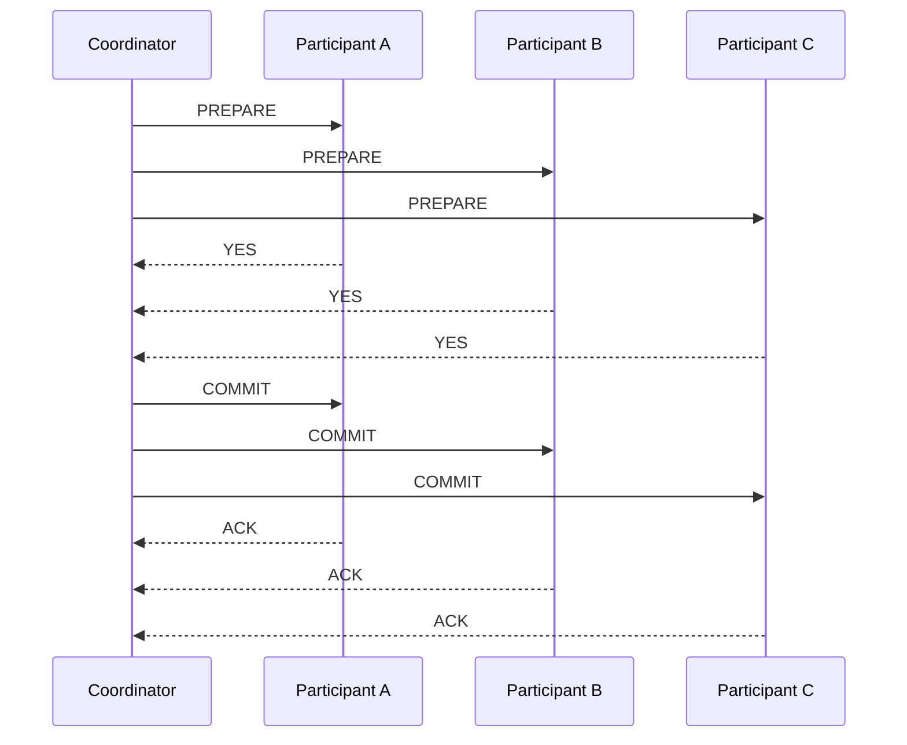
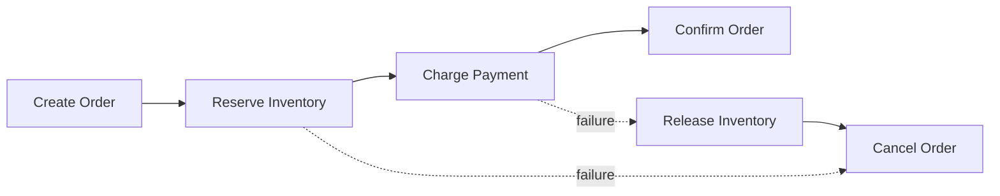
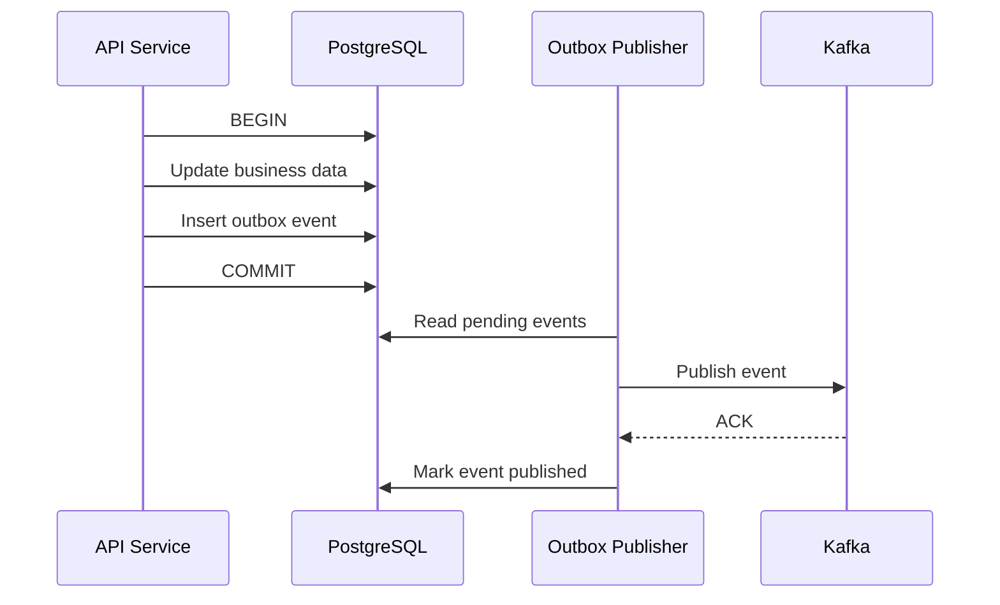

# 11- Distributed Transactions

## Overview

A **distributed transaction** is a transaction whose correctness depends on changes occurring across multiple independently managed resources, services, databases, or partitions.

A local database transaction is relatively straightforward:

```text
Application
    |
    v
PostgreSQL
    |
    +-- UPDATE account
    +-- INSERT payment
    |
    v
COMMIT
```

A distributed transaction is more complex:

```text
                Order Service
                     |
          +----------+----------+
          |                     |
          v                     v
      Order DB             Payment Service
                                |
                                v
                           Payment DB
                                |
                                v
                         Inventory Service
                                |
                                v
                          Inventory DB
```

The system must answer a difficult question:

> How do we ensure that changes across multiple resources either reach an acceptable consistent outcome or are safely compensated when something fails?

This becomes difficult because the participating systems can fail independently.

For example:

```text
Order DB      → success
Payment DB    → success
Inventory DB  → failure
```

There is no single local database transaction that can automatically roll back all three systems.

Distributed transactions therefore introduce concerns around:

- Atomicity
- Consistency
- Isolation
- Durability
- Coordination
- Failure recovery
- Timeouts
- Retries
- Idempotency
- Partial failure
- Compensation
- Availability
- Operational complexity

The most important architectural principle is:

> Avoid distributed transactions when a simpler local transaction, asynchronous workflow, or eventual-consistency model can provide the required business guarantees.

When strong atomicity across resources is genuinely required, protocols such as **Two-Phase Commit (2PC)** may be appropriate. In service-oriented architectures, **Saga** and transactional messaging patterns are often more practical.

---

## What Makes a Transaction Distributed?

A transaction becomes distributed when its atomicity or correctness spans multiple independent transactional boundaries.

Examples include:

- Two different databases
- Multiple database shards
- Multiple microservices
- A database and an external payment provider
- Multiple regional databases
- Multiple independently managed storage systems

A transaction involving two tables in the same PostgreSQL database is normally not a distributed transaction:

```text
PostgreSQL
├── orders
└── payments

BEGIN
UPDATE orders
INSERT payments
COMMIT
```

PostgreSQL can coordinate this using its native transaction mechanism.

However:

```text
Order Service → PostgreSQL A
Payment Service → PostgreSQL B
```

requires coordination across separate transaction managers.

---

## Why Distributed Transactions Are Difficult

A local transaction has a relatively simple failure boundary:

```text
Application
     |
     v
Database
     |
     v
Commit / Rollback
```

A distributed transaction has multiple independent failure points:

```text
             Coordinator
             /    |    \
            /     |     \
           v      v      v
         DB A    DB B    DB C
```

Any of these can fail:

- Coordinator
- Database A
- Database B
- Database C
- Network between coordinator and participants
- Storage
- Process
- Availability zone
- Authentication
- Connection pool
- Timeout mechanism

The difficult case is partial completion.

For example:

```text
DB A → COMMIT
DB B → COMMIT
DB C → timeout
```

The system cannot simply assume:

```text
timeout = rollback
```

because DB C may have committed successfully but the response may have been lost.

This is one of the fundamental problems distributed transaction protocols attempt to solve.

---

## Local Transaction vs Distributed Transaction

| Property | Local Transaction | Distributed Transaction |
|---|---|---|
| Resources | One transactional boundary | Multiple resources |
| Coordinator | Usually database engine | Dedicated/coordinating protocol |
| Failure scope | Relatively small | Multiple independent failures |
| Rollback | Usually straightforward | Potentially difficult |
| Network dependency | Limited | Significant |
| Latency | Usually low | Higher |
| Operational complexity | Lower | Higher |
| Recovery | Database-managed | Application/protocol-managed |
| Availability impact | Usually smaller | Potentially significant |
| Debugging | Easier | Much harder |

---

## The Four Important Guarantees

Distributed transaction design usually revolves around familiar transaction properties.

### Atomicity

All participating operations should reach a consistent outcome.

Ideally:

```text
All commit
```

or:

```text
All abort
```

The difficulty is implementing this across independent systems.

### Consistency

A transaction should preserve the business and data invariants of the system.

For example:

```text
Order status = PAID
```

should not coexist indefinitely with:

```text
Payment status = FAILED
```

unless the domain explicitly allows such a state.

### Isolation

Concurrent transactions should not observe invalid intermediate states.

Distributed systems make isolation harder because participants may have different concurrency and isolation semantics.

### Durability

Once a distributed transaction is considered committed, the committed state must survive failures.

Durability depends on the individual resources and the coordination protocol.

---

## The Two Fundamental Models

There are two major approaches to distributed transaction coordination:

```text
Strong coordination
        |
        +-- Two-Phase Commit

Workflow-based coordination
        |
        +-- Saga
```

They optimize for different requirements.

| Approach | Main Property | Typical Trade-off |
|---|---|---|
| 2PC | Strong atomic commit | Blocking and coordination overhead |
| Saga | Business-level eventual consistency | Compensation complexity |
| Outbox | Reliable event publication | Requires eventual processing |
| Idempotent workflow | Safe retries | Requires carefully designed operations |

There is no universally correct choice.

---

## Two-Phase Commit

**Two-Phase Commit (2PC)** is a distributed transaction protocol designed to coordinate atomic commit across multiple participants.

The major components are:

```text
Coordinator
    |
    +---- Participant A
    |
    +---- Participant B
    |
    +---- Participant C
```

The coordinator controls the transaction lifecycle.

2PC has two primary phases:

1. Prepare
2. Commit

---

## Phase One: Prepare

The coordinator asks every participant:

```text
Can you commit this transaction?
```

Conceptually:

```text
Coordinator
    |
    +---- PREPARE → DB A
    |
    +---- PREPARE → DB B
    |
    +---- PREPARE → DB C
```

Each participant performs the required work and determines whether it can safely commit.

Responses:

```text
DB A → YES
DB B → YES
DB C → YES
```

The coordinator records that all participants are prepared.

---

## Phase Two: Commit

If every participant responded positively:

```text
Coordinator
    |
    +---- COMMIT → DB A
    |
    +---- COMMIT → DB B
    |
    +---- COMMIT → DB C
```

Participants commit.

If any participant responds negatively:

```text
DB A → YES
DB B → YES
DB C → NO
```

the coordinator requests rollback:

```text
Coordinator
    |
    +---- ABORT → DB A
    +---- ABORT → DB B
    +---- ABORT → DB C
```

---

## 2PC Flow



---

## The Prepared State

The prepare phase is important because a participant typically enters a state where it has promised that it can commit.

Conceptually:

```text
ACTIVE
   |
   v
PREPARED
   |
   +---- COMMIT → COMMITTED
   |
   +---- ABORT → ABORTED
```

The prepared state may require resources to remain reserved.

This can involve:

- Locks
- WAL records
- Durable transaction metadata
- Connection resources
- Disk state

As a result, prepared transactions can remain expensive if the coordinator becomes unavailable.

---

## The Fundamental 2PC Problem

Consider:

```text
Coordinator
    |
    +---- DB A → prepared
    |
    +---- DB B → prepared
```

Now the coordinator crashes.

DB A and DB B may be unable to determine whether the global transaction should commit or abort.

They cannot safely guess.

If DB A commits while DB B aborts:

```text
DB A → COMMITTED
DB B → ABORTED
```

atomicity is violated.

This is one of the fundamental limitations of 2PC.

---

## Blocking Behavior

2PC can block participants while waiting for a decision from the coordinator.

This is especially problematic when:

```text
Coordinator
    X
    |
    v
Participants
```

The participants may remain in the prepared state.

This can hold:

- Locks
- Resources
- Connections
- Storage state

for an extended period.

Therefore, 2PC introduces a trade-off:

```text
Stronger atomicity
        vs
Availability and operational simplicity
```

---

## Failure Scenarios in 2PC

### Participant Fails Before Prepare

```text
DB A → unavailable
```

The coordinator can abort the transaction.

### Participant Fails After Prepare

The participant may recover and inspect durable transaction state.

The coordinator may need to continue the protocol.

### Coordinator Fails Before Prepare Completes

The transaction can generally be aborted if no global commit decision has been made.

### Coordinator Fails After Participants Prepare

This is much more difficult.

Participants may need to wait for the coordinator's durable decision.

### Network Timeout

A timeout does not necessarily tell the coordinator whether the participant committed.

For example:

```text
COMMIT → participant
participant commits
ACK → lost
coordinator → timeout
```

The coordinator must not automatically assume failure.

---

## Why Timeouts Are Not Transactions

A common mistake is:

```text
Request timeout
    |
    v
ROLLBACK
```

This is unsafe in distributed systems.

Suppose:

```text
Service A → commit request
Service B → commits
Network → drops response
Service A → timeout
```

Service A cannot know whether B committed.

The correct approach depends on the protocol and application semantics.

Possible solutions include:

- Transaction status lookup
- Durable transaction IDs
- Idempotent retry
- Coordinator recovery
- Saga compensation

---

## Advantages of 2PC

2PC can provide strong atomicity across participating transactional resources.

Advantages include:

- Atomic commit semantics
- Centralized coordination
- Clear transaction boundary
- Useful for tightly coupled transactional systems
- Appropriate for some database-level distributed transactions

2PC can be valuable when:

- Participants support the protocol well
- Strong consistency is mandatory
- Transaction duration is short
- Participant count is small
- Operational control is high

---

## Limitations of 2PC

The main limitations are:

- Coordination overhead
- Increased latency
- Blocking behavior
- Coordinator dependency
- Resource locking
- Complex failure recovery
- Operational complexity
- Reduced availability under some failures

A distributed transaction can also amplify a local failure.

For example:

```text
DB A slow
   |
   v
Transaction slow
   |
   v
Locks held longer
   |
   v
DB B contention
   |
   v
More requests queue
```

This can create cascading performance problems.

---

## Transaction Duration Matters

Long-running distributed transactions are particularly dangerous.

Consider:

```text
Transaction begins
        |
        v
DB A lock
        |
        v
Network call
        |
        v
DB B lock
        |
        v
External service
        |
        v
Commit
```

The transaction may hold resources while waiting on multiple network calls.

This increases:

- Lock duration
- Deadlock probability
- Connection utilization
- Latency
- Failure probability

Distributed transactions should therefore generally be short-lived.

---

## The Saga Pattern

A **Saga** decomposes a distributed transaction into a sequence of local transactions.

Each local transaction commits independently.

If a later operation fails, the system executes a **compensating transaction**.

For example:

```text
Create Order
    |
    v
Reserve Inventory
    |
    v
Charge Payment
    |
    v
Confirm Order
```

If payment fails:

```text
Create Order       → committed
Reserve Inventory  → committed
Charge Payment     → failed

Compensate:
Release Inventory
Mark Order Failed
```

The Saga does not provide traditional atomic commit.

Instead, it provides a controlled business workflow.

---

## Saga Architecture



Each service owns its local transaction.

For example:

```text
Order Service
    |
    v
Order DB

Inventory Service
    |
    v
Inventory DB

Payment Service
    |
    v
Payment DB
```

There is no global database transaction.

---

## Compensating Transactions

A compensation reverses the business effect of an earlier successful operation.

Examples:

| Forward Operation | Compensation |
|---|---|
| Reserve inventory | Release inventory |
| Create shipment | Cancel shipment |
| Create order | Cancel order |
| Add account credit | Remove account credit |
| Allocate resource | Release resource |

However, compensation is not always a true inverse.

For example:

```text
Charge credit card
```

cannot necessarily be reversed by:

```text
Delete payment row
```

A real compensation may be:

```text
Refund payment
```

This creates a new financial transaction.

Therefore:

> Compensation is a business operation, not a database rollback.

---

## Saga vs Database Rollback

A database rollback:

```text
BEGIN
UPDATE A
UPDATE B
ROLLBACK
```

can restore the database transaction's previous state.

A Saga:

```text
Operation A → committed
Operation B → committed
Operation C → failed
```

must perform new operations:

```text
Compensate B
Compensate A
```

Therefore:

```text
Rollback ≠ Compensation
```

This distinction is critical when designing microservices.

---

## Orchestration-Based Saga

In an orchestration-based Saga, a central coordinator manages the workflow.

```text
             Saga Orchestrator
              /      |      \
             v       v       v
          Order   Inventory  Payment
```

The orchestrator knows:

- Current state
- Next action
- Failure handling
- Compensation
- Retry policy

Example:

```text
START
  |
  v
Create Order
  |
  v
Reserve Inventory
  |
  v
Charge Payment
  |
  v
Confirm Order
```

---

## Orchestration Advantages

Orchestration provides:

- Centralized workflow visibility
- Explicit state transitions
- Easier operational debugging
- Centralized retry logic
- Explicit compensation logic
- Clear business workflow

It works well for complex workflows.

The main risk is creating an overly powerful orchestrator that becomes tightly coupled to every service's internal behavior.

The orchestrator should coordinate business operations, not directly manipulate another service's database.

---

## Choreography-Based Saga

In choreography, services react to events.

```text
Order Created
      |
      v
Inventory Service
      |
      v
Inventory Reserved
      |
      v
Payment Service
      |
      v
Payment Completed
      |
      v
Order Service
```

No single central orchestrator controls the workflow.

Instead:

```text
Event
  |
  v
Service
  |
  v
Event
  |
  v
Another Service
```

Kafka is commonly used for this style of event-driven architecture.

---

## Choreography Advantages

Advantages include:

- Loose coupling
- Natural event-driven architecture
- Independent service evolution
- Good scalability
- No central workflow coordinator

However, large workflows can become difficult to understand.

A system with many events can become:

```text
Service A
  ↓
Event X
  ↓
Service B
  ↓
Event Y
  ↓
Service C
  ↓
Event Z
  ↓
Service D
```

Tracing the entire business transaction becomes difficult.

---

## Orchestration vs Choreography

| Property | Orchestration | Choreography |
|---|---|---|
| Coordinator | Explicit | None |
| Workflow visibility | High | Distributed |
| Coupling | Central workflow coupling | Event coupling |
| Debugging | Easier | Harder at scale |
| Event-driven | Optional | Core mechanism |
| Complex workflows | Usually easier | Can become difficult |
| Failure handling | Centralized | Distributed |
| Scaling | Good | Good |
| Operational complexity | Moderate | Can become high |

A useful rule is:

> Prefer orchestration when the workflow itself is complex and business-critical. Prefer choreography when services are naturally event-driven and the workflow remains understandable.

---

## Transactional Outbox

The **transactional outbox pattern** solves an important distributed transaction problem:

```text
Update database
+
Publish event
```

Suppose a service does:

```text
BEGIN
UPDATE orders
COMMIT

publish OrderCreated
```

The database update may succeed while the message publication fails.

Now:

```text
Database → updated
Kafka → no event
```

The system has inconsistent integration state.

---

## Outbox Solution

Store the event in the same database transaction:

```text
BEGIN

UPDATE orders

INSERT INTO outbox_events (...)

COMMIT
```

Then a background publisher reads the outbox:

```text
Outbox
   |
   v
Publisher
   |
   v
Kafka
```

The database transaction guarantees:

```text
Business change
+
Outbox event
```

commit together.

---

## Outbox Flow



The outbox pattern does not make Kafka and PostgreSQL one atomic transaction.

Instead, it guarantees that the business change and the intent to publish the event are committed together.

---

## Exactly-Once vs At-Least-Once

Distributed transaction workflows commonly encounter duplicate delivery.

For example:

```text
Publisher → Kafka
Kafka → success
ACK → lost

Publisher → retry
Kafka → duplicate
```

Therefore, many production systems use:

```text
At-least-once delivery
+
Idempotent consumers
```

For example:

```python
def process_event(event):
    event_id = event["id"]

    if already_processed(event_id):
        return

    process_business_operation(event)
    mark_processed(event_id)
```

The exact implementation must ensure that checking and recording processing state is itself safe under concurrency.

---

## Idempotency Keys

For external APIs, idempotency keys can prevent duplicate business operations.

Example:

```http
POST /payments
Idempotency-Key: payment-8f23...
```

The payment service stores the result associated with the key.

A retry using the same key can return the previous result instead of creating a second payment.

This is particularly important when:

```text
Request sent
    |
    v
Server commits
    |
    X
Response lost
    |
    v
Client retries
```

Without idempotency, the operation may execute twice.

---

## Distributed Transaction State Machines

Complex workflows should generally have explicit state.

For example:

```text
PENDING
   |
   v
INVENTORY_RESERVED
   |
   v
PAYMENT_PROCESSING
   |
   +---- failure → PAYMENT_FAILED
   |
   v
PAYMENT_COMPLETED
   |
   v
CONFIRMED
```

This is better than relying on loosely coupled boolean fields such as:

```text
payment_done = true
inventory_done = true
order_confirmed = false
```

An explicit state machine makes legal transitions easier to reason about.

---

## Example: Order Workflow

Consider:

```text
POST /orders
```

The workflow is:

```text
Create order
      |
      v
Reserve inventory
      |
      v
Authorize payment
      |
      v
Create shipment
      |
      v
Confirm order
```

A Saga could maintain:

```text
Order State:
PENDING
```

Then:

```text
PENDING
  ↓
INVENTORY_RESERVED
  ↓
PAYMENT_AUTHORIZED
  ↓
SHIPMENT_CREATED
  ↓
CONFIRMED
```

If payment fails:

```text
PAYMENT_FAILED
```

and inventory can be released.

---

## Python Example

A simplified orchestration layer might look like:

```python
from dataclasses import dataclass


@dataclass
class OrderWorkflow:
    order_id: str
    inventory_reserved: bool = False
    payment_authorized: bool = False


def execute_workflow(workflow: OrderWorkflow) -> None:
    try:
        reserve_inventory(workflow.order_id)
        workflow.inventory_reserved = True

        authorize_payment(workflow.order_id)
        workflow.payment_authorized = True

        create_shipment(workflow.order_id)
        confirm_order(workflow.order_id)

    except PaymentError:
        if workflow.inventory_reserved:
            release_inventory(workflow.order_id)

        mark_order_payment_failed(workflow.order_id)

    except Exception:
        if workflow.inventory_reserved:
            release_inventory(workflow.order_id)

        mark_order_failed(workflow.order_id)
        raise
```

A production implementation should not rely solely on in-memory workflow state.

The workflow state should be persisted so that it can recover after process crashes.

---

## Persistent Workflow State

A production Saga should maintain durable state.

For example:

```text
workflow_id
order_id
state
attempt_count
last_error
updated_at
```

Example:

| State | Meaning |
|---|---|
| `PENDING` | Workflow created |
| `INVENTORY_RESERVED` | Inventory successfully reserved |
| `PAYMENT_PROCESSING` | Payment operation underway |
| `PAYMENT_FAILED` | Payment failed |
| `CONFIRMED` | Workflow completed |
| `COMPENSATING` | Compensation running |
| `COMPENSATED` | Rollback workflow completed |
| `FAILED` | Manual intervention may be required |

This allows workers to resume workflows after crashes.

---

## Retry Strategy

Distributed transactions frequently encounter transient failures.

Examples:

- Network timeout
- Temporary database failure
- Kafka unavailable
- Service overload
- Connection reset

Retries should generally use:

```text
Exponential backoff
+
Jitter
+
Bounded attempts
```

For example:

```text
Attempt 1 → 100 ms
Attempt 2 → 250 ms
Attempt 3 → 600 ms
Attempt 4 → 1.5 s
```

Exact values should depend on the workload.

Never blindly retry every failure.

Permanent business failures should not be retried indefinitely.

---

## Dead Letter Queues

If an event repeatedly fails:

```text
Kafka
  |
  v
Consumer
  |
  X
retry
  |
  X
retry
  |
  X
retry
  |
  v
Dead Letter Queue
```

A DLQ allows operations teams to inspect problematic events.

However, a DLQ is not a substitute for correct error handling.

Events should be moved to a DLQ when:

- Retry attempts are exhausted
- The error is persistent
- Manual investigation is required

---

## Timeouts and Compensation

Every distributed workflow should have explicit timeout behavior.

For example:

```text
Payment Processing
       |
       v
Timeout
       |
       v
Query payment status
       |
       +---- SUCCESS → continue
       |
       +---- FAILED → compensate
       |
       +---- UNKNOWN → reconciliation
```

Do not automatically compensate solely because an external request timed out.

The payment provider may have processed the request successfully.

This is one of the most important production lessons in distributed transaction design:

> An unknown result is not the same as a failed operation.

---

## Reconciliation

Some distributed workflows cannot immediately determine the final state.

For example:

```text
Payment request
      |
      v
Timeout
      |
      v
Status = UNKNOWN
```

A reconciliation process can later query the external system.

```text
Reconciliation Worker
        |
        v
Payment Provider
        |
        v
Actual Payment Status
```

This allows the system to converge toward the correct business state.

Reconciliation is especially important for:

- Payments
- Billing
- Inventory
- Shipping
- External APIs
- Financial systems

---

## Isolation Challenges

Distributed transactions can have different isolation levels at different participants.

For example:

```text
Service A → READ COMMITTED
Service B → REPEATABLE READ
Service C → SERIALIZABLE
```

The global workflow does not automatically inherit the strongest isolation level.

This can produce subtle concurrency issues.

Senior-level design must therefore consider:

- Local isolation levels
- Locking
- Concurrent workflows
- Duplicate requests
- Race conditions
- Ordering guarantees

---

## Concurrency Control

Suppose two orders attempt to purchase the final inventory unit:

```text
Order A → quantity = 1
Order B → quantity = 1
```

Both workflows may read:

```text
stock = 1
```

Without appropriate concurrency control, both could reserve it.

Possible mechanisms include:

- Database row locking
- Optimistic concurrency
- Atomic conditional updates
- Inventory reservation records
- Serial processing by partition
- Version numbers

For example:

```sql
UPDATE inventory
SET available = available - 1
WHERE product_id = 42
  AND available > 0;
```

The affected-row count can determine whether the reservation succeeded.

---

## Database Constraints Still Matter

A distributed workflow should not attempt to enforce every invariant through application logic.

Use database constraints where appropriate.

Examples:

```sql
UNIQUE (idempotency_key)
```

or:

```sql
CHECK (balance >= 0)
```

or:

```sql
UNIQUE (order_id, product_id)
```

Database constraints provide a strong final line of defense against concurrency bugs.

---

## Security Considerations

Distributed transaction infrastructure carries significant security implications.

Protect:

- Transaction identifiers
- Payment identifiers
- Workflow metadata
- Internal service APIs
- Kafka topics
- Outbox tables
- Compensation endpoints

Use:

- TLS/mTLS
- Authentication between services
- Authorization for workflow commands
- Least-privilege database access
- Encryption for sensitive data
- Audit logging
- Secret management

Compensation APIs should not be publicly exposed without strong authorization.

A malicious caller should never be able to arbitrarily invoke:

```text
refund()
release_inventory()
cancel_order()
```

---

## Observability

Distributed transaction debugging requires correlation across services.

Use a shared:

```text
trace_id
workflow_id
transaction_id
order_id
```

For example:

```text
trace_id=7f83...
workflow_id=wf-9821
order_id=ORD-123
```

These identifiers should appear in:

- Application logs
- Distributed traces
- Metrics
- Kafka message headers
- Database workflow records

---

## Important Metrics

Monitor:

| Metric | Purpose |
|---|---|
| Workflow duration | Detect slow workflows |
| Compensation rate | Detect business failures |
| Retry count | Detect instability |
| Outbox backlog | Detect event publishing problems |
| DLQ size | Detect persistent failures |
| Transaction timeout rate | Detect network/service issues |
| Saga failure rate | Detect workflow failures |
| Reconciliation backlog | Detect unresolved states |
| Duplicate event rate | Detect delivery/retry issues |
| 2PC prepared transaction count | Detect stuck transactions |

A growing outbox or reconciliation backlog can indicate a systemic downstream problem before customers notice it.

---

## Operational Recovery

Production systems should define how operators recover workflows.

A workflow may become:

```text
PAYMENT_UNKNOWN
```

and remain there because an external provider is unavailable.

The system should provide operational capabilities such as:

```text
Inspect workflow
Retry step
Query external state
Resume workflow
Trigger compensation
Mark manually resolved
```

Manual recovery operations must be:

- Audited
- Authorized
- Idempotent
- Safe to retry

Do not encourage engineers to directly modify production workflow state without understanding downstream consequences.

---

## Disaster Recovery

Distributed transactions must be considered across failure domains.

Questions to answer include:

- What happens if one availability zone fails?
- What happens if the coordinator fails?
- Where is transaction state persisted?
- Can workflows resume after a restart?
- What happens after regional failover?
- Can duplicate events be replayed?
- Can compensation run after disaster recovery?
- How are unresolved transactions reconciled?

For critical workflows, durable state should survive application process failure.

---

## Choosing the Right Approach

A useful decision process is:

```text
Do multiple resources need atomic commit?
            |
            +---- No
            |      |
            |      v
            |   Local transactions
            |
            +---- Yes
                   |
                   v
        Can business compensation work?
                   |
             +-----+-----+
             |           |
            Yes          No
             |           |
             v           v
           Saga         2PC /
                        stronger coordination
```

This is not an absolute rule.

The actual choice depends on:

- Consistency requirements
- Failure tolerance
- Latency
- Business semantics
- Participant capabilities
- Operational maturity
- Availability requirements

---

## When to Prefer a Local Transaction

Prefer a local transaction when the data can be owned by one database.

Instead of:

```text
Order Service → DB A
Payment State → DB B
```

consider whether both pieces of state genuinely belong in the same transactional boundary.

A well-designed service boundary can eliminate many distributed transaction problems.

---

## When to Prefer an Outbox

Use an outbox when the main requirement is:

```text
Database change
+
Reliable event publication
```

For example:

```text
PostgreSQL
    |
    +-- orders
    +-- outbox_events
```

This is often preferable to trying to make PostgreSQL and Kafka one distributed transaction.

---

## When to Prefer a Saga

A Saga is appropriate when:

- Business operations can be compensated
- Workflows span multiple services
- Eventual consistency is acceptable
- Operations can be retried
- Workflow state can be persisted

Typical examples:

- Order processing
- Travel booking
- Shipment workflows
- Subscription provisioning
- Account onboarding

---

## When 2PC Can Be Appropriate

2PC can make sense when:

- Strong atomicity is mandatory
- All participants support compatible transactional semantics
- The transaction is short-lived
- Participant count is controlled
- Blocking behavior is acceptable
- Operational control is strong

It is more common in tightly controlled transactional infrastructure than in loosely coupled microservice architectures.

---

## Common Mistakes

### Treating Microservices Like One Database

A common design mistake is:

```text
Service A
   |
   +-- Service B DB
   +-- Service C DB
```

The first service directly modifies another service's database to achieve atomicity.

This breaks service ownership and creates hidden coupling.

Prefer APIs, events, and explicit workflow coordination.

### Using 2PC Everywhere

2PC provides strong semantics, but it is not a default microservices communication mechanism.

Use it only when the business and technical requirements justify its cost.

### Treating Compensation as Rollback

Compensation is a new business operation.

A refund does not magically undo every side effect of a payment.

### Retrying Unknown Operations Blindly

A timeout does not prove that an operation failed.

Query status or use idempotency where possible.

### Ignoring Duplicate Events

At-least-once delivery means consumers must generally tolerate duplicates.

### Keeping Workflow State Only in Memory

A process restart can destroy the workflow's state.

Persist important workflow transitions.

### Creating Unbounded Retries

Retries can amplify failures:

```text
Service failure
    |
    v
100 requests retry
    |
    v
1000 requests retry
    |
    v
Downstream overload
```

Use bounded retries, exponential backoff, jitter, and circuit breakers.

### Ignoring Compensation Failures

Compensation itself can fail.

For example:

```text
Reserve inventory → success
Payment → failure
Release inventory → failure
```

The system now needs another retry or reconciliation path.

### Assuming Exactly-Once Is Free

Exactly-once semantics across arbitrary distributed systems are difficult.

Often the more practical design is:

```text
At-least-once delivery
+
Idempotent processing
+
Durable state
```

---

## Production Design Checklist

Before implementing a distributed transaction workflow, answer:

- What resources participate?
- Which service owns each resource?
- What must be atomic?
- Is eventual consistency acceptable?
- Can every operation be retried safely?
- What is the idempotency strategy?
- What happens after timeout?
- What happens when a participant commits but the response is lost?
- What happens when compensation fails?
- Where is workflow state persisted?
- How are duplicate messages handled?
- How are events published reliably?
- How are stuck workflows detected?
- How does reconciliation work?
- How does an operator recover a failed workflow?
- What happens during disaster recovery?
- How is the workflow traced across services?

If these questions do not have clear answers, the distributed transaction design is not production-ready.

---

## Key Takeaways

- Distributed transactions coordinate state changes across independent transactional boundaries and are significantly harder to reason about than local database transactions.
- Use local transactions whenever possible; introduce 2PC, Saga, or other coordination mechanisms only when the business consistency requirements justify their complexity.
- 2PC provides strong atomic commit semantics but introduces coordination overhead, blocking behavior, and difficult failure-recovery scenarios.
- Saga-based workflows provide practical eventual consistency through local transactions and compensating actions, but require durable workflow state, idempotency, retries, and reconciliation.
- Production distributed transaction systems must explicitly handle timeouts, duplicate delivery, partial failure, compensation failure, observability, and operational recovery.