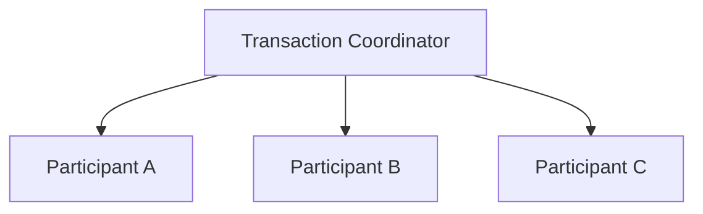
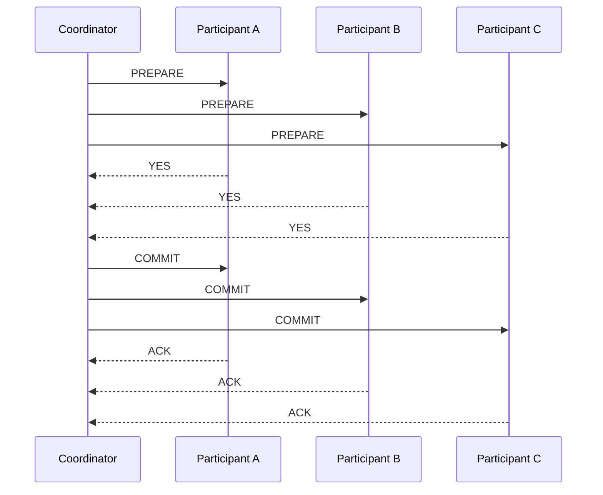
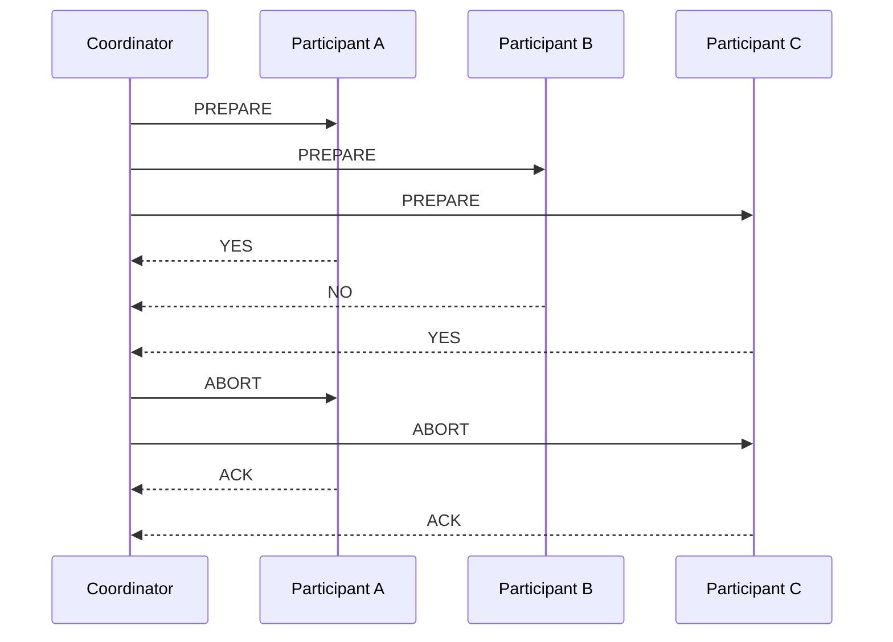

# 12- Two-Phase Commit (2PC)

## Overview

**Two-Phase Commit (2PC)** is a distributed transaction protocol used to coordinate a single atomic commit decision across multiple independent transactional participants.

The fundamental problem is simple to state:

> If multiple databases or transactional resources participate in one logical transaction, how can the system prevent some participants from committing while others abort?

A local database transaction can normally rely on one transaction manager:

```text
Application
    |
    v
PostgreSQL
    |
    +-- UPDATE orders
    +-- UPDATE payments
    |
    v
COMMIT / ROLLBACK
```

With independent resources, the transaction boundary crosses system boundaries:

```text
                    Coordinator
                    /    |    \
                   /     |     \
                  v      v      v
               DB A    DB B    DB C
```

Each participant has its own local transaction manager, storage, locks, failures, and recovery process.

2PC introduces a **coordinator** that drives the participants through two phases:

```text
Phase 1 → Prepare
Phase 2 → Commit or Abort
```

The protocol is designed to provide atomicity: participants should reach the same final decision.

However, 2PC has significant costs:

- Additional network round trips
- Coordination overhead
- Increased transaction latency
- Locks and resources held for longer
- Blocking during coordinator failures
- Complex recovery
- Reduced availability in some failure scenarios
- Operational complexity

For these reasons, 2PC is not automatically the best solution for microservices. Local transactions, transactional outbox, Saga workflows, idempotency, and reconciliation are often preferable when business requirements allow eventual consistency.

---

## Why Two-Phase Commit Exists

Consider an order workflow involving two databases:

```text
Order Service
    |
    v
Order DB

Payment Service
    |
    v
Payment DB
```

Suppose the application performs:

```text
1. Create order
2. Charge payment
```

If the order commits successfully:

```text
Order DB → COMMITTED
```

but the payment transaction fails:

```text
Payment DB → ABORTED
```

the system can end up with:

```text
Order = CREATED
Payment = FAILED
```

That may be acceptable if the business workflow explicitly supports this state.

But suppose the requirement is:

> Either both changes become committed, or neither does.

A simple sequential implementation cannot guarantee that.

```text
BEGIN Order DB
    |
    v
Commit Order
    |
    v
BEGIN Payment DB
    |
    v
Payment fails
```

Once the order database has committed, the application cannot perform a normal database rollback against it.

2PC addresses this by delaying the final commit decision until all participants have agreed that they can commit.

---

## Core Components

A 2PC system contains two logical roles:

| Component | Responsibility |
|---|---|
| Coordinator | Manages the global transaction and makes the final commit/abort decision |
| Participant | Executes the local transaction and follows the coordinator's decision |

A participant may be:

- A database
- A transaction manager
- A storage system
- Another transactional resource

The architecture looks like:



The coordinator does not normally manipulate participant data directly.

Instead, it communicates transaction lifecycle commands such as:

```text
PREPARE
COMMIT
ABORT
```

---

## Global Transaction

A distributed transaction receives a transaction identifier.

For example:

```text
global_transaction_id = TX-98231
```

The identifier allows the coordinator and participants to associate local work with the same global transaction.

Conceptually:

```text
TX-98231
    |
    +-- Order DB transaction
    +-- Payment DB transaction
    +-- Inventory DB transaction
```

Production implementations typically persist enough transaction metadata to recover after process failures.

---

## The Two Phases

2PC consists of:

```text
Phase 1
Prepare / Voting

Phase 2
Commit / Abort
```

The protocol can be represented as:

```text
                  Coordinator
                       |
              +--------+--------+
              |                 |
          PREPARE            PREPARE
              |                 |
              v                 v
        Participant A     Participant B
              |                 |
           YES/NO            YES/NO
              \                 /
               \               /
                v             v
                 Coordinator
                      |
             +--------+--------+
             |                 |
          COMMIT              ABORT
```

---

## Phase One: Prepare

The coordinator asks every participant to prepare the transaction.

Conceptually:

```text
Coordinator → Participant A: PREPARE
Coordinator → Participant B: PREPARE
Coordinator → Participant C: PREPARE
```

Each participant performs its local work and determines whether it can safely commit.

A participant may respond:

```text
YES
```

or:

```text
NO
```

The important distinction is that `YES` means:

> I have completed the work required to prepare this transaction and can commit if the coordinator tells me to do so.

It does **not** mean:

> The transaction is already globally committed.

---

## Participant State During Prepare

A participant may transition through states similar to:

```text
ACTIVE
   |
   v
PREPARING
   |
   v
PREPARED
```

After reaching `PREPARED`, the participant must be able to honor the coordinator's eventual decision.

This usually requires durable state.

Depending on the implementation, the participant may have:

- Persisted transaction records
- Written-ahead-log records
- Held locks
- Reserved resources
- Retained transaction metadata

This is one reason long-running 2PC transactions can be expensive.

---

## Phase Two: Commit

If every participant votes `YES`:

```text
Participant A → YES
Participant B → YES
Participant C → YES
```

the coordinator records the global decision:

```text
COMMIT
```

It then sends:

```text
Coordinator → A: COMMIT
Coordinator → B: COMMIT
Coordinator → C: COMMIT
```

Participants commit their local transactions.

The resulting state is:

```text
A → COMMITTED
B → COMMITTED
C → COMMITTED
```

---

## Phase Two: Abort

If any participant votes `NO`:

```text
A → YES
B → NO
C → YES
```

the coordinator must abort the global transaction.

It sends:

```text
Coordinator → A: ABORT
Coordinator → B: ABORT
Coordinator → C: ABORT
```

The desired final state is:

```text
A → ABORTED
B → ABORTED
C → ABORTED
```

The participant that voted `NO` has already rejected the transaction, while the participants that voted `YES` discard their prepared work.

---

## Complete 2PC Sequence



Failure case:



---

## The Coordinator's Decision

The coordinator must determine the global outcome.

The decision rule is effectively:

```text
If every participant votes YES:
    COMMIT
Else:
    ABORT
```

Formally:

```text
Global Decision = COMMIT
    iff
All Participants = YES
```

Otherwise:

```text
Global Decision = ABORT
```

The coordinator should durably record the decision before or as part of the commit protocol so that recovery does not depend solely on volatile memory.

---

## Why the Prepare Phase Is Necessary

Without a prepare phase, the coordinator could attempt:

```text
COMMIT A
COMMIT B
COMMIT C
```

and discover that B cannot commit after A has already committed.

That creates:

```text
A → COMMITTED
B → FAILED
C → UNKNOWN
```

The prepare phase attempts to establish that all participants are ready before the global decision is made.

Conceptually:

```text
Prepare
   |
   v
Everyone can commit?
   |
   +---- No → Abort
   |
   +---- Yes
          |
          v
        Commit
```

---

## Prepare Does Not Mean Commit

This distinction is critical.

```text
PREPARED ≠ COMMITTED
```

A participant in the prepared state has effectively promised:

```text
"If the coordinator decides COMMIT,
I can complete the transaction."
```

The transaction is not globally committed until the commit decision is made and processed.

This distinction frequently appears in distributed systems interviews.

---

## The Blocking Problem

One of the most important limitations of classic 2PC is blocking.

Consider:

```text
Coordinator
    |
    +---- A → PREPARED
    |
    +---- B → PREPARED
```

Now the coordinator crashes before participants receive the final decision.

The participants may know:

```text
"I am prepared."
```

but not know:

```text
"Should I commit or abort?"
```

They cannot safely choose arbitrarily.

If A commits:

```text
A → COMMITTED
```

while B aborts:

```text
B → ABORTED
```

atomicity is violated.

Therefore participants may have to wait for coordinator recovery or another valid source of the global decision.

---

## Coordinator Failure

Consider this sequence:

```text
Coordinator
    |
    +---- PREPARE → A
    +---- PREPARE → B
    |
    +---- YES ← A
    +---- YES ← B
    |
    X CRASH
```

A and B may both be prepared.

The coordinator's failure creates uncertainty.

A robust implementation needs:

- Durable coordinator state
- Recovery procedures
- Transaction logs
- Participant recovery
- Decision persistence
- Operational monitoring

The coordinator itself becomes a critical component of the distributed transaction system.

---

## Participant Failure

Participant failures can happen at different points.

### Failure Before Prepare

```text
Participant → unavailable
```

The coordinator can generally treat the transaction as failed and abort it.

### Failure During Prepare

The participant may not have completed preparation.

The coordinator needs to determine whether the participant voted successfully.

### Failure After Prepare

This is more complicated.

The participant may have:

```text
PREPARED
```

and then crashed.

After recovery, it needs to inspect durable transaction state and continue according to the global decision.

### Failure After Commit

The participant may have committed but crashed before acknowledging the coordinator.

The coordinator may see:

```text
timeout
```

even though the commit succeeded.

This demonstrates why:

> A lost response does not necessarily mean a lost transaction.

---

## Network Failures

Distributed transaction protocols must assume that the network can:

- Delay messages
- Drop messages
- Duplicate messages
- Reorder messages
- Partition participants
- Disconnect established connections

For example:

```text
Coordinator
    |
    | COMMIT
    v
Participant
    |
    | transaction commits
    |
    X ACK lost
```

The coordinator sees:

```text
timeout
```

but the participant may already be committed.

Therefore, retry behavior must be protocol-aware and transaction identifiers must be durable and unambiguous.

---

## Timeout Does Not Mean Rollback

This is a critical distributed systems principle.

Suppose:

```text
Coordinator → COMMIT
Participant → commits
Participant → ACK
Network → drops ACK
Coordinator → timeout
```

The coordinator cannot conclude:

```text
Participant failed to commit
```

It only knows:

```text
The expected response was not received.
```

These are different facts.

Correct recovery may require:

- Participant status inspection
- Coordinator log recovery
- Transaction-status queries
- Durable transaction identifiers

---

## Transaction Logs

Durable logs are fundamental to reliable 2PC implementations.

The coordinator may maintain records such as:

```text
TX-98231
participants = [A, B, C]
state = PREPARED
decision = COMMIT
```

Participants may maintain:

```text
TX-98231
state = PREPARED
```

After a process crash, these records allow the system to reconstruct transaction state.

Without durable transaction state, recovery becomes dependent on uncertain in-memory information.

---

## Write-Ahead Logging

A database participant can use write-ahead logging to make transaction state durable before acknowledging protocol progress.

Conceptually:

```text
Application
    |
    v
Transaction Manager
    |
    v
WAL
    |
    v
Data Pages
```

The exact implementation depends on the database engine.

The general principle is:

> Do not acknowledge a durable transaction state before the information necessary to recover that state is itself durable.

---

## Locks and Resource Retention

Prepared transactions may hold locks or other resources.

For example:

```text
Transaction TX-98231
       |
       v
Row locked
       |
       v
PREPARED
       |
       v
Waiting for coordinator
```

While waiting:

```text
Other transaction
       |
       v
tries same row
       |
       v
blocked
```

If many distributed transactions become prepared simultaneously, contention can increase significantly.

This can produce:

```text
More prepared transactions
        ↓
More locks held
        ↓
More blocked requests
        ↓
Higher latency
        ↓
More timeouts
        ↓
More retries
```

This feedback loop can become a production incident.

---

## Transaction Duration

2PC works best with short transactions.

Avoid designs such as:

```text
BEGIN
    |
    v
Database operation
    |
    v
HTTP request
    |
    v
External payment API
    |
    v
Kafka operation
    |
    v
Another database
    |
    v
COMMIT
```

Holding a distributed transaction open across arbitrary network calls is dangerous.

The longer the transaction remains active:

- The more likely a failure becomes
- The longer locks may be held
- The more resources are consumed
- The higher the latency
- The larger the recovery state becomes

---

## Advantages

2PC provides several important properties.

### Atomic Commit

The primary benefit is coordinated atomicity.

The intended result is:

```text
All commit
```

or:

```text
All abort
```

rather than arbitrary partial commit.

### Explicit Coordination

The transaction lifecycle is clearly defined:

```text
Prepare
   ↓
Decision
   ↓
Commit / Abort
```

### Durable Recovery

With proper transaction logs, participants can recover after process crashes.

### Useful for Tightly Controlled Systems

2PC can be appropriate when all participants are controlled by the same organization and support compatible transaction semantics.

---

## Limitations

| Limitation | Impact |
|---|---|
| Coordinator dependency | Coordinator failure can block progress |
| Network round trips | Higher latency |
| Prepared state | Resources may remain locked |
| Failure recovery | Complex |
| Long transactions | Increased contention |
| Operational complexity | More difficult debugging |
| Availability | Can degrade during coordination failures |
| Participant compatibility | All participants need appropriate transactional support |

The core trade-off is:

```text
Strong atomic coordination
        vs
Availability, latency, and simplicity
```

---

## 2PC and Availability

2PC can reduce availability because participants may need to wait for coordination.

Consider:

```text
Participant
    |
    v
PREPARED
    |
    X
Coordinator unavailable
```

The participant may be unable to safely complete the transaction.

This is fundamentally different from a system designed around eventual consistency, where independent operations can often continue.

Therefore, 2PC should be evaluated against the system's availability requirements.

---

## 2PC vs Saga

2PC and Saga solve related but fundamentally different problems.

| Property | 2PC | Saga |
|---|---|---|
| Atomicity | Protocol-level atomic commit | Business-level consistency |
| Rollback | Transaction rollback | Compensation |
| Consistency | Stronger | Usually eventual |
| Coordination | Central coordinator | Orchestrator or events |
| Blocking | Possible | Usually avoids global blocking |
| Latency | Higher | Often lower |
| Availability | Can be reduced | Usually better |
| Failure handling | Protocol-driven | Application-driven |
| Best suited for | Strong atomic requirements | Long-running business workflows |

Example:

```text
2PC:
A + B + C
    ↓
global commit
```

Saga:

```text
A → commit
B → commit
C → fail
    ↓
compensate A and B
```

A Saga does not undo the past at the storage-protocol level. It executes new business operations that compensate for previous actions.

---

## 2PC vs Transactional Outbox

The transactional outbox addresses a narrower but extremely common problem:

```text
Database update
+
Event publication
```

Without an outbox:

```text
UPDATE DB
   |
   v
COMMIT
   |
   X
Publish event
```

The database can commit while event publication fails.

With an outbox:

```text
BEGIN
    |
    +-- UPDATE business data
    |
    +-- INSERT outbox event
    |
COMMIT
```

A separate publisher then sends the event.

This avoids requiring a global transaction across PostgreSQL and Kafka.

---

## 2PC and Microservices

2PC can technically coordinate transactions across services when the underlying infrastructure supports it.

However, direct adoption in microservice architectures introduces substantial coupling.

For example:

```text
Order Service
    |
    +---- transaction participant
    |
Payment Service
    |
    +---- transaction participant
```

Every participant must understand and support the distributed transaction protocol.

This can conflict with common microservice principles:

- Independent deployment
- Independent data ownership
- Independent scaling
- Technology autonomy
- Failure isolation

For many microservice workflows, a Saga is operationally more appropriate.

---

## When to Use 2PC

2PC is most appropriate when:

- Strong atomicity is mandatory
- Participants support distributed transaction semantics
- Transactions are short-lived
- Participant count is controlled
- Blocking behavior is acceptable
- The system has strong operational support
- Consistency is more important than availability for the workflow

Examples may include tightly controlled enterprise transaction systems or distributed database scenarios.

---

## When Not to Use 2PC

Avoid 2PC when:

- A local transaction is sufficient
- Eventual consistency is acceptable
- Operations are long-running
- External APIs participate
- Participants cannot reliably support 2PC
- Compensation is straightforward
- High availability is more important than global atomicity
- The workflow naturally fits Saga semantics

A payment provider that exposes only HTTP APIs is not automatically a 2PC participant.

You cannot turn:

```text
POST /payments
```

into a true 2PC participant simply by putting it behind a coordinator.

---

## 2PC with External APIs

Suppose:

```text
Order DB
Payment Provider
```

The payment provider is external.

A naïve design might attempt:

```text
PREPARE payment
COMMIT payment
```

But most external HTTP APIs do not expose distributed transaction semantics.

The safer architecture is generally:

```text
Order Service
      |
      v
Payment Service
      |
      v
External Payment Provider
```

with:

- Idempotency keys
- Durable payment state
- Status queries
- Retry handling
- Reconciliation
- Compensation such as refunds

This is closer to a Saga-style workflow than 2PC.

---

## Idempotency in 2PC

Protocol messages may be retried.

For example:

```text
COMMIT TX-98231
```

may be delivered more than once.

Participants should therefore process transaction commands using stable transaction identifiers and tolerate repeated protocol messages safely.

Conceptually:

```text
if transaction_id already committed:
    return success
```

The actual implementation depends on the transaction manager.

Idempotency is particularly important during recovery because the coordinator may resend messages after uncertain delivery.

---

## Recovery Protocol

A production implementation should define how participants recover after a crash.

A simplified model is:

```text
Participant starts
       |
       v
Read durable transaction log
       |
       v
Find unresolved transaction
       |
       v
Determine coordinator decision
       |
       +---- COMMIT → commit
       |
       +---- ABORT → rollback
       |
       +---- UNKNOWN → recovery protocol
```

Recovery must be deterministic and based on durable state rather than assumptions.

---

## Coordinator High Availability

The coordinator is a critical component.

A production design should consider:

- Durable transaction logs
- Persistent coordinator state
- Leader election
- Coordinator failover
- Recovery procedures
- Monitoring
- Transaction timeout policies

A simplistic architecture:

```text
             Coordinator
                  |
          +-------+-------+
          |       |       |
          v       v       v
         DB A    DB B    DB C
```

can become fragile if the coordinator is a single non-redundant process.

A more resilient design may use replicated coordinator state:

```text
             Coordinator Cluster
              /       |       \
             v        v        v
          Replica  Replica  Replica
                |
                v
           Participants
```

The exact implementation depends on the transaction system.

---

## Monitoring

Distributed transaction infrastructure requires dedicated observability.

Important metrics include:

| Metric | Why It Matters |
|---|---|
| Active distributed transactions | Current transaction load |
| Prepared transactions | Detect resource retention |
| Transaction duration | Detect slow workflows |
| Commit rate | Measure successful transactions |
| Abort rate | Detect failures |
| Timeout rate | Detect coordination/network problems |
| Coordinator latency | Detect coordination bottlenecks |
| Participant latency | Identify slow resources |
| Recovery queue | Detect unresolved transactions |
| Lock wait time | Detect contention |

A particularly important signal is:

```text
Prepared transactions > normal baseline
```

A growing prepared-transaction population can indicate coordinator failures, participant failures, or network problems.

---

## Logging

Every distributed transaction should have a stable identifier.

Example:

```text
transaction_id=tx-98231
participant=payment-db
phase=prepare
decision=YES
```

Useful fields include:

```text
transaction_id
participant_id
phase
state
decision
timestamp
duration
error
retry_count
trace_id
```

Avoid logging sensitive transaction payloads.

Use identifiers that allow the transaction to be traced without exposing confidential business data.

---

## Distributed Tracing

Distributed tracing can connect:

```text
API Request
    |
    v
Coordinator
    |
    +---- Participant A
    |
    +---- Participant B
    |
    +---- Participant C
```

A trace might show:

```text
POST /orders
  └── distributed_transaction
       ├── prepare order-db
       ├── prepare payment-db
       ├── prepare inventory-db
       ├── commit order-db
       ├── commit payment-db
       └── commit inventory-db
```

This is extremely useful when diagnosing latency or partial failures.

---

## Security Considerations

2PC infrastructure introduces privileged coordination capabilities.

Protect:

- Coordinator APIs
- Participant endpoints
- Transaction identifiers
- Transaction logs
- Database credentials
- Recovery interfaces

Use:

- TLS/mTLS
- Service authentication
- Authorization
- Least-privilege database permissions
- Secret management
- Audit logs
- Network segmentation

Recovery and administrative APIs are particularly sensitive.

An unauthorized actor must not be able to invoke:

```text
COMMIT TX-98231
```

or:

```text
ABORT TX-98231
```

against arbitrary transactions.

---

## Performance Considerations

2PC introduces additional network communication.

A local transaction may look like:

```text
Application → DB → COMMIT
```

2PC adds coordination:

```text
Coordinator
    |
    +-- PREPARE → A
    +-- PREPARE → B
    +-- PREPARE → C
    |
    +-- COMMIT → A
    +-- COMMIT → B
    +-- COMMIT → C
```

Latency is therefore influenced by:

- Number of participants
- Slowest participant
- Network latency
- Coordinator processing
- Lock duration
- Logging overhead
- Retries
- Recovery behavior

A useful mental model is:

```text
Transaction latency
≈
coordination overhead
+
slowest participant
+
commit processing
```

The exact latency depends on the implementation and parallelism.

---

## Participant Count

As participant count increases, failure probability and coordination overhead generally increase.

For example:

```text
3 participants
    |
    v
few failure points

30 participants
    |
    v
many failure points
```

Avoid unnecessarily broad distributed transaction boundaries.

If a transaction can be redesigned from:

```text
10 participants
```

to:

```text
2 participants
```

the system becomes easier to operate and recover.

---

## Avoid Long-Running 2PC

Do not hold a distributed transaction open while waiting for:

- User interaction
- External HTTP calls
- Long-running computation
- Batch processing
- Human approval
- Asynchronous jobs

For example, avoid:

```text
BEGIN 2PC
    |
    v
Send email
    |
    v
Wait 30 seconds
    |
    v
Call external API
    |
    v
Commit
```

Use a workflow architecture instead.

---

## Failure Scenario: Coordinator Crash Before Prepare

Suppose:

```text
Coordinator → PREPARE A
A → YES

Coordinator crashes
```

If B was never prepared, the transaction cannot safely be committed globally.

The coordinator can recover and determine that no global commit decision was made.

The transaction can be aborted.

---

## Failure Scenario: Coordinator Crash After Prepare

Suppose:

```text
A → PREPARED
B → PREPARED
C → PREPARED

Coordinator → COMMIT decision

Coordinator crashes
```

Participants may be unable to independently determine the global decision unless the decision has been durably recorded and is recoverable.

This is the core scenario behind the blocking behavior of classic 2PC.

---

## Failure Scenario: Commit Message Lost

Suppose:

```text
Coordinator → COMMIT → A
A → commits
A → ACK lost
```

The coordinator may retry:

```text
Coordinator → COMMIT → A
```

A correctly implemented participant must safely handle the duplicate command.

The final state remains:

```text
A → COMMITTED
```

This is another reason durable transaction IDs and idempotent protocol processing matter.

---

## Common Mistakes

### Confusing Prepare With Commit

Incorrect:

```text
PREPARE = committed
```

Correct:

```text
PREPARE = participant promises it can commit
```

### Treating Timeouts as Rollbacks

A timeout only means that a response was not observed.

It does not prove that the participant rolled back.

### Ignoring Coordinator Failure

A coordinator is a critical part of the protocol.

Its failure can prevent participants from safely completing transactions.

### Keeping Transactions Open Too Long

Long transactions increase:

- Lock duration
- Resource usage
- Failure probability
- Recovery complexity

### Using 2PC for External HTTP APIs

Most external APIs are not 2PC participants.

Use idempotency, durable state, retries, status checks, and reconciliation instead.

### Ignoring Prepared Transactions

A buildup of prepared transactions can consume resources and create database contention.

### Assuming Network Reliability

Messages can be lost, delayed, duplicated, or reordered.

The protocol must be designed around these realities.

### Building a Single Coordinator Without Recovery

A non-durable coordinator can become a single point of failure.

### Using Distributed Transactions to Hide Poor Service Boundaries

If every request requires a global transaction across many services, the service boundaries may be too tightly coupled.

---

## Interview Traps

### Is 2PC a Consensus Algorithm?

No.

2PC is a distributed transaction commit protocol.

It coordinates a commit decision among known participants.

Consensus algorithms such as Raft and Paxos solve a different problem: reaching agreement despite failures among a group of nodes.

### Does 2PC Guarantee Availability?

No.

Classic 2PC can block when participants are uncertain about the global decision.

### Can 2PC Prevent All Failures?

No.

It coordinates transaction state, but the surrounding system still requires:

- Durable state
- Recovery
- Timeouts
- Monitoring
- Retry handling
- Operational procedures

### Is 2PC the Same as Saga?

No.

2PC attempts atomic distributed commit.

Saga uses independent local transactions and compensating actions.

### Why Are There Two Phases?

The prepare phase establishes that participants are capable of committing before the coordinator makes the global decision.

The second phase communicates the final decision.

---

## Production Design Checklist

Before adopting 2PC, verify:

- Do we genuinely require atomic commit?
- Can a local transaction solve the problem?
- Can the workflow tolerate eventual consistency?
- Can a Saga provide sufficient business guarantees?
- Do all participants support compatible transaction semantics?
- Are transactions short-lived?
- Is coordinator state durable?
- Is coordinator failover implemented?
- Are participant states durable?
- How are prepared transactions monitored?
- What happens when the coordinator crashes?
- What happens when a participant crashes?
- What happens when an ACK is lost?
- Are protocol messages safely retryable?
- Are transaction identifiers stable?
- How are locks and resources released?
- How are unresolved transactions recovered?
- How are operators alerted?
- How is the system tested under network partitions?
- How does disaster recovery interact with unresolved transactions?

If these questions cannot be answered, the 2PC implementation is not ready for production.

---

## Testing Distributed Failure Scenarios

Testing should go beyond the successful path.

Test:

```text
Coordinator failure
Participant failure
Network partition
Message loss
Message duplication
Message delay
Participant timeout
Coordinator restart
Database restart
Commit ACK loss
Prepare ACK loss
Lock contention
Long-running transactions
Recovery after crash
```

A useful approach is fault injection.

For example:

```text
1. Start transaction.
2. Prepare all participants.
3. Kill coordinator.
4. Restart coordinator.
5. Verify transaction recovery.
6. Verify no participant diverges.
```

The goal is not merely to verify successful transactions.

The critical objective is to verify that failure does not produce contradictory final states.

---

## Practical Decision Framework

Use the following architectural decision process:

```text
Need distributed atomicity?
          |
          +---- No
          |     |
          |     v
          |  Local transaction
          |
          +---- Yes
                 |
                 v
       Can business compensation work?
                 |
          +------+------+
          |             |
         Yes            No
          |             |
          v             v
        Saga           2PC
```

Before choosing 2PC, explicitly quantify:

- Required consistency
- Maximum acceptable latency
- Availability requirements
- Number of participants
- Expected transaction duration
- Failure behavior
- Operational complexity
- Recovery requirements

The protocol should be chosen because the business invariant requires it, not simply because atomicity sounds safer.

---

## Key Takeaways

- 2PC coordinates atomic commit across multiple transactional participants using a prepare phase followed by a global commit or abort decision.
- The `PREPARED` state is not the same as `COMMITTED`; participants may hold locks and resources while waiting for the coordinator's decision.
- Classic 2PC can block during coordinator or network failures, making strong atomicity a trade-off against availability, latency, and operational simplicity.
- Durable transaction state, stable transaction identifiers, recovery procedures, idempotent protocol handling, and monitoring are essential for production-grade 2PC.
- Prefer local transactions, transactional outbox, or Saga-based workflows when they can satisfy the business consistency requirements without global atomic commit.