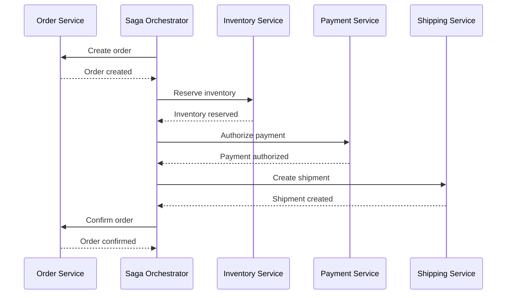
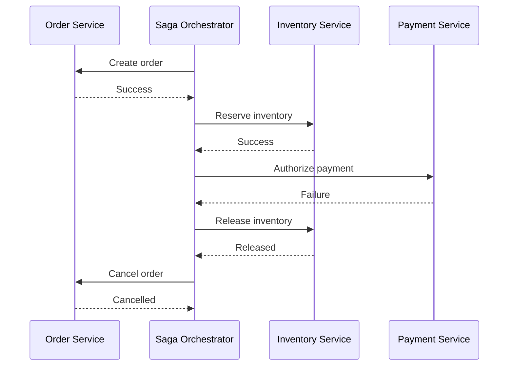
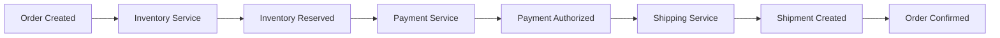
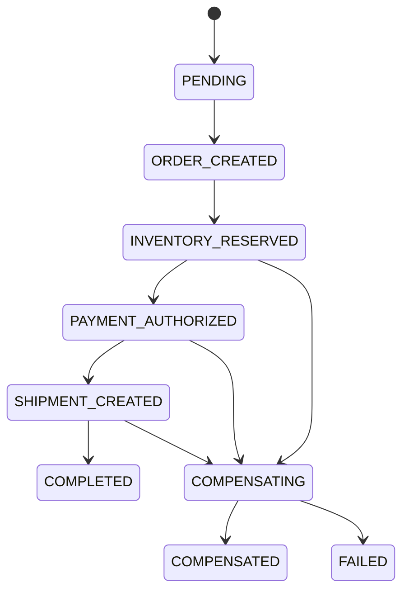
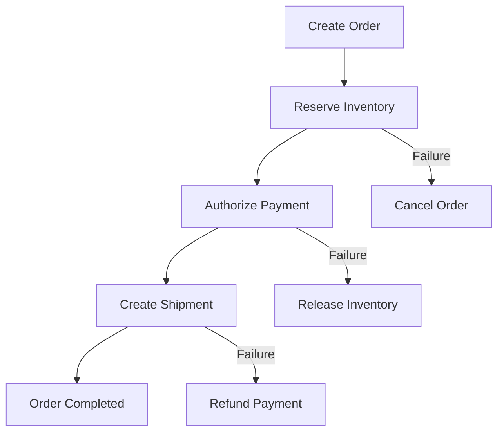
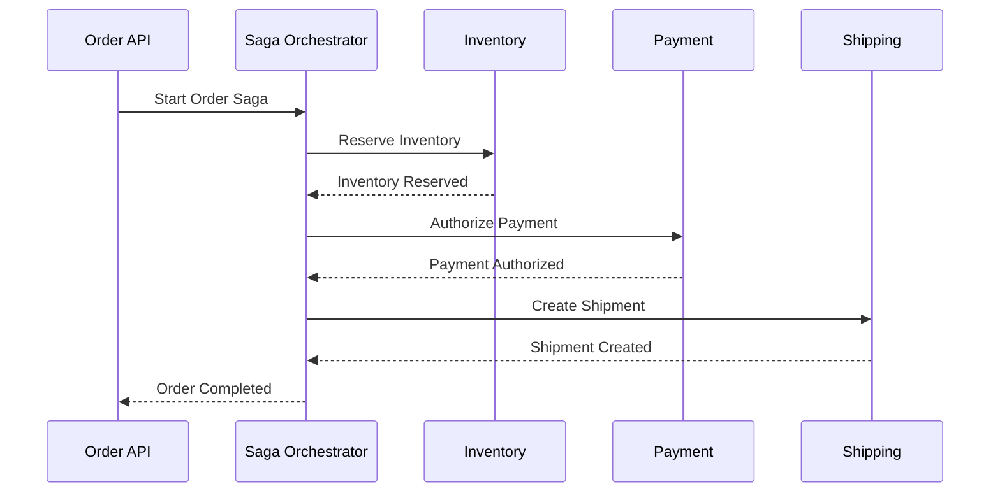
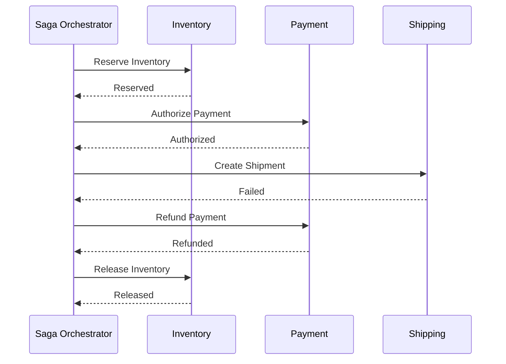
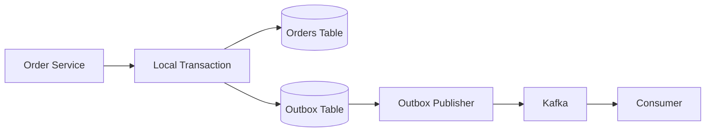

# 13- Saga Pattern

## Overview

The **Saga Pattern** is a distributed transaction pattern for coordinating business operations across multiple services without requiring a single ACID transaction spanning all services.

A Saga decomposes a distributed business transaction into a sequence of **local transactions**. Each local transaction commits independently within its owning service. If a later operation fails, previously completed operations are reversed or mitigated through **compensating transactions**.

A typical workflow looks like:

```text
Create Order
     |
     v
Reserve Inventory
     |
     v
Authorize Payment
     |
     v
Create Shipment
     |
     v
Confirm Order
```

If payment fails:

```text
Create Order        → committed
Reserve Inventory   → committed
Authorize Payment   → failed
                           |
                           v
                  Release Inventory
                           |
                           v
                     Cancel Order
```

The Saga does **not** provide the same atomicity semantics as a database transaction or Two-Phase Commit (2PC).

Instead, it provides a mechanism for achieving **business-level consistency through independent transactions and compensation**.

This makes Saga particularly useful in microservice architectures where:

- Each service owns its own database.
- Services communicate through APIs or events.
- Long-running workflows are common.
- Eventual consistency is acceptable.
- Global database transactions are undesirable.
- Business operations can be compensated.

---

## The Problem Saga Solves

Consider an e-commerce system:

```text
Order Service
      |
      v
Inventory Service
      |
      v
Payment Service
      |
      v
Shipping Service
```

Each service owns its own database:

```text
Order Service       → PostgreSQL A
Inventory Service   → PostgreSQL B
Payment Service     → PostgreSQL C
Shipping Service    → PostgreSQL D
```

A traditional database transaction cannot span all four databases without introducing distributed transaction coordination.

A naïve implementation might attempt:

```text
BEGIN
    Create Order
    Reserve Inventory
    Charge Payment
    Create Shipment
COMMIT
```

This does not work naturally across independently owned services.

Suppose:

```text
Create Order       → success
Reserve Inventory  → success
Charge Payment     → success
Create Shipment    → failure
```

The first three operations have already committed.

There is no single database rollback that can automatically undo everything.

The Saga pattern addresses this by explicitly defining what should happen when later steps fail.

---

## Core Idea

A Saga represents a distributed workflow as:

```text
T1 → T2 → T3 → T4
```

where:

- `T1` is a local transaction.
- `T2` is a local transaction.
- `T3` is a local transaction.
- `T4` is a local transaction.

Each transaction commits independently.

If `T3` fails:

```text
T1 → T2 → T3 FAILED
```

the system executes compensating operations:

```text
T2 compensation
      |
      v
T1 compensation
```

Conceptually:

```text
Forward:

T1 → T2 → T3 → T4

Failure at T3:

T1 → T2 → X
          |
          v
         C2
          |
          v
         C1
```

Where:

```text
C1 = compensation for T1
C2 = compensation for T2
```

---

## Saga vs Traditional Transaction

A local database transaction provides:

```text
BEGIN
    |
    +-- operation A
    +-- operation B
    |
COMMIT / ROLLBACK
```

A Saga provides:

```text
Local Transaction A
       |
       v
Local Transaction B
       |
       v
Local Transaction C
       |
       X failure
       |
       v
Compensate B
       |
       v
Compensate A
```

The key distinction is:

> A database rollback restores transactional state. A Saga executes new business operations to compensate for previously committed operations.

---

## Saga Does Not Mean Rollback

This distinction is fundamental.

Suppose:

```text
Charge Payment
```

succeeds.

Later:

```text
Create Shipment
```

fails.

The Saga cannot perform:

```text
ROLLBACK payment transaction
```

because the payment transaction has already committed.

Instead, it may execute:

```text
Refund Payment
```

Therefore:

```text
Rollback ≠ Compensation
```

A refund is a new business operation with its own transaction, failure modes, audit trail, and potentially asynchronous processing.

---

## Saga Architecture

A Saga typically contains:

```text
              Saga Workflow
                    |
        +-----------+-----------+
        |                       |
        v                       v
 Local Transaction        Local Transaction
    Service A                Service B
        |                       |
        v                       v
      DB A                    DB B
```

There are two primary implementation styles:

- **Saga Orchestration**
- **Saga Choreography**

---

## Orchestration

In an orchestration-based Saga, a central **Saga orchestrator** controls the workflow.

```text
                Saga Orchestrator
                 /      |       \
                v       v        v
             Order  Inventory  Payment
```

The orchestrator decides:

- Which operation runs next
- What state the Saga is currently in
- Which operation should be retried
- What compensation should execute
- When the Saga has completed
- When manual intervention is required

---

## Orchestration Flow

For an order workflow:

```text
              Orchestrator
                   |
                   v
             Create Order
                   |
                   v
          Reserve Inventory
                   |
                   v
           Authorize Payment
                   |
                   v
           Create Shipment
                   |
                   v
             Confirm Order
```

If payment fails:

```text
              Orchestrator
                   |
                   v
           Authorize Payment
                   |
                   X
                   |
                   v
          Release Inventory
                   |
                   v
             Cancel Order
```

---

## Orchestration Sequence Diagram



Failure path:



---

## Advantages of Orchestration

Orchestration provides a central place for workflow logic.

Advantages include:

- Clear workflow definition
- Centralized state management
- Easier debugging
- Explicit compensation logic
- Centralized retry policies
- Easier operational visibility
- Better support for complex workflows

For complex business workflows, this can be a major advantage.

For example:

```text
Order
  |
  +-- Inventory
  |
  +-- Payment
  |
  +-- Fraud Check
  |
  +-- Shipping
  |
  +-- Notification
  |
  +-- Loyalty
```

Managing this workflow through scattered event handlers can become difficult.

An orchestrator can make the workflow explicit.

---

## Disadvantages of Orchestration

The orchestrator becomes responsible for significant workflow logic.

Potential problems include:

- Centralized coupling
- More complex orchestrator implementation
- Orchestrator availability requirements
- Risk of creating a distributed monolith
- Tight coupling to service APIs

The orchestrator should coordinate **business operations**, not directly manipulate service databases.

Bad:

```text
Saga Orchestrator
      |
      +---- UPDATE payment_db
      +---- UPDATE inventory_db
```

Better:

```text
Saga Orchestrator
      |
      +---- Payment Service API
      |
      +---- Inventory Service API
```

---

## Choreography

In choreography-based Sagas, there is no central orchestrator.

Services react to events and emit new events.

For example:

```text
OrderCreated
     |
     v
Inventory Service
     |
     v
InventoryReserved
     |
     v
Payment Service
     |
     v
PaymentAuthorized
     |
     v
Shipping Service
```

Each service determines what to do based on events it receives.

---

## Choreography Flow



Failure example:

```text
OrderCreated
     |
     v
InventoryReserved
     |
     v
PaymentFailed
     |
     v
InventoryReleaseRequested
     |
     v
InventoryReleased
```

---

## Choreography with Kafka

Kafka is commonly used as the event transport for choreography.

Conceptually:

```text
Order Service
     |
     v
Kafka
     |
     +---- inventory topic
     |
     +---- payment topic
     |
     +---- shipping topic
```

A typical workflow might be:

```text
orders.created
        |
        v
Inventory Consumer
        |
        v
inventory.reserved
        |
        v
Payment Consumer
        |
        v
payments.authorized
```

Kafka provides durable event delivery, partitioning, consumer groups, replay, and ordering within a partition, but the application remains responsible for Saga semantics.

Kafka itself does not turn the entire workflow into one atomic transaction.

---

## Advantages of Choreography

Choreography can provide:

- Loose service coupling
- Natural event-driven architecture
- Independent service ownership
- Good scalability
- No central workflow coordinator

It works particularly well when:

- Events naturally represent business facts.
- Workflows are relatively simple.
- Services can independently react to events.
- Event-driven architecture is already established.

---

## Disadvantages of Choreography

The main risk is workflow complexity.

Consider:

```text
OrderCreated
   |
   +--> Inventory
   |       |
   |       +--> InventoryReserved
   |
   +--> Fraud
   |       |
   |       +--> FraudApproved
   |
   +--> Notification
           |
           +--> EmailSent
```

As the number of events grows, it becomes harder to determine:

- Which event triggers what
- Which service owns the next step
- What happens after failure
- Which compensation should execute
- Whether an event is still consumed
- Where the business workflow currently is

This can lead to an implicit distributed workflow that is difficult to operate.

---

## Orchestration vs Choreography

| Property | Orchestration | Choreography |
|---|---|---|
| Central coordinator | Yes | No |
| Workflow visibility | High | Distributed |
| State management | Centralized | Distributed |
| Communication | Commands/APIs/events | Primarily events |
| Debugging | Usually easier | More difficult at scale |
| Complex workflows | Strong fit | Can become difficult |
| Coupling | Orchestrator-to-services | Event contracts |
| Scalability | High | High |
| Operational complexity | Moderate | Can become high |
| Event-driven architecture | Optional | Core |
| Compensation | Centralized | Distributed |

A useful engineering rule is:

> Use orchestration when the workflow itself is complex. Use choreography when services can react independently to business events without creating a difficult-to-understand event graph.

---

## Local Transactions Inside a Saga

Every Saga step should normally be a local transaction.

For example:

```text
Inventory Service

BEGIN
    create reservation
    decrement available inventory
COMMIT
```

Then the service publishes:

```text
InventoryReserved
```

The important boundary is:

```text
Local transaction
       |
       v
Durable state
       |
       v
Event / next command
```

The Saga should not depend on a single global database transaction.

---

## Transactional Outbox

A common problem occurs when a service updates its database and publishes an event separately.

Bad:

```text
BEGIN
Update inventory
COMMIT

Publish InventoryReserved
```

If the database commits and Kafka publication fails:

```text
Inventory DB → updated
Kafka → event missing
```

The Saga can become stuck.

The **transactional outbox pattern** solves this by storing the event in the same local database transaction.

```text
BEGIN

UPDATE inventory

INSERT outbox_event

COMMIT
```

A publisher then sends the outbox event to Kafka.

```text
PostgreSQL
    |
    +-- inventory
    |
    +-- outbox_events
             |
             v
       Event Publisher
             |
             v
           Kafka
```

This provides reliable propagation of committed business changes.

---

## Outbox Example

A simplified table:

```sql
CREATE TABLE outbox_events (
    id UUID PRIMARY KEY,
    aggregate_type VARCHAR(100) NOT NULL,
    aggregate_id UUID NOT NULL,
    event_type VARCHAR(100) NOT NULL,
    payload JSONB NOT NULL,
    created_at TIMESTAMPTZ NOT NULL DEFAULT NOW(),
    published_at TIMESTAMPTZ
);
```

A local transaction can then do:

```sql
BEGIN;

UPDATE inventory
SET available = available - 1
WHERE product_id = '...'
  AND available > 0;

INSERT INTO outbox_events (
    id,
    aggregate_type,
    aggregate_id,
    event_type,
    payload
)
VALUES (
    '...',
    'inventory',
    '...',
    'InventoryReserved',
    '{"quantity": 1}'
);

COMMIT;
```

The event publisher can retry publication independently.

---

## Compensation

Compensation is the heart of a Saga.

Suppose the forward workflow is:

```text
T1: Create Order
T2: Reserve Inventory
T3: Authorize Payment
T4: Create Shipment
```

The compensation workflow might be:

```text
C3: Void Payment Authorization
C2: Release Inventory
C1: Cancel Order
```

The relationship is:

| Forward Operation | Possible Compensation |
|---|---|
| Create order | Cancel order |
| Reserve inventory | Release inventory |
| Authorize payment | Void authorization |
| Capture payment | Refund payment |
| Create shipment | Cancel shipment |
| Allocate resource | Release resource |

Compensation must be explicitly designed for each business operation.

---

## Compensation Is Not Always a Perfect Inverse

A common mistake is assuming:

```text
Forward operation
+
Inverse operation
=
Original state
```

This is often false.

For example:

```text
Charge payment
```

followed by:

```text
Refund payment
```

does not necessarily produce exactly the same external state.

There may be:

- Payment processor fees
- Settlement delays
- Audit records
- Customer notifications
- Accounting entries

Therefore, compensation should be treated as a business process rather than a mathematical inverse.

---

## Compensation Can Fail

Compensation is itself a distributed operation.

Example:

```text
Reserve Inventory → success
Payment → failure
Release Inventory → failure
```

The system is now in an intermediate state.

A robust Saga must support:

```text
COMPENSATING
     |
     v
Retry compensation
     |
     v
COMPENSATED
```

or:

```text
COMPENSATING
     |
     X
     |
     v
MANUAL_INTERVENTION
```

Compensation should therefore be:

- Idempotent
- Retryable
- Observable
- Persisted
- Auditable

---

## Idempotency

Saga operations must generally tolerate retries.

Consider:

```text
Reserve Inventory
```

The request succeeds, but the response is lost:

```text
Inventory → reserved
Response → lost
```

The orchestrator retries:

```text
Reserve Inventory
```

Without idempotency, inventory might be reserved twice.

Use a stable idempotency key:

```text
saga_id + step_id
```

For example:

```text
saga-98231:reserve-inventory
```

The inventory service can persist the operation result.

```python
def reserve_inventory(command):
    key = command.idempotency_key

    existing = find_processed_command(key)
    if existing:
        return existing.result

    result = perform_reservation(command)

    store_command_result(
        key=key,
        result=result,
    )

    return result
```

A production implementation must make the processing and idempotency record concurrency-safe.

---

## At-Least-Once Delivery

Many distributed event systems operate with at-least-once delivery.

That means:

```text
Event
  |
  v
Consumer
  |
  X response lost
  |
  v
Event delivered again
```

The consumer may see:

```text
InventoryReserved
InventoryReserved
```

Therefore:

> Saga consumers should be designed to be idempotent.

Common approaches include:

- Event IDs
- Idempotency keys
- Processed-event tables
- Unique constraints
- Version checks
- Conditional updates

---

## Saga State

A production Saga should have durable state.

For example:

```text
saga_id
workflow_type
aggregate_id
state
current_step
attempt_count
created_at
updated_at
last_error
```

Example:

| State | Meaning |
|---|---|
| `PENDING` | Saga created |
| `ORDER_CREATED` | Order transaction completed |
| `INVENTORY_RESERVED` | Inventory reserved |
| `PAYMENT_AUTHORIZED` | Payment authorized |
| `SHIPMENT_CREATED` | Shipment created |
| `COMPLETED` | Saga completed |
| `COMPENSATING` | Compensation executing |
| `COMPENSATED` | Compensation completed |
| `FAILED` | Saga requires investigation |

Do not keep critical Saga state only in application memory.

---

## State Machine

A Saga is naturally represented as a state machine.



Explicit states make recovery and operational inspection much easier.

---

## Valid State Transitions

Do not allow arbitrary transitions.

For example:

```text
PENDING
   |
   v
ORDER_CREATED
   |
   v
INVENTORY_RESERVED
```

It should not be possible for an unrelated process to directly transition:

```text
PENDING → COMPLETED
```

without completing the required business steps.

State transition validation should be enforced in the application and, where appropriate, through database constraints.

---

## Optimistic Concurrency

Multiple workers may attempt to update the same Saga.

For example:

```text
Worker A → state = PAYMENT_PROCESSING
Worker B → state = PAYMENT_PROCESSING
```

Without concurrency control, both could trigger the next operation.

Use techniques such as:

- Version numbers
- Optimistic locking
- Row-level locking
- Unique constraints
- Conditional updates

For example:

```sql
UPDATE saga_instances
SET state = 'PAYMENT_AUTHORIZED',
    version = version + 1
WHERE saga_id = '...'
  AND state = 'PAYMENT_PROCESSING'
  AND version = 7;
```

If zero rows are updated, another worker may have already advanced the Saga.

---

## Retry Strategy

Transient failures should generally be retried.

Typical failures include:

- Network timeout
- Temporary database failure
- Service overload
- Connection reset
- Kafka broker unavailability

Use:

```text
Bounded retries
+
Exponential backoff
+
Jitter
```

Example:

```text
Attempt 1 → 200 ms
Attempt 2 → 500 ms
Attempt 3 → 1.2 s
Attempt 4 → 3 s
```

Do not retry permanent business failures indefinitely.

For example:

```text
Insufficient funds
```

is generally not a transient infrastructure failure.

---

## Retry Storms

Retries can make an incident worse.

Consider:

```text
Payment Service
      X
      |
      v
100 requests fail
      |
      v
100 requests retry
      |
      v
Payment Service overloaded
      |
      v
More requests fail
```

Use:

- Exponential backoff
- Jitter
- Retry limits
- Circuit breakers
- Rate limiting
- Queue-based processing

The objective is to prevent the Saga infrastructure from amplifying downstream failures.

---

## Timeouts

Every Saga step should have an explicit timeout.

For example:

```text
PAYMENT_PROCESSING
       |
       v
timeout
       |
       +---- SUCCESS → continue
       |
       +---- FAILED → compensate
       |
       +---- UNKNOWN → reconcile
```

Do not automatically treat every timeout as failure.

For external systems:

```text
request sent
    |
    v
provider processes request
    |
    X response lost
```

The actual operation may have succeeded.

The correct response may be to query the provider's status.

---

## Unknown State

Distributed systems frequently produce an **unknown result**.

For example:

```text
Payment request
      |
      v
Timeout
      |
      v
Payment status = UNKNOWN
```

This should be modeled explicitly.

Possible states:

```text
PAYMENT_PENDING
PAYMENT_AUTHORIZED
PAYMENT_FAILED
PAYMENT_UNKNOWN
```

A reconciliation worker can later resolve the state.

```text
Reconciliation Worker
        |
        v
Payment Provider
        |
        v
Actual Status
```

This is particularly important for payments and other externally observable operations.

---

## Reconciliation

A reconciliation process periodically searches for workflows that are stuck or ambiguous.

For example:

```text
SELECT *
FROM saga_instances
WHERE state = 'PAYMENT_UNKNOWN'
  AND updated_at < NOW() - INTERVAL '5 minutes';
```

The worker can:

1. Query the external system.
2. Determine the actual state.
3. Update the Saga.
4. Continue or compensate the workflow.

Reconciliation should be considered a normal part of the architecture, not merely an emergency feature.

---

## Dead Letter Queues

Event-driven Sagas should have a strategy for permanently failing messages.

For example:

```text
Kafka
  |
  v
Consumer
  |
  +---- retry
  |
  +---- retry
  |
  +---- retry
  |
  v
Dead Letter Queue
```

DLQs allow operators to inspect messages that could not be processed.

Useful metadata includes:

```text
event_id
saga_id
aggregate_id
event_type
error
retry_count
timestamp
```

DLQs should be monitored.

A DLQ that silently grows represents unresolved business workflows.

---

## Ordering

Saga correctness may depend on event ordering.

For example:

```text
InventoryReserved
InventoryReleased
```

should not be processed in the reverse order:

```text
InventoryReleased
InventoryReserved
```

Kafka provides ordering within a partition.

Therefore, partitioning strategy matters.

For example:

```text
partition_key = order_id
```

can keep events for the same order on the same partition.

However, ordering guarantees must still be designed at the application level.

Consumers should tolerate:

- Duplicate events
- Delayed events
- Retries
- Replays
- Unexpected ordering where applicable

---

## Event Versioning

Saga workflows can live for a long time.

A message published today may be processed after a deployment tomorrow.

Therefore, event schemas should be versioned carefully.

Example:

```json
{
  "event_type": "InventoryReserved",
  "version": 2,
  "event_id": "evt-123",
  "saga_id": "saga-456",
  "order_id": "order-789"
}
```

Avoid breaking existing consumers when changing event contracts.

Prefer:

- Backward-compatible fields
- Explicit versions where necessary
- Schema validation
- Consumer contract testing

---

## Python Implementation Considerations

A Python service might model Saga state using an enum:

```python
from enum import StrEnum


class OrderSagaState(StrEnum):
    PENDING = "PENDING"
    ORDER_CREATED = "ORDER_CREATED"
    INVENTORY_RESERVED = "INVENTORY_RESERVED"
    PAYMENT_AUTHORIZED = "PAYMENT_AUTHORIZED"
    SHIPMENT_CREATED = "SHIPMENT_CREATED"
    COMPLETED = "COMPLETED"
    COMPENSATING = "COMPENSATING"
    COMPENSATED = "COMPENSATED"
    FAILED = "FAILED"
```

The workflow should persist this state in PostgreSQL rather than relying on an in-memory object.

A worker such as Celery can process asynchronous Saga steps:

```text
API
 |
 v
PostgreSQL
 |
 v
Celery
 |
 +---- Inventory Service
 |
 +---- Payment Service
 |
 +---- Shipping Service
```

Kafka can be used when event-driven choreography is more appropriate.

---

## Django and FastAPI Integration

Saga orchestration is not tied to a specific framework.

A Django or FastAPI service can implement a Saga using:

- PostgreSQL for durable workflow state
- Celery for background execution
- Redis as a task broker or supporting cache
- Kafka for event-driven workflows
- REST or gRPC for synchronous commands

For example:

```text
FastAPI
   |
   v
Saga State Repository
   |
   v
PostgreSQL
   |
   v
Celery Worker
   |
   +---- REST → Inventory
   |
   +---- gRPC → Payment
   |
   +---- Kafka → Shipping Events
```

The important architectural boundary is the workflow semantics, not the Python framework.

---

## Saga and Celery

Celery can be useful for asynchronous Saga execution.

For example:

```python
from celery import chain

workflow = chain(
    create_order.s(order_id),
    reserve_inventory.s(),
    authorize_payment.s(),
    create_shipment.s(),
)

workflow.delay()
```

However, Celery's task chaining alone does not provide complete Saga semantics.

Production workflows still require:

- Durable Saga state
- Idempotency
- Compensation
- Retry policy
- Failure state
- Observability
- Reconciliation

A task queue is an execution mechanism, not a distributed transaction protocol.

---

## Saga and Kafka

Kafka is particularly useful for choreography.

Example:

```text
Order Service
    |
    v
orders.created
    |
    v
Kafka
    |
    v
Inventory Service
    |
    v
inventory.reserved
    |
    v
Kafka
    |
    v
Payment Service
```

Kafka provides transport and persistence for events.

The Saga implementation remains responsible for:

- Business state
- Compensation
- Idempotency
- Workflow completion
- Failure recovery

---

## API Design for Saga Steps

Saga commands should be explicit.

For example:

```http
POST /inventory/reservations
Idempotency-Key: saga-123:inventory-reserve
```

Response:

```json
{
  "reservation_id": "res-123",
  "status": "RESERVED"
}
```

Compensation:

```http
POST /inventory/reservations/res-123/release
Idempotency-Key: saga-123:inventory-release
```

This makes forward and compensating actions explicit.

Avoid exposing internal database operations such as:

```text
DELETE inventory_reservation
```

The service should own the business semantics of the operation.

---

## Business Invariants

A Saga should be designed around explicit business invariants.

For an order system:

```text
An order cannot be CONFIRMED unless:
    inventory is reserved
    AND payment is authorized
    AND shipment is created
```

These invariants determine the Saga state machine.

For example:

```text
CONFIRMED
   requires:
      Inventory = RESERVED
      Payment = AUTHORIZED
      Shipment = CREATED
```

The workflow should be designed around business guarantees rather than merely technical service calls.

---

## Long-Running Sagas

One advantage of Saga over traditional transactions is that a Saga can span a much longer period.

Example:

```text
Order
  |
  v
Fraud review
  |
  v
Payment
  |
  v
Warehouse allocation
  |
  v
Shipment
```

Some steps may take minutes or hours.

Holding database locks for that entire duration would be unacceptable.

Saga allows:

```text
Local transaction
      |
      v
Commit
      |
      v
Wait
      |
      v
Next local transaction
```

This is one of the primary reasons Saga is useful for business workflows.

---

## Human Interaction

A Saga can also model workflows involving human approval.

For example:

```text
Order Created
      |
      v
Fraud Review
      |
      v
Manual Approval
      |
      v
Payment
      |
      v
Shipment
```

A traditional database transaction cannot reasonably remain open while waiting for a human.

A Saga can persist:

```text
WAITING_FOR_APPROVAL
```

and resume later.

---

## Partial Failure

Partial failure is the defining challenge of distributed workflows.

Example:

```text
Order Created          ✓
Inventory Reserved     ✓
Payment Authorized     ✓
Shipment Creation      X
```

The system should not assume:

```text
everything failed
```

Instead, it should determine:

```text
What has actually committed?
What remains pending?
What can be compensated?
What requires reconciliation?
```

This is why durable state and explicit transitions are critical.

---

## Monitoring

A production Saga implementation should expose metrics such as:

| Metric | Purpose |
|---|---|
| Active Sagas | Current workflow load |
| Completed Sagas | Successful workflows |
| Failed Sagas | Business/infrastructure failures |
| Compensation rate | Frequency of rollback workflows |
| Compensation failures | Unresolved workflows |
| Step latency | Identify slow services |
| Retry count | Detect instability |
| Stuck Sagas | Detect workflows requiring intervention |
| Outbox backlog | Detect publishing problems |
| DLQ size | Detect persistent processing failures |
| Reconciliation backlog | Detect unresolved external state |

Monitor both technical and business-level metrics.

---

## Distributed Tracing

Every Saga should have a correlation identifier.

For example:

```text
saga_id = saga-7f81
order_id = order-123
trace_id = trace-456
```

Propagate these identifiers across:

```text
HTTP headers
gRPC metadata
Kafka headers
Logs
Database workflow state
```

A trace should allow engineers to follow:

```text
Create Order
    |
    +--> Reserve Inventory
    |
    +--> Authorize Payment
    |
    +--> Create Shipment
```

This significantly reduces debugging time.

---

## Security Considerations

Saga infrastructure can perform high-impact business operations.

Examples:

- Charge payment
- Refund payment
- Reserve inventory
- Release inventory
- Cancel orders
- Create shipments

Protect these operations with:

- Authentication
- Authorization
- TLS
- Service-to-service identity
- Least-privilege access
- Audit logging
- Idempotency
- Input validation

Never allow an untrusted caller to arbitrarily invoke compensation operations.

For example:

```text
POST /payments/refund
```

must not be sufficient to refund an arbitrary transaction without authorization and validation.

---

## High Availability

The Saga orchestrator must not become a single point of failure.

Possible approaches include:

```text
                    Load Balancer
                         |
              +----------+----------+
              |                     |
              v                     v
        Orchestrator A        Orchestrator B
              |                     |
              +----------+----------+
                         |
                         v
                    PostgreSQL
```

The workflow state must be durable and concurrency-safe.

Multiple workers can process workflows as long as they use proper locking or leasing.

---

## Leader Election and Work Leases

For multiple Saga workers, a work item can use a lease:

```text
Saga = PENDING
   |
   v
Worker A claims lease
   |
   v
PROCESSING
```

If Worker A crashes:

```text
lease expires
     |
     v
Worker B claims Saga
```

This avoids permanently stuck workflows.

The exact implementation may use:

- Database row locking
- Lease timestamps
- Advisory locks
- Distributed coordination systems

---

## Disaster Recovery

Saga state should survive application crashes and infrastructure failures.

For critical workflows:

```text
Saga State
    |
    v
PostgreSQL
    |
    +-- backups
    +-- replication
    +-- point-in-time recovery
```

Recovery procedures should answer:

- Which Sagas were running?
- Which steps completed?
- Which events were published?
- Which compensations remain?
- Which external operations are unknown?
- Which workflows require reconciliation?

A restored application should be able to resume from durable state.

---

## Cost Considerations

Saga architecture introduces infrastructure and operational costs:

- Kafka or message broker infrastructure
- Worker processes
- Outbox storage
- Workflow state storage
- Monitoring
- Distributed tracing
- DLQ management
- Reconciliation workers

However, avoiding global transactions can improve:

- Service independence
- Scalability
- Failure isolation
- Deployment independence

The right comparison is not simply:

```text
Saga costs more infrastructure
```

but:

```text
Saga operational complexity
vs
global transaction coupling and availability cost
```

---

## Saga vs 2PC

| Concern | Saga | 2PC |
|---|---|---|
| Global atomic commit | No | Yes |
| Local transactions | Yes | Yes |
| Compensation | Required | Usually not business-level compensation |
| Blocking | Generally avoided | Possible |
| Long-running workflows | Good fit | Poor fit |
| External APIs | Good fit | Generally unsuitable |
| Eventual consistency | Expected | Not the primary model |
| Availability | Generally better | Can be reduced |
| Complexity | Business workflow complexity | Protocol/coordination complexity |
| Microservices | Common fit | Often undesirable |
| Failure handling | Application-defined | Protocol-defined |

A useful architectural distinction is:

```text
2PC:
"Make these transactions commit together."

Saga:
"Make this business process reach a valid outcome despite partial failure."
```

---

## Saga vs Simple Async Processing

Not every asynchronous workflow is a Saga.

For example:

```text
Order Created
    |
    v
Send Email
```

If email fails and nothing needs to be compensated, this may simply be asynchronous processing.

A Saga is more appropriate when:

```text
Step A changes business state
        |
        v
Step B changes business state
        |
        X failure
        |
        v
Step A requires compensation
```

The presence of compensating business actions is a strong indicator that Saga semantics are relevant.

---

## Common Mistakes

### Treating Saga as Distributed Rollback

A Saga does not magically roll back already committed transactions.

It executes compensation.

### Making Compensation Non-Idempotent

If compensation is retried:

```text
Release Inventory
Release Inventory
```

the second request must not corrupt state.

### Keeping Saga State in Memory

A process crash should not destroy workflow state.

Persist it.

### Ignoring Compensation Failure

Compensation can fail just like the original operation.

Build retries, reconciliation, and manual recovery.

### Treating Every Timeout as Failure

An operation may have succeeded even when its response was lost.

Use status queries and reconciliation where necessary.

### Publishing Events Outside the Local Transaction

This creates the database/event dual-write problem.

Use a transactional outbox where appropriate.

### Creating an Event Dependency Graph Nobody Understands

Excessive choreography can become an implicit distributed monolith.

Use orchestration when workflow complexity becomes difficult to reason about.

### Allowing Direct Database Access Across Services

The Saga should communicate through service contracts.

Do not let the orchestrator manipulate another service's database directly.

### Unbounded Retries

Infinite retries can create retry storms and prevent workflows from reaching an observable terminal state.

### Ignoring Event Ordering

If ordering matters, explicitly design partitioning, versioning, and consumer behavior.

---

## Interview Traps

### Is Saga Strongly Consistent?

Not in the traditional ACID sense.

A Saga normally provides eventual business consistency through independent transactions and compensation.

### Does Saga Guarantee Atomicity?

No.

The workflow can temporarily exist in intermediate states.

### Is Saga Better Than 2PC?

Neither is universally better.

Saga is generally better suited to long-running business workflows and microservices where eventual consistency is acceptable.

2PC is appropriate when true atomic commit across compatible transactional participants is required.

### Can Compensation Always Restore the Original State?

No.

Some operations cannot be perfectly reversed.

A refund, for example, is a new business operation rather than a database rollback.

### Is Kafka a Saga?

No.

Kafka is a messaging/event-streaming platform.

It can be used to implement Saga choreography, but it does not provide Saga semantics by itself.

### Is Celery a Saga?

No.

Celery provides asynchronous task execution.

Saga semantics still require state management, compensation, idempotency, recovery, and workflow coordination.

---

## Production Design Checklist

Before implementing a Saga, answer:

- What is the business transaction?
- Which services participate?
- What local transaction does each service own?
- What is the Saga's state machine?
- Which step executes first?
- What happens if each step fails?
- What is the compensation for every committed step?
- Can each command be retried safely?
- What is the idempotency strategy?
- How is Saga state persisted?
- How are events published reliably?
- Is an outbox required?
- How are duplicate events handled?
- Does event ordering matter?
- What happens after a timeout?
- How are unknown external states resolved?
- How are stuck Sagas detected?
- How does reconciliation work?
- How are failed compensations handled?
- How can operators manually recover a Saga?
- How are workflow versions managed?
- How is the Saga traced across services?
- What happens during disaster recovery?

If these questions have no clear answers, the workflow is not production-ready.

---

## Practical Architecture

A production-oriented Python microservice architecture could look like:

```text
                         API Gateway
                             |
                             v
                       Order Service
                             |
                    +--------+--------+
                    |                 |
                    v                 v
              PostgreSQL         Saga State
                    |                 |
                    +--------+--------+
                             |
                             v
                      Outbox Publisher
                             |
                             v
                           Kafka
                       /      |      \
                      /       |       \
                     v        v        v
              Inventory    Payment   Shipping
                Service     Service    Service
                   |           |          |
                   v           v          v
                DB A         DB B       DB C
```

Possible responsibilities:

```text
Order Service
    → Own order state

Inventory Service
    → Own reservations

Payment Service
    → Own payment state

Shipping Service
    → Own shipment state

Saga Orchestrator
    → Own workflow state
    → Coordinate transitions
    → Trigger compensation
    → Retry failed steps
    → Detect stuck workflows
```

This architecture preserves service ownership while providing explicit workflow coordination.

---

## Design Principles

A robust Saga implementation should follow several principles.

### Keep Local Transactions Small

Each service should perform its local transaction quickly.

### Persist Workflow State

Critical workflow state must survive process failure.

### Make Commands Idempotent

Retries are inevitable in distributed systems.

### Make Compensation Explicit

Every state-changing step should have a defined failure strategy.

### Prefer Durable Messaging

Use reliable event delivery mechanisms such as transactional outbox plus Kafka when appropriate.

### Treat Unknown States Explicitly

Do not turn uncertainty into false failure.

### Build Reconciliation

Some failures cannot be resolved synchronously.

### Make Recovery Operationally Safe

Operators should be able to inspect and resume workflows without directly corrupting service data.

### Monitor Business Outcomes

Track:

```text
Completed
Failed
Compensated
Stuck
Unknown
```

not only HTTP status codes and infrastructure metrics.

---

## Key Takeaways

- A Saga coordinates a distributed business workflow through independent local transactions rather than one global ACID transaction.
- Compensation is a new business operation, not a database rollback, and every compensation must be designed to handle retries and failure.
- Use orchestration for complex workflows that benefit from explicit state and centralized coordination; use choreography when independent event-driven reactions remain understandable.
- Production Sagas require durable workflow state, idempotency, transactional outbox patterns, bounded retries, reconciliation, observability, and safe recovery.
- Saga is usually a better fit than 2PC for long-running microservice workflows where eventual consistency and business-level compensation are acceptable.
```
```

ensating`| Compensation workflow executing | |`COMPENSATED`| Compensation completed | |`FAILED` | Saga requires investigation |

Do not keep critical Saga state only in application memory.

---

## State Machine

A Saga is naturally represented as a state machine.

```
Mermaid
```

Explicit states make recovery and operational inspection much easier.

---

## Valid State Transitions

Do not allow arbitrary transitions.

For example:

```
```
PENDING
   |
   v
ORDER_CREATED
   |
   v
INVENTORY_RESERVED
```
```

It should not be possible for an unrelated process to directly transition:

```
```
PENDING → COMPLETED
```
```

without completing the required business steps.

State transition validation should be enforced in the application and, where appropriate, through database constraints.

---

## Optimistic Concurrency

Multiple workers may attempt to update the same Saga.

For example:

```
```
Worker A → state = PAYMENT_PROCESSING
Worker B → state = PAYMENT_PROCESSING
```
```

Without concurrency control, both could trigger the next operation.

Use techniques such as:

* Version numbers
* Optimistic locking
* Row-level locking
* Unique constraints
* Conditional updates

For example:

```
SQL


```
UPDATE saga_instances
SET state = 'PAYMENT_AUTHORIZED',
    version = version + 1
WHERE saga_id = '...'
  AND state = 'PAYMENT_PROCESSING'
  AND version = 7;
```
```

If zero rows are updated, another worker may have already advanced the Saga.

---

## Retry Strategy

Transient failures should generally be retried.

Typical failures include:

* Network timeout
* Temporary database failure
* Service overload
* Connection reset
* Kafka broker unavailability

Use:

```
```
Bounded retries
+
Exponential backoff
+
Jitter
```
```

Example:

```
```
Attempt 1 → 200 ms
Attempt 2 → 500 ms
Attempt 3 → 1.2 s
Attempt 4 → 3 s
```
```

Do not retry permanent business failures indefinitely.

For example:

```
```
Insufficient funds
```
```

is generally not a transient infrastructure failure.

---

## Retry Storms

Retries can make an incident worse.

Consider:

```
```
Payment Service
      X
      |
      v
100 requests fail
      |
      v
100 requests retry
      |
      v
Payment Service overloaded
      |
      v
More requests fail
```
```

Use:

* Exponential backoff
* Jitter
* Retry limits
* Circuit breakers
* Rate limiting
* Queue-based processing

The objective is to prevent the Saga infrastructure from amplifying downstream failures.

---

## Timeouts

Every Saga step should have an explicit timeout.

For example:

```
```
PAYMENT_PROCESSING
       |
       v
timeout
       |
       +---- SUCCESS → continue
       |
       +---- FAILED → compensate
       |
       +---- UNKNOWN → reconcile
```
```

Do not automatically treat every timeout as failure.

For external systems:

```
```
request sent
    |
    v
provider processes request
    |
    X response lost
```
```

The actual operation may have succeeded.

The correct response may be to query the provider's status.

---

## Unknown State

Distributed systems frequently produce an **unknown result**.

For example:

```
```
Payment request
      |
      v
Timeout
      |
      v
Payment status = UNKNOWN
```
```

This should be modeled explicitly.

Possible states:

```
```
PAYMENT_PENDING
PAYMENT_AUTHORIZED
PAYMENT_FAILED
PAYMENT_UNKNOWN
```
```

A reconciliation worker can later resolve the state.

```
```
Reconciliation Worker
        |
        v
Payment Provider
        |
        v
Actual Status
```
```

This is particularly important for payments and other externally observable operations.

---

## Reconciliation

A reconciliation process periodically searches for workflows that are stuck or ambiguous.

For example:

```
SQL


```
SELECT *
FROM saga_instances
WHERE state = 'PAYMENT_UNKNOWN'
  AND updated_at < NOW() - INTERVAL '5 minutes';
```
```

The worker can:

1. Query the external system.
2. Determine the actual state.
3. Update the Saga.
4. Continue or compensate the workflow.

Reconciliation should be considered a normal part of the architecture, not merely an emergency feature.

---

## Dead Letter Queues

Event-driven Sagas should have a strategy for permanently failing messages.

For example:

```
```
Kafka
  |
  v
Consumer
  |
  +---- retry
  |
  +---- retry
  |
  +---- retry
  |
  v
Dead Letter Queue
```
```

DLQs allow operators to inspect messages that could not be processed.

Useful metadata includes:

```
```
event_id
saga_id
aggregate_id
event_type
error
retry_count
timestamp
```
```

DLQs should be monitored.

A DLQ that silently grows represents unresolved business workflows.

---

## Ordering

Saga correctness may depend on event ordering.

For example:

```
```
InventoryReserved
InventoryReleased
```
```

should not be processed in the reverse order:

```
```
InventoryReleased
InventoryReserved
```
```

Kafka provides ordering within a partition.

Therefore, partitioning strategy matters.

For example:

```
```
partition_key = order_id
```
```

can keep events for the same order on the same partition.

However, ordering guarantees must still be designed at the application level.

Consumers should tolerate:

* Duplicate events
* Delayed events
* Retries
* Replays
* Unexpected ordering where applicable

---

## Event Versioning

Saga workflows can live for a long time.

A message published today may be processed after a deployment tomorrow.

Therefore, event schemas should be versioned carefully.

Example:

```
JSON


```
{
  "event_type": "InventoryReserved",
  "version": 2,
  "event_id": "evt-123",
  "saga_id": "saga-456",
  "order_id": "order-789"
}
```
```

Avoid breaking existing consumers when changing event contracts.

Prefer:

* Backward-compatible fields
* Explicit versions where necessary
* Schema validation
* Consumer contract testing

---

## Python Implementation Considerations

A Python service might model Saga state using an enum:

```
Python


Run


```
from enum import StrEnum


class OrderSagaState(StrEnum):
    PENDING = "PENDING"
    ORDER_CREATED = "ORDER_CREATED"
    INVENTORY_RESERVED = "INVENTORY_RESERVED"
    PAYMENT_AUTHORIZED = "PAYMENT_AUTHORIZED"
    SHIPMENT_CREATED = "SHIPMENT_CREATED"
    COMPLETED = "COMPLETED"
    COMPENSATING = "COMPENSATING"
    COMPENSATED = "COMPENSATED"
    FAILED = "FAILED"
```
```

The workflow should persist this state in PostgreSQL rather than relying on an in-memory object.

A worker such as Celery can process asynchronous Saga steps:

```
```
API
 |
 v
PostgreSQL
 |
 v
Celery
 |
 +---- Inventory Service
 |
 +---- Payment Service
 |
 +---- Shipping Service
```
```

Kafka can be used when event-driven choreography is more appropriate.

---

## Django and FastAPI Integration

Saga orchestration is not tied to a specific framework.

A Django or FastAPI service can implement a Saga using:

* PostgreSQL for durable workflow state
* Celery for background execution
* Redis as a task broker or supporting cache
* Kafka for event-driven workflows
* REST or gRPC for synchronous commands

For example:

```
```
FastAPI
   |
   v
Saga State Repository
   |
   v
PostgreSQL
   |
   v
Celery Worker
   |
   +---- REST → Inventory
   |
   +---- gRPC → Payment
   |
   +---- Kafka → Shipping Events
```
```

The important architectural boundary is the workflow semantics, not the Python framework.

---

## Saga and Celery

Celery can be useful for asynchronous Saga execution.

For example:

```
Python


Run


```
from celery import chain

workflow = chain(
    create_order.s(order_id),
    reserve_inventory.s(),
    authorize_payment.s(),
    create_shipment.s(),
)

workflow.delay()
```
```

However, Celery's task chaining alone does not provide complete Saga semantics.

Production workflows still require:

* Durable Saga state
* Idempotency
* Compensation
* Retry policy
* Failure state
* Observability
* Reconciliation

A task queue is an execution mechanism, not a distributed transaction protocol.

---

## Saga and Kafka

Kafka is particularly useful for choreography.

Example:

```
```
Order Service
    |
    v
orders.created
    |
    v
Kafka
    |
    v
Inventory Service
    |
    v
inventory.reserved
    |
    v
Kafka
    |
    v
Payment Service
```
```

Kafka provides transport and persistence for events.

The Saga implementation remains responsible for:

* Business state
* Compensation
* Idempotency
* Workflow completion
* Failure recovery

---

## API Design for Saga Steps

Saga commands should be explicit.

For example:

```
http


```
POST /inventory/reservations
Idempotency-Key: saga-123:inventory-reserve
```
```

Response:

```
JSON


```
{
  "reservation_id": "res-123",
  "status": "RESERVED"
}
```
```

Compensation:

```
http


```
POST /inventory/reservations/res-123/release
Idempotency-Key: saga-123:inventory-release
```
```

This makes forward and compensating actions explicit.

Avoid exposing internal database operations such as:

```
```
DELETE inventory_reservation
```
```

The service should own the business semantics of the operation.

---

## Business Invariants

A Saga should be designed around explicit business invariants.

For an order system:

```
```
An order cannot be CONFIRMED unless:
    inventory is reserved
    AND payment is authorized
    AND shipment is created
```
```

These invariants determine the Saga state machine.

For example:

```
```
CONFIRMED
   requires:
      Inventory = RESERVED
      Payment = AUTHORIZED
      Shipment = CREATED
```
```

The workflow should be designed around business guarantees rather than merely technical service calls.

---

## Long-Running Sagas

One advantage of Saga over traditional transactions is that a Saga can span a much longer period.

Example:

```
```
Order
  |
  v
Fraud review
  |
  v
Payment
  |
  v
Warehouse allocation
  |
  v
Shipment
```
```

Some steps may take minutes or hours.

Holding database locks for that entire duration would be unacceptable.

Saga allows:

```
```
Local transaction
      |
      v
Commit
      |
      v
Wait
      |
      v
Next local transaction
```
```

This is one of the primary reasons Saga is useful for business workflows.

---

## Human Interaction

A Saga can also model workflows involving human approval.

For example:

```
```
Order Created
      |
      v
Fraud Review
      |
      v
Manual Approval
      |
      v
Payment
      |
      v
Shipment
```
```

A traditional database transaction cannot reasonably remain open while waiting for a human.

A Saga can persist:

```
```
WAITING_FOR_APPROVAL
```
```

and resume later.

---

## Partial Failure

Partial failure is the defining challenge of distributed workflows.

Example:

```
```
Order Created          ✓
Inventory Reserved     ✓
Payment Authorized     ✓
Shipment Creation      X
```
```

The system should not assume:

```
```
everything failed
```
```

Instead, it should determine:

```
```
What has actually committed?
What remains pending?
What can be compensated?
What requires reconciliation?
```
```

This is why durable state and explicit transitions are critical.

---

## Monitoring

A production Saga implementation should expose metrics such as:

| Metric | Purpose |
| --- | --- |
| Active Sagas | Current workflow load |
| Completed Sagas | Successful workflows |
| Failed Sagas | Business/infrastructure failures |
| Compensation rate | Frequency of rollback workflows |
| Compensation failures | Unresolved workflows |
| Step latency | Identify slow services |
| Retry count | Detect instability |
| Stuck Sagas | Detect workflows requiring intervention |
| Outbox backlog | Detect publishing problems |
| DLQ size | Detect persistent processing failures |
| Reconciliation backlog | Detect unresolved external state |

Monitor both technical and business-level metrics.

---

## Distributed Tracing

Every Saga should have a correlation identifier.

For example:

```
```
saga_id = saga-7f81
order_id = order-123
trace_id = trace-456
```
```

Propagate these identifiers across:

```
```
HTTP headers
gRPC metadata
Kafka headers
Logs
Database workflow state
```
```

A trace should allow engineers to follow:

```
```
Create Order
    |
    +--> Reserve Inventory
    |
    +--> Authorize Payment
    |
    +--> Create Shipment
```
```

This significantly reduces debugging time.

---

## Security Considerations

Saga infrastructure can perform high-impact business operations.

Examples:

* Charge payment
* Refund payment
* Reserve inventory
* Release inventory
* Cancel orders
* Create shipments

Protect these operations with:

* Authentication
* Authorization
* TLS
* Service-to-service identity
* Least-privilege access
* Audit logging
* Idempotency
* Input validation

Never allow an untrusted caller to arbitrarily invoke compensation operations.

For example:

```
```
POST /payments/refund
```
```

must not be sufficient to refund an arbitrary transaction without authorization and validation.

---

## High Availability

The Saga orchestrator must not become a single point of failure.

Possible approaches include:

```
```
                    Load Balancer
                         |
              +----------+----------+
              |                     |
              v                     v
        Orchestrator A        Orchestrator B
              |                     |
              +----------+----------+
                         |
                         v
                    PostgreSQL
```
```

The workflow state must be durable and concurrency-safe.

Multiple workers can process workflows as long as they use proper locking or leasing.

---

## Leader Election and Work Leases

For multiple Saga workers, a work item can use a lease:

```
```
Saga = PENDING
   |
   v
Worker A claims lease
   |
   v
PROCESSING
```
```

If Worker A crashes:

```
```
lease expires
     |
     v
Worker B claims Saga
```
```

This avoids permanently stuck workflows.

The exact implementation may use:

* Database row locking
* Lease timestamps
* Advisory locks
* Distributed coordination systems

---

## Disaster Recovery

Saga state should survive application crashes and infrastructure failures.

For critical workflows:

```
```
Saga State
    |
    v
PostgreSQL
    |
    +-- backups
    +-- replication
    +-- point-in-time recovery
```
```

Recovery procedures should answer:

* Which Sagas were running?
* Which steps completed?
* Which events were published?
* Which compensations remain?
* Which external operations are unknown?
* Which workflows require reconciliation?

A restored application should be able to resume from durable state.

---

## Cost Considerations

Saga architecture introduces infrastructure and operational costs:

* Kafka or message broker infrastructure
* Worker processes
* Outbox storage
* Workflow state storage
* Monitoring
* Distributed tracing
* DLQ management
* Reconciliation workers

However, avoiding global transactions can improve:

* Service independence
* Scalability
* Failure isolation
* Deployment independence

The right comparison is not simply:

```
```
Saga costs more infrastructure
```
```

but:

```
```
Saga operational complexity
vs
global transaction coupling and availability cost
```
```

---

## Saga vs 2PC

| Concern | Saga | 2PC |
| --- | --- | --- |
| Global atomic commit | No | Yes |
| Local transactions | Yes | Yes |
| Compensation | Required | Usually not business-level compensation |
| Blocking | Generally avoided | Possible |
| Long-running workflows | Good fit | Poor fit |
| External APIs | Good fit | Generally unsuitable |
| Eventual consistency | Expected | Not the primary model |
| Availability | Generally better | Can be reduced |
| Complexity | Business workflow complexity | Protocol/coordination complexity |
| Microservices | Common fit | Often undesirable |
| Failure handling | Application-defined | Protocol-defined |

A useful architectural distinction is:

```
```
2PC:
"Make these transactions commit together."

Saga:
"Make this business process reach a valid outcome despite partial failure."
```
```

---

## Saga vs Simple Async Processing

Not every asynchronous workflow is a Saga.

For example:

```
```
Order Created
    |
    v
Send Email
```
```

If email fails and nothing needs to be compensated, this may simply be asynchronous processing.

A Saga is more appropriate when:

```
```
Step A changes business state
        |
        v
Step B changes business state
        |
        X failure
        |
        v
Step A requires compensation
```
```

The presence of compensating business actions is a strong indicator that Saga semantics are relevant.

---

## Common Mistakes

### Treating Saga as Distributed Rollback

A Saga does not magically roll back already committed transactions.

It executes compensation.

### Making Compensation Non-Idempotent

If compensation is retried:

```
```
Release Inventory
Release Inventory
```
```

the second request must not corrupt state.

### Keeping Saga State in Memory

A process crash should not destroy workflow state.

Persist it.

### Ignoring Compensation Failure

Compensation can fail just like the original operation.

Build retries, reconciliation, and manual recovery.

### Treating Every Timeout as Failure

An operation may have succeeded even when its response was lost.

Use status queries and reconciliation where necessary.

### Publishing Events Outside the Local Transaction

This creates the database/event dual-write problem.

Use a transactional outbox where appropriate.

### Creating an Event Dependency Graph Nobody Understands

Excessive choreography can become an implicit distributed monolith.

Use orchestration when workflow complexity becomes difficult to reason about.

### Allowing Direct Database Access Across Services

The Saga should communicate through service contracts.

Do not let the orchestrator manipulate another service's database directly.

### Unbounded Retries

Infinite retries can create retry storms and prevent workflows from reaching an observable terminal state.

### Ignoring Event Ordering

If ordering matters, explicitly design partitioning, versioning, and consumer behavior.

---

## Interview Traps

### Is Saga Strongly Consistent?

Not in the traditional ACID sense.

A Saga normally provides eventual business consistency through independent transactions and compensation.

### Does Saga Guarantee Atomicity?

No.

The workflow can temporarily exist in intermediate states.

### Is Saga Better Than 2PC?

Neither is universally better.

Saga is generally better suited to long-running business workflows and microservices where eventual consistency is acceptable.

2PC is appropriate when true atomic commit across compatible transactional participants is required.

### Can Compensation Always Restore the Original State?

No.

Some operations cannot be perfectly reversed.

A refund, for example, is a new business operation rather than a database rollback.

### Is Kafka a Saga?

No.

Kafka is a messaging/event-streaming platform.

It can be used to implement Saga choreography, but it does not provide Saga semantics by itself.

### Is Celery a Saga?

No.

Celery provides asynchronous task execution.

Saga semantics still require state management, compensation, idempotency, recovery, and workflow coordination.

---

## Production Design Checklist

Before implementing a Saga, answer:

* What is the business transaction?
* Which services participate?
* What local transaction does each service own?
* What is the Saga's state machine?
* Which step executes first?
* What happens if each step fails?
* What is the compensation for every committed step?
* Can each command be retried safely?
* What is the idempotency strategy?
* How is Saga state persisted?
* How are events published reliably?
* Is an outbox required?
* How are duplicate events handled?
* Does event ordering matter?
* What happens after a timeout?
* How are unknown external states resolved?
* How are stuck Sagas detected?
* How does reconciliation work?
* How are failed compensations handled?
* How can operators manually recover a Saga?
* How are workflow versions managed?
* How is the Saga traced across services?
* What happens during disaster recovery?

If these questions have no clear answers, the workflow is not production-ready.

---

## Practical Architecture

A production-oriented Python microservice architecture could look like:

```
```
                         API Gateway
                             |
                             v
                       Order Service
                             |
                    +--------+--------+
                    |                 |
                    v                 v
              PostgreSQL         Saga State
                    |                 |
                    +--------+--------+
                             |
                             v
                      Outbox Publisher
                             |
                             v
                           Kafka
                       /      |      \
                      /       |       \
                     v        v        v
              Inventory    Payment   Shipping
                Service     Service    Service
                   |           |          |
                   v           v          v
                DB A         DB B       DB C
```
```

Possible responsibilities:

```
```
Order Service
    → Own order state

Inventory Service
    → Own reservations

Payment Service
    → Own payment state

Shipping Service
    → Own shipment state

Saga Orchestrator
    → Own workflow state
    → Coordinate transitions
    → Trigger compensation
    → Retry failed steps
    → Detect stuck workflows
```
```

This architecture preserves service ownership while providing explicit workflow coordination.

---

## Design Principles

A robust Saga implementation should follow several principles.

### Keep Local Transactions Small

Each service should perform its local transaction quickly.

### Persist Workflow State

Critical workflow state must survive process failure.

### Make Commands Idempotent

Retries are inevitable in distributed systems.

### Make Compensation Explicit

Every state-changing step should have a defined failure strategy.

### Prefer Durable Messaging

Use reliable event delivery mechanisms such as transactional outbox plus Kafka when appropriate.

### Treat Unknown States Explicitly

Do not turn uncertainty into false failure.

### Build Reconciliation

Some failures cannot be resolved synchronously.

### Make Recovery Operationally Safe

Operators should be able to inspect and resume workflows without directly corrupting service data.

### Monitor Business Outcomes

Track:

```
```
Completed
Failed
Compensated
Stuck
Unknown
```
```

not only HTTP status codes and infrastructure metrics.

---

## Key Takeaways

* A Saga coordinates a distributed business workflow through independent local transactions rather than one global ACID transaction.
* Compensation is a new business operation, not a database rollback, and every compensation must be designed to handle retries and failure.
* Use orchestration for complex workflows that benefit from explicit state and centralized coordination; use choreography when independent event-driven reactions remain understandable.
* Production Sagas require durable workflow state, idempotency, transactional outbox patterns, bounded retries, reconciliation, observability, and safe recovery.
* Saga is usually a better fit than 2PC for long-running microservice workflows where eventual consistency and business-level compensation are acceptable.

```
Markdown


```
# 13- Saga Pattern

## Overview

The Saga Pattern is a distributed transaction pattern for coordinating business workflows that span multiple independent services.

In a monolithic application, a business operation can often be implemented as one database transaction:

```text
BEGIN TRANSACTION

Create Order
Reserve Inventory
Authorize Payment
Create Shipment

COMMIT
```

In a microservices architecture, these operations may belong to different services and databases:

```text
Order Service       → PostgreSQL A
Inventory Service   → PostgreSQL B
Payment Service     → PostgreSQL C
Shipping Service    → PostgreSQL D
```

A single ACID transaction cannot normally span all of these independently owned databases without introducing distributed transaction coordination and tight coupling.

A Saga solves this by decomposing the business transaction into a sequence of **local transactions**.

```text
Local Transaction A
        |
        v
Local Transaction B
        |
        v
Local Transaction C
        |
        v
Local Transaction D
```

If a later operation fails, previously completed operations are compensated using business-level compensating actions.

```text
Create Order
     |
     v
Reserve Inventory
     |
     v
Authorize Payment
     |
     X
     |
     v
Compensate Payment
     |
     v
Release Inventory
     |
     v
Cancel Order
```

The key architectural idea is:

> A Saga does not provide a distributed database rollback. It coordinates independent transactions and uses explicit compensation to reach a valid business outcome.

Saga is particularly relevant to:

- Microservices
- Event-driven architectures
- Long-running workflows
- Payment processing
- Order fulfillment
- Inventory management
- Booking systems
- Travel reservations
- Multi-service business processes

---

## Why Saga Exists

Consider an e-commerce workflow:

```text
Customer
   |
   v
Create Order
   |
   v
Reserve Inventory
   |
   v
Authorize Payment
   |
   v
Create Shipment
```

Each operation may be owned by a different service.

If shipment creation fails after payment succeeds, the system cannot simply execute:

```sql
ROLLBACK;
```

because the payment transaction has already committed in another database.

Instead, the system must perform a compensating operation:

```text
Payment Authorized
       |
       X Shipment Creation Failed
       |
       v
Refund Payment
```

This creates a sequence of independent business transactions:

```text
T1 → Create Order
T2 → Reserve Inventory
T3 → Authorize Payment
T4 → Create Shipment
```

with corresponding compensation:

```text
C1 → Cancel Order
C2 → Release Inventory
C3 → Refund Payment
```

The compensation is not technically equivalent to rollback.

A database rollback means:

```text
Undo uncommitted database changes.
```

A compensation means:

```text
Perform another committed business operation that reverses or offsets
the business effect of a previous transaction.
```

This distinction is fundamental to understanding Saga.

---

## Saga Components

A typical Saga consists of:

| Component | Responsibility |
|---|---|
| Saga Coordinator | Controls workflow execution |
| Local Transaction | Performs a transaction within one service |
| Command | Requests a business operation |
| Event | Announces a completed operation |
| Compensation | Reverses or offsets a completed operation |
| Saga State | Tracks workflow progress |
| Message Broker | Transfers commands/events asynchronously |
| Outbox | Reliably publishes events after local transactions |
| Retry Mechanism | Handles transient failures |
| Reconciliation | Resolves unknown or stuck states |

A production Saga is therefore more than a sequence of API calls.

It is a **durable distributed workflow**.

---

## Basic Saga Flow

Consider an order workflow:



Each forward operation has an associated failure strategy.

| Forward Operation | Compensation |
|---|---|
| Create Order | Cancel Order |
| Reserve Inventory | Release Inventory |
| Authorize Payment | Refund Payment |
| Create Shipment | Cancel Shipment |

The compensating operation depends on the business semantics.

---

## Local Transactions

Each service owns its own transaction.

For example:

```text
Order Service
    |
    +-- BEGIN
    |     Create order
    +-- COMMIT

Inventory Service
    |
    +-- BEGIN
    |     Reserve stock
    +-- COMMIT

Payment Service
    |
    +-- BEGIN
    |     Authorize payment
    +-- COMMIT
```

Each local transaction should preserve the consistency of its own database.

A Saga does not remove the need for ACID transactions.

Instead, it changes the transaction boundary.

```text
Traditional:
One business transaction
        |
        v
One database transaction

Saga:
One business workflow
        |
        +--> Local transaction
        +--> Local transaction
        +--> Local transaction
```

---

## Saga vs Traditional Database Transaction

| Concern | Traditional Transaction | Saga |
|---|---|---|
| Transaction scope | Usually one database | Multiple services |
| Atomicity | ACID atomicity | Business-level coordination |
| Rollback | Database rollback | Compensation |
| Consistency | Immediate | Often eventual |
| Locks | Possible | Generally short-lived local locks |
| Long-running workflow | Poor fit | Good fit |
| External services | Poor fit | Good fit |
| Failure handling | Transaction manager | Application workflow |
| Complexity | Database-centric | Business-process-centric |

The main trade-off is moving complexity from the database transaction layer into application architecture.

---

## Types of Saga

There are two primary implementation styles:

1. Choreography
2. Orchestration

Both implement the same fundamental idea but distribute workflow control differently.

---

## Choreography

In choreography, there is no central Saga coordinator.

Services react to events produced by other services.

Example:

```text
Order Service
     |
     | OrderCreated
     v
   Kafka
     |
     v
Inventory Service
     |
     | InventoryReserved
     v
   Kafka
     |
     v
Payment Service
     |
     | PaymentAuthorized
     v
   Kafka
     |
     v
Shipping Service
```

Each service decides what to do when it receives an event.

### Example

```text
OrderCreated
     |
     v
Inventory Service
     |
     +--> Reserve inventory
     |
     v
InventoryReserved
     |
     v
Payment Service
     |
     +--> Authorize payment
     |
     v
PaymentAuthorized
```

If payment fails:

```text
PaymentFailed
     |
     v
Inventory Service
     |
     +--> Release inventory
```

---

## Advantages of Choreography

Choreography can work well when workflows are relatively simple.

Advantages include:

- Loose coupling
- No central orchestrator
- Natural event-driven architecture
- Services retain autonomy
- Good fit for Kafka
- Easy horizontal scaling

Each service can independently subscribe to relevant events.

---

## Limitations of Choreography

The main problem is that workflow complexity becomes distributed across services.

For example:

```text
Service A
   |
   v
Event A
   |
   v
Service B
   |
   v
Event B
   |
   v
Service C
   |
   v
Event C
   |
   v
Service D
```

With enough services, it becomes difficult to determine:

- Which service starts the workflow
- Which events trigger which operations
- Which compensation is required
- Whether a workflow completed
- Where a failure occurred
- Whether an event was duplicated
- Whether an event arrived out of order

This can create an implicit distributed workflow that nobody owns.

---

## Event Dependency Complexity

A choreography-based architecture can evolve into:

```text
Order
  |
  +--> Inventory
  |      |
  |      +--> Payment
  |             |
  |             +--> Shipping
  |
  +--> Notification
         |
         +--> Analytics
```

The dependency graph can become difficult to reason about.

A common production smell is:

> Developers need to inspect multiple services to understand one business workflow.

At that point, orchestration may provide better operational clarity.

---

## Orchestration

In orchestration, a dedicated Saga orchestrator controls the workflow.

```text
                  Saga Orchestrator
                   /      |      \
                  /       |       \
                 v        v        v
             Inventory  Payment  Shipping
```

The orchestrator knows:

- Which step executes next
- Which step has completed
- Which compensation is required
- Which retry policy applies
- When the Saga has completed
- When the workflow has failed

---

## Orchestration Flow



Failure:



---

## Advantages of Orchestration

Orchestration is often preferable for complex business workflows.

Advantages include:

- Explicit workflow
- Centralized state management
- Easier debugging
- Easier compensation logic
- Easier retries
- Easier operational visibility
- Clear workflow ownership
- Easier workflow versioning

For complex order, payment, booking, or fulfillment workflows, these properties can be extremely valuable.

---

## Limitations of Orchestration

The orchestrator becomes an important component.

Potential concerns include:

- Additional service to operate
- Centralized workflow logic
- Possible bottleneck if poorly designed
- Need for durable state
- Need for high availability
- More responsibility in one component

The orchestrator should coordinate business workflows without owning the databases of participating services.

---

## Choreography vs Orchestration

| Concern | Choreography | Orchestration |
|---|---|---|
| Central coordinator | No | Yes |
| Workflow visibility | Lower | Higher |
| Service coupling | Event-based | Command/API-based |
| Debugging | Harder at scale | Easier |
| Simple workflows | Excellent | Good |
| Complex workflows | Can become difficult | Usually better |
| Compensation visibility | Distributed | Centralized |
| Workflow state | Distributed | Explicit |
| Operational control | Lower | Higher |
| Kafka compatibility | Excellent | Excellent |
| Failure analysis | More difficult | More straightforward |

A practical rule:

> Use choreography when the workflow is naturally event-driven and remains understandable. Use orchestration when workflow state, ordering, compensation, and recovery become difficult to reason about.

---

## Compensation

Compensation is the core mechanism used when a Saga must recover from partial failure.

Suppose:

```text
T1 → Create Order
T2 → Reserve Inventory
T3 → Authorize Payment
T4 → Create Shipment
```

If `T4` fails:

```text
C3 → Refund Payment
C2 → Release Inventory
C1 → Cancel Order
```

Compensation normally executes in reverse dependency order.

However, it does not necessarily have to be a strict reverse-order rollback.

The correct order depends on business invariants.

---

## Compensation Is Not Rollback

Consider payment authorization.

A database rollback might conceptually be:

```text
Authorization transaction
        |
        v
ROLLBACK
```

But once the payment provider has committed the authorization, your database cannot roll it back.

Instead:

```text
Authorize Payment
        |
        X
Later workflow fails
        |
        v
Refund / Void Payment
```

The refund is a new business transaction.

It may itself fail.

Therefore:

```text
Forward operation can fail
        |
        v
Compensation can fail
        |
        v
Reconciliation may be required
```

This is one of the most important production considerations.

---

## Designing Compensating Actions

For every state-changing step, explicitly define:

| Forward Action | Compensation | Can Compensation Fail? |
|---|---|---|
| Create Order | Cancel Order | Yes |
| Reserve Inventory | Release Inventory | Yes |
| Authorize Payment | Void/Refund Payment | Yes |
| Create Shipment | Cancel Shipment | Yes |
| Allocate Seat | Release Seat | Yes |

Questions to answer:

- Is the action reversible?
- Is compensation idempotent?
- Can compensation be delayed?
- Can compensation fail permanently?
- Does compensation create another business event?
- Does compensation require manual intervention?

If an operation cannot be cleanly compensated, the workflow may need a different business design.

---

## Non-Reversible Operations

Not every action is reversible.

For example:

```text
Send Email
```

cannot truly be undone.

Similarly:

```text
Send SMS
Publish Notification
Trigger External Webhook
```

may not have meaningful compensations.

Instead of trying to reverse them, design the workflow so that irreversible operations occur after critical consistency requirements are satisfied.

For example:

```text
Create Order
      |
      v
Reserve Inventory
      |
      v
Authorize Payment
      |
      v
Create Shipment
      |
      v
Send Confirmation Email
```

The notification becomes a final side effect rather than a prerequisite for business consistency.

---

## Idempotency

Distributed workflows must assume retries.

Suppose:

```text
Reserve Inventory
       |
       v
Inventory Service
       |
       v
Reservation succeeds
       |
       X response lost
       |
       v
Orchestrator retries
```

The inventory service receives the request again.

Without idempotency:

```text
Reserve 10 units
Reserve another 10 units
```

could incorrectly reserve 20 units.

Use an idempotency key:

```text
saga-123:reserve-inventory
```

The service can record the result:

```text
idempotency_key
---------------------------
saga-123:reserve-inventory
status = SUCCESS
reservation_id = res-123
```

A repeated request returns the existing result rather than executing the business operation again.

---

## Idempotent Compensation

Compensation must also be idempotent.

For example:

```text
Release Reservation
```

may be invoked multiple times:

```text
Release Reservation
Release Reservation
Release Reservation
```

The final state should remain:

```text
Reservation = RELEASED
```

rather than producing inconsistent inventory state.

A common implementation pattern is:

```python
def release_reservation(reservation_id: str) -> None:
    reservation = get_reservation(reservation_id)

    if reservation.status == "RELEASED":
        return

    reservation.status = "RELEASED"
    reservation.save(update_fields=["status"])
```

Production implementations should additionally protect the state transition against concurrent workers.

---

## Transactional Outbox

One of the most important Saga reliability problems is the database/event dual write.

Consider:

```text
BEGIN TRANSACTION

Update Order
Create Event

COMMIT

Publish Event
```

If the database commits but publishing fails:

```text
Database = updated
Kafka = no event
```

The workflow can become stuck.

The transactional outbox pattern solves this by writing the business change and outgoing event in the same local transaction.



Example:

```sql
BEGIN;

UPDATE orders
SET status = 'CREATED'
WHERE id = 'order-123';

INSERT INTO outbox_events (
    event_id,
    event_type,
    aggregate_id,
    payload
)
VALUES (
    'evt-123',
    'OrderCreated',
    'order-123',
    '{...}'
);

COMMIT;
```

A publisher later sends the outbox event to Kafka.

This provides reliable event publication without requiring a distributed transaction between PostgreSQL and Kafka.

---

## Outbox Publisher

A publisher can periodically process unpublished events:

```text
Outbox
   |
   +--> event 1 → Kafka ✓
   +--> event 2 → Kafka ✓
   +--> event 3 → Kafka X
```

Event 3 remains available for retry.

A simplified Python implementation might look like:

```python
def publish_pending_events():
    events = load_pending_events(limit=100)

    for event in events:
        try:
            publish_to_kafka(event)
            mark_published(event.id)
        except Exception:
            continue
```

Production code needs:

- Concurrency control
- Retry limits
- Backoff
- Idempotent publishing/consumption
- Dead-letter handling
- Observability
- Safe event claiming

---

## Saga State

A production Saga should have durable state.

For example:

```text
saga_id
workflow_type
aggregate_id
state
current_step
attempt_count
created_at
updated_at
last_error
```

Example:

| State | Meaning |
|---|---|
| `PENDING` | Saga created |
| `ORDER_CREATED` | Order transaction completed |
| `INVENTORY_RESERVED` | Inventory reserved |
| `PAYMENT_AUTHORIZED` | Payment authorized |
| `SHIPMENT_CREATED` | Shipment created |
| `COMPLETED` | Saga completed |
| `COMPENSATING` | Compensation workflow executing |
| `COMPENSATED` | Compensation completed |
| `FAILED` | Saga requires investigation |

Do not keep critical Saga state only in application memory.

---

## State Machine

A Saga is naturally represented as a state machine.


Explicit states make recovery and operational inspection much easier.

---

## Valid State Transitions

Do not allow arbitrary transitions.

For example:

```text
PENDING
   |
   v
ORDER_CREATED
   |
   v
INVENTORY_RESERVED
```

It should not be possible for an unrelated process to directly transition:

```text
PENDING → COMPLETED
```

without completing the required business steps.

State transition validation should be enforced in the application and, where appropriate, through database constraints.

---

## Optimistic Concurrency

Multiple workers may attempt to update the same Saga.

For example:

```text
Worker A → state = PAYMENT_PROCESSING
Worker B → state = PAYMENT_PROCESSING
```

Without concurrency control, both could trigger the next operation.

Use techniques such as:

- Version numbers
- Optimistic locking
- Row-level locking
- Unique constraints
- Conditional updates

For example:

```sql
UPDATE saga_instances
SET state = 'PAYMENT_AUTHORIZED',
    version = version + 1
WHERE saga_id = '...'
  AND state = 'PAYMENT_PROCESSING'
  AND version = 7;
```

If zero rows are updated, another worker may have already advanced the Saga.

---

## Retry Strategy

Transient failures should generally be retried.

Typical failures include:

- Network timeout
- Temporary database failure
- Service overload
- Connection reset
- Kafka broker unavailability

Use:

```text
Bounded retries
+
Exponential backoff
+
Jitter
```

Example:

```text
Attempt 1 → 200 ms
Attempt 2 → 500 ms
Attempt 3 → 1.2 s
Attempt 4 → 3 s
```

Do not retry permanent business failures indefinitely.

For example:

```text
Insufficient funds
```

is generally not a transient infrastructure failure.

---

## Retry Storms

Retries can make an incident worse.

Consider:

```text
Payment Service
      X
      |
      v
100 requests fail
      |
      v
100 requests retry
      |
      v
Payment Service overloaded
      |
      v
More requests fail
```

Use:

- Exponential backoff
- Jitter
- Retry limits
- Circuit breakers
- Rate limiting
- Queue-based processing

The objective is to prevent the Saga infrastructure from amplifying downstream failures.

---

## Timeouts

Every Saga step should have an explicit timeout.

For example:

```text
PAYMENT_PROCESSING
       |
       v
timeout
       |
       +---- SUCCESS → continue
       |
       +---- FAILED → compensate
       |
       +---- UNKNOWN → reconcile
```

Do not automatically treat every timeout as failure.

For external systems:

```text
request sent
    |
    v
provider processes request
    |
    X response lost
```

The actual operation may have succeeded.

The correct response may be to query the provider's status.

---

## Unknown State

Distributed systems frequently produce an **unknown result**.

For example:

```text
Payment request
      |
      v
Timeout
      |
      v
Payment status = UNKNOWN
```

This should be modeled explicitly.

Possible states:

```text
PAYMENT_PENDING
PAYMENT_AUTHORIZED
PAYMENT_FAILED
PAYMENT_UNKNOWN
```

A reconciliation worker can later resolve the state.

```text
Reconciliation Worker
        |
        v
Payment Provider
        |
        v
Actual Status
```

This is particularly important for payments and other externally observable operations.

---

## Reconciliation

A reconciliation process periodically searches for workflows that are stuck or ambiguous.

For example:

```sql
SELECT *
FROM saga_instances
WHERE state = 'PAYMENT_UNKNOWN'
  AND updated_at < NOW() - INTERVAL '5 minutes';
```

The worker can:

1. Query the external system.
2. Determine the actual state.
3. Update the Saga.
4. Continue or compensate the workflow.

Reconciliation should be considered a normal part of the architecture, not merely an emergency feature.

---

## Dead Letter Queues

Event-driven Sagas should have a strategy for permanently failing messages.

For example:

```text
Kafka
  |
  v
Consumer
  |
  +---- retry
  |
  +---- retry
  |
  +---- retry
  |
  v
Dead Letter Queue
```

DLQs allow operators to inspect messages that could not be processed.

Useful metadata includes:

```text
event_id
saga_id
aggregate_id
event_type
error
retry_count
timestamp
```

DLQs should be monitored.

A DLQ that silently grows represents unresolved business workflows.

---

## Ordering

Saga correctness may depend on event ordering.

For example:

```text
InventoryReserved
InventoryReleased
```

should not be processed in the reverse order:

```text
InventoryReleased
InventoryReserved
```

Kafka provides ordering within a partition.

Therefore, partitioning strategy matters.

For example:

```text
partition_key = order_id
```

can keep events for the same order on the same partition.

However, ordering guarantees must still be designed at the application level.

Consumers should tolerate:

- Duplicate events
- Delayed events
- Retries
- Replays
- Unexpected ordering where applicable

---

## Event Versioning

Saga workflows can live for a long time.

A message published today may be processed after a deployment tomorrow.

Therefore, event schemas should be versioned carefully.

Example:

```json
{
  "event_type": "InventoryReserved",
  "version": 2,
  "event_id": "evt-123",
  "saga_id": "saga-456",
  "order_id": "order-789"
}
```

Avoid breaking existing consumers when changing event contracts.

Prefer:

- Backward-compatible fields
- Explicit versions where necessary
- Schema validation
- Consumer contract testing

---

## Python Implementation Considerations

A Python service might model Saga state using an enum:

```python
from enum import StrEnum


class OrderSagaState(StrEnum):
    PENDING = "PENDING"
    ORDER_CREATED = "ORDER_CREATED"
    INVENTORY_RESERVED = "INVENTORY_RESERVED"
    PAYMENT_AUTHORIZED = "PAYMENT_AUTHORIZED"
    SHIPMENT_CREATED = "SHIPMENT_CREATED"
    COMPLETED = "COMPLETED"
    COMPENSATING = "COMPENSATING"
    COMPENSATED = "COMPENSATED"
    FAILED = "FAILED"
```

The workflow should persist this state in PostgreSQL rather than relying on an in-memory object.

A worker such as Celery can process asynchronous Saga steps:

```text
API
 |
 v
PostgreSQL
 |
 v
Celery
 |
 +---- Inventory Service
 |
 +---- Payment Service
 |
 +---- Shipping Service
```

Kafka can be used when event-driven choreography is more appropriate.

---

## Django and FastAPI Integration

Saga orchestration is not tied to a specific framework.

A Django or FastAPI service can implement a Saga using:

- PostgreSQL for durable workflow state
- Celery for background execution
- Redis as a task broker or supporting cache
- Kafka for event-driven workflows
- REST or gRPC for synchronous commands

For example:

```text
FastAPI
   |
   v
Saga State Repository
   |
   v
PostgreSQL
   |
   v
Celery Worker
   |
   +---- REST → Inventory
   |
   +---- gRPC → Payment
   |
   +---- Kafka → Shipping Events
```

The important architectural boundary is the workflow semantics, not the Python framework.

---

## Saga and Celery

Celery can be useful for asynchronous Saga execution.

For example:

```python
from celery import chain

workflow = chain(
    create_order.s(order_id),
    reserve_inventory.s(),
    authorize_payment.s(),
    create_shipment.s(),
)

workflow.delay()
```

However, Celery's task chaining alone does not provide complete Saga semantics.

Production workflows still require:

- Durable Saga state
- Idempotency
- Compensation
- Retry policy
- Failure state
- Observability
- Reconciliation

A task queue is an execution mechanism, not a distributed transaction protocol.

---

## Saga and Kafka

Kafka is particularly useful for choreography.

Example:

```text
Order Service
    |
    v
orders.created
    |
    v
Kafka
    |
    v
Inventory Service
    |
    v
inventory.reserved
    |
    v
Kafka
    |
    v
Payment Service
```

Kafka provides transport and persistence for events.

The Saga implementation remains responsible for:

- Business state
- Compensation
- Idempotency
- Workflow completion
- Failure recovery

---

## API Design for Saga Steps

Saga commands should be explicit.

For example:

```http
POST /inventory/reservations
Idempotency-Key: saga-123:inventory-reserve
```

Response:

```json
{
  "reservation_id": "res-123",
  "status": "RESERVED"
}
```

Compensation:

```http
POST /inventory/reservations/res-123/release
Idempotency-Key: saga-123:inventory-release
```

This makes forward and compensating actions explicit.

Avoid exposing internal database operations such as:

```text
DELETE inventory_reservation
```

The service should own the business semantics of the operation.

---

## Business Invariants

A Saga should be designed around explicit business invariants.

For an order system:

```text
An order cannot be CONFIRMED unless:
    inventory is reserved
    AND payment is authorized
    AND shipment is created
```

These invariants determine the Saga state machine.

For example:

```text
CONFIRMED
   requires:
      Inventory = RESERVED
      Payment = AUTHORIZED
      Shipment = CREATED
```

The workflow should be designed around business guarantees rather than merely technical service calls.

---

## Long-Running Sagas

One advantage of Saga over traditional transactions is that a Saga can span a much longer period.

Example:

```text
Order
  |
  v
Fraud review
  |
  v
Payment
  |
  v
Warehouse allocation
  |
  v
Shipment
```

Some steps may take minutes or hours.

Holding database locks for that entire duration would be unacceptable.

Saga allows:

```text
Local transaction
      |
      v
Commit
      |
      v
Wait
      |
      v
Next local transaction
```

This is one of the primary reasons Saga is useful for business workflows.

---

## Human Interaction

A Saga can also model workflows involving human approval.

For example:

```text
Order Created
      |
      v
Fraud Review
      |
      v
Manual Approval
      |
      v
Payment
      |
      v
Shipment
```

A traditional database transaction cannot reasonably remain open while waiting for a human.

A Saga can persist:

```text
WAITING_FOR_APPROVAL
```

and resume later.

---

## Partial Failure

Partial failure is the defining challenge of distributed workflows.

Example:

```text
Order Created          ✓
Inventory Reserved     ✓
Payment Authorized     ✓
Shipment Creation      X
```

The system should not assume:

```text
everything failed
```

Instead, it should determine:

```text
What has actually committed?
What remains pending?
What can be compensated?
What requires reconciliation?
```

This is why durable state and explicit transitions are critical.

---

## Monitoring

A production Saga implementation should expose metrics such as:

| Metric | Purpose |
|---|---|
| Active Sagas | Current workflow load |
| Completed Sagas | Successful workflows |
| Failed Sagas | Business/infrastructure failures |
| Compensation rate | Frequency of rollback workflows |
| Compensation failures | Unresolved workflows |
| Step latency | Identify slow services |
| Retry count | Detect instability |
| Stuck Sagas | Detect workflows requiring intervention |
| Outbox backlog | Detect publishing problems |
| DLQ size | Detect persistent processing failures |
| Reconciliation backlog | Detect unresolved external state |

Monitor both technical and business-level metrics.

---

## Distributed Tracing

Every Saga should have a correlation identifier.

For example:

```text
saga_id = saga-7f81
order_id = order-123
trace_id = trace-456
```

Propagate these identifiers across:

```text
HTTP headers
gRPC metadata
Kafka headers
Logs
Database workflow state
```

A trace should allow engineers to follow:

```text
Create Order
    |
    +--> Reserve Inventory
    |
    +--> Authorize Payment
    |
    +--> Create Shipment
```

This significantly reduces debugging time.

---

## Security Considerations

Saga infrastructure can perform high-impact business operations.

Examples:

- Charge payment
- Refund payment
- Reserve inventory
- Release inventory
- Cancel orders
- Create shipments

Protect these operations with:

- Authentication
- Authorization
- TLS
- Service-to-service identity
- Least-privilege access
- Audit logging
- Idempotency
- Input validation

Never allow an untrusted caller to arbitrarily invoke compensation operations.

For example:

```text
POST /payments/refund
```

must not be sufficient to refund an arbitrary transaction without authorization and validation.

---

## High Availability

The Saga orchestrator must not become a single point of failure.

Possible approaches include:

```text
                    Load Balancer
                         |
              +----------+----------+
              |                     |
              v                     v
        Orchestrator A        Orchestrator B
              |                     |
              +----------+----------+
                         |
                         v
                    PostgreSQL
```

The workflow state must be durable and concurrency-safe.

Multiple workers can process workflows as long as they use proper locking or leasing.

---

## Leader Election and Work Leases

For multiple Saga workers, a work item can use a lease:

```text
Saga = PENDING
   |
   v
Worker A claims lease
   |
   v
PROCESSING
```

If Worker A crashes:

```text
lease expires
     |
     v
Worker B claims Saga
```

This avoids permanently stuck workflows.

The exact implementation may use:

- Database row locking
- Lease timestamps
- Advisory locks
- Distributed coordination systems

---

## Disaster Recovery

Saga state should survive application crashes and infrastructure failures.

For critical workflows:

```text
Saga State
    |
    v
PostgreSQL
    |
    +-- backups
    +-- replication
    +-- point-in-time recovery
```

Recovery procedures should answer:

- Which Sagas were running?
- Which steps completed?
- Which events were published?
- Which compensations remain?
- Which external operations are unknown?
- Which workflows require reconciliation?

A restored application should be able to resume from durable state.

---

## Cost Considerations

Saga architecture introduces infrastructure and operational costs:

- Kafka or message broker infrastructure
- Worker processes
- Outbox storage
- Workflow state storage
- Monitoring
- Distributed tracing
- DLQ management
- Reconciliation workers

However, avoiding global transactions can improve:

- Service independence
- Scalability
- Failure isolation
- Deployment independence

The right comparison is not simply:

```text
Saga operational complexity
vs
global transaction coupling and availability cost
```

The architecture should be evaluated against business consistency requirements and operational constraints.

---

## Saga vs 2PC

| Concern | Saga | 2PC |
|---|---|---|
| Global atomic commit | No | Yes |
| Local transactions | Yes | Yes |
| Compensation | Required | Usually not business-level compensation |
| Blocking | Generally avoided | Possible |
| Long-running workflows | Good fit | Poor fit |
| External APIs | Good fit | Generally unsuitable |
| Eventual consistency | Expected | Not the primary model |
| Availability | Generally better | Can be reduced |
| Complexity | Business workflow complexity | Protocol/coordination complexity |
| Microservices | Common fit | Often undesirable |
| Failure handling | Application-defined | Protocol-defined |

A useful architectural distinction is:

```text
2PC:
"Make these transactions commit together."

Saga:
"Make this business process reach a valid outcome despite partial failure."
```

---

## Saga vs Simple Async Processing

Not every asynchronous workflow is a Saga.

For example:

```text
Order Created
    |
    v
Send Email
```

If email fails and nothing needs to be compensated, this may simply be asynchronous processing.

A Saga is more appropriate when:

```text
Step A changes business state
        |
        v
Step B changes business state
        |
        X failure
        |
        v
Step A requires compensation
```

The presence of compensating business actions is a strong indicator that Saga semantics are relevant.

---

## Common Mistakes

### Treating Saga as Distributed Rollback

A Saga does not magically roll back already committed transactions.

It executes compensation.

### Making Compensation Non-Idempotent

If compensation is retried:

```text
Release Inventory
Release Inventory
```

the second request must not corrupt state.

### Keeping Saga State in Memory

A process crash should not destroy workflow state.

Persist it.

### Ignoring Compensation Failure

Compensation can fail just like the original operation.

Build retries, reconciliation, and manual recovery.

### Treating Every Timeout as Failure

An operation may have succeeded even when its response was lost.

Use status queries and reconciliation where necessary.

### Publishing Events Outside the Local Transaction

This creates the database/event dual-write problem.

Use a transactional outbox where appropriate.

### Creating an Event Dependency Graph Nobody Understands

Excessive choreography can become an implicit distributed monolith.

Use orchestration when workflow complexity becomes difficult to reason about.

### Allowing Direct Database Access Across Services

The Saga should communicate through service contracts.

Do not let the orchestrator manipulate another service's database directly.

### Unbounded Retries

Infinite retries can create retry storms and prevent workflows from reaching an observable terminal state.

### Ignoring Event Ordering

If ordering matters, explicitly design partitioning, versioning, and consumer behavior.

---

## Interview Traps

### Is Saga Strongly Consistent?

Not in the traditional ACID sense.

A Saga normally provides eventual business consistency through independent transactions and compensation.

### Does Saga Guarantee Atomicity?

No.

The workflow can temporarily exist in intermediate states.

### Is Saga Better Than 2PC?

Neither is universally better.

Saga is generally better suited to long-running business workflows and microservices where eventual consistency is acceptable.

2PC is appropriate when true atomic commit across compatible transactional participants is required.

### Can Compensation Always Restore the Original State?

No.

Some operations cannot be perfectly reversed.

A refund, for example, is a new business operation rather than a database rollback.

### Is Kafka a Saga?

No.

Kafka is a messaging/event-streaming platform.

It can be used to implement Saga choreography, but it does not provide Saga semantics by itself.

### Is Celery a Saga?

No.

Celery provides asynchronous task execution.

Saga semantics still require state management, compensation, idempotency, recovery, and workflow coordination.

---

## Production Design Checklist

Before implementing a Saga, answer:

- What is the business transaction?
- Which services participate?
- What local transaction does each service own?
- What is the Saga's state machine?
- Which step executes first?
- What happens if each step fails?
- What is the compensation for every committed step?
- Can each command be retried safely?
- What is the idempotency strategy?
- How is Saga state persisted?
- How are events published reliably?
- Is an outbox required?
- How are duplicate events handled?
- Does event ordering matter?
- What happens after a timeout?
- How are unknown external states resolved?
- How are stuck Sagas detected?
- How does reconciliation work?
- How are failed compensations handled?
- How can operators manually recover a Saga?
- How are workflow versions managed?
- How is the Saga traced across services?
- What happens during disaster recovery?

If these questions have no clear answers, the workflow is not production-ready.

---

## Practical Architecture

A production-oriented Python microservice architecture could look like:

```text
                         API Gateway
                             |
                             v
                       Order Service
                             |
                    +--------+--------+
                    |                 |
                    v                 v
              PostgreSQL         Saga State
                    |                 |
                    +--------+--------+
                             |
                             v
                      Outbox Publisher
                             |
                             v
                           Kafka
                       /      |      \
                      /       |       \
                     v        v        v
              Inventory    Payment   Shipping
                Service     Service    Service
                   |           |          |
                   v           v          v
                DB A         DB B       DB C
```

Possible responsibilities:

```text
Order Service
    → Own order state

Inventory Service
    → Own reservations

Payment Service
    → Own payment state

Shipping Service
    → Own shipment state

Saga Orchestrator
    → Own workflow state
    → Coordinate transitions
    → Trigger compensation
    → Retry failed steps
    → Detect stuck workflows
```

This architecture preserves service ownership while providing explicit workflow coordination.

---

## Design Principles

A robust Saga implementation should follow several principles.

### Keep Local Transactions Small

Each service should perform its local transaction quickly.

### Persist Workflow State

Critical workflow state must survive process failure.

### Make Commands Idempotent

Retries are inevitable in distributed systems.

### Make Compensation Explicit

Every state-changing step should have a defined failure strategy.

### Prefer Durable Messaging

Use reliable event delivery mechanisms such as transactional outbox plus Kafka when appropriate.

### Treat Unknown States Explicitly

Do not turn uncertainty into false failure.

### Build Reconciliation

Some failures cannot be resolved synchronously.

### Make Recovery Operationally Safe

Operators should be able to inspect and resume workflows without directly corrupting service data.

### Monitor Business Outcomes

Track:

```text
Completed
Failed
Compensated
Stuck
Unknown
```

not only HTTP status codes and infrastructure metrics.

---

## Key Takeaways

- A Saga coordinates a distributed business workflow through independent local transactions rather than one global ACID transaction.
- Compensation is a new business operation, not a database rollback, and every compensation must be designed to handle retries and failure.
- Use orchestration for complex workflows that benefit from explicit state and centralized coordination; use choreography when independent event-driven reactions remain understandable.
- Production Sagas require durable workflow state, idempotency, transactional outbox patterns, bounded retries, reconciliation, observability, and safe recovery.
- Saga is usually a better fit than 2PC for long-running microservice workflows where eventual consistency and business-level compensation are acceptable.