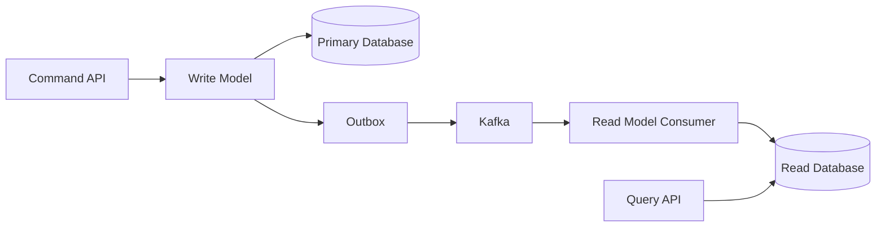
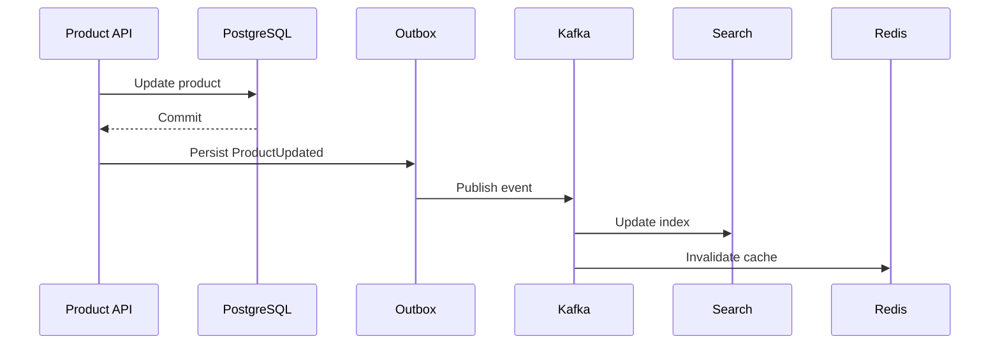

# 14- Eventual Consistency

## Overview

Eventual consistency is a distributed-systems consistency model in which replicas or independently managed services are allowed to temporarily disagree, with the expectation that they converge to a consistent state when updates stop and the system is given sufficient time to propagate them.

It is a deliberate architectural trade-off:

```text
Strong consistency
    |
    |  stronger coordination
    |  higher latency / lower availability in some failure modes
    v
Eventual consistency
    |
    |  weaker coordination
    |  higher availability / scalability
    v
Temporary inconsistency is acceptable
```

In a distributed backend, data is often replicated across:

- Database replicas
- Availability Zones
- Regions
- Microservices
- Caches
- Search indexes
- Read models
- Materialized views
- Message consumers
- Object stores
- Analytics systems

These copies cannot always be updated simultaneously.

For example:

```text
Primary Database
      |
      | asynchronous replication
      v
Read Replica
      |
      | indexing
      v
Search Cluster
      |
      | event processing
      v
Redis Cache
```

A user may write data successfully and immediately read an older version from another component.

That is eventual consistency.

The important engineering question is not:

> "How do I eliminate all inconsistency?"

It is:

> "Where can temporary inconsistency be safely tolerated, and where must the system provide stronger guarantees?"

---

## Why Eventual Consistency Exists

Distributed systems introduce physical and operational constraints.

A write may need to propagate across:

```text
Service A
   |
   v
Database
   |
   v
Replication
   |
   v
Message Broker
   |
   v
Consumer
   |
   v
Read Model
   |
   v
Cache
```

Every boundary can introduce:

- Network latency
- Queueing
- Retries
- Temporary failures
- Replication lag
- Consumer lag
- Cache propagation delay
- Region-to-region latency

Trying to make every component update atomically can require coordination mechanisms such as distributed transactions or synchronous quorum writes.

That coordination increases complexity and can reduce availability.

Eventual consistency accepts temporary divergence to gain:

- Lower write latency
- Better availability
- Horizontal scalability
- Regional independence
- Failure isolation
- Looser service coupling

---

## Basic Example

Suppose an order is created.

The order database is updated immediately:

```text
Order Database
----------------
order_id = 123
status   = CREATED
```

An event is then published:

```text
OrderCreated
```

A search service consumes the event asynchronously:

```text
OrderCreated
      |
      v
Kafka
      |
      v
Search Consumer
      |
      v
Search Index
```

For a short period:

```text
Database:
Order 123 exists

Search:
Order 123 does not exist yet
```

After the consumer processes the event:

```text
Database:
Order 123 exists

Search:
Order 123 exists
```

The system has converged.

---

## Consistency Window

The period during which different components observe different states is the **consistency window**.

```text
t0                t1                t2
|-----------------|-----------------|
Write             Event             Read model
committed         consumed          updated

<---- inconsistency window ---->
```

For example:

```text
Database commit:     10:00:00.000
Kafka publish:       10:00:00.020
Consumer processing: 10:00:00.150
Search update:       10:00:00.180
```

The search index may lag the source database by approximately 180 milliseconds.

A production system should define acceptable consistency windows rather than treating eventual consistency as an unlimited delay.

---

## Strong vs Eventual Consistency

| Property | Strong Consistency | Eventual Consistency |
|---|---|---|
| Read after successful write | Usually sees latest committed value | May see older value |
| Coordination | Higher | Lower |
| Availability during partitions | Often lower depending on model | Often higher |
| Latency | Potentially higher | Often lower |
| Scalability | More coordination required | Easier to scale |
| Complexity | Lower at application layer | Higher at application layer |
| Temporary stale reads | Usually avoided | Expected |
| Cross-region systems | More expensive | Common fit |
| Caches/search indexes | Usually unsuitable | Common |
| Business critical correctness | Often preferred | Only where staleness is acceptable |

Neither model is universally superior.

The correct model depends on the business invariant.

---

## Eventual Consistency vs Replication Lag

These concepts are related but not identical.

### Replication Lag

Replication lag is a specific delay between a source and a replica.

```text
Primary
  |
  | replication
  v
Replica
```

### Eventual Consistency

Eventual consistency is a broader consistency model.

It can result from:

```text
Database replication
Event-driven architecture
Caching
Search indexing
Materialized views
Asynchronous workflows
Multi-region replication
```

Therefore:

> Replication lag can produce eventual consistency, but eventual consistency is not limited to database replication.

---

## Eventual Consistency in Microservices

Microservices naturally create multiple consistency boundaries.

Consider:

```text
Order Service
      |
      v
Order DB

Inventory Service
      |
      v
Inventory DB

Payment Service
      |
      v
Payment DB

Shipping Service
      |
      v
Shipping DB
```

An order workflow may update these systems independently.

There may temporarily be:

```text
Order       = CREATED
Inventory   = RESERVED
Payment     = PENDING
Shipping    = NOT_CREATED
```

The system becomes consistent with respect to its business workflow as the Saga progresses.

This is one reason eventual consistency and the Saga Pattern are closely related.

---

## Eventual Consistency and Saga

A Saga typically executes:

```text
Local Transaction A
        |
        v
Local Transaction B
        |
        v
Local Transaction C
        |
        v
Local Transaction D
```

Each local transaction commits independently.

Therefore, intermediate states are observable:

```text
Order Created
      |
      v
Inventory Reserved
      |
      v
Payment Pending
```

The system is not atomically consistent across all services.

Eventually:

```text
Order       = CONFIRMED
Inventory   = RESERVED
Payment     = AUTHORIZED
Shipping    = CREATED
```

or:

```text
Order       = CANCELLED
Inventory   = RELEASED
Payment     = REFUNDED
Shipping    = NOT_CREATED
```

The final business state is reached through forward processing or compensation.

---

## Eventual Consistency and CQRS

CQRS frequently uses eventual consistency.

A typical architecture is:



The write model and read model are updated independently.

After a write:

```text
Write DB = current
Read DB  = stale
```

After event processing:

```text
Write DB = current
Read DB  = current
```

This enables read models optimized for specific query patterns without requiring synchronous updates to every projection.

---

## Eventual Consistency and Caching

Caching is another common source of temporary inconsistency.

Suppose:

```text
PostgreSQL
    |
    v
Redis
```

An application updates PostgreSQL:

```text
name = "New Name"
```

but Redis still contains:

```text
name = "Old Name"
```

Until the cache is invalidated or expires, readers may receive stale data.

A common pattern is:

```text
Write
  |
  v
Database
  |
  v
Invalidate cache
```

or:

```text
Write
  |
  v
Database
  |
  v
Publish event
  |
  v
Cache consumer
  |
  v
Update / invalidate Redis
```

The cache should generally not become the authoritative source for business-critical state unless explicitly designed that way.

---

## Read-After-Write Consistency

A common application-level problem is:

```text
POST /orders
        |
        v
Order created
        |
        v
GET /orders/123
        |
        v
Older data returned
```

The user may reasonably expect the newly created order to be immediately visible.

This is known as a **read-after-write** requirement.

Possible solutions include:

- Read from the authoritative primary after writes
- Route the user's subsequent read to the same replica
- Use session consistency
- Return the created resource directly from the write operation
- Wait until a known version is visible
- Use a consistency token
- Temporarily bypass a stale cache

The correct solution depends on the system.

---

## Returning the Created Resource

One simple API technique is to return the committed representation from the write request:

```http
POST /orders
```

```json
{
  "id": "order-123",
  "status": "CREATED",
  "total": 1499.00
}
```

The client does not immediately need:

```http
GET /orders/order-123
```

This avoids exposing an unnecessary read-after-write race.

However, subsequent reads may still encounter stale replicas or projections.

---

## Session Consistency

A system can provide stronger guarantees for a particular client session without requiring global strong consistency.

For example:

```text
User writes version 42
        |
        v
Subsequent reads require version >= 42
```

A consistency token can represent the minimum version that the read must observe.

Conceptually:

```text
Write response:
version = 42

GET request:
X-Min-Version: 42
```

A replica that is only at version 40 should not satisfy that request.

This technique can improve user experience while preserving broader asynchronous replication.

---

## Monotonic Reads

Monotonic reads mean that once a client has observed a particular version, subsequent reads should not return an older version.

Bad behavior:

```text
Read 1 → version 10
Read 2 → version 8
```

The user appears to see the system move backward in time.

A better model is:

```text
Read 1 → version 10
Read 2 → version 10
Read 3 → version 11
```

This is particularly important for:

- User dashboards
- Order status
- Messaging
- Notifications
- Financial interfaces

---

## Monotonic Writes

Monotonic writes ensure that writes from the same logical client are applied in the intended order.

For example:

```text
Update A
Update B
```

should not be observed as:

```text
Update B
Update A
```

This can require:

- Per-entity ordering
- Partition keys
- Sequence numbers
- Version checks
- Optimistic concurrency

Kafka commonly uses an entity identifier such as:

```text
partition_key = user_id
```

to preserve ordering for events belonging to the same entity within a partition.

---

## Causal Consistency

Causal consistency preserves relationships between causally related operations.

Suppose:

```text
User creates post
       |
       v
Comment created on post
```

The comment should not become visible before the post in a system where the relationship is externally observable.

The system should preserve:

```text
PostCreated
     |
     v
CommentCreated
```

rather than exposing:

```text
CommentCreated
     |
     v
PostCreated
```

Causal consistency is stronger than basic eventual convergence.

It does not necessarily require every unrelated write to be globally ordered.

---

## Version Numbers

Versioning is a common technique for managing eventual consistency.

A record might contain:

```text
id
value
version
updated_at
```

For example:

```text
User 123
version = 17
```

An update can require:

```sql
UPDATE users
SET name = 'Aranya',
    version = version + 1
WHERE id = 123
  AND version = 16;
```

If zero rows are updated, the caller knows that another update occurred.

This prevents stale writes from silently overwriting newer state.

---

## Last-Write-Wins

Some distributed systems use Last-Write-Wins semantics.

Conceptually:

```text
Replica A:
value = X
timestamp = 100

Replica B:
value = Y
timestamp = 101
```

The system selects:

```text
Y
```

because its timestamp is later.

This is simple but dangerous.

Clock differences between machines can cause incorrect ordering.

Additionally:

```text
latest write
```

does not necessarily mean:

```text
correct business state
```

Therefore, Last-Write-Wins should not be used blindly for business-critical conflict resolution.

---

## Conflict Resolution

Eventual consistency becomes more complicated when multiple replicas can accept writes.

Example:

```text
Replica A
value = 100
     |
     +--> write 110

Replica B
value = 100
     |
     +--> write 120
```

The replicas diverge.

Eventually they must converge to one result.

Possible strategies include:

- Last-write-wins
- Version vectors
- Application-defined merge
- CRDTs
- Compare-and-set
- Single-writer ownership
- Conflict-free data structures

The correct strategy depends on the domain.

---

## Single-Writer Strategy

One way to reduce conflicts is to maintain a single logical writer for an entity.

For example:

```text
User 123
   |
   v
User Partition
   |
   v
Single logical writer
```

Reads can still be distributed, but writes for the same entity are serialized.

This reduces conflict resolution complexity while retaining scalable reads.

Kafka partitioning can support similar designs:

```text
partition_key = aggregate_id
```

All events for the same aggregate are processed in order by one consumer within the partition.

---

## CRDTs

Conflict-free Replicated Data Types are data structures designed so that independently applied updates can merge deterministically.

They are useful when:

- Multiple replicas accept writes
- Concurrent updates are expected
- Automatic merging is desirable
- The data model fits CRDT semantics

Examples include:

- Counters
- Sets
- Collaborative data structures

CRDTs are powerful but should not be introduced merely because a system is distributed.

They add conceptual and implementation complexity.

---

## Practical Example: Product Catalog

A product catalog may have:

```text
Catalog DB
Search Index
Redis Cache
Recommendation System
```

A product update can flow through:



During propagation:

```text
PostgreSQL = new product price
Search      = old product price
Redis       = old product price
```

The architecture is acceptable if the business can tolerate a short delay.

However, payment processing should not use the search index as the authoritative price source.

The authoritative database should be consulted for critical decisions.

---

## Source of Truth

Every eventually consistent system should define an authoritative source.

For example:

```text
PostgreSQL
    |
    +--> Redis
    +--> Elasticsearch
    +--> Kafka
    +--> Analytics
```

The source of truth is:

```text
PostgreSQL
```

The other systems are derived representations.

If Redis and PostgreSQL disagree:

```text
PostgreSQL wins.
```

This rule prevents ambiguity during incident recovery.

---

## Stale Reads

A stale read is a valid read of an older state.

For example:

```text
Current:
balance = 1000

Replica:
balance = 900
```

If a financial authorization decision uses the stale value, the consequences can be severe.

Therefore, classify data by consistency requirement.

| Data | Typical Requirement |
|---|---|
| Payment authorization | Strong |
| Account balance | Strong |
| Inventory reservation | Strong within authoritative service |
| Search results | Eventual |
| Analytics | Eventual |
| Recommendation results | Eventual |
| Social feed | Eventual |
| Metrics | Eventual |
| Cache | Eventual |
| Audit projection | Often eventual |

The same system can use multiple consistency models.

---

## Bounded Staleness

Some systems need eventual consistency but cannot tolerate arbitrary staleness.

A bounded-staleness requirement might be:

```text
Read data must be no more than 5 seconds old.
```

This changes the operational requirement.

You now monitor:

```text
replication lag
consumer lag
cache age
projection lag
```

If lag exceeds the defined bound:

```text
5 seconds
```

the system is no longer satisfying its intended consistency contract.

---

## Measuring Staleness

Do not simply say:

```text
Eventually it will be consistent.
```

Measure it.

Useful metrics include:

```text
source_version
replica_version
```

Then:

```text
staleness = source_version - replica_version
```

For event-driven systems:

```text
event_created_at
event_processed_at
```

Then:

```text
propagation_delay =
    event_processed_at - event_created_at
```

For Kafka:

```text
consumer lag
```

can be a useful operational signal.

---

## Monitoring Eventual Consistency

Monitor:

| Metric | Why It Matters |
|---|---|
| Replica lag | Detect database replication delay |
| Kafka consumer lag | Detect event processing delay |
| Outbox backlog | Detect publishing failures |
| Projection lag | Detect stale read models |
| Cache age | Detect stale cache entries |
| Reconciliation backlog | Detect unresolved state |
| Conflict rate | Detect concurrent-write problems |
| Event processing latency | Measure convergence speed |
| Failed events | Detect broken consumers |

A healthy eventual-consistency architecture requires measurable convergence.

---

## Failure Modes

Eventual consistency introduces several failure scenarios.

### Event Lost

```text
Database updated
      |
      X
Event never published
```

Use transactional outbox or an equivalent reliable publication mechanism.

### Event Delayed

```text
Event published
      |
      |
      | consumer overloaded
      |
      v
Read model remains stale
```

Monitor consumer lag.

### Event Duplicated

```text
Event
 |
 +--> Consumer
 |
 +--> Consumer again
```

Use idempotent processing.

### Event Reordered

```text
Event B
Event A
```

Use partitioning, sequence numbers, or application-level version checks when ordering matters.

### Consumer Permanently Fails

Use:

- Retries
- Dead-letter queues
- Alerts
- Reprocessing
- Manual recovery
- Reconciliation

---

## Idempotent Consumers

An eventually consistent system should generally assume at-least-once delivery.

Example:

```python
def process_event(event):
    if already_processed(event.event_id):
        return

    apply_event(event)

    mark_processed(event.event_id)
```

The check and state update must be concurrency-safe.

A database-backed implementation may use a unique constraint:

```sql
CREATE TABLE processed_events (
    event_id VARCHAR(255) PRIMARY KEY,
    processed_at TIMESTAMP NOT NULL
);
```

The unique constraint prevents multiple workers from successfully recording the same event.

---

## Transactional Event Processing

If consuming an event updates a database, the event-processing record and business update often need to be committed atomically.

Conceptually:

```sql
BEGIN;

INSERT INTO processed_events (event_id, processed_at)
VALUES ('evt-123', CURRENT_TIMESTAMP);

UPDATE product_projection
SET price = 1299
WHERE product_id = 'prod-123';

COMMIT;
```

If processing fails:

```text
ROLLBACK
```

The event remains eligible for retry.

This pattern prevents:

```text
Event marked processed
BUT
business update failed
```

---

## Retry and Backpressure

An eventually consistent system can only converge if downstream consumers can keep up.

Consider:

```text
Producer
   |
   v
Kafka
   |
   v
Consumer
   |
   X overloaded
```

The queue grows:

```text
Consumer Lag
100
500
2,000
10,000
100,000
```

The system is becoming increasingly stale.

Therefore, scalability planning must include:

- Consumer concurrency
- Partition count
- Database capacity
- Batch size
- Processing latency
- Retry behavior
- Backpressure

---

## Backpressure

If consumers cannot process data as quickly as producers generate it, the system needs a controlled response.

Possible strategies:

- Increase consumer concurrency
- Increase partitions
- Batch events
- Reduce unnecessary event traffic
- Apply rate limits
- Defer non-critical work
- Prioritize critical events
- Scale consumers horizontally

Do not blindly increase concurrency if the downstream database is the actual bottleneck.

For example:

```text
Kafka
  |
  +--> 100 workers
           |
           v
      PostgreSQL
           |
           X
      connection pool exhausted
```

More workers can make the problem worse.

---

## Eventual Consistency and Databases

Asynchronous database replication is a common source of eventual consistency.

Typical architecture:

```text
                Application
                    |
             +------+------+
             |             |
             v             v
         Primary        Replica
             |
             | async replication
             +------------->
```

Writes go to the primary.

Reads may go to replicas.

If:

```text
WRITE → Primary
READ  → Replica
```

immediately afterward, the read may return stale data.

A common production pattern is:

```text
Critical read after write → Primary
General read              → Replica
```

This should be explicit in application architecture.

---

## PostgreSQL Example

A Django or FastAPI application may use PostgreSQL read replicas:

```text
                    Application
                    /          \
                   /            \
                  v              v
             Primary DB      Read Replica
                  |
                  +---- replication ---->
```

A routing strategy can send:

```text
POST /orders       → Primary
GET /orders        → Replica
GET /orders/123    → Primary after write if required
```

The exact routing should be based on business consistency requirements rather than simply distributing all reads to replicas.

---

## Eventual Consistency in Redis

Redis commonly participates as a cache rather than an authoritative data store.

Example:

```text
POST /profile
    |
    v
PostgreSQL
    |
    v
Invalidate Redis
```

If invalidation fails:

```text
PostgreSQL = new value
Redis      = old value
```

A TTL provides eventual correction:

```text
Redis stale
    |
    v
TTL expires
    |
    v
Next request reads DB
    |
    v
Cache refreshed
```

However, TTL is not a substitute for correct cache invalidation when stale data has business consequences.

---

## Cache-Aside Pattern

A common pattern is:

```text
Read
 |
 +--> Redis hit → return
 |
 +--> Redis miss
         |
         v
      Database
         |
         v
      Redis
         |
         v
       Return
```

Write:

```text
Write
 |
 v
Database
 |
 v
Invalidate Redis
```

The database remains authoritative.

---

## Eventual Consistency in Search

Search indexes are typically derived data.

```text
PostgreSQL
    |
    v
ProductUpdated
    |
    v
Kafka
    |
    v
Search Consumer
    |
    v
OpenSearch / Elasticsearch
```

A newly created object may not immediately appear in search.

This is usually acceptable for:

- Product search
- Blog search
- Document search
- Log search

It is usually unacceptable to use the search index as the authoritative source for:

- Payment authorization
- Inventory deduction
- Account balances
- Security authorization

---

## Eventual Consistency in AWS Architectures

AWS architectures commonly use asynchronous components.

For example:

```text
API Gateway / ALB
       |
       v
FastAPI / Django
       |
       v
Amazon RDS
       |
       v
Outbox / Event Publisher
       |
       v
Amazon MSK / SQS / SNS
       |
       +--> Search
       +--> Notifications
       +--> Analytics
```

These derived consumers may lag behind the source database.

AWS services may also expose different consistency characteristics depending on the service and operation, so the application should not assume that every AWS data access path has the same consistency semantics.

---

## Designing APIs for Eventual Consistency

API contracts should make asynchronous behavior explicit.

For example:

```http
POST /orders
```

may return:

```http
202 Accepted
```

when the operation has been accepted for asynchronous processing.

Response:

```json
{
  "order_id": "order-123",
  "status": "PROCESSING",
  "status_url": "/orders/order-123/status"
}
```

The client can then poll:

```http
GET /orders/order-123/status
```

until:

```json
{
  "order_id": "order-123",
  "status": "COMPLETED"
}
```

This is often better than pretending a long-running distributed operation completed synchronously.

---

## HTTP Semantics

HTTP status codes should reflect what the API actually guarantees.

For example:

```text
201 Created
```

can be appropriate when the resource itself has been durably created.

```text
202 Accepted
```

is appropriate when processing has been accepted but the requested operation is not yet complete.

Do not return:

```text
200 OK
```

and imply that a distributed workflow has fully completed when it is still processing asynchronously.

---

## Client Experience

Eventual consistency is not only a backend concern.

The frontend must handle intermediate states.

Instead of assuming:

```text
Order immediately becomes COMPLETED
```

the UI may show:

```text
Order received
Processing payment...
Reserving inventory...
Preparing shipment...
```

The backend should expose meaningful business states.

Avoid exposing implementation details such as:

```text
KAFKA_CONSUMER_LAGGING
```

to clients.

Expose domain states such as:

```text
PROCESSING
CONFIRMED
FAILED
CANCELLED
```

---

## Optimistic UI

For some applications, the client can optimistically display a state before all downstream projections converge.

For example:

```text
User posts comment
      |
      v
API confirms write
      |
      v
UI immediately displays comment
      |
      v
Search / analytics update asynchronously
```

The authoritative write has succeeded, while secondary systems converge asynchronously.

---

## When to Use Eventual Consistency

Eventual consistency is a strong fit when:

- Temporary stale reads are acceptable
- High availability matters
- Low latency matters
- Workloads are geographically distributed
- Read models are derived asynchronously
- Search indexing is asynchronous
- Analytics can lag
- Notifications are asynchronous
- Microservices own independent databases
- Long-running workflows exist
- Cross-service atomicity is not required

Examples:

```text
Search indexing
Analytics
Recommendations
Social feeds
Notifications
Metrics
Read projections
Caches
Many order-processing workflows
```

---

## When Not to Use It

Avoid eventual consistency for decisions where stale state can violate critical business invariants.

Examples:

- Double-spending prevention
- Payment authorization
- Inventory deduction
- Account balance updates
- Security authorization
- Unique resource allocation
- Critical quota enforcement

For example:

```text
Inventory = 1

Request A → read 1
Request B → read 1

Both reserve the item
```

If the authoritative reservation operation is eventually consistent without conflict control, overselling can occur.

The solution may involve:

- Strong consistency
- Conditional writes
- Atomic database operations
- Single-writer ownership
- Serializable transactions
- Quorum mechanisms
- Explicit reservation protocols

---

## Common Mistakes

### Treating Eventual Consistency as "No Consistency"

Eventual consistency still requires explicit guarantees.

Define:

- What converges
- How quickly it should converge
- Which conflicts are possible
- What happens during failures

### Using Stale Data for Critical Decisions

A stale cache or replica should not authorize financial or security-sensitive operations.

### Assuming Events Are Delivered Exactly Once

Distributed systems frequently use at-least-once delivery.

Consumers should be idempotent.

### Ignoring Consumer Lag

A system can technically be "eventually consistent" while being hours behind.

Monitor convergence.

### Using TTL as the Only Consistency Mechanism

TTL eventually removes stale cache data but does not guarantee acceptable freshness.

### Ignoring Read-After-Write Requirements

Users often expect their own writes to be immediately visible.

Design explicitly for that expectation.

### Assuming Timestamps Are Perfect Ordering Mechanisms

Distributed clocks are imperfect.

Use logical versions, sequence numbers, or partition ordering where appropriate.

### Treating Search as the Source of Truth

Search indexes are generally derived state.

Keep authoritative business state in the owning service.

### Ignoring Event Reordering

Consumers should validate versions or sequence numbers when event order matters.

### Designing Without Reconciliation

Some events will fail, disappear from expected processing paths, or become ambiguous.

A reconciliation mechanism is often necessary for production systems.

---

## Production Design Checklist

Before introducing eventual consistency, define:

- What is the source of truth?
- Which components are eventually consistent?
- What is the maximum acceptable staleness?
- Is read-after-write consistency required?
- Is monotonic-read behavior required?
- Does event ordering matter?
- Can events be duplicated?
- Can events be lost?
- How are events retried?
- Is an outbox required?
- How are failed consumers handled?
- What is the DLQ strategy?
- How is consumer lag monitored?
- How is stale data detected?
- How are conflicts resolved?
- Which operations require strong consistency?
- How does reconciliation work?
- What happens during regional failure?
- How is the system recovered after disaster?
- What consistency guarantees are exposed through the API?

---

## Interview Questions

### What is eventual consistency?

It is a distributed consistency model where replicas or derived systems may temporarily diverge but are expected to converge to the same logical state after updates propagate successfully.

### Why is eventual consistency useful?

It reduces coordination requirements and can improve availability, latency, scalability, and geographic distribution.

### Is eventual consistency the same as asynchronous processing?

No.

Asynchronous processing can create eventual consistency, but eventual consistency describes the consistency guarantee rather than the execution mechanism.

### Can a system be both strongly and eventually consistent?

Yes.

A system can provide strong consistency for critical operations while allowing derived views, caches, analytics, and search indexes to converge asynchronously.

### How do you handle stale reads?

Possible strategies include:

- Primary reads
- Session consistency
- Version tokens
- Read-your-writes routing
- Cache invalidation
- Bounded-staleness policies

### How do you guarantee eventual convergence?

You cannot simply assume convergence.

You need reliable propagation, retries, idempotent processing, conflict resolution, reconciliation, and monitoring.

### How does Kafka help?

Kafka provides durable event transport and replay capabilities, but application logic still determines idempotency, ordering semantics, conflict resolution, and convergence.

### How does eventual consistency affect system design?

It changes the design from:

```text
One atomic state transition
```

to:

```text
Multiple state transitions
+
Propagation
+
Intermediate states
+
Failure recovery
+
Convergence
```

---

## Key Takeaways

- Eventual consistency deliberately allows temporary divergence between replicas, services, caches, or derived views in exchange for scalability, availability, and reduced coordination.
- Every eventually consistent architecture needs an authoritative source of truth, an explicit consistency window, and a defined mechanism for reliable propagation and convergence.
- Use strong consistency or conditional operations for critical business invariants such as payments, balances, inventory allocation, and authorization; use eventual consistency for suitable derived and asynchronous workloads.
- Production systems must handle stale reads, duplicate or reordered events, consumer lag, failed propagation, conflicts, and unknown states through idempotency, versioning, retries, reconciliation, and observability.
- Eventual consistency is not a single technology or protocol; it is an architectural contract that must be intentionally designed, measured, and exposed correctly through APIs and business workflows.