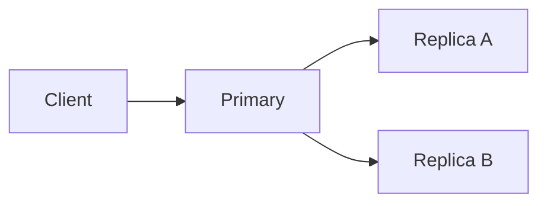
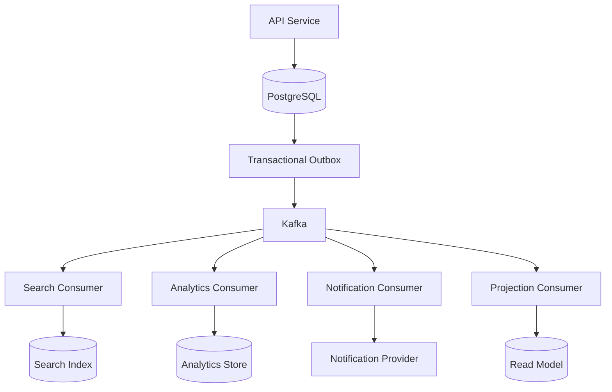
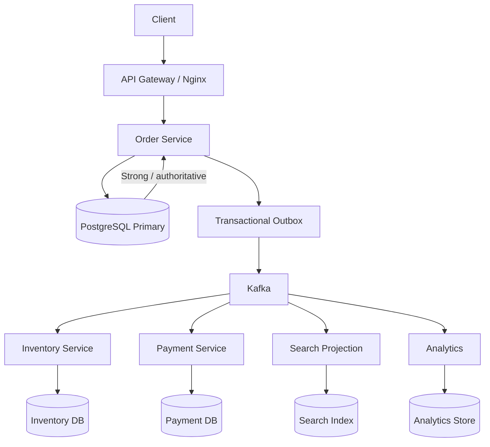

# 15- Strong vs Weak Consistency

## Overview

Consistency defines what a distributed system guarantees when multiple clients, replicas, services, or processes access the same logical data.

The central question is:

> After a write succeeds, what can another reader observe?

In a single-process application backed by one database, consistency is often relatively straightforward. In distributed systems, the same logical state may exist across:

```text
                 +----------------+
                 | Source of Truth|
                 +-------+--------+
                         |
          +--------------+--------------+
          |              |              |
          v              v              v
     Read Replica      Redis         Search Index
          |              |              |
          v              v              v
       Client A       Client B       Client C
```

These copies may temporarily disagree because updates propagate asynchronously.

Consistency models define the guarantees around those disagreements.

Two broad categories are:

- **Strong consistency** — reads are guaranteed to observe the latest committed state according to the system's consistency contract.
- **Weak consistency** — the system provides fewer guarantees about when a read observes an update. Eventual consistency is a common weak consistency model in which replicas are expected to converge.

These are not simply "good" versus "bad" consistency.

They are architectural trade-offs involving:

- Correctness
- Availability
- Latency
- Throughput
- Scalability
- Coordination
- Failure handling
- Operational complexity
- Cost

A senior engineer should choose consistency based on **business invariants**, not based on a blanket preference for stronger consistency.

---

## What Consistency Means

Consider a value:

```text
balance = 100
```

A client performs:

```text
WRITE balance = 50
```

The write succeeds.

A subsequent read might observe:

```text
Strong consistency:
READ → 50
```

or, under a weaker model:

```text
Weak consistency:
READ → 100
```

The important distinction is the guarantee provided by the storage or distributed system.

Consistency does not mean:

```text
"All machines always contain exactly the same data."
```

It means:

```text
"What states are clients allowed to observe?"
```

This distinction is critical in system design interviews and production architecture.

---

## Why Consistency Models Exist

Distributed systems cannot assume that every component can update instantaneously.

Consider:

```text
Application
     |
     v
Primary Database
     |
     | asynchronous replication
     v
Replica
```

If the primary commits a transaction at:

```text
10:00:00.000
```

and the replica receives it at:

```text
10:00:00.150
```

there is a 150 ms period during which:

```text
Primary = new state
Replica = old state
```

The architecture must decide whether reads from the replica are allowed during that period.

A strong-consistency design may require:

```text
READ → primary
```

or sufficient coordination to guarantee a current result.

A weaker design may allow:

```text
READ → replica
```

even when it is slightly stale.

---

## Consistency Spectrum

Consistency is better understood as a spectrum than as a binary choice.

A simplified model is:

```text
Weaker guarantees
      |
      v
Eventual consistency
      |
      v
Causal consistency
      |
      v
Session / read-your-writes guarantees
      |
      v
Linearizable consistency
      |
      v
Stronger guarantees
```

Real systems can provide combinations of these guarantees.

For example, an application may provide:

```text
Strong consistency:
    Payments
    Inventory reservation

Eventual consistency:
    Search
    Analytics
    Recommendations

Session consistency:
    User dashboard
```

Therefore, consistency is often selected **per operation or data path**, not necessarily for the entire system.

---

## Strong Consistency

Strong consistency means that once a successful write becomes visible according to the system's contract, subsequent reads cannot arbitrarily return an older state.

A commonly discussed strong consistency model is **linearizability**.

With linearizability, each operation appears to happen atomically at some point between its invocation and completion, while respecting real-time ordering.

Conceptually:

```text
Client A:

WRITE X = 20
     |
     | success
     v

Client B:

READ X
     |
     v
20
```

If the read begins after the successful write has completed, it must observe a state consistent with that completed write.

---

## Linearizability

Linearizability is one of the strongest practical consistency guarantees.

Suppose:

```text
Initial value = 10
```

Client A:

```text
WRITE 20
```

The operation completes.

Client B then performs:

```text
READ
```

A linearizable system must return:

```text
20
```

It cannot return:

```text
10
```

after the write has completed.

The system behaves as if operations occurred on a single logical copy of the data with a valid global ordering consistent with real time.

---

## Strong Consistency Does Not Mean Zero Latency

Strong consistency does not mean that every read is instantaneous.

A distributed system may need to:

- Contact multiple replicas
- Confirm quorum
- Coordinate leaders
- Wait for replication
- Perform consensus
- Acquire locks
- Validate versions

Therefore:

```text
Strong consistency
      ≠
Instant response
```

It generally means stronger correctness guarantees at the cost of additional coordination.

---

## Example: Inventory

Suppose:

```text
Inventory = 1
```

Two customers simultaneously attempt to purchase the final item.

A strong-consistency design can serialize the authoritative operation:

```text
Request A
   |
   v
Inventory = 1
   |
   v
Reserve item
   |
   v
Inventory = 0

Request B
   |
   v
Inventory = 0
   |
   v
Reject
```

Only one customer succeeds.

This protects the business invariant:

```text
inventory >= 0
```

---

## Weak Consistency

Weak consistency provides fewer guarantees about when a read observes a successful write.

For example:

```text
WRITE X = 20
     |
     v
Replica A = 20
Replica B = 10
```

A read from Replica B may return:

```text
10
```

even though another replica already contains:

```text
20
```

The system may eventually converge:

```text
Replica A = 20
Replica B = 20
Replica C = 20
```

Weak consistency is useful when temporary divergence is acceptable.

---

## Eventual Consistency

Eventual consistency is a specific weak consistency model.

Its basic property is:

> If updates stop and the system continues operating correctly, replicas eventually converge to the same state.

Example:

```text
t0:
Primary = 100
Replica = 100

t1:
Primary = 50
Replica = 100

t2:
Primary = 50
Replica = 50
```

The period between `t1` and `t2` is the consistency window.

Production systems should ideally define an expected or bounded convergence time.

---

## Strong vs Weak Consistency

| Property | Strong Consistency | Weak / Eventual Consistency |
|---|---|---|
| Latest successful write visible | Guaranteed by contract | Not necessarily |
| Stale reads | Generally prevented | May occur |
| Coordination | Higher | Lower |
| Latency | Potentially higher | Often lower |
| Availability during failures | Can be reduced | Often higher |
| Horizontal scaling | More coordination | Easier |
| Multi-region writes | More complex | Common |
| Conflict handling | Often simpler | Often required |
| Operational complexity | Lower at application level | Higher at application level |
| Suitable for payments | Usually | Usually not |
| Suitable for analytics | Often unnecessary | Usually |
| Suitable for search indexes | Usually unnecessary | Common |
| Suitable for caches | Usually unnecessary | Common |

---

## Strong Consistency Advantages

Strong consistency is useful when correctness depends on seeing the latest state.

### Advantages

- Predictable read behavior
- Easier application reasoning
- Strong business invariants
- Fewer stale-read bugs
- Simpler transactional semantics
- Easier debugging for some workloads
- Suitable for correctness-critical operations

Examples include:

- Financial balances
- Payment state
- Inventory allocation
- Authorization state
- Unique resource allocation
- Critical quota enforcement

---

## Strong Consistency Limitations

Strong consistency can require more coordination.

Potential consequences include:

- Higher latency
- Lower write availability during failures
- Cross-region coordination cost
- Reduced throughput
- More complicated distributed protocols
- Greater infrastructure cost

For example:

```text
Region A
   |
   | 80 ms
   v
Region B
```

If every write requires synchronous cross-region agreement, an operation may need to pay that network latency.

A system serving users globally may find that unacceptable for every operation.

---

## Weak Consistency Advantages

Weak consistency can improve:

- Availability
- Write throughput
- Geographic scalability
- Fault tolerance
- Latency
- Decoupling between services

For example:

```text
Order DB
   |
   v
Kafka
   |
   +--> Search
   +--> Analytics
   +--> Notification
   +--> Recommendation
```

These downstream systems do not need to participate in the transaction that creates the order.

They can converge independently.

---

## Weak Consistency Limitations

Weak consistency moves complexity into the application architecture.

You must account for:

- Stale reads
- Duplicate events
- Event ordering
- Missing events
- Retry behavior
- Conflicts
- Reconciliation
- Consumer lag
- Cache invalidation
- Intermediate states

The trade-off is often:

```text
Less distributed coordination
        +
More application-level complexity
```

---

## Read-After-Write Consistency

One of the most common practical requirements is:

> A user should see their own successful write immediately.

Consider:

```text
POST /profile
        |
        v
Primary DB
        |
        v
200 OK
```

The subsequent request:

```text
GET /profile
```

might be routed to a stale replica.

The user could see:

```text
Old Profile
```

even though their update succeeded.

This creates a poor user experience.

---

## Strategies for Read-After-Write

Possible approaches include:

### Read From Primary

```text
Write → Primary
Read  → Primary
```

Simple and strong, but increases primary load.

### Sticky Reads

After a write:

```text
Client
  |
  +--> Primary
```

Subsequent reads temporarily remain on the primary.

### Version Tokens

The write returns:

```json
{
  "version": 42
}
```

The next read requires:

```text
version >= 42
```

### Return the Updated Resource

Instead of immediately reading again:

```http
POST /users/123
```

returns:

```json
{
  "id": "123",
  "name": "New Name",
  "version": 42
}
```

This avoids an unnecessary read race.

---

## Monotonic Reads

Monotonic reads prevent a client from moving backward to an older state.

Bad:

```text
Read 1 → version 10
Read 2 → version 8
Read 3 → version 11
```

Better:

```text
Read 1 → version 10
Read 2 → version 10
Read 3 → version 11
```

This can be implemented through:

- Session affinity
- Version tracking
- Replica selection
- Consistency tokens
- Read routing

Monotonic reads are especially useful for:

- Messaging
- Order status
- User dashboards
- Notifications
- Activity feeds

---

## Causal Consistency

Causal consistency preserves relationships between causally related operations.

Suppose:

```text
PostCreated
     |
     v
CommentCreated
```

A client should not observe:

```text
CommentCreated
```

while still being unable to observe:

```text
PostCreated
```

if the application exposes those operations as causally related.

Causal consistency is weaker than global strong consistency because unrelated operations do not necessarily need one global ordering.

---

## Session Consistency

A system may provide stronger guarantees for an individual session while remaining weak globally.

For example:

```text
User writes version 100
        |
        v
Session stores minimum version = 100
        |
        v
Reads require version >= 100
```

Another user may still observe:

```text
version 99
```

while the first user gets:

```text
version 100
```

This is often a useful compromise between global strong consistency and completely unconstrained stale reads.

---

## Strong Consistency and Replication

Consider:



With asynchronous replication:

```text
Primary commit
      |
      v
Return success
      |
      +----> Replica A
      |
      +----> Replica B
```

The primary may acknowledge before replicas receive the update.

This can produce stale reads.

With stronger replication guarantees, the system may wait for sufficient replicas before acknowledging the operation.

Conceptually:

```text
Client
  |
  v
Leader
  |
  +--> Replica A
  |
  +--> Replica B
  |
  v
Quorum achieved
  |
  v
ACK
```

The exact semantics depend on the database or distributed system.

---

## Quorum and Consistency

For a replicated system with:

```text
N = total replicas
```

a common quorum model uses:

```text
W = write quorum
R = read quorum
```

If:

```text
R + W > N
```

the read and write sets overlap.

For example:

```text
N = 3
W = 2
R = 2
```

Then:

```text
R + W = 4 > 3
```

This can provide strong read/write intersection under the system's assumptions.

However:

> Quorum arithmetic alone does not automatically guarantee linearizability.

The actual consistency guarantees depend on:

- Conflict resolution
- Read/write protocol
- Failure handling
- Versioning
- Leader behavior
- Concurrent writes
- Replica semantics

This is a common interview trap.

---

## Strong Consistency and Consensus

Consensus algorithms such as:

- Raft
- Paxos
- Multi-Paxos
- Zab

can be used to maintain replicated state machines with strong ordering guarantees.

A simplified Raft-style flow is:

```text
Client
  |
  v
Leader
  |
  +--> Follower A
  |
  +--> Follower B
  |
  v
Majority acknowledged
  |
  v
Commit
```

The leader provides an ordered stream of committed operations.

This allows a cluster to behave like a consistent replicated state machine.

---

## CAP Perspective

Consistency is closely related to the CAP theorem.

During a network partition, a distributed system cannot simultaneously guarantee:

```text
Strong consistency
+
Availability
```

for all operations in the general partition-tolerant distributed model.

Conceptually:

```text
             Partition
                 |
        +--------+--------+
        |                 |
   Consistency        Availability
        |                 |
     Reject /          Continue
     delay             serving
     requests          requests
```

A consistency-oriented system may reject or delay operations rather than return potentially conflicting data.

An availability-oriented system may continue accepting operations and reconcile later.

CAP does **not** mean:

```text
Choose two permanently:
C + A
C + P
A + P
```

Partitions are a failure condition. The meaningful trade-off appears in how the system behaves **when a partition occurs**.

---

## PACELC Perspective

PACELC extends the CAP discussion.

It asks:

> If there is a Partition, choose Availability or Consistency; Else, choose Latency or Consistency.

Conceptually:

```text
Partition?
   |
   +-- Yes --> Availability vs Consistency
   |
   +-- No ---> Latency vs Consistency
```

This is useful because even when the network is healthy, stronger consistency may require additional coordination and therefore higher latency.

---

## Database Example

Suppose a Django application uses:

```text
PostgreSQL Primary
PostgreSQL Read Replica
```

The application could route:

```text
POST /orders       → Primary
GET /catalog       → Replica
GET /orders/123    → Primary after write
```

The consistency decision is now explicit.

Not every endpoint needs identical consistency.

A catalog search can tolerate:

```text
100–500 ms stale
```

while payment authorization cannot.

---

## Django Example

A simplified routing model might be:

```python
from django.db import transaction
from django.http import JsonResponse


def create_order(request):
    with transaction.atomic():
        order = Order.objects.create(
            user=request.user,
            status="CREATED",
        )

    return JsonResponse(
        {
            "id": order.id,
            "status": order.status,
        },
        status=201,
    )
```

The write is authoritative in the primary database.

A subsequent read routed to a replica may still encounter replication lag.

The application architecture, not Django itself, determines whether that stale read is acceptable.

---

## FastAPI Example

A FastAPI service may explicitly separate authoritative and eventually consistent reads:

```python
from fastapi import FastAPI

app = FastAPI()


@app.get("/orders/{order_id}")
async def get_order(order_id: str):
    order = await read_from_authoritative_store(order_id)

    return {
        "id": order.id,
        "status": order.status,
    }


@app.get("/search/orders")
async def search_orders(query: str):
    results = await read_from_search_index(query)

    return {
        "results": results,
    }
```

The first endpoint may require strong consistency.

The search endpoint can tolerate eventual consistency.

This is preferable to forcing every operation onto the strongest available consistency model.

---

## Eventual Consistency Architecture

A common production architecture is:



The authoritative transaction occurs in PostgreSQL.

Everything downstream is eventually consistent.

This architecture provides a clean boundary:

```text
PostgreSQL
= authoritative business state

Kafka consumers
= derived state
```

---

## Consistency Boundaries

A useful architectural technique is to explicitly identify consistency boundaries.

For example:

```text
Payment Service
----------------
Strong consistency

        |
        | asynchronous event
        v

Analytics Service
-----------------
Eventual consistency
```

The payment service should not depend on an eventually consistent analytics projection to authorize a transaction.

Instead:

```text
Payment Service
      |
      v
Authoritative payment state
```

and independently:

```text
Payment Event
      |
      v
Analytics
```

This prevents weak consistency from leaking into critical business decisions.

---

## Choosing the Right Model

Start with the business invariant.

Ask:

```text
What must never be wrong?
```

Examples:

```text
Inventory cannot become negative.
Payment cannot be charged twice.
A user cannot access another user's private data.
A unique username cannot be allocated twice.
```

These operations need strong guarantees.

Then ask:

```text
What can temporarily be stale?
```

Examples:

```text
Search results
Recommendation scores
Analytics dashboards
Metrics
Notification counters
Social feeds
```

These often fit eventual consistency.

---

## Consistency Decision Matrix

| Requirement | Recommended Approach |
|---|---|
| Payment authorization | Strong |
| Account balance | Strong |
| Inventory reservation | Strong / conditional write |
| Security authorization | Strong |
| Unique allocation | Strong |
| Search indexing | Eventual |
| Analytics | Eventual |
| Recommendations | Eventual |
| Cache | Eventual |
| Metrics | Eventual |
| User's own recent write | Read-your-writes |
| User activity feed | Often eventual |
| Collaborative editing | Causal / CRDT depending on requirements |

---

## Consistency and Availability

Suppose a service has two replicas:

```text
Replica A
Replica B
```

The network partition occurs:

```text
Replica A   X   Replica B
```

If both continue accepting writes:

```text
A → X = 10
B → X = 20
```

the system now has conflicting states.

A strongly consistent system may stop accepting some operations.

An eventually consistent system may accept both and resolve the conflict later.

This demonstrates the fundamental trade-off:

```text
Reject some operations
        vs
Accept operations and reconcile
```

Neither is universally correct.

---

## Conflict Resolution

Weak consistency becomes significantly more complex when multiple writers can modify the same entity.

Possible strategies include:

### Single Writer

```text
Entity → one logical writer
```

This reduces conflicts.

### Last-Write-Wins

```text
latest version wins
```

Simple but potentially unsafe.

### Version Checks

```sql
UPDATE accounts
SET balance = 900,
    version = version + 1
WHERE id = 123
  AND version = 41;
```

If zero rows are affected, another update won.

### Application Merge

Domain-specific logic decides how concurrent changes combine.

### CRDT

Data structures are designed to merge concurrent operations deterministically.

---

## Versioning

Version numbers are often more reliable than timestamps for application-level ordering.

Example:

```text
Entity:
id      = 123
version = 42
```

An event contains:

```json
{
  "entity_id": "123",
  "version": 42,
  "status": "CONFIRMED"
}
```

A consumer can reject stale events:

```python
if event.version <= current_version:
    return
```

This prevents an older event from overwriting newer state.

---

## Event Ordering

Suppose:

```text
OrderCreated
OrderCancelled
```

The correct order is:

```text
Created → Cancelled
```

If consumers receive:

```text
Cancelled
Created
```

the final projection may incorrectly become:

```text
CREATED
```

Possible solutions include:

- Kafka partitioning by aggregate ID
- Sequence numbers
- Entity versions
- Ordered queues
- Conditional updates

For Kafka:

```text
partition_key = order_id
```

keeps events for the same key within the same partition, where Kafka provides ordered records within that partition.

---

## Idempotency

Weakly consistent architectures frequently use asynchronous delivery.

Assume:

```text
Event A
```

is delivered twice:

```text
A
A
```

A consumer should not accidentally perform the business operation twice.

Use:

```text
event_id
idempotency_key
unique constraint
version
```

Example:

```sql
CREATE TABLE processed_events (
    event_id VARCHAR(255) PRIMARY KEY,
    processed_at TIMESTAMP NOT NULL
);
```

The database constraint provides concurrency-safe duplicate detection.

---

## Reconciliation

Strong systems often detect inconsistency immediately through transactional guarantees.

Eventual systems require additional mechanisms to discover divergence.

A reconciliation job might compare:

```text
Source of truth
      |
      v
Derived projection
```

For example:

```text
PostgreSQL:
order-123 = CONFIRMED

Read model:
order-123 = PAYMENT_PENDING
```

The reconciler detects:

```text
Mismatch
```

and repairs the projection.

Reconciliation should be treated as a normal production capability rather than an emergency-only script.

---

## Monitoring Consistency

Consistency requirements should be observable.

Useful metrics include:

| Metric | Purpose |
|---|---|
| Replica lag | Detect stale database replicas |
| Consumer lag | Detect delayed event processing |
| Projection lag | Measure read-model freshness |
| Cache age | Detect stale cached values |
| Conflict rate | Detect concurrent-write problems |
| Reconciliation count | Measure divergence |
| Failed events | Detect broken propagation |
| Retry count | Detect unstable consumers |
| Version gap | Measure replica/projected-state distance |

A useful production metric is:

```text
time_to_convergence
```

For example:

```text
p50 = 80 ms
p95 = 400 ms
p99 = 2.1 s
```

This is far more actionable than simply stating:

```text
"The system is eventually consistent."
```

---

## Bounded Staleness

Some applications can tolerate eventual consistency only within a defined bound.

For example:

```text
Search results must be less than 10 seconds old.
```

This creates an operational SLO:

```text
projection lag < 10 seconds
```

If:

```text
consumer lag = 45 seconds
```

the system is violating its consistency requirement even though it is technically still "eventually consistent."

---

## Security Considerations

Consistency can become a security issue.

Consider permission revocation:

```text
User permission:
ADMIN → USER
```

If an authorization cache still contains:

```text
ADMIN
```

the user may temporarily retain elevated access.

For security-sensitive state:

- Prefer authoritative reads
- Use short cache lifetimes where appropriate
- Invalidate permission caches promptly
- Avoid relying on stale replicas
- Define explicit revocation guarantees
- Monitor propagation failures

The principle is:

> Never allow a weak-consistency boundary to undermine a security invariant.

---

## Performance Considerations

Strong consistency can introduce:

- Additional network round trips
- Quorum waits
- Lock contention
- Leader bottlenecks
- Cross-region latency
- Reduced write throughput

Weak consistency can reduce these costs but may introduce:

- Duplicate processing
- Reconciliation workloads
- Larger event infrastructure
- More complicated application logic
- Cache invalidation overhead
- Additional monitoring

Therefore, performance analysis must consider the entire system rather than only request latency.

---

## Cost Considerations

Strong consistency can increase infrastructure cost through:

- More synchronous replication
- Larger database instances
- Cross-region network traffic
- Consensus coordination
- Higher availability requirements

Eventual consistency may require:

- Kafka/SQS infrastructure
- Consumer fleets
- Dead-letter queues
- Read models
- Search clusters
- Reconciliation workers
- Additional observability

Therefore:

```text
Eventual consistency
≠
Free scalability
```

It often trades coordination cost for infrastructure and operational complexity.

---

## Disaster Recovery

Consistency guarantees must remain meaningful during disaster recovery.

Questions to answer include:

- Which database is authoritative?
- What is the recovery point objective?
- Can replicas contain stale data?
- How are unprocessed events recovered?
- Can Kafka events be replayed?
- How are projections rebuilt?
- How are caches repopulated?
- How are conflicting writes handled?
- What happens when a region is restored?

A strong design should be able to reconstruct derived state:

```text
Source of truth
      |
      v
Event log / replay
      |
      +--> Search
      +--> Read model
      +--> Analytics
```

This is one reason durable event streams and deterministic projections are valuable.

---

## Operational Best Practices

### Define Consistency Per Business Operation

Do not label the entire architecture simply:

```text
Strong
```

or:

```text
Eventual
```

Instead define:

```text
Payment → strong
Search → eventual
Analytics → eventual
User dashboard → read-your-writes
```

### Identify the Source of Truth

Every critical entity should have a clearly owned authoritative state.

### Make Staleness Observable

Measure:

```text
replication lag
consumer lag
projection age
cache age
```

### Design for Duplicate Events

Assume:

```text
at-least-once delivery
```

unless the actual infrastructure guarantees something stronger.

### Design for Reordering

Use:

```text
version numbers
sequence numbers
partition keys
```

where ordering matters.

### Provide Reconciliation

Assume that eventually consistent systems will occasionally diverge.

### Keep Critical Decisions on Authoritative State

Do not use:

```text
Search index
Redis cache
Analytics DB
```

for authoritative financial or authorization decisions unless explicitly designed for that purpose.

---

## Common Production Pitfalls

### Assuming Strong Consistency Everywhere

This can unnecessarily increase:

- Latency
- Cost
- Coupling
- Failure propagation

Use the minimum consistency required by the business invariant.

### Assuming Eventual Consistency Means Infinite Staleness

It does not.

Production systems should define convergence expectations.

### Treating Replicas as Interchangeable

A replica may be behind.

Routing logic should understand consistency requirements.

### Ignoring Failure During Propagation

An event can be:

```text
Published
Consumed
Partially processed
```

Design transactional processing and retry behavior accordingly.

### Using Timestamps as Absolute Truth

Clock skew can make timestamp-based conflict resolution unreliable.

Prefer versions or logical ordering where correctness matters.

### Increasing Consumers Without Checking the Database

More consumers can increase:

```text
DB connections
lock contention
write pressure
```

and make the system less stable.

### Hiding Intermediate States

Distributed workflows naturally have states such as:

```text
PROCESSING
PENDING
COMPENSATING
FAILED
```

Represent them explicitly rather than pretending every operation is atomic.

---

## Interview Traps

### "Strong Consistency Means Every Replica Is Always Identical"

Not necessarily.

Strong consistency describes the guarantees exposed to clients, not a requirement that every replica physically contain the same bytes at every instant.

### "Eventual Consistency Means Data Will Always Be Correct Eventually"

Only if the system is designed for reliable convergence.

Lost events, permanent consumer failures, or unresolved conflicts can prevent convergence.

### "Quorum Automatically Gives Strong Consistency"

No.

Quorum overlap helps, but actual guarantees depend on the complete replication protocol.

### "CAP Means Choose Any Two of C, A, and P"

This is an oversimplification.

The trade-off becomes important when a partition occurs.

### "Eventual Consistency Is Only for NoSQL Databases"

No.

It is common in:

- PostgreSQL read replicas
- Redis caches
- Kafka consumers
- Search indexes
- CQRS projections
- Microservices
- Analytics pipelines
- Multi-region architectures

---

## Practical Architecture

A production backend may deliberately combine multiple consistency models:



A sensible consistency policy might be:

| Component | Consistency |
|---|---|
| Order authoritative state | Strong |
| Payment state | Strong |
| Inventory reservation | Strong / conditional |
| Kafka propagation | Durable asynchronous |
| Search projection | Eventual |
| Analytics | Eventual |
| Cache | Eventual |
| Reporting | Eventual |

This is often more practical than attempting to make the entire architecture strongly consistent.

---

## Decision Framework

When deciding between strong and weak consistency, evaluate these questions:

1. What business invariant must never be violated?
2. Can a stale read cause financial, security, or operational damage?
3. How stale can the data safely become?
4. Does the user need read-after-write behavior?
5. Does operation ordering matter?
6. Can multiple writers modify the same entity?
7. What happens during network partitions?
8. Can the application tolerate temporarily unavailable writes?
9. What is the acceptable latency budget?
10. How much operational complexity is acceptable?
11. How will divergence be detected?
12. How will failed propagation be repaired?
13. What consistency guarantees should the API expose?
14. How will the consistency contract be monitored?

A useful rule is:

```text
Start with the business invariant.
        |
        v
Determine minimum required guarantee.
        |
        v
Choose the simplest architecture
that satisfies that guarantee.
```

Do not start with:

```text
"Should we use strong or eventual consistency?"
```

Start with:

```text
"What must the system guarantee?"
```

---

## Key Takeaways

- Strong consistency provides tighter read guarantees and is appropriate for operations where stale state can violate critical business invariants.
- Weak and eventual consistency reduce coordination overhead and improve scalability, latency, and availability when temporary divergence is acceptable.
- Consistency should be selected per business operation or data path rather than applied uniformly across an entire distributed architecture.
- Production eventual-consistency systems require explicit handling of stale reads, ordering, duplicates, conflicts, retries, reconciliation, and convergence monitoring.
- The correct consistency model is the weakest model that safely satisfies the business requirements; stronger guarantees should be introduced when the invariant requires them.