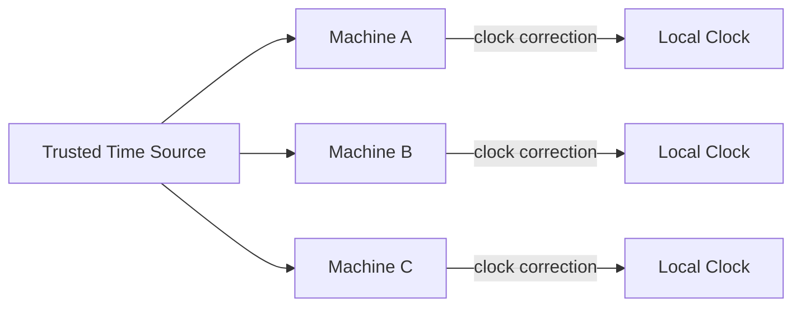
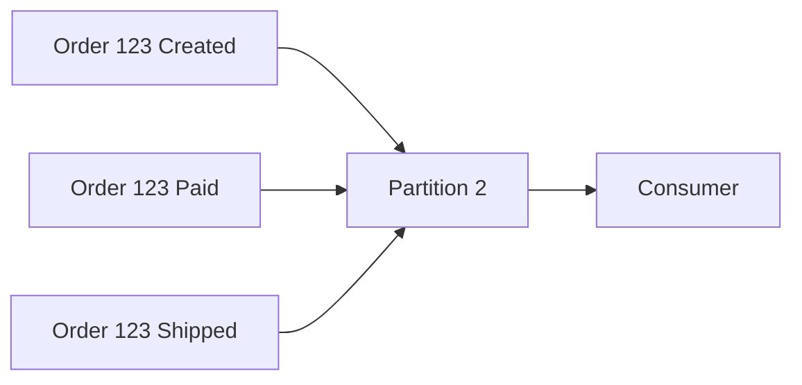
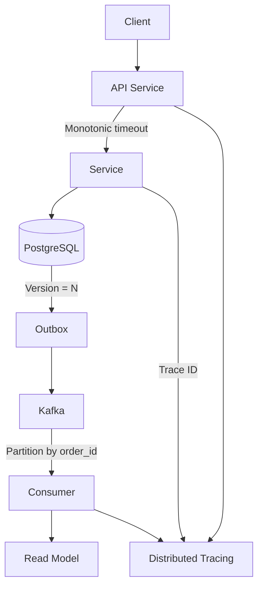

# 16- Time, Clocks & Ordering

## Overview

Distributed systems cannot rely on a single perfectly synchronized clock.

A backend running across multiple machines, containers, availability zones, or regions has multiple independent clocks. Those clocks can differ because of clock drift, network delay, virtualization, operating-system scheduling, and synchronization limitations.

At the same time, distributed systems frequently need to answer questions such as:

- Which event happened first?
- Is this update newer than another update?
- Did service B observe service A's event before producing its own event?
- Can an expired token be trusted?
- Can two concurrent writes be ordered?
- Which event should win during conflict resolution?
- Can timestamps safely determine database or event ordering?

These questions make **time and ordering fundamental distributed-systems concerns**.

A common mistake is assuming:

```text
timestamp A < timestamp B
        =>
event A happened before event B
```

That inference is not always valid.

Distributed systems therefore use several mechanisms:

- Physical clocks
- Monotonic clocks
- Clock synchronization
- Logical clocks
- Lamport clocks
- Vector clocks
- Hybrid logical clocks
- Sequence numbers
- Database versions
- Kafka partition ordering
- Consensus-based ordering

The correct mechanism depends on whether the system needs:

```text
elapsed time
      vs
wall-clock time
      vs
causal ordering
      vs
total ordering
```

---

## Why Time Is Difficult in Distributed Systems

In a single process, this looks straightforward:

```text
Event A
  |
  v
Event B
```

The process can use its local clock and execution order.

In a distributed system:

```text
Machine A                         Machine B

10:00:00.100                      10:00:00.050
      |                                  |
      |------ network message ---------->|
      |                                  |
```

Machine B's clock is behind Machine A's clock.

Now suppose:

```text
A creates Event X at 10:00:00.100
B creates Event Y at 10:00:00.050
```

The timestamps suggest:

```text
Y happened before X
```

But the actual causal relationship may be:

```text
X
|
| network message
v
Y
```

Therefore:

```text
Physical timestamp
        ≠
Causal ordering
```

This distinction is central to distributed systems.

---

## Types of Time

Distributed applications commonly encounter several different concepts of time.

| Type | Purpose | Main Property |
|---|---|---|
| Wall-clock time | Human-readable timestamps | Can move forward or backward |
| Monotonic time | Measuring durations | Does not move backward |
| Logical time | Ordering distributed events | Represents causality |
| Hybrid logical time | Ordering with physical-time approximation | Combines both |

Choosing the wrong type can produce subtle production bugs.

---

## Wall-Clock Time

Wall-clock time represents calendar time.

Examples:

```text
2026-08-23T12:30:45Z
```

Applications use wall-clock time for:

- Audit logs
- User-visible timestamps
- Expiration dates
- Scheduled jobs
- Database timestamps
- Business dates
- Reporting

Wall-clock time is generally derived from the operating system's real-time clock and synchronized using mechanisms such as NTP.

However, wall-clock time is not guaranteed to be perfectly monotonic.

It can move:

```text
12:00:10
12:00:11
12:00:09
12:00:12
```

because the system clock can be adjusted.

---

## Clock Drift

Clock drift occurs because physical clocks do not run at exactly the same rate.

Consider:

```text
Machine A:
10:00:00.000
10:00:10.000

Machine B:
10:00:00.000
10:00:10.030
```

After enough time, the clocks diverge.

Operating systems periodically synchronize their clocks against external time sources.

Common mechanisms include:

- NTP
- Chrony
- Cloud provider time synchronization services
- Hardware-assisted clock synchronization

Synchronization reduces error but does not make distributed clocks identical.

---

## Clock Skew

Clock skew refers to the difference between clocks on different machines.

For example:

```text
Machine A = 10:00:05.000
Machine B = 10:00:05.120

Skew = 120 ms
```

If a system uses timestamps for correctness, a 120 ms skew can be significant.

Consider:

```text
Request A:
timestamp = 1000

Request B:
timestamp = 950
```

A naive system may assume:

```text
A happened after B
```

even when B was causally generated after A.

---

## Clock Synchronization

Machines commonly synchronize their clocks using network time protocols.

Conceptually:



Synchronization attempts to keep clocks within an acceptable error bound.

However:

```text
synchronized
      ≠
identical
```

There is always some uncertainty.

---

## NTP and Production Time Synchronization

NTP synchronizes system clocks over a network.

A production server might expose:

```bash
timedatectl status
```

or:

```bash
chronyc tracking
```

A typical system may report information such as:

```text
Reference ID
System time
Last offset
RMS offset
Root delay
Root dispersion
```

The exact tooling depends on the operating system and deployment environment.

For production systems, clock synchronization should be treated as infrastructure rather than something application code should manually implement.

---

## Monotonic Clocks

A monotonic clock is designed for measuring elapsed time.

For example:

```python
import time

start = time.monotonic()

perform_operation()

elapsed = time.monotonic() - start

print(f"Operation took {elapsed:.3f} seconds")
```

This is preferable to:

```python
time.time()
```

for measuring durations.

Why?

Because wall-clock time can be adjusted:

```text
start = 100
clock adjusted
end = 95
```

Then:

```text
end - start = -5
```

A monotonic clock avoids this class of error.

---

## Python Time APIs

Python exposes both wall-clock and monotonic clocks.

### Wall Clock

```python
import time

timestamp = time.time()
```

Useful for:

- Epoch timestamps
- Expiration calculations tied to real-world time
- Recording event timestamps

### Monotonic Clock

```python
import time

start = time.monotonic()

# Work

elapsed = time.monotonic() - start
```

Useful for:

- Timeouts
- Retries
- Latency measurement
- Cache expiration calculations
- Circuit-breaker timers

### High-Resolution Monotonic Clock

```python
import time

start = time.perf_counter()

# Work

elapsed = time.perf_counter() - start
```

This is useful when measuring performance with high-resolution timing.

---

## Timeouts

Timeouts should generally be based on elapsed time rather than wall-clock timestamps.

Prefer:

```python
deadline = time.monotonic() + timeout

while time.monotonic() < deadline:
    ...
```

rather than:

```python
deadline = time.time() + timeout
```

The reason is that the wall clock can be adjusted while the operation is executing.

This matters for:

- HTTP requests
- Database connections
- Distributed locks
- Retries
- Circuit breakers
- RPC calls

---

## Wall Clock vs Monotonic Clock

| Requirement | Recommended Clock |
|---|---|
| User-visible timestamp | Wall clock |
| Database `created_at` | Wall clock |
| Audit event timestamp | Wall clock |
| Request timeout | Monotonic |
| Retry deadline | Monotonic |
| Latency measurement | Monotonic |
| Circuit breaker timer | Monotonic |
| Performance benchmark | Monotonic / high-resolution |
| Event ordering | Logical/version-based mechanisms |

The key principle is:

> Use wall-clock time for calendar meaning and monotonic time for elapsed duration.

---

## Ordering in Distributed Systems

Ordering answers a different question from time.

Suppose:

```text
Service A:
OrderCreated

Service B:
PaymentAuthorized
```

The system may need to guarantee:

```text
OrderCreated → PaymentAuthorized
```

This is an ordering requirement.

Ordering can be:

- Local ordering
- Per-partition ordering
- Causal ordering
- Total ordering
- Global ordering

Each provides different guarantees.

---

## Local Ordering

Within a single process, execution order is usually straightforward.

```text
Operation A
   |
   v
Operation B
   |
   v
Operation C
```

A local sequence number can represent this:

```text
A = 1
B = 2
C = 3
```

The problem begins when multiple machines generate events independently.

---

## Partial Ordering

Distributed events are often only partially ordered.

Consider:

```text
Machine A:

A1 → A2 → A3


Machine B:

B1 → B2 → B3
```

The system knows:

```text
A1 < A2 < A3
B1 < B2 < B3
```

But it may not know whether:

```text
A2 < B2
```

or:

```text
B2 < A2
```

These events may be concurrent.

This creates a **partial order**.

---

## Causality

An event is causally related to another when the first event could have influenced the second.

For example:

```text
Client
  |
  v
OrderCreated
  |
  v
PaymentRequested
  |
  v
PaymentAuthorized
```

The causal relationship is:

```text
OrderCreated
      ↓
PaymentRequested
      ↓
PaymentAuthorized
```

A distributed system should preserve this ordering when the application depends on it.

---

## Happened-Before Relationship

Lamport introduced the concept of **happened-before**, commonly represented as:

```text
A → B
```

It means that event A happened before event B in the causal ordering.

The relationship generally includes:

1. Events within the same process follow program order.
2. Sending a message happens before receiving that message.
3. The relation is transitive.

Therefore:

```text
A → B
B → C

therefore:

A → C
```

This gives distributed systems a way to reason about causality without requiring perfectly synchronized physical clocks.

---

## Lamport Logical Clocks

A Lamport clock assigns an integer to each event.

Each process maintains:

```text
counter
```

For a local event:

```text
counter = counter + 1
```

When sending a message:

```text
counter = counter + 1
send counter
```

When receiving a message with timestamp `T`:

```text
counter = max(local_counter, T) + 1
```

The goal is:

```text
A → B
```

implies:

```text
L(A) < L(B)
```

---

## Lamport Clock Example

Consider:

```text
Process A             Process B

A1                    B1
 |                     |
A2 -----------------> B2
 |                     |
A3                    B3
```

Suppose:

```text
A1 = 1
A2 = 2
```

A2 sends a message to B.

B receives:

```text
local B counter = 1
received = 2
```

Therefore:

```text
B2 = max(1, 2) + 1
   = 3
```

Then:

```text
A2 < B2
```

which correctly captures the causal relationship.

---

## Lamport Clock Limitation

A Lamport clock provides:

```text
A → B
    =>
L(A) < L(B)
```

But the reverse is not guaranteed:

```text
L(A) < L(B)
```

does **not** necessarily mean:

```text
A → B
```

Two concurrent events can receive different Lamport timestamps.

For example:

```text
A1 = 1
B1 = 2
```

does not prove:

```text
A1 → B1
```

They may have happened independently.

---

## Total Ordering with Lamport Clocks

A distributed system can create a deterministic total order by combining:

```text
Lamport timestamp
+
unique node ID
```

For example:

```text
(10, node-A)
(10, node-B)
(11, node-A)
```

Sort lexicographically:

```text
(10, node-A)
(10, node-B)
(11, node-A)
```

This gives a deterministic order.

However, this order is not necessarily the same as real-world time or causality beyond the guarantees of the Lamport clock.

---

## Vector Clocks

Vector clocks provide more information about causality than Lamport clocks.

Each node maintains a vector:

```text
[A, B, C]
```

For three nodes:

```text
A = [1, 0, 0]
B = [0, 1, 0]
C = [0, 0, 1]
```

When node A performs an event:

```text
[2, 0, 0]
```

When A sends a message to B:

```text
A → B
```

B merges the vector:

```text
B = max(B, A_vector)
```

and increments its own component.

---

## Vector Clock Example

Start with:

```text
A = [0, 0]
B = [0, 0]
```

A performs an event:

```text
A = [1, 0]
```

A sends a message to B.

B updates:

```text
B = [1, 1]
```

Now:

```text
A event
    ↓
B event
```

The vectors encode this causal relationship.

---

## Comparing Vector Clocks

Given two vectors:

```text
A = [2, 1, 0]
B = [2, 2, 0]
```

A happened before B because:

```text
A[i] <= B[i] for every i
```

and at least one component is strictly smaller.

Therefore:

```text
A → B
```

If:

```text
A = [2, 1, 0]
B = [1, 2, 0]
```

neither vector dominates the other.

This indicates:

```text
A || B
```

meaning the events are concurrent.

---

## Lamport vs Vector Clocks

| Property | Lamport Clock | Vector Clock |
|---|---|---|
| Representation | Integer | Vector |
| Captures causality | Partially | More precisely |
| Detects concurrency | No | Yes |
| Storage overhead | Low | Higher |
| Comparison | Simple | More expensive |
| Scalability | Better | Harder with many nodes |
| Typical use | Ordering | Conflict detection / causality |

Vector clocks become expensive because vector size grows with the number of tracked participants.

---

## Logical Clocks in Practice

Many production systems do not expose textbook Lamport or vector clocks directly.

Instead they use simpler equivalents such as:

```text
version = 42
sequence = 1087
offset = 918273
revision = 73
```

These mechanisms are often enough when the system has a clear ownership boundary.

For example:

```text
order_id = 123
version = 7
```

An event:

```json
{
  "order_id": "123",
  "version": 7,
  "status": "SHIPPED"
}
```

allows consumers to reject older versions.

---

## Database Versioning

Optimistic concurrency control commonly uses a version field.

Example:

```sql
UPDATE orders
SET status = 'SHIPPED',
    version = version + 1
WHERE id = 123
  AND version = 6;
```

If the update succeeds:

```text
version = 7
```

If another transaction already changed the row:

```text
version != 6
```

and the update affects zero rows.

The application detects a concurrent modification.

This is often simpler and more robust than relying on wall-clock timestamps.

---

## PostgreSQL and MVCC

PostgreSQL uses **Multi-Version Concurrency Control (MVCC)**.

Conceptually, rows can have multiple versions visible to different transactions.

This allows PostgreSQL to provide transaction isolation without requiring every reader to block every writer.

A simplified model is:

```text
Row version 1
      |
      v
Row version 2
      |
      v
Row version 3
```

Different transactions may observe different valid snapshots depending on their isolation level.

This is an important distinction:

```text
Database transaction ordering
        ≠
Application wall-clock ordering
```

---

## Kafka Ordering

Kafka provides ordering guarantees within a partition.

For example:

```text
Partition 0

Offset 100 → OrderCreated
Offset 101 → PaymentRequested
Offset 102 → PaymentAuthorized
```

Consumers reading the partition observe the records in offset order.

To preserve ordering for a specific aggregate, use a stable partition key:

```text
key = order_id
```

Then all events for that order are routed to the same partition.

Conceptually:



This does not create global ordering across all Kafka partitions.

---

## Kafka Does Not Provide Global Ordering

Suppose:

```text
Partition 0:
A1
A2

Partition 1:
B1
B2
```

Kafka guarantees ordering inside each partition:

```text
A1 → A2
B1 → B2
```

but does not guarantee:

```text
A1 → B1 → A2 → B2
```

across partitions.

Therefore, if global ordering is required, the architecture must explicitly provide it.

---

## Sequence Numbers

Sequence numbers are a practical way to detect missing or reordered messages.

Example:

```text
Order 123

Event 1
Event 2
Event 3
Event 4
```

If a consumer receives:

```text
1
2
4
```

it can detect:

```text
Expected 3
Received 4
```

This enables:

- Retry
- Buffering
- Alerting
- Reconciliation
- Gap detection

Sequence numbers are especially useful for event streams and replication protocols.

---

## Hybrid Logical Clocks

Hybrid Logical Clocks (HLCs) combine:

```text
physical time
+
logical counter
```

A simplified representation is:

```text
physical_timestamp
logical_counter
```

For example:

```text
(1724412345000, 3)
```

This allows systems to maintain an ordering that roughly follows physical time while preserving logical causality when clocks are imperfect.

HLCs are useful when a system needs:

- Timestamp-like values
- Distributed ordering
- Causality information
- Better physical-time correlation

They are used in some distributed databases and globally distributed storage systems.

---

## Time-Based Conflict Resolution

A common strategy is:

```text
last-write-wins
```

For example:

```text
Update A:
timestamp = 100

Update B:
timestamp = 105
```

The system chooses B.

This is simple but dangerous when clocks are not perfectly synchronized.

Suppose:

```text
Actual order:

A → B

Clock timestamps:

A = 200
B = 190
```

A naive last-write-wins algorithm would incorrectly choose A.

Therefore:

> Wall-clock timestamps should not automatically be treated as authoritative causal ordering.

---

## Last-Write-Wins

Last-write-wins can still be useful when:

- Conflicts are rare
- Data is non-critical
- A deterministic winner is acceptable
- Approximate ordering is sufficient
- The domain can tolerate lost concurrent updates

It is commonly seen in:

- Caches
- Replicated metadata
- Some eventually consistent stores
- Non-critical user preferences

It is dangerous for:

- Financial balances
- Inventory
- Security permissions
- Irreversible operations

---

## Distributed Locks and Time

Distributed locks often involve expiration:

```text
lock acquired
expires at T
```

This introduces clock concerns.

A process must not assume:

```text
my local clock
=
server clock
```

A safer design often uses:

- Server-side expiration
- Lease semantics
- Monotonic timing where available
- Fencing tokens

---

## Fencing Tokens

Fencing tokens protect resources from delayed lock holders.

Consider:

```text
Client A
   |
   | token 41
   v
Resource

Client A pauses

Client B
   |
   | token 42
   v
Resource
```

Client A later resumes and tries to write.

The resource rejects:

```text
token 41
```

because:

```text
41 < 42
```

This prevents stale lock holders from performing operations after their lease has expired.

Fencing tokens are often safer than relying solely on lock expiration.

---

## Leases

A lease grants temporary authority:

```text
Lease:
holder = service-A
expires = T
```

After expiration:

```text
service-A
    X
```

another service may acquire the lease.

The challenge is that a paused process may wake after its lease has expired.

Therefore:

```text
Lease expiration
        +
Process pause
```

can produce stale actors.

Fencing tokens solve this by making every resource operation carry an increasing token.

---

## Distributed Scheduling

Time and ordering are particularly important in schedulers.

Suppose:

```text
Job A scheduled for 10:00
Job B scheduled for 10:00
```

Multiple workers may observe the same job.

A robust scheduler needs:

- Unique job IDs
- Idempotency
- Lease ownership
- Fencing or generation numbers
- Retry handling
- Clock synchronization
- Persistent state

Do not assume:

```text
if now >= scheduled_at:
    execute()
```

is sufficient for distributed scheduling.

---

## Request Deadlines

Distributed requests should propagate deadlines.

For example:

```text
Client
  |
  | deadline = 500 ms
  v
API
  |
  | remaining = 420 ms
  v
Service A
  |
  | remaining = 300 ms
  v
Service B
```

Each service should avoid starting work that cannot complete within the remaining deadline.

This prevents timeout amplification.

A deadline should generally be measured using monotonic time internally.

---

## Distributed Tracing

Distributed tracing also needs ordering information.

A trace may look like:

```text
API
 |
 +---- DB
 |
 +---- Service A
         |
         +---- Service B
```

Each span contains:

- Start timestamp
- End timestamp
- Duration
- Trace ID
- Span ID
- Parent span ID

Wall-clock timestamps help visualize distributed activity, but trace relationships are determined primarily by span relationships and propagation metadata.

Clock synchronization quality affects how accurately cross-host timestamps can be compared.

---

## Security Implications

Time is frequently involved in security mechanisms.

Examples include:

- JWT expiration
- TLS certificate validity
- Signed URLs
- Password-reset tokens
- API request timestamps
- Replay protection
- Session expiration
- Certificate rotation

For example:

```text
exp = 12:00:00
now = 12:00:05
```

The token should be rejected.

But small clock differences between machines require a carefully defined clock-skew policy.

Security systems should avoid large arbitrary clock tolerances because excessive tolerance increases the attack window.

---

## Replay Protection

Some APIs include timestamps or nonces:

```json
{
  "timestamp": 1724412345,
  "nonce": "abc123",
  "signature": "..."
}
```

The server may reject requests outside a permitted window:

```text
|server_time - request_time| > allowed_skew
```

This can reduce replay attacks.

However, the design must account for:

- Clock skew
- Network latency
- Request retries
- Nonce uniqueness
- Distributed server clocks

---

## Observability and Logs

Logs from different machines can appear out of order.

Example:

```text
Server A:
12:00:01 Request received

Server B:
12:00:00 Database update completed
```

This may look impossible.

It can happen because the machines have different clocks.

Therefore, distributed debugging should correlate logs using:

- Trace IDs
- Request IDs
- Span IDs
- Event IDs
- Sequence numbers

Do not rely exclusively on timestamps to reconstruct causality.

---

## Log Correlation Example

A request may produce:

```text
trace_id=abc123 service=api event=request_received
trace_id=abc123 service=orders event=order_created
trace_id=abc123 service=payment event=payment_started
trace_id=abc123 service=payment event=payment_authorized
```

Even if timestamps have slight skew, the trace identifier establishes that the records belong to the same request.

---

## Time in Microservices

Microservices frequently exchange events:

```text
Order Service
     |
     v
Kafka
     |
     +--> Payment
     +--> Inventory
     +--> Notification
```

Each service has its own:

- Process
- Database
- Clock
- Deployment lifecycle

Therefore, services should not assume that:

```text
service A timestamp
=
service B timestamp
```

For business ordering, use:

- Event versions
- Sequence numbers
- Aggregate IDs
- Kafka partition ordering
- Logical clocks
- Database constraints

---

## Ordering Strategy by Requirement

| Requirement | Recommended Mechanism |
|---|---|
| Measure request latency | Monotonic clock |
| Display event time | Wall clock |
| Determine event causality | Logical clock / event relationships |
| Per-entity ordering | Sequence number / version |
| Kafka aggregate ordering | Partition key |
| Detect concurrent updates | Vector clock / versioning |
| Global replicated state | Consensus / ordered log |
| Lock safety | Lease + fencing token |
| Security expiration | Wall clock + bounded skew |
| Distributed debugging | Trace IDs + timestamps |
| Optimistic concurrency | Database version |

---

## Production Design Principles

### Never Use Wall Clock for Duration Measurement

Bad:

```python
start = time.time()

perform_work()

duration = time.time() - start
```

Prefer:

```python
start = time.monotonic()

perform_work()

duration = time.monotonic() - start
```

### Never Assume Timestamps Establish Causality

This:

```text
timestamp A < timestamp B
```

does not necessarily prove:

```text
A happened before B
```

### Prefer Versions for Entity State

Use:

```text
version = 42
```

rather than:

```text
updated_at = timestamp
```

when determining whether one state supersedes another.

### Partition Ordered Streams by Aggregate

For Kafka:

```text
key = aggregate_id
```

This preserves ordering for events belonging to the same aggregate.

### Make Ordering Requirements Explicit

Specify whether the system requires:

```text
local order
per-user order
per-aggregate order
causal order
global order
```

Global ordering is substantially more expensive than local or partition-level ordering.

---

## Common Mistakes

### Using `time.time()` for Timeouts

Wall-clock corrections can produce incorrect durations.

Use:

```python
time.monotonic()
```

for elapsed-time calculations.

### Treating UUIDs as Ordered Identifiers

A UUID identifies an object but does not inherently represent creation order.

### Using Database Timestamps for Conflict Ordering

Two machines can generate timestamps that do not accurately represent causality.

Use versions or explicit ordering mechanisms where correctness matters.

### Assuming Kafka Provides Global Ordering

Kafka ordering is per partition.

### Ignoring Clock Skew

Expiration and security logic can fail when machine clocks differ significantly.

### Using Sleep for Coordination

This is fragile:

```python
time.sleep(5)
assume_other_service_finished()
```

Network latency and processing time are variable.

Use:

- Explicit acknowledgements
- Durable state
- Events
- Polling with deadlines
- Coordination protocols

### Relying on Lock Expiration Alone

A stale process can continue operating after its lease expires.

Use fencing tokens for critical resources.

### Sorting Logs Only by Timestamp

Clock skew can make timestamp order misleading.

Use trace and sequence metadata.

---

## Interview Traps

### "Higher Timestamp Means Newer Event"

Not necessarily.

Physical clocks can skew.

### "NTP Solves Distributed Ordering"

No.

NTP improves clock synchronization but does not provide causal ordering.

### "Lamport Clock Tells You Exactly When Something Happened"

No.

It provides logical ordering information, not physical time.

### "If Lamport(A) < Lamport(B), A Caused B"

Not necessarily.

Lamport clocks preserve causality in one direction but cannot reliably detect concurrency.

### "Vector Clocks Are Always Better"

No.

They provide richer causal information but have higher metadata and operational overhead.

### "Kafka Gives Total Ordering"

Only within a partition.

### "UUID v4 Can Be Used for Ordering"

UUID v4 is random and does not encode creation order.

---

## Practical Backend Architecture

A production system may combine several timing and ordering mechanisms:



The design uses:

```text
Wall clock
    ↓
human-visible timestamps

Monotonic clock
    ↓
timeouts and durations

Database version
    ↓
optimistic concurrency

Kafka partition
    ↓
per-order event ordering

Trace ID
    ↓
distributed correlation
```

Each mechanism solves a different problem.

---

## Choosing the Right Mechanism

A useful decision process is:

```text
What question are we answering?
             |
     +-------+-------+
     |               |
"How long?"       "When?"
     |               |
Monotonic       Wall clock
     |
     +-------------------------+
                               |
                       "What came first?"
                               |
                       +-------+-------+
                       |               |
                   Causality       Total order
                       |               |
                Logical clocks     Consensus /
                / versions        ordered log
```

For most backend systems, the simplest correct solution is preferable.

You rarely need a vector clock when:

```text
aggregate_id + version
```

is sufficient.

You rarely need a globally synchronized clock when:

```text
database transaction ordering
```

is sufficient.

You should introduce stronger distributed coordination only when the business requirement actually demands it.

---

## Key Takeaways

- Wall-clock time is appropriate for calendar timestamps, while monotonic clocks should be used for durations, deadlines, retries, and timeout calculations.
- Physical timestamps do not reliably establish causality because distributed machines can experience clock skew, drift, and network delay.
- Logical clocks, versions, sequence numbers, and ordered logs provide more reliable mechanisms for distributed event ordering.
- Kafka provides ordering within a partition, while database versions and aggregate-level sequence numbers are often sufficient for ordering application events.
- Distributed systems should explicitly define whether they need elapsed time, wall-clock time, causal ordering, per-entity ordering, or global ordering before selecting a mechanism.