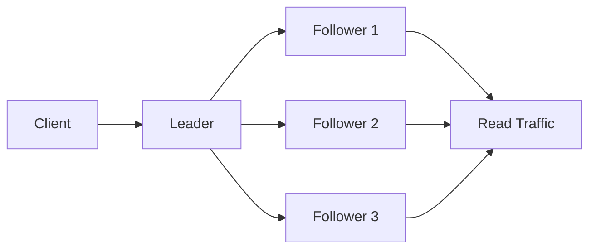
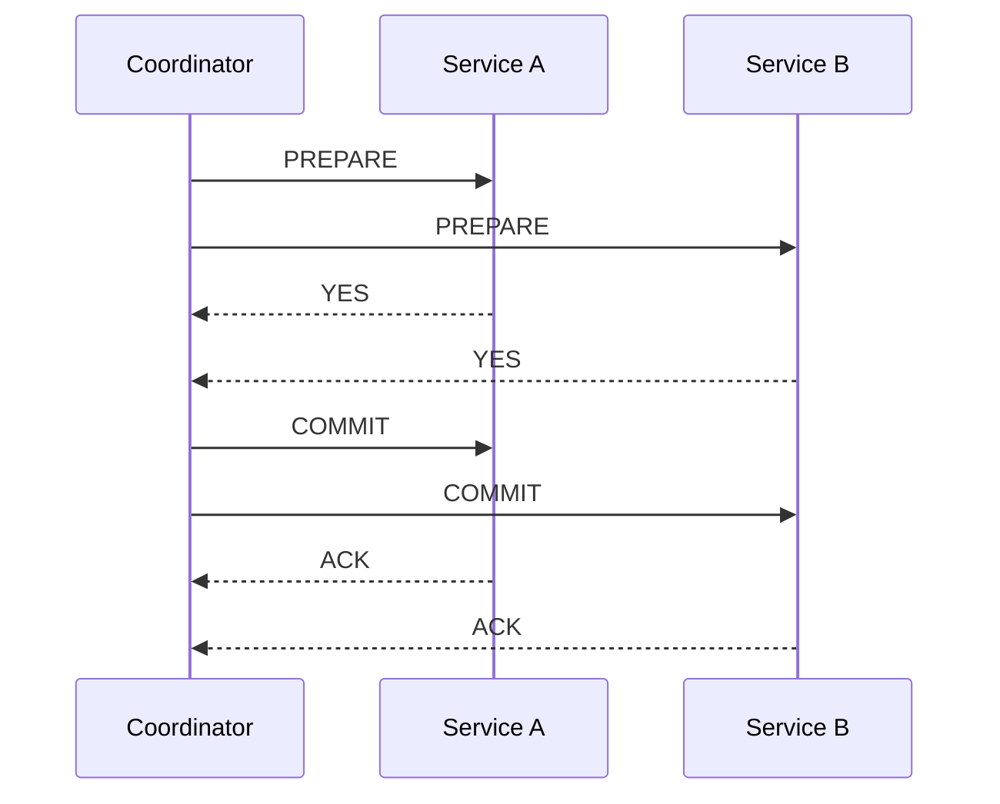
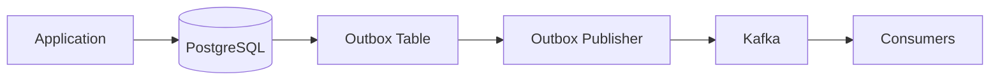
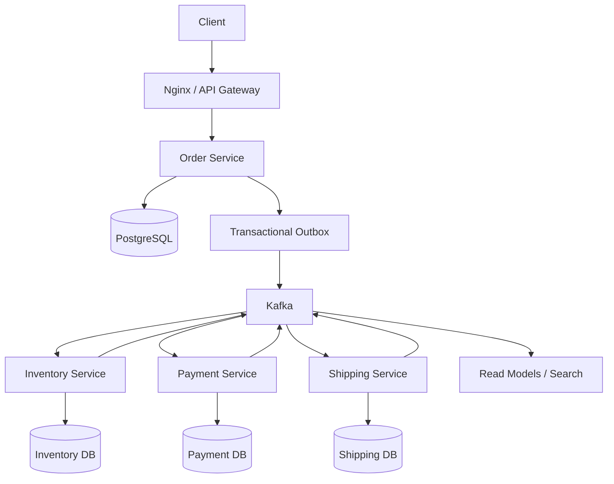

# 17- Summary

## Overview

Distributed systems are systems in which computation, state, and communication are spread across multiple independent processes or machines. Their complexity comes less from the individual components and more from the fact that those components communicate over unreliable networks while operating concurrently.

The central engineering challenge is that failures are no longer binary.

A service may be:

- Running but unreachable.
- Reachable but overloaded.
- Processing a request but unable to return the response.
- Connected to one dependency but disconnected from another.
- Holding stale state.
- Operating with an inaccurate clock.
- Temporarily partitioned from the rest of the system.
- Recovering while other nodes continue operating.

This means distributed-system design is fundamentally about **managing uncertainty**.

The major topics covered in this section can be grouped into several connected concerns:

```text
Distributed State
      |
      +-- Replication
      |     +-- Leader-Follower
      |     +-- Multi-Leader
      |     +-- Leaderless
      |
      +-- Consistency
      |     +-- Quorum
      |     +-- Eventual Consistency
      |     +-- Strong vs Weak Consistency
      |
      +-- Coordination
      |     +-- Consensus
      |     +-- Split Brain
      |     +-- Distributed Transactions
      |
      +-- Transactions
      |     +-- 2PC
      |     +-- Saga
      |
      +-- Time and Ordering
            +-- Physical Clocks
            +-- Logical Clocks
            +-- Causality
            +-- Event Ordering
```

A senior backend engineer should not memorize these mechanisms independently. The important skill is understanding **which failure mode or consistency requirement each mechanism solves, what it costs, and where it should not be used**.

---

## The Core Distributed Systems Model

A distributed system can be reasoned about using four fundamental dimensions:

| Dimension | Core Question |
|---|---|
| Communication | Can nodes communicate reliably? |
| State | Where is authoritative data stored? |
| Consistency | What values can clients observe? |
| Coordination | How do nodes agree on decisions? |

These dimensions interact.

For example, replicating PostgreSQL across multiple nodes introduces a state-management problem. If writes can occur on multiple replicas, conflict resolution becomes necessary. If replicas must agree on one ordering, coordination or consensus may be required.

A useful mental model is:

```text
                    Distributed System
                           |
          +----------------+----------------+
          |                |                |
      Communication      State          Coordination
          |                |                |
      Network loss     Replication       Consensus
      Timeouts         Versions          Quorum
      Retries          Conflicts         Elections
          |                |                |
          +----------------+----------------+
                           |
                       Consistency
```

---

## Failure Is a Normal Operating Condition

In a distributed system, failures should be expected rather than treated as exceptional.

Possible failures include:

- Process crashes
- Container restarts
- Node failures
- Network partitions
- DNS failures
- Load balancer failures
- Database failover
- Message duplication
- Message reordering
- Message loss
- Delayed messages
- Clock skew
- Partial deployments
- Dependency timeouts

A production architecture should therefore answer:

```text
What happens if this component disappears?

What happens if the response is lost?

What happens if the request succeeds but the client never receives the response?

What happens if the same message is delivered twice?

What happens if two nodes make conflicting decisions?

What happens if a node comes back with stale state?
```

These questions are often more important than the normal success path.

---

## Replication

Replication means maintaining multiple copies of data.

The primary motivations are:

- High availability
- Read scalability
- Fault tolerance
- Geographic distribution
- Disaster recovery

Replication does not automatically mean consistency.

A system can have:

```text
3 replicas
+
poor consistency
```

or:

```text
3 replicas
+
strong consistency
```

depending on how writes, reads, synchronization, and coordination are implemented.

---

## Leader-Follower Replication

In leader-follower replication, one node primarily accepts writes while followers replicate the leader's state.



Advantages:

- Simple write ownership
- Easier conflict management
- Read scaling
- Common operational model

Limitations:

- Leader can become a bottleneck
- Failover requires coordination
- Followers may lag
- Reads from followers can be stale

Typical systems include PostgreSQL streaming replication and many distributed databases.

---

## Multi-Leader Replication

Multi-leader replication allows multiple nodes or regions to accept writes.

```text
Region A                  Region B

Leader A  <------------>  Leader B
   |                         |
   v                         v
Replica A                 Replica B
```

This can reduce write latency for geographically distributed clients.

The cost is conflict management.

For example:

```text
Region A:
balance = 100
withdraw 30

Region B:
balance = 100
withdraw 50
```

Both regions may independently accept the operation.

Conflict resolution now becomes part of the system design.

Multi-leader replication is useful only when the application can define safe conflict semantics.

---

## Leaderless Replication

Leaderless systems allow multiple replicas to participate directly in reads and writes.

A common model uses:

```text
N = number of replicas
W = replicas required for a successful write
R = replicas required for a successful read
```

A common quorum condition is:

```text
R + W > N
```

This increases the probability that a read intersects with the replicas that acknowledged a write.

Leaderless designs can provide strong availability characteristics under some failure models, but conflict detection and reconciliation become application-level or database-level responsibilities.

---

## Quorum

Quorum is a mechanism for requiring agreement or participation from a subset of nodes.

For:

```text
N = 5
```

a majority quorum is:

```text
3
```

because:

```text
floor(N / 2) + 1 = 3
```

Majorities are important because two independent majorities cannot both be disjoint.

For example:

```text
Cluster = 5 nodes

Quorum A = {1, 2, 3}
Quorum B = {3, 4, 5}

Intersection = {3}
```

That intersection allows the system to establish a common point of agreement.

---

## Quorum Does Not Mean Consistency Automatically

A quorum is a coordination primitive, not a universal consistency guarantee.

For example:

```text
R + W > N
```

can reduce the probability of reading stale data in certain leaderless systems, but actual guarantees depend on:

- Replica selection
- Read repair
- Write repair
- Failure handling
- Versioning
- Concurrent writes
- Conflict resolution
- Network behavior

Quorum must therefore be evaluated together with the complete replication protocol.

---

## Consistency Models

Consistency describes what values clients are allowed to observe.

Common models include:

| Model | Main Property |
|---|---|
| Strong consistency | Reads reflect the latest committed state according to the system's defined ordering |
| Eventual consistency | Replicas converge if updates stop |
| Causal consistency | Causally related operations preserve their ordering |
| Read-your-writes | A client can observe its own successful writes |
| Monotonic reads | A client does not move backward to an older state |
| Session consistency | Multiple client-level consistency guarantees are combined |

The strongest model is not always the best model.

A social-media feed may tolerate stale data.

A financial balance generally cannot.

---

## Eventual Consistency

Eventual consistency allows replicas to temporarily disagree.

```text
Write
  |
  v
Replica A = X
Replica B = old
Replica C = old

        time passes

Replica A = X
Replica B = X
Replica C = X
```

The important property is eventual convergence when updates stop and communication resumes.

Advantages:

- High availability
- Lower coordination overhead
- Better geographic scalability
- Lower write latency in some architectures

Limitations:

- Stale reads
- Conflict handling
- More complex application semantics
- Harder debugging
- More complicated user experience

Eventual consistency should be an intentional business decision, not an accidental consequence of asynchronous replication.

---

## Strong vs Weak Consistency

The fundamental trade-off is:

```text
More coordination
      |
      v
Stronger guarantees
      |
      v
Higher latency / lower availability under some failures
```

Whereas:

```text
Less coordination
      |
      v
Weaker guarantees
      |
      v
Higher availability / lower latency
```

The correct design depends on business requirements.

For example:

| Domain | Typical Requirement |
|---|---|
| Bank balance | Strong |
| Inventory reservation | Strong or carefully coordinated |
| User profile | Often eventual |
| Search index | Eventual |
| Analytics | Eventual |
| Social feed | Eventual |
| Authentication state | Strong or tightly controlled |
| Cache | Weak / eventual |
| Payment status | Strong business semantics |

---

## Consensus

Consensus allows distributed nodes to agree on a value or sequence despite failures.

Common consensus algorithms include:

- Raft
- Paxos
- Multi-Paxos
- Variants used internally by distributed databases

Consensus typically requires a majority for safe progress.

For a five-node cluster:

```text
5 nodes
3 required for majority
2 can fail
```

This is why odd-sized consensus clusters are common.

Consensus is used for:

- Leader election
- Replicated logs
- Cluster membership
- Metadata management
- Configuration state
- Distributed coordination

Consensus is expensive because nodes must communicate and establish agreement.

---

## Split Brain

Split brain occurs when independent groups of nodes both believe they are authoritative.

Example:

```text
        Network Partition

   Node A ----X---- Node B
     |               |
  "I am leader"   "I am leader"
```

If both sides accept writes, the system can diverge.

Split brain prevention usually involves:

- Majority quorum
- Leader election
- Fencing
- Epochs
- Terms
- Lease mechanisms
- Consensus protocols

The critical principle is:

> A node must not retain authority merely because it cannot observe a newer authority.

---

## Epochs, Terms, and Fencing

Distributed systems often attach a monotonically increasing generation number to leadership.

Example:

```text
Term 10 → old leader
Term 11 → new leader
```

Any operation carrying:

```text
term = 10
```

can be rejected after:

```text
term = 11
```

This prevents stale leaders from modifying state after a leadership change.

Fencing tokens provide a similar safety mechanism for external resources.

These mechanisms are especially important when processes can pause for arbitrary durations.

---

## Distributed Transactions

A distributed transaction spans multiple independent resources or services.

For example:

```text
Order Service
      |
      +---- Order DB
      |
      +---- Inventory DB
      |
      +---- Payment Service
```

A traditional database transaction cannot automatically provide atomicity across all of these systems.

Distributed transaction strategies include:

- Two-Phase Commit
- Saga
- Outbox pattern
- Compensating transactions
- Idempotent operations
- Workflow orchestration

The correct choice depends on consistency requirements and system boundaries.

---

## Two-Phase Commit

2PC divides a distributed transaction into:

```text
Prepare
   |
   v
Commit
```

A coordinator asks participants whether they can commit.



2PC provides strong atomicity semantics but has significant operational costs.

The coordinator can become a critical dependency, and participants may hold resources while waiting for the final decision.

2PC is therefore generally more appropriate inside tightly controlled transactional environments than across loosely coupled microservices.

---

## Saga Pattern

A Saga decomposes a distributed business transaction into local transactions.

Example:

```text
Create Order
     |
     v
Reserve Inventory
     |
     v
Authorize Payment
     |
     v
Create Shipment
```

If a later operation fails, compensating operations undo the business effects:

```text
Create Shipment
      X

Compensate Payment
      |
      v
Release Inventory
      |
      v
Cancel Order
```

A Saga does not provide database-level atomicity across services.

Instead, it provides **business-level consistency through a sequence of local transactions and compensations**.

---

## Saga Orchestration vs Choreography

### Orchestration

A central coordinator controls the workflow.

```text
             Saga Orchestrator
             /       |       \
            v        v        v
        Order    Inventory  Payment
```

Advantages:

- Explicit workflow
- Easier monitoring
- Centralized retry policy
- Easier failure handling

Limitations:

- Orchestrator becomes an important component
- Workflow logic can become complex

### Choreography

Services react to events.

```text
OrderCreated
     |
     v
InventoryReserved
     |
     v
PaymentAuthorized
     |
     v
ShipmentCreated
```

Advantages:

- Loose coupling
- No central coordinator

Limitations:

- Harder to understand globally
- Event dependencies become implicit
- Debugging can be difficult
- Cyclic event dependencies can emerge

For complex business workflows, explicit orchestration is often easier to operate.

---

## Idempotency

Distributed systems frequently deliver operations more than once.

For example:

```text
Client → Payment Service
        |
        | timeout
        X
Client retries
        |
        v
Payment Service
```

The first request may have succeeded even though the response was lost.

Therefore:

```text
retry
```

does not necessarily mean:

```text
operation never happened
```

Idempotency keys allow the server to recognize repeated attempts.

Example:

```http
POST /payments
Idempotency-Key: 5d7e9f...
```

The service stores the result associated with the key and returns the same logical result for repeated requests.

---

## At-Least-Once Delivery

At-least-once delivery means a message is delivered one or more times.

Therefore consumers should be designed for duplicates:

```text
Event A
Event A
Event A
```

Common techniques include:

- Event IDs
- Idempotency keys
- Processed-event tables
- Unique database constraints
- Conditional updates
- Version checks

A robust event consumer often follows:

```text
receive event
    |
    v
validate event
    |
    v
check idempotency
    |
    v
perform local transaction
    |
    v
record processed event
```

The idempotency record and business update should normally be committed atomically when they share a database.

---

## Transactional Outbox

A service may need to update its database and publish an event.

This is unsafe:

```text
UPDATE database
       |
       v
PUBLISH Kafka event
```

because the application may crash between the two operations.

The outbox pattern writes both the business state and an event record into the same database transaction:

```text
Transaction
    |
    +---- Business Update
    |
    +---- Outbox Event
```

A separate publisher then sends the outbox event to Kafka.



This provides a reliable bridge between database state and asynchronous messaging.

---

## Time and Ordering

Distributed systems cannot assume perfectly synchronized clocks.

A machine can have:

```text
Clock A = 10:00:00.100
Clock B = 10:00:00.050
```

This makes timestamp comparison unreliable for determining causality.

Use:

- Wall-clock time for human-readable timestamps
- Monotonic clocks for elapsed durations
- Versions for entity state
- Sequence numbers for ordered streams
- Logical clocks for causal relationships
- Partition offsets for Kafka ordering
- Consensus or ordered logs for stronger global ordering

A crucial distinction is:

```text
Physical time
    ≠
Logical time
    ≠
Causal ordering
```

---

## Practical Python Time Handling

For elapsed-time measurement:

```python
import time

start = time.monotonic()

# Perform work.

elapsed = time.monotonic() - start
```

For timestamps:

```python
from datetime import datetime, timezone

created_at = datetime.now(timezone.utc)
```

The distinction should remain explicit in application code.

Do not use a wall-clock timestamp as a substitute for a monotonic deadline.

---

## Ordering in Kafka

Kafka guarantees ordering within a partition.

For aggregate-level ordering:

```text
key = aggregate_id
```

For example:

```text
Order 123 → Partition 4

OrderCreated
PaymentAuthorized
OrderShipped
```

All events for that order remain ordered within the partition.

Kafka does not provide global ordering across partitions.

Therefore:

```text
per-order ordering
```

is generally practical, while:

```text
global event ordering
```

is substantially more expensive.

---

## A Unified Architecture

A production microservices system can combine the mechanisms discussed throughout this section.



Different guarantees apply at different layers:

| Layer | Typical Mechanism |
|---|---|
| HTTP request timeout | Monotonic deadline |
| API idempotency | Idempotency key |
| Local database consistency | ACID transaction |
| Database concurrency | MVCC / versioning |
| Database-to-event reliability | Transactional outbox |
| Event delivery | At-least-once + idempotent consumers |
| Per-order event ordering | Kafka partition key |
| Distributed workflow | Saga |
| Strong distributed agreement | Consensus |
| Cluster leadership | Election + quorum + fencing |
| Read scalability | Replication |
| Cross-region state | Replication + conflict strategy |

This separation is important because a system rarely uses one consistency mechanism for everything.

---

## CAP and Distributed Systems Trade-offs

CAP is frequently oversimplified.

The important point is that during a network partition, a distributed system cannot simultaneously guarantee both:

```text
Consistency
+
Availability
```

in the strongest CAP interpretation.

During normal operation, a system may provide both strong consistency and high availability.

The trade-off becomes visible when communication between nodes fails.

```text
          Network Partition
                 |
        +--------+--------+
        |                 |
   Preserve C         Preserve A
        |                 |
 Reject some          Continue serving
 operations           requests
```

This does not mean:

```text
CP = always unavailable
AP = always inconsistent
```

The actual behavior depends on the system's protocol and failure mode.

CAP describes a specific partition-time trade-off; it is not a complete description of all distributed-system behavior.

---

## PACELC

PACELC extends the CAP discussion.

It asks:

```text
If Partition:
    choose Availability or Consistency

Else:
    choose Latency or Consistency
```

This highlights a production reality:

Even without a partition, stronger consistency can require additional coordination and therefore higher latency.

For globally distributed systems, this trade-off is often more relevant to architecture decisions than CAP alone.

---

## Choosing Consistency

A useful engineering process is to start from the business invariant.

Ask:

```text
What must never happen?
```

Examples:

### Financial Balance

```text
Balance < 0
```

may be forbidden.

Strong transactional guarantees are therefore important.

### Product Catalog

A product description being stale for a few seconds may be acceptable.

Eventual consistency may be appropriate.

### Inventory

Overselling a product may be unacceptable.

The design may require:

- Strong transactional updates
- Conditional writes
- Reservation semantics
- Serializable or carefully selected isolation
- Idempotency

The correct consistency model comes from the invariant, not from the technology preference.

---

## Production Reliability Checklist

A distributed backend should explicitly address:

### Communication

- Request timeouts
- Connection timeouts
- Retry policy
- Backoff
- Jitter
- Circuit breaking
- Load shedding

### State

- Source of truth
- Replication
- Versioning
- Conflict resolution
- Data ownership

### Messaging

- Delivery semantics
- Idempotency
- Ordering
- Dead-letter handling
- Replay
- Schema evolution

### Transactions

- Local transaction boundaries
- Outbox
- Saga
- Compensation
- Atomicity requirements

### Coordination

- Leader election
- Quorum
- Fencing
- Consensus
- Split-brain prevention

### Time

- Clock synchronization
- Monotonic timers
- Expiration semantics
- Clock skew tolerance

### Observability

- Metrics
- Structured logs
- Trace IDs
- Distributed tracing
- Correlation IDs
- Audit events

---

## Monitoring and Operational Considerations

Distributed-system correctness depends heavily on observability.

Monitor:

| Signal | Why It Matters |
|---|---|
| Replication lag | Detect stale replicas |
| Consumer lag | Detect event-processing delays |
| Retry rate | Detect dependency instability |
| Timeout rate | Detect latency or availability problems |
| Duplicate event rate | Detect delivery or consumer issues |
| Dead-letter volume | Detect processing failures |
| Leader changes | Detect cluster instability |
| Quorum failures | Detect loss of coordination capacity |
| Clock offset | Detect time synchronization issues |
| Saga duration | Detect workflow bottlenecks |
| Compensation rate | Detect business failures |
| Outbox backlog | Detect event-publishing delays |

For critical systems, alerts should focus on user and business impact rather than only infrastructure symptoms.

---

## Scalability Considerations

Distributed-system mechanisms often introduce additional state and coordination.

For example:

```text
More replicas
    ↓
More network communication
    ↓
More coordination
    ↓
More operational complexity
```

Similarly:

```text
More partitions
    ↓
More throughput
    ↓
More distributed ordering complexity
```

Scaling should therefore preserve the minimum coordination required by the business invariant.

Useful strategies include:

- Partition by aggregate ID
- Keep transactions local where possible
- Avoid unnecessary cross-service synchronous calls
- Use asynchronous processing for non-critical workflows
- Keep ownership of mutable state clear
- Prefer immutable events for integration
- Use read models for query scalability
- Avoid global locks

---

## Cost Considerations

Distributed coordination has direct infrastructure and operational cost.

Examples:

```text
More replicas
→ more compute and storage

More regions
→ higher network transfer and replication costs

Global consensus
→ more cross-region communication

Synchronous dependencies
→ more infrastructure required for low latency

Large event histories
→ more storage and retention cost
```

The cheapest architecture is not necessarily the architecture with the fewest servers.

Operational complexity also has a cost.

A simple single-region transactional design may be more appropriate than a globally replicated architecture if the business does not require global availability.

---

## Disaster Recovery

Replication and disaster recovery are related but not identical.

Replication protects against some failures:

```text
Primary → Replica
```

but accidental writes may also replicate:

```text
DELETE data
   |
   v
Replica
```

Therefore production systems may also require:

- Backups
- Point-in-time recovery
- Cross-region copies
- Immutable backups
- Recovery testing
- Documented RPO
- Documented RTO

### RPO

Recovery Point Objective answers:

```text
How much data can we afford to lose?
```

### RTO

Recovery Time Objective answers:

```text
How long can the system be unavailable?
```

Replication alone does not guarantee either objective.

---

## Security Considerations

Distributed coordination mechanisms must also be secured.

Protect:

- Inter-service authentication
- Kafka credentials
- Database credentials
- Consensus communication
- Cluster membership
- Administrative APIs
- Replication channels
- Event payloads
- Audit records

Use:

- TLS
- Service identity
- Least-privilege credentials
- Secret management
- Network segmentation
- Authentication and authorization
- Audit logging

A compromised service participating in a coordination protocol can have significantly greater impact than a compromised stateless API worker.

---

## Common Production Mistakes

### Adding Replication Without Defining Read Semantics

A replica can be stale.

Clients must know whether stale reads are acceptable.

### Using Retries Without Idempotency

Retries can duplicate business operations.

### Assuming Exactly-Once Delivery

Exactly-once semantics are often expensive and narrowly defined.

Application-level idempotency is usually still required.

### Using Distributed Transactions Everywhere

2PC can introduce latency, coupling, and operational complexity.

Prefer local transactions plus events and Saga-style workflows when business semantics allow it.

### Ignoring Message Reordering

At-least-once delivery does not automatically guarantee ordering.

### Treating Eventual Consistency as a Bug

Stale reads may be intentional.

The important question is whether the observed behavior violates the business invariant.

### Using Timestamps as the Only Version

Clock skew can produce incorrect conflict resolution.

### Creating Global Locks

Global coordination becomes a scalability bottleneck and creates a large failure domain.

### Designing for the Happy Path Only

The difficult part of distributed systems is usually:

```text
timeout
+
retry
+
partial failure
+
duplicate
+
reordering
+
recovery
```

not the normal request path.

---

## Interview-Level Mental Models

When designing a distributed system, reason in this order:

### Identify State Ownership

Ask:

```text
Which service owns this data?
```

Avoid multiple services independently mutating the same authoritative state.

### Define the Business Invariant

Ask:

```text
What must never happen?
```

This determines the consistency requirement.

### Define Failure Semantics

Ask:

```text
What happens when a dependency times out?

What happens when a response is lost?

What happens when the same message arrives twice?

What happens when nodes cannot communicate?
```

### Define Ordering

Ask:

```text
Does ordering matter?

If yes, what scope?

Per request?
Per user?
Per order?
Per partition?
Global?
```

### Define Delivery Semantics

Choose deliberately:

```text
At-most-once
At-least-once
Effectively-once through idempotency
```

### Define Recovery

Ask:

```text
How does the system recover after:

- crash
- network partition
- leader failure
- duplicate message
- stale replica
- partial workflow failure
```

This approach produces much stronger system-design answers than starting with a list of technologies.

---

## Technology Mapping

The distributed-system concepts in this section map to common backend technologies.

| Concept | Example Technology |
|---|---|
| HTTP service | Django / FastAPI |
| Reverse proxy | Nginx |
| Local transaction | PostgreSQL |
| Replication | PostgreSQL streaming replication |
| Cache | Redis |
| Event streaming | Kafka |
| Background processing | Celery |
| Container deployment | Docker |
| Scheduling / orchestration | Kubernetes |
| Distributed tracing | OpenTelemetry-compatible systems |
| Cloud infrastructure | AWS |
| Consensus | Raft-based systems |
| Distributed workflow | Saga / workflow engines |
| Reliable event publication | Transactional outbox |

The important skill is not memorizing which product implements which algorithm.

It is understanding:

```text
Requirement
    ↓
Consistency requirement
    ↓
Failure model
    ↓
Ordering requirement
    ↓
Coordination requirement
    ↓
Appropriate mechanism
    ↓
Technology implementation
```

---

## A Practical Design Heuristic

When evaluating a distributed design, ask these questions:

| Question | Design Decision |
|---|---|
| Who owns the data? | Service boundary |
| Can reads be stale? | Consistency model |
| Can writes conflict? | Versioning / conflict resolution |
| Can requests be duplicated? | Idempotency |
| Can events be duplicated? | Idempotent consumers |
| Does event order matter? | Sequence / partitioning |
| Must operations be atomic across services? | 2PC / Saga / redesign |
| Can nodes disagree about leadership? | Quorum / consensus / fencing |
| How are durations measured? | Monotonic clock |
| How are timestamps represented? | UTC wall-clock time |
| How are failures recovered? | Retry / replay / compensation |
| What happens during a partition? | Explicit availability/consistency policy |
| How is correctness observed? | Metrics / logs / tracing |
| How is data recovered? | Backup / PITR / DR |

This checklist turns abstract distributed-system theory into practical architecture decisions.

---

## Final Architecture Perspective

The most important lesson from distributed systems is that **coordination is expensive**.

A design becomes increasingly difficult as it requires:

```text
More nodes
    +
More regions
    +
More shared state
    +
More synchronous communication
    +
Stronger consistency
    +
Global ordering
```

The objective of a good architecture is therefore not to eliminate distributed-system problems. It is to **contain them**.

Prefer:

```text
Local transaction
      >
Distributed transaction

Per-aggregate ordering
      >
Global ordering

Idempotent retry
      >
Exactly-once assumptions

Explicit versioning
      >
Timestamp-based conflict resolution

Asynchronous integration
      >
Unnecessary synchronous coupling
```

This does not mean stronger guarantees are always wrong. Financial systems, inventory systems, identity systems, and coordination infrastructure may legitimately require strong consistency and consensus.

The engineering decision should always be driven by the invariant and failure model.

---

## Key Takeaways

- Distributed-system design is primarily about managing partial failure, replicated state, consistency, coordination, ordering, and recovery rather than simply adding more servers.
- Replication, quorum, consensus, transactions, Saga, idempotency, and event ordering solve different problems and should not be treated as interchangeable mechanisms.
- Start architecture decisions with the business invariant, data ownership, consistency requirement, ordering scope, and failure model before selecting technologies.
- Prefer the smallest amount of distributed coordination that satisfies the business requirement; unnecessary global coordination increases latency, cost, coupling, and operational risk.
- Production distributed systems must be designed for retries, duplicates, stale state, reordering, network partitions, leader failures, clock skew, recovery, and observability from the beginning.