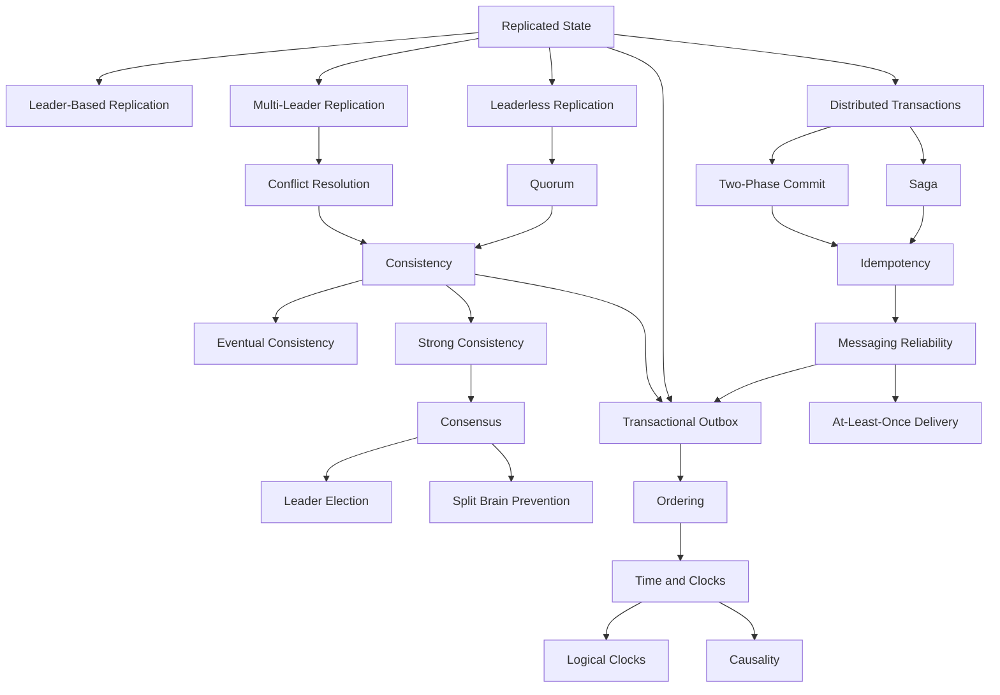
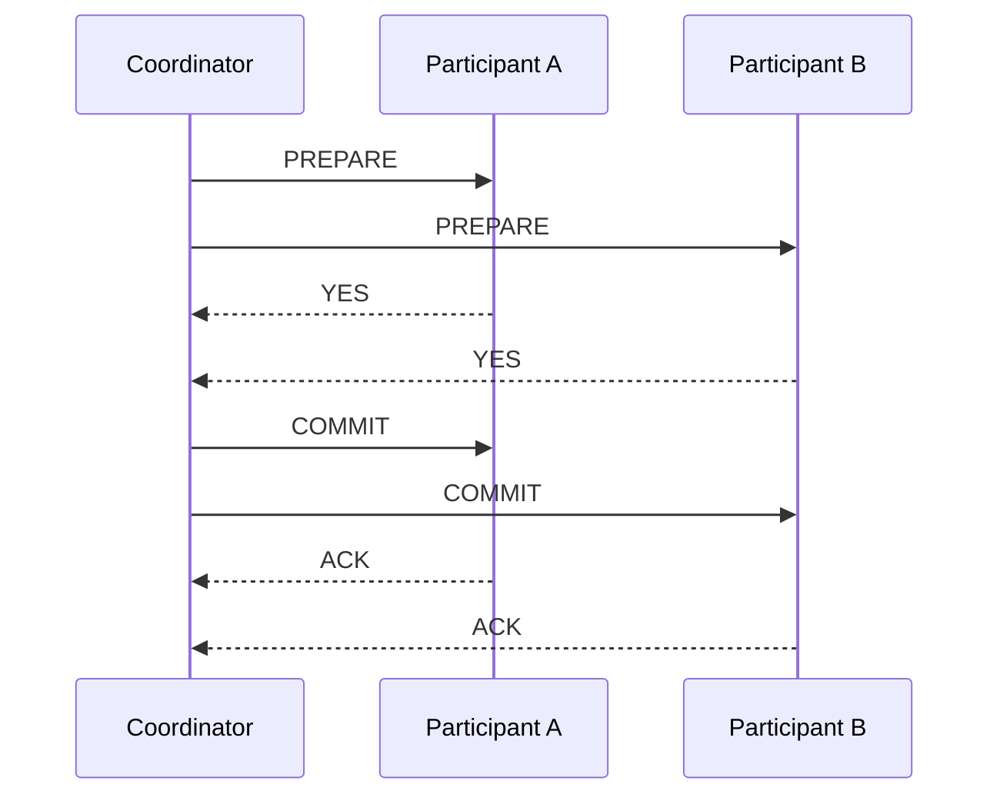
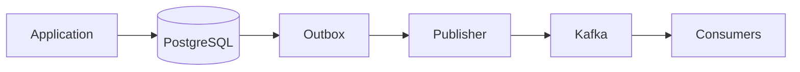
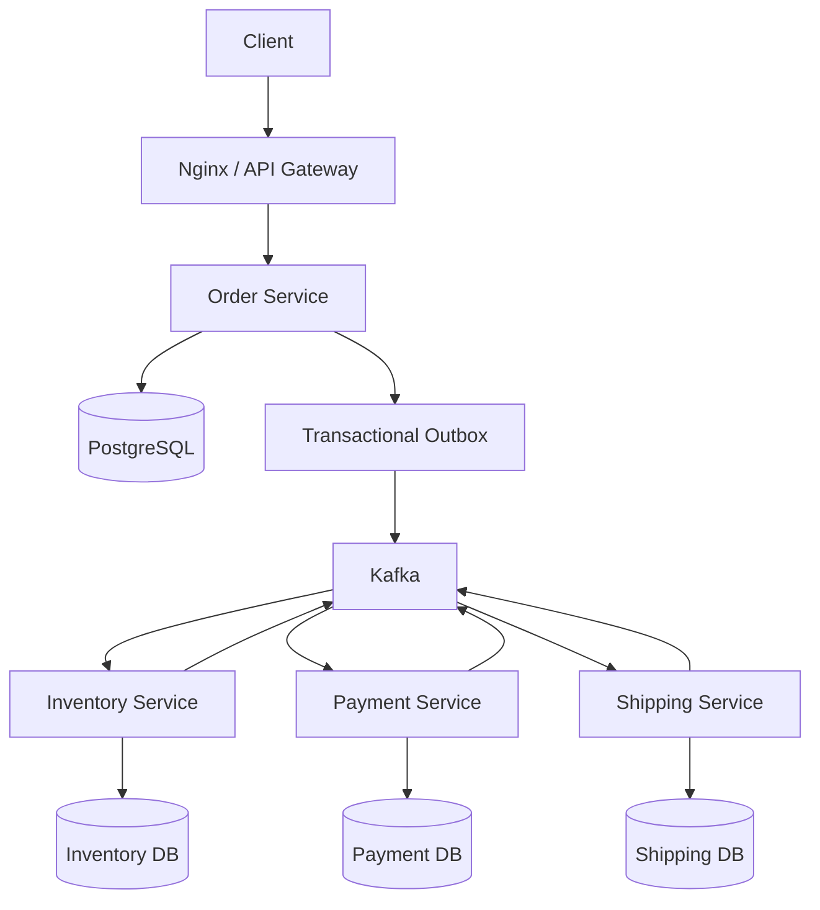

# README.md

## Overview

This section covers the core concepts required to design, reason about, and operate distributed systems reliably.

Distributed systems introduce challenges that do not exist in a single-process or single-database application: partial failures, network partitions, replicated state, stale data, concurrent writes, message duplication, ordering, clock skew, and coordination between independent nodes.

The focus of this section is not on memorizing distributed-systems terminology. The objective is to develop the engineering judgment required to answer questions such as:

- Where should state live?
- Which service owns the state?
- How consistent must reads and writes be?
- What happens when a node fails?
- What happens when a network partition occurs?
- Can an operation be safely retried?
- Can messages be duplicated or reordered?
- How do multiple nodes agree on a decision?
- When should a distributed transaction be used?
- When should eventual consistency be accepted?
- How should a system recover after partial failure?

The topics progress from replication and quorum mechanisms into consistency, consensus, distributed transactions, and time/ordering.

---

## Folder Structure

```text
02- Distributed Systems/
├── README.md
├── 01- CAP Theorem.md
├── 02- Consistency Models.md
├── 03- PACELC Theorem.md
├── 04- Replication.md
├── 05- Leader-Follower Replication.md
├── 06- Multi-Leader Replication.md
├── 07- Leaderless Replication.md
├── 08- Quorum.md
├── 09- Consensus Algorithms.md
├── 10- Split Brain Problem.md
├── 11- Distributed Transactions.md
├── 12- Two-Phase Commit (2PC).md
├── 13- Saga Pattern.md
├── 14- Eventual Consistency.md
├── 15- Strong vs Weak Consistency.md
├── 16- Time, Clocks & Ordering.md
└── 17- Summary.md
```

---

## Quick Navigation

| Topic | Description |
|---|---|
| [01- CAP Theorem](./01-%20CAP%20Theorem.md) | The trade-offs among consistency, availability, and partition tolerance in distributed systems |
| [02- Consistency Models](./02-%20Consistency%20Models.md) | Read and write guarantees such as linearizability, causal consistency, and eventual consistency |
| [03- PACELC Theorem](./03-%20PACELC%20Theorem.md) | Extending CAP with trade-offs under normal operation and partition scenarios |
| [04- Replication](./04-%20Replication.md) | Copying data across nodes to improve availability, durability, and read scale |
| [05- Leader-Follower Replication](./05-%20Leader-Follower%20Replication.md) | Single-leader replication patterns, failover, and replication lag |
| [06- Multi-Leader Replication](./06-%20Multi-Leader%20Replication.md) | Multiple writers and coordination strategies across replicas |
| [07- Leaderless Replication](./07-%20Leaderless%20Replication.md) | Replication without a single write leader and the mechanics of distributed reads and writes |
| [08- Quorum](./08-%20Quorum.md) | Quorum reads, writes, majority agreement, and replica intersection |
| [09- Consensus Algorithms](./09-%20Consensus%20Algorithms.md) | Distributed agreement, leader election, Raft, Paxos, and replicated logs |
| [10- Split Brain Problem](./10-%20Split%20Brain%20Problem.md) | Preventing multiple nodes from independently acting as authoritative leaders |
| [11- Distributed Transactions](./11-%20Distributed%20Transactions.md) | Transaction boundaries across services and independent data stores |
| [12- Two-Phase Commit (2PC)](./12-%20Two-Phase%20Commit%20(2PC).md) | Coordinator-based distributed atomic commit |
| [13- Saga Pattern](./13-%20Saga%20Pattern.md) | Distributed workflows using local transactions and compensating actions |
| [14- Eventual Consistency](./14-%20Eventual%20Consistency.md) | Designing systems where replicas converge asynchronously |
| [15- Strong vs Weak Consistency](./15-%20Strong%20vs%20Weak%20Consistency.md) | Comparing consistency guarantees and their performance implications |
| [16- Time, Clocks & Ordering](./16-%20Time,%20Clocks%20&%20Ordering.md) | Physical clocks, logical clocks, causality, timestamps, and event ordering |
| [17- Summary](./17-%20Summary.md) | Consolidated distributed-systems concepts and production design heuristics |

---

## Concept Map

The topics in this section are strongly interconnected.



---

## Replication

Replication means maintaining multiple copies of data across different nodes.

It is primarily used for:

- High availability
- Read scalability
- Fault tolerance
- Disaster recovery
- Geographic distribution

Replication introduces a fundamental question:

> When multiple copies of the same data exist, which copy is authoritative and what may clients observe?

Common replication architectures include:

| Model | Write Strategy | Main Benefit | Main Complexity |
|---|---|---|---|
| Leader-follower | Writes primarily go to leader | Simple conflict model | Leader failure and replication lag |
| Multi-leader | Multiple nodes accept writes | Geographic write availability | Conflict resolution |
| Leaderless | Multiple replicas participate | High availability | Read/write reconciliation |
| Consensus-backed | Replicated state machine | Strong agreement | Coordination overhead |

Replication and consistency are separate concerns.

A system can replicate data aggressively while still allowing stale reads.

---

## Leaderless Replication

Leaderless replication removes the requirement for one node to own all writes.

For:

```text
N = total replicas
W = replicas required for write
R = replicas required for read
```

a common quorum relationship is:

```text
R + W > N
```

For example:

```text
N = 5
W = 3
R = 3
```

Because:

```text
3 + 3 > 5
```

the read and write sets must overlap.

Leaderless systems can provide strong availability characteristics, but the exact consistency behavior depends on:

- Replica selection
- Versioning
- Conflict detection
- Read repair
- Write repair
- Failure handling
- Concurrent writes

---

## Quorum

Quorum requires a sufficient subset of nodes to participate before an operation is considered successful.

For a five-node cluster:

```text
Majority = 3
```

A majority is useful because two different majorities cannot be completely disjoint.

```text
Quorum A = {A, B, C}
Quorum B = {C, D, E}

Intersection = C
```

This intersection provides a basis for establishing shared agreement.

Quorum is commonly used for:

- Replicated writes
- Replicated reads
- Leader elections
- Consensus protocols
- Cluster membership
- Distributed coordination

Quorum does not automatically imply strong consistency. The guarantees come from the complete protocol surrounding the quorum.

---

## Consensus Algorithms

Consensus allows distributed nodes to agree on a value, leader, or sequence of operations despite certain failures.

Common algorithms include:

- Raft
- Paxos
- Multi-Paxos

Consensus is commonly used for:

- Leader election
- Replicated logs
- Metadata
- Configuration
- Cluster membership
- Coordination

A typical majority-based cluster behaves approximately like:

```text
5 nodes
3-node majority required
2 node failures tolerated
```

The majority requirement prevents two independent groups from simultaneously making authoritative decisions.

Consensus generally requires network communication and therefore introduces latency and operational complexity.

---

## Split Brain

Split brain occurs when multiple groups of nodes independently believe they are authoritative.

```text
             Network Partition

        Node A  -----X-----  Node B
          |                    |
      "I am leader"       "I am leader"
```

If both sides accept writes, the system can diverge.

Common safeguards include:

- Majority quorum
- Leader election
- Terms or epochs
- Fencing tokens
- Leases
- Consensus protocols

A particularly important technique is the use of monotonically increasing terms:

```text
Old leader → term 10
New leader → term 11
```

Operations from term 10 can be rejected once term 11 becomes authoritative.

---

## Distributed Transactions

A distributed transaction involves multiple independent transactional resources.

For example:

```text
Order Service
     |
     +---- Order DB
     |
     +---- Inventory DB
     |
     +---- Payment Service
```

A local PostgreSQL transaction cannot automatically provide atomicity across all of these components.

Common approaches include:

- Two-Phase Commit
- Saga
- Transactional Outbox
- Idempotent operations
- Compensating transactions
- Workflow orchestration

The design should start with the business invariant rather than the transaction technology.

---

## Two-Phase Commit

2PC separates distributed commit into two phases:

```text
Prepare
   ↓
Commit
```

The coordinator asks participants whether they can commit.



The primary advantage is atomic commit across participants.

The primary cost is coordination.

Participants may hold resources while waiting for the coordinator's decision, and coordinator failure can complicate recovery.

2PC is therefore generally more suitable for tightly controlled transactional environments than loosely coupled internet-scale microservices.

---

## Saga Pattern

A Saga decomposes a business transaction into a sequence of local transactions.

Example:

```text
Create Order
     ↓
Reserve Inventory
     ↓
Authorize Payment
     ↓
Create Shipment
```

If a later step fails, previously completed business actions can be compensated:

```text
Create Shipment
      X
      ↓
Refund Payment
      ↓
Release Inventory
      ↓
Cancel Order
```

A Saga does not provide database-level atomicity across services.

It provides business-level consistency through:

```text
Local Transactions
+
Events / Commands
+
Compensating Actions
```

Two major implementations are:

### Orchestration

A central Saga coordinator controls the workflow.

```text
             Orchestrator
             /     |     \
            v      v      v
         Order  Inventory Payment
```

### Choreography

Services react to events emitted by other services.

```text
OrderCreated
     ↓
InventoryReserved
     ↓
PaymentAuthorized
     ↓
ShipmentCreated
```

Orchestration is often easier to observe and operate for complex workflows. Choreography can reduce central coupling but may become difficult to reason about as the number of events increases.

---

## Eventual Consistency

Eventual consistency permits replicas to temporarily disagree.

```text
Write
  |
  v
Replica A = NEW
Replica B = OLD
Replica C = OLD

       time passes

Replica A = NEW
Replica B = NEW
Replica C = NEW
```

The expected property is convergence if updates stop and communication resumes.

Typical use cases include:

- Search indexes
- Analytics
- Recommendation systems
- Social feeds
- Read models
- Caches
- Non-critical replicas

Eventual consistency is not automatically a performance optimization. It changes application semantics.

The application must tolerate:

- Stale reads
- Delayed visibility
- Concurrent updates
- Reordering
- Temporary disagreement

---

## Strong vs Weak Consistency

Consistency should be selected based on business requirements.

| Workload | Typical Requirement |
|---|---|
| Financial balance | Strong |
| Payment state | Strong business semantics |
| Inventory reservation | Strong or carefully coordinated |
| Search index | Eventual |
| Analytics | Eventual |
| Social feed | Eventual |
| Cache | Weak / eventual |
| Product catalog | Often eventual |
| User profile | Often eventual |

A useful design principle is:

> Define the invariant before choosing the consistency model.

For example:

```text
Invariant:
A product cannot be sold more times than available inventory.
```

This may justify stronger coordination around inventory reservations even if the rest of the product catalog is eventually consistent.

---

## Time, Clocks, and Ordering

Distributed nodes do not share a perfectly synchronized clock.

For example:

```text
Server A: 10:00:00.100
Server B: 10:00:00.050
```

Therefore, timestamps alone cannot reliably establish causality.

Distinguish between:

| Concept | Purpose |
|---|---|
| Wall-clock time | Human-readable timestamps |
| Monotonic clock | Measuring elapsed duration |
| Sequence number | Explicit ordering |
| Logical clock | Capturing causal relationships |
| Kafka partition offset | Ordering within a partition |
| Version number | Detecting stale state |

For elapsed durations in Python:

```python
import time

started_at = time.monotonic()

# Perform work.

elapsed_seconds = time.monotonic() - started_at
```

For UTC timestamps:

```python
from datetime import datetime, timezone

created_at = datetime.now(timezone.utc)
```

Do not use wall-clock time as a replacement for a monotonic clock when calculating deadlines or durations.

---

## Ordering

Ordering is usually meaningful only within a defined scope.

Kafka, for example, guarantees ordering within a partition.

If all events for an order use the same key:

```text
key = order_id
```

then:

```text
OrderCreated
PaymentAuthorized
OrderShipped
```

can remain ordered for that order.

Kafka does not provide global ordering across all partitions.

A senior design should therefore explicitly state:

```text
What needs to be ordered?
```

Possible answers include:

- Per request
- Per user
- Per aggregate
- Per partition
- Per tenant
- Per region
- Globally

Global ordering is substantially more expensive and often unnecessary.

---

## Idempotency

Distributed systems commonly retry operations because of timeouts and transient failures.

The critical ambiguity is:

```text
Request timed out
```

does not necessarily mean:

```text
Operation failed
```

The server may have completed the operation while the response was lost.

Idempotency allows repeated attempts to produce the same logical outcome.

Example:

```http
POST /payments
Idempotency-Key: 9e5e1a2c-...
```

The service stores the result associated with the key.

Repeated requests with the same key can return the existing result rather than charging the customer again.

Idempotency is particularly important for:

- Payments
- Orders
- Inventory reservations
- Account creation
- Message consumers
- Background jobs

---

## At-Least-Once Delivery

Many messaging systems use at-least-once delivery.

Therefore:

```text
Event A
Event A
```

is a valid delivery pattern.

Consumers should generally be idempotent.

Common techniques include:

- Event IDs
- Idempotency keys
- Processed-event tables
- Unique constraints
- Conditional writes
- Entity version checks

A reliable consumer often follows:

```text
Receive
   ↓
Validate
   ↓
Check idempotency
   ↓
Execute local transaction
   ↓
Record processing
   ↓
Acknowledge
```

The business update and processed-event record should normally be committed atomically when both use the same database.

---

## Transactional Outbox

Updating a database and publishing an event independently creates a reliability gap.

Unsafe pattern:

```text
UPDATE PostgreSQL
       ↓
publish Kafka event
```

The process can crash between the two operations.

The transactional outbox pattern writes both the business change and the event record inside the same local transaction:

```text
PostgreSQL Transaction
        |
        +---- Business Data
        |
        +---- Outbox Event
```

A separate publisher reads the outbox and sends events to Kafka.



The publisher must itself tolerate retries and duplicate publication.

Therefore, transactional outbox and idempotent consumers are commonly used together.

---

## How the Concepts Fit Together

A production microservice architecture may combine several mechanisms:



Each mechanism solves a different problem:

| Problem | Typical Mechanism |
|---|---|
| Read scalability | Replication |
| Replica agreement | Quorum |
| Strong distributed agreement | Consensus |
| Leader election | Consensus |
| Split-brain prevention | Quorum + terms + fencing |
| Local atomicity | PostgreSQL transaction |
| Cross-service workflow | Saga |
| Atomic distributed commit | 2PC |
| Database/event reliability | Transactional outbox |
| Duplicate requests | Idempotency |
| Duplicate events | Idempotent consumers |
| Event ordering | Partitioning / sequence numbers |
| Stale replicas | Consistency strategy |
| Elapsed time | Monotonic clocks |
| Causal relationships | Logical clocks / versions |

---

## CAP and PACELC

CAP is useful when reasoning about network partitions.

During a partition, a system must make a trade-off between:

```text
Consistency
        vs
Availability
```

This does not mean that CP systems are always unavailable or AP systems are always inconsistent.

The actual behavior depends on the protocol and the specific operation.

PACELC extends this reasoning:

```text
If Partition:
    Consistency vs Availability

Else:
    Latency vs Consistency
```

This highlights an important production trade-off.

Even without failures, stronger consistency can require additional coordination and therefore increase latency.

---

## Production Design Principles

### Keep State Ownership Clear

Each mutable business entity should have a clearly defined source of truth.

Avoid multiple services independently modifying authoritative state.

### Keep Transactions Local

Prefer:

```text
Local transaction
+
Reliable event
+
Idempotent consumer
```

over unnecessary distributed transactions.

### Make Retries Safe

Every retryable operation should have clearly defined idempotency behavior.

### Define Ordering Explicitly

Do not assume global ordering.

Choose the smallest ordering scope that satisfies the business requirement.

### Make Failure Recovery Explicit

Document what happens after:

- Node failure
- Network partition
- Timeout
- Duplicate message
- Reordered message
- Leader failure
- Stale replica
- Partial Saga failure

### Monitor Business Correctness

Infrastructure metrics alone are insufficient.

Useful metrics include:

- Replication lag
- Consumer lag
- Retry rate
- Duplicate-event rate
- Saga compensation rate
- Outbox backlog
- Leader changes
- Quorum failures
- Workflow duration
- Dead-letter volume

---

## Distributed Systems Decision Framework

When designing a distributed backend, use this sequence:

```text
Business Requirement
        ↓
Business Invariant
        ↓
Data Ownership
        ↓
Consistency Requirement
        ↓
Ordering Requirement
        ↓
Failure Model
        ↓
Delivery Semantics
        ↓
Coordination Requirement
        ↓
Recovery Strategy
        ↓
Technology Selection
```

For example:

```text
Requirement:
Prevent inventory overselling

        ↓

Invariant:
Reserved quantity <= available quantity

        ↓

Consistency:
Strong around reservation state

        ↓

Ordering:
Per-product / per-inventory-unit where required

        ↓

Failure Handling:
Retry safely

        ↓

Idempotency:
Reservation ID

        ↓

Implementation:
PostgreSQL transaction +
conditional update +
outbox +
idempotent event consumer
```

This approach is more reliable than selecting technologies first.

---

## Technology Mapping

The concepts in this section map naturally to a modern backend stack:

| Concept | Technology Example |
|---|---|
| API layer | Django / FastAPI |
| Reverse proxy | Nginx |
| Transactional database | PostgreSQL |
| Cache | Redis |
| Event streaming | Kafka |
| Background jobs | Celery |
| Containers | Docker |
| Container orchestration | Kubernetes |
| Cloud infrastructure | AWS |
| Replication | PostgreSQL replicas / distributed databases |
| Consensus | Raft-based coordination systems |
| Distributed workflow | Saga / workflow orchestration |
| Reliable event publication | Transactional Outbox |
| Distributed tracing | OpenTelemetry-compatible tooling |

The goal is not to memorize products.

The goal is to understand the underlying mechanism and recognize how a technology implements it.

---

## Common Interview Traps

### "Quorum means strong consistency"

Not necessarily.

Quorum is a mechanism. The complete replication and conflict-resolution protocol determines the consistency guarantees.

### "Kafka guarantees exactly-once processing"

Exactly-once semantics have a specific scope and do not eliminate all application-level duplicate effects.

Idempotent consumers remain valuable.

### "CAP says you must choose two out of three"

This is an oversimplification.

The important CAP trade-off occurs under network partition.

### "Eventual consistency means data is eventually correct"

Not necessarily.

The system must actually provide convergence semantics. Conflicting writes, bugs, or incorrect reconciliation can prevent convergence.

### "2PC is always better because it gives atomicity"

Atomicity comes with coordination costs, blocking behavior, coupling, and operational complexity.

### "Timestamps tell us which event happened first"

Wall-clock timestamps do not reliably establish causality in distributed systems.

### "Retries solve transient failures"

Retries can amplify failures and duplicate side effects.

Retries require:

- Timeouts
- Backoff
- Jitter
- Idempotency
- Retry limits
- Circuit-breaking or load-shedding where appropriate

---

## Key Takeaways

- Distributed systems are primarily about managing partial failure, replicated state, consistency, coordination, ordering, and recovery.
- Replication, quorum, consensus, 2PC, Saga, idempotency, and transactional outbox solve different problems and should be selected based on explicit system requirements.
- Start with the business invariant and data ownership, then determine the required consistency, ordering, delivery, and coordination guarantees.
- Prefer local transactions, asynchronous integration, idempotent operations, and bounded coordination over unnecessary global distributed state.
- Production distributed systems must explicitly handle retries, duplicates, stale data, message reordering, network partitions, leader failures, clock skew, recovery, and observability.