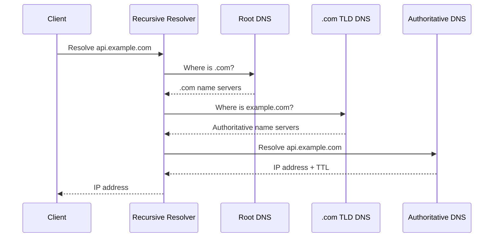
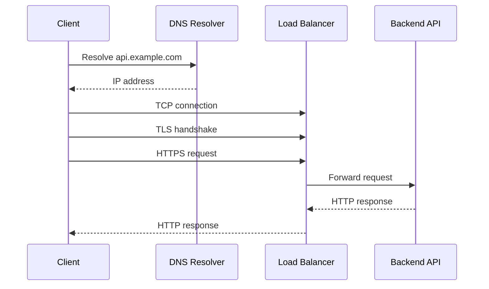

# 01- DNS

## Overview

The Domain Name System (DNS) is the distributed naming system that translates human-readable domain names into network addresses and other service metadata.

For backend engineers, DNS is more than:

```text
example.com → IP address
```

It is a distributed control plane used for:

- Service discovery
- Traffic routing
- High availability
- Load distribution
- Geographic routing
- Failover
- Domain ownership
- Email delivery
- Certificate validation
- Microservice communication
- CDN integration
- Cloud infrastructure discovery

A typical HTTP request begins with DNS resolution before a TCP or TLS connection is established:

```text
Client
  |
  | DNS lookup
  v
example.com
  |
  v
IP address
  |
  | TCP/TLS
  v
Load Balancer
  |
  v
Backend Service
```

DNS is designed to be highly distributed and cached. That design provides scalability and resilience, but caching also means that DNS changes are not necessarily visible everywhere immediately.

---

## Why DNS Matters in Backend Architecture

Consider a production API:

```text
https://api.example.com/orders
```

The client does not normally know the backend server's IP address.

Instead:

```text
api.example.com
        |
        v
DNS
        |
        v
Load Balancer IP
        |
        v
Backend Services
```

This abstraction allows infrastructure to change without requiring clients to change their configuration.

The backend infrastructure can move from:

```text
10.0.10.15
```

to:

```text
10.0.20.25
```

while clients continue using:

```text
api.example.com
```

DNS therefore separates **logical service identity** from **network location**.

---

## DNS Hierarchy

DNS uses a hierarchical namespace.

```text
.
└── com
    └── example
        ├── api
        ├── www
        └── mail
```

The hierarchy begins at the root:

```text
.
```

Then comes the top-level domain:

```text
com
org
net
in
io
```

Then the registered domain:

```text
example.com
```

Then optional subdomains:

```text
api.example.com
www.example.com
payments.example.com
```

A fully qualified domain name (FQDN) identifies a complete DNS name.

For example:

```text
api.example.com.
```

The trailing dot represents the DNS root.

Most applications omit it:

```text
api.example.com
```

---

## DNS Components

The major components are:

| Component | Responsibility |
|---|---|
| DNS Client / Stub Resolver | Requests DNS resolution |
| Recursive Resolver | Finds answers on behalf of clients |
| Root Name Server | Directs queries toward TLD servers |
| TLD Name Server | Directs queries toward authoritative servers |
| Authoritative Name Server | Provides authoritative DNS records |
| DNS Zone | Administrative portion of the DNS namespace |
| DNS Record | Maps a name to an address or other metadata |

A simplified resolution path is:

```text
Application
    |
    v
Stub Resolver
    |
    v
Recursive Resolver
    |
    v
Root Server
    |
    v
.com TLD Server
    |
    v
example.com Authoritative Server
    |
    v
DNS Answer
```

---

## DNS Resolution

When an application connects to:

```text
api.example.com
```

the operating system generally checks local sources before querying an external resolver.

A simplified flow is:

```text
Application
    |
    v
OS Resolver
    |
    +--> Local DNS Cache
    |
    +--> hosts file
    |
    v
Recursive Resolver
    |
    v
DNS hierarchy
    |
    v
IP address
```

The exact implementation varies by operating system, resolver configuration, VPN, container runtime, and cloud environment.

---

## Recursive vs Authoritative DNS

These roles are fundamentally different.

### Recursive Resolver

A recursive resolver performs DNS resolution on behalf of the client.

Examples include:

- ISP-provided resolvers
- Enterprise DNS resolvers
- Public recursive resolvers
- Cloud-provided recursive resolvers

The resolver may cache answers.

### Authoritative Name Server

An authoritative server owns the DNS data for a zone.

For example:

```text
example.com
```

may be hosted by an authoritative DNS provider.

It can answer:

```text
api.example.com → 203.0.113.10
```

without consulting another DNS server.

| Property | Recursive Resolver | Authoritative Server |
|---|---|---|
| Acts for client | Yes | No |
| Performs recursion | Yes | No |
| Caches responses | Usually | Not for recursive resolution |
| Owns zone data | No | Yes |
| Typical role | Find answer | Provide authoritative answer |

---

## DNS Resolution Flow

Consider:

```text
api.example.com
```

Assume the recursive resolver has no cached answer.



The client generally does not communicate directly with every DNS hierarchy layer.

The recursive resolver performs that work.

---

## DNS Caching

DNS caching is one of the most important characteristics of DNS.

If a resolver receives:

```text
api.example.com → 203.0.113.10
TTL = 300
```

it may cache the answer for 300 seconds.

Subsequent clients using that resolver can receive the cached answer without requiring another authoritative lookup.

```text
Client A ─┐
Client B ─┼──> Recursive Resolver ───> Authoritative DNS
Client C ─┘          |
                     |
                     +── cached answer
```

Caching provides:

- Lower DNS latency
- Reduced authoritative DNS traffic
- Better scalability
- Lower DNS infrastructure cost
- Reduced dependency on authoritative servers

However, caching creates a propagation delay when records change.

---

## TTL

TTL means **Time To Live**.

It controls how long a DNS response may be cached.

Example:

```text
api.example.com
A
203.0.113.10
TTL: 300
```

A TTL of:

```text
300 seconds
```

means the cached response may generally be reused for five minutes.

### TTL Trade-Off

| TTL | Advantages | Disadvantages |
|---|---|---|
| Very low | Faster DNS changes | More DNS queries |
| Moderate | Good balance | Changes take some time |
| Very high | Excellent caching | Slow change propagation |

A common production mistake is assuming:

```text
Change DNS record
        ↓
Everyone immediately sees new IP
```

That is not guaranteed because different resolvers may have cached previous responses.

---

## DNS Record Types

DNS supports multiple record types.

### A Record

Maps a hostname to an IPv4 address.

```text
api.example.com → 203.0.113.10
```

Example:

```text
api.example.com. 300 IN A 203.0.113.10
```

### AAAA Record

Maps a hostname to an IPv6 address.

```text
api.example.com → 2001:db8::10
```

Example:

```text
api.example.com. 300 IN AAAA 2001:db8::10
```

### CNAME

Creates an alias to another DNS name.

```text
www.example.com
        |
        v
example.com
```

Example:

```text
www.example.com. 300 IN CNAME example.com.
```

A CNAME points to a **name**, not an IP address.

### MX

Specifies mail servers for a domain.

```text
example.com → mail.example.com
```

### TXT

Stores arbitrary text used by various protocols and verification systems.

Common uses include:

- SPF
- Domain verification
- DKIM-related configuration
- Certificate validation
- Security policies

### NS

Identifies authoritative name servers for a zone.

### PTR

Used for reverse DNS.

```text
IP address → hostname
```

### SRV

Provides service discovery information.

It can specify:

- Service
- Protocol
- Port
- Target hostname
- Priority
- Weight

This can be useful for systems that support DNS-based service discovery.

---

## DNS Record Comparison

| Record | Purpose | Points To |
|---|---|---|
| A | IPv4 address | IPv4 |
| AAAA | IPv6 address | IPv6 |
| CNAME | Alias | Hostname |
| MX | Mail routing | Mail server |
| NS | Authoritative DNS | Name server |
| TXT | Metadata / verification | Text |
| PTR | Reverse lookup | Hostname |
| SRV | Service discovery | Host + port |

---

## CNAME vs A Record

Consider:

```text
api.example.com
```

An A record can directly return:

```text
203.0.113.10
```

A CNAME can return:

```text
api.example.com → service.example.net
```

The resolver then resolves the target name.

Use an A/AAAA record when the DNS name should directly map to an address.

Use a CNAME when an alias to another hostname is appropriate.

A common mistake is trying to create a CNAME at the DNS zone apex where the DNS provider does not support the required behavior. Many providers offer provider-specific mechanisms such as ALIAS or ANAME-style records for apex aliasing.

---

## DNS Zone

A DNS zone is an administrative portion of the DNS namespace managed by a particular authority.

For example:

```text
example.com
```

may be represented by a hosted zone containing:

```text
example.com
api.example.com
www.example.com
mail.example.com
```

A zone is not necessarily identical to the entire domain hierarchy.

Delegation can divide responsibility.

For example:

```text
example.com
    |
    +── api.example.com
    |
    +── internal.example.com
              |
              +── separately managed zone
```

---

## Authoritative Name Servers

Authoritative name servers contain the source-of-authority DNS data for a zone.

For:

```text
example.com
```

the domain's NS records identify authoritative servers.

A simplified configuration might be:

```text
example.com
    NS ns-1.example-dns.net
    NS ns-2.example-dns.net
```

Multiple authoritative servers improve availability.

Production DNS should avoid depending on a single authoritative endpoint.

---

## DNS Delegation

Delegation allows one DNS authority to delegate responsibility for a subdomain to another authority.

For example:

```text
example.com
    |
    +── internal.example.com
              |
              +── delegated to another DNS provider
```

The parent zone contains NS records for the delegated child zone.

This allows large organizations to divide DNS administration by:

- Team
- Business unit
- Environment
- Region
- Application

---

## Reverse DNS

Forward DNS:

```text
hostname → IP
```

Reverse DNS:

```text
IP → hostname
```

IPv4 reverse DNS uses:

```text
in-addr.arpa
```

For example:

```text
203.0.113.10
```

is represented conceptually as:

```text
10.113.0.203.in-addr.arpa
```

Reverse DNS is commonly relevant for:

- Mail servers
- Network troubleshooting
- Security analysis
- Infrastructure operations
- Logging

Reverse DNS does not prove ownership of an IP address. It is a DNS mapping controlled by the entity responsible for the relevant reverse zone.

---

## DNS and HTTP Request Lifecycle

DNS happens before the application can normally establish a connection to the resolved endpoint.

A simplified HTTPS lifecycle is:

```text
1. Application resolves hostname
2. DNS returns IP address
3. Client establishes TCP connection
4. TLS handshake occurs
5. HTTP request is sent
6. Load balancer receives request
7. Backend service processes request
8. Response returns to client
```



DNS is therefore part of the request's critical path, especially for cold connections.

DNS results are often cached by:

- Browser
- Operating system
- Local resolver
- Recursive resolver
- Application libraries

---

## DNS and Load Balancing

DNS can distribute clients across multiple endpoints.

For example:

```text
api.example.com
       |
       +---- 10.0.1.10
       |
       +---- 10.0.2.10
       |
       +---- 10.0.3.10
```

Common routing strategies include:

- Simple / round-robin style responses
- Weighted routing
- Latency-based routing
- Geographic routing
- Failover routing
- Geoproximity routing
- Health-aware routing

DNS-level load balancing is useful, but it is not equivalent to an L4/L7 load balancer.

DNS typically controls **which endpoint a client should attempt to use**, while a load balancer can make per-request decisions after the connection reaches the load-balancing layer.

---

## DNS-Based Failover

A DNS provider can return different records based on endpoint health.

```text
              DNS
               |
        +------+------+
        |             |
      Primary       Secondary
        |             |
      HEALTHY       STANDBY
```

If the primary becomes unhealthy:

```text
api.example.com
        |
        v
Secondary
```

However, cached DNS answers can delay failover.

Therefore:

> DNS failover is constrained by DNS caching and should not be treated as instantaneous.

For fast failover inside a region, application-level or load-balancer-level health checks are often more appropriate.

---

## Weighted DNS Routing

Weighted routing distributes DNS responses according to configured weights.

For example:

```text
Version A = 90%
Version B = 10%
```

This can support:

- Canary deployments
- Gradual migrations
- Traffic shifting
- Blue/green strategies

Conceptually:

```text
                DNS
                 |
        +--------+--------+
        |                 |
      v1 90%             v2 10%
```

DNS-based traffic percentages are approximate from the application's perspective because caching and resolver behavior influence the actual distribution.

---

## DNS and CDN

A common production architecture is:

```text
Client
  |
  v
api.example.com
  |
  v
DNS
  |
  v
CloudFront / CDN
  |
  v
Load Balancer
  |
  v
Backend
```

DNS maps the hostname to the CDN endpoint.

The CDN then handles:

- Edge routing
- TLS termination
- Caching
- WAF integration
- Request forwarding

DNS therefore often provides the first routing layer rather than the complete traffic-management solution.

---

## DNS in AWS

AWS commonly uses Amazon Route 53 for DNS.

A typical architecture might be:

```text
example.com
      |
      v
Route 53
      |
      v
CloudFront
      |
      v
ALB
      |
      v
ECS / EKS / EC2
```

Route 53 supports capabilities such as:

- Public hosted zones
- Private hosted zones
- Health checks
- Alias records
- Weighted routing
- Latency-based routing
- Failover routing
- Geolocation routing

An AWS DNS design should distinguish between public and private DNS.

---

## Public DNS vs Private DNS

### Public DNS

Resolves names available on the public Internet.

Example:

```text
api.example.com
```

A public resolver can potentially resolve the name.

### Private DNS

Used within a private network environment.

For example, an AWS VPC may use private DNS names for internal services:

```text
orders.internal.example.com
```

These names can resolve only within the intended private DNS environment.

This is useful for:

- Internal microservices
- Databases
- Private load balancers
- Internal APIs
- Service discovery

Do not expose internal infrastructure through public DNS unless there is a deliberate requirement.

---

## DNS in Kubernetes

Kubernetes provides DNS-based service discovery.

A Service such as:

```yaml
apiVersion: v1
kind: Service
metadata:
  name: orders
  namespace: production
spec:
  selector:
    app: orders
  ports:
    - port: 80
      targetPort: 8000
```

can typically be accessed inside the cluster through a DNS name such as:

```text
orders.production.svc.cluster.local
```

The conceptual flow is:

```text
Application Pod
      |
      v
Kubernetes DNS
      |
      v
orders.production.svc.cluster.local
      |
      v
Service
      |
      v
Healthy Pods
```

This allows applications to communicate using stable service names rather than individual Pod IP addresses.

Pod IPs are ephemeral; Service DNS provides a stable abstraction.

---

## DNS-Based Service Discovery

DNS can provide service discovery without hard-coding IP addresses.

Instead of:

```python
DATABASE_HOST = "10.0.4.25"
```

use:

```python
DATABASE_HOST = "postgres.internal.example.com"
```

This makes infrastructure replacement easier.

A database can move from:

```text
10.0.4.25
```

to:

```text
10.0.7.40
```

without changing application configuration.

This is one reason DNS names should generally be preferred over hard-coded infrastructure IP addresses.

---

## DNS and Microservices

A microservice architecture may look like:

```text
                    API Gateway
                         |
              +----------+----------+
              |          |          |
              v          v          v
           Orders     Payments   Inventory
              |          |          |
              v          v          v
          orders.svc  payments.svc inventory.svc
```

Service discovery can use:

- Kubernetes DNS
- Cloud service discovery
- Internal DNS
- Service mesh
- Dedicated discovery systems

DNS is simple and operationally mature, but it is not always sufficient for advanced service-mesh requirements such as:

- Per-request load balancing
- Circuit breaking
- Retries
- mTLS
- Traffic splitting
- Rich telemetry

---

## DNS Security

DNS is infrastructure and therefore part of the security boundary.

Important considerations include:

- Protecting DNS provider accounts
- Strong authentication
- MFA
- Least-privilege IAM
- DNS change auditing
- DNSSEC where appropriate
- Avoiding accidental record exposure
- Protecting private hosted zones
- Monitoring unexpected DNS changes

A compromised DNS control plane can redirect legitimate traffic to an attacker-controlled endpoint.

For example:

```text
api.example.com
        |
        v
Attacker-controlled IP
```

This makes DNS account security extremely important.

---

## DNSSEC

DNSSEC provides cryptographic authentication for DNS data.

Its purpose is to help clients validate that DNS responses originate from the legitimate DNS hierarchy and have not been tampered with.

DNSSEC uses cryptographic signatures rather than encrypting DNS queries.

Therefore:

> DNSSEC provides authenticity and integrity of DNS data, not confidentiality of DNS queries.

DNS over HTTPS (DoH) and DNS over TLS (DoT) address different concerns by protecting the DNS transport between a client and resolver.

---

## DNSSEC vs DoH vs DoT

| Technology | Primary Purpose |
|---|---|
| DNSSEC | Authenticate DNS data |
| DoH | Encrypt DNS transport over HTTPS |
| DoT | Encrypt DNS transport over TLS |
| Traditional DNS | DNS resolution without transport encryption |

These mechanisms solve different security problems and can be used in different combinations.

---

## DNS Troubleshooting

DNS problems should be diagnosed independently from application problems.

Useful tools include:

```bash
dig example.com
```

```bash
dig A example.com
```

```bash
dig AAAA example.com
```

```bash
dig MX example.com
```

```bash
dig NS example.com
```

```bash
dig +trace example.com
```

```bash
nslookup example.com
```

On Linux systems:

```bash
resolvectl status
```

and:

```bash
resolvectl query example.com
```

can provide resolver information.

---

## Reading `dig` Output

A typical query:

```bash
dig api.example.com
```

contains sections such as:

```text
QUESTION SECTION
ANSWER SECTION
AUTHORITY SECTION
ADDITIONAL SECTION
```

The answer section may contain:

```text
api.example.com. 300 IN A 203.0.113.10
```

The important fields are:

```text
Name
TTL
Class
Type
Value
```

For example:

```text
api.example.com. 300 IN A 203.0.113.10
```

means:

```text
Name  = api.example.com
TTL   = 300
Class = IN
Type  = A
Value = 203.0.113.10
```

---

## DNS Troubleshooting Workflow

When an application cannot connect to a hostname:

### Check Name Resolution

```bash
dig api.example.com
```

### Check the Specific Record

```bash
dig A api.example.com
```

### Check IPv6

```bash
dig AAAA api.example.com
```

### Trace Delegation

```bash
dig +trace api.example.com
```

### Check Authoritative Servers

```bash
dig NS example.com
```

### Check Resolver Configuration

```bash
resolvectl status
```

Then determine whether the failure is:

```text
DNS resolution
    |
    +--> Wrong record
    +--> Missing record
    +--> Stale cache
    +--> Broken delegation
    +--> Resolver failure
    +--> Network policy
    +--> Application failure
```

Do not immediately assume that an HTTP 5xx response is a DNS problem. If DNS successfully returns an IP address, the investigation should move to networking and application layers.

---

## DNS Timeouts and Retries

DNS clients and resolvers may retry queries.

Application-level DNS failures can therefore appear as:

```text
Temporary failure in name resolution
```

or:

```text
DNS timeout
```

Potential causes include:

- Broken resolver
- Network connectivity
- Firewall rules
- Kubernetes CoreDNS issues
- VPC DNS configuration
- Overloaded resolver
- Broken delegation
- DNS provider outage

Retrying DNS failures blindly from every application instance can create a resolver storm.

Prefer appropriate resolver caching and bounded retry behavior.

---

## DNS and Application Performance

DNS contributes latency to connection establishment when the result is not cached.

A simplified cold-request path is:

```text
DNS lookup
   +
TCP connection
   +
TLS handshake
   +
HTTP request
```

Connection reuse reduces repeated DNS and connection setup costs.

Modern HTTP clients should generally use:

- Connection pooling
- Keep-alive
- Appropriate DNS caching
- HTTP/2 or HTTP/3 where suitable

For Python services, connection pooling is particularly important for high-throughput APIs.

---

## DNS Failure Modes

Common DNS failures include:

| Failure | Effect |
|---|---|
| Missing A/AAAA record | Host cannot resolve |
| Incorrect CNAME | Resolution points to wrong destination |
| Broken delegation | Domain resolution fails |
| Expired domain | Domain may stop resolving |
| DNS provider outage | Resolution may fail |
| Excessive TTL | Changes propagate slowly |
| Too-low TTL | Increased query volume |
| Incorrect private DNS | Internal service unavailable |
| DNSSEC misconfiguration | Validation failures |
| Compromised DNS account | Traffic redirection |

---

## Common Production Mistakes

### Hard-Coding IP Addresses

Bad:

```python
SERVICE_HOST = "10.0.3.15"
```

Prefer:

```python
SERVICE_HOST = "orders.internal.example.com"
```

Infrastructure IP addresses often change.

### Assuming DNS Changes Are Instant

Changing an authoritative record does not immediately invalidate cached responses.

Always account for TTL and resolver caching.

### Using DNS as a Complete Load Balancer

DNS routing operates at a different layer from request-level load balancing.

Do not expect DNS alone to provide sophisticated per-request routing.

### Ignoring IPv6

Applications that only test A records may fail in environments where AAAA records are available and IPv6 is preferred.

### Confusing DNS Failure With Application Failure

First establish:

```text
Does the hostname resolve?
```

Then investigate:

```text
Can the client connect?
```

Then:

```text
Does TLS succeed?
```

Then:

```text
Does HTTP succeed?
```

### Using Excessively Low TTLs

Very low TTL values can increase DNS traffic and cost without providing meaningful operational value.

### Putting Internal Infrastructure in Public DNS

Internal service names should generally use private DNS where appropriate.

Public DNS can expose infrastructure details unnecessarily.

---

## Production DNS Best Practices

### Use Stable Names

Prefer:

```text
api.example.com
```

over:

```text
10.20.30.40
```

### Use Appropriate TTLs

Choose TTL based on operational requirements rather than automatically choosing the lowest possible value.

### Separate Public and Private DNS

Use private namespaces for internal infrastructure where appropriate.

### Protect DNS Credentials

Use:

- MFA
- Least privilege
- Strong authentication
- Audit logging
- CI/CD-controlled changes where appropriate

### Use Multiple Authoritative Servers

Avoid a single authoritative DNS dependency.

### Monitor DNS Changes

Alert on unexpected changes to:

- A
- AAAA
- CNAME
- MX
- NS
- TXT

records.

### Automate DNS

Infrastructure-as-code can make DNS changes reviewable and reproducible.

Example Terraform:

```hcl
resource "aws_route53_record" "api" {
  zone_id = var.zone_id
  name    = "api.example.com"
  type    = "A"

  alias {
    name                   = aws_lb.api.dns_name
    zone_id                = aws_lb.api.zone_id
    evaluate_target_health = true
  }
}
```

This is preferable to making undocumented production DNS changes manually.

---

## DNS Deployment Strategies

DNS can be used as part of deployment architecture.

### Blue/Green

```text
api.example.com
       |
       +---- Blue
       |
       +---- Green
```

Traffic can be moved between environments.

### Canary

```text
DNS
 |
 +---- v1 95%
 |
 +---- v2 5%
```

The actual client distribution may differ from the configured weight because of DNS caching.

### Regional Routing

```text
                  DNS
                   |
        +----------+----------+
        |                     |
      Region A              Region B
      India                  Europe
```

Latency or geography-based routing can direct users toward different regions.

---

## Disaster Recovery

DNS is frequently involved in regional failover.

Example:

```text
                 DNS
                  |
        +---------+---------+
        |                   |
     Primary             Secondary
      Region               Region
        |                   |
       ALB                 ALB
        |                   |
       API                 API
```

However, a DNS-based disaster-recovery design must consider:

- DNS TTL
- Resolver caching
- Health-check accuracy
- Data replication
- Database recovery
- Application warm-up
- Connection draining
- Client retry behavior

DNS can redirect traffic, but it cannot make the secondary system ready by itself.

A complete DR design requires the target region to have:

- Compute capacity
- Database state
- Configuration
- Secrets
- Networking
- Observability
- Deployment artifacts
- Operational runbooks

---

## DNS and Security Boundaries

DNS names often reveal architectural structure.

For example:

```text
db.internal.example.com
payments.internal.example.com
admin.internal.example.com
```

Public exposure of internal names can leak infrastructure information.

Use private DNS and access controls where appropriate.

Also remember that DNS is not an authorization mechanism.

Resolving:

```text
admin.example.com
```

does not mean the caller should be allowed to access the admin service.

Authorization must still happen at the application or network security layer.

---

## DNS Cost Considerations

DNS is usually inexpensive compared with compute and database infrastructure, but poor DNS design can still create unnecessary costs.

High query volumes can result from:

- Extremely low TTLs
- Excessive service discovery traffic
- Poor application caching
- Resolver misconfiguration
- High-cardinality DNS names

For large systems, consider:

```text
Client
  |
  v
Caching Resolver
  |
  v
Authoritative DNS
```

rather than causing every application instance to repeatedly query authoritative infrastructure.

---

## DNS in Containerized Systems

Containers frequently rely on DNS for service discovery.

Docker Compose, for example, provides service-name resolution between containers.

Given:

```yaml
services:
  api:
    build: .
  postgres:
    image: postgres:18
```

the API can typically connect to:

```text
postgres
```

rather than:

```text
localhost
```

This distinction is critical.

Inside a container:

```text
localhost
```

means the current container, not another service.

Therefore:

```text
DATABASE_HOST=postgres
```

is generally appropriate in a Compose network.

---

## DNS in Kubernetes vs Docker Compose

| Environment | Typical Service Discovery |
|---|---|
| Local process | OS resolver |
| Docker Compose | Docker embedded DNS |
| Kubernetes | CoreDNS |
| AWS VPC | VPC DNS |
| Public Internet | Recursive + authoritative DNS |
| Service mesh | DNS + mesh-specific routing |

The underlying concept remains the same:

```text
Logical service name
        ↓
DNS resolution
        ↓
Network endpoint
```

---

## Interview Questions

### What happens when you type `https://example.com` into a browser?

A high-level sequence is:

```text
Browser cache
    ↓
OS / local resolver
    ↓
Recursive DNS resolver
    ↓
Root / TLD / authoritative DNS as required
    ↓
IP address
    ↓
TCP or QUIC connection
    ↓
TLS
    ↓
HTTP request
    ↓
Server response
```

The exact path depends on caching and the transport protocol.

### What is the difference between recursive and authoritative DNS?

A recursive resolver finds answers for clients and commonly caches them.

An authoritative server owns the DNS data for a zone and provides authoritative answers.

### What does TTL control?

TTL controls how long a DNS response may be cached before it should be considered expired.

### Does DNS provide load balancing?

DNS can distribute clients across multiple endpoints, but it does not provide the same request-level control as a load balancer.

### What happens if DNS is unavailable?

Existing connections may continue working, but new hostname resolution can fail once cached DNS information is unavailable or expires.

This is why DNS availability and caching are important parts of production architecture.

### Why use DNS instead of IP addresses?

DNS decouples service identity from infrastructure location.

This makes infrastructure replacement, scaling, failover, and migrations easier.

### Can DNS guarantee that all users immediately see a new IP?

No.

Caching means different clients and recursive resolvers can observe different answers until cached records expire.

### Does DNSSEC encrypt DNS traffic?

No.

DNSSEC authenticates DNS data. DoH and DoT are mechanisms for protecting DNS transport.

### Is DNS service discovery enough for microservices?

For simple service discovery, often yes.

For advanced traffic management, systems may additionally use load balancers, service meshes, or dedicated discovery mechanisms.

---

## Senior-Level Design Considerations

A senior backend engineer should treat DNS as part of the overall system architecture rather than as a configuration detail.

For every DNS-dependent architecture, consider:

```text
Naming
  ↓
Resolution
  ↓
Caching
  ↓
Routing
  ↓
Connection
  ↓
Load Balancing
  ↓
Application
```

Then ask:

- Who owns the DNS zone?
- Who can modify records?
- Where are recursive resolvers located?
- What happens if the resolver fails?
- What is the TTL?
- How quickly must failover happen?
- Is DNS public or private?
- Is IPv6 supported?
- Are health checks reliable?
- How are DNS changes audited?
- How is DNS managed through CI/CD?
- What happens during a regional outage?
- Can stale DNS cause traffic to a retired endpoint?
- Are internal service names exposed publicly?
- Does the application cache DNS responses?
- Does the infrastructure depend on DNS during startup?

These questions reveal whether the DNS design is merely functional or actually production-ready.

---

## Key Takeaways

- DNS is a distributed naming and routing system that decouples logical service names from changing network endpoints.
- Recursive resolvers, authoritative servers, zones, records, delegation, and caching are the core building blocks of DNS.
- TTL and caching are fundamental operational concerns; DNS changes and failovers are not necessarily instantaneous.
- In production systems, DNS commonly supports load balancing, service discovery, CDNs, Kubernetes networking, AWS architectures, and disaster recovery.
- DNS must be designed and operated as infrastructure: secure its control plane, monitor changes, automate configuration, and explicitly plan for resolver and provider failures.