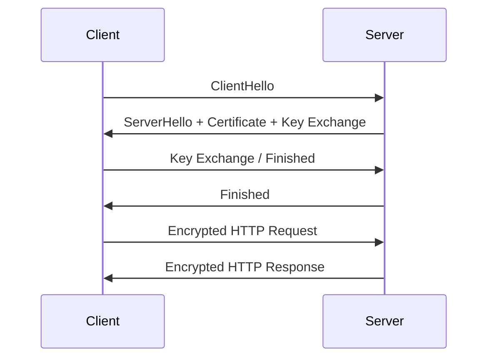
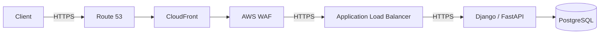

# 02- HTTP vs HTTPS

## Overview

HTTP and HTTPS are application-layer protocols used to exchange resources between clients and servers. HTTP defines how requests and responses are structured; HTTPS is HTTP transported over TLS, providing confidentiality, integrity, and server authentication.

The distinction is fundamental to backend architecture because almost every modern REST API, web application, microservice gateway, and public API depends on HTTP or HTTPS.

The simplified relationship is:

```text
HTTP
  |
  +-- Application protocol
  |
  +-- No cryptographic protection by itself

HTTPS
  |
  +-- HTTP
  |
  +-- TLS
        |
        +-- Encryption
        +-- Integrity
        +-- Server authentication
```

A production API should normally expose HTTPS externally:

```text
Client
   |
   | HTTPS
   v
Nginx / CDN / Load Balancer
   |
   | HTTP or HTTPS
   v
Backend Service
   |
   v
Database
```

Whether TLS is also used between internal components depends on the security model, network boundaries, compliance requirements, and infrastructure architecture.

---

## What HTTP Provides

HTTP defines the semantics and wire format used for communication between HTTP clients and servers.

A request contains concepts such as:

- Method
- Target URI
- Headers
- Optional body

Example:

```http
POST /api/orders HTTP/1.1
Host: api.example.com
Content-Type: application/json
Authorization: Bearer <token>

{"product_id": 123, "quantity": 2}
```

The server returns a response:

```http
HTTP/1.1 201 Created
Content-Type: application/json

{"id": 987, "status": "created"}
```

HTTP itself does not provide encryption.

If plain HTTP is used over an untrusted network, an attacker capable of observing traffic may be able to inspect or manipulate it.

---

## What HTTPS Provides

HTTPS means HTTP over TLS.

Conceptually:

```text
Application
    |
    v
HTTP
    |
    v
TLS
    |
    v
TCP
    |
    v
IP
```

With HTTPS:

```text
HTTP request
     |
     v
TLS encryption
     |
     v
Network
     |
     v
TLS decryption
     |
     v
HTTP server
```

TLS provides three important security properties:

| Property | What it protects |
|---|---|
| Confidentiality | Prevents unauthorized parties from reading traffic |
| Integrity | Detects unauthorized modification of traffic |
| Authentication | Allows the client to authenticate the server through certificates |

HTTPS therefore protects the communication channel, but it does not automatically make the application itself secure.

---

## HTTP vs HTTPS

| Property | HTTP | HTTPS |
|---|---|---|
| Application protocol | HTTP | HTTP |
| TLS | No | Yes |
| Encryption | No | Yes |
| Integrity protection | No cryptographic protection | Yes |
| Server authentication | No | Yes, through TLS certificates |
| Default port | 80 | 443 |
| Suitable for public APIs | Generally no | Yes |
| Protects credentials in transit | No | Yes |
| Protects cookies in transit | No | Yes |
| Prevents all application attacks | No | No |

HTTPS should be considered the default for production Internet-facing services.

---

## HTTP Request Lifecycle

A simplified HTTPS request lifecycle is:

```text
Client
  |
  | DNS resolution
  v
Server IP
  |
  | TCP connection
  v
TCP connection established
  |
  | TLS handshake
  v
Secure channel established
  |
  | HTTP request
  v
HTTP server
  |
  | HTTP response
  v
Client
```

For HTTP/1.1 and HTTP/2 over TLS, TLS normally runs over TCP.

For HTTP/3, HTTP is transported over QUIC, which uses UDP:

```text
HTTP/3
   |
   v
QUIC
   |
   v
UDP
   |
   v
IP
```

Therefore, HTTPS is not synonymous with TCP port 443 at the protocol level. HTTP/3 commonly uses UDP port 443.

---

## HTTP Versions

HTTP has evolved significantly.

| Version | Transport | Important Characteristics |
|---|---|---|
| HTTP/1.0 | TCP | Basic request/response model |
| HTTP/1.1 | TCP | Persistent connections, chunked transfer, Host header |
| HTTP/2 | TCP + TLS commonly | Multiplexing, header compression, binary framing |
| HTTP/3 | QUIC over UDP | Stream multiplexing without TCP head-of-line blocking |

HTTP semantics such as:

```text
GET
POST
PUT
PATCH
DELETE
```

remain conceptually consistent across versions.

The major differences are in framing, transport, connection management, and performance characteristics.

---

## Why HTTP Is Not Secure

Suppose a client sends:

```http
POST /login HTTP/1.1
Host: example.com

username=alice&password=secret
```

over plain HTTP.

The traffic is transmitted without TLS encryption.

Conceptually:

```text
Client
   |
   | username=alice
   | password=secret
   v
Network
   |
   +---- Attacker can potentially observe traffic
```

The problem is not simply that passwords can be read.

An attacker capable of intercepting traffic may also be able to:

- Read authentication tokens
- Read cookies
- Modify requests
- Modify responses
- Inject malicious content
- Redirect users
- Replay captured requests in some circumstances

HTTPS addresses the network-channel portion of these threats.

---

## TLS Handshake

Before protected HTTP data can be exchanged, the client and server establish a TLS session.

A simplified TLS 1.3 flow is:



The exact handshake contains more protocol details, but the important architectural idea is:

```text
Negotiate algorithms
        |
        v
Authenticate server
        |
        v
Establish shared session keys
        |
        v
Encrypt application traffic
```

Modern deployments should generally use TLS 1.3 where supported, while TLS 1.2 remains relevant for compatibility.

---

## TLS Certificates

HTTPS relies on certificates to authenticate the server.

A certificate binds information such as:

```text
example.com
      |
      v
Public key
      |
      v
Certificate authority signature
```

The certificate is signed by a trusted Certificate Authority (CA).

The client validates properties including:

- Certificate chain
- Signature
- Validity period
- Requested hostname
- Trust chain
- Key usage and relevant extensions

If validation succeeds, the client can establish greater confidence that it is communicating with the intended server.

---

## Certificate Chain

A typical certificate hierarchy is:

```text
Root CA
   |
   v
Intermediate CA
   |
   v
Server Certificate
   |
   v
api.example.com
```

The root CA is trusted by the client's trust store.

The intermediate CA signs the server certificate.

This allows certificate authorities to delegate issuance without requiring every server certificate to be directly signed by a root CA.

---

## Certificate Validation

A browser connecting to:

```text
https://api.example.com
```

checks that the certificate is valid for:

```text
api.example.com
```

A certificate for:

```text
other.example.com
```

should not be accepted for the requested hostname unless the certificate explicitly covers the hostname through appropriate SAN entries.

This is why hostname validation is an important part of TLS security.

---

## Public Key and Symmetric Encryption

TLS combines asymmetric and symmetric cryptography.

Asymmetric cryptography is useful for authentication and key establishment.

Symmetric cryptography is efficient for bulk data encryption.

Conceptually:

```text
TLS handshake
     |
     +--> Public-key cryptography
     |
     v
Shared session keys
     |
     v
Symmetric encryption
     |
     v
HTTP traffic
```

Using symmetric encryption for the entire connection is efficient because symmetric algorithms are generally much faster than public-key operations for bulk data.

---

## What HTTPS Does Not Protect

HTTPS protects data while it is being transported through the TLS-protected connection.

It does not protect against:

- SQL injection
- Broken authorization
- XSS caused by application behavior
- CSRF when defenses are missing
- Compromised servers
- Vulnerable dependencies
- Malicious authenticated users
- Database compromise
- Poor secret management
- Application-level logic bugs

For example:

```text
Client
  |
  | HTTPS
  v
Django
  |
  | Vulnerable SQL construction
  v
PostgreSQL
```

HTTPS cannot prevent SQL injection.

Transport security and application security are separate layers.

---

## TLS Termination

Production systems frequently terminate TLS before traffic reaches the application.

For example:

```text
Client
   |
   | HTTPS
   v
CloudFront / Nginx / ALB
   |
   | HTTP
   v
Django / FastAPI
```

The TLS endpoint decrypts the request and forwards the HTTP request internally.

This is called TLS termination.

It provides operational benefits such as:

- Centralized certificate management
- Reduced application complexity
- Hardware or infrastructure acceleration
- Easier load balancing
- Centralized security policy

However, the internal network must still be considered a security boundary.

---

## TLS Termination vs TLS Passthrough

### TLS Termination

```text
Client
  |
 HTTPS
  |
  v
Load Balancer
  |
 decrypts TLS
  |
 HTTP
  |
  v
Backend
```

### TLS Passthrough

```text
Client
  |
 HTTPS
  |
  v
Load Balancer
  |
 encrypted TLS
  |
  v
Backend
  |
 TLS termination
```

| Approach | TLS ends at | Advantages | Trade-Offs |
|---|---|---|---|
| Termination | Load balancer / proxy | Centralized management | Internal traffic may be plaintext |
| Passthrough | Application | End-to-end TLS from client to app | More complex certificate management |
| Re-encryption | Proxy and backend | Encryption across both segments | Additional TLS overhead and management |

---

## Re-Encryption

A common production architecture is:

```text
Client
  |
 HTTPS
  |
  v
Load Balancer
  |
 HTTPS
  |
  v
Backend
```

The load balancer terminates the external TLS connection and establishes another TLS connection to the backend.

This provides encryption across both network segments.

It is useful when internal traffic crosses:

- Untrusted or semi-trusted networks
- Multiple security zones
- Shared infrastructure
- Regulatory boundaries
- Multi-tenant environments

---

## HTTPS in Microservices

A microservice architecture may look like:

```text
                    API Gateway
                        |
                  HTTPS / TLS
                        |
        +---------------+---------------+
        |               |               |
        v               v               v
     Orders          Payments        Inventory
        |               |               |
       TLS             TLS             TLS
        |               |               |
        v               v               v
    Databases       Databases       Databases
```

Whether internal service-to-service communication requires TLS depends on the threat model.

In higher-security environments, internal HTTPS or gRPC over TLS can provide:

- Encryption
- Service authentication
- Better network isolation
- Defense against traffic interception

For service identity, mutual TLS (mTLS) may be appropriate.

---

## Mutual TLS

Normal HTTPS generally authenticates the server to the client.

mTLS additionally authenticates the client to the server.

```text
Client Certificate
       |
       v
     Server
       |
       v
Server Certificate
       |
       v
     Client
```

Therefore:

```text
Normal TLS:
Client ──> authenticates server

mTLS:
Client <──> authenticates each other
```

mTLS is useful for:

- Service-to-service authentication
- Zero-trust architectures
- Internal APIs
- High-security environments
- Service mesh architectures

---

## HTTPS and REST APIs

A production REST API should generally be exposed through HTTPS:

```text
https://api.example.com/v1/orders
```

Example:

```bash
curl --request GET \
  --url https://api.example.com/v1/orders \
  --header 'Authorization: Bearer <token>'
```

The token is protected while transmitted through the TLS connection.

However, token security still requires:

- Short or appropriate token lifetimes
- Secure storage
- Proper authorization
- Token rotation where appropriate
- Avoiding accidental logging

Do not log:

```text
Authorization: Bearer eyJ...
```

in application logs.

---

## HTTPS and Django

Django applications deployed behind a reverse proxy should correctly understand that the original request used HTTPS.

For example, behind a trusted proxy, Django may use:

```python
SECURE_PROXY_SSL_HEADER = ("HTTP_X_FORWARDED_PROTO", "https")
```

This setting must only be used when the proxy infrastructure is trusted and correctly controls the header.

Other production settings commonly include:

```python
SECURE_SSL_REDIRECT = True
SESSION_COOKIE_SECURE = True
CSRF_COOKIE_SECURE = True
```

The exact configuration should match the deployment topology.

A common mistake is enabling `SECURE_PROXY_SSL_HEADER` without ensuring that an untrusted client cannot directly inject the trusted forwarding header.

---

## HTTPS and FastAPI

FastAPI applications are commonly deployed behind Nginx, an AWS load balancer, or another reverse proxy.

Example:

```text
Internet
   |
 HTTPS
   |
   v
Nginx
   |
 HTTP
   |
   v
Uvicorn / FastAPI
```

Uvicorn can also terminate TLS directly when required, but centralized TLS termination is often easier to operate in production.

For example:

```bash
uvicorn app.main:app \
  --host 0.0.0.0 \
  --port 8000
```

can run behind a TLS-terminating reverse proxy.

---

## HTTP Redirects to HTTPS

A common deployment pattern is:

```text
http://example.com
        |
        | 301 / 308
        v
https://example.com
```

The HTTP endpoint exists only to redirect clients to HTTPS.

Example Nginx configuration:

```nginx
server {
    listen 80;
    server_name example.com www.example.com;

    return 308 https://$host$request_uri;
}
```

HTTPS should then serve the actual application.

A redirect does not itself encrypt the original HTTP request.

Therefore, sensitive information should never be sent through the initial HTTP request before the redirect.

---

## HSTS

HTTP Strict Transport Security (HSTS) instructs compatible browsers to use HTTPS for a domain.

Example:

```http
Strict-Transport-Security: max-age=31536000; includeSubDomains
```

Conceptually:

```text
First secure visit
       |
       v
Browser receives HSTS
       |
       v
Future HTTP attempts
       |
       v
Browser upgrades to HTTPS
```

HSTS reduces downgrade and protocol-stripping risks.

HSTS configuration must be deployed carefully, especially when using:

```text
includeSubDomains
```

because every affected subdomain must be able to support HTTPS correctly.

---

## HTTP Strict Transport Security Considerations

HSTS is powerful but operationally sticky.

A long duration such as:

```text
max-age=31536000
```

can cause browsers to enforce HTTPS for a year.

Before enabling aggressive HSTS settings:

- Ensure all required subdomains support HTTPS.
- Ensure certificate provisioning is reliable.
- Verify HTTP-to-HTTPS migration.
- Understand whether subdomains are intentionally excluded.
- Roll out cautiously in large environments.

---

## Secure Cookies

HTTPS is particularly important for session cookies.

A secure cookie can be configured with:

```http
Set-Cookie: session_id=abc123; Secure; HttpOnly; SameSite=Lax
```

Important attributes include:

| Attribute | Purpose |
|---|---|
| `Secure` | Send cookie only over secure connections |
| `HttpOnly` | Prevent JavaScript access through `document.cookie` |
| `SameSite` | Controls cross-site cookie behavior |
| `Domain` | Controls applicable domains |
| `Path` | Controls applicable paths |
| `Max-Age` / `Expires` | Controls lifetime |

HTTPS protects the cookie during transmission, while cookie attributes provide additional browser-side protections.

---

## HTTPS and WebSockets

WebSockets can also use TLS.

Plain WebSocket:

```text
ws://example.com
```

Secure WebSocket:

```text
wss://example.com
```

`wss://` is effectively WebSocket communication protected by TLS.

Typical architecture:

```text
Browser
   |
 wss://
   |
   v
Nginx / Load Balancer
   |
   v
WebSocket Server
```

For production applications, secure WebSockets should generally be used when the connection carries authenticated or sensitive data.

---

## HTTPS and gRPC

gRPC commonly runs over HTTP/2.

Production deployments frequently use TLS:

```text
Client
  |
  | gRPC over HTTP/2 + TLS
  v
gRPC Server
```

For internal microservices:

```text
Orders Service
      |
      | TLS
      v
Payments Service
```

mTLS may additionally authenticate both services.

---

## HTTPS and HTTP/2

HTTP/2 introduces binary framing and multiplexing.

Instead of requiring separate TCP connections for every request:

```text
TCP
 |
 +-- Request A
 +-- Request B
 +-- Request C
```

HTTP/2 can multiplex streams over one connection:

```text
Single TCP Connection
 |
 +-- Stream 1
 +-- Stream 3
 +-- Stream 5
 +-- Stream 7
```

TLS is commonly used with HTTP/2 in production browsers and Internet-facing deployments.

---

## HTTP/3 and QUIC

HTTP/3 changes the transport architecture.

```text
HTTP/3
   |
   v
QUIC
   |
   v
UDP
```

QUIC provides encrypted transport as part of the protocol design and supports independent streams.

This can reduce the impact of TCP-level head-of-line blocking during packet loss.

A modern architecture may therefore support:

```text
HTTP/1.1
HTTP/2
HTTP/3
```

depending on infrastructure and client support.

---

## HTTP Headers

HTTPS does not change HTTP semantics.

Headers such as:

```http
Authorization
Content-Type
Accept
Cache-Control
User-Agent
Cookie
```

remain HTTP headers.

TLS encrypts them in transit after the secure channel is established.

For example:

```http
Authorization: Bearer <token>
```

is protected by TLS while traversing the encrypted connection.

---

## TLS and Reverse Proxies

A common architecture is:

```text
Internet
   |
   | HTTPS
   v
Nginx
   |
   | HTTP
   v
Gunicorn / Uvicorn
   |
   v
Django / FastAPI
```

The application may need to know:

```text
Original scheme = HTTPS
```

even though its local connection from Nginx is HTTP.

Forwarded headers may communicate this information:

```http
X-Forwarded-Proto: https
```

or the standardized:

```http
Forwarded: proto=https
```

These headers must be trusted only from known proxy infrastructure.

---

## Security Headers

HTTPS does not replace HTTP security headers.

Common security-related headers include:

```http
Strict-Transport-Security: max-age=31536000
Content-Security-Policy: default-src 'self'
X-Content-Type-Options: nosniff
Referrer-Policy: strict-origin-when-cross-origin
```

The correct configuration depends on the application.

Security headers should be evaluated as part of the broader web security architecture rather than copied blindly.

---

## Certificate Management

Production certificate management should be automated.

Manual certificate replacement creates operational risk.

A robust system should support:

```text
Certificate issuance
       |
       v
Certificate deployment
       |
       v
Expiry monitoring
       |
       v
Automatic renewal
       |
       v
Validation
```

Common operational failures include:

- Expired certificates
- Missing SANs
- Incorrect certificate chain
- Certificate deployed to only some instances
- Renewal succeeded but deployment failed
- Load balancer still serving an old certificate

Certificate expiry should be monitored proactively.

---

## Certificate Rotation

Certificates should be rotated without service interruption.

A typical flow is:

```text
Current certificate
       |
       v
Issue replacement
       |
       v
Deploy replacement
       |
       v
Validate
       |
       v
Retire old certificate
```

Production systems should avoid waiting until the final days before expiry.

Automated renewal reduces operational risk.

---

## HTTP Status Codes Over HTTPS

HTTPS does not eliminate HTTP status codes.

For example:

```http
HTTP/1.1 200 OK
```

or:

```http
HTTP/1.1 404 Not Found
```

or:

```http
HTTP/1.1 500 Internal Server Error
```

The response remains an HTTP response; TLS protects its transmission.

This distinction is important:

```text
TLS failure ≠ HTTP 500
```

A TLS handshake failure occurs before the application-level HTTP response can normally be exchanged.

---

## Common TLS Failure Modes

| Failure | Typical Cause |
|---|---|
| Certificate expired | Renewal/deployment failure |
| Hostname mismatch | Incorrect certificate |
| Unknown CA | Trust-chain problem |
| Incomplete chain | Missing intermediate certificate |
| Unsupported TLS version | Client/server compatibility |
| Cipher mismatch | Configuration incompatibility |
| SNI problem | Wrong certificate selected |
| mTLS failure | Client certificate validation |
| TLS handshake timeout | Network or endpoint issue |

---

## TLS Troubleshooting

Useful commands include:

```bash
openssl s_client -connect api.example.com:443 -servername api.example.com
```

This can help inspect:

- Certificate chain
- TLS version
- Cipher
- Server certificate
- Handshake behavior

Using curl:

```bash
curl -v https://api.example.com/health
```

can expose useful connection and TLS information.

For HTTP headers:

```bash
curl -I https://api.example.com
```

can verify response headers such as:

```text
Strict-Transport-Security
Location
Set-Cookie
```

---

## HTTP vs HTTPS Performance

Historically, HTTPS was considered significantly slower because of cryptographic operations and connection setup.

Modern TLS implementations have reduced this overhead substantially.

The important performance factors are:

- TLS handshake
- Connection reuse
- Session resumption
- HTTP/2 multiplexing
- HTTP/3/QUIC
- CPU capacity
- Certificate processing
- Network latency

Connection reuse is particularly important.

Without reuse:

```text
DNS
 +
TCP
 +
TLS
 +
HTTP
```

may occur repeatedly.

With persistent connections:

```text
DNS
 +
TCP
 +
TLS
 |
 +-- HTTP request
 +-- HTTP request
 +-- HTTP request
```

the setup cost is amortized across multiple requests.

---

## TLS Session Resumption

TLS supports session resumption mechanisms that reduce the cost of establishing subsequent connections.

Conceptually:

```text
First connection
    |
    +-- Full TLS handshake
    |
    v
Session established

Later connection
    |
    +-- Resume session
    |
    v
Encrypted traffic
```

This reduces handshake latency and computational overhead.

---

## HTTPS and Caching

HTTPS does not inherently prevent HTTP caching.

Responses can still use:

```http
Cache-Control
ETag
Last-Modified
Expires
```

For example:

```http
Cache-Control: public, max-age=300
ETag: "abc123"
```

A CDN can terminate TLS and cache responses.

A typical architecture is:

```text
Client
  |
 HTTPS
  v
CDN
  |
  +-- Cache HIT
  |
  +-- Cache MISS
        |
        v
      Origin
```

Sensitive responses should be configured carefully to avoid unintended shared caching.

---

## HTTP/HTTPS Through a CDN

A production API may use:

```text
Client
   |
 HTTPS
   v
CloudFront / CDN
   |
 HTTPS
   v
ALB
   |
 HTTPS
   v
ECS / EKS
```

TLS may therefore exist across multiple hops.

Each hop can have a separate TLS connection:

```text
Client ──TLS──> CDN ──TLS──> ALB ──TLS──> Backend
```

This is different from one end-to-end TLS session spanning every infrastructure component.

---

## Security Considerations

### Always Protect Sensitive Traffic

Use HTTPS for:

- Authentication
- Authorization tokens
- Session cookies
- Personal information
- Financial information
- Internal credentials
- API requests
- Administrative interfaces

### Never Treat HTTPS as Authorization

A valid HTTPS connection only establishes a protected channel.

It does not answer:

```text
Is this user allowed to perform this operation?
```

Authorization must be enforced separately.

### Protect Private Keys

TLS private keys are highly sensitive.

They should not be:

- Committed to Git
- Stored in public object storage
- Embedded in Docker images
- Printed in logs

Use appropriate secret or certificate-management infrastructure.

---

## Production Architecture

A practical AWS-style architecture could be:



The responsibilities are separated:

| Component | Responsibility |
|---|---|
| Route 53 | DNS |
| CloudFront | Edge delivery |
| WAF | HTTP-level filtering |
| ALB | Load balancing and TLS termination |
| Django/FastAPI | Application logic |
| PostgreSQL | Persistent data |

This separation makes the system easier to operate and secure.

---

## Observability

Monitor HTTPS infrastructure separately from application behavior.

Useful metrics include:

### TLS Metrics

- Handshake failures
- TLS negotiation latency
- Certificate expiration
- Certificate renewal failures
- TLS protocol versions
- Cipher usage

### HTTP Metrics

- Request rate
- Latency
- Status-code distribution
- 4xx rate
- 5xx rate
- Request size
- Response size

### Infrastructure Metrics

- Load balancer connection count
- CPU
- Memory
- Network throughput
- Connection errors

A useful diagnostic hierarchy is:

```text
DNS
 ↓
TCP / QUIC
 ↓
TLS
 ↓
HTTP
 ↓
Application
 ↓
Database
```

Monitoring each layer independently significantly reduces troubleshooting time.

---

## Common Production Mistakes

### Serving Sensitive APIs Over HTTP

Bad:

```text
http://api.example.com/login
```

Prefer:

```text
https://api.example.com/login
```

### Redirecting After Sending Sensitive Data

A client should not submit credentials over HTTP expecting the server to redirect the request safely.

The original HTTP request was already transmitted without TLS.

### Ignoring Certificate Expiration

Certificate expiration can cause complete production outages.

Automate renewal and monitor expiry.

### Trusting Arbitrary `X-Forwarded-*` Headers

An attacker may send:

```http
X-Forwarded-Proto: https
```

directly to the application if the proxy topology does not sanitize or overwrite the header.

Only trust forwarding headers from controlled proxy infrastructure.

### Disabling Certificate Verification

Avoid configurations such as:

```python
verify=False
```

for production TLS clients.

Certificate verification exists to prevent connecting securely to the wrong endpoint.

### Using Weak TLS Configuration

Avoid obsolete protocol versions and weak cryptographic configurations.

Use current TLS configurations supported by the infrastructure and required clients.

### Assuming Internal Networks Are Automatically Safe

Internal traffic can cross:

- Cloud networks
- Shared infrastructure
- Kubernetes nodes
- Service meshes
- Multiple security zones

Use TLS internally when the security model requires it.

---

## HTTP vs HTTPS Decision

For production Internet-facing systems:

```text
HTTP
 |
 +-- Redirect-only endpoint
 |
 v
HTTPS
 |
 +-- Application traffic
```

For internal traffic:

```text
Service A
   |
   +-- HTTP
   |
   +-- HTTPS
   |
   +-- mTLS
```

The choice should be based on:

- Threat model
- Network trust boundaries
- Compliance
- Data sensitivity
- Service identity requirements
- Operational complexity

A modern security posture generally favors encryption in transit across meaningful trust boundaries.

---

## Interview Traps

### Is HTTPS a Different Application Protocol From HTTP?

Not in the same sense as replacing HTTP semantics.

HTTPS is HTTP transported over TLS.

### Does HTTPS Encrypt DNS?

No.

Traditional DNS operates separately from HTTPS.

DNS over HTTPS (DoH) is a different mechanism that sends DNS queries through HTTPS.

### Does HTTPS Encrypt Everything?

It protects data inside the TLS connection.

It does not encrypt data before TLS starts or after the server decrypts it.

### Does HTTPS Prevent MITM Attacks?

TLS is specifically designed to prevent network-level man-in-the-middle attacks when certificate validation and cryptographic verification are correctly implemented.

It does not protect against a compromised trusted endpoint or malicious application behavior.

### Does TLS Termination Mean the Backend Is Insecure?

Not automatically.

TLS termination is an architectural decision.

If the internal network is trusted and appropriately secured, HTTP may be acceptable in some architectures.

If the internal network is a meaningful trust boundary, re-encryption or end-to-end TLS may be preferable.

### Is Port 443 Always HTTPS Over TCP?

No.

Traditional HTTPS commonly uses TCP port 443, while HTTP/3 uses QUIC over UDP, commonly on port 443.

---

## Production Checklist

Before deploying an Internet-facing backend:

- [ ] HTTPS is enabled.
- [ ] HTTP redirects to HTTPS where appropriate.
- [ ] TLS configuration uses supported protocol versions.
- [ ] Certificates contain the correct hostnames.
- [ ] Certificate renewal is automated.
- [ ] Certificate expiry is monitored.
- [ ] Private keys are protected.
- [ ] Secure cookies are enabled for sensitive sessions.
- [ ] HSTS is evaluated and configured appropriately.
- [ ] Proxy forwarding headers are trusted only from controlled proxies.
- [ ] Sensitive data is never intentionally sent over HTTP.
- [ ] Internal TLS requirements are defined by the threat model.
- [ ] TLS handshake failures are observable.
- [ ] HTTP and TLS failures are distinguished during incident response.
- [ ] Load balancers and reverse proxies have documented TLS termination behavior.

---

## Key Takeaways

- HTTPS is HTTP protected by TLS, providing confidentiality, integrity, and server authentication for data in transit.
- TLS certificates authenticate server identities, while the TLS handshake establishes the cryptographic session used to protect HTTP traffic.
- TLS termination at Nginx, CloudFront, ALB, or another proxy is common, but internal traffic must still be evaluated against the system's trust boundaries.
- HTTPS does not replace application security; authorization, input validation, secure cookies, dependency security, and secret management remain separate responsibilities.
- Production HTTPS requires more than enabling port 443: automate certificate management, monitor TLS failures and expiry, use secure defaults, and design encryption boundaries deliberately.