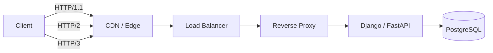

# 03- HTTP Versions

## Overview

HTTP has evolved from a simple request/response protocol into a multiplexed, encrypted, and transport-aware protocol stack designed for highly concurrent distributed applications.

The major versions relevant to modern backend engineering are:

| Version | Primary Transport | Major Improvements | Current Role |
|---|---|---|---|
| HTTP/1.0 | TCP | Basic HTTP request/response | Legacy |
| HTTP/1.1 | TCP | Persistent connections, chunked transfer, caching improvements | Broad compatibility |
| HTTP/2 | TCP + TLS commonly | Binary framing, multiplexing, HPACK | Modern APIs, browsers, gRPC |
| HTTP/3 | QUIC over UDP | Independent streams, QUIC transport, connection migration | Modern Internet traffic |

The evolution can be viewed as:

```text
HTTP/1.0
   |
   | Persistent connections
   | Better caching
   v
HTTP/1.1
   |
   | Binary framing
   | Multiplexed streams
   | Header compression
   v
HTTP/2
   |
   | QUIC
   | UDP
   | Independent stream recovery
   | Connection migration
   v
HTTP/3
```

The important architectural principle is that HTTP semantics and HTTP transport are related but distinct.

An API can continue to expose:

```http
GET /api/orders/123
```

while the underlying request is transported using HTTP/1.1, HTTP/2, or HTTP/3.

---

## HTTP Semantics vs HTTP Transport

HTTP semantics describe what the application means:

- HTTP methods
- Status codes
- Headers
- Request bodies
- Response bodies
- Caching
- Content negotiation
- Authentication
- Conditional requests

HTTP versions primarily change how those messages are transported.

Important differences include:

- Message framing
- Connection management
- Multiplexing
- Header encoding
- Flow control
- Stream management
- Transport protocol
- Connection establishment
- Packet-loss behavior

For example, a REST API implemented using Django or FastAPI does not need different business logic merely because the client upgrades from HTTP/1.1 to HTTP/2.

---

## HTTP/1.0

HTTP/1.0 established the basic HTTP request/response model.

A simplified exchange is:

```text
Client
  |
  | HTTP request
  v
Server
  |
  | HTTP response
  v
Client
```

Example:

```http
GET /index.html HTTP/1.0
Host: example.com
```

Response:

```http
HTTP/1.0 200 OK
Content-Type: text/html
Content-Length: 1234

<html>...</html>
```

HTTP/1.0 commonly used a new TCP connection for each request/response exchange.

This was inefficient for pages containing many resources.

---

## HTTP/1.0 Connection Model

A simplified lifecycle is:

```text
TCP connection
      |
      v
HTTP request
      |
      v
HTTP response
      |
      v
TCP connection closed
```

A page requiring:

```text
HTML
CSS
JavaScript
Image
Font
```

could result in multiple TCP connections:

```text
Connection 1 -> HTML
Connection 2 -> CSS
Connection 3 -> JavaScript
Connection 4 -> Image
Connection 5 -> Font
```

Each connection introduces additional network and connection-management overhead.

---

## HTTP/1.0 Limitations

Important limitations included:

- Short-lived connections
- Limited connection reuse
- Inefficient concurrent resource retrieval
- No multiplexing
- Less sophisticated caching semantics
- No standardized mandatory `Host` header in the original specification

As web applications became more complex, these limitations became increasingly significant.

---

## HTTP/1.1

HTTP/1.1 introduced several major improvements:

- Persistent connections
- Mandatory `Host` header
- Chunked transfer encoding
- Better caching semantics
- Range requests
- Conditional requests
- Improved connection management
- Better support for virtual hosting

HTTP/1.1 became the dominant HTTP version for many years and remains important because of its compatibility and operational simplicity.

---

## Persistent Connections

HTTP/1.1 allows a TCP connection to carry multiple sequential requests and responses.

Instead of:

```text
Request
Response
Close

Request
Response
Close
```

the client can reuse a connection:

```text
TCP Connection
 |
 +-- Request 1
 |     |
 |   Response 1
 |
 +-- Request 2
 |     |
 |   Response 2
 |
 +-- Request 3
       |
     Response 3
```

Connection reuse reduces:

- TCP handshake overhead
- TLS handshake overhead when TLS is involved
- Connection setup latency
- Server-side connection churn

This is particularly important for APIs where clients repeatedly communicate with the same service.

---

## HTTP/1.1 Keep-Alive

HTTP/1.1 persistent connections are commonly called keep-alive connections.

A request can explicitly indicate:

```http
GET /api/orders HTTP/1.1
Host: api.example.com
Connection: keep-alive
```

A server may close a connection when necessary:

```http
Connection: close
```

The connection lifecycle therefore becomes:

```text
TCP connection
      |
      +-- Request
      +-- Response
      +-- Request
      +-- Response
      +-- Request
      +-- Response
      |
      v
Connection closed
```

Production connection pools must balance reuse against idle connection consumption.

---

## The `Host` Header

HTTP/1.1 standardized the `Host` header.

Example:

```http
GET /products HTTP/1.1
Host: api.example.com
```

This allows multiple domains to share an IP address:

```text
203.0.113.10
   |
   +-- api.example.com
   +-- shop.example.com
   +-- admin.example.com
```

A reverse proxy or web server can use the hostname to select the appropriate virtual host.

This remains fundamental to modern HTTP infrastructure.

---

## HTTP/1.1 Pipelining

HTTP/1.1 defined request pipelining, allowing multiple requests to be sent without waiting for each response.

Conceptually:

```text
Request A ---->
Request B ---->
Request C ---->

Response A <---
Response B <---
Response C <---
```

Responses must preserve request ordering.

If request A takes a long time:

```text
Request A ----> slow
Request B ----> ready
Request C ----> ready

Response A <--- delayed
Response B <--- blocked
Response C <--- blocked
```

This creates head-of-line blocking.

HTTP/1.1 pipelining saw limited deployment and did not become the dominant solution for HTTP concurrency.

---

## HTTP/1.1 Concurrency

Because HTTP/1.1 does not multiplex independent requests on one connection, clients often use multiple connections:

```text
Client
 |
 +-- TCP connection 1
 +-- TCP connection 2
 +-- TCP connection 3
 +-- TCP connection 4
```

This can increase concurrency but also creates:

- More TCP state
- More TLS state
- More memory consumption
- More connection-management overhead
- More packets associated with connection setup

HTTP/2 addresses this using multiplexed streams.

---

## Chunked Transfer Encoding

HTTP/1.1 supports chunked transfer encoding, allowing a response to be streamed without knowing its final size in advance.

Example:

```http
HTTP/1.1 200 OK
Transfer-Encoding: chunked

7
Hello,
6
 world
0
```

Conceptually:

```text
Application produces data
        |
        v
Chunk 1
        |
        v
Chunk 2
        |
        v
Chunk 3
        |
        v
End of response
```

This is useful for:

- Streaming responses
- Large dynamically generated content
- Long-running responses
- Server-generated output

It is not required when the response length is already known and supplied through `Content-Length`.

---

## HTTP Range Requests

HTTP/1.1 supports byte-range requests.

Example:

```http
GET /video.mp4 HTTP/1.1
Host: media.example.com
Range: bytes=1000000-1999999
```

A server can respond:

```http
HTTP/1.1 206 Partial Content
Content-Range: bytes 1000000-1999999/50000000
```

Range requests are useful for:

- Large file downloads
- Download resumption
- Video delivery
- Partial object retrieval

Object storage systems and CDNs commonly use this capability for large assets.

---

## Conditional Requests

HTTP supports conditional requests using headers such as:

```http
If-None-Match
If-Modified-Since
If-Match
If-Unmodified-Since
```

For example:

```http
GET /static/app.js HTTP/1.1
Host: cdn.example.com
If-None-Match: "abc123"
```

If the resource has not changed:

```http
HTTP/1.1 304 Not Modified
```

The client can reuse its cached representation.

Conditional requests reduce:

- Bandwidth
- Response size
- Backend load
- CDN origin traffic

---

## HTTP/1.1 and REST APIs

HTTP/1.1 is fully capable of serving REST APIs.

Example:

```http
POST /api/orders HTTP/1.1
Host: api.example.com
Content-Type: application/json
Authorization: Bearer <token>

{
  "product_id": 123,
  "quantity": 2
}
```

The backend can process this using Django REST Framework or FastAPI.

The protocol version does not determine the REST resource model.

Performance limitations become more important when applications have:

- High concurrency
- Large numbers of small requests
- High network latency
- Many resources per page
- Large connection pools

---

## HTTP/2

HTTP/2 was designed to improve HTTP performance while preserving HTTP semantics.

Major features include:

- Binary framing
- Multiplexed streams
- HPACK header compression
- Stream-level flow control
- Connection-level flow control
- Improved concurrency

The architecture changes from:

```text
HTTP/1.1

TCP connection
 |
 +-- Request
 +-- Response
```

to:

```text
HTTP/2

TCP connection
 |
 +-- Stream 1
 +-- Stream 3
 +-- Stream 5
 +-- Stream 7
```

Multiple logical exchanges can share one TCP connection.

---

## Binary Framing

HTTP/1.1 represents request lines and headers using textual syntax.

HTTP/2 introduces binary frames.

Conceptually:

```text
HEADERS
DATA
HEADERS
DATA
```

The wire format is binary and structured, while HTTP methods, status codes, headers, and bodies retain their HTTP meaning.

Binary framing makes multiplexing practical because independent frames can be interleaved.

---

## HTTP/2 Streams

An HTTP/2 connection contains multiple logical streams.

For example:

```text
TCP Connection
 |
 +-- Stream 1: GET /users
 |
 +-- Stream 3: GET /orders
 |
 +-- Stream 5: GET /products
 |
 +-- Stream 7: POST /checkout
```

Each stream represents an independent logical request/response exchange.

Frames belonging to different streams can be interleaved.

---

## HTTP/2 Multiplexing

Suppose three requests are:

```text
A = /slow
B = /fast
C = /fast
```

With HTTP/1.1 on one connection:

```text
A ------------------------>
Response A ------------------------>

B --->
Response B --->

C --->
Response C --->
```

With HTTP/2:

```text
Stream A: A1 ---- A2 -------- A3
Stream B: B1 ---- B2
Stream C: C1 ---- C2
```

Frames from streams A, B, and C can be interleaved.

This allows a single connection to support high request concurrency.

---

## HTTP/2 Head-of-Line Blocking

HTTP/2 solves HTTP-level head-of-line blocking, but it does not eliminate transport-level head-of-line blocking.

HTTP/2 commonly runs over TCP:

```text
HTTP/2
   |
   v
TCP
```

TCP provides an ordered byte stream.

Suppose a TCP packet is lost:

```text
TCP packet lost
      |
      v
TCP retransmission
      |
      v
Later bytes wait
      |
      v
HTTP/2 delivery can stall
```

Even if later data belongs to another HTTP/2 stream, TCP cannot deliver bytes out of order to the application.

This limitation is a major motivation for HTTP/3.

---

## HTTP/2 Header Compression

HTTP/2 uses HPACK to reduce repetitive header overhead.

A typical request may repeatedly contain:

```http
Host
User-Agent
Authorization
Accept
Cookie
Content-Type
```

Without compression, these values may consume substantial bandwidth across many requests.

HPACK maintains indexed header state.

Conceptually:

```text
First request:
Host: api.example.com
Accept: application/json

Later request:
Reference existing header entries
```

This reduces repeated header transmission.

---

## HTTP/2 Flow Control

HTTP/2 provides flow control at both:

- Stream level
- Connection level

Conceptually:

```text
Sender
  |
  | DATA frames
  v
Receiver
  |
  | WINDOW_UPDATE
  v
Sender
```

The receiver controls how much data can be sent.

This prevents a high-speed sender from overwhelming a slow consumer.

Flow control becomes important for:

- Large responses
- Streaming
- High concurrency
- Slow clients
- gRPC streams

---

## HTTP/2 Connection Lifecycle

A simplified HTTPS + HTTP/2 lifecycle is:

```text
DNS
 |
 v
TCP connection
 |
 v
TLS handshake
 |
 v
ALPN negotiation
 |
 v
HTTP/2 connection
 |
 +-- Stream 1
 +-- Stream 3
 +-- Stream 5
 +-- Stream 7
 |
 v
Connection reused
```

HTTP/2 can technically operate without TLS in some contexts, but browsers generally use HTTP/2 over TLS.

---

## ALPN

Application-Layer Protocol Negotiation allows the client and server to negotiate the application protocol during TLS setup.

For example:

```text
Client
  |
  | Supports h2, http/1.1
  v
Server
  |
  | Selects h2
  v
HTTP/2
```

This allows one TLS endpoint to negotiate different application protocols.

Common ALPN identifiers include:

```text
h2
http/1.1
```

---

## HTTP/2 Prioritization

HTTP/2 provides mechanisms for expressing stream priority.

A conceptual example is:

```text
HTML
 |
 +-- High importance

CSS
 |
 +-- High importance

Images
 |
 +-- Lower importance
```

The objective is to deliver critical resources before less important resources.

In practice, prioritization behavior depends on clients, servers, CDNs, and proxies. Engineers should not assume that a priority signal will be interpreted identically across the entire network path.

---

## HTTP/2 Server Push

HTTP/2 originally included server push, allowing a server to proactively send resources the client was expected to need.

Conceptually:

```text
Client requests HTML
        |
        v
Server
   |
   +-- HTML
   +-- CSS
   +-- JavaScript
```

Server Push proved difficult to operate effectively and was removed from HTTP/2 implementations in some major client ecosystems.

Modern architectures generally prefer:

- `Link` headers
- Preload mechanisms
- Efficient caching
- CDN optimization
- Explicit client requests

Do not design a new system around HTTP/2 Server Push.

---

## HTTP/3

HTTP/3 changes the transport architecture substantially.

The protocol stack becomes:

```text
HTTP/3
   |
   v
QUIC
   |
   v
UDP
   |
   v
IP
```

HTTP/3 therefore does not use TCP.

---

## Why QUIC Exists

HTTP/2 introduced multiplexing above TCP:

```text
HTTP/2 streams
       |
       v
TCP ordered byte stream
```

TCP guarantees ordered delivery of bytes.

If one packet is lost, TCP waits for recovery before delivering later bytes to the application.

That means unrelated HTTP/2 streams can be affected.

QUIC moves stream multiplexing into the transport layer:

```text
HTTP/3
   |
   v
QUIC streams
   |
   v
UDP
```

QUIC can recover lost data independently for different streams.

---

## HTTP/3 Multiplexing

A QUIC connection contains independent streams:

```text
QUIC connection
 |
 +-- Stream 1
 +-- Stream 2
 +-- Stream 3
 +-- Stream 4
```

If Stream 1 experiences packet loss:

```text
Stream 1 ---> packet lost ---> retransmission
Stream 2 ---> continues
Stream 3 ---> continues
Stream 4 ---> continues
```

The loss does not require unrelated streams to wait for TCP-style ordered byte-stream recovery.

---

## QUIC Reliability

UDP itself does not provide:

- Reliability
- Ordering
- Retransmission
- Congestion control
- Stream multiplexing

QUIC implements the necessary transport mechanisms above UDP.

Therefore:

```text
UDP
  +
QUIC reliability
  +
QUIC congestion control
  +
QUIC streams
  +
TLS 1.3
  +
HTTP/3
```

forms a reliable encrypted HTTP transport.

---

## QUIC and TLS

QUIC integrates TLS 1.3 into its connection establishment.

Conceptually:

```text
HTTP/3
   |
   v
QUIC + TLS 1.3
   |
   v
UDP
```

This means HTTP/3 deployments are encrypted by design.

The TLS handshake is integrated with QUIC transport negotiation rather than being layered over a TCP connection in the same way as conventional HTTPS.

---

## HTTP/3 Connection Establishment

A simplified first connection is:

```text
Client
  |
  | QUIC + TLS 1.3
  v
Server
  |
  v
HTTP/3
```

Connection establishment and TLS negotiation are tightly integrated.

With session resumption, subsequent connections can reduce handshake overhead further.

This can be beneficial for:

- Mobile networks
- High-latency connections
- Frequently changing network paths
- Global applications

---

## QUIC Connection Migration

TCP connections are tied to endpoint addresses.

For example:

```text
Client IP A:port X
       |
       v
TCP connection
```

If a mobile client switches networks:

```text
Wi-Fi
  |
  v
Mobile network
```

its source IP may change, potentially breaking the TCP connection.

QUIC uses connection IDs that can allow a logical connection to survive changes in the network path.

Conceptually:

```text
Wi-Fi
  |
  | QUIC Connection ID
  v
Server

Network changes

Mobile
  |
  | Same logical QUIC connection
  v
Server
```

This is particularly useful for mobile clients.

---

## HTTP/3 and UDP

Using UDP does not make HTTP/3 unreliable.

The distinction is:

```text
UDP
 |
 | Provides datagram transport
 v
QUIC
 |
 | Adds reliability
 | Adds congestion control
 | Adds encryption
 | Adds streams
 | Adds flow control
 v
HTTP/3
```

QUIC is effectively a modern transport protocol implemented over UDP.

---

## HTTP Version Comparison

| Feature | HTTP/1.0 | HTTP/1.1 | HTTP/2 | HTTP/3 |
|---|---|---|---|---|
| Common transport | TCP | TCP | TCP | QUIC/UDP |
| Persistent connections | Limited | Yes | Yes | Yes |
| Binary framing | No | No | Yes | Yes |
| Multiplexing | No | No | Yes | Yes |
| Header compression | No | No | HPACK | QPACK |
| TCP HOL blocking | Yes | Yes | Yes | No TCP |
| Independent transport streams | No | No | No | Yes |
| Connection migration | No | No | No | Yes |
| TLS required by protocol | No | No | No | Yes, through QUIC |
| Stream flow control | No | No | Yes | Yes |
| Modern relevance | Legacy | High | High | Growing |

---

## HTTP/2 vs HTTP/3

The key distinction is:

```text
HTTP/2
   |
   v
TCP
```

versus:

```text
HTTP/3
   |
   v
QUIC
   |
   v
UDP
```

Both provide multiplexing.

The architectural difference is where multiplexing and stream recovery are implemented.

HTTP/2 multiplexes HTTP streams above TCP, while HTTP/3 uses QUIC streams at the transport layer.

---

## Head-of-Line Blocking Comparison

| Version | Application-level HOL | Transport-level HOL |
|---|---|---|
| HTTP/1.1 | Yes | Yes |
| HTTP/2 | Mostly addressed | Yes, because of TCP |
| HTTP/3 | Addressed for independent QUIC streams | Avoids TCP HOL |

HTTP/3 does not eliminate all forms of blocking.

Congestion control, flow control, server capacity, packet loss, and application dependencies can still affect request latency.

---

## HTTP Versions and REST APIs

A REST API can use HTTP/1.1, HTTP/2, or HTTP/3 without changing its resource model.

For example:

```http
GET /api/users/42
```

can be delivered using:

```text
HTTP/1.1
HTTP/2
HTTP/3
```

The backend can still execute:

```text
Routing
   |
   v
Authentication
   |
   v
Authorization
   |
   v
Business Logic
   |
   v
Database
   |
   v
Response
```

HTTP version optimization primarily affects network transport rather than application business logic.

---

## HTTP Versions and Django

Django applications are commonly deployed behind an application server and reverse proxy or load balancer.

A typical architecture is:

```text
Client
   |
 HTTPS
   v
CloudFront / ALB / Nginx
   |
   v
Gunicorn
   |
   v
Django
   |
   v
PostgreSQL
```

The client-facing protocol can differ from the backend-facing protocol.

For example:

```text
Client
   |
 HTTP/3
   v
CDN
   |
 HTTP/2 or HTTP/1.1
   v
Load Balancer
   |
 HTTP/1.1
   v
Django
```

This is normal.

The edge infrastructure can terminate HTTP/3 while forwarding requests using another HTTP version internally.

---

## HTTP Versions and FastAPI

A common FastAPI deployment looks like:

```text
Browser / Mobile Client
          |
       HTTP/2/3
          |
          v
     Load Balancer
          |
       HTTP/1.1
          |
          v
   Uvicorn / FastAPI
          |
          v
      PostgreSQL
```

The FastAPI application does not need to implement every client-facing transport protocol itself.

Protocol termination can be delegated to the infrastructure layer.

---

## HTTP Versions and gRPC

gRPC is strongly associated with HTTP/2 because HTTP/2 provides capabilities that map well to gRPC:

- Binary framing
- Multiplexed streams
- Bidirectional streaming
- Flow control
- Header compression

A typical architecture is:

```text
Service A
   |
   | gRPC
   | HTTP/2 + TLS
   v
Service B
```

For example:

```text
Order Service
     |
     | gRPC
     v
Inventory Service
```

The application protocol remains gRPC while HTTP/2 provides the underlying transport semantics.

---

## HTTP Versions and Kubernetes

A typical Kubernetes traffic path is:

```text
Client
  |
  v
Cloud Load Balancer
  |
  v
Ingress / Gateway
  |
  v
Service
  |
  v
Pod
```

Different hops may use different protocols.

For example:

```text
Client
  |
 HTTP/3
  v
Load Balancer
  |
 HTTP/2
  v
Ingress
  |
 HTTP/1.1
  v
Application Pod
```

The exact behavior depends on:

- Cloud provider
- Load balancer
- Ingress controller
- Gateway implementation
- Service mesh
- TLS configuration
- Application server

Never assume that enabling HTTP/2 or HTTP/3 at one layer automatically enables it across the entire path.

---

## Nginx and HTTP Versions

A reverse proxy can terminate client connections and proxy requests to an application.

For example:

```text
Client
   |
 HTTP/2
   v
Nginx
   |
 HTTP/1.1
   v
FastAPI
```

The proxy can handle:

- TLS termination
- Protocol negotiation
- Connection management
- Routing
- Load balancing
- Request limits
- Compression

while the application handles business logic.

HTTP/3 support depends on the actual Nginx build, version, modules, and deployment architecture. Always verify support in the production environment rather than assuming that an installed Nginx package supports QUIC.

---

## Connection Pooling

HTTP version selection affects connection pooling.

For HTTP/1.1:

```text
Connection Pool
 |
 +-- TCP connection 1
 +-- TCP connection 2
 +-- TCP connection 3
 +-- TCP connection 4
```

Multiple connections are often used to achieve concurrency.

With HTTP/2:

```text
Connection Pool
 |
 +-- One TCP connection
       |
       +-- Stream 1
       +-- Stream 2
       +-- Stream 3
       +-- ...
```

With HTTP/3:

```text
Connection Pool
 |
 +-- QUIC connection
       |
       +-- Stream 1
       +-- Stream 2
       +-- Stream 3
       +-- ...
```

The optimal connection strategy is workload-dependent.

Do not blindly carry an HTTP/1.1 connection-pool configuration into HTTP/2 or HTTP/3.

---

## Performance Considerations

HTTP version upgrades should be evaluated using production-like workloads.

Useful metrics include:

- Connection establishment latency
- TLS handshake latency
- Time to first byte
- Request latency
- Throughput
- Concurrent streams
- Connection count
- Packet loss
- Retransmissions
- CPU utilization
- Network bandwidth
- Error rate

A simplified latency model is:

```text
Total latency
    =
DNS
+ connection establishment
+ TLS
+ request transmission
+ server processing
+ response transmission
```

HTTP/2 and HTTP/3 primarily optimize the network and transport portions.

If an API spends 500 ms executing a database query, changing HTTP/1.1 to HTTP/3 will not turn that database query into a 5 ms operation.

---

## HTTP Version and Throughput

Multiplexing can improve connection utilization.

For example:

```text
HTTP/1.1

Connection 1 -> Request A
Connection 2 -> Request B
Connection 3 -> Request C
```

versus:

```text
HTTP/2

One connection
 |
 +-- Stream A
 +-- Stream B
 +-- Stream C
```

However, throughput remains constrained by:

- Network capacity
- Congestion control
- Server CPU
- Application processing
- Database capacity
- Flow-control windows
- Packet loss

HTTP version improvements do not remove application bottlenecks.

---

## When HTTP/1.1 Is Appropriate

HTTP/1.1 remains appropriate when:

- Compatibility is important
- Infrastructure is simple
- Traffic volume is moderate
- Clients do not support newer protocols
- Internal traffic does not require multiplexing
- Operational simplicity is preferred

There is no architectural requirement to migrate every internal connection to HTTP/2 or HTTP/3.

---

## When HTTP/2 Is Appropriate

HTTP/2 is particularly useful for:

- Modern browser applications
- High-concurrency APIs
- Many concurrent resources
- gRPC
- Latency-sensitive workloads
- Connection-heavy workloads

It is often a strong default for modern client-facing infrastructure when the platform supports it.

---

## When HTTP/3 Is Appropriate

HTTP/3 is attractive for:

- Public Internet services
- Mobile applications
- High-latency networks
- Lossy networks
- Global applications
- Applications that benefit from connection migration

It should still be introduced based on measured requirements and infrastructure support.

---

## Security Considerations

HTTP version selection does not replace application security.

Important controls include:

- TLS configuration
- Certificate management
- Authentication
- Authorization
- Request size limits
- Header limits
- Connection limits
- Stream limits
- Rate limiting
- Request smuggling defenses
- Dependency patching

Multiplexing introduces additional resource-management considerations because a single connection can carry many concurrent streams.

---

## HTTP/2 and Resource Exhaustion

A malicious client may attempt to create a large number of streams:

```text
One connection
 |
 +-- Stream 1
 +-- Stream 2
 +-- Stream 3
 +-- ...
 +-- Stream N
```

Infrastructure should enforce reasonable limits for:

- Concurrent streams
- Header size
- Request body size
- Connection count
- Idle connections
- Request rate
- Request duration

These controls protect both security and reliability.

---

## Request Smuggling

Request smuggling can occur when different HTTP components interpret message boundaries differently.

A common production path may contain:

```text
Client
  |
  v
CDN
  |
  v
WAF
  |
  v
Load Balancer
  |
  v
Reverse Proxy
  |
  v
Application Server
```

If components disagree about request framing, attackers may exploit the discrepancy.

Production defenses include:

- Keeping HTTP infrastructure patched
- Avoiding inconsistent proxy parsing behavior
- Standardizing HTTP handling
- Testing proxy chains
- Using security testing tools
- Monitoring malformed requests

---

## Monitoring HTTP Versions

Production systems should expose protocol-level telemetry.

Useful dimensions include:

```text
http.version = 1.1
http.version = 2
http.version = 3
```

Track:

- Request volume by HTTP version
- Latency by HTTP version
- Error rate by HTTP version
- Connection failures
- TLS failures
- QUIC negotiation failures
- Packet loss
- Retransmissions
- Backend latency
- Concurrent streams

This makes it possible to determine whether a protocol upgrade provides measurable value.

---

## Troubleshooting With curl

Force HTTP/1.1:

```bash
curl -I --http1.1 https://api.example.com
```

Force HTTP/2:

```bash
curl -I --http2 https://api.example.com
```

Force HTTP/3 when the installed curl supports it:

```bash
curl -I --http3 https://api.example.com
```

Verbose output:

```bash
curl -v --http2 https://api.example.com
```

The HTTP/3 option depends on how curl was built and whether its underlying libraries provide QUIC support.

---

## Inspecting ALPN

OpenSSL can be used to inspect HTTP/2 negotiation:

```bash
openssl s_client \
  -connect api.example.com:443 \
  -servername api.example.com \
  -alpn h2
```

The handshake output can reveal the negotiated application protocol.

HTTP/3 requires QUIC-aware tooling because it uses UDP rather than TCP.

---

## Production Architecture

A modern public API can support multiple HTTP versions at the edge:



The edge selects the protocol supported by the client.

The backend does not necessarily need to support every protocol directly.

This is a common production architecture because protocol termination and translation can be centralized at the edge.

---

## Protocol Selection Strategy

A practical architecture is:

```text
Internet Clients
      |
      +-- HTTP/3 where supported
      |
      +-- HTTP/2 where supported
      |
      +-- HTTP/1.1 fallback
      |
      v
CDN / Load Balancer
      |
      v
Internal Protocol
      |
      v
Backend Services
```

This provides compatibility without forcing every backend service to implement every HTTP version.

---

## Common Mistakes

### Assuming HTTP/2 Eliminates All Head-of-Line Blocking

HTTP/2 eliminates application-level request ordering problems through multiplexing, but TCP can still cause connection-level head-of-line blocking.

### Assuming HTTP/3 Is HTTP/2 Over UDP

HTTP/3 uses QUIC, which is a transport protocol implemented over UDP.

QUIC provides:

- Reliability
- Congestion control
- Encryption
- Stream multiplexing
- Flow control
- Connection management

### Assuming UDP Makes HTTP/3 Unreliable

UDP itself is unreliable, but QUIC implements reliable transport semantics above UDP.

### Running Excessive HTTP/2 Connections

HTTP/2 is designed to multiplex streams over connections.

Unnecessarily creating many connections can increase:

- CPU usage
- Memory usage
- TLS overhead
- Connection-management overhead

### Assuming the Backend Must Support HTTP/3

A CDN or load balancer can terminate HTTP/3 and forward HTTP/1.1 or HTTP/2 internally.

### Assuming HTTP/3 Automatically Makes APIs Faster

Application latency may still be dominated by:

- PostgreSQL queries
- Redis operations
- External API calls
- CPU-intensive processing
- Serialization
- Queueing
- Network distance

### Ignoring Proxy Chains

The effective protocol behavior may be determined by:

```text
Client
  |
CDN
  |
WAF
  |
Load Balancer
  |
Ingress
  |
Service
```

Every hop matters.

---

## Interview Traps

### Does HTTP/2 Use UDP?

No.

HTTP/2 commonly uses TCP.

HTTP/3 uses QUIC over UDP.

### Does HTTP/2 Eliminate Head-of-Line Blocking?

It eliminates HTTP-level head-of-line blocking between multiplexed streams but still inherits TCP-level head-of-line blocking.

### Why Does HTTP/3 Use UDP?

QUIC requires control over transport-level stream multiplexing and loss recovery without inheriting TCP's ordered byte-stream behavior.

### Is HTTP/3 Unreliable?

No.

QUIC provides reliable delivery, congestion control, flow control, encryption, and stream management above UDP.

### Does HTTP/2 Change REST Semantics?

No.

HTTP methods, status codes, headers, and application semantics remain HTTP semantics.

### Why Is gRPC Commonly Associated With HTTP/2?

HTTP/2 provides multiplexed streams, binary framing, flow control, and bidirectional streaming capabilities that fit gRPC well.

### Can One HTTP/2 Connection Handle Multiple Requests?

Yes.

A single connection can contain many concurrent HTTP/2 streams.

### Is HTTP/3 Always Faster?

No.

Performance depends on:

- Network latency
- Packet loss
- Client support
- Server implementation
- Infrastructure
- Application workload
- Connection reuse

---

## Practical Decision Matrix

| Requirement | Recommended Starting Point |
|---|---|
| Legacy compatibility | HTTP/1.1 |
| Simple internal REST API | HTTP/1.1 |
| Modern public REST API | HTTP/2 |
| Browser-heavy application | HTTP/2 |
| gRPC | HTTP/2 |
| Mobile / unreliable networks | Evaluate HTTP/3 |
| Global public service | HTTP/2 + HTTP/3 |
| High-latency Internet | Evaluate HTTP/3 |
| Internal service communication | HTTP/1.1 or HTTP/2 based on requirements |
| Maximum compatibility | HTTP/1.1 + HTTP/2 |
| Modern edge architecture | HTTP/3 + HTTP/2 + HTTP/1.1 fallback |

The correct decision should be validated through load testing and production telemetry.

---

## Production Checklist

- [ ] Support HTTP/1.1 where compatibility requires it.
- [ ] Evaluate HTTP/2 for modern client-facing APIs.
- [ ] Evaluate HTTP/3 for Internet-facing and mobile workloads.
- [ ] Configure TLS correctly.
- [ ] Verify ALPN negotiation.
- [ ] Monitor traffic by HTTP version.
- [ ] Monitor connection counts.
- [ ] Monitor concurrent stream counts.
- [ ] Configure request and header size limits.
- [ ] Configure concurrent stream limits.
- [ ] Keep proxies, CDNs, and load balancers patched.
- [ ] Test the complete proxy chain.
- [ ] Do not assume client-facing and backend protocols are identical.
- [ ] Benchmark before and after protocol changes.
- [ ] Separate transport latency from application latency.
- [ ] Maintain HTTP/1.1 fallback when compatibility requires it.

---

## Key Takeaways

- HTTP/1.1 provides persistent connections and broad compatibility; HTTP/2 adds binary framing, multiplexing, and header compression over TCP.
- HTTP/2 removes application-level head-of-line blocking but remains subject to TCP-level blocking; HTTP/3 uses QUIC over UDP to provide independent stream behavior.
- HTTP/3 is not simply HTTP/2 over UDP; QUIC provides reliability, congestion control, encryption, flow control, and connection migration.
- Client-facing and backend HTTP versions can differ because CDNs, load balancers, and reverse proxies can terminate and translate protocols.
- Choose HTTP versions based on workload, network conditions, infrastructure support, compatibility, and measured performance rather than assuming newer means faster.