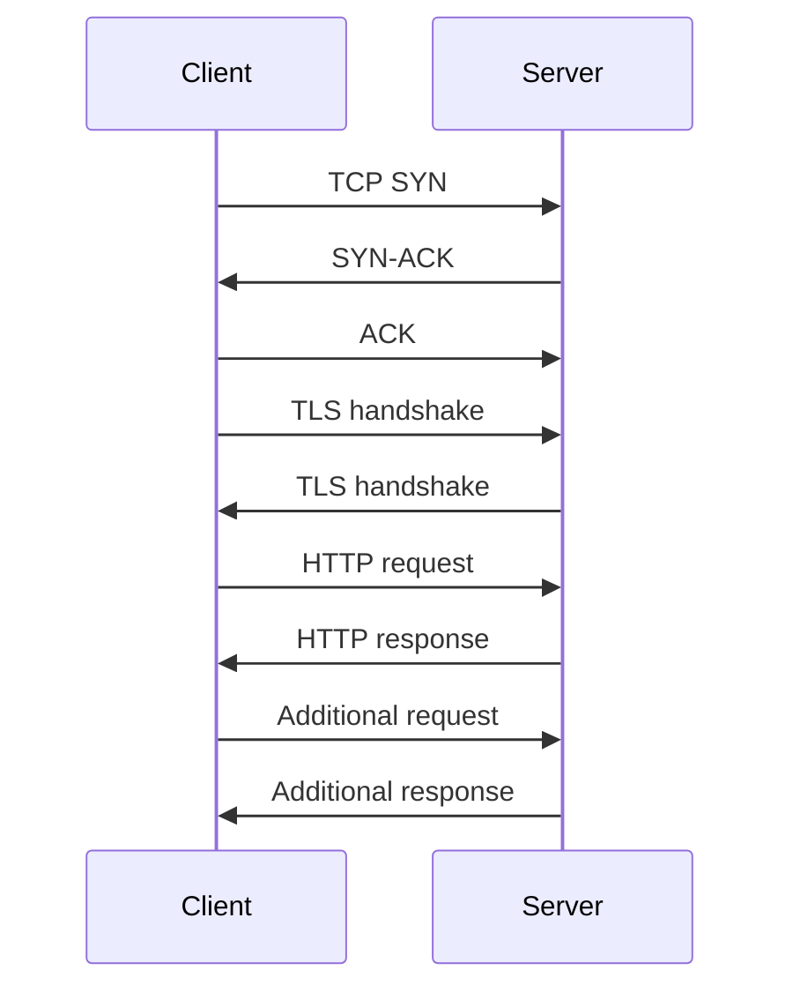
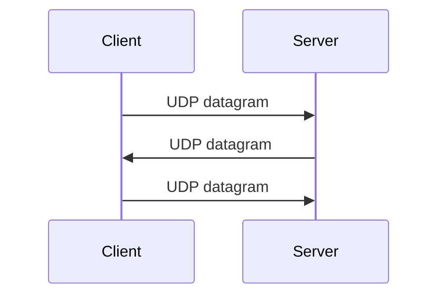
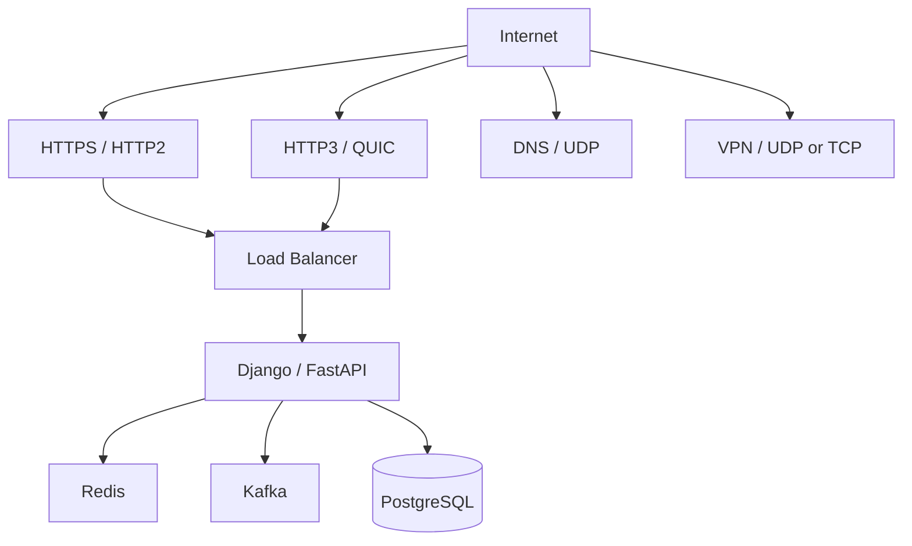

# 04- TCP vs UDP

## Overview

TCP and UDP are transport-layer protocols that sit above IP and provide applications with different communication semantics.

The choice between them is not simply:

> TCP is reliable, UDP is fast.

The real engineering trade-off is between the guarantees provided by the transport layer and the requirements of the application.

```text
Application
    |
    +----------------------+
    |                      |
    v                      v
   TCP                    UDP
    |                      |
    v                      v
    IP                     IP
    |
    v
Network
```

TCP provides a reliable, ordered byte stream with congestion control and retransmission.

UDP provides connectionless datagrams with minimal transport-level guarantees. Applications that use UDP can implement their own reliability, ordering, congestion control, encryption, and stream semantics when required.

This distinction is fundamental to:

- HTTP
- HTTP/3
- DNS
- PostgreSQL
- Redis
- Kafka
- gRPC
- WebRTC
- VPNs
- Load balancers
- Service-to-service communication
- Real-time systems

---

## Where TCP and UDP Fit

The Internet protocol stack can be simplified as:

```text
Application Layer
    |
    | HTTP
    | DNS
    | gRPC
    | Kafka
    | PostgreSQL
    |
    v
Transport Layer
    |
    +-- TCP
    |
    +-- UDP
    |
    v
Internet Layer
    |
    +-- IPv4
    +-- IPv6
    |
    v
Network Interface
```

The transport layer provides communication between application processes rather than merely between machines.

Ports identify application endpoints.

For example:

```text
Client
10.0.1.20:52341
       |
       | TCP
       |
       v
Server
10.0.2.10:443
```

The combination of IP addresses and ports identifies the communication endpoints.

---

## TCP

TCP, or Transmission Control Protocol, provides a reliable, ordered byte-stream abstraction.

Its major properties include:

- Connection-oriented communication
- Reliable delivery
- Ordered delivery
- Duplicate detection
- Retransmission
- Flow control
- Congestion control
- Full-duplex communication
- Byte-stream semantics

A simplified model is:

```text
Application
    |
    | byte stream
    v
   TCP
    |
    | segments
    v
    IP
```

The application does not normally need to implement packet ordering or retransmission itself.

---

## Why TCP Exists

Applications frequently require stronger delivery guarantees than IP provides.

IP is fundamentally a best-effort packet delivery protocol.

Packets can be:

- Lost
- Duplicated
- Reordered
- Delayed

TCP adds mechanisms that transform this unreliable network service into a reliable byte stream.

```text
Application
    |
    v
TCP
    |
    +-- Sequence numbers
    +-- Acknowledgements
    +-- Retransmissions
    +-- Flow control
    +-- Congestion control
    |
    v
IP
```

This makes TCP suitable for applications where losing or reordering application data is unacceptable.

---

## TCP Connection Lifecycle

TCP uses a connection establishment process commonly known as the three-way handshake.

```text
Client                                      Server
  |                                           |
  | -------- SYN ----------------------------> |
  |                                           |
  | <------- SYN + ACK ---------------------- |
  |                                           |
  | -------- ACK ----------------------------> |
  |                                           |
  |          Connection established           |
```

The handshake establishes sequence-number state and confirms that both endpoints are reachable.

---

## TCP Three-Way Handshake

A simplified sequence is:

```text
Client                                      Server

SYN, Seq=x ------------------------------->

        <---------------- SYN-ACK, Seq=y
                         Ack=x+1

ACK, Ack=y+1 ----------------------------->
```

After the handshake, application data can flow.

The handshake introduces latency before the first application payload can be exchanged.

For high-latency networks, connection establishment can therefore materially affect request latency.

---

## TCP Data Transfer

TCP assigns sequence numbers to transmitted data.

Conceptually:

```text
Sender

Bytes:
0 -------- 999
1000 ----- 1999
2000 ----- 2999
```

The receiver acknowledges received data.

If a segment is lost:

```text
Sender

Segment 1 ----------> Receiver
Segment 2 ----X
Segment 3 ----------> Receiver

Receiver
    |
    | Missing data detected
    v
Retransmission / recovery
```

TCP recovers from packet loss according to its retransmission and congestion-control algorithms.

---

## TCP Ordering

TCP presents data to the application as an ordered byte stream.

Suppose packets arrive:

```text
Packet 1
Packet 3
Packet 2
```

TCP does not expose:

```text
1, 3, 2
```

to the application.

Instead, it reassembles the stream:

```text
1, 2, 3
```

This is valuable for protocols such as:

- HTTP/1.1
- HTTP/2
- PostgreSQL
- Redis
- SSH

where the application expects an ordered stream of bytes.

---

## TCP Is a Byte Stream

One of the most important TCP concepts is:

> TCP preserves byte ordering, not application message boundaries.

Suppose an application sends:

```text
send("HELLO")
send("WORLD")
```

The receiver might read:

```text
"HELLOWORLD"
```

or:

```text
"HEL"
"LOWOR"
"LD"
```

The application must define its own message framing.

Common techniques include:

- Fixed-length messages
- Length-prefixed messages
- Delimiter-based framing
- Structured protocol framing

For example:

```text
[length][payload]
```

This distinction is important when implementing custom TCP protocols.

---

## TCP Flow Control

Flow control prevents a fast sender from overwhelming a slow receiver.

Conceptually:

```text
Fast sender
     |
     | TCP data
     v
Slow receiver
     |
     | Advertised receive window
     v
Sender limits outstanding data
```

TCP uses a receive window to communicate how much additional data the receiver can accept.

This protects receiver memory and processing capacity.

---

## TCP Congestion Control

Flow control protects the receiver.

Congestion control protects the network.

```text
Sender
   |
   | Traffic
   v
Network
   |
   +-- Routers
   +-- Queues
   +-- Links
   |
   v
Receiver
```

If the sender transmits too aggressively, network queues can become congested.

TCP adjusts its sending behavior based on network conditions.

Modern TCP implementations use sophisticated congestion-control algorithms.

Common examples include:

- CUBIC
- BBR

The exact algorithm depends on the operating system and configuration.

---

## TCP Reliability Mechanisms

TCP reliability relies on several mechanisms.

| Mechanism | Purpose |
|---|---|
| Sequence numbers | Track byte positions |
| ACKs | Confirm received data |
| Retransmission | Recover lost data |
| Receive window | Control receiver-side flow |
| Congestion window | Control network load |
| Checksums | Detect corrupted segments |
| Connection state | Maintain communication context |

Reliability is not free.

It requires:

- State
- Memory
- Processing
- ACK traffic
- Retransmission handling
- Congestion-control logic

---

## TCP Advantages

TCP is appropriate when applications require:

- Reliable delivery
- Ordered data
- Duplicate suppression
- Stream semantics
- Congestion control
- Mature operating-system support

Typical examples include:

- HTTPS
- SSH
- PostgreSQL
- Redis
- SMTP
- IMAP
- Many internal APIs

---

## TCP Limitations

TCP introduces:

- Connection establishment latency
- Protocol overhead
- Retransmission latency
- Ordering constraints
- Transport-level head-of-line blocking
- Kernel connection state
- Additional memory requirements

These characteristics are acceptable for many applications but can be problematic for certain real-time or latency-sensitive workloads.

---

## UDP

UDP, or User Datagram Protocol, provides a lightweight datagram transport.

Its core model is:

```text
Application
    |
    | Datagram
    v
   UDP
    |
    | IP packet
    v
    IP
```

UDP does not establish a connection before transmitting data.

A UDP application can send a datagram directly to a destination IP address and port.

---

## Why UDP Exists

Some applications do not need TCP's guarantees.

For example, consider a real-time system sending position updates:

```text
Player position:
X=100
X=101
X=102
X=103
```

If the update:

```text
X=101
```

is lost, receiving:

```text
X=102
```

may make the old update irrelevant.

Waiting for retransmission of stale information could be worse than losing it.

UDP provides a foundation for these types of applications.

---

## UDP Datagram Semantics

UDP preserves datagram boundaries.

If the sender transmits:

```text
Datagram A
Datagram B
Datagram C
```

the receiver receives distinct datagrams.

This differs from TCP's byte stream.

Conceptually:

```text
TCP:

[HELLOWORLD]

UDP:

[HELLO]
[WORLD]
```

The application can therefore naturally associate one datagram with one logical message, subject to application and network constraints.

---

## UDP Does Not Guarantee Delivery

A UDP datagram may be:

- Delivered
- Lost
- Duplicated
- Delayed
- Reordered

The application must tolerate these possibilities if they matter.

```text
Sender
  |
  +-- Datagram 1 --------> Receiver
  |
  +-- Datagram 2 ----X
  |
  +-- Datagram 3 --------> Receiver
```

UDP itself does not retransmit Datagram 2.

---

## UDP Does Not Guarantee Ordering

Suppose:

```text
Sender:
1
2
3
```

The receiver may observe:

```text
3
1
2
```

or:

```text
1
3
```

or only:

```text
1
2
```

The application decides whether this behavior is acceptable.

---

## UDP Does Not Provide Congestion Control

Traditional UDP itself does not provide TCP-style congestion control.

This means applications sending substantial UDP traffic must be carefully designed.

An application that continuously transmits large amounts of UDP traffic without considering network congestion can:

- Increase packet loss
- Affect other traffic
- Create operational instability
- Violate network policies

Protocols built over UDP may implement their own congestion-control mechanisms.

QUIC is an important example.

---

## UDP Advantages

UDP provides:

- Low protocol overhead
- No connection establishment
- Datagram semantics
- Application-controlled reliability
- Application-controlled ordering
- Efficient support for real-time traffic
- Useful multicast and broadcast semantics in appropriate networks

The main advantage is flexibility rather than simply speed.

---

## UDP Limitations

UDP does not inherently provide:

- Reliable delivery
- Ordering
- Duplicate detection
- Retransmission
- Flow control
- Congestion control
- Connection state

If an application needs these capabilities, it must implement them or use a higher-level protocol that does.

---

## TCP vs UDP

| Property | TCP | UDP |
|---|---|---|
| Connection-oriented | Yes | No |
| Reliable delivery | Yes | No |
| Ordered delivery | Yes | No |
| Byte stream | Yes | No |
| Datagram boundaries | No | Yes |
| Retransmission | Yes | No |
| Flow control | Yes | No |
| Congestion control | Yes | No |
| Connection handshake | Yes | No |
| Typical overhead | Higher | Lower |
| Application control | Lower | Higher |
| Typical use | APIs, databases, HTTPS | DNS, streaming, real-time systems |

---

## The Real Trade-Off

A common misconception is:

```text
TCP = slow
UDP = fast
```

A better model is:

```text
TCP
 |
 +-- Reliability
 +-- Ordering
 +-- Flow control
 +-- Congestion control
 +-- Stream semantics

UDP
 |
 +-- Minimal transport guarantees
 +-- Datagram semantics
 +-- Application control
```

UDP can avoid some TCP mechanisms, but that does not automatically make an application faster.

If an application reimplements:

- Reliability
- Ordering
- Retransmission
- Congestion control
- Security
- Connection management

then much of the complexity simply moves from the operating system into the application or protocol.

QUIC demonstrates this explicitly.

---

## TCP Request Lifecycle

A simplified HTTPS request over TCP looks like:



With a persistent connection, multiple HTTP requests can reuse the same TCP connection.

---

## UDP Request Lifecycle

A UDP exchange is simpler:



There is no transport-level handshake comparable to TCP's three-way handshake.

The application can still implement a logical session if required.

---

## TCP Socket Programming

Python exposes TCP networking through sockets.

A minimal TCP server looks like:

```python
import socket

HOST = "0.0.0.0"
PORT = 9000

with socket.socket(socket.AF_INET, socket.SOCK_STREAM) as server:
    server.setsockopt(socket.SOL_SOCKET, socket.SO_REUSEADDR, 1)
    server.bind((HOST, PORT))
    server.listen()

    while True:
        connection, address = server.accept()

        with connection:
            data = connection.recv(4096)

            if data:
                connection.sendall(b"OK")
```

The important socket type is:

```python
socket.SOCK_STREAM
```

which selects a TCP stream socket.

A production server would also need:

- Timeouts
- Concurrency management
- Message framing
- Graceful shutdown
- Resource limits
- Logging
- Error handling

---

## UDP Socket Programming

A UDP server uses:

```python
import socket

HOST = "0.0.0.0"
PORT = 9001

with socket.socket(socket.AF_INET, socket.SOCK_DGRAM) as server:
    server.bind((HOST, PORT))

    while True:
        data, address = server.recvfrom(65535)

        if data:
            server.sendto(b"OK", address)
```

The key socket type is:

```python
socket.SOCK_DGRAM
```

which selects UDP datagram semantics.

---

## TCP Application Framing

Because TCP is a byte stream, a production protocol must define message boundaries.

Length-prefix framing is a common approach:

```text
+----------------+----------------------+
| Message Length | Message Payload      |
+----------------+----------------------+
```

For example:

```text
[000012][Hello World!]
```

The receiver first reads the length and then reads exactly that many bytes.

This prevents bugs caused by assuming one `recv()` corresponds to one `send()`.

---

## Why `recv()` Is Not Message-Based

This code is unsafe for a custom protocol:

```python
data = connection.recv(4096)
process(data)
```

The call may return:

- Less than one logical message
- Exactly one message
- Multiple messages

Therefore:

```text
send(message A)
send(message B)
```

does not guarantee:

```text
recv() -> message A
recv() -> message B
```

Application-level framing is mandatory for custom TCP protocols.

---

## UDP Message Size

UDP preserves datagram boundaries, but that does not mean applications should send arbitrarily large datagrams.

Large UDP packets can experience fragmentation.

Fragmentation increases the probability that the entire logical message becomes unusable if one fragment is lost.

Production systems should generally keep UDP payloads appropriately small and account for path MTU.

For Internet-facing protocols, avoiding IP fragmentation is an important design consideration.

---

## MTU and Packet Fragmentation

MTU represents the maximum packet size that a network link can normally transmit without fragmentation.

For Ethernet, a common MTU is:

```text
1500 bytes
```

but the actual path MTU may differ.

A simplified path is:

```text
Client
  |
  | MTU 1500
  v
Router
  |
  | MTU 1400
  v
VPN
  |
  v
Server
```

Protocols must account for the effective path MTU.

QUIC, VPNs, tunnels, and UDP-based applications need particular care here.

---

## TCP and HTTP

Traditional HTTPS uses:

```text
HTTP
 |
TLS
 |
TCP
 |
IP
```

HTTP/1.1 and HTTP/2 commonly use TCP.

For example:

```text
Browser
   |
 HTTPS
   |
   v
TCP port 443
   |
   v
Load Balancer
   |
   v
Application
```

The reliability of TCP is appropriate because HTTP requests and responses generally cannot tolerate arbitrary loss or reordering.

---

## HTTP/3 and UDP

HTTP/3 changes the transport architecture:

```text
HTTP/3
   |
   v
QUIC
   |
   v
UDP
   |
   v
IP
```

QUIC implements:

- Reliability
- Stream multiplexing
- Flow control
- Congestion control
- Encryption
- Connection management

This is why HTTP/3 can use UDP while still providing reliable HTTP communication.

---

## DNS and UDP

DNS traditionally uses UDP for many queries because queries are often:

```text
Small request
      |
      v
Small response
```

UDP avoids TCP connection establishment overhead.

A simplified exchange is:

```text
Client
  |
  | UDP query
  v
DNS Resolver
  |
  | UDP response
  v
Client
```

DNS can also use TCP.

TCP may be used for:

- Zone transfers
- Responses requiring TCP fallback
- DNS operations where reliable stream transport is appropriate
- DNS over TLS
- DNS over HTTPS

Modern DNS deployments should therefore not be simplified to "DNS always uses UDP."

---

## Kafka and TCP

Kafka brokers communicate with clients over TCP.

Conceptually:

```text
Producer
   |
   | TCP
   v
Kafka Broker
   |
   v
Disk / Replicas
```

Kafka requires reliable ordered byte-stream communication for its protocol.

Kafka itself provides application-level semantics such as:

- Partition ordering
- Replication
- Consumer offsets
- Delivery guarantees

TCP provides the underlying reliable transport.

---

## PostgreSQL and TCP

PostgreSQL normally uses TCP:

```text
Django / FastAPI
      |
      | TCP
      v
PostgreSQL
```

A database connection relies on reliable, ordered communication.

Using UDP would require implementing substantial transport behavior at the database protocol layer.

---

## Redis and TCP

Redis commonly uses TCP:

```text
Application
    |
    | TCP
    v
Redis
```

Redis commands and responses depend on ordered communication.

For example:

```text
SET user:42 "Alice"
GET user:42
```

must be processed as an ordered protocol stream.

Redis also supports Unix domain sockets for local communication, which can avoid IP networking overhead entirely when client and server are on the same host.

---

## gRPC and TCP

Traditional gRPC uses HTTP/2, which commonly runs over TCP:

```text
gRPC
 |
 HTTP/2
 |
 TCP
 |
 IP
```

This gives gRPC:

- Reliable delivery
- Ordered transport
- Multiplexed streams
- Flow control
- Bidirectional streaming

gRPC is therefore a strong example of how application protocols build on TCP guarantees.

---

## QUIC: UDP With Transport Guarantees

QUIC is the clearest example of why "UDP is unreliable" is incomplete.

The stack is:

```text
HTTP/3
   |
   v
QUIC
   |
   +-- Reliable streams
   +-- Congestion control
   +-- Flow control
   +-- TLS 1.3
   +-- Connection migration
   |
   v
UDP
```

QUIC uses UDP as a minimal substrate while implementing modern transport behavior above it.

---

## TCP Head-of-Line Blocking

TCP guarantees ordered byte delivery.

Suppose:

```text
Packet 1 ---> received
Packet 2 ---> lost
Packet 3 ---> received
Packet 4 ---> received
```

TCP cannot expose packets 3 and 4 to the application before packet 2 has been recovered because the application sees an ordered byte stream.

This is transport-level head-of-line blocking.

HTTP/2 inherits this property because HTTP/2 commonly runs over TCP.

QUIC avoids this problem between independent streams.

---

## UDP and Application-Level Reliability

UDP does not prevent applications from implementing reliability.

An application could add:

```text
Sequence number
Acknowledgement
Retransmission
Timeout
Checksum
```

For example:

```text
Message
 |
 +-- Sequence = 42
 +-- Payload
```

The receiver could respond:

```text
ACK 42
```

If the sender does not receive the acknowledgement:

```text
Timeout
  |
  v
Retransmit sequence 42
```

This can be useful when the application needs reliability semantics that differ from TCP.

However, implementing a correct transport protocol is difficult.

---

## When UDP Is Appropriate

UDP is appropriate when the application values:

- Low latency
- Datagram semantics
- Application-controlled retransmission
- Tolerance for loss
- Real-time updates
- Efficient connectionless communication

Typical examples include:

- DNS
- Real-time telemetry
- VoIP
- Video conferencing
- Online gaming
- WebRTC
- QUIC
- Some VPN protocols

---

## When TCP Is Appropriate

TCP is appropriate when the application requires:

- Reliable delivery
- Ordered communication
- Mature transport behavior
- Stream semantics
- Built-in congestion control

Typical examples include:

- HTTPS
- REST APIs
- gRPC
- PostgreSQL
- Redis
- Kafka
- SSH
- Most internal microservice APIs

---

## Reliability Comparison

| Requirement | TCP | UDP |
|---|---:|---:|
| Reliable delivery | Built in | Application/protocol responsibility |
| Ordered delivery | Built in | Application/protocol responsibility |
| Duplicate suppression | Built in | Application/protocol responsibility |
| Retransmission | Built in | Application/protocol responsibility |
| Flow control | Built in | Not inherent |
| Congestion control | Built in | Not inherent |
| Datagram boundaries | No | Yes |

---

## Performance Considerations

TCP and UDP performance should be evaluated using the actual workload.

Important factors include:

- Round-trip time
- Packet loss
- Network congestion
- Message size
- Request frequency
- Connection reuse
- CPU utilization
- Kernel overhead
- Encryption
- Serialization
- Application processing

A small UDP packet is not automatically faster than a reused TCP connection.

For example:

```text
TCP persistent connection
       |
       v
Request
       |
       v
Response
```

may be extremely efficient because the expensive connection setup has already occurred.

---

## Latency

TCP introduces connection establishment overhead:

```text
TCP handshake
     +
TLS handshake
     +
Application request
```

But connection reuse significantly reduces this cost.

UDP can send application data immediately:

```text
UDP datagram
    |
    v
Network
```

This can be valuable for latency-sensitive applications.

However, if UDP requires a custom handshake, authentication, retransmission, and reliability protocol, the actual latency characteristics may become more complex.

---

## Throughput

TCP is designed to efficiently utilize available network capacity while responding to congestion.

UDP gives applications more control, but that control creates responsibility.

A poorly designed UDP sender can generate excessive traffic:

```text
Application
    |
    | unlimited UDP
    v
Network
    |
    +-- Packet loss
    +-- Queue buildup
    +-- Congestion
```

Production UDP systems must implement appropriate rate control and congestion behavior where required.

---

## Security Considerations

TCP and UDP have different operational attack surfaces.

### TCP Risks

Common concerns include:

- SYN floods
- Connection exhaustion
- Slow clients
- Resource exhaustion
- Port scanning

Mitigations include:

- SYN cookies
- Connection limits
- Load balancers
- Timeouts
- Rate limiting
- Network firewalls

### UDP Risks

Common concerns include:

- UDP floods
- Reflection attacks
- Amplification attacks
- Spoofed source addresses
- Datagram floods

Mitigations include:

- Rate limiting
- Network ACLs
- Security groups
- Anti-spoofing controls
- Protocol-level validation
- Appropriate response-size controls

---

## TCP Connection Exhaustion

Each TCP connection consumes state.

A high number of connections can consume:

- File descriptors
- Kernel memory
- Socket buffers
- CPU
- Application worker capacity

A production API should therefore use:

- Connection limits
- Idle timeouts
- Keep-alive configuration
- Load balancing
- Connection pooling

---

## UDP Amplification

UDP makes source-address spoofing easier in networks that permit it.

An attacker can send a small request with a forged source address:

```text
Attacker
   |
   | Small spoofed UDP request
   v
Server
   |
   | Large response
   v
Victim
```

This creates an amplification attack.

Public UDP services should carefully validate request behavior and avoid unnecessarily large responses to unauthenticated requests.

---

## AWS Considerations

AWS networking exposes both TCP and UDP through security controls.

Security groups and network ACLs can specify protocol and port rules.

For example:

```text
TCP 443
UDP 53
```

A typical web service might expose:

```text
Internet
   |
   v
ALB
   |
 TCP 443
   |
   v
Application
```

A UDP workload may use infrastructure designed to support UDP traffic, such as suitable load-balancing or network-level services.

The appropriate AWS service depends on whether the workload requires:

- TCP
- UDP
- HTTP
- HTTP/2
- HTTP/3
- TLS termination
- Layer 4 load balancing
- Layer 7 routing

---

## Layer 4 vs Layer 7

TCP and UDP are transport-layer protocols.

Load balancers operating primarily at Layer 4 can route traffic based on transport information:

```text
IP
 |
 +-- Protocol
 +-- Source port
 +-- Destination port
```

Layer 7 systems understand application protocols such as HTTP.

```text
Layer 7
 |
 +-- HTTP method
 +-- Host
 +-- Path
 +-- Headers
```

For example:

```text
TCP/UDP
   |
   v
Layer 4 Load Balancer
```

versus:

```text
HTTP
   |
   v
Layer 7 Reverse Proxy
```

This distinction matters when designing networking architectures.

---

## Troubleshooting TCP

Useful Linux commands include:

```bash
ss -tulpen
```

Show established TCP connections:

```bash
ss -tan
```

Inspect a listening port:

```bash
ss -ltnp
```

Test TCP connectivity:

```bash
nc -vz api.example.com 443
```

Test application-level HTTPS:

```bash
curl -v https://api.example.com
```

These commands help distinguish:

```text
Network connectivity
        |
        v
TCP connectivity
        |
        v
TLS
        |
        v
HTTP
        |
        v
Application
```

---

## Troubleshooting UDP

Check UDP listeners:

```bash
ss -lunp
```

Test UDP connectivity with netcat where supported:

```bash
nc -vzu dns.example.com 53
```

UDP troubleshooting is more difficult because the absence of a response does not necessarily prove that the packet was not transmitted.

Use packet capture when necessary:

```bash
sudo tcpdump -ni any udp port 53
```

For TCP:

```bash
sudo tcpdump -ni any tcp port 443
```

Packet captures can reveal:

- SYN packets
- SYN-ACK packets
- Retransmissions
- TCP resets
- UDP datagrams
- ICMP errors
- Packet loss symptoms

---

## Production Architecture

A typical backend platform may use both protocols:



Different workloads choose different transport characteristics.

There is no requirement for an entire architecture to use one transport protocol.

---

## Common Mistakes

### Thinking UDP Is Always Faster

UDP removes TCP's built-in mechanisms but does not guarantee lower end-to-end latency.

Application processing, network congestion, packet loss, and serialization can dominate latency.

### Using UDP for a CRUD API Without a Strong Reason

A REST API normally benefits from TCP's reliability and mature congestion control.

Using UDP introduces unnecessary protocol complexity unless the workload has a specific requirement.

### Assuming TCP Preserves Messages

TCP preserves byte order, not application message boundaries.

Your protocol must define framing.

### Assuming `send()` Equals `recv()`

TCP writes and reads can have different sizes.

Always implement proper framing and buffering.

### Ignoring UDP Packet Loss

UDP applications must explicitly decide what packet loss means.

For some systems:

```text
Lost telemetry = acceptable
```

For others:

```text
Lost financial transaction = unacceptable
```

The transport choice must follow business semantics.

### Implementing Custom Reliability Without Understanding Congestion Control

Adding retransmissions to UDP does not automatically create a correct transport protocol.

Naive retransmission algorithms can make congestion significantly worse.

### Sending Very Large UDP Datagrams

Large datagrams increase fragmentation risk and loss probability.

Prefer appropriately sized messages and account for path MTU.

### Assuming HTTP/3 Is "UDP HTTP"

HTTP/3 runs over QUIC, not directly over raw UDP.

The correct stack is:

```text
HTTP/3
  |
QUIC
  |
UDP
  |
IP
```

---

## Interview Traps

### Is TCP a Layer 4 Protocol?

Yes.

TCP and UDP are transport-layer protocols.

### Does TCP Guarantee Delivery?

TCP provides reliable delivery semantics through acknowledgements, retransmissions, sequence numbers, and related mechanisms, assuming the connection remains usable. It does not guarantee that a connection will eventually succeed under arbitrary network failures.

### Does UDP Have Ports?

Yes.

UDP uses source and destination ports to identify application endpoints.

### Can UDP Be Reliable?

UDP itself does not provide reliability, but an application or higher-level protocol can implement reliability over UDP.

QUIC is a major example.

### Why Does HTTP/3 Use UDP?

HTTP/3 uses QUIC over UDP to obtain multiplexed streams and modern transport behavior without TCP's ordered byte-stream head-of-line blocking.

### Which Is Better for Microservices?

For conventional REST APIs, TCP is normally the appropriate transport.

For gRPC, HTTP/2 over TCP is conventional.

The correct choice depends on protocol and workload rather than the label "microservice."

### Why Does PostgreSQL Use TCP?

Database communication requires reliable, ordered protocol exchange, which TCP provides.

### Why Does DNS Use UDP?

DNS queries are often small request/response exchanges where avoiding TCP connection establishment is useful. DNS can also use TCP when required.

---

## Decision Matrix

| Workload | Typical Choice | Reason |
|---|---|---|
| REST API | TCP | Reliability and mature congestion control |
| HTTPS | TCP or QUIC | HTTP/1.1 and HTTP/2 use TCP; HTTP/3 uses QUIC |
| gRPC | TCP | HTTP/2 transport |
| PostgreSQL | TCP | Ordered reliable protocol |
| Redis | TCP | Ordered reliable protocol |
| Kafka | TCP | Reliable ordered broker protocol |
| DNS | UDP + TCP | Small queries, with TCP fallback/use cases |
| Online gaming | UDP often | Low latency and application-controlled updates |
| VoIP | UDP often | Timeliness can matter more than retransmission |
| WebRTC | UDP preferred when possible | Real-time communication |
| HTTP/3 | UDP via QUIC | Multiplexing without TCP HOL blocking |
| SSH | TCP | Reliable ordered stream |
| File transfer | TCP | Reliable delivery |

---

## Production Checklist

- [ ] Choose TCP or UDP based on application semantics.
- [ ] Do not equate UDP with automatically lower latency.
- [ ] Understand TCP connection and TLS establishment costs.
- [ ] Reuse TCP connections where appropriate.
- [ ] Implement explicit framing for custom TCP protocols.
- [ ] Design UDP applications for packet loss and reordering.
- [ ] Account for path MTU when using UDP.
- [ ] Implement appropriate congestion and rate control for high-volume UDP workloads.
- [ ] Configure connection and resource limits.
- [ ] Monitor TCP retransmissions and resets.
- [ ] Monitor UDP packet loss and application-level errors.
- [ ] Protect public UDP endpoints against amplification and flooding.
- [ ] Use packet capture when transport-level troubleshooting is required.
- [ ] Understand which load-balancer layer handles the traffic.
- [ ] Remember that HTTP/3 uses QUIC over UDP, not raw UDP.

---

## Key Takeaways

- TCP provides a reliable, ordered byte stream with retransmission, flow control, and congestion control; UDP provides lightweight datagram delivery without those guarantees.
- TCP does not preserve application message boundaries, so custom TCP protocols must implement explicit framing; UDP naturally preserves datagram boundaries.
- UDP is not inherently faster; its value is giving the application more control over latency, loss, ordering, and reliability semantics.
- HTTP/1.1 and HTTP/2 commonly use TCP, while HTTP/3 uses QUIC over UDP to provide reliable multiplexed transport without TCP-level head-of-line blocking.
- Transport selection should follow application semantics, network conditions, reliability requirements, and operational constraints rather than choosing TCP or UDP based solely on performance assumptions.