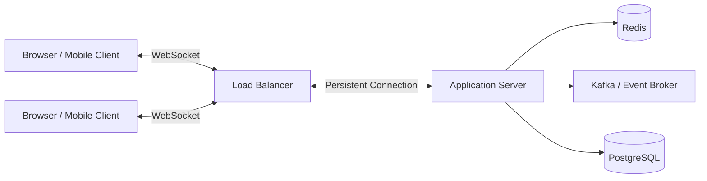
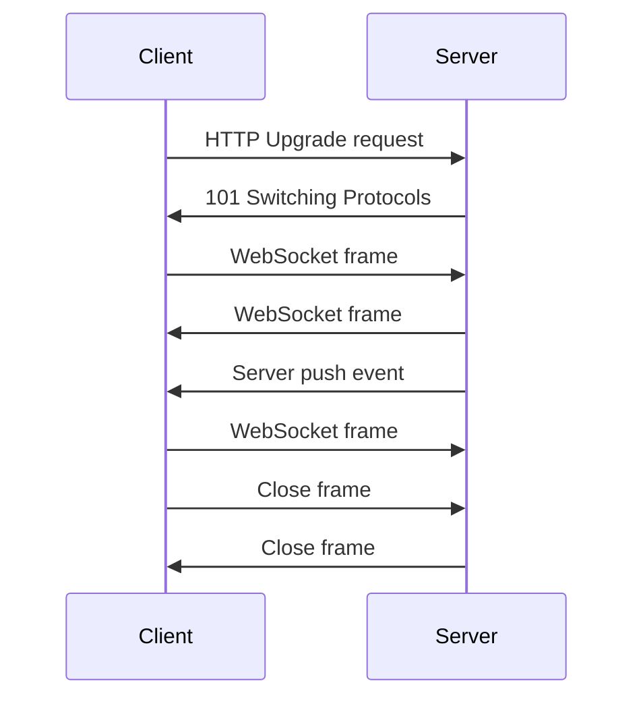
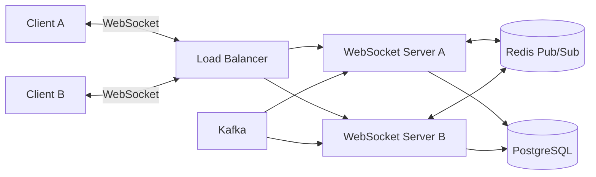
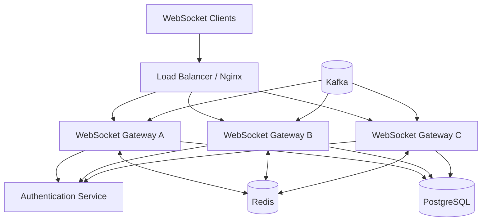

# 05- WebSockets

## Overview

WebSockets provide a persistent, bidirectional communication channel between a client and server.

Traditional HTTP communication is request-driven:

```text
Client
  |
  | HTTP request
  v
Server
  |
  | HTTP response
  v
Client
```

The server normally sends data only in response to a client request.

WebSockets change this interaction model:

```text
Client <=====================> Server
       persistent connection
       bidirectional messages
```

Once the WebSocket connection is established, either side can send messages independently.

This makes WebSockets useful when the server needs to push updates to clients with low latency, including:

- Chat applications
- Live notifications
- Real-time dashboards
- Collaborative editing
- Multiplayer applications
- Trading interfaces
- Job-progress updates
- Live monitoring
- Presence systems
- Interactive applications

WebSockets are not a replacement for REST APIs. Production systems commonly use both:

```text
REST / HTTP
    |
    +-- Authentication
    +-- CRUD operations
    +-- Resource queries
    +-- Configuration

WebSocket
    |
    +-- Live updates
    +-- Events
    +-- Presence
    +-- Streaming
```

---

## Why WebSockets Exist

HTTP polling can provide server-side updates, but it is inefficient when updates are frequent.

With polling:

```text
Client -> GET /notifications
Server -> []

Client -> GET /notifications
Server -> []

Client -> GET /notifications
Server -> ["new message"]

Client -> GET /notifications
Server -> []
```

The client repeatedly asks whether anything changed.

With WebSockets:

```text
Client -> WebSocket connection
Server -> connection established

Server ----------------> notification
Server ----------------> notification
Server ----------------> notification
```

The server can push an event as soon as it becomes available.

This reduces unnecessary requests and can significantly improve perceived latency for real-time workloads.

---

## WebSocket Architecture

A typical backend architecture looks like:



The important architectural property is that WebSocket connections are long-lived.

A normal HTTP request might exist for milliseconds.

A WebSocket connection may remain open for:

```text
seconds
minutes
hours
```

This changes how the application must handle:

- Memory
- Connection limits
- Authentication
- Scaling
- Load balancing
- Failure recovery
- Deployment
- Observability

---

## WebSocket Protocol

WebSockets are standardized as a protocol that begins with an HTTP-based handshake and then transitions into WebSocket framing.

A simplified lifecycle is:

```text
HTTP Request
    |
    | Upgrade: websocket
    v
HTTP 101 Switching Protocols
    |
    v
WebSocket Connection
    |
    +-- Frames
    +-- Ping/Pong
    +-- Close
```

The connection normally starts over HTTP or HTTPS and then becomes a persistent WebSocket channel.

---

## WebSocket URL Schemes

WebSockets commonly use:

```text
ws://
```

for unencrypted connections and:

```text
wss://
```

for TLS-encrypted connections.

Production Internet-facing applications should normally use:

```text
wss://api.example.com/ws
```

rather than:

```text
ws://api.example.com/ws
```

The security model is analogous to:

```text
HTTP  -> HTTPS
WS    -> WSS
```

---

## WebSocket Handshake

A simplified client request looks like:

```http
GET /ws HTTP/1.1
Host: example.com
Upgrade: websocket
Connection: Upgrade
Sec-WebSocket-Key: <random-value>
Sec-WebSocket-Version: 13
```

The server accepts the upgrade:

```http
HTTP/1.1 101 Switching Protocols
Upgrade: websocket
Connection: Upgrade
Sec-WebSocket-Accept: <computed-value>
```

After this exchange, the communication switches from ordinary HTTP request/response semantics to WebSocket frames.

---

## Handshake Flow



The initial HTTP handshake is therefore not the same thing as continuously using HTTP requests.

---

## WebSocket Frames

After the handshake, data is exchanged through frames.

Common frame types include:

| Frame | Purpose |
|---|---|
| Text | Textual application data |
| Binary | Binary application data |
| Ping | Keepalive / liveness check |
| Pong | Response to ping |
| Close | Connection termination |
| Continuation | Fragmented message continuation |

Applications typically work with text or binary messages rather than manipulating frames directly.

---

## Text vs Binary Messages

WebSockets support both text and binary messages.

Text messages commonly contain JSON:

```json
{
  "type": "notification",
  "id": "evt_123",
  "message": "Payment completed"
}
```

Binary messages can be useful for:

- Audio
- Video
- Images
- Binary protocols
- Compact serialized data

For typical backend applications, JSON over WebSockets is convenient and easy to debug.

For high-throughput systems, binary protocols such as Protocol Buffers may reduce serialization overhead.

---

## WebSockets vs HTTP Polling

| Characteristic | HTTP Polling | WebSocket |
|---|---|---|
| Communication | Request/response | Bidirectional |
| Server push | Indirect | Native |
| Persistent connection | Usually no | Yes |
| Request overhead | Repeated | Low after handshake |
| Real-time latency | Poll interval dependent | Low |
| Connection state | Short-lived | Long-lived |
| Scaling complexity | Lower | Higher |
| Infrastructure requirements | Conventional | Connection-aware |

Polling can still be preferable when updates are infrequent and simplicity matters more than real-time behavior.

---

## WebSockets vs Long Polling

Long polling keeps an HTTP request open until data is available or a timeout occurs.

```text
Client ---------------- GET /events ----------------> Server
Client <------------- event / timeout --------------- Server

Client ---------------- GET /events ----------------> Server
```

WebSockets maintain a persistent bidirectional channel instead:

```text
Client <==============================================> Server
                  WebSocket
```

Long polling can be easier to integrate with some infrastructure, but WebSockets are generally more efficient for sustained bidirectional communication.

---

## WebSockets vs Server-Sent Events

Server-Sent Events, or SSE, provide a persistent HTTP connection where the server sends events to the client.

| Property | WebSocket | SSE |
|---|---|---|
| Server → client | Yes | Yes |
| Client → server | Yes | No |
| Bidirectional | Yes | No |
| Transport | WebSocket | HTTP |
| Automatic event format | No | Yes |
| Browser simplicity | High | High |
| Best for | Interactive real-time systems | Server push |

If the application only needs server-to-browser updates, SSE can be simpler than WebSockets.

---

## When to Use WebSockets

Use WebSockets when:

- The server needs to push events immediately.
- The client also needs to send messages continuously.
- The connection should remain open.
- Polling would generate excessive request overhead.
- Low-latency interaction matters.
- The application has genuine real-time requirements.

Examples:

```text
Chat
  |
  +-- User messages
  +-- Typing indicators
  +-- Presence
  +-- Read receipts
```

```text
Monitoring dashboard
  |
  +-- CPU updates
  +-- Request rates
  +-- Error rates
  +-- Deployment status
```

---

## When Not to Use WebSockets

Do not introduce WebSockets merely because they appear more modern.

For a standard CRUD application:

```text
POST /orders
GET /orders/123
PATCH /orders/123
DELETE /orders/123
```

HTTP is usually simpler.

WebSockets introduce operational complexity that may not be justified when:

- Updates are infrequent.
- Clients can refresh data periodically.
- Server-to-client push is unnecessary.
- Requests are naturally independent.
- Infrastructure does not require persistent connections.

---

## WebSocket Connection Lifecycle

A production connection typically follows:

```text
CONNECTING
    |
    v
AUTHENTICATING
    |
    v
CONNECTED
    |
    +----> HEARTBEAT
    |
    +----> MESSAGE
    |
    +----> ERROR
    |
    v
CLOSING
    |
    v
CLOSED
```

The application should explicitly model this lifecycle.

---

## Authentication

WebSocket authentication is an important production concern.

A common pattern is to authenticate during the initial connection.

Possible approaches include:

- Secure cookies
- Short-lived access tokens
- Authorization headers where supported by the client
- Session identifiers
- Authentication during the WebSocket handshake

For browser applications, secure HTTP-only cookies are often preferable when the authentication architecture already uses cookie-based sessions.

Avoid putting long-lived sensitive credentials into URLs because URLs can be logged by infrastructure.

Avoid:

```text
wss://api.example.com/ws?token=<long-lived-secret>
```

when a safer authentication mechanism is available.

---

## Authorization

Authentication answers:

> Who is this client?

Authorization answers:

> What is this client allowed to receive or send?

Suppose:

```text
User A
  |
  +-- room: 100
```

and:

```text
User B
  |
  +-- room: 200
```

The server must not allow User A to subscribe to room 200 merely because the client sends:

```json
{
  "action": "subscribe",
  "room_id": 200
}
```

The server must validate authorization independently.

Never trust client-provided channel or resource identifiers.

---

## Django WebSockets

Django's traditional WSGI request model is designed primarily around HTTP request/response processing.

For WebSockets, Django applications commonly use ASGI-compatible tooling such as Django Channels or another ASGI-native WebSocket implementation.

A simplified architecture is:

```text
Client
   |
   v
Nginx / Load Balancer
   |
   v
ASGI Server
   |
   v
Django / WebSocket Application
```

The exact deployment architecture depends on the framework and ASGI server being used.

---

## FastAPI WebSockets

FastAPI provides native WebSocket support through Starlette.

A basic endpoint can be implemented as:

```python
from fastapi import FastAPI, WebSocket, WebSocketDisconnect

app = FastAPI()


@app.websocket("/ws")
async def websocket_endpoint(websocket: WebSocket) -> None:
    await websocket.accept()

    try:
        while True:
            message = await websocket.receive_text()
            await websocket.send_text(f"received: {message}")
    except WebSocketDisconnect:
        pass
```

This demonstrates the basic lifecycle:

```text
accept
  |
receive
  |
send
  |
receive
  |
...
  |
disconnect
```

Production applications need considerably more than this minimal loop.

---

## Connection Manager

A WebSocket application frequently needs to track active connections.

A simple in-process manager might look like:

```python
from fastapi import WebSocket


class ConnectionManager:
    def __init__(self) -> None:
        self.connections: set[WebSocket] = set()

    async def connect(self, websocket: WebSocket) -> None:
        await websocket.accept()
        self.connections.add(websocket)

    def disconnect(self, websocket: WebSocket) -> None:
        self.connections.discard(websocket)

    async def broadcast(self, message: str) -> None:
        disconnected: list[WebSocket] = []

        for websocket in self.connections:
            try:
                await websocket.send_text(message)
            except Exception:
                disconnected.append(websocket)

        for websocket in disconnected:
            self.disconnect(websocket)
```

This is useful for development and single-process deployments.

It is not sufficient for a horizontally scaled production system.

---

## The Scaling Problem

Suppose there are two application instances:

```text
                 Load Balancer
                 /           \
                v             v
             Server A      Server B
```

User A connects to Server A.

User B connects to Server B.

Now an event is generated on Server A:

```text
Event
 |
 v
Server A
 |
 v
?
```

Server A cannot directly access Server B's in-memory connection set.

An in-memory connection manager only knows about connections attached to that process.

This is one of the most important WebSocket scaling problems.

---

## Horizontal Scaling

A common architecture is:



When an event occurs:

```text
Event
  |
  v
Redis / Kafka
  |
  +--------> Server A
  |
  +--------> Server B
```

Each WebSocket server can then deliver the event to the clients connected to that process.

---

## Redis Pub/Sub

Redis Pub/Sub is commonly used to distribute transient WebSocket events between application instances.

```text
Application A
     |
     | PUBLISH
     v
 Redis Pub/Sub
     |
     +------------+
     |            |
     v            v
Server A       Server B
     |            |
     v            v
Clients        Clients
```

The important limitation is that Redis Pub/Sub is not a durable message queue.

If a subscriber is disconnected when a message is published, it generally does not receive that old message later.

Therefore Redis Pub/Sub is suitable for ephemeral notifications where missed events can be recovered or tolerated.

---

## Kafka for WebSocket Events

Kafka may be more appropriate when WebSocket events are part of a durable event-processing architecture.

```text
Domain Service
      |
      v
    Kafka
      |
      v
WebSocket Gateway
      |
      v
Connected Clients
```

Kafka provides durable event storage and consumer offsets.

This allows a WebSocket gateway to consume events independently from the services producing them.

However, Kafka should not be used merely because WebSockets exist.

Choose the event infrastructure based on:

- Durability
- Replay requirements
- Throughput
- Ordering
- Consumer architecture
- Operational complexity

---

## Connection Affinity

Persistent connections introduce load-balancing considerations.

Suppose:

```text
Client
  |
  v
Load Balancer
  |
  v
Server A
```

The WebSocket connection remains attached to Server A until it closes.

Subsequent messages on that connection do not normally get redistributed as independent HTTP requests.

This is different from ordinary stateless HTTP request balancing.

---

## Sticky Sessions

Some architectures use sticky sessions so that a client is consistently routed to the same server.

This can simplify some stateful designs:

```text
Client A --> Server A
Client B --> Server B
```

However, sticky sessions should not be treated as the primary mechanism for distributed state.

A production system should generally externalize shared state when possible.

Sticky sessions can also create uneven load:

```text
Server A: 50,000 connections
Server B: 5,000 connections
```

even if request-based balancing would normally distribute traffic evenly.

---

## Load Balancer Requirements

The load balancer or reverse proxy must support WebSocket upgrades and long-lived connections.

A typical path is:

```text
Client
  |
  | WSS
  v
Nginx / Load Balancer
  |
  | WebSocket upgrade
  v
ASGI Application
```

Important settings include:

- Upgrade handling
- Connection timeout
- Idle timeout
- Maximum connections
- TLS termination
- Health checks

Incorrect timeout configuration can cause apparently random disconnects.

---

## Nginx and WebSocket Upgrade

A reverse proxy must forward the upgrade headers correctly.

A simplified Nginx configuration looks like:

```nginx
location /ws/ {
    proxy_pass http://websocket_backend;

    proxy_http_version 1.1;
    proxy_set_header Upgrade $http_upgrade;
    proxy_set_header Connection "upgrade";

    proxy_set_header Host $host;
    proxy_set_header X-Real-IP $remote_addr;
    proxy_set_header X-Forwarded-For $proxy_add_x_forwarded_for;

    proxy_read_timeout 3600s;
    proxy_send_timeout 3600s;
}
```

The exact timeout should be based on application requirements rather than blindly using a large value.

---

## Heartbeats

Long-lived connections need liveness detection.

A common pattern is:

```text
Server ---- PING ----> Client
Server <--- PONG ----- Client
```

If the expected response does not arrive within a configured interval:

```text
Connection
    |
    v
Heartbeat timeout
    |
    v
Close connection
```

Heartbeats help detect:

- Broken networks
- Dead clients
- Half-open connections
- Infrastructure failures
- Mobile network transitions

---

## Ping/Pong vs Application Heartbeats

Protocol-level ping/pong and application-level heartbeats solve related but different problems.

Protocol ping/pong can verify transport-level liveness.

Application heartbeats can communicate application state:

```json
{
  "type": "heartbeat",
  "timestamp": "2026-08-23T12:00:00Z"
}
```

Do not send application heartbeats excessively.

If millions of clients each send heartbeats every few seconds, heartbeat traffic itself can become a significant workload.

---

## Reconnection

Clients should expect WebSocket connections to fail.

Reasons include:

- Network changes
- Server deployments
- Load balancer restarts
- Mobile connectivity changes
- Proxy failures
- Server overload
- Idle timeout
- Authentication expiry

A typical client state machine is:

```text
CONNECTED
   |
   | disconnect
   v
RECONNECTING
   |
   +-- success --> CONNECTED
   |
   +-- failure --> BACKOFF
                     |
                     v
                 RECONNECT
```

Use exponential backoff with jitter.

For example:

```text
1s
2s
4s
8s
16s
...
```

with a maximum delay.

Jitter prevents thousands of clients from reconnecting simultaneously after an outage.

---

## Reconnection Storms

A production failure can create a feedback loop:

```text
Server outage
     |
     v
50,000 clients disconnect
     |
     v
All clients reconnect immediately
     |
     v
Server overloaded
     |
     v
More disconnects
     |
     v
More reconnects
```

This is a thundering-herd problem.

Mitigate it with:

- Exponential backoff
- Random jitter
- Connection admission control
- Rate limits
- Capacity planning
- Load shedding
- Graceful deployment behavior

---

## Graceful Shutdown

WebSocket servers should handle shutdown carefully.

During deployment:

```text
New connections
       |
       X
Stop accepting

Existing connections
       |
       v
Graceful close
       |
       v
Clients reconnect
```

A server should avoid abruptly terminating thousands of connections when a rolling deployment can drain them gradually.

Kubernetes deployments should account for connection draining and termination behavior.

---

## Backpressure

A WebSocket server can produce messages faster than a client can consume them.

For example:

```text
Server
  |
  | 10,000 events/sec
  v
Slow client
  |
  | 10 events/sec
  v
Buffer grows
```

Without limits, memory consumption can increase continuously.

Production systems should define:

- Maximum queued messages
- Maximum message size
- Write timeouts
- Per-connection rate limits
- Drop policies
- Disconnect policies

For some event types, dropping stale updates is better than buffering indefinitely.

For example:

```text
CPU = 80%
CPU = 81%
CPU = 82%
CPU = 83%
```

A slow dashboard may only need the latest value rather than every historical update.

---

## Message Ordering

WebSocket messages sent over a single connection are delivered according to the underlying WebSocket/TCP stream semantics.

However, application-level ordering becomes more complicated when messages are produced by multiple distributed services.

For example:

```text
Service A --> Event 1
Service B --> Event 2
```

The gateway may receive them in an order different from business expectations.

If ordering matters, include metadata such as:

```json
{
  "event_id": "evt_123",
  "aggregate_id": "order_42",
  "sequence": 17,
  "type": "order.updated"
}
```

Consumers can then detect:

- Missing events
- Duplicates
- Out-of-order events

---

## Idempotency

WebSocket messages can be duplicated at the application level.

For important commands, use an idempotency identifier:

```json
{
  "type": "payment.retry",
  "command_id": "cmd_123",
  "payment_id": "pay_42"
}
```

The backend can record processed command IDs.

This is particularly important when clients retry after uncertain network failures.

The client may not know whether:

```text
Command
  |
  v
Server processed it
  |
  X
Response lost
```

If the client reconnects and retries, the command should not accidentally execute twice.

---

## Delivery Semantics

A WebSocket connection by itself does not define end-to-end business delivery guarantees.

Possible application semantics include:

| Semantic | Meaning |
|---|---|
| Best effort | Message may be lost |
| At-most-once | Message delivered zero or one time |
| At-least-once | Message may be delivered multiple times |
| Application-level acknowledgment | Client confirms receipt |
| Durable replay | Client can recover missed events |

For important business events, WebSockets should usually be treated as a delivery channel rather than the system of record.

---

## WebSocket Event Replay

Suppose a client disconnects:

```text
Event 101
Event 102
X Client disconnected
Event 103
Event 104
Client reconnects
```

If the client needs events 103 and 104, the WebSocket server needs a recovery mechanism.

A common pattern is:

```text
Client
  |
  | last_seen_event_id = 102
  v
Server
  |
  | fetch missed events
  v
Event Store / Kafka / Database
  |
  v
Client
```

This is significantly more reliable than assuming the persistent connection will never fail.

---

## WebSocket API Design

Use explicit message envelopes.

For example:

```json
{
  "type": "order.updated",
  "event_id": "evt_01J...",
  "timestamp": "2026-08-23T12:00:00Z",
  "data": {
    "order_id": "ord_123",
    "status": "SHIPPED"
  }
}
```

A consistent envelope makes it easier to support:

- Versioning
- Routing
- Observability
- Idempotency
- Client-side dispatch
- Schema evolution

Avoid unstructured messages such as:

```text
"shipped"
```

in a production protocol.

---

## Schema Versioning

WebSocket connections can remain open for long periods, so schema compatibility matters.

A client connected before a deployment may receive events produced by a newer server version.

Possible strategies include:

```json
{
  "type": "order.updated",
  "version": 2,
  "data": {}
}
```

Use backward-compatible changes where possible.

Avoid removing or changing the meaning of fields without considering connected clients running older application versions.

---

## Message Size Limits

WebSocket servers should enforce message-size limits.

For example:

```text
Maximum message size = 1 MB
```

The exact value depends on the workload.

Without limits, a malicious client could attempt to send extremely large payloads and consume:

- Memory
- CPU
- Network bandwidth
- Parser resources

Validate payload size before expensive processing.

---

## Rate Limiting

Rate limiting should operate at multiple levels.

Examples:

```text
Per IP
Per user
Per connection
Per command type
Per tenant
```

For example:

```text
subscribe       20/minute
send_message    60/minute
```

The correct limits depend on business requirements.

Rate limiting is especially important for public WebSocket APIs because connections can remain open for long periods.

---

## Multi-Tenant WebSockets

For multi-tenant systems, tenant isolation must exist at the connection and message levels.

```text
Connection
    |
    +-- authenticated_user
    +-- tenant_id
    +-- permissions
    +-- subscriptions
```

Every event should be authorized against the tenant context.

Do not rely solely on the client to specify:

```json
{
  "tenant_id": "tenant-b"
}
```

The server should derive tenant identity from trusted authentication context and enforce authorization.

---

## Observability

WebSocket monitoring should track more than HTTP request latency.

Important metrics include:

| Metric | Why it matters |
|---|---|
| Active connections | Capacity planning |
| Connections opened/sec | Connection churn |
| Connections closed/sec | Stability |
| Connection duration | Usage patterns |
| Authentication failures | Security |
| Messages/sec | Throughput |
| Bytes/sec | Network capacity |
| Send queue size | Backpressure |
| Reconnect rate | Client/network health |
| Error rate | Application stability |
| Heartbeat failures | Dead connections |
| Per-tenant connections | Isolation/capacity |

Also log connection lifecycle events with correlation identifiers.

Avoid logging message payloads blindly because they may contain sensitive data.

---

## Distributed Tracing

A WebSocket connection is long-lived, so conventional HTTP request tracing does not map directly to the entire lifecycle.

Use identifiers such as:

```text
connection_id
user_id
tenant_id
trace_id
event_id
```

For individual commands or events, create separate trace spans.

Conceptually:

```text
WebSocket Connection
        |
        +-- Command span
        |
        +-- Database span
        |
        +-- Event publication span
        |
        +-- Broadcast span
```

This makes it possible to trace a real-time event across multiple services.

---

## Capacity Planning

WebSocket capacity is often connection-driven rather than request-per-second-driven.

For example:

```text
100,000 connected clients
```

may generate relatively little traffic but still require significant resources because each connection consumes:

- File descriptors
- Kernel socket state
- Buffers
- Application memory
- Event-loop resources

A capacity model should consider:

```text
Connections
+
Messages/sec
+
Bytes/sec
+
Average message size
+
Peak reconnect rate
```

rather than only HTTP-style requests per second.

---

## File Descriptor Limits

Each TCP connection consumes a file descriptor on the server.

Linux systems have configurable limits.

Inspect the current shell limit:

```bash
ulimit -n
```

A high-connection WebSocket service may require appropriately configured operating-system limits.

Do not simply increase limits without also validating:

- Memory
- CPU
- Kernel socket limits
- Load balancer capacity
- Application event-loop capacity

---

## Kubernetes Considerations

Kubernetes can run WebSocket servers effectively, but persistent connections change deployment behavior.

Consider:

- Pod termination grace period
- Readiness probes
- Connection draining
- Load balancer behavior
- Pod capacity
- Horizontal Pod Autoscaler signals
- Maximum connections per pod

CPU alone may be a poor scaling metric.

A pod handling:

```text
50,000 idle connections
```

may have low CPU utilization but still be near its connection capacity.

Custom metrics such as active connections per pod can be useful.

---

## Deployment Strategy

A WebSocket deployment should avoid dropping all connections simultaneously.

A safer rolling deployment is:

```text
Old Pod A
Old Pod B
    |
    | Stop accepting new connections
    v
Drain existing connections
    |
    v
Clients reconnect
    |
    v
New Pod A
New Pod B
```

Clients must already support reconnection.

For large systems, connection draining and deployment behavior should be tested under realistic connection counts.

---

## Failure Scenarios

### Application Restart

Existing connections terminate.

Clients should reconnect automatically.

### Load Balancer Restart

Connections may terminate even if application pods remain healthy.

Clients should reconnect.

### Redis Failure

If Redis is used for event fan-out, cross-instance broadcasting may fail.

The system should define whether:

- Events can be dropped
- Events can be replayed
- A fallback mechanism exists

### Kafka Consumer Lag

If WebSocket events are driven by Kafka, increased consumer lag can cause real-time updates to become stale.

Monitor:

```text
Kafka consumer lag
```

as part of the WebSocket system's health.

---

## Security Considerations

Production WebSocket systems should address:

- TLS
- Authentication
- Authorization
- Origin validation
- Message-size limits
- Rate limiting
- Input validation
- Connection limits
- Tenant isolation
- Sensitive-data handling
- DoS protection

### Origin Validation

Browser-based WebSocket clients send an `Origin` header.

Servers should validate allowed origins where browser-origin security matters.

Do not assume that WebSocket connections are automatically protected by ordinary HTTP CORS configuration.

WebSocket origin validation is a separate security concern.

---

## Denial-of-Service Protection

A malicious client can create many persistent connections:

```text
Attacker
 |
 +--> Connection 1
 +--> Connection 2
 +--> Connection 3
 ...
 +--> Connection 100,000
```

Mitigations include:

- IP-based connection limits
- User-based connection limits
- Authentication requirements
- Rate limiting
- Load balancers
- WAF/network controls where appropriate
- Connection quotas
- Idle timeouts
- Maximum message sizes

Public WebSocket endpoints should be capacity-tested against connection floods.

---

## Common Mistakes

### Treating WebSockets as Stateless HTTP

WebSocket connections are stateful and long-lived.

This affects memory, scaling, deployment, and failure recovery.

### Storing All Connections in Process Memory

This works on one server but breaks when horizontally scaling.

Use shared event infrastructure when clients are distributed across instances.

### Assuming Sticky Sessions Solve Distributed State

Sticky sessions keep a connection on one server.

They do not synchronize state between servers.

### Ignoring Reconnection

Networks fail.

A production client must assume connections can disappear.

### Reconnecting Immediately

Immediate retries can create a reconnect storm.

Use exponential backoff and jitter.

### No Backpressure

A slow client can cause unbounded memory growth.

Set queue and message limits.

### Sending Sensitive Data Without Authorization Checks

Subscription requests must be authorized server-side.

Never trust:

```json
{
  "room_id": "private-room"
}
```

without validating access.

### Using Redis Pub/Sub as a Durable Queue

Redis Pub/Sub is transient.

Use durable infrastructure such as Kafka or a persistent database when replay is required.

### No Message Versioning

Long-lived connections can span deployments.

Design event schemas for compatibility.

---

## Production Architecture Pattern

A mature WebSocket architecture may look like:



Responsibilities should be separated:

| Component | Responsibility |
|---|---|
| Load balancer | TLS, routing, connection distribution |
| WebSocket gateway | Connection lifecycle and message handling |
| Authentication | Identity validation |
| Redis | Fast transient coordination/fan-out |
| Kafka | Durable event distribution |
| PostgreSQL | Durable business state |
| Client | Reconnection and UI state |

---

## REST and WebSocket Together

A common production architecture uses both.

```text
Client
  |
  +--------------------+
  |                    |
  v                    v
REST API           WebSocket
  |                    |
  v                    v
Commands / CRUD     Live Events
  |                    |
  +---------+----------+
            |
            v
      Backend Services
```

For example:

```text
POST /orders
```

creates an order through REST.

The backend then publishes:

```text
order.created
```

and connected clients receive:

```json
{
  "type": "order.created",
  "event_id": "evt_123",
  "data": {
    "order_id": "ord_42"
  }
}
```

This separation keeps commands and live notifications conceptually clear.

---

## Practical Design Example

Consider a live order-tracking system.

The customer opens:

```text
wss://api.example.com/ws/orders
```

The server authenticates the user.

The client subscribes:

```json
{
  "type": "subscribe",
  "channel": "order",
  "resource_id": "ord_123"
}
```

The server verifies:

```text
Authenticated user
        |
        v
Owns order ord_123?
        |
     +--+--+
     |     |
    Yes    No
     |     |
 Subscribe Reject
```

When the order changes:

```text
Order Service
     |
     v
PostgreSQL transaction
     |
     v
Outbox / Event
     |
     v
Kafka
     |
     v
WebSocket Gateway
     |
     v
Customer
```

This is significantly more reliable than having the order service directly maintain WebSocket connections.

---

## WebSocket vs Other Communication Patterns

| Requirement | REST | Polling | SSE | WebSocket |
|---|---:|---:|---:|---:|
| CRUD | Excellent | Poor | Poor | Possible |
| Server push | Limited | Indirect | Excellent | Excellent |
| Client push | Excellent | Excellent | No | Excellent |
| Bidirectional real-time | No | No | No | Excellent |
| Simple infrastructure | Excellent | Excellent | Good | More complex |
| Long-lived connection | No | Sometimes | Yes | Yes |
| High-frequency interaction | Poor | Poor | Good | Excellent |

The simplest protocol that satisfies the requirements is generally preferable.

---

## Production Checklist

- [ ] Use `wss://` for production Internet-facing connections.
- [ ] Authenticate during or immediately after connection establishment.
- [ ] Authorize every subscription and sensitive command.
- [ ] Validate the WebSocket `Origin` where appropriate.
- [ ] Configure load balancers and proxies for WebSocket upgrades.
- [ ] Configure realistic idle and connection timeouts.
- [ ] Implement heartbeat/liveness detection.
- [ ] Implement exponential reconnect backoff with jitter.
- [ ] Plan for horizontal scaling.
- [ ] Do not rely exclusively on in-memory connection state.
- [ ] Use Redis or another appropriate fan-out mechanism for transient events.
- [ ] Use Kafka or durable storage when event replay is required.
- [ ] Implement backpressure and per-connection queue limits.
- [ ] Limit message sizes and command rates.
- [ ] Track active connections and connection churn.
- [ ] Monitor reconnect rates and heartbeat failures.
- [ ] Design event schemas for compatibility.
- [ ] Support graceful shutdown and connection draining.
- [ ] Plan capacity around connections, messages/sec, and bytes/sec.
- [ ] Test failure and reconnect scenarios before production rollout.

---

## Key Takeaways

- WebSockets provide persistent bidirectional communication and are appropriate for genuine real-time workloads, but they introduce significantly more operational complexity than ordinary HTTP APIs.
- Horizontal scaling requires connection-aware architecture; in-memory connection managers are local to a process, so distributed fan-out commonly uses infrastructure such as Redis or Kafka.
- Production WebSocket systems must explicitly handle authentication, authorization, heartbeats, reconnection, backpressure, message limits, ordering, and graceful shutdown.
- A WebSocket connection is a delivery channel, not automatically a durable event system; important events may require Kafka, an outbox, persistent state, or replay mechanisms.
- Capacity planning must consider persistent connections, connection churn, message throughput, network bandwidth, and reconnect storms rather than relying only on conventional HTTP requests-per-second metrics.