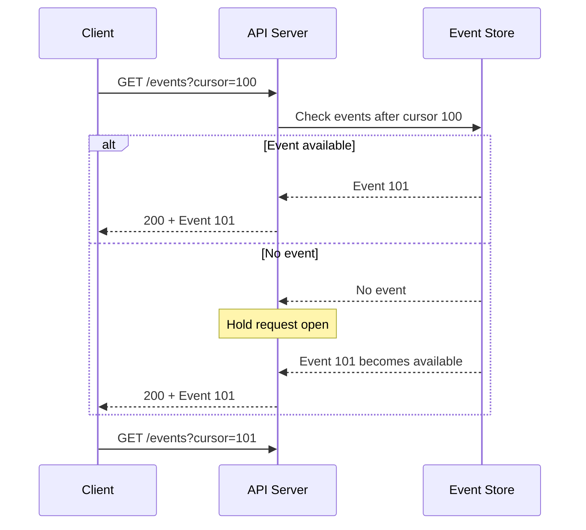
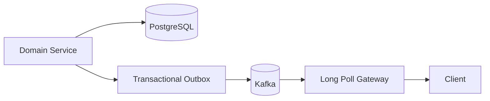
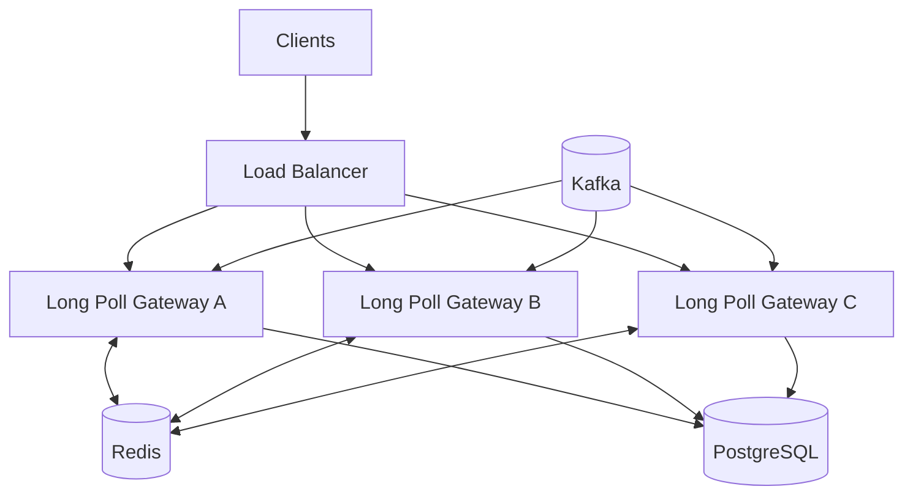
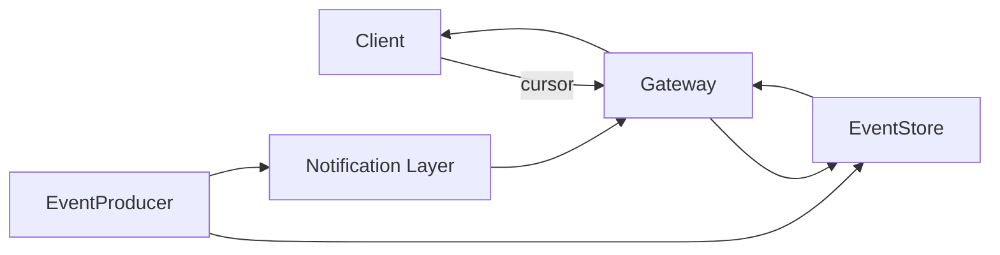

# 06- Long Polling

## Overview

Long polling is an HTTP-based technique for reducing the delay between a server-side event becoming available and a client receiving it.

Unlike conventional polling, where the client sends requests at fixed intervals, long polling keeps an HTTP request open until the server has data to return or a timeout occurs.

Traditional polling:

```text
Client                         Server

  |--- GET /events ----------->|
  |<---------- [] -------------|
  |                            |
  |--- GET /events ----------->|
  |<---------- [] -------------|
  |                            |
  |--- GET /events ----------->|
  |<----- event available -----|
```

Long polling:

```text
Client                         Server

  |--- GET /events ----------->|
  |                            |
  |       request waits        |
  |                            |
  |       event occurs         |
  |                            |
  |<----- event ---------------|
  |                            |
  |--- GET /events ----------->|
  |                            |
```

Long polling is useful when an application needs near-real-time server-to-client updates but does not require the full bidirectional, persistent communication model of WebSockets.

It is particularly useful when compatibility with ordinary HTTP infrastructure is more important than achieving the lowest possible latency or highest messaging efficiency.

---

## Why Long Polling Exists

Ordinary HTTP is naturally request-driven.

A client cannot normally expect a server to spontaneously send an HTTP response without an outstanding request.

Applications therefore historically used periodic polling:

```text
Every 10 seconds:

Client -> GET /notifications
Server -> current notifications
```

The polling interval creates a trade-off.

A short interval:

```text
1 request / second / client
```

reduces notification latency but increases server and network load.

A long interval:

```text
1 request / minute / client
```

reduces load but increases notification latency.

Long polling changes the model:

```text
Client -> request
           |
           | wait
           | wait
           | wait
           v
        event occurs
           |
           v
Client <- response
```

The server holds the request open while waiting for useful data.

---

## How Long Polling Works

A typical long-polling lifecycle is:

```text
Client
  |
  | GET /events?cursor=123
  v
Application
  |
  | Check for events
  |
  +-- event available --> return immediately
  |
  +-- no event ---------> wait
                              |
                              v
                         event arrives
                              |
                              v
                         return response
  |
  v
Client
  |
  | immediately opens another request
  v
GET /events?cursor=124
```

The request should not remain open indefinitely.

A production implementation normally has a maximum wait duration.

For example:

```text
Maximum wait: 30 seconds

Event available before 30 seconds
    -> return event

No event after 30 seconds
    -> return timeout/empty response

Client
    -> immediately starts another request
```

This creates a controlled request lifecycle.

---

## Request Lifecycle

A more complete lifecycle is:



The server therefore spends time waiting rather than continuously executing application code.

The underlying server architecture must still be able to efficiently handle many concurrent waiting requests.

---

## Long Polling vs Short Polling

| Property | Short Polling | Long Polling |
|---|---|---|
| Request frequency | Fixed interval | New request after response |
| Request duration | Short | Potentially long |
| Empty responses | Common | Reduced |
| Latency | Poll interval dependent | Usually lower |
| Server connection duration | Short | Longer |
| HTTP compatibility | Excellent | Excellent |
| Implementation complexity | Low | Moderate |
| Real-time capability | Limited | Good |
| Connection scalability | Easier | More demanding |

Long polling reduces unnecessary empty responses but does not eliminate HTTP request overhead.

---

## Long Polling vs WebSockets

Long polling and WebSockets can both provide near-real-time updates, but they solve different problems.

| Property | Long Polling | WebSockets |
|---|---|---|
| Protocol | HTTP | WebSocket |
| Communication | Client request → server response | Bidirectional |
| Persistent connection | No | Yes |
| Server push | Through outstanding HTTP request | Native |
| Client-to-server real-time messaging | Limited | Excellent |
| Infrastructure compatibility | Very high | Requires WebSocket support |
| Connection lifecycle | Repeated requests | Persistent connection |
| Request overhead | Repeated | Low after handshake |
| Scaling complexity | Moderate | Higher |
| Best use case | Occasional server push | Continuous real-time interaction |

Use long polling when HTTP compatibility and simplicity are valuable.

Use WebSockets when continuous bidirectional communication is a core application requirement.

---

## Long Polling vs Server-Sent Events

SSE provides server-to-client streaming over an HTTP connection.

| Property | Long Polling | SSE |
|---|---|---|
| Transport | HTTP requests | Persistent HTTP response |
| Server → client | Yes | Yes |
| Client → server | Separate HTTP requests | Separate HTTP requests |
| Repeated requests | Yes | No |
| Native event format | No | Yes |
| Reconnection support | Application-managed | Browser-oriented |
| Bidirectional channel | No | No |
| Complexity | Moderate | Moderate |

For browser applications requiring continuous server-to-client events, SSE can be preferable to long polling.

Long polling remains useful when infrastructure or application behavior favors discrete HTTP requests.

---

## When to Use Long Polling

Long polling is appropriate when:

- The client needs relatively low-latency server updates.
- Events are intermittent rather than continuous.
- WebSockets are unnecessary.
- Existing infrastructure strongly favors HTTP.
- Proxies or gateways do not reliably support WebSockets.
- The application already has HTTP-based authentication and authorization.
- Occasional request reconnection is acceptable.

Examples include:

- Job status updates
- Notification systems
- Simple chat systems
- Background task completion
- Administrative dashboards
- Deployment status
- Workflow state changes

---

## When Not to Use Long Polling

Long polling is usually a poor choice when:

- Thousands of messages per second are sent to each client.
- Bidirectional communication is required.
- Clients need continuously streamed data.
- Very high connection density is required.
- A WebSocket architecture is already available and justified.
- Event replay and durable delivery are primary requirements.

For example, a multiplayer game generally needs a communication model designed for continuous bidirectional messaging rather than repeated HTTP requests.

---

## Basic API Design

A long-polling endpoint might look like:

```http
GET /api/v1/events?cursor=evt_123&timeout=30
Authorization: Bearer <token>
```

The response could be:

```json
{
  "events": [
    {
      "id": "evt_124",
      "type": "order.updated",
      "created_at": "2026-08-23T12:00:00Z",
      "data": {
        "order_id": "ord_123",
        "status": "SHIPPED"
      }
    }
  ],
  "next_cursor": "evt_124"
}
```

If no event becomes available:

```json
{
  "events": [],
  "next_cursor": "evt_123"
}
```

The client then immediately starts another request.

---

## Cursor-Based Design

A cursor is strongly preferable to simply asking:

```text
GET /events
```

A cursor allows the client to tell the server:

> I have already processed everything through this position.

For example:

```text
cursor = 100

Server:
    events > 100

returns:
    101
    102
    103

next_cursor = 103
```

The next request becomes:

```text
GET /events?cursor=103
```

This supports reliable progression through an event stream.

---

## Why Cursors Matter

Without a cursor, clients can easily encounter:

- Duplicate events
- Missing events
- Ambiguous pagination
- Race conditions
- Difficult reconnect recovery

A cursor also allows the system to recover after a client disconnects.

```text
Client processed event 105

Connection fails

Client reconnects:

GET /events?cursor=105
```

The server can return:

```text
106
107
108
```

if those events are still available.

---

## Event IDs

Event IDs should be stable and unique.

For example:

```json
{
  "id": "evt_01JXYZ...",
  "type": "payment.completed"
}
```

Possible implementations include:

- Database sequence numbers
- UUIDs
- ULIDs
- Kafka offsets
- Per-aggregate sequence numbers

For ordered replay, a monotonically increasing sequence or another ordering mechanism is usually more useful than a random UUID alone.

---

## Event Storage

Long polling requires some way to determine whether new data exists.

Possible sources include:

```text
PostgreSQL
Redis
Kafka
Dedicated event store
In-memory state
```

The appropriate choice depends on delivery requirements.

| Store | Suitable for | Durability |
|---|---|---|
| In-memory | Local development | No |
| Redis | Fast transient notifications | Configurable |
| PostgreSQL | Durable application events | Yes |
| Kafka | High-volume event streams | Yes |
| Event store | Durable replay-oriented systems | Yes |

Do not use an in-memory list as the source of truth in a horizontally scaled production system.

---

## Long Polling with PostgreSQL

A naive implementation repeatedly queries the database:

```sql
SELECT *
FROM events
WHERE id > 123
ORDER BY id
LIMIT 100;
```

If no event exists, the application waits and then queries again.

This can work at modest scale but becomes inefficient if every request performs frequent database polling.

For example:

```text
10,000 clients
    |
    +--> 10,000 waiting requests
    |
    +--> repeated database queries
    |
    v
PostgreSQL overload
```

The database should not become a synchronization mechanism for thousands of waiting clients without careful capacity planning.

---

## Efficient Event Notification

A better architecture separates event persistence from notification.

```text
Application
    |
    +--------------------+
    |                    |
    v                    v
PostgreSQL             Redis
event storage          notification
    |                    |
    +---------+----------+
              |
              v
       Long Poll Gateway
              |
              v
           Clients
```

PostgreSQL stores durable state.

Redis provides fast notification that something changed.

The gateway can then fetch the actual event from durable storage.

---

## Redis as a Notification Layer

A possible flow is:

```text
Order Service
     |
     +----> PostgreSQL
     |
     +----> Redis notification
                  |
                  v
           Long Poll Server
                  |
                  v
              Client
```

The Redis message might contain:

```json
{
  "aggregate_id": "ord_123",
  "event_id": "evt_456"
}
```

The gateway should still validate and retrieve authoritative data from the appropriate source when required.

Do not automatically treat transient Redis notifications as the durable source of truth.

---

## Kafka-Based Architecture

For event-heavy systems:



The gateway can maintain consumer state and wake waiting requests when relevant events arrive.

Kafka is particularly useful when:

- Events must be durable.
- Replay is required.
- Multiple consumers need the same events.
- Event volume is high.
- Ordering requirements exist.

It is unnecessary complexity for a small notification API.

---

## Application-Level Waiting

A long-poll request can wait for an event rather than repeatedly querying the database.

Conceptually:

```text
Request arrives
     |
     v
Check event availability
     |
     +-- available --> return
     |
     +-- unavailable
            |
            v
       wait for signal
            |
      +-----+-----+
      |           |
    event       timeout
      |           |
      v           v
   return       return
```

The waiting mechanism may use:

- Async event primitives
- Redis notifications
- Message brokers
- In-process queues
- Database notification mechanisms

The important requirement is that waiting should not unnecessarily consume a worker thread per client.

---

## FastAPI Implementation

FastAPI's asynchronous execution model can be useful for long polling because requests may spend substantial time waiting.

A simplified implementation might look like:

```python
import asyncio

from fastapi import FastAPI, Query

app = FastAPI()


@app.get("/events")
async def poll_events(
    cursor: int = Query(default=0, ge=0),
    timeout: int = Query(default=30, ge=1, le=60),
) -> dict:
    deadline = asyncio.get_running_loop().time() + timeout

    while True:
        events = await find_events_after(cursor)

        if events:
            return {
                "events": events,
                "next_cursor": events[-1]["id"],
            }

        remaining = deadline - asyncio.get_running_loop().time()

        if remaining <= 0:
            return {
                "events": [],
                "next_cursor": cursor,
            }

        await asyncio.sleep(min(1.0, remaining))


async def find_events_after(cursor: int) -> list[dict]:
    return []
```

This example demonstrates the lifecycle but is not an ideal production notification architecture.

Repeated database queries every second can become expensive at high concurrency.

A production implementation should preferably wait on an event notification mechanism rather than continuously querying the database.

---

## Django Considerations

Django applications can expose long-polling endpoints through an ASGI deployment.

For example, the architecture might be:

```text
Client
  |
  v
Nginx / Load Balancer
  |
  v
ASGI Server
  |
  v
Django
  |
  +--> PostgreSQL
  +--> Redis
```

The important operational consideration is the server execution model.

A synchronous implementation that blocks one worker thread for every waiting request can become expensive quickly.

If:

```text
10,000 clients
```

each hold a request open, a thread-per-request architecture can require substantial resources.

Async I/O is generally better suited to large numbers of concurrent waiting requests, but it does not remove the need for capacity planning.

---

## Thread-Based vs Async Waiting

Consider:

```text
10,000 long-polling clients
```

A thread-per-request design could approach:

```text
10,000 threads
```

depending on the server architecture.

An asynchronous model can instead maintain many waiting operations within a smaller number of event-loop threads.

Conceptually:

```text
Synchronous

Client -> Thread -> wait
Client -> Thread -> wait
Client -> Thread -> wait
```

versus:

```text
Async

Client -> coroutine
Client -> coroutine
Client -> coroutine
              |
              v
          Event Loop
```

Async waiting is usually more resource-efficient for I/O-bound long polling.

---

## Timeouts

Long polling must use bounded timeouts.

For example:

```text
Request timeout = 30 seconds
```

When the timeout expires:

```text
Server -> 204 No Content
```

or:

```text
Server -> 200 { "events": [] }
```

The client immediately reconnects.

The exact timeout should account for infrastructure limits.

For example:

```text
Client timeout:       30s
Application timeout:  25s
Proxy timeout:        40s
```

The application should normally complete before infrastructure forcibly closes the connection.

---

## HTTP Status Codes

A long-poll endpoint can use several response patterns.

| Response | Meaning |
|---|---|
| `200 OK` | Events available |
| `204 No Content` | Poll timed out with no event |
| `401 Unauthorized` | Authentication failed |
| `403 Forbidden` | Client is authenticated but unauthorized |
| `429 Too Many Requests` | Rate limit exceeded |
| `500` | Unexpected server failure |
| `503 Service Unavailable` | Temporary capacity/availability issue |

A consistent contract is more important than choosing one particular timeout response.

---

## Client Behavior

The client should reconnect immediately after a normal timeout.

For example:

```javascript
async function poll(cursor) {
    try {
        const response = await fetch(
            `/api/events?cursor=${encodeURIComponent(cursor)}&timeout=30`,
            {
                credentials: "include",
            },
        );

        if (!response.ok) {
            throw new Error(`HTTP ${response.status}`);
        }

        const body = await response.json();

        for (const event of body.events) {
            processEvent(event);
        }

        return body.next_cursor;
    } catch (error) {
        await sleepWithBackoff();
        return cursor;
    }
}
```

A production client should also distinguish between:

- Normal timeout
- Authentication failure
- Rate limiting
- Server errors
- Network failure

Not every response should trigger the same retry behavior.

---

## Reconnection

Long polling naturally reconnects after every response.

```text
Request
  |
  v
Response
  |
  v
New Request
  |
  v
Response
  |
  v
New Request
```

If the network fails before the response arrives, the client should retry using a cursor.

```text
cursor = 100

request
   |
   X connection failure

retry:
GET /events?cursor=100
```

This prevents the client from silently skipping events.

---

## Duplicate Events

A client may receive an event but fail before persisting its cursor.

Example:

```text
Server -> event 101
Client receives 101
Client crashes
Client cursor remains 100

Client reconnects:
GET /events?cursor=100

Server -> event 101 again
```

Therefore event processing should be idempotent.

A client can maintain:

```text
last_processed_event_id
```

or a processed-event set depending on the application.

---

## At-Least-Once Delivery

Long polling does not inherently guarantee exactly-once delivery.

A practical design often provides:

```text
at-least-once delivery
+
idempotent consumer
+
cursor-based recovery
```

This is usually more realistic than attempting exactly-once semantics across a distributed network.

For example:

```json
{
  "event_id": "evt_123",
  "type": "invoice.paid"
}
```

The consumer can use `event_id` as a deduplication key.

---

## Event Ordering

Ordering should be explicit when required.

Suppose:

```text
event 101: order.status = PAID
event 102: order.status = SHIPPED
```

The client should not process:

```text
102
101
```

if the business semantics require order.

A sequence number can help:

```json
{
  "event_id": "evt_102",
  "sequence": 102,
  "type": "order.updated"
}
```

For per-aggregate ordering, use an aggregate-specific sequence:

```text
order_123:
    sequence 1
    sequence 2
    sequence 3
```

This is often more meaningful than imposing global ordering across the entire system.

---

## Backpressure

Long polling has a different backpressure problem from WebSockets.

The primary concern is often the number of outstanding requests.

For example:

```text
100,000 clients
      |
      v
100,000 long-poll requests
      |
      v
API gateway
```

Even if the application CPU usage is low, the infrastructure still has to maintain:

- TCP connections
- TLS state
- Request objects
- Memory
- Load balancer capacity
- Connection tracking

The server should therefore impose sensible connection and request limits.

---

## Load Balancers and Proxies

Long polling depends heavily on infrastructure timeout configuration.

Consider:

```text
Client timeout       = 30s
Application timeout  = 25s
Nginx timeout        = 40s
Load balancer        = 60s
```

This is generally safer than:

```text
Application timeout = 60s
Load balancer       = 30s
```

because the load balancer would terminate requests before the application completes them.

Incorrect timeout relationships often appear as intermittent:

```text
502
504
connection reset
```

errors.

---

## Nginx Configuration

A simplified Nginx configuration might be:

```nginx
location /api/events {
    proxy_pass http://backend;

    proxy_http_version 1.1;
    proxy_set_header Host $host;

    proxy_read_timeout 40s;
    proxy_send_timeout 40s;
}
```

The timeout should exceed the application's maximum long-poll duration.

Avoid setting extremely large timeouts without understanding the impact on:

- Connection capacity
- Worker resources
- Load balancer limits
- Failure recovery

---

## Connection Capacity

Long polling creates a potentially large number of simultaneously open HTTP connections.

A rough capacity model is:

```text
Concurrent connections
≈ active clients × probability of an outstanding poll
```

If every client immediately starts another request after each response, the number of outstanding connections can approach the number of active clients.

For:

```text
500,000 clients
```

the system must be designed for hundreds of thousands of concurrent connections, even if the event rate is low.

---

## Request Churn

Unlike WebSockets, long polling repeatedly creates and destroys HTTP requests.

Suppose:

```text
100,000 clients
30-second timeout
```

If no events occur, approximately:

```text
100,000 / 30
≈ 3,333 requests/sec
```

could be generated simply from timeout-driven reconnects.

This is an important capacity-planning calculation.

Long polling therefore trades persistent WebSocket connections for recurring HTTP request overhead.

---

## Scalability Strategy

A scalable architecture might look like:



The long-polling gateway should remain relatively stateless.

Shared durable state should live outside the application process.

---

## Redis Notification Pattern

Redis can be used to wake waiting long-poll requests.

Conceptually:

```text
Long Poll Request
      |
      v
Wait for notification
      |
      v
Redis Pub/Sub
      ^
      |
Event Producer
```

When the notification arrives:

```text
Redis
  |
  v
Long Poll Gateway
  |
  v
Fetch event
  |
  v
HTTP response
```

This avoids repeatedly querying PostgreSQL while waiting.

However, Redis Pub/Sub is transient.

If a notification is lost, the gateway should have a reliable way to recover the event.

---

## PostgreSQL LISTEN/NOTIFY

PostgreSQL provides `LISTEN` and `NOTIFY`, which can be useful for lightweight notification mechanisms.

Conceptually:

```text
Transaction
    |
    v
NOTIFY event
    |
    v
Listener
    |
    v
Wake waiting request
```

Example:

```sql
NOTIFY order_events, 'ord_123';
```

The notification can tell the application that something changed.

It should not generally be treated as the durable event itself.

The application should retrieve authoritative state from PostgreSQL or another durable source.

---

## Long Polling with Celery

Long polling should generally not be implemented by creating one Celery task per waiting client.

For example, avoid:

```text
100,000 clients
     |
     v
100,000 Celery tasks
     |
     v
wait
```

Celery is designed for background task execution, not maintaining large populations of open client connections.

A better architecture is:

```text
Client
  |
  v
Long Poll API
  |
  v
Event infrastructure
  |
  v
Celery / background workers
```

Celery can produce business events, while the API layer handles client connections.

---

## Security Considerations

Long polling uses normal HTTP security mechanisms, but its long-lived request behavior introduces additional concerns.

Important controls include:

- TLS
- Authentication
- Authorization
- CSRF protection where cookie-based authentication is used
- Rate limiting
- Request timeout limits
- Maximum concurrent connections
- Input validation
- Tenant isolation
- Sensitive-data handling

A long-polling endpoint should not expose events merely because the client knows an event identifier.

---

## Authentication Expiration

A long-polling request may remain open while the user's access token approaches expiration.

The server should define how authentication expiration is handled.

Possible approaches include:

```text
Request starts
    |
    v
Authentication valid
    |
    v
Wait
    |
    v
Token expires
    |
    v
Return authentication error
```

The client should then refresh credentials or require re-authentication according to the application's security model.

Do not keep accepting events indefinitely after authorization has expired.

---

## Multi-Tenant Systems

For multi-tenant systems, every long-poll request should be associated with trusted tenant context.

```text
Authenticated User
        |
        v
Tenant Context
        |
        v
Authorized Event Stream
```

Do not allow a client to arbitrarily request:

```text
GET /events?tenant_id=other-company
```

and rely on the parameter alone.

The server should derive tenant identity from authentication and authorization state.

---

## Monitoring

Important metrics include:

| Metric | Purpose |
|---|---|
| Active long-poll requests | Connection capacity |
| Requests/sec | Request churn |
| Average wait duration | Event latency |
| Timeout rate | Event frequency and efficiency |
| Event delivery latency | Real-time performance |
| Response size | Network usage |
| 4xx rate | Client/security problems |
| 5xx rate | Server failures |
| 429 rate | Capacity/rate limiting |
| Reconnect rate | Client/network health |
| Database query rate | Storage pressure |
| Redis notification rate | Event fan-out |
| Kafka consumer lag | Event freshness |

A particularly useful metric is:

```text
event_created_at
        |
        v
event_delivered_at
        |
        v
delivery latency
```

This measures actual real-time performance rather than merely HTTP response latency.

---

## Logging

Useful structured fields include:

```text
request_id
user_id
tenant_id
cursor
event_id
wait_duration_ms
response_status
connection_duration_ms
```

Avoid logging complete event payloads if they may contain:

- Personal data
- Authentication information
- Financial information
- Internal business data

Log identifiers and metadata instead.

---

## Failure Scenarios

### Client Disconnects While Waiting

The server should detect the disconnect and stop waiting.

Do not continue performing expensive work for a client that no longer exists.

### Server Restart

Outstanding requests terminate.

Clients should reconnect using their last known cursor.

### Redis Failure

Notification delivery may stop.

The system should have a recovery strategy, such as periodic reconciliation against durable storage.

### Kafka Consumer Lag

Clients may receive events later than expected.

Monitor consumer lag and establish acceptable freshness thresholds.

### Database Failure

If the database is the source of truth, new event retrieval may fail.

Return appropriate errors rather than silently advancing the client's cursor.

---

## Graceful Deployment

During deployment, long-polling requests may still be active.

A graceful shutdown should:

```text
Stop accepting new requests
        |
        v
Allow existing requests to finish
        |
        v
Close remaining requests if necessary
        |
        v
Terminate process
```

Kubernetes termination settings should provide enough time for in-flight long-poll requests to finish.

The application should still use bounded request timeouts so graceful shutdown does not require waiting indefinitely.

---

## Cost Considerations

Long polling consumes resources even when no events are available.

Costs may include:

- Load balancer connections
- Network transfer
- TLS processing
- Application memory
- HTTP request processing
- Proxy resources
- Database/Redis operations
- Container capacity

A system with:

```text
1 million clients
```

and a 30-second timeout can generate substantial request churn even when no events are being delivered.

At large scale, WebSockets or SSE may reduce request churn depending on the workload.

---

## Reliability Pattern

A robust long-polling design commonly combines:

```text
Long Polling
    +
Cursor
    +
Durable Event Store
    +
Idempotent Consumer
    +
Bounded Timeout
    +
Retry with Backoff
```

The resulting flow is:



The notification layer wakes the gateway quickly.

The durable event store provides recovery.

The cursor provides progress tracking.

Idempotency protects against duplicates.

---

## Common Mistakes and Pitfalls

### Holding Requests Forever

An unlimited request lifetime makes infrastructure failures and resource leaks harder to control.

Use bounded timeouts.

### Using a Very Short Timeout

A five-second timeout with thousands of clients can generate unnecessary request churn.

Choose a timeout based on latency and infrastructure constraints.

### Polling the Database Too Frequently

A one-second database query per waiting client can overload PostgreSQL.

Prefer notification-based waiting.

### Treating Notifications as Durable Events

Redis Pub/Sub and PostgreSQL notifications can signal that something changed without being a complete durable event history.

Keep authoritative data in durable storage.

### Advancing the Cursor Before Processing

If the client advances its cursor before successfully processing the event, a crash can cause permanent event loss.

Advance processing state only according to the application's delivery semantics.

### No Idempotency

Retries can produce duplicates.

Use event IDs and idempotent processing.

### Ignoring Proxy Timeouts

A proxy may terminate a request before the application does.

Configure:

```text
application timeout < proxy timeout
```

with enough operational margin.

### One Thread Per Waiting Client

At high concurrency, thread-per-request designs can consume excessive memory and scheduler resources.

Use asynchronous I/O where the application architecture supports it.

### Using Long Polling for High-Frequency Bidirectional Communication

Long polling is inefficient for continuous two-way traffic.

Use WebSockets when that is the actual requirement.

---

## Interview Traps

### Is Long Polling the Same as Polling?

No.

Polling sends requests at predetermined intervals.

Long polling holds the request until data is available or a timeout occurs.

### Is Long Polling a Persistent Connection?

Not in the application-protocol sense of WebSockets.

Each long-poll cycle is an HTTP request that eventually completes, followed by another request.

The underlying TCP connection may be reused through HTTP keep-alive, but that is different from maintaining one application-level long-poll request indefinitely.

### Does Long Polling Guarantee Exactly-Once Delivery?

No.

Delivery semantics depend on the application design.

A robust system commonly uses:

```text
at-least-once delivery
+
idempotency
+
cursor-based recovery
```

### Why Not Just Query the Database?

At small scale, that can work.

At large scale, thousands of waiting clients can create substantial database query load.

Notification mechanisms allow the application to wait efficiently.

### Does Redis Solve Everything?

No.

Redis can provide fast coordination and notification, but the architecture still needs to define durability, replay, ordering, failure handling, and recovery.

---

## Long Polling vs WebSockets vs SSE

| Requirement | Long Polling | SSE | WebSockets |
|---|---:|---:|---:|
| HTTP compatibility | Excellent | Excellent | Good |
| Server push | Yes | Yes | Yes |
| Client push | Separate HTTP | Separate HTTP | Yes |
| Bidirectional real-time | Poor | No | Excellent |
| Persistent application connection | No | Yes | Yes |
| Request churn | High | Low | Low |
| Infrastructure simplicity | High | High | Moderate |
| Browser support | Excellent | Excellent | Excellent |
| Durable replay | Application-defined | Application-defined | Application-defined |
| Best for | Occasional updates | Continuous server events | Interactive real-time systems |

The protocol should be selected based on the communication requirements rather than familiarity.

---

## Production Checklist

- [ ] Define a bounded long-poll timeout.
- [ ] Ensure proxy and load-balancer timeouts exceed the application timeout.
- [ ] Use cursor-based event retrieval.
- [ ] Assign stable event IDs.
- [ ] Make event processing idempotent.
- [ ] Design explicit delivery semantics.
- [ ] Avoid repeatedly polling PostgreSQL while requests wait.
- [ ] Use Redis, Kafka, PostgreSQL notifications, or another appropriate signaling mechanism where justified.
- [ ] Keep durable event state separate from transient notifications.
- [ ] Use asynchronous I/O for high concurrency where appropriate.
- [ ] Implement authentication and authorization on every request.
- [ ] Enforce tenant isolation.
- [ ] Apply rate limits and concurrency limits.
- [ ] Handle client disconnects promptly.
- [ ] Support cursor-based recovery after failures.
- [ ] Monitor outstanding requests and request churn.
- [ ] Monitor event delivery latency.
- [ ] Design graceful shutdown and deployment behavior.
- [ ] Capacity-plan for timeout-driven request rates.
- [ ] Re-evaluate WebSockets or SSE when connection or event volume becomes large.

---

## Key Takeaways

- Long polling keeps an HTTP request open until an event arrives or a bounded timeout expires, providing near-real-time updates without introducing the WebSocket protocol.
- Cursor-based event retrieval, stable event IDs, idempotent processing, and durable storage are critical for reliable recovery and duplicate handling.
- High-scale implementations should avoid repeatedly querying databases while requests wait; notification mechanisms such as Redis, PostgreSQL notifications, or Kafka can wake waiting requests more efficiently.
- Capacity planning must account for both concurrent outstanding connections and request churn caused by timeout-driven reconnects.
- Long polling is a pragmatic choice for intermittent server push, but WebSockets or SSE are generally better when continuous real-time communication or high connection efficiency is required.