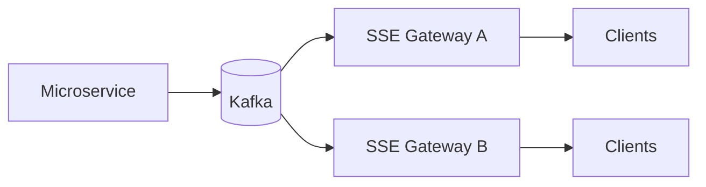
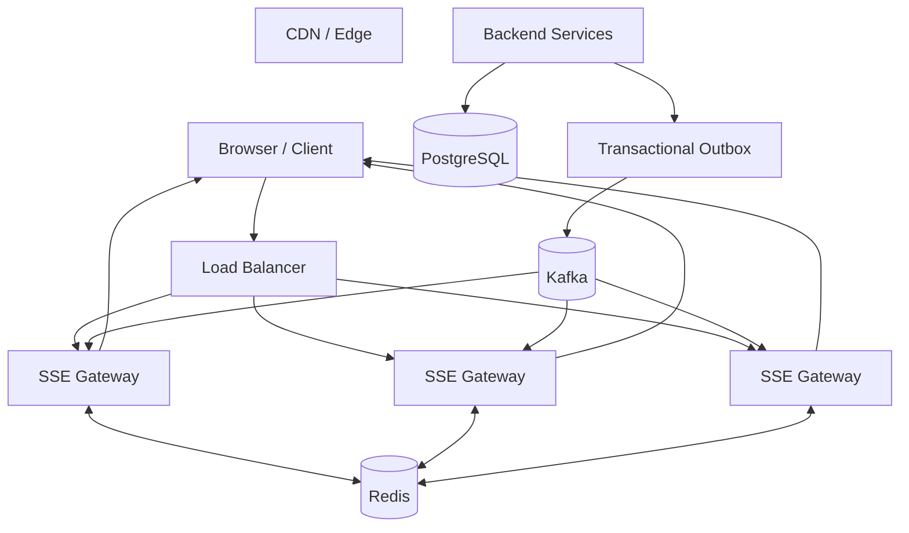

# 07- Server-Sent Events

## Overview

Server-Sent Events (SSE) is an HTTP-based mechanism for delivering a continuous stream of server-to-client events over a long-lived HTTP connection.

The client establishes a normal HTTP request using the `EventSource` API, and the server keeps the response open while progressively writing events to the response stream.

Unlike WebSockets, SSE is intentionally unidirectional:

```text
Client                         Server

  |--- HTTP GET /events ------->|
  |                             |
  |<--- event ------------------|
  |<--- event ------------------|
  |<--- event ------------------|
  |<--- event ------------------|
  |                             |
  |       connection open       |
```

The client does not send application messages over the same connection. If the client needs to communicate with the server, it normally uses ordinary HTTP requests.

SSE is therefore a strong fit for applications where the server continuously pushes updates to clients, such as:

- Live dashboards
- Notifications
- Deployment status
- Job progress
- Monitoring streams
- Stock or metric updates
- Activity feeds
- Long-running workflow status
- AI-generated token streaming
- Operational event streams

The key architectural distinction is:

```text
SSE:
Server ---> Client

WebSocket:
Server <--> Client
```

---

## Why SSE Exists

Traditional HTTP request/response communication is client-driven.

A client must normally make a request before the server can send a response:

```text
Client ---> Server
Client <--- Server
```

Applications that need server-side updates have several choices:

```text
Short Polling
Long Polling
SSE
WebSockets
```

Short polling repeatedly asks whether something changed.

Long polling keeps an HTTP request open until an event is available or a timeout occurs.

SSE keeps one HTTP response open and continuously streams events.

```text
Short Polling

GET -> response
GET -> response
GET -> response
GET -> response


Long Polling

GET ----------------------> response
GET ----------------------> response
GET ----------------------> response


SSE

GET ------------------------------->
       event
       event
       event
       event
```

SSE removes the repeated HTTP request lifecycle from the steady-state event delivery path.

---

## Core Characteristics

SSE has several defining characteristics:

- Runs over HTTP.
- Uses a long-lived HTTP response.
- Is server-to-client.
- Uses the `text/event-stream` media type.
- Supports named events.
- Supports event IDs.
- Supports automatic browser reconnection.
- Supports a server-provided retry interval.
- Works naturally with HTTP authentication and infrastructure.
- Does not provide bidirectional application messaging.

A typical response begins with:

```http
HTTP/1.1 200 OK
Content-Type: text/event-stream
Cache-Control: no-cache
Connection: keep-alive
```

The server then writes events incrementally.

---

## SSE Event Format

SSE uses a text-based wire format.

A basic event is:

```text
data: Hello

```

The blank line terminates the event.

A named event can be represented as:

```text
event: order.updated
data: {"order_id":"ord_123","status":"SHIPPED"}

```

An event can also have an ID:

```text
id: 12345
event: order.updated
data: {"order_id":"ord_123","status":"SHIPPED"}

```

The general structure is:

```text
id: <event-id>
event: <event-type>
retry: <milliseconds>
data: <payload>

```

The empty line is significant.

It tells the client that the event is complete.

---

## Event Fields

| Field | Purpose |
|---|---|
| `data` | Event payload |
| `event` | Logical event type |
| `id` | Event identifier used for reconnection |
| `retry` | Client reconnection delay in milliseconds |
| `:` | Comment/heartbeat line |

Example:

```text
id: evt_1001
event: notification
data: {"message":"Build completed"}

```

The client receives:

```text
event = notification
data = {"message":"Build completed"}
lastEventId = evt_1001
```

---

## Data Field

The `data` field contains the application payload.

For JSON-based APIs:

```text
data: {"type":"order.updated","order_id":"123","status":"PAID"}

```

For larger payloads, SSE supports multiple `data:` lines:

```text
data: first line
data: second line
data: third line

```

The client reconstructs the event data with newline separation.

For production systems, JSON is usually the most practical payload format.

---

## Event Types

Named events allow one SSE connection to carry multiple logical event categories.

For example:

```text
event: order.created
data: {...}

event: order.updated
data: {...}

event: notification.created
data: {...}

event: job.completed
data: {...}
```

The browser can register separate handlers:

```javascript
const source = new EventSource("/api/events");

source.addEventListener("order.updated", (event) => {
    const payload = JSON.parse(event.data);
    console.log("Order updated:", payload);
});

source.addEventListener("job.completed", (event) => {
    const payload = JSON.parse(event.data);
    console.log("Job completed:", payload);
});
```

This allows a single connection to multiplex different logical event types.

---

## SSE Connection Lifecycle

A typical lifecycle is:

```mermaid
sequenceDiagram
    participant C as Client
    participant LB as Load Balancer
    participant API as SSE Server
    participant Bus as Event Infrastructure

    C->>LB: GET /events
    LB->>API: Forward request
    API-->>C: 200 text/event-stream

    Bus-->>API: Event available
    API-->>C: event: order.updated
    API-->>C: data: {...}

    Bus-->>API: Event available
    API-->>C: event: notification
    API-->>C: data: {...}

    Note over C,API: Connection remains open

    API-->>C: heartbeat

    C-xAPI: Network disconnect

    C->>LB: GET /events\nLast-Event-ID: ...
    LB->>API: Forward reconnect
    API-->>C: Replay/missing events
```



The connection is therefore stateful from the perspective of the network, even if the application server itself is designed to remain stateless.

---

## Browser API

Modern browsers expose SSE through `EventSource`.

Basic usage:

```javascript
const source = new EventSource("/api/events");

source.onopen = () => {
    console.log("SSE connection established");
};

source.onmessage = (event) => {
    const payload = JSON.parse(event.data);
    console.log(payload);
};

source.onerror = (error) => {
    console.error("SSE connection error", error);
};
```

For named events:

```javascript
source.addEventListener("order.updated", (event) => {
    const payload = JSON.parse(event.data);
    console.log(payload);
});
```

The browser handles reconnection automatically in normal `EventSource` usage.

---

## Automatic Reconnection

One of SSE's major advantages is built-in reconnection behavior.

Suppose:

```text
Client
   |
   | SSE connection
   |
   X network failure
```

The browser can reconnect.

The server can specify a retry interval:

```text
retry: 5000

```

This tells the client to wait approximately five seconds before retrying.

A production system should still consider:

- Server overload
- Exponential backoff requirements
- Authentication failures
- Rate limiting
- Maintenance events
- Network instability

Automatic reconnection is useful, but it does not replace proper retry and capacity planning.

---

## Last-Event-ID

SSE supports event IDs for recovery.

Suppose the client receives:

```text
id: 100
data: event A

id: 101
data: event B

id: 102
data: event C
```

The client has processed through:

```text
102
```

The connection fails.

On reconnect, the client can communicate its last processed event ID.

Conceptually:

```http
GET /events
Last-Event-ID: 102
```

The server can then replay:

```text
103
104
105
```

This makes SSE significantly more reliable than simply treating the stream as ephemeral.

---

## Event Replay

SSE itself does not provide durable event storage.

The application must implement replay if missed events matter.

A production architecture might use:

```text
                    +----------------+
                    | Event Producer |
                    +-------+--------+
                            |
                            v
                     +-------------+
                     | Event Store |
                     +------+------+
                            |
                            v
                     +-------------+
                     | SSE Gateway |
                     +------+------+
                            |
                            v
                         Clients
```

The event store may be:

- PostgreSQL
- Kafka
- Redis Streams
- Dedicated event storage

The SSE connection is only the delivery mechanism.

---

## SSE with Kafka

Kafka is a strong fit when the underlying event stream is already durable and replayable.



Kafka provides:

- Durable event storage
- Consumer offsets
- Replay
- Partitioning
- High throughput
- Multiple independent consumers

The SSE gateway translates the durable event stream into an HTTP event stream.

However, Kafka does not automatically solve client-specific routing.

The gateway still needs to determine which connected clients are authorized to receive each event.

---

## SSE with Redis

Redis can be used for lightweight event fan-out.

For example:

```text
Application
    |
    v
Redis Pub/Sub
    |
    +--> SSE Gateway A
    +--> SSE Gateway B
    +--> SSE Gateway C
```

Redis Pub/Sub is useful for transient notifications.

However, Redis Pub/Sub does not provide durable replay semantics.

If a gateway is disconnected when the event is published, it may miss the event.

For reliable replay, Redis Streams or a durable event store is more appropriate.

---

## Redis Streams

Redis Streams can provide:

- Persistent stream entries
- IDs
- Consumer groups
- Replay
- Ordered stream positions

Conceptually:

```text
Producer
   |
   v
Redis Stream
   |
   +--> SSE Gateway A
   +--> SSE Gateway B
```

The gateway can maintain a position and recover after temporary failures.

The system still needs to define retention and delivery semantics.

---

## SSE with PostgreSQL

For smaller systems, PostgreSQL can act as the durable event store.

Example:

```sql
CREATE TABLE events (
    id BIGSERIAL PRIMARY KEY,
    event_type VARCHAR(100) NOT NULL,
    aggregate_id UUID,
    payload JSONB NOT NULL,
    created_at TIMESTAMPTZ NOT NULL DEFAULT NOW()
);
```

The server can retrieve events after a known ID:

```sql
SELECT id, event_type, payload, created_at
FROM events
WHERE id > $1
ORDER BY id
LIMIT 100;
```

This supports replay.

However, repeatedly querying PostgreSQL for every connected client is inefficient at scale.

A notification mechanism can be combined with durable storage:

```text
PostgreSQL
    |
    +--> durable event
    |
    +--> notification
             |
             v
          SSE API
```

The notification wakes the SSE layer, while PostgreSQL remains authoritative.

---

## Transactional Outbox

When an application modifies business state and publishes an SSE event, dual-write problems can occur.

For example:

```text
UPDATE orders
    |
    +--> success
    |
    +--> publish event
           |
           X failure
```

The database state changes but the event is lost.

A transactional outbox solves this by storing the event in the same database transaction.

```text
Transaction
    |
    +--> business data
    |
    +--> outbox event
            |
            v
        committed
            |
            v
      Outbox Publisher
            |
            v
          Kafka
            |
            v
        SSE Gateway
```

This is a common production pattern when event delivery must reliably correspond to committed business state.

---

## SSE and Microservices

In a microservices architecture, individual services should generally not maintain arbitrary direct connections to every client.

A cleaner architecture is:

```text
                +----------------+
                |   API Gateway  |
                +-------+--------+
                        |
                        v
                 +-------------+
                 | SSE Gateway |
                 +------+------+
                        |
              +---------+---------+
              |         |         |
              v         v         v
            Kafka     Redis     DB/Event Store
              ^
              |
       +------+------+
       |             |
 Order Service   Payment Service
```

The SSE gateway acts as the translation layer between internal event infrastructure and external client connections.

This keeps client connection management separate from domain services.

---

## Stateless SSE Gateways

An SSE gateway should ideally avoid keeping authoritative application state only in process memory.

For example:

```text
SSE Gateway A
    |
    +-- connected clients

SSE Gateway B
    |
    +-- connected clients

SSE Gateway C
    |
    +-- connected clients
```

Clients can connect to any gateway.

Shared infrastructure handles event distribution.

This allows horizontal scaling:

```text
                Load Balancer
                     |
       +-------------+-------------+
       |             |             |
       v             v             v
   Gateway A     Gateway B     Gateway C
       |             |             |
       +-------------+-------------+
                     |
              Event Infrastructure
```

The connection itself remains local to one gateway, but the event source is shared.

---

## Load Balancing

SSE connections can remain open for minutes or hours.

Therefore load balancing behaves differently from ordinary short HTTP requests.

A load balancer must support:

- Long-lived HTTP responses
- Appropriate idle timeouts
- Connection limits
- Graceful connection draining
- Health checks
- TLS termination

Existing clients generally remain attached to their current gateway until the connection closes.

New connections can be distributed across healthy instances.

---

## Sticky Sessions

SSE does not inherently require sticky sessions.

A properly designed system can use:

```text
Client
  |
  v
Load Balancer
  |
  +--> Gateway A
  +--> Gateway B
  +--> Gateway C
```

If the event source is shared, any gateway can service the connection.

Sticky sessions may simplify certain in-memory designs, but they create operational coupling and can produce uneven load distribution.

Prefer shared event infrastructure over relying on session affinity.

---

## Nginx Configuration

Nginx must be configured carefully for SSE.

A typical configuration is:

```nginx
location /api/events {
    proxy_pass http://backend;

    proxy_http_version 1.1;
    proxy_set_header Connection "";

    proxy_buffering off;
    proxy_cache off;

    proxy_read_timeout 1h;
    proxy_send_timeout 1h;
}
```

The important setting is:

```nginx
proxy_buffering off;
```

If the proxy buffers the response, events may not reach the client immediately.

The client may receive several events together instead of receiving them as the application writes them.

Timeouts should be chosen based on the application's heartbeat strategy and infrastructure constraints rather than blindly using one-hour values.

---

## Heartbeats

Idle connections can be terminated by:

- Load balancers
- Proxies
- NAT devices
- Firewalls
- Mobile networks
- Intermediate infrastructure

A common solution is an SSE comment heartbeat:

```text
: heartbeat

```

Comments are ignored as application events but keep traffic flowing.

For example:

```text
: heartbeat 2026-08-23T12:00:00Z

```

The heartbeat interval should be comfortably below the shortest relevant infrastructure idle timeout.

For example:

```text
Infrastructure idle timeout: 60 seconds
Heartbeat interval:          20 seconds
```

This reduces the chance of infrastructure silently closing the connection.

---

## SSE and HTTP/2

SSE works over HTTP/2 as a streaming response.

HTTP/2 can improve connection efficiency because multiple logical streams can share a TCP connection.

However, application behavior and infrastructure configuration still matter.

A browser may have multiple SSE streams, and HTTP/2 stream limits can affect concurrency.

Do not assume HTTP/2 automatically eliminates all connection-capacity concerns.

---

## SSE and HTTP/3

SSE can also be transported through HTTP infrastructure using newer HTTP versions, but the application semantics remain the same:

```text
HTTP request
      |
      v
long-lived response
      |
      +--> event
      +--> event
      +--> event
```

The choice between HTTP/1.1, HTTP/2, and HTTP/3 should be based on the broader application's networking architecture rather than SSE alone.

---

## FastAPI Implementation

FastAPI provides a natural fit for SSE because asynchronous generators can yield response chunks as events become available.

A simplified implementation:

```python
import asyncio
import json
from collections.abc import AsyncIterator

from fastapi import FastAPI, Request
from fastapi.responses import StreamingResponse

app = FastAPI()


async def event_stream(request: Request) -> AsyncIterator[str]:
    event_id = 0

    while True:
        if await request.is_disconnected():
            break

        event_id += 1

        payload = {
            "message": "event generated",
            "sequence": event_id,
        }

        yield (
            f"id: {event_id}\n"
            "event: update\n"
            f"data: {json.dumps(payload)}\n\n"
        )

        await asyncio.sleep(5)


@app.get("/events")
async def events(request: Request) -> StreamingResponse:
    return StreamingResponse(
        event_stream(request),
        media_type="text/event-stream",
        headers={
            "Cache-Control": "no-cache",
            "X-Accel-Buffering": "no",
        },
    )
```

This demonstrates the streaming mechanism.

A production implementation should replace the periodic generator with an event-driven source such as Redis, Kafka, or another appropriate event mechanism.

---

## FastAPI Event-Driven Design

A more production-oriented architecture is:

```text
FastAPI SSE Endpoint
        |
        v
Async event subscription
        |
        v
Redis / Kafka / Event Store
        |
        v
yield SSE frame
        |
        v
Client
```

The important property is that the coroutine should wait efficiently for events rather than repeatedly executing expensive queries.

---

## Django Implementation

Django can serve SSE through an ASGI deployment using a streaming response.

Conceptually:

```python
import asyncio
import json

from django.http import StreamingHttpResponse


async def event_stream():
    while True:
        payload = {
            "type": "heartbeat",
        }

        yield f"data: {json.dumps(payload)}\n\n"
        await asyncio.sleep(20)


async def events(request):
    response = StreamingHttpResponse(
        event_stream(),
        content_type="text/event-stream",
    )

    response["Cache-Control"] = "no-cache"
    response["X-Accel-Buffering"] = "no"

    return response
```

The deployment architecture matters.

A synchronous WSGI stack is generally not the preferred architecture for large populations of long-lived SSE connections.

Use an ASGI-capable deployment when the application needs efficient asynchronous streaming.

---

## SSE with Authentication

SSE requests use normal HTTP authentication mechanisms.

For cookie-based authentication:

```javascript
const source = new EventSource("/api/events");
```

The browser can send applicable cookies automatically according to cookie policy.

For security-sensitive applications:

- Use HTTPS.
- Use secure cookies.
- Use appropriate `SameSite` settings.
- Validate the authenticated user on the SSE endpoint.
- Authorize the event stream.
- Enforce tenant boundaries.

A common limitation of the native browser `EventSource` API is that it does not provide a general-purpose custom-header configuration interface comparable to `fetch`.

If an application requires custom authorization headers such as:

```http
Authorization: Bearer <token>
```

a different client implementation or an SSE-capable library may be appropriate.

Avoid placing long-lived access tokens in query strings unless there is a strong reason and the associated logging, caching, and leakage risks are explicitly controlled.

---

## CORS

SSE requests are subject to browser-origin security rules.

For cross-origin SSE:

```text
Frontend
https://app.example.com

SSE API
https://api.example.com
```

the server must configure appropriate CORS behavior.

Do not use:

```http
Access-Control-Allow-Origin: *
```

for credentialed cross-origin requests.

For authenticated browser applications, explicitly allow trusted origins.

---

## CSRF Considerations

SSE itself is a read-oriented mechanism, so classic state-changing CSRF concerns are different from POST/PUT/DELETE endpoints.

However, cookie-authenticated SSE endpoints still need authorization controls.

An attacker should not be able to embed or access a user's private event stream and obtain sensitive information.

Treat an SSE endpoint as a protected data API.

---

## Content Security

Event payloads should contain only data the client is authorized to receive.

Avoid sending:

```json
{
  "user_email": "...",
  "internal_token": "...",
  "database_password": "..."
}
```

SSE streams can remain open for long periods, making accidental exposure particularly damaging.

Use explicit event schemas.

For example:

```json
{
  "event_id": "evt_123",
  "type": "order.updated",
  "version": 1,
  "data": {
    "order_id": "ord_123",
    "status": "SHIPPED"
  }
}
```

Version event schemas when clients may remain connected for long periods.

---

## Event Versioning

Long-lived clients may run older frontend versions.

Suppose version 1 expects:

```json
{
  "status": "PAID"
}
```

and version 2 changes the event:

```json
{
  "payment_status": "PAID"
}
```

Existing clients may fail if the schema changes without compatibility planning.

Use explicit versions where necessary:

```json
{
  "event": "payment.updated",
  "version": 2,
  "data": {
    "payment_status": "PAID"
  }
}
```

Maintain backward compatibility according to the client's expected lifecycle.

---

## Backpressure

SSE introduces an important backpressure problem.

Suppose:

```text
Producer
   |
   v
10,000 events/sec
   |
   v
SSE Gateway
   |
   v
Slow client
```

The server cannot necessarily write to the client at producer speed.

A slow client can cause:

- Growing buffers
- Increased memory usage
- Increased connection duration
- Event lag
- Resource exhaustion

A production system needs a policy for slow consumers.

Possible policies include:

- Disconnect slow clients.
- Bound per-client buffers.
- Drop non-critical events.
- Coalesce updates.
- Send only latest state.
- Use durable replay after reconnect.

---

## Latest-State vs Event-Stream Semantics

Not every SSE use case needs every historical event.

Consider a dashboard showing CPU utilization:

```text
10%
12%
11%
13%
14%
...
```

If the client misses:

```text
12%
```

it may not matter.

The latest state:

```text
14%
```

is sufficient.

For this type of application, the server can prioritize latest-state delivery.

For financial transactions or order state transitions, every event may matter.

Therefore event semantics should be explicitly classified:

| Data type | Missing event acceptable? | Strategy |
|---|---:|---|
| Metrics | Often | Latest state |
| UI progress | Often | Coalesce |
| Notifications | Sometimes | Replay |
| Order transitions | Usually no | Durable replay |
| Financial events | No | Durable event log |
| Audit events | No | Durable event store |

---

## Connection Limits

Every SSE client represents an active network connection.

For:

```text
500,000 concurrent clients
```

the system needs to account for:

- File descriptors
- TCP connections
- TLS state
- Memory
- Load balancer capacity
- Kernel networking limits
- Container limits
- Application concurrency
- Network bandwidth

On Linux, file descriptor limits are relevant.

For example:

```bash
ulimit -n
```

A production environment should configure appropriate limits and verify them at the operating-system, container, load-balancer, and application layers.

---

## Kubernetes Considerations

Kubernetes does not fundamentally change SSE semantics, but deployment configuration matters.

Architecture:

```text
                 Load Balancer
                       |
                       v
                 Kubernetes Service
                       |
          +------------+------------+
          |            |            |
          v            v            v
       Pod A        Pod B        Pod C
          |            |            |
          +------------+------------+
                       |
                 Event Infrastructure
```

Important considerations include:

- Readiness probes
- Graceful termination
- Connection draining
- Pod disruption budgets
- Resource limits
- Horizontal Pod Autoscaling
- Load balancer idle timeouts

A pod should not be declared ready if it cannot accept SSE connections.

During termination, Kubernetes should provide sufficient grace time for active connections to close cleanly.

---

## Autoscaling SSE Servers

CPU-only autoscaling can be misleading.

An SSE server may have:

```text
CPU = 20%
Memory = 60%
Connections = 50,000
```

Adding more pods based only on CPU may not happen until the system is already near a connection limit.

Useful scaling metrics include:

```text
active_connections
connections_per_pod
memory_per_connection
event_delivery_latency
network_bytes
```

For connection-heavy workloads, custom metrics can be more meaningful than CPU alone.

---

## Graceful Shutdown

When an SSE server shuts down:

```text
Stop accepting new connections
        |
        v
Notify/close existing streams
        |
        v
Clients reconnect
        |
        v
New gateway accepts connections
```

Clients should be able to reconnect and recover from the last known event ID.

A server should not rely on clients receiving a final event during an uncontrolled process termination.

Durable replay is the reliability mechanism.

---

## Failure Recovery

SSE connections fail naturally.

Potential failures include:

- Client network changes
- Mobile network transitions
- Browser suspension
- Server deployment
- Pod termination
- Load balancer failure
- Gateway crash
- Redis failure
- Kafka lag
- Database failure

A reliable design therefore needs:

```text
Connection
    |
    X failure
    |
    v
Reconnect
    |
    v
Last-Event-ID
    |
    v
Replay missed events
```

Without durable replay, SSE should be treated as best-effort delivery.

---

## Delivery Semantics

SSE does not define application-level exactly-once delivery.

A practical architecture often provides:

```text
at-least-once
+
stable event ID
+
Last-Event-ID
+
idempotent client processing
+
durable event source
```

The client should tolerate duplicate events.

For example:

```javascript
const processed = new Set();

source.addEventListener("order.updated", (event) => {
    if (processed.has(event.lastEventId)) {
        return;
    }

    processed.add(event.lastEventId);

    const payload = JSON.parse(event.data);
    updateOrder(payload);
});
```

For production applications, a persistent cursor or durable client-side state is usually preferable to an unbounded in-memory `Set`.

---

## Browser Lifecycle

Browsers can suspend background tabs or aggressively manage network resources.

Therefore SSE should not assume:

```text
Browser connected forever
```

Instead:

```text
Browser active
    |
    v
SSE connected
    |
    v
Browser suspended
    |
    X connection
    |
    v
Browser resumes
    |
    v
SSE reconnect
    |
    v
Replay
```

The event source should therefore be designed around reconnection rather than permanent connectivity.

---

## Mobile Clients

Mobile networking makes long-lived connections more fragile.

Connections can break because of:

- Cellular network changes
- Wi-Fi transitions
- Device sleep
- Background restrictions
- NAT expiration
- Temporary connectivity loss

For mobile clients, SSE can still be useful while the application is active, but it should not be treated as a guaranteed push-notification mechanism.

Platform push notification systems may be more appropriate for waking an inactive mobile application.

---

## AI Token Streaming

SSE is increasingly useful for streaming incremental server-generated output.

For example:

```text
Client
  |
  | POST /chat
  v
API
  |
  v
LLM Service
  |
  +--> token
  +--> token
  +--> token
  +--> token
  |
  v
SSE stream
  |
  v
Browser
```

A stream might look like:

```text
event: token
data: {"text":"Distributed"}

event: token
data: {"text":" systems"}

event: token
data: {"text":" require"}

event: token
data: {"text":" careful"}

event: done
data: {"usage":{"tokens":42}}

```

This is a strong use case because the server produces a sequence of incremental updates and the client primarily consumes them.

---

## SSE vs Long Polling

| Property | Long Polling | SSE |
|---|---|---|
| Transport | HTTP | HTTP |
| Persistent response | No | Yes |
| Repeated requests | Yes | No |
| Server push | Yes | Yes |
| Event format | Application-defined | Standard event stream |
| Automatic browser reconnect | Application-managed | Built in |
| Event IDs | Application-defined | Native protocol field |
| Replay | Application-defined | Application-defined using IDs |
| Connection overhead | Higher | Lower after connection |
| Best for | Intermittent updates | Continuous server events |

SSE is often a natural evolution from long polling when the application needs a continuous stream rather than discrete responses.

---

## SSE vs WebSockets

| Requirement | SSE | WebSockets |
|---|---:|---:|
| Server → client | Excellent | Excellent |
| Client → server | Separate HTTP | Excellent |
| Bidirectional communication | No | Yes |
| Browser API | `EventSource` | `WebSocket` |
| HTTP-based | Yes | Upgraded connection |
| Automatic reconnect | Yes | Application-managed |
| Text event format | Standardized | Application-defined |
| Streaming | Excellent | Excellent |
| Chat-style interaction | Good for server output | Excellent |
| Multiplayer applications | Poor | Excellent |
| Infrastructure simplicity | High | Moderate |

A common architectural mistake is choosing WebSockets simply because the application is "real-time."

If communication is predominantly:

```text
Server ---> Client
```

SSE may be simpler and more appropriate.

---

## SSE vs Long Polling vs WebSockets

| Characteristic | Short Polling | Long Polling | SSE | WebSockets |
|---|---:|---:|---:|---:|
| Server push | No | Through request | Yes | Yes |
| Persistent app stream | No | No | Yes | Yes |
| Bidirectional | No | No | No | Yes |
| Request churn | High | Medium/High | Low | Low |
| Automatic reconnect | No | Application | Browser | Application |
| Event IDs | No | Application | Native | Application |
| HTTP semantics | Native | Native | Native | Different protocol semantics |
| Implementation complexity | Low | Moderate | Moderate | Higher |
| Best for | Infrequent checks | Simple push | Server streams | Interactive real-time |

---

## Caching and Proxies

SSE responses generally should not be cached.

Typical headers include:

```http
Cache-Control: no-cache
Content-Type: text/event-stream
```

Depending on the infrastructure, additional headers may be useful:

```http
X-Accel-Buffering: no
```

The objective is to ensure events are delivered as they are produced.

Incorrect caching or buffering can transform:

```text
event
  |
  v
client immediately receives event
```

into:

```text
event
event
event
event
  |
  v
proxy flushes buffered data
  |
  v
client receives everything together
```

That destroys the real-time behavior of SSE.

---

## Compression Considerations

Compression can reduce bandwidth but may interact poorly with streaming if buffers are not flushed frequently.

The important property is:

```text
low latency
+
controlled buffering
```

If a compression or proxy layer buffers too much data before flushing, users may observe delayed events.

Benchmark the complete path:

```text
Application
    |
    v
Compression
    |
    v
Nginx
    |
    v
Load Balancer
    |
    v
Client
```

Do not evaluate streaming latency only inside the application process.

---

## Monitoring

Important SSE metrics include:

| Metric | Why it matters |
|---|---|
| Active connections | Capacity planning |
| Connections per instance | Scaling |
| Connection duration | Lifecycle analysis |
| Events/sec | Event throughput |
| Event delivery latency | User-visible freshness |
| Reconnection rate | Network/server health |
| Disconnect rate | Reliability |
| Slow-consumer count | Backpressure |
| Bytes sent | Network cost |
| Event replay count | Recovery frequency |
| Kafka consumer lag | Event freshness |
| Redis subscriber count | Fan-out capacity |
| 4xx responses | Client/authentication problems |
| 5xx responses | Server failures |

A useful latency measurement is:

```text
event_created_at
        |
        v
SSE_written_at
        |
        v
delivery pipeline latency
```

If possible, measure client-side receipt time as well.

---

## Logging

Useful structured fields include:

```text
request_id
connection_id
user_id
tenant_id
last_event_id
event_id
event_type
connection_duration_ms
events_sent
bytes_sent
disconnect_reason
```

Avoid logging entire event payloads when they contain sensitive information.

A long-lived connection may produce a large number of events, so excessive per-event logs can also become expensive.

Use metrics for high-cardinality operational measurements and sampled logs for detailed debugging.

---

## Security Considerations

Production SSE deployments should address:

### Authentication

Validate the client identity when the connection is established.

### Authorization

Determine exactly which events the user is allowed to receive.

### Tenant Isolation

Never allow one tenant's events to cross into another tenant's stream.

### TLS

Use HTTPS for production SSE traffic.

### Rate Limiting

Limit connection creation and reconnection rates.

### Connection Limits

Protect the gateway from connection exhaustion.

### Payload Filtering

Only send fields required by the client.

### Token Handling

Avoid exposing long-lived credentials in query parameters.

### CORS

Explicitly configure trusted origins for cross-origin applications.

---

## Rate Limiting

SSE requires rate limiting at more than one level.

A traditional API may use:

```text
100 requests/minute
```

For SSE, a client might create only one request but keep it open for a long time.

Therefore consider:

```text
max concurrent connections/user
max concurrent connections/IP
max reconnects/minute
max total connections/tenant
```

For example:

```text
User:
    maximum 5 SSE connections

Tenant:
    maximum 10,000 connections

IP:
    maximum 100 connection attempts/minute
```

The exact limits depend on the application.

---

## Resource Exhaustion

An attacker can attempt:

```text
10,000 SSE connections
        |
        v
Gateway resources exhausted
```

This is a form of connection exhaustion.

Defenses include:

- Authentication before expensive stream initialization
- Per-user connection limits
- Per-IP connection limits
- Tenant-level quotas
- Load balancer protections
- WAF rules
- Connection idle timeouts where appropriate
- Resource-based autoscaling

Authentication alone does not prevent an authenticated client from opening excessive connections.

---

## Disaster Recovery

SSE connections themselves are not durable.

During a regional failure:

```text
Region A
   |
   X failure
   |
   v
Region B
```

clients must reconnect to the surviving region.

If events must not be lost, the event source must support durable recovery.

Possible architectures include:

```text
Kafka replication
Cross-region event replication
Multi-region databases
Regional event stores
```

The client reconnects using its last known event ID.

The new region determines whether the event can be replayed.

---

## Cost Considerations

SSE can be efficient in request overhead compared with long polling, but long-lived connections still consume infrastructure resources.

Costs include:

- Load balancer connections
- TLS
- Network bandwidth
- Gateway memory
- File descriptors
- Kubernetes capacity
- Event infrastructure
- Cross-zone or cross-region traffic

At high connection counts, network and connection capacity can become more important than CPU.

---

## Production Architecture

A production-grade SSE system can look like:



The exact components depend on scale.

For a small application:

```text
Django/FastAPI
    |
    v
PostgreSQL
    |
    v
SSE
```

may be sufficient.

For a large distributed platform:

```text
Microservices
    |
    v
Transactional Outbox
    |
    v
Kafka
    |
    v
SSE Gateway
    |
    v
Clients
```

is more appropriate.

---

## Operational Best Practices

- Keep SSE connections authenticated and authorized.
- Use HTTPS.
- Send periodic heartbeats.
- Disable proxy buffering.
- Configure infrastructure timeouts intentionally.
- Use event IDs.
- Support `Last-Event-ID` recovery.
- Store durable events when loss is unacceptable.
- Make client event processing idempotent.
- Avoid per-client database polling.
- Use asynchronous I/O for high connection counts.
- Monitor active connections independently from CPU.
- Limit connections per user, tenant, and IP.
- Design graceful shutdown behavior.
- Test load balancers and proxies under real streaming conditions.
- Test reconnection after deployments.
- Test slow clients and backpressure.
- Test event replay after gateway failure.
- Version event schemas.
- Avoid sending sensitive or unnecessary payload fields.

---

## Common Mistakes and Pitfalls

### Treating SSE as WebSockets

SSE is unidirectional.

If the client needs frequent bidirectional messaging, WebSockets are usually more appropriate.

### Forgetting the Event Terminator

This:

```text
data: hello
```

does not complete an SSE event.

The event must be terminated by a blank line:

```text
data: hello

```

### Proxy Buffering

If Nginx or another proxy buffers the response, events may arrive in batches.

Disable buffering where appropriate.

### No Heartbeats

Idle connections may be terminated by network infrastructure.

Use periodic comments or other appropriate heartbeat traffic.

### No Event IDs

Without event IDs, reliable reconnect and replay become much harder.

### Treating SSE as Durable Storage

SSE transports events.

It does not store them.

Use Kafka, Redis Streams, PostgreSQL, or another durable source when replay matters.

### Ignoring Slow Clients

A slow client can cause server-side buffers to grow.

Define a bounded-buffer and disconnect policy.

### Relying Only on CPU Autoscaling

Connection-heavy systems may reach connection or memory limits while CPU remains relatively low.

Monitor active connections and memory.

### Using Sticky Sessions as a Data Strategy

Sticky sessions can keep clients on one instance, but they do not provide durable event delivery.

Use shared event infrastructure.

### Using Synchronous Workers for Massive Connection Counts

One blocked worker per client can become prohibitively expensive.

Use an architecture capable of efficient asynchronous I/O.

---

## Interview Traps

### Is SSE Bidirectional?

No.

SSE provides:

```text
Server ---> Client
```

The client must use separate HTTP requests for application messages sent to the server.

### Does SSE Use WebSockets?

No.

SSE uses an HTTP response with:

```http
Content-Type: text/event-stream
```

### Does SSE Guarantee Message Delivery?

No.

Reliable delivery requires application-level mechanisms such as:

- Event IDs
- Replay
- Durable storage
- Idempotent processing

### Why Use SSE Instead of WebSockets?

When the dominant requirement is:

```text
continuous server-to-client updates
```

and full bidirectional communication is unnecessary.

SSE has simpler semantics and integrates naturally with HTTP.

### Why Is `Last-Event-ID` Important?

It allows the server to determine where the client last progressed and potentially replay missed events after reconnect.

### Does SSE Require Sticky Sessions?

No.

A horizontally scalable SSE architecture can route connections to any healthy gateway if event infrastructure is shared.

### Can Redis Pub/Sub Guarantee Replay?

No.

Pub/Sub is transient.

Use Redis Streams, Kafka, or another durable mechanism when replay is required.

### Why Disable Nginx Buffering?

Because buffering can delay event delivery and destroy the low-latency behavior expected from SSE.

---

## Production Checklist

- [ ] Use `Content-Type: text/event-stream`.
- [ ] Disable intermediary response buffering.
- [ ] Configure `Cache-Control` appropriately.
- [ ] Use periodic heartbeats.
- [ ] Configure load balancer and proxy timeouts.
- [ ] Use stable event IDs.
- [ ] Support `Last-Event-ID`.
- [ ] Define event delivery semantics.
- [ ] Provide durable replay when events cannot be lost.
- [ ] Make event consumers idempotent.
- [ ] Use asynchronous streaming for high concurrency.
- [ ] Monitor active connections.
- [ ] Monitor connection duration and reconnection rate.
- [ ] Monitor event delivery latency.
- [ ] Implement connection and reconnect rate limits.
- [ ] Enforce authentication and authorization.
- [ ] Enforce tenant isolation.
- [ ] Configure CORS explicitly for cross-origin applications.
- [ ] Handle client disconnects.
- [ ] Support graceful deployment and shutdown.
- [ ] Test slow consumers and backpressure.
- [ ] Test proxy and load-balancer behavior.
- [ ] Test replay after server failure.
- [ ] Version event payloads.
- [ ] Capacity-plan file descriptors, memory, network bandwidth, and connections.
- [ ] Use Kafka, Redis Streams, PostgreSQL, or another suitable event source when durability and replay are required.

---

## Key Takeaways

- SSE provides a persistent HTTP-based server-to-client event stream and is a strong choice when continuous one-way updates are required without WebSocket-level bidirectional communication.
- Event IDs, `Last-Event-ID`, durable event storage, and idempotent consumers are the foundation for reliable reconnect and replay behavior.
- Production SSE systems must explicitly handle proxy buffering, heartbeats, timeouts, connection limits, backpressure, graceful shutdown, and horizontal scaling.
- SSE gateways should remain as stateless as practical while relying on shared infrastructure such as Kafka, Redis Streams, or durable databases for event distribution and recovery.
- Choose SSE for continuous server-to-client streaming, WebSockets for interactive bidirectional communication, and long polling when discrete HTTP request/response cycles are sufficient.