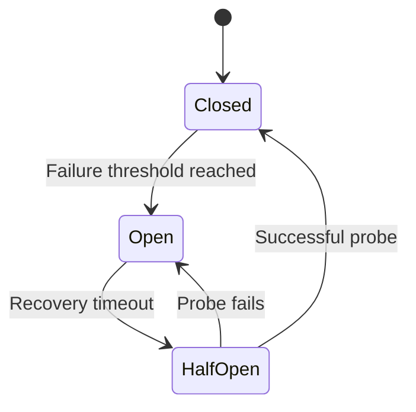
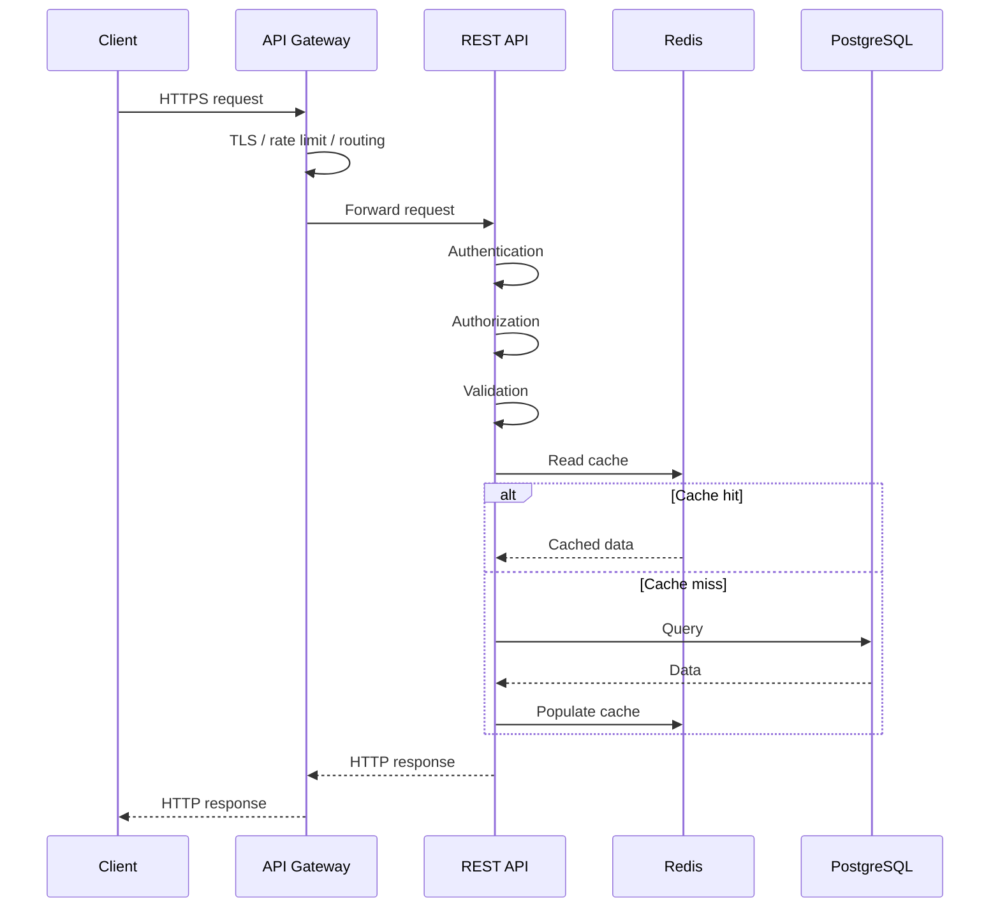
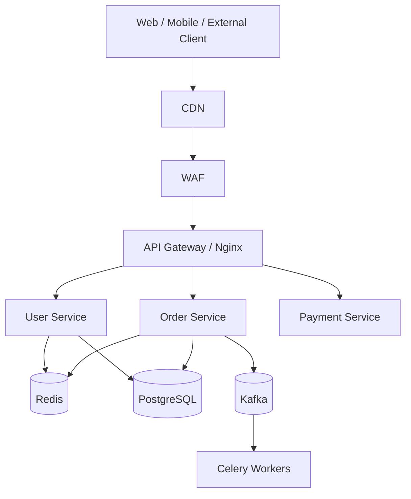

# 08- REST

## Overview

REST (Representational State Transfer) is an architectural style for designing networked applications around resources, representations, and a uniform interface.

In backend engineering, REST is commonly implemented over HTTP and is widely used for public APIs, internal service APIs, mobile backends, browser applications, and microservice communication.

A typical REST API looks like:

```text
Client
  |
  | HTTP request
  v
API Gateway / Nginx
  |
  v
REST API
  |
  +--> Business Logic
  |
  +--> PostgreSQL
  |
  +--> Redis
  |
  v
HTTP response
  |
  v
Client
```

REST is not synonymous with HTTP, JSON, or CRUD. HTTP is the transport and protocol; REST is an architectural style that uses concepts such as resources, representations, uniform interfaces, stateless interactions, and cacheability.

A production REST API must address considerably more than URL design. Authentication, authorization, validation, idempotency, pagination, concurrency, caching, observability, versioning, rate limiting, error handling, and operational behavior are all part of good API design.

---

## Why REST Matters

REST remains one of the most important API styles because it provides a familiar interface between independently deployed systems.

A frontend can communicate with a backend without knowing its internal implementation:

```text
React / Mobile App
        |
        v
     REST API
        |
        v
   Django / FastAPI
        |
        v
    PostgreSQL
```

The client cares about the API contract rather than:

- Database schema
- Internal classes
- Python modules
- Service boundaries
- Deployment topology
- Internal queues

This separation allows backend implementations to evolve independently from clients when the API contract is managed carefully.

---

## REST Constraints

REST is based on architectural constraints rather than a specific framework.

The commonly discussed constraints are:

| Constraint | Meaning |
|---|---|
| Client-server | Client and server have separate responsibilities |
| Stateless | Each request contains the information required to process it |
| Cacheable | Responses can define whether and how they may be cached |
| Uniform interface | Clients interact through a consistent resource-oriented interface |
| Layered system | Client does not need to know every intermediary |
| Code-on-demand | Optional; server may provide executable code to clients |

The first five are particularly relevant to backend API design.

---

## Client-Server Separation

The client and server should evolve independently.

For example:

```text
Client
  |
  | HTTP/JSON
  v
REST API
  |
  v
Business Layer
  |
  v
Database
```

The frontend should not need to know whether the backend uses:

```text
PostgreSQL
Redis
Kafka
Django
FastAPI
```

Similarly, the backend should not depend on the internal implementation details of a mobile or web client.

This separation supports independent deployment and scaling.

---

## Statelessness

Statelessness means each request should contain the information necessary for the server to process it.

For example:

```http
GET /api/orders/123
Authorization: Bearer <token>
```

The server can authenticate and authorize the request without relying on a specific application instance having remembered the client's previous request.

This enables:

```text
             Load Balancer
                  |
        +---------+---------+
        |         |         |
        v         v         v
      API A     API B     API C
```

Any request can be routed to any healthy instance.

### Stateless Does Not Mean No State

A common misconception is:

> A stateless application cannot have state.

A production backend obviously has state:

```text
PostgreSQL -> business state
Redis      -> cache/session state
Kafka      -> event state
```

Statelessness refers primarily to the interaction between client and server.

The server should avoid requiring hidden per-client conversational state inside one particular application instance.

---

## Resource-Oriented Design

REST models domain entities as resources.

Examples:

```text
/users
/orders
/products
/payments
/invoices
```

A resource should represent a meaningful domain object or collection rather than an implementation detail.

Prefer:

```http
GET /orders/123
```

over:

```http
GET /getOrder?id=123
```

Prefer:

```http
POST /orders
```

over:

```http
POST /createOrder
```

The HTTP method communicates the intended operation.

---

## Resources and Representations

A resource is not necessarily the same thing as its database row.

For example:

```text
Resource:
Order 123

Database:
orders
order_items
payments
customers
```

The API can return a representation:

```json
{
  "id": "ord_123",
  "status": "PAID",
  "total": 1299.00,
  "currency": "INR"
}
```

The API representation is a contract optimized for consumers rather than a direct database serialization.

Avoid exposing database models directly as API contracts.

---

## HTTP Methods

Common HTTP methods used in REST APIs are:

| Method | Typical purpose | Safe | Idempotent |
|---|---|---:|---:|
| `GET` | Retrieve resource | Yes | Yes |
| `HEAD` | Retrieve headers | Yes | Yes |
| `OPTIONS` | Discover supported operations | Yes | Yes |
| `POST` | Create/process operation | No | No |
| `PUT` | Replace resource | No | Yes |
| `PATCH` | Partially modify resource | No | Not inherently |
| `DELETE` | Delete resource | No | Yes |

These properties matter when designing retries and distributed systems.

---

## GET

Use `GET` to retrieve resources.

```http
GET /api/orders/123
```

Example response:

```http
HTTP/1.1 200 OK
Content-Type: application/json

{
  "id": "123",
  "status": "PAID"
}
```

GET requests should not cause externally visible state changes.

Avoid:

```http
GET /orders/123/cancel
```

A state-changing operation should not be hidden behind GET.

---

## POST

POST is generally used when the server processes a request that creates a subordinate resource or performs an operation whose final resource identifier is determined by the server.

Example:

```http
POST /orders
Content-Type: application/json

{
  "customer_id": "cust_123",
  "items": [
    {
      "product_id": "prod_100",
      "quantity": 2
    }
  ]
}
```

Response:

```http
HTTP/1.1 201 Created
Location: /orders/ord_123
Content-Type: application/json
```

POST is not inherently idempotent.

If a client retries a POST after a network timeout, the server may process it twice.

This is especially dangerous for:

- Payments
- Orders
- Resource creation
- Email sending
- Financial operations

---

## Idempotency

An operation is idempotent when repeating the same operation has the same intended externally visible effect.

For example:

```http
PUT /users/123
```

with:

```json
{
  "name": "Aranya"
}
```

Repeated requests should result in the same resource state.

POST usually requires additional application-level protection when clients need safe retries.

A common pattern is an idempotency key:

```http
POST /payments
Idempotency-Key: 7f9b7e7e-0f12-4f35-a9d4-123456789abc
```

The server stores the result associated with the key:

```text
Request
  |
  v
Idempotency Key
  |
  +--> Existing result? ---> return stored result
  |
  +--> No result
          |
          v
      Process payment
          |
          v
      Store result
          |
          v
      Return result
```

This protects against duplicate processing caused by client retries.

---

## PUT

PUT generally represents replacement of a resource at a known URI.

```http
PUT /users/123
```

Example:

```json
{
  "name": "Aranya",
  "email": "aranya@example.com"
}
```

Repeated requests with the same representation should result in the same resource state.

A common mistake is using PUT as an informal synonym for "update something."

The semantics should be documented clearly, especially whether omitted fields are reset, rejected, or preserved.

---

## PATCH

PATCH is intended for partial modifications.

Example:

```http
PATCH /users/123
Content-Type: application/json

{
  "display_name": "Aranya M."
}
```

Only the specified property is changed.

PATCH is useful when:

- Resources are large.
- Clients modify only a subset of fields.
- Partial updates are meaningful.

However, PATCH semantics must be clearly defined.

---

## DELETE

DELETE requests removal of a resource.

```http
DELETE /users/123
```

A successful deletion may return:

```http
204 No Content
```

DELETE is idempotent at the intended resource-state level.

Calling DELETE twice should not recreate or otherwise alter the deleted resource.

However, the HTTP response to the second request does not have to be identical to the first response.

---

## Resource Naming

Use nouns rather than verbs.

Prefer:

```text
GET    /users
GET    /users/123
POST   /users
PATCH  /users/123
DELETE /users/123
```

Avoid:

```text
GET  /getUsers
POST /createUser
POST /updateUser
GET  /deleteUser
```

Good resource names generally:

- Use nouns.
- Use plural collection names consistently.
- Represent meaningful domain concepts.
- Avoid leaking database implementation details.

---

## Nested Resources

Nested resources can express relationships.

For example:

```http
GET /customers/123/orders
```

This means:

```text
Orders belonging to customer 123
```

Another example:

```http
GET /orders/123/items
```

Nested resources are useful when the relationship is meaningful and bounded.

Avoid excessive nesting:

```text
/companies/1/departments/2/teams/3/users/4/orders/5/items/6
```

Deep URLs become difficult to maintain and can tightly couple API consumers to resource relationships.

Prefer simpler resources when the child entity has an independent identity:

```http
GET /orders/123
GET /order-items/456
```

---

## HTTP Status Codes

Status codes communicate the result of an HTTP operation.

Common codes include:

| Status | Meaning | Typical REST usage |
|---|---|---|
| `200` | OK | Successful retrieval/update |
| `201` | Created | Resource created |
| `202` | Accepted | Async processing accepted |
| `204` | No Content | Successful operation without response body |
| `400` | Bad Request | Invalid request syntax/data |
| `401` | Unauthorized | Authentication required/invalid |
| `403` | Forbidden | Authenticated but not allowed |
| `404` | Not Found | Resource unavailable |
| `409` | Conflict | State conflict |
| `412` | Precondition Failed | Conditional request failed |
| `422` | Unprocessable Content | Validation failure |
| `429` | Too Many Requests | Rate limited |
| `500` | Internal Server Error | Unexpected server error |
| `502` | Bad Gateway | Upstream failure |
| `503` | Service Unavailable | Temporary service overload/unavailability |
| `504` | Gateway Timeout | Upstream timeout |

---

## 401 vs 403

This is a common interview and production issue.

### 401

The request does not have valid authentication credentials.

```text
Who are you?
```

### 403

The server knows who the caller is but does not permit the requested operation.

```text
I know who you are, but you cannot perform this operation.
```

Example:

```text
User authenticated
      |
      v
Is user allowed to delete this order?
      |
      +-- No --> 403
```

---

## Error Response Design

Do not return inconsistent error formats.

Prefer a structured format:

```json
{
  "type": "https://api.example.com/errors/validation",
  "title": "Validation failed",
  "status": 422,
  "detail": "The request contains invalid fields.",
  "instance": "/orders",
  "errors": {
    "quantity": [
      "Must be greater than zero."
    ]
  }
}
```

A consistent error contract makes clients significantly easier to implement.

The exact format can vary, but the contract should be standardized across the API.

---

## Validation

Validation should happen at multiple layers.

```text
HTTP Request
    |
    v
Schema Validation
    |
    v
Authorization
    |
    v
Business Validation
    |
    v
Database Constraints
```

For FastAPI:

```python
from pydantic import BaseModel, Field


class CreateOrderRequest(BaseModel):
    customer_id: str
    quantity: int = Field(gt=0)
```

For Django REST Framework:

```python
from rest_framework import serializers


class CreateOrderSerializer(serializers.Serializer):
    customer_id = serializers.CharField()
    quantity = serializers.IntegerField(min_value=1)
```

Application validation improves developer experience, while database constraints remain essential for correctness.

---

## Authentication

REST APIs commonly use:

- Session cookies
- OAuth 2.0
- OpenID Connect
- Bearer tokens
- API keys
- Mutual TLS for service-to-service use cases

For browser applications, secure cookie-based authentication is often preferable when the architecture permits it.

For APIs consumed by independent clients, OAuth 2.0/OIDC or appropriately scoped bearer tokens are common.

Authentication answers:

```text
Who is calling?
```

Authorization answers:

```text
What is this caller allowed to do?
```

---

## Authorization

Authorization must happen at the resource and operation level.

For example:

```text
GET /orders/123
```

should not merely verify:

```text
User is authenticated
```

It should verify:

```text
User is allowed to access order 123
```

In multi-tenant systems:

```text
tenant_id(request)
        |
        v
order.tenant_id
        |
        +--> match --> allow
        |
        +--> mismatch --> deny
```

Never rely solely on IDs being difficult to guess.

---

## Pagination

Returning every resource is dangerous.

Avoid:

```http
GET /users
```

returning millions of records.

Use pagination.

### Offset Pagination

```http
GET /users?limit=50&offset=100
```

Query:

```sql
SELECT id, name, email
FROM users
ORDER BY id
LIMIT 50 OFFSET 100;
```

Advantages:

- Simple
- Easy to understand
- Works well for smaller datasets

Limitations:

- Large offsets can become expensive.
- Results can shift when rows are inserted or deleted.
- Deep pagination may perform poorly.

---

## Cursor Pagination

Cursor pagination uses a position rather than an offset.

Example:

```http
GET /users?limit=50&cursor=eyJpZCI6MTAwMH0
```

Conceptually:

```sql
SELECT id, name, email
FROM users
WHERE id > 1000
ORDER BY id
LIMIT 50;
```

This is generally better for large or frequently changing datasets.

A cursor should be treated as an opaque API token.

Do not require clients to understand its internal encoding.

---

## Pagination Comparison

| Property | Offset | Cursor |
|---|---:|---:|
| Simple implementation | Excellent | Moderate |
| Deep pagination | Poorer | Better |
| Stable under changes | Poorer | Better |
| Random page access | Easy | Difficult |
| Large datasets | Less suitable | Strong |
| Infinite scrolling | Acceptable | Excellent |
| Implementation complexity | Low | Moderate |

For large production APIs, cursor pagination is often the preferred default.

---

## Filtering

Filtering should use query parameters.

Example:

```http
GET /orders?status=PAID&customer_id=123
```

Multiple filters should have well-defined semantics.

Avoid arbitrary query languages unless the API genuinely requires them.

Document:

- Supported fields
- Operators
- Case sensitivity
- Default behavior
- Maximum result size

---

## Sorting

Use explicit query parameters:

```http
GET /orders?sort=-created_at
```

A common convention is:

```text
created_at
```

for ascending and:

```text
-created_at
```

for descending.

Never blindly concatenate user-provided sort expressions into SQL.

Map accepted API fields to known database expressions.

---

## Searching

Search can use:

```http
GET /products?search=iphone
```

For large-scale search requirements, PostgreSQL full-text search or dedicated systems may be more appropriate.

Do not assume:

```sql
WHERE name LIKE '%iphone%'
```

will remain efficient as data volume grows.

---

## Field Selection

Some APIs allow clients to request only selected fields:

```http
GET /users/123?fields=id,name,email
```

This can reduce payload size.

However, field selection increases API complexity and must not bypass authorization.

The server should first determine the fields the caller is allowed to access and only then apply requested field selection.

---

## API Versioning

APIs evolve.

Common strategies include:

### URL Versioning

```text
/api/v1/orders
/api/v2/orders
```

### Header Versioning

```http
Accept: application/vnd.example.order-v2+json
```

### Query Versioning

```text
/api/orders?version=2
```

URL versioning is operationally simple and highly visible.

The most important concern is not the specific mechanism but maintaining a predictable compatibility policy.

---

## Breaking vs Non-Breaking Changes

Usually safer changes include:

- Adding optional response fields.
- Adding new endpoints.
- Adding optional request fields.
- Adding new enum values only when clients are designed to tolerate them.

Potentially breaking changes include:

- Removing fields.
- Renaming fields.
- Changing field types.
- Changing status-code semantics.
- Changing pagination semantics.
- Making an optional field mandatory.
- Changing authentication requirements.

Treat API contracts as compatibility boundaries.

---

## Content Negotiation

HTTP allows clients and servers to negotiate representations.

For example:

```http
Accept: application/json
```

The server may respond:

```http
Content-Type: application/json
```

Request and response formats should be explicitly documented.

JSON is common for REST APIs, but REST is not inherently JSON-only.

---

## Content-Type

`Content-Type` describes the representation being sent.

Example:

```http
Content-Type: application/json
```

For a file upload:

```http
Content-Type: multipart/form-data
```

Do not confuse:

```text
Accept
```

with:

```text
Content-Type
```

`Accept` indicates what the client wants to receive.

`Content-Type` indicates what representation is being sent.

---

## Conditional Requests

HTTP supports conditional requests using headers such as:

```http
If-None-Match
If-Match
If-Modified-Since
If-Unmodified-Since
```

These are useful for caching and concurrency control.

---

## ETags

An ETag identifies a particular representation version.

Example response:

```http
HTTP/1.1 200 OK
ETag: "order-123-v7"
```

A client can later request:

```http
GET /orders/123
If-None-Match: "order-123-v7"
```

If the resource has not changed:

```http
HTTP/1.1 304 Not Modified
```

The client can reuse its cached representation.

---

## Optimistic Concurrency Control

ETags can also protect updates.

Suppose:

```text
Client A reads version 7
Client B reads version 7
```

Client A updates the resource:

```text
version 7 -> version 8
```

Client B attempts to update using:

```http
If-Match: "order-123-v7"
```

The server detects that the resource is now version 8 and rejects the update:

```http
HTTP/1.1 412 Precondition Failed
```

This prevents accidental lost updates.

---

## REST and Caching

Caching can dramatically reduce backend load.

Potential cache layers include:

```text
Client Cache
    |
    v
CDN
    |
    v
Nginx / Reverse Proxy
    |
    v
Application
    |
    v
Redis
    |
    v
PostgreSQL
```

HTTP caching should be used deliberately.

Important headers include:

```http
Cache-Control
ETag
Last-Modified
Vary
Expires
```

Do not cache personalized or sensitive responses accidentally.

---

## Cache-Control

Example:

```http
Cache-Control: public, max-age=60
```

means a cache may reuse the response for the specified freshness period.

For sensitive content:

```http
Cache-Control: private, no-store
```

may be appropriate depending on the use case.

Caching policy should be part of API design rather than an afterthought.

---

## REST and Redis

Redis is commonly used to accelerate read-heavy REST endpoints.

Example:

```text
GET /products/123
        |
        v
Redis
   |
   +--> hit --> response
   |
   +--> miss
          |
          v
      PostgreSQL
          |
          v
        Redis
          |
          v
       response
```

Cache keys should have predictable structure:

```text
product:v1:123
```

Cache invalidation should be tied to writes where consistency matters.

---

## REST and Database Transactions

A REST request often crosses several layers:

```text
HTTP Request
     |
     v
Authentication
     |
     v
Authorization
     |
     v
Validation
     |
     v
Business Logic
     |
     v
Database Transaction
     |
     v
Response
```

For operations involving multiple related writes, use a database transaction.

For example:

```text
Create Order
    |
    +--> orders
    |
    +--> order_items
    |
    +--> inventory reservation
```

The transaction boundary should correspond to the consistency requirement.

Do not make a distributed transaction across services simply because multiple services participate in one business workflow.

---

## REST in Microservices

REST is frequently used for synchronous service-to-service communication.

Example:

```text
Order Service
     |
     | GET /customers/123
     v
Customer Service
```

This introduces coupling:

```text
Order Service
      |
      v
Customer Service
      |
      v
Database
```

If Customer Service becomes slow, Order Service may also become slow.

At scale, consider:

- Timeouts
- Retries
- Circuit breakers
- Bulkheads
- Caching
- Async messaging
- gRPC where appropriate

---

## Timeouts

Every outbound REST call should have an explicit timeout.

Bad:

```python
response = requests.get(url)
```

Better:

```python
import requests

response = requests.get(
    "https://customer-service.internal/customers/123",
    timeout=(2, 5),
)
response.raise_for_status()
```

The timeout should distinguish connection establishment from response waiting when the client library supports it.

Never allow an upstream request to wait indefinitely.

---

## Retries

Retries can improve reliability for transient failures.

But retries can also amplify outages.

Consider:

```text
100 clients
    |
    v
Service B fails
    |
    v
Each client retries 3 times
    |
    v
300 requests
```

A retry storm can make an existing outage worse.

Use:

- Exponential backoff
- Jitter
- Maximum attempts
- Tight timeouts
- Retry budgets
- Idempotency protection

Only retry operations that are safe to retry.

---

## Circuit Breakers

A circuit breaker prevents continuous calls to an unhealthy dependency.

Conceptually:



This protects the caller from repeatedly invoking a failing dependency.

Circuit breakers are useful when:

- A dependency fails frequently.
- Requests are expensive.
- The caller can provide fallback behavior.

They should not replace proper timeouts.

---

## Bulkheads

Bulkheads isolate resource consumption.

For example:

```text
API Server
   |
   +--> Payment Pool
   |
   +--> Search Pool
   |
   +--> Notification Pool
```

If the notification service becomes slow, it should not consume every worker or connection and prevent payment requests from executing.

This is particularly important in microservice architectures.

---

## Async REST Operations

Some operations take too long for a normal synchronous request.

Instead of:

```http
POST /reports
```

waiting for several minutes, return:

```http
HTTP/1.1 202 Accepted
Location: /reports/jobs/job_123
```

The client can then query:

```http
GET /reports/jobs/job_123
```

Architecture:

```text
Client
  |
  | POST /reports
  v
API
  |
  +--> Queue
          |
          v
       Celery
          |
          v
      Generate Report
          |
          v
       PostgreSQL/S3
```

This separates request acceptance from background processing.

---

## REST and Celery

Celery is useful when REST requests trigger asynchronous work.

Example:

```python
from django.http import JsonResponse

from .tasks import generate_report


def create_report(request):
    task = generate_report.delay(request.user.id)

    return JsonResponse(
        {
            "job_id": task.id,
            "status": "PENDING",
        },
        status=202,
    )
```

The REST endpoint should not wait for the entire background operation.

---

## REST and Kafka

REST and Kafka solve different communication problems.

```text
REST:
Request/response

Kafka:
Event streaming
```

A typical architecture can combine them:

```text
Client
  |
  | REST
  v
Order API
  |
  +--> PostgreSQL
  |
  +--> Kafka
          |
          +--> Payment Service
          +--> Notification Service
          +--> Analytics
```

REST is useful for synchronous commands and queries.

Kafka is useful for asynchronous event propagation.

---

## API Gateway

A production REST architecture often places a gateway or reverse proxy in front of services.

```text
                    Internet
                       |
                       v
                  API Gateway
                       |
          +------------+------------+
          |            |            |
          v            v            v
      User API     Order API    Payment API
          |            |            |
          v            v            v
       Database     Database     Database
```

The gateway may handle:

- TLS termination
- Authentication
- Rate limiting
- Routing
- Request IDs
- CORS
- Observability
- WAF integration

Nginx, AWS API Gateway, and other gateway technologies can serve this role depending on the architecture.

---

## REST Request Lifecycle

A production REST request may follow:



This lifecycle is useful when diagnosing latency.

For example, if an endpoint has 500 ms latency, determine whether the time comes from:

```text
Network
Gateway
Authentication
Application
Redis
Database
Serialization
Response transmission
```

---

## API Contract Design

A REST API contract should define:

- Endpoint
- HTTP method
- Request parameters
- Request body
- Authentication
- Authorization
- Response schema
- Status codes
- Error schema
- Pagination
- Filtering
- Sorting
- Rate limits
- Idempotency behavior
- Versioning
- Deprecation policy

OpenAPI is commonly used to describe these contracts.

Example:

```yaml
openapi: 3.1.0
info:
  title: Orders API
  version: 1.0.0

paths:
  /orders/{order_id}:
    get:
      parameters:
        - name: order_id
          in: path
          required: true
          schema:
            type: string
      responses:
        "200":
          description: Order returned
        "404":
          description: Order not found
```

A machine-readable contract enables:

- Client generation
- Documentation
- Contract testing
- API validation
- Review of breaking changes

---

## API Design Example

A production order API might expose:

```text
GET    /api/v1/orders
POST   /api/v1/orders
GET    /api/v1/orders/{order_id}
PATCH  /api/v1/orders/{order_id}
DELETE /api/v1/orders/{order_id}
GET    /api/v1/orders/{order_id}/items
POST   /api/v1/orders/{order_id}/cancel
```

The cancellation operation deserves special consideration.

Cancellation is not necessarily CRUD.

It may represent a domain command:

```http
POST /api/v1/orders/123/cancel
```

because:

```text
cancel order
```

may trigger:

- Inventory release
- Payment reversal
- Notifications
- Event publication

Trying to force every domain operation into pure CRUD can produce misleading APIs.

---

## REST Does Not Mean CRUD

CRUD is an implementation pattern:

```text
Create
Read
Update
Delete
```

REST is broader.

A domain can have operations that do not map cleanly to CRUD.

Examples:

```text
POST /orders/123/cancel
POST /payments/123/capture
POST /users/123/password-reset
POST /reports/generate
```

These can still be reasonable HTTP APIs when they accurately represent domain actions.

The goal is meaningful resource and operation semantics, not artificial purity.

---

## Database Schema vs API Schema

Do not expose database structure directly.

Bad:

```json
{
  "user_id": 123,
  "created_at": "2026-08-23T12:00:00Z",
  "internal_status_code": 7,
  "password_hash": "..."
}
```

The API should expose a deliberately designed representation:

```json
{
  "id": "usr_123",
  "created_at": "2026-08-23T12:00:00Z",
  "status": "ACTIVE"
}
```

This prevents internal schema changes from automatically becoming API breaking changes.

---

## Serialization

Serialization converts internal objects into API representations.

Example:

```python
from pydantic import BaseModel


class OrderResponse(BaseModel):
    id: str
    status: str
    total: float
```

In Django REST Framework:

```python
from rest_framework import serializers

from .models import Order


class OrderSerializer(serializers.ModelSerializer):
    class Meta:
        model = Order
        fields = ["id", "status", "total"]
```

The serializer is an API boundary.

Do not treat it merely as a convenience for converting ORM objects.

---

## N+1 Queries

A REST endpoint can accidentally generate excessive database queries.

For example:

```text
GET /orders

1 query -> orders
N queries -> customer for each order
N queries -> items for each order
```

For 1,000 orders:

```text
1 + 1000 + 1000 = 2001 queries
```

This is an N+1 problem.

In Django, use techniques such as:

```python
orders = (
    Order.objects
    .select_related("customer")
    .prefetch_related("items")
)
```

In SQLAlchemy, use appropriate eager-loading strategies.

Measure query count and latency rather than assuming ORM code is efficient.

---

## Overfetching and Underfetching

REST APIs can suffer from:

### Overfetching

The API returns much more data than the client needs.

### Underfetching

The client needs multiple API calls to construct one screen.

Example:

```text
GET /orders
GET /customers/1
GET /products/10
GET /products/11
...
```

Possible solutions include:

- Better resource representations
- Embedded related data
- Batch endpoints
- Aggregation endpoints
- Carefully designed query parameters

Do not automatically solve underfetching by creating deeply nested responses.

---

## API Aggregation

An API gateway or backend-for-frontend can aggregate multiple services:

```text
Client
  |
  v
BFF
  |
  +--> User Service
  |
  +--> Order Service
  |
  +--> Recommendation Service
  |
  v
Combined response
```

This can reduce client round trips.

However, aggregation increases server-side coupling and can increase latency if dependencies are slow.

Use explicit timeouts and partial-failure behavior.

---

## Rate Limiting

REST APIs should protect themselves against excessive traffic.

Common algorithms include:

- Token bucket
- Leaky bucket
- Fixed window
- Sliding window

A token bucket conceptually behaves like:

```text
Token Bucket
+----------------+
| o o o o o      |
| o o            |
+----------------+
       |
       v
   Request consumes token
```

Redis is commonly used to implement distributed rate limiting.

Rate limits can be applied by:

```text
IP
User
API key
Tenant
Endpoint
```

Return:

```http
HTTP/1.1 429 Too Many Requests
Retry-After: 10
```

when appropriate.

---

## Observability

Every production REST API should have:

### Metrics

- Request rate
- Error rate
- Latency
- Saturation
- Status-code distribution

### Logs

- Request ID
- Trace ID
- Endpoint
- Method
- Status
- Duration
- Relevant actor/tenant identifiers

### Traces

Distributed tracing should connect:

```text
Client
  |
  v
API Gateway
  |
  v
Order Service
  |
  v
Payment Service
  |
  v
PostgreSQL
```

A trace ID makes it possible to understand where latency or failure originated.

---

## SLO-Oriented REST Monitoring

Monitoring should connect technical metrics to user-visible behavior.

For example:

```text
Availability SLO:
99.9%

Latency SLO:
95% of GET /orders requests < 300 ms
```

Do not monitor only:

```text
CPU = 50%
```

A system can have healthy CPU while users experience:

```text
HTTP 5xx = 5%
p95 latency = 3 seconds
```

Monitor API behavior directly.

---

## Security Considerations

Production REST APIs should address:

- TLS
- Authentication
- Authorization
- Input validation
- Output filtering
- Rate limiting
- CSRF where applicable
- CORS
- SSRF protection
- SQL injection prevention
- Secure headers
- Secret management
- Audit logging
- Dependency security

### SQL Injection

Never build SQL by concatenating untrusted values.

Bad:

```python
query = f"SELECT * FROM users WHERE id = {user_id}"
```

Use parameterized queries or ORM query APIs.

### SSRF

If an API accepts URLs and fetches them server-side, validate and restrict destinations.

Do not assume a URL provided by a client is safe.

---

## Reliability Patterns

Production REST systems commonly use:

```text
Timeouts
Retries
Jitter
Circuit Breakers
Bulkheads
Idempotency
Caching
Rate Limiting
Queues
Graceful Degradation
```

These mechanisms solve different failure modes.

| Pattern | Primary purpose |
|---|---|
| Timeout | Prevent indefinite waiting |
| Retry | Recover from transient failures |
| Jitter | Prevent synchronized retries |
| Circuit breaker | Stop repeatedly calling failed dependency |
| Bulkhead | Isolate resource exhaustion |
| Idempotency | Prevent duplicate effects |
| Cache | Reduce repeated work |
| Rate limit | Protect capacity |
| Queue | Absorb asynchronous workload |
| Graceful degradation | Preserve partial functionality |

---

## Performance Considerations

REST performance depends on the complete request path.

Important factors include:

```text
DNS
TLS
Network latency
Load balancer
Application processing
Database queries
Cache access
Serialization
Payload size
Client network
```

Optimize based on measurements.

Useful techniques include:

- Connection pooling
- HTTP keep-alive
- HTTP/2
- Compression where appropriate
- Pagination
- Caching
- Database indexing
- Query optimization
- Response shaping
- Async processing
- CDN usage for cacheable resources

---

## Connection Pooling

Creating a new TCP/TLS connection for every request is expensive.

Production HTTP clients should use connection pooling where appropriate.

For example, service-to-service communication should reuse connections rather than repeatedly performing:

```text
TCP handshake
TLS handshake
HTTP request
```

Connection pooling reduces latency and connection overhead.

---

## HTTP/2 and REST

REST APIs can operate over HTTP/2.

HTTP/2 provides:

- Multiplexed streams
- Header compression
- Connection reuse
- Better utilization of a single connection

The API semantics do not fundamentally change:

```text
GET /orders
POST /orders
PATCH /orders/123
```

HTTP/2 is a transport-level improvement rather than a replacement for REST.

---

## REST vs gRPC

REST and gRPC are both useful for service communication.

| Characteristic | REST | gRPC |
|---|---|---|
| Typical encoding | JSON | Protobuf |
| Transport | HTTP | HTTP/2 |
| Browser support | Excellent | More involved |
| Human readability | Excellent | Lower |
| Contract | OpenAPI commonly | Protobuf |
| Streaming | Possible | Strong |
| Internal microservices | Strong | Excellent |
| Public APIs | Excellent | Situational |
| Tooling | Very broad | Strong |

A practical architecture may use:

```text
Internet
   |
   v
REST API
   |
   v
Backend Services
   |
   +--> gRPC
   |
   +--> Kafka
```

REST does not need to be used everywhere simply because it is used at the public boundary.

---

## REST vs GraphQL

GraphQL provides client-driven query selection.

REST provides resource-oriented endpoints.

| Requirement | REST | GraphQL |
|---|---:|---:|
| Simple public APIs | Excellent | Good |
| HTTP caching | Strong | More complex |
| Fixed resource contracts | Excellent | Different model |
| Client-controlled fields | Limited | Excellent |
| Multiple related resources | Can require aggregation | Strong |
| Operational simplicity | Strong | Moderate |

The choice should be driven by client and domain requirements rather than trends.

---

## API Deprecation

APIs eventually need to evolve.

A mature deprecation process should include:

```text
Announce
   |
   v
Document replacement
   |
   v
Measure usage
   |
   v
Notify consumers
   |
   v
Migration period
   |
   v
Remove
```

Do not remove an endpoint simply because a newer version exists.

Determine:

- Who uses it?
- How frequently?
- What clients depend on it?
- What migration path exists?
- What is the contractual sunset date?

---

## Documentation

Good REST documentation should provide:

```text
Endpoint
Method
Authentication
Parameters
Request body
Response body
Status codes
Errors
Pagination
Rate limits
Examples
Idempotency behavior
Versioning
Deprecation
```

OpenAPI can provide the machine-readable foundation.

Documentation should be versioned alongside the API implementation when possible.

---

## Testing REST APIs

A production REST API should be tested at multiple levels.

### Unit Tests

Test:

- Validation
- Business rules
- Serialization
- Authorization decisions

### Integration Tests

Test:

- Database behavior
- Redis behavior
- External service interactions

### API Tests

Test:

- Status codes
- Headers
- Request/response schemas
- Authentication
- Authorization
- Error contracts

### Contract Tests

Verify that service consumers and providers agree on the API contract.

### Load Tests

Test:

- Throughput
- p95/p99 latency
- Connection behavior
- Database capacity
- Rate limiting

A successful unit-test suite does not prove that the production API can handle its expected traffic.

---

## Production REST Architecture

A mature architecture may look like:



In larger systems, each service may have an independently owned database rather than sharing one PostgreSQL database.

The architecture should reflect actual ownership and consistency boundaries.

---

## Common Mistakes

### Using Verbs Everywhere

```text
POST /createUser
POST /updateUser
```

Prefer resource-oriented URLs where appropriate.

### Treating REST as CRUD

Domain operations do not always map cleanly to CRUD.

### Returning 200 for Every Error

Use HTTP status codes to communicate broad request outcomes.

### Returning 500 for Validation Errors

Client validation problems should generally produce an appropriate 4xx response.

### No Pagination

Returning unbounded collections creates scalability problems.

### No Timeouts

An upstream dependency can block resources indefinitely.

### Blind Retries

Retries can amplify outages and duplicate side effects.

### No Idempotency for Financial Operations

Network retries can create duplicate payments or orders.

### Exposing Database Models Directly

Internal schema changes then become API contract changes.

### Ignoring Authorization

Authentication alone does not prove resource access.

### Deeply Nested URLs

Excessive nesting makes APIs difficult to evolve.

### Inconsistent Error Formats

Clients then need endpoint-specific error handling.

### Ignoring N+1 Queries

A seemingly simple REST endpoint can generate thousands of database queries.

### Relying on CPU Alone for Scaling

Database latency, connections, memory, and downstream capacity may become bottlenecks first.

---

## Interview Traps

### Is REST a Protocol?

No.

REST is an architectural style.

HTTP is a protocol commonly used to implement REST APIs.

### Is REST the Same as JSON APIs?

No.

REST is not tied to JSON.

### Does REST Require CRUD?

No.

REST can expose domain actions when resource semantics alone are insufficient.

### Does Stateless Mean the Server Cannot Use Redis?

No.

Statelessness refers to client-server interaction state, not the absence of all server-side state.

### Is POST Always Non-Idempotent?

HTTP defines POST as non-idempotent by default, but an application can add idempotency behavior using mechanisms such as idempotency keys.

### Is PUT Always a Partial Update?

No.

PUT is generally associated with replacement semantics.

PATCH is intended for partial modifications.

### Does REST Guarantee Exactly-Once Processing?

No.

Reliable processing requires application-level mechanisms such as idempotency, transactional design, and appropriate retry handling.

### Should Every Microservice Use REST?

No.

REST, gRPC, Kafka, and other mechanisms serve different communication patterns.

### Does HTTP 200 Mean the Business Operation Succeeded?

Not necessarily.

The API must define status and error semantics correctly. A successful HTTP transport response can still contain an application-level outcome that represents failure if the API is poorly designed.

---

## Production Checklist

- [ ] Define resources around meaningful domain concepts.
- [ ] Use HTTP methods consistently.
- [ ] Define status-code semantics.
- [ ] Standardize error responses.
- [ ] Validate request payloads.
- [ ] Enforce authentication and authorization.
- [ ] Implement pagination for large collections.
- [ ] Use cursor pagination for appropriate high-volume datasets.
- [ ] Define filtering and sorting semantics.
- [ ] Use explicit API versioning and compatibility policies.
- [ ] Define idempotency behavior for retryable writes.
- [ ] Add timeouts to outbound calls.
- [ ] Use retries selectively with exponential backoff and jitter.
- [ ] Protect dependencies with circuit breakers or equivalent controls where appropriate.
- [ ] Prevent N+1 database queries.
- [ ] Use indexes and query optimization based on measurements.
- [ ] Use Redis or another cache where it materially improves performance.
- [ ] Define HTTP caching behavior deliberately.
- [ ] Protect APIs with rate limits.
- [ ] Use TLS everywhere appropriate.
- [ ] Validate CORS configuration.
- [ ] Protect against SQL injection and SSRF.
- [ ] Add request IDs and distributed tracing.
- [ ] Monitor request rate, errors, latency, and saturation.
- [ ] Define SLOs for critical endpoints.
- [ ] Document APIs using OpenAPI or an equivalent contract.
- [ ] Test authentication, authorization, validation, errors, and concurrency.
- [ ] Perform load testing before major traffic increases.
- [ ] Define API deprecation and migration procedures.

---

## Key Takeaways

- REST is an architectural style built around resources, stateless interactions, uniform interfaces, and HTTP semantics; it is not simply "JSON over HTTP" or CRUD.
- Production REST APIs require deliberate design for status codes, validation, authorization, pagination, caching, idempotency, concurrency, versioning, and error contracts.
- Distributed REST calls must use explicit timeouts, carefully controlled retries, backoff and jitter, and appropriate resilience patterns to prevent cascading failures.
- REST is commonly used at public boundaries, while gRPC and event-driven systems such as Kafka can be better suited for specific internal service-to-service communication patterns.
- A senior REST design focuses on the complete system: API contracts, database behavior, network latency, scalability, observability, security, failure handling, and long-term compatibility.