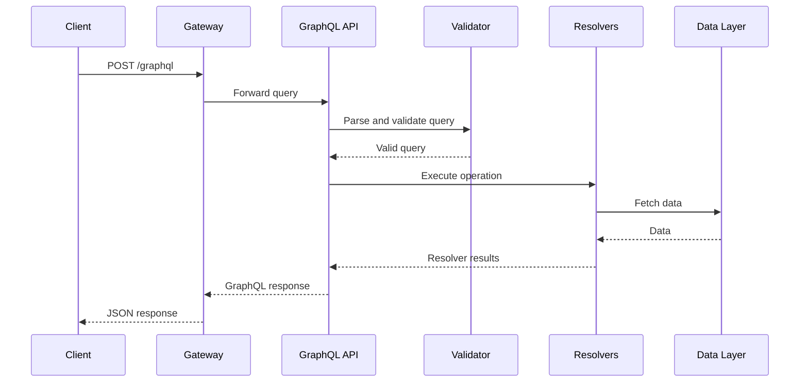
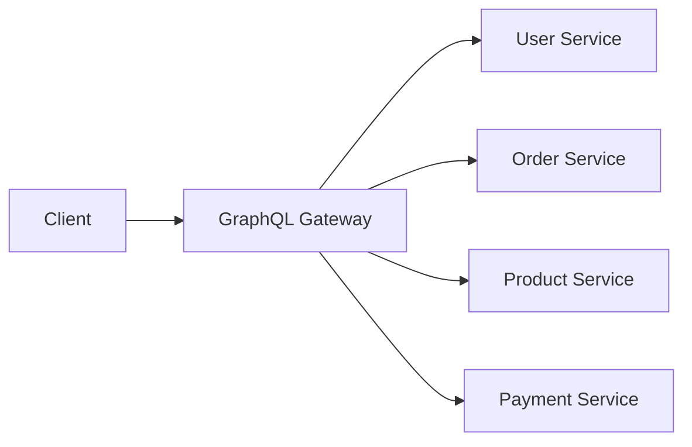

# 09- GraphQL

## Overview

GraphQL is a query language for APIs and a runtime for executing those queries against a strongly typed schema.

Unlike a traditional REST API, where the server exposes multiple endpoints with predefined response representations, GraphQL commonly exposes a single endpoint through which clients specify the data they require.

A typical architecture looks like:

```text
Client
  |
  | GraphQL Query
  v
GraphQL API
  |
  +--> Schema
  |
  +--> Resolvers
  |
  +--> Business Logic
  |
  +--> PostgreSQL
  |
  +--> Redis
  |
  +--> Other Services
```

The key architectural difference is that GraphQL moves significant control over response shape from the server to the client.

For example, a REST API might require:

```text
GET /users/123
GET /users/123/orders
GET /orders/456/items
```

A GraphQL client can request a related data graph in one operation:

```graphql
query {
  user(id: "123") {
    id
    name
    orders {
      id
      status
      items {
        product {
          id
          name
        }
        quantity
      }
    }
  }
}
```

The server still controls what data is available, which relationships can be traversed, authorization rules, query complexity, and resolver behavior.

GraphQL is therefore not simply "REST with one endpoint." It introduces a different API contract, execution model, caching model, authorization model, and operational risk profile.

---

## Why GraphQL Exists

Traditional REST APIs work well when server-defined resources map cleanly to client requirements.

However, complex clients often encounter two related problems.

### Overfetching

The server returns fields the client does not need.

```http
GET /users/123
```

might return:

```json
{
  "id": "123",
  "name": "Aranya",
  "email": "aranya@example.com",
  "phone": "...",
  "address": "...",
  "preferences": "...",
  "metadata": "...",
  "created_at": "..."
}
```

The client may only need:

```json
{
  "id": "123",
  "name": "Aranya"
}
```

### Underfetching

The client requires multiple requests to construct one view.

```text
GET /users/123
GET /users/123/orders
GET /orders/456/items
GET /products/10
GET /products/11
```

This can create substantial client-side orchestration.

GraphQL addresses these problems by allowing the client to describe the desired response shape.

---

## GraphQL Core Model

A GraphQL system has several important components:

```text
GraphQL Schema
      |
      +--> Types
      +--> Fields
      +--> Arguments
      +--> Queries
      +--> Mutations
      +--> Subscriptions
      |
      v
Query Validation
      |
      v
Query Execution
      |
      v
Resolvers
      |
      v
Business Logic / Data Sources
```

The schema is the central contract.

Clients use the schema to understand:

- Available operations
- Available fields
- Field types
- Arguments
- Relationships
- Nullability
- Enumerations
- Input types

---

## Schema

A GraphQL schema defines the API contract.

Example:

```graphql
type User {
  id: ID!
  name: String!
  email: String!
}

type Query {
  user(id: ID!): User
  users(limit: Int, cursor: String): UserConnection!
}
```

The `!` means the field is non-null.

Therefore:

```graphql
id: ID!
```

means the API promises that `id` will not be `null`.

Whereas:

```graphql
user(id: ID!): User
```

means the argument is required but the returned user may be absent.

---

## GraphQL Type System

GraphQL provides a strongly typed schema.

Common scalar types include:

| Type | Purpose |
|---|---|
| `Int` | Signed 32-bit integer |
| `Float` | Floating-point value |
| `String` | UTF-8 string |
| `Boolean` | Boolean value |
| `ID` | Identifier |
| Custom scalar | Domain-specific representation |

Example:

```graphql
type Product {
  id: ID!
  name: String!
  price: Float!
  available: Boolean!
}
```

Strong typing enables:

- Validation
- Introspection
- Documentation
- IDE autocomplete
- Client generation
- Contract analysis

---

## Object Types

Object types represent domain concepts.

```graphql
type Order {
  id: ID!
  status: OrderStatus!
  total: Float!
  customer: User!
}
```

Relationships can be represented directly:

```text
Order
  |
  +--> User
  |
  +--> OrderItem
  |
  +--> Payment
```

The server determines whether these relationships can actually be traversed.

---

## Enum Types

Enums constrain values to a known set.

```graphql
enum OrderStatus {
  PENDING
  CONFIRMED
  PAID
  CANCELLED
  SHIPPED
}
```

This is preferable to exposing unrestricted strings when the domain has a finite set of valid states.

---

## Input Types

Input objects define structured request data.

```graphql
input CreateOrderInput {
  customerId: ID!
  items: [OrderItemInput!]!
}

input OrderItemInput {
  productId: ID!
  quantity: Int!
}
```

Mutation:

```graphql
type Mutation {
  createOrder(input: CreateOrderInput!): Order!
}
```

Input types should represent API contracts rather than database models.

---

## Query

Queries are used to retrieve data.

Example:

```graphql
query GetUser {
  user(id: "123") {
    id
    name
    email
  }
}
```

The client chooses the requested fields.

The server still decides whether each field is:

- Available
- Authorized
- Computable
- Expensive
- Deprecated

---

## Mutation

Mutations represent state-changing operations.

Example:

```graphql
mutation CreateOrder {
  createOrder(
    input: {
      customerId: "cust_123"
      items: [
        {
          productId: "prod_100"
          quantity: 2
        }
      ]
    }
  ) {
    id
    status
    total
  }
}
```

Mutations should model meaningful domain operations.

Avoid creating mutations that simply expose database operations without considering business semantics.

---

## Subscription

Subscriptions provide a mechanism for receiving updates over time.

Conceptually:

```text
Client
  |
  | Subscribe
  v
GraphQL Server
  |
  v
Event Source
  |
  +--> Kafka
  +--> Redis Pub/Sub
  +--> Internal Event Bus
  |
  v
Client receives updates
```

Subscriptions are commonly implemented using persistent connections such as WebSockets.

They are useful for:

- Live dashboards
- Notifications
- Collaborative applications
- Real-time status updates
- Operational monitoring

Subscriptions introduce additional connection-management and scaling concerns.

---

## GraphQL Request Lifecycle

A production GraphQL request generally passes through several stages.



The important difference from a simple REST request is that GraphQL execution may traverse an arbitrary field graph defined by the client's query.

This makes query planning and resolver performance critical.

---

## Query Execution

Consider:

```graphql
query {
  user(id: "123") {
    name
    orders {
      id
      items {
        product {
          name
        }
      }
    }
  }
}
```

Conceptually, execution becomes:

```text
user
 |
 +--> name
 |
 +--> orders
       |
       +--> id
       |
       +--> items
              |
              +--> product
                     |
                     +--> name
```

Each field can have a resolver.

This is powerful, but it creates one of GraphQL's most important production risks:

> Arbitrary query depth can translate into arbitrary backend work.

---

## Resolvers

Resolvers contain the logic required to produce field values.

Conceptual Python example:

```python
async def resolve_user(parent, info, user_id):
    return await user_repository.get_by_id(user_id)
```

Another resolver might resolve orders:

```python
async def resolve_orders(user, info):
    return await order_repository.list_for_user(user.id)
```

Resolvers should generally remain thin.

Prefer:

```text
Resolver
   |
   v
Application Service
   |
   v
Repository / Data Access
```

rather than putting substantial business logic directly inside resolver functions.

---

## Resolver Responsibility

A resolver should primarily:

- Extract arguments.
- Perform appropriate authorization checks.
- Invoke application services.
- Fetch or transform data.
- Return values compatible with the GraphQL schema.

Avoid turning resolvers into:

```text
HTTP layer
+
Business logic
+
Database layer
+
Transaction manager
+
External API client
```

This makes testing and evolution difficult.

---

## GraphQL and N+1 Queries

The N+1 problem is one of the most important GraphQL performance issues.

Consider:

```graphql
query {
  users {
    id
    name
    orders {
      id
    }
  }
}
```

Naive execution may produce:

```text
1 query -> users

N queries:
  user 1 -> orders
  user 2 -> orders
  user 3 -> orders
  ...
```

For 1,000 users:

```text
1 + 1000 = 1001 queries
```

This can severely degrade a production system.

---

## DataLoader

DataLoader-style batching solves many N+1 problems by collecting multiple resolver requests and fetching them together.

Instead of:

```text
getOrders(user1)
getOrders(user2)
getOrders(user3)
```

the system can batch:

```text
getOrders([user1, user2, user3])
```

Conceptually:

```text
Resolver A ----\
Resolver B -----+--> DataLoader --> Database
Resolver C ----/
```

A batch query might become:

```sql
SELECT *
FROM orders
WHERE customer_id IN (1, 2, 3);
```

The results are then mapped back to the corresponding users.

DataLoader implementations commonly also provide per-request caching.

---

## Per-Request DataLoader Cache

DataLoader caching should normally be scoped to a request.

```text
GraphQL Request
      |
      v
Create DataLoader
      |
      +--> cache
      |
      v
Resolve fields
      |
      v
Destroy loader
```

Do not accidentally create a global cache containing user-specific data.

That can cause:

- Cross-request data leakage
- Stale data
- Unbounded memory growth

---

## GraphQL and REST Comparison

| Characteristic | REST | GraphQL |
|---|---|---|
| Endpoint model | Multiple resources/endpoints | Usually one GraphQL endpoint |
| Response shape | Server-defined | Client-selected |
| Schema | OpenAPI commonly | GraphQL schema |
| Overfetching | More common | Reduced |
| Underfetching | More common | Reduced |
| HTTP caching | Straightforward | More complex |
| Query complexity | Usually predictable | Potentially arbitrary |
| Browser tooling | Excellent | Excellent |
| Streaming | Separate mechanisms | Subscriptions |
| Versioning | Commonly explicit | Often schema evolution |
| Authorization | Endpoint/resource based | Field/resource based |
| Operational complexity | Lower | Higher |

Neither is universally superior.

---

## When GraphQL Is a Good Fit

GraphQL is particularly useful when:

- Multiple clients require different data shapes.
- Mobile clients need to minimize network traffic.
- The domain contains highly connected resources.
- Frontend teams need flexibility.
- Multiple backend services contribute to one client view.
- The API evolves frequently.
- A typed API contract is valuable.

Examples include:

```text
E-commerce storefront
Social application
Mobile application
Analytics dashboard
Collaborative application
Content platform
```

---

## When GraphQL May Be a Poor Fit

GraphQL may be unnecessary when:

- The API is simple CRUD.
- There are only a few stable clients.
- HTTP caching is a dominant requirement.
- The response shapes are predictable.
- Operational simplicity is a priority.
- Clients do not benefit from custom field selection.

For example, a simple internal health API does not need GraphQL:

```http
GET /health
```

REST is often simpler and more operationally transparent.

---

## GraphQL Is Not a Database Query Language

A GraphQL query:

```graphql
{
  user(id: "123") {
    name
  }
}
```

does not imply:

```sql
SELECT name FROM users WHERE id = 123;
```

The resolver can retrieve data from:

```text
PostgreSQL
Redis
REST service
gRPC service
Kafka-derived state
External API
Object storage
```

GraphQL is an API abstraction layer, not a database abstraction that automatically optimizes queries.

---

## GraphQL and Django

A Django application can expose GraphQL through libraries such as Graphene or Strawberry.

A production architecture can look like:

```text
Client
  |
  v
Nginx / API Gateway
  |
  v
Django
  |
  +--> GraphQL
  |
  +--> Application Services
  |
  +--> Django ORM
  |
  +--> Redis
  |
  v
PostgreSQL
```

The important architectural principle is to keep the GraphQL layer separate from domain logic.

---

## GraphQL and FastAPI

FastAPI can also host GraphQL through ASGI-compatible GraphQL libraries.

Conceptually:

```python
from fastapi import FastAPI

app = FastAPI()

@app.get("/health")
async def health():
    return {"status": "ok"}
```

A GraphQL library can expose a GraphQL application through an ASGI route.

This allows an application to expose both:

```text
REST endpoints
+
GraphQL endpoint
```

when the architecture benefits from both.

---

## Schema Example

A more complete schema might look like:

```graphql
scalar DateTime

enum OrderStatus {
  PENDING
  PAID
  CANCELLED
  SHIPPED
}

type User {
  id: ID!
  name: String!
  orders(first: Int = 20, after: String): OrderConnection!
}

type Order {
  id: ID!
  status: OrderStatus!
  total: Float!
  createdAt: DateTime!
}

type OrderEdge {
  cursor: String!
  node: Order!
}

type OrderConnection {
  edges: [OrderEdge!]!
  pageInfo: PageInfo!
}

type PageInfo {
  hasNextPage: Boolean!
  endCursor: String
}

type Query {
  user(id: ID!): User
}

type Mutation {
  createOrder(input: CreateOrderInput!): Order!
}

input CreateOrderInput {
  customerId: ID!
  productId: ID!
  quantity: Int!
}
```

This schema provides explicit typing and cursor-based pagination.

---

## Pagination

GraphQL does not automatically solve pagination.

A common production pattern is cursor-based pagination.

Example:

```graphql
query {
  users(first: 20, after: "cursor") {
    edges {
      cursor
      node {
        id
        name
      }
    }
    pageInfo {
      hasNextPage
      endCursor
    }
  }
}
```

This follows the general connection model:

```text
Connection
   |
   +--> edges
   |      |
   |      +--> cursor
   |      +--> node
   |
   +--> pageInfo
```

Cursor pagination is generally preferable to exposing unbounded collections.

---

## Query Depth

Clients can construct deeply nested queries:

```graphql
{
  user {
    orders {
      customer {
        orders {
          customer {
            orders {
              ...
            }
          }
        }
      }
    }
  }
}
```

A malicious or accidental query can consume substantial CPU, database, and network resources.

Production GraphQL servers should consider:

- Maximum depth
- Maximum field count
- Complexity analysis
- Query cost limits
- Query timeouts
- Rate limiting

---

## Query Complexity

Not every field has the same cost.

For example:

```text
user.name                  -> cheap
user.orders                -> moderate
user.recommendations       -> expensive
user.recommendations.feed  -> very expensive
```

A query-cost system can assign weights to fields.

Conceptually:

```text
Query cost =
    scalar fields
  + relationship costs
  + nested multipliers
  + expensive resolver weights
```

Requests exceeding a configured threshold can be rejected before execution.

This is particularly important for public GraphQL APIs.

---

## Persisted Queries

Instead of allowing arbitrary query text from clients, production systems can use persisted or allowlisted queries.

Conceptually:

```text
Client
  |
  | query ID
  v
GraphQL Gateway
  |
  +--> Known query?
         |
         +--> No --> Reject
         |
         +--> Yes
               |
               v
            Execute
```

Advantages include:

- Reduced attack surface
- Predictable workload
- Smaller request payloads
- Better caching
- Easier query governance

Persisted queries are especially useful for controlled first-party clients.

---

## Introspection

GraphQL commonly supports schema introspection.

This enables tools to discover:

```text
Types
Fields
Arguments
Descriptions
Deprecated fields
```

Introspection is valuable during development.

For public production APIs, unrestricted introspection should be evaluated carefully.

Security does not depend on disabling introspection, but exposing the complete schema can make reconnaissance easier.

A common approach is:

```text
Development:
Introspection enabled

Production:
Restrict or control introspection according to API exposure model
```

---

## Deprecation

GraphQL supports field deprecation.

Example:

```graphql
type User {
  id: ID!
  name: String!
  username: String @deprecated(reason: "Use displayName")
  displayName: String!
}
```

This allows the schema to evolve without immediately removing existing fields.

Track usage before removing deprecated fields.

---

## Versioning

GraphQL commonly avoids explicit versions such as:

```text
/v1/graphql
/v2/graphql
```

Instead, the schema evolves by:

```text
Add new field
      |
      v
Deprecate old field
      |
      v
Measure usage
      |
      v
Remove old field
```

This can reduce version proliferation.

However, GraphQL does not magically eliminate breaking changes.

Changing:

```graphql
name: String!
```

to:

```graphql
name: Int!
```

is still a breaking change.

---

## Nullability

GraphQL nullability is an important schema design decision.

Compare:

```graphql
name: String
```

with:

```graphql
name: String!
```

The first permits:

```json
"name": null
```

The second does not.

Nullability should reflect real business invariants.

Do not mark every field as non-null simply because nulls are inconvenient.

If the backend cannot reliably guarantee a value, declaring it non-null can turn recoverable field failures into larger query failures.

---

## Error Handling

GraphQL typically returns both:

```json
{
  "data": {},
  "errors": []
}
```

A request can therefore contain partial success.

Example:

```json
{
  "data": {
    "user": {
      "id": "123",
      "name": "Aranya",
      "recommendations": null
    }
  },
  "errors": [
    {
      "message": "Recommendation service unavailable",
      "path": [
        "user",
        "recommendations"
      ]
    }
  ]
}
```

This differs from traditional REST handling where HTTP status codes often represent the operation's broad outcome.

Clients must therefore handle both:

- Transport-level failures
- GraphQL execution errors

---

## Partial Failure

Partial responses can be valuable in distributed systems.

Consider:

```text
User Service          -> success
Order Service         -> success
Recommendation Service -> failure
```

GraphQL can potentially return:

```text
User:
  name       -> available
  orders     -> available
  recommendations -> unavailable
```

This supports graceful degradation.

However, schema nullability and error propagation determine how much of the response remains usable.

---

## GraphQL Authorization

Authorization can happen at several levels.

### Operation Level

```text
Can this user execute this mutation?
```

### Object Level

```text
Can this user access Order 123?
```

### Field Level

```text
Can this user see Order.paymentDetails?
```

Field-level authorization is particularly important because a single query can traverse many resources.

Do not assume:

```text
User can read Order
```

means:

```text
User can read every field of Order
```

---

## Multi-Tenant Authorization

For multi-tenant systems, every resolver that accesses tenant-owned data should enforce tenant boundaries.

Conceptually:

```text
Authenticated User
       |
       v
Tenant Context
       |
       v
Resolver
       |
       v
Data Access
       |
       v
WHERE tenant_id = current_tenant
```

Prefer enforcing tenant isolation close to the data access layer rather than relying exclusively on resolver code.

Database-level controls can provide additional defense in depth where appropriate.

---

## GraphQL and Transactions

A mutation can trigger multiple database operations.

For example:

```text
createOrder
   |
   +--> create order
   +--> create order items
   +--> reserve inventory
```

If these operations belong to the same transactional boundary, use an appropriate database transaction.

Conceptually:

```text
Mutation
   |
   v
Application Service
   |
   +--> BEGIN
   |
   +--> Order
   |
   +--> Order Items
   |
   +--> COMMIT
```

Do not assume that one GraphQL mutation automatically provides distributed transactional semantics.

---

## GraphQL and Microservices

GraphQL can act as an aggregation layer across services.



This architecture can simplify client interaction.

However, the GraphQL layer can become a distributed systems bottleneck if it performs many synchronous downstream calls.

A single GraphQL query might cause:

```text
1 client request
   |
   +--> 5 service calls
          |
          +--> 3 database queries each
```

The effective workload can become much larger than the incoming request count suggests.

---

## Federation

In large organizations, different teams may own different parts of the GraphQL schema.

A federated architecture can divide schema ownership:

```text
                  GraphQL Gateway
                         |
          +--------------+--------------+
          |              |              |
          v              v              v
       User Graph     Order Graph    Product Graph
          |              |              |
       Team A          Team B         Team C
```

Federation can improve organizational scalability but introduces additional:

- Schema governance
- Dependency management
- Query planning
- Observability
- Failure handling
- Deployment coordination

Federation should be adopted because organizational and domain boundaries justify it, not simply because the system is large.

---

## GraphQL and Redis

Redis can be used for:

- Object caching
- Session-related state
- Rate limiting
- DataLoader support
- Frequently accessed computed data

Example:

```text
GraphQL Resolver
      |
      v
Redis
   |
   +--> hit --> return
   |
   +--> miss
          |
          v
      PostgreSQL
          |
          v
        Redis
```

Cache keys should include relevant dimensions such as:

```text
tenant
resource
resource_id
version
```

Do not cache user-specific GraphQL responses globally without considering authorization boundaries.

---

## GraphQL and Kafka

Kafka can feed data used by GraphQL services.

For example:

```text
Order Service
     |
     v
   Kafka
     |
     v
Analytics Consumer
     |
     v
Read Model
     |
     v
GraphQL
```

This is useful when GraphQL needs fast read access to derived or aggregated data.

It also allows the read model to scale independently from transactional services.

---

## GraphQL and REST Together

A production system does not need to choose one protocol exclusively.

For example:

```text
                   Client
                     |
             +-------+-------+
             |               |
             v               v
          REST API       GraphQL API
             |               |
             +-------+-------+
                     |
              Application Layer
                     |
        +------------+------------+
        |            |            |
     PostgreSQL     Redis       Kafka
```

REST may be appropriate for:

```text
File downloads
Webhooks
Simple resource APIs
Health checks
External integrations
```

GraphQL may be appropriate for:

```text
Complex client-facing views
Mobile applications
Highly connected data
Client-specific response shapes
```

Using both can be cleaner than forcing one interface to serve every use case.

---

## Caching GraphQL

HTTP caching is generally simpler for REST because:

```text
GET /products/123
```

has a clear cache key.

GraphQL commonly uses:

```http
POST /graphql
```

with the query in the body.

This makes generic HTTP caching more difficult.

Caching options include:

- Application-level caching
- Resolver-level caching
- DataLoader caching
- Persisted queries
- CDN strategies for suitable operations
- Response caching with carefully defined keys

Cache keys may need to incorporate:

```text
Query
Variables
Authorization context
Tenant
Locale
Schema version
```

This complexity must be considered before introducing aggressive caching.

---

## Security Considerations

GraphQL introduces several specific security concerns.

### Query Depth Attacks

A deeply nested query can consume excessive resources.

Mitigate with:

- Depth limits
- Complexity analysis
- Query allowlists
- Timeouts

### Resource Amplification

A query such as:

```graphql
users {
  orders {
    items {
      product {
        recommendations {
          ...
        }
      }
    }
  }
}
```

can multiply backend work.

Limit:

- Page sizes
- Query complexity
- Relationship expansion
- Expensive fields

### Authorization Bypass

Because fields can be selected individually, authorization must be enforced at appropriate boundaries.

### Sensitive Fields

Do not expose fields merely because the ORM model contains them.

### Introspection

Evaluate production introspection exposure according to the threat model.

### Rate Limiting

Rate limit based on more than request count when query cost varies significantly.

A better model may consider:

```text
Request cost
+
User
+
Tenant
+
API key
```

---

## Rate Limiting GraphQL

Traditional rate limiting might count:

```text
1 HTTP request = 1 unit
```

This is insufficient when one GraphQL request can execute hundreds of expensive fields.

A more useful approach can combine:

```text
HTTP request count
+
Query complexity
+
Concurrency
+
Execution time
```

For example:

```text
Simple query = 1 cost unit
Moderate query = 10 units
Expensive query = 100 units
```

Redis can maintain distributed rate-limit state across GraphQL instances.

---

## Timeouts

GraphQL requests should have execution limits.

Consider:

```text
Maximum request duration
Maximum downstream timeout
Maximum query depth
Maximum query cost
Maximum result size
```

Without limits:

```text
Client
  |
  v
Complex GraphQL Query
  |
  +--> Service A
  +--> Service B
  +--> Service C
  +--> Database
  +--> Database
  |
  v
Worker resources exhausted
```

A timeout is an essential reliability boundary.

---

## Observability

GraphQL requires more detailed observability than endpoint-level metrics alone.

Track:

- Operation name
- Query complexity
- Query depth
- Execution duration
- Resolver duration
- Error count
- Downstream calls
- Database query count
- Cache hit ratio
- Payload size

Useful metrics include:

```text
graphql_requests_total
graphql_request_duration_seconds
graphql_errors_total
graphql_resolver_duration_seconds
graphql_query_complexity
graphql_query_depth
graphql_dataloader_batch_size
graphql_dataloader_cache_hits
```

Avoid logging sensitive query variables or authentication credentials.

---

## Resolver-Level Tracing

Distributed tracing should identify expensive resolver paths.

For example:

```text
GraphQL Request
   |
   +--> user resolver: 5 ms
   |
   +--> orders resolver: 30 ms
   |
   +--> items resolver: 120 ms
   |
   +--> recommendations resolver: 800 ms
```

Without resolver-level visibility, a 1-second GraphQL request can be difficult to diagnose.

---

## Performance Optimization

Common GraphQL performance techniques include:

- DataLoader batching
- Query complexity limits
- Pagination
- Caching
- Persisted queries
- Efficient database queries
- Connection pooling
- Resolver parallelism where safe
- Read models
- Precomputed aggregates
- Avoiding unnecessary downstream calls

Do not optimize individual resolvers while ignoring the total query execution graph.

---

## Resolver Parallelism

Independent fields may sometimes be resolved concurrently.

For example:

```graphql
query {
  user {
    orders
    recommendations
    notifications
  }
}
```

If these operations are independent:

```text
             GraphQL
                |
       +--------+--------+
       |        |        |
       v        v        v
    Orders   Recommend Notifications
```

parallel execution can reduce total latency.

However, concurrency must be bounded.

Unbounded parallelism can exhaust:

- Database connections
- HTTP connections
- CPU
- Memory
- Downstream service capacity

---

## Connection Pooling

GraphQL's ability to execute many fields can create significant downstream concurrency.

Suppose one request invokes:

```text
20 resolvers
```

and 1,000 clients make requests concurrently.

Poor resolver design can create:

```text
20,000 downstream operations
```

Connection pools should therefore be sized based on:

```text
Concurrency
+
query complexity
+
database capacity
+
downstream service capacity
```

Do not simply increase the connection pool to hide performance problems.

---

## GraphQL Cost and Capacity Planning

GraphQL traffic should be measured in terms of workload, not just requests per second.

For REST:

```text
10,000 requests/sec
```

may provide a useful approximation.

For GraphQL:

```text
10,000 requests/sec
```

is insufficient without knowing:

```text
Average query complexity
Average depth
Resolver count
Database operations
Downstream calls
Payload size
```

A more meaningful capacity model is:

```text
Effective workload
=
Request rate
×
Average query cost
```

---

## Schema Governance

A mature GraphQL organization should establish rules for:

- Naming
- Nullability
- Pagination
- Deprecation
- Authorization
- Error handling
- Custom scalars
- Query complexity
- Ownership
- Breaking changes
- Schema reviews

For large teams, each schema field should have a clear owner.

A field that no team owns becomes difficult to deprecate safely.

---

## Common Mistakes

### Treating GraphQL as a Database Abstraction

GraphQL does not automatically optimize SQL.

### Returning ORM Objects Directly

Resolvers should expose deliberate API representations.

### Ignoring N+1 Queries

Nested fields can generate enormous database workloads.

### No Query Complexity Limits

Arbitrary queries can exhaust server resources.

### No Pagination

A client can accidentally request huge collections.

### Global DataLoader Cache

User-specific data can leak across requests.

### Field-Level Authorization Gaps

A client may access sensitive nested fields even when top-level authorization exists.

### One Resolver Doing Everything

Resolvers become untestable application layers.

### Assuming One Request Means One Backend Operation

A single GraphQL request may invoke dozens or hundreds of operations.

### Disabling All Security Controls for Internal APIs

Internal systems can still be compromised or misconfigured.

### Treating GraphQL Errors Like REST Errors

GraphQL can return both `data` and `errors`.

### Excessive Schema Flexibility

Unlimited flexibility creates operational unpredictability.

### Ignoring Schema Evolution

GraphQL reduces the need for explicit versions but does not eliminate breaking changes.

---

## GraphQL Production Checklist

- [ ] Define a strongly typed schema.
- [ ] Keep resolvers thin.
- [ ] Separate resolvers from business logic.
- [ ] Implement authentication.
- [ ] Enforce authorization at appropriate object and field boundaries.
- [ ] Add pagination to collections.
- [ ] Set maximum page sizes.
- [ ] Solve N+1 queries with DataLoader or equivalent batching.
- [ ] Scope DataLoader caches to individual requests.
- [ ] Add query depth limits.
- [ ] Add query complexity limits.
- [ ] Add execution timeouts.
- [ ] Limit expensive field execution.
- [ ] Apply rate limiting.
- [ ] Consider persisted or allowlisted queries.
- [ ] Protect sensitive fields explicitly.
- [ ] Establish schema governance.
- [ ] Use deprecation instead of unnecessary version proliferation.
- [ ] Monitor resolver latency.
- [ ] Monitor downstream calls.
- [ ] Track query complexity and depth.
- [ ] Monitor database query counts.
- [ ] Use Redis caching where appropriate.
- [ ] Avoid caching across authorization boundaries.
- [ ] Use connection pooling.
- [ ] Bound resolver concurrency.
- [ ] Add distributed tracing.
- [ ] Avoid logging credentials or sensitive query variables.
- [ ] Load-test realistic GraphQL query shapes.
- [ ] Measure schema-field usage before removing deprecated fields.
- [ ] Define failure and partial-response behavior.
- [ ] Document the schema and operational constraints.

---

## Interview Traps

### Is GraphQL a Replacement for REST?

Not inherently.

They solve overlapping but different API design problems.

### Does GraphQL Reduce Backend Complexity?

It can reduce client-side orchestration but often moves complexity into:

```text
Resolvers
Query planning
Caching
Authorization
Complexity management
Observability
```

### Does One GraphQL Request Mean One Database Query?

No.

One query can result in many database and service calls.

### Does GraphQL Automatically Solve N+1?

No.

DataLoader or equivalent batching strategies are commonly required.

### Does GraphQL Eliminate API Versioning?

Not completely.

It commonly uses schema evolution and deprecation instead of explicit versions, but breaking changes still exist.

### Is GraphQL Always Faster Than REST?

No.

Performance depends on query shape, resolvers, database access, caching, and downstream services.

### Does GraphQL Require POST?

No.

GraphQL can be transported over different HTTP methods depending on the server and operation, although POST is commonly used and mutation requests generally require a method that permits a request body.

### Are GraphQL Mutations Automatically Transactional?

No.

Transaction boundaries must be implemented by the application and data layer.

### Does GraphQL Replace Authorization?

No.

The schema describes what can be queried, while authorization determines what a particular caller may access.

### Is GraphQL Only for Frontend Applications?

No.

It can be used by mobile clients, backend consumers, internal applications, and other API clients when its flexibility is valuable.

---

## REST vs GraphQL Decision Guide

| Requirement | Prefer REST | Prefer GraphQL |
|---|---:|---:|
| Simple CRUD API | Yes | Sometimes |
| Fixed response shapes | Yes | Sometimes |
| Highly variable client views | Sometimes | Yes |
| Many related resources | Sometimes | Yes |
| Strong HTTP caching requirements | Yes | More difficult |
| Mobile bandwidth optimization | Sometimes | Often |
| Public third-party API | Often | Depends |
| Internal service communication | Often | Depends |
| Highly predictable workloads | Yes | Sometimes |
| Complex frontend data requirements | Sometimes | Yes |
| Simple operational model | Yes | Yes |
| Fine-grained client field selection | Limited | Excellent |
| Real-time subscriptions | Separate mechanism | Strong |
| Large organization with schema ownership | Possible | Potentially strong with federation |

The decision should be based on workload, client requirements, operational maturity, and organizational architecture rather than popularity.

---

## Key Takeaways

- GraphQL provides a strongly typed API schema where clients select the fields and relationships they need, reducing many forms of REST overfetching and underfetching.
- The flexibility of GraphQL shifts complexity into resolver execution, query planning, authorization, caching, and operational controls; one client request can trigger substantial backend work.
- N+1 queries, unbounded query depth, excessive query complexity, and uncontrolled resolver concurrency are major production risks and must be actively controlled.
- GraphQL works well alongside REST, gRPC, Kafka, Redis, and microservices; it should be introduced where client-driven data requirements justify its additional operational complexity.
- Production GraphQL requires schema governance, pagination, DataLoader-style batching, authorization, query-cost limits, timeouts, rate limiting, observability, and disciplined schema evolution.