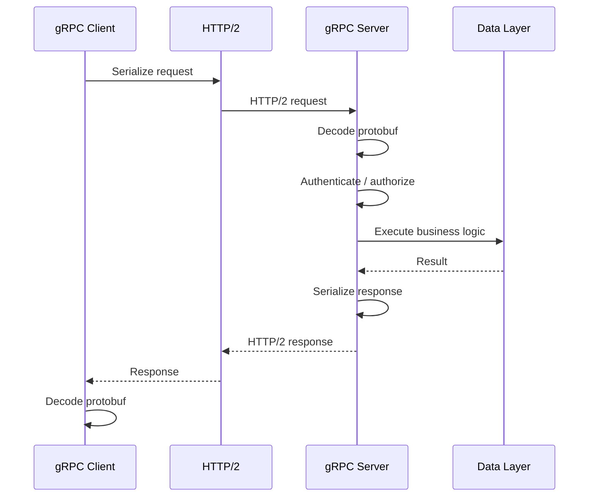
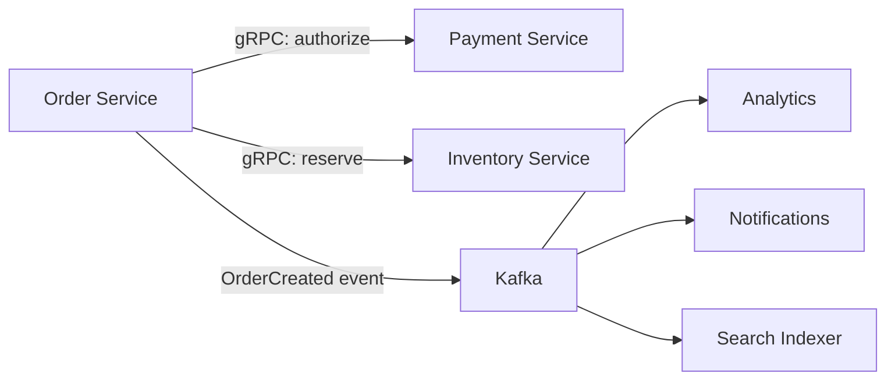
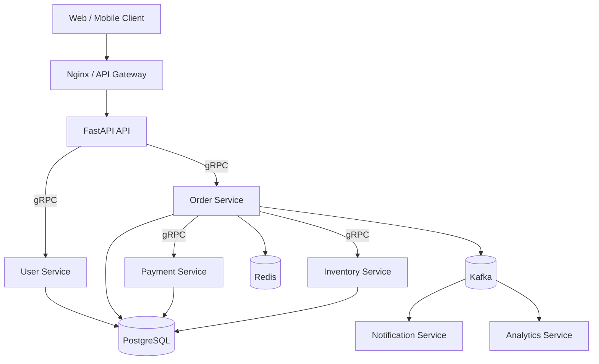

# 10- gRPC

## Overview

gRPC is a high-performance remote procedure call (RPC) framework designed for communication between distributed services.

It is commonly used for service-to-service communication in microservice architectures where services need:

- Strongly typed contracts
- Efficient binary serialization
- Low-latency communication
- Code generation
- Streaming
- Explicit service interfaces
- Deadlines and cancellation
- Built-in metadata propagation

A typical backend architecture may use different protocols for different boundaries:

```text
                         Clients
                            |
                 +----------+----------+
                 |                     |
                 v                     v
              REST API             GraphQL
                 |                     |
                 +----------+----------+
                            |
                       API Gateway
                            |
             +--------------+--------------+
             |              |              |
             v              v              v
       User Service    Order Service   Payment Service
             |              |              |
             +------ gRPC --+------+------+
                                   |
                              Data Services
```

REST is often useful at the external API boundary, while gRPC is frequently a strong choice for internal service-to-service communication.

The important architectural distinction is that gRPC is not simply "REST but faster." It provides a different communication model based on RPC, Protocol Buffers, HTTP/2, generated client/server code, streaming, and explicit service contracts.

---

## Why gRPC Exists

Microservices introduce network boundaries between components that previously communicated through local function calls.

A local function call might look like:

```python
result = payment_service.charge(order_id, amount)
```

When `payment_service` becomes a remote service, the operation becomes:

```text
Application
    |
    | network request
    v
Payment Service
    |
    v
Response
```

This introduces distributed-systems concerns:

- Serialization
- Network latency
- Timeouts
- Retries
- Authentication
- Service discovery
- Connection management
- Partial failure
- Version compatibility
- Observability

gRPC provides infrastructure and conventions for many of these concerns.

---

## RPC Model

RPC allows a remote operation to be represented similarly to a local procedure call.

For example:

```text
Order Service
     |
     | GetCustomer(customer_id)
     v
Customer Service
     |
     v
CustomerResponse
```

The client does not manually construct an arbitrary JSON representation of the request. Instead, both sides share a strongly typed service contract.

A service definition might be:

```protobuf
service CustomerService {
  rpc GetCustomer(GetCustomerRequest) returns (GetCustomerResponse);
}
```

The generated client can then expose a method conceptually similar to:

```python
response = client.GetCustomer(request)
```

The network boundary still exists and must be treated as a distributed-system boundary.

Never assume an RPC call has the reliability characteristics of a local function call.

---

## gRPC Architecture

A typical gRPC system consists of:

```text
              .proto Contract
                    |
          +---------+---------+
          |                   |
          v                   v
     Client Code         Server Code
     Generation           Generation
          |                   |
          v                   v
     gRPC Client          gRPC Server
          |                   |
          +------ HTTP/2 -----+
```

The `.proto` file acts as the source of truth for the service contract.

---

## Protocol Buffers

gRPC commonly uses Protocol Buffers, or Protobuf, as its interface definition and serialization format.

Example:

```protobuf
syntax = "proto3";

package customer.v1;

message GetCustomerRequest {
  string customer_id = 1;
}

message GetCustomerResponse {
  string customer_id = 1;
  string name = 2;
  string email = 3;
}

service CustomerService {
  rpc GetCustomer(GetCustomerRequest) returns (GetCustomerResponse);
}
```

The schema defines:

- Message structures
- Field types
- Field numbers
- Services
- RPC methods
- Request types
- Response types

The schema can then generate client and server code for supported languages.

---

## Why Protocol Buffers Matter

JSON is human-readable:

```json
{
  "customer_id": "cust_123",
  "name": "Aranya"
}
```

Protobuf uses a compact binary representation.

The practical benefits include:

- Smaller payloads
- Faster serialization/deserialization
- Strong typing
- Schema evolution
- Code generation
- Cross-language interoperability

The trade-off is reduced human readability.

For debugging, engineers commonly rely on:

- gRPC tooling
- Structured logs
- Tracing
- Protobuf decoding
- API clients
- Reflection where appropriate

---

## Protobuf Field Numbers

Consider:

```protobuf
message User {
  string id = 1;
  string name = 2;
  string email = 3;
}
```

The numbers are part of the wire format.

They should be treated as stable identifiers.

Do not reuse a field number after removing a field.

Prefer:

```protobuf
message User {
  string id = 1;
  string name = 2;

  reserved 3;
  string phone = 4;
}
```

The `reserved` declaration prevents accidental reuse.

---

## Protobuf Schema Evolution

A production system must support old and new clients simultaneously.

For example:

```text
Version A Client
       |
       v
   New Server
```

and:

```text
New Client
    |
    v
Old Server
```

may temporarily coexist during rolling deployments.

Safe evolution generally includes:

- Adding fields
- Adding new RPC methods
- Adding enum values carefully
- Keeping existing field numbers stable
- Avoiding incompatible type changes
- Reserving removed field numbers
- Maintaining backward compatibility

A schema change should be evaluated as a distributed deployment change, not just a code change.

---

## gRPC Transport

gRPC commonly uses HTTP/2 as its transport.

Conceptually:

```text
Application
    |
    v
gRPC
    |
    v
HTTP/2
    |
    v
TLS / TCP
    |
    v
Network
```

HTTP/2 provides capabilities important to gRPC:

- Multiplexed streams
- Binary framing
- Header compression
- Persistent connections
- Stream-level communication

This allows multiple RPCs to share a connection.

---

## HTTP/2 Multiplexing

With HTTP/1.1, multiple requests may require separate connections or connection management strategies.

HTTP/2 allows multiple streams over a single TCP connection.

```text
TCP Connection
      |
      +--> Stream 1: GetUser
      |
      +--> Stream 2: GetOrder
      |
      +--> Stream 3: GetProduct
      |
      +--> Stream 4: GetPayment
```

This reduces connection-management overhead.

However, HTTP/2 still runs over TCP, so packet loss can affect the connection's transport behavior.

For workloads that benefit from QUIC and UDP-based transport, HTTP/3 introduces a different transport model, but that is separate from standard gRPC-over-HTTP/2 deployments.

---

## gRPC Request Lifecycle

A unary RPC generally follows this flow:



The network call introduces latency and failure modes at every boundary.

---

## gRPC Service Definition

A production service contract should represent domain operations rather than database operations.

Good:

```protobuf
service PaymentService {
  rpc AuthorizePayment(AuthorizePaymentRequest)
      returns (AuthorizePaymentResponse);

  rpc CapturePayment(CapturePaymentRequest)
      returns (CapturePaymentResponse);
}
```

Less desirable:

```protobuf
service PaymentService {
  rpc InsertPayment(InsertPaymentRequest)
      returns (Payment);

  rpc UpdatePayment(UpdatePaymentRequest)
      returns (Payment);
}
```

The first design expresses business capabilities.

The second leaks persistence semantics into the service contract.

---

## Unary RPC

Unary RPC is the simplest model.

```text
Client
  |
  | Request
  v
Server
  |
  | Response
  v
Client
```

Example:

```protobuf
rpc GetOrder(GetOrderRequest) returns (GetOrderResponse);
```

Use unary RPC when one request produces one response and streaming is unnecessary.

This is the most common model for ordinary microservice operations.

---

## Server Streaming

Server streaming allows one request to produce multiple responses.

```text
Client
  |
  | Request
  v
Server
  |
  +--> Response 1
  |
  +--> Response 2
  |
  +--> Response 3
  |
  +--> Response N
```

Example:

```protobuf
rpc ListOrders(ListOrdersRequest)
    returns (stream Order);
```

This can be useful for:

- Large result sets
- Progress updates
- Event streams
- Long-running operations

Streaming should still be bounded and monitored.

---

## Client Streaming

Client streaming allows the client to send multiple messages.

```text
Client
  |
  +--> Request 1
  +--> Request 2
  +--> Request 3
  +--> Request N
               |
               v
             Server
               |
               v
            Response
```

Example:

```protobuf
rpc UploadData(stream DataChunk)
    returns (UploadResult);
```

This is useful for:

- Large uploads
- Batch ingestion
- Streaming telemetry
- Incremental data processing

---

## Bidirectional Streaming

Both sides can independently send messages.

```text
Client                    Server
  |                         |
  |------ message --------->|
  |<----- message ----------|
  |------ message --------->|
  |<----- message ----------|
  |<----- message ----------|
  |------ message --------->|
```

Example:

```protobuf
rpc Chat(stream ChatMessage)
    returns (stream ChatMessage);
```

This can support:

- Real-time communication
- Interactive streams
- Bidirectional data pipelines
- Stateful streaming workflows

Bidirectional streaming significantly increases operational complexity.

---

## gRPC Streaming Comparison

| RPC Type | Client Messages | Server Messages | Typical Use |
|---|---:|---:|---|
| Unary | 1 | 1 | Normal service calls |
| Server streaming | 1 | Many | Large/continuous results |
| Client streaming | Many | 1 | Upload/aggregation |
| Bidirectional | Many | Many | Interactive streams |

---

## gRPC Status Codes

gRPC uses its own standardized status model.

Common statuses include:

| Status | Meaning |
|---|---|
| `OK` | Successful operation |
| `INVALID_ARGUMENT` | Invalid request |
| `NOT_FOUND` | Resource does not exist |
| `ALREADY_EXISTS` | Resource already exists |
| `PERMISSION_DENIED` | Caller lacks permission |
| `UNAUTHENTICATED` | Authentication missing/invalid |
| `RESOURCE_EXHAUSTED` | Capacity or quota exceeded |
| `FAILED_PRECONDITION` | System state prevents operation |
| `ABORTED` | Operation aborted |
| `DEADLINE_EXCEEDED` | Deadline exceeded |
| `UNAVAILABLE` | Service temporarily unavailable |
| `INTERNAL` | Internal server error |

Status codes should communicate meaningful failure semantics.

---

## Status Codes and Retryability

Not every failure should be retried.

For example:

```text
INVALID_ARGUMENT
```

is normally not retryable.

Whereas:

```text
UNAVAILABLE
```

may be transient and potentially retryable.

A retry policy should therefore distinguish:

```text
Transient failure
vs
Permanent failure
```

Blindly retrying every error can amplify outages.

---

## Deadlines

Every production RPC should generally have a bounded deadline.

Conceptually:

```text
Client
  |
  | deadline = 500 ms
  v
Service A
  |
  | deadline propagation
  v
Service B
  |
  | deadline propagation
  v
Database
```

Without deadlines:

```text
Service A
   |
   v
Service B
   |
   v
Service C
   |
   v
Database
```

a slow downstream service can hold resources indefinitely.

A deadline should represent the maximum useful time for the operation.

---

## Deadline Propagation

Consider:

```text
Client
  |
  | 1 second remaining
  v
Order Service
  |
  | 800 ms remaining
  v
Payment Service
  |
  | 600 ms remaining
  v
Payment Provider
```

Passing the remaining deadline downstream prevents a service from starting work that cannot complete within the caller's deadline.

This is especially important in deep microservice call graphs.

---

## Cancellation

If the caller no longer needs the result, downstream work should be cancelled where possible.

Example:

```text
Client
  |
  | request
  v
Service A
  |
  v
Service B
  |
  X client disconnects
```

If Service A continues executing expensive work indefinitely, resources are wasted.

Cancellation propagation helps release:

- CPU
- Database connections
- HTTP connections
- Memory
- Worker capacity

---

## Retries

Retries can improve availability for transient failures.

However:

```text
Client
  |
  | request
  v
Service A
  |
  | retry
  v
Service B
```

can become dangerous during an outage.

If 1,000 clients retry 3 times:

```text
1,000 original requests
+
3,000 retry attempts
=
4,000 requests
```

This can produce a retry storm.

---

## Retry Best Practices

Use:

- Exponential backoff
- Jitter
- Maximum retry attempts
- Retryable status codes
- Deadlines
- Circuit-breaking or load-shedding strategies
- Idempotency where required

Conceptually:

```text
Attempt 1 -> immediate
Attempt 2 -> backoff
Attempt 3 -> longer backoff
Attempt 4 -> stop
```

Jitter prevents many clients from retrying simultaneously.

---

## Idempotency

Retries become dangerous when operations have side effects.

For example:

```protobuf
rpc ChargePayment(ChargePaymentRequest)
    returns (ChargePaymentResponse);
```

If the client does not receive the response and retries:

```text
Attempt 1 -> payment succeeds
Response lost
Attempt 2 -> payment succeeds again
```

The customer may be charged twice.

An idempotency key can prevent this.

```protobuf
message ChargePaymentRequest {
  string payment_id = 1;
  string idempotency_key = 2;
  int64 amount_minor = 3;
}
```

The server stores the result associated with the key and returns the same logical result for duplicate requests.

---

## gRPC Metadata

Metadata is used to transport request context.

Examples include:

```text
authorization
traceparent
request-id
tenant-id
user-agent
```

Conceptually:

```text
RPC
 |
 +--> Metadata
 |      |
 |      +--> Authentication
 |      +--> Trace Context
 |      +--> Tenant Context
 |
 +--> Request Message
```

Metadata should not be treated as an unrestricted data channel.

Avoid putting large payloads into metadata.

---

## Authentication

Production gRPC services commonly use TLS and authenticated identity.

Possible approaches include:

- mTLS
- OAuth2 access tokens
- JWT-based credentials
- AWS identity mechanisms
- Service mesh identity

For internal services, mTLS is particularly useful when service identity matters.

---

## Authorization

Authentication answers:

```text
Who is calling?
```

Authorization answers:

```text
What is this caller allowed to do?
```

A service should validate authorization for each operation.

For example:

```text
OrderService.CancelOrder
       |
       +--> authenticated?
       |
       +--> correct tenant?
       |
       +--> authorized role?
       |
       +--> order belongs to tenant?
       |
       v
    Execute
```

Do not rely exclusively on the upstream gateway for authorization.

Defense in depth is important for internal service boundaries.

---

## TLS and mTLS

TLS encrypts traffic between services.

mTLS additionally authenticates both sides.

```text
Client Service                  Server Service
      |                               |
      |<------ TLS handshake -------->|
      |                               |
      |<---- mutual identity -------->|
      |                               |
      |======= encrypted RPC ========>|
```

mTLS is useful when:

- Service identity matters
- Internal traffic must be authenticated
- Zero-trust networking is desired
- Kubernetes service-to-service traffic requires strong identity

Certificate rotation must be automated.

---

## gRPC Through Kubernetes

A common deployment model is:

```text
                    Kubernetes Cluster
                           |
             +-------------+-------------+
             |                           |
             v                           v
       Order Service               Payment Service
          Pods                          Pods
             |                           |
             +-------- gRPC -------------+
```

Kubernetes Services provide stable service discovery.

For example:

```text
payment-service.default.svc.cluster.local
```

The gRPC client connects to the service rather than a specific pod.

This allows pods to scale and be replaced independently.

---

## Load Balancing

gRPC's long-lived HTTP/2 connections change load-balancing behavior.

A naive setup can cause:

```text
Client
  |
  | persistent connection
  v
Pod A
```

with many RPCs staying on Pod A even after Pod B becomes available.

This can produce uneven load distribution.

Possible approaches include:

- Client-side load balancing
- Proxy-based load balancing
- Service mesh
- Appropriate connection management
- DNS-based discovery where suitable

Load balancing should be evaluated together with connection lifetime.

---

## gRPC and Nginx

Nginx can proxy gRPC traffic when configured appropriately.

Conceptually:

```text
Client
  |
  v
Nginx
  |
  | HTTP/2 / gRPC
  v
gRPC Server
```

Example configuration:

```nginx
server {
    listen 443 ssl http2;

    ssl_certificate /etc/nginx/tls/server.crt;
    ssl_certificate_key /etc/nginx/tls/server.key;

    location / {
        grpc_pass grpc://grpc_backend;
    }
}
```

The exact TLS and HTTP/2 configuration should match the deployed Nginx version and architecture.

Do not assume a normal HTTP reverse-proxy configuration automatically supports gRPC correctly.

---

## gRPC and Python

Python supports gRPC through the `grpcio` ecosystem.

A typical project might contain:

```text
service/
├── proto/
│   └── customer.proto
├── generated/
│   ├── customer_pb2.py
│   └── customer_pb2_grpc.py
├── server.py
├── client.py
└── requirements.txt
```

Typical dependencies:

```text
grpcio
grpcio-tools
```

The generated files should normally be treated as build artifacts derived from `.proto` contracts.

---

## Generating Python Code

A typical command is:

```bash
python -m grpc_tools.protoc \
  -I./proto \
  --python_out=./generated \
  --grpc_python_out=./generated \
  ./proto/customer.proto
```

The exact generated import structure depends on the package layout and toolchain configuration.

In production, generation should be deterministic and integrated into CI/CD rather than manually performed on developer machines.

---

## Python Server Example

A simplified synchronous Python server can look like:

```python
from concurrent import futures

import grpc

import customer_pb2
import customer_pb2_grpc


class CustomerService(customer_pb2_grpc.CustomerServiceServicer):
    def GetCustomer(self, request, context):
        if not request.customer_id:
            context.abort(
                grpc.StatusCode.INVALID_ARGUMENT,
                "customer_id is required",
            )

        return customer_pb2.GetCustomerResponse(
            customer_id=request.customer_id,
            name="Example Customer",
            email="customer@example.com",
        )


def serve() -> None:
    server = grpc.server(
        futures.ThreadPoolExecutor(max_workers=16)
    )

    customer_pb2_grpc.add_CustomerServiceServicer_to_server(
        CustomerService(),
        server,
    )

    server.add_insecure_port("[::]:50051")
    server.start()
    server.wait_for_termination()


if __name__ == "__main__":
    serve()
```

For production deployments, use TLS, authentication, bounded resource settings, structured logging, health checking, and appropriate concurrency configuration.

---

## Python Client Example

A synchronous client can look like:

```python
import grpc

import customer_pb2
import customer_pb2_grpc


def get_customer(customer_id: str):
    with grpc.insecure_channel("localhost:50051") as channel:
        client = customer_pb2_grpc.CustomerServiceStub(channel)

        request = customer_pb2.GetCustomerRequest(
            customer_id=customer_id
        )

        return client.GetCustomer(
            request,
            timeout=1.0,
        )


if __name__ == "__main__":
    response = get_customer("cust_123")
    print(response)
```

Production clients should use secure channels and centralized policies for:

- Timeouts
- Retries
- Credentials
- Service discovery
- Observability
- Error handling

---

## Async Python

Python applications using FastAPI or other ASGI frameworks may benefit from asynchronous gRPC clients.

Conceptually:

```text
FastAPI Request
      |
      v
Async gRPC Client
      |
      v
Remote Service
```

This avoids unnecessarily blocking the event loop while waiting for network I/O.

For async applications, ensure the entire request path respects async execution patterns.

Avoid calling blocking gRPC operations directly from an async event loop.

---

## gRPC and FastAPI

A common architecture is:

```text
External Client
      |
      v
FastAPI REST API
      |
      | gRPC
      v
Internal Services
      |
      +--> User Service
      +--> Order Service
      +--> Payment Service
```

This is a practical hybrid model.

FastAPI can provide:

```text
HTTP/JSON
```

at the public boundary while gRPC provides:

```text
HTTP/2 + Protobuf
```

between internal services.

---

## gRPC and Django

Django can consume gRPC services from application code.

For example:

```text
Django
  |
  +--> PostgreSQL
  |
  +--> Redis
  |
  +--> gRPC Client
          |
          v
      User Service
```

Avoid creating a new gRPC connection for every Django request when the client library and architecture allow reusable channels.

Connection reuse reduces connection establishment overhead.

---

## gRPC Health Checking

Production service infrastructure should expose health information.

gRPC defines a standard health checking protocol that can be integrated into service infrastructure.

Conceptually:

```text
Load Balancer
      |
      | Health Check
      v
gRPC Server
      |
      +--> Serving
      +--> Not Serving
```

Health should represent actual readiness.

A service should not report healthy if it has started listening but cannot perform required dependencies safely.

---

## Readiness vs Liveness

In Kubernetes:

```text
Liveness
```

answers:

```text
Is the process alive?
```

while:

```text
Readiness
```

answers:

```text
Should this instance receive traffic?
```

For example:

```text
Process alive
+
database unavailable
=
alive but possibly not ready
```

Do not make liveness checks depend on every downstream dependency.

Otherwise a temporary database outage can cause Kubernetes to restart every service instance unnecessarily.

---

## gRPC Keepalive

Long-lived connections can become stale due to:

- Load balancers
- NAT devices
- Firewalls
- Proxies
- Network idle timeouts

Keepalive mechanisms can detect broken connections.

However, overly aggressive keepalive settings can generate unnecessary network traffic and trigger server-side enforcement limits.

Tune keepalive based on:

```text
Infrastructure idle timeouts
+
Connection lifetime
+
Expected traffic
+
Server capacity
```

---

## Streaming Operational Concerns

Streaming RPCs require additional controls.

Consider:

- Maximum stream duration
- Maximum message size
- Backpressure
- Flow control
- Cancellation
- Idle timeouts
- Connection limits
- Memory usage

A client that continuously streams data can consume server resources indefinitely.

Streaming should therefore be treated as a long-lived resource.

---

## Message Size

gRPC supports configurable message-size limits.

Do not assume that larger messages are always better.

Large messages increase:

- Memory usage
- Serialization cost
- Network latency
- Garbage collection pressure
- Failure impact

Prefer:

```text
Pagination
Streaming
Chunking
Dedicated object storage
```

when transferring very large datasets.

For example, uploading a multi-gigabyte file through a single protobuf message is generally a poor design.

---

## gRPC vs REST

| Characteristic | gRPC | REST |
|---|---|---|
| Primary model | RPC | Resource-oriented HTTP |
| Common serialization | Protobuf | JSON |
| Transport | HTTP/2 commonly | HTTP/1.1 or HTTP/2 |
| Schema | Protobuf | OpenAPI commonly |
| Code generation | Strong | Optional |
| Browser support | More complex | Excellent |
| Streaming | First-class | Separate mechanisms |
| Payload size | Generally compact | Generally larger |
| Human readability | Lower | High |
| Service-to-service use | Excellent | Excellent |
| Public API compatibility | Depends | Excellent |
| Tooling | Strong | Very broad |
| Operational complexity | Higher | Lower |

---

## gRPC vs GraphQL

GraphQL and gRPC solve different problems.

| Characteristic | gRPC | GraphQL |
|---|---|---|
| Primary purpose | Service-to-service RPC | Flexible client API |
| Contract | Protobuf | GraphQL schema |
| Query shape | Server-defined RPC | Client-selected |
| Serialization | Protobuf | Commonly JSON |
| Streaming | Strong | Usually via subscriptions |
| Browser usage | Less direct | Excellent |
| Internal microservices | Excellent | Possible |
| Client-driven data composition | Limited | Excellent |
| Generated clients | Strong | Available |
| Query complexity | Usually predictable | Potentially arbitrary |

A common architecture is:

```text
Frontend
   |
   +--> REST / GraphQL
           |
           v
      Backend Services
           |
           +--> gRPC
           |
           +--> Kafka
           |
           +--> PostgreSQL
```

---

## gRPC vs Message Queues

gRPC is primarily request/response or streaming communication.

Kafka is primarily event streaming.

Celery is commonly used for asynchronous task execution.

```text
gRPC
  |
  +--> "Give me customer 123"

Kafka
  |
  +--> "Customer 123 was updated"

Celery
  |
  +--> "Process this background task"
```

Choosing between them depends on communication semantics rather than raw performance.

---

## gRPC and Kafka Together

A microservice can use gRPC for synchronous operations and Kafka for asynchronous events.



This separates:

```text
Synchronous request path
```

from:

```text
Asynchronous event propagation
```

---

## Service Discovery

gRPC clients need to locate the target service.

Common mechanisms include:

- Kubernetes DNS
- AWS Cloud Map
- DNS
- Service mesh
- Client-side discovery
- Load balancers

For example:

```text
order-service
      |
      v
payment-service.default.svc.cluster.local
```

The client should not hard-code individual pod IP addresses.

---

## High Availability

A production gRPC service should normally run multiple instances.

```text
                  Load Balancer
                       |
          +------------+------------+
          |            |            |
          v            v            v
        Pod A        Pod B        Pod C
```

Important considerations include:

- Multiple availability zones
- Connection draining
- Readiness checks
- Graceful shutdown
- Load balancing
- Retry policies
- Capacity limits

---

## Graceful Shutdown

A gRPC server should not immediately terminate active RPCs during deployment.

A better sequence is:

```text
Deployment starts
      |
      v
Stop accepting new traffic
      |
      v
Mark instance not ready
      |
      v
Drain active RPCs
      |
      v
Wait for grace period
      |
      v
Terminate process
```

This is particularly important for streaming RPCs.

---

## Graceful Shutdown in Kubernetes

A robust deployment should account for:

```text
readiness transition
+
termination grace period
+
connection draining
+
in-flight RPC completion
```

Otherwise rolling deployments can produce transient `UNAVAILABLE` errors.

---

## Circuit Breaking

If a downstream service is unhealthy:

```text
Service A
   |
   v
Service B
   X
```

Service A should not continuously send unlimited requests to Service B.

Circuit-breaking or load-shedding mechanisms can transition between states such as:

```text
Closed
  |
  | failures exceed threshold
  v
Open
  |
  | recovery period
  v
Half Open
  |
  +--> success -> Closed
  |
  +--> failure -> Open
```

The exact mechanism depends on the gRPC stack and surrounding infrastructure.

---

## Backpressure

Streaming systems require backpressure.

Without it:

```text
Producer
  |
  | fast
  v
Buffer
  |
  | slow consumer
  v
Memory exhaustion
```

A healthy streaming design limits:

- Buffer size
- Message size
- Producer rate
- Concurrent streams
- Outstanding work

Backpressure is a reliability mechanism, not merely a performance optimization.

---

## Database Interaction

gRPC does not eliminate database bottlenecks.

For example:

```text
1,000 gRPC requests/sec
       |
       v
1,000 database operations/sec
```

may overload PostgreSQL even if the gRPC layer handles the traffic easily.

Use:

- Connection pooling
- Efficient queries
- Indexing
- Caching
- Batching
- Read replicas where appropriate
- Appropriate transaction boundaries

Measure the entire request path.

---

## Observability

Production gRPC systems should expose:

```text
Request count
Latency
Status code
Payload size
Active streams
Connection count
Retries
Timeouts
Cancellations
Downstream latency
```

Useful metrics include:

```text
grpc_server_handled_total
grpc_server_handling_seconds
grpc_client_handled_total
grpc_client_handling_seconds
```

Exact metric names depend on the language and instrumentation library.

---

## Distributed Tracing

A distributed request may look like:

```text
API Gateway
    |
    v
Order Service
    |
    +--> Customer Service
    |
    +--> Payment Service
    |
    +--> Inventory Service
```

Trace context should propagate across gRPC metadata.

A single trace can then expose:

```text
Total request: 420 ms

Order Service:      50 ms
Customer Service:   20 ms
Payment Service:   250 ms
Inventory Service:  80 ms
```

This makes latency attribution much easier.

---

## Logging

Log structured information such as:

```text
service
method
request_id
trace_id
status
duration
peer_service
error_type
```

Example:

```json
{
  "service": "order-service",
  "method": "CreateOrder",
  "status": "OK",
  "duration_ms": 42,
  "trace_id": "abc123"
}
```

Avoid logging:

- Authentication tokens
- Secrets
- Full sensitive payloads
- Personal data unless justified

---

## Deployment Considerations

A production gRPC deployment should account for:

| Area | Consideration |
|---|---|
| TLS | Encrypt service traffic |
| Discovery | Resolve services dynamically |
| Load balancing | Distribute long-lived connections |
| Timeouts | Bound request lifetime |
| Retries | Retry only safe transient failures |
| Idempotency | Protect side-effecting operations |
| Health checks | Separate readiness and liveness |
| Shutdown | Drain active RPCs |
| Observability | Metrics, logs, tracing |
| Schema | Manage compatibility |
| Resource limits | Bound CPU/memory/connections |
| Streaming | Enforce duration and size limits |

---

## CI/CD and Protobuf Contracts

`.proto` files should be treated as production API contracts.

A CI pipeline can validate:

```text
.proto change
     |
     v
Lint
     |
     v
Breaking-change detection
     |
     v
Generate clients
     |
     v
Unit tests
     |
     v
Integration tests
     |
     v
Build
     |
     v
Deploy
```

This prevents accidental contract changes from reaching production.

Generated code should be reproducible from the source `.proto` files.

---

## Contract Testing

For service-to-service APIs, test both:

```text
Client expectations
```

and:

```text
Server implementation
```

Contract tests can catch:

- Removed fields
- Changed semantics
- Incorrect status handling
- Incompatible schema changes
- Incorrect message expectations

A protobuf schema compiling successfully does not guarantee that the business behavior remains compatible.

---

## Performance Considerations

gRPC can reduce serialization and transport overhead, but performance depends on the entire architecture.

Measure:

```text
Serialization time
+
Network latency
+
Server processing
+
Database latency
+
Downstream RPC latency
```

Do not choose gRPC solely because "Protobuf is faster than JSON."

If the service spends 300 ms waiting for PostgreSQL, shaving 0.2 ms from serialization is unlikely to matter.

---

## Cost Considerations

gRPC can reduce network bandwidth through compact Protobuf payloads and connection reuse.

Potential savings include:

- Lower network transfer
- Reduced serialization overhead
- Fewer repeated connection handshakes
- Efficient streaming

However, operational costs can increase due to:

- More complex tooling
- Debugging requirements
- Schema management
- Specialized observability
- Load-balancing requirements
- Streaming infrastructure

Optimize for total engineering cost, not just network cost.

---

## Common Mistakes and Pitfalls

### Treating gRPC Calls as Local Function Calls

Remote calls can fail, timeout, or become slow.

Always design around network failure.

### No Deadline

A request without a deadline can consume resources indefinitely.

### Retrying Everything

Retries can amplify outages.

### No Idempotency

Retries of side-effecting operations can duplicate effects.

### Reusing Protobuf Field Numbers

This can corrupt compatibility assumptions.

### Huge Protobuf Messages

Large messages create memory and latency problems.

### Ignoring Load Balancing

Long-lived HTTP/2 connections can create uneven distribution.

### Blocking Async Applications

Blocking gRPC calls inside an async event loop can reduce application concurrency.

### No Graceful Shutdown

Deployments can terminate active RPCs unexpectedly.

### Treating Internal Services as Trusted

Internal networks still require authentication and authorization.

### Ignoring Streaming Resource Limits

Long-lived streams can consume resources indefinitely.

### No Observability

Without tracing and resolver-like RPC instrumentation, distributed latency becomes difficult to diagnose.

---

## Production Architecture Example

A realistic Python microservice architecture might look like:



The synchronous path uses gRPC:

```text
API
 |
 +--> Order
        |
        +--> Payment
        |
        +--> Inventory
```

The asynchronous path uses Kafka:

```text
Order
  |
  v
Kafka
  |
  +--> Notifications
  +--> Analytics
```

This separation prevents every downstream operation from becoming part of the synchronous request latency.

---

## gRPC Production Checklist

- [ ] Define `.proto` contracts explicitly.
- [ ] Use stable protobuf field numbers.
- [ ] Reserve removed field numbers.
- [ ] Validate schema compatibility in CI/CD.
- [ ] Generate clients and servers deterministically.
- [ ] Use TLS in production.
- [ ] Use mTLS where service identity requires it.
- [ ] Authenticate requests.
- [ ] Authorize operations independently.
- [ ] Set deadlines on RPCs.
- [ ] Propagate deadlines downstream.
- [ ] Propagate cancellation.
- [ ] Retry only appropriate transient failures.
- [ ] Use exponential backoff and jitter.
- [ ] Design side-effecting RPCs for idempotency.
- [ ] Configure service discovery.
- [ ] Configure appropriate load balancing.
- [ ] Monitor long-lived connection distribution.
- [ ] Implement health checking.
- [ ] Separate readiness from liveness.
- [ ] Gracefully drain connections during deployment.
- [ ] Bound message sizes.
- [ ] Bound streaming duration and concurrency.
- [ ] Implement backpressure for streaming.
- [ ] Monitor active streams.
- [ ] Add structured logging.
- [ ] Propagate distributed tracing context.
- [ ] Monitor latency by RPC method.
- [ ] Monitor status codes.
- [ ] Monitor retry and timeout rates.
- [ ] Use connection pooling appropriately.
- [ ] Load-test realistic RPC workloads.
- [ ] Test backward and forward compatibility.
- [ ] Avoid leaking sensitive metadata or payloads.
- [ ] Document operational behavior for every critical RPC.

---

## Interview Traps

### Is gRPC Faster Than REST?

It can be more efficient for many service-to-service workloads because of Protobuf, HTTP/2, multiplexing, and generated clients, but application performance depends on the complete request path.

### Does gRPC Use HTTP?

Yes. Standard gRPC commonly uses HTTP/2 as its transport.

### Why HTTP/2?

HTTP/2 provides multiplexed streams, persistent connections, binary framing, and other capabilities useful for RPC communication.

### Why Protobuf?

It provides a compact, strongly typed, schema-driven binary representation with code generation and controlled schema evolution.

### Does gRPC Replace Kafka?

No.

gRPC is primarily synchronous RPC communication, while Kafka is an event-streaming platform.

### Does gRPC Replace REST?

Not necessarily.

REST remains highly suitable for public APIs, browser clients, simple resource APIs, and integrations.

### What Happens When a gRPC Call Times Out?

The caller receives a deadline-related failure, and the application should decide whether to retry, fail, degrade, or propagate the error.

### Should Every gRPC Call Be Retried?

No.

Only appropriately classified transient failures should be retried, and retries require bounded attempts, backoff, deadlines, and consideration of idempotency.

### Why Is Idempotency Important?

A lost response does not necessarily mean the server failed to perform the operation. Retrying a non-idempotent operation can therefore duplicate side effects.

### What Is the Difference Between Unary and Streaming RPC?

Unary RPC sends one request and receives one response. Streaming RPC allows one or both directions to exchange multiple messages over a persistent RPC.

### Why Are Deadlines Important?

Without deadlines, slow or unavailable downstream services can retain resources indefinitely and cause cascading failures.

### Does gRPC Automatically Provide Service Discovery?

No.

Service discovery comes from infrastructure such as Kubernetes DNS, DNS, service meshes, cloud discovery systems, or custom client-side mechanisms.

### Does gRPC Automatically Load Balance Requests?

Not universally.

Load balancing depends on the gRPC client, proxy, service mesh, DNS behavior, or infrastructure configuration.

### Why Can gRPC Connections Cause Uneven Load?

HTTP/2 multiplexes many RPCs over persistent connections. If a connection remains attached to one backend instance, many RPCs can remain concentrated on that instance.

### Is gRPC Suitable for Browser Applications?

Native browser access to standard gRPC is more constrained than ordinary HTTP/JSON APIs. gRPC-Web or another browser-compatible interface may be appropriate.

---

## Key Takeaways

- gRPC is a strongly typed RPC framework commonly used for efficient service-to-service communication, using Protocol Buffers and HTTP/2 as core building blocks.
- The `.proto` contract is a distributed API contract; field numbers, schema evolution, backward compatibility, and generated code must be managed through disciplined CI/CD practices.
- Production gRPC requires explicit distributed-systems controls such as deadlines, cancellation, retry policies, idempotency, authentication, authorization, load balancing, health checks, and graceful shutdown.
- gRPC is especially effective for synchronous microservice communication, while REST, GraphQL, Kafka, and Celery can remain appropriate at other architectural boundaries.
- Performance comes from the complete system design, not merely Protobuf or HTTP/2; database latency, downstream dependencies, connection management, concurrency, and observability remain critical.