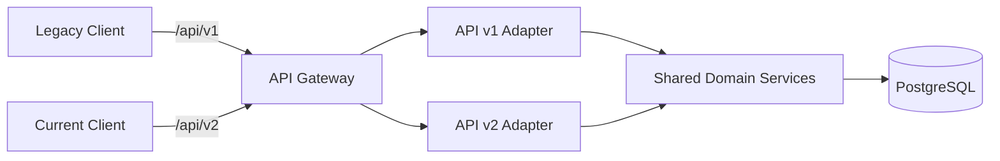
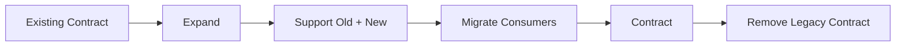

# 11- API Versioning

## Overview

API versioning is the mechanism used to evolve an API contract without unexpectedly breaking existing consumers.

A production API rarely remains static. Over time, backend teams need to:

- Add new fields
- Rename or remove fields
- Change validation rules
- Change response structures
- Introduce new business behavior
- Deprecate obsolete functionality
- Change authentication or authorization behavior
- Support multiple client generations

The architectural challenge is not simply creating `/v2`. The real challenge is managing **contract evolution across independently deployed systems**.

Consider:

```text
Mobile App v1 ────────┐
Web Client ───────────┤
Partner Integration ──┤
                       v
                 API Gateway
                       |
             +---------+---------+
             |                   |
             v                   v
          API v1              API v2
             |                   |
             +---------+---------+
                       |
                 Domain Services
                       |
                    Database
```

A good versioning strategy allows old clients to continue operating while newer clients migrate to an evolved contract.

API versioning is therefore a combination of:

- Contract design
- Compatibility management
- Deployment strategy
- Consumer migration
- Deprecation policy
- Observability
- Documentation
- Operational governance

---

## Why API Versioning Exists

An API is a contract between producers and consumers.

For example:

```http
GET /api/users/123
```

might initially return:

```json
{
  "id": 123,
  "name": "Alice"
}
```

Suppose a new implementation changes the response to:

```json
{
  "user": {
    "identifier": 123,
    "display_name": "Alice"
  }
}
```

A client expecting:

```python
response["name"]
```

will fail.

The backend may consider the new response cleaner, but the consumer experiences a breaking change.

Versioning creates an explicit compatibility boundary:

```text
Existing consumers
       |
       v
     API v1
       |
       | stable contract
       |
       +--------------------+
                            |
New consumers              |
       |                    |
       v                    |
     API v2                 |
       |                    |
       +--------------------+
```

The goal is not to version every small implementation change. The goal is to isolate **breaking contract changes**.

---

## What Constitutes a Breaking Change?

A breaking change is any change that can cause an existing valid client to stop working correctly.

Common examples include:

| Change | Usually Breaking? | Reason |
|---|---:|---|
| Add optional response field | No | Existing clients can ignore it |
| Add optional request field | No | Existing clients can omit it |
| Remove response field | Yes | Clients may depend on it |
| Rename response field | Yes | Existing clients may reference old name |
| Change field type | Yes | Client parsing may fail |
| Make optional request field required | Yes | Existing requests become invalid |
| Remove enum value | Yes | Clients may depend on it |
| Change authentication semantics | Potentially | Existing clients may fail |
| Change pagination semantics | Potentially | Client behavior may change |
| Change error format | Potentially | Clients may parse errors |
| Add a new endpoint | No | Existing consumers unaffected |
| Improve internal implementation | No | Contract remains unchanged |

The key question is:

> Can an existing valid consumer continue to operate correctly without modification?

If not, treat the change as breaking.

---

## Backward Compatibility

Backward compatibility means newer server implementations continue supporting older clients.

```text
Old Client
    |
    v
New Server
    |
    v
Compatible behavior
```

For example:

```text
Client v1
    |
    | GET /api/v1/orders/123
    v
Server
    |
    +--> supports v1
    |
    +--> supports v2
```

Backward compatibility is especially important when clients cannot be upgraded atomically.

Examples include:

- Mobile applications
- Public APIs
- Third-party integrations
- IoT devices
- Long-lived enterprise clients
- Independently deployed microservices

---

## Forward Compatibility

Forward compatibility is the ability of an older consumer to tolerate changes introduced by newer producers.

This is harder to guarantee.

For example, if a response gains an optional field:

```json
{
  "id": 123,
  "name": "Alice",
  "timezone": "Asia/Kolkata"
}
```

a client that ignores unknown fields can continue operating.

Forward compatibility is therefore strongly influenced by client implementation quality.

---

## Compatibility Strategy

A robust API evolution strategy generally follows:

```text
Stable contract
      |
      v
Add compatible capability
      |
      v
Observe adoption
      |
      v
Introduce new contract if required
      |
      v
Migrate consumers
      |
      v
Deprecate old contract
      |
      v
Remove old contract
```

Versioning should be part of the API lifecycle rather than something introduced only after breaking changes occur.

---

## API Versioning Strategies

Common approaches include:

- URI/path versioning
- Query parameter versioning
- Header versioning
- Media-type/content-negotiation versioning
- Host/subdomain versioning

There is no universally correct strategy.

The important requirement is consistency.

---

## URI Versioning

The version appears in the URL.

Examples:

```http
GET /api/v1/users/123
GET /api/v2/users/123
```

or:

```http
GET /v1/orders
GET /v2/orders
```

### Advantages

- Easy to understand
- Easy to debug
- Easy to test with curl
- Easy to route through Nginx/API gateways
- Easy to observe in access logs
- Easy to document
- Easy for consumers to discover

### Limitations

- Version becomes part of the resource URL
- URLs can proliferate
- Strict REST purists may argue that the representation version belongs elsewhere

Despite these limitations, URI versioning is often the most operationally straightforward approach for public APIs.

---

## Query Parameter Versioning

The version is provided as a query parameter.

```http
GET /api/users/123?version=1
GET /api/users/123?version=2
```

### Advantages

- Simple to introduce
- URL path remains unchanged
- Easy to route at the application layer

### Limitations

- Less explicit than path versioning
- Query parameters are often associated with filtering and pagination
- Caching systems must include the version in the cache key
- API documentation can become less obvious

A cache must distinguish:

```text
/api/users/123?version=1
```

from:

```text
/api/users/123?version=2
```

Otherwise one representation can be incorrectly served for another.

---

## Header Versioning

The client specifies the API version through a custom header.

Example:

```http
GET /api/users/123
X-API-Version: 2
```

### Advantages

- URL remains stable
- Version is explicit in request metadata
- Can support content negotiation patterns

### Limitations

- Less visible when manually inspecting URLs
- More difficult to test casually
- Cache configuration must account for the header
- Routing infrastructure must preserve the header

If a cache does not vary on the version header, incorrect representations can be served.

---

## Media-Type Versioning

The version is encoded in the `Accept` header.

Example:

```http
GET /api/users/123
Accept: application/vnd.company.user.v2+json
```

The server selects the representation based on the requested media type.

### Advantages

- Strongly aligned with HTTP content negotiation
- Separates resource identity from representation version
- Supports sophisticated representation negotiation

### Limitations

- More complex
- Less discoverable
- More difficult to debug
- Requires careful cache configuration
- Tooling may be less familiar to teams

This approach can be appropriate for mature APIs with strong HTTP semantics expertise.

---

## Host-Based Versioning

The version appears in the hostname.

```text
api.example.com
api-v2.example.com
```

or:

```text
v1.api.example.com
v2.api.example.com
```

### Advantages

- Strong infrastructure boundary
- Easy to route at load balancers
- Can support independently deployed API versions

### Limitations

- More DNS and infrastructure complexity
- More operational overhead
- Client configuration becomes more complicated

Host-based versioning is usually unnecessary for ordinary application APIs.

---

## Versioning Strategy Comparison

| Strategy | Example | Discoverability | Routing | Caching Complexity | Typical Use |
|---|---|---|---|---|---|
| URI | `/v1/users` | Excellent | Easy | Low | Public APIs |
| Query | `/users?version=1` | Good | Easy | Medium | Smaller APIs |
| Header | `X-API-Version: 1` | Medium | Medium | Medium | Internal/mature APIs |
| Media type | `Accept: ...v1+json` | Low | Medium | High | HTTP-focused APIs |
| Host | `v1.api.example.com` | Good | Excellent | Medium | Infrastructure isolation |

For many backend teams, URI versioning provides the best trade-off between simplicity and operational clarity.

---

## URI Versioning in Django REST Framework

A simple DRF structure can separate version-specific URL routes.

```python
from django.urls import include, path

urlpatterns = [
    path("api/v1/", include("api.v1.urls")),
    path("api/v2/", include("api.v2.urls")),
]
```

This creates explicit boundaries:

```text
/api/v1/
/api/v2/
```

A project structure might look like:

```text
api/
├── v1/
│   ├── urls.py
│   ├── serializers.py
│   └── views.py
├── v2/
│   ├── urls.py
│   ├── serializers.py
│   └── views.py
└── domain/
    ├── models.py
    └── services.py
```

The important architectural principle is to avoid duplicating the entire business domain merely because the transport contract changed.

---

## Keep Domain Logic Version-Neutral

A poor architecture looks like:

```text
v1 API
  |
  +--> v1 business logic
  |
  +--> v1 database logic

v2 API
  |
  +--> v2 business logic
  |
  +--> v2 database logic
```

This creates duplicated systems.

A better architecture is:

```text
             API v1
                |
                v
          v1 Adapter
                |
                v
          Domain Layer
                ^
                |
          v2 Adapter
                ^
                |
             API v2
```

Versioning should primarily occur at the **contract/adapter boundary**.

The underlying business logic should remain shared whenever semantics are equivalent.

---

## API Versioning Architecture



This architecture allows:

- Different request schemas
- Different response representations
- Shared business rules
- Shared persistence
- Independent migration of clients

---

## Version-Specific Serializers

Suppose v1 returns:

```json
{
  "id": 123,
  "name": "Alice"
}
```

while v2 returns:

```json
{
  "id": 123,
  "display_name": "Alice",
  "email": "alice@example.com"
}
```

Separate serializers can represent these contracts.

```python
from rest_framework import serializers

from .models import User


class UserV1Serializer(serializers.ModelSerializer):
    class Meta:
        model = User
        fields = ("id", "name")


class UserV2Serializer(serializers.ModelSerializer):
    display_name = serializers.CharField(source="name")

    class Meta:
        model = User
        fields = ("id", "display_name", "email")
```

The database model does not need to change merely because the external representation changed.

---

## Version-Specific Request Schemas

The same principle applies to input contracts.

```text
v1 request
{
  "name": "Alice"
}

v2 request
{
  "display_name": "Alice",
  "email": "alice@example.com"
}
```

Each version can translate its request into a shared domain command:

```text
v1 request ──> v1 adapter ──┐
                            |
v2 request ──> v2 adapter ──┼──> CreateUserCommand
                            |
                            v
                       Domain Service
```

This prevents API-specific semantics from leaking throughout the application.

---

## FastAPI Versioning

FastAPI can expose separate routers.

```python
from fastapi import APIRouter, FastAPI

app = FastAPI()

v1_router = APIRouter(prefix="/api/v1")
v2_router = APIRouter(prefix="/api/v2")


@v1_router.get("/users/{user_id}")
async def get_user_v1(user_id: int):
    return {
        "id": user_id,
        "name": "Alice",
    }


@v2_router.get("/users/{user_id}")
async def get_user_v2(user_id: int):
    return {
        "id": user_id,
        "display_name": "Alice",
        "email": "alice@example.com",
    }


app.include_router(v1_router)
app.include_router(v2_router)
```

For production systems, keep the route handlers thin and delegate to shared application/domain services.

---

## API Versioning and Microservices

Versioning becomes more important when services are independently deployed.

Consider:

```text
Order Service
      |
      | API contract
      v
Payment Service
```

A breaking change to Payment Service can break Order Service during deployment.

A safer migration is:

```text
Payment Service v1
       |
       +--> supports old contract
       |
Payment Service v2
       |
       +--> supports new contract
```

Then migrate consumers gradually.

---

## Contract Evolution Between Microservices

Suppose the old contract is:

```json
{
  "amount": 100
}
```

and the new contract requires:

```json
{
  "amount": 100,
  "currency": "USD"
}
```

Making `currency` mandatory immediately can break old clients.

A safer migration is:

```text
Phase 1
Old server accepts missing currency

Phase 2
New clients begin sending currency

Phase 3
Observe adoption

Phase 4
Enforce currency for migrated clients

Phase 5
Remove legacy behavior
```

This is often more appropriate than creating an entirely separate `/v2` endpoint.

---

## Versioning vs Backward-Compatible Evolution

Not every change requires a new API version.

Prefer compatible evolution when possible.

For example:

```json
{
  "id": 123,
  "name": "Alice",
  "email": "alice@example.com"
}
```

Adding:

```json
"created_at": "2026-08-23T10:30:00Z"
```

does not normally require `/v2` if clients can safely ignore unknown fields.

Creating `/v2` for every additive change causes unnecessary fragmentation.

A useful rule is:

> Version when semantics or compatibility change, not merely because implementation changes.

---

## Versioning REST APIs

For REST APIs, versioning should apply to the **contract**, not necessarily every internal resource.

For example:

```http
GET /api/v1/orders/123
POST /api/v1/orders
PATCH /api/v1/orders/123
```

If the order representation changes incompatibly:

```http
GET /api/v2/orders/123
```

may be appropriate.

However, internal services can often remain version-neutral if the underlying domain contract remains compatible.

---

## Versioning gRPC APIs

gRPC generally handles versioning through Protobuf schema evolution rather than URL paths.

For example:

```protobuf
package payment.v1;

service PaymentService {
  rpc Authorize(AuthorizeRequest)
      returns (AuthorizeResponse);
}
```

A later incompatible service can use:

```protobuf
package payment.v2;

service PaymentService {
  rpc Authorize(AuthorizeRequest)
      returns (AuthorizeResponse);
}
```

However, prefer backward-compatible Protobuf evolution where possible.

Do not introduce a new package simply because you added a compatible field.

---

## Versioning GraphQL

GraphQL typically avoids traditional URL-based API versions.

Instead of:

```text
/graphql/v1
/graphql/v2
```

schema evolution generally uses:

- Additive fields
- Deprecated fields
- Gradual client migration
- Schema introspection
- Field usage monitoring

For example:

```graphql
type User {
  id: ID!
  name: String @deprecated(reason: "Use displayName")
  displayName: String!
}
```

This allows consumers to migrate without creating an entirely separate API version.

---

## API Versioning and Database Migrations

API versioning and database schema versioning are related but different concerns.

Do not assume:

```text
API v2
=
Database v2
```

A mature architecture often uses an expand-and-contract database migration strategy.

```text
Old API
   |
   v
Old + New DB schema
   |
   v
New API
   |
   v
Remove old DB structures
```

For example:

```text
Phase 1:
Add new database column

Phase 2:
Write both old and new representations

Phase 3:
Migrate consumers

Phase 4:
Read new column

Phase 5:
Remove old column
```

This allows rolling deployments without requiring every application instance to update simultaneously.

---

## Expand-and-Contract Pattern

The pattern is useful for both databases and APIs.



Example:

```text
Before:
full_name

Expand:
full_name + first_name + last_name

Migrate:
new clients use first_name / last_name

Contract:
remove full_name
```

This minimizes compatibility gaps during deployment.

---

## Deprecation

Deprecation means:

> The API is still supported, but consumers should migrate away from it.

A mature lifecycle might be:

```text
Active
  |
  v
Deprecated
  |
  v
Sunset announced
  |
  v
Read-only or restricted
  |
  v
Removed
```

Deprecation should be measurable.

Track:

- Request volume
- Consumer identity
- Client version
- Endpoint usage
- Error rates
- Traffic by API version

Do not remove an API simply because the replacement has existed for some arbitrary amount of time.

---

## Deprecation Headers

HTTP APIs can communicate deprecation information through headers.

For example:

```http
Deprecation: true
Sunset: Sat, 31 Jan 2027 00:00:00 GMT
```

The exact deprecation policy should be documented and consistently applied.

The important operational goal is to make consumers aware before removal.

---

## Sunset Strategy

A production sunset process can look like:

```text
Announce v1 deprecation
        |
        v
Document migration path
        |
        v
Measure v1 usage
        |
        v
Contact high-volume consumers
        |
        v
Set sunset date
        |
        v
Monitor remaining traffic
        |
        v
Remove v1
```

For public APIs, give consumers enough time to migrate based on actual release cycles.

---

## API Version Discovery

Consumers should be able to determine:

- Supported versions
- Current version
- Deprecated versions
- Sunset dates
- Migration documentation

For example, API documentation might state:

| Version | Status | Sunset |
|---|---|---|
| v1 | Deprecated | 2027-01-31 |
| v2 | Active | — |

Documentation is part of the API contract.

---

## API Gateway Version Routing

An API gateway can route versions independently.

```text
                         API Gateway
                              |
             +----------------+----------------+
             |                                 |
        /api/v1/*                         /api/v2/*
             |                                 |
             v                                 v
       Backend v1                         Backend v2
```

This can be useful when:

- Versions have materially different infrastructure
- Teams need independent deployment
- Traffic must be shifted gradually
- Legacy systems need isolation

However, avoid pushing all versioning logic into the gateway.

Business-level transformations usually belong in application services.

---

## Nginx Routing Example

A simple Nginx configuration could route different prefixes:

```nginx
location /api/v1/ {
    proxy_pass http://backend_v1;
}

location /api/v2/ {
    proxy_pass http://backend_v2;
}
```

This is useful when the implementations are genuinely separate.

If v1 and v2 share most business logic, application-level routing may be simpler.

---

## Version Routing in Kubernetes

Kubernetes can support separate deployments:

```text
                 Ingress
                    |
          +---------+---------+
          |                   |
        /v1                  /v2
          |                   |
          v                   v
    api-v1 Service      api-v2 Service
          |                   |
       Pods v1              Pods v2
```

This allows independent scaling:

```text
v1 traffic: 20%
v2 traffic: 80%
```

It also enables gradual migration.

---

## Canary Version Migration

A new version can be introduced gradually:

```text
100% v1
   |
   v
95% v1 / 5% v2
   |
   v
75% v1 / 25% v2
   |
   v
25% v1 / 75% v2
   |
   v
100% v2
```

Monitor:

- Latency
- Error rate
- Business metrics
- Dependency failures
- Resource usage
- Consumer-specific failures

Canary deployment is especially useful when v2 changes implementation substantially.

---

## Blue-Green Version Deployment

Another strategy is:

```text
                    Load Balancer
                         |
                 +-------+-------+
                 |               |
              Blue              Green
               v                  v
              v1                  v2
```

Traffic can switch between environments.

This can provide fast rollback but may require additional infrastructure capacity.

---

## Client-Driven Versioning

The client should explicitly select the API contract where possible.

For example:

```http
GET /api/v2/orders/123
```

is preferable to silently changing behavior based on:

```text
User-Agent
```

or:

```text
Client IP
```

Implicit version detection creates hidden routing rules and makes debugging difficult.

---

## Mobile Applications

Mobile applications create a particularly strong versioning requirement.

Consider:

```text
App v1 installed by users
App v2 recently released
App v3 in beta
```

A backend may need to support all three simultaneously.

```text
                 API
                  |
        +---------+---------+
        |         |         |
       v1        v2        v3
        |         |         |
      Users     Users     Beta
```

Unlike web applications, mobile clients cannot always be upgraded immediately.

API compatibility therefore needs to account for the client distribution lifecycle.

---

## Third-Party APIs

Public APIs require even stronger compatibility discipline.

Third-party consumers may have:

- Unknown deployment schedules
- Long migration cycles
- Limited observability
- Different programming languages
- Contract dependencies outside your control

A public API should therefore have:

- Explicit version policy
- Deprecation policy
- Migration documentation
- Changelog
- Usage analytics
- Consumer communication
- Sunset policy

---

## API Versioning and Caching

Versioning affects cache keys.

For URI versioning:

```text
/api/v1/users/123
/api/v2/users/123
```

naturally produce different cache keys in most HTTP caching systems.

For header versioning:

```http
Accept: application/vnd.example.user.v1+json
```

the cache must vary appropriately.

For example:

```http
Vary: Accept
```

may be required when representation depends on `Accept`.

Incorrect cache configuration can cause one API version's representation to be served to another version.

---

## API Versioning and CDNs

CDNs should distinguish versions when the response representation differs.

For example:

```text
/api/v1/products/123
```

and:

```text
/api/v2/products/123
```

should not share an identical cache object unless the representations are guaranteed equivalent.

Version-aware caching is particularly important for:

- CloudFront
- API gateways
- Reverse proxies
- Redis application caches

---

## Security Considerations

Versioning can accidentally create security inconsistencies.

For example:

```text
v1 -> authorization check
v2 -> missing authorization check
```

or:

```text
v1 -> field filtered
v2 -> sensitive field exposed
```

Security behavior should remain consistent unless a deliberate security migration is being performed.

Audit each version for:

- Authentication
- Authorization
- Tenant isolation
- Input validation
- Output filtering
- Rate limiting
- Sensitive data exposure
- Security headers
- Audit logging

An old API version should not become a security bypass.

---

## Rate Limiting

API versions may have different operational characteristics.

For example:

```text
v1 -> 100 requests/minute
v2 -> 500 requests/minute
```

Version-aware rate limiting can be useful during migration.

However, rate limits should generally be based on meaningful dimensions such as:

```text
consumer
tenant
API key
user
endpoint
version
```

rather than version alone.

---

## Monitoring API Versions

At minimum, measure:

```text
Requests by version
Errors by version
Latency by version
Consumers by version
Traffic by endpoint
Traffic by client version
Deprecation usage
```

A useful dashboard might look conceptually like:

| Metric | v1 | v2 |
|---|---:|---:|
| Requests/min | 120,000 | 480,000 |
| Error rate | 0.8% | 0.2% |
| P95 latency | 320 ms | 180 ms |
| Active consumers | 42 | 97 |
| Deprecated | Yes | No |

Version-level metrics make migration decisions evidence-based.

---

## Logging

Include version information in structured logs.

```json
{
  "service": "order-api",
  "api_version": "v2",
  "endpoint": "/orders/{id}",
  "method": "GET",
  "status_code": 200,
  "duration_ms": 83,
  "consumer": "mobile-app"
}
```

This allows engineers to answer:

> Which consumers are still using v1?

without relying on application guesses.

---

## Distributed Tracing

Version should also be available as trace metadata.

```text
Trace
 |
 +--> API Gateway
 |       version=v2
 |
 +--> Order Service
 |
 +--> Payment Service
 |
 +--> PostgreSQL
```

This helps determine whether a regression affects:

- One API version
- One endpoint
- One consumer
- One downstream service

---

## Cost Considerations

Supporting multiple API versions increases operational cost.

Costs include:

- Additional code paths
- More tests
- More documentation
- More monitoring
- More infrastructure
- More deployment complexity
- More security review
- More support burden

Therefore:

> Long-lived API versions are an architectural cost.

Avoid maintaining versions indefinitely without measured consumer demand.

---

## Disaster Recovery

Disaster recovery plans must account for all supported versions.

A restored environment should not accidentally support:

```text
v2
```

while breaking:

```text
v1
```

if v1 remains contractually supported.

Validate during disaster recovery exercises:

- Version routing
- Database compatibility
- Authentication
- Consumer access
- Configuration
- Cache behavior
- Rate limits
- Monitoring
- Rollback procedures

---

## Testing Strategy

Each supported version requires contract coverage.

A practical test matrix is:

| Test Area | v1 | v2 |
|---|---:|---:|
| Request validation | Yes | Yes |
| Response schema | Yes | Yes |
| Authentication | Yes | Yes |
| Authorization | Yes | Yes |
| Error behavior | Yes | Yes |
| Pagination | Yes | Yes |
| Rate limiting | Yes | Yes |
| Database compatibility | Yes | Yes |
| Performance | Yes | Yes |
| Deprecation behavior | Yes | — |

Do not test only the latest version.

If v1 is officially supported, v1 is still a production contract.

---

## Contract Tests

Consumer-driven contract testing can validate expectations between clients and providers.

```text
Consumer
   |
   | expected contract
   v
Contract Test
   |
   v
Provider
```

This is particularly useful in microservice architectures where teams deploy independently.

Contract tests can detect accidental breaking changes before deployment.

---

## Documentation

Every active API version should have clear documentation.

A mature API documentation structure might be:

```text
API
├── Authentication
├── v1
│   ├── Users
│   ├── Orders
│   └── Payments
├── v2
│   ├── Users
│   ├── Orders
│   └── Payments
├── Migration Guides
├── Deprecation Policy
└── Changelog
```

OpenAPI specifications are particularly useful for REST APIs.

The specification should match the deployed contract.

---

## API Changelog

Version changes should be documented explicitly.

Example:

```text
v2

Added:
- email field
- cursor pagination

Changed:
- name -> display_name

Removed:
- legacy_status

Behavior:
- order filtering now defaults to active orders
```

Consumers should not need to infer breaking changes from source-code differences.

---

## Migration Guide

A migration guide should explain:

```text
Old request
    |
    v
New request

Old response
    |
    v
New response

Old behavior
    |
    v
New behavior
```

For example:

```text
v1:
GET /api/v1/users/123

Response:
{
  "name": "Alice"
}

v2:
GET /api/v2/users/123

Response:
{
  "display_name": "Alice"
}
```

The migration guide should explain both the structural and semantic differences.

---

## Common Mistakes

### Versioning Every Change

Creating a new version for every additive field produces unnecessary API fragmentation.

Prefer backward-compatible evolution when possible.

### Never Removing Versions

Keeping every version forever increases engineering and operational complexity.

Use explicit deprecation and sunset policies.

### Duplicating Business Logic

Copying all business logic into `v1` and `v2` leads to divergence and inconsistent behavior.

Prefer adapters around shared domain logic.

### Versioning the Database Together With the API

API contracts and database schemas evolve at different rates.

Use compatibility layers and expand-and-contract migrations.

### Using Client Detection as Versioning

Routing based on User-Agent or undocumented client behavior creates hidden dependencies.

Prefer explicit version selection.

### Ignoring Caches

Header or query-based versioning can produce incorrect cache behavior if cache keys are not version-aware.

### Forgetting Security Parity

A legacy API can become an unintended security vulnerability.

Apply security controls consistently across supported versions.

### No Usage Metrics

Without version-level traffic data, teams cannot confidently determine whether an API can be removed.

### Supporting Versions Without Ownership

Every supported version should have:

- An owner
- Documentation
- Monitoring
- Tests
- Deprecation policy
- Removal criteria

---

## Production Versioning Strategy

A practical production strategy for a REST API is:

```text
                    API Contract
                         |
               +---------+---------+
               |                   |
             v1 Stable          v2 Stable
               |                   |
               v                   v
          Legacy Clients       New Clients
               |                   |
               +---------+---------+
                         |
                  Shared Domain Layer
                         |
                      Database
```

Use the following principles:

1. Prefer backward-compatible changes.
2. Introduce a new version only for meaningful breaking changes.
3. Keep version-specific transformation at the API boundary.
4. Share domain logic where semantics remain equivalent.
5. Measure traffic by version and consumer.
6. Publish migration guidance before deprecation.
7. Define a sunset date.
8. Remove versions only after usage reaches an acceptable threshold.
9. Keep security and operational controls consistent across versions.
10. Test every actively supported version.

---

## Interview Traps

### Does Every API Change Require a New Version?

No. Additive, backward-compatible changes generally do not require a new version.

### What Is the Main Reason for API Versioning?

To evolve a public or distributed API contract without unexpectedly breaking existing consumers.

### Which Versioning Strategy Is Best?

There is no universal answer. URI versioning is often operationally simple and highly discoverable, while header and media-type strategies provide stronger separation between resource identity and representation.

### Should Versioning Be Implemented in the Database?

No. API versioning is a contract concern. Database migrations should use their own compatibility strategy.

### Should v1 and v2 Have Separate Business Logic?

Usually not. Keep version-specific transformation at the boundary and share domain logic where business semantics are the same.

### When Should a New Version Be Created?

When a change cannot safely preserve the existing consumer contract.

### What Is Deprecation?

Deprecation means an API remains supported but consumers are expected to migrate away from it.

### Why Are Metrics Important During Deprecation?

They show which consumers and endpoints still depend on the old contract, allowing removal decisions to be based on actual traffic.

### How Should Mobile APIs Be Versioned?

Mobile clients often require long compatibility windows because users cannot be upgraded atomically. Explicit API versions and strong backward compatibility are therefore important.

### Is GraphQL Usually Versioned Like REST?

Not usually. GraphQL commonly uses additive schema evolution and field deprecation rather than separate URL versions.

### How Is gRPC Versioning Different?

gRPC commonly relies on Protobuf schema evolution and package/service versioning rather than REST-style URL versioning.

### What Is Expand-and-Contract?

It is a migration strategy where new and old behavior temporarily coexist, consumers migrate, and legacy structures are removed only after compatibility is no longer required.

---

## Key Takeaways

- API versioning protects consumers from breaking contract changes; not every API modification requires a new version.
- Prefer backward-compatible evolution and introduce explicit versions only when contract or semantic compatibility cannot be preserved.
- Keep version-specific request/response transformation at the API boundary while sharing domain logic and persistence where business semantics remain unchanged.
- Treat version deprecation as an operational lifecycle with usage metrics, migration documentation, security parity, testing, ownership, and an explicit sunset strategy.
- API, database, gRPC, and GraphQL evolution follow different compatibility models; design each contract according to its communication and deployment characteristics.