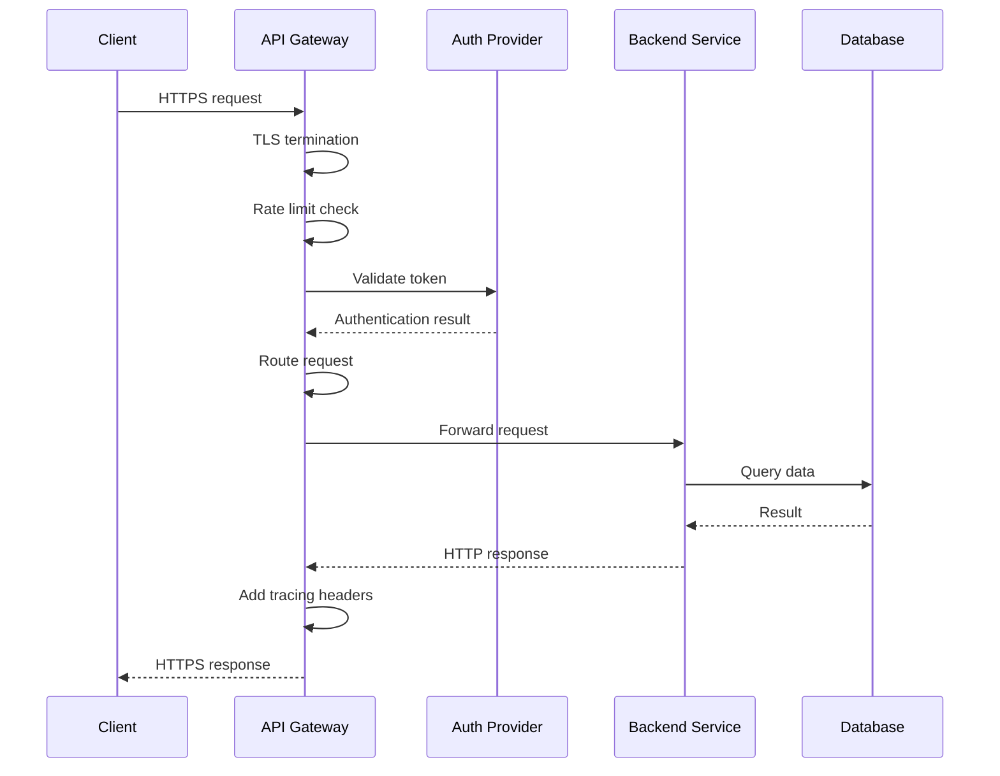
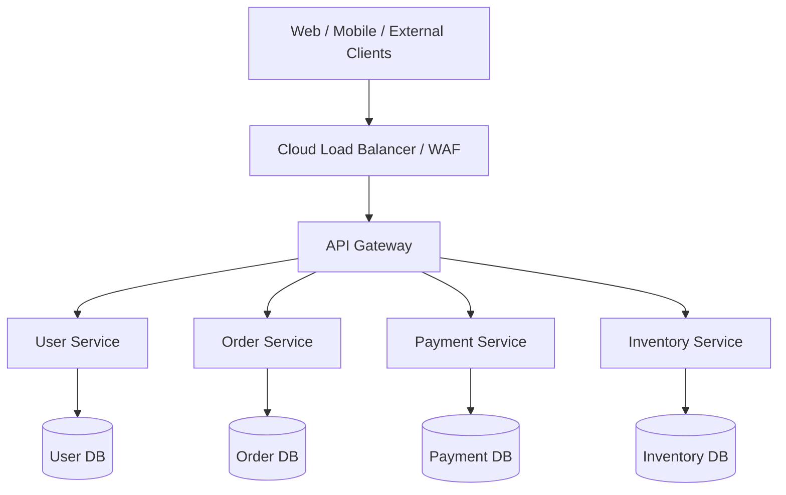
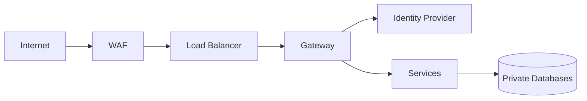

# 12- API Gateway

## Overview

An API Gateway is a centralized network entry point that sits between external clients and backend services. It provides a controlled boundary for routing, security, traffic management, observability, and protocol handling.

A typical architecture looks like:

```text
                         Internet
                            |
                +-----------+-----------+
                |                       |
             Web App                Mobile App
                |                       |
                +-----------+-----------+
                            |
                            v
                     API Gateway
                            |
             +--------------+--------------+
             |              |              |
             v              v              v
        User Service   Order Service   Payment Service
             |              |              |
             v              v              v
        PostgreSQL      PostgreSQL      PostgreSQL
```

Without a gateway, every client may need to know the location, authentication requirements, and networking details of individual services:

```text
Client
  |
  +--> User Service
  |
  +--> Order Service
  |
  +--> Payment Service
  |
  +--> Notification Service
```

This creates coupling between clients and the internal service topology.

With a gateway:

```text
Client
  |
  v
API Gateway
  |
  +--> User Service
  +--> Order Service
  +--> Payment Service
  +--> Notification Service
```

The gateway becomes the stable external boundary while internal services can evolve independently.

An API Gateway is not simply "an Nginx server in front of APIs." Nginx can perform gateway responsibilities, but a production API gateway may additionally provide authentication integration, authorization policies, rate limiting, request transformation, service discovery, traffic splitting, observability, quotas, caching, and API lifecycle management.

---

## Why API Gateways Exist

Microservices introduce a distributed topology.

Suppose an e-commerce platform contains:

```text
User Service
Order Service
Payment Service
Inventory Service
Shipping Service
Notification Service
```

If clients communicate directly with every service, the client becomes responsible for internal architecture.

That creates several problems:

- Internal service addresses become exposed
- Authentication must be implemented repeatedly
- Rate limiting becomes fragmented
- Clients need multiple network endpoints
- Service discovery becomes a client concern
- Internal topology becomes difficult to change
- Cross-cutting concerns are duplicated
- Observability becomes harder to standardize

The gateway centralizes these concerns at the system boundary.

---

## API Gateway Responsibilities

Typical gateway responsibilities include:

| Responsibility | Purpose |
|---|---|
| Routing | Forward requests to appropriate services |
| TLS termination | Handle HTTPS at the edge |
| Authentication | Validate credentials or tokens |
| Authorization | Enforce coarse-grained access policies |
| Rate limiting | Protect backend services |
| Quotas | Control consumer usage |
| Load balancing | Distribute traffic |
| Request validation | Reject malformed requests |
| Header manipulation | Add or remove metadata |
| Request transformation | Adapt external/internal contracts |
| Response transformation | Normalize responses |
| Caching | Reduce backend load |
| Observability | Centralize logs, metrics, traces |
| API version routing | Route `/v1` and `/v2` |
| Canary routing | Gradually shift traffic |
| Circuit breaking | Prevent cascading failures |
| WAF integration | Protect against web attacks |

Not every gateway should perform all of these functions. Centralizing too much logic can create an overloaded component that becomes difficult to operate.

---

## API Gateway Request Lifecycle

A production request can pass through several stages:



The exact sequence depends on the gateway and architecture.

The important principle is that the gateway should perform fast, deterministic edge operations and avoid becoming the location of complex business workflows.

---

## Gateway as a Network Boundary

The gateway defines a trust boundary.

```text
                 Untrusted Network
                       |
                       v
              +------------------+
              |   API Gateway    |
              |------------------|
              | TLS              |
              | WAF              |
              | Authentication   |
              | Rate Limiting    |
              +------------------+
                       |
                       v
              Trusted Service Network
                       |
          +------------+------------+
          |            |            |
          v            v            v
       Service A    Service B    Service C
```

Backend services should not assume that traffic reaching them from the internet is safe.

Ideally:

- Services are not directly internet-accessible
- Security groups restrict network access
- Authentication is enforced
- Authorization remains enforced at the service layer
- Internal communication uses appropriate security controls

The gateway reduces attack surface, but it should not become the only security boundary.

---

## API Gateway vs Reverse Proxy

An API Gateway and reverse proxy overlap significantly.

A reverse proxy generally forwards traffic:

```text
Client
  |
  v
Reverse Proxy
  |
  v
Backend
```

An API gateway typically adds API-specific capabilities:

```text
Client
  |
  v
API Gateway
  |
  +--> Authentication
  +--> Rate limiting
  +--> Routing
  +--> Versioning
  +--> Observability
  +--> Policy enforcement
  |
  v
Backend Services
```

Nginx can act as:

- Reverse proxy
- Load balancer
- TLS terminator
- Basic API gateway

A managed gateway or dedicated gateway product may provide additional API management capabilities.

---

## Nginx as an API Gateway

Nginx is often sufficient for straightforward architectures.

Example:

```nginx
upstream user_service {
    server user-service:8000;
}

upstream order_service {
    server order-service:8000;
}

server {
    listen 443 ssl;
    server_name api.example.com;

    location /api/users/ {
        proxy_pass http://user_service;
    }

    location /api/orders/ {
        proxy_pass http://order_service;
    }
}
```

This provides basic routing:

```text
/api/users/*  -> user-service
/api/orders/* -> order-service
```

Nginx becomes a reasonable choice when requirements are primarily:

- Reverse proxying
- TLS termination
- Routing
- Load balancing
- Basic rate limiting
- Header manipulation
- Static configuration

More sophisticated API management requirements may justify a dedicated gateway.

---

## API Gateway vs Load Balancer

A load balancer distributes traffic across instances.

```text
             Load Balancer
             /     |     \
            v      v      v
          Pod A  Pod B  Pod C
```

An API gateway usually performs application-aware routing and policy enforcement.

```text
                    API Gateway
                         |
             +-----------+-----------+
             |                       |
        /users/*                 /orders/*
             |                       |
             v                       v
       User Service            Order Service
             |                       |
       +-----+-----+           +-----+-----+
       v           v           v           v
     Pod A       Pod B       Pod A       Pod B
```

In many architectures, both exist:

```text
Internet
   |
   v
Cloud Load Balancer
   |
   v
API Gateway / Ingress
   |
   +--> Service A
   +--> Service B
```

The distinction is primarily about responsibility, not merely product naming.

---

## API Gateway vs Service Mesh

An API gateway generally manages **north-south traffic**:

```text
Internet
   |
   v
Gateway
   |
   v
Cluster
```

A service mesh primarily manages **east-west traffic**:

```text
Service A <----> Service B
     ^                ^
     |                |
   Proxy            Proxy
```

| Concern | API Gateway | Service Mesh |
|---|---|---|
| Internet traffic | Primary | Usually not |
| External authentication | Primary | Limited |
| Public API routing | Primary | No |
| Service-to-service traffic | Sometimes | Primary |
| mTLS between services | Possible | Common |
| Internal retries | Possible | Common |
| Traffic policies | Yes | Yes |
| External API management | Yes | No |

A system may use both.

---

## API Gateway Architecture

A mature microservices architecture can look like:



The gateway is the external contract boundary.

Each service should still own its business logic and data.

---

## Routing

Routing maps an incoming request to a backend target.

For example:

```text
GET /api/users/123
        |
        v
    User Service

POST /api/orders
        |
        v
    Order Service

POST /api/payments
        |
        v
    Payment Service
```

Routing can be based on:

- Path
- HTTP method
- Host
- Headers
- Query parameters
- API version
- Consumer identity
- Geographic region

Path-based routing is usually the easiest to reason about.

---

## Path-Based Routing

Example:

```text
/api/users/*      -> user-service
/api/orders/*     -> order-service
/api/payments/*   -> payment-service
```

This makes routing explicit and easy to observe.

---

## Host-Based Routing

Different services can use different hostnames:

```text
users.api.example.com
orders.api.example.com
payments.api.example.com
```

This provides stronger separation but increases DNS and client complexity.

---

## Header-Based Routing

Headers can support advanced traffic policies.

```http
X-API-Version: 2
```

or:

```http
X-Canary: true
```

The gateway can route based on these values.

Header-based routing should be used deliberately because it makes request behavior less visible from the URL.

---

## API Version Routing

A gateway can route different API versions:

```text
/api/v1/users -> user-service-v1
/api/v2/users -> user-service-v2
```

For gradual migration:

```text
             /api/v2
                |
                v
          Gateway Router
           /         \
          v           v
      v2 stable    v2 canary
        90%           10%
```

Versioning should remain consistent with the API's overall versioning strategy.

---

## Authentication

Authentication answers:

> Who is making the request?

Common mechanisms include:

- OAuth 2.0
- OpenID Connect
- JWT
- API keys
- Mutual TLS
- Signed requests

A gateway can validate credentials before forwarding requests.

For example:

```text
Client
  |
  | Authorization: Bearer <token>
  v
Gateway
  |
  +--> Validate token
  |
  +--> Forward authenticated identity
  |
  v
Backend
```

However, authentication at the gateway does not automatically eliminate service-level security.

---

## JWT Validation

A gateway may validate:

- Signature
- Expiration
- Issuer
- Audience
- Required claims

Conceptually:

```text
JWT
 |
 +--> Signature valid?
 +--> Expired?
 +--> Correct issuer?
 +--> Correct audience?
 +--> Required claims?
 |
 +--> Accept / Reject
```

The gateway should reject invalid tokens before forwarding traffic.

Do not blindly trust JWT payload data without verifying the token's authenticity.

---

## Authorization

Authentication and authorization are different.

```text
Authentication:
Who are you?

Authorization:
What are you allowed to do?
```

The gateway can enforce coarse-grained policies:

```text
/admin/* -> requires admin scope
/payments/* -> requires payments:write
/orders/* -> requires orders:read
```

But business authorization often belongs inside the service.

For example:

```text
Gateway:
Does token have orders:read?

Order Service:
Does this user own order 123?
```

The second check requires business context and should remain in the application.

---

## Rate Limiting

Rate limiting protects backend systems from excessive traffic.

For example:

```text
Consumer A -> 100 requests/minute
Consumer B -> 10,000 requests/minute
```

Common algorithms include:

- Fixed window
- Sliding window
- Token bucket
- Leaky bucket

Token bucket is commonly used when bursts should be allowed within a controlled limit.

Conceptually:

```text
              Tokens
                |
                v
          +-------------+
Request ->| Token Bucket|-> Allow
          +-------------+
                |
                +-------> Reject when empty
```

---

## Rate Limiting Dimensions

Rate limits can be applied by:

| Dimension | Example |
|---|---|
| IP | `203.0.113.10` |
| API key | `customer_123` |
| User | `user_456` |
| Tenant | `tenant_789` |
| Endpoint | `/api/orders` |
| Consumer | Mobile application |
| Version | `v2` |

IP-only rate limiting is often insufficient for authenticated APIs because many legitimate users may share an IP.

---

## Distributed Rate Limiting

In a horizontally scaled gateway:

```text
             Load Balancer
                   |
        +----------+----------+
        |          |          |
        v          v          v
      GW-1       GW-2       GW-3
        |          |          |
        +----------+----------+
                   |
                Redis
```

A shared store such as Redis can coordinate rate-limit state.

Without shared state:

```text
GW-1 -> allows 100
GW-2 -> allows 100
GW-3 -> allows 100
```

The effective limit could become much larger than intended.

Distributed rate limiting must account for:

- Atomic operations
- Clock differences
- Redis availability
- Network latency
- Fail-open vs fail-closed behavior

---

## Request Size Limits

The gateway should enforce reasonable request limits.

Examples:

```text
JSON body: 1 MB
Upload: 20 MB
Header size: bounded
URL length: bounded
```

This reduces resource exhaustion risk.

Large payloads should generally use object storage rather than passing massive bodies through application services.

---

## Timeout Management

Timeouts are critical.

Suppose:

```text
Client timeout = 30s
Gateway timeout = 25s
Service timeout = 20s
Database timeout = 15s
```

This creates a controlled timeout hierarchy.

Avoid:

```text
Client = 30s
Gateway = 60s
Service = 120s
```

because downstream operations can outlive upstream requests and consume resources unnecessarily.

A useful principle is:

> Timeouts should become progressively shorter as you move deeper into the dependency graph.

The exact values depend on workload and latency requirements.

---

## Retries

Retries can improve reliability for transient failures but can also amplify failures.

Consider:

```text
100 requests
    |
Gateway retries each request 3 times
    |
300 backend requests
```

If the backend is already overloaded, retries can make the outage worse.

Avoid blindly retrying:

- Non-idempotent operations
- Authentication failures
- Validation errors
- Permanent 4xx responses

For safe operations, use bounded retries with exponential backoff and jitter.

---

## Circuit Breaking

Circuit breaking prevents repeated calls to an unhealthy backend.

```text
Healthy
   |
   | failures exceed threshold
   v
Open
   |
   | cooldown
   v
Half-Open
   |
   +--> Healthy
   |
   +--> Open
```

A gateway can stop sending traffic to an unhealthy service temporarily.

This helps prevent cascading failures.

---

## Load Balancing

A gateway can distribute requests among service instances.

```text
                Gateway
                   |
        +----------+----------+
        |          |          |
        v          v          v
      Pod A      Pod B      Pod C
```

Common algorithms include:

- Round robin
- Least connections
- Weighted routing
- Consistent hashing

For stateless HTTP services, round robin is often sufficient.

---

## Health Checks

A gateway should avoid routing traffic to unhealthy instances.

A simple health endpoint might be:

```http
GET /health
```

But distinguish between:

```text
Liveness:
Is the process alive?

Readiness:
Can this instance safely receive traffic?
```

A readiness check should account for dependencies required to serve requests.

Avoid making health checks so dependency-heavy that temporary downstream failures cause all instances to disappear from service.

---

## Service Discovery

In dynamic environments such as Kubernetes, backend instances change frequently.

The gateway can route through:

```text
Gateway
   |
   v
Kubernetes Service
   |
   +--> Pod A
   +--> Pod B
   +--> Pod C
```

Kubernetes Service discovery removes the need to hard-code individual pod addresses.

Other environments may use:

- DNS-based discovery
- Consul
- Cloud service discovery
- Service registries

---

## Request Transformation

A gateway can transform requests:

```text
External API
    |
    | POST /users
    | {"name": "Alice"}
    v
Gateway
    |
    | {"display_name": "Alice"}
    v
Internal Service
```

This can help maintain a stable external contract while internal services evolve.

However, complex transformation logic can make the gateway difficult to understand and test.

Prefer simple protocol or contract adaptation.

---

## Response Transformation

Similarly:

```text
Internal Service
{
  "first_name": "Alice",
  "last_name": "Smith"
}
       |
       v
Gateway
       |
       v
External API
{
  "name": "Alice Smith"
}
```

Transformation is useful when external and internal contracts intentionally differ.

Do not use the gateway as a general-purpose business logic engine.

---

## Aggregation

An API gateway can aggregate responses from multiple services.

For example:

```http
GET /api/dashboard
```

may require:

```text
User Service
Order Service
Recommendation Service
Notification Service
```

The gateway can return:

```json
{
  "user": {},
  "orders": [],
  "recommendations": [],
  "notifications": []
}
```

This is sometimes called the **Backend for Frontend (BFF)** pattern.

---

## API Gateway vs BFF

These concepts are related but not identical.

| API Gateway | BFF |
|---|---|
| General edge gateway | Client-specific backend |
| Shared across clients | Usually one per client type |
| Routing and policies | Client-specific aggregation |
| Authentication | Response shaping |
| Rate limiting | Client-specific workflows |
| Traffic management | UI-oriented composition |

Example:

```text
                    Gateway
                       |
              +--------+--------+
              |                 |
          Web BFF            Mobile BFF
              |                 |
       +------+------+     +----+-----+
       |      |      |     |          |
      User  Order  Search User      Order
```

A BFF can sit behind a general API gateway.

---

## API Composition

Aggregation introduces latency considerations.

Suppose:

```text
Dashboard request
    |
    +--> User       100 ms
    +--> Orders     150 ms
    +--> Payments   200 ms
```

If calls are sequential:

```text
100 + 150 + 200 = 450 ms
```

If independent calls execute concurrently:

```text
max(100, 150, 200) ≈ 200 ms
```

Therefore, aggregation should generally parallelize independent downstream calls.

However, concurrency increases:

- Connection usage
- Memory usage
- Downstream load
- Failure modes

Set strict timeouts and bounded concurrency.

---

## Caching

Gateways can cache responses for suitable read-heavy APIs.

```text
Client
  |
  v
Gateway
  |
  +--> Cache hit -> response
  |
  +--> Cache miss -> Service
```

Caching is appropriate for data that:

- Is expensive to compute
- Changes infrequently
- Can tolerate some staleness

Avoid caching:

- User-specific sensitive data without careful isolation
- Highly dynamic data
- Responses with unclear authorization semantics

Cache keys must include all dimensions that affect the response.

---

## TLS Termination

A common architecture terminates TLS at the edge:

```text
Client
  |
 HTTPS
  |
  v
Gateway
  |
 HTTP or HTTPS
  |
  v
Backend
```

For highly sensitive environments, encryption can continue internally:

```text
Client
  |
 HTTPS
  v
Gateway
  |
 mTLS / HTTPS
  v
Service
```

Internal encryption can reduce the impact of compromised network segments and is common in zero-trust-oriented architectures.

---

## CORS

The gateway can enforce CORS policies for browser clients.

Example:

```http
Access-Control-Allow-Origin: https://app.example.com
Access-Control-Allow-Methods: GET, POST, PATCH
```

Avoid:

```http
Access-Control-Allow-Origin: *
```

for APIs involving credentials unless the architecture explicitly permits it; browsers do not allow credentialed cross-origin requests with a wildcard origin.

CORS is a browser security mechanism. It is not an authentication mechanism.

---

## Security Headers

Depending on the architecture, the gateway can add headers such as:

```http
Strict-Transport-Security: max-age=31536000; includeSubDomains
X-Content-Type-Options: nosniff
```

Do not blindly add headers without understanding application behavior.

---

## WAF Integration

A Web Application Firewall can sit before or alongside the gateway.

```text
Internet
   |
   v
WAF
   |
   v
API Gateway
   |
   v
Services
```

A WAF can help detect or block:

- SQL injection patterns
- Cross-site scripting
- Malicious request patterns
- Known attack signatures
- Excessive request patterns

A WAF is not a replacement for secure application code.

---

## AWS API Gateway

AWS provides managed API Gateway capabilities for HTTP APIs and REST APIs.

A typical architecture is:

```text
Client
  |
  v
CloudFront / WAF
  |
  v
Amazon API Gateway
  |
  +--> Lambda
  |
  +--> ALB
  |
  +--> Other HTTP backend
```

For containerized services:

```text
Internet
   |
   v
CloudFront / WAF
   |
   v
API Gateway
   |
   v
Load Balancer
   |
   v
ECS / Kubernetes / EC2
```

The appropriate AWS service depends on requirements around latency, routing, authentication, integrations, cost, and operational control.

---

## API Gateway vs Application Load Balancer

In AWS architectures, API Gateway and an Application Load Balancer can overlap but serve different purposes.

| Capability | API Gateway | ALB |
|---|---:|---:|
| HTTP routing | Yes | Yes |
| TLS termination | Yes | Yes |
| API management | Strong | Limited |
| API keys / quotas | Yes | Limited |
| Request transformation | Yes | Limited |
| Native Kubernetes ingress role | No | Common |
| WebSocket support | Yes | Yes |
| Static load balancing | Limited purpose | Strong |
| Cost model | Request/API based | Capacity/hour based |
| Direct container routing | Via integration | Strong |

The correct choice depends on the traffic pattern and operational requirements.

---

## API Gateway High Availability

The gateway is a critical infrastructure component.

If:

```text
Client
  |
  v
Single Gateway
  |
  v
Services
```

fails, the entire external API can become unavailable.

Production gateways should therefore avoid single-instance architecture.

Use:

- Multiple gateway instances
- Multi-AZ deployment
- Managed gateway services where appropriate
- Health checks
- Load balancing
- Automated deployment
- Configuration replication
- Capacity planning

Conceptually:

```text
                  DNS / Load Balancer
                          |
              +-----------+-----------+
              |                       |
              v                       v
          Gateway AZ-A           Gateway AZ-B
              |                       |
              +-----------+-----------+
                          |
                     Backend Services
```

---

## Scalability

Gateways are generally stateless and can scale horizontally.

```text
                  Load Balancer
                       |
          +------------+------------+
          |            |            |
          v            v            v
       Gateway-1    Gateway-2    Gateway-3
```

Avoid storing session state directly inside a gateway instance.

Shared state such as rate-limit counters can live in Redis or another distributed store.

---

## Performance Considerations

Every gateway adds another network hop:

```text
Client -> Gateway -> Service
```

instead of:

```text
Client -> Service
```

The additional latency should be small, but high-throughput systems must measure it.

Potential bottlenecks include:

- TLS processing
- Authentication
- Rate-limit lookups
- Request transformations
- Logging
- Response buffering
- Connection pools
- External policy checks

Keep the gateway's critical path lightweight.

---

## Connection Management

A gateway should reuse connections to backend services.

Without connection reuse:

```text
Request
  |
  +--> TCP connection
  +--> TLS handshake
  +--> HTTP request
  +--> close
```

With connection pooling:

```text
Gateway
  |
  +--> persistent connection --> Service
  +--> persistent connection --> Service
  +--> persistent connection --> Service
```

This reduces connection establishment overhead.

HTTP/2 and HTTP/3 can further improve connection efficiency depending on the architecture.

---

## Backpressure

When downstream services become overloaded, the gateway should avoid continuously increasing pressure.

Useful mechanisms include:

- Rate limiting
- Concurrency limits
- Queue limits
- Circuit breakers
- Bounded retries
- Timeouts
- Load shedding

For example:

```text
Traffic spike
    |
    v
Gateway
    |
    +--> Rate limit
    |
    +--> Concurrency limit
    |
    +--> Reject excess traffic
    |
    v
Healthy backend
```

Rejecting excess work early can preserve overall system availability.

---

## Load Shedding

When a system is overloaded, serving every request slowly can be worse than rejecting some requests quickly.

For example:

```text
Normal:
1000 req/s -> 1000 processed

Overload:
5000 req/s -> backend capacity 1000 req/s
```

The gateway can reject excess traffic with:

```http
HTTP/1.1 429 Too Many Requests
```

or, depending on the failure condition:

```http
HTTP/1.1 503 Service Unavailable
```

This protects downstream systems from resource exhaustion.

---

## Observability

The gateway is an excellent location for centralized telemetry.

Track:

- Request count
- Error rate
- P50/P95/P99 latency
- Status codes
- Backend latency
- Rate-limit rejections
- Authentication failures
- Route-level traffic
- Consumer-level traffic
- Request size
- Response size

A useful latency decomposition is:

```text
Total latency
=
Gateway processing
+
Network
+
Backend processing
+
Downstream dependencies
```

This helps identify where latency originates.

---

## Structured Logging

Use structured logs rather than unstructured strings.

Example:

```json
{
  "timestamp": "2026-08-23T12:30:00Z",
  "request_id": "req_01JXYZ",
  "trace_id": "trace_abc123",
  "method": "GET",
  "path": "/api/v2/orders/123",
  "status": 200,
  "gateway_latency_ms": 4,
  "upstream_latency_ms": 83,
  "client": "mobile",
  "api_version": "v2"
}
```

Do not log:

- Access tokens
- Passwords
- API secrets
- Session cookies
- Sensitive personal data

---

## Distributed Tracing

The gateway should participate in distributed tracing.

```text
Client
  |
  | trace-id=abc
  v
Gateway
  |
  | trace-id=abc
  v
Order Service
  |
  | trace-id=abc
  v
Payment Service
```

This allows a single request to be followed across multiple services.

OpenTelemetry is commonly used for standardized telemetry.

---

## Error Handling

The gateway should provide consistent infrastructure-level errors.

For example:

```json
{
  "error": {
    "code": "RATE_LIMITED",
    "message": "Too many requests",
    "request_id": "req_123"
  }
}
```

Do not expose internal details such as:

```text
PostgreSQL connection refused
Redis host 10.0.3.15 unavailable
```

to external clients.

Internal details belong in logs and traces.

---

## Idempotency

Gateway retries can interact dangerously with non-idempotent operations.

Consider:

```http
POST /payments
```

If the gateway retries after a timeout:

```text
Attempt 1 -> payment succeeds
Gateway doesn't receive response
Attempt 2 -> payment succeeds again
```

This can result in duplicate payment operations.

For critical write operations, use idempotency keys where appropriate:

```http
POST /payments
Idempotency-Key: payment-request-123
```

The service responsible for the business operation must enforce idempotency. The gateway alone cannot safely guarantee it.

---

## API Gateway and Kafka

A gateway should generally not become a replacement for an event broker.

A typical architecture is:

```text
Client
  |
  v
API Gateway
  |
  v
Order Service
  |
  v
Kafka
  |
  +--> Inventory Service
  +--> Notification Service
  +--> Analytics Service
```

The gateway handles synchronous request/response traffic.

Kafka handles asynchronous event distribution.

---

## API Gateway and Celery

Similarly, a gateway should not perform long-running asynchronous work directly.

A better architecture is:

```text
Client
  |
  v
API Gateway
  |
  v
Django / FastAPI
  |
  v
Celery
  |
  v
Worker
```

The API can return:

```http
202 Accepted
```

when appropriate.

The gateway remains responsible for request handling rather than background job execution.

---

## Common Mistakes

### Putting Business Logic in the Gateway

Bad:

```text
Gateway
  |
  +--> calculate discount
  +--> validate business rules
  +--> modify order state
  +--> call multiple systems
```

This makes the gateway a distributed monolith.

Prefer:

```text
Gateway
  |
  v
Order Service
  |
  +--> business logic
```

### Making the Gateway a Single Point of Failure

A single gateway instance can take down the entire external system.

Use redundancy and health-aware routing.

### Trusting Gateway Authentication Alone

Services should not blindly trust every request simply because it came through the gateway.

Use defense in depth.

### Unlimited Retries

Retries can amplify outages.

Use:

- Maximum retry count
- Exponential backoff
- Jitter
- Timeouts
- Idempotency

### Unbounded Request Bodies

Large requests can exhaust memory and bandwidth.

Set explicit limits.

### Logging Sensitive Data

Gateways see almost every request, making them particularly sensitive logging locations.

Never log credentials or secrets.

### Gateway Configuration Drift

Different gateway instances with different routing rules can create unpredictable behavior.

Use declarative configuration and CI/CD.

### Excessive Transformations

Heavy request and response transformations increase latency and operational complexity.

### Using the Gateway for Internal Service Calls

Internal services do not necessarily need to call each other through the public gateway.

Prefer direct internal service communication or a service mesh where appropriate.

### Creating a Gateway for Every Service

A gateway should provide a coherent system boundary.

Do not create unnecessary gateway layers that add latency and operational complexity.

---

## Configuration Management

Gateway configuration should be version-controlled.

Example:

```text
gateway/
├── routes/
├── policies/
├── authentication/
├── rate-limits/
└── environments/
    ├── development/
    ├── staging/
    └── production/
```

Changes should follow:

```text
Developer
   |
   v
Git
   |
   v
CI validation
   |
   v
Staging
   |
   v
Production
```

Avoid manually modifying production gateway configuration.

---

## Deployment Strategy

Gateway deployments should support safe rollback.

A practical process:

```text
Configuration change
        |
        v
Validate configuration
        |
        v
Automated tests
        |
        v
Deploy to staging
        |
        v
Smoke tests
        |
        v
Canary production deployment
        |
        v
Monitor
        |
        +----> rollback if unhealthy
        |
        v
Full rollout
```

Configuration validation is especially important because a malformed route can make an otherwise healthy backend unreachable.

---

## Security Architecture

A production edge can look like:



Security controls should exist at multiple layers:

```text
Internet
   |
WAF
   |
Gateway authentication
   |
Gateway rate limiting
   |
Service authorization
   |
Database authorization
```

No single component should be treated as the complete security model.

---

## Disaster Recovery

The gateway is part of the recovery architecture.

Back up or reproduce:

- Routing configuration
- Authentication configuration
- Certificates
- DNS configuration
- Rate-limit policies
- API definitions
- Infrastructure configuration

Prefer infrastructure-as-code where possible.

For example:

```text
Git repository
      |
      v
Terraform / CloudFormation
      |
      v
Gateway infrastructure
```

This makes gateway recovery reproducible rather than dependent on manual configuration.

---

## Cost Considerations

Gateway cost depends on architecture and provider.

Potential cost drivers include:

- Request volume
- Data transfer
- TLS processing
- Logging
- WAF requests
- API management features
- Cross-AZ traffic
- External authentication calls
- Cache usage

For high-volume systems, compare:

```text
Managed API Gateway
        vs
Load Balancer + Nginx
        vs
Dedicated Gateway
```

Do not optimize purely for per-request cost. Operational burden and reliability are also significant cost factors.

---

## When to Use an API Gateway

An API gateway is particularly useful when:

- Multiple backend services exist
- Clients should not know internal service topology
- Centralized authentication is required
- Rate limiting is required
- API versioning is required
- Multiple consumers need different policies
- Centralized observability is valuable
- Traffic routing needs to be controlled
- Public API exposure needs a dedicated boundary

---

## When a Gateway May Be Unnecessary

A simple monolith may not need a dedicated API gateway.

For example:

```text
Internet
   |
   v
Nginx
   |
   v
Django
   |
   v
PostgreSQL
```

Adding:

```text
Internet
   |
CloudFront
   |
Load Balancer
   |
API Gateway
   |
Nginx
   |
Django
```

without a concrete requirement can introduce unnecessary:

- Latency
- Cost
- Configuration
- Failure modes
- Operational overhead

Architecture should follow requirements rather than trends.

---

## Production Checklist

Before operating an API gateway in production, verify:

- [ ] Gateway is highly available
- [ ] TLS is configured correctly
- [ ] Backend services are not unnecessarily internet-facing
- [ ] Authentication is enforced
- [ ] Authorization remains enforced in services
- [ ] Rate limits are configured
- [ ] Request size limits exist
- [ ] Timeouts are bounded
- [ ] Retries are bounded
- [ ] Idempotency is implemented for critical operations
- [ ] Health checks are configured
- [ ] Gateway configuration is version-controlled
- [ ] Configuration changes go through CI/CD
- [ ] Structured logging is enabled
- [ ] Distributed tracing is enabled
- [ ] Sensitive data is excluded from logs
- [ ] Metrics and alerts exist
- [ ] Failure and overload behavior is tested
- [ ] Rollback procedures are documented
- [ ] Disaster recovery configuration is reproducible

---

## Interview Traps

### Is an API Gateway Just a Reverse Proxy?

No. A reverse proxy forwards traffic, while an API gateway commonly provides API-specific concerns such as authentication, rate limiting, routing policies, quotas, versioning, and observability.

### Does Every Microservice Need to Be Behind the API Gateway?

Not necessarily. External traffic commonly enters through a gateway, while internal service-to-service communication can use direct networking or a service mesh.

### Should Business Logic Live in the Gateway?

Generally no. Business logic belongs in domain/application services. The gateway should focus on edge concerns.

### Does the Gateway Replace Authentication in Every Service?

No. It can authenticate requests at the edge, but services should still enforce authorization and appropriate defense-in-depth controls.

### Why Can Retries Be Dangerous?

Retries multiply traffic during failures and can duplicate non-idempotent operations.

### Why Is a Gateway a Potential Bottleneck?

Every external request passes through it, so CPU, memory, connection pools, authentication checks, logging, rate limiting, and transformations can become bottlenecks.

### How Do You Scale an API Gateway?

Prefer stateless gateway instances behind a load balancer and externalize shared state such as distributed rate-limit counters.

### API Gateway vs Load Balancer?

A load balancer primarily distributes traffic across backend instances. An API gateway adds API-aware routing and policy capabilities.

### API Gateway vs Service Mesh?

The gateway primarily handles north-south traffic between external clients and the platform. A service mesh primarily manages east-west service-to-service communication.

### Why Is Idempotency Important at the Gateway Boundary?

Because retries and network timeouts can cause a request to be executed more than once. Critical write operations need idempotency guarantees at the business-service layer.

### Should an API Gateway Aggregate Multiple Services?

It can, particularly in BFF architectures, but aggregation increases latency, failure complexity, and resource consumption. Independent calls should be parallelized with strict timeouts and bounded concurrency.

### What Happens If the Gateway Goes Down?

If it is the only external entry point, the API can become completely unavailable. Production gateways therefore require high availability, redundancy, monitoring, and automated recovery.

---

## Key Takeaways

- An API Gateway provides a controlled external boundary for routing, authentication, rate limiting, observability, traffic management, and API policy enforcement.
- Keep gateways focused on edge concerns; business logic, authorization decisions requiring domain context, and idempotency belong in backend services.
- Production gateways must be horizontally scalable and highly available, with bounded timeouts, retries, rate limits, request sizes, and strong overload protection.
- Treat the gateway as part of the security and observability architecture, but use defense in depth rather than trusting it as the only security boundary.
- Choose an API gateway based on concrete architectural requirements; a simple reverse proxy or load balancer may be preferable when dedicated API management capabilities are unnecessary.