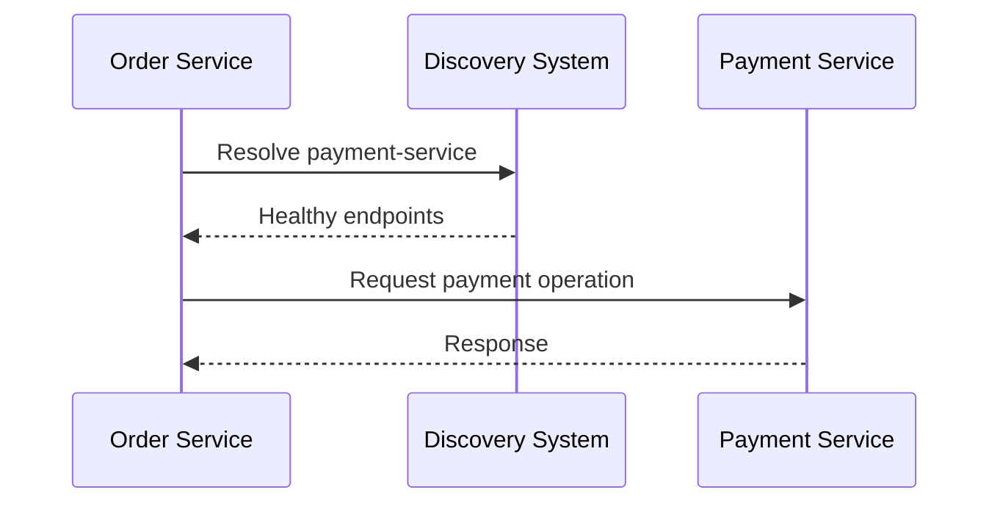
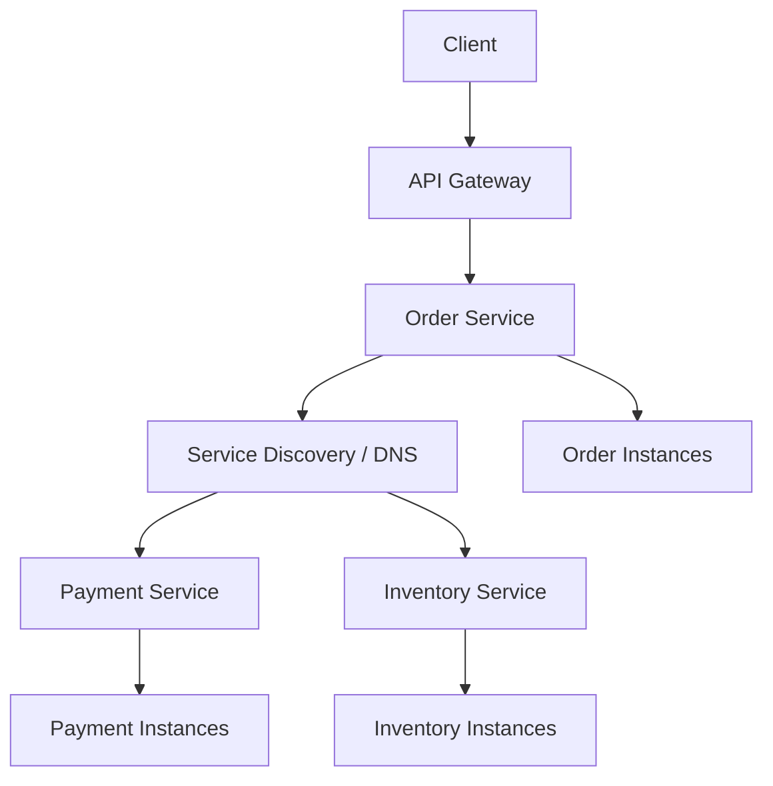

# 13- Service Discovery

## Overview

Service discovery is the mechanism that allows services in a distributed system to locate and communicate with the current instances of another service without hard-coding network addresses.

In a monolithic application, a component can call another component directly:

```text
Application
    |
    +--> User module
    +--> Order module
    +--> Payment module
```

In a microservices architecture, the topology becomes dynamic:

```text
Order Service
    |
    +--> User Service
    |
    +--> Payment Service
    |
    +--> Inventory Service
```

Each service may have multiple instances:

```text
Payment Service
    |
    +--> 10.0.2.10:8000
    +--> 10.0.3.17:8000
    +--> 10.0.4.21:8000
```

Instances can be created, destroyed, restarted, rescheduled, or moved between hosts. Hard-coding these addresses is therefore fragile.

Service discovery introduces an abstraction:

```text
Order Service
      |
      | "Where is payment-service?"
      v
Service Discovery
      |
      +--> payment-service -> instance A
      +--> payment-service -> instance B
      +--> payment-service -> instance C
```

The caller can use a logical service identity such as:

```text
payment-service
```

instead of knowing the physical location of each instance.

Service discovery is therefore a fundamental building block for scalable microservices, container platforms, cloud deployments, and dynamically changing infrastructure.

---

## Why Service Discovery Exists

A distributed system cannot assume that a service always exists at the same IP address.

Consider a Kubernetes deployment:

```text
payment-service
    |
    +--> Pod A: 10.0.1.15
    +--> Pod B: 10.0.2.21
    +--> Pod C: 10.0.3.44
```

If Pod B crashes, Kubernetes may create:

```text
payment-service
    |
    +--> Pod A: 10.0.1.15
    +--> Pod C: 10.0.3.44
    +--> Pod D: 10.0.5.18
```

The consumer should not need to be reconfigured every time this happens.

Service discovery separates:

```text
Logical identity
```

from:

```text
Physical location
```

This is the central idea.

---

## What Service Discovery Provides

A service discovery system typically provides:

- Service registration
- Service lookup
- Health information
- Instance lifecycle management
- Endpoint metadata
- Load-balancing information
- Failure detection
- Deregistration of unhealthy instances

A simplified model is:

```text
Service Name
     |
     v
Discovery System
     |
     +--> Instance A
     +--> Instance B
     +--> Instance C
```

The consumer can then select an available instance.

---

## Service Identity vs Service Instance

These concepts should be separated.

A **service identity** represents the logical application:

```text
payment-service
```

A **service instance** represents one running process:

```text
payment-service
10.0.1.10:8000
```

A single service may have many instances:

| Service | Instance | Address |
|---|---|---|
| payment-service | payment-1 | `10.0.1.10:8000` |
| payment-service | payment-2 | `10.0.2.11:8000` |
| payment-service | payment-3 | `10.0.3.12:8000` |

Consumers should normally depend on the service identity rather than a particular instance.

---

## Service Discovery Flow

A typical discovery flow looks like:



The exact implementation depends on whether discovery is client-side or server-side.

---

## Client-Side Service Discovery

With client-side discovery, the caller queries the discovery mechanism and chooses an instance itself.

```text
Order Service
     |
     v
Discovery Registry
     |
     +--> Payment A
     +--> Payment B
     +--> Payment C
     |
     v
Order Service chooses instance
     |
     v
Payment Service
```

The client may perform:

- Endpoint selection
- Load balancing
- Health filtering
- Retry decisions

### Advantages

- No additional proxy hop
- Flexible client-side load balancing
- Can make intelligent routing decisions
- Lower infrastructure overhead in some environments

### Limitations

- Every client needs discovery logic
- Every language/runtime may need compatible libraries
- Failure handling becomes a client responsibility
- Service discovery concerns leak into application infrastructure

Client-side discovery is common in systems built around service registries.

---

## Server-Side Service Discovery

With server-side discovery, the client sends the request to a stable endpoint and another infrastructure component selects the service instance.

```text
Order Service
     |
     v
Load Balancer / Proxy
     |
     +--> Payment A
     +--> Payment B
     +--> Payment C
```

The client only needs to know:

```text
payment.internal.example
```

The infrastructure handles instance selection.

### Advantages

- Clients remain simple
- Discovery logic is centralized
- Multiple programming languages can use the same mechanism
- Infrastructure can enforce common routing policies

### Limitations

- Adds infrastructure
- May introduce another network hop
- Proxy/load-balancer capacity must be managed
- Routing failures can affect many services

Kubernetes Services and many cloud load-balancing architectures follow this general model.

---

## Client-Side vs Server-Side Discovery

| Characteristic | Client-Side | Server-Side |
|---|---|---|
| Instance selection | Client | Infrastructure |
| Client complexity | Higher | Lower |
| Network hop | Usually direct | Usually through proxy/LB |
| Load balancing | Client | Infrastructure |
| Language support | Requires client libraries | Mostly transparent |
| Failure handling | Client | Infrastructure |
| Operational model | More distributed | More centralized |
| Example | Service registry client | Kubernetes Service / load balancer |

Neither model is universally superior. The correct choice depends on the platform and operational requirements.

---

## Service Registry

A service registry maintains information about available service instances.

Conceptually:

```text
+--------------------------------+
|        Service Registry        |
+--------------------------------+
| user-service                   |
|   -> 10.0.1.10:8000            |
|   -> 10.0.1.11:8000            |
|                                |
| payment-service                |
|   -> 10.0.2.10:8000            |
|   -> 10.0.2.11:8000            |
+--------------------------------+
```

The registry must answer questions such as:

- Which instances currently exist?
- Which instances are healthy?
- What port are they listening on?
- Which metadata is associated with them?
- When was the instance last observed?

Examples of technologies used for service discovery include:

- Kubernetes DNS and Services
- Consul
- etcd
- Eureka
- Cloud-native DNS/service discovery mechanisms

---

## Service Registration

An instance needs to become discoverable.

A simplified lifecycle is:

```text
Service starts
    |
    v
Register endpoint
    |
    v
Send health/heartbeat information
    |
    v
Receive traffic
    |
    v
Service shuts down
    |
    v
Deregister
```

Registration may be:

- Self-registration
- Platform-managed
- Agent-managed

---

## Self-Registration

In self-registration, the service registers itself.

```text
Payment Service
      |
      | register()
      v
Registry
```

The service may provide:

```text
service_name = payment-service
host = 10.0.2.10
port = 8000
health_endpoint = /health
```

### Advantages

- Simple conceptual model
- Service controls registration lifecycle
- Works with generic registries

### Limitations

- Application must understand discovery infrastructure
- Registration failures need handling
- Shutdown/deregistration can be unreliable
- Application code becomes infrastructure-aware

---

## Platform-Managed Registration

A platform can manage service registration independently of the application.

For example:

```text
Deployment
    |
    v
Platform
    |
    +--> Starts instance
    +--> Registers endpoint
    +--> Performs health checks
    +--> Removes unhealthy endpoint
```

This is often preferable in containerized environments because application code does not need to manage its own network identity.

Kubernetes follows this model through Services, EndpointSlices, DNS, and the control plane.

---

## Health Checks

Discovery without health information can route traffic to dead instances.

Suppose the registry contains:

```text
payment-service
    |
    +--> Instance A: healthy
    +--> Instance B: dead
    +--> Instance C: healthy
```

The consumer should not blindly treat all three as equivalent.

Health checks can include:

- TCP checks
- HTTP checks
- gRPC health checks
- Process/liveness checks
- Readiness checks
- Application-level checks

---

## Liveness vs Readiness

These concepts are especially important in Kubernetes.

### Liveness

Answers:

> Is the process alive?

A failed liveness check can cause the platform to restart the container.

### Readiness

Answers:

> Can this instance receive traffic?

A failed readiness check should normally remove the instance from traffic without necessarily restarting it.

For service discovery, readiness is often more important than liveness.

```text
Application
    |
    +--> Alive?       -> Liveness
    |
    +--> Can serve?   -> Readiness
```

A service may be alive but temporarily unable to serve requests.

---

## Heartbeats and Leases

Some discovery systems use heartbeats or leases.

Conceptually:

```text
Service
   |
   | heartbeat
   v
Registry
```

If heartbeats stop:

```text
No heartbeat
     |
     v
Lease expires
     |
     v
Instance removed
```

This handles cases where a service crashes without performing graceful deregistration.

---

## Graceful Deregistration

Graceful shutdown should prevent new traffic from reaching an instance before it exits.

A useful sequence is:

```text
Receive shutdown signal
        |
        v
Mark instance unready
        |
        v
Stop receiving new traffic
        |
        v
Finish in-flight requests
        |
        v
Close connections
        |
        v
Exit process
```

This reduces connection failures during deployments.

In Kubernetes, termination handling and readiness changes should be designed together.

---

## DNS-Based Service Discovery

DNS is one of the simplest service discovery mechanisms.

Instead of:

```text
10.0.2.17:8000
```

a service can call:

```text
payment-service.internal
```

DNS resolves the service name to an address.

```text
Application
    |
    | DNS query
    v
DNS Resolver
    |
    v
10.0.2.17
```

DNS is attractive because virtually every platform and language supports it.

---

## Kubernetes Service Discovery

Kubernetes provides built-in service discovery.

Suppose:

```yaml
apiVersion: v1
kind: Service
metadata:
  name: payment-service
spec:
  selector:
    app: payment
  ports:
    - port: 8000
      targetPort: 8000
```

Other workloads can typically reach the service using:

```text
payment-service:8000
```

or its fully qualified DNS name:

```text
payment-service.default.svc.cluster.local
```

The important abstraction is:

```text
Client
  |
  v
payment-service
  |
  +--> Pod A
  +--> Pod B
  +--> Pod C
```

The client does not need to know the pod IP addresses.

---

## Kubernetes EndpointSlices

Kubernetes internally maintains endpoint information for Services using EndpointSlices.

Conceptually:

```text
Service
   |
   v
EndpointSlice
   |
   +--> Pod A
   +--> Pod B
   +--> Pod C
```

When pods change, endpoint information changes.

This allows service discovery to scale better than maintaining one enormous endpoint object for large services.

---

## Kubernetes DNS

A typical Kubernetes DNS lookup is:

```text
payment-service
      |
      v
Cluster DNS
      |
      v
Service IP / endpoint resolution
```

Pods can use service names instead of hard-coded addresses.

For example, a Django or FastAPI application can configure:

```python
PAYMENT_SERVICE_URL = "http://payment-service:8000"
```

The application does not need to know which pod handles the request.

---

## Docker Compose Service Discovery

Docker Compose also provides simple DNS-based discovery.

Given:

```yaml
services:
  api:
    build: ./api

  postgres:
    image: postgres:18
```

The API can connect using:

```text
postgres:5432
```

rather than:

```text
localhost:5432
```

Within the Compose network:

```text
api
 |
 | DNS
 v
postgres
```

This is a basic but useful example of service discovery.

---

## AWS Service Discovery

AWS environments can use mechanisms such as:

- Route 53 private hosted zones
- AWS Cloud Map
- Elastic Load Balancing
- ECS service discovery
- Kubernetes service discovery on EKS

A typical private architecture can look like:

```text
ECS Service
     |
     v
Cloud Map / DNS
     |
     v
Service Endpoint
```

The appropriate mechanism depends on whether the workload is running on ECS, EKS, EC2, Lambda, or another platform.

---

## Service Discovery with DNS vs Registry

| Feature | DNS | Service Registry |
|---|---|---|
| Simplicity | High | Medium |
| Universal support | Excellent | Requires integration |
| Health metadata | Limited | Rich |
| Custom metadata | Limited | Strong |
| Client integration | Minimal | Usually required |
| Dynamic discovery | Yes | Yes |
| Operational complexity | Lower | Higher |
| Typical example | Kubernetes DNS | Consul |

DNS is often sufficient when the platform already manages service membership and health.

A dedicated registry becomes more attractive when sophisticated discovery metadata and client-side routing are required.

---

## Load Balancing After Discovery

Discovery answers:

> Which instances exist?

Load balancing answers:

> Which available instance should receive this request?

These are related but different responsibilities.

```text
             Service Discovery
                    |
          +---------+---------+
          |         |         |
          v         v         v
        Pod A     Pod B     Pod C
          \         |         /
           \        |        /
            +-------+-------+
                    |
             Load Balancer
                    |
                    v
              Selected Pod
```

In some systems, the discovery mechanism itself provides enough information for clients to perform load balancing.

---

## Client-Side Load Balancing

Suppose discovery returns:

```text
A = 10.0.1.10
B = 10.0.1.11
C = 10.0.1.12
```

The client can select:

```text
Request 1 -> A
Request 2 -> B
Request 3 -> C
```

Algorithms may include:

- Round robin
- Random
- Weighted round robin
- Least loaded
- Consistent hashing

For gRPC, client-side load balancing can be especially useful in service-to-service architectures.

---

## Service Discovery with gRPC

A gRPC client may connect to a logical target:

```text
dns:///payment-service:50051
```

rather than a specific instance.

The resolver can discover multiple addresses:

```text
payment-service
    |
    +--> 10.0.1.10:50051
    +--> 10.0.1.11:50051
    +--> 10.0.1.12:50051
```

The client-side load-balancing policy can then distribute RPCs.

This makes service discovery an important part of production gRPC architecture.

---

## Service Discovery with REST

A REST service can use DNS or a platform-provided endpoint:

```python
import httpx

PAYMENT_SERVICE_URL = "http://payment-service:8000"

async def create_payment(payload: dict) -> dict:
    async with httpx.AsyncClient(timeout=5.0) as client:
        response = await client.post(
            f"{PAYMENT_SERVICE_URL}/payments",
            json=payload,
        )
        response.raise_for_status()
        return response.json()
```

The application does not need to maintain a list of payment-service pod IPs.

For production systems, configure the service endpoint through environment/configuration rather than embedding environment-specific values in source code.

---

## Service Discovery and Configuration Management

Discovery answers:

```text
Where is the service?
```

Configuration answers:

```text
How should I communicate with it?
```

These should not be confused.

For example:

```text
Service discovery:
payment-service -> 10.0.2.17:8000

Configuration:
timeout = 2s
TLS enabled = true
retry limit = 2
```

Both are required for robust service-to-service communication.

---

## Failure Modes

Service discovery itself can fail.

Consider:

```text
Order Service
      |
      v
Discovery
      X
```

Potential consequences include:

- Unable to resolve new instances
- Stale endpoint information
- Requests routed to dead instances
- Increased latency
- Cascading failures

Therefore, discovery infrastructure must itself be highly available.

---

## Stale Discovery Data

Distributed systems frequently operate with eventually consistent discovery information.

For example:

```text
Instance A crashes
       |
       v
Registry still contains A
       |
       v
Client receives stale endpoint
       |
       v
Connection failure
```

A robust client should therefore tolerate stale information.

Useful mechanisms include:

- Short connection timeouts
- Health checks
- Retry with backoff
- Endpoint refresh
- Connection pooling with failure detection
- Circuit breaking

Do not assume discovery data is always perfectly synchronized with reality.

---

## Discovery Failure vs Service Failure

These failures should be distinguished.

### Service failure

```text
Discovery works
    |
    v
Payment Service unavailable
```

### Discovery failure

```text
Payment Service healthy
    |
    v
Discovery unavailable
```

The second case can affect many services simultaneously and therefore has a larger blast radius.

---

## Caching Discovery Results

Clients may cache discovery results to avoid querying the registry for every request.

```text
Client
  |
  +--> Local endpoint cache
  |
  +--> Discovery only when cache expires
```

Benefits:

- Lower discovery traffic
- Lower latency
- Reduced registry dependency

Risks:

- Stale endpoints
- Delayed failure detection
- Longer recovery time

Use TTLs and refresh strategies appropriate for the system's failure characteristics.

---

## TTL Considerations

DNS-based discovery commonly relies on TTLs.

A lower TTL allows endpoint changes to propagate faster:

```text
TTL = 10s
```

but can increase DNS traffic.

A higher TTL:

```text
TTL = 300s
```

reduces lookup traffic but can keep stale information longer.

There is no universally correct TTL.

The correct value depends on:

- Instance churn
- Failure recovery requirements
- DNS infrastructure
- Traffic volume
- Cache behavior

---

## Connection Pooling

Service discovery changes endpoints over time, which interacts with connection pools.

Suppose:

```text
Service A
  |
  +--> Instance 1
  +--> Instance 2
```

The client establishes persistent connections.

If Instance 1 is removed:

```text
Discovery:
Instance 1 -> removed
```

Existing connections may still exist.

Clients and proxies must detect connection failures and establish connections to currently valid endpoints.

This is particularly important with long-lived HTTP/2 and gRPC connections.

---

## Security Considerations

Service discovery is part of the internal trust model.

Protect it from:

- Unauthorized registration
- Unauthorized service lookup
- Endpoint poisoning
- Spoofed service identities
- Stale credentials
- Registry compromise

A malicious actor who can register:

```text
payment-service -> malicious-host
```

could potentially redirect sensitive traffic.

Production discovery systems should therefore support appropriate:

- Authentication
- Authorization
- Encryption
- Network isolation
- Audit logging
- Access control

---

## Service Identity and mTLS

In zero-trust architectures, service identity can be combined with mutual TLS.

```text
Service A
   |
   | mTLS
   v
Service B
```

The certificate can establish the identity of the caller and target.

A service mesh can automate much of this:

```text
Service A
   |
Sidecar Proxy
   |
   | mTLS
   v
Sidecar Proxy
   |
Service B
```

Service discovery identifies where the service is; mTLS establishes secure service identity.

These are complementary concerns.

---

## Scalability Considerations

A discovery system must handle:

- Number of services
- Number of instances
- Registration churn
- Lookup volume
- Health-check traffic
- Network partitions
- Regional failures

A poorly designed registry can become a bottleneck.

Prefer:

- Distributed registry architecture
- Caching where appropriate
- Efficient watch/stream mechanisms
- Bounded polling
- Health-check intervals based on actual requirements
- Regional topology awareness

Do not poll a discovery registry aggressively from every service instance.

---

## Multi-Region Service Discovery

Global systems may have:

```text
                    Global Traffic
                         |
             +-----------+-----------+
             |                       |
             v                       v
          Region A                Region B
             |                       |
        Service A                Service A
        Service B                Service B
```

Discovery may need to prefer local instances.

For example:

```text
Request from Region A
       |
       v
Region A Service
       |
       X
       |
       v
Region B Service
```

Only fail over cross-region when local capacity is unavailable or the architecture explicitly requires it.

This reduces:

- Latency
- Cross-region data transfer
- Dependency on remote regions

---

## Availability Zones

Even within one region, prefer zone-aware routing when appropriate.

```text
Region
 |
 +--> AZ-A
 |     +--> Service A
 |
 +--> AZ-B
 |     +--> Service B
 |
 +--> AZ-C
       +--> Service C
```

Zone-aware routing can reduce cross-AZ traffic and improve failure isolation.

However, aggressively preferring local zones can create uneven load during partial failures, so routing policies must account for capacity.

---

## Observability

Monitor the discovery system itself.

Useful metrics include:

| Metric | Why it matters |
|---|---|
| Registration count | Detect churn |
| Deregistration rate | Detect instability |
| Lookup latency | Detect registry degradation |
| Lookup failures | Detect discovery outages |
| Stale endpoint rate | Detect propagation issues |
| Health-check failures | Detect unhealthy instances |
| Registry CPU/memory | Capacity planning |
| Watch/stream disconnects | Detect client instability |
| DNS resolution latency | Detect resolver problems |

Service discovery should be treated as production infrastructure, not merely configuration.

---

## Logging

Useful discovery logs include:

```json
{
  "service": "order-service",
  "target": "payment-service",
  "resolved_endpoints": 3,
  "selected_endpoint": "10.0.2.11:8000",
  "resolution_latency_ms": 2,
  "trace_id": "trace_abc123"
}
```

Avoid logging sensitive service credentials or private data.

---

## Tracing

Distributed tracing should include service identity.

A request may look like:

```text
API Gateway
    |
    v
Order Service
    |
    v
Payment Service
    |
    v
PostgreSQL
```

The trace should make the resolved destination visible enough for operators to understand where traffic went.

This is especially useful when multiple versions or zones exist.

---

## Common Mistakes

### Hard-Coding Instance IPs

Bad:

```python
PAYMENT_SERVICE_URL = "http://10.0.2.17:8000"
```

This breaks when the instance changes.

Prefer a stable service identity:

```python
PAYMENT_SERVICE_URL = "http://payment-service:8000"
```

### Treating DNS as Instantly Consistent

DNS caches can retain records according to TTLs.

Do not assume an endpoint change becomes visible everywhere immediately.

### Confusing Discovery with Load Balancing

Discovery determines available endpoints. Load balancing determines which endpoint receives traffic.

They may be implemented together, but they are conceptually different.

### Ignoring Stale Endpoints

A discovered endpoint may become unhealthy immediately after discovery.

Clients must tolerate this race.

### Over-Polling the Registry

Polling every second from thousands of instances can create unnecessary load.

Prefer watches, push-based updates, DNS caching, or appropriately sized polling intervals.

### Depending on Graceful Deregistration

Processes can crash without deregistering.

Use leases, heartbeats, readiness checks, or health monitoring.

### Treating Discovery as a Security Boundary

A service name alone does not prove service identity.

Use authentication, authorization, network controls, and encryption where required.

### Using Long Discovery TTLs During Rapidly Changing Deployments

Long TTLs reduce lookup traffic but increase stale endpoint duration.

Choose TTLs based on operational requirements.

### Forgetting Connection Pool Behavior

Removing an endpoint from discovery does not necessarily close existing connections.

Clients and proxies must handle dead persistent connections.

---

## Production Architecture

A production microservice environment might look like:



A more Kubernetes-oriented model is:

```text
                         Client
                           |
                           v
                    API Gateway / Ingress
                           |
                           v
                    Kubernetes Service
                           |
             +-------------+-------------+
             |             |             |
             v             v             v
          Pod A          Pod B          Pod C
             |
             v
        Application
```

The Kubernetes control plane maintains service membership while cluster DNS provides a stable service name.

---

## Service Discovery Decision Guide

| Environment | Typical Approach |
|---|---|
| Single-process application | No service discovery required |
| Docker Compose | Docker DNS |
| Kubernetes | Kubernetes Service + DNS |
| ECS | Cloud Map / load balancer / service discovery |
| EC2 microservices | Private DNS / Cloud Map / registry |
| gRPC microservices | DNS or resolver + client-side load balancing |
| Service mesh | Mesh-managed discovery and routing |
| Multi-region platform | DNS/global traffic management + regional discovery |
| Legacy microservices | Dedicated registry may be appropriate |

The simplest mechanism that satisfies the architecture is usually preferable.

---

## Best Practices

### Prefer Stable Logical Names

Use:

```text
payment-service
```

rather than:

```text
10.0.4.27
```

### Keep Discovery Infrastructure Highly Available

Discovery failure can affect many services simultaneously.

### Use Readiness for Traffic Eligibility

An alive process is not necessarily ready to receive production traffic.

### Make Clients Resilient to Stale Data

Discovery and network state are distributed and inherently subject to races.

### Combine Discovery with Timeouts

Never let a failed service lookup or stale endpoint create indefinitely blocked requests.

### Use Bounded Retries

Retries should not amplify a service outage.

### Use Circuit Breaking Where Appropriate

Repeatedly calling an unavailable service wastes resources and increases load.

### Prefer Platform-Native Discovery

If Kubernetes already provides the required discovery capabilities, avoid adding a separate registry without a concrete need.

### Make Discovery Observable

Track resolution failures, latency, endpoint churn, and health-check failures.

### Automate Registration Lifecycle

Manual service registration does not scale and is prone to configuration drift.

---

## Interview Traps

### What Problem Does Service Discovery Solve?

It allows services to locate dynamically changing service instances through stable logical identities rather than hard-coded network addresses.

### Is DNS Service Discovery?

Yes. DNS is one of the most common forms of service discovery. It provides name-to-address resolution.

### Is Service Discovery the Same as Load Balancing?

No. Discovery determines available endpoints; load balancing chooses how traffic is distributed among them.

### Why Can't We Hard-Code IP Addresses?

Service instances are ephemeral in modern environments. IPs can change during deployments, scaling, failures, and rescheduling.

### What Happens If a Service Crashes Without Deregistering?

Health checks, leases, or heartbeat expiration should eventually remove the stale endpoint.

### What Is Client-Side Discovery?

The client queries the registry and selects a service instance itself.

### What Is Server-Side Discovery?

The client sends traffic to a stable endpoint such as a load balancer or proxy, which performs endpoint selection.

### Why Is Kubernetes Service Discovery Useful?

It gives workloads stable service identities while Kubernetes dynamically maintains the underlying endpoints.

### Why Can Stale Discovery Information Be Dangerous?

A client can receive an endpoint that was valid moments earlier but has since failed, resulting in connection errors.

### Why Are Timeouts Important?

Discovery does not eliminate network failures. A stale endpoint, unavailable registry, or unhealthy service can otherwise consume application resources indefinitely.

### Does Service Discovery Provide Security?

Not by itself. Discovery tells a client where a service is. Authentication, authorization, network policy, and encryption establish whether communication is permitted and trustworthy.

### Why Is Service Discovery Important for gRPC?

gRPC commonly maintains long-lived connections, so resolving multiple service instances and handling endpoint changes correctly is important for availability and load distribution.

### Should Every Application Implement Its Own Service Registry?

Usually no. Kubernetes, cloud platforms, DNS, service meshes, or managed discovery systems often already provide the required functionality.

### What Happens During a Rolling Deployment?

New instances register or become ready while old instances become unready and eventually terminate. Correct readiness and endpoint management allow traffic to transition without unnecessary request failures.

---

## Key Takeaways

- Service discovery decouples logical service identities from dynamic instance addresses, which is essential for scalable distributed systems.
- Discovery and load balancing are related but distinct: discovery identifies usable endpoints, while load balancing determines where requests are sent.
- Kubernetes Services/DNS, cloud-native discovery, and service registries provide different implementations; prefer the simplest platform-native mechanism that satisfies the requirements.
- Production clients must tolerate stale endpoints, discovery failures, connection failures, and changing instance membership through timeouts, bounded retries, health checks, and appropriate connection management.
- Service discovery is infrastructure that requires high availability, security controls, observability, and careful handling of multi-AZ, multi-region, and deployment scenarios.