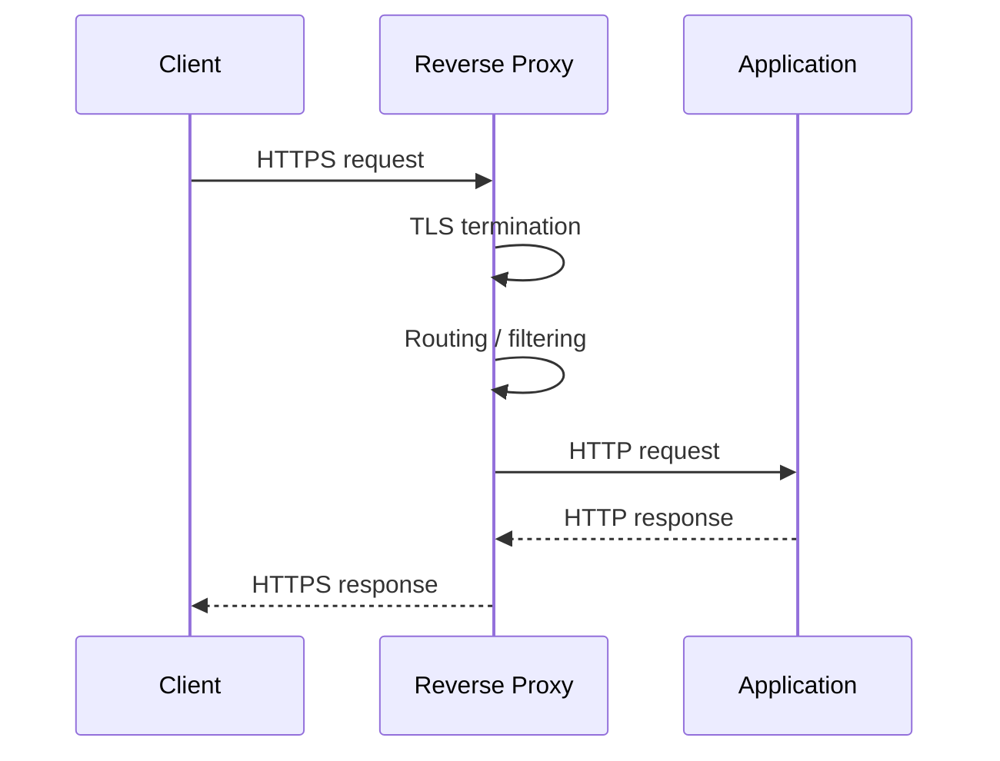
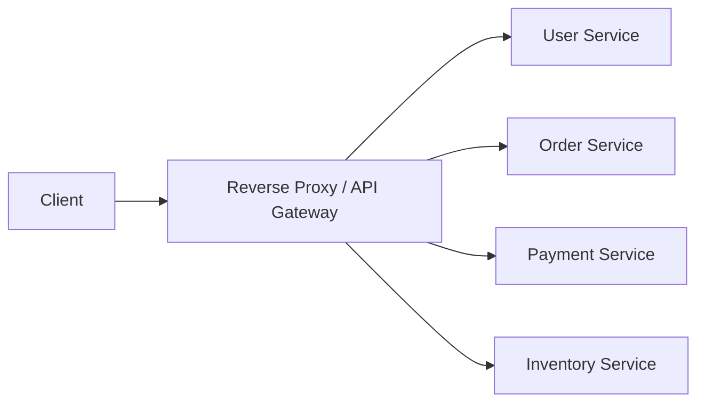

# 14- Reverse Proxy

## Overview

A reverse proxy is a network component that accepts requests from clients and forwards them to one or more backend services.

From the client's perspective:

```text
Client
  |
  v
api.example.com
```

Internally:

```text
Client
  |
  v
Reverse Proxy
  |
  +--> Django
  +--> FastAPI
  +--> gRPC service
  +--> Static files
```

The client does not directly communicate with the backend instances. The reverse proxy becomes the public-facing entry point and controls how traffic reaches internal services.

Reverse proxies are common in production architectures because they provide a centralized place for:

- TLS termination
- Routing
- Load balancing
- Request filtering
- Authentication integration
- Rate limiting
- Compression
- Header manipulation
- Connection management
- Static file serving
- Observability
- Backend isolation

Common reverse proxies include:

- Nginx
- HAProxy
- Envoy
- Traefik
- Cloud load balancers
- Kubernetes Ingress controllers
- Service-mesh proxies

Nginx is particularly common in Django and FastAPI deployments.

---

## Reverse Proxy vs Forward Proxy

The distinction is based on **who the proxy represents**.

### Forward Proxy

A forward proxy represents the client.

```text
Client
  |
  v
Forward Proxy
  |
  v
Internet
```

The destination server may not know the original client directly.

Typical use cases include:

- Corporate internet access
- Outbound filtering
- Privacy controls
- Egress control

### Reverse Proxy

A reverse proxy represents the server.

```text
Internet
   |
   v
Reverse Proxy
   |
   +--> Backend A
   +--> Backend B
```

Clients communicate with the reverse proxy and generally do not need to know the internal backend topology.

| Property | Forward Proxy | Reverse Proxy |
|---|---|---|
| Represents | Client | Server |
| Primary direction | Client → Internet | Internet → Backend |
| Typical use | Egress control | Ingress control |
| Hides | Client | Backend infrastructure |
| Common examples | Corporate proxy | Nginx, HAProxy, Envoy |

---

## Why Reverse Proxies Exist

A backend service should rarely be directly exposed to the public internet.

Consider:

```text
Internet
   |
   v
Django
```

This exposes the application process directly.

A more production-oriented architecture is:

```text
Internet
   |
   v
Nginx
   |
   v
Django
```

The reverse proxy can absorb infrastructure responsibilities that should not be implemented independently in every application.

For example:

```text
                    +--> Django
                    |
Internet --> Nginx -+--> FastAPI
                    |
                    +--> Static Files
```

This creates a separation between:

```text
Internet-facing networking
```

and:

```text
Application processing
```

---

## Basic Request Flow

A typical HTTPS request can flow through several layers:



The reverse proxy may terminate TLS and communicate with the application using HTTP or HTTPS.

For example:

```text
Client
  |
  | HTTPS :443
  v
Nginx
  |
  | HTTP :8000
  v
Gunicorn
  |
  v
Django
```

---

## Core Responsibilities

A reverse proxy can perform several responsibilities simultaneously, but these responsibilities should be designed deliberately.

| Responsibility | Purpose |
|---|---|
| TLS termination | Handle HTTPS encryption |
| Routing | Select backend based on request |
| Load balancing | Distribute traffic |
| Rate limiting | Protect backend capacity |
| Header management | Preserve or modify request metadata |
| Compression | Reduce response size |
| Static files | Serve assets efficiently |
| Connection management | Manage client/backend connections |
| Authentication integration | Enforce access policies |
| Health checks | Avoid unhealthy backends |
| Observability | Produce centralized access logs and metrics |

---

## Routing

One of the most common reverse-proxy responsibilities is routing requests to different backend services.

For example:

```text
/api/users/*       -> User Service
/api/orders/*      -> Order Service
/api/payments/*    -> Payment Service
```

With Nginx:

```nginx
server {
    listen 443 ssl;
    server_name api.example.com;

    location /api/users/ {
        proxy_pass http://user-service;
    }

    location /api/orders/ {
        proxy_pass http://order-service;
    }

    location /api/payments/ {
        proxy_pass http://payment-service;
    }
}
```

The reverse proxy becomes an ingress routing layer.

---

## Host-Based Routing

Routing can also be based on hostname.

```text
api.example.com       -> API
admin.example.com     -> Admin application
static.example.com    -> Static content
```

Example:

```nginx
server {
    listen 443 ssl;
    server_name api.example.com;

    location / {
        proxy_pass http://api_backend;
    }
}

server {
    listen 443 ssl;
    server_name admin.example.com;

    location / {
        proxy_pass http://admin_backend;
    }
}
```

This is useful when multiple applications share the same public infrastructure.

---

## Path-Based Routing

Path-based routing uses the request URI.

```text
https://example.com/api/*
        |
        v
API backend

https://example.com/admin/*
        |
        v
Admin backend
```

Example:

```nginx
location /api/ {
    proxy_pass http://api_backend;
}

location /admin/ {
    proxy_pass http://admin_backend;
}
```

Be careful with URI rewriting semantics because the trailing slash behavior of `proxy_pass` can change the path sent upstream.

---

## Load Balancing

A reverse proxy can distribute requests across multiple backend instances.

```text
                    +--> Backend A
                   /
Client -> Proxy ---+--> Backend B
                   \
                    +--> Backend C
```

Example:

```nginx
upstream api_backend {
    server 10.0.1.10:8000;
    server 10.0.2.10:8000;
    server 10.0.3.10:8000;
}

server {
    listen 80;

    location / {
        proxy_pass http://api_backend;
    }
}
```

Nginx can distribute requests among the upstream servers.

---

## Load-Balancing Strategies

Common strategies include:

| Strategy | Behavior | Typical Use |
|---|---|---|
| Round robin | Rotate requests across instances | General workloads |
| Weighted | Send more traffic to stronger instances | Unequal capacity |
| Least connections | Prefer instances with fewer active connections | Long-lived requests |
| IP hash | Consistent client-to-instance mapping | Limited session affinity |
| Consistent hashing | Stable mapping with minimal redistribution | Caches and distributed systems |

The right algorithm depends on request duration, workload characteristics, and statefulness.

---

## Health Checks

Routing traffic to a dead backend creates avoidable failures.

A production architecture should distinguish:

```text
Backend exists
```

from:

```text
Backend is ready to receive traffic
```

Health checks may verify:

```text
GET /health
```

or a dedicated readiness endpoint:

```text
GET /ready
```

For example:

```text
Reverse Proxy
     |
     +--> Backend A -> healthy
     +--> Backend B -> unhealthy
     +--> Backend C -> healthy
```

The proxy should avoid sending traffic to unhealthy instances when its health-check capabilities and configuration support that behavior.

---

## TLS Termination

TLS termination is one of the most common reasons to deploy a reverse proxy.

Without a reverse proxy:

```text
Client
  |
  | HTTPS
  v
Application
```

With TLS termination:

```text
Client
  |
  | HTTPS
  v
Reverse Proxy
  |
  | HTTP
  v
Application
```

The reverse proxy handles:

- TLS certificates
- TLS negotiation
- Cipher configuration
- HTTP/2 or HTTP/3 support where supported
- Certificate rotation

The internal connection can still use TLS if the internal network is considered untrusted or if compliance requirements require end-to-end encryption.

---

## TLS Termination vs TLS Passthrough

### TLS Termination

```text
Client
  |
HTTPS
  |
Proxy
  |
HTTP
  |
Backend
```

The proxy decrypts the request.

### TLS Passthrough

```text
Client
  |
HTTPS
  |
Proxy
  |
HTTPS
  |
Backend
```

The proxy forwards encrypted traffic without terminating TLS.

TLS termination is usually simpler when centralized routing and HTTP-level policies are required.

TLS passthrough is useful when the backend must own the TLS connection or certificate.

---

## Reverse Proxy Headers

A proxy must preserve important request metadata.

Common headers include:

```http
Host: api.example.com
X-Real-IP: 203.0.113.10
X-Forwarded-For: 203.0.113.10
X-Forwarded-Proto: https
```

Example Nginx configuration:

```nginx
location / {
    proxy_set_header Host $host;
    proxy_set_header X-Real-IP $remote_addr;
    proxy_set_header X-Forwarded-For $proxy_add_x_forwarded_for;
    proxy_set_header X-Forwarded-Proto $scheme;

    proxy_pass http://api_backend;
}
```

These headers allow the application to understand the original request context.

---

## The `X-Forwarded-For` Problem

Suppose:

```text
Client
  |
  v
Load Balancer
  |
  v
Nginx
  |
  v
Django
```

The application may see the proxy IP as the direct peer.

If the application needs the client IP, trusted forwarding headers must be configured correctly.

A common mistake is to blindly trust:

```http
X-Forwarded-For
```

from arbitrary clients.

An attacker could send:

```http
X-Forwarded-For: 10.0.0.1
```

and potentially bypass IP-based controls if the application trusts the header incorrectly.

Only trust forwarded headers from known proxy infrastructure.

---

## Reverse Proxy and Django

A common Django production architecture is:

```text
Internet
   |
   v
Nginx
   |
   v
Gunicorn
   |
   v
Django
   |
   +--> PostgreSQL
   +--> Redis
```

Nginx handles:

- TLS
- Static files
- Client connections
- Request buffering
- Routing

Gunicorn handles:

- Python worker processes
- WSGI execution
- Application concurrency

Django handles:

- Business logic
- Authentication
- ORM
- API processing

Each component has a distinct responsibility.

---

## Reverse Proxy and FastAPI

FastAPI commonly runs behind an ASGI server such as Uvicorn.

A production architecture can look like:

```text
Internet
   |
   v
Nginx
   |
   v
Uvicorn / Gunicorn
   |
   v
FastAPI
```

For example:

```nginx
upstream fastapi_backend {
    server 127.0.0.1:8000;
}

server {
    listen 80;
    server_name api.example.com;

    location / {
        proxy_pass http://fastapi_backend;
        proxy_set_header Host $host;
        proxy_set_header X-Forwarded-For $proxy_add_x_forwarded_for;
        proxy_set_header X-Forwarded-Proto $scheme;
    }
}
```

The application should also be configured to correctly interpret trusted proxy headers.

---

## Reverse Proxy with Docker

A typical Docker architecture is:

```text
Internet
   |
   v
Nginx Container
   |
   v
API Container
   |
   +--> PostgreSQL Container
   +--> Redis Container
```

Docker's internal network allows containers to communicate through service names.

Example:

```yaml
services:
  nginx:
    image: nginx:stable
    ports:
      - "80:80"
    depends_on:
      - api

  api:
    build: .
    expose:
      - "8000"
```

Nginx can route to:

```text
http://api:8000
```

rather than:

```text
http://localhost:8000
```

Inside the Docker network, `api` is the service identity.

---

## Reverse Proxy in Kubernetes

Kubernetes commonly places an ingress layer in front of Services.

```text
Internet
   |
   v
Load Balancer
   |
   v
Ingress Controller
   |
   +--> Service A
   |
   +--> Service B
   |
   +--> Service C
```

The Ingress controller may be implemented using:

- Nginx
- HAProxy
- Traefik
- Envoy
- Cloud-provider integrations

The Kubernetes Service then provides stable discovery for pods.

```text
Ingress
   |
   v
Service
   |
   +--> Pod A
   +--> Pod B
   +--> Pod C
```

Modern Kubernetes environments may also use Gateway API resources instead of relying exclusively on the older Ingress model.

---

## Reverse Proxy vs API Gateway

These concepts overlap but are not identical.

A reverse proxy primarily handles network-level traffic mediation.

An API gateway usually provides additional API-specific capabilities.

| Capability | Reverse Proxy | API Gateway |
|---|---|---|
| Reverse proxying | Yes | Yes |
| TLS termination | Yes | Yes |
| Routing | Yes | Yes |
| Load balancing | Yes | Often |
| Rate limiting | Often | Common |
| Authentication | Limited/optional | Common |
| Authorization | Limited/optional | Common |
| API keys | Rare | Common |
| Request transformation | Some | Common |
| API analytics | Basic | Advanced |
| API lifecycle management | No | Often |
| Developer portal | No | Sometimes |

Nginx can function as both a reverse proxy and, with appropriate configuration/modules, an API gateway.

The architectural distinction is primarily about responsibility and capabilities rather than a strict product boundary.

---

## Reverse Proxy vs Load Balancer

A load balancer distributes traffic among backend instances.

A reverse proxy is a broader concept.

A reverse proxy can:

```text
Route
TLS terminate
Cache
Compress
Filter
Authenticate
Load balance
Serve static files
```

A load balancer can be implemented as a reverse proxy, but not every reverse proxy deployment needs to perform load balancing.

---

## Request Buffering

Reverse proxies can buffer request and response data.

For example:

```text
Client
  |
  | Slow upload
  v
Proxy
  |
  | Controlled upstream request
  v
Backend
```

Buffering can protect application workers from slow clients.

However, excessive buffering can increase:

- Memory usage
- Disk usage
- Request latency

Large uploads should be designed deliberately rather than relying on default buffering behavior.

---

## Connection Management

One important advantage of a reverse proxy is separating client and backend connection characteristics.

For example:

```text
Client
   |
   | Slow / long-lived connection
   v
Nginx
   |
   | Efficient upstream connection
   v
Application
```

The proxy can manage:

- Keep-alive
- Connection reuse
- Timeouts
- Maximum connections
- Request buffering

This can reduce pressure on application workers.

---

## Timeouts

Timeouts are essential.

Typical categories include:

- Client connection timeout
- Client request timeout
- Connect timeout
- Upstream read timeout
- Upstream send timeout
- Keep-alive timeout

Example:

```nginx
location / {
    proxy_connect_timeout 5s;
    proxy_read_timeout 30s;
    proxy_send_timeout 30s;

    proxy_pass http://api_backend;
}
```

Timeouts should reflect application behavior.

A timeout that is too short can terminate legitimate requests.

A timeout that is too long can consume connections and workers during failures.

---

## Long-Lived Connections

WebSockets and Server-Sent Events require special handling.

For WebSockets:

```nginx
location /ws/ {
    proxy_http_version 1.1;
    proxy_set_header Upgrade $http_upgrade;
    proxy_set_header Connection "upgrade";

    proxy_pass http://websocket_backend;
}
```

For SSE, buffering often needs to be disabled:

```nginx
location /events/ {
    proxy_buffering off;
    proxy_cache off;

    proxy_pass http://event_backend;
}
```

Timeouts must also be compatible with the expected connection lifetime.

---

## Compression

A reverse proxy can compress responses.

For example:

```nginx
gzip on;
gzip_types
    application/json
    application/javascript
    text/css
    text/plain
    application/xml;
```

Compression can significantly reduce bandwidth for text-based payloads.

However, it consumes CPU and should not be blindly enabled for already compressed content such as:

- JPEG
- PNG
- WebP
- MP4
- ZIP

Modern deployments may also use Brotli where supported.

---

## Static File Serving

Nginx can serve static assets without involving the application.

Instead of:

```text
Client
  |
  v
Nginx
  |
  v
Django
  |
  v
static.css
```

the proxy can serve the file directly:

```text
Client
  |
  v
Nginx
  |
  v
static.css
```

Example:

```nginx
location /static/ {
    alias /srv/app/static/;
}
```

This reduces application-worker utilization.

For large-scale cloud deployments, object storage and CDNs are often more appropriate.

---

## Caching

A reverse proxy can cache responses.

```text
Client
  |
  v
Reverse Proxy
  |
  +--> Cache HIT -> Response
  |
  +--> Cache MISS -> Backend
```

Caching can reduce:

- Backend CPU
- Database queries
- Network traffic
- Response latency

However, cache invalidation becomes an architectural concern.

Never cache authenticated or user-specific responses without carefully controlling cache keys and authorization semantics.

---

## Rate Limiting

A reverse proxy can reject excessive requests before they reach the application.

Example:

```nginx
limit_req_zone $binary_remote_addr zone=api_limit:10m rate=10r/s;

server {
    location /api/ {
        limit_req zone=api_limit burst=20 nodelay;
        proxy_pass http://api_backend;
    }
}
```

This provides an early protection layer.

However, IP-based rate limiting can be inaccurate behind NATs or shared proxies.

For authenticated APIs, rate limits based on API keys, user identities, tenants, or other trusted dimensions may be more appropriate.

---

## Security Responsibilities

A reverse proxy is a useful security control point.

It can enforce:

- HTTPS
- Security headers
- Request-size limits
- IP allow/deny rules
- Rate limits
- Basic authentication
- Request filtering
- TLS policies
- Connection limits

Example:

```nginx
client_max_body_size 10m;

add_header X-Content-Type-Options "nosniff" always;
add_header Referrer-Policy "strict-origin-when-cross-origin" always;
```

Security policies should still exist at the application layer. A reverse proxy should not become the only security boundary.

---

## Request Size Limits

Large request bodies can exhaust memory or application resources.

For example:

```nginx
client_max_body_size 10m;
```

This is useful for APIs that do not require large uploads.

For upload-heavy systems, use an appropriate architecture such as:

```text
Client
   |
   v
Object Storage
   |
   v
Application
```

instead of sending large files through application workers unnecessarily.

---

## Host Header Validation

Applications should not blindly trust the `Host` header.

Unexpected hostnames can cause:

- Host-header attacks
- Incorrect absolute URLs
- Cache poisoning
- Password-reset link manipulation

Django provides `ALLOWED_HOSTS` for this purpose:

```python
ALLOWED_HOSTS = [
    "api.example.com",
]
```

The proxy and application should have consistent host validation policies.

---

## Protecting the Backend

A common production goal is:

```text
Internet
   |
   v
Reverse Proxy
   |
   v
Private Backend
```

The backend should ideally not be publicly reachable.

For cloud architectures:

```text
Public Subnet
    |
    +--> Load Balancer / Reverse Proxy
                |
                v
Private Subnet
    |
    +--> Application
```

Security groups, network ACLs, firewall rules, and private networking should enforce this topology.

---

## Observability

The reverse proxy is an excellent location for centralized request telemetry.

Useful metrics include:

| Metric | Purpose |
|---|---|
| Request rate | Traffic volume |
| 2xx rate | Successful requests |
| 4xx rate | Client-side failures |
| 5xx rate | Backend/proxy failures |
| Upstream latency | Backend performance |
| Total latency | End-to-end proxy performance |
| Active connections | Capacity planning |
| Connection errors | Network/backend health |
| Bytes sent | Bandwidth planning |
| Bytes received | Ingress utilization |

A useful log format includes:

```text
timestamp
request_id
method
path
status
request_time
upstream_response_time
upstream_status
client_ip
host
```

---

## Distributed Tracing

When multiple proxy layers exist:

```text
Cloud Load Balancer
        |
        v
Nginx
        |
        v
API Gateway
        |
        v
Django
        |
        v
Payment Service
```

propagate a trace identifier through every layer.

The proxy should preserve tracing headers rather than accidentally dropping them.

This allows operators to distinguish:

```text
Proxy latency
```

from:

```text
Application latency
```

and:

```text
Database latency
```

---

## Scalability

A reverse proxy can become a bottleneck if deployed as a single instance.

Avoid:

```text
Internet
   |
   v
Single Nginx
   |
   +--> 100 backend instances
```

A highly available architecture is:

```text
                 Internet
                    |
                    v
             Cloud Load Balancer
               /            \
              v              v
           Nginx A        Nginx B
              \              /
               \            /
                v          v
                 Backend
```

Alternatively, a managed load balancer can provide the reverse-proxy layer directly.

---

## High Availability

Production reverse proxies should generally be deployed redundantly.

Consider:

- Multiple instances
- Multiple availability zones
- Health checks
- Automated replacement
- Stateless configuration
- Centralized configuration management
- Automated certificate rotation
- Infrastructure as code

Avoid storing critical runtime state exclusively on one proxy instance.

---

## Disaster Recovery

A reverse proxy is usually stateless and therefore relatively easy to recreate.

Store configuration in:

- Git
- Infrastructure-as-code repositories
- Configuration management systems
- Secret managers for sensitive values

Avoid treating manually edited production configuration as the source of truth.

A recovery process should be able to recreate:

```text
Load Balancer
      |
      v
Reverse Proxy
      |
      v
Backend Services
```

automatically.

---

## Performance Considerations

Reverse-proxy performance depends on:

- CPU
- Memory
- Network bandwidth
- TLS workload
- Connection count
- Request size
- Response size
- Compression
- Buffering
- Logging
- Upstream latency

TLS termination can consume significant CPU at very high request rates.

HTTP keep-alive and connection reuse reduce connection establishment overhead.

Do not optimize based only on proxy CPU usage. Measure:

```text
Requests/sec
Latency
Error rate
Active connections
Network throughput
Upstream latency
```

before changing configuration.

---

## Common Performance Pitfalls

### Excessive Logging

Verbose access logs at very high traffic rates can become a significant I/O bottleneck.

### Incorrect Worker Architecture

Adding more application workers does not automatically improve throughput if the proxy, database, or downstream service is already saturated.

### Very Large Buffers

Large proxy buffers can increase memory consumption.

### Excessive Compression

Compression can reduce bandwidth but increase CPU usage.

### Long Timeouts

Very long timeouts can retain connections during downstream failures.

### Missing Keep-Alive

Unnecessary connection establishment increases latency and CPU usage.

---

## Reverse Proxy and Microservices

A microservice system commonly uses a reverse proxy or API gateway at the edge:



The edge proxy should not become the place where all business logic is implemented.

Its responsibilities should generally remain focused on:

- Traffic management
- Routing
- Security controls
- Protocol handling
- Observability

Business rules belong in application services.

---

## Reverse Proxy and Internal Service Communication

Do not assume every internal request should pass through the public reverse proxy.

A common architecture is:

```text
External Client
      |
      v
API Gateway
      |
      v
Order Service
      |
      +----> Payment Service
      |
      +----> Inventory Service
```

Internal services can communicate directly through private service discovery, internal load balancers, or service-mesh infrastructure.

This reduces unnecessary network hops.

---

## Configuration Example

A more complete Nginx configuration for a Django-style API might look like:

```nginx
upstream django_backend {
    server django-1:8000;
    server django-2:8000;
}

server {
    listen 80;
    server_name api.example.com;

    client_max_body_size 10m;

    location /static/ {
        alias /srv/app/static/;
        expires 7d;
        add_header Cache-Control "public, max-age=604800";
    }

    location / {
        proxy_pass http://django_backend;

        proxy_http_version 1.1;

        proxy_set_header Host $host;
        proxy_set_header X-Real-IP $remote_addr;
        proxy_set_header X-Forwarded-For $proxy_add_x_forwarded_for;
        proxy_set_header X-Forwarded-Proto $scheme;

        proxy_connect_timeout 5s;
        proxy_read_timeout 30s;
        proxy_send_timeout 30s;
    }
}
```

Production TLS configuration should use certificates and modern TLS settings appropriate to the organization's security requirements.

---

## Operational Workflow

A production reverse-proxy deployment should generally follow:

```text
Configuration change
        |
        v
Version control
        |
        v
CI validation
        |
        v
Configuration test
        |
        v
Deployment
        |
        v
Health check
        |
        v
Traffic validation
```

Before reloading Nginx:

```bash
nginx -t
```

Then:

```bash
nginx -s reload
```

The exact deployment mechanism depends on the operating environment.

Configuration should be validated before production rollout.

---

## Configuration Management

Avoid manually editing production configuration.

Prefer:

```text
Git
 |
 v
CI/CD
 |
 v
Configuration validation
 |
 v
Deployment
```

This provides:

- Version history
- Peer review
- Reproducibility
- Rollback capability
- Auditability

For Kubernetes, declarative manifests and GitOps workflows can provide the same model.

---

## Reverse Proxy Failure Modes

Common failure modes include:

| Failure | Effect |
|---|---|
| Proxy unavailable | Public traffic fails |
| Backend unavailable | 502/503 responses |
| DNS failure | Clients cannot reach proxy |
| Certificate expired | HTTPS failures |
| Incorrect routing | Requests reach wrong service |
| Timeout too low | Legitimate requests fail |
| Timeout too high | Connections remain occupied |
| Bad proxy headers | Incorrect client/protocol information |
| Misconfigured health checks | Healthy services receive no traffic |
| Configuration syntax error | Reload/deployment fails |

A reverse proxy is therefore part of the application's availability path and must be operated accordingly.

---

## HTTP Status Codes at the Proxy

The proxy can generate responses independently of the backend.

For example:

```text
400 -> Invalid request
401 -> Authentication failure
403 -> Access denied
404 -> Route not found
408 -> Request timeout
413 -> Request body too large
429 -> Rate limited
502 -> Bad gateway
503 -> Service unavailable
504 -> Gateway timeout
```

Understanding the distinction is important.

### 502 Bad Gateway

Usually means the proxy could not obtain a valid response from the upstream service.

Possible causes:

- Backend crashed
- Connection refused
- Invalid upstream response

### 503 Service Unavailable

Usually indicates that the service is unavailable or no suitable upstream is available.

### 504 Gateway Timeout

Usually means the upstream did not respond within the configured timeout.

These statuses should be monitored separately.

---

## Common Mistakes

### Exposing the Backend Directly

Bad:

```text
Internet
  |
  +--> :8000 Django
  +--> :8001 FastAPI
```

Prefer:

```text
Internet
  |
  v
Reverse Proxy
  |
  +--> Django
  +--> FastAPI
```

### Trusting Forwarded Headers from Clients

Only trusted proxy infrastructure should be allowed to establish the canonical client-IP/protocol chain.

### Forgetting WebSocket Configuration

Standard HTTP proxying is not sufficient for WebSocket upgrades.

### Using the Same Timeout Everywhere

Different endpoints have different latency requirements.

### Putting Business Logic in Nginx

Routing and traffic policy belong in the proxy; domain logic belongs in the application.

### Running One Proxy Instance

A single proxy can become a single point of failure.

### Ignoring Configuration Testing

A syntax error can prevent a reload or deployment.

Always validate configuration before rollout.

### Serving Large Files Through Application Workers

Use object storage/CDNs or direct proxy/static serving where appropriate.

### Caching Personalized Responses

Incorrect cache configuration can expose one user's response to another user.

### Assuming the Proxy Is the Only Security Layer

Application authorization, network isolation, identity, and data-layer controls remain necessary.

---

## Interview Traps

### Is Nginx a Reverse Proxy?

Yes. Nginx is commonly deployed as a reverse proxy, web server, load balancer, and HTTP traffic-management layer.

### Why Put Nginx in Front of Django?

It can handle TLS, static files, connection management, buffering, routing, and other edge concerns while Django focuses on application logic.

### Does a Reverse Proxy Always Load Balance?

No. Load balancing is one possible reverse-proxy responsibility.

### What Is the Difference Between a Reverse Proxy and an API Gateway?

An API gateway generally provides broader API-management capabilities such as authentication integration, rate limiting, API policies, request transformation, and API-specific observability. The boundaries are not strict.

### Why Use a Reverse Proxy Instead of Exposing Gunicorn Directly?

The proxy provides a dedicated edge layer for TLS, client connection handling, routing, security controls, static assets, and other concerns that should not be coupled to the application server.

### What Causes a 502?

Usually an upstream connectivity or protocol problem, such as a crashed backend, refused connection, or invalid upstream response.

### What Causes a 504?

Usually an upstream response taking longer than the proxy's configured timeout.

### Why Are `X-Forwarded-*` Headers Important?

They preserve information about the original client request when the application is behind one or more proxies.

### Why Is Trusting `X-Forwarded-For` Dangerous?

A client can forge the header unless the application establishes a trusted proxy chain.

### Should Internal Microservice Calls Go Through the Public API Gateway?

Usually not. Internal services should generally use private service discovery or internal routing unless centralized gateway policy is specifically required.

### What Happens If the Reverse Proxy Becomes a Bottleneck?

Increase capacity horizontally, use multiple availability zones, optimize configuration, and remove unnecessary proxy responsibilities. A managed load balancer can also reduce operational burden.

### Why Are Timeouts Important?

They bound resource consumption when upstream services become slow or unavailable and help prevent cascading failures.

### Why Is a Reverse Proxy Useful for WebSockets?

It can manage the HTTP upgrade handshake and maintain the long-lived connection between the client and backend.

---

## Key Takeaways

- A reverse proxy provides a controlled ingress layer between clients and backend services, handling routing, TLS, connection management, load balancing, and other traffic concerns.
- Nginx is commonly used in Django, FastAPI, Docker, and Kubernetes architectures, but the same architectural role can be provided by HAProxy, Envoy, cloud load balancers, or ingress controllers.
- Production reverse proxies must be highly available, correctly configured for forwarded headers and long-lived connections, and protected with appropriate timeouts, request limits, and security policies.
- Reverse proxies should remain focused on traffic and infrastructure concerns; business logic and domain authorization belong in backend services.
- Treat the reverse proxy as a critical production dependency: monitor latency, errors, connections, upstream health, configuration changes, certificates, and capacity.