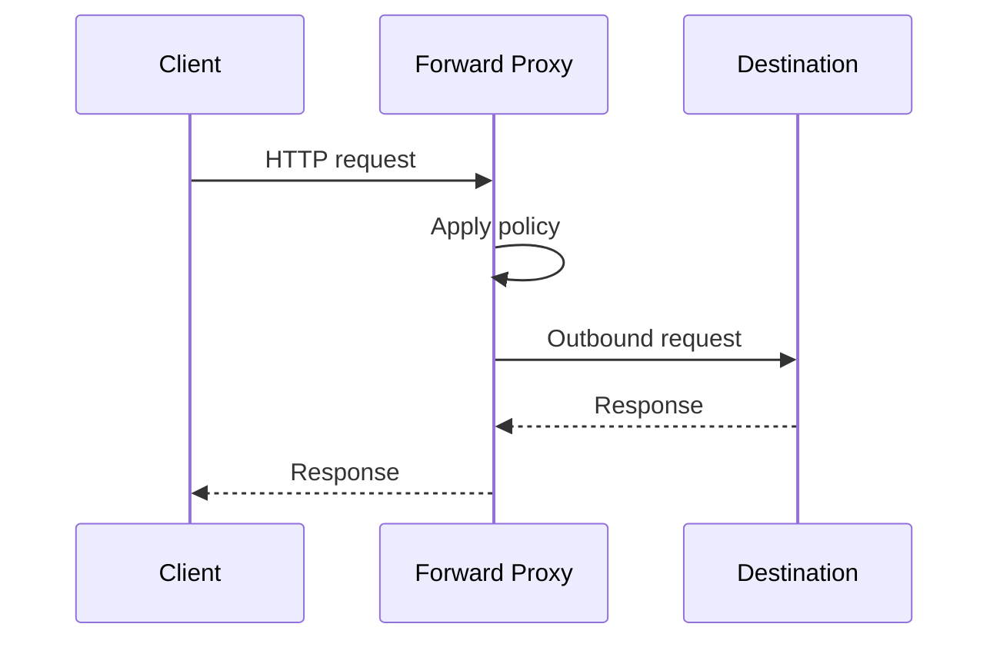
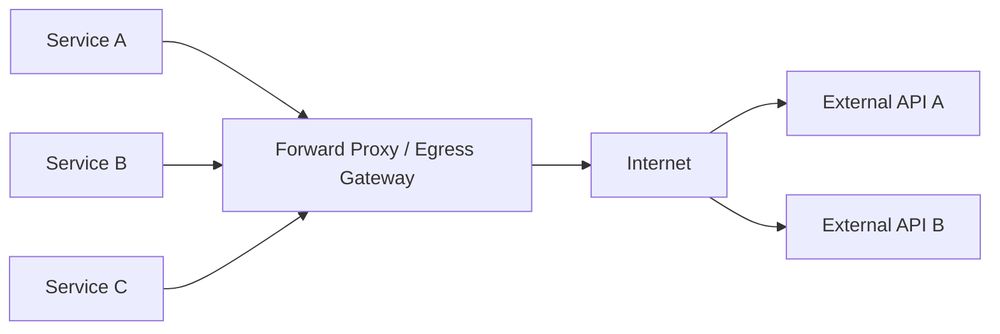
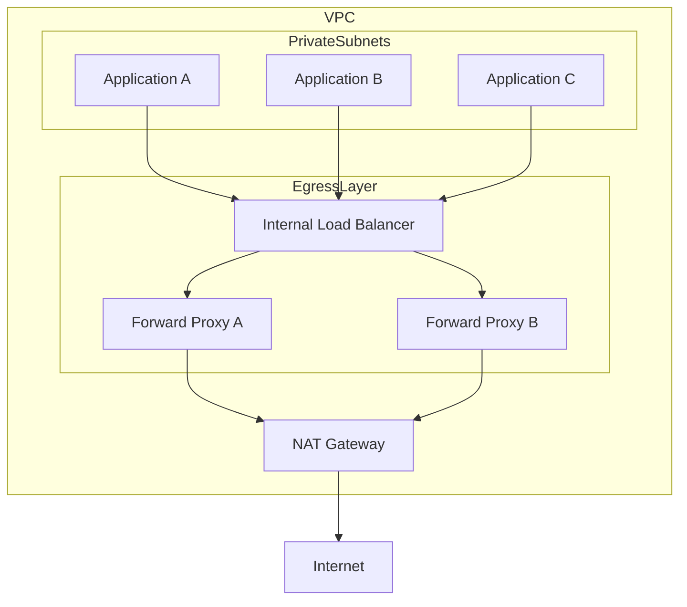

# 15- Forward Proxy

## Overview

A forward proxy is a network intermediary that sits between clients and the destinations they access. Unlike a reverse proxy, which represents backend servers, a forward proxy represents the client side of the connection.

The basic flow is:

```text
Client
  |
  v
Forward Proxy
  |
  v
Destination Server
```

The client sends outbound traffic through the proxy, and the proxy makes the connection to the destination on the client's behalf.

Forward proxies are primarily used for:

- Controlled internet access
- Outbound traffic filtering
- Security and compliance
- Centralized egress control
- Network monitoring
- Identity-based access policies
- IP address abstraction
- Corporate network access
- Access to restricted external networks
- Caching of outbound resources in some environments

Common technologies include:

- Squid
- HAProxy in appropriate proxying scenarios
- Envoy
- SOCKS proxies
- Cloud egress proxies
- Enterprise secure web gateways

For backend engineers, forward proxies become particularly important when applications run in private networks and must access external APIs, package repositories, SaaS services, or other internet resources.

---

## Forward Proxy vs Reverse Proxy

The key distinction is **which side the proxy represents**.

### Forward Proxy

A forward proxy represents clients.

```text
Private Network
     |
     v
Forward Proxy
     |
     v
Internet
```

The destination server receives the request from the proxy infrastructure rather than directly from the original client in many configurations.

### Reverse Proxy

A reverse proxy represents servers.

```text
Internet
    |
    v
Reverse Proxy
    |
    v
Private Backend
```

The client communicates with the reverse proxy rather than directly with the backend.

| Property | Forward Proxy | Reverse Proxy |
|---|---|---|
| Represents | Client | Server |
| Traffic direction | Outbound | Inbound |
| Primary purpose | Control egress | Control ingress |
| Typical users | Employees, applications, workloads | Internet clients |
| Hides | Client/network identity | Backend infrastructure |
| Common use | Internet access control | Routing and load balancing |
| Example | Squid | Nginx |

A useful mental model is:

```text
Forward proxy:
"Clients go through me to reach the internet."

Reverse proxy:
"Internet clients go through me to reach my services."
```

---

## Why Forward Proxies Exist

Without a forward proxy:

```text
Application
    |
    +----> api.stripe.com
    |
    +----> github.com
    |
    +----> pypi.org
    |
    +----> external-service.example.com
```

Every application can independently establish outbound connections.

This creates challenges in large organizations:

- Which applications can access the internet?
- Which domains are allowed?
- Which application generated the request?
- Which user initiated the request?
- How can outbound traffic be audited?
- How can malicious destinations be blocked?
- How can sensitive environments access only approved services?

A forward proxy provides a centralized egress point:

```text
                 +--> Stripe
                /
Application ---> Forward Proxy ---> Internet
                \
                 +--> GitHub
```

This allows organizations to establish consistent outbound traffic policies.

---

## Basic Request Flow

For HTTP traffic, the flow is conceptually:



The proxy may perform:

- Authentication
- Authorization
- Domain filtering
- Logging
- Rate limiting
- TLS inspection where permitted
- Caching
- Connection management

The exact behavior depends on the proxy and organization.

---

## HTTP Proxying

For plain HTTP, a client can send a request through a forward proxy.

Conceptually:

```text
Client
  |
  | HTTP request
  v
Proxy
  |
  | HTTP request
  v
Destination
```

A client might be configured with:

```text
HTTP_PROXY=http://proxy.internal:3128
```

and:

```text
HTTPS_PROXY=http://proxy.internal:3128
```

The proxy then handles outbound connections.

---

## HTTPS Through a Forward Proxy

HTTPS requires special handling because the proxy generally should not simply receive the encrypted HTTP payload as ordinary HTTP.

A common mechanism is the HTTP `CONNECT` method.

The flow becomes:

```text
Client
  |
  | CONNECT api.example.com:443
  v
Forward Proxy
  |
  | TCP connection
  v
api.example.com:443
```

After establishing the tunnel:

```text
Client
  |================ encrypted TLS =================|
  v                                               v
Forward Proxy ------------------------------> Destination
```

The proxy forwards encrypted bytes without necessarily decrypting them.

This is commonly called **HTTPS tunneling**.

---

## The CONNECT Method

A client can request a tunnel using:

```http
CONNECT api.example.com:443 HTTP/1.1
Host: api.example.com:443
```

If the proxy allows the destination:

```http
HTTP/1.1 200 Connection Established
```

The client can then perform TLS negotiation through the tunnel.

Conceptually:

```text
Client
  |
  | CONNECT example.com:443
  v
Proxy
  |
  | 200 Connection Established
  v
Client <========== TLS tunnel ==========> Server
```

The proxy may know:

- Destination hostname
- Destination port
- Connection metadata
- Client identity
- Connection timing
- Traffic volume

But in ordinary tunneling mode it does not necessarily see the encrypted HTTP request body.

---

## TLS Inspection

Organizations sometimes need deeper visibility into HTTPS traffic.

A forward proxy can perform TLS interception in environments where this is explicitly authorized and technically supported.

The architecture becomes:

```text
Client
  |
  | TLS
  v
Forward Proxy
  |
  | New TLS connection
  v
Destination
```

The proxy effectively terminates one TLS connection and establishes another.

This requires trusted client-side certificate infrastructure.

```text
Client
   |
   | TLS using enterprise CA
   v
Proxy
   |
   | TLS using destination certificate
   v
Internet
```

This enables inspection of HTTP-level content but introduces significant security, privacy, compatibility, and operational concerns.

TLS inspection should not be treated as a default requirement.

---

## Forward Proxy Authentication

A proxy can require clients to authenticate before allowing outbound access.

Authentication mechanisms may include:

- Username/password
- API credentials
- Client certificates
- Enterprise identity systems
- IP-based policies
- Workload identity
- Network-level identity

A proxy may require credentials such as:

```text
proxy.internal:3128
username: service-account
password: secret
```

Credentials should never be hardcoded into source repositories.

For applications, prefer:

- Environment variables
- Secret managers
- Workload identity
- Kubernetes Secrets with appropriate controls
- AWS Secrets Manager
- AWS Systems Manager Parameter Store

---

## Environment Variables

Many command-line tools and libraries support standard proxy environment variables.

Common variables include:

```bash
export HTTP_PROXY=http://proxy.internal:3128
export HTTPS_PROXY=http://proxy.internal:3128
export NO_PROXY=localhost,127.0.0.1,.internal.example.com
```

Lowercase equivalents are also commonly used:

```bash
export http_proxy=http://proxy.internal:3128
export https_proxy=http://proxy.internal:3128
export no_proxy=localhost,127.0.0.1,.internal.example.com
```

Application behavior depends on the HTTP client and runtime.

---

## The `NO_PROXY` Setting

`NO_PROXY` specifies destinations that should bypass the proxy.

For example:

```bash
export NO_PROXY=localhost,127.0.0.1,.internal.example.com
```

This means requests to:

```text
localhost
127.0.0.1
*.internal.example.com
```

may bypass the configured proxy.

This is especially important in microservice environments.

Without correct `NO_PROXY` configuration:

```text
Service A
   |
   v
Forward Proxy
   |
   v
Service B
```

may occur unnecessarily even though both services are on the same private network.

---

## Forward Proxy in Backend Applications

Consider a FastAPI service that calls an external payment provider:

```text
FastAPI
   |
   v
Forward Proxy
   |
   v
Payment Provider
```

Python HTTP clients can often be configured to use proxy settings.

For example, with `httpx`:

```python
import httpx

with httpx.Client(
    proxy="http://proxy.internal:3128",
    timeout=httpx.Timeout(10.0),
) as client:
    response = client.get("https://api.example.com/payments")
    response.raise_for_status()
```

For production systems, proxy configuration should normally come from deployment configuration rather than being hardcoded.

---

## Django and Forward Proxies

A Django application may need outbound proxy access for:

- Payment APIs
- Email providers
- Identity providers
- External data APIs
- Object storage
- Monitoring services

The proxy is external to Django:

```text
Django
  |
  v
Forward Proxy
  |
  v
External API
```

The application should distinguish between:

```text
Inbound request handling
```

and:

```text
Outbound dependency calls
```

A reverse proxy usually handles the former, while a forward proxy can control the latter.

---

## Microservices and Egress

In a microservice architecture:

```text
                     +--> Payment API
                    /
Service A ---------+--> GitHub API
                    \
                     +--> SaaS API
```

Allowing every service unrestricted internet access creates a large egress surface.

A centralized architecture is:



The proxy can enforce:

```text
Service identity
       +
Destination
       +
Port
       +
Protocol
       +
Policy
```

before permitting the connection.

---

## Egress Control

Egress means outbound traffic leaving a network.

A secure production network often separates:

```text
Ingress
```

from:

```text
Egress
```

For example:

```text
Internet
   |
   v
Load Balancer
   |
   v
Application
   |
   v
Egress Layer
   |
   v
Internet APIs
```

The ingress path controls who can enter.

The egress path controls where workloads can go.

This is an important security principle:

> Do not assume that internal workloads should have unrestricted internet access.

---

## Forward Proxy vs NAT Gateway

These are often confused.

### NAT Gateway

A NAT gateway primarily provides network address translation so private resources can establish outbound connections.

```text
Private Subnet
     |
     v
NAT Gateway
     |
     v
Internet
```

### Forward Proxy

A forward proxy operates at the application/proxy layer and can understand concepts such as:

- HTTP
- HTTPS
- Hostnames
- Proxy authentication
- HTTP methods
- Application-level policy

```text
Application
     |
     v
Forward Proxy
     |
     v
Internet
```

| Capability | NAT Gateway | Forward Proxy |
|---|---|---|
| Network address translation | Yes | No |
| HTTP awareness | No | Yes |
| Domain-based HTTP policy | No | Yes |
| Proxy authentication | No | Yes |
| Centralized HTTP logging | Limited | Yes |
| Works with arbitrary TCP/UDP | Yes, subject to NAT behavior | Depends on proxy |
| AWS private-subnet egress | Common | Optional additional layer |

A forward proxy and NAT gateway can coexist.

```text
Private Application
        |
        v
Forward Proxy
        |
        v
NAT Gateway
        |
        v
Internet
```

---

## AWS Egress Architecture

A common AWS architecture is:

```text
Private Subnet
     |
     v
Application
     |
     v
Forward Proxy
     |
     v
NAT Gateway
     |
     v
Internet Gateway
     |
     v
Internet
```

The NAT gateway provides network-level internet access.

The proxy adds application-aware egress control.

This can be useful when organizations need:

- Domain allowlists
- Centralized HTTP logs
- Outbound authentication
- Egress inspection
- Application-aware policies

However, adding infrastructure increases cost and operational complexity.

Use the simplest architecture that satisfies the security and compliance requirements.

---

## Security Benefits

A forward proxy can enforce centralized outbound policies.

For example:

```text
Allowed:
api.stripe.com
api.github.com
pypi.org

Denied:
unknown-download.example
malware.example
unapproved-saas.example
```

Policies can be based on:

- Destination
- Port
- Domain
- Source workload
- Identity
- Request method
- Content
- Time
- Network segment

This reduces the number of applications that need independent outbound security logic.

---

## SSRF Protection

Forward proxies can be part of an SSRF defense strategy.

Suppose an application accepts a URL:

```http
POST /fetch
{
    "url": "https://example.com"
}
```

An attacker may attempt:

```text
http://169.254.169.254/
```

or another internal destination.

A forward proxy can enforce destination policies such as:

```text
Allow:
public internet destinations

Deny:
RFC1918 addresses
link-local addresses
loopback
metadata endpoints
internal administrative networks
```

However, a proxy should **not** be considered sufficient SSRF protection.

The application should also:

- Validate URLs
- Restrict protocols
- Resolve and validate destination IPs
- Prevent redirects to prohibited destinations
- Revalidate after DNS resolution where appropriate
- Apply strict allowlists for high-risk functionality

---

## Domain Allowlisting

For high-security environments, outbound access can use an allowlist.

Example:

```text
Service: payment-service

Allowed:
api.stripe.com:443

Denied:
everything else
```

This is stronger than merely blocking known malicious destinations.

An allowlist approach is especially useful for:

- Production workloads
- Financial systems
- Regulated environments
- CI/CD infrastructure
- Build systems
- Sensitive data-processing services

---

## DNS Considerations

Forward proxy architecture interacts closely with DNS.

Consider:

```text
Application
   |
   | example.com
   v
DNS
   |
   v
IP address
```

Depending on the proxy mode, DNS resolution may occur:

```text
Client-side
```

or:

```text
Proxy-side
```

This distinction matters for:

- Internal DNS names
- DNS filtering
- Split-horizon DNS
- SSRF prevention
- Service discovery
- Network policy

For HTTPS `CONNECT`, the client often provides the hostname to the proxy, which can then resolve or connect to the requested destination according to its implementation.

---

## DNS Rebinding and SSRF

DNS-based security controls require care.

An attacker-controlled hostname could resolve to a public address initially and later resolve to a private address.

For example:

```text
evil.example
     |
     +--> public IP
     |
     +--> private IP
```

Applications performing SSRF-sensitive requests should not assume that validating a hostname once is sufficient.

A secure design considers:

- DNS resolution
- IP classification
- Redirect handling
- Connection destination
- Re-resolution behavior

---

## Proxy Chaining

Forward proxies can be chained.

```text
Client
   |
   v
Local Proxy
   |
   v
Corporate Proxy
   |
   v
Cloud Egress Proxy
   |
   v
Internet
```

Proxy chaining may be useful when different organizations or network layers own different policy boundaries.

However, every additional hop introduces:

- Latency
- Failure modes
- Configuration complexity
- Troubleshooting difficulty

Avoid unnecessary proxy chains.

---

## Caching

Some forward proxies can cache outbound resources.

```text
Client A
   |
   v
Forward Proxy
   |
   +--> Cache HIT
   |
   +--> Cache MISS --> Internet
```

Caching can reduce:

- Bandwidth
- Repeated downloads
- External dependency latency

This was historically common for software repositories and web content.

However, modern applications often use specialized caching systems or artifact repositories instead.

Caching authenticated, personalized, or rapidly changing content requires careful cache-key and authorization design.

---

## Package Repository Access

A practical backend use case is controlling dependency downloads.

For example:

```text
CI Runner
   |
   v
Forward Proxy
   |
   v
PyPI
```

The proxy can allow:

```text
pypi.org
files.pythonhosted.org
```

while blocking arbitrary destinations.

An even stronger architecture is to use an internal artifact repository:

```text
CI Runner
   |
   v
Internal Package Repository
   |
   v
Approved External Repository
```

This improves reproducibility and supply-chain control.

---

## Docker and Forward Proxies

Docker environments often require proxy configuration for:

- Image pulls
- Package installation
- External APIs
- Build dependencies

A container may receive:

```text
HTTP_PROXY
HTTPS_PROXY
NO_PROXY
```

Example:

```dockerfile
ARG HTTP_PROXY
ARG HTTPS_PROXY
ARG NO_PROXY

ENV HTTP_PROXY=${HTTP_PROXY}
ENV HTTPS_PROXY=${HTTPS_PROXY}
ENV NO_PROXY=${NO_PROXY}
```

Avoid baking proxy credentials into Docker image layers.

Prefer secure build-time and runtime configuration mechanisms.

---

## Kubernetes and Forward Proxies

A Kubernetes cluster may route outbound application traffic through an egress proxy:

```text
Pod
 |
 v
Egress Proxy
 |
 v
NAT / Firewall
 |
 v
Internet
```

This can provide centralized policy enforcement.

However, Kubernetes applications must be carefully configured so that internal traffic does not accidentally traverse the external proxy.

For example:

```bash
NO_PROXY=.svc,.cluster.local,localhost,127.0.0.1
```

The exact configuration should match the cluster's DNS and networking design.

---

## Service Mesh vs Forward Proxy

Modern service meshes use sidecar or node-level proxies to mediate traffic.

For example:

```text
Application Container
        |
        v
Proxy Sidecar
        |
        v
Network
```

The proxy may handle:

- Service-to-service communication
- mTLS
- Routing
- Retries
- Telemetry
- Policy enforcement

This is related to forward-proxy behavior but serves a broader service-to-service networking model.

Do not introduce a service mesh merely because a forward proxy exists.

---

## Reliability Considerations

A centralized forward proxy creates a dependency.

Without a proxy:

```text
Service A ---> Internet
Service B ---> Internet
Service C ---> Internet
```

With one proxy:

```text
Service A --\
Service B ---+--> Proxy ---> Internet
Service C --/
```

If the proxy fails, all outbound traffic may fail.

Therefore production deployments should provide:

- Multiple proxy instances
- Health checks
- Load balancing
- Failure isolation
- Capacity planning
- Automated replacement

A common architecture is:

```text
                 +--> Proxy A --\
Applications ----+               +--> NAT --> Internet
                 +--> Proxy B --/
```

---

## Scalability

Forward proxies must be sized based on:

- Concurrent connections
- Requests per second
- Throughput
- TLS workload
- Number of clients
- Connection duration
- Logging volume
- Inspection workload

Long-lived connections can consume connection state even when request rates are low.

Monitor:

```text
Active connections
Connection failures
Requests/sec
Bytes/sec
CPU
Memory
Proxy latency
Upstream latency
```

Scale horizontally when a single proxy instance approaches capacity.

---

## High Availability

For production systems:

```text
Applications
     |
     v
Internal Load Balancer
     |
     +--> Proxy A
     |
     +--> Proxy B
     |
     +--> Proxy C
```

Distribute proxies across failure domains where possible.

Avoid:

```text
Applications
     |
     v
Single Proxy
```

because it creates a centralized single point of failure.

---

## Monitoring

Important forward-proxy metrics include:

| Metric | Why It Matters |
|---|---|
| Request count | Traffic volume |
| CONNECT count | HTTPS tunnel volume |
| 4xx responses | Policy/client failures |
| 5xx responses | Proxy/upstream failures |
| Connection failures | Destination/network problems |
| Active connections | Capacity |
| Bytes transferred | Bandwidth |
| Proxy latency | Proxy performance |
| Upstream latency | Destination performance |
| Denied requests | Security/policy visibility |
| Authentication failures | Credential or abuse detection |
| Cache hit rate | Cache effectiveness |

Logs should ideally include:

```text
timestamp
source identity
destination host
destination port
method
status
request size
response size
latency
policy decision
request ID
```

Avoid logging sensitive request bodies or credentials.

---

## Security and Privacy Considerations

A forward proxy can observe significant amounts of network metadata.

Depending on configuration, it may see:

- Client identity
- Destination hostname
- URLs
- HTTP methods
- Headers
- Request bodies
- Response bodies
- TLS metadata
- Traffic volume

TLS tunneling reduces visibility into encrypted application content.

TLS interception increases visibility but also increases responsibility for:

- Key management
- Certificate management
- Privacy
- Data protection
- Access control
- Auditability

Proxy logs can themselves become sensitive data stores.

Protect them using:

- Encryption
- Access control
- Retention policies
- Secret redaction
- Audit logging

---

## Authentication and Authorization

Do not confuse:

```text
Proxy authentication
```

with:

```text
Authorization to access the destination
```

A proxy may verify:

```text
Is this workload allowed to use the proxy?
```

while an application-level token verifies:

```text
Is this workload allowed to access the external API?
```

Both controls may be necessary.

---

## Forward Proxy as a Zero-Trust Control

A forward proxy can support zero-trust principles by making outbound access explicit.

Instead of:

```text
Any workload -> Any internet destination
```

use:

```text
Workload identity
       |
       v
Policy
       |
       v
Approved destination
```

For example:

```text
payment-service
    |
    +--> api.stripe.com:443     ALLOW
    |
    +--> github.com:443         DENY
    |
    +--> internal-db:5432       DENY
```

The proxy becomes one enforcement point in a broader zero-trust architecture.

---

## Common Failure Modes

| Failure | Effect |
|---|---|
| Proxy unavailable | Outbound requests fail |
| Incorrect proxy URL | Applications cannot connect |
| Invalid credentials | Proxy rejects requests |
| Incorrect `NO_PROXY` | Internal requests take unnecessary proxy path |
| Destination blocked | External dependency fails |
| DNS failure | Destination cannot be resolved |
| Proxy overloaded | Increased latency and connection failures |
| NAT unavailable | Proxy cannot reach internet |
| Certificate problems | TLS connections fail |
| Incorrect TLS interception | Applications reject certificates |
| Proxy timeout too short | Slow external APIs fail |
| Proxy timeout too long | Connections remain occupied |

---

## Troubleshooting

Start by determining whether the failure occurs at:

```text
Application
    |
    v
Proxy
    |
    v
DNS
    |
    v
Network
    |
    v
Destination
```

### Test Proxy Connectivity

```bash
curl -v -x http://proxy.internal:3128 https://example.com
```

### Test Without Proxy

```bash
curl -v --noproxy '*' https://example.com
```

If the direct request works but the proxied request fails, investigate:

- Proxy configuration
- Authentication
- Proxy policy
- DNS behavior
- Firewall rules
- Proxy logs

### Check Environment Variables

```bash
env | grep -i proxy
```

Look for:

```text
HTTP_PROXY
HTTPS_PROXY
NO_PROXY
```

---

## Common Mistakes

### Assuming a Forward Proxy Is the Same as NAT

NAT provides network address translation. A forward proxy provides application-aware proxying.

They can be used together.

### Forgetting `NO_PROXY`

This can cause internal service traffic to traverse the proxy unnecessarily.

### Hardcoding Proxy Credentials

Credentials embedded in source code or container images can leak.

Use a secret-management mechanism.

### Allowing Unrestricted CONNECT

A proxy that allows arbitrary `host:port` tunneling can become an unintended general-purpose tunnel.

Restrict allowed destination ports and destinations according to requirements.

### Treating Domain Allowlisting as Perfect Security

Hostname-based controls can be bypassed by complicated DNS behavior, redirects, alternate domains, or IP-based access.

Use layered controls.

### Ignoring Proxy Availability

A centralized proxy is part of the dependency graph.

Deploy redundant instances and monitor them.

### Logging Sensitive Data

Proxy logs can expose:

- Authorization headers
- Cookies
- Query parameters
- Personal data

Log only what is operationally necessary.

### Assuming All Applications Honor Proxy Environment Variables

Different libraries behave differently.

Validate proxy support for:

- Python HTTP clients
- Java applications
- Go services
- CLI tools
- Package managers
- Container runtimes

---

## Production Architecture

A production AWS-style architecture may look like:



This architecture separates:

```text
Application workloads
```

from:

```text
Outbound traffic policy
```

and:

```text
Network-level internet access
```

The proxy can enforce application-aware policies while the NAT gateway provides the underlying network path.

---

## Cost Considerations

Forward-proxy infrastructure introduces additional costs through:

- Proxy compute
- Load balancers
- NAT gateways
- Cross-AZ traffic
- Logging
- TLS inspection
- Monitoring
- Storage for proxy logs

A proxy architecture should therefore be justified by requirements such as:

- Security
- Compliance
- Egress control
- Centralized observability
- Network isolation

For simple applications, direct private-subnet egress through a NAT gateway may be sufficient.

---

## Operational Best Practices

### Keep Proxy Configuration in Version Control

Use:

```text
Git
  |
  v
CI/CD
  |
  v
Configuration Validation
  |
  v
Production
```

### Validate Before Deployment

Check:

- Configuration syntax
- Destination policies
- Authentication
- DNS resolution
- Connectivity
- TLS behavior

### Monitor Policy Denials

Unexpected denials often indicate:

- Application configuration changes
- New external dependencies
- Dependency failures
- Incorrect allowlists

### Avoid Single Points of Failure

Run multiple proxy instances across independent failure domains.

### Keep Policies Explicit

Prefer:

```text
payment-service -> api.stripe.com:443
```

over:

```text
payment-service -> *.com:443
```

where practical.

### Separate Security and Application Concerns

The proxy should enforce network policy, while applications remain responsible for:

- Authentication
- Authorization
- Input validation
- SSRF-safe URL handling
- Data protection

---

## Interview Traps

### What Is a Forward Proxy?

A forward proxy is an intermediary that represents clients and handles their outbound requests to destination servers.

### What Is the Difference Between Forward and Reverse Proxy?

A forward proxy controls client-to-destination traffic, while a reverse proxy controls client-to-server traffic on behalf of backend infrastructure.

### Why Use a Forward Proxy?

For centralized outbound access control, security, auditing, egress management, and sometimes caching.

### Does HTTPS Work Through a Forward Proxy?

Yes. Commonly the client uses `CONNECT` to establish a TCP tunnel to the destination and then performs TLS through that tunnel.

### Can a Proxy Read HTTPS Traffic?

Not necessarily. With ordinary CONNECT tunneling, the proxy generally forwards encrypted bytes. TLS interception can provide HTTP-level visibility but requires explicit trust and certificate infrastructure.

### What Is the Difference Between a Forward Proxy and NAT Gateway?

A NAT gateway provides network-level address translation, while a forward proxy provides application-aware proxying and policy enforcement.

### Why Is `NO_PROXY` Important?

It prevents destinations such as localhost, cluster services, and private internal services from unnecessarily traversing the external proxy.

### Can a Forward Proxy Improve Security?

Yes, by centralizing egress policy, restricting destinations, logging outbound traffic, and enforcing workload-specific access rules. It is only one layer of a defense-in-depth strategy.

### Can a Forward Proxy Become a Single Point of Failure?

Yes. If all outbound traffic depends on one proxy instance, its failure can break external dependencies. Use redundant instances and health-aware routing.

### How Does a Forward Proxy Help With SSRF?

It can block requests to private, loopback, link-local, or metadata destinations, but application-level URL validation and redirect handling are still required.

### When Would You Use a Forward Proxy Instead of Direct NAT?

Use a forward proxy when application-aware outbound controls, identity-based policy, centralized HTTP logging, or inspection are required. Use direct NAT when simple network-level internet egress is sufficient.

---

## Key Takeaways

- A forward proxy represents clients and provides centralized control over outbound traffic, while a reverse proxy represents servers and controls inbound traffic.
- HTTPS commonly uses the `CONNECT` method to establish a tunnel through the proxy without requiring the proxy to decrypt application traffic.
- Forward proxies can enforce egress policies, support auditing, reduce attack surface, and contribute to SSRF protection, but they should be part of defense in depth rather than the sole security mechanism.
- In AWS architectures, a forward proxy and NAT gateway can work together: the proxy provides application-aware policy while the NAT gateway provides network-level internet connectivity.
- Production forward-proxy deployments require redundant capacity, carefully managed `NO_PROXY` configuration, secure credentials, explicit destination policies, observability, and controlled failure handling.