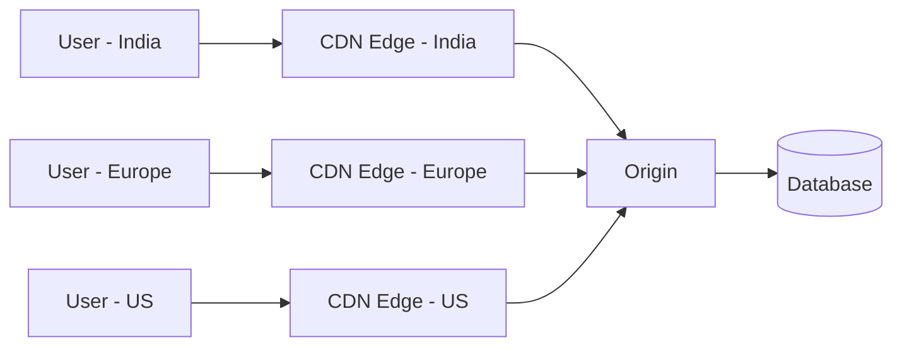
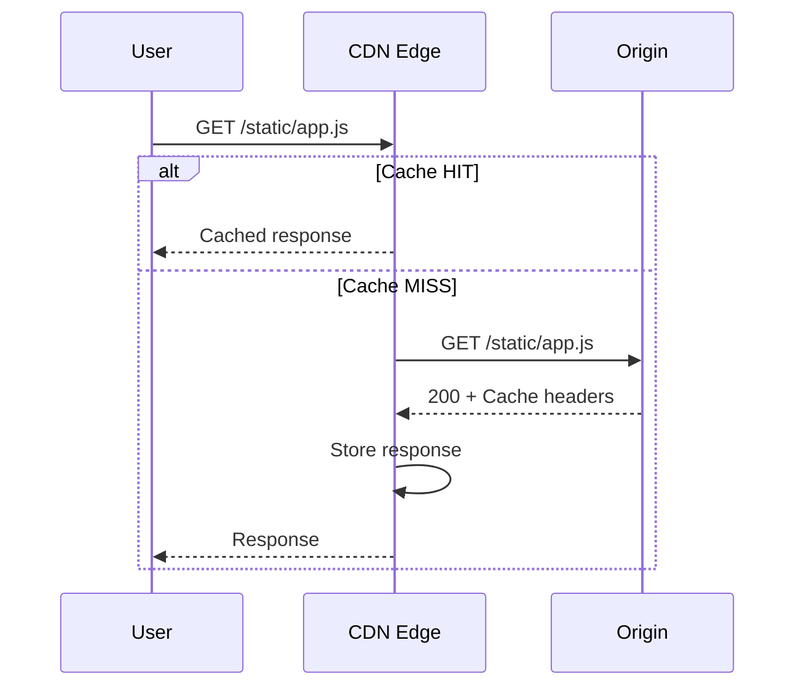
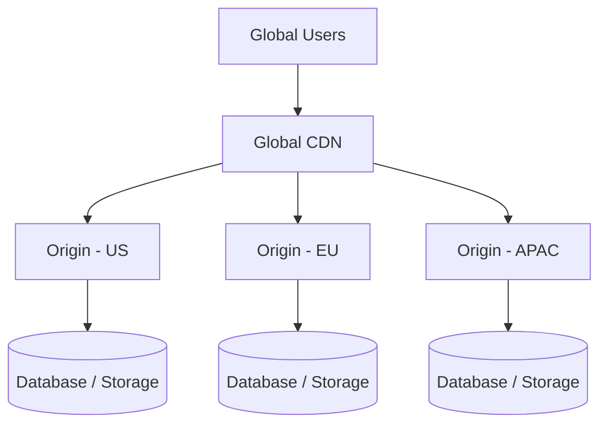

# 16- CDN

## Overview

A Content Delivery Network (CDN) is a globally distributed network of edge locations that serves content closer to users than the origin infrastructure.

Instead of every request traveling directly to an application server:

```text
User
 |
 v
Origin Server
```

a CDN introduces an edge layer:

```text
User
 |
 v
Nearest CDN Edge
 |
 +--> Cache HIT  ---> Response
 |
 +--> Cache MISS --> Origin
```

The primary purpose of a CDN is to reduce latency, decrease origin load, improve availability, and efficiently distribute content at global scale.

CDNs are commonly used for:

- Static assets such as JavaScript, CSS, images, fonts, and videos
- Downloadable files
- Public API responses where caching is safe
- Software packages
- Media delivery
- TLS termination
- HTTP request filtering
- DDoS protection
- Edge redirects and routing
- Dynamic content acceleration

Common CDN technologies include:

- Amazon CloudFront
- Cloudflare
- Fastly
- Akamai

For backend engineers, CDN design is important because it changes the request path, caching model, origin capacity requirements, deployment strategy, and consistency behavior of a distributed system.

---

## Why CDNs Exist

Without a CDN, users located far from the application region may experience higher network latency.

For example:

```text
User in India
     |
     | Long-distance network path
     v
AWS Region in US
     |
     v
Application
```

With a CDN:

```text
User in India
     |
     v
CDN Edge in India
     |
     v
Cached Response
```

For a cache hit, the request does not need to reach the origin.

This provides two major benefits:

1. Lower user-perceived latency.
2. Lower request and bandwidth load on the origin.

At global scale, the reduction can be substantial.

---

## CDN Architecture

A typical production architecture looks like:



The origin can be:

- S3
- Nginx
- Application Load Balancer
- Kubernetes ingress
- Django
- FastAPI
- API gateway
- Object storage
- Another HTTP server

A CDN does not replace the application architecture. It sits in front of the origin and handles eligible traffic.

---

## Core CDN Components

| Component | Responsibility |
|---|---|
| Edge location | Serves requests close to users |
| Origin | Source of authoritative content |
| Cache | Stores reusable responses |
| Distribution | Global CDN configuration |
| Cache policy | Determines what identifies a cache object |
| Origin request policy | Controls what is sent to origin |
| TTL | Determines how long content remains fresh |
| Invalidation | Removes cached objects |
| TLS configuration | Handles HTTPS |
| WAF integration | Filters malicious traffic |
| Access control | Restricts private content |
| Logs and metrics | Provides operational visibility |

---

## Request Lifecycle

A simplified CDN request lifecycle is:



The critical decision is whether the edge already has a valid cache object.

A cache hit avoids origin communication.

A cache miss requires an origin request and potentially creates a new cache entry.

---

## Cache Hit and Cache Miss

### Cache Hit

```text
Client
  |
  v
CDN
  |
  | Object exists and is fresh
  v
Cached Response
```

The origin is not contacted.

### Cache Miss

```text
Client
  |
  v
CDN
  |
  | Object missing/stale
  v
Origin
  |
  v
CDN Cache
  |
  v
Client
```

The CDN stores the response according to its caching policy.

The percentage of requests served from cache is the **cache hit ratio**.

```text
Cache Hit Ratio =
Cache Hits / Total Cache Requests
```

A high hit ratio generally reduces origin load, but the correct target depends on the workload.

---

## Cache Key

A CDN needs to determine whether two requests refer to the same cacheable object.

This is controlled by the **cache key**.

For example:

```text
GET /products?page=1
GET /products?page=2
```

should usually represent different cached objects.

A cache key might contain:

```text
Host
+
Path
+
Selected query parameters
+
Selected headers
+
Selected cookies
```

The exact composition depends on the CDN configuration.

---

## Cache Key Design

Poor cache-key design can destroy cache effectiveness.

Suppose:

```text
GET /products
Cookie: session_id=abc
```

and:

```text
GET /products
Cookie: session_id=xyz
```

are treated as different cache objects even though the response is identical.

This can produce:

```text
User A -> Cache MISS
User B -> Cache MISS
User C -> Cache MISS
User D -> Cache MISS
```

instead of:

```text
User A -> Cache MISS
User B -> Cache HIT
User C -> Cache HIT
User D -> Cache HIT
```

A senior-level CDN design question is therefore not simply:

> "Can we cache this?"

It is:

> "What makes two requests semantically equivalent?"

---

## TTL

TTL determines how long a cached object can remain fresh.

For example:

```http
Cache-Control: public, max-age=3600
```

means the response can generally be considered fresh for one hour under the specified caching semantics.

Typical strategies include:

| Content | Typical Strategy |
|---|---|
| Hashed JS/CSS | Long TTL |
| Versioned images | Long TTL |
| Public API response | Short/moderate TTL |
| Frequently changing data | Short TTL |
| Personalized response | Usually bypass cache |
| Private user data | Private/no shared cache |
| Immutable assets | Very long TTL |

The exact TTL should be based on freshness requirements rather than arbitrary values.

---

## Immutable Assets

A highly effective pattern is content-addressed or fingerprinted assets.

Instead of:

```text
/app.js
```

use:

```text
/app.8f3c91a2.js
```

When the application changes:

```text
/app.4a72c91f.js
```

The filename changes.

Therefore the CDN can safely cache the old object for a very long time.

Example:

```http
Cache-Control: public, max-age=31536000, immutable
```

This is one of the most effective CDN caching patterns for frontend assets.

---

## Cache Invalidation

Sometimes cached content must be removed before its TTL expires.

For example:

```text
/assets/logo.png
```

is cached for 24 hours, but the logo is replaced immediately.

A CDN can support invalidation:

```text
Invalidate /assets/logo.png
```

The edge removes or marks the object stale according to its implementation.

Invalidation is useful, but relying heavily on it can introduce operational complexity and sometimes additional cost.

Prefer versioned assets where possible.

---

## Cache Busting

Instead of invalidating:

```text
/app.js
```

change the URL:

```text
/app.v2.js
```

or:

```text
/app.js?v=20260823
```

Content-hashed filenames are generally stronger because they make asset identity explicit.

```text
app.2f4c9a1.js
```

The deployment process can generate the hash automatically.

---

## Origin Shielding

At large scale, many CDN edges may simultaneously miss the same object.

Without origin shielding:

```text
Edge A ----\
Edge B -----\
Edge C ------> Origin
Edge D -----/
```

A CDN may provide an intermediate shield/cache layer:

```text
Edge A ----\
Edge B -----\
Edge C ------> Shield ----> Origin
Edge D -----/
```

The shield reduces repeated origin requests and can improve origin efficiency.

This is particularly useful when:

- Traffic is global
- Origin bandwidth is expensive
- Objects have high fan-out
- Many edges request the same content

---

## Cache Stampede

Suppose a popular object expires:

```text
Cached object expires
        |
        v
1000 requests arrive
        |
        +--> Origin request
        +--> Origin request
        +--> Origin request
        +--> ...
```

This can overload the origin.

This is commonly called a cache stampede or thundering herd.

Mitigation strategies include:

- Request coalescing
- Origin shielding
- Stale-while-revalidate
- Stale-if-error
- Longer TTLs for stable content
- Prewarming
- Application-level caching
- Controlled revalidation

---

## Stale-While-Revalidate

A cache can serve stale content while refreshing it in the background.

Conceptually:

```text
Client
  |
  v
CDN
  |
  +--> Serve slightly stale response
  |
  +--> Background revalidation
             |
             v
           Origin
```

This reduces latency spikes when cached objects become stale.

A response can communicate this policy using HTTP cache directives where supported:

```http
Cache-Control: public, max-age=60, stale-while-revalidate=300
```

This is particularly useful for content where serving a slightly older version is preferable to increasing latency or origin load.

---

## Dynamic Content and CDN Caching

CDNs are not limited to static assets.

Public API responses can sometimes be cached:

```http
GET /api/products
```

If:

- The response is identical for many users.
- It does not contain private data.
- Freshness requirements allow caching.
- Authorization does not alter the response.

For example:

```text
GET /api/catalog
```

may be cacheable for 30 seconds.

But:

```text
GET /api/me/orders
```

usually should not be shared through a public CDN cache because it contains user-specific data.

---

## Personalized Content

Consider:

```http
GET /profile
Authorization: Bearer <token>
```

Caching the response without carefully considering the cache key and privacy semantics can expose one user's data to another user.

This is a serious security failure.

For personalized endpoints, prefer:

```text
CDN
 |
 +--> bypass cache
 |
 v
Origin
```

unless the caching design explicitly handles authorization and user identity safely.

---

## CDN and REST APIs

A typical REST architecture can be:

```text
Client
  |
  v
CDN
  |
  v
API Gateway / Load Balancer
  |
  v
Django / FastAPI
  |
  v
Redis / PostgreSQL
```

The CDN can handle:

- TLS
- Static assets
- Public GET caching
- DDoS mitigation
- WAF integration
- Geographic edge delivery
- Compression
- Request routing

The application remains responsible for:

- Business logic
- Authentication
- Authorization
- Validation
- Transactions
- Database operations

---

## CDN and Django

A Django application might serve:

```text
/static/
```

and:

```text
/media/
```

through object storage and a CDN.

A common architecture is:

```text
Browser
   |
   v
CloudFront
   |
   +--> S3/static assets
   |
   +--> Application Load Balancer
             |
             v
           Django
```

Django does not need to process every static asset request.

This reduces application CPU and network load.

---

## CDN and FastAPI

FastAPI APIs can also sit behind a CDN:

```text
Client
  |
  v
CDN
  |
  v
Load Balancer
  |
  v
FastAPI
```

However, simply putting an API behind a CDN does not automatically make it cacheable.

The cacheability of each endpoint must be explicitly evaluated.

---

## CDN and Object Storage

Object storage is an ideal CDN origin for static content.

For example:

```text
Browser
   |
   v
CDN
   |
   v
S3
```

This architecture is highly scalable because the application servers are removed from the static-content delivery path.

Typical objects include:

- Images
- CSS
- JavaScript
- Fonts
- PDFs
- Videos
- Software packages

---

## CDN and Nginx

Nginx can serve as an origin behind a CDN:

```text
Client
  |
  v
CDN
  |
  v
Nginx
  |
  v
Application
```

Nginx may provide:

- Static file serving
- Compression
- Connection management
- Reverse proxying
- Request buffering

The CDN handles global edge distribution while Nginx handles origin-side traffic.

---

## CDN and Kubernetes

A Kubernetes application can use:

```text
Internet
   |
   v
CDN
   |
   v
Cloud Load Balancer
   |
   v
Ingress
   |
   v
Service
   |
   v
Pods
```

This protects the cluster from handling every request directly and can absorb large amounts of cacheable traffic at the edge.

The CDN should not be considered a replacement for Kubernetes autoscaling.

---

## CDN and WebSockets

Traditional CDN caching does not apply to WebSocket messages.

However, some CDNs can proxy or support WebSocket connections.

The architecture becomes:

```text
Client
  |
  v
CDN / Edge
  |
  v
WebSocket Service
```

Long-lived connections have different capacity characteristics from cacheable HTTP requests.

Do not evaluate WebSocket architecture using cache-hit-ratio metrics.

Instead monitor:

- Active connections
- Connection establishment rate
- Connection duration
- Message throughput
- Connection failures

---

## CDN Request Headers

CDNs commonly add or forward metadata such as:

```text
Host
User-Agent
X-Forwarded-For
X-Forwarded-Proto
```

The exact headers depend on the CDN and configuration.

Applications should carefully distinguish trusted proxy-generated headers from client-controlled headers.

For example, blindly trusting:

```http
X-Forwarded-For
```

from arbitrary clients can create incorrect client-IP attribution.

Configure the application and proxy chain so that only trusted infrastructure can establish these headers.

---

## Compression

CDNs can compress responses using mechanisms such as:

- Gzip
- Brotli

For text-based content:

```text
HTML
CSS
JavaScript
JSON
XML
```

compression can significantly reduce bandwidth.

For already-compressed formats:

```text
JPEG
PNG
WebP
AVIF
ZIP
GZIP
```

additional compression usually provides little benefit and can waste CPU.

---

## Range Requests

Large objects such as videos may use HTTP range requests:

```http
Range: bytes=1000000-1999999
```

This allows clients to request portions of an object.

CDNs can support range-based delivery depending on their configuration.

This is useful for:

- Video streaming
- Large downloads
- Resumable downloads
- Large media files

---

## Geographic Distribution

A CDN routes clients toward appropriate edge infrastructure based on factors such as:

- Geographic location
- Network topology
- Edge availability
- CDN routing policies
- Health

The goal is not always simply "nearest physical server."

The best edge may depend on network performance and availability.

---

## Origin Selection

A CDN can sometimes route traffic among multiple origins.

For example:

```text
CDN
 |
 +--> Origin A
 |
 +--> Origin B
```

This can support:

- Multi-region deployments
- Failover
- Disaster recovery
- Gradual migrations
- Regional routing

A senior design should consider what happens when the primary origin fails.

---

## Multi-Region Origin Architecture

For higher availability:



This architecture introduces additional complexity around:

- Data replication
- Consistency
- Failover
- Deployment
- Routing
- Cost

A CDN does not automatically solve multi-region application availability.

---

## Security

A CDN can improve the security posture of an application by acting as an edge security layer.

Common controls include:

- TLS termination
- WAF rules
- Rate limiting
- Bot controls
- DDoS mitigation
- IP filtering
- Geographic restrictions
- Origin access control

A common architecture is:

```text
Internet
   |
   v
CDN
   |
   +--> WAF
   |
   v
Origin
```

The origin should ideally not be directly exposed when the architecture does not require it.

---

## Protecting the Origin

If users can bypass the CDN and directly reach the origin:

```text
Client
  +------> CDN ------> Origin
  |
  +------------------> Origin
```

attackers may avoid CDN protections.

A stronger architecture is:

```text
Internet
   |
   v
CDN
   |
   v
Origin
```

with origin access restricted to trusted CDN infrastructure where supported.

For AWS S3, use modern origin access controls rather than exposing a bucket publicly solely for CDN access.

---

## DDoS Considerations

CDNs can absorb large volumes of traffic at the edge.

The principle is:

```text
Internet Attack Traffic
        |
        v
     CDN Edge
        |
        | filtered/absorbed
        v
     Origin
```

This protects origin capacity from many classes of volumetric attacks.

However:

- Application-layer attacks can still reach the origin.
- Cache misses can still generate origin load.
- Expensive dynamic endpoints can be abused.
- Rate limiting may still be necessary.

A CDN is not a substitute for application-level security.

---

## Cache Poisoning

Cache poisoning occurs when an attacker causes a CDN to cache an unintended response that will later be served to other users.

Risk factors include:

- Untrusted headers affecting responses
- Incorrect cache-key configuration
- Host-header handling
- Unvalidated query parameters
- Caching responses that should be private

For example:

```text
Attacker request
      |
      v
CDN
      |
      v
Poisoned cache object
      |
      v
Legitimate users receive bad response
```

Mitigation includes:

- Explicit cache keys
- Controlled request headers
- Correct origin validation
- Strict cacheability rules
- Avoiding cache of personalized responses
- Testing cache behavior

---

## Cache-Control

HTTP cache directives are fundamental to CDN behavior.

Example:

```http
Cache-Control: public, max-age=3600
```

Private content:

```http
Cache-Control: private, no-store
```

Immutable static assets:

```http
Cache-Control: public, max-age=31536000, immutable
```

The exact behavior depends on the CDN's cache policy and configuration.

Do not assume that adding a `Cache-Control` header automatically produces the desired CDN behavior if the CDN configuration overrides or ignores it.

---

## ETag and Revalidation

An origin can provide an ETag:

```http
ETag: "abc123"
```

A client or CDN may later revalidate:

```http
If-None-Match: "abc123"
```

If the object has not changed:

```http
HTTP/1.1 304 Not Modified
```

This reduces payload transfer and can reduce origin bandwidth.

Revalidation is different from simply keeping an object fresh for a longer TTL.

---

## Last-Modified

Another revalidation mechanism is:

```http
Last-Modified: Sat, 23 Aug 2026 10:00:00 GMT
```

A subsequent request can use:

```http
If-Modified-Since: Sat, 23 Aug 2026 10:00:00 GMT
```

The origin can return:

```http
304 Not Modified
```

when appropriate.

ETags generally provide more precise validators than timestamps, but both mechanisms are part of HTTP caching semantics.

---

## CDN and Application Caching

CDN caching is only one layer.

A production system may use:

```text
Browser Cache
      |
      v
CDN Cache
      |
      v
Reverse Proxy Cache
      |
      v
Application Cache
      |
      v
Database
```

For example:

```text
Browser
  |
  v
CloudFront
  |
  v
Nginx
  |
  v
Django
  |
  v
Redis
  |
  v
PostgreSQL
```

Each layer has different responsibilities.

Do not duplicate caching blindly.

A cache hierarchy should be intentional.

---

## CDN vs Redis

Redis and a CDN solve different problems.

| Property | CDN | Redis |
|---|---|---|
| Primary location | Edge | Application infrastructure |
| Main purpose | Global content delivery | Application data caching |
| User proximity | Very high | Usually low relative to users |
| Typical data | HTTP responses/assets | Objects, sessions, computed values |
| Protocol | HTTP-aware | Application/data protocol |
| Global distribution | Built-in | Requires architecture |
| Origin protection | Yes | Indirect |
| Typical backend use | Public content | Database/query caching |

A CDN is optimized for distributing content to clients.

Redis is optimized for fast application-side data access.

---

## Cache Consistency

CDNs introduce another copy of data.

```text
Origin
  |
  +--> Edge A
  |
  +--> Edge B
  |
  +--> Edge C
```

Therefore updates may not become visible everywhere immediately.

This creates an important system-design question:

> What level of staleness is acceptable?

For static assets:

```text
Minutes/hours/days
```

may be acceptable.

For financial balances:

```text
Even a few seconds
```

may be unacceptable.

Therefore cacheability depends heavily on business semantics.

---

## CDN for Eventual Consistency

CDNs naturally work well with content where eventual consistency is acceptable.

Examples:

- Product images
- Documentation
- Public catalogs
- Blog posts
- Marketing pages
- Static JavaScript
- CSS
- Fonts

They are generally unsuitable for strongly consistent, user-specific transactional state unless the design explicitly addresses freshness and privacy.

---

## Performance Considerations

CDNs improve performance primarily by reducing network distance and origin work.

Performance gains depend on:

- Cache hit ratio
- Object size
- User geography
- Origin latency
- Network quality
- TLS connection reuse
- Compression
- Cache policy

A CDN does not necessarily improve every request.

For a cache miss:

```text
User
 |
 v
CDN
 |
 v
Origin
```

there is still an origin dependency.

For highly dynamic traffic, the main benefit may instead be:

- DDoS protection
- TLS termination
- Connection optimization
- Request routing
- Edge filtering

---

## Measuring CDN Performance

Important metrics include:

| Metric | Meaning |
|---|---|
| Cache hit ratio | Percentage served from cache |
| Cache miss ratio | Percentage requiring origin access |
| Origin request count | Load reaching origin |
| Edge latency | CDN response latency |
| Origin latency | Time spent reaching origin |
| Error rate | Failed requests |
| Bytes served | CDN bandwidth |
| Origin bytes | Origin bandwidth |
| 4xx rate | Client-side errors |
| 5xx rate | Server-side errors |
| Cache eviction rate | Cache churn |

Do not optimize solely for cache hit ratio.

A high hit ratio is useful only if the cached content is correct and provides meaningful origin-load or latency benefits.

---

## Cost Considerations

CDNs generally charge based on factors such as:

- Data transfer
- Requests
- Geographic region
- Features
- WAF usage
- Edge compute
- Logging
- Origin traffic

A CDN can reduce origin bandwidth while increasing CDN delivery costs.

For large workloads, evaluate:

```text
CDN cost
+
Origin cost
+
Storage cost
+
WAF cost
+
Logging cost
```

against the performance and reliability benefits.

---

## Disaster Recovery

A CDN can help during origin failures when stale content can safely continue to be served.

For example:

```text
Origin unavailable
       |
       v
CDN
       |
       v
Serve stale cached object
```

This can improve resilience for non-critical content.

However, CDN cache is not a substitute for:

- Database backups
- Replication
- Multi-region storage
- Disaster recovery procedures
- Origin recovery

Treat CDN caching as an availability optimization, not a primary disaster-recovery datastore.

---

## CDN Deployment Strategy

A typical deployment pipeline is:

```text
Developer
   |
   v
Git
   |
   v
CI/CD
   |
   v
Build Assets
   |
   v
Upload to Object Storage
   |
   v
Update Application
   |
   v
CDN Serves New Version
```

For immutable assets:

```text
app.a13f9d.js
app.b927ca.js
```

the deployment does not require broad invalidation.

This reduces deployment coupling with CDN cache state.

---

## Blue-Green and Canary Deployments

CDNs can participate in controlled traffic routing.

For example:

```text
                 +--> Origin Blue
CDN --> Router --|
                 +--> Origin Green
```

or:

```text
95% --> Version A
 5% --> Version B
```

This can support:

- Canary releases
- Regional rollout
- A/B testing
- Blue-green deployments

However, cache keys and cache state must be considered carefully during traffic splitting.

---

## Common Mistakes

### Caching Personalized Responses

This can expose one user's data to another.

Use private/no-store semantics or a carefully designed cache strategy.

### Using Long TTLs Without Versioned Assets

Users may continue receiving old JavaScript or CSS after deployment.

Prefer immutable, fingerprinted assets.

### Invalidating Everything After Every Deployment

This creates unnecessary cache churn and increases origin traffic.

Prefer content-hashed assets.

### Ignoring Query Parameters

If query parameters change response content, they must be represented appropriately in the cache key.

### Including Every Header in the Cache Key

This can fragment the cache and produce a low hit ratio.

Include only headers that materially change the response.

### Exposing the Origin

Attackers can bypass CDN protections if the origin is publicly reachable without restrictions.

### Treating CDN as a Database

CDN cache is ephemeral distributed cache infrastructure, not durable authoritative storage.

### Assuming CDN Makes APIs Fast

A dynamic API request that always reaches the origin still depends on:

```text
CDN
+
Network
+
Load Balancer
+
Application
+
Database
```

### Ignoring Stale Data

Caching changes consistency semantics.

The system must define acceptable staleness.

### Ignoring Cache Invalidation During Incidents

When content is incorrect, operators need a predictable way to invalidate or version objects.

---

## Production Design Checklist

Before deploying a CDN, answer:

| Question | Design Decision |
|---|---|
| What content is cacheable? | Explicit allowlist |
| What is the cache key? | Path + required parameters/headers |
| What TTL is acceptable? | Based on freshness requirements |
| Is content public or private? | Determines cacheability |
| How are assets versioned? | Prefer content hashing |
| How is invalidation handled? | Targeted invalidation |
| What happens during origin failure? | Failover/stale behavior |
| How is origin protected? | Access restrictions |
| How is HTTPS configured? | TLS policy/certificates |
| How is abuse handled? | WAF/rate limiting |
| How is performance measured? | Hit ratio + latency + origin load |
| How are costs controlled? | Traffic and feature analysis |
| How are changes deployed? | CI/CD + immutable assets |

---

## Interview Traps

### What Problem Does a CDN Solve?

A CDN distributes content closer to users, reducing latency and origin load while improving scalability and often resilience.

### Does a CDN Always Cache Responses?

No. Caching depends on HTTP semantics and CDN configuration. Dynamic or private responses may bypass the cache.

### What Is a Cache Key?

The set of request attributes used to identify a unique cached object.

### Why Are Hashed Static Files Useful?

A content hash makes the URL change when the content changes, allowing very long TTLs without serving stale content under the same URL.

### What Happens on a Cache Miss?

The CDN obtains the object from the origin, stores it according to its caching policy, and returns it to the client.

### Can APIs Use a CDN?

Yes. Public, cacheable GET responses can benefit from CDN caching, but personalized and transactional APIs require careful cache-control and security design.

### What Is Cache Stampede?

A large number of requests simultaneously reaching the origin when a popular cached object expires or becomes unavailable.

### How Does a CDN Protect the Origin?

By serving cacheable requests at the edge, filtering malicious traffic, absorbing traffic spikes, and reducing the number of requests reaching the origin.

### Is Redis a Replacement for a CDN?

No. Redis is an application-side data cache, while a CDN distributes HTTP content geographically close to users.

### Is a CDN a Reverse Proxy?

Operationally, a CDN commonly behaves as a globally distributed reverse-proxy layer with caching and edge capabilities. The important distinction is that a CDN adds geographically distributed caching and delivery semantics.

### Can a CDN Improve Availability?

Yes, especially for cached content. It can continue serving cached objects even when an origin is degraded, depending on the CDN's stale/error behavior.

### What Is the Biggest CDN Security Risk?

Incorrect caching of private or personalized data can cause cross-user data exposure. Cache-key and cacheability decisions are therefore security-sensitive.

---

## Key Takeaways

- A CDN is a globally distributed edge layer that reduces latency and origin load by serving cacheable content close to users.
- Cache-key design, TTL, invalidation, and content versioning determine whether a CDN provides correct and effective caching.
- Personalized or sensitive responses must not be accidentally placed into shared caches; CDN configuration is therefore part of the application's security boundary.
- Production CDN architecture should consider origin protection, WAF/DDoS controls, cache stampedes, observability, multi-region failover, deployment strategy, and cost.
- Content-hashed immutable assets are one of the strongest patterns for maximizing cache efficiency while avoiding stale static resources.