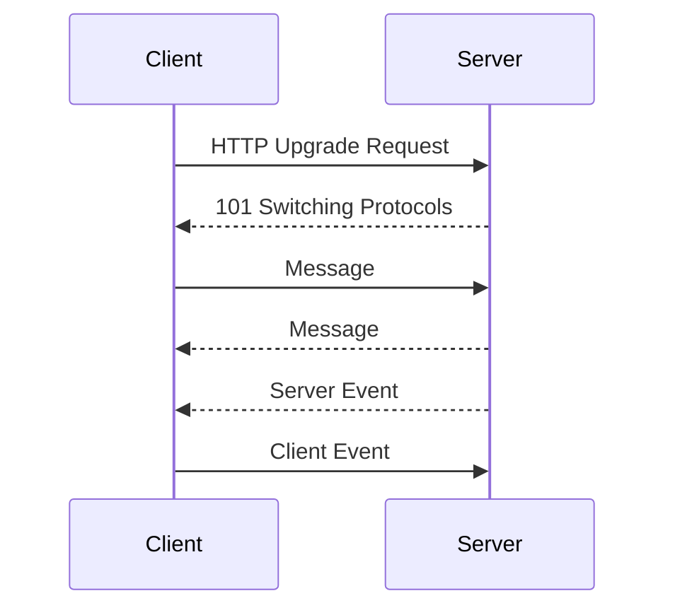
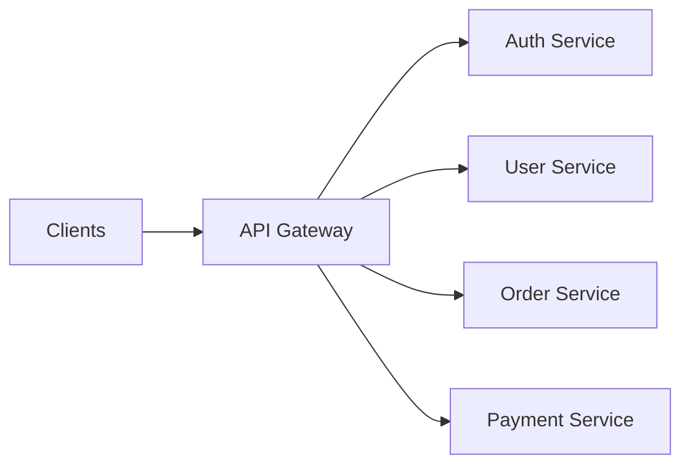
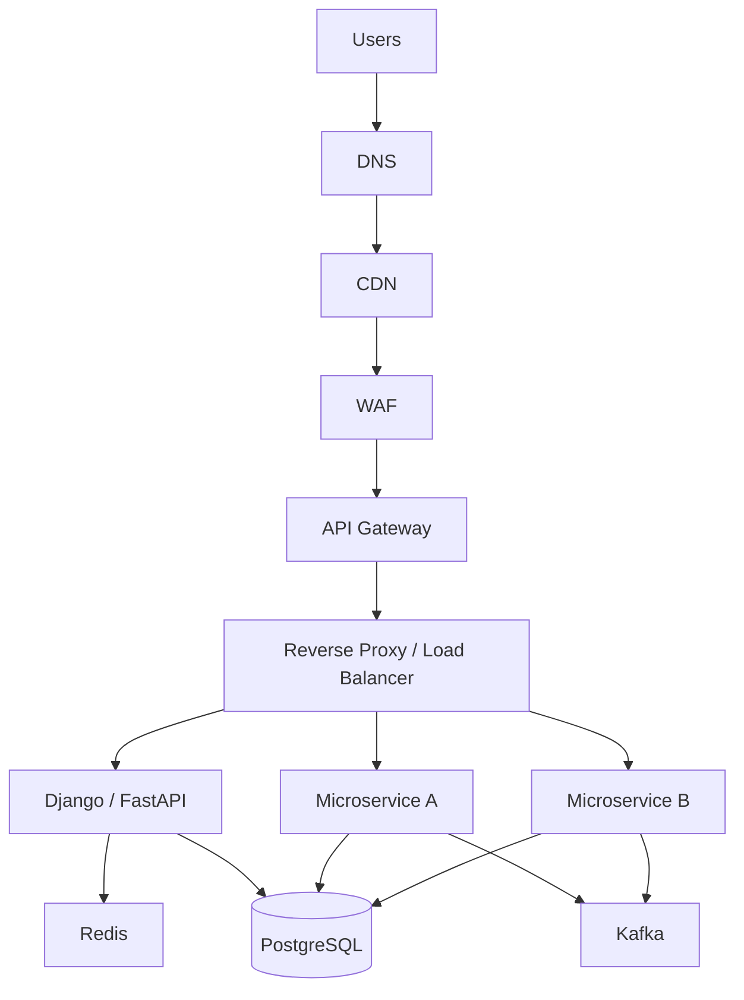

# 17- Summary

## Overview

Networking is the foundation of distributed backend systems. Every API request, microservice call, database connection, message exchange, file transfer, and real-time communication ultimately depends on networking primitives and protocols.

For system design, networking should be understood as a set of layers and trade-offs rather than as isolated technologies:

```text
Application
    |
    | HTTP / REST / GraphQL / gRPC / WebSocket / SSE
    v
Transport
    |
    | TCP / UDP
    v
Network
    |
    | IP / Routing
    v
Infrastructure
    |
    | Load Balancers / Proxies / CDNs / DNS / VPC
    v
Physical / Cloud Network
```

The important engineering question is rarely:

> "What networking technology should I use?"

It is usually:

> "What communication semantics, latency, reliability, scalability, security, and operational characteristics does this system require?"

---

## Networking Decision Map

The major topics covered in this section solve different problems.

| Technology / Concept | Primary Purpose | Typical Backend Use |
|---|---|---|
| HTTP | Application communication protocol | REST APIs, web applications |
| HTTP/1.1 | Traditional HTTP request/response | Legacy and general-purpose APIs |
| HTTP/2 | Efficient multiplexed HTTP | Modern APIs, browsers, gRPC |
| HTTP/3 | HTTP over QUIC | Latency-sensitive internet traffic |
| TCP | Reliable ordered transport | HTTP/1.1, HTTP/2, databases |
| UDP | Low-overhead datagrams | DNS, streaming, real-time protocols |
| WebSocket | Bidirectional real-time communication | Chat, collaboration, live dashboards |
| Long Polling | HTTP-based near-real-time communication | Legacy systems and fallback clients |
| SSE | Server-to-client streaming | Notifications, event feeds |
| REST | Resource-oriented API architecture | Public APIs and microservices |
| GraphQL | Client-driven data querying | Complex frontend data requirements |
| gRPC | High-performance RPC | Internal microservice communication |
| API Versioning | Controlled API evolution | Public and internal APIs |
| API Gateway | Centralized API entry point | Routing, auth, rate limiting |
| Service Discovery | Locate dynamic service instances | Microservices |
| Reverse Proxy | Front application servers | Nginx, load balancing, TLS |
| Forward Proxy | Controlled outbound traffic | Enterprise networks, egress control |
| CDN | Edge content delivery | Static assets, cacheable APIs |
| DNS | Name-to-address resolution | Service and internet routing |

---

## HTTP Request Model

HTTP provides the application-level communication model used by most backend systems.

A simplified request looks like:

```text
Client
  |
  | HTTP Request
  v
Server
  |
  | HTTP Response
  v
Client
```

An HTTP request contains concepts such as:

- Method
- URL
- Headers
- Query parameters
- Cookies
- Optional body

For example:

```http
GET /api/users/42 HTTP/1.1
Host: api.example.com
Authorization: Bearer <token>
Accept: application/json
```

The response contains:

```http
HTTP/1.1 200 OK
Content-Type: application/json

{
  "id": 42,
  "name": "Alice"
}
```

HTTP itself does not determine the complete application architecture. Django, FastAPI, REST, GraphQL, and other systems use HTTP as a transport/application protocol foundation.

---

## HTTP Versions

HTTP versions primarily improve how HTTP messages are transported and multiplexed.

| Feature | HTTP/1.1 | HTTP/2 | HTTP/3 |
|---|---|---|---|
| Transport | TCP | TCP | QUIC over UDP |
| Multiplexing | Limited | Yes | Yes |
| Header compression | No standard HPACK | HPACK | QPACK |
| Connection-level HOL blocking | Yes | Yes | Reduced |
| Encryption | Optional at protocol level | Commonly HTTPS | TLS 1.3 integrated with QUIC |
| Connection migration | No | No | Yes |
| Main benefit | Compatibility | Multiplexing | Lower transport-level latency |

The application should generally use modern HTTP versions through the infrastructure stack rather than implementing protocol mechanics directly.

---

## TCP vs UDP

TCP and UDP provide different transport semantics.

| Property | TCP | UDP |
|---|---|---|
| Connection-oriented | Yes | No |
| Reliable delivery | Yes | No |
| Ordered delivery | Yes | No |
| Retransmission | Built in | Application-dependent |
| Flow control | Yes | No |
| Congestion control | Yes | No |
| Overhead | Higher | Lower |
| Typical use | HTTP, DB, gRPC | DNS, QUIC, real-time traffic |

TCP is appropriate when correctness and ordered delivery are fundamental.

UDP is appropriate when the application or protocol needs lower overhead or custom delivery semantics.

QUIC demonstrates that UDP can be used as the foundation for a sophisticated reliable transport protocol.

---

## Request-Response vs Streaming

Communication patterns can be classified by data flow.

### Request-Response

```text
Client ---- Request ----> Server
Client <--- Response ---- Server
```

Typical examples:

- REST
- GraphQL
- Traditional HTTP APIs

### Server Streaming

```text
Client ---- Request ----> Server
Client <--- Event -------- Server
Client <--- Event -------- Server
Client <--- Event -------- Server
```

Typical examples:

- SSE
- Streaming APIs
- Some gRPC calls

### Bidirectional Streaming

```text
Client <---- Messages ----> Server
```

Typical example:

- WebSocket
- Bidirectional gRPC streaming

Choosing the communication pattern should be driven by the data-flow requirements rather than technology preference.

---

## WebSockets

WebSockets provide persistent, bidirectional communication between a client and server.



Use WebSockets when both sides need to send messages asynchronously.

Typical use cases:

- Chat
- Multiplayer applications
- Collaborative editing
- Live dashboards
- Presence systems
- Real-time notifications

The key operational metric changes from HTTP request rate to:

- Active connections
- Connection duration
- Messages per second
- Connection failures
- Memory per connection

---

## Long Polling

Long polling approximates real-time communication using normal HTTP.

```text
Client
  |
  | Request
  v
Server
  |
  | Wait for event
  |
  | Response
  v
Client
  |
  | Immediately reconnect
  v
Server
```

It is simpler than WebSockets but less efficient for high-scale real-time workloads.

Long polling can still be useful when:

- WebSockets are unavailable
- Infrastructure only supports traditional HTTP
- Client compatibility is important
- Event frequency is low

---

## Server-Sent Events

SSE provides a persistent HTTP connection for server-to-client events.

```text
Client
   |
   | HTTP connection
   v
Server
   |
   +---- event ---->
   +---- event ---->
   +---- event ---->
```

SSE is useful when communication is primarily one-way.

Typical use cases:

- Notification feeds
- Progress updates
- Monitoring dashboards
- Live status
- AI-generated streaming responses
- Server-side event streams

Compared with WebSockets:

| Property | SSE | WebSocket |
|---|---|---|
| Direction | Server → Client | Bidirectional |
| Protocol | HTTP | WebSocket |
| Browser support | Strong | Strong |
| Automatic reconnect | Built into browser API | Application-managed |
| Binary data | Not designed for it | Supported |
| Complexity | Lower | Higher |
| Best fit | Server event streams | Interactive real-time systems |

---

## REST

REST is a resource-oriented API design approach commonly implemented over HTTP.

Typical operations include:

```text
GET    /users
GET    /users/42
POST   /users
PATCH  /users/42
DELETE /users/42
```

Good REST design considers:

- Resource boundaries
- HTTP methods
- Status codes
- Idempotency
- Pagination
- Filtering
- Authentication
- Authorization
- Error contracts
- Versioning

REST is particularly effective for public APIs where interoperability and HTTP semantics are valuable.

---

## GraphQL

GraphQL allows clients to specify the shape of the data they need.

Instead of:

```text
GET /users/42
GET /users/42/orders
GET /users/42/preferences
```

a client can request related data through a single GraphQL query.

Conceptually:

```graphql
query {
  user(id: "42") {
    name
    orders {
      id
      total
    }
  }
}
```

GraphQL is useful when clients have diverse data requirements and need control over response shape.

However, it introduces additional backend concerns:

- Query complexity
- N+1 queries
- Resolver performance
- Authorization at field level
- Caching complexity
- Query depth limits

GraphQL is not automatically superior to REST. The choice depends on client and domain requirements.

---

## gRPC

gRPC is an RPC framework commonly used for internal service-to-service communication.

A typical architecture is:

```text
API Service
    |
    | gRPC
    v
Order Service
    |
    | gRPC
    v
Payment Service
```

gRPC commonly uses:

- HTTP/2
- Protocol Buffers
- Strong service contracts
- Generated clients and servers
- Streaming

It is particularly useful for:

- Internal microservices
- Low-latency service calls
- Strongly typed APIs
- High-throughput communication
- Streaming

REST is often more convenient for external/public APIs, while gRPC is frequently attractive for internal service communication.

---

## API Versioning

API versioning allows incompatible API changes without immediately breaking existing consumers.

Common approaches include:

```text
/api/v1/users
/api/v2/users
```

or header-based versioning:

```http
Accept: application/vnd.example.v2+json
```

Versioning should be used intentionally.

A mature API lifecycle includes:

```text
Design
  |
  v
Release
  |
  v
Maintain
  |
  v
Deprecate
  |
  v
Migrate consumers
  |
  v
Remove
```

Versioning does not eliminate compatibility management. It makes compatibility changes explicit and controllable.

---

## API Gateway

An API Gateway provides a centralized entry point for API traffic.



Common responsibilities include:

- Routing
- Authentication
- Authorization
- Rate limiting
- TLS termination
- Request transformation
- Observability
- API version routing
- WAF integration

Avoid turning the gateway into a monolithic business-logic layer.

Business rules should generally remain within domain services.

---

## Reverse Proxy

A reverse proxy sits between clients and backend servers.

```text
Client
  |
  v
Reverse Proxy
  |
  +--> Backend A
  +--> Backend B
  +--> Backend C
```

Nginx is a common reverse proxy.

Typical responsibilities include:

- TLS termination
- Load balancing
- Request routing
- Compression
- Static content
- Connection management
- Access logging

A reverse proxy is a foundational building block for production backend deployment.

---

## Forward Proxy

A forward proxy represents clients when accessing external services.

```text
Internal Client
      |
      v
Forward Proxy
      |
      v
Internet
```

Common uses include:

- Egress control
- Corporate security
- Traffic inspection
- IP allowlisting
- Auditing
- External access policies

The distinction is:

```text
Reverse Proxy:
Internet -> Proxy -> Servers

Forward Proxy:
Clients -> Proxy -> Internet
```

---

## Service Discovery

Microservices need a mechanism to locate service instances.

Static configuration becomes problematic when instances scale dynamically.

Instead:

```text
Service A
   |
   | Discover "order-service"
   v
Service Discovery
   |
   +--> Order Instance 1
   +--> Order Instance 2
   +--> Order Instance 3
```

Service discovery can be:

- Client-side
- Server-side
- DNS-based
- Registry-based
- Platform-provided

Kubernetes provides service discovery through Services and DNS.

AWS provides service-discovery capabilities through several managed networking mechanisms.

The fundamental requirement is:

> Resolve a logical service identity into reachable healthy instances.

---

## CDN

A CDN distributes content to edge locations close to users.

```text
                 +--> Edge - India
                 |
User --> CDN ----+--> Edge - Europe
                 |
                 +--> Edge - US
                         |
                         v
                       Origin
```

CDNs are particularly effective for:

- Static assets
- Images
- Videos
- Downloads
- Public cacheable content
- Some public API responses

The major concepts are:

- Cache key
- TTL
- Cache hit
- Cache miss
- Revalidation
- Invalidation
- Origin shielding
- Edge routing

A CDN is effectively a globally distributed caching and delivery layer.

---

## Networking Architecture

A modern backend system may combine many of these technologies:



Each layer solves a different problem.

The architecture should avoid unnecessary layers because every additional network hop introduces:

- Latency
- Failure modes
- Operational complexity
- Cost
- Debugging complexity

---

## Choosing a Communication Technology

A practical decision framework is:

| Requirement | Preferred Starting Point |
|---|---|
| Standard public API | REST |
| Complex client-driven data requirements | GraphQL |
| Internal typed microservice communication | gRPC |
| Bidirectional real-time communication | WebSocket |
| Server-to-client event stream | SSE |
| Legacy HTTP real-time fallback | Long Polling |
| Static/global content delivery | CDN |
| Internal service routing | Service Discovery |
| Centralized API controls | API Gateway |
| Application traffic mediation | Reverse Proxy |
| Controlled outbound traffic | Forward Proxy |
| Reliable ordered transport | TCP |
| Low-overhead datagrams | UDP |

These are starting points, not absolute rules.

---

## Latency Budget

A senior system design should decompose latency rather than treating an API call as one operation.

For example:

```text
Total Request Latency

DNS
  +
TCP / QUIC
  +
TLS
  +
CDN / Proxy
  +
Load Balancer
  +
Application
  +
Database
  +
Serialization
  +
Network Response
```

For a service-to-service request:

```text
Service A
   |
   | Network
   v
Service B
   |
   | Database
   v
PostgreSQL
```

Every synchronous dependency adds latency and another failure point.

If:

```text
A -> B -> C -> D
```

then the request's availability and latency are influenced by every dependency.

This is why unnecessary synchronous calls should be avoided in latency-sensitive paths.

---

## Reliability and Failure Handling

Networking introduces failures that do not occur in local function calls.

A network call can fail because of:

- Timeout
- Connection refusal
- DNS failure
- TLS failure
- Packet loss
- Proxy failure
- Load balancer failure
- Service overload
- Partial network partition
- Remote dependency failure

Production clients should define:

- Connection timeout
- Read timeout
- Overall deadline
- Retry policy
- Backoff
- Retry limits
- Circuit breaking where appropriate
- Idempotency behavior

A retry without an idempotency strategy can turn a transient failure into duplicate operations.

---

## Timeouts

Every network dependency should have explicit timeouts.

Bad:

```python
response = requests.get(url)
```

Better:

```python
response = requests.get(
    url,
    timeout=(2, 5),
)
```

The exact values depend on the system's latency budget.

A timeout should be shorter than the upstream request's overall deadline when the dependency is only one part of a larger request.

---

## Retries

Retries are useful for transient failures but can amplify outages.

Suppose:

```text
1000 requests
   |
   | failure
   v
1000 retries
   |
   | failure
   v
1000 more retries
```

The downstream service can become even more overloaded.

Use:

- Exponential backoff
- Jitter
- Maximum retry count
- Retry only transient failures
- Idempotency keys where required
- End-to-end deadlines

Avoid retrying indefinitely.

---

## Synchronous vs Asynchronous Communication

Synchronous:

```text
Service A
   |
   | Request
   v
Service B
   |
   | Response
   v
Service A
```

Asynchronous:

```text
Service A
   |
   | Event
   v
Kafka
   |
   +--> Service B
   +--> Service C
```

Synchronous communication is appropriate when the caller immediately needs the result.

Asynchronous communication is appropriate when:

- Immediate response is unnecessary
- Work is long-running
- Traffic should be buffered
- Consumers should be decoupled
- Event-driven processing is appropriate

Networking architecture and messaging architecture should therefore be designed together.

---

## Security Boundaries

Network architecture defines important security boundaries.

A production system may separate:

```text
Internet
   |
   v
Public Subnet
   |
   v
Load Balancer
   |
   v
Private Application Subnet
   |
   v
Private Database Subnet
```

The database should generally not be directly reachable from the public internet.

Security controls include:

- TLS
- Authentication
- Authorization
- Network segmentation
- Security groups
- Firewalls
- WAF
- Rate limiting
- Private endpoints
- Least-privilege access
- Origin protection

Network security should be layered rather than dependent on a single control.

---

## Observability

Networking problems are often difficult to diagnose without distributed observability.

At minimum, monitor:

- Request latency
- Error rates
- Throughput
- Connection failures
- DNS failures
- Timeout rates
- Retry counts
- Network utilization
- Load balancer metrics
- CDN cache metrics
- Dependency latency

Distributed tracing is particularly valuable for microservices:

```text
Request
  |
  v
API Gateway
  |
  v
Service A
  |
  v
Service B
  |
  v
Database
```

A trace should allow engineers to identify which network hop consumed the latency budget.

---

## Production Networking Checklist

When designing a distributed backend system, evaluate:

### Traffic Flow

- Where does the request enter the system?
- Which component terminates TLS?
- Where does routing happen?
- Which services communicate synchronously?
- Which traffic is asynchronous?

### Performance

- What is the latency budget?
- Can traffic be served from a CDN?
- Is HTTP/2 or HTTP/3 beneficial?
- Are connections reused?
- Are responses compressed?
- Are network hops necessary?

### Reliability

- Are timeouts configured?
- Are retries bounded?
- Is retry behavior idempotent?
- What happens when a dependency is unavailable?
- Is there a fallback?
- Is traffic distributed across healthy instances?

### Scalability

- How many connections can the system maintain?
- What happens during traffic spikes?
- Can the CDN absorb cacheable traffic?
- Can services scale horizontally?
- Does service discovery handle instance churn?

### Security

- Which components are public?
- Which components are private?
- Where is authentication performed?
- Where is authorization enforced?
- Can clients bypass the CDN or gateway?
- Are internal services protected?

### Operations

- Are DNS changes observable?
- Are proxy logs available?
- Are distributed traces enabled?
- Are network metrics monitored?
- Can operators invalidate caches?
- Can failed origins be isolated?

---

## Common System Design Mistakes

### Treating Every Service Call Like a Local Function Call

Network calls are slower and can fail independently.

### Building Excessive Synchronous Dependency Chains

```text
A -> B -> C -> D -> E
```

increases latency and failure propagation.

### Using Retries Without Backoff

This can amplify outages and create retry storms.

### Ignoring Connection Limits

Every connection consumes resources.

High-concurrency systems must consider:

- File descriptors
- Memory
- Connection pools
- Kernel limits
- Load balancer limits
- NAT capacity

### Caching Without Understanding Consistency

A cache creates additional copies of data.

### Putting Private Data Behind Shared Caches

This can cause severe security vulnerabilities.

### Adding Infrastructure Layers Without Need

A chain such as:

```text
CDN
 -> WAF
 -> API Gateway
 -> Nginx
 -> Load Balancer
 -> Service Mesh
 -> Service
```

may be justified in some environments, but each layer adds operational overhead.

### Ignoring DNS

DNS is a dependency.

Applications should consider DNS caching, TTLs, resolution failures, and service-discovery behavior.

### Assuming HTTP 200 Means Success

Application-level failures can still be represented within a successful transport-level response.

Correctly model:

- HTTP status
- Application error
- Retryability
- Idempotency

---

## Interview Framework

When asked to design a networking architecture, work through the problem systematically:

```text
Traffic Characteristics
        |
        v
Communication Pattern
        |
        v
Protocol
        |
        v
Routing
        |
        v
Caching
        |
        v
Load Balancing
        |
        v
Security
        |
        v
Reliability
        |
        v
Observability
        |
        v
Scaling
```

Start by identifying:

1. Number of users and requests.
2. Geographic distribution.
3. Read/write characteristics.
4. Latency requirements.
5. Real-time requirements.
6. Data consistency requirements.
7. Public vs private traffic.
8. Failure tolerance.
9. Security requirements.
10. Cost constraints.

Then select technologies based on those requirements.

---

## Key Takeaways

- Networking architecture is a set of layered trade-offs involving protocols, routing, caching, communication patterns, security, reliability, and observability.
- HTTP, TCP, UDP, REST, GraphQL, gRPC, WebSockets, SSE, and long polling solve different communication problems; select them based on traffic and consistency requirements.
- Proxies, API gateways, service discovery, and CDNs should have clearly defined responsibilities to avoid unnecessary complexity and latency.
- Production network calls require explicit timeouts, bounded retries, connection management, observability, security boundaries, and failure-handling strategies.
- Strong system design reasoning starts with traffic characteristics and latency requirements, then derives the appropriate protocols, infrastructure, and communication architecture.