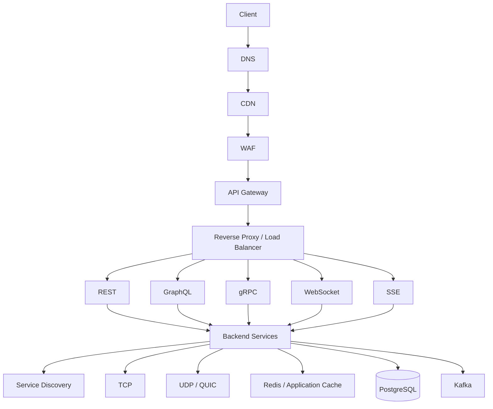

# README

## Overview

This section covers the networking fundamentals and architectural patterns required to design reliable, scalable backend and distributed systems.

The material progresses from foundational network protocols to application communication, traffic management, service discovery, caching, and edge delivery.

The focus is not on memorizing protocol definitions. The objective is to understand how networking decisions affect:

- Latency
- Throughput
- Availability
- Reliability
- Security
- Scalability
- Cost
- Operational complexity

---

## Topics

| File | Topic | Focus |
|---|---|---|
| [01- DNS](./01-%20DNS.md) | DNS | Name resolution, records, caching, routing, and service discovery |
| [02- HTTP vs HTTPS](./02-%20HTTP%20vs%20HTTPS.md) | HTTP vs HTTPS | HTTP communication, TLS, encryption, authentication, and security |
| [03- HTTP Versions](./03-%20HTTP%20Versions.md) | HTTP Versions | HTTP/1.1, HTTP/2, HTTP/3, multiplexing, and transport evolution |
| [04- TCP vs UDP](./04-%20TCP%20vs%20UDP.md) | TCP vs UDP | Transport protocols, reliability, ordering, latency, and use cases |
| [05- WebSockets](./05-%20WebSockets.md) | WebSockets | Persistent bidirectional communication and real-time systems |
| [06- Long Polling](./06-%20Long%20Polling.md) | Long Polling | HTTP-based near-real-time communication and fallback patterns |
| [07- Server-Sent Events](./07-%20Server-Sent%20Events.md) | Server-Sent Events | Server-to-client streaming and event-driven HTTP connections |
| [08- REST](./08-%20REST.md) | REST | Resource-oriented APIs, HTTP semantics, idempotency, and API design |
| [09- GraphQL](./09-%20GraphQL.md) | GraphQL | Client-driven queries, schemas, resolvers, and query performance |
| [10- gRPC](./10-%20gRPC.md) | gRPC | High-performance RPC, Protocol Buffers, streaming, and microservices |
| [11- API Versioning](./11-%20API%20Versioning.md) | API Versioning | API evolution, compatibility, deprecation, and migration |
| [12- API Gateway](./12-%20API%20Gateway.md) | API Gateway | Routing, authentication, rate limiting, policies, and traffic control |
| [13- Service Discovery](./13-%20Service%20Discovery.md) | Service Discovery | Dynamic service location, health, registration, and discovery |
| [14- Reverse Proxy](./14-%20Reverse%20Proxy.md) | Reverse Proxy | Nginx, TLS termination, routing, load balancing, and traffic mediation |
| [15- Forward Proxy](./15-%20Forward%20Proxy.md) | Forward Proxy | Outbound traffic control, egress security, and network policies |
| [16- CDN](./16-%20CDN.md) | CDN | Edge caching, cache keys, origin traffic, and global content delivery |
| [17- Summary](./17-%20Summary.md) | Summary | Networking architecture patterns, trade-offs, and system design decisions |

---

## Networking Architecture

The topics in this section fit together as layers rather than independent technologies.



Each component addresses a different concern:

| Layer | Primary Responsibility |
|---|---|
| DNS | Resolve logical names to destinations |
| CDN | Serve cacheable content close to users |
| WAF | Protect HTTP traffic |
| API Gateway | Centralize API traffic policies |
| Reverse Proxy | Route and mediate application traffic |
| REST / GraphQL / gRPC | Define application communication semantics |
| WebSocket / SSE / Long Polling | Support real-time communication |
| Service Discovery | Locate dynamic service instances |
| TCP / UDP / QUIC | Provide transport semantics |
| Redis | Reduce repeated backend data access |
| Kafka | Decouple asynchronous workloads and events |
| PostgreSQL | Persist application state |

---

## Communication Pattern Selection

A practical starting point for system design decisions is:

| Requirement | Typical Choice |
|---|---|
| Public CRUD API | REST |
| Complex client-specific data requirements | GraphQL |
| Internal microservice RPC | gRPC |
| Bidirectional real-time communication | WebSocket |
| Server-to-client event stream | SSE |
| Legacy real-time fallback | Long Polling |
| Reliable ordered transport | TCP |
| Low-overhead datagrams | UDP |
| Modern internet transport with multiplexing | QUIC / HTTP/3 |
| Global cacheable content | CDN |
| Centralized API policies | API Gateway |
| Dynamic microservice routing | Service Discovery |
| TLS termination and traffic routing | Reverse Proxy |
| Controlled outbound traffic | Forward Proxy |

These choices should be validated against actual system requirements rather than applied as universal rules.

---

## Request Lifecycle

A typical internet-facing backend request may pass through several networking layers:

```text
Client
  |
  | DNS Resolution
  v
DNS
  |
  v
CDN / Edge
  |
  v
WAF
  |
  v
API Gateway
  |
  v
Load Balancer / Reverse Proxy
  |
  v
Backend Service
  |
  +----> Redis
  |
  +----> PostgreSQL
  |
  +----> Kafka
  |
  v
HTTP Response
```

Every additional hop can introduce:

- Latency
- Failure modes
- Resource consumption
- Operational complexity
- Additional cost

Infrastructure should therefore be layered intentionally.

---

## Production Concerns

### Latency

Break end-to-end latency into measurable components:

```text
DNS
 +
Connection Establishment
 +
TLS
 +
Proxy / Gateway
 +
Application Processing
 +
Database
 +
External Dependencies
 +
Response Transfer
```

Do not optimize only application execution time. A fast Django or FastAPI handler can still produce a slow request if it depends on multiple network services.

### Reliability

Every network dependency should have explicit:

- Connection timeout
- Read timeout
- Overall deadline
- Retry policy
- Retry limit
- Backoff
- Jitter
- Idempotency strategy

A network request should never be treated like a local function call.

### Scalability

At high traffic volumes, consider:

- Connection counts
- File descriptors
- Connection pools
- Load balancer limits
- NAT capacity
- Bandwidth
- CPU spent on TLS
- Proxy capacity
- CDN cache hit ratio
- Service discovery load
- Number of synchronous dependencies

### Security

Production networking should use layered controls:

```text
Internet
   |
   v
CDN / WAF
   |
   v
Load Balancer / Gateway
   |
   v
Private Application Network
   |
   v
Private Data Network
```

Important controls include:

- TLS
- Authentication
- Authorization
- Network segmentation
- Firewalls
- Security groups
- WAF
- Rate limiting
- Private endpoints
- Least-privilege access
- Origin protection

### Observability

Monitor networking as a first-class part of the system.

Important signals include:

- Request latency
- Error rate
- Throughput
- Connection failures
- Timeout rate
- Retry count
- DNS failures
- Load balancer health
- CDN cache hit ratio
- Upstream latency
- Network utilization

Distributed tracing is especially important when requests cross multiple services.

---

## System Design Perspective

The core networking questions in a system design interview are usually:

1. How does traffic enter the system?
2. How is the client routed to the correct destination?
3. Which protocol should be used?
4. Which communication paths are synchronous?
5. Which workloads should be asynchronous?
6. Where should caching occur?
7. Where should TLS terminate?
8. How are services discovered?
9. How does the system handle failures?
10. How does the architecture scale?
11. Which components are public or private?
12. How will networking behavior be monitored?

A strong design connects these decisions rather than selecting technologies independently.

---

## Quick Navigation

### Core Networking

- [DNS](./01-%20DNS.md)
- [HTTP vs HTTPS](./02-%20HTTP%20vs%20HTTPS.md)
- [HTTP Versions](./03-%20HTTP%20Versions.md)
- [TCP vs UDP](./04-%20TCP%20vs%20UDP.md)

### Real-Time Communication

- [WebSockets](./05-%20WebSockets.md)
- [Long Polling](./06-%20Long%20Polling.md)
- [Server-Sent Events](./07-%20Server-Sent%20Events.md)

### API Communication

- [REST](./08-%20REST.md)
- [GraphQL](./09-%20GraphQL.md)
- [gRPC](./10-%20gRPC.md)
- [API Versioning](./11-%20API%20Versioning.md)

### Traffic Management

- [API Gateway](./12-%20API%20Gateway.md)
- [Service Discovery](./13-%20Service%20Discovery.md)
- [Reverse Proxy](./14-%20Reverse%20Proxy.md)
- [Forward Proxy](./15-%20Forward%20Proxy.md)
- [CDN](./16-%20CDN.md)

### Reference

- [Summary](./17-%20Summary.md)

---

## Key Takeaways

- Networking design should start with traffic patterns, latency requirements, reliability expectations, and security boundaries rather than technology selection.
- HTTP, TCP, UDP, REST, GraphQL, gRPC, WebSockets, SSE, and long polling provide different communication semantics and should be selected according to system requirements.
- DNS, CDNs, API gateways, reverse proxies, service discovery, and load balancers form the infrastructure layer that controls how traffic reaches backend services.
- Production network communication requires explicit timeouts, bounded retries, connection management, observability, security controls, and failure-handling strategies.
- Good system design minimizes unnecessary network hops and synchronous dependencies while using caching, asynchronous messaging, and edge infrastructure where they provide measurable value.