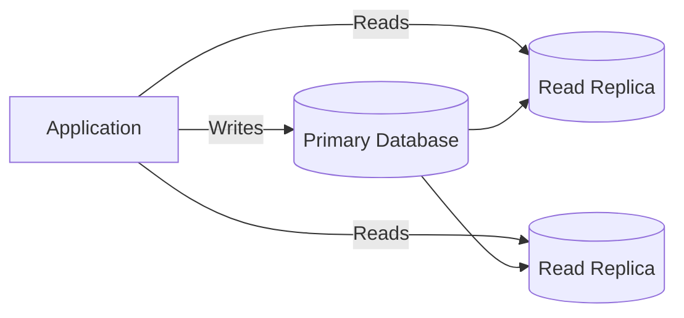
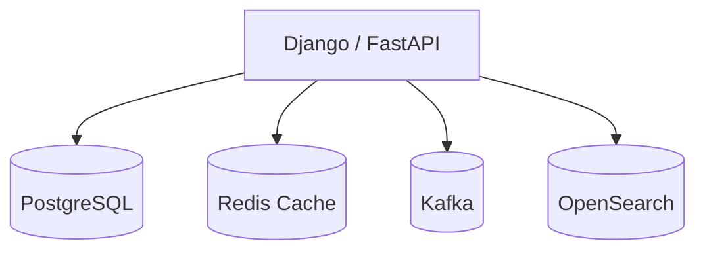
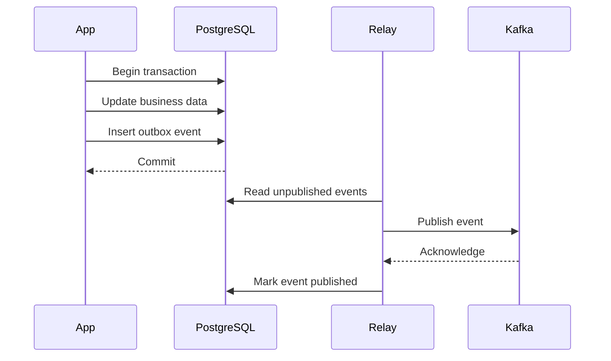
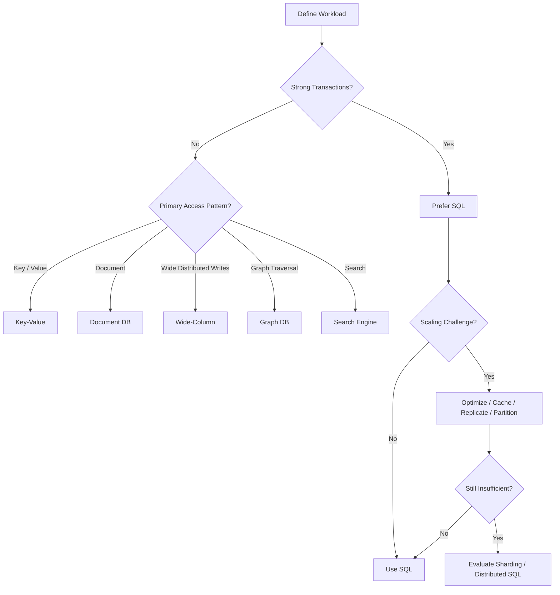
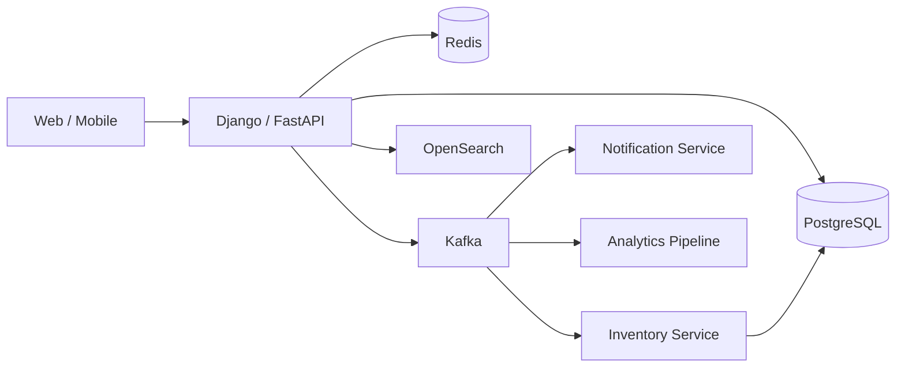

# 01- SQL vs NoSQL

## Overview

SQL and NoSQL databases solve different data-management problems, but the distinction is not simply "structured data versus unstructured data" or "SQL scales vertically while NoSQL scales horizontally."

The architectural decision is about **data model, consistency requirements, query patterns, transaction boundaries, scalability, operational characteristics, and failure behavior**.

SQL databases such as PostgreSQL and MySQL are typically relational and provide mature transaction semantics, constraints, joins, and expressive querying. NoSQL is a broad category that includes document, key-value, wide-column, and graph databases, each optimized for different access patterns.

A production system may use both. For example:

```text
                    ┌──────────────────────┐
                    │      API Clients     │
                    └──────────┬───────────┘
                               │
                               v
                    ┌──────────────────────┐
                    │    Django / FastAPI  │
                    └───────┬───────┬──────┘
                            │       │
                transactional │       │ high-volume/cache
                            │       │
                            v       v
                   ┌────────────┐ ┌────────────┐
                   │ PostgreSQL │ │   Redis    │
                   │    SQL     │ │  Key-Value │
                   └─────┬──────┘ └────────────┘
                         │
                         v
                    ┌──────────┐
                    │  Kafka   │
                    │  Events  │
                    └──────────┘
```

The goal is not to choose one database technology for everything. The goal is to choose the **simplest storage architecture that satisfies the system's correctness, performance, and scalability requirements**.

---

## What SQL Databases Are

A SQL database stores data using relational structures such as tables, rows, columns, indexes, constraints, and relationships.

Typical SQL databases include:

- PostgreSQL
- MySQL
- MariaDB
- Microsoft SQL Server
- Oracle Database

A relational model represents entities separately and connects them through keys.

For example:

```text
customers
---------
id
name
email

orders
------
id
customer_id
total
created_at
```

The relationship can be represented using a foreign key:

```text
customers.id
     |
     | 1:N
     v
orders.customer_id
```

This structure is useful when data has strong relationships and the application needs reliable transactional operations across those relationships.

---

## Why SQL Exists

SQL databases are designed around several important requirements:

- Strong data integrity
- Declarative querying
- Transactions
- Referential integrity
- Complex relationships
- Consistent updates
- Flexible analytical queries
- Mature indexing and optimization

For systems such as banking, payments, inventory, accounting, and order management, correctness is often more important than maximizing raw write throughput.

For example, transferring money typically requires multiple state changes to succeed atomically:

```text
Account A: balance -= 100
Account B: balance += 100
Transaction record: created
```

A relational transaction can enforce:

```text
BEGIN

debit Account A
credit Account B
create transaction record

COMMIT
```

If something fails before the commit, the transaction can be rolled back.

---

## SQL Data Model

A relational database typically contains:

- Tables
- Rows
- Columns
- Primary keys
- Foreign keys
- Unique constraints
- Check constraints
- Indexes
- Views
- Transactions

Example PostgreSQL schema:

```sql
CREATE TABLE customers (
    id BIGSERIAL PRIMARY KEY,
    email VARCHAR(255) NOT NULL UNIQUE,
    name VARCHAR(255) NOT NULL,
    created_at TIMESTAMPTZ NOT NULL DEFAULT NOW()
);

CREATE TABLE orders (
    id BIGSERIAL PRIMARY KEY,
    customer_id BIGINT NOT NULL REFERENCES customers(id),
    total NUMERIC(12, 2) NOT NULL CHECK (total >= 0),
    created_at TIMESTAMPTZ NOT NULL DEFAULT NOW()
);

CREATE INDEX idx_orders_customer_created
ON orders (customer_id, created_at DESC);
```

The database itself can enforce invariants rather than relying entirely on application code.

---

## SQL Transactions

Transactions are one of the strongest reasons to choose a relational database.

A transaction provides atomicity: either the complete transaction commits or its changes are rolled back.

```sql
BEGIN;

UPDATE accounts
SET balance = balance - 100
WHERE id = 1
  AND balance >= 100;

UPDATE accounts
SET balance = balance + 100
WHERE id = 2;

INSERT INTO transfers (from_account, to_account, amount)
VALUES (1, 2, 100);

COMMIT;
```

In production, the application must also verify affected rows and handle transaction conflicts correctly.

### ACID

| Property | Meaning |
|---|---|
| Atomicity | A transaction is applied completely or not at all |
| Consistency | Database constraints and transaction rules remain valid |
| Isolation | Concurrent transactions do not incorrectly interfere |
| Durability | Committed data survives appropriate failures |

ACID does not mean "the database can never fail." It defines guarantees around transaction behavior under supported failure conditions.

---

## SQL Joins

Relational databases are particularly strong when data must be queried across relationships.

```sql
SELECT
    c.email,
    o.id,
    o.total
FROM customers AS c
JOIN orders AS o
    ON o.customer_id = c.id
WHERE c.id = 42
ORDER BY o.created_at DESC;
```

This is useful when the application needs normalized entities and dynamic queries.

However, joins are not inherently slow. Poor indexes, huge intermediate result sets, bad cardinality estimates, inefficient queries, or inappropriate data access patterns are usually the real problems.

---

## SQL Normalization

Normalization reduces unnecessary duplication and improves data integrity.

A normalized design might store:

```text
customers
    |
    +---- orders
             |
             +---- order_items
```

Instead of duplicating customer information inside every order.

Normalization is useful when:

- Data changes frequently
- Consistency matters
- Relationships are important
- Multiple queries need the same authoritative entity

However, excessive normalization can create expensive query paths.

Production systems sometimes deliberately denormalize data when read performance justifies the additional complexity.

---

## SQL Denormalization

Denormalization intentionally duplicates or precomputes data to optimize access patterns.

For example:

```text
orders
------
id
customer_id
customer_email
total
```

Even if `customer_email` exists in `customers`, duplicating it can make certain reads cheaper.

The trade-off is consistency.

If the customer changes their email:

```text
customers.email
```

must potentially be propagated to:

```text
orders.customer_email
```

This creates additional write and synchronization complexity.

Denormalization should therefore be driven by measurable query requirements rather than used automatically for performance.

---

## What NoSQL Databases Are

NoSQL is a broad category of databases that do not primarily use the traditional relational table-and-join model.

Major categories include:

| Type | Examples | Typical Use Case |
|---|---|---|
| Document | MongoDB | JSON-like application documents |
| Key-Value | Redis, DynamoDB | Fast lookup by key |
| Wide-Column | Cassandra, ScyllaDB | High-volume distributed workloads |
| Graph | Neo4j | Relationship-heavy graph traversal |
| Search | OpenSearch, Elasticsearch | Full-text search and analytics |

There is no single "NoSQL model."

The database should be evaluated according to its specific data model and guarantees.

---

## Why NoSQL Exists

NoSQL systems became important for workloads where traditional relational approaches could create undesirable constraints around:

- Massive horizontal scale
- High write throughput
- Globally distributed data
- Flexible document structures
- Predictable key-based access
- Large datasets
- Specialized query patterns

The important architectural principle is:

> NoSQL databases often optimize around specific access patterns instead of providing a general-purpose relational query model.

This means data modeling often starts with:

```text
What queries must this system serve?
```

rather than:

```text
What entities exist in the business domain?
```

---

## Document Databases

Document databases store records as documents, commonly represented using JSON-like structures.

Example:

```json
{
  "id": "order_123",
  "customer_id": "customer_42",
  "status": "confirmed",
  "items": [
    {
      "product_id": "p100",
      "quantity": 2,
      "price": 49.99
    },
    {
      "product_id": "p200",
      "quantity": 1,
      "price": 19.99
    }
  ]
}
```

This can be useful when the application naturally reads and writes the entire aggregate.

For example:

```text
Order
 ├── Customer ID
 ├── Status
 └── Items
      ├── Product
      ├── Quantity
      └── Price
```

If the application almost always loads the complete order, embedding related data may reduce joins.

---

## Key-Value Databases

A key-value database models data primarily as:

```text
key -> value
```

For example:

```text
user:42:session -> <session data>
product:100:inventory -> 17
rate-limit:192.168.1.10 -> 23
```

Redis is commonly used this way.

Example:

```text
GET user:42
```

Key-value storage is particularly effective when the application knows the lookup key ahead of time.

It is less appropriate when requirements demand arbitrary relational queries across many dimensions.

---

## Wide-Column Databases

Wide-column databases such as Cassandra are designed around distributed data and predictable access patterns.

A conceptual model might look like:

```text
partition key
     |
     v
customer_id
     |
     +---- timestamp -> event
     +---- timestamp -> event
     +---- timestamp -> event
```

The partition key determines where data is distributed.

This makes partition-key selection a critical architectural decision.

A poor partition key can produce:

- Hot partitions
- Uneven traffic
- Unbalanced storage
- Poor query performance

---

## Graph Databases

Graph databases represent entities as nodes and relationships as edges.

```text
Alice
  |
  | FRIENDS_WITH
  v
Bob
  |
  | WORKS_WITH
  v
Company
```

They are useful when relationship traversal is the primary workload.

Examples include:

- Social networks
- Recommendation systems
- Fraud relationship analysis
- Knowledge graphs
- Network topology

A graph database should not be chosen simply because the application contains relationships. Relational databases are also excellent at representing relationships.

The question is whether graph traversal is a dominant query requirement.

---

## SQL vs NoSQL

| Dimension | SQL | NoSQL |
|---|---|---|
| Data model | Relational | Document, key-value, wide-column, graph, etc. |
| Schema | Usually explicit | Often flexible or application-managed |
| Transactions | Strong mature support | Varies significantly by database |
| Joins | Native | Usually limited, absent, or modeled differently |
| Query flexibility | High | Often optimized for known access patterns |
| Horizontal scaling | Supported by some systems, often more involved | Common design goal |
| Consistency | Strong options available | Depends on product and configuration |
| Data relationships | Excellent | Depends on database type |
| Data duplication | Usually minimized | Often intentional |
| Schema evolution | Migration-oriented | Often easier structurally, but still requires compatibility management |
| Operational maturity | Very high | Varies by technology |
| Best fit | Transactions and relational workloads | Specialized high-scale or access-pattern-driven workloads |

The table is a starting point, not a universal benchmark.

PostgreSQL can scale horizontally through architectural patterns, read replicas, partitioning, sharding, and distributed PostgreSQL-compatible systems. Likewise, many NoSQL databases provide stronger consistency and transactions than the simplified "NoSQL means eventual consistency" stereotype suggests.

---

## Consistency Models

Consistency is one of the most important architectural differences to understand.

### Strong Consistency

A read after a successful write observes the latest committed value according to the system's consistency guarantees.

Useful for:

- Financial balances
- Inventory
- Authorization state
- Critical configuration

### Eventual Consistency

Replicas may temporarily disagree, but the system converges toward a consistent state.

Useful for:

- Activity feeds
- Analytics
- Search indexes
- Recommendations
- Some caching workloads

Example:

```text
Primary
   |
   +----> Replica A
   |
   +----> Replica B

Write
  |
  v
Primary updated immediately

Replica A ---- eventually updated
Replica B ---- eventually updated
```

Eventual consistency is not inherently bad. It is a deliberate trade-off between consistency, availability, latency, and distributed-system complexity.

---

## CAP Theorem

For a distributed data system, CAP describes a trade-off involving:

- Consistency
- Availability
- Partition tolerance

During a network partition, a distributed system cannot simultaneously guarantee both perfect consistency and availability for all operations.

A practical interpretation is:

```text
Network partition occurs
        |
        +------------------+
        |                  |
        v                  v
Preserve consistency   Preserve availability
        |                  |
        v                  v
Reject/delay some      Continue serving
operations             potentially stale data
```

A common interview mistake is saying:

> "SQL databases are CP and NoSQL databases are AP."

That is too simplistic.

CAP applies to distributed systems under network partition conditions, and different databases expose different consistency and availability configurations.

---

## PACELC

PACELC extends the CAP discussion.

It asks:

```text
If Partition:
    choose Availability or Consistency

Else:
    choose Latency or Consistency
```

This is useful when discussing distributed database design because even without a partition, distributed systems may trade stronger consistency for lower latency.

---

## When SQL Is Usually the Better Choice

Prefer SQL when the system requires:

- Strong transactional semantics
- Complex relationships
- Foreign keys
- Constraints
- Ad hoc querying
- Reporting
- Complex filtering
- Aggregations
- Multi-row transactional updates
- Mature operational tooling

Typical examples:

- Banking
- Payments
- Order management
- Accounting
- ERP
- Inventory
- Customer management
- Authorization systems

For many backend applications, PostgreSQL should be the default starting point.

---

## When NoSQL Is Usually the Better Choice

Consider NoSQL when the workload has clear requirements such as:

- Massive key-based traffic
- Extremely high write throughput
- Predictable access patterns
- Large-scale distributed storage
- Flexible aggregate structures
- Global distribution requirements
- Specialized graph traversal
- Specialized document access

Examples:

```text
Session storage       -> Redis
Distributed events    -> Cassandra-like database
Simple global lookup  -> DynamoDB
Document aggregates   -> MongoDB
Graph traversal       -> Neo4j
Full-text search      -> OpenSearch
```

The specific product should be selected based on its actual guarantees and workload characteristics.

---

## Access-Pattern-Driven Data Modeling

A major difference between relational and NoSQL design is where data modeling begins.

### Relational Approach

A typical SQL workflow is:

```text
Domain model
    |
    v
Entities
    |
    v
Normalized schema
    |
    v
Indexes
    |
    v
Queries
```

### NoSQL Approach

A typical NoSQL workflow may be:

```text
Required queries
    |
    v
Access patterns
    |
    v
Partition / key design
    |
    v
Data model
    |
    v
Indexes / denormalization
```

This does not mean SQL ignores access patterns. Production SQL design also depends heavily on query workload.

The difference is that some NoSQL systems make access-pattern-driven modeling a much stricter requirement.

---

## Indexing

Indexes are critical regardless of database type.

For PostgreSQL:

```sql
CREATE INDEX idx_users_email
ON users (email);
```

For a query such as:

```sql
SELECT *
FROM users
WHERE email = 'user@example.com';
```

the index can avoid scanning every row.

However, indexes have costs:

- Additional storage
- Additional write overhead
- Cache pressure
- Maintenance overhead
- Slower inserts and updates

Do not create indexes simply because a column exists.

Design indexes around actual query patterns.

---

## Read and Write Scaling

A common SQL architecture is:



This improves read capacity but introduces replication lag.

A request that writes to the primary and immediately reads from a replica may observe stale data.

This is known as a **read-after-write consistency problem**.

Applications requiring read-your-writes semantics may need to read from the primary for a period or use a consistency-aware routing strategy.

---

## Sharding

Sharding partitions data across multiple database nodes.

For example:

```text
                    Application
                         |
             +-----------+-----------+
             |           |           |
             v           v           v
          Shard A     Shard B     Shard C
          users 1M    users 2M    users 3M
```

A shard key determines where records are stored.

Good shard keys should provide:

- Even distribution
- High cardinality
- Predictable routing
- Low cross-shard query requirements

Poor shard keys can create hot shards.

Sharding also increases complexity around:

- Transactions
- Joins
- Rebalancing
- Backups
- Schema migrations
- Operational debugging

Do not introduce sharding before simpler scaling strategies are insufficient.

---

## NoSQL Partitioning

Partitioning is fundamental to many distributed NoSQL systems.

Suppose data is partitioned by:

```text
customer_id
```

Then requests such as:

```text
GET /customers/42/orders
```

can be routed efficiently.

But if one customer receives a disproportionate amount of traffic, the partition can become hot.

A design that looks correct mathematically may still fail operationally because real traffic is rarely uniformly distributed.

---

## Polyglot Persistence

Production systems often use multiple storage technologies.

For example:



Each component has a specialized responsibility:

| Technology | Responsibility |
|---|---|
| PostgreSQL | Source of truth and transactions |
| Redis | Cache, sessions, rate limiting, ephemeral state |
| Kafka | Durable asynchronous event streaming |
| OpenSearch | Search and analytical retrieval |

This is called **polyglot persistence**.

It can provide strong architectural benefits, but every additional datastore creates:

- Operational overhead
- Monitoring requirements
- Backup requirements
- Security configuration
- Deployment complexity
- Failure modes
- Data synchronization problems

Do not add a database because it is fashionable.

---

## PostgreSQL + Redis Example

A common backend architecture is to use PostgreSQL as the source of truth and Redis as a cache.

```text
Client
  |
  v
Django / FastAPI
  |
  v
Redis
  |
  +---- Cache hit ----> Response
  |
  +---- Cache miss
           |
           v
       PostgreSQL
           |
           v
        Redis SET
           |
           v
        Response
```

The cache should not normally become the authoritative source of critical persistent state unless the architecture explicitly requires it.

A simplified Python example:

```python
import json

from django.core.cache import cache
from django.http import JsonResponse

from .models import Product


def get_product(request, product_id: int):
    cache_key = f"product:{product_id}"

    cached = cache.get(cache_key)
    if cached is not None:
        return JsonResponse(cached)

    product = Product.objects.values(
        "id",
        "name",
        "price",
    ).get(id=product_id)

    cache.set(
        cache_key,
        product,
        timeout=300,
    )

    return JsonResponse(product)
```

Production systems must also handle cache invalidation, serialization, stampedes, stale values, and database failures.

---

## Transactions Across SQL and NoSQL

A common architectural mistake is assuming that one transaction can automatically span multiple independent databases.

For example:

```text
PostgreSQL transaction
        |
        +---- update order
        |
        +---- update Redis
        |
        +---- publish Kafka event
```

These operations do not automatically form one ACID transaction.

A robust architecture often uses:

- Transactional outbox
- Idempotent consumers
- Event-driven processing
- Retry mechanisms
- Reconciliation jobs

### Transactional Outbox



The critical property is that business state and the outbox event are committed atomically in the same database transaction.

---

## Schema Evolution

Schema flexibility does not eliminate schema management.

### SQL

Schema changes are typically explicit:

```sql
ALTER TABLE customers
ADD COLUMN phone_number VARCHAR(30);
```

Safe production migrations often follow an expand-and-contract approach:

```text
Deploy compatible schema
        |
        v
Deploy application supporting old + new schema
        |
        v
Backfill data
        |
        v
Switch reads/writes
        |
        v
Remove obsolete schema
```

### NoSQL

NoSQL applications often need to support multiple document versions:

```json
{
  "schema_version": 2,
  "name": "Alice",
  "email": "alice@example.com"
}
```

The application may migrate documents lazily or through a background migration.

Flexible schema therefore shifts some responsibility from the database to the application.

---

## Performance Considerations

Database performance depends on workload characteristics, not simply database category.

Important factors include:

- Query shape
- Index design
- Cardinality
- Data size
- Cache hit rate
- Connection pool size
- Network latency
- Transaction contention
- Replication
- Partitioning
- Serialization
- Read/write ratio

### SQL Performance

Use:

```sql
EXPLAIN (ANALYZE, BUFFERS)
SELECT *
FROM orders
WHERE customer_id = 42
ORDER BY created_at DESC
LIMIT 50;
```

Look for:

- Sequential scans where inappropriate
- Poor index usage
- Large row estimates
- Expensive joins
- Excessive sorting
- High buffer reads
- Large intermediate result sets

### NoSQL Performance

Evaluate:

- Partition-key distribution
- Hot partitions
- Request units or equivalent capacity
- Item/document size
- Secondary indexes
- Cross-partition queries
- Consistency mode
- Replication topology

---

## Connection Pooling

Every database connection consumes resources.

A backend service should normally use connection pooling rather than creating a new database connection for every request.

Conceptually:

```text
                    ┌───────────────┐
Request 1 ---------->│               │
Request 2 ---------->│ Connection    │----> Database
Request 3 ---------->│ Pool          │
Request 4 ---------->│               │
                    └───────────────┘
```

Too few connections can limit throughput.

Too many connections can overwhelm the database.

For a production service, connection pool sizing should consider:

- Number of application instances
- Worker processes
- Concurrent requests
- Database connection limits
- Query duration
- CPU capacity

A common mistake is configuring a pool per application instance without considering the total number of instances.

---

## Reliability and High Availability

A production database architecture should define:

- Backup strategy
- Recovery Point Objective
- Recovery Time Objective
- Replication
- Failover
- Monitoring
- Disaster recovery
- Data restoration procedures

For a relational database:

```text
Application
     |
     v
Database Endpoint
     |
     v
Primary
  /   \
 v     v
Replica Replica
```

For distributed NoSQL systems, replication and failure handling are usually built into the architecture differently.

The important point is that **replication is not the same as backup**.

Replication protects availability from some node failures.

Backups protect against scenarios such as:

- Accidental deletion
- Corruption
- Bad migrations
- Application bugs
- Logical data loss

---

## Security Considerations

Database security should be designed independently of whether the database is SQL or NoSQL.

### Network Security

Prefer:

```text
Internet
   |
   v
Load Balancer
   |
   v
Private Application Network
   |
   v
Private Database Network
```

Databases should generally not be directly exposed to the public internet.

### Authentication

Use:

- Managed identities where supported
- IAM-based authentication where appropriate
- Strong credentials
- Short-lived credentials where practical
- Secret managers
- Credential rotation

### Authorization

Apply least privilege.

An application should not normally connect using an administrative database account.

### Encryption

Use:

- Encryption in transit
- Encryption at rest
- Key management
- Secure secret storage

### SQL Injection

Parameterized queries are mandatory.

Bad:

```python
query = f"SELECT * FROM users WHERE email = '{email}'"
```

Good:

```python
cursor.execute(
    "SELECT * FROM users WHERE email = %s",
    [email],
)
```

ORMs such as Django ORM help substantially, but raw SQL must still be parameterized correctly.

---

## Backup and Disaster Recovery

A production storage strategy should define:

| Requirement | Question |
|---|---|
| RPO | How much data can be lost? |
| RTO | How quickly must service recover? |
| Backup frequency | How often are backups taken? |
| Retention | How long are backups retained? |
| Geographic recovery | Can the system recover from a regional failure? |
| Restore testing | Has restoration actually been tested? |

A backup that has never been restored is not a proven disaster-recovery strategy.

---

## Monitoring

Monitor both database health and application behavior.

Important metrics include:

### SQL

- Query latency
- Queries per second
- Connection utilization
- Lock contention
- Deadlocks
- Replication lag
- CPU
- Memory
- Disk usage
- IOPS
- Cache hit ratio
- Slow queries

### NoSQL

- Request latency
- Read/write throughput
- Throttling
- Capacity consumption
- Partition distribution
- Hot partitions
- Replication health
- Error rates
- Item/document size

Application-level metrics should correlate database behavior with API requests.

---

## Common Mistakes

### Choosing NoSQL Because "SQL Does Not Scale"

This is a false assumption.

PostgreSQL can support substantial production workloads through:

- Proper indexes
- Query optimization
- Connection pooling
- Read replicas
- Partitioning
- Caching
- Vertical scaling
- Horizontal architectural patterns

Start with workload requirements.

### Treating NoSQL as Automatically Faster

NoSQL databases can be extremely fast for the workloads they are designed for.

A poorly designed partition key or access pattern can make a NoSQL system perform badly.

### Using MongoDB or DynamoDB as a Direct Replacement for PostgreSQL

A document or key-value database is not simply a relational database with a different syntax.

The data model, query model, consistency behavior, and operational model can be fundamentally different.

### Overusing Microservices and Multiple Databases

Using:

```text
Service A -> PostgreSQL
Service B -> MongoDB
Service C -> Cassandra
Service D -> Redis
Service E -> Elasticsearch
```

does not automatically create a scalable architecture.

Each datastore adds operational and consistency complexity.

### Ignoring Data Relationships

If the application constantly needs:

```text
Customer
 -> Orders
    -> Products
       -> Inventory
```

then choosing a database that makes these relationships difficult may increase application complexity significantly.

### Ignoring Replication Lag

A write followed immediately by a replica read can return stale data.

### Assuming Flexible Schema Means No Migrations

NoSQL systems still require:

- Backward compatibility
- Schema versioning
- Data migrations
- Rollout strategies
- Validation

### Designing Before Understanding Queries

A database schema should be evaluated against real access patterns.

For every important query, ask:

```text
What data is required?
How often is it executed?
How many rows/documents are touched?
Which indexes or partitions support it?
What consistency is required?
What happens at peak traffic?
```

---

## Interview Traps

### "SQL is CP and NoSQL is AP"

Incorrect as a blanket statement.

The consistency and availability properties depend on the specific distributed architecture and configuration.

### "NoSQL Does Not Support Transactions"

Incorrect.

Many NoSQL systems support transactions, although the scope and guarantees differ substantially between products.

### "Normalization Is Always Better"

Normalization improves integrity and reduces duplication, but denormalization can be appropriate for performance and read-heavy workloads.

### "Joins Are Always Slow"

Incorrect.

Well-indexed joins on appropriate datasets can be highly efficient.

### "Horizontal Scaling Means NoSQL"

Incorrect.

Relational databases can also participate in horizontally scaled architectures through replicas, partitioning, sharding, distributed SQL systems, and application-level decomposition.

### "Eventual Consistency Means Data Loss"

Incorrect.

Eventual consistency means replicas or views may temporarily differ. Data durability and consistency are separate properties.

---

## Decision Framework

Use the following decision process when selecting a database.



Before selecting a database, document:

1. Read/write ratio
2. Peak requests per second
3. Data volume
4. Growth rate
5. Query patterns
6. Transaction boundaries
7. Consistency requirements
8. Availability requirements
9. Latency requirements
10. Geographic distribution
11. Backup and recovery requirements
12. Operational expertise
13. Cost constraints

---

## Example: E-Commerce Architecture

A realistic e-commerce backend may use multiple storage technologies:



Possible responsibilities:

| Requirement | Storage |
|---|---|
| Users | PostgreSQL |
| Orders | PostgreSQL |
| Payments | PostgreSQL |
| Inventory | PostgreSQL |
| Sessions | Redis |
| Rate limiting | Redis |
| Product cache | Redis |
| Order events | Kafka |
| Product search | OpenSearch |
| Analytics | Data warehouse / analytical database |

The architecture is not "SQL versus NoSQL." It is **using the right persistence mechanism for each workload while minimizing unnecessary complexity**.

---

## Cost Considerations

Database cost is more than the storage price.

Consider:

- Compute
- Memory
- Storage
- IOPS
- Network transfer
- Replicas
- Backups
- Cross-region replication
- Managed-service premiums
- Operational engineering time
- Monitoring
- Disaster recovery

A technically optimized NoSQL architecture can still be economically worse than a well-designed PostgreSQL system if its workload does not justify the additional infrastructure.

Operational simplicity has economic value.

---

## Production Recommendations

For most backend applications:

- Start with PostgreSQL unless there is a concrete reason not to.
- Model SQL schemas around domain integrity and actual query patterns.
- Add indexes based on measured workloads.
- Use Redis for appropriate caching and ephemeral state rather than replacing the primary database unnecessarily.
- Use read replicas when read scaling is required.
- Introduce partitioning or sharding only when workload characteristics justify it.
- Choose NoSQL based on a specific access pattern and database capability.
- Treat consistency as an explicit architectural requirement.
- Use transactional outbox patterns when coordinating database changes with asynchronous events.
- Test backups through actual restoration procedures.
- Monitor database behavior from both infrastructure and application perspectives.
- Keep the number of persistence technologies intentionally small.

---

## Key Takeaways

- SQL is usually the strongest default for transactional, relational workloads because of mature constraints, joins, indexing, and ACID transaction support.
- NoSQL is not one technology; document, key-value, wide-column, and graph databases solve different access-pattern and scalability problems.
- Database selection should be driven by workload, query patterns, consistency, transaction boundaries, scale, and operational requirements rather than technology trends.
- Production systems commonly use polyglot persistence, but every additional datastore introduces operational, consistency, security, and recovery complexity.
- A senior-level database decision explains not only why a database is fast, but why its data model, failure behavior, consistency guarantees, scaling strategy, and operational cost fit the system.