# 01- SQL vs NoSQL

## Overview

SQL and NoSQL databases solve different data-management problems, but the distinction is not simply "structured data versus unstructured data" or "SQL scales vertically while NoSQL scales horizontally."

The architectural decision is about **data model, consistency requirements, query patterns, transaction boundaries, scalability, operational characteristics, and failure behavior**.

SQL databases such as PostgreSQL and MySQL are typically relational and provide mature transaction semantics, constraints, joins, and expressive querying. NoSQL is a broad category that includes document, key-value, wide-column, and graph databases, each optimized for different access patterns.

A production system may use both. For example:

```text
                    ┌──────────────────────┐
                    │      API Clients     │
                    └──────────┬───────────┘
                               │
                               v
                    ┌──────────────────────┐
                    │    Django / FastAPI  │
                    └───────┬───────┬──────┘
                            │       │
                transactional │       │ high-volume/cache
                            │       │
                            v       v
                   ┌────────────┐ ┌────────────┐
                   │ PostgreSQL │ │   Redis    │
                   │    SQL     │ │  Key-Value │
                   └─────┬──────┘ └────────────┘
                         │
                         v
                    ┌──────────┐
                    │  Kafka   │
                    │  Events  │
                    └──────────┘
```

The goal is not to choose one database technology for everything. The goal is to choose the **simplest storage architecture that satisfies the system's correctness, performance, and scalability requirements**.

---

## What SQL Databases Are

A SQL database stores data using relational structures such as tables, rows, columns, indexes, constraints, and relationships.

Typical SQL databases include:

- PostgreSQL
- MySQL
- MariaDB
- Microsoft SQL Server
- Oracle Database

A relational model represents entities separately and connects them through keys.

For example:

```text
customers
---------
id
name
email

orders
------
id
customer_id
total
created_at
```

The relationship can be represented using a foreign key:

```text
customers.id
     |
     | 1:N
     v
orders.customer_id
```

This structure is useful when data has strong relationships and the application needs reliable transactional operations across those relationships.

---

## Why SQL Exists

SQL databases are designed around several important requirements:

- Strong data integrity
- Declarative querying
- Transactions
- Referential integrity
- Complex relationships
- Consistent updates
- Flexible analytical queries
- Mature indexing and optimization

For systems such as banking, payments, inventory, accounting, and order management, correctness is often more important than maximizing raw write throughput.

For example, transferring money typically requires multiple state changes to succeed atomically:

```text
Account A: balance -= 100
Account B: balance += 100
Transaction record: created
```

A relational transaction can enforce:

```text
BEGIN

debit Account A
credit Account B
create transaction record

COMMIT
```

If something fails before the commit, the transaction can be rolled back.

---

## SQL Data Model

A relational database typically contains:

- Tables
- Rows
- Columns
- Primary keys
- Foreign keys
- Unique constraints
- Check constraints
- Indexes
- Views
- Transactions

Example PostgreSQL schema:

```sql
CREATE TABLE customers (
    id BIGSERIAL PRIMARY KEY,
    email VARCHAR(255) NOT NULL UNIQUE,
    name VARCHAR(255) NOT NULL,
    created_at TIMESTAMPTZ NOT NULL DEFAULT NOW()
);

CREATE TABLE orders (
    id BIGSERIAL PRIMARY KEY,
    customer_id BIGINT NOT NULL REFERENCES customers(id),
    total NUMERIC(12, 2) NOT NULL CHECK (total >= 0),
    created_at TIMESTAMPTZ NOT NULL DEFAULT NOW()
);

CREATE INDEX idx_orders_customer_created
ON orders (customer_id, created_at DESC);
```

The database itself can enforce invariants rather than relying entirely on application code.

---

## SQL Transactions

Transactions are one of the strongest reasons to choose a relational database.

A transaction provides atomicity: either the complete transaction commits or its changes are rolled back.

```sql
BEGIN;

UPDATE accounts
SET balance = balance - 100
WHERE id = 1
  AND balance >= 100;

UPDATE accounts
SET balance = balance + 100
WHERE id = 2;

INSERT INTO transfers (from_account, to_account, amount)
VALUES (1, 2, 100);

COMMIT;
```

In production, the application must also verify affected rows and handle transaction conflicts correctly.

### ACID

| Property | Meaning |
|---|---|
| Atomicity | A transaction is applied completely or not at all |
| Consistency | Database constraints and transaction rules remain valid |
| Isolation | Concurrent transactions do not incorrectly interfere |
| Durability | Committed data survives appropriate failures |

ACID does not mean "the database can never fail." It defines guarantees around transaction behavior under supported failure conditions.

---

## SQL Joins

Relational databases are particularly strong when data must be queried across relationships.

```sql
SELECT
    c.email,
    o.id,
    o.total
FROM customers AS c
JOIN orders AS o
    ON o.customer_id = c.id
WHERE c.id = 42
ORDER BY o.created_at DESC;
```

This is useful when the application needs normalized entities and dynamic queries.

However, joins are not inherently slow. Poor indexes, huge intermediate result sets, bad cardinality estimates, inefficient queries, or inappropriate data access patterns are usually the real problems.

---

## SQL Normalization

Normalization reduces unnecessary duplication and improves data integrity.

A normalized design might store:

```text
customers
    |
    +---- orders
             |
             +---- order_items
```

Instead of duplicating customer information inside every order.

Normalization is useful when:

- Data changes frequently
- Consistency matters
- Relationships are important
- Multiple queries need the same authoritative entity

However, excessive normalization can create expensive query paths.

Production systems sometimes deliberately denormalize data when read performance justifies the additional complexity.

---

## SQL Denormalization

Denormalization intentionally duplicates or precomputes data to optimize access patterns.

For example:

```text
orders
------
id
customer_id
customer_email
total
```

Even if `customer_email` exists in `customers`, duplicating it can make certain reads cheaper.

The trade-off is consistency.

If the customer changes their email:

```text
customers.email
```

must potentially be propagated to:

```text
orders.customer_email
```

This creates additional write and synchronization complexity.

Denormalization should therefore be driven by measurable query requirements rather than used automatically for performance.

---

## What NoSQL Databases Are

NoSQL is a broad category of databases that do not primarily use the traditional relational table-and-join model.

Major categories include:

| Type | Examples | Typical Use Case |
|---|---|---|
| Document | MongoDB | JSON-like application documents |
| Key-Value | Redis, DynamoDB | Fast lookup by key |
| Wide-Column | Cassandra, ScyllaDB | High-volume distributed workloads |
| Graph | Neo4j | Relationship-heavy graph traversal |
| Search | OpenSearch, Elasticsearch | Full-text search and analytics |

There is no single "NoSQL model."

The database should be evaluated according to its specific data model and guarantees.

---

## Why NoSQL Exists

NoSQL systems became important for workloads where traditional relational approaches could create undesirable constraints around:

- Massive horizontal scale
- High write throughput
- Globally distributed data
- Flexible document structures
- Predictable key-based access
- Large datasets
- Specialized query patterns

The important architectural principle is:

> NoSQL databases often optimize around specific access patterns instead of providing a general-purpose relational query model.

This means data modeling often starts with:

```text
What queries must this system serve?
```

rather than:

```text
What entities exist in the business domain?
```

---

## Document Databases

Document databases store records as documents, commonly represented using JSON-like structures.

Example:

```json
{
  "id": "order_123",
  "customer_id": "customer_42",
  "status": "confirmed",
  "items": [
    {
      "product_id": "p100",
      "quantity": 2,
      "price": 49.99
    },
    {
      "product_id": "p200",
      "quantity": 1,
      "price": 19.99
    }
  ]
}
```

This can be useful when the application naturally reads and writes the entire aggregate.

For example:

```text
Order
 ├── Customer ID
 ├── Status
 └── Items
      ├── Product
      ├── Quantity
      └── Price
```

If the application almost always loads the complete order, embedding related data may reduce joins.

---

## Key-Value Databases

A key-value database models data primarily as:

```text
key -> value
```

For example:

```text
user:42:session -> <session data>
product:100:inventory -> 17
rate-limit:192.168.1.10 -> 23
```

Redis is commonly used this way.

Example:

```text
GET user:42
```

Key-value storage is particularly effective when the application knows the lookup key ahead of time.

It is less appropriate when requirements demand arbitrary relational queries across many dimensions.

---

## Wide-Column Databases

Wide-column databases such as Cassandra are designed around distributed data and predictable access patterns.

A conceptual model might look like:

```text
partition key
     |
     v
customer_id
     |
     +---- timestamp -> event
     +---- timestamp -> event
     +---- timestamp -> event
```

The partition key determines where data is distributed.

This makes partition-key selection a critical architectural decision.

A poor partition key can produce:

- Hot partitions
- Uneven traffic
- Unbalanced storage
- Poor query performance

---

## Graph Databases

Graph databases represent entities as nodes and relationships as edges.

```text
Alice
  |
  | FRIENDS_WITH
  v
Bob
  |
  | WORKS_WITH
  v
Company
```

They are useful when relationship traversal is the primary workload.

Examples include:

- Social networks
- Recommendation systems
- Fraud relationship analysis
- Knowledge graphs
- Network topology

A graph database should not be chosen simply because the application contains relationships. Relational databases are also excellent at representing relationships.

The question is whether graph traversal is a dominant query requirement.

---

## SQL vs NoSQL

| Dimension | SQL | NoSQL |
|---|---|---|
| Data model | Relational | Document, key-value, wide-column, graph, etc. |
| Schema | Usually explicit | Often flexible or application-managed |
| Transactions | Strong mature support | Varies significantly by database |
| Joins | Native | Usually limited, absent, or modeled differently |
| Query flexibility | High | Often optimized for known access patterns |
| Horizontal scaling | Supported by some systems, often more involved | Common design goal |
| Consistency | Strong options available | Depends on product and configuration |
| Data relationships | Excellent | Depends on database type |
| Data duplication | Usually minimized | Often intentional |
| Schema evolution | Migration-oriented | Often easier structurally, but still requires compatibility management |
| Operational maturity | Very high | Varies by technology |
| Best fit | Transactions and relational workloads | Specialized high-scale or access-pattern-driven workloads |

The table is a starting point, not a universal benchmark.

PostgreSQL can scale horizontally through architectural patterns, read replicas, partitioning, sharding, and distributed PostgreSQL-compatible systems. Likewise, many NoSQL databases provide stronger consistency and transactions than the simplified "NoSQL means eventual consistency" stereotype suggests.

---

## Consistency Models

Consistency is one of the most important architectural differences to understand.

### Strong Consistency

A read after a successful write observes the latest committed value according to the system's consistency guarantees.

Useful for:

- Financial balances
- Inventory
- Authorization state
- Critical configuration

### Eventual Consistency

Replicas may temporarily disagree, but the system converges toward a consistent state.

Useful for:

- Activity feeds
- Analytics
- Search indexes
- Recommendations
- Some caching workloads

Example:

```text
Primary
   |
   +----> Replica A
   |
   +----> Replica B

Write
  |
  v
Primary updated immediately

Replica A ---- eventually updated
Replica B ---- eventually updated
```

Eventual consistency is not inherently bad. It is a deliberate trade-off between consistency, availability, latency, and distributed-system complexity.

---

## CAP Theorem

For a distributed data system, CAP describes a trade-off involving:

- Consistency
- Availability
- Partition tolerance

During a network partition, a distributed system cannot simultaneously guarantee both perfect consistency and availability for all operations.

A practical interpretation is:

```text
Network partition occurs
        |
        +------------------+
        |                  |
        v                  v
Preserve consistency   Preserve availability
        |                  |
        v                  v
Reject/delay some      Continue serving
operations             potentially stale data
```

A common interview mistake is saying:

> "SQL databases are CP and NoSQL databases are AP."

That is too simplistic.

CAP applies to distributed systems under network partition conditions, and different databases expose different consistency and availability configurations.

---

## PACELC

PACELC extends the CAP discussion.

It asks:

```text
If Partition:
    choose Availability or Consistency

Else:
    choose Latency or Consistency
```

This is useful when discussing distributed database design because even without a partition, distributed systems may trade stronger consistency for lower latency.

---

## When SQL Is Usually the Better Choice

Prefer SQL when the system requires:

- Strong transactional semantics
- Complex relationships
- Foreign keys
- Constraints
- Ad hoc querying
- Reporting
- Complex filtering
- Aggregations
- Multi-row transactional updates
- Mature operational tooling

Typical examples:

- Banking
- Payments
- Order management
- Accounting
- ERP
- Inventory
- Customer management
- Authorization systems

For many backend applications, PostgreSQL should be the default starting point.

---

## When NoSQL Is Usually the Better Choice

Consider NoSQL when the workload has clear requirements such as:

- Massive key-based traffic
- Extremely high write throughput
- Predictable access patterns
- Large-scale distributed storage
- Flexible aggregate structures
- Global distribution requirements
- Specialized graph traversal
- Specialized document access

Examples:

```text
Session storage       -> Redis
Distributed events    -> Cassandra-like database
Simple global lookup  -> DynamoDB
Document aggregates   -> MongoDB
Graph traversal       -> Neo4j
Full-text search      -> OpenSearch
```

The specific product should be selected based on its actual guarantees and workload characteristics.

---

## Access-Pattern-Driven Data Modeling

A major difference between relational and NoSQL design is where data modeling begins.

### Relational Approach

A typical SQL workflow is:

```text
Domain model
    |
    v
Entities
    |
    v
Normalized schema
    |
    v
Indexes
    |
    v
Queries
```

### NoSQL Approach

A typical NoSQL workflow may be:

```text
Required queries
    |
    v
Access patterns
    |
    v
Partition / key design
    |
    v
Data model
    |
    v
Indexes / denormalization
```

This does not mean SQL ignores access patterns. Production SQL design also depends heavily on query workload.

The difference is that some NoSQL systems make access-pattern-driven modeling a much stricter requirement.

---

## Indexing

Indexes are critical regardless of database type.

For PostgreSQL:

```sql
CREATE INDEX idx_users_email
ON users (email);
```

For a query such as:

```sql
SELECT *
FROM users
WHERE email = 'user@example.com';
```

the index can avoid scanning every row.

However, indexes have costs:

- Additional storage
- Additional write overhead
- Cache pressure
- Maintenance overhead
- Slower inserts and updates

Do not create indexes simply because a column exists.

Design indexes around actual query patterns.

---

## Read and Write Scaling

A common SQL architecture is:

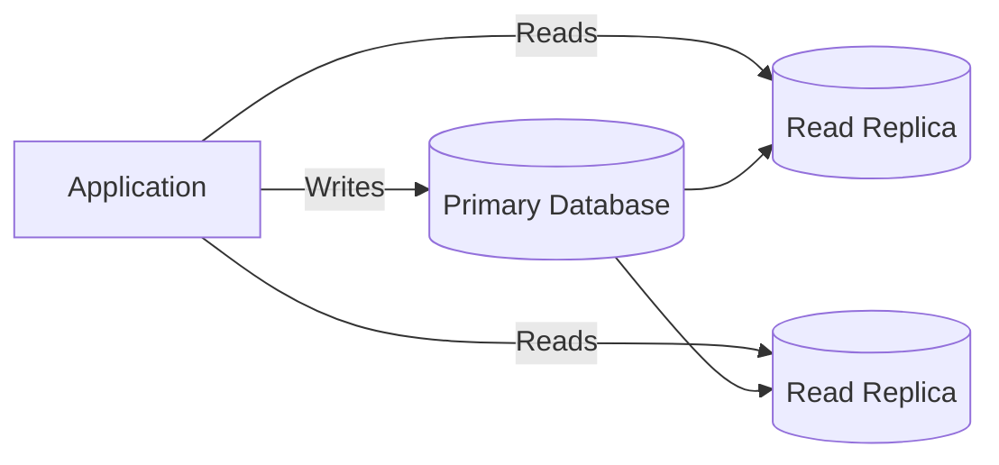

This improves read capacity but introduces replication lag.

A request that writes to the primary and immediately reads from a replica may observe stale data.

This is known as a **read-after-write consistency problem**.

Applications requiring read-your-writes semantics may need to read from the primary for a period or use a consistency-aware routing strategy.

---

## Sharding

Sharding partitions data across multiple database nodes.

For example:

```text
                    Application
                         |
             +-----------+-----------+
             |           |           |
             v           v           v
          Shard A     Shard B     Shard C
          users 1M    users 2M    users 3M
```

A shard key determines where records are stored.

Good shard keys should provide:

- Even distribution
- High cardinality
- Predictable routing
- Low cross-shard query requirements

Poor shard keys can create hot shards.

Sharding also increases complexity around:

- Transactions
- Joins
- Rebalancing
- Backups
- Schema migrations
- Operational debugging

Do not introduce sharding before simpler scaling strategies are insufficient.

---

## NoSQL Partitioning

Partitioning is fundamental to many distributed NoSQL systems.

Suppose data is partitioned by:

```text
customer_id
```

Then requests such as:

```text
GET /customers/42/orders
```

can be routed efficiently.

But if one customer receives a disproportionate amount of traffic, the partition can become hot.

A design that looks correct mathematically may still fail operationally because real traffic is rarely uniformly distributed.

---

## Polyglot Persistence

Production systems often use multiple storage technologies.

For example:

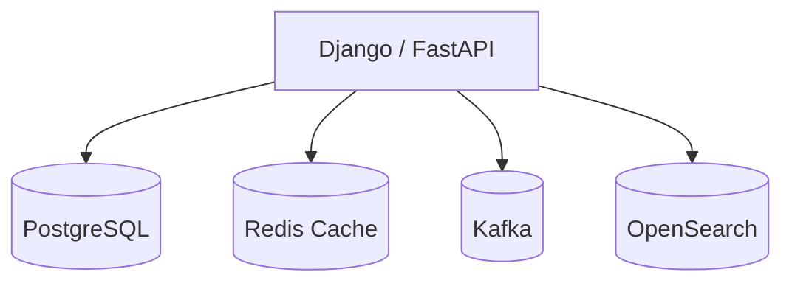

Each component has a specialized responsibility:

| Technology | Responsibility |
|---|---|
| PostgreSQL | Source of truth and transactions |
| Redis | Cache, sessions, rate limiting, ephemeral state |
| Kafka | Durable asynchronous event streaming |
| OpenSearch | Search and analytical retrieval |

This is called **polyglot persistence**.

It can provide strong architectural benefits, but every additional datastore creates:

- Operational overhead
- Monitoring requirements
- Backup requirements
- Security configuration
- Deployment complexity
- Failure modes
- Data synchronization problems

Do not add a database because it is fashionable.

---

## PostgreSQL + Redis Example

A common backend architecture is to use PostgreSQL as the source of truth and Redis as a cache.

```text
Client
  |
  v
Django / FastAPI
  |
  v
Redis
  |
  +---- Cache hit ----> Response
  |
  +---- Cache miss
           |
           v
       PostgreSQL
           |
           v
        Redis SET
           |
           v
        Response
```

The cache should not normally become the authoritative source of critical persistent state unless the architecture explicitly requires it.

A simplified Python example:

```python
import json

from django.core.cache import cache
from django.http import JsonResponse

from .models import Product


def get_product(request, product_id: int):
    cache_key = f"product:{product_id}"

    cached = cache.get(cache_key)
    if cached is not None:
        return JsonResponse(cached)

    product = Product.objects.values(
        "id",
        "name",
        "price",
    ).get(id=product_id)

    cache.set(
        cache_key,
        product,
        timeout=300,
    )

    return JsonResponse(product)
```

Production systems must also handle cache invalidation, serialization, stampedes, stale values, and database failures.

---

## Transactions Across SQL and NoSQL

A common architectural mistake is assuming that one transaction can automatically span multiple independent databases.

For example:

```text
PostgreSQL transaction
        |
        +---- update order
        |
        +---- update Redis
        |
        +---- publish Kafka event
```

These operations do not automatically form one ACID transaction.

A robust architecture often uses:

- Transactional outbox
- Idempotent consumers
- Event-driven processing
- Retry mechanisms
- Reconciliation jobs

### Transactional Outbox

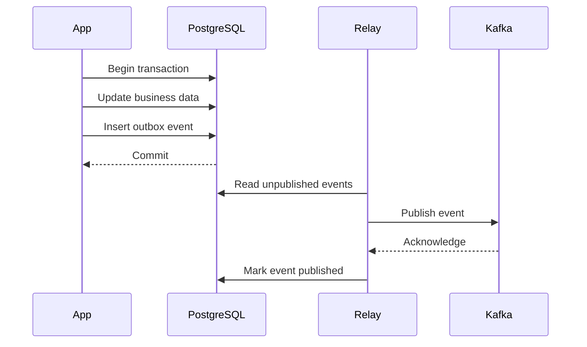

The critical property is that business state and the outbox event are committed atomically in the same database transaction.

---

## Schema Evolution

Schema flexibility does not eliminate schema management.

### SQL

Schema changes are typically explicit:

```sql
ALTER TABLE customers
ADD COLUMN phone_number VARCHAR(30);
```

Safe production migrations often follow an expand-and-contract approach:

```text
Deploy compatible schema
        |
        v
Deploy application supporting old + new schema
        |
        v
Backfill data
        |
        v
Switch reads/writes
        |
        v
Remove obsolete schema
```

### NoSQL

NoSQL applications often need to support multiple document versions:

```json
{
  "schema_version": 2,
  "name": "Alice",
  "email": "alice@example.com"
}
```

The application may migrate documents lazily or through a background migration.

Flexible schema therefore shifts some responsibility from the database to the application.

---

## Performance Considerations

Database performance depends on workload characteristics, not simply database category.

Important factors include:

- Query shape
- Index design
- Cardinality
- Data size
- Cache hit rate
- Connection pool size
- Network latency
- Transaction contention
- Replication
- Partitioning
- Serialization
- Read/write ratio

### SQL Performance

Use:

```sql
EXPLAIN (ANALYZE, BUFFERS)
SELECT *
FROM orders
WHERE customer_id = 42
ORDER BY created_at DESC
LIMIT 50;
```

Look for:

- Sequential scans where inappropriate
- Poor index usage
- Large row estimates
- Expensive joins
- Excessive sorting
- High buffer reads
- Large intermediate result sets

### NoSQL Performance

Evaluate:

- Partition-key distribution
- Hot partitions
- Request units or equivalent capacity
- Item/document size
- Secondary indexes
- Cross-partition queries
- Consistency mode
- Replication topology

---

## Connection Pooling

Every database connection consumes resources.

A backend service should normally use connection pooling rather than creating a new database connection for every request.

Conceptually:

```text
                    ┌───────────────┐
Request 1 ---------->│               │
Request 2 ---------->│ Connection    │----> Database
Request 3 ---------->│ Pool          │
Request 4 ---------->│               │
                    └───────────────┘
```

Too few connections can limit throughput.

Too many connections can overwhelm the database.

For a production service, connection pool sizing should consider:

- Number of application instances
- Worker processes
- Concurrent requests
- Database connection limits
- Query duration
- CPU capacity

A common mistake is configuring a pool per application instance without considering the total number of instances.

---

## Reliability and High Availability

A production database architecture should define:

- Backup strategy
- Recovery Point Objective
- Recovery Time Objective
- Replication
- Failover
- Monitoring
- Disaster recovery
- Data restoration procedures

For a relational database:

```text
Application
     |
     v
Database Endpoint
     |
     v
Primary
  /   \
 v     v
Replica Replica
```

For distributed NoSQL systems, replication and failure handling are usually built into the architecture differently.

The important point is that **replication is not the same as backup**.

Replication protects availability from some node failures.

Backups protect against scenarios such as:

- Accidental deletion
- Corruption
- Bad migrations
- Application bugs
- Logical data loss

---

## Security Considerations

Database security should be designed independently of whether the database is SQL or NoSQL.

### Network Security

Prefer:

```text
Internet
   |
   v
Load Balancer
   |
   v
Private Application Network
   |
   v
Private Database Network
```

Databases should generally not be directly exposed to the public internet.

### Authentication

Use:

- Managed identities where supported
- IAM-based authentication where appropriate
- Strong credentials
- Short-lived credentials where practical
- Secret managers
- Credential rotation

### Authorization

Apply least privilege.

An application should not normally connect using an administrative database account.

### Encryption

Use:

- Encryption in transit
- Encryption at rest
- Key management
- Secure secret storage

### SQL Injection

Parameterized queries are mandatory.

Bad:

```python
query = f"SELECT * FROM users WHERE email = '{email}'"
```

Good:

```python
cursor.execute(
    "SELECT * FROM users WHERE email = %s",
    [email],
)
```

ORMs such as Django ORM help substantially, but raw SQL must still be parameterized correctly.

---

## Backup and Disaster Recovery

A production storage strategy should define:

| Requirement | Question |
|---|---|
| RPO | How much data can be lost? |
| RTO | How quickly must service recover? |
| Backup frequency | How often are backups taken? |
| Retention | How long are backups retained? |
| Geographic recovery | Can the system recover from a regional failure? |
| Restore testing | Has restoration actually been tested? |

A backup that has never been restored is not a proven disaster-recovery strategy.

---

## Monitoring

Monitor both database health and application behavior.

Important metrics include:

### SQL

- Query latency
- Queries per second
- Connection utilization
- Lock contention
- Deadlocks
- Replication lag
- CPU
- Memory
- Disk usage
- IOPS
- Cache hit ratio
- Slow queries

### NoSQL

- Request latency
- Read/write throughput
- Throttling
- Capacity consumption
- Partition distribution
- Hot partitions
- Replication health
- Error rates
- Item/document size

Application-level metrics should correlate database behavior with API requests.

---

## Common Mistakes

### Choosing NoSQL Because "SQL Does Not Scale"

This is a false assumption.

PostgreSQL can support substantial production workloads through:

- Proper indexes
- Query optimization
- Connection pooling
- Read replicas
- Partitioning
- Caching
- Vertical scaling
- Horizontal architectural patterns

Start with workload requirements.

### Treating NoSQL as Automatically Faster

NoSQL databases can be extremely fast for the workloads they are designed for.

A poorly designed partition key or access pattern can make a NoSQL system perform badly.

### Using MongoDB or DynamoDB as a Direct Replacement for PostgreSQL

A document or key-value database is not simply a relational database with a different syntax.

The data model, query model, consistency behavior, and operational model can be fundamentally different.

### Overusing Microservices and Multiple Databases

Using:

```text
Service A -> PostgreSQL
Service B -> MongoDB
Service C -> Cassandra
Service D -> Redis
Service E -> Elasticsearch
```

does not automatically create a scalable architecture.

Each datastore adds operational and consistency complexity.

### Ignoring Data Relationships

If the application constantly needs:

```text
Customer
 -> Orders
    -> Products
       -> Inventory
```

then choosing a database that makes these relationships difficult may increase application complexity significantly.

### Ignoring Replication Lag

A write followed immediately by a replica read can return stale data.

### Assuming Flexible Schema Means No Migrations

NoSQL systems still require:

- Backward compatibility
- Schema versioning
- Data migrations
- Rollout strategies
- Validation

### Designing Before Understanding Queries

A database schema should be evaluated against real access patterns.

For every important query, ask:

```text
What data is required?
How often is it executed?
How many rows/documents are touched?
Which indexes or partitions support it?
What consistency is required?
What happens at peak traffic?
```

---

## Interview Traps

### "SQL is CP and NoSQL is AP"

Incorrect as a blanket statement.

The consistency and availability properties depend on the specific distributed architecture and configuration.

### "NoSQL Does Not Support Transactions"

Incorrect.

Many NoSQL systems support transactions, although the scope and guarantees differ substantially between products.

### "Normalization Is Always Better"

Normalization improves integrity and reduces duplication, but denormalization can be appropriate for performance and read-heavy workloads.

### "Joins Are Always Slow"

Incorrect.

Well-indexed joins on appropriate datasets can be highly efficient.

### "Horizontal Scaling Means NoSQL"

Incorrect.

Relational databases can also participate in horizontally scaled architectures through replicas, partitioning, sharding, distributed SQL systems, and application-level decomposition.

### "Eventual Consistency Means Data Loss"

Incorrect.

Eventual consistency means replicas or views may temporarily differ. Data durability and consistency are separate properties.

---

## Decision Framework

Use the following decision process when selecting a database.

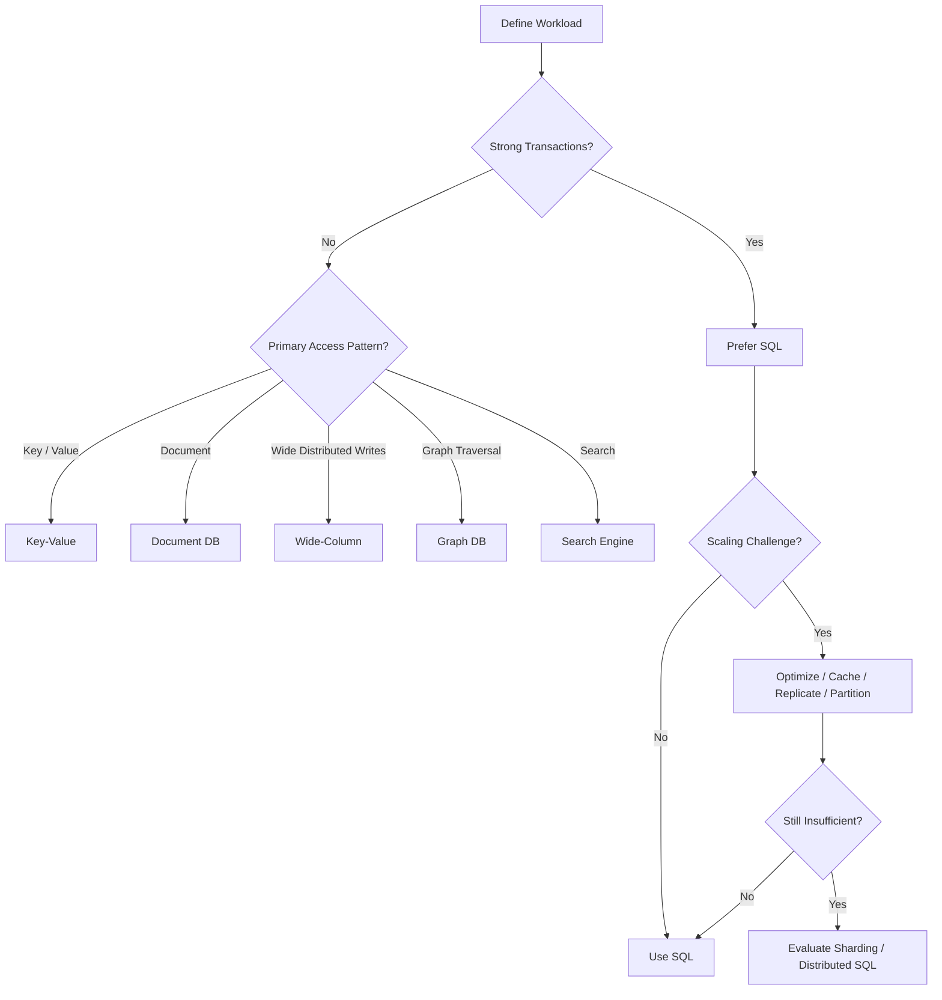

Before selecting a database, document:

1. Read/write ratio
2. Peak requests per second
3. Data volume
4. Growth rate
5. Query patterns
6. Transaction boundaries
7. Consistency requirements
8. Availability requirements
9. Latency requirements
10. Geographic distribution
11. Backup and recovery requirements
12. Operational expertise
13. Cost constraints

---

## Example: E-Commerce Architecture

A realistic e-commerce backend may use multiple storage technologies:

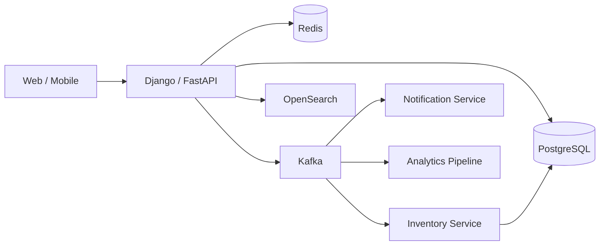

Possible responsibilities:

| Requirement | Storage |
|---|---|
| Users | PostgreSQL |
| Orders | PostgreSQL |
| Payments | PostgreSQL |
| Inventory | PostgreSQL |
| Sessions | Redis |
| Rate limiting | Redis |
| Product cache | Redis |
| Order events | Kafka |
| Product search | OpenSearch |
| Analytics | Data warehouse / analytical database |

The architecture is not "SQL versus NoSQL." It is **using the right persistence mechanism for each workload while minimizing unnecessary complexity**.

---

## Cost Considerations

Database cost is more than the storage price.

Consider:

- Compute
- Memory
- Storage
- IOPS
- Network transfer
- Replicas
- Backups
- Cross-region replication
- Managed-service premiums
- Operational engineering time
- Monitoring
- Disaster recovery

A technically optimized NoSQL architecture can still be economically worse than a well-designed PostgreSQL system if its workload does not justify the additional infrastructure.

Operational simplicity has economic value.

---

## Production Recommendations

For most backend applications:

- Start with PostgreSQL unless there is a concrete reason not to.
- Model SQL schemas around domain integrity and actual query patterns.
- Add indexes based on measured workloads.
- Use Redis for appropriate caching and ephemeral state rather than replacing the primary database unnecessarily.
- Use read replicas when read scaling is required.
- Introduce partitioning or sharding only when workload characteristics justify it.
- Choose NoSQL based on a specific access pattern and database capability.
- Treat consistency as an explicit architectural requirement.
- Use transactional outbox patterns when coordinating database changes with asynchronous events.
- Test backups through actual restoration procedures.
- Monitor database behavior from both infrastructure and application perspectives.
- Keep the number of persistence technologies intentionally small.

---

## Key Takeaways

- SQL is usually the strongest default for transactional, relational workloads because of mature constraints, joins, indexing, and ACID transaction support.
- NoSQL is not one technology; document, key-value, wide-column, and graph databases solve different access-pattern and scalability problems.
- Database selection should be driven by workload, query patterns, consistency, transaction boundaries, scale, and operational requirements rather than technology trends.
- Production systems commonly use polyglot persistence, but every additional datastore introduces operational, consistency, security, and recovery complexity.
- A senior-level database decision explains not only why a database is fast, but why its data model, failure behavior, consistency guarantees, scaling strategy, and operational cost fit the system.
```
```

```
Markdown


```
# 02- ACID

## Overview

ACID is a set of properties that define the reliability guarantees of database transactions:

- **Atomicity** — a transaction succeeds completely or has no effect.
- **Consistency** — a successful transaction preserves defined database invariants.
- **Isolation** — concurrent transactions behave according to the database's isolation guarantees.
- **Durability** — once a transaction commits, its changes survive the failures covered by the database's durability guarantees.

ACID is primarily about **transaction correctness under concurrency and failure**. It is not a synonym for "SQL database," and it does not mean that every query is isolated from every other query or that data can never be lost under catastrophic infrastructure failure.

For backend engineers, understanding ACID is essential when designing systems involving:

- Payments
- Orders
- Inventory
- Account balances
- Authentication and authorization state
- Financial ledgers
- Reservations
- Multi-step business workflows
- Any operation where partial updates would create invalid state

A typical transactional flow looks like:

```text
Application
    |
    | BEGIN
    v
Database Transaction
    |
    +---- Update record A
    |
    +---- Update record B
    |
    +---- Insert record C
    |
    v
  COMMIT
    |
    v
Transaction becomes durable
```

If an operation fails before commit, the database can roll back the transaction according to its transaction semantics.

---

## Why ACID Matters

Without transaction guarantees, multi-step operations can leave the database in an invalid intermediate state.

Consider transferring `$100` between two accounts:

```text
Account A: $1,000
Account B: $500
```

The operation requires:

```text
A = A - 100
B = B + 100
```

If the first operation succeeds but the second fails:

```text
Account A: $900
Account B: $500
```

The system has effectively lost `$100`.

A transaction makes these operations one logical unit:

```text
BEGIN
    debit A
    credit B
COMMIT
```

If the transaction cannot complete:

```text
ROLLBACK
```

The intended state remains:

```text
Account A: $1,000
Account B: $500
```

The key engineering principle is:

> A transaction should contain the smallest set of changes that must succeed or fail together.

---

## ACID Properties

| Property | Core Question | Primary Concern |
|---|---|---|
| Atomicity | Did all required changes happen together? | Partial failure |
| Consistency | Did the transaction preserve valid state? | Data invariants |
| Isolation | What can concurrent transactions observe? | Concurrency |
| Durability | Does committed data survive failure? | Persistence |

These properties are related but solve different problems.

A system can have atomic transactions while still exposing concurrency anomalies if isolation is insufficient. Similarly, durability does not mean protection against every possible form of data loss.

---

## Atomicity

### What It Is

Atomicity means a transaction is treated as a single logical unit of work.

The database guarantees that the transaction does not leave behind a partially committed result.

Conceptually:

```text
Transaction
    |
    +---- Operation A
    |
    +---- Operation B
    |
    +---- Operation C
    |
    v
  COMMIT
```

Either:

```text
A + B + C
```

are committed together, or the transaction's changes are rolled back.

### Why It Exists

Real business operations commonly require multiple database changes.

For example, creating an order might require:

```text
1. Create order
2. Create order items
3. Reserve inventory
4. Create payment record
```

If only some operations succeed, the database may become inconsistent.

Atomicity provides a transaction boundary around changes that must be treated as one unit.

---

## Atomicity Example in PostgreSQL

```sql
BEGIN;

INSERT INTO orders (customer_id, total)
VALUES (42, 149.99);

INSERT INTO order_items (order_id, product_id, quantity)
VALUES (1001, 501, 2);

UPDATE inventory
SET available = available - 2
WHERE product_id = 501
  AND available >= 2;

COMMIT;
```

If inventory cannot be reserved, the application should not commit the transaction.

For example:

```sql
BEGIN;

INSERT INTO orders (customer_id, total)
VALUES (42, 149.99);

UPDATE inventory
SET available = available - 2
WHERE product_id = 501
  AND available >= 2;

-- Application verifies that exactly one inventory row was updated.

ROLLBACK;
```

The important detail is that application logic and database constraints must cooperate.

Atomicity does not automatically mean the business operation is correct.

---

## Atomicity in Django

Django provides transaction management through `transaction.atomic()`.

```python
from django.db import transaction

from orders.models import Order, OrderItem


@transaction.atomic
def create_order(customer, product, quantity):
    order = Order.objects.create(
        customer=customer,
        total=product.price * quantity,
    )

    OrderItem.objects.create(
        order=order,
        product=product,
        quantity=quantity,
        unit_price=product.price,
    )

    return order
```

If an exception causes the transaction to roll back, the database changes inside the atomic block are rolled back.

For production code, keep transaction blocks reasonably small and avoid unnecessary external work inside them.

---

## Atomicity Does Not Mean Everything Is Automatically Transactional

A database transaction does not automatically include external systems.

For example:

```text
PostgreSQL transaction
        |
        +---- Update order
        |
        +---- Charge Stripe
        |
        +---- Send email
        |
        +---- Publish Kafka event
```

These operations do not automatically become one ACID transaction.

If PostgreSQL commits but the external API call fails, PostgreSQL cannot simply roll back the external system.

This is where distributed-systems patterns become important:

- Transactional outbox
- Idempotency
- Saga pattern
- Retry
- Reconciliation
- Compensating actions

---

## Consistency

### What It Is

Consistency means a successful transaction preserves the database's defined integrity rules and invariants.

Examples of invariants include:

```text
account.balance >= 0
order.total >= 0
email must be unique
foreign key must reference an existing row
inventory.available >= 0
```

The database can enforce many of these rules through:

- Primary keys
- Foreign keys
- Unique constraints
- Check constraints
- Not-null constraints
- Exclusion constraints
- Triggers where appropriate

Example:

```sql
CREATE TABLE accounts (
    id BIGSERIAL PRIMARY KEY,
    balance NUMERIC(18, 2) NOT NULL
        CHECK (balance >= 0)
);
```

The database will reject an update that violates the constraint.

---

## Database Consistency vs Distributed-System Consistency

One of the most common interview mistakes is treating these concepts as identical.

In ACID:

> Consistency means a transaction preserves defined database invariants.

In distributed systems:

> Consistency often describes what values different clients or replicas can observe and when.

These are related concepts but are not interchangeable.

For example, a PostgreSQL transaction can preserve all database constraints while an asynchronous search index temporarily contains stale information.

```text
PostgreSQL
    |
    | committed
    v
Order = CONFIRMED

OpenSearch
    |
    | asynchronous update
    v
Order = PROCESSING
```

The system can still be correct if the search index is explicitly designed as an eventually consistent projection.

---

## Isolation

Isolation controls how concurrent transactions interact.

Consider two transactions operating on the same data:

```text
Transaction A
      |
      | read
      v
   balance = 100

Transaction B
      |
      | read
      v
   balance = 100
```

If both modify the value concurrently, the outcome depends on the database's concurrency control and isolation level.

Isolation exists to prevent undesirable effects from concurrent transactions.

Common anomalies include:

- Dirty reads
- Non-repeatable reads
- Phantom reads
- Lost updates
- Write skew

Different databases and isolation levels prevent different anomalies.

---

## Transaction Isolation Levels

Common SQL isolation levels are:

| Isolation Level | Dirty Read | Non-Repeatable Read | Phantom Read | Typical Trade-off |
|---|---:|---:|---:|---|
| Read Uncommitted | Possible | Possible | Possible | Highest concurrency, weakest guarantees |
| Read Committed | Prevented | Possible | Possible | Common practical default |
| Repeatable Read | Prevented | Prevented | Database-dependent semantics | Stronger consistency |
| Serializable | Prevented | Prevented | Prevented | Strongest standard isolation, more contention/retries |

The exact behavior is database-specific.

For example, PostgreSQL implements `READ COMMITTED` and `REPEATABLE READ` using MVCC and provides stronger behavior for `REPEATABLE READ` than the minimum required by the SQL standard.

---

## Dirty Read

A dirty read occurs when one transaction reads data written by another transaction that has not committed.

Conceptually:

```text
Transaction A
    UPDATE balance = 500
    -- not committed

Transaction B
    SELECT balance
    -> 500

Transaction A
    ROLLBACK
```

Transaction B observed a value that never became committed state.

Strong database isolation levels prevent this.

---

## Non-Repeatable Read

A non-repeatable read occurs when the same row is read twice within a transaction and another transaction commits a change between those reads.

```text
Transaction A
    SELECT balance -> 100

Transaction B
    UPDATE balance = 200
    COMMIT

Transaction A
    SELECT balance -> 200
```

The transaction observed two different committed values for the same row.

---

## Phantom Read

A phantom read occurs when repeated execution of a predicate-based query returns a different set of rows because another transaction inserted or removed matching rows.

Example:

```sql
SELECT *
FROM orders
WHERE customer_id = 42;
```

The first execution might return:

```text
Order 1
Order 2
```

Another transaction inserts:

```text
Order 3
```

The second execution may return:

```text
Order 1
Order 2
Order 3
```

The exact behavior depends on the database and isolation level.

---

## Lost Update

A lost update can happen when concurrent transactions read the same value and then overwrite each other's changes.

Example:

```text
Initial balance = 100

Transaction A reads 100
Transaction B reads 100

A writes 150
B writes 120

Final value = 120
```

The update performed by A was effectively lost.

Solutions include:

- Row-level locking
- Atomic SQL updates
- Optimistic concurrency control
- Higher isolation
- Version columns

A database-side atomic update is often preferable:

```sql
UPDATE accounts
SET balance = balance + 50
WHERE id = 42;
```

Instead of:

```text
SELECT balance
application calculates balance
UPDATE balance
```

---

## Row-Level Locking

For operations requiring serialized access to a particular row, databases can provide row-level locks.

PostgreSQL:

```sql
BEGIN;

SELECT id, balance
FROM accounts
WHERE id = 42
FOR UPDATE;

UPDATE accounts
SET balance = balance - 100
WHERE id = 42;

COMMIT;
```

`FOR UPDATE` locks the selected rows against conflicting updates until the transaction ends.

This is useful for operations such as:

- Inventory reservation
- Balance updates
- Seat allocation
- Resource reservation

However, excessive locking can reduce concurrency.

---

## Django `select_for_update()`

Django exposes row-level locking through `select_for_update()`.

```python
from django.db import transaction

from accounts.models import Account


@transaction.atomic
def withdraw(account_id: int, amount):
    account = (
        Account.objects
        .select_for_update()
        .get(id=account_id)
    )

    if account.balance < amount:
        raise ValueError("Insufficient balance")

    account.balance -= amount
    account.save(update_fields=["balance"])
```

The transaction serializes conflicting updates to the same account row.

This pattern should be used deliberately because locks increase contention when transactions become long-lived.

---

## Optimistic Concurrency Control

Optimistic concurrency assumes conflicts are relatively uncommon.

A version column can detect whether another transaction modified the row.

Example:

```text
id | balance | version
---|---------|--------
42 | 1000    | 7
```

Application reads:

```text
balance = 1000
version = 7
```

Update:

```sql
UPDATE accounts
SET balance = 900,
    version = 8
WHERE id = 42
  AND version = 7;
```

If zero rows are updated, another transaction changed the record first.

The application can retry or return a conflict.

Optimistic concurrency is useful when:

- Contention is low
- Long transactions should be avoided
- Conflicts can be retried safely

---

## Durability

### What It Is

Durability means a successfully committed transaction remains persisted despite failures covered by the database's durability guarantees.

A successful:

```sql
COMMIT;
```

should not normally be followed by the database simply forgetting the committed transaction after a routine crash.

Databases use mechanisms such as:

- Write-ahead logging
- Transaction logs
- WAL
- Journaling
- Checkpoints
- Replication
- Persistent storage

to provide durability.

---

## Write-Ahead Logging

PostgreSQL uses Write-Ahead Logging (WAL).

The fundamental principle is:

> The database records the required log information before considering the corresponding data changes safely persisted.

Conceptually:

```text
Application
    |
    v
Transaction
    |
    v
WAL / Transaction Log
    |
    v
Persistent Storage
    |
    v
Data Pages
```

During recovery, the database can replay the appropriate log records to reconstruct committed state.

This is one reason database transactions can survive process and machine failures.

---

## Durability Is Not the Same as Backup

A common mistake is assuming:

```text
Durability = Disaster Recovery
```

They are different.

Durability protects committed data against certain failures.

Backups protect against additional failure modes such as:

- Accidental deletion
- Incorrect migrations
- Application bugs
- Logical corruption
- Malicious actions
- Operational mistakes

For example:

```text
Primary Database
      |
      +---- WAL / Replication
      |
      +---- Backup System
              |
              +---- Point-in-time recovery
```

A highly available database without tested backups is not a complete disaster-recovery strategy.

---

## Commit Lifecycle

A simplified transaction lifecycle looks like:

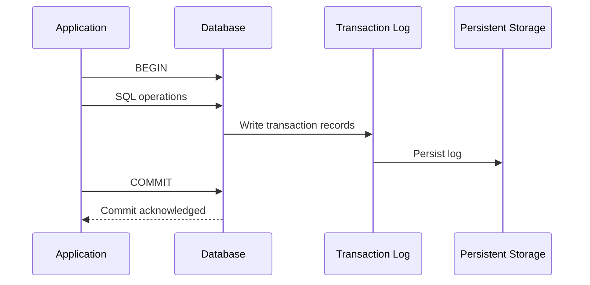

The actual implementation is database-specific, but the architectural idea is important: transaction durability depends on the database's logging and storage mechanisms.

---

## ACID and MVCC

Many modern relational databases use **Multi-Version Concurrency Control (MVCC)**.

Instead of forcing readers and writers to block each other in every situation, the database maintains multiple row versions or equivalent visibility metadata.

Conceptually:

```text
Row versions

Version 1
    |
    +---- Transaction A can see this version

Version 2
    |
    +---- Transaction B can see this version
```

This allows readers to obtain a consistent view while writes proceed concurrently.

PostgreSQL uses MVCC extensively.

Benefits include:

- High read concurrency
- Reduced reader/writer blocking
- Consistent snapshots
- Efficient transactional concurrency

Trade-offs include:

- Dead tuples
- Vacuum requirements
- Transaction ID management
- Storage overhead
- Long-running transaction problems

---

## Long-Running Transactions

Long transactions can cause significant production problems.

For example:

```text
BEGIN
   |
   | application processing
   |
   | external API call
   |
   | user interaction
   |
   | slow computation
   |
COMMIT
```

Holding a transaction open while performing unrelated work can:

- Keep locks longer
- Increase contention
- Prevent cleanup
- Increase MVCC storage pressure
- Increase deadlock risk
- Reduce throughput

Prefer:

```text
BEGIN
  required database operations
COMMIT

external work
```

rather than:

```text
BEGIN
  database operations
  HTTP call
  Kafka publish
  email
  computation
COMMIT
```

External operations should generally be coordinated through reliable asynchronous patterns rather than held inside database transactions.

---

## Deadlocks

A deadlock occurs when transactions wait for each other's locks.

Example:

```text
Transaction A:
    locks Row 1
    waits for Row 2

Transaction B:
    locks Row 2
    waits for Row 1
```

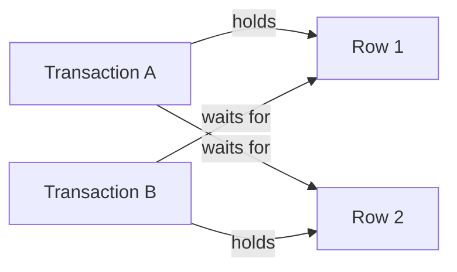

The database may detect the cycle and abort one transaction.

### Prevention

Use consistent lock ordering.

For example, always lock accounts in ascending ID order:

```text
Account 10
Account 20
```

rather than sometimes:

```text
20 -> 10
```

and elsewhere:

```text
10 -> 20
```

Other strategies include:

- Keep transactions short
- Lock only required rows
- Avoid unnecessary locks
- Use appropriate indexes
- Retry transactions after deadlock errors

---

## Isolation vs Locking

Isolation and explicit locking are related but different.

Isolation defines the database's concurrency semantics.

Explicit locking tells the database that a particular operation requires stronger coordination.

For example:

```sql
SELECT *
FROM inventory
WHERE product_id = 100
FOR UPDATE;
```

is an explicit concurrency-control decision.

A senior engineer should ask:

```text
What invariant am I protecting?
What transactions can race?
What happens if they race?
Do I need a lock?
Can an atomic update solve the problem?
Can optimistic concurrency work?
What happens under high contention?
```

---

## ACID and Distributed Systems

ACID becomes more complicated when data spans multiple services.

Consider:

```text
Order Service
    |
    v
PostgreSQL

Payment Service
    |
    v
PostgreSQL

Inventory Service
    |
    v
PostgreSQL
```

There is no single local transaction covering all three databases.

Trying to force global ACID transactions across microservices can create substantial coupling and operational complexity.

Instead, distributed workflows often use:

- Saga pattern
- Event-driven architecture
- Transactional outbox
- Idempotent consumers
- Compensation
- Retry
- Dead-letter queues
- Reconciliation

---

## Transactional Outbox

Suppose an order must be persisted and an event must be published.

Naive implementation:

```text
Save order
   |
   v
Publish Kafka event
```

Failure between these operations can create:

```text
Order saved
Event not published
```

The transactional outbox pattern solves this by writing the event to the same database transaction:

```text
BEGIN
    create order
    create outbox event
COMMIT
```

A background publisher then sends the event to Kafka.

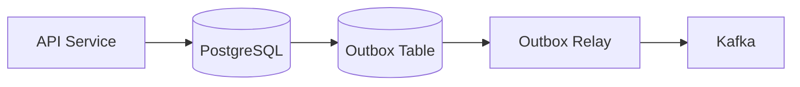

This provides atomicity between business state and the durable event record.

The Kafka publication itself is not part of the PostgreSQL transaction, so the relay must still handle retries and duplicate publication safely.

---

## ACID vs BASE

BASE is often discussed in contrast with ACID, particularly in distributed-system discussions.

| Property | ACID | BASE |
|---|---|---|
| Primary focus | Transaction correctness | Availability and distributed scalability |
| Consistency | Strong transactional guarantees | Often eventual or tunable |
| Transactions | Central concept | May be narrower or different |
| Data model | Often relational | Commonly distributed NoSQL |
| Typical use | Financial / transactional systems | Large distributed workloads |
| Failure handling | Transaction rollback | Retry, convergence, reconciliation |

BASE is a conceptual model, not a strict replacement for ACID.

Modern databases can provide combinations of transactional and distributed guarantees, so avoid treating ACID and BASE as mutually exclusive technology categories.

---

## ACID in PostgreSQL

PostgreSQL provides mature transactional capabilities including:

- ACID transactions
- MVCC
- Multiple isolation levels
- Row-level locks
- Foreign keys
- Unique constraints
- Check constraints
- WAL
- Savepoints
- Two-phase commit support
- Replication mechanisms

Example:

```sql
BEGIN;

UPDATE inventory
SET available = available - 1
WHERE product_id = 100
  AND available > 0;

-- Verify that one row was updated.

INSERT INTO orders (
    customer_id,
    product_id
)
VALUES (
    42,
    100
);

COMMIT;
```

The application should verify business conditions such as whether inventory was actually decremented.

---

## Savepoints

Savepoints allow part of a transaction to be rolled back without necessarily rolling back the entire transaction.

```sql
BEGIN;

INSERT INTO orders (customer_id)
VALUES (42);

SAVEPOINT before_optional_operation;

INSERT INTO order_metadata (order_id, key, value)
VALUES (1001, 'source', 'mobile');

ROLLBACK TO SAVEPOINT before_optional_operation;

COMMIT;
```

Savepoints are useful for advanced transaction workflows but should not become a substitute for clear transaction design.

---

## Nested Transactions

Application frameworks may expose nested `atomic` blocks, but these do not necessarily create independent database transactions.

In Django:

```python
from django.db import transaction


with transaction.atomic():
    create_order()

    try:
        with transaction.atomic():
            perform_optional_operation()
    except ValueError:
        pass
```

The inner `atomic()` block typically corresponds to a savepoint when already inside an outer transaction.

Understanding this distinction prevents incorrect assumptions about rollback behavior.

---

## Transaction Boundaries in Backend APIs

A REST API endpoint often maps naturally to a transaction boundary.

For example:

```text
POST /orders
       |
       v
Validate request
       |
       v
BEGIN
       |
       +---- Create order
       +---- Create items
       +---- Reserve inventory
       |
       v
COMMIT
       |
       v
Return response
```

However, not every HTTP request needs a database transaction.

Read-only endpoints may not require explicit transaction blocks.

The transaction boundary should represent the business operation that must remain consistent.

---

## Transaction Boundaries in Celery

Background jobs also require deliberate transaction design.

A problematic pattern is:

```python
@transaction.atomic
def process_job():
    update_database()

    call_external_api()

    publish_message()
```

The database transaction remains open while external operations execute.

A better design may be:

```text
Database transaction
    |
    +---- Update state
    +---- Write outbox event
    |
    v
Commit

Background worker
    |
    +---- External API
    +---- Kafka
    +---- Retry
```

This keeps database transactions short and makes failure handling explicit.

---

## Performance Implications

Transactions have costs.

Longer and more complex transactions can increase:

- Lock contention
- Memory pressure
- WAL generation
- Replication lag
- Deadlock probability
- Transaction latency
- Connection occupancy

A transaction should therefore be:

- As short as practical
- Narrowly scoped
- Explicit about required locks
- Free from unnecessary network calls
- Supported by appropriate indexes

A high-throughput system often improves dramatically simply by reducing transaction duration.

---

## Connection Pool Interaction

Database connections are commonly held by transactions.

Consider:

```text
Application instances: 20
Workers per instance: 4
Pool size: 10
```

Potential maximum connections:

```text
20 × 10 = 200
```

The actual number depends on runtime and pool configuration, but the architectural lesson is important.

If transactions are long-running, connections remain occupied longer.

This can cause:

```text
More transaction time
      |
      v
Connections occupied longer
      |
      v
Pool exhaustion
      |
      v
Requests wait
      |
      v
Latency increases
```

Transaction design and connection-pool design therefore cannot be treated independently.

---

## Security Considerations

ACID does not replace authorization.

For example:

```text
BEGIN
UPDATE accounts SET balance = balance - 100
COMMIT
```

The transaction may be perfectly atomic while still allowing an unauthorized user to modify another user's account.

Production systems need both:

- Transaction correctness
- Authorization correctness

Use:

- Least-privilege database users
- Application-level authorization
- Row-level security where appropriate
- Parameterized queries
- TLS
- Encrypted storage
- Secret management
- Auditing

---

## Monitoring ACID Systems

Monitor transactional behavior, not just CPU and memory.

Important metrics include:

| Metric | Why It Matters |
|---|---|
| Transaction latency | Detect slow transaction paths |
| Lock wait time | Detect contention |
| Deadlocks | Detect concurrency design problems |
| Rollback rate | Detect failed operations |
| Connection utilization | Detect pool pressure |
| Long-running transactions | Detect resource retention |
| Replication lag | Detect durability/HA propagation delays |
| WAL generation | Detect write pressure |
| Slow queries | Identify transaction bottlenecks |

Application tracing should correlate:

```text
HTTP request
    |
    v
Service method
    |
    v
Database transaction
    |
    v
SQL queries
```

This makes transaction bottlenecks much easier to diagnose.

---

## Common Mistakes

### Treating ACID as a Single Feature

ACID contains four distinct guarantees.

A system can have strong atomicity while having different isolation characteristics depending on the isolation level.

### Making Transactions Too Large

Avoid putting unrelated work inside a transaction.

Bad:

```text
BEGIN
database update
HTTP request
email
Kafka publish
large computation
COMMIT
```

Prefer a short transactional section and explicit asynchronous coordination.

### Using Locks Everywhere

Locks protect invariants but reduce concurrency.

Use the smallest lock scope necessary.

### Ignoring Deadlocks

Concurrent systems can deadlock even when individual transactions are correct.

Use consistent lock ordering and retry safely.

### Relying Only on Application Validation

Application validation is useful, but critical invariants should often also be enforced by the database.

For example:

```sql
CHECK (balance >= 0)
UNIQUE (email)
FOREIGN KEY (...)
```

### Assuming Replication Equals Durability

Replication improves availability and recovery options, but it does not replace backups.

### Assuming ACID Spans Microservices

A PostgreSQL transaction in Service A does not automatically include PostgreSQL in Service B.

Use distributed transaction patterns where required.

### Ignoring Retry Semantics

A transaction can fail due to:

- Deadlocks
- Serialization conflicts
- Network failures
- Database failover

Retrying may be appropriate, but only when the operation is safe to retry.

Idempotency is therefore an important part of production transaction design.

---

## Production Best Practices

### Keep Transactions Short

Perform only the database work that belongs inside the transaction.

### Enforce Critical Invariants at the Database Layer

Use:

- Constraints
- Foreign keys
- Unique indexes
- Check constraints

where appropriate.

### Prefer Atomic Database Operations

Instead of:

```text
SELECT value
calculate
UPDATE value
```

prefer:

```sql
UPDATE accounts
SET balance = balance + 100
WHERE id = 42;
```

when the business operation permits it.

### Use Explicit Locking for Real Contention

Use `FOR UPDATE` or framework equivalents when multiple workers can modify the same critical resource.

### Design for Retries

Transactions can fail under concurrency.

Retry logic should:

- Catch only retryable failures
- Use bounded retries
- Apply exponential backoff where appropriate
- Preserve idempotency
- Avoid retry storms

### Avoid External Calls Inside Transactions

External calls have unpredictable latency and failure behavior.

Keep them outside the critical database transaction whenever possible.

### Test Under Concurrency

Unit tests alone are not enough.

Test scenarios involving:

- Concurrent updates
- Duplicate requests
- Deadlocks
- Serialization failures
- Database failover
- Worker retries
- Partial external failures

---

## Interview Traps

### "Atomicity Means Every Operation in the System Succeeds Together"

No.

Atomicity applies to the transaction boundary managed by the transactional system. It does not automatically include external APIs, Kafka, Redis, or other databases.

### "Consistency Means Every Replica Has the Same Data"

Not necessarily.

ACID consistency is about preserving database invariants. Replica consistency is a distributed-systems concern.

### "Serializable Is Always Better"

Serializable provides stronger isolation but can reduce concurrency and cause more retries under contention.

The correct isolation level depends on the business invariant and workload.

### "Locks Guarantee No Race Conditions"

Locks only protect the resources and execution paths where they are correctly applied.

### "Durability Means You Never Lose Data"

Durability depends on the database's configuration, storage guarantees, replication, and failure model.

Backups and disaster recovery remain necessary.

---

## Practical Transaction Design Checklist

Before introducing a transaction, ask:

```text
What business invariant am I protecting?

Which records must change together?

What concurrent operations can race?

What isolation level is required?

Do I need explicit row locks?

Can an atomic UPDATE solve the problem?

How long will the transaction remain open?

Am I performing network I/O inside it?

What happens if the transaction is retried?

Is the operation idempotent?

What happens if the database commits but an external
operation fails?

Do I need an outbox, Saga, or reconciliation process?
```

This checklist is more valuable in production than memorizing the ACID acronym alone.

---

## Example: Payment Workflow

Consider an order payment workflow:

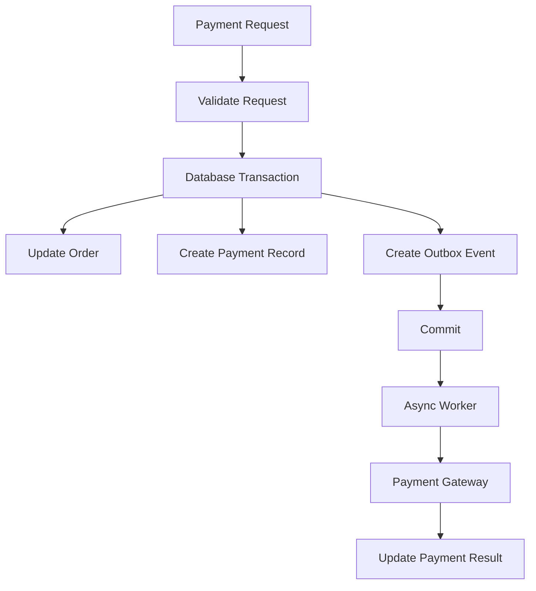

The local transaction might guarantee:

```text
Order state
+
Payment record
+
Outbox event
```

are committed together.

The external payment gateway is not part of that local ACID transaction.

The payment workflow therefore needs additional mechanisms for:

- Idempotency
- Retries
- Timeouts
- Reconciliation
- Duplicate webhook handling
- State transitions

This distinction between **local transactional consistency** and **distributed workflow consistency** is fundamental to senior-level system design.

---

## Key Takeaways

- ACID provides four distinct guarantees: atomicity, consistency, isolation, and durability; understanding the difference between them is more important than memorizing the acronym.
- Transaction boundaries should protect business invariants while remaining as short and narrow as practical to reduce contention, deadlocks, and connection pressure.
- Isolation levels and explicit locking determine how concurrent transactions interact; stronger isolation is not automatically better because it can reduce concurrency and increase retries.
- ACID transactions do not automatically span Kafka, Redis, external APIs, or other microservices; distributed workflows require patterns such as transactional outbox, Saga, idempotency, and reconciliation.
- Durability is not disaster recovery: production systems still need tested backups, replication, recovery procedures, monitoring, and clearly defined RPO and RTO.
```
```

```
Markdown


```
# 02- ACID

## Overview

ACID is a set of transaction guarantees that relational databases use to provide predictable behavior when multiple operations execute together, concurrently, or under failure.

The acronym represents:

- **Atomicity** — a transaction is committed as a unit or rolled back as a unit.
- **Consistency** — a committed transaction preserves the database's defined integrity constraints and business invariants.
- **Isolation** — concurrent transactions are controlled according to the selected isolation semantics.
- **Durability** — once a transaction is successfully committed, its committed state survives the failures covered by the database's durability model.

ACID is not simply a feature of SQL syntax. It is a collection of database guarantees implemented through mechanisms such as transaction logs, MVCC, locks, constraints, snapshots, checkpoints, and recovery procedures.

For backend system design, ACID becomes particularly important when an operation changes multiple pieces of state that must remain consistent:

- Payments
- Account balances
- Inventory
- Orders
- Reservations
- Financial ledgers
- Authentication state
- Permissions
- Subscription state
- Any workflow where partial updates can create invalid state

A typical transaction looks like:

```text
Application
    |
    | BEGIN
    v
Database Transaction
    |
    +---- Change A
    |
    +---- Change B
    |
    +---- Change C
    |
    v
  COMMIT
    |
    v
Committed State
```

If the transaction cannot complete:

```text
BEGIN
  |
  +---- Change A
  +---- Change B
  +---- Failure
          |
          v
       ROLLBACK
          |
          v
Previous Committed State
```

The important engineering question is not "Should I use ACID?" for every operation. The better question is:

> Which state transitions must be atomic, what invariants must remain true, and what concurrency guarantees does the workload require?

---

## Why ACID Matters

Consider transferring `100` units between two accounts:

```text
Account A = 1,000
Account B =   500
```

The operation requires:

```text
A = A - 100
B = B + 100
```

Without a transaction, the following failure is possible:

```text
Debit A
   |
   v
A = 900
   |
   v
Credit B
   |
   X
  Failure
```

The database is left with:

```text
A = 900
B = 500
```

The transaction should instead define the complete business operation:

```sql
BEGIN;

UPDATE accounts
SET balance = balance - 100
WHERE id = 1;

UPDATE accounts
SET balance = balance + 100
WHERE id = 2;

COMMIT;
```

If either required operation fails, the application should roll back the transaction.

ACID therefore gives backend engineers a mechanism for expressing:

> These database changes belong to one logical unit of work.

---

## ACID Properties

| Property | Core Question | Primary Failure Addressed |
|---|---|---|
| Atomicity | Do all required changes happen together? | Partial failure |
| Consistency | Does the transaction preserve valid state? | Invalid database state |
| Isolation | How do concurrent transactions interact? | Concurrency anomalies |
| Durability | Does committed data survive failure? | Process or infrastructure failure |

These properties should be understood independently.

For example:

- Atomicity does not determine which concurrent values a transaction can see.
- Isolation does not guarantee that business rules were implemented correctly.
- Consistency does not mean every replica is immediately identical.
- Durability does not mean backups are unnecessary.

---

## Transactions

A transaction groups database operations into a logical unit.

A simplified lifecycle is:

```text
BEGIN
  |
  v
Execute statements
  |
  +---- Success ----> COMMIT
  |
  +---- Failure -----> ROLLBACK
```

Example:

```sql
BEGIN;

UPDATE accounts
SET balance = balance - 100
WHERE id = 1;

UPDATE accounts
SET balance = balance + 100
WHERE id = 2;

COMMIT;
```

The transaction boundary should normally correspond to a meaningful business operation.

A transaction does not need to contain every operation associated with an HTTP request.

For example:

```text
HTTP request
    |
    +---- Validate input
    |
    +---- Database transaction
    |       |
    |       +---- Update order
    |       +---- Reserve inventory
    |       +---- Write outbox event
    |
    +---- Commit
    |
    +---- Asynchronous processing
```

This is generally preferable to keeping a database transaction open throughout the entire request lifecycle.

---

## Atomicity

### What It Is

Atomicity guarantees that the changes performed by a transaction are treated as one unit of work.

The database should not expose a partially committed transaction as committed state.

Conceptually:

```text
Transaction
    |
    +---- Operation A
    +---- Operation B
    +---- Operation C
    |
    v
COMMIT
```

Either the transaction commits as a whole or its changes are rolled back.

### Why It Exists

Many business operations require several writes.

Creating an order may require:

```text
Create order
Create order items
Reserve inventory
Create payment record
Create audit record
```

If these operations are logically inseparable, partial success can create invalid state.

### Production Consideration

Atomicity is limited to the transactional system's boundary.

A PostgreSQL transaction does not automatically include:

- Redis
- Kafka
- S3
- Another PostgreSQL database
- External payment providers
- Email providers
- HTTP APIs

For example:

```text
PostgreSQL Transaction
        |
        +---- Create order
        |
        +---- Charge payment provider
```

The payment provider is not automatically rolled back if PostgreSQL rolls back.

Distributed workflows require additional patterns such as:

- Transactional outbox
- Saga
- Idempotency
- Retry
- Compensation
- Reconciliation

---

## Atomicity with PostgreSQL

A production-style inventory operation might look like:

```sql
BEGIN;

UPDATE inventory
SET available = available - 2
WHERE product_id = 501
  AND available >= 2;

-- Application verifies that exactly one row was affected.

INSERT INTO order_items (
    order_id,
    product_id,
    quantity
)
VALUES (
    1001,
    501,
    2
);

COMMIT;
```

The application must verify the result of the inventory update.

A transaction can be perfectly atomic while still implementing incorrect business logic.

---

## Atomicity with Django

Django exposes transaction boundaries through `transaction.atomic()`.

```python
from django.db import transaction

from orders.models import Order, OrderItem


@transaction.atomic
def create_order(customer, product, quantity):
    order = Order.objects.create(
        customer=customer,
        total=product.price * quantity,
    )

    OrderItem.objects.create(
        order=order,
        product=product,
        quantity=quantity,
        unit_price=product.price,
    )

    return order
```

If an exception causes the transaction to roll back, changes made inside the atomic block are rolled back.

Keep the block focused on the database operations that must succeed together.

Avoid:

```python
@transaction.atomic
def process_order():
    create_order()
    call_payment_gateway()
    send_email()
    publish_kafka_event()
```

A better design usually separates the local transaction from external side effects.

---

## Consistency

### What It Is

In ACID terminology, consistency means that a successful transaction preserves the database's defined integrity rules.

Examples include:

```text
balance >= 0
email is unique
foreign key references an existing record
inventory >= 0
order total >= 0
```

Databases can enforce these invariants using:

- Primary keys
- Foreign keys
- Unique constraints
- Check constraints
- Not-null constraints
- Exclusion constraints
- Indexes
- Triggers where appropriate

Example:

```sql
CREATE TABLE accounts (
    id BIGSERIAL PRIMARY KEY,
    balance NUMERIC(18, 2) NOT NULL
        CHECK (balance >= 0)
);
```

If an operation violates the constraint, the database rejects it.

### Why Database Constraints Matter

Application validation alone is insufficient for critical invariants.

Consider two concurrent application processes:

```text
Worker A:
checks balance >= 100

Worker B:
checks balance >= 100

Both pass validation.
Both withdraw 100.
```

Application-level validation does not automatically serialize the operations.

The database must participate in enforcing the invariant through appropriate:

- Constraints
- Atomic updates
- Locks
- Isolation
- Concurrency-control mechanisms

---

## ACID Consistency vs Distributed Consistency

These concepts are frequently confused in interviews.

### ACID Consistency

ACID consistency means a transaction preserves the database's defined rules and invariants.

### Distributed-System Consistency

Distributed consistency describes how multiple nodes, replicas, or clients observe state.

For example:

```text
PostgreSQL
    |
    | committed
    v
Order = CONFIRMED

Search Index
    |
    | asynchronous propagation
    v
Order = PROCESSING
```

The search index may temporarily contain stale data while the authoritative database remains transactionally consistent.

Therefore:

> ACID consistency is not synonymous with "all replicas always contain identical data."

---

## Isolation

Isolation determines how concurrent transactions interact.

Suppose two transactions operate on the same account:

```text
Initial balance = 100

Transaction A
    |
    +---- Read 100

Transaction B
    |
    +---- Read 100
```

The database must determine what each transaction can see and how conflicting writes are handled.

Isolation controls the visibility and interaction of concurrent transactions.

Common concurrency anomalies include:

- Dirty reads
- Non-repeatable reads
- Phantom reads
- Lost updates
- Write skew

The exact behavior depends on the database engine and isolation level.

---

## Isolation Levels

The commonly discussed SQL isolation levels are:

| Isolation Level | Dirty Reads | Non-Repeatable Reads | Phantom Reads | Typical Trade-off |
|---|---:|---:|---:|---|
| Read Uncommitted | Possible | Possible | Possible | Weak guarantees |
| Read Committed | Prevented | Possible | Possible | Good general-purpose concurrency |
| Repeatable Read | Prevented | Prevented | Database-dependent | Stronger snapshot semantics |
| Serializable | Prevented | Prevented | Prevented | Strongest standard isolation, more contention |

The SQL standard provides a conceptual model, but actual behavior is database-specific.

For example, PostgreSQL implements transaction isolation using MVCC and provides stronger behavior at some isolation levels than the minimum SQL-standard definition suggests.

---

## Dirty Reads

A dirty read occurs when a transaction observes data written by another transaction before that transaction commits.

Conceptually:

```text
Transaction A
    |
    +---- UPDATE balance = 500
    |
    +---- Not committed

Transaction B
    |
    +---- SELECT balance
             |
             v
            500

Transaction A
    |
    +---- ROLLBACK
```

Transaction B observed state that was never committed.

Modern production relational databases commonly prevent dirty reads.

---

## Non-Repeatable Reads

A non-repeatable read occurs when the same transaction reads a row twice and observes different committed values.

```text
Transaction A
    |
    +---- SELECT balance -> 100
    |
    |        Transaction B
    |            |
    |            +---- UPDATE balance = 200
    |            +---- COMMIT
    |
    +---- SELECT balance -> 200
```

The transaction saw two different values for the same row.

---

## Phantom Reads

A phantom read occurs when a repeated predicate query sees a different set of matching rows.

For example:

```sql
SELECT *
FROM orders
WHERE customer_id = 42;
```

First execution:

```text
Order 101
Order 102
```

Another transaction inserts:

```text
Order 103
```

The second execution may return:

```text
Order 101
Order 102
Order 103
```

The precise behavior depends on the database's isolation implementation.

---

## Lost Updates

A lost update occurs when concurrent read-modify-write operations overwrite each other.

Example:

```text
Initial value = 100

Transaction A reads 100
Transaction B reads 100

A calculates 150
B calculates 120

A writes 150
B writes 120

Final value = 120
```

The update performed by A was lost.

A common solution is to perform the calculation inside the database:

```sql
UPDATE accounts
SET balance = balance + 50
WHERE id = 42;
```

This is often preferable to:

```text
SELECT balance
    |
    v
Application calculation
    |
    v
UPDATE balance
```

---

## Row-Level Locking

Explicit row locks can serialize access to critical records.

PostgreSQL:

```sql
BEGIN;

SELECT id, balance
FROM accounts
WHERE id = 42
FOR UPDATE;

UPDATE accounts
SET balance = balance - 100
WHERE id = 42;

COMMIT;
```

`FOR UPDATE` requests a row lock that prevents conflicting modifications until the transaction ends.

This is useful for:

- Inventory allocation
- Account balance changes
- Seat reservation
- Resource allocation
- State transitions with strict concurrency requirements

The trade-off is reduced concurrency when many transactions contend for the same rows.

---

## Django `select_for_update()`

Django provides a corresponding API:

```python
from django.db import transaction

from accounts.models import Account


@transaction.atomic
def withdraw(account_id: int, amount: int) -> None:
    account = (
        Account.objects
        .select_for_update()
        .get(id=account_id)
    )

    if account.balance < amount:
        raise ValueError("Insufficient balance")

    account.balance -= amount
    account.save(update_fields=["balance"])
```

The row is locked for the duration of the transaction.

This pattern is useful when the operation needs to:

1. Read the current value.
2. Validate a business rule.
3. Modify the same record.
4. Prevent competing transactions from changing it concurrently.

---

## Optimistic Concurrency Control

Optimistic concurrency assumes that conflicts are relatively uncommon.

A version column can detect whether another transaction modified a record.

Example:

```text
id | balance | version
---|---------|--------
42 | 1000    | 7
```

The application reads:

```text
balance = 1000
version = 7
```

It then performs:

```sql
UPDATE accounts
SET balance = 900,
    version = 8
WHERE id = 42
  AND version = 7;
```

If zero rows are updated, another transaction modified the record first.

The application can then:

- Retry
- Return a conflict
- Reload the state
- Recalculate the operation

Optimistic concurrency is particularly useful when:

- Conflicts are uncommon.
- Holding locks for long periods is undesirable.
- Updates can be safely retried.

---

## Pessimistic vs Optimistic Concurrency

| Approach | Mechanism | Best Fit | Main Cost |
|---|---|---|---|
| Pessimistic | Lock before modifying | High-contention critical resources | Lock contention |
| Optimistic | Detect conflicts during update | Lower-contention workloads | Retries/conflicts |
| Atomic update | Perform operation directly in SQL | Simple arithmetic/state transitions | Limited to suitable operations |
| Serializable | Database detects conflicting schedules | Strong consistency requirements | Reduced concurrency/retries |

A senior engineer should choose based on the workload rather than defaulting to one approach.

---

## Durability

Durability means a successfully committed transaction remains persisted across the failures covered by the database's durability guarantees.

A successful:

```sql
COMMIT;
```

should not normally disappear after a routine database process crash.

Databases use mechanisms such as:

- Write-ahead logging
- Transaction logs
- Journaling
- Persistent storage
- Checkpoints
- Replication
- Recovery procedures

to achieve durability.

---

## Write-Ahead Logging

PostgreSQL uses Write-Ahead Logging (WAL).

The core principle is:

> Required log records are persisted before the corresponding database changes are considered safely durable.

Conceptually:

```text
Application
    |
    v
Transaction
    |
    v
WAL
    |
    v
Persistent Storage
    |
    v
Data Pages
```

If the database crashes, recovery can use WAL records to reconstruct committed state.

This allows PostgreSQL to recover from failures without requiring every data page to be synchronously rewritten before acknowledging a transaction.

---

## Durability Is Not Disaster Recovery

A common mistake is treating:

```text
Durability = Backup
```

They are not equivalent.

Durability addresses failures within the database's durability model.

Backups address additional failure scenarios such as:

- Accidental deletion
- Bad migrations
- Application bugs
- Logical corruption
- Malicious activity
- Operator mistakes

A production architecture should consider:

```text
Primary Database
      |
      +---- Replication
      |
      +---- WAL / Recovery
      |
      +---- Backups
              |
              +---- Point-in-time recovery
```

A highly available database without tested recovery procedures is not a complete disaster-recovery strategy.

---

## ACID and MVCC

Many modern relational databases use **Multi-Version Concurrency Control (MVCC)**.

Rather than making every reader wait for every writer, the database maintains multiple versions or visibility information for rows.

Conceptually:

```text
Row
 |
 +---- Version A
 |
 +---- Version B
 |
 +---- Version C
```

A transaction sees the versions that are visible according to its snapshot and isolation semantics.

PostgreSQL uses MVCC extensively.

### Benefits

- High read concurrency
- Reduced reader/writer blocking
- Consistent snapshots
- Efficient concurrent workloads

### Trade-offs

MVCC can introduce:

- Dead tuples
- Vacuum work
- Storage overhead
- Transaction ID management
- Problems caused by long-running transactions

Long-running transactions can prevent obsolete row versions from being cleaned up.

---

## Long-Running Transactions

Long transactions are a common production problem.

Avoid:

```text
BEGIN
  |
  +---- Database query
  |
  +---- HTTP request
  |
  +---- External API
  |
  +---- Large computation
  |
  +---- Kafka publish
  |
COMMIT
```

This can cause:

- Lock retention
- Connection pool exhaustion
- Increased contention
- MVCC cleanup pressure
- Increased latency
- Deadlocks
- Reduced throughput

Prefer:

```text
BEGIN
    database operations
    write outbox event
COMMIT

External processing
```

Keep the transactional critical section as short as practical.

---

## Deadlocks

A deadlock occurs when transactions wait for each other's resources.

Example:

```text
Transaction A:
    locks Row 1
    waits for Row 2

Transaction B:
    locks Row 2
    waits for Row 1
```


The database can detect the cycle and abort one transaction.

### Preventing Deadlocks

Use:

- Consistent lock ordering
- Short transactions
- Minimal lock scope
- Appropriate indexes
- Avoidance of unnecessary locks
- Bounded retry for retryable transaction failures

For example, if multiple accounts must be locked, always lock them in ascending ID order:

```text
Account 10
Account 20
Account 30
```

Do not allow one code path to lock:

```text
30 -> 20 -> 10
```

while another locks:

```text
10 -> 20 -> 30
```

---

## Isolation vs Explicit Locking

Isolation level and explicit locks solve related but different problems.

Isolation defines the general concurrency semantics for transactions.

Explicit locking communicates that a particular operation requires stronger coordination.

For example:

```sql
SELECT *
FROM inventory
WHERE product_id = 100
FOR UPDATE;
```

The engineering reasoning should be:

```text
What invariant am I protecting?

Which transactions can race?

What happens if they race?

Can an atomic UPDATE solve this?

Do I need a row lock?

Would optimistic concurrency be better?

What happens under high contention?
```

---

## Transaction Boundaries in REST APIs

A REST endpoint can represent a natural transaction boundary, but the entire HTTP request does not need to be one transaction.

Example:

```text
POST /orders
      |
      v
Validate request
      |
      v
BEGIN
      |
      +---- Create order
      +---- Create order items
      +---- Reserve inventory
      +---- Write outbox event
      |
      v
COMMIT
      |
      v
Return response
```

A useful design principle is:

> Align the database transaction with the smallest business operation that must remain atomic.

Do not automatically wrap every API endpoint in a large transaction.

---

## Transaction Boundaries in Django

Django supports several transaction-management strategies.

For explicit transaction boundaries:

```python
from django.db import transaction


def create_order(customer, product):
    with transaction.atomic():
        order = create_order_record(customer, product)
        reserve_inventory(product)
        create_order_items(order, product)

    return order
```

For request-level transaction management, Django can also provide `ATOMIC_REQUESTS`, but it should be used carefully.

A request-wide transaction can unnecessarily increase transaction duration and database connection occupancy, especially when the request performs external I/O or expensive processing.

For most production systems, explicit transaction boundaries make the intended scope clearer.

---

## Savepoints

A savepoint allows part of a transaction to be rolled back without necessarily rolling back the entire outer transaction.

Example:

```sql
BEGIN;

INSERT INTO orders (customer_id)
VALUES (42);

SAVEPOINT optional_metadata;

INSERT INTO order_metadata (
    order_id,
    key,
    value
)
VALUES (
    1001,
    'source',
    'mobile'
);

ROLLBACK TO SAVEPOINT optional_metadata;

COMMIT;
```

Savepoints are useful for advanced workflows but should not replace clear transaction boundaries.

---

## Nested Transactions

Frameworks may expose nested transaction APIs, but a nested block does not necessarily represent an independent database transaction.

In Django:

```python
from django.db import transaction


with transaction.atomic():
    create_order()

    try:
        with transaction.atomic():
            create_optional_record()
    except ValueError:
        pass
```

When already inside an outer `atomic()` block, the inner block generally uses a database savepoint.

Therefore:

```text
Outer atomic
    |
    +---- Database transaction
           |
           +---- Inner atomic
                    |
                    +---- Savepoint
```

Understanding this distinction prevents incorrect assumptions about rollback semantics.

---

## ACID and Microservices

ACID works naturally within a single transactional database.

Microservices introduce multiple transactional boundaries:

```text
Order Service
    |
    v
PostgreSQL A

Payment Service
    |
    v
PostgreSQL B

Inventory Service
    |
    v
PostgreSQL C
```

There is no single local database transaction covering all three databases.

Trying to make every cross-service operation one globally ACID transaction can introduce:

- Tight coupling
- Long-lived distributed locks
- Failure amplification
- Difficult recovery
- Operational complexity
- Reduced availability

Distributed systems usually use patterns such as:

- Saga
- Transactional outbox
- Idempotent consumers
- Event-driven workflows
- Compensating actions
- Retry
- Dead-letter queues
- Reconciliation

---

## Transactional Outbox

Consider creating an order and publishing an event.

A naive implementation is:

```text
Save order
    |
    v
Publish Kafka event
```

A failure between the two operations can create:

```text
Order persisted
Event not published
```

The transactional outbox pattern writes both the business state and the event record inside one local database transaction:

```text
BEGIN
    create order
    create outbox event
COMMIT
```

A separate publisher later sends the outbox event to Kafka.

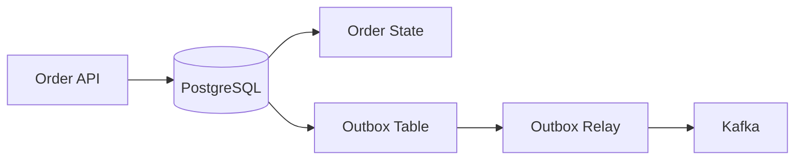

The database transaction guarantees atomicity between:

```text
Order state
+
Outbox event
```

The relay still needs:

- Retry handling
- Duplicate detection
- Idempotent consumers
- Failure recovery
- Monitoring

The outbox does not magically make Kafka part of the PostgreSQL transaction.

---

## ACID and Kafka

Kafka provides durability and delivery semantics, but it is not a replacement for a relational database transaction.

Kafka supports transactional producers and exactly-once processing semantics in specific Kafka workflows, but those guarantees do not automatically create one transaction across:

```text
PostgreSQL
+
Kafka
+
External HTTP API
```

For example:

```text
PostgreSQL transaction
        |
        X
Kafka transaction
        |
        X
Payment API
```

These systems have different transactional boundaries.

When a business workflow spans them, explicitly design:

- Idempotency
- Retry behavior
- Ordering
- Failure recovery
- Compensation
- Reconciliation

---

## ACID and Redis

Redis supports atomic commands and transactional mechanisms, but it should not automatically be treated as a substitute for a relational transaction.

For example:

```text
PostgreSQL
    |
    +---- Source of truth

Redis
    |
    +---- Cache
```

A common production design is:

```text
Write PostgreSQL
      |
      v
Commit
      |
      v
Invalidate/update Redis
```

The cache can temporarily be stale depending on the invalidation strategy.

The database remains the authoritative transactional store.

---

## ACID and Celery

Background workers frequently execute database transactions.

A common mistake is holding a transaction while a worker performs slow external operations.

Avoid:

```python
@transaction.atomic
def process_payment():
    payment = update_payment_state()

    response = payment_provider.charge()

    publish_event(response)
```

Prefer a design such as:

```text
Database transaction
    |
    +---- Update local state
    +---- Write outbox/task state
    |
    v
COMMIT
    |
    v
Celery worker
    |
    +---- External API
    +---- Retry
    +---- Update result
```

This keeps the database transaction short and makes failures explicit.

---

## Performance Implications

Transactions introduce coordination overhead.

Longer transactions can increase:

- Lock contention
- Transaction latency
- Connection occupancy
- WAL generation
- Replication lag
- Deadlock probability
- Rollback cost

A high-throughput backend should therefore optimize transaction duration.

### Good Practices

- Keep transactions short.
- Avoid network calls inside transactions.
- Avoid expensive computation inside transactions.
- Update only required rows.
- Use appropriate indexes.
- Lock only what is necessary.
- Avoid unnecessary serializable transactions.
- Monitor lock waits.
- Monitor long-running transactions.
- Size database connection pools carefully.

---

## Connection Pool Interaction

Transactions consume database connections.

Suppose:

```text
20 application instances
10 connections per instance
```

Potential connection demand can reach:

```text
20 × 10 = 200 connections
```

If transactions remain open longer, connections remain occupied longer.

The resulting chain can be:

```text
Long transactions
       |
       v
Connections occupied longer
       |
       v
Pool exhaustion
       |
       v
Requests wait
       |
       v
Latency increases
       |
       v
Throughput decreases
```

Transaction duration and connection-pool sizing should therefore be designed together.

---

## Security Considerations

ACID does not provide authorization.

This transaction:

```sql
BEGIN;

UPDATE accounts
SET balance = balance - 100
WHERE id = 42;

COMMIT;
```

can be perfectly atomic while still being a security vulnerability if an unauthorized user can execute it.

Production systems need both:

```text
Transaction correctness
+
Authorization correctness
```

Relevant controls include:

- Least-privilege database roles
- Application-level authorization
- Row-level security where appropriate
- Parameterized queries
- TLS
- Encryption at rest
- Secret management
- Audit logging

---

## Monitoring and Observability

Transaction behavior should be observable in production.

Useful metrics include:

| Metric | Why It Matters |
|---|---|
| Transaction latency | Detect slow transaction paths |
| Lock wait time | Detect contention |
| Deadlock count | Detect conflicting lock patterns |
| Rollback rate | Detect transaction failures |
| Connection utilization | Detect pool pressure |
| Long-running transactions | Detect resource retention |
| Replication lag | Detect replication pressure |
| WAL generation | Detect write workload |
| Slow-query rate | Identify database bottlenecks |
| Serialization failures | Detect high contention at stronger isolation |

Tracing should correlate:

```text
HTTP Request
    |
    v
Application Service
    |
    v
Database Transaction
    |
    +---- SQL Query A
    +---- SQL Query B
    +---- SQL Query C
```

This makes it possible to determine whether latency originates from:

- Application processing
- Query execution
- Lock waits
- Connection acquisition
- Transaction contention
- External dependencies

---

## High Availability and Disaster Recovery

ACID correctness alone does not make a database highly available.

A production database strategy should separately consider:

### High Availability

- Multi-AZ deployment
- Automated failover
- Replication
- Connection failover
- Health checks
- Application retry behavior

### Backup

- Automated backups
- Point-in-time recovery
- Backup retention
- Cross-region backup where required

### Disaster Recovery

Define:

- **RPO** — maximum acceptable amount of data loss.
- **RTO** — maximum acceptable recovery time.

For example:

```text
RPO = 5 minutes
RTO = 30 minutes
```

These requirements influence:

- Replication strategy
- Backup frequency
- Storage architecture
- Cross-region recovery
- Operational procedures

Most importantly, recovery procedures should be tested rather than merely documented.

---

## Cost Considerations

Transaction design affects infrastructure cost.

Poor transaction design can cause:

```text
Long transactions
    |
    +---- More connections
    +---- More database CPU
    +---- More lock contention
    +---- More retries
    +---- Lower throughput
    |
    v
More database capacity required
```

A smaller transaction footprint can allow the same database infrastructure to process more operations.

At scale, transaction efficiency is therefore both a reliability concern and a cost concern.

---

## Production Best Practices

### Keep Transactions Short

Only include operations that must be atomic.

### Enforce Critical Invariants in the Database

Use appropriate:

- Unique constraints
- Foreign keys
- Check constraints
- Exclusion constraints
- Atomic updates

### Prefer Database-Side Atomic Operations

Instead of:

```text
SELECT value
calculate in application
UPDATE value
```

prefer:

```sql
UPDATE accounts
SET balance = balance + 100
WHERE id = 42;
```

when the operation permits it.

### Use Explicit Locks Deliberately

Use row-level locks for genuinely contention-sensitive operations.

Do not introduce locks simply because concurrent execution sounds dangerous.

### Design for Retry

Transactions can fail because of:

- Deadlocks
- Serialization conflicts
- Database failover
- Connection failures

Retry only failures that are known to be retryable.

Use:

- Bounded retries
- Exponential backoff
- Idempotency
- Appropriate timeouts

### Avoid External I/O Inside Transactions

Do not hold database locks while waiting for:

- Payment providers
- HTTP services
- Kafka
- Email services
- S3
- Slow computation

### Test Concurrent Behavior

Test:

- Concurrent updates
- Duplicate requests
- Deadlocks
- Serialization failures
- Database failover
- Worker retries
- Partial external failures

---

## Common Mistakes and Pitfalls

### Treating ACID as One Guarantee

ACID consists of four distinct properties.

Isolation and durability solve different problems from atomicity and consistency.

### Making Every Request Transactional

Not every HTTP request requires an explicit transaction.

Large request-wide transactions can increase connection occupancy and contention.

### Putting External Calls Inside Transactions

This increases transaction duration and creates unpredictable failure behavior.

Use outbox, asynchronous processing, or other coordination patterns.

### Using Locks Everywhere

Locks can solve concurrency problems but also reduce throughput.

Use the smallest lock scope necessary.

### Ignoring Database Constraints

Application-level validation alone cannot reliably enforce invariants under concurrency.

### Assuming ACID Covers Microservices

A PostgreSQL transaction does not automatically include another service's database.

### Ignoring Deadlocks

Deadlocks are a normal possibility in concurrent systems.

Design consistent lock ordering and handle retryable deadlocks safely.

### Retrying Non-Idempotent Operations

A network timeout does not necessarily mean the database transaction or external operation did not execute.

Blind retries can create duplicate side effects.

### Assuming Durability Means Backup

Durability does not protect against every logical failure.

Use tested backups and disaster-recovery procedures.

---

## Interview Traps

### "Atomicity Means Everything in the System Succeeds Together"

Incorrect.

Atomicity applies to the transaction boundary controlled by the transactional system.

External APIs and independent databases are not automatically part of the transaction.

### "Consistency Means Every Replica Has the Same Data"

Incorrect.

ACID consistency refers to preserving database invariants. Replica consistency is a distributed-systems concern.

### "Serializable Is Always Better"

Incorrect.

Serializable provides stronger isolation but can reduce concurrency and increase transaction retries.

Choose isolation based on business requirements.

### "Locks Prevent All Race Conditions"

Incorrect.

Locks only protect the resources and execution paths where they are correctly applied.

### "Durability Means Data Can Never Be Lost"

Incorrect.

Durability depends on storage and database configuration and protects against defined failure modes. Backups and disaster recovery remain necessary.

### "SQL Is ACID and NoSQL Is Not"

Oversimplified.

Many NoSQL databases provide transactional guarantees, while relational databases can also participate in distributed or eventually consistent architectures.

The correct question is which transactional guarantees the specific database provides and whether they match the workload.

---

## Practical Transaction Design Checklist

Before introducing or modifying a transaction, ask:

```text
What business invariant am I protecting?

Which records must change together?

Which operations can race concurrently?

What isolation level is actually required?

Do I need explicit row locking?

Can an atomic SQL update solve the problem?

How long will the transaction remain open?

Am I performing network I/O inside it?

Can the transaction fail and be retried?

Is the operation idempotent?

What happens if the database commits but an external
operation fails?

Do I need an outbox, Saga, or reconciliation process?

What happens during database failover?

How will lock contention and transaction latency be monitored?

What are the RPO and RTO requirements?
```

This is the level of reasoning expected when designing production transactional systems.

---

## Example: Order and Payment Workflow

Consider a production order workflow:

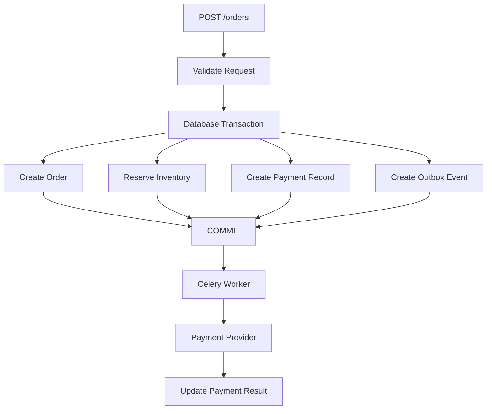

The local database transaction can guarantee:

```text
Order state
+
Inventory reservation
+
Payment record
+
Outbox event
```

are committed atomically.

The payment provider remains outside the transaction.

Therefore, the distributed workflow needs:

- Idempotency keys
- Timeouts
- Retry policies
- Payment-state transitions
- Duplicate webhook handling
- Reconciliation
- Compensating actions where necessary

This distinction between **local ACID transactions** and **distributed workflow consistency** is fundamental to senior-level system design.

---

## Key Takeaways

- **ACID consists of four distinct guarantees:** atomicity groups changes into one unit, consistency preserves invariants, isolation controls concurrency, and durability protects committed state against defined failures.
- **Transaction boundaries should protect business invariants while remaining short and narrow**, minimizing lock contention, connection pressure, deadlocks, and transaction latency.
- **Isolation level, row locking, optimistic concurrency, and atomic SQL updates are different concurrency-control tools**; choose the mechanism based on contention and business requirements rather than defaulting to the strongest option.
- **ACID does not automatically span microservices or external systems**; distributed workflows require patterns such as transactional outbox, Saga, idempotency, retries, and reconciliation.
- **Durability is not disaster recovery**; production systems still require backups, replication, tested recovery procedures, monitoring, and clearly defined RPO and RTO.