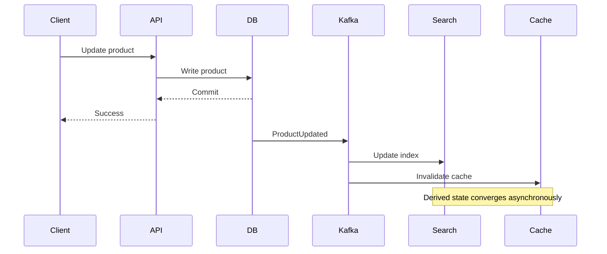
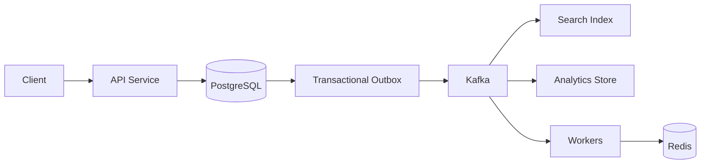

# 03- BASE

## Overview

BASE is a set of design principles commonly associated with distributed and NoSQL databases that prioritize availability, scalability, and operational flexibility over the strong consistency guarantees traditionally associated with ACID systems.

BASE stands for:

- **Basically Available** — the system attempts to remain responsive even when parts of the system fail or become unavailable.
- **Soft State** — application-visible state may change over time even without a new direct user write, typically because replicas, caches, indexes, or asynchronous processes converge.
- **Eventual Consistency** — if updates stop and the system remains able to communicate, replicas are expected to converge toward a consistent state.

BASE is not a formal database standard equivalent to ACID. It is better understood as a distributed-systems design philosophy.

The core trade-off is:

```text
Strong consistency
        |
        | stronger coordination
        | potentially higher latency
        | potentially lower availability during partitions
        v
Eventual consistency
        |
        | weaker immediate guarantees
        | asynchronous replication
        | higher availability/scalability
        v
Distributed scale
```

BASE becomes relevant when a system must continue operating across multiple nodes, regions, services, or replicas and when temporarily stale data is acceptable.

Typical use cases include:

- Product catalogs
- Social feeds
- Search indexes
- Analytics
- Recommendation systems
- Activity streams
- Caching layers
- Distributed key-value stores
- High-scale content delivery
- Shopping carts in some architectures
- Read-heavy workloads
- Globally distributed applications

The important system-design question is not:

> "Should I use ACID or BASE?"

It is:

> "Which parts of this system require strong consistency, and where can the system safely tolerate stale or asynchronously converging state?"

---

## ACID vs BASE

ACID and BASE are often presented as opposites, but production architectures commonly use both.

| Dimension | ACID-Oriented Design | BASE-Oriented Design |
|---|---|---|
| Primary goal | Transactional correctness | Availability and distributed scalability |
| Consistency | Stronger transactional guarantees | Often eventual or configurable |
| Transactions | First-class concept | Often narrower or database-specific |
| Replication | Can be synchronous or asynchronous | Frequently asynchronous |
| Availability during failures | May sacrifice availability for consistency | Often prioritizes availability |
| Data freshness | Typically immediate within transaction boundary | May be temporarily stale |
| Typical systems | PostgreSQL, MySQL | DynamoDB, Cassandra, distributed caches |
| Best fit | Financial and transactional state | Large-scale distributed workloads |

This does **not** mean:

```text
SQL       = ACID
NoSQL     = BASE
```

That classification is too simplistic.

Modern systems frequently support combinations such as:

```text
PostgreSQL
    |
    +---- Strong transactional state

Redis
    |
    +---- Cache / ephemeral state

DynamoDB
    |
    +---- Distributed application state

Kafka
    |
    +---- Asynchronous event propagation
```

A single backend may therefore use different consistency models for different data.

---

## Why BASE Exists

Distributed systems introduce failure modes that are not present in a single-process application.

Consider:

```text
Region A
    |
    +---- Database Replica A

Region B
    |
    +---- Database Replica B
```

Suppose the network connection between the regions temporarily fails.

The system must choose how to behave.

### Strong Consistency Approach

The system may refuse some operations until coordination is restored.

```text
Region A ----X---- Region B
                 network partition

Writes blocked
```

This protects consistency but may reduce availability.

### Availability-Oriented Approach

Each region may continue accepting operations:

```text
Region A ----X---- Region B

Region A accepts writes
Region B accepts writes
```

The replicas may temporarily disagree.

After connectivity returns:

```text
Region A ---- network restored ---- Region B
                     |
                     v
               Reconciliation
                     |
                     v
                 Converged state
```

BASE-style systems accept this temporary inconsistency when the business domain permits it.

---

## Basically Available

### What It Means

Basically Available means the system attempts to remain operational even when some components fail.

This does not mean:

```text
100% availability
```

and it does not mean every request always succeeds.

It means the architecture is designed so that localized failures do not necessarily make the entire system unavailable.

For example:

```text
                Load Balancer
                 /          \
                v            v
           API Node A    API Node B
                |            |
                +------|-----+
                       |
                Distributed Store
                 /            \
                v              v
             Node A          Node B
```

If Node A fails:

```text
Load Balancer
      |
      +----X Node A
      |
      +----> Node B
```

The system can continue serving traffic.

---

## Availability Through Replication

Replication is one of the primary mechanisms used to improve availability.

```text
              Client
                 |
                 v
           Service Layer
          /      |      \
         v       v       v
      Node A   Node B   Node C
```

If one node fails:

```text
Node A = unavailable
Node B = serving
Node C = serving
```

The system may continue operating.

However, replication introduces additional questions:

- How quickly do replicas converge?
- What happens when replicas disagree?
- Which replica is authoritative?
- How are conflicting writes resolved?
- Can stale reads be returned?
- What happens during network partitions?

Availability therefore comes with consistency and operational trade-offs.

---

## Availability Is Not the Same as Correctness

A system can be highly available while returning stale information.

For example:

```text
Inventory service
    |
    +---- Product inventory = 10

Replica A
    |
    +---- 10

Replica B
    |
    +---- 8
```

If the application reads from Replica B, it may receive:

```text
8
```

while another replica temporarily reports:

```text
10
```

The system is available, but the values are not yet converged.

Whether this is acceptable depends on the business requirement.

For inventory reservation, this may be dangerous.

For:

```text
Product description
View count
Recommendation score
Social media feed
Search results
```

temporary staleness may be acceptable.

---

## Soft State

### What It Means

Soft State means that distributed state may change independently of a direct application write because asynchronous processes continue propagating or transforming information.

For example:

```text
Primary Data Store
       |
       v
Event
       |
       v
Kafka
       |
       +----> Search Index
       |
       +----> Cache
       |
       +----> Recommendation Service
```

The search index and cache may change later even though the user did not directly update them.

The state is therefore not necessarily static between application writes.

---

## Why Soft State Exists

Modern systems frequently derive state from other systems.

For example:

```text
PostgreSQL
    |
    +---- Source of truth

Kafka
    |
    +---- Event stream

Elasticsearch
    |
    +---- Search representation

Redis
    |
    +---- Cache
```

A single product update may result in several asynchronous state changes:

```text
Product updated
      |
      v
PostgreSQL committed
      |
      v
Kafka event
      |
      +---- Search index update
      |
      +---- Cache invalidation
      |
      +---- Recommendation update
```

These systems intentionally allow intermediate states.

---

## Eventual Consistency

### What It Means

Eventual consistency means that replicas or derived representations may temporarily disagree, but if updates stop and communication continues, they are expected to converge.

Consider:

```text
Initial:
A = 100
B = 100
```

An update occurs:

```text
Write A = 200
```

During propagation:

```text
A = 200
B = 100
```

After replication:

```text
A = 200
B = 200
```

The important property is that the inconsistent period is temporary under the model's assumptions.

---

## Eventual Consistency Does Not Mean Random Consistency

A poorly designed system may produce permanently conflicting state.

For eventual consistency to be useful, the architecture needs defined mechanisms for:

- Replication
- Conflict resolution
- Ordering
- Retry
- Deduplication
- Failure recovery
- Reconciliation

The desired model is:

```text
Write
  |
  v
State changes
  |
  v
Propagation
  |
  +---- retry
  +---- replay
  +---- reconciliation
  |
  v
Replicas converge
```

Without convergence mechanisms, the system is merely inconsistent.

---

## Request Lifecycle in an Eventually Consistent System

Consider a product update.



The API can return success once the authoritative database transaction commits.

The search index may update milliseconds or seconds later.

This is often a deliberate architecture rather than a bug.

---

## Read-After-Write Consistency

One of the most important application-level consistency requirements is read-after-write consistency.

Consider:

```text
POST /profile
    |
    v
Write succeeds
    |
    v
GET /profile
```

The user typically expects the GET immediately after the successful POST to return the new profile.

With asynchronous replication:

```text
Write -> Primary
           |
           +---- Replica propagation
                         |
                         v
                     Replica read
```

The immediate read may return stale data.

Possible solutions include:

- Read from the primary after a write.
- Use session or request affinity.
- Route reads using replication metadata.
- Use version tokens.
- Delay reads when appropriate.
- Provide explicit consistency options.

---

## Monotonic Reads

Monotonic reads mean that once a client has observed a particular version of data, subsequent reads should not return an older version.

Bad behavior:

```text
Read 1 -> version 10
Read 2 -> version 8
```

This can be confusing even if the system is eventually consistent.

A better system preserves:

```text
version 10
    |
    v
version 11
    |
    v
version 12
```

for the same client's logical view where required.

This may be achieved through:

- Session affinity
- Version-aware routing
- Client tokens
- Read-your-writes mechanisms
- Appropriate replica selection

---

## Causal Consistency

Causal consistency preserves relationships between causally related operations.

Suppose:

```text
User creates post
      |
      v
User comments on post
```

A client should not observe:

```text
Comment exists
BUT
Post does not exist
```

if the comment causally depends on the post.

Causal consistency is stronger than arbitrary eventual consistency but weaker than global serializability.

It is useful when user-visible ordering matters without requiring all operations to be globally serialized.

---

## Conflict Resolution

Eventual consistency creates the possibility of conflicting writes.

Consider two regions:

```text
Region A:
name = "Alice"

Region B:
name = "Alicia"
```

Both updates may occur before replication completes.

The system needs a conflict-resolution strategy.

Common approaches include:

| Strategy | Mechanism | Typical Use |
|---|---|---|
| Last-write-wins | Latest timestamp/version wins | Simple distributed records |
| Version-based | Compare versions | Explicit version control |
| Application merge | Business logic resolves conflict | Complex domain state |
| CRDT | Data structure designed for deterministic merge | Collaborative/distributed state |
| Single-writer | One authoritative writer | Avoid conflicting writes |

No strategy is universally correct.

---

## Last-Write-Wins

Last-write-wins is simple:

```text
Write A:
version 10

Write B:
version 11

Winner:
version 11
```

The problem is that "latest" may not always mean "correct."

For example:

```text
User updates address
    |
    v
Later update accidentally overwrites address
```

A timestamp-based conflict resolver may silently discard meaningful business state.

Use last-write-wins only when the domain can tolerate losing one concurrent representation.

---

## Application-Level Conflict Resolution

For business-critical data, application logic may be better.

For example:

```text
Cart A:
item X quantity = 2

Cart B:
item X quantity = 3
```

Instead of arbitrarily selecting one value, the system might merge:

```text
quantity = max(2, 3)
```

or:

```text
quantity = 5
```

depending on the business semantics.

The conflict rule must come from the domain rather than the database alone.

---

## CRDTs

A **Conflict-Free Replicated Data Type (CRDT)** is a data structure designed so independently updated replicas can merge deterministically.

CRDTs are useful for specific distributed-state problems where concurrent updates should merge without centralized coordination.

Examples include:

- Collaborative editing
- Distributed counters
- Sets
- Presence/state tracking
- Multi-region collaborative systems

They are powerful but should not be introduced simply because a system is distributed.

The data model must actually benefit from conflict-free merging.

---

## BASE and CAP

BASE is closely related to the CAP theorem but they are not the same concept.

### CAP

CAP describes a fundamental trade-off in distributed systems under a network partition.

The three properties are:

- **Consistency**
- **Availability**
- **Partition tolerance**

When a partition occurs, a distributed system cannot simultaneously guarantee both strong consistency and availability.

### BASE

BASE describes a design approach that commonly favors:

```text
Availability
+
Partition tolerance
+
Eventual consistency
```

when the application can tolerate temporary inconsistency.

Therefore:

```text
CAP = distributed-systems constraint
BASE = architectural approach
```

They should not be treated as interchangeable terms.

---

## BASE and PACELC

PACELC extends the CAP discussion.

It asks:

> If there is a Partition, choose Availability or Consistency; Else, choose Latency or Consistency.

This matters because even when there is no partition, stronger consistency often requires additional coordination.

Conceptually:

```text
                 Network Partition?
                       |
                +------+------+
                |             |
               Yes             No
                |               |
          A vs C trade-off   L vs C trade-off
```

This is useful when evaluating distributed data stores.

For example, a globally distributed application may choose slightly stale reads because coordinating every read across regions would increase latency.

---

## BASE in NoSQL Systems

Many distributed NoSQL databases provide configurable consistency rather than a single global consistency mode.

For example, a system may allow choices such as:

```text
Strong read
Eventually consistent read
Quorum-based read
Region-local read
```

The correct configuration depends on:

- Data criticality
- Read latency requirements
- Geographic distribution
- Failure model
- Replication topology
- Cost
- Availability requirements

The important engineering principle is:

> Consistency should be selected per workload, not simply per technology.

---

## Example: DynamoDB

DynamoDB supports both strongly consistent and eventually consistent reads for supported table operations.

Conceptually:

```text
Application
    |
    v
DynamoDB
   / \
  v   v
Replica A   Replica B
```

An eventually consistent read may return a value that has not yet propagated to every replica.

A strongly consistent read provides stronger read visibility guarantees at the cost of higher coordination and, depending on the operation, different capacity economics.

The system designer should decide which reads actually require strong consistency.

For example:

| Data | Consistency Requirement |
|---|---|
| User profile display | Usually eventual |
| Product description | Usually eventual |
| Social feed | Usually eventual |
| Payment status | Stronger consistency often required |
| Account balance | Strong consistency often required |
| Inventory reservation | Strong coordination required |
| Analytics dashboard | Eventual consistency usually acceptable |

---

## BASE in Caching

Caching is one of the most common places where eventual consistency appears in traditional backend architectures.

Consider:

```text
PostgreSQL
    |
    +---- Source of truth

Redis
    |
    +---- Cached representation
```

After a database update:

```text
PostgreSQL = new value
Redis      = old value
```

until the cache is invalidated or refreshed.

This is a form of temporary inconsistency.

A common cache-aside pattern is:

```text
Read:
    Redis
      |
      +---- Hit -> return
      |
      +---- Miss -> PostgreSQL -> populate Redis

Write:
    PostgreSQL
      |
      v
    Invalidate Redis
```

Cache invalidation should be treated as part of the consistency design.

---

## BASE with Kafka

Kafka commonly becomes part of eventually consistent architectures.

For example:

```text
Order Service
    |
    v
PostgreSQL
    |
    v
Outbox
    |
    v
Kafka
    |
    +---- Inventory Service
    |
    +---- Notification Service
    |
    +---- Analytics
```

The order database and downstream services do not necessarily change simultaneously.

Instead:

```text
Order committed
      |
      v
Event published
      |
      v
Consumers process event
      |
      v
Derived state converges
```

This provides scalability and loose coupling but introduces:

- Processing delays
- Duplicate events
- Consumer failures
- Ordering concerns
- Replay requirements
- Poison messages
- Eventual consistency

---

## Idempotency

Eventually consistent systems rely heavily on idempotent operations.

Suppose Kafka delivers:

```text
OrderCreated
```

twice.

A non-idempotent consumer may create two records.

An idempotent consumer can safely process the same logical event multiple times.

A common approach is to store an event ID:

```text
processed_events
----------------
event_id
consumer
processed_at
```

Before processing:

```text
Does event_id already exist?
        |
   +----+----+
   |         |
  Yes        No
   |         |
Ignore    Process
             |
             v
        Mark processed
```

Idempotency is especially important when:

- Consumers retry.
- Messages are redelivered.
- Workers crash after performing side effects.
- Network timeouts make completion ambiguous.

---

## Retry and Eventual Consistency

Retries are essential for distributed convergence.

Suppose:

```text
Kafka
  |
  v
Inventory Consumer
  |
  X
Database temporarily unavailable
```

The consumer can retry:

```text
Attempt 1 -> failure
Attempt 2 -> failure
Attempt 3 -> success
```

However, retries should use:

- Exponential backoff
- Jitter
- Maximum attempts
- Dead-letter handling
- Idempotent processing
- Clear retry classification

A retry without idempotency can turn temporary failures into duplicate side effects.

---

## Reconciliation

A mature eventually consistent system should not rely exclusively on real-time event propagation.

Reconciliation jobs can detect drift.

For example:

```text
PostgreSQL
    |
    +---- Source of truth

Search Index
    |
    +---- Derived state
```

A periodic job can compare:

```text
Source records
vs
Indexed records
```

and repair discrepancies.

This creates a stronger operational model:

```text
Real-time propagation
        +
Retry
        +
Replay
        +
Periodic reconciliation
```

This is particularly important for critical distributed workflows.

---

## Production Architecture

A common production architecture combines ACID and BASE:



The architecture intentionally uses different consistency models:

```text
PostgreSQL
    |
    +---- ACID source of truth

Kafka
    |
    +---- Durable asynchronous propagation

Redis
    |
    +---- Eventually consistent cache

Search
    |
    +---- Eventually consistent derived state

Analytics
    |
    +---- Eventually consistent reporting state
```

This hybrid architecture is much more common than a system that is exclusively ACID or exclusively BASE.

---

## Choosing Strong vs Eventual Consistency

A useful decision framework is:

### Strong Consistency Is Usually Appropriate When

- A stale read could cause financial loss.
- Duplicate allocation is unacceptable.
- A state transition must be strictly ordered.
- Security permissions must be immediately authoritative.
- A resource can only be allocated once.
- The operation has strict transactional invariants.

Examples:

```text
Account balance
Inventory reservation
Payment authorization
Unique resource allocation
Permission changes
```

### Eventual Consistency Is Often Appropriate When

- Temporary staleness is acceptable.
- Data is derived from another source.
- Low latency is more important than immediate global convergence.
- The workload is globally distributed.
- The system needs high write availability.
- Reads can tolerate a small propagation delay.

Examples:

```text
Search indexes
Recommendation systems
Analytics
View counts
Social feeds
Product metadata
Caches
```

---

## Consistency Boundary Design

A senior system designer should explicitly identify the source of truth.

For example:

```text
                    +------------------+
                    | PostgreSQL       |
                    | Source of Truth  |
                    +---------+--------+
                              |
                              v
                           Kafka
                         /   |   \
                        v    v    v
                     Redis Search Analytics
```

The consistency boundary is:

```text
PostgreSQL transaction
```

Everything downstream is a derived representation.

This simplifies reasoning:

```text
If Redis is wrong:
    rebuild from PostgreSQL

If Search is wrong:
    reindex from source

If Analytics is behind:
    replay events
```

Without a clear source of truth, reconciliation becomes significantly harder.

---

## Monitoring Eventually Consistent Systems

Eventual consistency requires monitoring propagation, not just request latency.

Important metrics include:

| Metric | Purpose |
|---|---|
| Event processing lag | Measures propagation delay |
| Consumer lag | Detects Kafka processing backlog |
| Retry count | Detects downstream instability |
| Dead-letter count | Detects permanently failing events |
| Reconciliation drift | Detects inconsistent derived state |
| Cache stale rate | Measures cache correctness |
| Replication lag | Measures replica convergence |
| Event age | Detects delayed workflows |
| Duplicate event rate | Detects delivery/retry behavior |
| Failed reconciliation count | Detects persistent divergence |

For a production system, define an acceptable consistency window.

For example:

```text
99% of product updates
must reach search
within 5 seconds.
```

This is more operationally useful than simply saying:

```text
The system is eventually consistent.
```

---

## Security Considerations

Eventual consistency can create temporary authorization inconsistencies if security-sensitive data is replicated asynchronously.

For example:

```text
User permission revoked
       |
       v
Primary database updated
       |
       v
Authorization cache still contains old permission
```

If the authorization layer trusts the stale cache, the user might temporarily retain access.

For security-sensitive decisions:

- Prefer authoritative reads.
- Use short cache TTLs where appropriate.
- Invalidate authorization state aggressively.
- Avoid relying on eventually consistent state for critical access decisions.
- Design explicit revocation propagation.
- Monitor propagation failures.

Consistency requirements should therefore be classified by business impact, not merely by technical convenience.

---

## Performance and Scalability

BASE-style architectures can improve scalability by reducing coordination.

Instead of:

```text
Every write
    |
    +---- coordinate globally
    |
    v
Commit
```

the architecture can use:

```text
Local write
    |
    v
Asynchronous propagation
    |
    +---- Consumer A
    +---- Consumer B
    +---- Consumer C
```

This enables:

- Higher write throughput
- Lower cross-region latency
- Independent scaling of consumers
- Better fault isolation
- Asynchronous workload processing

The cost is additional system complexity.

You must operate:

- Event infrastructure
- Retry mechanisms
- Consumer workers
- Dead-letter queues
- Reconciliation
- Observability
- Schema evolution
- Duplicate handling

BASE often trades database coordination cost for application and operational complexity.

---

## Cost Considerations

Eventually consistent architectures can reduce the need for expensive synchronous coordination.

For example:

```text
Single transactional database
        |
        +---- expensive global coordination
```

can become:

```text
Regional writes
     |
     v
Asynchronous events
     |
     +---- regional consumers
```

However, BASE architectures can increase infrastructure costs through:

- Kafka clusters
- Consumer workers
- Search indexes
- Replicas
- Caches
- Reconciliation jobs
- Duplicate storage
- Observability systems

Therefore, BASE should be adopted because its consistency and availability characteristics solve a real system requirement, not simply because NoSQL or microservices are involved.

---

## Common Mistakes and Pitfalls

### Treating BASE as "No Transactions"

BASE does not mean transactions are impossible.

Some distributed databases provide transactional operations within defined boundaries.

### Assuming Eventual Consistency Means No Guarantees

A well-designed eventually consistent system should define:

- Convergence behavior
- Ordering guarantees
- Conflict rules
- Retry behavior
- Maximum expected propagation delay

### Using Eventual Consistency for Financial Invariants

A stale balance or duplicated financial operation can cause serious correctness problems.

Use stronger transactional coordination where required.

### Ignoring Read-After-Write Requirements

Users commonly expect their own successful writes to be immediately visible.

Explicitly design for read-after-write consistency when necessary.

### Assuming Retries Solve Everything

Retries without idempotency can create duplicates.

Retries also cannot solve deterministic validation failures.

### No Reconciliation Mechanism

Asynchronous systems can accumulate drift.

A reconciliation process provides an independent mechanism for detecting and repairing inconsistencies.

### Using Last-Write-Wins Blindly

The newest timestamp is not necessarily the correct business state.

### Treating Caches as Authoritative

Caches should generally be derived from an authoritative source unless the domain explicitly defines the cache as the source of truth.

### Ignoring Propagation Latency

"Eventually" is not an operational requirement.

Define measurable targets such as:

```text
p99 propagation latency < 10 seconds
```

where appropriate.

---

## Interview Traps

### "BASE Means the System Sacrifices Consistency"

Incomplete.

BASE systems generally weaken immediate consistency guarantees in favor of availability and distributed scalability, but they can still provide consistency guarantees at specific boundaries.

### "BASE Is the Opposite of ACID"

Oversimplified.

A production architecture can use:

```text
ACID database
+
BASE-style asynchronous propagation
```

simultaneously.

### "Eventual Consistency Means Data Will Definitely Become Consistent"

Not automatically.

Convergence depends on:

- Successful communication
- Retry
- Conflict resolution
- Correct consumer behavior
- No permanent data corruption
- Operational recovery

### "CAP Says You Must Pick Two of Three"

This is a common interview oversimplification.

CAP becomes meaningful specifically under a network partition. In the presence of a partition, a system cannot guarantee both strong consistency and availability simultaneously.

### "NoSQL Databases Are Always Eventually Consistent"

Incorrect.

Modern NoSQL systems often provide configurable consistency models, and some support strong transactional guarantees for specific operations.

### "More Replicas Always Means Better Availability"

Not necessarily.

Replication can introduce:

- Replication lag
- Conflict resolution
- Network overhead
- Operational complexity
- Additional failure modes

---

## Practical Design Checklist

When designing an eventually consistent system, explicitly answer:

```text
What is the source of truth?

Which operations require strong consistency?

Which data can be stale?

How stale can it be?

What does "eventual" mean operationally?

How are updates propagated?

What happens if an event is delivered twice?

What happens if an event is delivered out of order?

How are conflicts resolved?

What happens when a consumer is down?

How are failed events retried?

Do we have a dead-letter mechanism?

Can derived state be rebuilt?

How do we detect drift?

How do we reconcile inconsistent state?

What happens during a regional partition?

What consistency does the user experience require?

Which security decisions require authoritative state?

What are the RPO and RTO requirements?
```

A strong design makes these guarantees explicit rather than hiding them behind the database technology.

---

## Key Takeaways

- **BASE is a distributed-systems design philosophy centered on availability, asynchronous state propagation, and eventual convergence**, rather than a formal database standard.
- **Eventual consistency is a deliberate trade-off, not an absence of correctness**; production systems need defined propagation, conflict-resolution, retry, idempotency, and reconciliation mechanisms.
- **ACID and BASE commonly coexist in the same architecture**, with PostgreSQL protecting authoritative transactional state while Kafka, Redis, search indexes, and analytics systems maintain derived state asynchronously.
- **Consistency requirements should be determined by business invariants**: payments, balances, permissions, and resource allocation usually need stronger guarantees, while search, analytics, recommendations, and many caches can tolerate stale state.
- **A mature BASE architecture makes consistency measurable**, using propagation-lag targets, consumer-lag monitoring, reconciliation, replay, and explicit read-after-write or causal-consistency requirements where necessary.