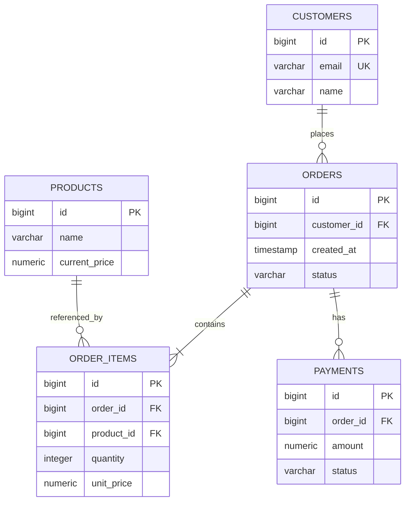

# 05- Database Normalization

## Overview

Database normalization is the process of structuring relational data so that each fact is stored in an appropriate place, dependencies are explicit, and unnecessary duplication is minimized.

The primary goal is not to make a database "perfectly normalized." The practical goal is to design a schema that:

- Preserves data integrity.
- Minimizes accidental duplication.
- Prevents update, insert, and delete anomalies.
- Makes relationships explicit.
- Keeps transactional behavior predictable.
- Provides a strong foundation for indexing and query optimization.
- Can be intentionally denormalized when read performance or architectural requirements justify it.

Consider an unnormalized order table:

```text
orders

order_id
customer_name
customer_email
product_1_name
product_1_price
product_2_name
product_2_price
product_3_name
product_3_price
```

This structure mixes several different entities:

```text
Customer
Product
Order
Order Item
```

A normalized design separates these concepts:

```text
customers
    |
    v
orders
    |
    v
order_items
    |
    v
products
```

Normalization is therefore closely related to relational modeling, transactions, constraints, indexing, query design, and system architecture.

A senior backend engineer should understand both sides:

> **Normalize to preserve correctness and clear ownership of data; denormalize deliberately when measured system requirements justify the additional complexity.**

---

## Why Normalization Exists

Without normalization, the same business fact can appear in many rows.

For example:

```text
order_id | customer_id | customer_email
---------+-------------+----------------
1001     | 10          | a@example.com
1002     | 10          | a@example.com
1003     | 10          | a@example.com
```

If the customer changes their email address, multiple rows may need to be updated.

If one row is missed:

```text
1001 -> new@example.com
1002 -> a@example.com
1003 -> a@example.com
```

the database now contains contradictory information.

Normalization moves the customer fact to its natural owner:

```text
customers

id | email
---+----------------
10 | new@example.com
```

Orders then reference the customer:

```text
orders

id   | customer_id
-----+------------
1001 | 10
1002 | 10
1003 | 10
```

There is now one authoritative representation of the customer's email address.

---

## Data Anomalies

Poorly normalized schemas commonly produce three classes of anomalies.

### Update Anomaly

The same fact exists in multiple rows and must be updated everywhere.

```text
customer_id | customer_email
------------+----------------
10          | old@example.com
10          | old@example.com
10          | old@example.com
```

Updating only one row creates inconsistent data.

### Insert Anomaly

A fact cannot be inserted without unrelated information.

For example, if customer information exists only inside an order table, creating a customer before their first order may be awkward or impossible.

### Delete Anomaly

Deleting one record accidentally removes the only representation of another business fact.

For example:

```text
customer + only order
```

If deleting the order also removes the customer information, the schema has coupled two independent facts incorrectly.

Normalization reduces these anomalies by separating independently owned facts.

---

## Entities, Attributes, and Relationships

Normalization starts with identifying business entities.

For an e-commerce system:

```text
Customer
Product
Order
Order Item
Payment
Address
```

Then identify relationships:

```text
Customer 1 ---- N Order
Order    1 ---- N Order Item
Product  1 ---- N Order Item
Order    1 ---- N Payment
```

A normalized relational model might look like:



The important design principle is:

> **Store each business fact where it is owned, then connect entities using keys.**

---

## Functional Dependencies

Functional dependencies are the theoretical foundation behind normalization.

If:

```text
customer_id -> customer_email
```

it means a given `customer_id` determines exactly one customer email.

Similarly:

```text
order_id -> order_date
```

means the order ID determines the order date.

Consider:

```text
order_id | customer_id | customer_email
```

If:

```text
customer_id -> customer_email
```

then storing `customer_email` in every order row introduces redundancy because the email is dependent on `customer_id`, not directly on the order.

A normalized design becomes:

```text
customers
customer_id -> customer_email

orders
order_id -> customer_id
```

Understanding functional dependencies makes normalization much more practical than memorizing normal-form definitions.

---

## First Normal Form

A relation is in **First Normal Form (1NF)** when attributes contain atomic values and repeating groups are eliminated.

Bad:

```text
customer_id | phone_numbers
------------+---------------------------
10          | 9876543210, 9123456789
```

or:

```text
order_id | product_1 | product_2 | product_3
---------+-----------+-----------+-----------
1001     | Laptop    | Mouse     | Keyboard
```

These structures create variable-length collections inside relational columns.

A normalized design separates the repeating relationship:

```text
customer_phone_numbers

customer_id | phone_number
------------+-------------
10          | 9876543210
10          | 9123456789
```

Similarly:

```text
order_items

order_id | product_id
---------+-----------
1001     | 101
1001     | 102
1001     | 103
```

### Why 1NF Matters

1NF makes relationships explicit and queryable.

Instead of parsing:

```text
"9876543210,9123456789"
```

the database can use:

```sql
SELECT phone_number
FROM customer_phone_numbers
WHERE customer_id = 10;
```

---

## First Normal Form in PostgreSQL

A practical relational schema could be:

```sql
CREATE TABLE customer_phone_numbers (
    customer_id BIGINT NOT NULL,
    phone_number VARCHAR(32) NOT NULL,
    PRIMARY KEY (customer_id, phone_number),
    FOREIGN KEY (customer_id) REFERENCES customers(id)
);
```

This supports multiple phone numbers per customer without embedding a list inside a scalar column.

However, PostgreSQL supports arrays and JSON types, so 1NF should not be interpreted as "arrays and JSON are always wrong."

The correct decision depends on whether the data represents:

- A true relational entity.
- A queryable relationship.
- A flexible document attribute.
- Data that does not require independent lifecycle management.

---

## Second Normal Form

Second Normal Form (2NF) addresses **partial dependency on a composite key**.

The important point is that 2NF primarily matters when a table has a composite candidate key.

Consider:

```text
order_items

order_id
product_id
product_name
quantity
```

Suppose:

```text
(order_id, product_id)
```

is the primary key.

The functional dependencies may be:

```text
(order_id, product_id) -> quantity
product_id -> product_name
```

`product_name` depends only on `product_id`, not on the entire composite key.

That is a partial dependency.

The normalized design separates product information:

```text
products

product_id | product_name
-----------+-------------
101        | Laptop
102        | Mouse
```

and order-specific information:

```text
order_items

order_id | product_id | quantity
---------+------------+---------
1001     | 101        | 2
1001     | 102        | 1
```

Now:

```text
product_id -> product_name
(order_id, product_id) -> quantity
```

The dependency structure is clearer.

---

## Third Normal Form

Third Normal Form (3NF) addresses **transitive dependencies**.

Consider:

```text
employees

employee_id
department_id
department_name
```

Suppose:

```text
employee_id -> department_id
department_id -> department_name
```

Therefore:

```text
employee_id -> department_name
```

The department name is indirectly dependent on the employee ID through `department_id`.

Storing it in the employee table creates duplication:

```text
employee_id | department_id | department_name
------------+---------------+----------------
1           | 10            | Engineering
2           | 10            | Engineering
3           | 10            | Engineering
```

Instead:

```text
departments

id | name
---+------------
10 | Engineering
```

and:

```text
employees

id | department_id
---+--------------
1  | 10
2  | 10
3  | 10
```

The department's name is now owned by the department entity.

---

## BCNF

**Boyce-Codd Normal Form (BCNF)** is stricter than 3NF.

The practical idea is:

> Every determinant should be a candidate key.

Consider a relationship where multiple candidate keys and dependencies create anomalies that 3NF alone does not fully eliminate.

BCNF becomes relevant when:

- A schema has multiple candidate keys.
- Functional dependencies are complex.
- There are unusual business rules.
- A technically 3NF schema still contains dependency anomalies.

For everyday backend application development, 3NF is often a practical target. BCNF becomes more relevant when designing complex relational models or reasoning formally about dependencies.

---

## Normal Forms at a Glance

| Normal Form | Main Concern | Typical Problem |
|---|---|---|
| 1NF | Atomic attributes and no repeating groups | Lists/repeating columns |
| 2NF | No partial dependency on composite keys | Attribute depends on only part of composite key |
| 3NF | No problematic transitive dependencies | Attribute depends on another non-key attribute |
| BCNF | Every determinant is a candidate key | Complex candidate-key dependencies |

Normal forms should be treated as design tools rather than a checklist to apply mechanically.

---

## Normalized Order Schema

A practical order model might be:

```sql
CREATE TABLE customers (
    id BIGSERIAL PRIMARY KEY,
    email VARCHAR(320) NOT NULL UNIQUE,
    name VARCHAR(200) NOT NULL
);

CREATE TABLE products (
    id BIGSERIAL PRIMARY KEY,
    name VARCHAR(200) NOT NULL,
    current_price NUMERIC(12, 2) NOT NULL
);

CREATE TABLE orders (
    id BIGSERIAL PRIMARY KEY,
    customer_id BIGINT NOT NULL REFERENCES customers(id),
    status VARCHAR(32) NOT NULL,
    created_at TIMESTAMPTZ NOT NULL DEFAULT now()
);

CREATE TABLE order_items (
    order_id BIGINT NOT NULL REFERENCES orders(id),
    product_id BIGINT NOT NULL REFERENCES products(id),
    quantity INTEGER NOT NULL CHECK (quantity > 0),
    unit_price NUMERIC(12, 2) NOT NULL CHECK (unit_price >= 0),
    PRIMARY KEY (order_id, product_id)
);
```

This schema separates:

```text
Customer identity
        |
        v
Order ownership
        |
        v
Order line items
        |
        v
Product reference
```

---

## Why Order Items Store Unit Price

A common normalization question is:

> "If the product has a price, why store `unit_price` in `order_items`?"

Because these are different business facts.

```text
products.current_price
```

represents:

> The product's current selling price.

```text
order_items.unit_price
```

represents:

> The price actually agreed upon for this order line.

Suppose:

```text
Product price today = $100
Order placed        = $80
Product price later = $120
```

The historical order must remain:

```text
order_items.unit_price = $80
```

This is not accidental denormalization. It is correct domain modeling.

Normalization does not mean:

> "Never duplicate a value."

It means:

> **Do not duplicate a fact when the duplicated copies represent the same independently changing fact.**

---

## Normalization vs Denormalization

Normalization and denormalization are engineering trade-offs.

| Aspect | Normalization | Denormalization |
|---|---|---|
| Data duplication | Lower | Higher |
| Write consistency | Easier | More complex |
| Read complexity | May require joins | Often simpler |
| Read performance | Can require multiple accesses | Can be faster |
| Write performance | Often better with fewer copies | Can be worse |
| Storage | Lower | Higher |
| Integrity | Easier to enforce | Requires synchronization |
| Analytics/read models | Sometimes less convenient | Often convenient |

Neither approach is universally correct.

---

## Why Over-Normalization Can Hurt

A highly normalized schema can require many joins.

For example:

```text
orders
   |
   +--> customers
   |
   +--> order_items
           |
           +--> products
                   |
                   +--> categories
                           |
                           +--> vendors
```

A simple API response might require several joins.

This can create:

- More complex SQL.
- Larger execution plans.
- More database CPU.
- More network data between services and databases.
- Harder reporting queries.
- Increased ORM complexity.

This does not mean normalization is bad.

It means the read workload must be considered.

---

## Denormalization

Denormalization intentionally duplicates or precomputes information to optimize access patterns.

For example:

```text
orders

id
customer_id
customer_name
customer_email
total_amount
```

could duplicate customer data.

A better example is storing an aggregate:

```text
orders

id
total_amount
```

where `total_amount` is maintained from order items.

This can eliminate repeated calculations:

```sql
SELECT SUM(quantity * unit_price)
FROM order_items
WHERE order_id = 1001;
```

for every API request.

The trade-off is consistency.

If an order item changes:

```text
order_items
      |
      v
total_amount
```

the aggregate must be updated correctly.

---

## When to Denormalize

Denormalization is justified when there is a measurable requirement such as:

- High read volume.
- Expensive repeated joins.
- Expensive aggregation.
- Strict latency requirements.
- Read-heavy reporting.
- Search-oriented access patterns.
- Materialized views.
- CQRS read models.
- Distributed-system boundaries.

A common production architecture is:

```text
                Write Model
                    |
                    v
              PostgreSQL
                    |
                    v
                 Events
                    |
          +---------+---------+
          |                   |
          v                   v
    Search Index        Read Model
          |                   |
          +---------+---------+
                    |
                    v
                 API
```

The write model can remain normalized while specialized read models are denormalized.

---

## Normalization in Microservices

Normalization must be considered within the ownership boundary of a service.

Suppose:

```text
Order Service
Customer Service
Payment Service
```

The Order Service should not directly normalize its schema around tables owned by Customer Service.

Instead:

```text
Order Service
    |
    +---- customer_id
    |
    +---- customer snapshot if required
```

Cross-service data duplication can be intentional.

For example:

```text
Order Service

order_id
customer_id
customer_display_name
```

may store a customer name snapshot for historical or read-performance purposes.

This is different from poor relational modeling inside one database.

The architectural rule is:

> **Normalize within a data ownership boundary; denormalize across boundaries when it supports autonomy, performance, or historical correctness.**

---

## Normalization and Transactions

Normalization works particularly well with ACID transactions.

Consider creating an order:

```text
BEGIN
  |
  +-- Insert order
  |
  +-- Insert order items
  |
  +-- Update inventory
  |
  COMMIT
```

If a failure occurs:

```text
BEGIN
  |
  +-- Insert order
  |
  +-- Insert order items
  |
  +-- Failure
  |
  ROLLBACK
```

The relational model allows related facts to be updated atomically.

Denormalized data may require additional synchronization steps, increasing transaction complexity.

---

## Foreign Keys and Referential Integrity

Normalized schemas depend heavily on foreign keys.

Example:

```sql
CREATE TABLE orders (
    id BIGSERIAL PRIMARY KEY,
    customer_id BIGINT NOT NULL
        REFERENCES customers(id)
);
```

This prevents an order from referencing a nonexistent customer.

Without referential integrity, application bugs can create:

```text
orders.customer_id = 999999
```

when customer `999999` does not exist.

Database constraints should enforce invariants whenever practical.

Useful constraints include:

```text
PRIMARY KEY
FOREIGN KEY
UNIQUE
NOT NULL
CHECK
```

Application validation improves developer experience, but database constraints provide the final integrity boundary.

---

## Normalization and Indexing

Normalization often increases the number of tables and foreign keys, which makes indexing important.

For example:

```sql
CREATE INDEX orders_customer_id_idx
ON orders(customer_id);

CREATE INDEX order_items_product_id_idx
ON order_items(product_id);
```

Indexes should support actual access patterns.

Do not automatically create an index for every foreign key without considering:

- Query frequency
- Join patterns
- Write volume
- Table size
- Database optimizer behavior

Normalization and indexing should be designed together.

---

## Normalization and ORM Design

ORMs such as Django ORM make normalized relationships straightforward.

Example:

```python
from django.db import models


class Customer(models.Model):
    email = models.EmailField(unique=True)
    name = models.CharField(max_length=200)


class Order(models.Model):
    customer = models.ForeignKey(
        Customer,
        on_delete=models.PROTECT,
        related_name="orders",
    )
    status = models.CharField(max_length=32)
    created_at = models.DateTimeField(auto_now_add=True)


class Product(models.Model):
    name = models.CharField(max_length=200)
    current_price = models.DecimalField(max_digits=12, decimal_places=2)


class OrderItem(models.Model):
    order = models.ForeignKey(
        Order,
        on_delete=models.CASCADE,
        related_name="items",
    )
    product = models.ForeignKey(
        Product,
        on_delete=models.PROTECT,
        related_name="order_items",
    )
    quantity = models.PositiveIntegerField()
    unit_price = models.DecimalField(max_digits=12, decimal_places=2)

    class Meta:
        constraints = [
            models.UniqueConstraint(
                fields=["order", "product"],
                name="unique_order_product",
            ),
        ]
```

The ORM model reflects the relational model:

```text
Customer
   |
   +---- Order
           |
           +---- OrderItem ---- Product
```

---

## ORM Query Efficiency

Normalization can expose the N+1 query problem.

Bad:

```python
orders = Order.objects.all()

for order in orders:
    print(order.customer.email)
```

Depending on ORM behavior, this may execute:

```text
1 query for orders
+
N queries for customers
```

A normalized schema is not the problem. The access strategy is.

Use appropriate eager loading:

```python
orders = Order.objects.select_related("customer").all()
```

For collections:

```python
orders = Order.objects.prefetch_related("items").all()
```

The broader lesson is:

> **A normalized data model and an efficient read strategy are separate concerns.**

---

## FastAPI and SQLAlchemy Relationships

In SQLAlchemy, normalized relationships can be explicitly modeled:

```python
from sqlalchemy import ForeignKey, String
from sqlalchemy.orm import DeclarativeBase, Mapped, mapped_column, relationship


class Base(DeclarativeBase):
    pass


class Customer(Base):
    __tablename__ = "customers"

    id: Mapped[int] = mapped_column(primary_key=True)
    email: Mapped[str] = mapped_column(String(320), unique=True)

    orders: Mapped[list["Order"]] = relationship(
        back_populates="customer"
    )


class Order(Base):
    __tablename__ = "orders"

    id: Mapped[int] = mapped_column(primary_key=True)
    customer_id: Mapped[int] = mapped_column(
        ForeignKey("customers.id"),
        index=True,
    )

    customer: Mapped[Customer] = relationship(
        back_populates="orders"
    )
```

The ORM relationship does not replace database design. It represents the underlying relational structure.

---

## Normalization in Analytics Systems

Transactional databases and analytical systems have different priorities.

OLTP systems often favor normalized models:

```text
customers
orders
order_items
products
```

Analytical systems may intentionally use:

```text
fact_orders
dim_customer
dim_product
dim_date
```

or even wider denormalized structures.

For example:

```text
              Fact Orders
             /     |      \
            /      |       \
     Customer    Product    Date
      Dimension  Dimension Dimension
```

The objective is often efficient aggregation rather than minimizing transactional redundancy.

Normalization should therefore be evaluated against workload:

```text
OLTP
 |
 +--> correctness
 +--> transactions
 +--> updates

OLAP
 |
 +--> scans
 +--> aggregation
 +--> analytical reads
```

---

## Normalization and Caching

Caching does not eliminate the need for good relational modeling.

A common architecture is:

```text
Client
  |
  v
API
  |
  v
Redis
  |
  +---- cache hit ----> Response
  |
  +---- cache miss
           |
           v
       PostgreSQL
           |
           v
         Redis
           |
           v
        Response
```

A normalized PostgreSQL schema can serve as the source of truth while Redis provides denormalized read representations.

For example:

```json
{
  "order_id": 1001,
  "customer_name": "Alice",
  "total": 250.00,
  "items": 3
}
```

This representation may be intentionally denormalized for API performance.

---

## Normalization and Event-Driven Systems

In event-driven systems, duplicated data can be intentional.

For example:

```text
Order Service
      |
      | OrderCreated
      v
Kafka
      |
      +----> Notification Service
      |
      +----> Analytics Service
      |
      +----> Search Service
```

Each consumer may maintain its own optimized representation.

This creates a distributed consistency problem:

```text
Source of truth
      |
      v
Event
      |
      +----> Read model A
      |
      +----> Read model B
      |
      +----> Search index
```

These copies are not necessarily normalization failures. They are architectural projections.

The engineering concern becomes:

- Event delivery guarantees
- Idempotency
- Ordering
- Replay
- Schema evolution
- Eventual consistency
- Reconciliation

---

## Common Normalization Mistakes

### Treating Normalization as "No Duplicate Values"

Some duplication is intentional.

Historical values, snapshots, aggregates, and read models may legitimately duplicate data.

### Over-Normalizing Everything

Creating excessive tables for simple, stable attributes can increase query complexity without meaningful integrity benefits.

### Ignoring Access Patterns

A logically normalized model can still perform poorly if critical queries require expensive joins.

### Avoiding Foreign Keys for Performance Without Measurement

Removing constraints prematurely trades database integrity for speculative performance.

### Storing Derived Data as Authoritative Data

If:

```text
total = quantity * price
```

is derived from other fields, decide whether the stored value is:

- A cache.
- A historical snapshot.
- A materialized value.
- The authoritative business fact.

The distinction matters for consistency.

### Using JSON to Avoid Modeling Relationships

JSON can be appropriate, but using it solely to avoid designing relational relationships can create:

- Difficult queries.
- Weak integrity guarantees.
- Poor indexing choices.
- Complicated updates.

### Assuming 3NF Is Always the Final Answer

Production systems frequently use a normalized write model plus denormalized read models.

---

## Production Design Guidelines

### Start With Business Facts

Identify:

```text
Who owns this fact?
Who changes it?
How often does it change?
What uniquely identifies it?
What depends on it?
```

### Define Invariants

For each entity, identify rules such as:

```text
email must be unique
order must reference an existing customer
quantity must be positive
payment must reference an existing order
```

Then enforce those rules using database constraints where appropriate.

### Model Relationships Explicitly

Prefer:

```text
Foreign key
Join table
Unique constraint
```

over implicit application conventions.

### Optimize After Modeling

First establish a correct model.

Then measure:

```text
Query latency
Execution plans
Join cost
Index usage
Database load
```

Optimize based on evidence.

### Denormalize Deliberately

For every denormalized field, know:

```text
Why does it exist?
Who updates it?
What happens if synchronization fails?
What is the source of truth?
Can it be rebuilt?
```

If those questions cannot be answered, the denormalization is probably under-specified.

---

## Production Checklist

Before finalizing a relational schema, verify:

- [ ] Each business entity has a clear owner.
- [ ] Primary keys are defined.
- [ ] Foreign-key relationships are explicit.
- [ ] Uniqueness requirements use database constraints.
- [ ] Repeating groups are modeled appropriately.
- [ ] Functional dependencies are understood.
- [ ] Update, insert, and delete anomalies have been considered.
- [ ] Critical queries have been identified.
- [ ] Required indexes support actual access patterns.
- [ ] ORM query behavior has been checked for N+1 problems.
- [ ] Transaction boundaries are defined.
- [ ] Denormalized fields have a clear source of truth.
- [ ] Data consistency requirements are explicit.
- [ ] Migration and rollback strategies are understood.
- [ ] Large tables have an operational growth strategy.
- [ ] Read-heavy workloads have been evaluated for caching or read models.
- [ ] Cross-service duplication is treated as an explicit consistency decision.

---

## Interview Questions

### What problem does normalization solve?

It reduces unnecessary redundancy and prevents update, insert, and delete anomalies by separating independently owned facts.

### What is the difference between 2NF and 3NF?

2NF eliminates partial dependencies on part of a composite key. 3NF eliminates problematic transitive dependencies where a non-key attribute depends on another non-key attribute.

### Is normalization always good for performance?

No. Normalization improves integrity and reduces duplication, but highly normalized schemas can require more joins. Performance depends on workload, query patterns, indexes, data volume, and architecture.

### Should every database be fully normalized?

No. A normalized transactional model is often a strong starting point, but measured performance requirements can justify denormalization.

### Is duplicated data always a normalization violation?

No. Historical snapshots, cached values, materialized aggregates, search indexes, and distributed read models may intentionally duplicate information.

### Why store order price if product price already exists?

Because the product's current price and the price agreed upon for a historical order are different business facts.

### What is a functional dependency?

A relationship where one attribute or set of attributes determines another attribute.

For example:

```text
customer_id -> customer_email
```

### What is the practical difference between normalization and denormalization?

Normalization prioritizes independent fact ownership and consistency. Denormalization intentionally duplicates or precomputes information to optimize access patterns, often at the cost of additional consistency management.

### Does normalization eliminate the N+1 query problem?

No. N+1 is an application query-access problem. A normalized schema can still be queried efficiently using joins, `select_related`, `prefetch_related`, appropriate SQL, or other data-access strategies.

### How should normalization work across microservices?

Normalize within a service's database ownership boundary. Across services, duplicated data may be necessary for autonomy and performance, but the source of truth and consistency model must be explicit.

---

## Key Takeaways

- **Normalization organizes data around business ownership and dependencies**, reducing update, insert, and delete anomalies while improving relational integrity.
- **1NF, 2NF, 3NF, and BCNF describe increasingly strict dependency rules**, but practical schema design should focus on real business relationships and functional dependencies rather than mechanically applying normal forms.
- **Normalization does not mean eliminating every duplicate value**; historical snapshots, aggregates, caches, and distributed read models can legitimately contain duplicated data.
- **Production systems commonly combine normalized write models with deliberately denormalized read paths**, using indexes, Redis, materialized views, search systems, or event-driven projections when measured workload requirements justify them.
- **Every denormalization should have an explicit source of truth, synchronization strategy, consistency model, and operational recovery path.**