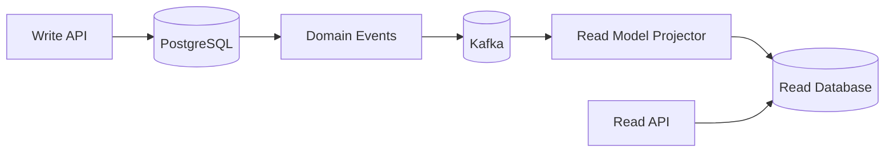
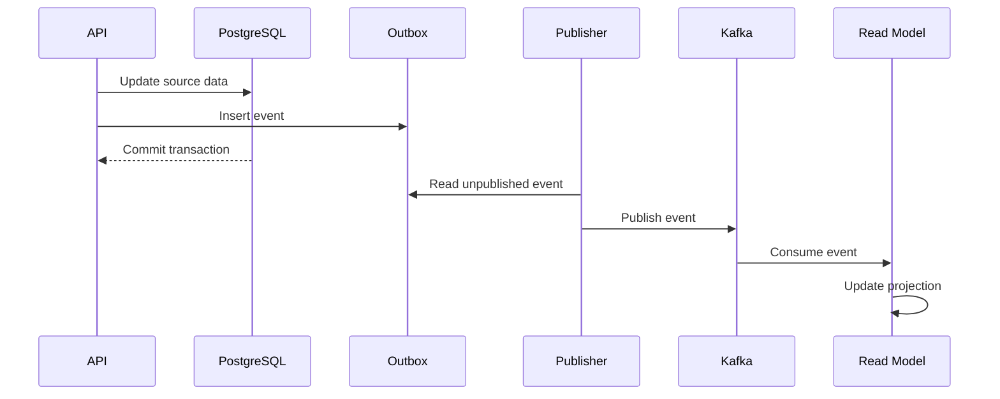
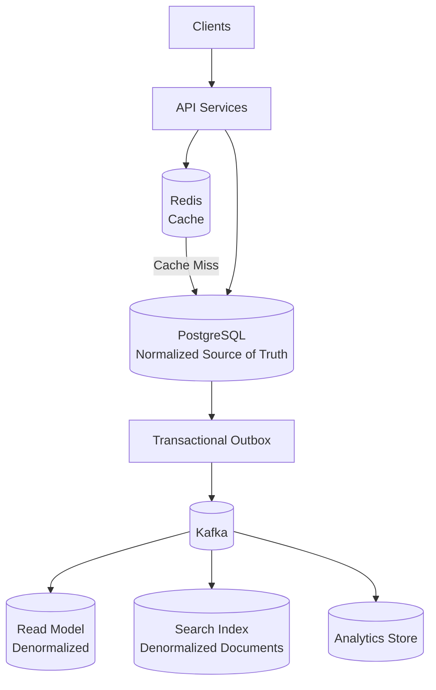

# 06- Denormalization

## Overview

Denormalization is the deliberate duplication, precomputation, or restructuring of data to optimize specific access patterns.

A normalized relational model generally prioritizes:

- Data integrity
- Clear ownership of facts
- Minimal unnecessary duplication
- Consistent updates
- Strong transactional semantics

A denormalized model intentionally trades some of those properties for:

- Lower read latency
- Fewer joins
- Higher read throughput
- Faster aggregations
- Simpler read paths
- Better scalability for read-heavy workloads

The key distinction is **intent**.

Accidental duplication creates synchronization problems without providing a clear benefit. Deliberate denormalization creates additional copies or derived representations because the system has a measurable requirement that justifies the complexity.

A common production architecture is:

```text
                    Write Path
                        |
                        v
                 PostgreSQL
               Normalized Model
                        |
                        | Events / CDC
                        v
                     Kafka
                  /     |      \
                 /      |       \
                v       v        v
          Redis Cache  Search   Read Model
                       Index    PostgreSQL
                         \       /
                          \     /
                           v   v
                            API
```

The normalized database can remain the source of truth while specialized representations optimize different read workloads.

---

## Why Denormalization Exists

Consider an API that returns an order:

```json
{
  "id": 1001,
  "customer": {
    "name": "Alice",
    "email": "alice@example.com"
  },
  "items": [
    {
      "product_name": "Laptop",
      "quantity": 1,
      "unit_price": 1200
    }
  ],
  "total": 1200
}
```

A normalized schema may require:

```text
orders
    |
    +---- customers
    |
    +---- order_items
              |
              +---- products
```

Every request may therefore require multiple joins or multiple queries.

If the endpoint is:

- Extremely high traffic
- Read-heavy
- Latency-sensitive
- Repeated frequently
- Served from a geographically distributed system

it can be beneficial to maintain a read-optimized representation.

For example:

```text
order_summary

order_id
customer_name
customer_email
item_count
total_amount
```

The API can retrieve the required data with a single lookup.

The trade-off is that the duplicated data now needs a consistency strategy.

---

## Normalization vs Denormalization

| Dimension | Normalization | Denormalization |
|---|---|---|
| Primary goal | Data integrity | Read efficiency |
| Duplication | Minimized | Intentional |
| Writes | Usually simpler | Can become more expensive |
| Reads | May require joins | Often simpler |
| Consistency | Easier | Requires synchronization |
| Storage | Lower | Higher |
| Query complexity | Potentially higher | Often lower |
| Aggregations | May require computation | Can be precomputed |
| Failure handling | Simpler | Requires reconciliation |
| Best fit | OLTP write models | Read-heavy access patterns |

Neither strategy is inherently superior.

The correct design depends on workload and consistency requirements.

---

## When to Consider Denormalization

Denormalization is worth considering when there is a concrete system requirement.

Typical signals include:

- Expensive joins on frequently executed queries.
- Repeated aggregation over large datasets.
- Strict API latency requirements.
- Very high read-to-write ratios.
- High database CPU caused by repeated computation.
- Large-scale analytical queries.
- Search-oriented access patterns.
- Geographically distributed read workloads.
- CQRS read models.
- Materialized views.
- Event-driven projections.
- Cache-heavy architectures.

A useful decision sequence is:

```text
Correct normalized model
          |
          v
Measure workload
          |
          v
Identify bottleneck
          |
          v
Optimize query/indexes
          |
          v
Still insufficient?
          |
       +--+--+
       |     |
      No    Yes
       |     |
       v     v
    Keep   Evaluate
           denormalization
```

Do not denormalize simply because joins exist.

Relational databases are specifically designed to perform joins efficiently when the schema, indexes, statistics, and queries are well designed.

---

## Common Forms of Denormalization

Denormalization is broader than simply copying a column.

Common techniques include:

| Technique | Example | Primary Benefit |
|---|---|---|
| Duplicate attributes | Store `customer_name` with order | Avoid join |
| Precomputed aggregate | Store `order.total_amount` | Avoid repeated aggregation |
| Cached representation | Redis order JSON | Reduce database reads |
| Materialized view | Precomputed reporting query | Faster analytical reads |
| Read model | CQRS projection | Optimize API access |
| Embedded data | JSON document containing related fields | Reduce lookup operations |
| Search projection | Elasticsearch/OpenSearch document | Search performance |
| Counter cache | `post.comment_count` | Fast counts |
| Historical snapshot | Store price on order item | Preserve historical state |

These techniques have different consistency and recovery characteristics.

---

## Duplicate Attributes

One of the simplest forms is duplicating an attribute.

Normalized:

```text
customers

id | name
---+-------
10 | Alice

orders

id   | customer_id
-----+------------
1001 | 10
```

Denormalized:

```text
orders

id   | customer_id | customer_name
-----+-------------+--------------
1001 | 10          | Alice
```

The read path becomes simpler:

```sql
SELECT id, customer_id, customer_name
FROM orders
WHERE id = 1001;
```

But changing the customer name now creates a synchronization problem.

If the customer changes from:

```text
Alice
```

to:

```text
Alice Smith
```

the system must decide whether historical orders should also change.

That decision is a **domain requirement**, not merely a database optimization.

---

## Snapshot vs Current Value

This distinction is critical.

Suppose an order contains:

```text
customer_name
```

There are two possible meanings.

### Current Value

The field means:

> "What is the customer's current name?"

Then it must remain synchronized with the customer record.

### Historical Snapshot

The field means:

> "What name did the customer have when this order was created?"

Then synchronization is not required.

The duplicate value is actually part of the historical record.

This pattern is common in:

- Orders
- Invoices
- Payments
- Contracts
- Shipping records
- Audit records

For example:

```text
invoice

customer_id
customer_name_snapshot
billing_address_snapshot
tax_identifier_snapshot
```

These values can be intentionally immutable after invoice creation.

---

## Precomputed Aggregates

Repeated aggregation is a common reason for denormalization.

Suppose:

```text
orders
order_items
```

contain:

```text
quantity
unit_price
```

Calculating an order total requires:

```sql
SELECT SUM(quantity * unit_price)
FROM order_items
WHERE order_id = 1001;
```

For a high-traffic endpoint, calculating this repeatedly can become expensive.

A denormalized representation can store:

```text
orders

id
total_amount
```

The read becomes:

```sql
SELECT id, total_amount
FROM orders
WHERE id = 1001;
```

The trade-off is maintaining:

```text
order_items
      |
      v
total_amount
```

correctly.

---

## Maintaining Aggregate Fields

One approach is updating the aggregate within the same transaction.

```sql
BEGIN;

INSERT INTO order_items (
    order_id,
    product_id,
    quantity,
    unit_price
)
VALUES (
    1001,
    101,
    2,
    50.00
);

UPDATE orders
SET total_amount = total_amount + (2 * 50.00)
WHERE id = 1001;

COMMIT;
```

This provides strong consistency if both updates occur in the same transaction.

The downside is that every write now performs additional work.

At high write volume, alternative architectures may be preferable.

---

## Counter Caches

Counters are a common specialized form of denormalization.

Suppose:

```text
posts
comments
```

A normalized query for comment count might be:

```sql
SELECT COUNT(*)
FROM comments
WHERE post_id = 1001;
```

For frequently accessed posts, storing:

```text
posts.comment_count
```

can make reads extremely cheap:

```sql
SELECT id, title, comment_count
FROM posts
WHERE id = 1001;
```

The system then increments or decrements the counter when comments change.

This is useful for:

- Comment counts
- Like counts
- Follower counts
- Unread message counts
- Inventory summaries
- View counts

However, counters can drift because of:

- Failed updates
- Concurrent writes
- Retry behavior
- Manual data changes
- Event delivery failures
- Race conditions

Production systems should have a reconciliation strategy.

---

## Materialized Views

A materialized view stores the result of a query rather than executing the query every time.

For example:

```sql
CREATE MATERIALIZED VIEW customer_order_summary AS
SELECT
    c.id AS customer_id,
    c.email,
    COUNT(o.id) AS order_count,
    COALESCE(SUM(o.total_amount), 0) AS total_spent
FROM customers c
LEFT JOIN orders o
    ON o.customer_id = c.id
GROUP BY c.id, c.email;
```

The application can query:

```sql
SELECT *
FROM customer_order_summary
WHERE customer_id = 10;
```

Instead of recalculating the aggregation for every request.

Refresh behavior must be designed explicitly.

```sql
REFRESH MATERIALIZED VIEW customer_order_summary;
```

For production workloads, consider:

- Refresh frequency
- Locking behavior
- Refresh duration
- Concurrent refresh requirements
- Staleness tolerance
- Indexes on the materialized view

Materialized views are particularly useful when data can tolerate bounded staleness.

---

## Read Models

A read model is a representation specifically designed for a particular query or API workload.

For example:

```text
Normalized write model

customers
orders
order_items
products
```

can produce:

```text
Order API read model

order_id
customer_name
customer_email
item_count
total_amount
order_status
```

The read model can be updated asynchronously:



This is a common CQRS pattern.

The write model is optimized for correctness and transactional operations.

The read model is optimized for query performance.

---

## CQRS and Denormalization

CQRS separates command and query responsibilities.

```text
                Commands
                   |
                   v
             Write Service
                   |
                   v
             PostgreSQL
             normalized
                   |
                   v
                 Kafka
                   |
                   v
            Read Projector
                   |
                   v
          Denormalized Store
                   |
                   v
               Query API
```

The read model might contain:

```json
{
  "order_id": 1001,
  "customer": {
    "name": "Alice",
    "email": "alice@example.com"
  },
  "status": "shipped",
  "item_count": 3,
  "total_amount": 1499.99
}
```

This avoids repeatedly reconstructing the response from multiple normalized tables.

The trade-off is eventual consistency.

An order may be committed in PostgreSQL before its read projection has been updated.

---

## Redis as a Denormalized Read Layer

Redis is frequently used as a denormalized representation.

Example:

```text
GET order:1001
```

might return:

```json
{
  "id": 1001,
  "customer_name": "Alice",
  "status": "shipped",
  "total": 1499.99
}
```

The source of truth remains PostgreSQL.

A cache miss follows:

```text
Client
  |
  v
API
  |
  v
Redis
  |
  +---- hit ----> response
  |
  +---- miss
         |
         v
    PostgreSQL
         |
         v
      Redis
         |
         v
      response
```

This is **cache denormalization**.

The important property is that the cache can be discarded and rebuilt.

If the system cannot recover when Redis loses all entries, Redis may be incorrectly acting as the authoritative data store.

---

## Cache Invalidation

Denormalized caches introduce the classic problem:

> How do we know when the duplicated value is stale?

A common write-through pattern is:

```text
Write
  |
  +--> PostgreSQL
  |
  +--> Redis
```

Another approach is cache invalidation:

```text
Write PostgreSQL
      |
      v
Invalidate Redis key
```

For event-driven systems:

```text
PostgreSQL
    |
    v
Event
    |
    v
Kafka
    |
    v
Cache invalidator
    |
    v
Redis
```

Each strategy has trade-offs.

| Strategy | Consistency | Complexity | Typical Use |
|---|---|---|---|
| Cache-aside | Eventual | Low | General application caching |
| Write-through | Stronger | Medium | Frequently accessed data |
| Event-driven invalidation | Eventual | Higher | Distributed systems |
| Full projection rebuild | Eventual | High | CQRS/read models |

---

## Denormalization With Kafka

Kafka can distribute changes to denormalized consumers.

For example:

```text
Order Service
     |
     v
PostgreSQL
     |
     v
Outbox
     |
     v
Kafka
  /  |  \
 /   |   \
v    v    v
Search Analytics Notifications
```

Each consumer may maintain a specialized representation.

For example:

```text
Search document

{
  "order_id": 1001,
  "customer_name": "Alice",
  "status": "shipped",
  "total_amount": 1499.99
}
```

This is useful because search systems are not designed to reconstruct relational joins from normalized OLTP tables on every request.

---

## Transactional Outbox

When denormalized read models depend on events, publishing events reliably is important.

A common approach is the transactional outbox pattern.



The important property is that the source update and outbox event are committed atomically.

This avoids the failure mode:

```text
DB commit succeeds
Kafka publish fails
```

without a durable record of the event.

---

## Idempotency

Denormalized systems frequently process events asynchronously.

Consumers must therefore handle duplicate delivery safely.

Suppose:

```text
OrderCreated(order_id=1001)
```

is delivered twice.

A naive consumer might create two read-model records.

An idempotent consumer instead ensures that processing the event multiple times produces the same final state.

Possible techniques include:

- Unique event IDs.
- Upserts.
- Version numbers.
- Processed-event tables.
- Conditional updates.

Example:

```sql
INSERT INTO order_read_model (
    order_id,
    customer_name,
    status,
    version
)
VALUES (
    1001,
    'Alice',
    'created',
    1
)
ON CONFLICT (order_id)
DO UPDATE SET
    customer_name = EXCLUDED.customer_name,
    status = EXCLUDED.status,
    version = EXCLUDED.version
WHERE order_read_model.version < EXCLUDED.version;
```

This protects the read model from duplicate and out-of-order updates.

---

## Event Ordering

Denormalized projections can fail when events arrive out of order.

Suppose:

```text
OrderCreated version=1
OrderShipped version=2
```

but the consumer receives:

```text
version=2
version=1
```

Without version checking, the final state could incorrectly become:

```text
created
```

instead of:

```text
shipped
```

A robust projection should often use:

```text
aggregate_id
version
```

and apply only newer versions.

For Kafka, partitioning events by aggregate ID can preserve ordering for that aggregate:

```text
partition key = order_id
```

This is a system-design concern, not merely a database concern.

---

## Denormalization in Microservices

Microservices naturally create duplicated data.

Consider:

```text
Customer Service
Order Service
Shipping Service
Notification Service
```

The Order Service may maintain:

```text
customer_id
customer_name
```

while Shipping Service may maintain:

```text
customer_id
shipping_address
```

These are separate service-owned representations.

Trying to eliminate every duplicate field can lead to synchronous service calls:

```text
Order API
   |
   +--> Customer Service
   |
   +--> Shipping Service
   |
   +--> Product Service
```

This can produce:

- Higher latency
- More failure points
- Cascading failures
- Tight coupling
- Difficult deployments

Sometimes duplicating stable or frequently accessed data is the better architecture.

---

## Denormalization Across Service Boundaries

Within a single PostgreSQL database:

```text
orders
customers
```

a foreign key is usually preferable to duplicating customer fields unnecessarily.

Across service boundaries:

```text
Order Service
      |
      +--> customer_id
      +--> customer_name
```

the duplication may be justified because:

- Services own separate databases.
- Cross-service joins are unavailable.
- Synchronous calls add latency.
- Independent deployment is important.
- Read performance matters.

The key question becomes:

> **What consistency model does the duplicated value require?**

---

## Strong vs Eventual Consistency

Denormalized systems frequently introduce eventual consistency.

Suppose:

```text
PostgreSQL
    |
    v
Kafka
    |
    v
Read Model
```

The sequence is:

```text
t0: source updated
t1: event published
t2: event consumed
t3: projection updated
```

Between `t0` and `t3`, the read model may be stale.

This is acceptable when the business requirement permits it.

Examples where eventual consistency may be acceptable:

- Product recommendations
- Search indexes
- Analytics dashboards
- Notification preferences
- Social counters
- Activity feeds

Examples where stronger consistency may be required:

- Account balances
- Inventory reservation
- Payment authorization
- Financial ledger state
- Critical authorization decisions

Do not introduce eventual consistency without understanding the business consequences.

---

## Denormalization and Database Replicas

Read replicas can improve read scalability without changing the schema.

```text
                  PostgreSQL Primary
                   /            \
                  /              \
                 v                v
          Read Replica 1    Read Replica 2
```

Before denormalizing, evaluate whether:

- Read replicas solve the bottleneck.
- Indexing solves the bottleneck.
- Query optimization solves the bottleneck.
- Connection pooling solves the bottleneck.
- Caching solves the bottleneck.

Denormalization should not be the first response to every database performance problem.

---

## Denormalization and Indexing

Indexes are often cheaper and safer than denormalization.

Suppose:

```sql
SELECT *
FROM orders
WHERE customer_id = 1001
ORDER BY created_at DESC
LIMIT 20;
```

An index may solve the problem:

```sql
CREATE INDEX orders_customer_created_idx
ON orders(customer_id, created_at DESC);
```

This preserves the normalized model while improving the access path.

A reasonable optimization order is often:

```text
Measure
  |
  v
Optimize SQL
  |
  v
Add/adjust indexes
  |
  v
Improve connection pooling
  |
  v
Add caching
  |
  v
Read replicas
  |
  v
Denormalize / build read model
```

The exact order depends on the bottleneck.

---

## Denormalization in PostgreSQL

PostgreSQL provides several mechanisms that can support read optimization without immediately restructuring the source model.

Useful options include:

- B-tree indexes
- Partial indexes
- Composite indexes
- Covering indexes
- Materialized views
- Generated columns
- Table partitioning
- Read replicas
- JSONB for appropriate document-shaped attributes

For example:

```sql
CREATE INDEX active_orders_customer_idx
ON orders(customer_id, created_at DESC)
WHERE status IN ('pending', 'processing', 'shipped');
```

A partial index can be much smaller than indexing every row when only a subset is frequently queried.

---

## Generated Columns vs Application-Derived Data

Some derived values can be generated by the database.

For example:

```sql
CREATE TABLE products (
    id BIGSERIAL PRIMARY KEY,
    price NUMERIC(12, 2) NOT NULL,
    tax_rate NUMERIC(5, 4) NOT NULL,
    price_with_tax NUMERIC(12, 2)
        GENERATED ALWAYS AS (price * (1 + tax_rate)) STORED
);
```

This avoids application code having to maintain the derived value independently.

However, generated columns are appropriate only for derivations supported by the database's expression semantics and business requirements.

For more complex projections, a read model or application-managed projection may be more appropriate.

---

## Denormalization and JSON

JSON can provide a denormalized representation.

For example:

```json
{
  "order_id": 1001,
  "customer": {
    "id": 10,
    "name": "Alice"
  },
  "items": [
    {
      "product_id": 101,
      "name": "Laptop",
      "quantity": 1
    }
  ]
}
```

This can be useful for:

- Flexible metadata
- External payload snapshots
- Read projections
- Document-shaped data
- Semi-structured attributes

It should not automatically replace relational modeling.

If the application frequently needs:

```text
JOIN
FOREIGN KEY
UNIQUE
CHECK
referential integrity
```

a relational representation is often more appropriate.

---

## Denormalization and Search Systems

Search systems commonly use denormalized documents.

A normalized relational representation:

```text
products
categories
brands
inventory
```

might become:

```json
{
  "product_id": 1001,
  "name": "Laptop",
  "brand": "Example",
  "category": "Computers",
  "available": true,
  "price": 1200
}
```

The search document contains everything required for the search workload.

The source database remains responsible for authoritative transactional state.

This separation is important:

```text
PostgreSQL
    |
    | source of truth
    v
Search projection
    |
    | optimized for search
    v
Search API
```

A search index should generally be rebuildable from authoritative data.

---

## Data Ownership

Every denormalized field should have a clearly defined owner.

For example:

```text
PostgreSQL customers.email
        |
        | authoritative
        v
Redis customer cache
        |
        | derived copy
        v
API response
```

If both systems independently accept writes:

```text
PostgreSQL <----> Redis
```

the system can develop conflicting sources of truth.

Prefer:

```text
One authoritative source
          |
          v
Derived representations
```

This makes recovery and reconciliation significantly easier.

---

## Rebuilding Denormalized Data

A production denormalized system should answer:

> Can this representation be rebuilt?

Suppose Redis is deleted:

```text
Redis
  X
```

The system should be able to reconstruct it from PostgreSQL.

For a Kafka-backed projection:

```text
PostgreSQL
    |
    v
Historical events / CDC / replay source
    |
    v
Projector
    |
    v
Read model
```

Rebuildability reduces operational risk.

Without rebuildability, a corrupted denormalized store may require manual data repair.

---

## Reconciliation

Even well-designed asynchronous systems can experience drift.

A reconciliation process compares:

```text
Source of truth
      |
      v
Expected state
      |
      v
Denormalized state
```

For example:

```text
orders.total_amount
        vs
SUM(order_items.quantity * order_items.unit_price)
```

A periodic reconciliation query can identify inconsistencies.

For large datasets, reconciliation may be performed incrementally or through batch jobs.

This is especially important for:

- Financial systems
- Inventory
- Counters
- Search indexes
- Reporting models
- Customer-facing aggregates

---

## Failure Modes

Denormalization introduces additional failure modes.

| Failure | Result | Mitigation |
|---|---|---|
| Event lost | Read model stale | Transactional outbox |
| Duplicate event | Duplicate update | Idempotent consumer |
| Out-of-order event | Incorrect state | Version checks |
| Cache stale | Old response | TTL/invalidation |
| Projection failure | Missing read data | Retry + replay |
| Partial update | Inconsistent copies | Atomic transaction where possible |
| Consumer lag | Increasing staleness | Monitor lag |
| Corrupt projection | Incorrect reads | Rebuild/reconciliation |
| Manual DB update | Derived state drift | Restrict direct writes |

Senior-level system design requires explicitly modeling these failure modes.

---

## Monitoring Denormalized Systems

Monitoring should cover both the source and derived representations.

Important metrics include:

### Database

- Query latency
- CPU utilization
- I/O utilization
- Lock contention
- Connection pool utilization
- Replication lag

### Cache

- Hit ratio
- Miss ratio
- Eviction rate
- Memory usage
- Key expiration behavior

### Kafka

- Consumer lag
- Processing rate
- Error rate
- Retry volume
- Dead-letter queue volume

### Read Models

- Projection lag
- Projection failures
- Records processed
- Rebuild duration
- Reconciliation mismatches

A useful metric is:

```text
Projection Lag = Source Event Timestamp - Projection Processing Timestamp
```

The acceptable threshold should come from the business requirement.

---

## Security Considerations

Denormalization can accidentally expand the amount of sensitive data stored in secondary systems.

For example:

```text
PostgreSQL
    |
    +--> Redis
    +--> Kafka
    +--> Search
    +--> Analytics
```

If customer email, phone numbers, or payment-related metadata are duplicated into all of these systems, the data protection surface becomes much larger.

Consider:

- Minimize sensitive fields in projections.
- Encrypt sensitive data at rest.
- Use TLS in transit.
- Apply least-privilege access.
- Define retention policies.
- Avoid unnecessary PII duplication.
- Secure Kafka topics and consumer permissions.
- Apply appropriate Redis access controls.
- Restrict search index access.
- Define deletion propagation requirements.

Data deletion is particularly important.

If a customer requests deletion, the system may need to remove or anonymize data from:

```text
Primary DB
Redis
Search index
Read models
Analytics stores
Event-derived stores
```

A denormalized architecture must therefore consider the complete data lifecycle.

---

## Scalability Considerations

Denormalization can improve horizontal scalability by reducing expensive joins and concentrating read traffic on optimized stores.

For example:

```text
                    Load Balancer
                         |
              +----------+----------+
              |          |          |
              v          v          v
            API-1      API-2      API-3
              |          |          |
              +----------+----------+
                         |
                       Redis
                         |
                  cache hit path
```

However, Redis can itself become a bottleneck.

Production systems may require:

- Redis Cluster
- Replication
- Appropriate key distribution
- TTL policies
- Connection pooling
- Memory management
- Hot-key mitigation

Denormalization moves complexity; it does not eliminate it.

---

## Hot Keys

A particularly important cache problem is the hot key.

Suppose:

```text
product:popular:1
```

receives millions of requests.

Even though Redis is fast, a single heavily accessed key can create disproportionate load.

Potential strategies include:

- Local in-process caching.
- Replicated cache entries.
- Request coalescing.
- Short-lived caching.
- Sharding representations where appropriate.
- CDN caching for public content.

Denormalization decisions should therefore consider traffic distribution, not just average request volume.

---

## Cost Considerations

Denormalization increases storage and operational cost.

A single logical entity might exist in:

```text
PostgreSQL
Redis
Kafka
Search
Data warehouse
```

This increases:

- Storage consumption
- Network traffic
- Compute requirements
- Backup requirements
- Monitoring requirements
- Operational complexity

The performance benefit should justify those costs.

For example:

```text
10 ms query optimization
```

may not justify a complex event-driven projection.

But:

```text
2 seconds database query
millions of requests/day
```

may justify substantial architectural investment.

---

## High Availability and Disaster Recovery

Denormalized stores should have explicit recovery behavior.

For example:

```text
PostgreSQL
   |
   | authoritative
   v
Redis
   |
   | disposable
   v
Cache
```

Redis loss may be acceptable if it can be repopulated.

For a read model:

```text
PostgreSQL
    |
    v
Kafka
    |
    v
Read DB
```

the system should retain enough information to rebuild the read DB.

Disaster recovery should therefore distinguish between:

- **Authoritative state**
- **Derived state**
- **Rebuildable state**
- **Irreplaceable state**

Backups are mandatory for authoritative data.

Derived stores may instead require replay and reconstruction procedures.

---

## Production Decision Framework

Before introducing denormalization, answer these questions:

| Question | Why It Matters |
|---|---|
| What query is slow? | Identifies the actual problem |
| How often is it executed? | Establishes workload impact |
| Can an index solve it? | Usually lower complexity |
| Can SQL be optimized? | Avoids unnecessary architecture |
| Is caching sufficient? | May provide simpler read acceleration |
| What data is duplicated? | Defines consistency scope |
| What is the source of truth? | Prevents conflicting ownership |
| How is duplication updated? | Defines synchronization model |
| Can updates arrive out of order? | Determines need for versions |
| Can events be duplicated? | Requires idempotency |
| How stale can data be? | Defines consistency requirements |
| Can the projection be rebuilt? | Determines operational recoverability |
| How is drift detected? | Enables reconciliation |
| What happens during dependency failure? | Defines resilience |
| What is the additional cost? | Validates the trade-off |

If these questions do not have clear answers, the design is probably not ready for production.

---

## Practical Architecture Example

Consider a high-traffic e-commerce platform.

### Source of Truth

PostgreSQL stores normalized transactional data:

```text
customers
products
orders
order_items
payments
inventory
```

### Read Optimization

Redis stores frequently requested summaries:

```text
product:1001
order:1001
customer:10
```

### Event Distribution

Kafka carries domain events:

```text
OrderCreated
OrderPaid
OrderShipped
ProductUpdated
InventoryChanged
```

### Specialized Projections

Different consumers maintain:

```text
Search index
Analytics warehouse
Customer dashboard
Order dashboard
Recommendation model
```

Architecture:



The important architectural property is that each representation has a purpose.

```text
PostgreSQL
    = transactional truth

Redis
    = low-latency cache

Read DB
    = query-optimized projection

Search
    = search-optimized projection

Analytics
    = analytical representation
```

---

## Common Mistakes

### Denormalizing Before Measuring

Poor approach:

```text
Joins exist
    |
    v
Denormalize everything
```

Better:

```text
Measure
  |
  v
Identify bottleneck
  |
  v
Optimize query/index
  |
  v
Evaluate caching
  |
  v
Evaluate denormalization
```

### Creating Multiple Sources of Truth

Bad:

```text
PostgreSQL
    <---->
Redis
```

where both accept independent writes.

Prefer:

```text
PostgreSQL
    |
    +----> Redis
    +----> Search
    +----> Read Model
```

### Ignoring Staleness

If a read model is asynchronous, it will be stale for some period.

The system should define:

```text
Maximum acceptable staleness
```

rather than pretending eventual consistency does not exist.

### Forgetting Duplicate Events

Kafka consumers should generally assume events can be retried or delivered more than once.

### Ignoring Event Ordering

A newer event must not be overwritten by an older event.

Use:

```text
aggregate_id
version
```

when ordering matters.

### Making Derived Data Impossible to Rebuild

If a denormalized store cannot be reconstructed, its operational risk becomes much higher.

### Duplicating Sensitive Data Everywhere

Every additional copy increases the security and compliance surface.

### Treating Cache as the Database

If Redis contains only a cache, PostgreSQL should remain authoritative.

### Denormalizing Without a Lifecycle

Every duplicated field should have defined behavior for:

```text
Create
Update
Delete
Replay
Backfill
Recovery
```

---

## Beginner Mistakes vs Senior-Level Concerns

| Beginner Focus | Senior-Level Concern |
|---|---|
| "Denormalization makes queries faster" | Which query, under which workload? |
| "Duplicate data is bad" | Is duplication intentional and domain-correct? |
| "Redis is faster than PostgreSQL" | What is the consistency and invalidation model? |
| "Kafka updates the read model" | What happens with duplicates, ordering, lag, and replay? |
| "Cache the expensive query" | Can the cache be rebuilt and invalidated safely? |
| "Store everything in one document" | What are the update and ownership boundaries? |
| "Avoid joins" | Are the joins actually the bottleneck? |
| "Use eventual consistency" | What business invariants tolerate staleness? |

---

## Interview Traps

### "Is denormalization always faster?"

No.

Denormalization can reduce joins or repeated computation, but it introduces synchronization, storage, and write complexity. A well-indexed normalized query can outperform a poorly designed denormalized model.

### "Should you denormalize when a query has many joins?"

Not automatically.

First inspect:

```text
EXPLAIN
EXPLAIN ANALYZE
Indexes
Query predicates
Join cardinality
Data volume
Caching
```

### "Is Redis denormalization?"

It can be.

A Redis cache is a denormalized representation when it stores a derived or duplicated view of authoritative data. But caching and database denormalization are distinct techniques with different lifecycle semantics.

### "Does denormalization mean eventual consistency?"

Not necessarily.

A duplicated value can be updated synchronously inside the same database transaction. Eventual consistency becomes common when denormalized representations are maintained asynchronously across processes or services.

### "Should microservices share normalized database tables?"

Generally no.

A service should own its data. Cross-service data duplication may be preferable to shared database tables because it preserves service autonomy.

---

## Production Checklist

Before shipping a denormalized design:

- [ ] The performance problem has been measured.
- [ ] Query optimization and indexing were evaluated first.
- [ ] The duplicated data has a clearly defined purpose.
- [ ] A single source of truth is identified.
- [ ] Ownership of every duplicated field is documented.
- [ ] Update behavior is explicitly defined.
- [ ] Delete behavior is explicitly defined.
- [ ] Staleness requirements are documented.
- [ ] Eventual consistency is acceptable to the business.
- [ ] Event processing is idempotent.
- [ ] Event ordering is handled where necessary.
- [ ] Consumer retries are safe.
- [ ] Projection failures can be recovered.
- [ ] Denormalized data can be rebuilt.
- [ ] Reconciliation is available for critical data.
- [ ] Cache invalidation behavior is defined.
- [ ] Sensitive data duplication has been reviewed.
- [ ] Monitoring covers lag, errors, and drift.
- [ ] Disaster recovery distinguishes source and derived data.
- [ ] Additional storage and operational cost are justified.

---

## Key Takeaways

- **Denormalization is a deliberate performance trade-off**, not simply "duplicating database columns"; it should be introduced to solve a measured workload or architectural requirement.
- **Keep a clear source of truth and treat caches, read models, search indexes, and projections as derived representations** whenever possible.
- **Asynchronous denormalization requires idempotency, ordering, replay, reconciliation, and explicit staleness guarantees** to remain reliable under failure.
- **Optimize the normalized model first with query tuning, indexes, connection management, caching, and replicas before introducing substantial denormalization complexity.**
- **A production-ready denormalized design must be rebuildable, observable, secure, and explicit about consistency, ownership, lifecycle, and recovery.**