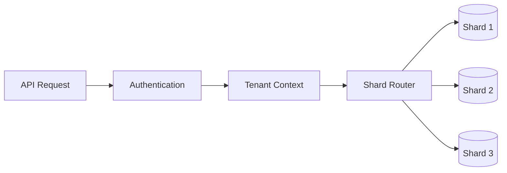
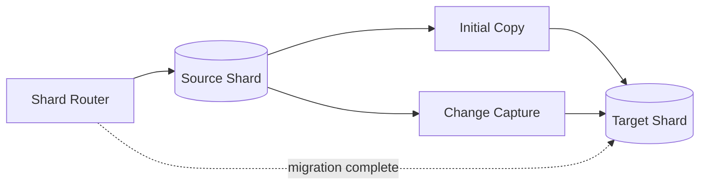
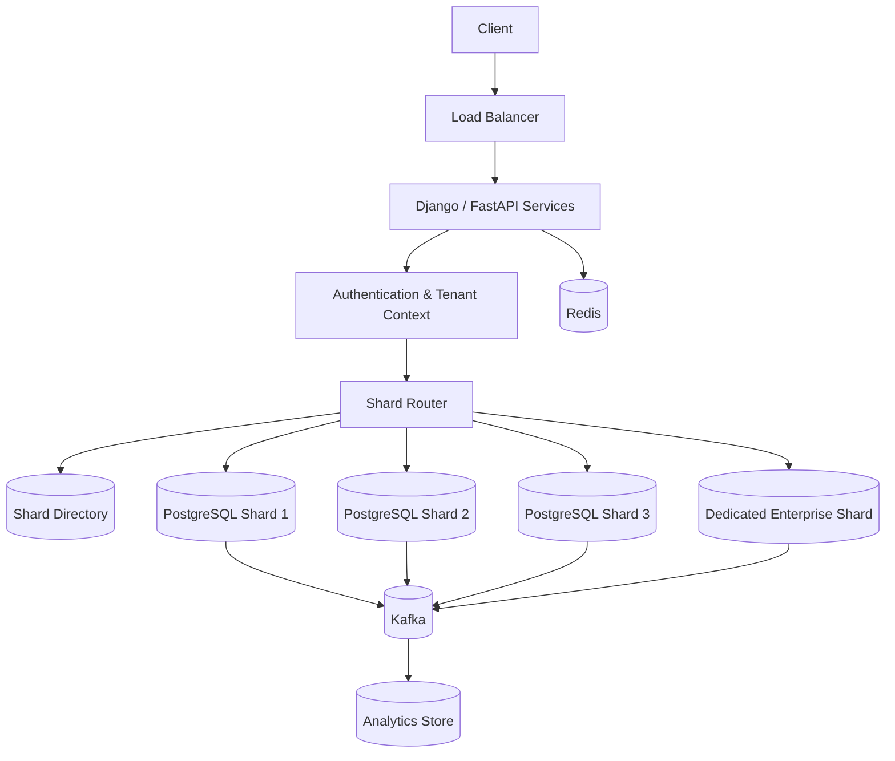

# 07- Sharding

## Overview

Sharding is a horizontal data-partitioning strategy in which a large logical dataset is distributed across multiple independent database partitions, called **shards**.

Instead of storing all rows in one database:

```text
                    Database
                       |
          +------------+------------+
          |            |            |
       Shard 0      Shard 1      Shard 2
       rows A-H     rows I-P      rows Q-Z
```

each shard stores only a subset of the data.

The primary motivation is to scale beyond the practical limits of a single database instance when increasing the size or capacity of that instance is no longer sufficient or economically attractive.

Sharding can provide:

- Higher total storage capacity
- Higher aggregate read throughput
- Higher aggregate write throughput
- Independent scaling of partitions
- Reduced contention on individual database instances
- Isolation of large tenants or workloads

However, sharding also introduces substantial distributed-systems complexity:

- Routing
- Rebalancing
- Cross-shard queries
- Cross-shard transactions
- Data movement
- Operational complexity
- Failure handling
- Hot shards
- Consistency management

Sharding should therefore be treated as a **late-stage scalability technique**, not as the default database architecture.

---

## Why Sharding Exists

A single database can often scale surprisingly far with:

- Better indexes
- Query optimization
- Connection pooling
- Read replicas
- Caching
- Partitioning
- Vertical scaling
- Better storage
- Better schema design

Eventually, however, a workload may encounter a hard limit.

For example:

```text
Single PostgreSQL cluster

Storage       -> 80 TB
Writes        -> 250K/sec
Connections   -> resource constrained
CPU           -> consistently saturated
I/O           -> consistently saturated
```

Adding more CPU or memory may no longer provide a proportional improvement.

Sharding changes the architecture:

```text
                 Application
                      |
              Shard Router
              /      |      \
             /       |       \
            v        v        v
        DB Shard  DB Shard  DB Shard
           0         1         2
```

Aggregate capacity can now increase by adding additional shards.

---

## Horizontal vs Vertical Scaling

### Vertical Scaling

Vertical scaling increases the capacity of one database server.

```text
Before:

+----------------------+
| Database             |
| 8 CPU / 32 GB RAM    |
+----------------------+

After:

+----------------------+
| Database             |
| 64 CPU / 512 GB RAM  |
+----------------------+
```

Advantages:

- Simple architecture
- No shard routing
- No cross-shard query problem
- Easier transactions
- Easier operations

Limitations:

- Hardware limits
- Increasing cost
- Potentially large failure domain
- Eventually diminishing returns

### Horizontal Scaling

Horizontal scaling distributes workload across multiple database instances.

```text
                 Application
                      |
                Shard Router
             /        |        \
            v         v         v
          DB-1      DB-2      DB-3
```

Advantages:

- Aggregate capacity increases
- Storage can scale horizontally
- Workloads can be isolated
- Individual shards can remain manageable

Limitations:

- Distributed routing
- Cross-shard operations
- Rebalancing
- Operational complexity
- More complicated backups and recovery

---

## Sharding vs Partitioning

Sharding and partitioning are related but not identical.

| Feature | Partitioning | Sharding |
|---|---|---|
| Scope | Usually one database | Multiple database instances |
| Physical infrastructure | Often shared | Distributed |
| Query routing | Database handles it | Application/router may handle it |
| Primary purpose | Manage large tables | Scale database capacity |
| Cross-partition query | Usually straightforward | Potentially expensive |
| Operational complexity | Lower | Higher |
| Scaling capacity | Limited by database | Can scale across nodes |

For example, PostgreSQL partitioning might use:

```text
orders
├── orders_2025
├── orders_2026
└── orders_2027
```

while sharding might use:

```text
orders-shard-1
orders-shard-2
orders-shard-3
```

Partitioning can be useful before sharding.

---

## Shard Key

The **shard key** determines where a record is stored.

For example:

```text
user_id
```

could determine the shard.

A simple hash-based strategy might be:

```text
shard = hash(user_id) % number_of_shards
```

Example:

```text
user_id = 1001
hash(1001) % 4 = 2

=> Shard 2
```

The shard key is one of the most important design decisions in a sharded system.

A good shard key should generally provide:

- Even distribution
- Stable routing
- High cardinality
- Strong correlation with common queries
- Low probability of hotspots
- Minimal need for cross-shard queries

---

## Choosing a Shard Key

Suppose an application has:

```text
users
orders
payments
messages
```

Potential shard keys include:

```text
user_id
tenant_id
order_id
region
```

The best key depends on access patterns.

For a multi-tenant SaaS system:

```text
tenant_id
```

may be ideal because most requests are tenant-scoped.

For a consumer application:

```text
user_id
```

may provide better locality.

For a globally distributed system:

```text
region
```

may be useful for regulatory or latency requirements, although region alone can create severe skew.

---

## Shard Key Requirements

### High Cardinality

A key should have enough distinct values.

Good:

```text
user_id
tenant_id
order_id
```

Potentially problematic:

```text
gender
country
status
```

A key such as:

```text
status = active
```

could concentrate most records onto a small number of shards.

### Even Distribution

Suppose:

```text
Shard 0 -> 25%
Shard 1 -> 25%
Shard 2 -> 25%
Shard 3 -> 25%
```

This is healthy.

A poor distribution might look like:

```text
Shard 0 -> 70%
Shard 1 -> 15%
Shard 2 -> 10%
Shard 3 -> 5%
```

The system is effectively constrained by Shard 0.

### Query Locality

If most requests are:

```text
GET /users/{user_id}/orders
```

then sharding by `user_id` keeps the query local.

```text
user_id
   |
   v
Shard Router
   |
   v
Single shard
   |
   v
Orders
```

This is preferable to querying every shard.

---

## Sharding Strategies

Common sharding strategies include:

- Hash-based sharding
- Range-based sharding
- Directory-based sharding
- Geographic sharding
- Tenant-based sharding
- Consistent hashing

Each has different operational characteristics.

| Strategy | Distribution | Routing | Rebalancing | Typical Use |
|---|---|---|---|---|
| Hash | Usually good | Simple | Potentially expensive | General workloads |
| Range | Can become skewed | Simple | Moderate | Ordered/range data |
| Directory | Explicit | Lookup required | Flexible | Multi-tenant systems |
| Geographic | Region-based | Location-based | Complex | Global systems |
| Tenant | Tenant-based | Tenant lookup | Moderate | SaaS |
| Consistent hashing | Good with virtual nodes | Hash ring | Easier | Distributed systems |

---

## Hash Sharding

Hash sharding maps a key to a shard using a deterministic hash function.

```text
             user_id
                |
                v
           Hash Function
                |
                v
         Shard Assignment
          /     |      \
         v      v       v
      Shard 0 Shard 1 Shard 2
```

A simplified strategy:

```python
def get_shard(user_id: int, shard_count: int) -> int:
    return hash(user_id) % shard_count
```

In production, avoid relying blindly on language-runtime hash behavior because some languages or runtimes randomize hashes between processes.

Use a stable hashing function when routing must remain deterministic across processes.

---

## Advantages of Hash Sharding

Hash sharding generally provides:

- Good distribution for high-cardinality keys
- Simple routing
- Low probability of range-based hotspots
- Predictable lookup cost

It works well for workloads such as:

```text
user_id
account_id
tenant_id
device_id
```

where point lookups dominate.

---

## Limitations of Hash Sharding

A major problem is resizing.

Suppose:

```text
hash(key) % 4
```

is used with four shards.

Increasing to eight shards changes the mapping:

```text
hash(key) % 8
```

Many records now map to different shards.

That can require substantial data movement.

This is one reason consistent hashing or explicit shard maps may be preferable for certain systems.

---

## Range Sharding

Range sharding assigns ranges of values to shards.

Example:

```text
Shard 0 -> user_id 1 - 1,000,000
Shard 1 -> user_id 1,000,001 - 2,000,000
Shard 2 -> user_id 2,000,001 - 3,000,000
```

This makes range queries efficient.

For example:

```sql
SELECT *
FROM orders
WHERE user_id BETWEEN 100000 AND 200000;
```

may target one shard.

However, sequential identifiers can create hotspots.

If new records always have increasing IDs:

```text
1
2
3
4
...
```

writes may concentrate on the newest range.

---

## Directory-Based Sharding

A directory stores the mapping:

```text
tenant_id -> shard_id
```

Example:

```text
tenant-a -> shard-01
tenant-b -> shard-03
tenant-c -> shard-02
tenant-d -> shard-01
```

The application first queries the directory:

```text
tenant_id
    |
    v
Shard Directory
    |
    v
shard-03
    |
    v
Database
```

This provides excellent control over placement.

It also allows individual tenants to be moved without changing the shard key.

The trade-off is that the directory becomes an important infrastructure component.

It must be:

- Highly available
- Low latency
- Consistent
- Cacheable
- Recoverable

---

## Tenant-Based Sharding

Multi-tenant SaaS applications are strong candidates for tenant-based sharding.

Example:

```text
Tenant A -> Shard 1
Tenant B -> Shard 1
Tenant C -> Shard 2
Tenant D -> Shard 3
```

Every query contains:

```text
tenant_id
```

The router determines the shard.



This model provides strong tenant isolation and makes many application queries naturally shard-local.

---

## Dedicated Tenant Shards

Large tenants can eventually become hotspots.

A useful architecture is:

```text
Small tenants
    |
    v
Shared Shards

Large tenant
    |
    v
Dedicated Shard
```

For example:

```text
Tenant A -> Shared Shard 1
Tenant B -> Shared Shard 1
Tenant C -> Shared Shard 2
Enterprise X -> Dedicated Shard 10
```

This is often called **tenant isolation** or **tenant pinning**.

It allows large customers to receive dedicated capacity without requiring the entire system to use one database per tenant.

---

## Geographic Sharding

Data can be distributed by geography:

```text
US users -> US database
EU users -> EU database
IN users -> India database
```

Benefits include:

- Lower latency
- Regulatory isolation
- Data residency
- Regional fault isolation

However, geographic sharding introduces difficult problems:

- Cross-region transactions
- User mobility
- Global identities
- Global reporting
- Data replication
- Disaster recovery
- Cross-region consistency

A user's data location should therefore be treated as an architectural constraint, not simply a routing optimization.

---

## Consistent Hashing

Consistent hashing maps keys onto a logical hash ring.

```text
                Hash Ring

             Shard A
               ●
          .-----------.
       .-'             '-.
      /                   \
     |                     |
     |                     |
      \                   /
       '-.             .-'
          '-----------'
       ●                 ●
    Shard B           Shard C
```

Keys are assigned to the nearest shard on the ring.

When a shard is added or removed, only part of the keyspace needs to move.

Virtual nodes are commonly used to improve distribution.

Consistent hashing is particularly useful when:

- Nodes change frequently
- Even distribution matters
- Large-scale distributed routing is required

However, it does not eliminate the need for:

- Data migration
- Hot-key mitigation
- Failure handling
- Metadata management

---

## Shard Router

The application needs a mechanism to determine where a request should go.

Conceptually:

```python
def route_request(user_id: int) -> str:
    shard_id = stable_hash(user_id) % SHARD_COUNT
    return SHARD_DATABASES[shard_id]
```

A production router may also consider:

- Tenant placement
- Shard health
- Read/write role
- Replica selection
- Region
- Migration state
- Connection pools
- Failover state

The router should be treated as infrastructure rather than scattering shard-selection logic throughout business code.

---

## Application-Level Sharding

One approach is to keep sharding logic inside the application.

```text
Django / FastAPI
       |
       v
Shard Router
    /  |  \
   v   v   v
 DB1  DB2  DB3
```

The ORM may need to select the correct database before executing the query.

For example, Django supports database routing through custom database routers.

Conceptually:

```python
class TenantDatabaseRouter:
    def db_for_read(self, model, **hints):
        tenant_id = hints.get("tenant_id")
        return resolve_database(tenant_id)

    def db_for_write(self, model, **hints):
        tenant_id = hints.get("tenant_id")
        return resolve_database(tenant_id)
```

The exact implementation must ensure that tenant context is always available and cannot be accidentally bypassed.

---

## Sharding and Django

Django's multi-database support can help implement application-level routing, but it does not automatically solve distributed database problems.

Important concerns include:

- Transaction boundaries
- Query routing
- Migrations
- Foreign keys
- Admin operations
- Background jobs
- Management commands
- Cross-database relations
- Testing
- Connection management

For example:

```text
Request
  |
  v
Tenant Middleware
  |
  v
Tenant Context
  |
  v
Database Router
  |
  +--> shard-01
  +--> shard-02
  +--> shard-03
```

Every access path must preserve the tenant/shard context, including Celery workers and scheduled jobs.

---

## Sharding and FastAPI

FastAPI itself does not provide sharding.

The application can implement a shard-routing layer around SQLAlchemy or another database abstraction.

Conceptually:

```python
def get_database_for_tenant(tenant_id: str):
    shard_id = shard_directory.resolve(tenant_id)
    return database_registry.get(shard_id)
```

Dependency injection can then provide the appropriate database session.

The critical design principle is:

```text
Request context
      |
      v
Tenant context
      |
      v
Shard resolution
      |
      v
Database session
```

Do not allow application code to arbitrarily select a shard.

---

## Cross-Shard Queries

Cross-shard queries are one of the biggest costs of sharding.

Suppose data is distributed:

```text
Shard 1
  users 1-1M

Shard 2
  users 1M-2M

Shard 3
  users 2M-3M
```

A query such as:

```sql
SELECT COUNT(*)
FROM users;
```

may need to execute against every shard.

```text
             COUNT(*)
                |
       +--------+--------+
       |        |        |
       v        v        v
    Shard 1  Shard 2  Shard 3
       |        |        |
      10M      12M       9M
       \        |        /
        \       |       /
         v      v      v
           Aggregate
              |
              v
             31M
```

This is called a **scatter-gather query**.

---

## Scatter-Gather

Scatter-gather involves:

1. Sending the query to multiple shards.
2. Waiting for responses.
3. Combining the results.

The latency is approximately influenced by the slowest shard:

```text
Total latency ≈ max(shard latencies) + aggregation overhead
```

For example:

```text
Shard 1 -> 20 ms
Shard 2 -> 25 ms
Shard 3 -> 120 ms

Result latency ≈ 120 ms+
```

As shard count increases, tail latency becomes increasingly important.

Cross-shard queries should therefore be minimized.

---

## Global Aggregations

Global reporting is often better handled outside the OLTP shard layer.

Instead of:

```text
100 shards
   |
   v
Scatter-gather PostgreSQL
```

consider:

```text
100 shards
    |
    v
Kafka / CDC
    |
    v
Analytics Store
    |
    v
Reporting
```

Possible technologies include:

- Data warehouses
- Lakehouses
- OLAP databases
- Streaming aggregation systems

The transactional database should not necessarily become the analytics engine.

---

## Cross-Shard Joins

A join such as:

```sql
SELECT *
FROM orders
JOIN customers
  ON orders.customer_id = customers.id;
```

is straightforward in one database.

If:

```text
orders -> Shard A
customers -> Shard B
```

the join becomes distributed.

Possible solutions include:

- Co-locate related data
- Duplicate required fields
- Application-side joins
- Global reference data
- Asynchronous read models
- Analytics systems

The best solution is often to choose a shard key that keeps related data together.

---

## Data Locality

Good sharding maximizes locality.

For example:

```text
user
  |
  +--> orders
  +--> messages
  +--> preferences
```

If all data uses:

```text
user_id
```

as the shard key, the application can retrieve user-related data from one shard.

```text
user_id=1001
      |
      v
   Shard 4
   / | \
  /  |  \
orders messages preferences
```

This is much easier than:

```text
orders -> Shard 1
messages -> Shard 7
preferences -> Shard 3
```

---

## Cross-Shard Transactions

Transactions become significantly harder when multiple shards participate.

A local transaction is straightforward:

```text
BEGIN
  update orders
  update inventory
COMMIT
```

If:

```text
orders   -> Shard 1
inventory -> Shard 2
```

the operation becomes distributed.

Possible approaches include:

- Avoid cross-shard transactions
- Co-locate data
- Saga pattern
- Event-driven workflows
- Two-phase commit in specialized environments

Most high-scale systems prefer designing business workflows to avoid distributed transactions where practical.

---

## Saga Pattern

A saga decomposes a distributed transaction into local transactions with compensating actions.

Example:

```text
Create Order
     |
     v
Reserve Inventory
     |
     v
Charge Payment
     |
     v
Confirm Order
```

If payment fails:

```text
Charge Payment
      X
      |
      v
Release Inventory
      |
      v
Cancel Order
```

This provides eventual consistency rather than a single atomic transaction across all shards.

---

## Unique IDs in Sharded Systems

Auto-incrementing IDs can become problematic when multiple shards generate IDs independently.

For example:

```text
Shard 1 -> ID 100
Shard 2 -> ID 100
```

Global uniqueness is no longer guaranteed.

Common solutions include:

- UUIDs
- ULIDs
- Snowflake-style IDs
- Composite identifiers
- Globally coordinated sequences

A Snowflake-style ID typically embeds information such as:

```text
timestamp
worker/shard identifier
sequence
```

This enables distributed generation while maintaining practical uniqueness and ordering properties.

---

## Referential Integrity

Foreign keys across separate database shards generally cannot provide the same database-enforced guarantees as foreign keys within one database.

For example:

```text
orders.customer_id
```

may reference:

```text
customers
```

on another shard.

The database cannot necessarily enforce the relationship directly.

The application may need to enforce:

```text
customer exists
      |
      v
create order
```

This increases the importance of:

- Validation
- Domain invariants
- Idempotency
- Reconciliation
- Lifecycle management

---

## Hot Shards

A system can have enough shards and still perform poorly.

Suppose:

```text
Shard 1 -> 90% traffic
Shard 2 -> 3%
Shard 3 -> 3%
Shard 4 -> 4%
```

The bottleneck is now Shard 1.

This is a **hot shard** problem.

Causes include:

- Poor shard key
- Large tenant
- Celebrity user
- Regional concentration
- Sequential access patterns
- Highly popular records

Mitigations include:

- Better shard keys
- Tenant splitting
- Dedicated shards
- Consistent hashing
- Replicas
- Caching
- Hot-key replication
- Request rate limiting

---

## Hot Tenants

Multi-tenant systems commonly encounter tenants with dramatically different workloads.

Example:

```text
Tenant A -> 100 requests/sec
Tenant B -> 200 requests/sec
Enterprise X -> 100,000 requests/sec
```

If all tenants are distributed using a simple mapping, Enterprise X may overload its shard.

A mature architecture may use:

```text
Small tenants -> shared shards
Large tenants -> dedicated shards
```

This is often more practical than trying to make every shard perfectly homogeneous.

---

## Rebalancing

As data grows, shards may become unbalanced.

Example:

```text
Before

Shard 1 -> 40 TB
Shard 2 -> 10 TB
Shard 3 -> 12 TB
```

The system may need to move part of Shard 1.

```text
Before:

Shard 1 -> Tenant A + B + C

After:

Shard 1 -> Tenant A + B
Shard 4 -> Tenant C
```

Rebalancing is operationally difficult because production traffic continues during migration.

---

## Online Shard Migration

A safe migration often follows a phased process:

```text
1. Create destination shard
2. Establish migration metadata
3. Copy existing data
4. Start change capture
5. Validate destination
6. Switch reads
7. Switch writes
8. Monitor
9. Retire source data
```

Architecture:



The exact mechanism depends on the database and migration tooling.

---

## Dual Writes

A migration may temporarily write to both source and destination:

```text
Application
    |
    +------> Source Shard
    |
    +------> Target Shard
```

This is risky.

If one write succeeds and the other fails:

```text
Source -> success
Target -> failure
```

the databases diverge.

If dual writes are unavoidable:

- Make writes idempotent.
- Track migration state.
- Reconcile differences.
- Monitor failures.
- Prefer durable event-based synchronization where appropriate.

---

## Migration Validation

Before switching traffic, compare:

```text
Source:
  row count
  checksums
  key ranges
  important aggregates

Target:
  row count
  checksums
  key ranges
  important aggregates
```

For critical systems, validate both:

- Structural correctness
- Business-level correctness

Example:

```text
orders count
payments total
inventory quantity
customer count
```

Matching row counts alone does not prove correctness.

---

## Shard Metadata

A production shard system often maintains metadata such as:

```text
shard_id
region
status
capacity
primary_endpoint
replica_endpoints
tenant_range
migration_state
```

Example:

| Shard | Region | Status | Capacity | Assignment |
|---|---|---|---:|---|
| shard-01 | ap-south-1 | healthy | 65% | tenants A-D |
| shard-02 | ap-south-1 | healthy | 71% | tenants E-H |
| shard-03 | ap-southeast-1 | migrating | 82% | tenants I-K |
| shard-04 | eu-west-1 | healthy | 54% | tenants L-N |

This metadata is part of the control plane.

The data plane executes actual application queries.

---

## Control Plane vs Data Plane

A mature sharded architecture separates:

```text
Control Plane
    |
    +--> shard metadata
    +--> placement
    +--> migrations
    +--> health
    +--> capacity
    |
    v
Shard Router
    |
    v
Data Plane
    |
    +--> Shard 1
    +--> Shard 2
    +--> Shard 3
```

The control plane decides **where data belongs**.

The data plane serves **actual application traffic**.

This separation makes large-scale operations easier to reason about.

---

## Shard Health and Failover

Each shard should have its own high-availability strategy.

For example:

```text
                 Shard 1
                    |
             +------+------+
             |             |
          Primary       Replica
             |
             |
          Failover
```

The application should not assume that every shard is equally healthy.

Shard metadata can expose:

```text
healthy
degraded
read_only
migrating
offline
```

The router can use this information for safe routing.

---

## Read Replicas Within Shards

Sharding and replication solve different problems.

Sharding distributes data:

```text
Shard 1 | Shard 2 | Shard 3
```

Replication duplicates a shard:

```text
Shard 1 Primary
       |
       +--> Replica A
       +--> Replica B
```

A production system may combine both:

```text
                Application
                     |
             Shard Router
          /       |       \
         v        v        v
      Shard 1  Shard 2  Shard 3
       /  \      /  \      /  \
      P    R    P    R    P    R
```

This provides:

- Horizontal data distribution
- Read scaling
- High availability

---

## Connection Management

Sharding increases the number of database connections an application may need.

Without careful design:

```text
100 application instances
        x
20 shard connections
        =
2000 connections
```

Connection pooling becomes critical.

Consider:

- Pool size per shard
- Maximum total connections
- Idle connections
- Connection timeouts
- Pooler configuration
- Traffic distribution

For PostgreSQL, tools such as PgBouncer can help manage connection pressure.

---

## Sharding and Caching

Caching can reduce shard pressure.

```text
Client
  |
  v
Redis
  |
  +---- hit ----> response
  |
  +---- miss
         |
         v
     Shard Router
         |
         v
       Shard
```

However, cache keys should include the appropriate identity boundaries.

For tenant-scoped data:

```text
tenant:{tenant_id}:user:{user_id}
```

is safer than:

```text
user:{user_id}
```

if IDs are not globally unique or if authorization boundaries require explicit tenant isolation.

---

## Security Considerations

Sharding does not automatically provide security isolation.

Consider:

- Tenant isolation
- Database credentials
- Network segmentation
- TLS
- Least-privilege database roles
- Encryption at rest
- Secret rotation
- Audit logging
- Cross-region data residency
- Backup access
- Migration tooling access

For multi-tenant systems, authorization must be enforced independently of shard routing.

A malicious request should not be able to manipulate:

```text
tenant_id
```

and access another tenant's shard.

Tenant context should be derived from authenticated identity and validated against authorization policy.

---

## Monitoring

Sharded systems require both global and per-shard observability.

### Per-Shard Metrics

Monitor:

- CPU
- Memory
- Disk
- IOPS
- Connections
- Query latency
- Lock contention
- Replication lag
- Storage growth
- Error rate

### Routing Metrics

Monitor:

- Requests per shard
- Bytes per shard
- Query count per shard
- Routing failures
- Unknown shard mappings
- Cross-shard queries
- Hot keys

### Migration Metrics

Monitor:

- Rows copied
- Copy rate
- Replication lag
- Validation failures
- Dual-write failures
- Cutover duration

### Application Metrics

Monitor:

- P50 latency
- P95 latency
- P99 latency
- Error rate
- Timeout rate
- Retry rate

A particularly useful dashboard is:

```text
Shard Utilization

Shard 01  ████████████  62%
Shard 02  █████████████ 68%
Shard 03  █████████████████ 87%
Shard 04  ██████████ 51%
```

The goal is not necessarily perfect equality, but avoiding dangerous hotspots and capacity cliffs.

---

## Disaster Recovery

Each shard is an independent failure domain.

A production disaster-recovery strategy should define:

- Backup frequency
- Recovery point objective
- Recovery time objective
- Replica placement
- Cross-region replication
- Shard metadata backup
- Migration state recovery
- Restore procedures
- Application routing behavior during recovery

Do not back up only the databases.

The shard directory and placement metadata may be equally important.

A system may have perfect database backups but still be unable to locate the data if its shard mapping is lost.

---

## Cost Considerations

Sharding increases infrastructure cost because each shard may require:

- Compute
- Storage
- Replicas
- Backups
- Monitoring
- Network traffic
- Connection pools
- Operational tooling

Small shards can be inefficient.

For example:

```text
100 tiny shards
```

may cost significantly more and create more operational work than:

```text
10 appropriately sized shards
```

The architecture should balance:

```text
Capacity
Performance
Isolation
Failure domains
Operational complexity
Cost
```

---

## Sharding on AWS

AWS provides multiple approaches that can participate in sharded architectures.

Possible building blocks include:

- Amazon RDS for PostgreSQL
- Amazon Aurora PostgreSQL-Compatible
- DynamoDB partition keys
- ElastiCache for Redis
- Amazon MSK for Kafka
- Application-level shard routing
- Multi-region architectures

DynamoDB deserves special attention because its partition-key model distributes data across physical partitions automatically.

That is conceptually related to sharding, but it is a managed implementation rather than application-managed database shards.

The important distinction is:

```text
Application-managed sharding
        |
        v
You manage placement and routing

Managed partitioning
        |
        v
Database service manages placement
```

---

## When Not to Shard

Do not introduce sharding when simpler mechanisms are sufficient.

Avoid premature sharding if:

- The database is comfortably within capacity.
- Query optimization has not been attempted.
- Indexes are poorly designed.
- Caching is absent.
- Read replicas would solve the workload.
- Database partitioning is sufficient.
- The workload is still growing slowly.
- The team lacks operational maturity.
- Cross-shard operations dominate the workload.

Sharding should solve a demonstrated scalability problem.

---

## A Practical Scaling Progression

A reasonable progression for many systems is:

```text
Single Database
      |
      v
Query Optimization
      |
      v
Indexes
      |
      v
Connection Pooling
      |
      v
Caching
      |
      v
Read Replicas
      |
      v
Partitioning
      |
      v
Vertical Scaling
      |
      v
Application-Level Sharding
```

The exact ordering is workload-dependent.

For some systems, vertical scaling may come before replicas. For others, partitioning may provide enough capacity to avoid sharding entirely.

The architectural principle is:

> Use the simplest architecture that comfortably satisfies the required workload and reliability targets.

---

## Production Architecture Example

Consider a multi-tenant SaaS platform.

Requirements:

- Millions of tenants
- Large enterprise customers
- High request volume
- Tenant-isolated data
- PostgreSQL
- Django or FastAPI
- Redis caching
- Kafka events

A possible architecture:



The design separates concerns:

```text
Shard Directory
    = placement metadata

PostgreSQL shards
    = transactional source of truth

Redis
    = low-latency cache

Kafka
    = event distribution

Analytics Store
    = global analytical workload
```

---

## Common Mistakes

### Sharding Too Early

Adding sharding before measuring the workload creates unnecessary complexity.

First evaluate:

```text
Query performance
Indexes
Caching
Replication
Partitioning
Vertical scaling
```

### Choosing a Low-Cardinality Shard Key

Avoid keys such as:

```text
status
country
gender
```

unless the distribution and access pattern explicitly justify them.

### Ignoring Hotspots

Evenly distributing rows does not guarantee evenly distributed traffic.

A single popular tenant or record can overload a shard.

### Using Random Shard Keys Without Query Locality

A random key may distribute data well but make common queries require scatter-gather operations.

Distribution and query locality must both be considered.

### Assuming Hash Modulo Makes Rebalancing Easy

Changing:

```text
N = 8
```

to:

```text
N = 16
```

can remap a large portion of the dataset.

A production system needs a migration strategy.

### Performing Cross-Shard Joins Frequently

If most business operations require data from multiple shards, the shard key may be poorly aligned with the domain.

### Ignoring Cross-Shard Transactions

Distributed transactions are significantly more complex than local transactions.

Prefer co-location or workflow-based consistency where possible.

### Forgetting Background Workers

Shard routing must work for:

- Celery
- Cron jobs
- Airflow
- Management commands
- Event consumers
- Batch jobs

A web request is not the only access path.

### Treating the Shard Map as an Implementation Detail

Shard placement is critical production metadata.

It needs:

- Backups
- High availability
- Auditing
- Versioning
- Recovery procedures

### Assuming More Shards Always Means More Performance

Too many shards can increase:

- Connection overhead
- Query fan-out
- Operational complexity
- Monitoring cost
- Migration complexity

---

## Interview Traps

### Is Sharding the Same as Replication?

No.

Replication creates copies of the same data:

```text
Primary
  |
  +--> Replica
  +--> Replica
```

Sharding distributes different data:

```text
Shard 1 -> A-H
Shard 2 -> I-P
Shard 3 -> Q-Z
```

They are complementary techniques.

### Is Sharding the Same as Partitioning?

No.

Partitioning generally divides data within a database system.

Sharding distributes data across independent database instances or nodes.

### What Makes a Good Shard Key?

A good shard key generally provides:

- High cardinality
- Even distribution
- Query locality
- Low hotspot probability
- Stable routing semantics

### What Happens to a Global COUNT Query?

It may become a scatter-gather operation:

```text
Shard 1 -> count
Shard 2 -> count
Shard 3 -> count
       |
       v
    aggregate
```

This is one reason global analytics are often moved to separate systems.

### Why Is Tenant ID a Good Shard Key?

For tenant-scoped SaaS workloads, most queries already contain:

```text
tenant_id
```

This makes routing deterministic and keeps related data together.

### What Happens if a Shard Fails?

The answer depends on the replication architecture.

A production shard commonly has:

```text
Primary
  |
  +--> Replica
```

so traffic can fail over.

Without replication, the shard becomes an individual failure domain.

### How Do You Rebalance Shards?

Usually through controlled data migration:

```text
Copy
  |
  v
Catch up changes
  |
  v
Validate
  |
  v
Switch routing
  |
  v
Monitor
```

The migration must account for concurrent production writes.

---

## Production Checklist

Before introducing sharding:

- [ ] The current database bottleneck is measured.
- [ ] Query performance has been analyzed.
- [ ] Indexing has been evaluated.
- [ ] Caching has been evaluated.
- [ ] Read replicas have been evaluated.
- [ ] Partitioning has been evaluated.
- [ ] Vertical scaling has been evaluated.
- [ ] The shard key is clearly defined.
- [ ] The shard key has sufficient cardinality.
- [ ] Distribution has been modeled using real workload data.
- [ ] Query locality has been evaluated.
- [ ] Hotspot scenarios have been modeled.
- [ ] Cross-shard queries are minimized.
- [ ] Cross-shard transactions are minimized.
- [ ] Global aggregation strategy is defined.
- [ ] Unique ID generation is globally safe.
- [ ] Shard routing is centralized.
- [ ] Shard metadata is highly available.
- [ ] Database connection scaling has been modeled.
- [ ] Rebalancing procedures are documented.
- [ ] Online migration has been tested.
- [ ] Data validation exists.
- [ ] Rollback or recovery procedures exist.
- [ ] Background workers support shard routing.
- [ ] Monitoring exists per shard.
- [ ] Disaster recovery exists per shard.
- [ ] Backup and restore procedures are tested.
- [ ] Security and tenant isolation have been reviewed.
- [ ] Operational and infrastructure costs are understood.

---

## Key Takeaways

- **Sharding distributes data across independent database nodes to scale capacity, but introduces significant distributed-systems complexity.**
- **The shard key is the central design decision: it must balance distribution, query locality, cardinality, and hotspot resistance.**
- **Cross-shard queries, joins, and transactions should be minimized because they increase latency, failure modes, and operational complexity.**
- **Production sharding requires centralized routing, resilient shard metadata, online rebalancing, observability, migration tooling, and tested disaster recovery.**
- **Exhaust simpler scaling mechanisms such as query optimization, indexing, caching, replicas, partitioning, and vertical scaling before adopting sharding.**