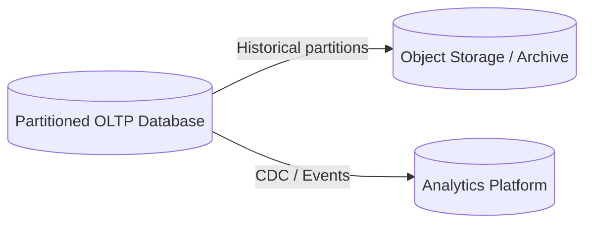

# 08- Partitioning

## Overview

Database partitioning divides one logical table into multiple smaller physical partitions while preserving the table as a single logical object from the application's perspective.

Instead of storing every row in one physical structure:

```text
orders
└── all rows
```

the database can organize the same logical table into partitions:

```text
orders
├── orders_2025
├── orders_2026
├── orders_2027
└── orders_2028
```

The application can continue querying:

```sql
SELECT *
FROM orders
WHERE created_at >= '2026-01-01';
```

while the database determines which partitions need to be accessed.

Partitioning is primarily a **data organization and query-management technique**. It can improve query performance, simplify retention and maintenance operations, and make very large tables easier to operate.

Partitioning is different from sharding:

| Characteristic | Partitioning | Sharding |
|---|---|---|
| Logical table | Usually one logical table | Often distributed across databases |
| Physical location | Usually within one database system | Multiple database instances/nodes |
| Routing | Database engine | Database engine and/or application |
| Primary goal | Manage large datasets | Scale database capacity horizontally |
| Cross-partition query | Usually transparent | Can become distributed |
| Operational complexity | Moderate | High |
| Scaling beyond one database | Limited | Primary purpose |
| Typical example | Orders partitioned by month | Tenants distributed across database shards |

Partitioning is often a useful step before introducing sharding.

---

## Why Partitioning Exists

Large tables create several operational problems.

Consider:

```text
orders
-----------------------------
1 billion rows
500 GB
10 years of history
```

A query such as:

```sql
SELECT *
FROM orders
WHERE created_at >= '2026-01-01';
```

may only need a small fraction of the data.

Without effective partitioning, the database may still need to consider a very large physical structure.

With time-based partitioning:

```text
orders
├── orders_2024
├── orders_2025
├── orders_2026
└── orders_2027
```

the database can potentially eliminate irrelevant partitions.

This is called **partition pruning**.

Partitioning can also make lifecycle operations much cheaper.

For example, deleting an entire month of historical data can become:

```sql
DROP TABLE orders_2024_01;
```

instead of:

```sql
DELETE FROM orders
WHERE created_at >= '2024-01-01'
  AND created_at < '2024-02-01';
```

The latter may generate substantial row-level work, WAL, locking, index maintenance, and vacuum pressure.

---

## When to Consider Partitioning

Partitioning becomes attractive when:

- Tables contain hundreds of millions or billions of rows.
- Queries naturally filter by a partition key.
- Historical data has a predictable lifecycle.
- Retention policies require frequent bulk deletion.
- Indexes are becoming very large.
- Maintenance operations are becoming expensive.
- Different data ranges have different operational characteristics.
- Time-based archival is required.
- Large-table vacuum or maintenance operations are becoming problematic.

Partitioning is not automatically beneficial for every large table.

A poorly chosen partition key can make the system more complicated without improving performance.

---

## How Partitioning Works

Conceptually:

```text
                    Logical Table
                       orders
                          |
             +------------+------------+
             |            |            |
             v            v            v
         Partition A  Partition B  Partition C
          2024 data    2025 data    2026 data
```

The database maintains partition metadata describing:

- Which partitions exist
- Which rows belong to each partition
- Partition boundaries
- Indexes
- Constraints
- Partition routing rules

For an insert:

```text
INSERT order
      |
      v
Partition key
      |
      v
Partition routing
      |
      v
Correct partition
```

For a query:

```text
SELECT ...
WHERE created_at >= ...
      |
      v
Partition pruning
      |
      v
Relevant partitions
      |
      v
Indexes / scans
```

The database can therefore avoid accessing partitions that cannot contain matching rows.

---

## Partitioning vs Indexing

Partitioning and indexing solve different problems.

An index helps locate rows within a table or partition.

Partitioning determines **which physical subset of data needs to be considered**.

They are often used together:

```text
                Query
                  |
                  v
           Partition pruning
                  |
        +---------+---------+
        |                   |
   Partition 1         Partition 2
        |                   |
     Index Scan         Index Scan
```

For example:

```text
orders
├── orders_2026_01
│   └── index(customer_id)
├── orders_2026_02
│   └── index(customer_id)
└── orders_2026_03
    └── index(customer_id)
```

Partitioning does not eliminate the need for appropriate indexes.

---

## Partitioning Strategies

The major partitioning strategies are:

- Range partitioning
- List partitioning
- Hash partitioning
- Composite partitioning

The choice should follow the workload rather than simply the size of the table.

| Strategy | Partition rule | Common use |
|---|---|---|
| Range | Value ranges | Time-series data |
| List | Explicit values | Region, tenant class, category |
| Hash | Hash of a key | Even distribution |
| Composite | Multiple strategies | Large multi-dimensional datasets |

---

## Range Partitioning

Range partitioning divides rows according to ordered ranges.

A common example is time-based partitioning:

```text
orders
├── 2025-01
├── 2025-02
├── 2025-03
├── ...
└── 2026-12
```

Example in PostgreSQL:

```sql
CREATE TABLE orders (
    id BIGINT NOT NULL,
    customer_id BIGINT NOT NULL,
    amount NUMERIC(12, 2) NOT NULL,
    created_at TIMESTAMPTZ NOT NULL
) PARTITION BY RANGE (created_at);
```

Create partitions:

```sql
CREATE TABLE orders_2026_01
PARTITION OF orders
FOR VALUES FROM ('2026-01-01') TO ('2026-02-01');

CREATE TABLE orders_2026_02
PARTITION OF orders
FOR VALUES FROM ('2026-02-01') TO ('2026-03-01');

CREATE TABLE orders_2026_03
PARTITION OF orders
FOR VALUES FROM ('2026-03-01') TO ('2026-04-01');
```

The upper bound is exclusive.

Therefore:

```text
2026-01-01 <= created_at < 2026-02-01
```

belongs to `orders_2026_01`.

---

## Why Time-Based Partitioning Is Common

Time is a strong partition key for workloads such as:

- Events
- Logs
- Audit records
- Transactions
- Metrics
- Orders
- Sensor data
- Financial records

These workloads commonly have:

```text
High write volume
+
Mostly recent reads
+
Predictable retention
```

For example:

```text
2024 data -> rarely accessed
2025 data -> occasional access
2026 data -> frequently accessed
```

Time-based partitioning allows the system to manage those datasets independently.

---

## Partition Pruning

Partition pruning is one of the primary performance benefits of partitioning.

Suppose:

```text
orders
├── 2024
├── 2025
├── 2026
└── 2027
```

The query:

```sql
SELECT *
FROM orders
WHERE created_at >= '2026-01-01'
  AND created_at < '2026-02-01';
```

allows the database to identify:

```text
Required:
    2026

Not required:
    2024
    2025
    2027
```

Conceptually:


Without pruning, partitioning may provide little benefit for that query.

---

## Partition Pruning Requirements

The query should expose predicates that allow the database to determine the relevant partitions.

Good:

```sql
SELECT *
FROM orders
WHERE created_at >= '2026-01-01'
  AND created_at < '2026-02-01';
```

Potentially problematic:

```sql
SELECT *
FROM orders
WHERE DATE(created_at) = '2026-01-15';
```

Depending on the database and query planner, expressions around the partition key can make pruning less effective.

A better predicate is often:

```sql
WHERE created_at >= '2026-01-15'
  AND created_at < '2026-01-16'
```

The exact behavior depends on the database engine and optimizer.

---

## List Partitioning

List partitioning assigns rows to explicit values.

For example:

```text
region = APAC
region = EU
region = US
```

PostgreSQL:

```sql
CREATE TABLE customers (
    id BIGINT NOT NULL,
    email TEXT NOT NULL,
    region TEXT NOT NULL
) PARTITION BY LIST (region);
```

Create partitions:

```sql
CREATE TABLE customers_apac
PARTITION OF customers
FOR VALUES IN ('APAC');

CREATE TABLE customers_eu
PARTITION OF customers
FOR VALUES IN ('EU');

CREATE TABLE customers_us
PARTITION OF customers
FOR VALUES IN ('US');
```

This is useful when the values have meaningful operational boundaries.

---

## List Partitioning Use Cases

Good candidates include:

- Region
- Country groups
- Tenant classes
- Business units
- Data classification
- Lifecycle states

For example:

```text
EU data
   |
   v
EU partition
```

can help with data residency requirements.

However, list partitioning can become difficult when the number of values becomes very large.

Partitioning by millions of individual customers is usually not a sensible list-partitioning strategy.

---

## Hash Partitioning

Hash partitioning distributes rows based on a hash of the partition key.

Conceptually:

```text
customer_id
     |
     v
 hash(customer_id)
     |
     +----> Partition 0
     +----> Partition 1
     +----> Partition 2
     +----> Partition 3
```

PostgreSQL example:

```sql
CREATE TABLE users (
    id BIGINT NOT NULL,
    email TEXT NOT NULL
) PARTITION BY HASH (id);
```

Create partitions:

```sql
CREATE TABLE users_p0
PARTITION OF users
FOR VALUES WITH (MODULUS 4, REMAINDER 0);

CREATE TABLE users_p1
PARTITION OF users
FOR VALUES WITH (MODULUS 4, REMAINDER 1);

CREATE TABLE users_p2
PARTITION OF users
FOR VALUES WITH (MODULUS 4, REMAINDER 2);

CREATE TABLE users_p3
PARTITION OF users
FOR VALUES WITH (MODULUS 4, REMAINDER 3);
```

Hash partitioning is useful when the primary objective is distributing rows evenly rather than supporting range-based queries.

---

## Composite Partitioning

Large systems may combine partitioning strategies.

For example:

```text
Range by month
      |
      +--> Hash by customer_id
```

Conceptually:

```text
orders_2026_01
├── hash_0
├── hash_1
├── hash_2
└── hash_3

orders_2026_02
├── hash_0
├── hash_1
├── hash_2
└── hash_3
```

This can help when:

- The table is extremely large.
- Time-based retention is required.
- A single time partition is still too large.
- Traffic within a time range is uneven.

However, composite partitioning increases operational complexity.

Do not introduce it unless the workload requires it.

---

## Choosing a Partition Key

A good partition key should align with:

- Query predicates
- Data lifecycle
- Retention policy
- Distribution
- Maintenance requirements
- Write patterns

Ask:

> What property do my largest queries and operational tasks naturally use to divide this dataset?

For event data, this is often:

```text
created_at
```

For regional data:

```text
region
```

For certain workloads:

```text
tenant_id
```

The partition key should be selected from actual access patterns, not from convenience.

---

## Partition Size

Partition size is an important operational consideration.

Too few partitions:

```text
Partition 1 -> 2 TB
Partition 2 -> 2 TB
```

may leave individual partitions difficult to maintain.

Too many partitions:

```text
10,000 partitions
```

can introduce:

- Planner overhead
- Metadata overhead
- More indexes
- More migrations
- More operational work

There is no universal ideal partition count.

A practical strategy is to choose a partition size that makes:

- Queries efficient
- Indexes manageable
- Retention easy
- Backups practical
- Maintenance predictable

---

## Partition Lifecycle

Time-based partitioning often follows a lifecycle:

```text
Future
  |
  v
Create partition
  |
  v
Active writes
  |
  v
Read-heavy
  |
  v
Archive
  |
  v
Delete
```

For example:

```text
2026-08 -> active
2026-07 -> recent
2026-06 -> historical
2025-01 -> archive
2024-01 -> delete
```

This aligns physical storage with the business data lifecycle.

---

## Automatic Partition Creation

Production systems should avoid waiting for an insert to fail because the next partition does not exist.

For example:

```text
Current partition:
2026-08

Next partition:
2026-09
```

The next partition should be created before it is needed.

A scheduled operational process can create future partitions.

Conceptually:

```text
Scheduler
   |
   v
Check partition coverage
   |
   v
Create missing partitions
   |
   v
Validate constraints
```

This process should be idempotent.

---

## Default Partitions

Some databases support a default partition for rows that do not match an explicitly defined partition.

Conceptually:

```text
orders
├── 2026_08
├── 2026_09
└── DEFAULT
```

This can protect against unexpected data values.

However, a default partition can hide partition-management failures.

For critical time-based systems, silently sending data into a default partition may make operational problems harder to detect.

If a default partition is used:

- Monitor its row count.
- Alert when it receives unexpected rows.
- Periodically reconcile its contents.
- Move valid rows into the correct partition.

---

## Indexes on Partitioned Tables

Partitioning changes how indexes should be designed.

Consider:

```text
orders
├── orders_2026_01
├── orders_2026_02
└── orders_2026_03
```

Each partition may have its own physical indexes.

For example:

```sql
CREATE INDEX idx_orders_2026_01_customer_id
ON orders_2026_01 (customer_id);
```

In PostgreSQL, indexes can also be created through the partitioned table definition, with PostgreSQL maintaining corresponding indexes on partitions.

The important operational concept is:

```text
Logical table index
        |
        v
Partition-level physical indexes
```

Index design should account for both:

- Partition pruning
- Row lookup inside the selected partition

---

## Partitioning and Primary Keys

Partitioned tables introduce important constraints around uniqueness.

Suppose:

```sql
PRIMARY KEY (id)
```

is expected to be globally unique across all partitions.

The database may require the partition key to participate in a unique constraint, depending on the database engine and partitioning model.

In PostgreSQL, a unique or primary key constraint on a partitioned table must include all columns used in the partition key.

For example, if partitioning by:

```text
created_at
```

a globally enforced unique constraint may need:

```text
(id, created_at)
```

This matters when designing identifiers.

A common production approach is to use globally unique IDs while understanding the database's exact constraint semantics.

---

## Foreign Keys and Partitioning

Partitioning is generally easier than sharding because the partitions remain part of the same database system.

Database-level referential integrity can therefore remain available, subject to the specific database engine and partitioning implementation.

For example:

```text
customers
    |
    v
orders
├── orders_2026_01
├── orders_2026_02
└── orders_2026_03
```

The database can still enforce relationships between logical tables.

This is one reason partitioning is often preferable to sharding when a single database instance can still satisfy capacity requirements.

---

## Inserts Into Partitioned Tables

Applications generally insert into the logical table:

```sql
INSERT INTO orders (
    id,
    customer_id,
    amount,
    created_at
)
VALUES (
    1001,
    42,
    149.99,
    '2026-08-23T10:30:00Z'
);
```

The database determines the target partition.

```text
INSERT
  |
  v
orders
  |
  v
Partition routing
  |
  v
orders_2026_08
```

The application does not normally need to know the physical partition name.

This is an important abstraction benefit.

---

## Query Lifecycle

A simplified partitioned query lifecycle is:

```text
Application
    |
    v
SQL Query
    |
    v
Query Parser
    |
    v
Query Planner
    |
    v
Partition Pruning
    |
    +----> Ignore irrelevant partitions
    |
    v
Relevant Partition(s)
    |
    v
Index Scan / Sequential Scan
    |
    v
Result
```

Partitioning therefore works primarily through database planner behavior.

It is not simply a physical file organization technique.

---

## Query Performance

Partitioning can improve performance when it significantly reduces the amount of data scanned.

Example:

```text
10 years of data
       |
       v
Query requests 1 month
       |
       v
Partition pruning
       |
       v
1 month scanned
```

However, partitioning can hurt performance when:

- Queries do not include the partition key.
- Too many partitions must be inspected.
- Queries fan out across many partitions.
- Partition metadata becomes large.
- Partition indexes are poorly designed.

Partitioning is therefore workload-dependent.

---

## Queries Without the Partition Key

Consider:

```sql
SELECT *
FROM orders
WHERE customer_id = 12345;
```

If the table is partitioned by:

```text
created_at
```

the database may need to inspect many partitions because it cannot determine which partition contains the customer's row.

Conceptually:

```text
customer_id = 12345
       |
       v
Partition 1
Partition 2
Partition 3
...
Partition N
```

This is partition fan-out.

If queries frequently use `customer_id`, either:

- Include an appropriate partitioning dimension.
- Use indexes within partitions.
- Reconsider the partition strategy.
- Use a different data model.

Do not partition solely based on a convenient field if the dominant query patterns do not align with it.

---

## Partition-Wise Operations

Some databases can optimize operations by executing them independently on matching partitions.

For example:

```text
orders_2026_01 JOIN customers_2026_01
orders_2026_02 JOIN customers_2026_02
orders_2026_03 JOIN customers_2026_03
```

This can reduce the amount of data involved in large analytical operations.

Partition-wise execution is database-specific and depends heavily on schema and query design.

---

## Retention and Data Deletion

Partitioning is particularly valuable for retention policies.

Without partitioning:

```sql
DELETE FROM events
WHERE created_at < NOW() - INTERVAL '90 days';
```

can create substantial work.

With time-based partitions:

```text
events
├── 2026-05
├── 2026-06
├── 2026-07
└── 2026-08
```

the old partition can be detached, archived, or dropped.

Conceptually:

```text
Old partition
     |
     +--> archive
     |
     +--> detach
     |
     +--> drop
```

Dropping a partition is typically much cheaper than deleting millions or billions of individual rows.

---

## Archival Architecture

A mature system may use:



For example:

```text
Active data
    -> PostgreSQL

Historical data
    -> S3 / archive storage

Analytics
    -> warehouse / OLAP system
```

This keeps the transactional database focused on operational workloads.

---

## Partition Maintenance

Production partitioned databases require maintenance.

Typical operations include:

- Creating future partitions
- Attaching partitions
- Detaching partitions
- Dropping expired partitions
- Creating indexes
- Reindexing
- Vacuuming
- Analyzing statistics
- Validating partition boundaries
- Monitoring partition sizes

Maintenance should be automated where possible.

---

## PostgreSQL Example

A practical event table:

```sql
CREATE TABLE events (
    id BIGINT NOT NULL,
    event_type TEXT NOT NULL,
    user_id BIGINT NOT NULL,
    payload JSONB NOT NULL,
    created_at TIMESTAMPTZ NOT NULL
) PARTITION BY RANGE (created_at);
```

Create monthly partitions:

```sql
CREATE TABLE events_2026_08
PARTITION OF events
FOR VALUES FROM ('2026-08-01') TO ('2026-09-01');

CREATE TABLE events_2026_09
PARTITION OF events
FOR VALUES FROM ('2026-09-01') TO ('2026-10-01');
```

Create an index:

```sql
CREATE INDEX idx_events_2026_08_user_id
ON events_2026_08 (user_id);
```

Query through the logical table:

```sql
SELECT id, event_type, payload
FROM events
WHERE user_id = 12345
  AND created_at >= '2026-08-01'
  AND created_at < '2026-09-01';
```

The partition predicate allows the planner to target the August partition while the `user_id` index can accelerate the row lookup.

---

## Inspecting PostgreSQL Partition Plans

Use `EXPLAIN` to verify whether partition pruning is occurring.

```sql
EXPLAIN (ANALYZE, BUFFERS)
SELECT *
FROM events
WHERE user_id = 12345
  AND created_at >= '2026-08-01'
  AND created_at < '2026-09-01';
```

Look for evidence that irrelevant partitions are not being scanned.

For production performance investigations, combine:

```text
EXPLAIN ANALYZE
+
BUFFERS
+
query latency
+
I/O metrics
+
database statistics
```

Do not assume partitioning is working simply because the table is partitioned.

Verify the execution plan.

---

## Django Considerations

Django's ORM can query partitioned database tables because the application can generally interact with the logical table.

However, Django does not make partition lifecycle management automatic.

Production concerns include:

- Creating partitions ahead of time
- Running migrations safely
- Managing indexes
- Retention automation
- Monitoring partition growth
- Testing partition boundaries
- Handling bulk operations

A common architecture is:

```text
Django
  |
  v
Logical partitioned table
  |
  +--> PostgreSQL partition 1
  +--> PostgreSQL partition 2
  +--> PostgreSQL partition 3
```

Partition-management operations may be implemented through controlled SQL migrations or dedicated operational automation.

Avoid placing complex partition lifecycle logic inside ordinary request handling.

---

## FastAPI Considerations

FastAPI is independent of the partitioning mechanism.

The application can continue using a logical table:

```text
FastAPI
   |
   v
SQLAlchemy / SQL driver
   |
   v
PostgreSQL partitioned table
```

The database remains responsible for:

- Partition routing
- Partition pruning
- Physical partition access

Application code should normally avoid hardcoding partition names.

---

## Partitioning With Microservices

Partitioning can be used inside individual microservices.

For example:

```text
Order Service
     |
     v
PostgreSQL
     |
     +--> orders_2026_01
     +--> orders_2026_02
     +--> orders_2026_03
```

Each service can independently choose its data lifecycle strategy.

This is different from sharding the entire platform.

A service may use:

```text
Partitioning
+
Read replicas
+
Redis
+
Kafka
```

without requiring application-level database sharding.

---

## Partitioning and Kafka

Kafka topics are themselves partitioned, but Kafka partitioning and database partitioning solve different problems.

Kafka:

```text
Topic
├── Partition 0
├── Partition 1
└── Partition 2
```

PostgreSQL:

```text
orders
├── 2026_01
├── 2026_02
└── 2026_03
```

Kafka partitions primarily provide:

- Parallelism
- Ordering within a partition
- Consumer scalability

Database partitions primarily provide:

- Data organization
- Partition pruning
- Lifecycle management
- Maintenance isolation

They can complement each other in event-driven architectures.

---

## Partitioning and Redis

Redis may be used as a cache in front of a partitioned database:

```text
Client
  |
  v
API
  |
  v
Redis
  |
  +---- hit ---> Response
  |
  +---- miss
        |
        v
Partitioned PostgreSQL
```

Partitioning reduces database scan scope.

Redis reduces database traffic.

They address different bottlenecks and can be combined.

---

## Partitioning and Read Replicas

Partitioning does not replace replication.

A system may use:

```text
PostgreSQL Primary
       |
       +--> Read Replica
       |
       +--> Read Replica

Primary
   |
   +--> partition_1
   +--> partition_2
   +--> partition_3
```

Partitioning manages data organization.

Replication provides:

- Read scaling
- High availability
- Disaster recovery capabilities

The two techniques are complementary.

---

## Operational Monitoring

Monitor the partitioned table as a collection of physical units.

Important metrics include:

| Metric | Why it matters |
|---|---|
| Partition size | Detects uneven growth |
| Row count | Detects unexpected distribution |
| Query latency | Measures user-facing performance |
| Partition pruning | Confirms query optimization |
| Index size | Detects storage pressure |
| Dead tuples | Indicates maintenance pressure |
| Vacuum duration | Detects maintenance problems |
| Partition count | Detects metadata growth |
| Storage growth | Capacity planning |
| Write rate | Predicts future partition growth |

Alert on abnormal conditions such as:

```text
Unexpected partition growth
Missing future partition
Default partition receiving rows
Failed retention job
Failed index creation
Unusual query fan-out
```

---

## High Availability

Partitioning itself does not provide high availability.

If the database instance fails:

```text
All partitions on that instance
        |
        v
Unavailable
```

Use database replication or managed database HA separately.

A production architecture might be:

```text
                 Application
                      |
                 PostgreSQL
                      |
             +--------+--------+
             |                 |
          Primary            Replica
             |
        +----+----+
        |    |    |
       P1   P2   P3
```

The partitions remain on the database cluster while the cluster provides HA.

---

## Disaster Recovery

Partitioned databases should have the same recovery guarantees as other production databases.

Important considerations:

- Full database backups
- Point-in-time recovery
- WAL retention
- Replica recovery
- Partition metadata
- Detached partitions
- Archived partitions
- Retention automation
- Restore testing

If old partitions are moved to object storage, the archive lifecycle must also be part of disaster recovery planning.

---

## Security Considerations

Partitioning is not an authorization mechanism.

For example:

```text
tenant A -> partition A
tenant B -> partition B
```

does not mean that application authorization can be skipped.

The application must still enforce:

```text
Authenticated identity
        |
        v
Authorization
        |
        v
Tenant access
        |
        v
Database query
```

Use:

- Least-privilege database roles
- TLS
- Encryption at rest
- Secret management
- Audit logging
- Row-level security where appropriate
- Strong tenant authorization

Do not assume that physical data organization automatically provides logical isolation.

---

## Cost Considerations

Partitioning can reduce operational cost by making retention and maintenance more efficient.

For example:

```text
DELETE billions of rows
```

may require significant:

- CPU
- I/O
- WAL
- Vacuum
- Replication bandwidth

while dropping an expired partition can be much cheaper.

However, excessive partitioning increases:

- Metadata
- Index count
- Operational automation
- Planning complexity
- Monitoring requirements

Partition count should therefore be treated as a capacity-planning parameter.

---

## Common Mistakes

### Partitioning Without a Query Strategy

Creating partitions without considering how queries access the data often provides little benefit.

Always analyze:

```text
WHERE clauses
JOIN conditions
ORDER BY
retention operations
write patterns
```

before selecting the partition key.

### Creating Too Many Partitions

A partition for every day may be appropriate for a massive event stream but unnecessary for a modest table.

Partition granularity should match:

```text
data volume
query patterns
retention requirements
maintenance workload
```

### Forgetting Future Partitions

A time-partitioned table can fail when incoming data falls outside existing partition boundaries.

Create future partitions proactively.

### Assuming Partitioning Automatically Improves Queries

A query that does not constrain the partition key may still scan many partitions.

Verify with `EXPLAIN`.

### Ignoring Indexes

Partitioning reduces the search space but does not necessarily make row lookup efficient inside a partition.

Use appropriate partition-level indexes.

### Using Expressions That Prevent Effective Pruning

Queries should expose predicates that the optimizer can use to determine partition boundaries.

### Treating Partition Names as Application Data

Avoid application logic such as:

```python
table = f"orders_{year}_{month}"
```

unless there is a compelling infrastructure-level reason.

Prefer querying the logical table and allowing the database to route rows.

### Dropping Partitions Without Archival Validation

Retention automation can permanently destroy data.

Before dropping:

- Verify retention policy.
- Confirm archival success.
- Confirm backup requirements.
- Record the operation.
- Ensure recovery procedures exist.

### Forgetting Statistics

Large partitioned tables still require accurate statistics.

Planner decisions depend on good metadata.

---

## Production Design Checklist

Before introducing partitioning:

- [ ] The table is large enough to justify partitioning.
- [ ] Query patterns have been analyzed.
- [ ] Retention requirements are understood.
- [ ] A partition key has been selected based on workload.
- [ ] Partition boundaries are clearly defined.
- [ ] Partition size has been estimated.
- [ ] Index requirements are defined.
- [ ] Primary-key and uniqueness constraints have been reviewed.
- [ ] Foreign-key behavior has been verified.
- [ ] Partition pruning has been tested.
- [ ] Queries without the partition key have been evaluated.
- [ ] Future partitions are created automatically.
- [ ] Missing-partition failures are monitored.
- [ ] Retention automation is idempotent.
- [ ] Archive workflows are defined where required.
- [ ] Partition sizes are monitored.
- [ ] Index growth is monitored.
- [ ] Vacuum and analyze behavior is understood.
- [ ] Backup and restore procedures include partitioned data.
- [ ] High availability is provided separately.
- [ ] Production query plans have been tested.
- [ ] Partition count growth is controlled.
- [ ] Operational ownership is clearly defined.

---

## Partitioning vs Sharding

Partitioning and sharding are often discussed together because both distribute data, but they operate at different architectural levels.

```text
Partitioning

PostgreSQL
├── Partition A
├── Partition B
└── Partition C
```

versus:

```text
Sharding

Application
    |
    +--> PostgreSQL Shard A
    +--> PostgreSQL Shard B
    +--> PostgreSQL Shard C
```

Partitioning is generally simpler because the database continues to manage the logical table.

Sharding introduces application-level or distributed routing and usually requires significantly more operational infrastructure.

A practical progression is often:

```text
Large table
    |
    v
Good indexes
    |
    v
Partitioning
    |
    v
Read replicas / vertical scaling
    |
    v
Sharding when required
```

The actual sequence depends on workload and database capabilities.

---

## Interview Traps

### Does Partitioning Increase Database Capacity?

Not necessarily.

Partitioning can improve data management and query efficiency, but all partitions may still reside on the same database server.

It is not equivalent to horizontal scaling across independent database nodes.

### Does Every Query Become Faster?

No.

Queries benefit when partition pruning reduces the amount of data that must be inspected.

A query that touches every partition may see little improvement or even additional overhead.

### Is Partitioning a Replacement for Indexing?

No.

Partitioning narrows the physical search space.

Indexes accelerate lookup within the relevant data.

They often work together.

### Is Partitioning the Same as Sharding?

No.

Partitioning usually operates within a database system.

Sharding distributes data across database nodes or independent database instances.

### Why Is Time Partitioning Popular?

Because many production datasets have:

```text
append-heavy writes
+
time-based queries
+
time-based retention
```

This combination makes range partitioning particularly effective.

### Why Can Partitioning Help Data Deletion?

Dropping or detaching an old partition can remove a large data range without executing individual row deletes across the entire logical table.

### What Happens If a Query Does Not Include the Partition Key?

The database may need to inspect many or all partitions.

This is known as partition fan-out and can reduce or eliminate the performance benefit.

### Does Partitioning Provide High Availability?

No.

Replication, failover, and managed database HA provide availability.

Partitioning is primarily a data organization and query-management mechanism.

---

## Key Takeaways

- **Partitioning divides a logical table into smaller physical partitions, improving manageability, partition pruning, and large-scale data lifecycle operations.**
- **The partition key must align with real query patterns, retention policies, and data distribution; partitioning without workload alignment provides limited value.**
- **Range partitioning is especially effective for time-series and retention-heavy workloads, while list and hash partitioning address different distribution requirements.**
- **Partitioning complements indexes, replication, caching, and read replicas; it does not replace them or provide horizontal database scaling by itself.**
- **Production partitioning requires automated partition lifecycle management, monitoring, constraint validation, backup/recovery procedures, and continuous verification of query plans.**