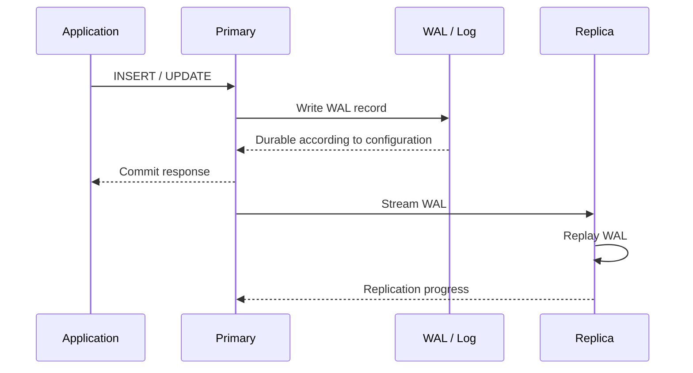
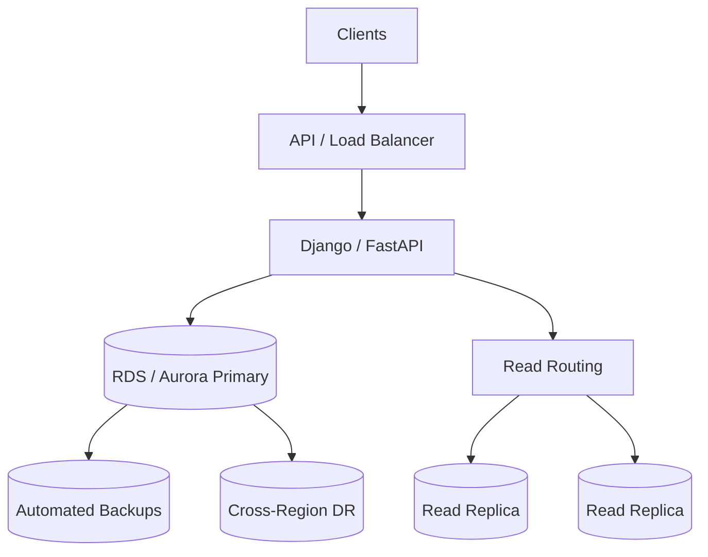

# 09- Database Replication

## Overview

Database replication is the process of maintaining copies of database data on multiple database instances or nodes.

A typical replicated architecture has one primary database handling writes and one or more replicas serving reads and/or providing failover capability:

```text
                    Application
                         |
                  +------+------+
                  |             |
                Writes         Reads
                  |             |
                  v             v
              Primary       Read Router
                  |             |
                  |       +-----+-----+
                  |       |           |
                  v       v           v
               Replica 1 Replica 2 Replica 3
```

Replication is primarily used to improve:

- High availability
- Read scalability
- Disaster recovery
- Geographic distribution
- Operational resilience

Replication does **not** automatically solve every database scalability problem. It does not make writes horizontally scalable, does not guarantee zero data loss, and does not eliminate consistency concerns.

A production architecture must explicitly define:

```text
Replication
+
Consistency
+
Failover
+
Read routing
+
Monitoring
+
Recovery
```

---

## Why Database Replication Exists

A single database instance creates a concentrated failure and capacity point:

```text
Application
     |
     v
 PostgreSQL
     |
     +--> All writes
     +--> All reads
     +--> All storage
     +--> All connections
```

If that database becomes unavailable, the application may become unavailable.

Replication introduces additional database instances:

```text
                 Primary
                    |
          +---------+---------+
          |                   |
          v                   v
      Replica 1           Replica 2
```

Now the system can potentially:

- Continue serving reads if a replica fails.
- Fail over to another node if the primary fails.
- Distribute read traffic.
- Maintain additional copies of data.
- Place replicas in different availability zones or regions.

The exact guarantees depend on the replication technology and configuration.

---

## Replication vs Backup

Replication and backups solve different problems.

| Capability | Replication | Backup |
|---|---|---|
| Protects against hardware failure | Yes | Yes |
| Protects against accidental deletion | Limited | Yes |
| Point-in-time recovery | Usually not by itself | Yes |
| Read scaling | Yes | No |
| Failover | Yes | Usually slower |
| Historical recovery | No | Yes |
| Protects from application bugs | No | Yes |
| Continuous copy | Yes | Usually no |
| Primary purpose | Availability and distribution | Recovery |

If an application executes:

```sql
DELETE FROM customers;
```

replication may faithfully reproduce that deletion on every replica.

Therefore:

> A replica is not a backup.

Production databases normally need both replication and independent backups.

---

## Replication Models

Replication can be classified in several ways.

### Primary-Replica Replication

One node accepts writes while replicas receive changes:

```text
             Primary
                |
        +-------+-------+
        |               |
        v               v
     Replica A       Replica B
```

This is common for OLTP workloads.

### Multi-Primary Replication

Multiple database nodes can accept writes:

```text
Node A <----> Node B
  ^              ^
  |              |
  +---- Node C --+
```

This can improve write availability but introduces substantially more conflict and consistency complexity.

### Synchronous Replication

The primary waits for one or more replicas to acknowledge the replicated change before considering the transaction committed.

```text
Client
  |
  v
Primary
  |
  +----> Replica
  |
  +<---- ACK
  |
  v
Commit response
```

This can provide stronger durability guarantees but increases write latency and makes availability dependent on replica health.

### Asynchronous Replication

The primary commits without waiting for replicas.

```text
Client
  |
  v
Primary
  |
  v
Commit
  |
  +----> Replica
```

This generally provides lower write latency but introduces replication lag and potential data loss during failure.

---

## Synchronous vs Asynchronous Replication

| Characteristic | Synchronous | Asynchronous |
|---|---|---|
| Write latency | Higher | Lower |
| Replica lag | Very low / bounded by acknowledgement requirement | Possible |
| Data loss on primary failure | Can be minimized | Possible |
| Availability | More sensitive to replica failures | Higher |
| Network dependency | Strong | Lower |
| Complexity | Higher | Lower |
| Typical use | Strong durability requirements | Read scaling and general HA |

A common production architecture uses asynchronous replicas for read scaling and carefully selected synchronous replication for stronger durability requirements.

---

## How Replication Works

Most relational databases replicate changes rather than repeatedly copying the entire database.

Conceptually:

```text
Application
    |
    v
Primary Database
    |
    v
Transaction Log
    |
    v
Replication Stream
    |
    +------------+------------+
    |                         |
    v                         v
Replica A                 Replica B
    |                         |
    v                         v
Apply Changes              Apply Changes
```

The transaction log may be called different things depending on the database:

| Database | Replication-related log |
|---|---|
| PostgreSQL | WAL |
| MySQL | Binary Log |
| SQL Server | Transaction Log |
| Oracle | Redo Logs |

The fundamental architecture is similar:

```text
Write
  |
  v
Durable change record
  |
  v
Replication stream
  |
  v
Replica applies change
```

---

## PostgreSQL Replication Architecture

PostgreSQL uses Write-Ahead Logging (WAL).

A simplified flow is:

```text
Application
    |
    v
PostgreSQL Primary
    |
    +--> Transaction
    |
    +--> WAL
           |
           v
      WAL Sender
           |
           v
      Network
           |
           v
      WAL Receiver
           |
           v
   PostgreSQL Replica
```

The WAL records changes required to reproduce database state.

The replica receives WAL records and replays them to reconstruct the primary's changes.

---

## WAL and Durability

Write-Ahead Logging means the database records the required change information before the corresponding data page changes are considered durable.

Conceptually:

```text
Transaction
    |
    v
WAL record
    |
    v
Durable storage
    |
    v
Data page modification
```

WAL is also fundamental to:

- Crash recovery
- Replication
- Point-in-time recovery
- Backup integration

This is why database replication is deeply connected to the database's storage engine rather than being simply an application-level copying mechanism.

---

## Replication Lifecycle

A simplified transaction lifecycle looks like:



With asynchronous replication, the application may receive the commit response before the replica has applied the change.

That distinction creates the possibility of stale reads.

---

## Replication Lag

Replication lag is the delay between a change becoming available on the primary and becoming visible on a replica.

```text
Primary:
    Order created
       |
       | 100 ms
       v
Replica:
    Order becomes visible
```

Lag can be caused by:

- Network latency
- Replica CPU saturation
- Replica I/O bottlenecks
- Large transactions
- Long-running queries
- WAL generation spikes
- Storage contention
- Replica replay bottlenecks

Replication lag is not merely a database metric.

It can become an application correctness problem.

---

## Read-After-Write Consistency

Consider:

```text
POST /orders
```

The request writes to the primary:

```text
Primary:
order_id = 1001
```

Immediately afterward:

```text
GET /orders/1001
```

If the GET is routed to a lagging replica:

```text
Primary -> order exists
Replica -> order does not exist yet
```

The user may observe:

```text
POST -> success
GET  -> 404
```

This is a classic read-after-write consistency issue.

---

## Handling Read-After-Write

Several strategies are available.

### Route Critical Reads to the Primary

For operations requiring immediate consistency:

```text
Write
  |
  v
Primary

Critical Read
  |
  v
Primary
```

### Session Stickiness

After a write, route subsequent reads from the same session to the primary for a short period.

### Replication Position Tracking

Advanced systems can track a replication position and only route a read to a replica that has caught up sufficiently.

### Accept Eventual Consistency

Some applications can tolerate:

```text
Write succeeds
     |
     v
Replica catches up
     |
     v
Read becomes consistent
```

The correct strategy depends on business requirements.

---

## Read Scaling

One of the most common reasons to introduce replicas is read scaling.

Without replicas:

```text
                 Database
                    |
        +-----------+-----------+
        |           |           |
      Read        Read        Read
```

All read traffic hits one node.

With replicas:

```text
                 Primary
                    |
        +-----------+-----------+
        |           |           |
        v           v           v
      Replica 1  Replica 2  Replica 3
        ^           ^           ^
        |           |           |
        +-----------+-----------+
                    |
                 Reads
```

This can increase read throughput.

However, the primary still handles:

- Writes
- WAL generation
- Replication work
- Often some reads
- Transaction coordination

Therefore:

> Read replicas scale reads, not writes.

---

## Read Routing

Applications need a strategy for deciding where queries should go.

A simple architecture is:

```text
Django / FastAPI
       |
       v
Database Router
       |
       +---- Writes ------> Primary
       |
       +---- Reads -------> Replica Pool
```

Possible routing strategies include:

| Strategy | Description |
|---|---|
| Primary-only | All queries use primary |
| Read replicas | Reads distributed across replicas |
| Sticky sessions | Session temporarily uses primary |
| Health-aware routing | Avoid unhealthy replicas |
| Lag-aware routing | Avoid replicas exceeding lag threshold |
| Geographic routing | Route users to nearby replicas |

Routing should be based on consistency requirements as well as load.

---

## Django Database Routing

Django supports multiple database configurations and custom database routers.

A simplified configuration may look like:

```python
DATABASES = {
    "default": {
        "ENGINE": "django.db.backends.postgresql",
        "NAME": "application",
        "HOST": "primary.db.internal",
        "PORT": 5432,
        "USER": "app",
        "PASSWORD": "secret",
    },
    "replica": {
        "ENGINE": "django.db.backends.postgresql",
        "NAME": "application",
        "HOST": "replica.db.internal",
        "PORT": 5432,
        "USER": "app",
        "PASSWORD": "secret",
    },
}
```

Application code can explicitly select a database:

```python
orders = Order.objects.using("replica").filter(
    customer_id=customer_id
)
```

For production systems, avoid scattering `.using("replica")` throughout business logic.

A database routing abstraction should make consistency decisions explicit and centralized.

---

## FastAPI and SQLAlchemy

FastAPI applications can similarly maintain separate database connection pools.

Conceptually:

```text
FastAPI
   |
   +---- Write repository ---> Primary pool
   |
   +---- Read repository ----> Replica pool
```

A service layer can expose the distinction:

```python
class OrderRepository:
    def __init__(self, primary_session, replica_session):
        self.primary_session = primary_session
        self.replica_session = replica_session

    def create(self, order):
        self.primary_session.add(order)
        self.primary_session.commit()

    def get(self, order_id):
        return self.replica_session.get(Order, order_id)
```

For operations requiring read-after-write guarantees, the repository should deliberately use the primary.

---

## Connection Pooling

Replication increases the number of database endpoints.

Without pooling:

```text
100 application workers
+
3 replicas
=
potentially large connection count
```

Each application process may establish its own database connections.

At scale, this can overwhelm the database before CPU or storage becomes the bottleneck.

Use:

- Appropriate connection pool sizes
- PgBouncer where appropriate
- Connection limits
- Health-aware routing
- Separate pools for primary and replicas

Connection capacity must be calculated across all application instances.

---

## Replication and Transactions

A transaction committed on the primary does not necessarily mean that every replica has applied it.

For asynchronous replication:

```text
BEGIN
UPDATE
COMMIT
   |
   +--> Primary durable
   |
   +--> Replica pending
```

Therefore, transaction completion and replica visibility are separate events.

Applications should not assume:

```text
COMMIT == visible everywhere
```

unless the configured replication semantics guarantee it.

---

## Long-Running Transactions

Long-running transactions can interfere with database replication and storage maintenance.

For example:

```text
Transaction starts
      |
      |----------------------------|
      |       30 minutes            |
      |----------------------------|
                                  Commit
```

Such transactions can contribute to:

- WAL retention
- Replica lag
- Vacuum delays
- Storage growth
- Recovery complexity

Monitor long-running transactions in production.

Avoid holding transactions open while performing:

- External API calls
- User interaction
- Long computations
- Network requests

---

## Large Transactions

A massive transaction can produce a large amount of WAL.

Example:

```sql
UPDATE orders
SET status = 'archived'
WHERE created_at < '2024-01-01';
```

If this touches hundreds of millions of rows, replication may experience significant pressure.

A safer strategy may be controlled batching:

```text
100,000 rows
    |
    v
Commit
    |
100,000 rows
    |
    v
Commit
    |
    ...
```

Batch size should be chosen based on:

- Transaction duration
- WAL volume
- Locking
- Replica capacity
- Application latency requirements

---

## Replication Topologies

### Primary With Multiple Replicas

```text
             Primary
           /    |    \
          /     |     \
         v      v      v
       R1       R2      R3
```

This is straightforward and common.

### Cascading Replication

A replica can stream changes to another replica:

```text
Primary
   |
   v
Replica A
   |
   v
Replica B
```

This can reduce direct replication connections from the primary.

It can also introduce additional failure and lag dependencies.

### Cross-Region Replication

```text
Region A
  Primary
     |
     v
  Replica
     |
     v
Region B
  Replica
```

This supports:

- Disaster recovery
- Geographic read access
- Regional failover

Cross-region replication is affected by network latency and bandwidth.

---

## Geographic Read Scaling

A globally distributed application may use:

```text
Users
  |
  +---- India ----> Replica APAC
  |
  +---- Europe ---> Replica EU
  |
  +---- US -------> Replica US
```

This can reduce read latency.

However, geographically distributed replicas may be stale.

The architecture must explicitly choose between:

```text
Lower latency
vs
Stronger consistency
```

Do not route consistency-sensitive operations to remote replicas simply because they are geographically close.

---

## Failover

Failover is the process of promoting a replica to become the new primary after primary failure.

Normal state:

```text
Primary
   |
   +--> Replica A
   +--> Replica B
```

Failure:

```text
Primary X

Replica A
   |
   v
Promote to Primary
```

Application traffic must then be redirected.

A production failover system typically includes:

```text
Failure detection
      |
      v
Leader election / promotion
      |
      v
Endpoint update
      |
      v
Application reconnect
      |
      v
Traffic recovery
```

---

## Failover vs Switchover

These terms should be distinguished.

**Failover** generally refers to an unplanned transition caused by failure.

**Switchover** is an intentional transition, often performed for:

- Maintenance
- Upgrades
- Infrastructure changes
- Planned migrations

A mature platform should test both.

---

## Automatic Failover

Automatic failover reduces recovery time but introduces risk.

A faulty health check can incorrectly determine that the primary has failed.

This can cause:

```text
False failure detection
       |
       v
Unnecessary promotion
       |
       v
Split-brain risk
```

Failover systems therefore need strong:

- Failure detection
- Quorum or fencing mechanisms
- Promotion rules
- Health checks
- DNS or endpoint management
- Client reconnection behavior

---

## Split Brain

Split brain occurs when multiple nodes believe they are the authoritative primary.

Conceptually:

```text
          Network partition
          /              \
         v                v
      Node A            Node B
    "I am primary"    "I am primary"
```

This is dangerous because both nodes may accept writes independently.

Potential outcomes include:

- Conflicting data
- Divergent histories
- Lost writes
- Difficult reconciliation

Production HA systems use mechanisms such as:

- Quorum
- Fencing
- Leader election
- Distributed consensus
- Managed failover orchestration

The exact mechanism depends on the database and HA platform.

---

## Replication Lag Monitoring

Replication lag should be monitored continuously.

Useful signals include:

- WAL/LSN distance
- Replica replay delay
- Replication slot growth
- Network throughput
- WAL generation rate
- Replica CPU
- Replica I/O
- Query latency
- Long-running transactions

A useful operational model is:

```text
Replication Health
        |
        +--> Transport lag
        |
        +--> Replay lag
        |
        +--> Storage lag
        |
        +--> Query-induced lag
```

A single "replica lag" number may hide the actual bottleneck.

---

## PostgreSQL Replication Monitoring

PostgreSQL exposes replication information through system views.

For example:

```sql
SELECT
    application_name,
    client_addr,
    state,
    sync_state,
    sent_lsn,
    write_lsn,
    flush_lsn,
    replay_lsn
FROM pg_stat_replication;
```

On a replica:

```sql
SELECT
    pg_is_in_recovery();
```

A result of:

```text
true
```

indicates that the server is operating as a standby/recovery node.

The exact monitoring strategy should use database-native metrics plus infrastructure-level observability.

---

## Replication Slots

PostgreSQL replication slots help ensure that required WAL is retained until a consumer has received it.

Conceptually:

```text
Primary
  |
 WAL
  |
  +----> Replica
  |
  +----> Replication Slot
```

Slots are useful but dangerous if consumers stop advancing.

A stale slot can cause:

```text
WAL retention
     |
     v
Disk growth
     |
     v
Storage exhaustion
```

Monitor replication slots continuously.

Never create replication slots without monitoring their retained WAL.

---

## Replication Security

Replication traffic should be protected like any other database traffic.

Production practices include:

- TLS for replication connections
- Strong authentication
- Restricted network access
- Dedicated replication roles
- Least privilege
- Security groups / firewall rules
- Private networking
- Secret management
- Encryption at rest

For AWS environments, place databases in private subnets and restrict security-group rules to only required application and replication traffic.

---

## Read Replica Security

Read replicas contain copies of production data.

Therefore:

```text
Replica ≠ less sensitive database
```

A replica may contain:

- Password hashes
- Customer data
- Payment-related information
- Personal data
- Internal application data

Apply the same security baseline to replicas as to the primary.

---

## Backup Strategy With Replication

A production architecture should normally combine:

```text
Primary
   |
   +--> Replicas
   |
   +--> Backup / WAL archive
```

Replicas support availability.

Backups support historical recovery.

For example:

```text
Accidental DELETE
    |
    v
Restore from backup / PITR
```

rather than relying on a replica that has already replayed the deletion.

---

## Disaster Recovery

Cross-region replication can reduce recovery time:

```text
Primary Region
      |
      v
Secondary Region
      |
      v
Standby Database
```

Important DR metrics include:

### RPO

**Recovery Point Objective** answers:

> How much data can we afford to lose?

For example:

```text
RPO = 30 seconds
```

means the architecture should aim to recover with no more than approximately 30 seconds of data loss.

### RTO

**Recovery Time Objective** answers:

> How quickly must the service recover?

For example:

```text
RTO = 5 minutes
```

requires a substantially different failover architecture than:

```text
RTO = 24 hours
```

Replication strategy should be selected based on RPO and RTO rather than simply choosing "primary + replica."

---

## AWS Architecture

A managed AWS architecture might use Amazon RDS or Aurora:



AWS-managed database services can reduce operational burden for:

- Automated backups
- Monitoring
- Failover
- Replica management
- Storage management
- Multi-AZ deployments

The application still needs to understand:

- Which endpoint represents the writer
- Which endpoints represent readers
- Read-after-write consistency
- Connection retry behavior
- Failover behavior

Managed infrastructure does not eliminate application-level consistency concerns.

---

## Multi-AZ vs Read Replica

These are often confused.

| Feature | Multi-AZ / HA Standby | Read Replica |
|---|---|---|
| Primary purpose | High availability | Read scaling |
| Read traffic | Usually not intended | Yes |
| Failover | Yes | May require promotion |
| Typical replication | Stronger HA semantics | Often asynchronous |
| Application use | Writer endpoint | Reader endpoint |
| Main benefit | Availability | Read throughput |

The exact implementation varies by AWS database service.

The key distinction is architectural intent:

```text
HA standby -> recover from failure
Read replica -> scale reads
```

---

## Application Retry Behavior

Database failover can invalidate existing connections.

Applications must handle transient database failures.

A robust application should:

- Use connection pooling.
- Detect broken connections.
- Reconnect safely.
- Retry only appropriate operations.
- Use bounded exponential backoff.
- Avoid retrying non-idempotent operations blindly.
- Respect transaction boundaries.

For example:

```text
Request
  |
  v
Database connection fails
  |
  v
Reconnect
  |
  v
Retry safe operation
  |
  v
Response
```

Do not blindly retry every database error.

A transaction may have committed before the connection failed.

Retrying a non-idempotent operation can produce duplicate effects.

---

## Idempotency During Failover

Consider:

```text
POST /payments
```

The database commits the payment, but the network connection fails before the API receives the response.

The client retries.

Without idempotency:

```text
Payment 1
Payment 2
```

may be created.

With an idempotency key:

```text
Idempotency-Key: payment-abc123
```

the service can recognize that the operation has already been processed.

Database failover therefore connects directly to API reliability design.

---

## Replication and Caching

Replication and Redis solve different problems.

```text
                 API
                  |
          +-------+-------+
          |               |
        Redis          Database
          |               |
       Cache hit       Primary
                          |
                    +-----+-----+
                    |           |
                 Replica 1   Replica 2
```

Redis:

- Reduces database reads.
- Reduces latency.
- Handles hot data efficiently.

Replication:

- Provides additional database copies.
- Supports read scaling.
- Supports HA/DR architectures.

Caching does not remove the need for database replication.

---

## Replication and Kafka

Kafka can also distribute database changes using CDC.

For example:

```text
PostgreSQL
    |
    v
CDC / WAL
    |
    v
Kafka
    |
    +----> Search Service
    +----> Analytics
    +----> Notification Service
```

This is different from database replication.

Database replication maintains another database copy.

CDC publishes database changes to downstream systems.

They may both consume the database's WAL or transaction log, but their architectural goals differ.

---

## Replication and Partitioning

Partitioning and replication are complementary.

```text
Primary
├── orders_2026_01
├── orders_2026_02
└── orders_2026_03
       |
       v
Replica
├── orders_2026_01
├── orders_2026_02
└── orders_2026_03
```

Partitioning controls data organization.

Replication controls data copies and availability.

A large production database may use both.

---

## Replication Limitations

Replication does not solve:

- Poor schema design
- Missing indexes
- Slow queries
- Excessive connection counts
- Write bottlenecks
- Lock contention
- Large transactions
- Incorrect consistency assumptions
- Application bugs
- Accidental deletes
- Poor backup strategy

A system with ten replicas and an inefficient query can still be inefficient.

Replication should be introduced as part of an overall capacity and reliability strategy.

---

## Production Failure Scenarios

### Replica Failure

```text
Primary
   |
   +--> Replica A X
   |
   +--> Replica B
```

The system can stop routing reads to Replica A.

### Primary Failure

```text
Primary X
   |
   v
Promote healthy replica
   |
   v
Update writer endpoint
   |
   v
Applications reconnect
```

### Network Partition

```text
Region A             Region B
Primary X             Replica
   |                    |
   +---- network X -----+
```

The system must avoid allowing multiple nodes to become independent writers.

### Replica Lag Spike

```text
Normal:
Primary ---> Replica
    50 ms

Failure:
Primary -----------------> Replica
           30 minutes
```

The application should stop routing consistency-sensitive reads to the lagging replica.

---

## Common Mistakes

### Treating Replicas as Backups

Replication reproduces changes, including destructive changes.

Use independent backups and point-in-time recovery.

### Sending Every Read to Replicas

Reads immediately following writes can return stale data.

Classify reads by consistency requirements.

### Ignoring Replica Lag

A replica that is minutes behind is not equivalent to a healthy replica.

Use lag-aware routing and alerts.

### Scaling Reads Without Scaling Connections

Adding replicas does not automatically solve connection exhaustion.

Connection pools must be sized across all application workers and replicas.

### Blindly Retrying Database Transactions

A network error does not prove that a transaction failed.

The transaction may have committed before the connection broke.

Use idempotency and carefully designed retry semantics.

### Assuming Failover Is Instantaneous

Failover includes:

```text
Detection
+
Promotion
+
Endpoint change
+
Connection recovery
+
Application stabilization
```

Measure actual failover time rather than assuming it.

### Ignoring Long Transactions

Long-running transactions can increase WAL retention and replica lag.

Keep transactions short and avoid external operations inside them.

### Overusing Synchronous Replication

Synchronous replication can improve durability but adds latency and availability dependencies.

Use it where the business RPO justifies the cost.

### Forgetting Replication Slots

A stalled replication slot can retain large amounts of WAL and exhaust storage.

Monitor slot retention.

---

## Monitoring and Alerting

A production monitoring strategy should include:

| Area | Metrics |
|---|---|
| Replication | Lag, WAL/LSN distance, replay position |
| Database | CPU, memory, I/O, connections |
| Storage | Disk usage, WAL growth |
| Queries | Latency, locks, slow queries |
| Transactions | Long-running transactions |
| Replication slots | Retained WAL |
| Failover | Promotion events, recovery time |
| Application | Error rate, timeout rate |
| Consistency | Read-after-write failures |

Alerts should be based on business impact where possible.

For example:

```text
Replica lag > 5 minutes
```

may be acceptable for an analytics replica but unacceptable for a user-facing transactional read replica.

---

## Production Best Practices

### Design for Explicit Consistency

Document which operations require:

```text
Strong consistency
```

and which can tolerate:

```text
Eventual consistency
```

### Keep the Writer Path Simple

Prefer:

```text
Application
    |
    v
Writer endpoint
    |
    v
Primary
```

rather than allowing arbitrary application components to decide which database node is writable.

### Make Reader Routing Health-Aware

A replica should only receive traffic when:

- It is reachable.
- It is healthy.
- It is sufficiently caught up.
- It is accepting the required workload.

### Test Failover

Regularly test:

- Primary failure
- Replica promotion
- DNS/endpoint changes
- Connection recovery
- Retry behavior
- Read routing
- Data consistency
- Application recovery

Untested failover is not reliable failover.

### Monitor Before Scaling

Identify the bottleneck first:

```text
CPU?
I/O?
Connections?
Locks?
Queries?
WAL?
Network?
```

Then decide whether replicas are the correct solution.

---

## Interview Traps

### Does Replication Make Writes Faster?

Usually no.

In a primary-replica architecture, writes still go to the primary.

Synchronous replication may actually increase write latency.

### Does a Read Replica Always Have the Latest Data?

No.

Asynchronous replicas can lag behind the primary.

### Can Read Replicas Be Used for Writes?

Normally no in a primary-replica architecture.

A promoted replica can become the new primary after failover.

### Does Replication Guarantee Zero Data Loss?

Not necessarily.

Asynchronous replication can lose transactions that were committed on the primary but not yet replicated when the primary fails.

### Why Not Make Every Replica Synchronous?

Because synchronous replication introduces latency and availability dependencies.

If the required synchronous replica cannot acknowledge the transaction, the primary may be unable to complete the write depending on configuration.

### Does Replication Replace Sharding?

No.

Replication primarily provides:

```text
Copies
+
Availability
+
Read scaling
```

Sharding primarily provides:

```text
Horizontal data distribution
+
Write/storage scaling
```

### What Happens When a Replica Is Behind?

It may return stale data.

The system should monitor lag and avoid routing consistency-sensitive reads to replicas that are too far behind.

### Why Do We Need Backups If We Have Replicas?

Because replicas reproduce changes.

A corrupted or deleted record can be replicated to every replica.

Backups provide historical recovery.

### What Is the Difference Between RPO and RTO?

```text
RPO -> How much data can be lost?
RTO -> How quickly must service recover?
```

Replication strategy should be selected based on both.

---

## Key Takeaways

- **Database replication maintains additional database copies to improve availability, read scalability, geographic resilience, and disaster recovery capabilities.**
- **Asynchronous replication introduces replication lag and eventual consistency, so read routing must account for read-after-write requirements and replica health.**
- **Replication is not a backup and does not inherently scale writes; backups, indexing, partitioning, and sharding solve different problems.**
- **Production HA requires more than replicas: failover orchestration, connection recovery, fencing, monitoring, retry safety, and tested recovery procedures are essential.**
- **Choose replication semantics based on explicit RPO, RTO, consistency, latency, and availability requirements rather than simply adding more replicas.**