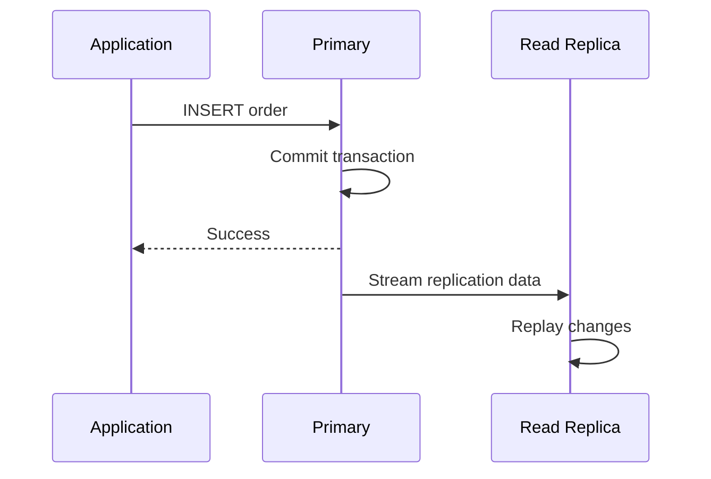
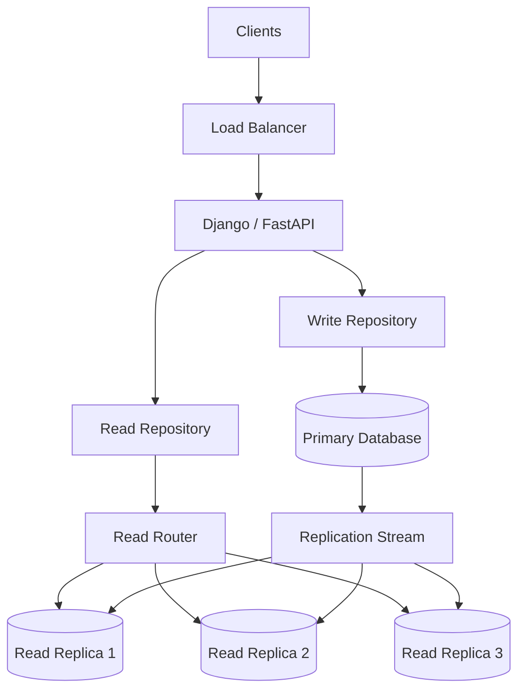

# 10- Read Replicas

## Overview

A read replica is a database instance that maintains a copy of data from a primary database and is primarily used to serve read traffic.

A common production architecture separates write and read workloads:

```text
                         Application
                              |
                    +---------+---------+
                    |                   |
                  Writes              Reads
                    |                   |
                    v                   v
                Primary           Read Router
                                      |
                           +----------+----------+
                           |          |          |
                           v          v          v
                       Replica 1  Replica 2  Replica 3
```

Read replicas are most useful when an application's workload is **read-heavy** and the primary database is becoming constrained by read queries.

They can improve:

- Read throughput
- Database availability
- Geographic read latency
- Isolation of analytical or reporting workloads
- Operational flexibility during maintenance

However, read replicas introduce an important trade-off:

> A replica may not contain the latest committed data.

This means read replicas are fundamentally connected to **replication lag, eventual consistency, read routing, failover, connection management, and application correctness**.

---

## Why Read Replicas Exist

Consider a backend application receiving:

```text
10,000 requests/second

8,500 reads
1,500 writes
```

If every operation uses one database:

```text
                    +----------------+
                    |   PostgreSQL   |
                    |    Primary     |
                    +----------------+
                         /       \
                    Reads       Writes
                    8,500       1,500
```

The database must handle all workload on one instance.

A read-replica architecture can distribute the read workload:

```text
                         Application
                              |
                 +------------+------------+
                 |                         |
               Writes                    Reads
                 |                         |
                 v                         v
             Primary                  Read Router
                                      /    |    \
                                     v     v     v
                                   R1      R2     R3
```

The primary remains responsible for writes while replicas absorb read traffic.

This is particularly effective when:

- Reads significantly outnumber writes.
- Read queries consume substantial CPU or I/O.
- The primary has enough capacity to generate and stream replication changes.
- The application can tolerate eventual consistency for some reads.

Read replicas are not a universal scaling mechanism. If the bottleneck is writes, locks, WAL generation, storage latency, or poor queries, adding read replicas may have little effect.

---

## Read Replica vs Database Replication

Replication is the underlying mechanism.

A read replica is a **database instance participating in replication and intentionally used for read workloads**.

```text
Replication
    |
    +--> Primary / standby for HA
    |
    +--> Read replicas for read scaling
    |
    +--> Cross-region replicas for DR
```

The terms are related but should not be treated as identical.

| Concept | Primary purpose |
|---|---|
| Replication | Maintain copies of database state |
| Read replica | Use a replicated copy for reads |
| HA standby | Provide failover capability |
| Backup | Historical recovery |
| Sharding | Distribute data across independent partitions |

---

## How Read Replicas Work

The primary processes transactions and produces replication data.

A simplified architecture is:

```text
Application
    |
    v
Primary Database
    |
    v
Transaction Log
    |
    v
Replication Stream
    |
    +-------------+-------------+
    |                           |
    v                           v
Replica 1                   Replica 2
    |                           |
    v                           v
Replay Changes              Replay Changes
```

For PostgreSQL, the transaction log is the **Write-Ahead Log (WAL)**.

For MySQL, replication commonly uses the **binary log**.

The important idea is:

```text
Write on primary
      |
      v
Transaction log
      |
      v
Replication transport
      |
      v
Replica replay
      |
      v
Data becomes visible on replica
```

The replica therefore does not necessarily become consistent with the primary at the exact same instant.

---

## Asynchronous Read Replicas

Most read-replica configurations use asynchronous replication.

The primary does not wait for every read replica to apply a change before returning a successful response.



This provides good write latency and allows replicas to operate independently.

The trade-off is that a replica can temporarily be behind.

---

## Replication Lag

Replication lag is the delay between a change being committed on the primary and becoming available on a replica.

For example:

```text
12:00:00.000
Primary commits order 1001

12:00:00.080
Replica receives change

12:00:00.120
Replica applies change
```

The replica has approximately 120 ms of visibility delay in this example.

Lag can become much larger under load:

```text
Normal:
Primary ---> Replica
   50 ms

High load:
Primary -----------------------> Replica
              30 seconds
```

Common causes include:

- Replica CPU saturation
- Replica disk I/O saturation
- Network congestion
- Large transactions
- High WAL generation
- Long-running queries
- Lock contention
- Insufficient replica resources
- Storage performance limitations

---

## Why Replication Lag Matters

Consider:

```http
POST /orders
```

The application writes to the primary:

```text
Primary:
order_id = 1001
```

The client then immediately requests:

```http
GET /orders/1001
```

If the GET is routed to a lagging replica:

```text
Primary:
order 1001 exists

Replica:
order 1001 not visible yet
```

The application may return:

```http
404 Not Found
```

even though the POST succeeded.

This is a **read-after-write consistency problem**.

The database is functioning correctly. The application architecture has failed to account for replication semantics.

---

## Read-After-Write Consistency

Read-after-write consistency means that after a successful write, subsequent reads should observe that write.

For example:

```text
POST /profile
      |
      v
Primary
      |
      v
200 OK
      |
      v
GET /profile
      |
      v
Expected: newly created profile
```

With an asynchronous replica:

```text
POST
 |
 v
Primary
 |
 +--> Replica still catching up
             |
             v
         GET -> stale data
```

Not every operation requires strong read-after-write consistency.

Examples that often require immediate consistency:

- Payment confirmation
- Order creation
- Account creation
- Password changes
- Permission changes
- Inventory updates
- Security-sensitive operations

Examples that may tolerate eventual consistency:

- Product recommendations
- Analytics dashboards
- Public counters
- Search results
- Activity feeds
- Reporting pages

The application should classify operations rather than blindly sending every read to replicas.

---

## Read Routing

A production application usually separates database endpoints logically:

```text
                 Application
                      |
          +-----------+-----------+
          |                       |
       Writer                    Reader
          |                       |
          v                       v
       Primary                Replica Pool
                              /    |    \
                             R1    R2    R3
```

The routing layer may be implemented using:

- Application-level routing
- Database proxies
- Managed cloud endpoints
- Service discovery
- Connection pool configuration
- ORM routing

Routing should consider:

- Query type
- Consistency requirements
- Replica health
- Replication lag
- Geographic location
- Connection availability
- Current load

---

## Primary vs Replica Query Routing

A useful policy is:

| Operation | Recommended target |
|---|---|
| INSERT | Primary |
| UPDATE | Primary |
| DELETE | Primary |
| Transaction containing writes | Primary |
| Immediate read after write | Primary |
| Authentication lookup | Usually primary or consistency-aware reader |
| Product catalog read | Replica |
| Public feed | Replica |
| Analytics | Replica |
| Reporting | Replica |
| Critical financial state | Primary |
| Background read-heavy workload | Replica |

This is not an absolute rule.

The correct decision depends on the consistency requirements of the business operation.

---

## Architecture With Read Replicas

A typical backend architecture might look like:



The application should not treat replicas as interchangeable databases without understanding their state.

---

## Django With Read Replicas

Django supports multiple databases.

A simplified configuration is:

```python
DATABASES = {
    "default": {
        "ENGINE": "django.db.backends.postgresql",
        "NAME": "application",
        "USER": "app",
        "PASSWORD": "secret",
        "HOST": "primary.db.internal",
        "PORT": 5432,
    },
    "replica": {
        "ENGINE": "django.db.backends.postgresql",
        "NAME": "application",
        "USER": "app",
        "PASSWORD": "secret",
        "HOST": "replica.db.internal",
        "PORT": 5432,
    },
}
```

A specific query can use the replica:

```python
orders = (
    Order.objects
    .using("replica")
    .filter(customer_id=customer_id)
    .order_by("-created_at")
)
```

For a consistency-sensitive read:

```python
order = Order.objects.using("default").get(pk=order_id)
```

The important architectural principle is to avoid scattering routing decisions throughout business logic.

Prefer a repository or service-level abstraction:

```text
Business Service
       |
       +--> Consistent read -> Primary
       |
       +--> Eventual read --> Replica
```

---

## Django Database Routers

Django database routers can centralize read/write routing.

A simplified router might look like:

```python
class PrimaryReplicaRouter:
    def db_for_read(self, model, **hints):
        return "replica"

    def db_for_write(self, model, **hints):
        return "default"

    def allow_relation(self, obj1, obj2, **hints):
        return True

    def allow_migrate(self, db, app_label, model_name=None, **hints):
        return db == "default"
```

This is useful for applications where most reads can tolerate eventual consistency.

However, a global policy such as:

```text
all reads -> replica
```

can be dangerous.

A newly created object may be immediately read through a replica and appear to be missing.

Consistency-sensitive workflows should have an explicit mechanism for forcing reads to the writer.

---

## FastAPI and SQLAlchemy

FastAPI applications can maintain separate connection pools.

```text
FastAPI
   |
   +---- Write Repository ---> Primary Pool
   |
   +---- Read Repository ----> Replica Pool
```

A simplified repository structure:

```python
class OrderRepository:
    def __init__(self, primary_session, replica_session):
        self.primary_session = primary_session
        self.replica_session = replica_session

    def create(self, order):
        self.primary_session.add(order)
        self.primary_session.commit()
        self.primary_session.refresh(order)
        return order

    def get(self, order_id):
        return self.replica_session.get(Order, order_id)

    def get_consistent(self, order_id):
        return self.primary_session.get(Order, order_id)
```

The application should make consistency requirements explicit rather than hiding them inside random query calls.

---

## Connection Pooling

Read replicas increase the number of possible database connections.

Suppose:

```text
20 application instances
10 workers per instance
```

A naive configuration could potentially create:

```text
20 × 10 = 200 connections
```

per database endpoint.

With three replicas plus a primary:

```text
200 × 4 = 800 potential connections
```

This can exhaust database connection capacity.

Production systems should carefully configure:

- Pool size
- Maximum overflow
- Connection lifetime
- Idle timeout
- Database connection limits
- PgBouncer or equivalent pooling where appropriate

Adding replicas does not remove the need for connection management.

---

## Read Replica Load Balancing

When multiple replicas exist, reads need to be distributed.

Possible strategies include:

### Round Robin

```text
Read 1 -> R1
Read 2 -> R2
Read 3 -> R3
Read 4 -> R1
```

Simple but unaware of replica health and lag.

### Least Connections

Route traffic toward the replica with fewer active connections.

### Latency-Based Routing

Prefer replicas responding with lower latency.

### Lag-Aware Routing

Exclude replicas exceeding a configured replication-lag threshold.

### Weighted Routing

```text
R1 -> 50%
R2 -> 30%
R3 -> 20%
```

Useful when replicas have different capacities.

In production, **health-aware and lag-aware routing** is usually more important than simple round robin.

---

## Replica Health

A replica should not receive traffic simply because its process is running.

A healthy read replica should satisfy requirements such as:

```text
Database reachable
+
Accepting queries
+
Replication active
+
Lag within threshold
+
Storage healthy
+
Sufficient capacity
```

For example:

```text
Replica A
Healthy
Lag = 50 ms
CPU = 45%
       |
       v
Eligible for reads
```

versus:

```text
Replica B
Healthy process
Lag = 15 minutes
       |
       v
Remove from critical read traffic
```

Health checks should reflect application requirements rather than process liveness alone.

---

## Read Replica Lag Monitoring

Important metrics include:

- Replication delay
- WAL/LSN distance
- Replica replay position
- CPU utilization
- Memory pressure
- Disk latency
- Disk utilization
- Network throughput
- Active connections
- Query latency
- Long-running queries
- Long-running transactions

A useful architecture is:

```text
                    Replica Monitoring
                           |
          +----------------+----------------+
          |                |                |
       Replication       Database         Infrastructure
          |                |                |
        Lag             Queries          CPU / I/O
```

Alerts should be based on workload requirements.

For example:

```text
User-facing replica:
Lag > 5 seconds -> investigate

Analytics replica:
Lag > 5 minutes -> potentially acceptable
```

There is no universal lag threshold.

---

## PostgreSQL Replica Monitoring

PostgreSQL exposes replication information through system views.

On the primary:

```sql
SELECT
    application_name,
    client_addr,
    state,
    sync_state,
    sent_lsn,
    write_lsn,
    flush_lsn,
    replay_lsn
FROM pg_stat_replication;
```

On a replica:

```sql
SELECT pg_is_in_recovery();
```

A replica can also expose recovery and WAL replay information through PostgreSQL monitoring functions and views.

The monitoring platform should collect database-native metrics alongside infrastructure metrics.

---

## Replication Slots

PostgreSQL replication slots can ensure that WAL required by a consumer is retained.

This is useful because the primary must not discard WAL before a consumer has consumed it.

However, a stalled replication slot can cause:

```text
Replica stops
      |
      v
Replication slot stops advancing
      |
      v
WAL retained
      |
      v
Disk usage increases
      |
      v
Primary storage exhaustion
```

Replication slots therefore require monitoring.

A replica that is permanently disconnected is not just a stale replica; it can become a primary-database storage risk.

---

## Read Replica Scaling

Read replicas can scale a read-heavy workload:

```text
Before:

Application
     |
     v
Primary
  100% reads/writes


After:

                 +--> Replica 1
                 |
Application --> Read Router --> Replica 2
                 |
                 +--> Replica 3

Application ------------------> Primary
                                  |
                                Writes
```

The scaling benefit depends on:

- Read/write ratio
- Query complexity
- Replica capacity
- Replication overhead
- Connection management
- Routing efficiency

If the primary spends significant resources generating WAL, replicas may not fully solve the bottleneck.

---

## Adding More Replicas

Adding replicas is not free.

Each replica consumes:

- Compute
- Memory
- Storage
- Network bandwidth
- Replication bandwidth
- Connection capacity
- Monitoring resources
- Operational complexity

For example:

```text
Primary
  |
  +--> R1
  +--> R2
  +--> R3
  +--> R4
  +--> R5
  +--> R6
```

At some point, replication fan-out itself becomes a consideration.

Possible strategies include:

- Cascading replication
- Managed database services
- Read proxies
- Regional replicas
- Workload-specific replicas

Scale based on measured bottlenecks rather than simply adding nodes.

---

## Read Replicas and Caching

Read replicas and caching address different layers of the architecture.

```text
                 Application
                     |
              +------+------+
              |             |
            Redis         Database
              |             |
          Cache hit       Primary
                            |
                     +------+------+
                     |             |
                  Replica 1     Replica 2
```

Redis is useful when:

- Data is frequently accessed.
- Data can tolerate cache semantics.
- Very low latency is required.

Read replicas are useful when:

- Data must still be queried from the database.
- The workload is read-heavy.
- The database query itself must execute.

A common production architecture uses both.

---

## Read Replicas and Search

Do not assume a read replica is a replacement for a search system.

A workload such as:

```text
Search products by:
- text relevance
- typo tolerance
- ranking
- faceting
```

may be better served by a search engine.

A read replica is still a relational database.

It can scale SQL reads, but it does not fundamentally change the database's query model.

---

## Read Replicas and Analytics

Analytics workloads can be problematic on transactional databases.

For example:

```sql
SELECT
    customer_id,
    COUNT(*),
    SUM(amount)
FROM orders
GROUP BY customer_id;
```

A large analytical query can consume:

- CPU
- Memory
- I/O
- Database connections

Running it on a read replica can protect the primary.

However, the replica still shares the same underlying data-generation and replication pipeline.

For large-scale analytics, consider:

```text
OLTP Database
      |
      v
CDC / ETL
      |
      v
Data Warehouse / Lake
```

instead of continuously scaling transactional replicas.

---

## Read Replicas and Transactions

A transaction should generally remain associated with the appropriate database connection.

For example:

```text
BEGIN
   |
   +--> UPDATE primary
   |
   +--> SELECT primary
   |
   +--> COMMIT
```

Do not assume that:

```text
write transaction -> replica read
```

will observe the same state.

An asynchronous replica may not have replayed the transaction.

For consistency-sensitive transactional workflows, keep the transaction on the primary.

---

## Read Replicas and Causal Consistency

At a more advanced level, applications sometimes need to guarantee:

```text
Write W
  |
  v
Read R must observe W
```

even when R is sent to a replica.

One approach is to track a replication position associated with the write and only use a replica that has reached that position.

Conceptually:

```text
Write
  |
  v
Primary LSN = 5000
  |
  v
Read request carries required position
  |
  +---- Replica A replayed to 4800 -> reject
  |
  +---- Replica B replayed to 5100 -> eligible
```

This is more complex than basic read routing but can provide stronger consistency without sending every read to the primary.

---

## Failover and Promotion

A read replica can sometimes be promoted to become the new primary.

Normal state:

```text
Primary
  |
  +--> Replica A
  +--> Replica B
```

After primary failure:

```text
Primary X

Replica A
    |
    v
Promote
    |
    v
New Primary
```

The exact promotion mechanism depends on the database platform.

A production system also needs to update:

- Writer endpoint
- Connection pools
- Service discovery
- DNS where applicable
- Application configuration
- Monitoring
- Replication topology

---

## Read Replica vs High Availability Standby

A read replica and an HA standby may both contain copies of database data, but their purposes differ.

| Characteristic | Read Replica | HA Standby |
|---|---|---|
| Primary goal | Read scaling | Failover |
| Serves application reads | Yes | Depends on platform |
| Promotion | Possible | Typically central to design |
| Consistency requirements | Often eventual | Usually stronger |
| Read workload | Expected | Not necessarily |
| Main optimization | Throughput | Availability |

Cloud database products may use terminology differently, so always verify the exact semantics of the service being used.

---

## AWS Read Replicas

Managed AWS database services can provide read replicas without requiring the application team to manage database replication processes directly.

A conceptual architecture is:

```text
                         Application
                              |
                   +----------+----------+
                   |                     |
                 Writer                 Reader
                   |                     |
                   v                     v
              DB Primary            Read Endpoint
                                         |
                              +----------+----------+
                              |          |          |
                              v          v          v
                             R1         R2         R3
```

AWS architectures should distinguish between:

- Multi-AZ high availability
- Read replicas
- Cross-region replicas
- Automated backups
- Point-in-time recovery

These features solve different operational problems.

---

## Cross-Region Read Replicas

Cross-region replicas can provide:

- Lower read latency for distant users
- Disaster recovery capability
- Regional resilience
- Regional data-access strategies

Example:

```text
Region A
Primary
   |
   v
Cross-Region Replica
   |
   v
Region B
```

The major trade-offs include:

- Network latency
- Replication lag
- Cross-region transfer cost
- Failover complexity
- Consistency challenges

Cross-region replicas should not be introduced solely to reduce latency without measuring whether database latency is actually the bottleneck.

---

## Disaster Recovery

A read replica can participate in a disaster recovery architecture.

Consider:

```text
Primary Region
    |
    v
Cross-Region Replica
    |
    v
Promote during regional failure
```

Two key metrics are:

### Recovery Point Objective

RPO answers:

> How much data can be lost?

For asynchronous replication:

```text
Primary commits
      |
      | replication delay
      v
Replica
```

If the primary region fails before the replica receives the latest changes, those changes may be lost.

### Recovery Time Objective

RTO answers:

> How quickly must service recover?

Failover may require:

- Replica promotion
- Endpoint changes
- Application reconnection
- Traffic redirection
- Cache handling
- Validation

Read replicas can reduce recovery time, but they do not guarantee a particular RTO by themselves.

---

## Read Replica Security

A read replica contains production data.

Therefore:

> A read replica must be treated as production data infrastructure.

Apply:

- Encryption at rest
- Encryption in transit
- Private networking
- Least-privilege database roles
- Restricted security groups
- Secret management
- Audit logging
- Access monitoring

Do not weaken security controls simply because a database instance is read-only.

---

## Read Replica Reliability

A reliable read-replica architecture should account for:

```text
Replica failure
+
Replication lag
+
Network failure
+
Primary failure
+
Connection exhaustion
+
Failover
+
Stale reads
```

The application should degrade gracefully.

For example:

```text
Replica unavailable
      |
      v
Remove from read pool
      |
      +----> Other replica
      |
      +----> Primary fallback
```

Primary fallback should be used carefully because it can overload the primary during a replica outage.

---

## Retry Behavior

Failover can invalidate existing database connections.

Applications should:

- Detect connection failures.
- Reconnect safely.
- Retry transient failures where appropriate.
- Use bounded exponential backoff.
- Avoid retrying non-idempotent operations blindly.

Consider:

```text
POST /orders
      |
      v
Primary commits
      |
      X connection fails
      |
      v
Client retries
```

If the operation is not idempotent, the retry may create duplicate data.

Use idempotency keys where appropriate.

```http
POST /orders
Idempotency-Key: 9f3d0d7a-...
```

Database failover therefore has direct implications for API design.

---

## Read Replica Capacity Planning

Before adding replicas, determine the actual bottleneck.

Measure:

| Bottleneck | Possible solution |
|---|---|
| Read CPU | Read replicas |
| Read I/O | Read replicas / indexing |
| Slow queries | Query optimization |
| Missing indexes | Indexing |
| Too many connections | Pooling / PgBouncer |
| Write CPU | Vertical scaling / sharding / workload redesign |
| Lock contention | Transaction/query redesign |
| Large analytical queries | Analytics infrastructure |
| Hot keys | Caching |
| Storage growth | Partitioning / storage scaling |
| Global latency | Regional architecture |

A read replica is appropriate only when the workload characteristics justify it.

---

## Common Mistakes

### Sending All Reads to Replicas

This can create stale-read bugs.

**Better approach:** classify reads by consistency requirement.

### Ignoring Replica Lag

A replica can be healthy but significantly behind.

**Better approach:** make replication lag part of routing and alerting decisions.

### Treating Replicas as Backups

A deleted or corrupted record can be replicated to every replica.

**Better approach:** maintain independent backups and point-in-time recovery.

### Using Round Robin Without Health Checks

Round robin can send traffic to an unhealthy or heavily lagging replica.

**Better approach:** use health-aware and preferably lag-aware routing.

### Adding Replicas Without Measuring the Bottleneck

If the workload is write-bound, additional read replicas may have little impact.

**Better approach:** identify CPU, I/O, lock, connection, query, and WAL bottlenecks first.

### Overloading the Primary During Replica Failure

If every replica fails and the application redirects all reads to the primary, the primary may become overloaded.

**Better approach:** define bounded fallback behavior and capacity-plan the primary for degraded operation.

### Using Read Replicas for Strongly Consistent Workflows

Payment state, permissions, inventory, and immediate post-write reads can be incorrect when routed to stale replicas.

**Better approach:** route consistency-sensitive operations to the primary or use a mechanism that guarantees sufficient replica freshness.

### Forgetting Connection Pool Growth

Every additional replica can increase total database connections.

**Better approach:** calculate maximum connection usage across application instances, workers, pools, and endpoints.

### Assuming Failover Is Instant

Replica promotion does not automatically guarantee that all application connections recover correctly.

**Better approach:** test the complete failover path.

### Running Heavy Analytics Indefinitely on Replicas

A reporting query can overwhelm a replica and create replication lag.

**Better approach:** isolate analytical workloads into dedicated infrastructure when necessary.

---

## Production Pitfalls

### Replica Lag During Traffic Spikes

A traffic spike may increase WAL generation and replica workload simultaneously.

```text
Traffic spike
    |
    +--> More writes
    |
    +--> More WAL
    |
    +--> More replication work
    |
    v
Replica lag increases
```

Monitor lag during load testing rather than only during normal traffic.

### Replica Becoming a Hidden Bottleneck

Moving reads away from the primary does not mean every replica has unlimited capacity.

A replica can become CPU-, memory-, I/O-, or connection-bound.

### Replica Reads Returning Different Results

A replica can temporarily return data that differs from the primary because it is behind.

Application teams must understand that this is expected under eventual consistency.

### Schema Changes

Schema migrations interact with replication.

Large or blocking migrations can create:

- Replica lag
- Lock contention
- Deployment delays
- Increased replication volume

Production schema changes should be designed with replication behavior in mind.

---

## Operational Best Practices

### Keep Read Routing Centralized

Prefer:

```text
Service
   |
   v
Database access layer
   |
   +--> Primary
   +--> Replica pool
```

rather than having arbitrary code choose database hosts.

### Monitor Replication Before Routing Traffic

Do not treat a replica as healthy solely because a TCP connection succeeds.

### Define Consistency Requirements

For each important API or workflow, explicitly identify:

```text
Can this read be stale?
How stale can it be?
Must it observe the previous write?
```

### Load Test Replica Behavior

Test:

- Normal traffic
- Peak traffic
- Replica failure
- Replica lag
- Primary failure
- Connection exhaustion
- Failover
- Recovery

### Maintain Independent Backups

Use:

```text
Primary
   |
   +--> Read replicas
   |
   +--> Backup / PITR
```

Do not rely exclusively on replicas for recovery.

### Automate Failover

Where appropriate, automate:

- Failure detection
- Promotion
- Endpoint management
- Health checks
- Connection recovery
- Traffic routing

Automation should be tested regularly.

---

## Interview Traps

### Do Read Replicas Scale Writes?

No.

They primarily scale reads.

### Are Read Replicas Always Consistent?

No.

Asynchronous replicas can lag behind the primary.

### Why Not Send Every Read to Replicas?

Because some operations require strong or read-after-write consistency.

### What Happens If a Replica Is Behind?

It may return stale data.

The application should either tolerate that staleness or route the read elsewhere.

### Are Read Replicas Backups?

No.

Replication reproduces changes. Backups provide historical recovery.

### Can a Read Replica Become the Primary?

Yes, if the database platform supports promotion and the operational architecture promotes it during failover or planned migration.

### Does Adding Ten Replicas Give Ten Times the Read Throughput?

Not necessarily.

The primary still generates replication traffic, replicas have their own resource limits, and routing, connections, network capacity, and query characteristics can become bottlenecks.

### What Is the Biggest Application-Level Problem With Read Replicas?

Usually consistency management, particularly read-after-write behavior.

---

## Key Takeaways

- **Read replicas primarily scale read workloads while the primary remains responsible for writes and replication generation.**
- **Asynchronous replicas introduce replication lag, so consistency-sensitive reads must not blindly use the replica pool.**
- **Production read routing should consider health, lag, connection capacity, workload, and consistency requirements rather than simple round robin.**
- **Read replicas complement, but do not replace, backups, indexing, caching, partitioning, sharding, and dedicated analytical infrastructure.**
- **A production-grade read-replica design must include monitoring, failure handling, connection recovery, tested failover, and explicit RPO/RTO requirements.**